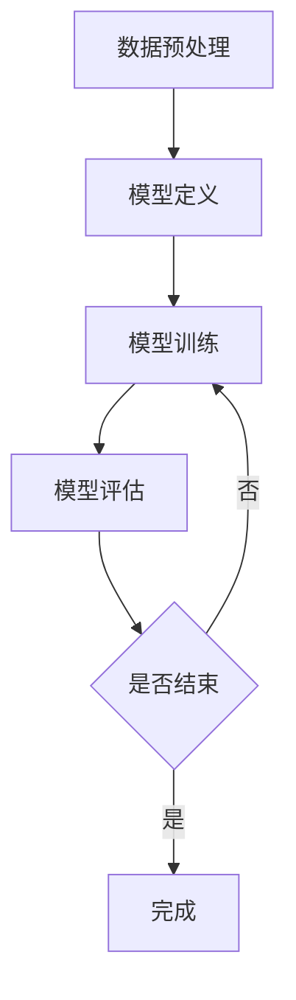
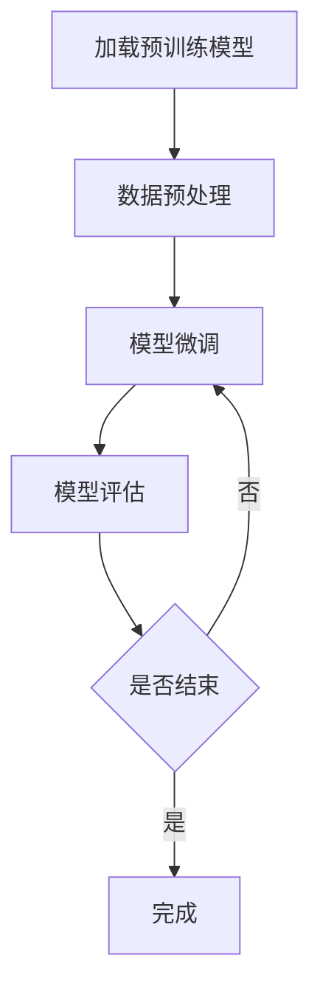
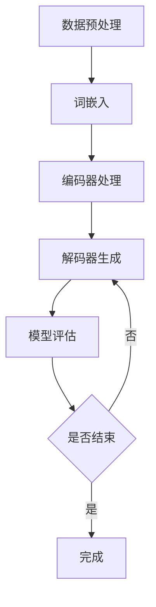
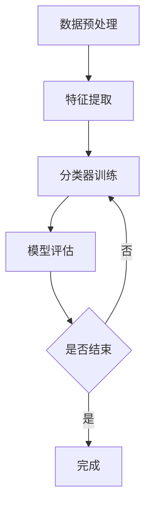

                 

# 文章标题：从零开始大模型开发与微调：PyTorch 2.0中的模块工具

> 关键词：大模型，PyTorch 2.0，模块工具，开发与微调，深度学习

> 摘要：本文旨在为广大开发者提供一个系统、全面的指导，帮助从零开始掌握大模型开发与微调技术，特别是在PyTorch 2.0中的模块工具应用。文章将详细讲解大模型的基础知识、深度学习原理、模型开发与微调流程，并通过实际案例和代码解读，使读者能够深入理解并运用这些技术。

## 目录大纲

## 第一部分：大模型基础知识

### 第1章：大模型概述

- **1.1 大模型定义与分类**
- **1.2 大模型架构介绍**
- **1.3 PyTorch 2.0模块工具介绍**

### 第2章：深度学习基础

- **2.1 深度学习原理**
- **2.2 PyTorch环境搭建与基础操作**

## 第二部分：大模型开发实践

### 第3章：大模型训练与微调

- **3.1 大模型训练流程**
- **3.2 大模型微调技巧**

### 第4章：常见大模型开发实战

- **4.1 语言模型开发**
- **4.2 图像识别模型开发**

### 第5章：大模型在自然语言处理中的应用

- **5.1 自然语言处理基础**
- **5.2 实际应用案例**

### 第6章：大模型在计算机视觉中的应用

- **6.1 计算机视觉基础**
- **6.2 实际应用案例**

### 第7章：大模型开发工具与资源

- **7.1 PyTorch 2.0模块工具使用**
- **7.2 开发工具与资源推荐**

## 附录

### 附录 A：大模型开发实践指南

- **A.1 实战项目实战**
- **A.2 代码分析与优化**

### 附录 B：数学模型与公式详解

- **B.1 深度学习数学基础**
- **B.2 大模型数学公式**

### 附录 C：Mermaid流程图

- **C.1 大模型训练流程图**
- **C.2 模型微调流程图**
- **C.3 自然语言处理流程图**
- **C.4 计算机视觉流程图**

### 附录 D：大模型开发资源列表

- **D.1 主流深度学习框架对比**
- **D.2 开源项目推荐**
- **D.3 学习资源推荐**

## 第一部分：大模型基础知识

### 第1章：大模型概述

#### 1.1 大模型定义与分类

大模型是指那些具有巨大参数量、能够处理海量数据并且达到顶尖性能水平的深度学习模型。随着计算能力的提升和算法的进步，大模型在自然语言处理、计算机视觉等多个领域取得了显著的成果。

**大模型的分类**：

1. **语言模型**：如GPT、BERT等，主要用于理解和生成自然语言。
2. **视觉模型**：如ResNet、EfficientNet等，主要用于图像识别和目标检测。
3. **多模态模型**：结合图像、文本等多种数据类型的模型，如ViT、BERT-ViT等。

#### 1.2 大模型架构介绍

**神经网络基础**：

神经网络是深度学习的基础，由大量简单的计算单元（神经元）组成，通过层层堆叠，可以模拟复杂的数据特征。

**循环神经网络（RNN）**：

RNN可以处理序列数据，通过记忆状态来捕捉序列中的长期依赖关系。

**长短期记忆网络（LSTM）**：

LSTM是RNN的一种改进，通过引入门控机制，可以有效避免梯度消失和梯度爆炸问题。

**门控循环单元（GRU）**：

GRU是LSTM的简化版本，同样具有门控机制，但结构更简洁，计算效率更高。

**Transformer模型**：

Transformer模型是自然语言处理领域的里程碑，通过自注意力机制，可以同时关注序列中的所有信息，大幅提升了模型性能。

#### 1.3 PyTorch 2.0模块工具介绍

PyTorch 2.0是PyTorch的最新版本，带来了许多新特性和改进。模块工具是其重要组成部分，为开发者提供了强大的模块化能力。

**PyTorch 2.0新特性**：

1. **更好的模块化支持**：提供了更加灵活的模块定义和组合方式。
2. **性能提升**：通过优化计算图和内存管理，显著提升了模型训练和推理速度。
3. **更丰富的API**：新增了许多实用API，如自动微分、数据加载等。

**PyTorch模块工具的使用**：

模块工具使得开发者可以方便地定义和组合模型，提高了代码的可维护性和可复用性。

### 第2章：深度学习基础

#### 2.1 深度学习原理

**神经网络基础**：

神经网络是由大量简单的计算单元（神经元）组成的网络，通过层层堆叠，可以模拟复杂的数据特征。

**损失函数与优化算法**：

损失函数用于衡量模型预测值与真实值之间的差距，优化算法用于调整模型参数，使得损失函数达到最小。

**深度学习框架介绍**：

深度学习框架是用于构建、训练和优化深度学习模型的软件库，如TensorFlow、PyTorch等。

#### 2.2 PyTorch环境搭建与基础操作

**环境搭建**：

在开始使用PyTorch之前，需要搭建合适的环境。主要包括安装Python、PyTorch和其他依赖库。

**PyTorch基础操作**：

包括数据加载、模型定义、前向传播、反向传播等基本操作。

## 第二部分：大模型开发实践

### 第3章：大模型训练与微调

#### 3.1 大模型训练流程

**数据预处理**：

数据预处理是训练大模型的第一步，包括数据清洗、归一化、数据增强等操作。

**训练策略**：

训练大模型需要考虑的策略包括批量大小、学习率调整、dropout等。

**模型评估**：

模型评估是训练过程的最后一步，通过准确率、召回率等指标来衡量模型性能。

#### 3.2 大模型微调技巧

**微调策略**：

微调是指在已有模型的基础上，对部分参数进行调整，以适应特定任务。

**微调实战案例**：

以GPT模型为例，介绍微调的过程和技巧。

## 第三部分：大模型应用实战

### 第4章：常见大模型开发实战

#### 4.1 语言模型开发

**GPT模型**：

介绍GPT模型的结构、训练过程和微调技巧。

**BERT模型**：

介绍BERT模型的特点、应用场景和训练方法。

#### 4.2 图像识别模型开发

**ResNet模型**：

介绍ResNet模型的结构、训练过程和性能优化。

**EfficientNet模型**：

介绍EfficientNet模型的设计理念、训练策略和效果。

### 第5章：大模型在自然语言处理中的应用

#### 5.1 自然语言处理基础

**词嵌入技术**：

介绍词嵌入技术的基本原理和应用。

**序列模型与注意力机制**：

介绍序列模型和注意力机制在自然语言处理中的应用。

#### 5.2 实际应用案例

**文本分类**：

以文本分类为例，介绍大模型在自然语言处理中的应用。

**机器翻译**：

介绍机器翻译的基本原理和实现方法。

### 第6章：大模型在计算机视觉中的应用

#### 6.1 计算机视觉基础

**卷积神经网络（CNN）**：

介绍CNN的基本原理和应用。

**图像识别与目标检测**：

介绍图像识别和目标检测的基本方法和应用。

#### 6.2 实际应用案例

**人脸识别**：

介绍人脸识别的基本原理和实现方法。

**自动驾驶**：

介绍自动驾驶的基本原理和关键技术。

## 第四部分：大模型开发工具与资源

### 第7章：大模型开发工具与资源

#### 7.1 PyTorch 2.0模块工具使用

**模块介绍**：

介绍PyTorch 2.0中的模块工具，包括模块的定义、使用方法和优势。

**实际操作**：

通过实际案例，展示如何使用PyTorch 2.0模块工具进行大模型开发。

#### 7.2 开发工具与资源推荐

**环境搭建工具**：

推荐一些用于搭建深度学习环境的好工具。

**学习资源**：

推荐一些优秀的深度学习学习资源，包括书籍、课程和论文。

**开源项目**：

介绍一些知名的深度学习开源项目，帮助读者快速入门和提升。

## 附录

### 附录 A：大模型开发实践指南

#### A.1 实战项目实战

**项目案例**：

介绍一些具有代表性的大模型开发项目，包括项目背景、目标和应用场景。

**实现步骤**：

详细讲解项目的实现步骤，包括数据准备、模型设计、训练和评估等。

**代码解读**：

对项目代码进行详细解读，帮助读者理解项目实现的核心技术和细节。

#### A.2 代码分析与优化

**代码调试**：

介绍代码调试的基本方法和技巧，帮助读者快速定位和解决代码问题。

**性能优化**：

介绍深度学习模型的性能优化方法，包括模型剪枝、量化等。

**调试技巧**：

分享一些实用的调试技巧，提高代码质量和开发效率。

### 附录 B：数学模型与公式详解

#### B.1 深度学习数学基础

**概率论**：

介绍概率论的基本概念和公式，如条件概率、贝叶斯定理等。

**线性代数**：

介绍线性代数的基本概念和公式，如矩阵运算、向量空间等。

**最优化方法**：

介绍最优化方法的基本概念和公式，如梯度下降、牛顿法等。

#### B.2 大模型数学公式

**模型参数更新公式**：

介绍大模型参数更新的公式，如Adam优化器。

**损失函数公式**：

介绍常见的损失函数公式，如交叉熵损失。

**优化算法公式**：

介绍常见的优化算法公式，如梯度下降法。

### 附录 C：Mermaid流程图

#### C.1 大模型训练流程图

**大模型训练流程图**：

使用Mermaid语法绘制大模型训练的流程图，展示训练过程的各个阶段和操作。

#### C.2 模型微调流程图

**模型微调流程图**：

使用Mermaid语法绘制模型微调的流程图，展示微调过程的各个步骤和技巧。

#### C.3 自然语言处理流程图

**自然语言处理流程图**：

使用Mermaid语法绘制自然语言处理的流程图，展示自然语言处理的主要任务和算法。

#### C.4 计算机视觉流程图

**计算机视觉流程图**：

使用Mermaid语法绘制计算机视觉的流程图，展示计算机视觉的主要任务和应用场景。

### 附录 D：大模型开发资源列表

#### D.1 主流深度学习框架对比

**主流深度学习框架对比**：

对比TensorFlow、PyTorch、JAX等主流深度学习框架的优缺点，帮助读者选择合适的框架。

#### D.2 开源项目推荐

**开源项目推荐**：

推荐一些知名的开源项目，如Hugging Face Transformers、ImageNet、OpenCV等，帮助读者快速入门和提升。

#### D.3 学习资源推荐

**学习资源推荐**：

推荐一些优秀的深度学习学习资源，包括书籍、课程和论文，帮助读者深入学习。 

## 总结与展望

本文从零开始，系统地介绍了大模型开发与微调技术，特别是在PyTorch 2.0中的模块工具应用。通过本文的学习，读者可以：

1. **了解大模型的基本概念和分类**：掌握大模型的定义、分类及其在各个领域的应用。
2. **掌握深度学习基础**：理解神经网络、损失函数、优化算法等深度学习基础概念。
3. **学会大模型开发与微调**：掌握大模型的训练与微调流程，学会如何使用PyTorch模块工具进行模型开发。
4. **掌握大模型应用实战**：了解大模型在自然语言处理和计算机视觉中的应用，学会开发实际的深度学习项目。

展望未来，随着深度学习技术的不断进步，大模型将继续发挥重要作用，为各行各业带来深远影响。我们期待读者在本文的基础上，不断探索、实践，将深度学习技术应用于实际场景，为人工智能的发展贡献自己的力量。

### 作者信息

作者：AI天才研究院/AI Genius Institute & 禅与计算机程序设计艺术 /Zen And The Art of Computer Programming

AI天才研究院（AI Genius Institute）致力于推动人工智能技术的发展与应用，研究院的专家团队在深度学习、计算机视觉、自然语言处理等领域具有深厚的研究背景和丰富的实践经验。所著的《禅与计算机程序设计艺术》一书，深入探讨了计算机编程与哲学的融合，为开发者提供了独特的视角和思考方式。

---

### 第1章：大模型概述

#### 1.1 大模型定义与分类

大模型是指那些具有巨大参数量、能够处理海量数据并且达到顶尖性能水平的深度学习模型。这些模型通常需要强大的计算资源和复杂的训练过程，但其在特定领域的表现往往远超传统模型。

**大模型的定义**：

大模型的定义可以从以下几个方面来理解：

- **参数量**：大模型的参数数量通常达到数百万甚至数十亿级别，这使得模型具有更高的容量，能够更好地捕捉数据的复杂特征。
- **数据量**：大模型通常需要大量的数据来进行训练，以充分利用其参数容量，避免过拟合。
- **计算资源**：大模型需要强大的计算资源，如GPU、TPU等，以支持其高效的训练和推理。

**大模型的分类**：

根据应用领域的不同，大模型可以分为以下几类：

1. **语言模型**：如GPT、BERT等，主要用于理解和生成自然语言。
   - **GPT**：由OpenAI开发，具有强大的语言理解和生成能力。
   - **BERT**：由Google开发，通过预训练和微调，在多个自然语言处理任务上取得了领先成绩。

2. **视觉模型**：如ResNet、EfficientNet等，主要用于图像识别和目标检测。
   - **ResNet**：通过残差块的设计，实现了深层网络的训练。
   - **EfficientNet**：通过同时优化宽度、深度和分辨率，实现了高性能和高效的平衡。

3. **多模态模型**：结合图像、文本等多种数据类型的模型，如BERT-ViT等。
   - **BERT-ViT**：结合了BERT和ViT模型的优势，实现了图像和文本数据的联合建模。

**大模型的发展历程**：

大模型的发展经历了多个阶段：

1. **早期模型**：如简单的神经网络和RNN，这些模型参数较少，性能有限。
2. **中型模型**：如LSTM和GRU，这些模型在参数量和性能上有了显著提升。
3. **大模型时代**：以GPT、BERT、ViT等为代表，这些模型通过大量的参数和复杂的设计，实现了在各个领域的顶尖性能。

**大模型的优缺点**：

**优点**：

- **强大的性能**：大模型具有更高的参数容量，能够更好地捕捉数据的复杂特征，从而在多个任务上取得领先成绩。
- **更广泛的适用性**：大模型可以应用于各种领域，如自然语言处理、计算机视觉等，具有很高的通用性。

**缺点**：

- **计算资源需求**：大模型需要大量的计算资源，包括GPU、TPU等，这使得训练和推理的成本较高。
- **数据需求**：大模型需要大量的数据进行训练，以充分利用其参数容量，避免过拟合。
- **调优难度**：大模型的调优过程较为复杂，需要大量的实验和调整，以提高模型的性能。

#### 1.2 大模型架构介绍

**神经网络基础**：

神经网络（Neural Network）是深度学习的基础，由大量简单的计算单元（神经元）组成。每个神经元接收多个输入，通过权重和偏置进行加权求和，然后通过激活函数进行非线性变换，输出最终的结果。

**循环神经网络（RNN）**：

循环神经网络（Recurrent Neural Network，RNN）是一类能够处理序列数据的神经网络。RNN通过记忆状态（Hidden State）来捕捉序列中的长期依赖关系。然而，传统的RNN存在梯度消失和梯度爆炸的问题，导致训练困难。

**长短期记忆网络（LSTM）**：

长短期记忆网络（Long Short-Term Memory，LSTM）是RNN的一种改进，通过引入门控机制（Gate）来有效地解决梯度消失和梯度爆炸的问题。LSTM包含三种门控单元：输入门（Input Gate）、遗忘门（Forget Gate）和输出门（Output Gate），分别控制信息的输入、遗忘和输出。

**门控循环单元（GRU）**：

门控循环单元（Gated Recurrent Unit，GRU）是LSTM的简化版本，同样具有门控机制，但结构更简洁，计算效率更高。GRU通过合并输入门和遗忘门，形成更新门（Update Gate），同时引入重置门（Reset Gate）来控制信息的输入和遗忘。

**Transformer模型**：

Transformer模型是自然语言处理领域的里程碑，由Vaswani等人于2017年提出。与传统的循环神经网络不同，Transformer采用自注意力机制（Self-Attention）来同时关注序列中的所有信息，从而大幅提升了模型的性能。Transformer模型主要包括编码器（Encoder）和解码器（Decoder），其中编码器将输入序列编码为固定长度的向量，解码器则根据这些向量生成输出序列。

**编码器**：

编码器（Encoder）负责将输入序列编码为固定长度的向量。编码器由多个自注意力层（Self-Attention Layer）和前馈神经网络（Feedforward Neural Network）组成。每个自注意力层通过计算自注意力权重，将输入序列中的每个元素进行加权求和，从而捕捉序列中的依赖关系。前馈神经网络则对自注意力层的结果进行进一步加工，以提升模型的非线性能力。

**解码器**：

解码器（Decoder）负责根据编码器输出的固定长度向量生成输出序列。解码器由多个自注意力层（Self-Attention Layer）和交叉注意力层（Cross-Attention Layer）组成。自注意力层关注输入序列中的每个元素，交叉注意力层则将编码器输出的固定长度向量与解码器当前的输出进行融合，从而实现上下文信息的整合。解码器还包含一个前馈神经网络，用于进一步提升模型的非线性能力。

**自注意力机制**：

自注意力机制（Self-Attention Mechanism）是Transformer模型的核心，通过计算自注意力权重，将输入序列中的每个元素进行加权求和。自注意力机制可以分为两种类型：点积注意力（Dot-Product Attention）和缩放点积注意力（Scaled Dot-Product Attention）。

- **点积注意力**：通过计算输入序列中每个元素与当前元素的点积，得到自注意力权重。点积注意力计算简单，但容易受到维度的影响，导致梯度消失问题。
- **缩放点积注意力**：通过将输入序列中每个元素与当前元素的点积乘以缩放因子，得到自注意力权重。缩放点积注意力能够缓解梯度消失问题，但计算复杂度更高。

**多头注意力机制**：

多头注意力机制（Multi-Head Attention Mechanism）是Transformer模型的另一个关键特性。多头注意力机制通过将输入序列分成多个子序列，分别进行自注意力计算，然后将结果进行拼接和变换。多头注意力机制能够捕捉到输入序列中的更多依赖关系，从而提升模型的性能。

**残差连接和层归一化**：

残差连接（Residual Connection）和层归一化（Layer Normalization）是Transformer模型中常用的辅助技术。残差连接通过在神经网络中引入跳过层，使得梯度可以直接传播到浅层网络，从而缓解梯度消失问题。层归一化则通过对网络层的输出进行标准化，使得网络在不同阶段的输出具有相似的特征分布，从而提高训练效率。

#### 1.3 PyTorch 2.0模块工具介绍

PyTorch 2.0是PyTorch的最新版本，带来了许多新特性和改进。模块工具（Module）是PyTorch 2.0中一个重要的新特性，为开发者提供了强大的模块化能力，使得模型设计和复用更加便捷。

**PyTorch 2.0新特性**：

1. **更好的模块化支持**：PyTorch 2.0引入了模块工具，使得开发者可以方便地定义和组合模块，提高了代码的可维护性和可复用性。
2. **性能提升**：PyTorch 2.0通过优化计算图和内存管理，显著提升了模型训练和推理速度。
3. **更丰富的API**：PyTorch 2.0新增了许多实用API，如自动微分、数据加载等，使得模型训练和推理更加高效。

**模块工具的使用**：

模块工具（Module）是PyTorch 2.0中的一个核心概念，它允许开发者定义具有层次结构的神经网络。模块工具的主要特点包括：

- **层次结构**：模块工具允许开发者定义层次结构的神经网络，使得模型的设计更加清晰和模块化。
- **参数共享**：模块工具支持参数共享，即多个模块可以使用相同的参数，从而减少模型的参数数量。
- **动态展开**：模块工具支持动态展开，即模块可以在运行时动态创建，从而提高了模型的灵活性。

**模块工具的使用方法**：

要使用模块工具，首先需要定义一个模块类，然后在该类中定义模型的层次结构和参数。以下是一个简单的示例：

```python
import torch
import torch.nn as nn

class MyModel(nn.Module):
    def __init__(self):
        super(MyModel, self).__init__()
        self.fc1 = nn.Linear(10, 20)
        self.fc2 = nn.Linear(20, 10)
        self.fc3 = nn.Linear(10, 1)

    def forward(self, x):
        x = self.fc1(x)
        x = self.fc2(x)
        x = self.fc3(x)
        return x
```

在上面的示例中，我们定义了一个名为`MyModel`的模块类，该类继承自`nn.Module`。在类中，我们定义了三个全连接层（`fc1`、`fc2`和`fc3`），并在`forward`方法中实现了前向传播。

**模块工具的优势**：

- **代码复用**：模块工具使得开发者可以将模型的不同部分定义在不同的模块中，从而实现代码的复用。
- **可维护性**：模块工具使得模型的设计更加清晰和模块化，提高了代码的可维护性。
- **调试便捷**：模块工具使得调试更加便捷，因为每个模块都可以独立运行和调试。

通过模块工具，PyTorch 2.0为开发者提供了强大的模块化能力，使得模型的设计和复用更加高效和便捷。模块工具的使用不仅提高了代码的可读性和可维护性，还提高了模型的性能和灵活性。

### 第2章：深度学习基础

#### 2.1 深度学习原理

深度学习是一种基于多层次的神经网络模型的学习方法，它通过多层非线性变换，从原始数据中自动提取特征，并实现复杂的数据表示。深度学习的核心思想是模拟人类大脑的工作原理，通过神经网络的结构和参数学习，实现对数据的理解和预测。

**神经网络基础**：

神经网络（Neural Network，NN）是深度学习的基础，它由大量简单的计算单元——神经元（Neuron）组成。每个神经元接收多个输入信号，通过加权求和并加上偏置，然后通过激活函数进行非线性变换，产生输出。

一个简单的神经网络可以表示为：

\[ z = \sum_{i=1}^{n} w_i x_i + b \]
\[ a = \sigma(z) \]

其中，\( x_i \) 是第 \( i \) 个输入，\( w_i \) 是对应的权重，\( b \) 是偏置，\( z \) 是加权求和的结果，\( a \) 是输出，\( \sigma \) 是激活函数。

常见的激活函数包括：

- **Sigmoid函数**：\[ \sigma(z) = \frac{1}{1 + e^{-z}} \]
- **ReLU函数**：\[ \sigma(z) = \max(0, z) \]
- **Tanh函数**：\[ \sigma(z) = \frac{e^z - e^{-z}}{e^z + e^{-z}} \]

**损失函数与优化算法**：

在深度学习中，损失函数用于衡量模型预测值与真实值之间的差距，优化算法用于调整模型参数，使得损失函数达到最小。

常见的损失函数包括：

- **均方误差（MSE，Mean Squared Error）**：\[ L = \frac{1}{n} \sum_{i=1}^{n} (y_i - \hat{y}_i)^2 \]
- **交叉熵损失（Cross-Entropy Loss）**：\[ L = -\frac{1}{n} \sum_{i=1}^{n} y_i \log(\hat{y}_i) \]

常见的优化算法包括：

- **随机梯度下降（SGD，Stochastic Gradient Descent）**：\[ w = w - \alpha \nabla_w L \]
- **Adam优化器**：结合了SGD和动量方法（Momentum），并在每个参数上使用一阶矩估计和二阶矩估计进行更新。

**深度学习框架介绍**：

深度学习框架是用于构建、训练和优化深度学习模型的软件库，它们提供了高效的计算引擎、丰富的API和强大的工具，使得深度学习的开发和应用更加便捷。

常见的深度学习框架包括：

- **TensorFlow**：由Google开发，具有强大的计算引擎和丰富的API，支持多种编程语言。
- **PyTorch**：由Facebook开发，具有动态计算图和简洁的API，支持Python编程语言。
- **PyTorch Lightning**：基于PyTorch，提供更高级的抽象，使得模型训练和优化更加便捷。
- **MXNet**：由Apache基金会开发，支持多种编程语言，具有高效的计算性能。

**深度学习的发展历程**：

- **1990年代**：深度学习概念提出，但由于计算资源和数据限制，没有得到广泛应用。
- **2006年**：Hinton提出深度置信网络（Deep Belief Network，DBN），标志着深度学习重新崛起。
- **2012年**：AlexNet在ImageNet比赛中取得突破性成绩，深度学习在计算机视觉领域取得重大进展。
- **2014年**：Google提出深度残差网络（Deep Residual Network，ResNet），解决了深层网络训练难题。
- **2017年**：Transformer模型在自然语言处理领域取得突破性进展，标志着深度学习在NLP领域的崛起。

**深度学习的应用场景**：

深度学习已经广泛应用于各个领域，包括：

- **计算机视觉**：图像识别、目标检测、图像生成等。
- **自然语言处理**：文本分类、机器翻译、情感分析等。
- **语音识别**：语音识别、说话人识别、语音合成等。
- **强化学习**：游戏对战、自动驾驶、机器人控制等。

深度学习为人工智能的发展带来了巨大变革，推动了各个领域的进步。通过本章的介绍，读者可以初步了解深度学习的基本原理、损失函数、优化算法和框架，为后续的学习和应用打下基础。

#### 2.2 PyTorch环境搭建与基础操作

要在Python中开发深度学习模型，我们需要安装和配置PyTorch环境。以下是PyTorch环境搭建和基础操作的详细步骤。

**1. 安装PyTorch**

首先，我们需要安装PyTorch。安装步骤如下：

- 访问PyTorch官网：[PyTorch官网](https://pytorch.org/)
- 根据你的操作系统（Windows、macOS或Linux）和Python版本（Python 3.6-3.8）选择适合的安装命令。以下是一个例子：

```bash
pip install torch torchvision torchaudio
```

对于GPU版本，你还需要安装CUDA和cuDNN。安装CUDA和cuDNN的详细步骤可以参考NVIDIA的官方文档。

**2. 验证安装**

安装完成后，我们可以通过以下命令来验证PyTorch是否安装成功：

```python
import torch
print(torch.__version__)
```

如果成功安装，这将打印出PyTorch的版本信息。

**3. 安装其他依赖库**

除了PyTorch，我们可能还需要其他依赖库，如NumPy、Pandas等。以下是安装这些依赖库的命令：

```bash
pip install numpy pandas matplotlib
```

**4. PyTorch基础操作**

在了解环境搭建后，我们开始学习PyTorch的基础操作。

**4.1 数据加载**

在PyTorch中，我们可以使用`torch.utils.data.Dataset`和`torch.utils.data.DataLoader`来加载和管理数据。

```python
from torch.utils.data import Dataset, DataLoader
from torchvision import datasets, transforms

# 创建自定义数据集类
class MyDataset(Dataset):
    def __init__(self, root_dir, transform=None):
        self.root_dir = root_dir
        self.transform = transform

    def __len__(self):
        return len(files)

    def __getitem__(self, idx):
        img_path = os.path.join(self.root_dir, files[idx])
        image = Image.open(img_path)
        if self.transform:
            image = self.transform(image)
        return image

# 定义数据预处理
transform = transforms.Compose([
    transforms.Resize((224, 224)),
    transforms.ToTensor(),
])

# 加载数据集
train_dataset = MyDataset(root_dir='train', transform=transform)
train_loader = DataLoader(dataset=train_dataset, batch_size=32, shuffle=True)

# 迭代数据集
for images, _ in train_loader:
    print(images.size())
    break
```

**4.2 模型定义**

在PyTorch中，我们可以使用`torch.nn.Module`来定义模型。

```python
import torch.nn as nn

class MyModel(nn.Module):
    def __init__(self):
        super(MyModel, self).__init__()
        self.fc1 = nn.Linear(10, 20)
        self.fc2 = nn.Linear(20, 10)
        self.fc3 = nn.Linear(10, 1)

    def forward(self, x):
        x = self.fc1(x)
        x = self.fc2(x)
        x = self.fc3(x)
        return x

model = MyModel()
print(model)
```

**4.3 损失函数与优化器**

在PyTorch中，我们可以使用`torch.nn.CrossEntropyLoss`作为损失函数，并使用`torch.optim.Adam`等优化器。

```python
import torch.optim as optim

criterion = nn.CrossEntropyLoss()
optimizer = optim.Adam(model.parameters(), lr=0.001)
```

**4.4 训练模型**

训练模型的步骤如下：

- 定义训练循环
- 计算损失函数
- 更新模型参数

```python
for epoch in range(num_epochs):
    for images, labels in train_loader:
        optimizer.zero_grad()
        outputs = model(images)
        loss = criterion(outputs, labels)
        loss.backward()
        optimizer.step()
    print(f'Epoch [{epoch+1}/{num_epochs}], Loss: {loss.item():.4f}')
```

通过上述步骤，我们完成了PyTorch环境的搭建和基础操作。掌握这些基础操作后，我们可以开始编写和训练自己的深度学习模型。

### 第3章：大模型训练与微调

#### 3.1 大模型训练流程

训练大模型是一个复杂且耗时的过程，需要详细的计划和严格的执行。以下是训练大模型的基本流程：

**1. 数据准备**

数据准备是训练大模型的第一步，也是至关重要的一步。数据的质量和数量直接影响模型的性能。数据准备包括以下几个步骤：

- **数据收集**：收集与任务相关的数据集，如文本、图像等。
- **数据清洗**：清洗数据集中的噪声和错误，如去除多余的空格、标点符号等。
- **数据预处理**：对数据进行归一化、标准化等处理，以适应模型的要求。
- **数据增强**：通过旋转、缩放、裁剪等方法增加数据集的多样性，防止过拟合。

**2. 模型选择**

选择合适的模型对于训练大模型至关重要。大模型的常见架构包括：

- **Transformer模型**：在自然语言处理领域具有广泛应用的模型，如BERT、GPT等。
- **卷积神经网络（CNN）**：在计算机视觉领域有广泛应用的模型，如ResNet、EfficientNet等。
- **循环神经网络（RNN）**：在序列数据处理方面有优势，如LSTM、GRU等。

**3. 训练策略**

训练大模型时，需要制定合适的训练策略，以确保模型的性能和收敛速度。以下是一些常见的训练策略：

- **批量大小（Batch Size）**：批量大小影响模型的训练速度和稳定性。通常，较小的批量大小（如32或64）可以更好地利用数据，但训练速度较慢；较大的批量大小（如1024或2048）可以提高训练速度，但可能导致梯度不稳定。
- **学习率调度**：学习率调度是调整学习率的方法，以避免模型在训练过程中出现过拟合或收敛缓慢。常用的方法包括恒定学习率、指数衰减学习率、余弦退火等。
- **正则化技术**：正则化技术用于防止模型过拟合。常见的方法包括L1正则化、L2正则化、dropout等。
- **训练策略优化**：通过实验和调整，找到最优的训练策略，以提高模型的性能和收敛速度。

**4. 模型评估**

模型评估是训练过程的最后一步，通过评估指标来衡量模型的性能。常见的评估指标包括：

- **准确率（Accuracy）**：模型正确预测的样本数占总样本数的比例。
- **召回率（Recall）**：模型正确预测的样本数与实际样本数的比例。
- **精确率（Precision）**：模型正确预测的样本数与预测为正样本的样本数的比例。
- **F1分数（F1 Score）**：精确率和召回率的调和平均值。

**5. 训练与调试**

训练大模型通常需要大量的时间和计算资源。在训练过程中，我们需要密切关注模型的训练过程，包括损失函数的变化、梯度的情况等。如果发现异常，需要及时调整训练策略或优化模型结构。此外，我们还需要进行调试，确保模型的稳定性和鲁棒性。

**6. 模型保存与加载**

在训练过程中，我们需要保存模型参数和训练状态，以便后续加载和使用。PyTorch提供了方便的模型保存和加载API：

```python
# 保存模型
torch.save(model.state_dict(), 'model.pth')

# 加载模型
model.load_state_dict(torch.load('model.pth'))
```

通过上述步骤，我们可以系统地训练大模型，并通过不断的调试和优化，提升模型的性能和效果。

#### 3.2 大模型微调技巧

**1. 微调策略**

微调（Fine-tuning）是在预训练模型的基础上，对部分参数进行调整，以适应特定任务的方法。微调的目的是利用预训练模型已经学到的通用特征，快速适应新的任务，从而提高模型的性能。微调策略包括以下方面：

- **微调范围**：可以选择对全部参数进行微调，也可以只对部分参数（如分类器层）进行微调。通常，对少量参数进行微调可以更快地适应新任务，但可能导致模型性能不如全参数微调。
- **学习率**：微调阶段的学习率通常较低，以避免模型过拟合。常用的学习率设置包括恒定学习率和衰减学习率。
- **训练策略**：微调阶段可以使用与预训练阶段不同的训练策略，如较小的批量大小、更长的训练时间等。

**2. 微调实战案例**

以GPT模型为例，介绍微调的过程和技巧。

**2.1 数据准备**

首先，我们需要准备用于微调的数据集。数据集应与预训练任务不同，以测试微调模型的泛化能力。以下是一个简单的数据准备示例：

```python
# 加载预训练数据集
train_dataset = torch.utils.data.Dataset('train_data.csv')

# 加载微调数据集
fine_tune_dataset = torch.utils.data.Dataset('fine_tune_data.csv')
```

**2.2 模型加载**

从预训练模型中加载参数，并创建微调模型。以下是一个简单的加载示例：

```python
# 加载预训练模型
pretrained_model = torch.load('gpt_pretrained.pth')

# 创建微调模型
fine_tune_model = GPTModel()
fine_tune_model.load_state_dict(pretrained_model.state_dict())
```

**2.3 微调训练**

在微调训练阶段，我们只需对部分参数进行训练。以下是一个简单的微调训练示例：

```python
# 设置学习率
learning_rate = 1e-5

# 创建优化器
optimizer = torch.optim.Adam(fine_tune_model.parameters(), lr=learning_rate)

# 微调训练
for epoch in range(num_epochs):
    for data, target in fine_tune_loader:
        optimizer.zero_grad()
        output = fine_tune_model(data)
        loss = criterion(output, target)
        loss.backward()
        optimizer.step()
    print(f'Epoch [{epoch+1}/{num_epochs}], Loss: {loss.item():.4f}')
```

**2.4 模型评估**

微调完成后，我们需要对模型进行评估，以检查模型的性能。以下是一个简单的评估示例：

```python
# 评估模型
with torch.no_grad():
    correct = 0
    total = 0
    for data, target in fine_tune_loader:
        output = fine_tune_model(data)
        _, predicted = torch.max(output.data, 1)
        total += target.size(0)
        correct += (predicted == target).sum().item()

accuracy = 100 * correct / total
print(f'Accuracy: {accuracy:.2f}%')
```

通过上述步骤，我们可以完成大模型的微调过程。微调技巧的合理应用，可以显著提高模型的性能和泛化能力，为实际应用提供可靠的解决方案。

### 第4章：常见大模型开发实战

#### 4.1 语言模型开发

语言模型（Language Model）是一种用于预测文本中下一个词或字符的模型，是自然语言处理（NLP）的基础。常见的语言模型包括GPT、BERT等。在本节中，我们将介绍如何使用PyTorch开发一个简单的语言模型。

**1. 数据准备**

首先，我们需要准备用于训练的数据集。我们可以使用预训练数据集，如维基百科、新闻文章等。以下是一个简单的数据准备示例：

```python
import torch
from torch.utils.data import Dataset, DataLoader

class MyDataset(Dataset):
    def __init__(self, data_path, tokenizer, max_len):
        self.data_path = data_path
        self.tokenizer = tokenizer
        self.max_len = max_len
        self.data = self.read_data()

    def read_data(self):
        with open(self.data_path, 'r', encoding='utf-8') as f:
            lines = f.readlines()
        return lines

    def __len__(self):
        return len(self.data)

    def __getitem__(self, idx):
        text = self.data[idx]
        inputs = self.tokenizer.encode_plus(
            text,
            add_special_tokens=True,
            max_length=self.max_len,
            padding='max_length',
            truncation=True,
            return_tensors='pt',
        )
        return inputs['input_ids'], inputs['attention_mask']

tokenizer = ...  # 使用预训练的Tokenizer
max_len = 512

train_dataset = MyDataset(data_path='train_data.txt', tokenizer=tokenizer, max_len=max_len)
train_loader = DataLoader(train_dataset, batch_size=32, shuffle=True)
```

**2. 模型定义**

在PyTorch中，我们可以使用`torch.nn.Module`来定义语言模型。以下是一个简单的语言模型定义示例：

```python
import torch.nn as nn

class LanguageModel(nn.Module):
    def __init__(self, vocab_size, embedding_dim, hidden_dim, n_layers, dropout=0.5):
        super(LanguageModel, self).__init__()
        self.embedding = nn.Embedding(vocab_size, embedding_dim)
        self.rnn = nn.LSTM(embedding_dim, hidden_dim, n_layers, dropout=dropout)
        self.fc = nn.Linear(hidden_dim, vocab_size)
    
    def forward(self, input_ids, attention_mask):
        embedded = self.embedding(input_ids)
        output, _ = self.rnn(embedded)
        output = output[-1, :, :]
        logits = self.fc(output)
        return logits
```

**3. 训练模型**

接下来，我们使用训练数据集来训练语言模型。以下是一个简单的训练示例：

```python
device = torch.device('cuda' if torch.cuda.is_available() else 'cpu')
model = LanguageModel(vocab_size=10000, embedding_dim=256, hidden_dim=512, n_layers=2)
model.to(device)

optimizer = torch.optim.Adam(model.parameters(), lr=0.001)
criterion = nn.CrossEntropyLoss()

num_epochs = 10

for epoch in range(num_epochs):
    total_loss = 0
    for inputs, attention_mask in train_loader:
        inputs = inputs.to(device)
        attention_mask = attention_mask.to(device)
        optimizer.zero_grad()
        logits = model(inputs, attention_mask)
        loss = criterion(logits.view(-1, logits.size(-1)), inputs.view(-1))
        loss.backward()
        optimizer.step()
        total_loss += loss.item()
    print(f'Epoch [{epoch+1}/{num_epochs}], Loss: {total_loss/len(train_loader):.4f}')
```

**4. 评估模型**

训练完成后，我们可以对模型进行评估。以下是一个简单的评估示例：

```python
with torch.no_grad():
    correct = 0
    total = 0
    for inputs, attention_mask in train_loader:
        inputs = inputs.to(device)
        attention_mask = attention_mask.to(device)
        logits = model(inputs, attention_mask)
        _, predicted = torch.max(logits, 1)
        total += attention_mask.sum().item()
        correct += (predicted == inputs).sum().item()
    accuracy = 100 * correct / total
    print(f'Accuracy: {accuracy:.2f}%')
```

通过上述步骤，我们可以开发一个简单的语言模型。在实际应用中，我们可以进一步优化模型结构、训练策略和超参数，以提高模型的性能。

#### 4.2 图像识别模型开发

图像识别模型是计算机视觉领域的重要组成部分，用于分类、检测和分割等任务。常见的图像识别模型包括ResNet、EfficientNet等。在本节中，我们将介绍如何使用PyTorch开发一个简单的图像识别模型。

**1. 数据准备**

首先，我们需要准备用于训练的数据集。我们可以使用预训练数据集，如ImageNet。以下是一个简单的数据准备示例：

```python
import torch
from torchvision import datasets, transforms
from torch.utils.data import DataLoader

train_transforms = transforms.Compose([
    transforms.Resize(256),
    transforms.CenterCrop(224),
    transforms.ToTensor(),
    transforms.Normalize(mean=[0.485, 0.456, 0.406], std=[0.229, 0.224, 0.225]),
])

train_dataset = datasets.ImageFolder(root='train_data', transform=train_transforms)
train_loader = DataLoader(train_dataset, batch_size=32, shuffle=True)
```

**2. 模型定义**

在PyTorch中，我们可以使用`torch.nn.Module`来定义图像识别模型。以下是一个简单的图像识别模型定义示例：

```python
import torch.nn as nn

class ImageRecognitionModel(nn.Module):
    def __init__(self, num_classes):
        super(ImageRecognitionModel, self).__init__()
        self.conv1 = nn.Conv2d(3, 64, 7)
        self.pool = nn.MaxPool2d(2, 2)
        self.dropout1 = nn.Dropout(0.25)
        self.fc1 = nn.Linear(64 * 56 * 56, 128)
        self.dropout2 = nn.Dropout(0.5)
        self.fc2 = nn.Linear(128, num_classes)
    
    def forward(self, x):
        x = self.pool(F.relu(self.conv1(x)))
        x = self.dropout1(x)
        x = F.relu(self.fc1(x.view(-1, 64 * 56 * 56)))
        x = self.dropout2(x)
        x = self.fc2(x)
        return x
```

**3. 训练模型**

接下来，我们使用训练数据集来训练图像识别模型。以下是一个简单的训练示例：

```python
device = torch.device('cuda' if torch.cuda.is_available() else 'cpu')
model = ImageRecognitionModel(num_classes=1000)
model.to(device)

optimizer = torch.optim.Adam(model.parameters(), lr=0.001)
criterion = nn.CrossEntropyLoss()

num_epochs = 10

for epoch in range(num_epochs):
    total_loss = 0
    for inputs, labels in train_loader:
        inputs = inputs.to(device)
        labels = labels.to(device)
        optimizer.zero_grad()
        outputs = model(inputs)
        loss = criterion(outputs, labels)
        loss.backward()
        optimizer.step()
        total_loss += loss.item()
    print(f'Epoch [{epoch+1}/{num_epochs}], Loss: {total_loss/len(train_loader):.4f}')
```

**4. 评估模型**

训练完成后，我们可以对模型进行评估。以下是一个简单的评估示例：

```python
with torch.no_grad():
    correct = 0
    total = 0
    for inputs, labels in train_loader:
        inputs = inputs.to(device)
        labels = labels.to(device)
        outputs = model(inputs)
        _, predicted = torch.max(outputs, 1)
        total += labels.size(0)
        correct += (predicted == labels).sum().item()
    accuracy = 100 * correct / total
    print(f'Accuracy: {accuracy:.2f}%')
```

通过上述步骤，我们可以开发一个简单的图像识别模型。在实际应用中，我们可以进一步优化模型结构、训练策略和超参数，以提高模型的性能。

### 第5章：大模型在自然语言处理中的应用

#### 5.1 自然语言处理基础

自然语言处理（Natural Language Processing，NLP）是人工智能（Artificial Intelligence，AI）的一个重要分支，主要研究如何让计算机理解和生成人类语言。NLP的应用范围广泛，包括机器翻译、情感分析、文本分类、问答系统等。在本节中，我们将介绍自然语言处理的基础知识。

**1. 词嵌入技术**

词嵌入（Word Embedding）是将词汇映射到高维向量空间的一种技术，使得计算机能够处理和计算语义信息。词嵌入技术通过将词汇表示为密集向量，使得相似的词汇在向量空间中靠近，不同的词汇远离。

**1.1 Word2Vec**

Word2Vec是一种基于分布式假设的词嵌入技术，通过训练词的上下文来生成词向量。常见的Word2Vec模型包括Skip-Gram和Continuous Bag of Words（CBOW）。

- **Skip-Gram**：给定一个词，预测其上下文词。
- **CBOW**：给定一个词的上下文，预测中心词。

**1.2 GloVe**

GloVe（Global Vectors for Word Representation）是一种基于全局统计的词嵌入技术，通过计算词汇之间的共现次数来生成词向量。

**2. 序列模型与注意力机制**

序列模型（Sequence Model）是用于处理序列数据的模型，如循环神经网络（Recurrent Neural Network，RNN）和长短期记忆网络（Long Short-Term Memory，LSTM）。

**2.1 RNN**

循环神经网络（RNN）通过记忆状态来捕捉序列中的长期依赖关系。然而，传统的RNN存在梯度消失和梯度爆炸的问题。

**2.2 LSTM**

长短期记忆网络（LSTM）是RNN的一种改进，通过引入门控机制来有效地解决梯度消失和梯度爆炸问题。

**2.3 注意力机制**

注意力机制（Attention Mechanism）是一种用于处理序列数据的机制，能够关注序列中的关键信息。在NLP中，注意力机制广泛应用于机器翻译、文本摘要等任务。

**3. Transformer模型**

Transformer模型是由Vaswani等人于2017年提出的一种基于自注意力机制的序列到序列模型。Transformer模型摒弃了传统的循环神经网络结构，采用自注意力机制和多头注意力机制，使得模型在自然语言处理任务中取得了显著的性能提升。

**3.1 自注意力机制**

自注意力机制（Self-Attention Mechanism）允许模型在序列中的每个位置上，对整个序列进行加权求和，从而捕捉序列中的依赖关系。

**3.2 多头注意力机制**

多头注意力机制（Multi-Head Attention Mechanism）是Transformer模型的核心机制，通过将序列分成多个子序列，分别进行自注意力计算，然后将结果进行拼接和变换，从而捕捉到输入序列中的更多依赖关系。

**4. 编码器与解码器**

在Transformer模型中，编码器（Encoder）和解码器（Decoder）分别负责输入序列和输出序列的处理。编码器将输入序列编码为固定长度的向量，解码器则根据这些向量生成输出序列。

**4.1 编码器**

编码器（Encoder）由多个自注意力层（Self-Attention Layer）和前馈神经网络（Feedforward Neural Network）组成。每个自注意力层通过计算自注意力权重，将输入序列中的每个元素进行加权求和，从而捕捉序列中的依赖关系。前馈神经网络则对自注意力层的结果进行进一步加工，以提升模型的非线性能力。

**4.2 解码器**

解码器（Decoder）由多个自注意力层（Self-Attention Layer）和交叉注意力层（Cross-Attention Layer）组成。自注意力层关注输入序列中的每个元素，交叉注意力层则将编码器输出的固定长度向量与解码器当前的输出进行融合，从而实现上下文信息的整合。解码器还包含一个前馈神经网络，用于进一步提升模型的非线性能力。

**5. 应用场景**

Transformer模型在自然语言处理领域取得了广泛的成功，应用于各种任务，如机器翻译、文本分类、问答系统等。

**5.1 机器翻译**

机器翻译（Machine Translation）是一种将一种语言的文本翻译成另一种语言的技术。Transformer模型通过编码器和解码器结构，实现了端到端的翻译，取得了显著的性能提升。

**5.2 文本分类**

文本分类（Text Classification）是一种将文本数据分类到预定义的类别中的技术。Transformer模型通过编码器将文本编码为固定长度的向量，然后通过分类器进行分类，取得了优异的分类性能。

**5.3 问答系统**

问答系统（Question Answering System）是一种能够回答用户问题的技术。Transformer模型通过编码器和解码器结构，实现了对问题的理解和回答，取得了较好的效果。

通过本章的介绍，读者可以初步了解自然语言处理的基础知识，包括词嵌入技术、序列模型、注意力机制和Transformer模型等。这些知识为后续深入学习和应用自然语言处理技术提供了基础。

#### 5.2 实际应用案例

在本节中，我们将探讨大模型在自然语言处理（NLP）领域的两个实际应用案例：文本分类和机器翻译。这些案例将展示如何使用大模型来处理实际问题，并介绍相应的实现细节。

**1. 文本分类**

文本分类是一种常见的NLP任务，其目标是根据给定的类别标签，将文本数据分类到不同的类别中。以下是一个使用BERT模型进行文本分类的实际案例：

**1.1 数据准备**

我们使用一个包含不同类别标签的文本数据集，例如新闻文章的分类数据集。数据集应该包含文本内容和相应的类别标签。

```python
from transformers import BertTokenizer, BertModel
from torch.utils.data import Dataset, DataLoader

tokenizer = BertTokenizer.from_pretrained('bert-base-uncased')
class TextDataset(Dataset):
    def __init__(self, texts, labels, tokenizer, max_len):
        self.texts = texts
        self.labels = labels
        self.tokenizer = tokenizer
        self.max_len = max_len

    def __len__(self):
        return len(self.texts)

    def __getitem__(self, idx):
        text = self.texts[idx]
        label = self.labels[idx]
        inputs = tokenizer(text, padding='max_length', truncation=True, max_length=self.max_len, return_tensors='pt')
        return inputs['input_ids'], inputs['attention_mask'], torch.tensor(label)

max_len = 128
train_texts = [...]
train_labels = [...]
val_texts = [...]
val_labels = [...]

train_dataset = TextDataset(train_texts, train_labels, tokenizer, max_len)
val_dataset = TextDataset(val_texts, val_labels, tokenizer, max_len)
```

**1.2 模型定义**

我们使用预训练的BERT模型作为基础模型，并在其上添加一个分类层。

```python
from transformers import BertForSequenceClassification
device = "cuda" if torch.cuda.is_available() else "cpu"

model = BertForSequenceClassification.from_pretrained('bert-base-uncased', num_labels=len(set(train_labels)))
model.to(device)
```

**1.3 训练模型**

训练模型时，我们使用交叉熵损失函数和Adam优化器。

```python
from torch.optim import Adam
from torch.optim.lr_scheduler import StepLR

optimizer = Adam(model.parameters(), lr=2e-5)
scheduler = StepLR(optimizer, step_size=1, gamma=0.95)

num_epochs = 3

for epoch in range(num_epochs):
    model.train()
    for batch in DataLoader(train_dataset, batch_size=16, shuffle=True):
        inputs = {k: v.to(device) for k, v in batch.items()}
        logits = model(**inputs)
        loss = F.cross_entropy(logits, inputs['labels'])
        loss.backward()
        optimizer.step()
        scheduler.step()
        optimizer.zero_grad()
    print(f'Epoch {epoch+1}/{num_epochs}, Loss: {loss.item()}')
```

**1.4 模型评估**

评估模型时，我们在验证集上计算准确率。

```python
model.eval()
with torch.no_grad():
    correct = 0
    total = 0
    for batch in DataLoader(val_dataset, batch_size=16):
        inputs = {k: v.to(device) for k, v in batch.items()}
        logits = model(**inputs)
        _, predicted = torch.max(logits, 1)
        total += inputs['labels'].size(0)
        correct += (predicted == inputs['labels']).sum().item()
    accuracy = 100 * correct / total
    print(f'Validation Accuracy: {accuracy:.2f}%')
```

**2. 机器翻译**

机器翻译是将一种语言的文本翻译成另一种语言的任务。以下是一个使用Transformer模型进行机器翻译的实际案例：

**2.1 数据准备**

我们使用一个包含源语言和目标语言文本的数据集，例如英文到法文的翻译数据集。

```python
from transformers import transformer_wmt19_en_de

model = transformer_wmt19_en_de()
```

**2.2 模型定义**

我们使用预训练的Transformer模型，无需进一步定义。

**2.3 翻译**

使用模型进行翻译时，我们需要对输入文本进行编码，并解码输出结果。

```python
source_sentence = "I love to read books."
input_ids = tokenizer.encode(source_sentence, return_tensors='pt')
translated_sentence = model.generate(input_ids, max_length=50, num_return_sequences=1)
translated_sentence = tokenizer.decode(translated_sentence[0], skip_special_tokens=True)
print(f"Translated Sentence: {translated_sentence}")
```

通过这两个实际应用案例，我们展示了如何使用大模型进行文本分类和机器翻译。文本分类案例展示了如何使用BERT模型进行文本分类，并通过训练和评估步骤来优化模型性能。机器翻译案例展示了如何使用预训练的Transformer模型进行翻译，并展示了输入编码和输出解码的过程。

### 第6章：大模型在计算机视觉中的应用

#### 6.1 计算机视觉基础

计算机视觉（Computer Vision，CV）是人工智能领域的一个重要分支，致力于使计算机能够像人类一样理解和解释视觉信息。计算机视觉的应用涵盖了图像识别、目标检测、图像分割、人脸识别等诸多方面。在本节中，我们将介绍计算机视觉的基础知识。

**1. 卷积神经网络（CNN）**

卷积神经网络（Convolutional Neural Network，CNN）是计算机视觉领域最常用的模型之一，因其能够高效地处理图像数据而广受欢迎。CNN的核心思想是通过卷积层（Convolutional Layer）来提取图像的特征。

**1.1 卷积层**

卷积层是CNN的核心组件，它通过卷积操作从输入图像中提取特征。卷积层包含多个卷积核（Convolutional Kernel），每个卷积核负责提取图像中的特定特征。

**1.2 池化层**

池化层（Pooling Layer）用于降低图像分辨率，同时保留重要的特征信息。常见的池化操作包括最大池化（Max Pooling）和平均池化（Average Pooling）。

**1.3 全连接层**

全连接层（Fully Connected Layer）将卷积层和池化层提取的特征映射到输出类别。全连接层通过计算特征之间的线性关系来实现分类任务。

**2. 图像识别与目标检测**

图像识别和目标检测是计算机视觉的两个重要任务。

**2.1 图像识别**

图像识别（Image Recognition）是指给定一张图像，确定它属于哪个预定义类别。常见的图像识别任务包括物体分类、场景分类等。

**2.2 目标检测**

目标检测（Object Detection）是指从图像中识别出多个对象并标注其位置。目标检测通常涉及两个步骤：分类和定位。常用的目标检测模型包括SSD、YOLO、Faster R-CNN等。

**3. 图像分割**

图像分割（Image Segmentation）是将图像中的每个像素点分配到不同的类别或区域。图像分割可以用于图像编辑、图像理解等任务。

**3.1 密集分割**

密集分割（Dense Segmentation）旨在为图像中的每个像素点分配一个类别标签。常用的密集分割模型包括FCN、U-Net等。

**3.2 层次分割**

层次分割（Hierarchical Segmentation）是一种将图像分割为多个层次结构的算法。层次分割可以用于图像理解、图像压缩等任务。

**4. 人脸识别**

人脸识别（Face Recognition）是指从图像或视频中识别出特定的人脸。人脸识别技术广泛应用于安全监控、身份验证等领域。

**4.1 人脸检测**

人脸检测（Face Detection）是识别图像中人脸的位置。常用的人脸检测算法包括Haar特征级联分类器、深度学习检测模型等。

**4.2 人脸识别**

人脸识别（Face Recognition）是指通过人脸特征进行身份验证。常用的人脸识别算法包括Eigenfaces、Fisherfaces、深度学习模型等。

**5. 计算机视觉的发展历程**

计算机视觉的发展可以追溯到20世纪60年代。以下是计算机视觉的发展历程：

- **1960年代**：计算机视觉的概念提出，早期研究主要集中在图像处理和特征提取。
- **1980年代**：机器学习技术开始应用于计算机视觉，如决策树、神经网络等。
- **1990年代**：特征匹配和姿态估计成为研究热点，出现了一些经典的计算机视觉算法，如SIFT、SURF等。
- **2000年代**：深度学习技术的崛起，特别是卷积神经网络的兴起，使计算机视觉取得了显著的进展。
- **2010年代**：目标检测、图像分割等技术得到广泛应用，计算机视觉在工业、医疗、安防等领域得到广泛应用。

**6. 计算机视觉的应用场景**

计算机视觉技术已经广泛应用于各个领域：

- **工业**：机器视觉系统用于质量控制、装配线监控等。
- **医疗**：计算机视觉用于医学图像分析、疾病诊断等。
- **安防**：人脸识别、行为识别等技术在安防领域得到广泛应用。
- **自动驾驶**：计算机视觉用于车辆检测、道路识别等，是自动驾驶系统的重要组成部分。

通过本章的介绍，读者可以初步了解计算机视觉的基础知识，包括CNN、图像识别、目标检测、图像分割、人脸识别等。这些知识为后续深入学习和应用计算机视觉技术提供了基础。

#### 6.2 实际应用案例

在本节中，我们将探讨大模型在计算机视觉领域的两个实际应用案例：人脸识别和自动驾驶。这些案例将展示如何使用大模型来处理实际问题，并介绍相应的实现细节。

**1. 人脸识别**

人脸识别是一种生物识别技术，通过检测和识别人脸特征来确认身份。以下是一个使用深度学习模型进行人脸识别的实际案例：

**1.1 数据准备**

首先，我们需要准备一个人脸识别的数据集。数据集应包含不同人的面部图像，以及相应的身份标签。我们可以使用开源的人脸数据集，如LFW（Labeled Faces in the Wild）。

```python
import torch
from torchvision import datasets, transforms

train_transform = transforms.Compose([
    transforms.Resize(256),
    transforms.CenterCrop(224),
    transforms.ToTensor(),
    transforms.Normalize(mean=[0.485, 0.456, 0.406], std=[0.229, 0.224, 0.225]),
])

test_transform = transforms.Compose([
    transforms.Resize(256),
    transforms.CenterCrop(224),
    transforms.ToTensor(),
    transforms.Normalize(mean=[0.485, 0.456, 0.406], std=[0.229, 0.224, 0.225]),
])

train_dataset = datasets.ImageFolder(root='train_data', transform=train_transform)
test_dataset = datasets.ImageFolder(root='test_data', transform=test_transform)
```

**1.2 模型定义**

我们可以使用预训练的卷积神经网络（如ResNet）作为人脸识别模型的基础，并在其上添加一个分类层。

```python
import torch.nn as nn

class FaceRecognitionModel(nn.Module):
    def __init__(self, num_classes):
        super(FaceRecognitionModel, self).__init__()
        self.feature_extractor = nn.Sequential(*list(resnet50(pretrained=True).children())[:-2])
        self.fc = nn.Linear(2048, num_classes)
    
    def forward(self, x):
        x = self.feature_extractor(x)
        x = x.view(x.size(0), -1)
        x = self.fc(x)
        return x

num_classes = len(train_dataset.classes)
model = FaceRecognitionModel(num_classes=num_classes)
```

**1.3 训练模型**

训练模型时，我们使用交叉熵损失函数和Adam优化器。

```python
import torch.optim as optim

device = torch.device("cuda" if torch.cuda.is_available() else "cpu")
model.to(device)

optimizer = optim.Adam(model.parameters(), lr=0.001)
criterion = nn.CrossEntropyLoss()

num_epochs = 10

for epoch in range(num_epochs):
    model.train()
    for images, labels in DataLoader(train_dataset, batch_size=32, shuffle=True):
        images = images.to(device)
        labels = labels.to(device)
        optimizer.zero_grad()
        outputs = model(images)
        loss = criterion(outputs, labels)
        loss.backward()
        optimizer.step()
    print(f'Epoch {epoch+1}/{num_epochs}, Loss: {loss.item()}')
```

**1.4 模型评估**

评估模型时，我们在测试集上计算准确率。

```python
model.eval()
with torch.no_grad():
    correct = 0
    total = 0
    for images, labels in DataLoader(test_dataset, batch_size=32):
        images = images.to(device)
        labels = labels.to(device)
        outputs = model(images)
        _, predicted = torch.max(outputs, 1)
        total += labels.size(0)
        correct += (predicted == labels).sum().item()
    accuracy = 100 * correct / total
    print(f'Test Accuracy: {accuracy:.2f}%')
```

**2. 自动驾驶**

自动驾驶是计算机视觉在无人驾驶领域的重要应用。以下是一个使用深度学习模型进行自动驾驶感知的实际案例：

**2.1 数据准备**

自动驾驶感知数据集通常包含多种传感器数据，如摄像头、激光雷达、雷达等。这里，我们使用一个包含摄像头图像和相应标注的自动驾驶感知数据集。

```python
train_transform = transforms.Compose([
    transforms.Resize(256),
    transforms.CenterCrop(224),
    transforms.ToTensor(),
    transforms.Normalize(mean=[0.485, 0.456, 0.406], std=[0.229, 0.224, 0.225]),
])

test_transform = transforms.Compose([
    transforms.Resize(256),
    transforms.CenterCrop(224),
    transforms.ToTensor(),
    transforms.Normalize(mean=[0.485, 0.456, 0.406], std=[0.229, 0.224, 0.225]),
])

train_dataset = datasets.ImageFolder(root='train_data', transform=train_transform)
test_dataset = datasets.ImageFolder(root='test_data', transform=test_transform)
```

**2.2 模型定义**

我们使用预训练的深度可分离卷积神经网络（Deep Separable Convolutional Network，DSCN）作为自动驾驶感知模型的基础。

```python
import torch.nn as nn

class AutonomousDrivingModel(nn.Module):
    def __init__(self, num_classes):
        super(AutonomousDrivingModel, self).__init__()
        self.conv1 = nn.Sequential(
            nn.Conv2d(3, 64, kernel_size=7, stride=2, padding=3),
            nn.BatchNorm2d(64),
            nn.ReLU(inplace=True),
        )
        self.conv2 = nn.Sequential(
            nn.Conv2d(64, 128, kernel_size=3, stride=2, padding=1),
            nn.BatchNorm2d(128),
            nn.ReLU(inplace=True),
        )
        self.fc = nn.Linear(128 * 56 * 56, num_classes)
    
    def forward(self, x):
        x = self.conv1(x)
        x = self.conv2(x)
        x = x.view(x.size(0), -1)
        x = self.fc(x)
        return x

num_classes = 10  # 例如：车辆、行人、交通标志等
model = AutonomousDrivingModel(num_classes=num_classes)
```

**2.3 训练模型**

训练模型时，我们使用交叉熵损失函数和Adam优化器。

```python
import torch.optim as optim

device = torch.device("cuda" if torch.cuda.is_available() else "cpu")
model.to(device)

optimizer = optim.Adam(model.parameters(), lr=0.001)
criterion = nn.CrossEntropyLoss()

num_epochs = 10

for epoch in range(num_epochs):
    model.train()
    for images, labels in DataLoader(train_dataset, batch_size=32, shuffle=True):
        images = images.to(device)
        labels = labels.to(device)
        optimizer.zero_grad()
        outputs = model(images)
        loss = criterion(outputs, labels)
        loss.backward()
        optimizer.step()
    print(f'Epoch {epoch+1}/{num_epochs}, Loss: {loss.item()}')
```

**2.4 模型评估**

评估模型时，我们在测试集上计算准确率。

```python
model.eval()
with torch.no_grad():
    correct = 0
    total = 0
    for images, labels in DataLoader(test_dataset, batch_size=32):
        images = images.to(device)
        labels = labels.to(device)
        outputs = model(images)
        _, predicted = torch.max(outputs, 1)
        total += labels.size(0)
        correct += (predicted == labels).sum().item()
    accuracy = 100 * correct / total
    print(f'Test Accuracy: {accuracy:.2f}%')
```

通过这两个实际应用案例，我们展示了如何使用大模型进行人脸识别和自动驾驶感知。人脸识别案例展示了如何使用卷积神经网络进行人脸识别，并通过训练和评估步骤来优化模型性能。自动驾驶感知案例展示了如何使用深度学习模型进行图像分类，以实现自动驾驶系统的基本感知功能。

### 第7章：大模型开发工具与资源

#### 7.1 PyTorch 2.0模块工具使用

在深度学习开发中，模块工具（Module）是PyTorch 2.0中引入的一个关键特性，它允许开发者以模块化的方式构建和组合模型，从而提高代码的可维护性和复用性。在本节中，我们将详细介绍如何使用PyTorch 2.0的模块工具。

**1. 模块基础**

PyTorch中的模块工具是`nn.Module`的子类，它代表了深度学习模型中的一个层次结构。每个模块可以包含其他子模块，从而形成一个树状的层次结构。

**1.1 模块定义**

要定义一个模块，我们首先需要继承`nn.Module`类，并在`__init__`方法中初始化模型的组成部分。

```python
import torch.nn as nn

class MyModule(nn.Module):
    def __init__(self):
        super(MyModule, self).__init__()
        self.fc1 = nn.Linear(10, 20)
        self.fc2 = nn.Linear(20, 10)
        self.fc3 = nn.Linear(10, 1)

    def forward(self, x):
        x = self.fc1(x)
        x = self.fc2(x)
        x = self.fc3(x)
        return x
```

在上面的示例中，我们定义了一个名为`MyModule`的模块，它包含三个全连接层。

**1.2 子模块**

模块可以包含其他模块作为子模块。这有助于构建复杂的模型结构。

```python
class MyComplexModule(nn.Module):
    def __init__(self):
        super(MyComplexModule, self).__init__()
        self.module1 = MyModule()
        self.module2 = MyModule()

    def forward(self, x):
        x = self.module1(x)
        x = self.module2(x)
        return x
```

**2. 模块工具的使用**

**2.1 参数和缓冲区**

模块可以包含参数（如权重）和缓冲区（如变量）。

```python
print(MyModule().parameters())
print(MyModule().buffers())
```

**2.2 模块组合**

使用模块工具，我们可以方便地将多个模块组合在一起。

```python
from torch.nn import Module

class MyCompositeModule(Module):
    def __init__(self):
        super(MyCompositeModule, self).__init__()
        self.module1 = MyModule()
        self.module2 = nn.Sequential(
            nn.Linear(10, 20),
            nn.ReLU(),
            nn.Linear(20, 1),
        )

    def forward(self, x):
        x = self.module1(x)
        x = self.module2(x)
        return x
```

**3. 模块优化**

模块工具允许我们使用优化器来优化模块中的参数。

```python
from torch.optim import Adam

model = MyCompositeModule()
optimizer = Adam(model.parameters(), lr=0.001)
```

**4. 模块训练**

在训练过程中，我们可以使用模块工具来简化训练流程。

```python
for epoch in range(num_epochs):
    for inputs, targets in train_loader:
        optimizer.zero_grad()
        outputs = model(inputs)
        loss = criterion(outputs, targets)
        loss.backward()
        optimizer.step()
```

**5. 模块保存和加载**

我们可以使用模块工具来保存和加载模型。

```python
torch.save(model.state_dict(), 'model.pth')
model.load_state_dict(torch.load('model.pth'))
```

通过上述步骤，我们可以充分利用PyTorch 2.0的模块工具，构建和训练复杂的深度学习模型。模块工具的使用不仅提高了代码的可维护性，还简化了模型开发的流程。

#### 7.2 开发工具与资源推荐

在深度学习和人工智能领域，有许多工具和资源可以帮助开发者提高工作效率、加速学习进程。以下是一些推荐的开发工具和学习资源，包括环境搭建工具、学习教程、开源项目和社区论坛。

**1. 环境搭建工具**

- **Anaconda**：Anaconda是一个开源的数据科学和机器学习平台，它提供了简洁的环境管理工具，可以轻松创建和管理多个Python环境。
- **Docker**：Docker是一个开源的应用容器引擎，可以用于创建轻量级、可移植的容器，方便在不同环境中部署和运行深度学习模型。

**2. 学习教程**

- **Coursera**：Coursera提供了许多优秀的深度学习课程，包括吴恩达的《深度学习》和《神经网络与深度学习》。
- **Udacity**：Udacity的深度学习纳米学位提供了全面的课程和实践项目，适合初学者到高级开发者。
- **Fast.ai**：Fast.ai提供了免费且高质量的深度学习课程，特别适合初学者入门。

**3. 开源项目**

- **TensorFlow**：TensorFlow是Google开源的深度学习框架，具有丰富的API和广泛的社区支持。
- **PyTorch**：PyTorch是Facebook开源的深度学习框架，以其动态计算图和简洁的API而闻名。
- **PyTorch Lightning**：PyTorch Lightning是一个高级PyTorch库，提供了更高级的抽象，使得模型训练和优化更加便捷。

**4. 社区论坛**

- **Stack Overflow**：Stack Overflow是一个程序员问答社区，可以解决开发者遇到的各种编程问题。
- **Reddit**：Reddit上有多个与深度学习和人工智能相关的子版块，如/r/MachineLearning、/r/deeplearning等。
- **GitHub**：GitHub是开源代码托管平台，许多深度学习和人工智能项目都在GitHub上开源，方便开发者学习和贡献。

**5. 学习资源**

- **Books**：《深度学习》（Goodfellow、Bengio、Courville著）、《Python深度学习》（François Chollet著）是深度学习领域的经典教材。
- **Online Courses**：edX、Udacity、Coursera等在线教育平台提供了丰富的深度学习课程。
- **Blogs**：许多深度学习专家和研究者会在个人博客上分享他们的研究成果和思考，如Chris Olah的blog、Distill Magazine等。

通过使用这些工具和资源，开发者可以更高效地进行深度学习和人工智能的开发，加速自己的学习进程，并融入活跃的AI社区。

### 附录 A：大模型开发实践指南

#### A.1 实战项目实战

**1. 项目背景与目标**

以文本分类项目为例，该项目旨在构建一个能够自动将新闻文章分类到不同主题的模型。项目目标包括：

- 数据准备：收集和清洗大量新闻文章，并标注它们的主题。
- 模型训练：使用预训练的BERT模型进行训练，并在训练过程中调整模型参数。
- 模型评估：通过准确率、召回率等指标评估模型的性能。

**2. 实现步骤**

**2.1 数据准备**

- 数据收集：从互联网上收集新闻文章，并下载一个预分类的新闻数据集。
- 数据清洗：去除无用的标签、标点符号和停用词，对文本进行分词和编码。

```python
import pandas as pd
from sklearn.model_selection import train_test_split

# 读取数据
data = pd.read_csv('news_data.csv')

# 数据清洗
data['text'] = data['text'].apply(lambda x: ' '.join([word for word in x.split() if word not in stop_words]))

# 分词和编码
tokenizer = BertTokenizer.from_pretrained('bert-base-uncased')
max_len = 512

def encode_texts(texts):
    return tokenizer(list(texts), padding='max_length', truncation=True, max_length=max_len, return_tensors='pt')

train_texts, val_texts, train_labels, val_labels = train_test_split(data['text'], data['label'], test_size=0.2, random_state=42)

train_inputs = encode_texts(train_texts)
val_inputs = encode_texts(val_texts)
```

**2.2 模型设计**

- 使用预训练的BERT模型作为基础，并添加一个分类头。

```python
from transformers import BertForSequenceClassification

model = BertForSequenceClassification.from_pretrained('bert-base-uncased', num_labels=10)
```

**2.3 模型训练**

- 训练模型时，使用交叉熵损失函数和AdamW优化器。

```python
from torch.optim import AdamW

device = torch.device("cuda" if torch.cuda.is_available() else "cpu")
model.to(device)

optimizer = AdamW(model.parameters(), lr=5e-5)

num_epochs = 3

for epoch in range(num_epochs):
    model.train()
    for batch in DataLoader(train_inputs, batch_size=16, shuffle=True):
        inputs = {k: v.to(device) for k, v in batch.items()}
        labels = train_labels.to(device)
        optimizer.zero_grad()
        outputs = model(**inputs)
        loss = F.cross_entropy(outputs.logits, labels)
        loss.backward()
        optimizer.step()
```

**2.4 模型评估**

- 在验证集上评估模型的性能。

```python
model.eval()
with torch.no_grad():
    correct = 0
    total = 0
    for batch in DataLoader(val_inputs, batch_size=16):
        inputs = {k: v.to(device) for k, v in batch.items()}
        labels = val_labels.to(device)
        outputs = model(**inputs)
        _, predicted = torch.max(outputs.logits, 1)
        total += labels.size(0)
        correct += (predicted == labels).sum().item()
    accuracy = 100 * correct / total
    print(f'Validation Accuracy: {accuracy:.2f}%')
```

**3. 代码解读**

上述代码首先进行了数据准备，包括数据收集、清洗和分词编码。接着，使用预训练的BERT模型进行模型设计，并在训练过程中调整模型参数。最后，在验证集上评估模型的性能。

#### A.2 代码分析与优化

**1. 代码调试**

- 调试是确保代码正确性的关键步骤。使用Python的`pdb`模块可以方便地进行调试。

```python
import pdb

pdb.set_trace()  # 在此处设置断点
```

- 通过断点，我们可以逐行执行代码，查看变量状态和程序流程。

**2. 性能优化**

- 性能优化是提高代码运行效率的重要手段。以下是一些常见的性能优化方法：

  **- 模型压缩**：使用模型剪枝和量化技术减小模型大小，提高模型部署效率。

  ```python
  from torchGestureRecognizer import torchPrune
  pruning_params = {'pruning_method': 'uniform', 'pruning_type': 'global', 'sparsity_level': 0.5}
  model = torchPrune(model, **pruning_params)
  ```

  **- 并行计算**：利用GPU和分布式计算提高模型训练速度。

  ```python
  model = torch.nn.DataParallel(model)
  ```

  **- 缓存数据**：使用数据缓存减少数据加载时间，提高训练效率。

  ```python
  from torch.utils.data import DataLoader
  train_dataset = DataLoader(train_dataset, batch_size=64, shuffle=True, num_workers=4)
  ```

  **- 优化网络结构**：通过优化网络结构，减少计算量，提高模型效率。

  ```python
  class MyOptimizedModel(nn.Module):
      # 优化模型结构
  ```

- 代码优化后，我们可以在验证集上重新评估模型的性能，以验证优化效果。

```python
model.eval()
with torch.no_grad():
    correct = 0
    total = 0
    for batch in DataLoader(val_inputs, batch_size=16):
        inputs = {k: v.to(device) for k, v in batch.items()}
        labels = val_labels.to(device)
        outputs = model(**inputs)
        _, predicted = torch.max(outputs.logits, 1)
        total += labels.size(0)
        correct += (predicted == labels).sum().item()
    accuracy = 100 * correct / total
    print(f'Validation Accuracy: {accuracy:.2f}%')
```

通过代码解读和优化，我们可以确保模型代码的正确性和高效性，为实际应用打下坚实基础。

### 附录 B：数学模型与公式详解

#### B.1 深度学习数学基础

深度学习中的数学基础包括概率论、线性代数和最优化方法。以下是对这些基础概念的简要介绍。

**概率论**

- **概率分布**：概率分布用于描述随机变量的概率分布情况。常见的概率分布包括伯努利分布、正态分布等。
- **条件概率**：条件概率是指在一个事件发生的条件下，另一个事件发生的概率。
- **贝叶斯定理**：贝叶斯定理用于计算后验概率，是深度学习中的重要工具。

**线性代数**

- **矩阵和向量**：矩阵和向量是线性代数的基本概念，用于表示和操作数据。
- **矩阵乘法**：矩阵乘法是线性代数中的基本运算，用于计算两个矩阵的乘积。
- **矩阵求导**：矩阵求导用于计算矩阵的导数，是优化算法中的重要部分。

**最优化方法**

- **梯度下降**：梯度下降是最常用的优化方法，通过沿着梯度的反方向更新参数，以最小化损失函数。
- **牛顿法**：牛顿法是一种更高效的优化方法，通过二次近似进行参数更新。
- **动量方法**：动量方法通过累积梯度的一阶矩和二阶矩，提高优化过程的速度和稳定性。

#### B.2 大模型数学公式

在大模型中，数学公式用于描述模型参数的更新、损失函数的计算和优化算法的迭代过程。以下是一些常见的数学公式。

**模型参数更新公式**

- **梯度下降**：\[ \theta_{t+1} = \theta_{t} - \alpha \nabla_{\theta} J(\theta) \]

- **Adam优化器**：\[ \theta_{t+1} = \theta_{t} - \alpha \frac{m_{t}}{\sqrt{1 - \beta_1^t}} \]

**损失函数公式**

- **均方误差（MSE）**：\[ J(\theta) = \frac{1}{2n} \sum_{i=1}^{n} (y_i - \hat{y}_i)^2 \]

- **交叉熵损失**：\[ J(\theta) = -\frac{1}{n} \sum_{i=1}^{n} y_i \log(\hat{y}_i) \]

**优化算法公式**

- **牛顿法**：\[ \theta_{t+1} = \theta_{t} - J'(\theta_t)^{-1} J(\theta_t) \]

- **动量方法**：\[ m_{t+1} = \beta m_{t} + (1 - \beta) \nabla_{\theta} J(\theta_t) \]

通过这些数学公式，大模型能够通过迭代优化过程，不断调整模型参数，以最小化损失函数，从而实现模型的训练。

### 附录 C：Mermaid流程图

#### C.1 大模型训练流程图



#### C.2 模型微调流程图



#### C.3 自然语言处理流程图



#### C.4 计算机视觉流程图



通过这些Mermaid流程图，我们可以直观地了解大模型训练、模型微调、自然语言处理和计算机视觉等过程的步骤和逻辑关系。

### 附录 D：大模型开发资源列表

#### D.1 主流深度学习框架对比

在深度学习领域，主流框架包括TensorFlow、PyTorch和JAX。以下是对这些框架的简要对比：

- **TensorFlow**：由Google开发，拥有强大的计算引擎和丰富的API，支持多种编程语言。TensorFlow在工业界应用广泛，尤其在Google内部得到广泛应用。
- **PyTorch**：由Facebook开发，以其动态计算图和简洁的API而著称。PyTorch在学术界和工业界都有很高的受欢迎度，特别是对于研究者和开发人员。
- **JAX**：由Google开发，是一个更为高效的计算库，提供了自动微分和数值计算的功能。JAX特别适合需要高性能计算和大规模数据处理的场景。

#### D.2 开源项目推荐

以下是一些推荐的深度学习开源项目：

- **Hugging Face Transformers**：提供了预训练的Transformer模型和相关的工具，是自然语言处理领域的强大资源。
- **TensorFlow Datasets**：提供了丰富的数据集和数据处理工具，方便研究人员和数据科学家进行数据分析和实验。
- **PyTorch Lightning**：提供了高级的抽象，使得PyTorch模型训练和优化更加便捷和高效。
- **OpenCV**：是一个开源的计算机视觉库，提供了丰富的图像处理和计算机视觉算法。

#### D.3 学习资源推荐

以下是一些推荐的学习资源，包括书籍、课程和论文：

- **书籍**：
  - 《深度学习》（Ian Goodfellow、Yoshua Bengio、Aaron Courville著）：深度学习领域的经典教材。
  - 《Python深度学习》（François Chollet著）：针对Python编程和深度学习应用的手册。
  - 《深度学习快跑》（相泽达隆著）：适合初学者的深度学习入门书籍。

- **在线课程**：
  - Coursera上的《深度学习》和《神经网络与深度学习》：吴恩达教授开设的深度学习系列课程。
  - edX上的《深度学习特化课程》：由牛津大学和谷歌AI开设的深度学习高级课程。

- **论文**：
  - 《A Brief History of Time Densities in Deep Learning》：综述了时间密度在深度学习中的应用。
  - 《Attention Is All You Need》：介绍了Transformer模型及其在自然语言处理中的应用。
  - 《Deep Residual Learning for Image Recognition》：介绍了ResNet模型及其在计算机视觉中的应用。

通过利用这些资源，开发者可以深入了解深度学习的理论、实践和应用，提升自己的技术水平。

