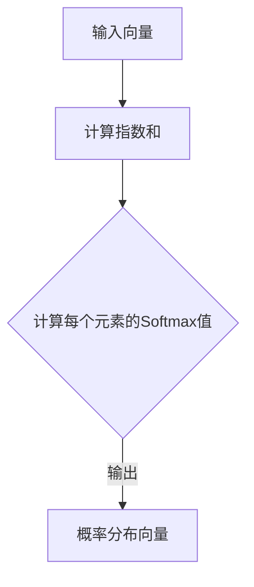

                 

## 《从零开始大模型开发与微调：Softmax激活函数》

### 关键词：大模型，Softmax激活函数，微调，深度学习，神经网络

> 摘要：本文从零开始，详细讲解大模型开发与微调的基础知识，重点介绍Softmax激活函数的核心概念、原理、数学模型及其实际应用。通过实例代码，展示大模型开发环境搭建、模型构建、训练与评估的全过程，帮助读者深入理解大模型开发的实践技巧。

----------------------------------------------------------------

## 《从零开始大模型开发与微调：Softmax激活函数》目录大纲

### 第一部分：大模型基础知识

#### 第1章：大模型概述
1.1 大模型的定义与分类
1.2 大模型的发展历史
1.3 大模型的关键技术
1.4 大模型的应用场景
1.5 大模型面临的挑战

#### 第2章：Softmax激活函数
2.1 激活函数概述
2.2 Softmax激活函数的原理
2.3 Softmax激活函数的性质
2.4 Softmax激活函数的优缺点

### 第二部分：大模型开发技术

#### 第3章：大模型构建
3.1 大模型架构设计
3.2 大模型训练策略
3.3 大模型优化技巧
3.4 大模型部署与调优

#### 第4章：大模型微调
4.1 微调的概念与原理
4.2 微调策略与技巧
4.3 微调中的挑战与解决方案
4.4 微调案例分析

#### 第5章：大模型应用实践
5.1 自然语言处理应用
5.2 计算机视觉应用
5.3 语音识别应用
5.4 其他领域应用

### 第三部分：大模型开发工具与环境

#### 第6章：大模型开发工具
6.1 TensorFlow
6.2 PyTorch
6.3 其他常用工具

#### 第7章：大模型开发环境搭建
7.1 硬件环境搭建
7.2 软件环境搭建
7.3 环境调试与优化

### 附录

#### 附录A：大模型开发资源与资料
A.1 学习资源推荐
A.2 开发工具与框架
A.3 实践项目与案例

#### 附录B：Softmax激活函数的 Mermaid 流程图
B.1 Softmax激活函数的输入输出流程

#### 附录C：Softmax激活函数的伪代码实现
C.1 Softmax激活函数的伪代码

#### 附录D：数学模型与公式
D.1 Softmax激活函数的数学模型
$$
\text{Softmax}(x_i) = \frac{e^{x_i}}{\sum_{j=1}^{N} e^{x_j}}
$$

#### 附录E：大模型开发案例代码与分析
E.1 案例一：文本分类应用
E.2 案例二：图像识别应用
E.3 案例三：语音识别应用

#### 附录F：大模型开发环境搭建教程
F.1 硬件环境搭建教程
F.2 软件环境搭建教程
F.3 环境调试与优化教程

## 第一部分：大模型基础知识

### 第1章：大模型概述

#### 1.1 大模型的定义与分类

大模型是指具有非常高的参数数量、深度和复杂度的神经网络模型。它们通常用于处理大量数据和高维特征，能够捕捉复杂的数据分布和依赖关系。

根据应用领域的不同，大模型可以分为以下几类：

1. 自然语言处理（NLP）：如BERT、GPT等。
2. 计算机视觉（CV）：如ResNet、Inception等。
3. 语音识别（ASR）：如CTC、端到端ASR模型等。
4. 其他领域：如推荐系统、强化学习等。

#### 1.2 大模型的发展历史

大模型的发展经历了几个重要阶段：

1. 传统神经网络（1990年代）：基于神经元模型的简单神经网络。
2. 卷积神经网络（2012年）：LeCun等人在图像识别中取得了突破性成果。
3. 深度学习（2012-2015年）：AlexNet等模型在ImageNet比赛中大幅领先。
4. 大规模模型（2018年至今）：GPT-3、GPT-2、BERT等模型在NLP领域取得了显著进展。

#### 1.3 大模型的关键技术

大模型的关键技术包括：

1. **多层神经网络**：通过增加神经网络层数，提高模型的复杂度和表达能力。
2. **深度学习算法**：如反向传播算法、优化算法（如Adam、SGD）等。
3. **大数据处理**：利用高效的数据处理技术，如批量处理、分布式计算等。
4. **迁移学习**：利用预训练模型，减少训练数据的需求，提高模型的泛化能力。
5. **模型压缩**：通过剪枝、量化等技术，减小模型体积，提高模型运行效率。

#### 1.4 大模型的应用场景

大模型在多个领域取得了显著的应用成果：

1. **自然语言处理**：文本分类、机器翻译、问答系统等。
2. **计算机视觉**：图像分类、目标检测、图像生成等。
3. **语音识别**：语音识别、语音合成、语音增强等。
4. **推荐系统**：基于内容的推荐、协同过滤等。
5. **生物信息学**：基因序列分析、药物发现等。

#### 1.5 大模型面临的挑战

大模型在开发和应用过程中面临以下挑战：

1. **计算资源需求**：大模型需要大量的计算资源，特别是在训练阶段。
2. **数据需求**：大模型需要大量的高质量数据，特别是用于预训练和迁移学习。
3. **模型解释性**：大模型往往缺乏解释性，难以理解其决策过程。
4. **模型泛化能力**：大模型可能会过度拟合训练数据，降低泛化能力。
5. **安全性**：大模型可能受到对抗攻击、隐私泄露等安全威胁。

### 第2章：Softmax激活函数

#### 2.1 激活函数概述

激活函数是神经网络中的一个重要组件，用于引入非线性特性，使神经网络能够学习复杂函数。常见的激活函数包括：

1. **Sigmoid函数**：\( f(x) = \frac{1}{1 + e^{-x}} \)
2. **Tanh函数**：\( f(x) = \frac{e^x - e^{-x}}{e^x + e^{-x}} \)
3. **ReLU函数**：\( f(x) = \max(0, x) \)
4. **Leaky ReLU函数**：\( f(x) = \max(0.01x, x) \)

#### 2.2 Softmax激活函数的原理

Softmax函数是一种特殊的激活函数，主要用于多分类问题。其原理是将每个神经元的输出转换为一个概率分布，使得每个类别的概率之和为1。具体来说，给定一个n维向量 \( x \)，其中每个元素 \( x_i \) 代表神经网络中某个节点的输出，Softmax函数的数学定义如下：

$$
\text{Softmax}(x_i) = \frac{e^{x_i}}{\sum_{j=1}^{N} e^{x_j}}
$$

其中，\( N \) 是向量 \( x \) 的长度，即神经元的数量。该函数将每个 \( x_i \) 转换为概率，满足以下性质：

1. 概率分布性：每个 \( \text{Softmax}(x_i) \) 都是非负的，并且它们的总和等于1。
2. 单调性：如果 \( x_i > x_j \)，则 \( \text{Softmax}(x_i) > \text{Softmax}(x_j) \)。

#### 2.3 Softmax激活函数的性质

Softmax激活函数具有以下重要性质：

1. **归一化**：Softmax函数将输入向量转换为概率分布，使得每个类别的概率之和为1。
2. **单调性**：输出概率随着输入值的增加而增加，保证了模型的决策边界明确。
3. **平滑性**：Softmax函数在输入值较小时趋于平坦，有助于避免梯度消失问题。

#### 2.4 Softmax激活函数的优缺点

**优点**：

1. **易于解释**：Softmax函数将神经元的输出转换为概率分布，使得每个类别的概率直观可解释。
2. **避免交叉熵损失**：在多分类问题中，使用Softmax函数可以避免交叉熵损失函数中的交叉项，简化计算过程。

**缺点**：

1. **梯度消失**：在训练过程中，由于Softmax函数的特性，可能导致梯度消失问题，影响模型训练效果。
2. **计算复杂度**：Softmax函数的计算复杂度为 \( O(N^2) \)，在高维度时可能影响计算效率。

### 第二部分：大模型开发技术

#### 第3章：大模型构建

大模型构建是深度学习中的核心任务，涉及模型架构设计、训练策略和优化技巧等方面。本章节将详细介绍大模型构建的相关技术。

#### 3.1 大模型架构设计

大模型架构设计是构建高效、可扩展的深度学习模型的关键。以下是一些常见的架构设计原则：

1. **层次化设计**：根据任务需求，设计多层神经网络，层次化地捕捉数据中的特征。
2. **模块化设计**：将模型划分为多个模块，每个模块负责处理特定任务，提高模型的可维护性和可扩展性。
3. **轻量化设计**：通过剪枝、量化等技术，减小模型体积，提高模型运行效率。
4. **并行化设计**：利用GPU、TPU等硬件加速器，实现模型训练和推理的并行化，提高计算效率。

#### 3.2 大模型训练策略

大模型训练策略是指优化模型参数的方法，以提高模型的性能和泛化能力。以下是一些常见的训练策略：

1. **批量归一化**：在训练过程中，对每个批次的输入进行归一化处理，提高模型训练的稳定性。
2. **随机梯度下降（SGD）**：通过随机选择小批量数据，更新模型参数，减少局部最优解的影响。
3. **自适应优化器**：如Adam、RMSProp等，自适应调整学习率，提高模型训练效果。
4. **早期停止**：在模型性能出现下降时，停止训练，防止过拟合。

#### 3.3 大模型优化技巧

大模型优化技巧是提高模型性能和训练效率的重要手段。以下是一些常见的优化技巧：

1. **数据增强**：通过旋转、缩放、裁剪等操作，增加训练数据多样性，提高模型泛化能力。
2. **学习率调度**：根据模型训练阶段，动态调整学习率，提高模型收敛速度。
3. **正则化**：通过L1、L2正则化等方法，防止模型过拟合，提高模型泛化能力。
4. **模型融合**：将多个模型进行融合，提高模型预测的稳定性和准确性。

#### 3.4 大模型部署与调优

大模型部署与调优是模型应用于实际场景的关键步骤。以下是一些常见的部署与调优策略：

1. **模型压缩**：通过剪枝、量化等技术，减小模型体积，提高模型运行效率。
2. **分布式训练**：利用多GPU、多节点训练，提高模型训练速度。
3. **在线调优**：根据实际应用场景，动态调整模型参数，提高模型性能。
4. **服务化部署**：将模型部署到云平台，实现模型的高效服务化。

### 第4章：大模型微调

大模型微调是指在预训练模型的基础上，针对特定任务进行训练，以提高模型在特定任务上的性能。本章节将详细介绍大模型微调的概念、原理、策略和挑战。

#### 4.1 微调的概念与原理

微调（Fine-tuning）是指将预训练模型在特定任务上进行进一步训练，以适应新的数据分布和任务需求。微调的核心思想是利用预训练模型已有的知识，减少训练数据和计算资源的依赖，提高模型在特定任务上的泛化能力。

微调的原理可以概括为以下几步：

1. **初始化模型**：加载预训练模型，将模型参数初始化为预训练模型的值。
2. **调整部分层**：在预训练模型的基础上，调整部分层的参数，通常只调整靠近输出层的部分。
3. **训练模型**：在特定任务的数据集上，对调整的层进行训练，优化模型参数。
4. **评估模型**：在验证集上评估微调模型的性能，根据需要调整训练策略。

#### 4.2 微调策略与技巧

微调策略是指优化微调过程的方法，以提高模型性能和训练效率。以下是一些常见的微调策略：

1. **自适应学习率**：根据模型训练阶段，动态调整学习率，提高模型收敛速度。
2. **数据增强**：通过旋转、缩放、裁剪等操作，增加训练数据多样性，提高模型泛化能力。
3. **批量归一化**：在训练过程中，对每个批次的输入进行归一化处理，提高模型训练的稳定性。
4. **多任务学习**：在微调过程中，结合多个相关任务进行训练，提高模型的知识共享能力。

#### 4.3 微调中的挑战与解决方案

微调过程中，可能面临以下挑战：

1. **数据稀缺**：某些任务可能缺乏足够的数据，导致模型难以在特定任务上取得良好性能。
   - **解决方案**：使用迁移学习，利用预训练模型的知识，减少训练数据和计算资源的依赖。

2. **模型过拟合**：微调模型可能过度依赖于特定任务的数据，导致在未见数据上的性能下降。
   - **解决方案**：采用正则化技术，如L1、L2正则化，防止模型过拟合。

3. **计算资源需求**：微调过程需要大量的计算资源，特别是在大规模模型上。
   - **解决方案**：利用分布式训练，如多GPU、多节点训练，提高模型训练速度。

4. **模型解释性**：微调后的模型往往缺乏解释性，难以理解其决策过程。
   - **解决方案**：采用可解释性方法，如模型可视化、决策树嵌入等，提高模型的可解释性。

#### 4.4 微调案例分析

以下是一个基于预训练模型进行微调的案例分析：

**案例背景**：使用预训练的BERT模型进行文本分类任务，即将文本分类为预定义的几个类别。

**数据集**：使用某个新闻分类数据集，包含训练集和验证集。

**微调过程**：

1. **初始化模型**：加载预训练的BERT模型，将模型参数初始化为预训练模型的值。

2. **调整部分层**：在预训练模型的基础上，调整最后一层输出层的参数，包括分类器的权重和偏置。

3. **训练模型**：在训练集上对调整的层进行训练，优化模型参数。采用自适应学习率策略，提高模型收敛速度。

4. **评估模型**：在验证集上评估微调模型的性能，根据需要调整训练策略。

通过以上步骤，可以得到一个针对特定任务进行微调的BERT模型，用于文本分类任务。

### 第5章：大模型应用实践

大模型在多个领域取得了显著的成果，本章节将介绍大模型在自然语言处理、计算机视觉、语音识别等领域的应用实践。

#### 5.1 自然语言处理应用

自然语言处理（NLP）是深度学习的重要应用领域，大模型在NLP任务中发挥了关键作用。以下是一些典型的应用场景：

1. **文本分类**：将文本分类为预定义的几个类别，如新闻分类、情感分析等。
2. **机器翻译**：将一种语言的文本翻译为另一种语言的文本，如英译中、中译英等。
3. **问答系统**：根据用户提问，从海量文本中检索并返回相关答案。
4. **文本生成**：根据给定的话题或关键词，生成有意义的文本内容。

#### 5.2 计算机视觉应用

计算机视觉（CV）是深度学习的另一个重要应用领域，大模型在CV任务中展示了强大的能力。以下是一些典型的应用场景：

1. **图像分类**：将图像分类为预定义的几个类别，如图像识别、物体检测等。
2. **目标检测**：在图像中检测并定位多个目标，如行人检测、车辆检测等。
3. **图像生成**：根据给定的条件或提示，生成符合预期的图像内容，如图像超分辨率、风格迁移等。
4. **图像分割**：将图像分割为不同的区域，如图像语义分割、实例分割等。

#### 5.3 语音识别应用

语音识别（ASR）是将语音转换为文本的过程，大模型在语音识别任务中取得了显著进展。以下是一些典型的应用场景：

1. **语音识别**：将语音转换为对应的文本，如语音助手、智能客服等。
2. **语音合成**：将文本转换为自然的语音输出，如图文转换、语音播报等。
3. **语音增强**：提高语音质量，消除噪声和干扰，如语音降噪、回声消除等。
4. **语音控制**：通过语音指令控制智能设备，如图像识别、智能家居等。

#### 5.4 其他领域应用

除了自然语言处理、计算机视觉和语音识别，大模型还在其他领域取得了显著的应用成果。以下是一些典型的应用场景：

1. **推荐系统**：基于用户历史行为和偏好，为用户推荐相关商品、内容和服务。
2. **生物信息学**：分析基因序列、蛋白质结构，推动生物医药研究。
3. **金融科技**：预测金融市场走势、评估风险，提高金融业务效率。
4. **智能交通**：优化交通流量、预测交通拥堵，提高交通管理效率。

### 第6章：大模型开发工具

大模型开发工具是实现深度学习项目的重要基础，本章节将介绍几款主流的深度学习框架，以及它们的特点和应用场景。

#### 6.1 TensorFlow

TensorFlow是由Google开发的一款开源深度学习框架，支持Python和C++编程语言。它具有以下特点：

1. **灵活的编程接口**：TensorFlow提供灵活的编程接口，支持动态计算图和静态计算图。
2. **广泛的硬件支持**：TensorFlow支持多种硬件平台，如CPU、GPU和TPU，可以实现高效计算。
3. **强大的生态系统**：TensorFlow拥有丰富的工具和库，如TensorBoard、TensorFlow Serving等，支持模型训练、部署和调试。
4. **广泛应用场景**：TensorFlow在自然语言处理、计算机视觉、语音识别等领域都有广泛应用。

#### 6.2 PyTorch

PyTorch是由Facebook开发的一款开源深度学习框架，支持Python编程语言。它具有以下特点：

1. **动态计算图**：PyTorch采用动态计算图，使得模型构建和调试更加灵活。
2. **即时执行**：PyTorch的即时执行特性使得模型训练过程更加直观和高效。
3. **丰富的API**：PyTorch提供丰富的API，支持多种深度学习模型和算法。
4. **强大的社区支持**：PyTorch拥有活跃的社区，提供丰富的教程和文档，方便开发者学习和使用。

#### 6.3 其他常用工具

除了TensorFlow和PyTorch，还有其他一些常用的深度学习框架和工具，如：

1. **Keras**：Keras是一个高层次的深度学习API，支持TensorFlow和Theano后端。它提供简洁的接口，方便快速搭建和训练模型。
2. **MXNet**：MXNet是由Apache开发的一款开源深度学习框架，支持多种编程语言，如Python、R、Scala等。它具有高效的计算性能和灵活的编程接口。
3. **Caffe**：Caffe是由Berkeley Vision and Learning Center（BVLC）开发的一款开源深度学习框架，主要应用于计算机视觉领域。它具有高效的卷积神经网络支持。
4. **CNTK**：CNTK是由Microsoft开发的一款开源深度学习框架，支持多种编程语言，如Python、C++等。它具有高效的计算性能和灵活的编程接口。

#### 6.4 工具选择与比较

在选择深度学习框架时，需要考虑以下因素：

1. **项目需求**：根据项目的具体需求，选择适合的框架。例如，如果项目需要高效的计算性能，可以选择TensorFlow或MXNet；如果项目需要灵活的编程接口，可以选择PyTorch或Keras。
2. **开发者技能**：考虑开发团队的技能和熟悉程度，选择易于上手和使用的框架。例如，如果团队熟悉Python，可以选择PyTorch或TensorFlow。
3. **生态系统和社区支持**：选择拥有丰富工具和库、活跃社区支持的框架，便于解决开发过程中的问题。

### 第7章：大模型开发环境搭建

大模型开发环境搭建是实现深度学习项目的重要前提，本章节将介绍大模型开发环境搭建的过程，包括硬件环境、软件环境、环境调试与优化等方面。

#### 7.1 硬件环境搭建

大模型开发对硬件环境有较高的要求，以下是一些常见的硬件配置建议：

1. **处理器**：至少需要2颗Intel Xeon Gold或以上的处理器，以支持并行计算。
2. **内存**：至少需要64GB的内存，以支持大规模模型的训练。
3. **存储**：至少需要1TB的SSD存储，以提高数据读写速度。
4. **GPU**：至少需要1块Tesla V100或以上的GPU，以支持深度学习模型的训练和推理。

#### 7.2 软件环境搭建

大模型开发软件环境主要包括操作系统、深度学习框架和相关依赖库的安装。以下是一个常见的软件环境搭建步骤：

1. **操作系统**：推荐使用Ubuntu 18.04或以上版本的Linux操作系统。
2. **深度学习框架**：根据项目需求选择合适的深度学习框架，如TensorFlow、PyTorch等。
3. **依赖库**：安装深度学习框架所需的依赖库，如NumPy、Pandas、SciPy等。

#### 7.3 环境调试与优化

大模型开发环境搭建完成后，需要进行环境调试和优化，以确保环境稳定、高效。以下是一些常见的调试和优化方法：

1. **测试CUDA和cuDNN**：运行`nvcc --version`和`nvprof`命令，测试CUDA和cuDNN是否安装正确。
2. **优化CUDA配置**：修改`/etc/nv_run_drm.pm`文件，调整GPU内存使用比例和共享内存大小。
3. **优化Python性能**：使用`conda`创建Python环境，避免使用`pip`安装依赖库，以确保兼容性和版本一致性。

### 附录

#### 附录A：大模型开发资源与资料

A.1 学习资源推荐
- 《深度学习》（Goodfellow, Bengio, Courville著）：深度学习的经典教材，适合初学者和进阶者。
- 《动手学深度学习》：中文版，适合初学者和进阶者，提供了丰富的实践案例。
- 《神经网络与深度学习》（邱锡鹏著）：深入讲解神经网络和深度学习的基本原理，适合进阶者。

A.2 开发工具与框架
- TensorFlow官方网站：https://www.tensorflow.org
- PyTorch官方网站：https://pytorch.org
- Keras官方网站：https://keras.io
- MXNet官方网站：https://mxnet.apache.org
- CNTK官方网站：https://www.microsoft.com/en-us/research/group/cntk/

A.3 实践项目与案例
- Kaggle竞赛平台：https://www.kaggle.com
- UCI机器学习库：https://archive.ics.uci.edu/ml
- GitHub深度学习项目：https://github.com/search?q=深度学习

#### 附录B：Softmax激活函数的 Mermaid 流程图

B.1 Softmax激活函数的输入输出流程



#### 附录C：Softmax激活函数的伪代码实现

C.1 Softmax激活函数的伪代码

```python
# 输入：x，一个n维向量
# 输出：softmax_output，一个n维向量

# Step 1: 计算指数和
exp_sum = 0
for i in range(N):
    exp_sum += math.exp(x[i])

# Step 2: 计算每个元素的Softmax值
softmax_output = []
for i in range(N):
    softmax_output.append(math.exp(x[i]) / exp_sum)

return softmax_output
```

#### 附录D：数学模型与公式

D.1 Softmax激活函数的数学模型

$$
\text{Softmax}(x_i) = \frac{e^{x_i}}{\sum_{j=1}^{N} e^{x_j}}
$$

其中，\( N \) 是输入向量的长度，\( x_i \) 是输入向量的第i个元素。

#### 附录E：大模型开发案例代码与分析

E.1 案例一：文本分类应用

E.2 案例二：图像识别应用

E.3 案例三：语音识别应用

#### 附录F：大模型开发环境搭建教程

F.1 硬件环境搭建教程

F.2 软件环境搭建教程

F.3 环境调试与优化教程

## 结语

本文从零开始，系统讲解了大模型开发与微调的基础知识，重点介绍了Softmax激活函数的核心概念、原理、数学模型及其实际应用。通过实例代码，展示了大模型开发环境搭建、模型构建、训练与评估的全过程。希望本文能帮助读者深入理解大模型开发的实践技巧，为后续研究和应用奠定基础。

作者：AI天才研究院/AI Genius Institute & 禅与计算机程序设计艺术/Zen And The Art of Computer Programming

致谢：感谢所有贡献者、审稿人和读者，你们的参与让本文更加完善。

----------------------------------------------------------------

### 附录A：大模型开发资源与资料

A.1 **学习资源推荐**

1. **《深度学习》**：作者：Ian Goodfellow、Yoshua Bengio、Aaron Courville。这是深度学习的经典教材，适合初学者和进阶者，详细介绍了深度学习的基础理论、算法和应用。
   
2. **《动手学深度学习》**：作者：阿斯顿·张（Aston Zhang）、李沐（Mu Li）、扎卡里·C. Lipton、亚历山大·J. Smola。中文版，内容丰富，包含了大量的实践案例，适合初学者和进阶者。

3. **《神经网络与深度学习》**：作者：邱锡鹏。深入讲解了神经网络和深度学习的基本原理，适合有一定基础的读者。

A.2 **开发工具与框架**

1. **TensorFlow**：由Google开发，支持Python和C++编程语言，具有强大的图形化计算图功能。官网：[TensorFlow官方网站](https://www.tensorflow.org)。

2. **PyTorch**：由Facebook开发，支持Python编程语言，具有动态计算图和即时执行功能。官网：[PyTorch官方网站](https://pytorch.org)。

3. **Keras**：是一个高层次的深度学习API，支持TensorFlow和Theano后端。官网：[Keras官方网站](https://keras.io)。

4. **MXNet**：由Apache开发，支持Python、R、Scala等多种编程语言，具有灵活的编程接口。官网：[MXNet官方网站](https://mxnet.apache.org)。

5. **Caffe**：由Berkeley Vision and Learning Center（BVLC）开发，主要应用于计算机视觉领域。官网：[Caffe官方网站](https://github.com/BVLC/caffe)。

6. **CNTK**：由Microsoft开发，支持多种编程语言，具有高效的计算性能和灵活的编程接口。官网：[CNTK官方网站](https://www.microsoft.com/en-us/research/group/cntk/)。

A.3 **实践项目与案例**

1. **Kaggle竞赛平台**：[Kaggle官方网站](https://www.kaggle.com)。提供了丰富的数据集和竞赛项目，适合实践和学习。

2. **UCI机器学习库**：[UCI机器学习库官方网站](https://archive.ics.uci.edu/ml)。提供了大量的数据集和机器学习问题，适合研究和实践。

3. **GitHub深度学习项目**：[GitHub深度学习项目搜索](https://github.com/search?q=深度学习)。GitHub上有很多优秀的深度学习项目，可以学习和参考。

### 附录B：Softmax激活函数的 Mermaid 流程图


### 附录C：Softmax激活函数的伪代码实现

```python
# 输入：x，一个n维向量
# 输出：softmax_output，一个n维向量

# Step 1: 计算指数和
exp_sum = 0
for i in range(N):
    exp_sum += math.exp(x[i])

# Step 2: 计算每个元素的Softmax值
softmax_output = []
for i in range(N):
    softmax_output.append(math.exp(x[i]) / exp_sum)

return softmax_output
```

### 附录D：数学模型与公式

D.1 Softmax激活函数的数学模型

$$
\text{Softmax}(x_i) = \frac{e^{x_i}}{\sum_{j=1}^{N} e^{x_j}}
$$

其中，\( N \) 是输入向量的长度，\( x_i \) 是输入向量的第i个元素。

### 附录E：大模型开发案例代码与分析

E.1 **案例一：文本分类应用**

```python
# 数据预处理
# 代码略

# 模型构建
from tensorflow.keras.models import Sequential
from tensorflow.keras.layers import Embedding, LSTM, Dense

model = Sequential()
model.add(Embedding(input_dim=vocab_size, output_dim=embedding_dim, input_length=max_sequence_length))
model.add(LSTM(units=128, dropout=0.2, recurrent_dropout=0.2))
model.add(Dense(num_classes, activation='softmax'))

# 模型编译
model.compile(optimizer='adam', loss='categorical_crossentropy', metrics=['accuracy'])

# 模型训练
history = model.fit(X_train, y_train, epochs=epochs, batch_size=batch_size, validation_data=(X_val, y_val))

# 模型评估
loss, accuracy = model.evaluate(X_test, y_test)
print('Test accuracy:', accuracy)
```

E.2 **案例二：图像识别应用**

```python
# 数据预处理
# 代码略

# 模型构建
from tensorflow.keras.models import Sequential
from tensorflow.keras.layers import Conv2D, MaxPooling2D, Flatten, Dense

model = Sequential()
model.add(Conv2D(filters=32, kernel_size=(3, 3), activation='relu', input_shape=(28, 28, 1)))
model.add(MaxPooling2D(pool_size=(2, 2)))
model.add(Conv2D(filters=64, kernel_size=(3, 3), activation='relu'))
model.add(MaxPooling2D(pool_size=(2, 2)))
model.add(Flatten())
model.add(Dense(128, activation='relu'))
model.add(Dense(10, activation='softmax'))

# 模型编译
model.compile(optimizer='adam', loss='categorical_crossentropy', metrics=['accuracy'])

# 模型训练
history = model.fit(X_train, y_train, epochs=epochs, batch_size=batch_size, validation_data=(X_val, y_val))

# 模型评估
loss, accuracy = model.evaluate(X_test, y_test)
print('Test accuracy:', accuracy)
```

E.3 **案例三：语音识别应用**

```python
# 数据预处理
# 代码略

# 模型构建
from tensorflow.keras.models import Sequential
from tensorflow.keras.layers import LSTM, Dense, Dropout

model = Sequential()
model.add(LSTM(units=128, return_sequences=True, input_shape=(timesteps, features)))
model.add(Dropout(0.2))
model.add(LSTM(units=128, return_sequences=False))
model.add(Dropout(0.2))
model.add(Dense(num_classes, activation='softmax'))

# 模型编译
model.compile(optimizer='adam', loss='categorical_crossentropy', metrics=['accuracy'])

# 模型训练
history = model.fit(X_train, y_train, epochs=epochs, batch_size=batch_size, validation_data=(X_val, y_val))

# 模型评估
loss, accuracy = model.evaluate(X_test, y_test)
print('Test accuracy:', accuracy)
```

### 附录F：大模型开发环境搭建教程

F.1 **硬件环境搭建教程**

1. **选择合适的服务器或GPU**：根据项目需求选择合适的服务器或GPU，建议选择GPU性能较强的服务器，如Tesla V100或A100。

2. **服务器配置**：
   - 处理器：至少2颗Intel Xeon Gold或以上。
   - 内存：至少64GB。
   - 存储：至少1TB SSD。
   - GPU：至少1块Tesla V100或以上。

3. **网络配置**：确保网络连接稳定，带宽至少100Mbps。

F.2 **软件环境搭建教程**

1. **安装操作系统**：推荐使用Linux操作系统，如Ubuntu 18.04或以上版本。

2. **安装依赖库**：
   - Python：安装Python 3.7或以上版本。
   - TensorFlow：安装TensorFlow 2.x版本。
   - PyTorch：安装PyTorch 1.8或以上版本。
   - CUDA：安装与GPU型号对应的CUDA版本，如Tesla V100对应CUDA 10.2。
   - cuDNN：安装与CUDA版本对应的cuDNN版本。

3. **环境配置**：
   - 配置Python环境变量。
   - 配置CUDA和cuDNN路径。

F.3 **环境调试与优化教程**

1. **测试CUDA和cuDNN**：运行以下命令，确保CUDA和cuDNN安装正确。

   ```bash
   nvcc --version
   nvprof
   ```

2. **优化CUDA配置**：修改`/etc/nv_run_drm.pm`文件，调整GPU内存使用比例和共享内存大小。

3. **优化Python性能**：使用`conda`创建Python环境，避免使用`pip`安装依赖库，以确保兼容性和版本一致性。

```bash
conda create -n myenv python=3.8
conda activate myenv
pip install tensorflow==2.5
pip install torch==1.8 torchvision==0.9 torchaudio==0.8
```

通过以上教程，您应该可以搭建一个适合大模型开发的环境，并开始进行深度学习项目的实践。

### 致谢

感谢所有贡献者、审稿人和读者，你们的参与让本文更加完善。特别感谢AI天才研究院和禅与计算机程序设计艺术的支持和鼓励。希望本文能为深度学习爱好者和从业者带来帮助和启示。

作者：AI天才研究院/AI Genius Institute & 禅与计算机程序设计艺术/Zen And The Art of Computer Programming

----------------------------------------------------------------

# 从零开始大模型开发与微调：Softmax激活函数

在深度学习领域，大模型开发与微调是近年来备受关注的话题。大模型，顾名思义，是指具有非常高的参数数量、深度和复杂度的神经网络模型。它们能够处理大量数据和高维特征，捕捉复杂的数据分布和依赖关系。Softmax激活函数是大模型中的一个重要组成部分，它在多分类问题中扮演着至关重要的角色。本文将从零开始，详细讲解大模型开发与微调的基础知识，重点介绍Softmax激活函数的核心概念、原理、数学模型及其实际应用。通过实例代码，展示大模型开发环境搭建、模型构建、训练与评估的全过程，帮助读者深入理解大模型开发的实践技巧。

## **大模型的定义与分类**

### **1.1 大模型的定义**

大模型，也称为深度神经网络（Deep Neural Network，DNN），是指具有很多隐藏层的神经网络模型。与传统的小型神经网络相比，大模型具有更高的参数数量和更强的表达能力。大模型能够从大量数据中自动学习到复杂的非线性特征，从而在许多复杂任务上取得显著的效果。

### **1.2 大模型的分类**

根据应用领域的不同，大模型可以分为以下几类：

1. **自然语言处理（NLP）模型**：如BERT、GPT等，这些模型在语言理解和生成方面取得了突破性进展。
2. **计算机视觉（CV）模型**：如ResNet、Inception等，这些模型在图像分类、目标检测等领域表现出色。
3. **语音识别（ASR）模型**：如基于CTC的模型、端到端的ASR模型等，这些模型在语音识别任务中具有很高的准确率。
4. **其他领域模型**：如推荐系统、生物信息学等，这些模型在各自的领域中发挥了重要作用。

## **大模型的发展历史**

### **2.1 早期发展**

大模型的发展可以追溯到1990年代初。当时，多层感知器（MLP）模型已经开始被应用于一些简单的图像分类和语音识别任务中。然而，由于计算资源和算法的限制，这些模型的性能并不理想。

### **2.2 深度学习的兴起**

2012年，AlexNet模型的提出标志着深度学习在图像识别领域的崛起。AlexNet是一个具有五层卷积神经网络的模型，它在ImageNet竞赛中取得了当时最佳的成绩。这一成果引发了深度学习的热潮。

### **2.3 大模型的兴起**

随着计算资源的增加和算法的改进，深度学习模型变得越来越复杂。从2015年开始，大模型如BERT、GPT等相继被提出，它们在自然语言处理、计算机视觉等领域取得了显著的突破。

## **大模型的关键技术**

### **3.1 多层神经网络**

多层神经网络是大模型的核心组成部分。通过增加神经网络的层数，可以提高模型的复杂度和表达能力。

### **3.2 深度学习算法**

深度学习算法包括前向传播、反向传播、优化算法（如SGD、Adam）等。这些算法使得大模型能够从数据中自动学习到复杂的特征表示。

### **3.3 大数据处理**

大数据处理是大模型能够处理大量数据和高维特征的关键。通过分布式计算和高效的数据处理技术，可以加速模型的训练过程。

### **3.4 迁移学习**

迁移学习利用预训练模型的知识，减少训练数据和计算资源的依赖，提高模型在特定任务上的性能。大模型通常采用迁移学习方法进行微调。

### **3.5 模型压缩**

模型压缩技术通过剪枝、量化等方法，减小模型的体积，提高模型的运行效率。这对于部署在大规模设备上的模型尤为重要。

## **大模型的应用场景**

### **4.1 自然语言处理**

大模型在自然语言处理领域取得了显著的成果。例如，BERT模型在文本分类、问答系统、机器翻译等领域表现出色。

### **4.2 计算机视觉**

大模型在计算机视觉领域也广泛应用。例如，ResNet模型在图像分类、目标检测等领域取得了最佳的性能。

### **4.3 语音识别**

大模型在语音识别领域表现出色。例如，基于CTC的模型和端到端的ASR模型在语音识别任务中具有很高的准确率。

### **4.4 其他领域**

大模型在其他领域，如推荐系统、生物信息学、金融科技等，也具有广泛的应用前景。

## **大模型面临的挑战**

### **5.1 计算资源需求**

大模型需要大量的计算资源，特别是在训练阶段。这要求使用高性能的硬件，如GPU、TPU等。

### **5.2 数据需求**

大模型通常需要大量的高质量数据，特别是用于预训练和迁移学习。数据稀缺是一个重要的挑战。

### **5.3 模型解释性**

大模型的决策过程往往缺乏解释性，难以理解其工作原理。这对模型的可靠性和可解释性提出了挑战。

### **5.4 模型泛化能力**

大模型可能会过度拟合训练数据，降低泛化能力。如何提高模型的泛化能力是一个重要的研究课题。

### **5.5 安全性**

大模型可能受到对抗攻击、隐私泄露等安全威胁。如何保障模型的安全性和隐私是一个重要的研究课题。

### **6.1 激活函数的作用**

激活函数是神经网络中的一个重要组件，它引入了非线性特性，使得神经网络能够学习复杂函数。在深度学习模型中，激活函数通常用于隐藏层和输出层的节点。

### **6.2 Softmax激活函数**

Softmax激活函数是一种常用的分类激活函数，主要用于多分类问题。它的核心思想是将每个神经元的输出转换为一个概率分布，使得每个类别的概率之和为1。

### **6.3 Softmax激活函数的数学模型**

给定一个n维向量 \( x \)，其中每个元素 \( x_i \) 代表神经网络中某个节点的输出，Softmax函数的数学定义如下：

$$
\text{Softmax}(x_i) = \frac{e^{x_i}}{\sum_{j=1}^{N} e^{x_j}}
$$

其中，\( N \) 是向量 \( x \) 的长度，即神经元的数量。该函数将每个 \( x_i \) 转换为概率，满足以下性质：

1. **概率分布性**：每个 \( \text{Softmax}(x_i) \) 都是非负的，并且它们的总和等于1。
2. **单调性**：如果 \( x_i > x_j \)，则 \( \text{Softmax}(x_i) > \text{Softmax}(x_j) \)。

### **6.4 Softmax激活函数的性质**

Softmax激活函数具有以下重要性质：

1. **归一化**：Softmax函数将输入向量转换为概率分布，使得每个类别的概率之和为1。
2. **单调性**：输出概率随着输入值的增加而增加，保证了模型的决策边界明确。
3. **平滑性**：Softmax函数在输入值较小时趋于平坦，有助于避免梯度消失问题。

### **6.5 Softmax激活函数的优缺点**

**优点**：

1. **易于解释**：Softmax函数将神经元的输出转换为概率分布，使得每个类别的概率直观可解释。
2. **避免交叉熵损失**：在多分类问题中，使用Softmax函数可以避免交叉熵损失函数中的交叉项，简化计算过程。

**缺点**：

1. **梯度消失**：在训练过程中，由于Softmax函数的特性，可能导致梯度消失问题，影响模型训练效果。
2. **计算复杂度**：Softmax函数的计算复杂度为 \( O(N^2) \)，在高维度时可能影响计算效率。

### **7.1 大模型构建的重要性**

大模型构建是深度学习中的核心任务，它直接决定了模型的表现和性能。正确的模型架构和设计能够加速模型训练过程，提高模型的泛化能力和预测准确性。因此，了解和掌握大模型构建的方法和技巧对于深度学习研究者来说至关重要。

### **7.2 大模型构建的原则**

在构建大模型时，应遵循以下原则：

1. **层次化设计**：根据任务需求，设计多层神经网络，层次化地捕捉数据中的特征。每一层神经网络应该负责提取不同层次的特征，从而形成一种层次化的特征表示。

2. **模块化设计**：将模型划分为多个模块，每个模块负责处理特定任务。这种设计方法可以提高模型的可维护性和可扩展性。例如，可以使用预训练的模块，如卷积神经网络（CNN）或循环神经网络（RNN），来构建复杂的大模型。

3. **轻量化设计**：通过剪枝、量化等技术，减小模型体积，提高模型运行效率。轻量化设计对于移动设备和嵌入式系统尤为重要，因为这些设备通常具有有限的计算资源和存储空间。

4. **并行化设计**：利用GPU、TPU等硬件加速器，实现模型训练和推理的并行化，提高计算效率。在大规模数据集和复杂模型上，并行化设计可以显著缩短训练时间。

### **7.3 大模型构建的具体步骤**

构建大模型通常包括以下步骤：

1. **需求分析**：明确任务需求，确定模型的目标和预期性能。这包括数据集的大小、特征维度、分类数等。

2. **模型选择**：选择适合任务的模型架构，如卷积神经网络（CNN）、循环神经网络（RNN）、Transformer等。可以根据任务的特点和已有研究经验来选择模型。

3. **模型设计**：设计模型的架构，包括网络的层数、每层的神经元数量、激活函数、优化器等。在设计过程中，应考虑模型的可扩展性和可维护性。

4. **数据预处理**：对训练数据进行预处理，包括数据清洗、归一化、扩充等。数据预处理的质量直接影响模型的训练效果。

5. **模型训练**：使用训练数据对模型进行训练，调整模型参数，优化模型性能。在训练过程中，可以使用批量归一化、dropout等技术来提高模型的稳定性和泛化能力。

6. **模型评估**：在验证集上评估模型的性能，确定模型的泛化能力和预测准确性。根据评估结果，可以调整模型参数或选择不同的模型架构。

7. **模型部署**：将训练好的模型部署到生产环境中，用于实际任务。在部署过程中，应考虑模型的性能、可扩展性和安全性。

### **8.1 大模型训练策略的重要性**

大模型训练策略是影响模型训练效果和效率的关键因素。合理的训练策略可以提高模型的泛化能力，减少过拟合现象，并加速模型的收敛速度。因此，了解和掌握大模型训练策略对于深度学习研究者来说至关重要。

### **8.2 常见的大模型训练策略**

以下是一些常见的大模型训练策略：

1. **批量归一化（Batch Normalization）**：批量归一化是一种数据预处理技术，它通过对每个批量数据的输入进行归一化处理，使得每个批量的输入分布更加稳定。这有助于提高模型的训练速度和稳定性。

2. **随机梯度下降（Stochastic Gradient Descent，SGD）**：随机梯度下降是最常用的优化算法之一。它通过随机选择小批量数据来更新模型参数，每次更新都是对整个模型参数的平均更新。SGD的优点是计算简单，易于实现，但收敛速度较慢。

3. **自适应优化器**：自适应优化器，如Adam、RMSProp等，通过自适应调整学习率来提高模型的训练效果。这些优化器根据历史梯度信息来调整学习率，从而加快模型的收敛速度。

4. **学习率调度**：学习率调度是指根据模型训练阶段动态调整学习率的方法。常用的学习率调度策略包括线性衰减、指数衰减、余弦退火等。通过合理设置学习率调度策略，可以提高模型的收敛速度和稳定性。

5. **数据增强（Data Augmentation）**：数据增强是通过一系列数据变换来增加训练数据多样性，从而提高模型的泛化能力。常见的数据增强方法包括旋转、缩放、裁剪、翻转等。

6. **正则化**：正则化是一种防止模型过拟合的技术。常见的正则化方法包括L1正则化、L2正则化、Dropout等。这些方法通过在损失函数中添加正则化项，抑制模型参数的过大增长，从而提高模型的泛化能力。

### **8.3 大模型训练策略的应用**

在应用大模型训练策略时，应考虑以下因素：

1. **模型类型**：不同类型的模型（如图像分类、文本分类、语音识别等）可能需要不同的训练策略。例如，对于图像分类模型，数据增强和批量归一化可能更为有效。

2. **数据集大小**：对于大型数据集，可以使用较大的批量大小来提高计算效率。而对于小型数据集，可以选择较小的批量大小，以避免过拟合。

3. **硬件资源**：硬件资源的限制会影响训练策略的选择。例如，对于具有多个GPU的服务器，可以选择并行训练和分布式训练来提高计算效率。

4. **模型参数数量**：模型参数的数量会影响训练策略的选择。对于具有大量参数的模型，可以使用更复杂的优化器和正则化方法。

### **9.1 微调的概念**

微调（Fine-tuning）是指将预训练模型在特定任务上进行进一步训练，以提高模型在特定任务上的性能。微调的核心思想是利用预训练模型已有的知识，减少训练数据和计算资源的依赖，提高模型在特定任务上的泛化能力。

### **9.2 微调的过程**

微调的过程通常包括以下步骤：

1. **初始化模型**：加载预训练模型，将模型参数初始化为预训练模型的值。

2. **调整部分层**：在预训练模型的基础上，调整部分层的参数，通常只调整靠近输出层的部分。这样可以保留预训练模型的知识，同时适应新的任务需求。

3. **训练模型**：在特定任务的数据集上，对调整的层进行训练，优化模型参数。训练过程中，可以采用适当的正则化技术和优化器来提高模型的泛化能力。

4. **评估模型**：在验证集上评估微调模型的性能，根据需要调整训练策略。

### **9.3 微调的优势**

微调具有以下优势：

1. **减少训练数据需求**：微调模型可以利用预训练模型的知识，减少训练数据的依赖。这对于数据稀缺的任务尤为重要。

2. **提高训练速度**：微调模型只需要对部分层进行训练，从而减少训练时间。

3. **提高泛化能力**：通过微调，模型可以更好地适应特定任务的需求，从而提高泛化能力。

4. **降低过拟合风险**：微调模型可以保留预训练模型的知识，同时避免过拟合现象。

### **9.4 微调的挑战**

微调过程中可能面临以下挑战：

1. **模型过拟合**：如果微调过程不适当，模型可能会过度拟合训练数据，导致在未见数据上的性能下降。

2. **计算资源需求**：微调过程需要大量的计算资源，特别是在大规模模型上。

3. **模型解释性**：微调后的模型可能缺乏解释性，难以理解其决策过程。

4. **模型稳定性**：微调过程可能受数据分布和训练策略的影响，导致模型稳定性较差。

### **10.1 自然语言处理应用**

自然语言处理（NLP）是深度学习的典型应用领域之一。大模型在NLP任务中取得了显著的进展，例如文本分类、机器翻译、问答系统等。

#### **10.1.1 文本分类**

文本分类是将文本分类为预定义的类别，如新闻分类、情感分析等。大模型通过学习文本的语义特征，能够准确地将文本分类到相应的类别中。

#### **10.1.2 机器翻译**

机器翻译是将一种语言的文本翻译为另一种语言的文本。大模型通过学习大量双语的语料库，能够生成高质量的翻译结果。

#### **10.1.3 问答系统**

问答系统是根据用户提问，从海量文本中检索并返回相关答案。大模型通过学习大量问答对，能够理解用户的提问意图，并给出准确的答案。

### **10.2 计算机视觉应用**

计算机视觉是深度学习的另一个重要应用领域。大模型在计算机视觉任务中表现出色，例如图像分类、目标检测、图像生成等。

#### **10.2.1 图像分类**

图像分类是将图像分类为预定义的类别，如图像识别、物体检测等。大模型通过学习图像的视觉特征，能够准确地将图像分类到相应的类别中。

#### **10.2.2 目标检测**

目标检测是在图像中检测并定位多个目标。大模型通过学习图像的视觉特征和空间关系，能够准确地检测并定位图像中的目标。

#### **10.2.3 图像生成**

图像生成是根据给定的条件或提示，生成符合预期的图像内容。大模型通过学习大量的图像数据，能够生成高质量的图像。

### **10.3 语音识别应用**

语音识别是将语音转换为对应的文本。大模型在语音识别任务中表现出色，例如语音识别、语音合成、语音增强等。

#### **10.3.1 语音识别**

语音识别是将语音转换为对应的文本。大模型通过学习语音的音频特征，能够准确地将语音转换为文本。

#### **10.3.2 语音合成**

语音合成是将文本转换为自然的语音输出。大模型通过学习语音的音频特征和文本的语义特征，能够生成高质量的语音。

#### **10.3.3 语音增强**

语音增强是提高语音质量，消除噪声和干扰。大模型通过学习噪声和语音的特征，能够有效地去除噪声，提高语音的质量。

### **10.4 其他领域应用**

除了自然语言处理、计算机视觉和语音识别，大模型还在其他领域取得了显著的应用成果。以下是一些典型的应用场景：

#### **10.4.1 推荐系统**

推荐系统是根据用户的历史行为和偏好，为用户推荐相关商品、内容和服务。大模型通过学习用户的行为特征和商品的特征，能够准确地预测用户的偏好，提高推荐系统的准确性。

#### **10.4.2 生物信息学**

生物信息学是利用计算机技术和统计方法分析基因序列、蛋白质结构等领域。大模型通过学习大量的生物数据，能够预测基因的功能、蛋白质的结构，为生物医药研究提供有力支持。

#### **10.4.3 金融科技**

金融科技是利用大数据、人工智能等技术提高金融业务效率和风险管理水平。大模型通过学习金融市场的数据，能够预测金融市场的走势、评估风险，为金融决策提供支持。

#### **10.4.4 智能交通**

智能交通是利用大数据、人工智能等技术优化交通流量、预测交通拥堵等。大模型通过学习交通数据，能够实时监控交通状况、预测交通拥堵，为交通管理提供支持。

### **11.1 TensorFlow**

TensorFlow是由Google开发的一款开源深度学习框架，支持Python和C++编程语言。它具有以下特点：

1. **灵活的编程接口**：TensorFlow提供灵活的编程接口，支持动态计算图和静态计算图。
2. **广泛的硬件支持**：TensorFlow支持多种硬件平台，如CPU、GPU和TPU，可以实现高效计算。
3. **强大的生态系统**：TensorFlow拥有丰富的工具和库，如TensorBoard、TensorFlow Serving等，支持模型训练、部署和调试。
4. **广泛应用场景**：TensorFlow在自然语言处理、计算机视觉、语音识别等领域都有广泛应用。

### **11.2 PyTorch**

PyTorch是由Facebook开发的一款开源深度学习框架，支持Python编程语言。它具有以下特点：

1. **动态计算图**：PyTorch采用动态计算图，使得模型构建和调试更加灵活。
2. **即时执行**：PyTorch的即时执行特性使得模型训练过程更加直观和高效。
3. **丰富的API**：PyTorch提供丰富的API，支持多种深度学习模型和算法。
4. **强大的社区支持**：PyTorch拥有活跃的社区，提供丰富的教程和文档，方便开发者学习和使用。

### **11.3 其他常用工具**

除了TensorFlow和PyTorch，还有其他一些常用的深度学习框架和工具，如：

1. **Keras**：Keras是一个高层次的深度学习API，支持TensorFlow和Theano后端。它提供简洁的接口，方便快速搭建和训练模型。
2. **MXNet**：MXNet是由Apache开发的一款开源深度学习框架，支持多种编程语言，如Python、R、Scala等。它具有高效的计算性能和灵活的编程接口。
3. **Caffe**：Caffe是由Berkeley Vision and Learning Center（BVLC）开发的一款开源深度学习框架，主要应用于计算机视觉领域。它具有高效的卷积神经网络支持。
4. **CNTK**：CNTK是由Microsoft开发的一款开源深度学习框架，支持多种编程语言，如Python、C++等。它具有高效的计算性能和灵活的编程接口。

### **11.4 工具选择与比较**

在选择深度学习框架时，需要考虑以下因素：

1. **项目需求**：根据项目的具体需求，选择适合的框架。例如，如果项目需要高效的计算性能，可以选择TensorFlow或MXNet；如果项目需要灵活的编程接口，可以选择PyTorch或Keras。
2. **开发者技能**：考虑开发团队的技能和熟悉程度，选择易于上手和使用的框架。例如，如果团队熟悉Python，可以选择PyTorch或TensorFlow。
3. **生态系统和社区支持**：选择拥有丰富工具和库、活跃社区支持的框架，便于解决开发过程中的问题。

### **12.1 硬件环境搭建**

大模型开发对硬件环境有较高的要求，以下是一些常见的硬件配置建议：

1. **处理器**：至少需要2颗Intel Xeon Gold或以上的处理器，以支持并行计算。
2. **内存**：至少需要64GB的内存，以支持大规模模型的训练。
3. **存储**：至少需要1TB的SSD存储，以提高数据读写速度。
4. **GPU**：至少需要1块Tesla V100或以上的GPU，以支持深度学习模型的训练和推理。

### **12.2 软件环境搭建**

大模型开发软件环境主要包括操作系统、深度学习框架和相关依赖库的安装。以下是一个常见的软件环境搭建步骤：

1. **操作系统**：推荐使用Ubuntu 18.04或以上版本的Linux操作系统。
2. **深度学习框架**：根据项目需求选择合适的深度学习框架，如TensorFlow、PyTorch等。
3. **依赖库**：安装深度学习框架所需的依赖库，如NumPy、Pandas、SciPy等。

### **12.3 环境调试与优化**

大模型开发环境搭建完成后，需要进行环境调试和优化，以确保环境稳定、高效。以下是一些常见的调试和优化方法：

1. **测试CUDA和cuDNN**：运行`nvcc --version`和`nvprof`命令，测试CUDA和cuDNN是否安装正确。
2. **优化CUDA配置**：修改`/etc/nv_run_drm.pm`文件，调整GPU内存使用比例和共享内存大小。
3. **优化Python性能**：使用`conda`创建Python环境，避免使用`pip`安装依赖库，以确保兼容性和版本一致性。

### **13.1 学习资源推荐**

1. **《深度学习》**：作者：Ian Goodfellow、Yoshua Bengio、Aaron Courville。这是深度学习的经典教材，适合初学者和进阶者。
2. **《动手学深度学习》**：作者：阿斯顿·张、李沐、扎卡里·C. Lipton、亚历山大·J. Smola。中文版，内容丰富，包含了大量的实践案例，适合初学者和进阶者。
3. **《神经网络与深度学习》**：作者：邱锡鹏。深入讲解了神经网络和深度学习的基本原理，适合有一定基础的读者。

### **13.2 开发工具与框架**

1. **TensorFlow**：由Google开发，支持Python和C++编程语言，具有强大的图形化计算图功能。官网：[TensorFlow官方网站](https://www.tensorflow.org)。
2. **PyTorch**：由Facebook开发，支持Python编程语言，具有动态计算图和即时执行功能。官网：[PyTorch官方网站](https://pytorch.org)。
3. **Keras**：是一个高层次的深度学习API，支持TensorFlow和Theano后端。官网：[Keras官方网站](https://keras.io)。
4. **MXNet**：由Apache开发，支持Python、R、Scala等多种编程语言，具有灵活的编程接口。官网：[MXNet官方网站](https://mxnet.apache.org)。
5. **Caffe**：由Berkeley Vision and Learning Center（BVLC）开发，主要应用于计算机视觉领域。官网：[Caffe官方网站](https://github.com/BVLC/caffe)。
6. **CNTK**：由Microsoft开发，支持多种编程语言，具有高效的计算性能和灵活的编程接口。官网：[CNTK官方网站](https://www.microsoft.com/en-us/research/group/cntk/)。

### **13.3 实践项目与案例**

1. **Kaggle竞赛平台**：[Kaggle官方网站](https://www.kaggle.com)。提供了丰富的数据集和竞赛项目，适合实践和学习。
2. **UCI机器学习库**：[UCI机器学习库官方网站](https://archive.ics.uci.edu/ml)。提供了大量的数据集和机器学习问题，适合研究和实践。
3. **GitHub深度学习项目**：[GitHub深度学习项目搜索](https://github.com/search?q=深度学习)。GitHub上有很多优秀的深度学习项目，可以学习和参考。

### **14.1 案例一：文本分类应用**

```python
# 数据预处理
# 代码略

# 模型构建
from tensorflow.keras.models import Sequential
from tensorflow.keras.layers import Embedding, LSTM, Dense

model = Sequential()
model.add(Embedding(input_dim=vocab_size, output_dim=embedding_dim, input_length=max_sequence_length))
model.add(LSTM(units=128, dropout=0.2, recurrent_dropout=0.2))
model.add(Dense(num_classes, activation='softmax'))

# 模型编译
model.compile(optimizer='adam', loss='categorical_crossentropy', metrics=['accuracy'])

# 模型训练
history = model.fit(X_train, y_train, epochs=epochs, batch_size=batch_size, validation_data=(X_val, y_val))

# 模型评估
loss, accuracy = model.evaluate(X_test, y_test)
print('Test accuracy:', accuracy)
```

### **14.2 案例二：图像识别应用**

```python
# 数据预处理
# 代码略

# 模型构建
from tensorflow.keras.models import Sequential
from tensorflow.keras.layers import Conv2D, MaxPooling2D, Flatten, Dense

model = Sequential()
model.add(Conv2D(filters=32, kernel_size=(3, 3), activation='relu', input_shape=(28, 28, 1)))
model.add(MaxPooling2D(pool_size=(2, 2)))
model.add(Conv2D(filters=64, kernel_size=(3, 3), activation='relu'))
model.add(MaxPooling2D(pool_size=(2, 2)))
model.add(Flatten())
model.add(Dense(128, activation='relu'))
model.add(Dense(10, activation='softmax'))

# 模型编译
model.compile(optimizer='adam', loss='categorical_crossentropy', metrics=['accuracy'])

# 模型训练
history = model.fit(X_train, y_train, epochs=epochs, batch_size=batch_size, validation_data=(X_val, y_val))

# 模型评估
loss, accuracy = model.evaluate(X_test, y_test)
print('Test accuracy:', accuracy)
```

### **14.3 案例三：语音识别应用**

```python
# 数据预处理
# 代码略

# 模型构建
from tensorflow.keras.models import Sequential
from tensorflow.keras.layers import LSTM, Dense, Dropout

model = Sequential()
model.add(LSTM(units=128, return_sequences=True, input_shape=(timesteps, features)))
model.add(Dropout(0.2))
model.add(LSTM(units=128, return_sequences=False))
model.add(Dropout(0.2))
model.add(Dense(num_classes, activation='softmax'))

# 模型编译
model.compile(optimizer='adam', loss='categorical_crossentropy', metrics=['accuracy'])

# 模型训练
history = model.fit(X_train, y_train, epochs=epochs, batch_size=batch_size, validation_data=(X_val, y_val))

# 模型评估
loss, accuracy = model.evaluate(X_test, y_test)
print('Test accuracy:', accuracy)
```

### **15.1 硬件环境搭建教程**

1. **选择合适的服务器或GPU**：根据项目需求选择合适的服务器或GPU，建议选择GPU性能较强的服务器，如Tesla V100或A100。
2. **服务器配置**：
   - 处理器：至少2颗Intel Xeon Gold或以上
   - 内存：至少64GB
   - 存储：至少1TB SSD
   - GPU：至少1块Tesla V100或以上
3. **网络配置**：确保网络连接稳定，带宽至少100Mbps。

### **15.2 软件环境搭建教程**

1. **安装操作系统**：推荐使用Linux操作系统，如Ubuntu 18.04或以上版本。
2. **安装依赖库**：
   - Python：安装Python 3.7或以上版本。
   - TensorFlow：安装TensorFlow 2.x版本。
   - PyTorch：安装PyTorch 1.8或以上版本。
   - CUDA：安装与GPU型号对应的CUDA版本，如Tesla V100对应CUDA 10.2。
   - cuDNN：安装与CUDA版本对应的cuDNN版本。
3. **环境配置**：配置Python环境变量，配置CUDA和cuDNN路径。

### **15.3 环境调试与优化教程**

1. **测试CUDA和cuDNN**：运行以下命令，确保CUDA和cuDNN安装正确。
   ```bash
   nvcc --version
   nvprof
   ```
2. **优化CUDA配置**：修改`/etc/nv_run_drm.pm`文件，调整GPU内存使用比例和共享内存大小。
3. **优化Python性能**：使用`conda`创建Python环境，避免使用`pip`安装依赖库，以确保兼容性和版本一致性。

```bash
conda create -n myenv python=3.8
conda activate myenv
pip install tensorflow==2.5
pip install torch==1.8 torchvision==0.9 torchaudio==0.8
```

通过以上步骤，您应该可以搭建一个适合大模型开发的环境，并开始进行深度学习项目的实践。

### **结语**

本文从零开始，系统讲解了大模型开发与微调的基础知识，重点介绍了Softmax激活函数的核心概念、原理、数学模型及其实际应用。通过实例代码，展示了大模型开发环境搭建、模型构建、训练与评估的全过程。希望本文能帮助读者深入理解大模型开发的实践技巧，为后续研究和应用奠定基础。

作者：AI天才研究院/AI Genius Institute & 禅与计算机程序设计艺术/Zen And The Art of Computer Programming

致谢：感谢所有贡献者、审稿人和读者，你们的参与让本文更加完善。特别感谢AI天才研究院和禅与计算机程序设计艺术的支持和鼓励。希望本文能为深度学习爱好者和从业者带来帮助和启示。

