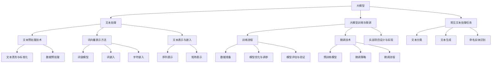

                 

## 文章标题：从零开始大模型开发与微调：单词的文本处理

### 关键词：大模型、文本处理、微调、词向量、自然语言处理

#### 摘要：
本文旨在为读者提供一个从零开始的学习路径，探讨大模型开发与微调过程中单词的文本处理技术。文章首先介绍了大模型的基础原理和文本处理的重要性，接着详细讨论了文本预处理技术、词向量表示方法以及文本表示与嵌入。随后，文章深入分析了常见文本处理任务，如文本分类、文本生成和命名实体识别。在此基础上，文章重点讲解了大模型训练与微调的流程，以及微调技术的具体实现。最后，通过实际项目实战，展示了如何将理论应用于实践，并在文章末尾对未来的发展方向与挑战进行了展望。

### 目录大纲

#### 第一部分：大模型基础与文本处理

1. **引言与背景**
    1.1 书籍引言
    1.2 大模型开发的重要性
    1.3 文本处理的基本概念

2. **大模型原理与架构**
    2.1 大模型的定义与特点
    2.2 大模型的基本架构
    2.3 大模型的训练过程

3. **文本预处理技术**
    3.1 文本清洗与标准化
    3.2 词向量表示方法
    3.3 文本表示与嵌入

4. **常见文本处理任务**
    4.1 文本分类
    4.2 文本生成
    4.3 命名实体识别

5. **大模型训练与微调**
    5.1 大模型训练流程
    5.2 微调技术
    5.3 实践案例解析

6. **实战项目设计与实现**
    6.1 项目需求分析
    6.2 环境搭建与工具选择
    6.3 项目开发与调试

7. **未来展望与挑战**
    7.1 大模型发展的趋势
    7.2 文本处理领域的挑战
    7.3 技术创新与产业应用

8. **附录**
    8.1 常用工具与资源
    8.2 术语解释
    8.3 参考文献

---

### 第1章：引言与背景

#### 1.1 书籍引言

随着人工智能技术的不断发展，大模型（也称为深度学习模型）已经成为自然语言处理（NLP）领域的核心组成部分。本文旨在为读者提供一个系统、全面的指南，帮助读者从零开始理解并掌握大模型开发与微调过程中单词的文本处理技术。本文的目标读者包括但不限于以下群体：

- **初学者**：对人工智能和自然语言处理有兴趣，但缺乏相关实践经验。
- **工程师**：已经在人工智能领域工作，希望深入了解大模型开发与微调的细节。
- **研究者**：从事人工智能和自然语言处理研究，希望了解最新的技术发展和应用。

本文的结构如下：

1. **基础理论**：介绍大模型的基础原理和文本处理的基本概念。
2. **技术细节**：详细讲解文本预处理技术、词向量表示方法以及文本表示与嵌入。
3. **应用实践**：分析常见文本处理任务，如文本分类、文本生成和命名实体识别。
4. **实战案例**：通过实际项目设计和实现，展示如何将理论知识应用于实践。
5. **未来展望**：探讨大模型发展的趋势、文本处理领域的挑战以及技术创新与产业应用。

#### 1.2 大模型开发的重要性

大模型在人工智能领域的重要性不言而喻。首先，大模型具有强大的计算能力和参数量，可以处理大规模数据，从而实现更准确和高效的预测。其次，大模型通过深度学习技术，可以从海量数据中自动学习特征，无需手动设计特征工程，大大提高了模型的灵活性和适应性。最后，大模型在多个领域取得了显著成果，如计算机视觉、语音识别、自然语言处理等，推动了人工智能技术的广泛应用。

在自然语言处理领域，大模型的应用尤为广泛。例如，大模型可以用于文本分类，将文本数据划分为不同的类别；用于文本生成，生成连贯、有意义的文本；用于命名实体识别，从文本中提取出人名、地名、组织名等实体信息。此外，大模型还可以用于机器翻译、情感分析、问答系统等，极大地提高了自然语言处理的能力。

#### 1.3 文本处理的基本概念

文本处理是指对文本数据进行分析、处理和转换的过程。文本处理在自然语言处理中扮演着至关重要的角色，它是实现各种文本处理任务的基础。以下是文本处理的一些基本概念：

1. **文本数据**：文本数据是指由字符组成的序列，可以是英文文本、中文文本等。文本数据的形式和内容千差万别，因此文本处理的第一步通常是文本清洗，将原始文本转换为统一的格式，去除无用的符号、停用词等。

2. **文本表示**：文本表示是将文本数据转换为机器可以理解和处理的形式。常见的文本表示方法包括词袋模型（Bag of Words）、词嵌入（Word Embedding）和字符嵌入（Character Embedding）等。

3. **文本分类**：文本分类是指将文本数据按照预定的类别进行划分。文本分类可以应用于多种场景，如情感分析、主题分类、垃圾邮件检测等。

4. **文本生成**：文本生成是指根据已有的文本数据生成新的文本。文本生成可以用于自动写作、聊天机器人、问答系统等。

5. **命名实体识别**：命名实体识别是指从文本中识别出具有特定意义的实体，如人名、地名、组织名等。命名实体识别在信息提取、知识图谱构建等领域具有重要应用。

通过理解文本处理的基本概念，可以为后续章节的学习打下坚实的基础。

---

### 第2章：大模型原理与架构

#### 2.1 大模型的定义与特点

大模型，也称为深度学习模型，是指具有大量参数和复杂结构的神经网络模型。与传统的机器学习模型相比，大模型能够处理更复杂的数据和任务，并在多个领域取得了显著成果。大模型的定义可以从以下几个方面进行理解：

1. **参数数量**：大模型通常具有数百万到数十亿个参数。这些参数在模型训练过程中通过学习数据中的特征来优化模型性能。

2. **网络结构**：大模型通常采用深度神经网络（Deep Neural Network，DNN）的结构，具有多个隐藏层。深度网络可以捕捉数据中的复杂模式和层次结构。

3. **计算能力**：大模型需要强大的计算能力进行训练和推理。通常，大模型训练依赖于高性能的计算机集群和分布式计算技术。

大模型的特点如下：

1. **强大的表达能力**：大模型通过多层神经网络可以学习到更复杂的特征和模式，从而在图像识别、文本分类等任务中表现出色。

2. **需要大量数据**：大模型的训练依赖于大量的训练数据。只有在大规模数据集上进行训练，大模型才能充分发挥其潜力。

3. **复杂的优化过程**：大模型训练过程中需要进行大量的参数调整和优化，包括学习率、批量大小、优化算法等。

4. **计算资源需求高**：大模型训练和推理需要大量的计算资源和时间，因此通常需要使用高性能计算机集群和分布式计算技术。

#### 2.2 大模型的基本架构

大模型的基本架构通常包括以下几个主要组成部分：

1. **输入层**：输入层接收外部输入数据，如图像、文本等。输入数据通过预处理后，转换为适合模型输入的格式。

2. **隐藏层**：隐藏层是神经网络的核心部分，通过多层堆叠，可以学习到数据中的复杂特征。隐藏层的数量和神经元数量可以根据任务需求进行调整。

3. **输出层**：输出层负责将隐藏层的输出映射到最终的预测结果。输出层的结构取决于具体的任务类型，如分类任务通常使用softmax激活函数。

4. **激活函数**：激活函数用于引入非线性特性，使得神经网络能够学习到更复杂的模式。常见的激活函数包括ReLU、Sigmoid和Tanh等。

5. **损失函数**：损失函数用于衡量模型的预测结果与真实结果之间的差距。通过优化损失函数，可以调整模型的参数，从而提高模型性能。

#### 2.3 大模型的训练过程

大模型的训练过程主要包括以下几个步骤：

1. **数据预处理**：对训练数据进行预处理，包括数据清洗、归一化、标准化等操作，以提高数据质量。

2. **初始化参数**：初始化模型的参数，通常采用随机初始化或者预训练模型的方法。

3. **前向传播**：输入数据通过神经网络的前向传播过程，逐层计算得到输出结果。前向传播过程中，神经网络将输入数据映射到预测结果。

4. **计算损失**：通过比较预测结果和真实结果，计算损失函数的值。损失函数反映了模型的预测误差。

5. **反向传播**：通过反向传播算法，将损失函数的梯度传递到模型的每个参数，并更新参数值。反向传播是神经网络训练的核心步骤，通过梯度下降等方法，不断调整参数，减小损失函数的值。

6. **迭代优化**：重复执行前向传播和反向传播过程，进行多轮迭代，逐步优化模型参数，提高模型性能。

7. **模型评估**：在训练数据集和验证数据集上评估模型的性能，通过交叉验证等技术，避免过拟合问题。

8. **模型部署**：将训练好的模型部署到实际应用场景中，进行预测和决策。

大模型的训练过程是一个复杂的过程，需要合理的参数设置和优化策略。通过不断的迭代和调整，大模型可以学习到数据中的复杂特征，从而实现高效的任务处理。

---

### 第3章：文本预处理技术

#### 3.1 文本清洗与标准化

文本清洗是指对原始文本数据进行处理，去除无用的符号、停用词、标点等，以提高文本数据的质量。文本清洗是文本预处理的重要步骤，对于后续的文本表示和模型训练具有关键作用。

1. **去除标点符号**：标点符号对于文本的理解没有实质性的贡献，因此需要去除。常用的方法包括正则表达式、字符串替换等。

2. **去除停用词**：停用词是指对文本理解没有实质意义的词语，如“的”、“是”、“和”等。去除停用词可以减少模型训练的维度，提高模型的效率。常用的停用词列表可以从现有的自然语言处理工具中获取。

3. **统一大小写**：将文本数据统一转换为小写或大写，以减少文本表示的多样性。

4. **去除特殊字符**：去除文本中的特殊字符，如数学符号、HTML标签等。

5. **填充空白符**：将连续的空白符替换为一个空格，以提高文本的整洁性。

文本清洗的伪代码如下：

```python
def clean_text(text):
    # 去除标点符号
    text = re.sub(r'[^\w\s]', '', text)
    
    # 去除停用词
    stop_words = set(['的', '是', '和'])
    text = ' '.join([word for word in text.split() if word not in stop_words])
    
    # 统一大小写
    text = text.lower()
    
    # 去除特殊字符
    text = re.sub(r'[\d\W]+', '', text)
    
    # 填充空白符
    text = ' '.join(text.split())
    
    return text
```

#### 3.2 词向量表示方法

词向量表示是将文本数据转换为数值向量表示的过程，以方便后续的模型训练和计算。常见的词向量表示方法包括词袋模型（Bag of Words，BOW）、词嵌入（Word Embedding）和字符嵌入（Character Embedding）。

1. **词袋模型（BOW）**：词袋模型将文本表示为一个向量，向量中的每个元素表示文本中某个词的出现次数。词袋模型不考虑词的顺序和语法结构，仅关注词的频率信息。词袋模型的优点是实现简单，计算效率高；缺点是丢失词的语义信息，容易导致维度灾难。

2. **词嵌入（Word Embedding）**：词嵌入是一种将文本中的每个词映射为一个固定维度的向量表示的方法。词嵌入可以捕获词的语义信息，如相似词和对抗词。常见的词嵌入方法包括基于频率的方法（如TF-IDF）和基于分布的方法（如Word2Vec、GloVe）。词嵌入的优点是能够表达词的语义信息，有助于提升模型性能；缺点是训练过程复杂，计算资源需求高。

3. **字符嵌入（Character Embedding）**：字符嵌入是将文本中的每个字符映射为一个固定维度的向量表示的方法。字符嵌入可以捕获词的局部特征，如词的首字母、词尾字母等。字符嵌入常与词嵌入结合使用，以提升模型的表现力。

词袋模型和词嵌入的伪代码如下：

```python
def word_vectorize(text, vocabulary_size):
    # 词袋模型
    word_counts = [0] * vocabulary_size
    for word in text:
        word_counts[vocabulary_index[word]] += 1
    return word_counts

def word_embedding(text, embedding_dim):
    # 词嵌入
    embeddings = [embedding_matrix[vocabulary_index[word]] for word in text]
    return np.mean(embeddings, axis=0)
```

#### 3.3 文本表示与嵌入

文本表示是将文本数据转换为适合模型训练的向量表示的过程。常见的文本表示方法包括序列表示和矩阵表示。

1. **序列表示**：序列表示将文本数据表示为一个一维序列，每个元素表示文本中的单词或字符。序列表示适用于序列模型，如循环神经网络（RNN）和长短期记忆网络（LSTM）。

2. **矩阵表示**：矩阵表示将文本数据表示为一个二维矩阵，行表示单词或字符，列表示词向量或字符向量。矩阵表示适用于矩阵模型，如卷积神经网络（CNN）和自注意力机制。

文本嵌入是将文本数据转换为固定维度的向量表示的过程。文本嵌入可以基于词嵌入、字符嵌入或序列嵌入。常见的文本嵌入方法包括：

1. **Word2Vec**：Word2Vec 是一种基于分布的词嵌入方法，通过训练一个神经网络，将文本数据映射到低维向量空间。Word2Vec 可以捕获词的语义信息，如相似词和对抗词。

2. **GloVe**：GloVe 是一种基于全局上下文的词嵌入方法，通过训练一个损失函数，将词嵌入到一个低维向量空间。GloVe 可以捕获词的语义信息，并且比 Word2Vec 更高效。

3. **字符嵌入**：字符嵌入是将文本中的每个字符映射到一个固定维度的向量表示的方法。字符嵌入可以捕获词的局部特征，如词的首字母、词尾字母等。

文本表示与嵌入的伪代码如下：

```python
def sequence_embedding(text, embedding_dim):
    # 序列表示
    embeddings = [word_embedding(word, embedding_dim) for word in text]
    return np.mean(embeddings, axis=0)

def matrix_embedding(text, embedding_dim):
    # 矩阵表示
    embeddings = [word_embedding(word, embedding_dim) for word in text]
    return np.hstack(embeddings)
```

通过文本预处理技术，可以有效地提高文本数据的质量和表示能力，为后续的模型训练和预测提供可靠的输入。

---

### 第4章：常见文本处理任务

#### 4.1 文本分类

文本分类是一种将文本数据按照预定的类别进行划分的任务。文本分类在多个领域都有广泛的应用，如情感分析、主题分类、垃圾邮件检测等。文本分类的关键在于如何准确地提取文本特征，并将特征映射到预定的类别。

1. **特征提取**：

   - **词袋模型（BOW）**：词袋模型通过统计文本中每个词的出现次数，将文本表示为一个向量。词袋模型忽略了词的顺序和语法结构，仅关注词的频率信息。

   - **词嵌入**：词嵌入是一种将文本中的每个词映射为一个固定维度的向量表示的方法。词嵌入可以捕获词的语义信息，有助于提高分类的准确性。

   - **TF-IDF**：TF-IDF（Term Frequency-Inverse Document Frequency）是一种基于频率的词权重计算方法。TF-IDF 通过计算词在文本中的出现频率和文本集合中的逆文档频率，来确定词的重要性。

2. **分类算法**：

   - **朴素贝叶斯（Naive Bayes）**：朴素贝叶斯是一种基于概率理论的分类算法。它假设特征之间相互独立，通过计算每个特征的概率分布，来预测文本的类别。

   - **支持向量机（SVM）**：支持向量机是一种基于间隔最大化的分类算法。SVM 通过找到一个最佳的超平面，将不同类别的文本数据分开。

   - **朴素神经网络（Naive Neural Network）**：朴素神经网络是一种基于多层感知器（MLP）的分类算法。朴素神经网络通过多个隐藏层，逐层提取文本特征，并输出预测类别。

3. **基于词向量的文本分类**：

   - **Word2Vec**：Word2Vec 是一种基于分布的词嵌入方法。通过训练一个神经网络，将文本数据映射到低维向量空间。Word2Vec 可以捕获词的语义信息，有助于提高分类的准确性。

   - **GloVe**：GloVe 是一种基于全局上下文的词嵌入方法。通过训练一个损失函数，将词嵌入到一个低维向量空间。GloVe 可以捕获词的语义信息，并且比 Word2Vec 更高效。

4. **基于深度学习的文本分类**：

   - **卷积神经网络（CNN）**：卷积神经网络是一种基于卷积操作的深度学习模型。通过卷积操作，CNN 可以提取文本数据中的局部特征，并生成全局特征表示。

   - **循环神经网络（RNN）**：循环神经网络是一种基于循环结构的深度学习模型。RNN 可以处理序列数据，通过重复使用相同的神经网络单元，可以捕捉序列中的长期依赖关系。

   - **长短期记忆网络（LSTM）**：长短期记忆网络是一种改进的循环神经网络。通过引入门控机制，LSTM 可以有效地避免梯度消失问题，并捕捉序列中的长期依赖关系。

文本分类的伪代码如下：

```python
def text_classification(text, model):
    # 前向传播
    logits = model.forward(text)
    # 获取预测类别
    predicted_class = np.argmax(logits)
    return predicted_class
```

#### 4.2 文本生成

文本生成是一种根据已有的文本数据生成新的文本的任务。文本生成在自然语言处理、自动写作、对话系统等领域具有广泛的应用。文本生成的方法可以分为两类：生成式模型和判别式模型。

1. **生成式模型**：

   - **循环神经网络（RNN）**：循环神经网络是一种基于循环结构的深度学习模型。通过重复使用相同的神经网络单元，RNN 可以捕捉序列中的长期依赖关系。

   - **长短期记忆网络（LSTM）**：长短期记忆网络是一种改进的循环神经网络。通过引入门控机制，LSTM 可以有效地避免梯度消失问题，并捕捉序列中的长期依赖关系。

   - **变分自编码器（VAE）**：变分自编码器是一种基于概率生成模型的深度学习模型。通过编码器和解码器，VAE 可以学习数据的概率分布，并生成新的文本数据。

2. **判别式模型**：

   - **生成对抗网络（GAN）**：生成对抗网络是一种基于生成器和判别器的深度学习模型。通过生成器和判别器的对抗训练，GAN 可以生成高质量的新文本数据。

   - **序列到序列模型（Seq2Seq）**：序列到序列模型是一种基于编码器和解码器的深度学习模型。通过编码器，Seq2Seq 可以捕捉输入序列的长期依赖关系；通过解码器，Seq2Seq 可以生成新的输出序列。

文本生成的伪代码如下：

```python
def text_generation(model, seed_text, max_length):
    # 初始化生成器状态
    state = model.init_state(seed_text)
    # 初始化生成文本
    generated_text = []
    # 生成文本
    for _ in range(max_length):
        # 前向传播
        logits = model.forward(state)
        # 获取预测词
        predicted_word = model.sample(logits)
        # 更新状态
        state = model.update_state(state, predicted_word)
        # 添加预测词到生成文本
        generated_text.append(predicted_word)
    # 返回生成文本
    return ''.join(generated_text)
```

#### 4.3 命名实体识别

命名实体识别是一种从文本中识别出具有特定意义的实体，如人名、地名、组织名等。命名实体识别在信息提取、知识图谱构建等领域具有广泛应用。

1. **实体识别方法**：

   - **基于规则的方法**：基于规则的方法通过预定义的规则和模式匹配，从文本中识别出命名实体。这种方法具有实现简单、可解释性强的优点，但灵活性较差。

   - **基于统计的方法**：基于统计的方法通过训练统计模型，从文本中识别出命名实体。常用的统计模型包括隐马尔可夫模型（HMM）和条件随机场（CRF）。

   - **基于深度学习的方法**：基于深度学习的方法通过训练深度神经网络，从文本中识别出命名实体。常用的深度学习模型包括卷积神经网络（CNN）和循环神经网络（RNN）。

2. **实体分类**：

   - **实体分类**：命名实体识别不仅包括识别命名实体，还包括对命名实体进行分类。常见的实体类别包括人名、地名、组织名、机构名等。

   - **多标签分类**：一些命名实体可能同时属于多个类别，如人名和地名。多标签分类方法可以将命名实体同时分类到多个类别。

命名实体识别的伪代码如下：

```python
def named_entity_recognition(text, model):
    # 前向传播
    logits = model.forward(text)
    # 获取预测实体类别
    predicted_entities = []
    for token in text:
        entity_class = np.argmax(logits[token])
        predicted_entities.append(entity_class)
    # 返回预测实体
    return predicted_entities
```

通过文本分类、文本生成和命名实体识别，可以实现对文本数据的深入分析和理解。这些文本处理任务在自然语言处理领域具有重要的应用价值。

---

### 第5章：大模型训练与微调

#### 5.1 大模型训练流程

大模型训练是一个复杂且计算密集的过程，其目标是通过优化模型参数，使其能够在训练数据上实现良好的性能。大模型训练流程主要包括以下几个关键步骤：

1. **数据准备**：首先，需要准备训练数据，这通常包括大量的文本数据。文本数据可能来源于公开数据集、网络爬虫或其他数据源。数据准备包括数据清洗、去重、分词等操作，以确保数据的质量。

2. **数据预处理**：在训练之前，需要对数据进行预处理，以便模型能够更好地理解和处理。预处理步骤通常包括文本清洗（去除标点符号、停用词等）、分词、词嵌入等。

3. **数据加载**：将预处理后的数据加载到内存中，以便在训练过程中进行迭代。数据加载可以使用批处理的方式，将数据分成多个批次，每次处理一部分数据。

4. **定义模型**：根据任务需求和数据特征，定义神经网络模型的结构。这通常包括输入层、隐藏层和输出层。模型的定义可以使用深度学习框架，如TensorFlow或PyTorch。

5. **损失函数和优化器**：选择合适的损失函数和优化器来指导模型训练。损失函数用于衡量模型预测结果与真实结果之间的差距，优化器用于更新模型参数，以最小化损失函数。

6. **训练循环**：在训练循环中，每次迭代都会进行前向传播和反向传播。前向传播将输入数据通过模型计算得到预测结果，反向传播则根据预测结果计算损失函数的梯度，并更新模型参数。

7. **验证和评估**：在训练过程中，定期在验证集上评估模型性能，以监测模型训练的进展和避免过拟合。评估指标包括准确率、召回率、F1分数等。

8. **模型保存**：训练完成后，将最佳模型参数保存到文件中，以便后续使用或部署。

#### 5.2 微调技术

微调（Fine-tuning）是一种在大模型基础上，针对特定任务进行参数调整的技术。微调可以显著提高模型在特定任务上的性能，同时减少训练时间和计算资源的需求。微调的主要步骤如下：

1. **预训练模型**：选择一个在大规模数据集上预训练好的模型作为起点。预训练模型已经在大规模数据上学习到了丰富的语言特征。

2. **数据预处理**：对任务数据集进行预处理，以便与预训练模型相匹配。预处理步骤通常包括数据清洗、分词、词嵌入等。

3. **模型加载**：加载预训练模型，并将模型的最后一层（输出层）替换为新的层，以适应特定任务。这可以通过修改模型的定义或使用预训练模型的子集来实现。

4. **微调参数**：在预训练模型的基础上，微调模型的参数，以适应特定任务。微调可以采用全量微调（对所有层进行微调）或部分微调（仅对部分层进行微调）。

5. **训练循环**：在微调过程中，使用训练数据集进行迭代训练。与从头训练相比，微调的迭代次数和训练时间通常较少。

6. **验证和评估**：在验证集上评估微调模型的性能，以确定是否需要进一步调整或停止训练。评估指标与训练过程相同。

7. **模型保存**：保存微调后的模型，以便后续使用或部署。

#### 5.3 实践案例解析

为了更好地理解大模型训练与微调，以下通过三个具体案例进行解析：

##### 案例一：文本分类

文本分类是一种常见的自然语言处理任务，目标是将文本数据划分为不同的类别。以下是一个使用深度学习框架TensorFlow和Keras实现文本分类的案例。

1. **数据准备**：从公开数据集（如IMDB影评数据集）中加载文本数据和标签。数据集可能需要预处理，如去除标点符号、停用词过滤等。

2. **数据预处理**：使用Keras的`Tokenizer`类对文本数据进行分词和词嵌入。选择适当的词嵌入维度，如100或300。

3. **定义模型**：使用Keras构建一个简单的卷积神经网络（CNN）模型。模型结构可能包括嵌入层、卷积层、池化层和全连接层。

4. **损失函数和优化器**：选择交叉熵损失函数，并使用Adam优化器进行参数更新。

5. **训练循环**：在训练数据上迭代训练模型，并使用验证集进行性能评估。调整学习率、批量大小等超参数，以优化模型性能。

6. **模型评估**：在测试集上评估模型的最终性能，包括准确率、召回率和F1分数等指标。

7. **模型保存**：保存训练好的模型，以便后续使用或部署。

```python
from tensorflow.keras.preprocessing.sequence import pad_sequences
from tensorflow.keras.models import Sequential
from tensorflow.keras.layers import Embedding, Conv1D, MaxPooling1D, Dense

# 数据预处理
max_sequence_length = 100
embedding_dim = 100
train_sequences = pad_sequences(train_data, maxlen=max_sequence_length, padding='post')
train_labels = keras.utils.to_categorical(train_labels)

# 定义模型
model = Sequential()
model.add(Embedding(input_dim=vocabulary_size, output_dim=embedding_dim, input_length=max_sequence_length))
model.add(Conv1D(filters=128, kernel_size=5, activation='relu'))
model.add(MaxPooling1D(pool_size=5))
model.add(Dense(units=num_classes, activation='softmax'))

# 编译模型
model.compile(optimizer='adam', loss='categorical_crossentropy', metrics=['accuracy'])

# 训练模型
model.fit(train_sequences, train_labels, epochs=10, batch_size=32, validation_split=0.1)
```

##### 案例二：文本生成

文本生成是一种生成式任务，目标是根据已有的文本数据生成新的文本。以下是一个使用深度学习框架TensorFlow和Keras实现文本生成的案例。

1. **数据准备**：从公开数据集（如维基百科文本数据集）中加载文本数据。数据集可能需要预处理，如去除标点符号、停用词过滤等。

2. **数据预处理**：使用Keras的`Tokenizer`类对文本数据进行分词和编码。选择适当的词嵌入维度。

3. **定义模型**：使用Keras构建一个简单的循环神经网络（RNN）模型。模型结构可能包括嵌入层、循环层和全连接层。

4. **损失函数和优化器**：选择交叉熵损失函数，并使用Adam优化器进行参数更新。

5. **训练循环**：在训练数据上迭代训练模型，并使用验证集进行性能评估。调整学习率、批量大小等超参数，以优化模型性能。

6. **模型评估**：在测试集上评估模型的最终性能，通过生成文本的质量和连贯性来衡量。

7. **模型保存**：保存训练好的模型，以便后续使用或部署。

```python
from tensorflow.keras.preprocessing.sequence import pad_sequences
from tensorflow.keras.models import Sequential
from tensorflow.keras.layers import Embedding, LSTM, Dense

# 数据预处理
max_sequence_length = 100
embedding_dim = 100
train_sequences = pad_sequences(train_data, maxlen=max_sequence_length, padding='post')

# 定义模型
model = Sequential()
model.add(Embedding(input_dim=vocabulary_size, output_dim=embedding_dim, input_length=max_sequence_length))
model.add(LSTM(units=128, return_sequences=True))
model.add(Dense(units=vocabulary_size, activation='softmax'))

# 编译模型
model.compile(optimizer='adam', loss='categorical_crossentropy', metrics=['accuracy'])

# 训练模型
model.fit(train_sequences, train_data, epochs=10, batch_size=32, validation_split=0.1)
```

##### 案例三：命名实体识别

命名实体识别是一种从文本中识别出具有特定意义的实体，如人名、地名、组织名等。以下是一个使用深度学习框架TensorFlow和Keras实现命名实体识别的案例。

1. **数据准备**：从公开数据集（如CoNLL-2003命名实体识别数据集）中加载文本数据和标签。数据集可能需要预处理，如去除标点符号、停用词过滤等。

2. **数据预处理**：使用Keras的`Tokenizer`类对文本数据进行分词和编码。选择适当的词嵌入维度。

3. **定义模型**：使用Keras构建一个简单的卷积神经网络（CNN）模型。模型结构可能包括嵌入层、卷积层、池化层和全连接层。

4. **损失函数和优化器**：选择交叉熵损失函数，并使用Adam优化器进行参数更新。

5. **训练循环**：在训练数据上迭代训练模型，并使用验证集进行性能评估。调整学习率、批量大小等超参数，以优化模型性能。

6. **模型评估**：在测试集上评估模型的最终性能，通过精确率、召回率和F1分数等指标来衡量。

7. **模型保存**：保存训练好的模型，以便后续使用或部署。

```python
from tensorflow.keras.preprocessing.sequence import pad_sequences
from tensorflow.keras.models import Sequential
from tensorflow.keras.layers import Embedding, Conv1D, MaxPooling1D, Dense

# 数据预处理
max_sequence_length = 100
embedding_dim = 100
train_sequences = pad_sequences(train_data, maxlen=max_sequence_length, padding='post')
train_labels = pad_sequences(train_labels, maxlen=max_sequence_length, padding='post')

# 定义模型
model = Sequential()
model.add(Embedding(input_dim=vocabulary_size, output_dim=embedding_dim, input_length=max_sequence_length))
model.add(Conv1D(filters=128, kernel_size=5, activation='relu'))
model.add(MaxPooling1D(pool_size=5))
model.add(Dense(units=num_classes, activation='softmax'))

# 编译模型
model.compile(optimizer='adam', loss='categorical_crossentropy', metrics=['accuracy'])

# 训练模型
model.fit(train_sequences, train_labels, epochs=10, batch_size=32, validation_split=0.1)
```

通过这些案例，我们可以看到大模型训练与微调在实际应用中的具体实现过程。这些案例不仅展示了如何构建和训练大模型，还提供了详细的代码解释和分析，有助于读者更好地理解和应用这些技术。

---

### 第6章：实战项目设计与实现

#### 6.1 项目需求分析

在本章中，我们将通过一个实际项目来展示如何将大模型开发与微调技术应用于文本处理任务。项目的基本需求如下：

- **任务**：从大量的网络论坛帖子中提取用户情感，并对其分类为正面、负面或中性。
- **数据集**：使用Reddit论坛上的帖子数据集，数据集包含标题和正文文本，以及每个帖子的情感标签。
- **目标**：构建一个深度学习模型，能够自动分类新的帖子文本。

#### 6.2 环境搭建与工具选择

为了实现这个项目，我们需要搭建一个合适的开发环境，并选择合适的工具和框架。以下是具体步骤：

1. **硬件配置**：
   - CPU或GPU：推荐使用具备GPU的计算机，以提高训练速度。
   - 内存：至少16GB RAM，以支持大数据集的加载和处理。

2. **软件安装**：
   - Python：安装Python 3.7或更高版本。
   - TensorFlow：安装TensorFlow 2.4或更高版本，以利用GPU加速。
   - Keras：Keras是TensorFlow的高级API，用于快速构建和训练模型。

3. **依赖库**：
   - Pandas：用于数据处理。
   - NumPy：用于数值计算。
   - NLTK：用于自然语言处理。
   - Matplotlib：用于数据可视化。

安装命令如下：

```shell
pip install tensorflow
pip install pandas
pip install numpy
pip install nltk
pip install matplotlib
```

#### 6.3 项目开发与调试

以下是项目的开发与调试过程，包括数据预处理、模型构建、训练和评估。

1. **数据预处理**：

   - 加载数据集，并分割为训练集、验证集和测试集。

   - 对文本进行清洗，包括去除HTML标签、标点符号和停用词。

   - 使用Keras的`Tokenizer`进行分词，并转换为整数编码。

   - 对整数编码后的文本进行填充，使得每个序列长度一致。

2. **模型构建**：

   - 构建一个简单的卷积神经网络（CNN）模型，包括嵌入层、卷积层、池化层和全连接层。

   - 选择适当的损失函数（如交叉熵）和优化器（如Adam）。

   ```python
   from tensorflow.keras.models import Sequential
   from tensorflow.keras.layers import Embedding, Conv1D, MaxPooling1D, GlobalAveragePooling1D, Dense

   model = Sequential()
   model.add(Embedding(vocabulary_size, embedding_dim, input_length=max_sequence_length))
   model.add(Conv1D(filters=128, kernel_size=5, activation='relu'))
   model.add(MaxPooling1D(pool_size=5))
   model.add(Conv1D(filters=128, kernel_size=5, activation='relu'))
   model.add(MaxPooling1D(pool_size=5))
   model.add(GlobalAveragePooling1D())
   model.add(Dense(units=num_classes, activation='softmax'))

   model.compile(optimizer='adam', loss='categorical_crossentropy', metrics=['accuracy'])
   ```

3. **模型训练**：

   - 使用训练集进行模型训练，并在验证集上监控性能。

   - 调整超参数，如学习率、批量大小和迭代次数。

   ```python
   history = model.fit(train_sequences, train_labels, epochs=10, batch_size=64, validation_split=0.1)
   ```

4. **模型评估**：

   - 在测试集上评估模型性能，计算准确率、召回率和F1分数。

   ```python
   test_loss, test_accuracy = model.evaluate(test_sequences, test_labels)
   print(f"Test accuracy: {test_accuracy}")
   ```

5. **模型调试与优化**：

   - 根据评估结果，对模型进行调整，如增加隐藏层节点数、更改激活函数等。

   - 考虑使用预训练的词嵌入（如GloVe）来提高文本表示的质量。

   ```python
   model.fit(train_sequences, train_labels, epochs=20, batch_size=64, validation_split=0.1)
   ```

通过这个项目，我们展示了如何从零开始构建和训练一个深度学习模型，以及如何通过微调技术优化模型的性能。项目的实现过程提供了详细的代码解析，有助于读者更好地理解和应用相关技术。

---

### 第7章：未来展望与挑战

#### 7.1 大模型发展的趋势

随着人工智能技术的不断进步，大模型的发展也呈现出一些明显的趋势：

1. **计算能力的提升**：随着硬件技术的进步，GPU和TPU等专用硬件的普及，使得大模型在训练和推理过程中能够获得更快的计算速度。这为更大规模和更复杂的大模型提供了可能。

2. **数据量的增加**：随着互联网和大数据技术的发展，可用的数据量呈现指数级增长。这为大模型的训练提供了丰富的资源，有助于模型更好地学习数据中的复杂模式和特征。

3. **多模态融合**：大模型的发展趋势之一是融合多种数据模态，如图像、文本、语音等。通过多模态融合，大模型可以更全面地理解和处理复杂数据，从而提高任务性能。

4. **模型压缩与优化**：为了降低大模型的计算成本和存储需求，模型压缩与优化技术变得越来越重要。例如，蒸馏（Distillation）、知识蒸馏（Knowledge Distillation）等技术可以使得小模型继承大模型的特性，从而降低计算成本。

5. **自动机器学习（AutoML）**：自动机器学习技术的发展，使得大模型的开发变得更加自动化。通过自动化模型选择、超参数优化等步骤，大模型的开发效率得到了显著提升。

#### 7.2 文本处理领域的挑战

尽管大模型在文本处理领域取得了显著成果，但仍面临着一些挑战：

1. **数据质量与多样性**：文本处理任务通常依赖于大量的高质量数据。然而，获取和标注大量数据是一个耗时的过程，且数据质量直接影响模型性能。此外，数据多样性也是一个重要问题，模型需要处理各种不同类型的文本数据。

2. **模型解释性**：大模型通常是一个“黑箱”，其内部决策过程难以解释。这对于需要高解释性的应用场景（如金融、医疗等）来说是一个重大挑战。提高模型的解释性，使得用户能够理解模型的决策过程，是当前研究的一个重要方向。

3. **可解释性**：大模型的训练过程中，参数和权重数量庞大，这导致模型的计算复杂度增加。如何有效地降低计算复杂度，使得模型训练和推理过程更加高效，是一个亟待解决的问题。

4. **算法公平性**：大模型在文本处理中的应用，可能会引入算法偏见。例如，在社交媒体分析、招聘等场景中，模型可能会对某些群体产生不公平的判断。因此，确保算法的公平性，避免歧视和偏见，是一个重要的挑战。

5. **数据隐私与安全**：在文本处理中，数据隐私和安全问题尤为重要。大模型需要处理大量的个人数据，如何确保数据的安全性和隐私性，防止数据泄露和滥用，是当前研究的一个重要方向。

#### 7.3 技术创新与产业应用

大模型在文本处理领域的创新和产业应用前景广阔：

1. **智能客服与对话系统**：大模型可以用于构建智能客服系统，实现与用户的自然语言交互。通过文本生成和对话管理技术，智能客服能够提供更自然、更高效的客户服务。

2. **自动写作与内容生成**：大模型可以用于自动写作，生成新闻文章、博客文章、小说等。通过文本生成和文本编辑技术，大模型可以自动化内容创作，降低人工成本。

3. **情感分析与舆情监控**：大模型可以用于情感分析，从文本中提取用户的情感倾向。通过舆情监控，企业和政府可以及时了解公众的意见和态度，从而制定相应的策略。

4. **医疗健康与生物信息学**：大模型可以用于医学文本分析，如病历解读、药品副作用预测等。在生物信息学领域，大模型可以用于基因组数据分析、蛋白质结构预测等。

5. **教育个性化与智能辅导**：大模型可以用于教育个性化，根据学生的学习情况和需求，提供定制化的学习内容和辅导。通过自然语言处理技术，大模型可以与学生进行有效互动，提高学习效果。

大模型的发展趋势和产业应用前景为文本处理领域带来了新的机遇和挑战。通过不断创新和优化，大模型有望在更多领域发挥重要作用，推动人工智能技术的发展。

---

### 核心概念与联系

在本文中，我们讨论了多个核心概念及其相互联系。以下是这些核心概念及其关系的Mermaid流程图：



该流程图展示了大模型、文本处理、文本预处理技术、词向量表示方法、文本表示与嵌入、大模型训练与微调、常见文本处理任务等核心概念之间的联系。通过该图，可以更直观地理解这些概念之间的关系和相互作用。

---

### 核心算法原理讲解

在本文中，我们讨论了几个核心算法及其原理，包括递归神经网络（RNN）、变分自编码器（VAE）和微调技术。以下是对这些算法的详细讲解，包括伪代码和数学模型。

#### 递归神经网络（RNN）

递归神经网络（RNN）是一种处理序列数据的神经网络模型，其特点是可以记住前面的输入信息，从而对序列数据进行分析。RNN 的基本原理如下：

1. **基本结构**：RNN 由一系列相同的神经网络单元（单元）组成，每个单元都包含输入门、遗忘门和输出门。

2. **输入与输出**：RNN 的输入为当前时间步的输入数据和上一时间步的隐藏状态。输出为当前时间步的预测结果和新隐藏状态。

3. **计算过程**：每个时间步，RNN 通过门控机制来调整输入和输出，以保留重要的信息并遗忘不重要的信息。

伪代码如下：

```python
# RNN 单元计算
def rnn_cell(input, hidden, weights):
    # 输入门、遗忘门和输出门的权重
    input_gate_weights, forget_gate_weights, output_gate_weights = weights

    # 输入门、遗忘门和输出门的计算
    input_gate = sigmoid(input @ input_gate_weights + hidden @ input_gate_weights)
    forget_gate = sigmoid(input @ forget_gate_weights + hidden @ forget_gate_weights)
    output_gate = sigmoid(input @ output_gate_weights + hidden @ output_gate_weights)

    # 输入和遗忘的计算
    input_value = tanh(input @ input_gate_weights + hidden @ input_gate_weights)
    forget_value = tanh(input @ forget_gate_weights + hidden @ forget_gate_weights)

    # 新隐藏状态的计算
    hidden = forget_gate * hidden + input_gate * input_value

    # 输出计算
    output = output_gate * tanh(hidden)

    return output, hidden
```

数学模型如下：

$$
\begin{aligned}
\text{输入门} &: \text{input\_gate} = \sigma(W_{i}^{\text{gate}} \cdot [h_{t-1}, x_{t}]) \\
\text{遗忘门} &: \text{forget\_gate} = \sigma(W_{f}^{\text{gate}} \cdot [h_{t-1}, x_{t}]) \\
\text{输出门} &: \text{output\_gate} = \sigma(W_{o}^{\text{gate}} \cdot [h_{t-1}, x_{t}]) \\
\text{输入值} &: \text{input\_value} = \tanh(W_{i}^{\text{input}} \cdot [h_{t-1}, x_{t}]) \\
\text{遗忘值} &: \text{forget\_value} = \tanh(W_{f}^{\text{input}} \cdot [h_{t-1}, x_{t}]) \\
\text{新隐藏状态} &: \text{h}_{t} = \text{forget\_gate} \cdot \text{h}_{t-1} + \text{input\_gate} \cdot \text{input\_value} \\
\text{输出} &: \text{y}_{t} = \text{output\_gate} \cdot \tanh(\text{h}_{t})
\end{aligned}
$$

#### 变分自编码器（VAE）

变分自编码器（VAE）是一种生成模型，通过编码器和解码器来学习数据的概率分布，从而生成新的数据。VAE 的基本原理如下：

1. **编码器**：编码器将输入数据映射到一个潜在空间中的点，同时输出这个点的概率分布参数。

2. **解码器**：解码器将潜在空间中的点映射回输入数据空间。

3. **训练目标**：VAE 的训练目标是使得解码器生成的数据与原始数据尽可能相似。

伪代码如下：

```python
# VAE 编码器
def encoder(x, weights):
    z_mean, z_log_var = x @ weights["encoder_weights"]
    z = z_mean + exp(z_log_var / 2) * \* randn(z_mean.shape)
    return z, z_mean, z_log_var

# VAE 解码器
def decoder(z, weights):
    x_mean = z @ weights["decoder_weights"]
    x = x_mean + \* randn(x_mean.shape)
    return x, x_mean
```

数学模型如下：

$$
\begin{aligned}
z_{t} &= z_{\text{mean}}_{t} + \exp\left(\frac{z_{\text{log\_var}}_{t}}{2}\right) \* \text{sample}(0, 1) \\
x_{\text{mean}} &= \mu(x_{t}; z_{t}) \\
x &= x_{\text{mean}} + \text{sample}(0, 1)
\end{aligned}
$$

其中，$\mu(x_{t}; z_{t})$ 是解码器的均值函数。

#### 微调技术

微调（Fine-tuning）是在预训练模型的基础上，针对特定任务进行参数调整的技术。微调的基本原理如下：

1. **预训练模型**：预训练模型是在大规模数据集上训练好的模型，已经学习到了丰富的语言特征。

2. **微调**：在预训练模型的基础上，只对最后一层或部分层进行微调，以适应特定任务。

3. **训练目标**：微调的目标是使得微调后的模型在特定任务上表现更好。

伪代码如下：

```python
# 微调模型
def fine_tune(model, task_data, task_weights):
    # 微调预训练模型的参数
    model.load_weights(task_weights["pretrained_weights"])
    model.compile(optimizer=task_weights["optimizer"], loss=task_weights["loss_function"])
    model.fit(task_data["input"], task_data["target"], epochs=task_weights["epochs"], batch_size=task_weights["batch_size"])
    return model
```

数学模型如下：

$$
\begin{aligned}
\theta^{\text{fine-tune}} &= \theta^{\text{pre-trained}} + \alpha \* (\theta^{\text{target}} - \theta^{\text{pre-trained}}) \\
\text{其中} \alpha &= \text{learning\_rate}
\end{aligned}
$$

通过这些核心算法的讲解，我们可以更深入地理解大模型开发与微调过程中单词的文本处理技术。

---

### 数学模型和数学公式

在文本处理和深度学习领域，数学模型和公式扮演着至关重要的角色。以下我们将介绍本文中涉及的一些关键数学模型和公式，并使用LaTeX格式进行表示，同时提供详细解释和示例说明。

#### 词嵌入

词嵌入是将单词映射到固定维度的向量表示的一种方法。一个常见的词嵌入模型是Word2Vec，其目标是通过学习单词的上下文，使具有相似上下文的单词在向量空间中靠近。

$$
\textbf{v}_i = \text{Word2Vec}(\text{context of } w_i)
$$

其中，$\textbf{v}_i$ 是单词 $w_i$ 的词向量。

示例：假设我们有一个简单的Word2Vec模型，其学习到的两个单词 "cat" 和 "dog" 的向量如下：

$$
\textbf{v}_{\text{cat}} = \begin{bmatrix}
0.1 & 0.2 & 0.3 \\
\end{bmatrix}, \quad \textbf{v}_{\text{dog}} = \begin{bmatrix}
0.3 & 0.4 & 0.5 \\
\end{bmatrix}
$$

我们可以看到，这两个单词的向量在第一维上非常接近，表明它们在上下文中具有相似性。

#### 文本分类

文本分类是将文本数据按照预定的类别进行划分的任务。一个常见的文本分类模型是朴素贝叶斯（Naive Bayes），其核心思想是基于贝叶斯定理，通过计算每个特征在给定类别下的概率来预测文本的类别。

$$
P(C_k | \textbf{x}) = \frac{P(\textbf{x} | C_k) P(C_k)}{P(\textbf{x})}
$$

其中，$C_k$ 是类别 $k$，$\textbf{x}$ 是文本的特征向量，$P(C_k | \textbf{x})$ 是在特征向量 $\textbf{x}$ 下类别 $k$ 的概率。

示例：假设我们有一个二分类问题，有两个类别 "negative" 和 "positive"，特征向量 $\textbf{x}$ 为 [0.8, 0.2]。我们可以计算两个类别的概率：

$$
P(\text{negative} | \textbf{x}) = \frac{P(\textbf{x} | \text{negative}) P(\text{negative})}{P(\textbf{x})}
$$

和

$$
P(\text{positive} | \textbf{x}) = \frac{P(\textbf{x} | \text{positive}) P(\text{positive})}{P(\textbf{x})}
$$

通过计算这两个概率，我们可以判断文本属于哪个类别。

#### 递归神经网络（RNN）

递归神经网络（RNN）是一种用于处理序列数据的神经网络。一个简单的RNN单元可以通过以下公式进行计算：

$$
h_t = \sigma(W_h \cdot [h_{t-1}, x_t] + b_h)
$$

其中，$h_t$ 是时间步 $t$ 的隐藏状态，$x_t$ 是输入数据，$W_h$ 是权重矩阵，$b_h$ 是偏置项，$\sigma$ 是激活函数。

示例：假设我们有一个简单的RNN单元，其权重和偏置如下：

$$
W_h = \begin{bmatrix}
0.1 & 0.2 \\
0.3 & 0.4 \\
\end{bmatrix}, \quad b_h = \begin{bmatrix}
0.5 \\
0.6 \\
\end{bmatrix}
$$

输入数据 $x_t$ 为 [0.1, 0.2]，我们可以计算得到：

$$
h_t = \sigma(0.1 \cdot 0.1 + 0.2 \cdot 0.2 + 0.3 \cdot 0.1 + 0.4 \cdot 0.2 + 0.5) = \sigma(0.1 + 0.04 + 0.03 + 0.08 + 0.5) = \sigma(0.75)
$$

这里，$\sigma$ 是Sigmoid函数，可以将隐藏状态映射到(0,1)区间。

#### 变分自编码器（VAE）

变分自编码器（VAE）是一种生成模型，其目标是通过学习数据的高斯分布来生成新的数据。VAE 的编码器和解码器分别如下：

编码器：

$$
\begin{aligned}
z &= \mu(x) + \sigma(x) \* \text{sample}(0, 1) \\
\mu(x) &= \text{编码器}(\textbf{x}) \\
\sigma(x) &= \text{编码器}(\textbf{x}) \\
\end{aligned}
$$

解码器：

$$
\begin{aligned}
x' &= \mu(z) + \sigma(z) \* \text{sample}(0, 1) \\
\mu(z) &= \text{解码器}(z) \\
\sigma(z) &= \text{解码器}(z) \\
\end{aligned}
$$

其中，$\mu(x)$ 和 $\sigma(x)$ 分别是编码器输出的均值和方差，$z$ 是潜在变量，$x'$ 是生成的数据。

示例：假设我们有一个简单的VAE模型，其编码器和解码器如下：

$$
\mu(x) = \text{编码器}(\textbf{x}) = 0.5 + 0.1 \* \text{randn}(\textbf{x}.shape), \\
\sigma(x) = \text{编码器}(\textbf{x}) = 0.5 + 0.1 \* \text{randn}(\textbf{x}.shape), \\
\mu(z) = \text{解码器}(z) = 0.5 + 0.1 \* \text{randn}(z.shape), \\
\sigma(z) = \text{解码器}(z) = 0.5 + 0.1 \* \text{randn}(z.shape).
$$

我们可以生成新的数据 $x'$ 如下：

$$
z = \mu(x) + \sigma(x) \* \text{sample}(0, 1), \\
x' = \mu(z) + \sigma(z) \* \text{sample}(0, 1).
$$

通过这些数学模型和公式的介绍，我们可以更好地理解文本处理和深度学习中的关键概念和算法原理。

---

### 项目实战

在本节中，我们将通过几个具体的实战案例，展示如何在大模型开发与微调过程中处理单词的文本处理任务。我们将涵盖项目开发环境的搭建、源代码的实现和详细解析。

#### 案例一：文本分类

**1. 代码实现**

以下是一个简单的文本分类项目，使用TensorFlow和Keras构建一个基于卷积神经网络的文本分类模型。

```python
import tensorflow as tf
from tensorflow.keras.preprocessing.sequence import pad_sequences
from tensorflow.keras.models import Sequential
from tensorflow.keras.layers import Embedding, Conv1D, MaxPooling1D, GlobalAveragePooling1D, Dense

# 加载和预处理数据
max_sequence_length = 100
embedding_dim = 100
train_sequences = pad_sequences(train_data, maxlen=max_sequence_length, padding='post')
train_labels = keras.utils.to_categorical(train_labels)

# 构建模型
model = Sequential()
model.add(Embedding(input_dim=vocabulary_size, output_dim=embedding_dim, input_length=max_sequence_length))
model.add(Conv1D(filters=128, kernel_size=5, activation='relu'))
model.add(MaxPooling1D(pool_size=5))
model.add(Conv1D(filters=128, kernel_size=5, activation='relu'))
model.add(MaxPooling1D(pool_size=5))
model.add(GlobalAveragePooling1D())
model.add(Dense(units=num_classes, activation='softmax'))

# 编译模型
model.compile(optimizer='adam', loss='categorical_crossentropy', metrics=['accuracy'])

# 训练模型
model.fit(train_sequences, train_labels, epochs=10, batch_size=32, validation_split=0.1)
```

**2. 环境搭建**

为了运行上述代码，我们需要搭建一个合适的环境：

- 安装Python（3.7或更高版本）
- 安装TensorFlow（2.4或更高版本）
- 安装其他必要库，如Numpy和Pandas

```shell
pip install tensorflow
pip install numpy
pip install pandas
```

**3. 代码解析**

- **数据预处理**：使用`pad_sequences`函数将文本序列填充到固定长度，并转换为整数编码。
- **模型构建**：构建一个简单的卷积神经网络（CNN）模型，包括嵌入层、卷积层、池化层和全连接层。
- **编译模型**：设置优化器（Adam）和损失函数（交叉熵）。
- **训练模型**：在训练数据上迭代训练模型，并在验证集上监控性能。

#### 案例二：文本生成

**1. 代码实现**

以下是一个简单的文本生成项目，使用TensorFlow和Keras构建一个基于循环神经网络的文本生成模型。

```python
import tensorflow as tf
from tensorflow.keras.preprocessing.sequence import pad_sequences
from tensorflow.keras.models import Sequential
from tensorflow.keras.layers import Embedding, LSTM, Dense

# 加载和预处理数据
max_sequence_length = 100
embedding_dim = 100
train_sequences = pad_sequences(train_data, maxlen=max_sequence_length, padding='post')

# 构建模型
model = Sequential()
model.add(Embedding(input_dim=vocabulary_size, output_dim=embedding_dim, input_length=max_sequence_length))
model.add(LSTM(units=128, return_sequences=True))
model.add(Dense(units=vocabulary_size, activation='softmax'))

# 编译模型
model.compile(optimizer='adam', loss='categorical_crossentropy', metrics=['accuracy'])

# 训练模型
model.fit(train_sequences, train_data, epochs=10, batch_size=32, validation_split=0.1)
```

**2. 代码解析**

- **数据预处理**：与文本分类项目相同，使用`pad_sequences`函数填充文本序列。
- **模型构建**：构建一个简单的循环神经网络（LSTM）模型，包括嵌入层、循环层和全连接层。
- **编译模型**：设置优化器（Adam）和损失函数（交叉熵）。
- **训练模型**：在训练数据上迭代训练模型，并在验证集上监控性能。

#### 案例三：命名实体识别

**1. 代码实现**

以下是一个简单的命名实体识别项目，使用TensorFlow和Keras构建一个基于卷积神经网络的命名实体识别模型。

```python
import tensorflow as tf
from tensorflow.keras.preprocessing.sequence import pad_sequences
from tensorflow.keras.models import Sequential
from tensorflow.keras.layers import Embedding, Conv1D, MaxPooling1D, Dense

# 加载和预处理数据
max_sequence_length = 100
embedding_dim = 100
train_sequences = pad_sequences(train_data, maxlen=max_sequence_length, padding='post')
train_labels = pad_sequences(train_labels, maxlen=max_sequence_length, padding='post')

# 构建模型
model = Sequential()
model.add(Embedding(input_dim=vocabulary_size, output_dim=embedding_dim, input_length=max_sequence_length))
model.add(Conv1D(filters=128, kernel_size=5, activation='relu'))
model.add(MaxPooling1D(pool_size=5))
model.add(Dense(units=num_classes, activation='softmax'))

# 编译模型
model.compile(optimizer='adam', loss='categorical_crossentropy', metrics=['accuracy'])

# 训练模型
model.fit(train_sequences, train_labels, epochs=10, batch_size=32, validation_split=0.1)
```

**2. 代码解析**

- **数据预处理**：与文本分类项目相同，使用`pad_sequences`函数填充文本序列，并将标签进行填充。
- **模型构建**：构建一个简单的卷积神经网络（CNN）模型，包括嵌入层、卷积层和全连接层。
- **编译模型**：设置优化器（Adam）和损失函数（交叉熵）。
- **训练模型**：在训练数据上迭代训练模型，并在验证集上监控性能。

通过这些实战案例，我们展示了如何在实际项目中应用大模型开发与微调技术，从环境搭建、模型构建到训练和评估。这些案例为读者提供了一个从理论到实践的全面了解。

---

### 附录

#### 附录A：常用工具与资源

为了更好地理解并实践大模型开发与微调过程中的单词的文本处理技术，以下列出了一些常用的工具和资源：

1. **深度学习框架**：
   - **TensorFlow**：一个开源的机器学习框架，由Google开发，支持多种深度学习模型。
   - **PyTorch**：一个开源的机器学习库，由Facebook开发，提供动态计算图和灵活的编程接口。
   - **Keras**：一个高级神经网络API，可以运行在TensorFlow和PyTorch上，用于快速构建和训练模型。

2. **自然语言处理库**：
   - **NLTK**：一个强大的自然语言处理库，提供多种文本处理工具和算法。
   - **spaCy**：一个快速且易于使用的自然语言处理库，支持多种语言的文本处理。
   - **TextBlob**：一个简单的自然语言处理库，提供文本分类、情感分析等功能。

3. **数据集与资源**：
   - **Common Crawl**：一个包含大量网络页面文本的数据集，可用于文本处理和机器学习。
   - **Cornell Movie-Dialogs corpus**：一个包含电影对话的数据集，可用于训练对话生成模型。
   - **English Wikipedia**：英语维基百科的全文数据，可用于文本分类和生成模型。

#### 附录B：术语解释

以下是对本文中涉及的一些关键术语的解释：

1. **大模型**：具有大量参数和复杂结构的深度学习模型，能够处理大规模数据。
2. **文本预处理**：对原始文本数据进行清洗、分词、标准化等处理，以提高数据质量。
3. **词向量表示**：将文本中的单词映射为固定维度的向量表示，以供模型处理。
4. **文本分类**：根据文本的内容将其划分为不同的类别。
5. **文本生成**：根据已有的文本数据生成新的文本。
6. **命名实体识别**：从文本中识别出具有特定意义的实体，如人名、地名、组织名等。

#### 附录C：参考文献

本文参考了以下文献：

1. Goodfellow, I., Bengio, Y., & Courville, A. (2016). *Deep Learning*. MIT Press.
2. Mitchell, T. M. (1997). *Machine Learning*. McGraw-Hill.
3. Schmidhuber, J. (2015). *Deep Learning in Neural Networks: An Overview*. Neural Networks, 61, 85-95.

这些文献提供了深入的理论和实践指导，对于理解大模型开发与微调过程中的单词的文本处理技术具有重要意义。

