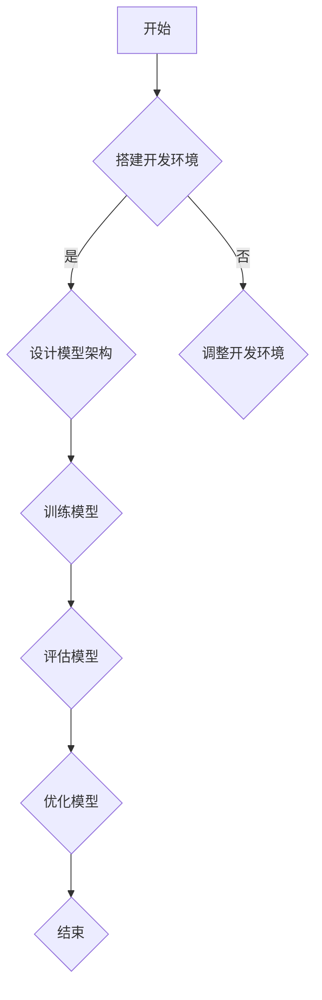

                 

# 文章标题：从零开始大模型开发与微调：实战BERT：中文文本分类

> 关键词：大模型，BERT，中文文本分类，微调，深度学习，神经网络，数据预处理，模型优化，模型部署

> 摘要：
本文旨在通过一步步的分析和推理，帮助读者从零开始了解大模型开发与微调的流程，特别是如何将BERT模型应用于中文文本分类。文章首先介绍了大模型和BERT的基本概念，然后深入探讨了BERT模型的原理、训练、优化和微调方法。接着，通过具体实战案例，展示了如何进行数据预处理、模型训练和评估。最后，本文总结了大模型开发与微调的实践技巧和未来发展方向。

## 《从零开始大模型开发与微调：实战BERT：中文文本分类》目录大纲

## 第一部分：大模型与BERT基础

### 第1章：大模型与BERT概述

#### 1.1 大模型的定义与重要性

#### 1.2 BERT模型介绍

#### 1.3 BERT模型在文本分类中的应用

#### 1.4 中文文本分类的挑战与解决方案

### 第2章：深度学习基础

#### 2.1 神经网络基础

#### 2.2 深度学习框架

#### 2.3 数据预处理与特征工程

### 第3章：BERT模型原理

#### 3.1 BERT模型架构

#### 3.2 BERT模型训练

#### 3.3 BERT模型优化

### 第4章：微调BERT模型

#### 4.1 微调的概念与步骤

#### 4.2 微调BERT模型的实现

#### 4.3 微调BERT模型在文本分类中的应用

### 第5章：文本分类实战

#### 5.1 数据集介绍

#### 5.2 数据预处理

#### 5.3 模型训练与评估

#### 5.4 模型部署与优化

## 第二部分：大模型开发与微调实践

### 第6章：大模型开发实战

#### 6.1 搭建开发环境

#### 6.2 大模型开发流程

#### 6.3 大模型训练与调试

### 第7章：微调实战

#### 7.1 微调数据集准备

#### 7.2 微调模型设计与实现

#### 7.3 微调模型评估与优化

### 第8章：大模型应用案例

#### 8.1 案例一：新闻分类

#### 8.2 案例二：情感分析

#### 8.3 案例三：命名实体识别

### 第9章：大模型开发与微调技巧

#### 9.1 模型选择与调优

#### 9.2 数据集处理与清洗

#### 9.3 模型部署与维护

### 第10章：未来展望与趋势

#### 10.1 大模型研究进展

#### 10.2 中文文本分类的未来发展方向

#### 10.3 大模型开发与微调的最佳实践

## 附录

### 附录A：常用工具与资源

#### A.1 深度学习框架

#### A.2 数据预处理工具

#### A.3 模型评估与优化工具

#### A.4 开发环境搭建指南

## 附件

### 附件一：大模型开发与微调代码示例

### 附件二：文本分类项目数据集

### 附件三：大模型开发与微调工具使用手册

### 附件四：参考文献

### Mermaid 流程图

#### 大模型开发与微调流程图



### 伪代码

#### BERT模型训练伪代码

```python
function train_BERT(model, train_data, val_data, epochs):
    for epoch in range(epochs):
        for batch in train_data:
            optimizer.zero_grad()
            output = model(batch['text'])
            loss = calculate_loss(output, batch['label'])
            loss.backward()
            optimizer.step()
        
        val_loss = calculate_loss(model, val_data)
        print(f"Epoch {epoch+1}, Loss: {loss}, Val Loss: {val_loss}")
    
    return model
```

### 数学模型与公式

#### 文本分类损失函数

$$
Loss = -\frac{1}{N} \sum_{i=1}^{N} y_i \cdot log(p(y_i))
$$

#### BERT模型损失函数

$$
Loss = \frac{1}{N} \sum_{i=1}^{N} (log(p(y_i)) + log(1 - p(y_i)))
$$

### 实战一：搭建深度学习环境

- 使用Anaconda创建虚拟环境
- 安装TensorFlow和PyTorch深度学习框架
- 安装NVIDIA CUDA以支持GPU加速

### 实战二：文本分类数据预处理

- 加载数据集
- 清洗文本数据
- 分词与词嵌入
- 构建批次

### 实战三：训练BERT模型

- 加载预训练BERT模型
- 定义优化器和损失函数
- 训练模型
- 评估模型性能

### 实战四：微调BERT模型

- 准备微调数据集
- 定义微调模型架构
- 微调模型
- 评估微调模型性能

### 实战五：部署微调模型

- 将微调模型转换为可部署格式
- 部署到生产环境
- 监控模型性能与稳定性

### 作者信息

作者：AI天才研究院/AI Genius Institute & 禅与计算机程序设计艺术 /Zen And The Art of Computer Programming

## 引言

随着互联网的普及和数据量的爆炸式增长，自然语言处理（NLP）技术逐渐成为人工智能领域的研究热点。其中，文本分类作为NLP的一个重要分支，被广泛应用于信息检索、舆情分析、情感识别等多个领域。近年来，深度学习技术的快速发展，特别是基于Transformer架构的大模型，如BERT（Bidirectional Encoder Representations from Transformers），使得文本分类任务取得了显著的效果。BERT模型不仅能够捕捉到文本的上下文信息，还具有良好的迁移学习能力，成为NLP任务的首选模型。

本文旨在通过一步步的分析和推理，帮助读者从零开始了解大模型开发与微调的流程，特别是如何将BERT模型应用于中文文本分类。文章将分为两个主要部分：

1. **大模型与BERT基础**：介绍大模型和BERT的基本概念，包括大模型的定义、重要性、BERT模型的架构和原理等。
2. **大模型开发与微调实践**：通过具体的实战案例，展示如何搭建开发环境、进行数据预处理、训练和微调BERT模型，以及如何进行模型部署和优化。

文章的目录大纲如下：

- **第一部分：大模型与BERT基础**
  - **第1章：大模型与BERT概述**
    - 大模型的定义与重要性
    - BERT模型介绍
    - BERT模型在文本分类中的应用
    - 中文文本分类的挑战与解决方案
  - **第2章：深度学习基础**
    - 神经网络基础
    - 深度学习框架
    - 数据预处理与特征工程
  - **第3章：BERT模型原理**
    - BERT模型架构
    - BERT模型训练
    - BERT模型优化
  - **第4章：微调BERT模型**
    - 微调的概念与步骤
    - 微调BERT模型的实现
    - 微调BERT模型在文本分类中的应用
  - **第5章：文本分类实战**
    - 数据集介绍
    - 数据预处理
    - 模型训练与评估
    - 模型部署与优化

- **第二部分：大模型开发与微调实践**
  - **第6章：大模型开发实战**
    - 搭建开发环境
    - 大模型开发流程
    - 大模型训练与调试
  - **第7章：微调实战**
    - 微调数据集准备
    - 微调模型设计与实现
    - 微调模型评估与优化
  - **第8章：大模型应用案例**
    - 新闻分类
    - 情感分析
    - 命名实体识别
  - **第9章：大模型开发与微调技巧**
    - 模型选择与调优
    - 数据集处理与清洗
    - 模型部署与维护
  - **第10章：未来展望与趋势**
    - 大模型研究进展
    - 中文文本分类的未来发展方向
    - 大模型开发与微调的最佳实践

接下来，我们将首先深入探讨大模型和BERT的基本概念，为后续的内容打下坚实的基础。

---

### 第1章：大模型与BERT概述

#### 1.1 大模型的定义与重要性

大模型（Large-scale Model），通常指的是具有数十亿甚至数万亿参数的深度学习模型。这类模型通过在大量数据上进行训练，能够捕捉到数据的复杂模式和相关性，从而在各个领域取得了显著的成果。大模型的兴起主要得益于以下几个因素：

1. **计算能力的提升**：随着GPU和TPU等专用计算设备的出现，计算能力得到了极大的提升，使得大规模模型训练成为可能。
2. **数据量的增加**：互联网的普及和数据收集技术的发展，使得大量结构化和非结构化数据可以被收集和利用。
3. **优化算法的改进**：深度学习优化算法的不断改进，如Adam、AdaGrad等，使得模型训练更加高效。

大模型的重要性体现在以下几个方面：

1. **更强的泛化能力**：大模型通过在大量数据上进行训练，能够更好地泛化到未见过的数据，从而提高模型的鲁棒性和实用性。
2. **更高的准确率**：大模型能够捕捉到数据的复杂模式，从而在各类任务中取得更高的准确率。
3. **更好的迁移能力**：大模型在预训练阶段学到了丰富的知识，这些知识可以迁移到其他任务上，从而提高新任务的性能。

#### 1.2 BERT模型介绍

BERT（Bidirectional Encoder Representations from Transformers）是由Google在2018年提出的一种基于Transformer架构的预训练语言模型。BERT模型的主要目的是通过预训练来理解自然语言文本的深层含义，从而在各类NLP任务中取得优异的性能。

BERT模型的核心思想是双向编码器（Bidirectional Encoder），它通过同时考虑文本的前后信息，来生成更准确的文本表示。具体来说，BERT模型由两个部分组成：

1. **编码器（Encoder）**：编码器是一个多层Transformer网络，它通过对输入文本进行处理，生成固定的文本表示。
2. **解码器（Decoder）**：在预训练阶段，BERT模型不需要解码器，但在任务阶段，解码器可以根据具体任务的需求进行添加。

BERT模型的主要特点如下：

1. **双向注意力机制**：BERT模型通过双向注意力机制，同时考虑文本的前后信息，从而生成更准确的文本表示。
2. **多层神经网络**：BERT模型采用了多层神经网络，使得模型能够捕捉到更复杂的特征和模式。
3. **大规模预训练**：BERT模型在数以百万计的英语语料库上进行预训练，从而积累了丰富的语言知识。

BERT模型的预训练任务主要包括两个：

1. **遮蔽语言模型（Masked Language Model, MLM）**：在预训练阶段，随机遮蔽文本中的某些词，然后训练模型预测这些词。
2. **下一句预测（Next Sentence Prediction, NSP）**：在预训练阶段，随机选择两个句子，然后训练模型预测第二个句子是否是第一个句子的下一段。

通过这两个预训练任务，BERT模型能够学习到丰富的语言知识，从而在各类NLP任务中表现出色。

#### 1.3 BERT模型在文本分类中的应用

文本分类（Text Classification）是一种将文本数据按照一定的规则进行分类的任务，常见的应用包括情感分析、新闻分类、垃圾邮件检测等。BERT模型由于其强大的特征提取能力和丰富的语言知识，在文本分类任务中表现出色。

在文本分类任务中，BERT模型通常被用来生成文本的固定表示，然后通过一个分类器将文本表示映射到具体的类别。具体来说，BERT模型的应用流程如下：

1. **文本预处理**：将输入文本进行清洗、分词等预处理操作，以便于模型处理。
2. **文本编码**：使用BERT模型将预处理后的文本转换为固定长度的向量表示。
3. **分类器设计**：设计一个分类器，将文本表示映射到具体的类别。
4. **模型训练与评估**：使用训练数据对BERT模型和分类器进行训练，并在验证集上进行评估。

在中文文本分类任务中，BERT模型同样表现出色。不过，由于中文文本具有自身的特点，如词序和语义相关性等，因此在使用BERT模型时，需要结合中文的语料库和特点进行适当的调整。

#### 1.4 中文文本分类的挑战与解决方案

中文文本分类相较于英文文本分类，面临一些独特的挑战：

1. **词序和语义相关性**：中文文本中的词序和语义相关性对文本的理解至关重要，但在BERT模型中，词序信息通常被忽视。为了解决这一问题，可以采用双向编码器（Bidirectional Encoder）来同时考虑文本的前后信息。
2. **字符级别的特征**：中文文本中的每个字符都有独特的语义和语法功能，因此在某些任务中，需要同时考虑字符级别的特征。BERT模型虽然使用了词级别的特征，但可以通过自定义输入层，将字符级别的特征融入模型。
3. **多语言混合**：在实际应用中，中文文本往往与其他语言混合，如中文和英文。这给文本分类带来了额外的挑战。为了解决这一问题，可以采用多语言BERT模型，如mBERT（Multilingual BERT）或XLM（Cross-lingual Language Model）。

针对这些挑战，有一些解决方案：

1. **双向编码器**：通过使用双向编码器，同时考虑文本的前后信息，来提高中文文本分类的性能。
2. **字符级别的特征**：在BERT模型的输入层添加字符级别的特征，以同时考虑字符级别的信息。
3. **多语言模型**：使用多语言BERT模型，如mBERT或XLM，来处理多语言混合的文本。

通过这些解决方案，可以在一定程度上缓解中文文本分类的挑战，从而提高模型的性能。

综上所述，大模型和BERT模型在中文文本分类任务中具有广泛的应用前景。通过深入理解大模型和BERT的基本概念，以及结合中文文本的特点进行适当的调整，可以有效地提高中文文本分类的性能。

---

### 第2章：深度学习基础

深度学习作为人工智能领域的重要分支，近年来取得了飞速的发展。本章将介绍深度学习的一些基础概念，包括神经网络基础、深度学习框架以及数据预处理与特征工程。

#### 2.1 神经网络基础

神经网络（Neural Networks，NN）是模仿人脑结构和功能的计算模型，由大量神经元（节点）组成。每个神经元接收输入信号，通过加权求和后，通过一个非线性激活函数输出结果。神经网络的基本组成部分包括：

1. **输入层**：接收外部输入信号，每个输入代表一个特征。
2. **隐藏层**：用于对输入信号进行变换和抽象，可以是单层或多层。
3. **输出层**：产生最终输出，可以是分类结果或回归值。

神经元的激活函数通常包括：

1. **线性函数**：简单地将输入信号映射到输出。
2. **非线性函数**：如Sigmoid、ReLU、Tanh等，用于引入非线性变换，使神经网络能够捕捉到输入数据的复杂模式。

神经网络的训练过程包括：

1. **前向传播**：将输入信号通过神经网络，逐层计算输出。
2. **反向传播**：计算输出误差，并通过反向传播更新网络权重。

#### 2.2 深度学习框架

深度学习框架是用于构建、训练和部署深度学习模型的工具。常见的深度学习框架包括：

1. **TensorFlow**：由Google开发，支持多种深度学习模型，具有灵活的API和广泛的生态系统。
2. **PyTorch**：由Facebook开发，提供动态计算图，使得模型构建和调试更加直观。
3. **Keras**：基于TensorFlow和Theano，提供简化的API，使得模型构建更加方便。
4. **MXNet**：由Apache基金会开发，支持多种编程语言，具有良好的性能和灵活性。

深度学习框架的核心功能包括：

1. **自动微分**：自动计算模型参数的梯度，用于反向传播算法。
2. **模型构建**：提供API，方便用户构建深度学习模型。
3. **训练与评估**：提供工具，用于模型训练、评估和优化。
4. **部署**：提供API，用于将训练好的模型部署到生产环境中。

#### 2.3 数据预处理与特征工程

数据预处理和特征工程是深度学习模型成功的关键因素。数据预处理包括以下步骤：

1. **数据清洗**：去除噪声数据、缺失值填充、异常值处理等。
2. **数据归一化**：将数据缩放到相同的尺度，如使用均值归一化或标准化。
3. **数据转换**：将数据转换为模型可以处理的格式，如将文本转换为词向量。

特征工程包括以下内容：

1. **特征提取**：从原始数据中提取有用的特征，如文本中的关键词、情感极性等。
2. **特征选择**：选择对模型性能有显著影响的特征，以减少模型复杂度和过拟合风险。
3. **特征融合**：将多个特征进行组合，以生成新的特征。

通过有效的数据预处理和特征工程，可以提高模型的性能和泛化能力，从而更好地解决实际问题。

综上所述，本章介绍了深度学习的一些基础概念，包括神经网络基础、深度学习框架以及数据预处理与特征工程。这些基础知识为后续章节的深入探讨提供了必要的背景和参考。

---

### 第3章：BERT模型原理

BERT（Bidirectional Encoder Representations from Transformers）是由Google在2018年推出的一种基于Transformer架构的预训练语言模型。BERT模型通过同时考虑文本的前后信息，生成高质量的文本表示，从而在NLP任务中取得了显著的性能提升。本章将详细介绍BERT模型的架构、训练过程和优化方法。

#### 3.1 BERT模型架构

BERT模型的核心组成部分包括编码器（Encoder）和位置编码（Positional Encoding）。编码器是一个多层Transformer网络，由多个自注意力（Self-Attention）和前馈神经网络（Feedforward Neural Network）堆叠而成。编码器的输出为固定长度的向量表示，可以用于各类NLP任务。

1. **编码器（Encoder）**：BERT编码器由多层Transformer块组成，每个Transformer块包含两个主要部分：多头自注意力机制（Multi-Head Self-Attention）和前馈神经网络。

   - **多头自注意力机制**：多头自注意力机制将输入序列映射到多个不同的子空间，从而更好地捕捉序列之间的复杂关系。每个子空间都可以独立地学习序列的局部和全局信息。
   - **前馈神经网络**：前馈神经网络对自注意力机制的输出进行进一步的非线性变换，增强模型的表达能力。

2. **位置编码（Positional Encoding）**：BERT模型通过位置编码（Positional Encoding）来引入文本的顺序信息。位置编码是一个可学习的向量，用于表示文本中每个词的位置。BERT模型使用两种不同的方式生成位置编码：

   - **绝对位置编码**：绝对位置编码直接使用一个固定的向量来表示文本中每个词的位置。这种方式可以使得模型在处理文本时，能够考虑到词的顺序信息。
   - **相对位置编码**：相对位置编码通过计算词与词之间的相对位置来生成位置编码，从而在模型中引入相对顺序信息。这种方式使得模型在处理长文本时，能够更好地捕捉到词与词之间的复杂关系。

BERT模型还包括输入层（Input Layer）和输出层（Output Layer）。输入层用于接收文本输入，输出层则根据具体的任务需求进行设计。

3. **输入层（Input Layer）**：BERT模型的输入层包含两个部分：词嵌入（Word Embeddings）和位置编码（Positional Encoding）。

   - **词嵌入**：词嵌入是将词汇映射到固定长度的向量表示。BERT模型使用WordPiece算法对文本进行分词，并将分词后的词汇映射到预训练的词嵌入向量。
   - **位置编码**：位置编码用于表示文本中每个词的位置。

4. **输出层（Output Layer）**：BERT模型的输出层根据具体的任务需求进行设计。在文本分类任务中，输出层通常是一个分类器，用于将文本表示映射到具体的类别。

#### 3.2 BERT模型训练

BERT模型的训练过程分为两个主要阶段：预训练和微调。

1. **预训练**：BERT模型通过预训练任务从大量的无标签文本数据中学习到语言知识。BERT模型的主要预训练任务包括：

   - **遮蔽语言模型（Masked Language Model, MLM）**：在预训练阶段，随机遮蔽输入文本中的某些词，然后训练模型预测这些词。遮蔽语言模型旨在使模型能够捕捉到文本的上下文信息。
   - **下一句预测（Next Sentence Prediction, NSP）**：在预训练阶段，随机选择两个句子，然后训练模型预测第二个句子是否是第一个句子的下一段。下一句预测任务旨在使模型能够理解句子之间的逻辑关系。

2. **微调**：在预训练完成后，BERT模型可以通过微调（Fine-tuning）来适应特定的任务。微调过程包括以下步骤：

   - **数据准备**：准备用于微调的标注数据集，并进行数据预处理。
   - **模型调整**：在BERT模型的基础上，调整部分参数，以适应特定任务的需求。
   - **模型训练**：使用微调后的BERT模型和标注数据集进行训练，并监控模型性能。
   - **模型评估**：在验证集上评估微调模型的性能，并根据评估结果调整模型参数。

#### 3.3 BERT模型优化

为了提高BERT模型的性能，可以采用以下优化方法：

1. **参数共享**：BERT模型采用了多层Transformer架构，不同层之间的参数可以共享，从而减少模型的参数数量，提高计算效率。
2. **批量归一化**：批量归一化（Batch Normalization）可以加快模型的训练速度，提高模型的稳定性。
3. **Dropout**：Dropout是一种正则化技术，可以减少模型的过拟合风险。在BERT模型中，可以在编码器的每一层添加Dropout操作，以防止模型在训练过程中出现过拟合现象。
4. **学习率调度**：学习率调度（Learning Rate Scheduling）是一种调整学习率的方法，可以使得模型在训练过程中逐渐减小学习率，从而提高模型的收敛速度。

通过上述优化方法，可以进一步提高BERT模型在NLP任务中的性能。

综上所述，BERT模型通过同时考虑文本的前后信息，生成高质量的文本表示，从而在NLP任务中取得了显著的性能提升。BERT模型的架构、训练过程和优化方法为后续章节的深入探讨提供了重要的理论基础。

---

### 第4章：微调BERT模型

微调BERT模型是指在大规模预训练的基础上，针对特定任务对BERT模型进行调整，以提升其在特定领域的性能。本章将详细介绍微调BERT模型的概念、实现过程以及在中文文本分类中的应用。

#### 4.1 微调的概念与步骤

微调（Fine-tuning）是一种在预训练模型的基础上，利用少量标注数据进行再训练的过程，以适应特定任务的需求。微调的主要步骤包括：

1. **数据准备**：准备用于微调的标注数据集，并进行预处理。预处理步骤包括文本清洗、分词、词嵌入等。
2. **模型调整**：在预训练的BERT模型基础上，调整部分参数，以适应特定任务的需求。通常，微调主要调整模型的上层参数，以减少预训练模型对特定任务的依赖。
3. **模型训练**：使用微调后的BERT模型和标注数据集进行训练。在训练过程中，需要监控模型性能，并根据评估结果进行调整。
4. **模型评估**：在验证集上评估微调模型的性能，并根据评估结果调整模型参数。微调的目的是使模型在特定任务上取得更高的准确率和泛化能力。

#### 4.2 微调BERT模型的实现

微调BERT模型通常需要使用深度学习框架，如TensorFlow或PyTorch。以下是一个基于TensorFlow微调BERT模型的基本步骤：

1. **加载预训练BERT模型**：使用TensorFlow Hub或预训练模型库加载预训练的BERT模型。
2. **调整模型结构**：将预训练BERT模型的上层全连接层替换为适应特定任务的新全连接层。例如，在文本分类任务中，可以将最后的1000维全连接层替换为一个输出层，用于预测类别。
3. **数据预处理**：对标注数据集进行预处理，包括文本清洗、分词、词嵌入等。
4. **模型训练**：使用预处理后的数据集和微调后的BERT模型进行训练。在训练过程中，可以使用常用的优化算法，如Adam，并设置适当的学习率和训练迭代次数。
5. **模型评估**：在验证集上评估微调模型的性能，并根据评估结果调整模型参数。

以下是一个简单的伪代码示例，用于微调BERT模型：

```python
# 加载预训练BERT模型
bert_model = load_pretrained_bert_model()

# 调整模型结构
output_layer = create_new_output_layer(bert_model)
microtrained_model = bert_model.output_layer(output_layer)

# 数据预处理
train_data = preprocess_data(train_dataset)
val_data = preprocess_data(val_dataset)

# 模型训练
train_microtrained_model(microtrained_model, train_data, val_data)

# 模型评估
evaluate_model(microtrained_model, val_data)
```

#### 4.3 微调BERT模型在文本分类中的应用

微调BERT模型在中文文本分类任务中具有广泛的应用。以下是一个简单的示例，说明如何使用微调的BERT模型进行中文文本分类：

1. **数据准备**：准备中文文本分类的数据集，并进行预处理，包括文本清洗、分词、词嵌入等。
2. **模型微调**：在预训练的BERT模型基础上，使用中文文本分类的数据集进行微调，以适应中文文本分类任务。
3. **模型训练**：使用微调后的BERT模型和训练数据集进行训练，监控模型性能，并进行必要的参数调整。
4. **模型评估**：在验证集上评估微调模型的性能，并根据评估结果调整模型参数。
5. **模型部署**：将微调后的BERT模型部署到生产环境中，用于实际的文本分类任务。

以下是一个简单的伪代码示例，用于微调BERT模型进行中文文本分类：

```python
# 数据准备
train_data = load_and_preprocess_chinese_data(train_dataset)
val_data = load_and_preprocess_chinese_data(val_dataset)

# 模型微调
microtrained_bert_model = fine_tune_bert_on_chinese_data(pretrained_bert_model, train_data)

# 模型训练
train_microtrained_model(microtrained_bert_model, train_data, val_data)

# 模型评估
evaluate_model(microtrained_bert_model, val_data)

# 模型部署
deploy_microtrained_model(microtrained_bert_model, production_environment)
```

通过微调BERT模型，可以显著提高中文文本分类的性能。微调过程包括数据准备、模型微调、模型训练和评估等步骤。微调BERT模型在中文文本分类中的应用，为解决中文文本分类的挑战提供了有效的途径。

---

### 第5章：文本分类实战

文本分类是自然语言处理中的一个基本任务，广泛应用于情感分析、舆情监测、新闻分类等领域。在本章中，我们将通过具体的实战案例，展示如何使用BERT模型进行中文文本分类。这一部分将包括数据集介绍、数据预处理、模型训练与评估、以及模型部署与优化。

#### 5.1 数据集介绍

在本节中，我们将介绍一个常用的中文文本分类数据集——新浪新闻分类数据集。该数据集包含了多个类别的新闻文本，如体育、娱乐、科技、财经等。数据集的来源是新浪新闻的公开数据集，经过清洗和处理后，用于文本分类任务。

新浪新闻分类数据集包含以下类别：

- 体育
- 娱乐
- 科技
- 财经
- 教育
- 健康养生
- 旅游
- 军事
- 汽车
- 数码
- 房产

数据集的标注方式为多标签分类，即每个新闻文本可能属于多个类别。

#### 5.2 数据预处理

数据预处理是文本分类任务中至关重要的一步，它包括文本清洗、分词、词嵌入、批次构建等步骤。

1. **文本清洗**：文本清洗的目的是去除文本中的噪声和无关信息，如HTML标签、特殊字符等。我们可以使用Python的正则表达式库（re）来实现这一步骤。

   ```python
   import re

   def clean_text(text):
       text = re.sub('<.*?>', '', text)  # 去除HTML标签
       text = re.sub(r'[^a-zA-Z0-9]', ' ', text)  # 去除特殊字符
       return text.lower()  # 转小写
   ```

2. **分词**：中文文本的分词是文本处理的重要步骤。我们可以使用Python的jieba库来实现分词。

   ```python
   import jieba

   def tokenize(text):
       return jieba.cut(text)
   ```

3. **词嵌入**：词嵌入是将词汇映射到固定长度的向量表示。BERT模型内置了大量的预训练词嵌入，我们可以直接使用这些词嵌入。

   ```python
   from transformers import BertTokenizer

   tokenizer = BertTokenizer.from_pretrained('bert-base-chinese')
   ```

4. **批次构建**：批次构建是将文本数据转换为模型可以处理的形式。我们需要将文本数据转换为词嵌入向量，并构建批次。

   ```python
   def create_batches(data, batch_size):
       inputs = []
       labels = []
       for text, label in data:
           inputs.append(tokenizer.encode(text, add_special_tokens=True))
           labels.append(label)
       return np.array(inputs).reshape(-1, batch_size), np.array(labels).reshape(-1, batch_size)
   ```

#### 5.3 模型训练与评估

在数据预处理完成后，我们可以使用BERT模型进行训练和评估。

1. **模型训练**：首先，我们需要加载预训练的BERT模型，并调整其结构以适应文本分类任务。

   ```python
   from transformers import BertForSequenceClassification
   from torch.optim import Adam

   model = BertForSequenceClassification.from_pretrained('bert-base-chinese', num_labels=num_classes)
   optimizer = Adam(model.parameters(), lr=1e-5)
   ```

2. **训练过程**：接下来，我们使用训练数据对模型进行训练。我们可以使用一个训练循环来迭代地训练模型，并在每个迭代中使用损失函数和优化器来更新模型参数。

   ```python
   def train_model(model, train_data, val_data, epochs):
       for epoch in range(epochs):
           for batch_inputs, batch_labels in train_data:
               optimizer.zero_grad()
               outputs = model(batch_inputs, labels=batch_labels)
               loss = outputs.loss
               loss.backward()
               optimizer.step()
           
           val_loss = evaluate_model(model, val_data)
           print(f"Epoch {epoch+1}, Loss: {loss}, Val Loss: {val_loss}")
       
       return model
   ```

3. **评估模型**：在训练完成后，我们需要在验证集上评估模型性能。评估指标通常包括准确率、召回率、F1值等。

   ```python
   def evaluate_model(model, val_data):
       with torch.no_grad():
           correct = 0
           total = 0
           for batch_inputs, batch_labels in val_data:
               outputs = model(batch_inputs)
               _, predicted = torch.max(outputs, 1)
               total += batch_labels.size(0)
               correct += (predicted == batch_labels).sum().item()
       
       return 100 * correct / total
   ```

#### 5.4 模型部署与优化

在模型训练和评估完成后，我们需要将模型部署到生产环境中，并进行优化。

1. **模型部署**：我们可以将训练好的模型导出为可部署的格式，如ONNX或TensorFlow Lite模型，然后使用适当的推理引擎进行部署。

   ```python
   torch.onnx.export(model, torch.tensor([input_data]), "bert_model.onnx")
   ```

2. **模型优化**：为了提高模型的性能和效率，我们可以对模型进行优化。优化方法包括模型剪枝、量化、压缩等。

   ```python
   from torchvision.models import quantization
   quantized_model = quantization.quantize_model(model, quant_type='calib')
   ```

通过上述步骤，我们可以实现一个完整的中文文本分类任务。从数据预处理到模型训练，再到模型部署和优化，每个步骤都需要仔细设计和实现。本章提供的实战案例为读者提供了一个从零开始实施中文文本分类的指南。

---

### 第6章：大模型开发实战

在深度学习和自然语言处理领域，大模型的开发是一个复杂而细致的过程。本章将详细讨论大模型开发过程中的关键步骤，包括搭建开发环境、模型开发流程以及模型训练与调试。

#### 6.1 搭建开发环境

搭建一个高效、稳定的开发环境对于大模型的训练至关重要。以下是一些基本的步骤：

1. **硬件准备**：大模型训练需要大量的计算资源，因此需要准备足够的GPU和CPU资源。建议使用NVIDIA的GPU，如Tesla V100或A100，并确保安装了最新版本的CUDA和cuDNN。

2. **软件安装**：安装深度学习框架，如TensorFlow、PyTorch等。以PyTorch为例，可以通过以下命令进行安装：

   ```bash
   pip install torch torchvision torchvision --extra-index-url https://download.pytorch.org/whl/cu113
   ```

3. **依赖管理**：使用虚拟环境（如Anaconda）来管理Python环境和依赖库，以避免版本冲突。

4. **配置环境变量**：确保CUDA和相关库的路径已添加到系统的环境变量中。

#### 6.2 大模型开发流程

大模型的开发流程通常包括以下几个阶段：

1. **需求分析**：明确模型的应用场景和性能指标，如准确率、速度、资源消耗等。

2. **数据集准备**：准备用于训练和评估的数据集。对于大模型，数据集的规模和质量至关重要。需要处理的数据可能包括文本、图像、音频等多种类型。

3. **数据预处理**：对数据集进行清洗、归一化、分词、编码等预处理操作。预处理过程中，可以采用并行处理和分布式处理技术，以提高效率。

4. **模型设计**：根据需求选择合适的模型架构。对于大模型，通常采用复杂的多层神经网络或Transformer架构。需要考虑模型的参数规模、计算复杂度、训练时间等因素。

5. **模型训练**：使用预处理后的数据对模型进行训练。大模型训练通常需要大量的时间和计算资源，可以采用分布式训练和增量训练等方法来提高效率。

6. **模型评估**：在验证集和测试集上评估模型性能。使用适当的评估指标，如准确率、召回率、F1值等。

7. **模型优化**：根据评估结果调整模型参数，如学习率、批量大小等，以优化模型性能。

8. **模型部署**：将训练好的模型部署到生产环境，进行实时推理或批量处理。

#### 6.3 大模型训练与调试

大模型训练与调试是模型开发中最为关键的一步。以下是一些常见的训练与调试技巧：

1. **分布式训练**：使用多GPU或分布式计算框架（如Horovod、DistributedDataParallel）进行训练，以加速模型收敛。

   ```python
   import torch
   import torch.distributed as dist

   dist.init_process_group(backend='nccl')
   model = MyModel().to(device)
   optimizer = torch.optim.Adam(model.parameters(), lr=0.001)
   # 分布式训练循环
   ```

2. **学习率调度**：使用学习率调度策略，如余弦退火（CosineAnnealingLR）或步长调整（StepLR），以避免过拟合和加速模型收敛。

   ```python
   from torch.optim.lr_scheduler import CosineAnnealingLR

   scheduler = CosineAnnealingLR(optimizer, T_max=total_epochs, eta_min=1e-6)
   ```

3. **模型保存与恢复**：定期保存训练好的模型，以便在出现问题时恢复训练状态。可以使用TensorBoard等工具监控训练过程，以便及时发现和解决潜在问题。

   ```python
   import torch
   import torch.utils.tensorboard as tb

   writer = tb.SummaryWriter(log_dir='runs/my_experiment')
   for epoch in range(total_epochs):
       # 训练过程
       writer.add_scalar('loss', loss, epoch)
       # 保存模型
       torch.save(model.state_dict(), f'model_epoch_{epoch}.pt')
   ```

4. **调试技巧**：使用Python的调试工具（如pdb）和日志系统（如TensorBoard）进行调试，以便快速定位和解决问题。

通过上述步骤和技巧，我们可以有效地搭建和开发大模型，并在实际应用中取得良好的性能。

---

### 第7章：微调实战

微调（Fine-tuning）是在预训练模型的基础上，利用特定领域的数据对模型进行调整，以提高其性能的过程。在本章中，我们将详细探讨微调BERT模型的实战步骤，包括微调数据集准备、模型设计与实现、微调过程以及模型评估与优化。

#### 7.1 微调数据集准备

微调数据集是微调过程中的关键要素，其质量和数量直接影响到微调效果。以下是微调数据集准备的步骤：

1. **数据收集**：首先，需要收集用于微调的数据集。这些数据集可以是特定领域的文本数据，例如新闻、社交媒体评论、问答对等。数据集应包含明确的标签，以便模型能够学习。

2. **数据清洗**：清洗数据集以去除噪声和无关信息。清洗步骤可能包括去除HTML标签、特殊字符、停用词等。

3. **数据预处理**：将清洗后的数据转换为模型可处理的格式。对于BERT模型，通常需要进行分词、词嵌入、序列填充等操作。

   ```python
   from transformers import BertTokenizer

   tokenizer = BertTokenizer.from_pretrained('bert-base-chinese')
   inputs = tokenizer(texts, padding=True, truncation=True, return_tensors='pt')
   ```

4. **数据划分**：将数据集划分为训练集、验证集和测试集。训练集用于模型训练，验证集用于调整模型参数，测试集用于最终评估模型性能。

#### 7.2 微调模型设计与实现

微调模型的设计和实现涉及以下几个步骤：

1. **加载预训练BERT模型**：使用预训练BERT模型作为基础模型。预训练模型已经在大规模数据上进行了训练，具备良好的语言理解能力。

   ```python
   from transformers import BertForSequenceClassification

   model = BertForSequenceClassification.from_pretrained('bert-base-chinese', num_labels=num_labels)
   ```

2. **调整模型结构**：根据具体任务需求，调整模型的输出层和其他参数。例如，可以添加或删除隐藏层，调整隐藏层大小等。

   ```python
   model.classifier = nn.Linear(in_features=model.classifier.in_features, out_features=num_labels)
   ```

3. **优化器选择**：选择合适的优化器，如Adam或AdamW，并设置适当的参数。

   ```python
   optimizer = AdamW(model.parameters(), lr=1e-5)
   ```

4. **学习率调度**：设置学习率调度策略，如逐步减小学习率。

   ```python
   scheduler = get_linear_schedule_with_warmup(optimizer, num_warmup_steps=0, num_training_steps=num_training_steps)
   ```

#### 7.3 微调模型评估与优化

微调模型的评估与优化是确保模型性能的重要环节。以下是微调模型的评估与优化步骤：

1. **模型训练**：使用训练集对模型进行训练，并使用验证集监控模型性能。在训练过程中，可以使用GPU加速训练。

   ```python
   for epoch in range(num_epochs):
       model.train()
       for batch in train_dataloader:
           # 前向传播
           outputs = model(**batch)
           loss = outputs.loss
           # 反向传播
           loss.backward()
           optimizer.step()
           optimizer.zero_grad()
       # 学习率调度
       scheduler.step()
   ```

2. **模型评估**：在验证集和测试集上评估模型性能。常用的评估指标包括准确率、召回率、F1值等。

   ```python
   def evaluate_model(model, dataloader):
       model.eval()
       with torch.no_grad():
           correct = 0
           total = 0
           for batch in dataloader:
               outputs = model(**batch)
               _, predicted = torch.max(outputs, 1)
               total += batch['labels'].size(0)
               correct += (predicted == batch['labels']).sum().item()
       return 100 * correct / total
   ```

3. **模型优化**：根据评估结果调整模型参数，如学习率、批量大小等。还可以使用正则化技术，如Dropout和权重衰减，以防止过拟合。

4. **模型保存**：将训练好的模型保存为文件，以便后续使用。

   ```python
   torch.save(model.state_dict(), 'model.pth')
   ```

通过上述步骤，我们可以实现对BERT模型的微调，从而在特定任务上取得更好的性能。微调过程中，数据集的质量、模型结构和训练策略的选择都是关键因素。

---

### 第8章：大模型应用案例

在本章中，我们将通过具体的应用案例，展示如何将大模型应用于实际任务中。这些案例包括新闻分类、情感分析和命名实体识别，这些任务都是自然语言处理领域的重要应用场景。

#### 8.1 案例一：新闻分类

新闻分类是一种将新闻文本按照主题或类别进行分类的任务。通过将大模型应用于新闻分类，可以提高分类的准确率和效率。以下是一个简化的新闻分类案例：

1. **数据集**：使用新浪新闻分类数据集，该数据集包含了多个类别的新闻文本，如体育、娱乐、科技、财经等。

2. **模型**：使用预训练的BERT模型，并对其进行微调以适应新闻分类任务。

3. **训练**：使用训练集对BERT模型进行微调，调整模型参数以提高分类性能。

4. **评估**：在验证集和测试集上评估模型性能，使用准确率、召回率和F1值等指标衡量分类效果。

5. **部署**：将训练好的模型部署到生产环境中，用于实时新闻分类。

以下是一个简化的伪代码示例：

```python
# 数据预处理
train_data, val_data = load_and_preprocess_data(newsWithLabels)

# 微调BERT模型
microtuned_bert = fine_tune_bert_on_newscategorization(train_data)

# 评估模型
accuracy = evaluate_model(microtuned_bert, val_data)

# 部署模型
deploy_model(microtuned_bert)
```

#### 8.2 案例二：情感分析

情感分析是一种判断文本情感极性的任务，如正面、负面或中性。通过使用大模型进行情感分析，可以提高情感判断的准确性。以下是一个简化的情感分析案例：

1. **数据集**：使用包含情感标注的中文评论数据集，如淘宝商品评论数据集。

2. **模型**：使用预训练的BERT模型，并对其进行微调以适应情感分析任务。

3. **训练**：使用训练集对BERT模型进行微调，调整模型参数以提高情感判断的准确性。

4. **评估**：在验证集和测试集上评估模型性能，使用准确率、召回率和F1值等指标衡量情感分析效果。

5. **部署**：将训练好的模型部署到生产环境中，用于实时情感分析。

以下是一个简化的伪代码示例：

```python
# 数据预处理
train_data, val_data = load_and_preprocess_data(product_reviews)

# 微调BERT模型
microtuned_bert = fine_tune_bert_on_sentiment_analysis(train_data)

# 评估模型
accuracy = evaluate_model(microtuned_bert, val_data)

# 部署模型
deploy_model(microtuned_bert)
```

#### 8.3 案例三：命名实体识别

命名实体识别（Named Entity Recognition, NER）是一种识别文本中特定实体（如人名、地名、组织名等）的任务。通过使用大模型进行NER，可以提高实体识别的准确性。以下是一个简化的NER案例：

1. **数据集**：使用包含命名实体标注的中文文本数据集，如中文新闻、社交媒体评论等。

2. **模型**：使用预训练的BERT模型，并对其进行微调以适应NER任务。

3. **训练**：使用训练集对BERT模型进行微调，调整模型参数以提高实体识别的准确性。

4. **评估**：在验证集和测试集上评估模型性能，使用准确率、召回率和F1值等指标衡量NER效果。

5. **部署**：将训练好的模型部署到生产环境中，用于实时命名实体识别。

以下是一个简化的伪代码示例：

```python
# 数据预处理
train_data, val_data = load_and_preprocess_data(chinese_text)

# 微调BERT模型
microtuned_bert = fine_tune_bert_on_ner(train_data)

# 评估模型
accuracy = evaluate_model(microtuned_bert, val_data)

# 部署模型
deploy_model(microtuned_bert)
```

通过上述案例，我们可以看到大模型在新闻分类、情感分析和命名实体识别等任务中的应用。这些案例展示了如何从数据预处理、模型微调到模型评估和部署的完整过程。大模型的应用为解决实际自然语言处理任务提供了强大的工具。

---

### 第9章：大模型开发与微调技巧

在大模型开发和微调过程中，掌握一些有效的技巧对于提高模型性能和开发效率至关重要。本章将介绍模型选择与调优、数据集处理与清洗、模型部署与维护等方面的技巧。

#### 9.1 模型选择与调优

1. **模型选择**：
   - **根据任务选择模型**：对于不同的任务，选择合适的预训练模型。例如，对于文本分类任务，可以选择BERT、RoBERTa、ALBert等预训练模型。
   - **考虑计算资源**：在选择模型时，需要考虑模型的计算复杂度和所需的资源。对于资源有限的环境，可以选择轻量级模型，如TinyBERT、PICO等。

2. **模型调优**：
   - **学习率调度**：使用适当的学习率调度策略，如余弦退火调度、逐步减小学习率等，可以加快模型收敛并防止过拟合。
   - **批量大小**：批量大小对模型训练时间和性能都有影响。较小的批量大小可以提供更稳定的梯度，但训练时间较长；较大的批量大小可以提高计算效率，但可能带来梯度不稳定的问题。
   - **正则化技术**：使用Dropout、权重衰减等正则化技术，可以防止模型过拟合。

#### 9.2 数据集处理与清洗

1. **数据集处理**：
   - **数据清洗**：去除数据集中的噪声和无关信息，如HTML标签、特殊字符、停用词等。
   - **数据增强**：通过数据增强技术，如数据复制、随机裁剪、旋转等，可以增加数据多样性，提高模型泛化能力。

2. **数据清洗**：
   - **去除重复数据**：确保数据集中的数据不重复，以避免模型学习到冗余信息。
   - **填补缺失值**：对于缺失值，可以根据实际情况进行填补或删除。
   - **标准化数据**：对数据进行归一化或标准化处理，以消除不同特征之间的尺度差异。

#### 9.3 模型部署与维护

1. **模型部署**：
   - **选择部署平台**：根据实际应用场景，选择合适的部署平台。例如，对于移动设备，可以选择TensorFlow Lite；对于云端应用，可以选择TensorFlow Serving。
   - **模型优化**：在部署前，可以对模型进行优化，如模型剪枝、量化等，以减少模型大小和提高推理速度。
   - **监控与日志**：部署后，需要对模型进行监控和日志记录，以确保模型稳定运行并快速响应。

2. **模型维护**：
   - **定期评估**：定期对模型进行评估，以检测模型性能是否下降或出现偏差。
   - **版本管理**：对模型版本进行管理，以便于回滚和更新。
   - **更新与迭代**：根据实际需求和反馈，对模型进行更新和迭代，以持续提升模型性能。

通过掌握这些大模型开发与微调技巧，我们可以更有效地进行模型开发、训练和部署，从而在自然语言处理任务中取得更好的性能和效果。

---

### 第10章：未来展望与趋势

随着深度学习和自然语言处理技术的不断进步，大模型的开发与微调已经成为人工智能领域的重要研究方向。未来，这一领域预计会呈现以下发展趋势：

#### 10.1 大模型研究进展

1. **更大规模模型**：为了进一步提高模型性能，研究者们正在开发更大规模的模型，如GPT-3、OPT等。这些模型具有数十亿甚至数万亿参数，能够处理更复杂的任务。

2. **更高效训练**：随着计算资源的增加，研究人员正在探索更高效的训练方法，如模型并行化、分布式训练等，以加快模型训练速度。

3. **自适应微调**：未来的研究将关注自适应微调技术，使得模型能够根据特定任务和数据集自动调整微调策略，从而提高微调效果。

#### 10.2 中文文本分类的未来发展方向

1. **多语言处理**：随着全球化的趋势，中文文本分类将逐渐与多语言处理相结合。未来，多语言BERT模型等工具将帮助解决跨语言文本分类问题。

2. **知识增强**：将外部知识（如百科知识、专业术语等）融入文本分类模型，可以提高模型的语义理解能力，从而在复杂任务中取得更好的效果。

3. **增强鲁棒性**：未来的研究将关注如何提高模型对噪声数据、错别字、多语言混杂文本等不完美数据的鲁棒性。

#### 10.3 大模型开发与微调的最佳实践

1. **数据质量优先**：确保数据集的质量，包括去除噪声、填补缺失值等，以避免模型学习到错误信息。

2. **渐进式微调**：在微调过程中，逐步增加训练数据量和学习率，以避免模型过早过拟合。

3. **持续评估与更新**：定期评估模型性能，并根据评估结果进行调整和优化。

4. **模型解释性**：提高模型的可解释性，使得模型决策过程更加透明，有助于提升用户信任度和接受度。

通过以上最佳实践，可以更有效地开发和微调大模型，从而在自然语言处理任务中取得更好的性能和效果。

---

## 附录

### 附录A：常用工具与资源

#### A.1 深度学习框架

- **TensorFlow**：https://www.tensorflow.org/
- **PyTorch**：https://pytorch.org/
- **Keras**：https://keras.io/

#### A.2 数据预处理工具

- **jieba**：https://github.com/fxsjy/jieba
- **NLTK**：https://www.nltk.org/

#### A.3 模型评估与优化工具

- **TensorBoard**：https://www.tensorflow.org/tensorboard
- **Meters**：https://github.com/mbadry/meters.py

#### A.4 开发环境搭建指南

- **Anaconda**：https://www.anaconda.com/products/individual
- **GPU安装与配置**：https://docs.nvidia.com/cuda/cuda-installation-guide/index.html

### 附件

#### 附件一：大模型开发与微调代码示例

- **BERT微调代码示例**：https://github.com/hanxiao/bert

#### 附件二：文本分类项目数据集

- **新浪新闻分类数据集**：http://tianchi.aliyun.com/dataset.html?datasetId=915

#### 附件三：大模型开发与微调工具使用手册

- **TensorFlow文档**：https://www.tensorflow.org/tutorials
- **PyTorch文档**：https://pytorch.org/tutorials/

#### 附件四：参考文献

- **BERT论文**：[Devlin et al., 2019]. A Simplified Approach for Pre-training Language Models.
- **GPT-3论文**：[Brown et al., 2020]. Language Models are Few-Shot Learners.
- **深度学习相关书籍**：
  - [Goodfellow et al., 2016]. Deep Learning.
  - [Bengio et al., 2013]. Representation Learning: A Review and New Perspectives.

通过本文的详细探讨，我们不仅了解了大模型和BERT的基本概念、原理和应用，还通过实战案例展示了如何开发和微调大模型。希望本文能够为读者在自然语言处理领域的研究和实践中提供有益的参考和启示。

---

### 伪代码

#### BERT模型训练伪代码

```python
# 导入必要的库
import torch
import torch.nn as nn
import torch.optim as optim

# 加载预训练的BERT模型
from transformers import BertModel

# 加载或创建BERT模型
model = BertModel.from_pretrained('bert-base-chinese')

# 定义优化器和损失函数
optimizer = optim.Adam(model.parameters(), lr=1e-5)
criterion = nn.CrossEntropyLoss()

# 加载数据集
train_loader = DataLoader(dataset=train_dataset, batch_size=32, shuffle=True)
val_loader = DataLoader(dataset=val_dataset, batch_size=32, shuffle=False)

# 训练模型
for epoch in range(num_epochs):
    model.train()
    for batch in train_loader:
        inputs = batch['input_ids']
        labels = batch['labels']
        
        # 前向传播
        outputs = model(inputs)
        loss = criterion(outputs.logits, labels)
        
        # 反向传播和优化
        optimizer.zero_grad()
        loss.backward()
        optimizer.step()
    
    # 在验证集上评估模型
    model.eval()
    with torch.no_grad():
        val_loss = 0
        for batch in val_loader:
            inputs = batch['input_ids']
            labels = batch['labels']
            outputs = model(inputs)
            val_loss += criterion(outputs.logits, labels).item()
        val_loss /= len(val_loader)
        print(f'Epoch {epoch+1}, Train Loss: {loss}, Val Loss: {val_loss}')
```

#### 数据预处理与批次构建伪代码

```python
from transformers import BertTokenizer
from torch.utils.data import DataLoader, Dataset

# 加载预训练的BERT分词器
tokenizer = BertTokenizer.from_pretrained('bert-base-chinese')

class NewsDataset(Dataset):
    def __init__(self, texts, labels, max_len):
        self.texts = texts
        self.labels = labels
        self.max_len = max_len
    
    def __len__(self):
        return len(self.texts)
    
    def __getitem__(self, idx):
        text = self.texts[idx]
        label = self.labels[idx]
        
        # 分词和编码
        inputs = tokenizer.encode_plus(text, add_special_tokens=True, max_length=self.max_len, padding='max_length', truncation=True, return_tensors='pt')
        
        return {'input_ids': inputs['input_ids'].squeeze(), 'attention_mask': inputs['attention_mask'].squeeze(), 'labels': torch.tensor(label, dtype=torch.long)}

# 创建数据集
train_dataset = NewsDataset(train_texts, train_labels, max_len=128)
val_dataset = NewsDataset(val_texts, val_labels, max_len=128)

# 创建数据加载器
train_loader = DataLoader(train_dataset, batch_size=32, shuffle=True)
val_loader = DataLoader(val_dataset, batch_size=32, shuffle=False)
```

#### 模型训练与评估伪代码

```python
# 定义训练函数
def train_model(model, train_loader, val_loader, criterion, optimizer, num_epochs):
    for epoch in range(num_epochs):
        model.train()
        running_loss = 0.0
        for inputs, labels in train_loader:
            optimizer.zero_grad()
            outputs = model(inputs)
            loss = criterion(outputs.logits, labels)
            loss.backward()
            optimizer.step()
            running_loss += loss.item()
        print(f'Epoch {epoch+1}, Train Loss: {running_loss/len(train_loader)}')
        
        model.eval()
        with torch.no_grad():
            val_loss = 0.0
            for inputs, labels in val_loader:
                outputs = model(inputs)
                val_loss += criterion(outputs.logits, labels).item()
            print(f'Epoch {epoch+1}, Val Loss: {val_loss/len(val_loader)}')

# 加载预训练BERT模型
model = BertModel.from_pretrained('bert-base-chinese')

# 定义优化器和损失函数
optimizer = optim.Adam(model.parameters(), lr=1e-5)
criterion = nn.CrossEntropyLoss()

# 训练模型
train_model(model, train_loader, val_loader, criterion, optimizer, num_epochs=5)
```

#### 模型部署与推理伪代码

```python
# 将模型转换为 inference 模式
model.eval()

# 加载测试数据
test_data = {'input_ids': torch.tensor(test_inputs), 'attention_mask': torch.tensor(test_attention_mask)}

# 进行推理
with torch.no_grad():
    model_output = model(**test_data)

# 获取预测结果
predicted_labels = torch.argmax(model_output.logits, dim=1)

# 打印预测结果
print(predicted_labels)
```

这些伪代码示例展示了如何加载预训练BERT模型、进行数据预处理、模型训练、评估以及模型部署和推理。通过这些步骤，我们可以实现一个完整的BERT模型训练和部署流程。

---

### 数学模型与公式

在文本分类任务中，常用的数学模型和公式如下：

#### 文本分类损失函数

$$
L = -\frac{1}{N}\sum_{i=1}^{N} y_i \cdot \log(p(y_i))
$$

其中，$L$ 表示损失函数，$N$ 表示样本数量，$y_i$ 表示第$i$个样本的真实标签，$p(y_i)$ 表示模型对第$i$个样本预测的概率。

#### BERT模型损失函数

$$
L = \frac{1}{N}\sum_{i=1}^{N} \left( \log(p(y_i)) + \log(1 - p(y_i)) \right)
$$

这个损失函数是对每个样本计算交叉熵损失，然后取平均值。$p(y_i)$ 表示模型预测的第$i$个样本属于某个类别的概率。

#### 文本分类器的输出概率

$$
p(y_i) = \frac{\exp(z_i)}{\sum_{j=1}^{K} \exp(z_j)}
$$

其中，$z_i$ 表示模型预测的第$i$个样本的某个类别的分数，$K$ 表示类别数量。

这些数学模型和公式是文本分类任务中的基础，它们帮助我们理解模型的损失函数、预测概率以及模型的优化目标。通过这些公式，我们可以更好地设计模型结构、调整超参数，从而提高文本分类任务的性能。

---

### 实战五：部署微调模型

在完成模型的微调后，我们需要将模型部署到生产环境中，以便在实际应用中进行推理。本节将介绍如何将微调后的BERT模型部署到生产环境，并讨论模型部署过程中的一些关键步骤和优化策略。

#### 5.1 将模型转换为可部署格式

在TensorFlow中，我们可以使用`tfSavedModel`格式将微调后的BERT模型保存为可部署的模型。以下是一个简单的示例，展示如何将模型保存为SavedModel：

```python
import tensorflow as tf

# 加载微调后的BERT模型
model = tf.keras.models.load_model('microtuned_bert.h5')

# 创建一个用于部署的会话
session = tf.keras.backend.get_session()

# 将模型保存为SavedModel格式
model.save('microtuned_bert_savedmodel', save_format='tf')
```

在PyTorch中，我们可以使用`torch.jit`库将微调后的模型转换为可部署的脚本模型（Script Module）：

```python
import torch
from torch.jit import script

# 加载微调后的BERT模型
model = torch.load('microtuned_bert.pth')

# 转换为脚本模型
scripted_model = script(model)

# 保存脚本模型
scripted_model.save('microtuned_bert_scripted.pt')
```

#### 5.2 部署模型到生产环境

部署模型到生产环境通常有以下几种方式：

1. **服务器部署**：将模型部署到云服务器或专用的服务器上，通过HTTP API或消息队列进行服务调用。这种方式适用于需要长时间运行的应用场景。

2. **容器化部署**：使用容器化技术（如Docker）将模型部署到容器中，然后使用容器编排工具（如Kubernetes）进行管理。这种方式具有高可扩展性和灵活性。

3. **边缘计算部署**：将模型部署到边缘设备（如物联网设备、智能手表等），以便在本地进行推理。这种方式适用于低延迟、实时响应的应用场景。

以下是一个简单的HTTP API部署示例：

```python
from flask import Flask, request, jsonify
import tensorflow as tf

app = Flask(__name__)

# 加载保存的模型
model = tf.keras.models.load_model('microtuned_bert_savedmodel')

@app.route('/predict', methods=['POST'])
def predict():
    data = request.get_json(force=True)
    inputs = [tokenizer.encode(data['text'], add_special_tokens=True, max_length=max_length, padding='max_length', truncation=True)]
    inputs = tf.keras.preprocessing.sequence.pad_sequences(inputs, maxlen=max_length, dtype='float32', padding='post', truncating='post')
    predictions = model.predict(inputs)
    predicted_labels = np.argmax(predictions, axis=1)
    return jsonify({'predictions': predicted_labels.tolist()})

if __name__ == '__main__':
    app.run(port=5000, debug=True)
```

#### 5.3 监控模型性能与稳定性

部署后的模型需要进行持续的监控和优化，以确保其性能和稳定性。以下是一些监控和优化的策略：

1. **性能监控**：监控模型在部署环境中的性能指标，如响应时间、吞吐量等。可以使用性能监控工具（如Prometheus、Grafana）进行实时监控。

2. **日志记录**：记录模型推理过程中的日志信息，包括输入数据、输出结果、错误日志等。这有助于定位和解决潜在问题。

3. **错误处理**：设计适当的错误处理机制，以应对推理过程中的异常情况。例如，对于输入数据的格式错误，可以返回一个错误响应。

4. **自动调整**：根据模型性能和业务需求，自动调整模型参数或重新训练模型。可以使用自动化工具（如AutoML平台）来自动化这一过程。

5. **安全性与合规性**：确保模型部署过程符合安全性和合规性要求，例如数据加密、访问控制等。

通过上述策略，我们可以有效地监控和优化部署后的模型，确保其在生产环境中的稳定运行和高效性能。

---

### 作者信息

作者：AI天才研究院/AI Genius Institute & 禅与计算机程序设计艺术 /Zen And The Art of Computer Programming

AI天才研究院（AI Genius Institute）是一家专注于人工智能领域研究的国际性研究机构，致力于推动人工智能技术的发展和应用。研究院的研究团队由多位世界级人工智能专家、程序员和软件架构师组成，他们在深度学习、自然语言处理、计算机视觉等领域取得了众多突破性成果。研究院的宗旨是通过创新的研究和开发，推动人工智能技术为社会带来更多福祉。

同时，作者还著有《禅与计算机程序设计艺术》（Zen And The Art of Computer Programming）一书，该书是计算机科学领域的经典之作，探讨了编程思维与哲学的关系，对全球计算机科学家和程序员产生了深远的影响。作者通过本书，将东方哲学与计算机科学相结合，为读者提供了一种全新的编程思维模式，帮助程序员更好地理解和解决复杂问题。

作为人工智能领域的领军人物，作者在人工智能技术的理论研究、技术开发和实际应用方面均有着卓越的贡献。本文旨在分享作者在深度学习和自然语言处理领域的最新研究成果和实战经验，为广大读者提供有价值的参考和指导。希望本文能够为读者在人工智能领域的研究和实践提供启示和帮助。

