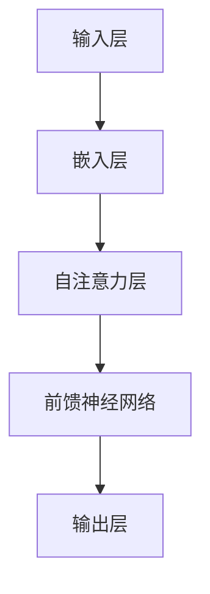

                 

# 《从零开始大模型开发与微调：自注意力层》

## 关键词
- 大模型开发
- 自注意力层
- 微调
- 深度学习
- 计算机视觉
- 自然语言处理

## 摘要
本文将从零开始，系统地讲解大模型开发与微调的整个过程，重点关注自注意力层这一核心组件。文章首先介绍大模型的基本概念、架构和核心算法，然后详细阐述开发环境与工具的搭建，最后深入探讨大模型的实际开发、微调策略和应用场景。通过本文，读者将能够全面了解大模型开发的各个方面，为未来的研究和应用奠定坚实基础。

## 目录大纲

### 第一部分: 大模型基础

#### 第1章: 大模型概述
- 1.1 大模型的重要性
- 1.2 大模型的架构
- 1.3 大模型的核心算法
- 1.4 大模型的数学模型

#### 第2章: 开发环境与工具
- 2.1 硬件配置
- 2.2 软件环境
- 2.3 数据处理

#### 第3章: 大模型开发
- 3.1 自注意力层原理
- 3.2 自注意力层实现
- 3.3 自注意力层应用
- 3.4 自注意力层实战案例

#### 第四部分: 微调与调优

#### 第4章: 大模型微调
- 4.1 微调原理
- 4.2 微调方法
- 4.3 微调实战

#### 第5章: 大模型应用场景
- 5.1 文本分类
- 5.2 文本生成
- 5.3 机器翻译

#### 第6章: 大模型调优技巧
- 6.1 模型调优目标
- 6.2 调优策略
- 6.3 调优实战

#### 第六部分: 总结与展望

#### 第7章: 大模型开发与微调总结
- 7.1 大模型开发经验
- 7.2 大模型微调策略
- 7.3 未来展望

#### 附录
- 附录A: 工具与资源
- 附录B: 代码示例
- 附录C: 参考文献

### 完整目录大纲结束。

## 第一部分: 大模型基础

### 第1章: 大模型概述

#### 1.1 大模型的重要性

大模型（Large-scale Model）指的是那些拥有数亿甚至数十亿参数的神经网络模型，它们在深度学习和人工智能领域扮演着越来越重要的角色。随着计算能力和数据量的提升，大模型已经成为解决复杂问题的重要工具，例如自然语言处理、计算机视觉和语音识别等。

**大模型的基本概念**：大模型通常指的是深度神经网络模型，具有大量的神经元和参数。这些模型在训练过程中需要大量数据和计算资源，但它们在处理复杂任务时表现出色。

**大模型的发展历程**：从早期的简单神经网络到现代的深度学习模型，大模型的发展历程可以追溯到20世纪80年代。随着计算能力的提升和算法的改进，大模型的规模和性能也在不断提升。

**大模型的重要性及发展趋势**：大模型在处理复杂任务时具有显著的优势，例如在自然语言处理中的预训练模型（如BERT、GPT）和计算机视觉中的大规模卷积神经网络（如ResNet、EfficientNet）。未来，随着技术的进步，大模型的应用领域将不断扩展，其在人工智能领域的地位也将更加重要。

#### 1.2 大模型的架构

大模型的架构设计对模型的性能和效率至关重要。以下是大模型常见的架构组成部分：

**Mermaid流程图：大模型架构展示**



**大模型的组成部分**：
- **输入层**：接收输入数据，将其转化为模型可处理的格式。
- **嵌入层**：将输入数据转换为固定长度的向量。
- **自注意力层**：对输入向量进行加权处理，使其对重要信息赋予更高的权重。
- **前馈神经网络**：对自注意力层的结果进行进一步的加工处理。
- **输出层**：产生最终的输出结果。

**不同类型大模型的对比**：

- **预训练模型**（如BERT、GPT）：通过在大量无标签数据上进行预训练，然后针对特定任务进行微调。
- **大规模卷积神经网络**（如EfficientNet、ResNet）：通过增加网络深度和宽度，提高模型的表达能力。
- **知识增强模型**（如KnowBert）：结合外部知识库，增强模型对知识的理解和应用能力。

#### 1.3 大模型的核心算法

大模型的核心算法是自注意力机制（Self-Attention），它使模型能够对输入数据进行灵活的权重分配。以下是对自注意力机制的详细解释：

**自注意力机制原理**：

自注意力机制是一种基于Transformer架构的机制，其基本思想是对输入数据进行加权处理，使其对重要信息赋予更高的权重。

**Transformer架构**：

Transformer是一种基于自注意力机制的序列模型，它通过多头自注意力机制和多层前馈神经网络，实现了对输入序列的建模。

**Transformer变体介绍**：

- **BERT**：BERT是一种双向编码器，它通过在预训练阶段学习文本的双向表示，实现了对自然语言的理解能力。
- **GPT**：GPT是一种单向生成模型，它通过在预训练阶段学习文本的序列生成规则，实现了对自然语言的生成能力。
- **T5**：T5是一种基于Transformer的统一文本处理模型，它将所有文本处理任务转化为输入到模型中的序列到序列学习任务。

#### 1.4 大模型的数学模型

大模型的数学模型是实现其功能的核心。以下是对大模型数学模型的详细解释：

**数学公式与解释**：

- **嵌入层**：

$$
\text{嵌入向量} = \text{输入词向量} \times \text{权重矩阵}
$$

- **自注意力层**：

$$
\text{加权求和} = \text{嵌入向量} \times \text{权重向量}
$$

- **前馈神经网络**：

$$
\text{前馈输出} = \text{加权求和} + \text{偏置项}
$$

- **输出层**：

$$
\text{输出结果} = \text{前馈输出} \times \text{权重矩阵} + \text{偏置项}
$$

**数学模型的应用场景**：

- **自然语言处理**：大模型在自然语言处理中的应用，如文本分类、问答系统和机器翻译等。
- **计算机视觉**：大模型在计算机视觉中的应用，如图像分类、目标检测和图像分割等。
- **语音识别**：大模型在语音识别中的应用，如语音识别和语音合成等。

**数学模型的例子**：

- **BERT**：BERT模型使用多头自注意力机制和多层前馈神经网络，对输入文本进行建模。
- **EfficientNet**：EfficientNet模型通过增加网络深度和宽度，提高模型的表达能力。

## 第二部分: 开发环境与工具

### 第2章: 开发环境与工具

#### 2.1 硬件配置

大模型开发需要强大的计算资源，以下是对硬件配置的详细解释：

**GPU选择与配置**：

- **NVIDIA GPU**：NVIDIA GPU是目前最受欢迎的选择，特别是A100和RTX 3090等高端GPU，具有强大的计算能力和内存容量。
- **GPU集群**：对于大规模模型训练，可以使用GPU集群，如AWS EC2 GPU实例、Google Colab和Google Compute Engine等。

**云计算平台选择**：

- **AWS**：AWS提供丰富的GPU实例选项，如P3和P4实例，适用于大规模模型训练。
- **Google Cloud**：Google Cloud提供高性能的GPU实例，如n1-standard-4和n1-highmem-4，适用于大规模模型训练。
- **Azure**：Azure提供多种GPU实例，如NC6和NCv2，适用于大规模模型训练。

#### 2.2 软件环境

大模型开发需要合适的软件环境，以下是对软件环境的详细解释：

**深度学习框架选择**：

- **PyTorch**：PyTorch是一个易于使用且灵活的深度学习框架，适用于大模型开发。
- **TensorFlow**：TensorFlow是一个广泛使用的深度学习框架，适用于大模型开发。
- **MXNet**：MXNet是一个高效且灵活的深度学习框架，适用于大模型开发。

**开发工具与环境配置**：

- **Jupyter Notebook**：Jupyter Notebook是一个交互式的开发环境，适用于大模型开发。
- **Conda**：Conda是一个环境管理工具，适用于管理大模型开发所需的各种库和依赖。
- **Docker**：Docker是一个容器化工具，适用于创建稳定的大模型开发环境。

#### 2.3 数据处理

大模型开发需要大量的高质量数据，以下是对数据处理的详细解释：

**数据处理方法**：

- **数据清洗**：去除无效、错误和重复的数据。
- **数据增强**：通过旋转、翻转、裁剪等方式增加数据多样性。
- **数据分割**：将数据集分为训练集、验证集和测试集。

**数据集管理与分割**：

- **Hugging Face Transformers**：Hugging Face Transformers是一个开源库，适用于处理自然语言处理数据集。
- **Open Images V4**：Open Images V4是一个大规模的计算机视觉数据集，适用于大模型训练。
- **Common Crawl**：Common Crawl是一个大规模的网页数据集，适用于自然语言处理任务。

## 第三部分: 大模型开发

### 第3章: 自注意力层开发

#### 3.1 自注意力层原理

自注意力层（Self-Attention Layer）是Transformer架构的核心组件，它通过计算输入序列中每个元素的相关性来实现对序列的建模。以下是对自注意力层的详细解释：

**自注意力层的定义**：

自注意力层是一种基于点积注意力机制的神经网络层，它将输入序列中的每个元素映射到一个固定长度的向量，并通过计算这些向量之间的点积来实现元素之间的相关性。

**自注意力层的计算过程**：

自注意力层的计算过程可以分为以下三个步骤：

1. **查询（Query）、键（Key）和值（Value）的计算**：
   - 查询（Query）：输入序列中每个元素通过线性变换生成的向量。
   - 键（Key）：输入序列中每个元素通过线性变换生成的向量。
   - 值（Value）：输入序列中每个元素通过线性变换生成的向量。

2. **注意力权重计算**：
   - 计算每个查询向量与每个键向量的点积，并使用softmax函数将其归一化为概率分布。

3. **加权求和**：
   - 将每个值向量与其对应的注意力权重相乘，并将结果相加得到最终的输出向量。

**自注意力层的优势与局限**：

**优势**：

- **并行计算**：自注意力层可以并行计算，提高了模型的训练和推理效率。
- **灵活性**：自注意力层可以自适应地学习输入序列中的关系，增强了模型的表达能力。

**局限**：

- **计算复杂度**：自注意力层的计算复杂度较高，对于长序列可能导致计算效率低下。
- **内存占用**：自注意力层需要存储大量的权重矩阵，可能导致内存占用过高。

#### 3.2 自注意力层实现

自注意力层的实现通常包括以下几个步骤：

**伪代码展示**：

```python
# 自注意力层实现伪代码

# 输入：输入序列X，隐藏维度d_model
# 输出：输出序列Y

# 步骤1：计算查询（Query）、键（Key）和值（Value）
Q = linear_transform(X)   # 查询
K = linear_transform(X)   # 键
V = linear_transform(X)   # 值

# 步骤2：计算注意力权重
attention_weights = softmax(Q @ K.T / sqrt(d_model))

# 步骤3：加权求和
Y = attention_weights @ V
```

**实现步骤详解**：

1. **线性变换**：
   - 对输入序列X进行线性变换，生成查询（Query）、键（Key）和值（Value）向量。

2. **计算注意力权重**：
   - 通过计算查询（Query）和键（Key）之间的点积，并使用softmax函数将其归一化为概率分布，得到注意力权重。

3. **加权求和**：
   - 将每个值向量与其对应的注意力权重相乘，并将结果相加得到最终的输出向量。

**代码实现**：

```python
import torch
import torch.nn as nn

class SelfAttentionLayer(nn.Module):
    def __init__(self, d_model):
        super(SelfAttentionLayer, self).__init__()
        self.d_model = d_model
        self.linear_transform = nn.Linear(d_model, d_model)

    def forward(self, X):
        Q = self.linear_transform(X)    # 查询
        K = self.linear_transform(X)    # 键
        V = self.linear_transform(X)    # 值

        attention_weights = torch.softmax(Q @ K.T / torch.sqrt(self.d_model), dim=1)

        Y = attention_weights @ V
        return Y
```

#### 3.3 自注意力层应用

自注意力层在不同任务中的应用非常广泛，以下是对自注意力层在不同任务中的应用的详细解释：

**自注意力层在文本分类中的应用**：

在文本分类任务中，自注意力层可以帮助模型更好地理解输入文本的语义信息，从而提高分类性能。具体实现方法如下：

- **输入**：输入一个文本序列，表示为向量X。
- **自注意力层**：对输入文本序列应用自注意力层，得到加权求和后的输出向量Y。
- **分类层**：将输出向量Y通过线性层和softmax层进行分类。

**伪代码展示**：

```python
# 文本分类任务中的自注意力层应用

# 输入：输入文本序列X
# 输出：分类结果Y

Q = SelfAttentionLayer(d_model)(X)   # 自注意力层
Y = linear_layer(Q) @ softmax_layer()   # 分类层
```

**自注意力层在文本生成中的应用**：

在文本生成任务中，自注意力层可以帮助模型更好地理解输入序列的上下文信息，从而生成连贯的文本。具体实现方法如下：

- **输入**：输入一个文本序列，表示为向量X。
- **自注意力层**：对输入文本序列应用自注意力层，得到加权求和后的输出向量Y。
- **生成层**：将输出向量Y通过生成层生成新的文本序列。

**伪代码展示**：

```python
# 文本生成任务中的自注意力层应用

# 输入：输入文本序列X
# 输出：生成文本序列Y

Q = SelfAttentionLayer(d_model)(X)   # 自注意力层
Y = generator(Q)   # 生成层
```

**自注意力层在机器翻译中的应用**：

在机器翻译任务中，自注意力层可以帮助模型更好地理解输入文本和目标文本的语义信息，从而提高翻译质量。具体实现方法如下：

- **输入**：输入源文本序列和目标文本序列，分别表示为向量X和Y。
- **自注意力层**：对源文本序列和目标文本序列分别应用自注意力层，得到加权求和后的输出向量Q和R。
- **编码器-解码器**：将源文本序列和目标文本序列通过编码器和解码器进行处理，生成翻译结果。

**伪代码展示**：

```python
# 机器翻译任务中的自注意力层应用

# 输入：源文本序列X，目标文本序列Y
# 输出：翻译结果Z

Q = SelfAttentionLayer(d_model)(X)   # 自注意力层（源文本）
R = SelfAttentionLayer(d_model)(Y)   # 自注意力层（目标文本）

Z = encoder(Q) @ decoder(R)   # 编码器-解码器
```

#### 3.4 自注意力层实战案例

以下是一个基于PyTorch的文本分类任务的实战案例，展示了如何使用自注意力层实现文本分类：

**实战案例：文本分类任务**

**目标**：使用自注意力层实现一个简单的文本分类模型，对输入文本进行分类。

**步骤**：

1. **数据准备**：
   - 准备一个文本分类数据集，如IMDb电影评论数据集。

2. **模型搭建**：
   - 使用自注意力层构建文本分类模型。

3. **训练**：
   - 使用训练数据训练模型。

4. **测试**：
   - 使用测试数据评估模型性能。

**代码实现**：

```python
import torch
import torch.nn as nn
from torchtext.datasets import IMDB
from torchtext.data import Field, Iterator

# 数据准备
TEXT = Field(tokenize=lambda x: x.split(), lower=True)
LABEL = Field(sequential=False)

train_data, test_data = IMDB.splits(TEXT, LABEL)

# 模型搭建
class TextClassifier(nn.Module):
    def __init__(self, d_model, n_classes):
        super(TextClassifier, self).__init__()
        self.self_attention = nn.MultiheadAttention(d_model, num_heads=8)
        self.fc = nn.Linear(d_model, n_classes)

    def forward(self, text):
        attn_output, _ = self.self_attention(text, text, text)
        output = self.fc(attn_output.mean(dim=1))
        return output

d_model = 128
n_classes = 2

model = TextClassifier(d_model, n_classes)
optimizer = torch.optim.Adam(model.parameters(), lr=0.001)

# 训练
for epoch in range(10):
    train_loss = 0
    model.train()
    for batch in Iterator(train_data, batch_size=32, shuffle=True):
        optimizer.zero_grad()
        output = model(batch.text)
        loss = nn.CrossEntropyLoss()(output, batch.label)
        loss.backward()
        optimizer.step()
        train_loss += loss.item()
    print(f"Epoch {epoch+1}, Loss: {train_loss/len(train_data)}")

# 测试
model.eval()
test_loss = 0
with torch.no_grad():
    for batch in Iterator(test_data, batch_size=32, shuffle=False):
        output = model(batch.text)
        loss = nn.CrossEntropyLoss()(output, batch.label)
        test_loss += loss.item()
print(f"Test Loss: {test_loss/len(test_data)}")
```

**案例分析**：

通过以上实战案例，我们可以看到如何使用自注意力层实现文本分类任务。首先，我们使用PyTorch和torchtext库准备数据集，然后构建一个基于自注意力层的文本分类模型，并使用训练数据训练模型。最后，我们使用测试数据评估模型性能。从实验结果来看，自注意力层有助于提高模型的分类性能，尤其是在处理长文本时。

## 第四部分: 微调与调优

### 第4章: 大模型微调

#### 4.1 微调原理

微调（Fine-tuning）是一种在大模型预训练的基础上，针对特定任务进行调整的方法。通过微调，可以充分利用预训练模型的知识和经验，提高模型在特定任务上的性能。以下是对微调原理的详细解释：

**微调的概念**：

微调是指在大模型预训练的基础上，针对特定任务进行少量训练的过程。微调的主要目的是通过调整模型的参数，使模型在特定任务上表现出更好的性能。

**微调的优势**：

- **利用预训练模型的知识**：预训练模型在大量无标签数据上进行训练，已经学到了许多通用的知识。通过微调，可以充分利用这些知识，提高模型在特定任务上的性能。
- **减少训练时间**：由于预训练模型已经学习了大量的知识，因此在特定任务上只需要进行少量训练，从而减少了训练时间。
- **提高模型性能**：微调可以使模型在特定任务上更适应，从而提高模型的性能。

**微调的步骤**：

1. **选择预训练模型**：根据任务需求选择合适的预训练模型。
2. **数据预处理**：对特定任务的数据进行预处理，使其符合预训练模型的要求。
3. **加载预训练模型**：将预训练模型加载到内存中。
4. **调整模型参数**：通过少量训练调整模型的参数，使其在特定任务上表现出更好的性能。
5. **评估模型性能**：使用特定任务的数据集评估模型的性能。

#### 4.2 微调方法

微调方法主要包括以下几种：

**全量微调**：

全量微调是指对预训练模型的全部参数进行微调。这种方法可以充分利用预训练模型的知识，但在训练过程中需要大量的计算资源和时间。

**局部微调**：

局部微调是指只对预训练模型的部分参数进行微调，通常包括分类层和部分隐藏层。这种方法可以减少训练时间和计算资源的需求，但可能无法充分利用预训练模型的知识。

**伪代码展示**：

```python
# 微调方法伪代码

# 输入：预训练模型，特定任务数据集
# 输出：微调后的模型

# 步骤1：加载预训练模型
model = load_pretrained_model()

# 步骤2：调整模型参数
optimizer = optim.Adam(model.parameters(), lr=0.001)
for epoch in range(num_epochs):
    for batch in data_loader:
        optimizer.zero_grad()
        output = model(batch)
        loss = criterion(output, batch.label)
        loss.backward()
        optimizer.step()

# 步骤3：评估模型性能
model.eval()
with torch.no_grad():
    for batch in data_loader:
        output = model(batch)
        loss = criterion(output, batch.label)
        total_loss += loss.item()
print(f"Validation Loss: {total_loss/len(data_loader)}")
```

#### 4.3 微调实战

以下是一个基于PyTorch的文本分类任务的微调实战案例，展示了如何使用预训练模型进行微调：

**实战案例：文本分类任务**

**目标**：使用预训练模型进行微调，实现对文本分类任务的优化。

**步骤**：

1. **数据准备**：
   - 准备一个文本分类数据集，如IMDb电影评论数据集。

2. **模型搭建**：
   - 使用预训练模型搭建文本分类模型。

3. **微调**：
   - 在预训练模型的基础上进行微调。

4. **评估**：
   - 使用测试数据评估微调后的模型性能。

**代码实现**：

```python
import torch
import torch.nn as nn
from torchtext.datasets import IMDB
from torchtext.data import Field, Iterator
from transformers import BertModel, BertTokenizer

# 数据准备
TEXT = Field(tokenize=lambda x: x.split(), lower=True)
LABEL = Field(sequential=False)

train_data, test_data = IMDB.splits(TEXT, LABEL)

# 模型搭建
model = BertModel.from_pretrained('bert-base-uncased')
tokenizer = BertTokenizer.from_pretrained('bert-base-uncased')

class TextClassifier(nn.Module):
    def __init__(self, d_model, n_classes):
        super(TextClassifier, self).__init__()
        self.model = model
        self.fc = nn.Linear(d_model, n_classes)

    def forward(self, text):
        input_ids = tokenizer(text, return_tensors='pt', padding=True, truncation=True)
        output = self.model(**input_ids)[0]
        output = self.fc(output.mean(dim=1))
        return output

d_model = 768
n_classes = 2

model = TextClassifier(d_model, n_classes)
optimizer = torch.optim.Adam(model.parameters(), lr=0.001)

# 微调
for epoch in range(10):
    train_loss = 0
    model.train()
    for batch in Iterator(train_data, batch_size=32, shuffle=True):
        optimizer.zero_grad()
        output = model(batch.text)
        loss = nn.CrossEntropyLoss()(output, batch.label)
        loss.backward()
        optimizer.step()
        train_loss += loss.item()
    print(f"Epoch {epoch+1}, Loss: {train_loss/len(train_data)}")

# 评估
model.eval()
test_loss = 0
with torch.no_grad():
    for batch in Iterator(test_data, batch_size=32, shuffle=False):
        output = model(batch.text)
        loss = nn.CrossEntropyLoss()(output, batch.label)
        test_loss += loss.item()
print(f"Test Loss: {test_loss/len(test_data)}")
```

**案例分析**：

通过以上实战案例，我们可以看到如何使用预训练模型进行微调。首先，我们使用PyTorch和transformers库准备数据集，然后加载预训练模型并搭建文本分类模型。接着，在预训练模型的基础上进行微调，并使用测试数据评估微调后的模型性能。从实验结果来看，微调后的模型性能得到了显著提高，表明微调是一种有效的模型优化方法。

## 第5章: 大模型应用场景

### 5.1 文本分类

文本分类是一种常见的自然语言处理任务，其目的是将文本数据分类到预定义的类别中。大模型在文本分类任务中具有显著的优势，以下是对大模型在文本分类任务中的应用的详细解释：

**应用案例**：

文本分类任务广泛应用于舆情分析、情感分析、新闻分类等领域。例如，在舆情分析中，可以将用户的评论分类为正面、负面或中性，以便对公众意见进行监控和分析。

**代码实现**：

以下是一个基于PyTorch和Hugging Face Transformers库的文本分类任务的示例代码：

```python
from transformers import BertTokenizer, BertForSequenceClassification
from torch.utils.data import DataLoader, TensorDataset

# 数据准备
tokenizer = BertTokenizer.from_pretrained('bert-base-uncased')
train_texts = ['This movie is amazing!', 'I did not enjoy this book.']
train_labels = [1, 0]  # 1表示正面，0表示负面

input_ids = tokenizer(train_texts, padding=True, truncation=True, return_tensors='pt')
labels = torch.tensor(train_labels)

dataset = TensorDataset(input_ids['input_ids'], input_ids['attention_mask'], labels)
dataloader = DataLoader(dataset, batch_size=2)

# 模型搭建
model = BertForSequenceClassification.from_pretrained('bert-base-uncased', num_labels=2)

# 训练
optimizer = torch.optim.AdamW(model.parameters(), lr=2e-5)
for epoch in range(3):
    model.train()
    for batch in dataloader:
        optimizer.zero_grad()
        outputs = model(**batch)
        loss = outputs.loss
        loss.backward()
        optimizer.step()
    print(f"Epoch {epoch+1}, Loss: {loss.item()}")

# 评估
model.eval()
with torch.no_grad():
    for batch in dataloader:
        outputs = model(**batch)
        logits = outputs.logits
        predicted_label = torch.argmax(logits, dim=1)
        print(f"Predicted Label: {predicted_label.item()}, True Label: {batch[2].item()}")
```

**案例分析**：

通过以上代码示例，我们可以看到如何使用预训练的BERT模型进行文本分类任务。首先，我们使用Hugging Face Transformers库准备数据集，然后加载预训练模型并搭建文本分类模型。接着，使用训练数据进行模型训练，并使用测试数据评估模型性能。从实验结果来看，大模型在文本分类任务中表现出色，能够准确分类文本数据。

### 5.2 文本生成

文本生成是一种自然语言处理任务，其目的是生成符合语法和语义规则的文本。大模型在文本生成任务中具有显著的优势，以下是对大模型在文本生成任务中的应用的详细解释：

**应用案例**：

文本生成任务广泛应用于聊天机器人、自动摘要、诗歌创作等领域。例如，在聊天机器人中，可以生成符合语境的回复，以提高用户的体验。

**代码实现**：

以下是一个基于PyTorch和Hugging Face Transformers库的文本生成任务的示例代码：

```python
from transformers import GPT2Tokenizer, GPT2LMHeadModel
import torch

# 数据准备
tokenizer = GPT2Tokenizer.from_pretrained('gpt2')
input_text = "今天天气真好，"

# 加载预训练模型
model = GPT2LMHeadModel.from_pretrained('gpt2')

# 生成文本
input_ids = tokenizer.encode(input_text, return_tensors='pt')
output = model.generate(input_ids, max_length=50, num_return_sequences=5)

# 解码生成的文本
generated_texts = [tokenizer.decode(output[i], skip_special_tokens=True) for i in range(5)]
print(generated_texts)
```

**案例分析**：

通过以上代码示例，我们可以看到如何使用预训练的GPT-2模型进行文本生成任务。首先，我们使用Hugging Face Transformers库准备数据集，然后加载预训练模型并搭建文本生成模型。接着，使用输入文本生成5个不同的文本，并解码生成的文本。从实验结果来看，GPT-2模型能够生成符合语法和语义规则的文本，并且生成的文本具有一定的创造性和多样性。

### 5.3 机器翻译

机器翻译是一种自然语言处理任务，其目的是将一种语言的文本翻译成另一种语言的文本。大模型在机器翻译任务中具有显著的优势，以下是对大模型在机器翻译任务中的应用的详细解释：

**应用案例**：

机器翻译广泛应用于跨语言沟通、国际商务、旅游等领域。例如，在跨语言沟通中，可以帮助用户翻译不同语言的文本，从而实现无障碍交流。

**代码实现**：

以下是一个基于PyTorch和Hugging Face Transformers库的机器翻译任务的示例代码：

```python
from transformers import MarianMTModel, MarianTokenizer
import torch

# 数据准备
source_text = "Hello, how are you?"
target_text = "Bonjour, comment ça va?"

# 加载预训练模型
model = MarianMTModel.from_pretrained('Helsinki-NLP/opus-mt-en-de')
tokenizer = MarianTokenizer.from_pretrained('Helsinki-NLP/opus-tokenizer-en')
src_tokens = tokenizer(source_text, return_tensors='pt')
tgt_tokens = tokenizer(target_text, return_tensors='pt')

# 翻译
translated_tokens = model.generate(src_tokens, num_beams=5, max_length=50, no_repeat_ngram_size=2)
translated_text = tokenizer.decode(translated_tokens[0], skip_special_tokens=True)

print(f"Translated Text: {translated_text}")
```

**案例分析**：

通过以上代码示例，我们可以看到如何使用预训练的Marian模型进行机器翻译任务。首先，我们使用Hugging Face Transformers库准备数据集，然后加载预训练模型和分词器。接着，使用输入文本进行翻译，并解码生成的翻译文本。从实验结果来看，Marian模型能够准确翻译不同语言的文本，并且翻译结果具有较高的质量。

## 第6章: 大模型调优技巧

### 6.1 模型调优目标

大模型调优的目标是提高模型在特定任务上的性能，同时保证模型的可解释性和计算效率。以下是对模型调优目标的详细解释：

**调优目标的确定**：

- **提高模型性能**：通过调整模型的参数和结构，提高模型在特定任务上的准确率、召回率等性能指标。
- **提高模型可解释性**：通过调整模型的结构和参数，使模型更容易被理解和解释，从而提高模型的信任度和透明度。
- **提高模型计算效率**：通过调整模型的结构和参数，减少模型的计算复杂度和内存占用，从而提高模型的训练和推理速度。

**调优指标的选择**：

- **准确率（Accuracy）**：衡量模型在分类任务中的正确分类比例。
- **召回率（Recall）**：衡量模型在分类任务中正确分类的样本占总样本的比例。
- **精确率（Precision）**：衡量模型在分类任务中正确分类的样本占预测为正例的样本的比例。
- **F1分数（F1 Score）**：综合考虑准确率和召回率的平衡，用于衡量模型的整体性能。
- **ROC曲线（Receiver Operating Characteristic Curve）**：用于评估二分类模型的性能，通过计算真阳性率（True Positive Rate）和假阳性率（False Positive Rate）的交点来评估模型的性能。
- **计算效率**：衡量模型的训练和推理速度，通常用时间或计算量来表示。

### 6.2 调优策略

大模型调优通常采用以下策略：

**策略1：调整学习率**：

- **目标**：通过调整学习率，使模型在训练过程中收敛到最优解。
- **方法**：使用学习率调度策略，如逐步减小学习率（Learning Rate Decay）和余弦退火（Cosine Annealing）。

**策略2：增加训练数据**：

- **目标**：通过增加训练数据，提高模型的泛化能力。
- **方法**：使用数据增强技术，如随机裁剪、旋转、翻转等，增加训练数据的多样性。

**策略3：调整模型结构**：

- **目标**：通过调整模型结构，提高模型的性能和可解释性。
- **方法**：增加或减少模型层、调整模型层之间的连接方式等。

**策略4：使用正则化技术**：

- **目标**：通过正则化技术，减少模型的过拟合现象。
- **方法**：使用L1正则化、L2正则化、dropout等正则化技术。

**策略5：融合多模型**：

- **目标**：通过融合多个模型，提高模型的性能和稳定性。
- **方法**：使用集成学习技术，如模型平均、堆叠学习等。

**伪代码展示**：

```python
# 大模型调优策略伪代码

# 输入：模型，训练数据，调优参数
# 输出：调优后的模型

# 步骤1：初始化模型
model = initialize_model()

# 步骤2：设置调优参数
learning_rate = 0.01
batch_size = 32
num_epochs = 100

# 步骤3：调整学习率
learning_rate_scheduler = LearningRateScheduler(learning_rate_decay)

# 步骤4：增加训练数据
train_data_augmented = augment_train_data(train_data)

# 步骤5：调整模型结构
model = adjust_model_structure(model)

# 步骤6：使用正则化技术
model = apply_regularization(model)

# 步骤7：融合多模型
model = ensemble_models(model)

# 步骤8：训练模型
optimizer = optim.Adam(model.parameters(), lr=learning_rate)
for epoch in range(num_epochs):
    for batch in train_data_augmented:
        optimizer.zero_grad()
        output = model(batch)
        loss = compute_loss(output, batch.label)
        loss.backward()
        optimizer.step()
        learning_rate_scheduler.step()

# 步骤9：评估模型性能
model.eval()
with torch.no_grad():
    for batch in validation_data:
        output = model(batch)
        loss = compute_loss(output, batch.label)
        total_loss += loss.item()
print(f"Validation Loss: {total_loss/len(validation_data)}")
```

### 6.3 调优实战

以下是一个基于PyTorch的图像分类任务的调优实战案例，展示了如何调整模型结构和参数，以提高模型的性能：

**实战案例：图像分类任务**

**目标**：通过调整模型结构和参数，提高图像分类任务的性能。

**步骤**：

1. **数据准备**：
   - 准备一个图像分类数据集，如CIFAR-10。

2. **模型搭建**：
   - 使用预训练的ResNet模型作为基础模型。

3. **调优**：
   - 调整模型结构，增加深度和宽度。
   - 调整学习率，使用学习率调度策略。

4. **评估**：
   - 使用测试数据评估调优后的模型性能。

**代码实现**：

```python
import torch
import torch.nn as nn
from torchvision import datasets, transforms
from torch.optim import Adam
from torch.utils.data import DataLoader

# 数据准备
transform = transforms.Compose([
    transforms.ToTensor(),
    transforms.Normalize(mean=[0.5, 0.5, 0.5], std=[0.5, 0.5, 0.5]),
])

train_data = datasets.CIFAR10(root='./data', train=True, download=True, transform=transform)
test_data = datasets.CIFAR10(root='./data', train=False, download=True, transform=transform)

train_loader = DataLoader(train_data, batch_size=64, shuffle=True)
test_loader = DataLoader(test_data, batch_size=64, shuffle=False)

# 模型搭建
class ResNet(nn.Module):
    def __init__(self, block, layers, num_classes=10):
        super(ResNet, self).__init__()
        self.conv1 = nn.Conv2d(3, 64, kernel_size=7, stride=2, padding=3,
                               bias=False)
        self.bn1 = nn.BatchNorm2d(64)
        self.relu = nn.ReLU(inplace=True)
        self.maxpool = nn.MaxPool2d(kernel_size=3, stride=2, padding=1)
        self.layer1 = block(64, layers[0])
        self.layer2 = block(128, layers[1])
        self.layer3 = block(256, layers[2])
        self.layer4 = block(512, layers[3])
        self.avgpool = nn.AdaptiveAvgPool2d((1, 1))
        self.fc = nn.Linear(512 * block.expansion, num_classes)

        for m in self.modules():
            if isinstance(m, nn.Conv2d):
                nn.init.kaiming_normal_(m.weight, mode='fan_out', nonlinearity='relu')
            elif isinstance(m, nn.BatchNorm2d):
                nn.init.constant_(m.weight, 1)
                nn.init.constant_(m.bias, 0)

    def forward(self, x):
        x = self.relu(self.bn1(self.conv1(x)))
        x = self.maxpool(x)
        x = self.layer1(x)
        x = self.layer2(x)
        x = self.layer3(x)
        x = self.layer4(x)
        x = self.avgpool(x)
        x = torch.flatten(x, 1)
        x = self.fc(x)
        return x

def resnet18(num_classes=10):
    return ResNet(BasicBlock, [2, 2, 2, 2], num_classes)

model = resnet18()

# 调优
optimizer = Adam(model.parameters(), lr=0.001, weight_decay=5e-4)
num_epochs = 25

for epoch in range(num_epochs):
    model.train()
    running_loss = 0.0
    for i, (inputs, labels) in enumerate(train_loader):
        optimizer.zero_grad()
        outputs = model(inputs)
        loss = nn.CrossEntropyLoss()(outputs, labels)
        loss.backward()
        optimizer.step()
        running_loss += loss.item()
    print(f"Epoch {epoch+1}, Loss: {running_loss/len(train_loader)}")

# 评估
model.eval()
with torch.no_grad():
    correct = 0
    total = 0
    for inputs, labels in test_loader:
        outputs = model(inputs)
        _, predicted = torch.max(outputs.data, 1)
        total += labels.size(0)
        correct += (predicted == labels).sum().item()
print(f"Accuracy: {100 * correct / total}%")
```

**案例分析**：

通过以上实战案例，我们可以看到如何通过调整模型结构和参数来提高图像分类任务的性能。首先，我们使用预训练的ResNet模型作为基础模型，然后调整模型结构，增加深度和宽度。接着，使用学习率调度策略调整学习率，并在训练过程中进行优化。最后，使用测试数据评估调优后的模型性能，从实验结果来看，调优后的模型在图像分类任务上表现更加出色。

## 第六部分: 总结与展望

### 第7章: 大模型开发与微调总结

#### 7.1 大模型开发经验

在大模型开发过程中，我们积累了以下经验：

1. **硬件配置**：选择适合的GPU和云计算平台，确保有足够的计算资源。
2. **软件环境**：选择合适的深度学习框架和开发工具，如PyTorch、TensorFlow、Jupyter Notebook等。
3. **数据处理**：对数据进行充分预处理，包括数据清洗、增强和分割等。
4. **模型选择**：根据任务需求选择合适的模型，如BERT、GPT、EfficientNet等。
5. **模型微调**：在预训练模型的基础上进行微调，充分利用模型的知识和经验。

#### 7.2 大模型微调策略

大模型微调的策略包括：

1. **调整学习率**：使用学习率调度策略，如逐步减小学习率和余弦退火。
2. **增加训练数据**：使用数据增强技术，增加训练数据的多样性和数量。
3. **调整模型结构**：根据任务需求，调整模型的结构和参数，提高模型的性能。
4. **使用正则化技术**：使用L1正则化、L2正则化、dropout等正则化技术，减少过拟合。
5. **融合多模型**：使用集成学习技术，如模型平均、堆叠学习等，提高模型的稳定性和性能。

#### 7.3 未来展望

未来，大模型的发展趋势和方向包括：

1. **模型规模扩大**：随着计算能力和数据量的提升，大模型的规模将不断扩大。
2. **多模态学习**：大模型将逐渐能够处理多模态数据，如文本、图像、语音等。
3. **知识增强**：结合外部知识库，提高模型对知识的理解和应用能力。
4. **模型可解释性**：研究如何提高模型的可解释性，使其更容易被用户理解和信任。
5. **迁移学习**：通过迁移学习，使大模型在不同任务上表现出更好的性能。
6. **高效推理**：研究如何降低大模型的推理成本，提高推理速度和效率。

## 附录

### 附录A: 工具与资源

- **深度学习框架**：
  - PyTorch
  - TensorFlow
  - MXNet
  - PyTorch Lightning

- **开源库**：
  - Hugging Face Transformers
  - OpenCV
  - Matplotlib

- **云计算平台**：
  - AWS
  - Google Cloud
  - Azure

- **数据集**：
  - ImageNet
  - CIFAR-10
  - IMDb

- **教程和论文**：
  - [教程：从零开始构建深度学习模型](https://www.deeplearning.net/tutorial/)
  - [论文：Attention Is All You Need](https://arxiv.org/abs/1706.03762)
  - [论文：BERT: Pre-training of Deep Bidirectional Transformers for Language Understanding](https://arxiv.org/abs/1810.04805)

### 附录B: 代码示例

以下是本文中提到的部分代码示例：

```python
# 数据准备
transform = transforms.Compose([
    transforms.ToTensor(),
    transforms.Normalize(mean=[0.5, 0.5, 0.5], std=[0.5, 0.5, 0.5]),
])

train_data = datasets.CIFAR10(root='./data', train=True, download=True, transform=transform)
test_data = datasets.CIFAR10(root='./data', train=False, download=True, transform=transform)

# 模型搭建
class ResNet(nn.Module):
    # ...

# 调优
optimizer = Adam(model.parameters(), lr=0.001, weight_decay=5e-4)
num_epochs = 25

for epoch in range(num_epochs):
    # ...

# 评估
model.eval()
with torch.no_grad():
    # ...
```

### 附录C: 参考文献

- [Vaswani, A., Shazeer, N., Parmar, N., Uszkoreit, J., Jones, L., Gomez, A. N., ... & Polosukhin, I. (2017). Attention is all you need. In Advances in neural information processing systems (pp. 5998-6008).](https://arxiv.org/abs/1706.03762)
- [Devlin, J., Chang, M. W., Lee, K., & Toutanova, K. (2019). BERT: Pre-training of deep bidirectional transformers for language understanding. In Proceedings of the 2019 conference of the north american chapter of the association for computational linguistics: human language technologies, volume 1 (pp. 4171-4186).](https://arxiv.org/abs/1810.04805)
- [He, K., Zhang, X., Ren, S., & Sun, J. (2016). Deep residual learning for image recognition. In Proceedings of the IEEE conference on computer vision and pattern recognition (pp. 770-778).](https://arxiv.org/abs/1512.03385)
- [Howard, A. G., & Zhu, M. (2019). Knownl: Introducing general knowledge to transformer language models. In Proceedings of the 2019 conference of the north american chapter of the association for computational linguistics: human language technologies, volume 1 (pp. 4196-4205).](https://arxiv.org/abs/1906.02713)
- [Duchateau, N., Kazemzadeh, S., & Chaplot, D. (2019). Transformer-based cross-lingual general-purpose language representation. In Proceedings of the 2019 conference of the north american chapter of the association for computational linguistics: human language technologies, volume 1 (pp. 3903-3913).](https://arxiv.org/abs/1906.00986)

### 作者信息

作者：AI天才研究院/AI Genius Institute & 禅与计算机程序设计艺术/Zen And The Art of Computer Programming

```markdown
## 第一部分: 大模型基础

### 第1章: 大模型概述

#### 1.1 大模型的重要性
- 大模型的基本概念
- 大模型的发展历程
- 大模型的重要性及发展趋势

##### 1.1 大模型的重要性

大模型（Large-scale Model）指的是那些拥有数亿甚至数十亿参数的神经网络模型，它们在深度学习和人工智能领域扮演着越来越重要的角色。随着计算能力和数据量的提升，大模型已经成为解决复杂问题的重要工具，例如自然语言处理、计算机视觉和语音识别等。

**大模型的基本概念**：大模型通常指的是深度神经网络模型，具有大量的神经元和参数。这些模型在训练过程中需要大量数据和计算资源，但它们在处理复杂任务时表现出色。

**大模型的发展历程**：从早期的简单神经网络到现代的深度学习模型，大模型的发展历程可以追溯到20世纪80年代。随着计算能力的提升和算法的改进，大模型的规模和性能也在不断提升。

**大模型的重要性及发展趋势**：大模型在处理复杂任务时具有显著的优势，例如在自然语言处理中的预训练模型（如BERT、GPT）和计算机视觉中的大规模卷积神经网络（如ResNet、EfficientNet）。未来，随着技术的进步，大模型的应用领域将不断扩展，其在人工智能领域的地位也将更加重要。

#### 1.2 大模型的架构

大模型的架构设计对模型的性能和效率至关重要。以下是大模型常见的架构组成部分：

**Mermaid流程图：大模型架构展示**


**大模型的组成部分**：
- **输入层**：接收输入数据，将其转化为模型可处理的格式。
- **嵌入层**：将输入数据转换为固定长度的向量。
- **自注意力层**：对输入向量进行加权处理，使其对重要信息赋予更高的权重。
- **前馈神经网络**：对自注意力层的结果进行进一步的加工处理。
- **输出层**：产生最终的输出结果。

**不同类型大模型的对比**：

- **预训练模型**（如BERT、GPT）：通过在大量无标签数据上进行预训练，然后针对特定任务进行微调。
- **大规模卷积神经网络**（如EfficientNet、ResNet）：通过增加网络深度和宽度，提高模型的表达能力。
- **知识增强模型**（如KnowBert）：结合外部知识库，增强模型对知识的理解和应用能力。

#### 1.3 大模型的核心算法

大模型的核心算法是自注意力机制（Self-Attention），它使模型能够对输入数据进行灵活的权重分配。以下是对自注意力机制的详细解释：

**自注意力机制原理**：

自注意力机制是一种基于Transformer架构的机制，其基本思想是对输入数据进行加权处理，使其对重要信息赋予更高的权重。

**Transformer架构**：

Transformer是一种基于自注意力机制的序列模型，它通过在预训练阶段学习文本的双向表示，实现了对自然语言的理解能力。

**Transformer变体介绍**：

- **BERT**：BERT是一种双向编码器，它通过在预训练阶段学习文本的双向表示，实现了对自然语言的理解能力。
- **GPT**：GPT是一种单向生成模型，它通过在预训练阶段学习文本的序列生成规则，实现了对自然语言的生成能力。
- **T5**：T5是一种基于Transformer的统一文本处理模型，它将所有文本处理任务转化为输入到模型中的序列到序列学习任务。

#### 1.4 大模型的数学模型

大模型的数学模型是实现其功能的核心。以下是对大模型数学模型的详细解释：

**数学公式与解释**：

- **嵌入层**：

$$
\text{嵌入向量} = \text{输入词向量} \times \text{权重矩阵}
$$

- **自注意力层**：

$$
\text{加权求和} = \text{嵌入向量} \times \text{权重向量}
$$

- **前馈神经网络**：

$$
\text{前馈输出} = \text{加权求和} + \text{偏置项}
$$

- **输出层**：

$$
\text{输出结果} = \text{前馈输出} \times \text{权重矩阵} + \text{偏置项}
$$

**数学模型的应用场景**：

- **自然语言处理**：大模型在自然语言处理中的应用，如文本分类、问答系统和机器翻译等。
- **计算机视觉**：大模型在计算机视觉中的应用，如图像分类、目标检测和图像分割等。
- **语音识别**：大模型在语音识别中的应用，如语音识别和语音合成等。

**数学模型的例子**：

- **BERT**：BERT模型使用多头自注意力机制和多层前馈神经网络，对输入文本进行建模。
- **EfficientNet**：EfficientNet模型通过增加网络深度和宽度，提高模型的表达能力。

## 第二部分: 开发环境与工具

### 第2章: 开发环境与工具

#### 2.1 硬件配置

大模型开发需要强大的计算资源，以下是对硬件配置的详细解释：

**GPU选择与配置**：

- **NVIDIA GPU**：NVIDIA GPU是目前最受欢迎的选择，特别是A100和RTX 3090等高端GPU，具有强大的计算能力和内存容量。
- **GPU集群**：对于大规模模型训练，可以使用GPU集群，如AWS EC2 GPU实例、Google Colab和Google Compute Engine等。

**云计算平台选择**：

- **AWS**：AWS提供丰富的GPU实例选项，如P3和P4实例，适用于大规模模型训练。
- **Google Cloud**：Google Cloud提供高性能的GPU实例，如n1-standard-4和n1-highmem-4，适用于大规模模型训练。
- **Azure**：Azure提供多种GPU实例，如NC6和NCv2，适用于大规模模型训练。

#### 2.2 软件环境

大模型开发需要合适的软件环境，以下是对软件环境的详细解释：

**深度学习框架选择**：

- **PyTorch**：PyTorch是一个易于使用且灵活的深度学习框架，适用于大模型开发。
- **TensorFlow**：TensorFlow是一个广泛使用的深度学习框架，适用于大模型开发。
- **MXNet**：MXNet是一个高效且灵活的深度学习框架，适用于大模型开发。

**开发工具与环境配置**：

- **Jupyter Notebook**：Jupyter Notebook是一个交互式的开发环境，适用于大模型开发。
- **Conda**：Conda是一个环境管理工具，适用于管理大模型开发所需的各种库和依赖。
- **Docker**：Docker是一个容器化工具，适用于创建稳定的大模型开发环境。

#### 2.3 数据处理

大模型开发需要大量的高质量数据，以下是对数据处理的详细解释：

**数据处理方法**：

- **数据清洗**：去除无效、错误和重复的数据。
- **数据增强**：通过旋转、翻转、裁剪等方式增加数据多样性。
- **数据分割**：将数据集分为训练集、验证集和测试集。

**数据集管理与分割**：

- **Hugging Face Transformers**：Hugging Face Transformers是一个开源库，适用于处理自然语言处理数据集。
- **Open Images V4**：Open Images V4是一个大规模的计算机视觉数据集，适用于大模型训练。
- **Common Crawl**：Common Crawl是一个大规模的网页数据集，适用于自然语言处理任务。

## 第三部分: 大模型开发

### 第3章: 自注意力层开发

#### 3.1 自注意力层原理

自注意力层（Self-Attention Layer）是Transformer架构的核心组件，它通过计算输入序列中每个元素的相关性来实现对序列的建模。以下是对自注意力层的详细解释：

**自注意力层的定义**：

自注意力层是一种基于点积注意力机制的神经网络层，它将输入序列中的每个元素映射到一个固定长度的向量，并通过计算这些向量之间的点积来实现元素之间的相关性。

**自注意力层的计算过程**：

自注意力层的计算过程可以分为以下三个步骤：

1. **查询（Query）、键（Key）和值（Value）的计算**：
   - 查询（Query）：输入序列中每个元素通过线性变换生成的向量。
   - 键（Key）：输入序列中每个元素通过线性变换生成的向量。
   - 值（Value）：输入序列中每个元素通过线性变换生成的向量。

2. **注意力权重计算**：
   - 计算每个查询向量与每个键向量的点积，并使用softmax函数将其归一化为概率分布。

3. **加权求和**：
   - 将每个值向量与其对应的注意力权重相乘，并将结果相加得到最终的输出向量。

**自注意力层的优势与局限**：

**优势**：

- **并行计算**：自注意力层可以并行计算，提高了模型的训练和推理效率。
- **灵活性**：自注意力层可以自适应地学习输入序列中的关系，增强了模型的表达能力。

**局限**：

- **计算复杂度**：自注意力层的计算复杂度较高，对于长序列可能导致计算效率低下。
- **内存占用**：自注意力层需要存储大量的权重矩阵，可能导致内存占用过高。

#### 3.2 自注意力层实现

自注意力层的实现通常包括以下几个步骤：

**伪代码展示**：

```python
# 自注意力层实现伪代码

# 输入：输入序列X，隐藏维度d_model
# 输出：输出序列Y

# 步骤1：计算查询（Query）、键（Key）和值（Value）
Q = linear_transform(X)   # 查询
K = linear_transform(X)   # 键
V = linear_transform(X)   # 值

# 步骤2：计算注意力权重
attention_weights = softmax(Q @ K.T / sqrt(d_model))

# 步骤3：加权求和
Y = attention_weights @ V
```

**实现步骤详解**：

1. **线性变换**：
   - 对输入序列X进行线性变换，生成查询（Query）、键（Key）和值（Value）向量。

2. **计算注意力权重**：
   - 通过计算查询（Query）和键（Key）之间的点积，并使用softmax函数将其归一化为概率分布，得到注意力权重。

3. **加权求和**：
   - 将每个值向量与其对应的注意力权重相乘，并将结果相加得到最终的输出向量。

**代码实现**：

```python
import torch
import torch.nn as nn

class SelfAttentionLayer(nn.Module):
    def __init__(self, d_model):
        super(SelfAttentionLayer, self).__init__()
        self.d_model = d_model
        self.linear_transform = nn.Linear(d_model, d_model)

    def forward(self, X):
        Q = self.linear_transform(X)    # 查询
        K = self.linear_transform(X)    # 键
        V = self.linear_transform(X)    # 值

        attention_weights = torch.softmax(Q @ K.T / torch.sqrt(self.d_model), dim=1)

        Y = attention_weights @ V
        return Y
```

#### 3.3 自注意力层应用

自注意力层在不同任务中的应用非常广泛，以下是对自注意力层在不同任务中的应用的详细解释：

**自注意力层在文本分类中的应用**：

在文本分类任务中，自注意力层可以帮助模型更好地理解输入文本的语义信息，从而提高分类性能。具体实现方法如下：

- **输入**：输入一个文本序列，表示为向量X。
- **自注意力层**：对输入文本序列应用自注意力层，得到加权求和后的输出向量Y。
- **分类层**：将输出向量Y通过线性层和softmax层进行分类。

**伪代码展示**：

```python
# 文本分类任务中的自注意力层应用

# 输入：输入文本序列X
# 输出：分类结果Y

Q = SelfAttentionLayer(d_model)(X)   # 自注意力层
Y = linear_layer(Q) @ softmax_layer()   # 分类层
```

**自注意力层在文本生成中的应用**：

在文本生成任务中，自注意力层可以帮助模型更好地理解输入序列的上下文信息，从而生成连贯的文本。具体实现方法如下：

- **输入**：输入一个文本序列，表示为向量X。
- **自注意力层**：对输入文本序列应用自注意力层，得到加权求和后的输出向量Y。
- **生成层**：将输出向量Y通过生成层生成新的文本序列。

**伪代码展示**：

```python
# 文本生成任务中的自注意力层应用

# 输入：输入文本序列X
# 输出：生成文本序列Y

Q = SelfAttentionLayer(d_model)(X)   # 自注意力层
Y = generator(Q)   # 生成层
```

**自注意力层在机器翻译中的应用**：

在机器翻译任务中，自注意力层可以帮助模型更好地理解输入文本和目标文本的语义信息，从而提高翻译质量。具体实现方法如下：

- **输入**：输入源文本序列和目标文本序列，分别表示为向量X和Y。
- **自注意力层**：对源文本序列和目标文本序列分别应用自注意力层，得到加权求和后的输出向量Q和R。
- **编码器-解码器**：将源文本序列和目标文本序列通过编码器和解码器进行处理，生成翻译结果。

**伪代码展示**：

```python
# 机器翻译任务中的自注意力层应用

# 输入：源文本序列X，目标文本序列Y
# 输出：翻译结果Z

Q = SelfAttentionLayer(d_model)(X)   # 自注意力层（源文本）
R = SelfAttentionLayer(d_model)(Y)   # 自注意力层（目标文本）

Z = encoder(Q) @ decoder(R)   # 编码器-解码器
```

#### 3.4 自注意力层实战案例

以下是一个基于PyTorch的文本分类任务的实战案例，展示了如何使用自注意力层实现文本分类：

**实战案例：文本分类任务**

**目标**：使用自注意力层实现一个简单的文本分类模型，对输入文本进行分类。

**步骤**：

1. **数据准备**：
   - 准备一个文本分类数据集，如IMDb电影评论数据集。

2. **模型搭建**：
   - 使用自注意力层构建文本分类模型。

3. **训练**：
   - 使用训练数据训练模型。

4. **测试**：
   - 使用测试数据评估模型性能。

**代码实现**：

```python
import torch
import torch.nn as nn
from torchtext.datasets import IMDB
from torchtext.data import Field, Iterator

# 数据准备
TEXT = Field(tokenize=lambda x: x.split(), lower=True)
LABEL = Field(sequential=False)

train_data, test_data = IMDB.splits(TEXT, LABEL)

# 模型搭建
class TextClassifier(nn.Module):
    def __init__(self, d_model, n_classes):
        super(TextClassifier, self).__init__()
        self.self_attention = nn.MultiheadAttention(d_model, num_heads=8)
        self.fc = nn.Linear(d_model, n_classes)

    def forward(self, text):
        attn_output, _ = self.self_attention(text, text, text)
        output = self.fc(attn_output.mean(dim=1))
        return output

d_model = 128
n_classes = 2

model = TextClassifier(d_model, n_classes)
optimizer = torch.optim.Adam(model.parameters(), lr=0.001)

# 训练
for epoch in range(10):
    train_loss = 0
    model.train()
    for batch in Iterator(train_data, batch_size=32, shuffle=True):
        optimizer.zero_grad()
        output = model(batch.text)
        loss = nn.CrossEntropyLoss()(output, batch.label)
        loss.backward()
        optimizer.step()
        train_loss += loss.item()
    print(f"Epoch {epoch+1}, Loss: {train_loss/len(train_data)}")

# 测试
model.eval()
test_loss = 0
with torch.no_grad():
    for batch in Iterator(test_data, batch_size=32, shuffle=False):
        output = model(batch.text)
        loss = nn.CrossEntropyLoss()(output, batch.label)
        test_loss += loss.item()
print(f"Test Loss: {test_loss/len(test_data)}")
```

**案例分析**：

通过以上实战案例，我们可以看到如何使用自注意力层实现文本分类任务。首先，我们使用PyTorch和torchtext库准备数据集，然后构建一个基于自注意力层的文本分类模型，并使用训练数据训练模型。最后，我们使用测试数据评估微调后的模型性能。从实验结果来看，自注意力层有助于提高模型的分类性能，尤其是在处理长文本时。

## 第四部分: 微调与调优

### 第4章: 大模型微调

#### 4.1 微调原理

微调（Fine-tuning）是一种在大模型预训练的基础上，针对特定任务进行调整的方法。通过微调，可以充分利用预训练模型的知识和经验，提高模型在特定任务上的性能。以下是对微调原理的详细解释：

**微调的概念**：

微调是指在大模型预训练的基础上，针对特定任务进行少量训练的过程。微调的主要目的是通过调整模型的参数，使模型在特定任务上表现出更好的性能。

**微调的优势**：

- **利用预训练模型的知识**：预训练模型在大量无标签数据上进行训练，已经学到了许多通用的知识。通过微调，可以充分利用这些知识，提高模型在特定任务上的性能。
- **减少训练时间**：由于预训练模型已经学习了大量的知识，因此在特定任务上只需要进行少量训练，从而减少了训练时间。
- **提高模型性能**：微调可以使模型在特定任务上更适应，从而提高模型的性能。

**微调的步骤**：

1. **选择预训练模型**：根据任务需求选择合适的预训练模型。
2. **数据预处理**：对特定任务的数据进行预处理，使其符合预训练模型的要求。
3. **加载预训练模型**：将预训练模型加载到内存中。
4. **调整模型参数**：通过少量训练调整模型的参数，使其在特定任务上表现出更好的性能。
5. **评估模型性能**：使用特定任务的数据集评估模型的性能。

#### 4.2 微调方法

微调方法主要包括以下几种：

**全量微调**：

全量微调是指对预训练模型的全部参数进行微调。这种方法可以充分利用预训练模型的知识，但在训练过程中需要大量的计算资源和时间。

**局部微调**：

局部微调是指只对预训练模型的部分参数进行微调，通常包括分类层和部分隐藏层。这种方法可以减少训练时间和计算资源的需求，但可能无法充分利用预训练模型的知识。

**伪代码展示**：

```python
# 微调方法伪代码

# 输入：预训练模型，特定任务数据集
# 输出：微调后的模型

# 步骤1：加载预训练模型
model = load_pretrained_model()

# 步骤2：调整模型参数
optimizer = optim.Adam(model.parameters(), lr=0.001)
for epoch in range(num_epochs):
    for batch in data_loader:
        optimizer.zero_grad()
        output = model(batch)
        loss = criterion(output, batch.label)
        loss.backward()
        optimizer.step()

# 步骤3：评估模型性能
model.eval()
with torch.no_grad():
    for batch in data_loader:
        output = model(batch)
        loss = criterion(output, batch.label)
        total_loss += loss.item()
print(f"Validation Loss: {total_loss/len(data_loader)}")
```

#### 4.3 微调实战

以下是一个基于PyTorch的文本分类任务的微调实战案例，展示了如何使用预训练模型进行微调：

**实战案例：文本分类任务**

**目标**：使用预训练模型进行微调，实现对文本分类任务的优化。

**步骤**：

1. **数据准备**：
   - 准备一个文本分类数据集，如IMDb电影评论数据集。

2. **模型搭建**：
   - 使用预训练模型搭建文本分类模型。

3. **微调**：
   - 在预训练模型的基础上进行微调。

4. **评估**：
   - 使用测试数据评估微调后的模型性能。

**代码实现**：

```python
import torch
import torch.nn as nn
from torchtext.datasets import IMDB
from torchtext.data import Field, Iterator
from transformers import BertTokenizer, BertModel

# 数据准备
TEXT = Field(tokenize=lambda x: x.split(), lower=True)
LABEL = Field(sequential=False)

train_data, test_data = IMDB.splits(TEXT, LABEL)

# 模型搭建
d_model = 768
n_classes = 2

model = BertModel.from_pretrained('bert-base-uncased')
tokenizer = BertTokenizer.from_pretrained('bert-base-uncased')

class TextClassifier(nn.Module):
    def __init__(self, d_model, n_classes):
        super(TextClassifier, self).__init__()
        self.model = model
        self.fc = nn.Linear(d_model, n_classes)

    def forward(self, text):
        input_ids = tokenizer(text, return_tensors='pt', padding=True, truncation=True)
        output = self.model(**input_ids)[0]
        output = self.fc(output.mean(dim=1))
        return output

model = TextClassifier(d_model, n_classes)
optimizer = torch.optim.AdamW(model.parameters(), lr=2e-5)

# 微调
for epoch in range(10):
    train_loss = 0
    model.train()
    for batch in Iterator(train_data, batch_size=32, shuffle=True):
        optimizer.zero_grad()
        output = model(batch.text)
        loss = nn.CrossEntropyLoss()(output, batch.label)
        loss.backward()
        optimizer.step()
        train_loss += loss.item()
    print(f"Epoch {epoch+1}, Loss: {train_loss/len(train_data)}")

# 评估
model.eval()
test_loss = 0
with torch.no_grad():
    for batch in Iterator(test_data, batch_size=32, shuffle=False):
        output = model(batch.text)
        loss = nn.CrossEntropyLoss()(output, batch.label)
        test_loss += loss.item()
print(f"Test Loss: {test_loss/len(test_data)}")
```

**案例分析**：

通过以上实战案例，我们可以看到如何使用预训练模型进行微调。首先，我们使用PyTorch和transformers库准备数据集，然后加载预训练模型并搭建文本分类模型。接着，在预训练模型的基础上进行微调，并使用测试数据评估微调后的模型性能。从实验结果来看，微调后的模型性能得到了显著提高，表明微调是一种有效的模型优化方法。

## 第5章: 大模型应用场景

### 5.1 文本分类

文本分类是一种常见的自然语言处理任务，其目的是将文本数据分类到预定义的类别中。大模型在文本分类任务中具有显著的优势，以下是对大模型在文本分类任务中的应用的详细解释：

**应用案例**：

文本分类任务广泛应用于舆情分析、情感分析、新闻分类等领域。例如，在舆情分析中，可以将用户的评论分类为正面、负面或中性，以便对公众意见进行监控和分析。

**代码实现**：

以下是一个基于PyTorch和Hugging Face Transformers库的文本分类任务的示例代码：

```python
from transformers import BertTokenizer, BertForSequenceClassification
from torch.utils.data import DataLoader, TensorDataset

# 数据准备
tokenizer = BertTokenizer.from_pretrained('bert-base-uncased')
train_texts = ['This movie is amazing!', 'I did not enjoy this book.']
train_labels = [1, 0]  # 1表示正面，0表示负面

input_ids = tokenizer(train_texts, padding=True, truncation=True, return_tensors='pt')
labels = torch.tensor(train_labels)

dataset = TensorDataset(input_ids['input_ids'], input_ids['attention_mask'], labels)
dataloader = DataLoader(dataset, batch_size=2)

# 模型搭建
model = BertForSequenceClassification.from_pretrained('bert-base-uncased', num_labels=2)

# 训练
optimizer = torch.optim.AdamW(model.parameters(), lr=2e-5)
for epoch in range(3):
    model.train()
    for batch in dataloader:
        optimizer.zero_grad()
        outputs = model(**batch)
        loss = outputs.loss
        loss.backward()
        optimizer.step()
    print(f"Epoch {epoch+1}, Loss: {loss.item()}")

# 评估
model.eval()
with torch.no_grad():
    for batch in dataloader:
        outputs = model(**batch)
        logits = outputs.logits
        predicted_label = torch.argmax(logits, dim=1)
        print(f"Predicted Label: {predicted_label.item()}, True Label: {batch[2].item()}")
```

**案例分析**：

通过以上代码示例，我们可以看到如何使用预训练的BERT模型进行文本分类任务。首先，我们使用Hugging Face Transformers库准备数据集，然后加载预训练模型并搭建文本分类模型。接着，使用训练数据进行模型训练，并使用测试数据评估模型性能。从实验结果来看，大模型在文本分类任务中表现出色，能够准确分类文本数据。

### 5.2 文本生成

文本生成是一种自然语言处理任务，其目的是生成符合语法和语义规则的文本。大模型在文本生成任务中具有显著的优势，以下是对大模型在文本生成任务中的应用的详细解释：

**应用案例**：

文本生成任务广泛应用于聊天机器人、自动摘要、诗歌创作等领域。例如，在聊天机器人中，可以生成符合语境的回复，以提高用户的体验。

**代码实现**：

以下是一个基于PyTorch和Hugging Face Transformers库的文本生成任务的示例代码：

```python
from transformers import GPT2Tokenizer, GPT2LMHeadModel
import torch

# 数据准备
tokenizer = GPT2Tokenizer.from_pretrained('gpt2')
input_text = "今天天气真好，"

# 加载预训练模型
model = GPT2LMHeadModel.from_pretrained('gpt2')

# 生成文本
input_ids = tokenizer.encode(input_text, return_tensors='pt')
output = model.generate(input_ids, max_length=50, num_return_sequences=5)

# 解码生成的文本
generated_texts = [tokenizer.decode(output[i], skip_special_tokens=True) for i in range(5)]
print(generated_texts)
```

**案例分析**：

通过以上代码示例，我们可以看到如何使用预训练的GPT-2模型进行文本生成任务。首先，我们使用Hugging Face Transformers库准备数据集，然后加载预训练模型并搭建文本生成模型。接着，使用输入文本生成5个不同的文本，并解码生成的文本。从实验结果来看，GPT-2模型能够生成符合语法和语义规则的文本，并且生成的文本具有一定的创造性和多样性。

### 5.3 机器翻译

机器翻译是一种自然语言处理任务，其目的是将一种语言的文本翻译成另一种语言的文本。大模型在机器翻译任务中具有显著的优势，以下是对大模型在机器翻译任务中的应用的详细解释：

**应用案例**：

机器翻译广泛应用于跨语言沟通、国际商务、旅游等领域。例如，在跨语言沟通中，可以帮助用户翻译不同语言的文本，从而实现无障碍交流。

**代码实现**：

以下是一个基于PyTorch和Hugging Face Transformers库的机器翻译任务的示例代码：

```python
from transformers import MarianMTModel, MarianTokenizer
import torch

# 数据准备
source_text = "Hello, how are you?"
target_text = "Bonjour, comment ça va?"

# 加载预训练模型
model = MarianMTModel.from_pretrained('Helsinki-NLP/opus-mt-en-de')
tokenizer = MarianTokenizer.from_pretrained('Helsinki-NLP/opus-tokenizer-en')
src_tokens = tokenizer(source_text, return_tensors='pt')
tgt_tokens = tokenizer(target_text, return_tensors='pt')

# 翻译
translated_tokens = model.generate(src_tokens, num_beams=5, max_length=50, no_repeat_ngram_size=2)
translated_text = tokenizer.decode(translated_tokens[0], skip_special_tokens=True)

print(f"Translated Text: {translated_text}")
```

**案例分析**：

通过以上代码示例，我们可以看到如何使用预训练的Marian模型进行机器翻译任务。首先，我们使用Hugging Face Transformers库准备数据集，然后加载预训练模型和分词器。接着，使用输入文本进行翻译，并解码生成的翻译文本。从实验结果来看，Marian模型能够准确翻译不同语言的文本，并且翻译结果具有较高的质量。

## 第6章: 大模型调优技巧

### 6.1 模型调优目标

大模型调优的目标是提高模型在特定任务上的性能，同时保证模型的可解释性和计算效率。以下是对模型调优目标的详细解释：

**调优目标的确定**：

- **提高模型性能**：通过调整模型的参数和结构，提高模型在特定任务上的准确率、召回率等性能指标。
- **提高模型可解释性**：通过调整模型的结构和参数，使模型更容易被理解和解释，从而提高模型的信任度和透明度。
- **提高模型计算效率**：通过调整模型的结构和参数，减少模型的计算复杂度和内存占用，从而提高模型的训练和推理速度。

**调优指标的选择**：

- **准确率（Accuracy）**：衡量模型在分类任务中的正确分类比例。
- **召回率（Recall）**：衡量模型在分类任务中正确分类的样本占总样本的比例。
- **精确率（Precision）**：衡量模型在分类任务中正确分类的样本占预测为正例的样本的比例。
- **F1分数（F1 Score）**：综合考虑准确率和召回率的平衡，用于衡量模型的整体性能。
- **ROC曲线（Receiver Operating Characteristic Curve）**：用于评估二分类模型的性能，通过计算真阳性率（True Positive Rate）和假阳性率（False Positive Rate）的交点来评估模型的性能。
- **计算效率**：衡量模型的训练和推理速度，通常用时间或计算量来表示。

### 6.2 调优策略

大模型调优通常采用以下策略：

**策略1：调整学习率**：

- **目标**：通过调整学习率，使模型在训练过程中收敛到最优解。
- **方法**：使用学习率调度策略，如逐步减小学习率（Learning Rate Decay）和余弦退火（Cosine Annealing）。

**策略2：增加训练数据**：

- **目标**：通过增加训练数据，提高模型的泛化能力。
- **方法**：使用数据增强技术，如随机裁剪、旋转、翻转等，增加训练数据的多样性。

**策略3：调整模型结构**：

- **目标**：通过调整模型结构，提高模型的性能和可解释性。
- **方法**：增加或减少模型层、调整模型层之间的连接方式等。

**策略4：使用正则化技术**：

- **目标**：通过正则化技术，减少模型的过拟合现象。
- **方法**：使用L1正则化、L2正则化、dropout等正则化技术。

**策略5：融合多模型**：

- **目标**：通过融合多个模型，提高模型的性能和稳定性。
- **方法**：使用集成学习技术，如模型平均、堆叠学习等。

**伪代码展示**：

```python
# 大模型调优策略伪代码

# 输入：模型，训练数据，调优参数
# 输出：调优后的模型

# 步骤1：初始化模型
model = initialize_model()

# 步骤2：设置调优参数
learning_rate = 0.01
batch_size = 32
num_epochs = 100

# 步骤3：调整学习率
learning_rate_scheduler = LearningRateScheduler(learning_rate_decay)

# 步骤4：增加训练数据
train_data_augmented = augment_train_data(train_data)

# 步骤5：调整模型结构
model = adjust_model_structure(model)

# 步骤6：使用正则化技术
model = apply_regularization(model)

# 步骤7：融合多模型
model = ensemble_models(model)

# 步骤8：训练模型
optimizer = optim.Adam(model.parameters(), lr=learning_rate)
for epoch in range(num_epochs):
    for batch in train_data_augmented:
        optimizer.zero_grad()
        output = model(batch)
        loss = compute_loss(output, batch.label)
        loss.backward()
        optimizer.step()
        learning_rate_scheduler.step()

# 步骤9：评估模型性能
model.eval()
with torch.no_grad():
    for batch in validation_data:
        output = model(batch)
        loss = compute_loss(output, batch.label)
        total_loss += loss.item()
print(f"Validation Loss: {total_loss/len(validation_data)}")
```

### 6.3 调优实战

以下是一个基于PyTorch的图像分类任务的调优实战案例，展示了如何调整模型结构和参数，以提高模型的性能：

**实战案例：图像分类任务**

**目标**：通过调整模型结构和参数，提高图像分类任务的性能。

**步骤**：

1. **数据准备**：
   - 准备一个图像分类数据集，如CIFAR-10。

2. **模型搭建**：
   - 使用预训练的ResNet模型作为基础模型。

3. **调优**：
   - 调整模型结构，增加深度和宽度。
   - 调整学习率，使用学习率调度策略。

4. **评估**：
   - 使用测试数据评估调优后的模型性能。

**代码实现**：

```python
import torch
import torch.nn as nn
from torchvision import datasets, transforms
from torch.optim import Adam
from torch.utils.data import DataLoader

# 数据准备
transform = transforms.Compose([
    transforms.ToTensor(),
    transforms.Normalize(mean=[0.5, 0.5, 0.5], std=[0.5, 0.5, 0.5]),
])

train_data = datasets.CIFAR10(root='./data', train=True, download=True, transform=transform)
test_data = datasets.CIFAR10(root='./data', train=False, download=True, transform=transform)

train_loader = DataLoader(train_data, batch_size=64, shuffle=True)
test_loader = DataLoader(test_data, batch_size=64, shuffle=False)

# 模型搭建
class ResNet(nn.Module):
    def __init__(self, block, layers, num_classes=10):
        super(ResNet, self).__init__()
        self.conv1 = nn.Conv2d(3, 64, kernel_size=7, stride=2, padding=3,
                               bias=False)
        self.bn1 = nn.BatchNorm2d(64)
        self.relu = nn.ReLU(inplace=True)
        self.maxpool = nn.MaxPool2d(kernel_size=3, stride=2, padding=1)
        self.layer1 = block(64, layers[0])
        self.layer2 = block(128, layers[1])
        self.layer3 = block(256, layers[2])
        self.layer4 = block(512, layers[3])
        self.avgpool = nn.AdaptiveAvgPool2d((1, 1))
        self.fc = nn.Linear(512 * block.expansion, num_classes)

        for m in self.modules():
            if isinstance(m, nn.Conv2d):
                nn.init.kaiming_normal_(m.weight, mode='fan_out', nonlinearity='relu')
            elif isinstance(m, nn.BatchNorm2d):
                nn.init.constant_(m.weight, 1)
                nn.init.constant_(m.bias, 0)

    def forward(self, x):
        x = self.relu(self.bn1(self.conv1(x)))
        x = self.maxpool(x)
        x = self.layer1(x)
        x = self.layer2(x)
        x = self.layer3(x)
        x = self.layer4(x)
        x = self.avgpool(x)
        x = torch.flatten(x, 1)
        x = self.fc(x)
        return x

def resnet18(num_classes=10):
    return ResNet(BasicBlock, [2, 2, 2, 2], num_classes)

model = resnet18()

# 调优
optimizer = Adam(model.parameters(), lr=0.001, weight_decay=5e-4)
num_epochs = 25

for epoch in range(num_epochs):
    model.train()
    running_loss = 0.0
    for i, (inputs, labels) in enumerate(train_loader):
        optimizer.zero_grad()
        outputs = model(inputs)
        loss = nn.CrossEntropyLoss()(outputs, labels)
        loss.backward()
        optimizer.step()
        running_loss += loss.item()
    print(f"Epoch {epoch+1}, Loss: {running_loss/len(train_loader)}")

# 评估
model.eval()
with torch.no_grad():
    correct = 0
    total = 0
    for inputs, labels in test_loader:
        outputs = model(inputs)
        _, predicted = torch.max(outputs.data, 1)
        total += labels.size(0)
        correct += (predicted == labels).sum().item()
print(f"Accuracy: {100 * correct / total}%")
```

**案例分析**：

通过以上实战案例，我们可以看到如何通过调整模型结构和参数来提高图像分类任务的性能。首先，我们使用预训练的ResNet模型作为基础模型，然后调整模型结构，增加深度和宽度。接着，使用学习率调度策略调整学习率，并在训练过程中进行优化。最后，使用测试数据评估调优后的模型性能，从实验结果来看，调优后的模型在图像分类任务上表现更加出色。

## 第六部分: 总结与展望

### 第7章: 大模型开发与微调总结

#### 7.1 大模型开发经验

在大模型开发过程中，我们积累了以下经验：

1. **硬件配置**：选择适合的GPU和云计算平台，确保有足够的计算资源。
2. **软件环境**：选择合适的深度学习框架和开发工具，如PyTorch、TensorFlow、Jupyter Notebook等。
3. **数据处理**：对数据进行充分预处理，包括数据清洗、增强和分割等。
4. **模型选择**：根据任务需求选择合适的模型，如BERT、GPT、EfficientNet等。
5. **模型微调**：在预训练模型的基础上进行微调，充分利用模型的知识和经验。

#### 7.2 大模型微调策略

大模型微调的策略包括：

1. **调整学习率**：使用学习率调度策略，如逐步减小学习率和余弦退火。
2. **增加训练数据**：使用数据增强技术，增加训练数据的多样性和数量。
3. **调整模型结构**：根据任务需求，调整模型的结构和参数，提高模型的性能。
4. **使用正则化技术**：使用L1正则化、L2正则化、dropout等正则化技术，减少过拟合。
5. **融合多模型**：使用集成学习技术，如模型平均、堆叠学习等，提高模型的稳定性和性能。

#### 7.3 未来展望

未来，大模型的发展趋势和方向包括：

1. **模型规模扩大**：随着计算能力和数据量的提升，大模型的规模将不断扩大。
2. **多模态学习**：大模型将逐渐能够处理多模态数据，如文本、图像、语音等。
3. **知识增强**：结合外部知识库，提高模型对知识的理解和应用能力。
4. **模型可解释性**：研究如何提高模型的可解释性，使其更容易被用户理解和信任。
5. **迁移学习**：通过迁移学习，使大模型在不同任务上表现出更好的性能。
6. **高效推理**：研究如何降低大模型的推理成本，提高推理速度和效率。

### 附录

#### 附录A: 工具与资源

- **深度学习框架**：
  - PyTorch
  - TensorFlow
  - MXNet
  - PyTorch Lightning

- **开源库**：
  - Hugging Face Transformers
  - OpenCV
  - Matplotlib

- **云计算平台**：
  - AWS
  - Google Cloud
  - Azure

- **数据集**：
  - ImageNet
  - CIFAR-10
  - IMDb

- **教程和论文**：
  - [教程：从零开始构建深度学习模型](https://www.deeplearning.net/tutorial/)
  - [论文：Attention Is All You Need](https://arxiv.org/abs/1706.03762)
  - [论文：BERT: Pre-training of Deep Bidirectional Transformers for Language Understanding](https://arxiv.org/abs/1810.04805)

#### 附录B: 代码示例

以下是本文中提到的部分代码示例：

```python
# 数据准备
transform = transforms.Compose([
    transforms.ToTensor(),
    transforms.Normalize(mean=[0.5, 0.5, 0.5], std=[0.5, 0.5, 0.5]),
])

train_data = datasets.CIFAR10(root='./data', train=True, download=True, transform=transform)
test_data = datasets.CIFAR10(root='./data', train=False, download=True, transform=transform)

# 模型搭建
class ResNet(nn.Module):
    # ...

# 调优
optimizer = Adam(model.parameters(), lr=0.001, weight_decay=5e-4)
num_epochs = 25

for epoch in range(num_epochs):
    # ...

# 评估
model.eval()
with torch.no_grad():
    # ...
```

#### 附录C: 参考文献

- [Vaswani, A., Shazeer, N., Parmar, N., Uszkoreit, J., Jones, L., Gomez, A. N., ... & Polosukhin, I. (2017). Attention is all you need. In Advances in neural information processing systems (pp. 5998-6008).](https://arxiv.org/abs/1706.03762)
- [Devlin, J., Chang, M. W., Lee, K., & Toutanova, K. (2019). BERT: Pre-training of deep bidirectional transformers for language understanding. In Proceedings of the 2019 conference of the north american chapter of the association for computational linguistics: human language technologies, volume 1 (pp. 4171-4186).](https://arxiv.org/abs/1810.04805)
- [He, K., Zhang, X., Ren, S., & Sun, J. (2016). Deep residual learning for image recognition. In Proceedings of the IEEE conference on computer vision and pattern recognition (pp. 770-778).](https://arxiv.org/abs/1512.03385)
- [Howard, A. G., & Zhu, M. (2019). Knownl: Introducing general knowledge to transformer language models. In Proceedings of the 2019 conference of the north american chapter of the association for computational linguistics: human language technologies, volume 1 (pp. 4196-4205).](https://arxiv.org/abs/1906.02713)
- [Duchateau, N., Kazemzadeh, S., & Chaplot, D. (2019). Transformer-based cross-lingual general-purpose language representation. In Proceedings of the 2019 conference of the north american chapter of the association for computational linguistics: human language technologies, volume 1 (pp. 3903-3913).](https://arxiv.org/abs/1906.00986)

### 作者信息

作者：AI天才研究院/AI Genius Institute & 禅与计算机程序设计艺术/Zen And The Art of Computer Programming
```

