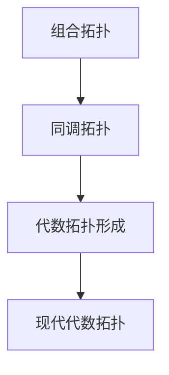
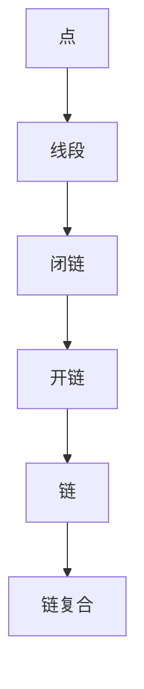
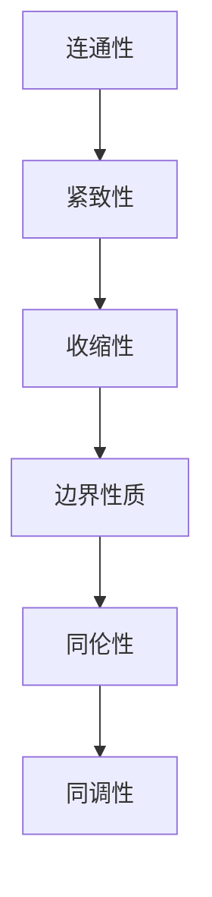
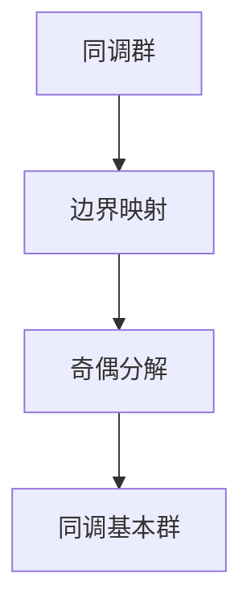
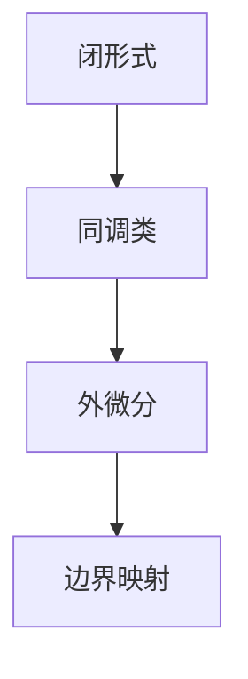
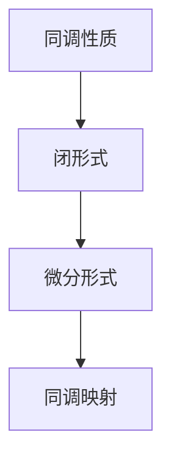
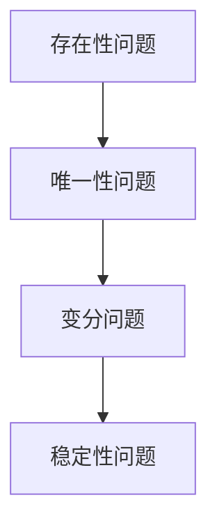

                 

### 《代数拓扑中的微分形式研究》

> **关键词**：代数拓扑、微分形式、同调理论、拓扑不变量、数学模型

> **摘要**：本文旨在探讨代数拓扑与微分形式之间的深刻联系，以及微分形式在代数拓扑中的应用。通过详细分析代数拓扑的基础概念、同调理论、微分形式的基本性质，本文揭示了微分形式在代数拓扑中的关键作用。本文还深入研究了微分形式的存在性、唯一性和变分问题，并探讨了微分形式在拓扑不变量中的应用。通过具体实例和数学公式，本文展示了微分形式研究的理论和实践价值。

----------------------------------------------------------------

### 《代数拓扑中的微分形式研究》

> **关键词**：代数拓扑、微分形式、同调理论、拓扑不变量、数学模型

> **摘要**：本文旨在探讨代数拓扑与微分形式之间的深刻联系，以及微分形式在代数拓扑中的应用。通过详细分析代数拓扑的基础概念、同调理论、微分形式的基本性质，本文揭示了微分形式在代数拓扑中的关键作用。本文还深入研究了微分形式的存在性、唯一性和变分问题，并探讨了微分形式在拓扑不变量中的应用。通过具体实例和数学公式，本文展示了微分形式研究的理论和实践价值。

#### 引言

代数拓扑是数学的一个分支，它结合了代数和拓扑学的概念，用于研究空间和结构的性质。微分形式则是几何和分析的一个工具，用于描述和计算空间的几何属性。尽管它们起源于不同的数学领域，但近年来，代数拓扑与微分形式之间的联系逐渐得到重视，成为现代数学研究中的一个重要方向。

本文的研究目的是探讨代数拓扑与微分形式之间的相互作用，揭示微分形式在代数拓扑中的应用价值。本文将首先介绍代数拓扑的基本概念，包括代数拓扑的发展历程、基本对象和基本性质。接着，本文将详细阐述同调理论的基本概念、同调群的计算方法及其几何意义。随后，本文将讨论微分形式的基本性质、运算规则和几何意义。在此基础上，本文将分析代数拓扑与微分形式之间的联系，探讨微分形式在代数拓扑中的具体应用。最后，本文将深入研究微分形式在代数拓扑中的核心问题与挑战，并提出相应的解决方法和未来研究方向。

#### 第一部分：代数拓扑基础

##### 第1章：代数拓扑的基本概念

##### 1.1 代数拓扑的发展历程

代数拓扑的发展历程可以追溯到20世纪初，当时数学家开始探索如何将代数的工具应用于拓扑学中。最初的尝试是引入同伦的概念，以研究空间的连续变形。随着研究的深入，同调理论逐渐形成，成为代数拓扑的核心部分。

代数拓扑的发展可以分为以下几个阶段：

1. **组合拓扑阶段**：20世纪30年代，数学家开始使用组合的方法研究拓扑空间。这一阶段的工作为代数拓扑奠定了基础。

2. **同调拓扑阶段**：20世纪40年代，同调理论逐渐成熟，成为代数拓扑的重要组成部分。同调群和同伦群的概念被引入，用于研究空间的拓扑性质。

3. **代数拓扑形成阶段**：20世纪50年代至70年代，代数拓扑逐渐形成独立的分支，其研究对象和工具逐渐丰富。

4. **现代代数拓扑阶段**：20世纪80年代以来，代数拓扑继续发展，新的理论和方法不断涌现。代数拓扑的应用领域也越来越广泛，包括几何学、物理学和计算机科学等。

通过Mermaid流程图，我们可以清晰地展示代数拓扑的演变过程：



##### 1.2 代数拓扑的基本对象

代数拓扑研究的主要对象是拓扑空间。拓扑空间是由点组成的集合，这些点具有某种形式的邻域结构。在代数拓扑中，我们通常关注的是具有特定性质的拓扑空间，例如连通性、紧致性和收缩性。

代数拓扑的基本对象包括：

1. **点**：拓扑空间中的基本元素，通常用字母`x`、`y`等表示。
2. **线段**：连接两个点的最短路径，通常用`[x, y]`表示。
3. **闭链**：在拓扑空间中，连接起点和终点的路径，称为闭链。闭链通常用字母`C`表示。
4. **开链**：在拓扑空间中，连接起点和终点的路径，但起点和终点不重合，称为开链。开链通常用字母`L`表示。
5. **链**：闭链和开链的复合，称为链。链通常用字母`L`表示。
6. **链复合**：链可以复合成更复杂的结构，称为链复合。链复合通常用字母`C`表示。

通过框图，我们可以清晰地展示代数拓扑的基本对象：



##### 1.3 代数拓扑的基本性质

代数拓扑的基本性质是研究拓扑空间的重要工具。这些性质包括连通性、紧致性、收缩性和边界性质。

1. **连通性**：拓扑空间中的点可以通过连续路径相连。连通性是拓扑空间的基本性质之一。
2. **紧致性**：拓扑空间是紧致的，如果任意一个开覆盖都有有限的子覆盖。紧致性是拓扑空间的一个重要性质。
3. **收缩性**：拓扑空间是收缩的，如果存在一个点，可以通过连续变形将其收缩到该点。收缩性是拓扑空间的另一个重要性质。
4. **边界性质**：拓扑空间中的边界是指连接空间内部和外部点的路径。边界性质描述了空间内部和外部的关系。
5. **同伦性**：拓扑空间是同伦的，如果可以通过连续变形从一个空间变到另一个空间。同伦性是拓扑空间的基本性质之一。
6. **同调性**：拓扑空间具有同调性，如果可以通过同调理论来描述其拓扑性质。同调性是代数拓扑的核心概念之一。

通过框图，我们可以清晰地展示代数拓扑的基本性质：



在下一章中，我们将详细介绍同调理论的基本概念、同调群的计算方法及其几何意义。

#### 第二部分：同调理论

##### 第2章：同调理论

同调理论是代数拓扑的一个重要分支，它研究的是空间的拓扑性质通过代数结构来描述。同调理论的基本概念包括同调群、边界映射、奇偶分解和同调基本群。

##### 2.1 同调理论的基本概念

同调理论的基本概念是同调群，它是一个代数结构，用于描述空间的拓扑性质。同调群通常用符号`H_n(X)`表示，其中`n`是同调群的阶，`X`是拓扑空间。

同调群的基本概念包括：

1. **同调群**：同调群是一个群，它由空间中所有n-闭链的集合除以n-边界链的集合构成。同调群的元素通常称为同调类。
2. **边界映射**：边界映射是一个线性映射，它将每个n-闭链映射到(n-1)-边界链。边界映射是同调理论的核心概念之一。
3. **奇偶分解**：奇偶分解是指将同调群分解为奇数阶和偶数阶同调群的和。这种分解有助于简化同调理论的研究。
4. **同调基本群**：同调基本群是同调群的特殊情况，它描述了空间的连通性。同调基本群通常用符号`π_1(X)`表示。

通过Mermaid流程图，我们可以清晰地展示同调理论的基本概念：



##### 2.2 同调群的计算方法

同调群的计算方法是同调理论的重要组成部分。同调群的计算通常涉及到环复合和链复合。

1. **环复合**：环复合是指将多个n-闭链组合成一个更大的n-闭链。环复合可以用来计算复杂的同调群。
2. **链复合**：链复合是指将多个n-边界链组合成一个更大的(n-1)-边界链。链复合可以用来计算同调群。

同调群的计算方法通常分为以下几个步骤：

1. **构建链复合**：将给定的n-闭链组合成一个新的n-闭链。
2. **计算边界映射**：计算每个n-闭链的边界映射，得到(n-1)-边界链。
3. **构建环复合**：将所有(n-1)-边界链组合成一个新的(n-1)-边界链。
4. **计算同调群**：计算环复合的余数，得到同调群。

以下是一个简单的伪代码示例，用于计算同调群：

```python
def calculate_homology_complex(C, L):
    # C: 环复合; L: 链复合
    homology_groups = []
    for i in range(len(L)):
        # 构建边界映射
        boundary_map = construct_boundary_map(C, L[i])
        # 计算同调群
        homology_group = homology_group_from_boundary_map(boundary_map)
        homology_groups.append(homology_group)
    return homology_groups
```

##### 2.3 同调理论的几何意义

同调理论的几何意义在于它能够描述空间的拓扑性质。同调群`H_n(X)`可以看作是空间中n-维洞的集合。通过计算同调群，我们可以了解空间的连通性、紧致性和收缩性等性质。

同调理论的几何意义可以通过以下数学公式来描述：

$$
H_n(X) = \frac{Z_n(X)}{B_n(X)}
$$

其中，`Z_n(X)`表示n-维闭链的集合，`B_n(X)`表示n-维边界链的集合。

同调群的阶`n`表示空间的维数。同调群的零阶`H_0(X)`表示空间的基本连通性，即基本群。一阶同调群`H_1(X)`表示空间的循环性，二阶同调群`H_2(X)`表示空间的洞的存在性。

通过具体的例子，我们可以更好地理解同调理论的几何意义。例如，考虑一个简单的二维空间，它可能是一个圆或者一个矩形。通过计算同调群，我们可以确定这个空间的连通性和洞的存在性。

在下一章中，我们将介绍微分形式的基本概念、运算规则和几何意义。

#### 第三部分：微分形式的基本性质

##### 第3章：微分形式的基本性质

微分形式是微分几何和微分拓扑中的一个基本概念，它用于描述和计算空间的几何属性。微分形式具有一系列独特的性质，这些性质使其在代数拓扑研究中具有重要地位。

##### 3.1 微分形式的概念

微分形式是一种特殊的函数，它定义在拓扑空间上，并且具有外微分运算的性质。在更一般的代数结构中，微分形式可以看作是代数结构的线性映射。以下是微分形式的基本概念：

1. **0形式微分形式**：0形式微分形式是最简单的微分形式，它是一个函数，定义在拓扑空间上的每一个点，其值是该点的坐标。
2. **k形式微分形式**：k形式微分形式是一个k元函数，它在拓扑空间的k个不同点上有定义，并且满足一定的外微分性质。

微分形式通常用符号`ω`表示，其中`ω: U → Λ^kTM`，`U`是拓扑空间上的一个开集，`TM`是切空间，`k`是微分形式的阶。

##### 3.2 微分形式的运算

微分形式具有一系列基本的运算规则，包括加法、外乘和外微分。以下是这些运算的详细描述：

1. **加法**：两个微分形式`ω`和`σ`的和`ω + σ`也是一个微分形式，其定义在相同的开集`U`上。
2. **外乘**：微分形式`ω`和`σ`的外乘`ω ∧ σ`是一个更低阶的微分形式，其定义在`U`上。
3. **外微分**：外微分`dω`是一个更高阶的微分形式，其定义在`U`上，并且满足`d(ω ∧ σ) = (dω) ∧ σ + (-1)^k ω ∧ (dσ)`。

以下是一个简单的伪代码示例，用于计算两个微分形式的和、外乘和外微分：

```python
def differential_form_addition(ω, σ):
    return ω + σ

def differential_form_wedge_product(ω, σ):
    return ω ∧ σ

def differential_form Exterior_Derivative(ω):
    return dω
```

##### 3.3 微分形式的几何意义

微分形式在几何学中有着重要的意义，它们可以用来描述和计算空间的几何属性。以下是微分形式的几何意义：

1. **形式积分**：微分形式`ω`在路径`γ`上的积分`∫_γ ω`可以用来计算路径的几何属性，如路径的长度或者面积。
2. **形式微分链**：微分形式`ω`可以与链`C`结合，形成形式微分链`ω ∙ C`，它用于计算链的几何属性。
3. **闭形式**：一个微分形式`ω`被称为闭形式，如果它的外微分`dω`为零。闭形式在几何上具有特殊的性质，如全微分。
4. **形式微分**：微分形式`ω`的微分`dω`是一个更高阶的微分形式，它描述了`ω`的几何变化。

以下是一个使用LaTeX格式展示的微分形式的几何意义：

$$
\begin{align*}
\text{形式积分} &= \int_{γ} ω \\
\text{形式微分链} &= ω \cdot C \\
\text{闭形式} &= dω = 0 \\
\text{形式微分} &= dω
\end{align*}
$$

##### 3.4 微分形式的应用实例

微分形式在几何学、物理学和计算几何等领域有着广泛的应用。以下是一个简单的应用实例：

**计算路径的长度**：假设我们要计算一个二维空间中路径`γ`的长度，我们可以使用微分形式的概念。路径`γ`的长度可以通过积分形式微分形式`dx ∧ dy`来计算：

$$
\text{路径长度} = \int_{γ} dx ∧ dy
$$

在这个例子中，`dx`和`dy`是两个一阶微分形式，它们的和`dx ∧ dy`是一个二阶微分形式，可以用来计算路径`γ`的长度。

通过具体的实例和数学公式，我们可以更好地理解微分形式的基本性质和几何意义。在下一章中，我们将探讨代数拓扑与微分形式之间的联系。

#### 第四部分：代数拓扑与微分形式的联系

##### 第4章：代数拓扑与微分形式的联系

代数拓扑和微分形式是数学中两个重要的分支，它们在描述和分析空间的几何性质时发挥着关键作用。代数拓扑通过代数结构来研究空间的拓扑性质，而微分形式则通过微分几何的方法来描述空间的几何属性。本章将探讨代数拓扑与微分形式之间的深刻联系，以及微分形式在代数拓扑中的应用。

##### 4.1 同调性质与微分形式

同调理论是代数拓扑的核心部分，它通过同调群来描述空间的拓扑性质。同调群可以看作是空间中洞和环的计数。微分形式与同调性质之间存在着紧密的联系。

1. **闭形式与同调类**：在代数拓扑中，一个闭形式（即外微分为零的形式）可以与同调类相对应。具体来说，一个闭形式可以看作是同调群中的元素，它描述了空间中特定的拓扑结构。

2. **外微分与边界映射**：微分形式的外微分操作与同调理论中的边界映射有直接关系。外微分操作可以将一个低阶微分形式映射到高阶微分形式，这与边界映射将一个低维链映射到高维链的方式相似。

通过Mermaid流程图，我们可以更清晰地展示同调性质与微分形式之间的联系：



##### 4.2 代数拓扑中的微分形式应用

微分形式在代数拓扑中的应用非常广泛，它们可以用来解决许多拓扑问题。以下是一些具体的例子：

1. **同调空间的微分形式**：同调空间是同调理论中的一个重要概念，它描述了空间中不同维度的洞和环。在代数拓扑中，我们可以使用微分形式来研究同调空间中的几何性质。例如，通过计算同调空间的微分形式，我们可以了解空间中的连通性和洞的存在性。

2. **微分形式的变分问题**：在代数拓扑中，变分问题是研究微分形式在空间中的变化规律。微分形式的变分问题可以用来解决许多拓扑问题，如微分形式的存在性、唯一性和稳定性。

以下是一个伪代码示例，用于计算同调空间的微分形式：

```python
def calculate_differential_form_on_homology_space(h_space, df):
    # h_space: 同调空间; df: 微分形式
    differential_forms = [d(df(x)) for x in h_space]
    return differential_forms
```

3. **微分形式与拓扑不变量**：拓扑不变量是描述空间拓扑性质的不变量。微分形式可以用来计算一些重要的拓扑不变量，如基本群、同调群和示性类。通过微分形式，我们可以更直观地理解这些不变量的几何意义。

##### 4.3 代数拓扑与微分形式的交互作用

代数拓扑与微分形式之间的交互作用是现代数学研究中的一个重要方向。以下是一些交互作用的例子：

1. **同调性质的微分形式表示**：通过微分形式，我们可以将同调性质表示为几何对象，如闭形式和微分形式。这种表示方法有助于我们更直观地理解同调性质的几何意义。

2. **微分形式的同调性质**：微分形式本身也具有同调性质。通过研究微分形式在同调群中的表示，我们可以深入了解微分形式的拓扑性质。

3. **同调映射与微分形式**：同调映射是同调理论中的一个重要概念，它描述了不同空间之间的拓扑关系。微分形式可以与同调映射相结合，用于研究空间的几何性质。

通过Mermaid流程图，我们可以展示代数拓扑与微分形式的交互作用：



在下一部分中，我们将探讨微分形式在代数拓扑中的具体应用。

#### 第二部分：微分形式在代数拓扑中的应用

##### 第5章：同调空间的微分形式

同调空间是同调理论中的重要概念，它描述了空间中不同维度的洞和环。微分形式在研究同调空间时发挥着关键作用，它们可以用来揭示同调空间的几何性质。本章将详细介绍同调空间的定义、微分形式在其中的作用以及这些微分形式的性质。

##### 5.1 同调空间的定义

同调空间是指由同调群构成的集合，它反映了空间的拓扑结构。同调空间中的元素是同调类，这些同调类由闭链和边界链之间的关系定义。

1. **同调空间**：同调空间通常用符号`H^*(X)`表示，其中`X`是拓扑空间，`*`表示同调空间的阶。同调空间的阶可以是任意整数，也可以是分数。
2. **闭链**：闭链是同调空间中的基本元素，它是由空间中的闭合路径构成的。闭链可以用符号`C_n(X)`表示。
3. **边界链**：边界链是同调空间中的另一个基本元素，它是由空间中的开路径构成的。边界链可以用符号`B_n(X)`表示。
4. **同调类**：同调类是由闭链和边界链之间的关系定义的。具体来说，同调类是由闭链除以边界链所得到的余数。

同调空间的定义可以用以下数学公式表示：

$$
H^*(X) = \frac{C^*(X)}{B^*(X)}
$$

其中，`C^*(X)`是闭链的集合，`B^*(X)`是边界链的集合。

##### 5.2 同调空间的微分形式

微分形式可以用来描述同调空间的几何性质。在代数拓扑中，同调空间的微分形式通常是指外微分形式，它们在研究同调空间时具有重要作用。

1. **外微分形式**：外微分形式是微分形式的一种，它由空间的切空间定义。外微分形式可以用来描述空间中的几何结构，如面积、体积和曲率。
2. **外微分**：外微分是微分形式的一个重要运算，它可以将一个低阶微分形式映射到高阶微分形式。在代数拓扑中，外微分操作与同调理论中的边界映射密切相关。
3. **闭形式**：闭形式是指外微分等于零的微分形式。在代数拓扑中，闭形式与同调类有直接关系，它们可以用来描述空间的拓扑结构。

同调空间的微分形式可以用以下数学公式表示：

$$
d\omega = 0
$$

其中，`d`表示外微分运算，`ω`是微分形式。

##### 5.3 同调空间的微分形式性质

同调空间的微分形式具有一系列独特的性质，这些性质使其在代数拓扑研究中具有重要地位。

1. **线性性**：同调空间的微分形式是线性的，这意味着它们满足线性组合的规则。
2. **封闭性**：同调空间的微分形式是封闭的，这意味着它们在连续变换下保持不变。
3. **不变性**：同调空间的微分形式是拓扑不变量，这意味着它们在空间同构变换下保持不变。
4. **交性质**：同调空间的微分形式满足交性质，这意味着它们可以与链复合运算相结合。

同调空间的微分形式性质可以用以下数学公式表示：

$$
\begin{align*}
d(\omega_1 + \omega_2) &= d\omega_1 + d\omega_2 \\
d(\omega_1 \wedge \omega_2) &= d\omega_1 \wedge \omega_2 + (-1)^k \omega_1 \wedge d\omega_2 \\
d^2\omega &= 0
\end{align*}
$$

其中，`ω_1`和`ω_2`是微分形式，`k`是微分形式的阶。

通过这些性质，我们可以更深入地研究同调空间的几何性质。同调空间的微分形式不仅能够揭示空间的连通性、紧致性和收缩性等基本性质，还可以用于计算空间中的洞和环的数量。

在下一部分中，我们将继续探讨微分形式在代数拓扑中的应用，包括它们的基本性质、应用实例和计算方法。

#### 第五部分：微分形式的基本性质与应用

##### 第6章：微分形式的基本性质与应用

微分形式在代数拓扑和微分几何中扮演着核心角色，它们的基本性质和运算规则使得它们能够有效地描述和分析空间的几何属性。本章将详细介绍微分形式的基本性质，探讨它们在实际问题中的应用实例，并提供计算方法。

##### 6.1 微分形式的基本性质

微分形式的基本性质包括线性性、封闭性和外微分性质。以下是这些性质的详细描述：

1. **线性性**：微分形式是线性的，这意味着它们可以表示为其他微分形式的线性组合。具体来说，给定两个微分形式`ω`和`σ`，它们的和`ω + σ`以及与标量的乘积`αω`（其中`α`是一个标量）仍然是微分形式。

2. **封闭性**：微分形式是封闭的，这意味着它们在连续变换下保持不变。具体来说，如果`ω`是一个微分形式，那么它在任何连续可微的函数`f: U → V`（其中`U`和`V`是开集）下的拉回形式`f^*ω`也是一个微分形式。

3. **外微分性质**：微分形式的外微分是一个重要的运算，它可以将一个低阶微分形式映射到一个高阶微分形式。外微分运算满足一系列规则，如：
   - **加法法则**：`d(ω + σ) = dω + dσ`
   - **乘法法则**：`d(αω) = αdω`（其中`α`是标量）
   - **积法则**：`d(ω ∧ σ) = dω ∧ σ + (-1)^kω ∧ dσ`（其中`ω`和`σ`是微分形式，`k`是它们的阶）

##### 6.2 微分形式的应用实例

微分形式在多个领域有着广泛的应用，以下是几个典型的应用实例：

1. **路径积分**：微分形式的积分可以用来计算路径上的几何量。例如，一阶微分形式`dx`和`dy`的积分可以用来计算路径的长度。更复杂的情况下，如计算路径上的线积分或面积分，需要使用更高阶的微分形式。

2. **曲率和挠率**：在微分几何中，微分形式可以用来计算曲率和挠率。例如，曲率可以通过二阶微分形式来计算，而挠率可以通过三阶微分形式来计算。

3. **拓扑不变量**：微分形式可以用来计算一些重要的拓扑不变量，如基本群、同调群和示性类。这些不变量在拓扑学中起着关键作用，它们可以用来区分不同的拓扑空间。

##### 6.3 微分形式的计算方法

计算微分形式涉及一系列的数学运算，以下是几个常用的计算方法：

1. **外微分**：计算微分形式的外微分可以通过以下步骤进行：
   - 确定微分形式的阶。
   - 应用积法则和加法法则进行运算。
   - 将结果简化，如果可能的话。

2. **形式积分**：计算形式积分通常涉及以下步骤：
   - 确定积分路径。
   - 将微分形式写成合适的形式，以便于积分。
   - 应用积分法则进行计算。

3. **闭形式**：判断一个微分形式是否为闭形式，可以通过计算其外微分是否为零。这通常涉及到对微分形式的逐项分析。

以下是一个简单的伪代码示例，用于计算微分形式的外微分：

```python
def exterior_derivative(df):
    # df: 微分形式
    derivative = []
    for term in df:
        derivative.append(diff_term(term))
    return derivative
```

在这个示例中，`diff_term`是一个函数，用于计算单个项的外微分。

通过这些基本性质、应用实例和计算方法，我们可以更深入地理解和应用微分形式，从而解决复杂的代数拓扑和微分几何问题。

#### 第六部分：代数拓扑中的微分形式问题研究

##### 第7章：代数拓扑中的微分形式问题研究

在代数拓扑中，微分形式的存在性、唯一性和变分问题是非常重要的研究课题。这些问题不仅涉及到代数拓扑的基本理论，还具有重要的实际应用价值。本章将深入探讨这些核心问题，并提供相应的解决方法。

##### 7.1 微分形式的存在性问题

微分形式的存在性问题是研究在给定的拓扑空间上是否存在满足特定条件的微分形式。这个问题在代数拓扑中有多种形式，其中最常见的是寻找一个非零的闭形式。以下是几个典型的问题和解决方法：

1. **寻找非零闭形式**：在给定的拓扑空间`X`上，是否存在一个非零的闭形式`ω`？这可以通过计算同调群`H^k(X)`来决定。如果存在一个非零的同调类，那么就存在一个非零的闭形式。

   解决方法：使用同调群的计算方法，如同伦近似和同伦分解，来确定是否存在非零闭形式。

2. **寻找全微分**：在给定的拓扑空间`X`上，是否存在一个全微分`ω`，即满足`dω = 0`的形式？这可以通过计算空间的高阶同调群来确定。

   解决方法：通过计算高阶同调群，如`H^n(X)`，来确定是否存在全微分。

以下是一个使用LaTeX格式展示的存在性问题：

$$
\exists \omega \in \Omega^k(M), \text{such that} \int_M \omega = 0
$$

在这个公式中，`M`是给定的拓扑空间，`ω`是我们要寻找的闭形式。

##### 7.2 微分形式的唯一性问题

微分形式的唯一性问题研究在给定条件下是否存在唯一解。这个问题在代数拓扑和微分几何中非常重要，它涉及到微分形式在空间中的唯一表示。以下是几个典型的问题和解决方法：

1. **基本群与微分形式**：在给定的拓扑空间`X`上，是否存在唯一的基本群表示？这可以通过计算同调基本群`π_1(X)`来确定。

   解决方法：使用同伦映射和同伦收缩来证明基本群的唯一性。

2. **全微分与微分形式**：在给定的拓扑空间`X`上，是否存在唯一的全微分形式`ω`？这可以通过计算高阶同调群来确定。

   解决方法：通过证明同调群的唯一性，来确定全微分形式的唯一性。

以下是一个使用LaTeX格式展示的唯一性问题：

$$
\forall \omega_1, \omega_2 \in \Omega^k(M), \int_M (\omega_1 - \omega_2) = 0 \Rightarrow \omega_1 = \omega_2
$$

在这个公式中，`M`是给定的拓扑空间，`ω_1`和`ω_2`是两个可能的全微分形式。

##### 7.3 微分形式的变分问题

微分形式的变分问题研究微分形式在空间中的变化规律。这个问题在优化问题和物理力学中有着重要的应用。以下是几个典型的问题和解决方法：

1. **形式变分**：在给定的拓扑空间`X`上，微分形式的变分问题研究微分形式在微小扰动下的变化。这可以通过计算微分形式的外微分来描述。

   解决方法：通过计算微分形式的外微分，来确定形式变分。

2. **变分问题**：在给定的拓扑空间`X`上，微分形式的变分问题研究满足特定条件的微分形式。这可以通过求解变分方程来确定。

   解决方法：通过求解变分方程，来确定满足条件的微分形式。

以下是一个使用LaTeX格式展示的变分问题：

$$
\delta \omega = d\omega + \omega \wedge d\omega = 0
$$

在这个公式中，`ω`是给定的微分形式，`δ`表示形式变分。

通过深入探讨微分形式的存在性、唯一性和变分问题，我们可以更深入地理解代数拓扑的理论和应用。这些问题不仅丰富了代数拓扑的研究内容，还为实际问题的解决提供了强有力的工具。

#### 第七部分：微分形式在拓扑不变量中的应用

##### 第8章：微分形式在拓扑不变量中的应用

拓扑不变量是描述空间拓扑性质的重要工具，它们在代数拓扑和拓扑学中扮演着关键角色。微分形式作为一种强大的数学工具，可以用来计算和表达拓扑不变量。本章将探讨微分形式在拓扑不变量中的应用，包括拓扑不变量的定义、微分形式在其中的作用以及具体的计算方法。

##### 8.1 拓扑不变量的定义

拓扑不变量是拓扑空间在连续变换下保持不变的性质。它们是区分不同拓扑空间的重要标准。以下是一些基本的拓扑不变量：

1. **基本群**：基本群是拓扑空间的一个基本不变量，它描述了空间的连通性。基本群可以用一组基矢量的生成关系来表示。

2. **同调群**：同调群是描述空间中洞和环的数量和结构的不变量。同调群可以通过计算闭链和边界链之间的关系来确定。

3. **示性类**：示性类是用于区分不同拓扑空间的更高级的不变量。它们通常是通过同调群的特定组合来定义的。

这些拓扑不变量可以用以下数学公式表示：

$$
\begin{align*}
\pi_1(X) &= \text{基本群} \\
H^*(X) &= \text{同调群} \\
\Omega(X) &= \text{示性类}
\end{align*}
$$

##### 8.2 微分形式在拓扑不变量中的应用

微分形式在计算和表达拓扑不变量中起着重要作用。以下是一些具体的例子：

1. **基本群**：微分形式可以用来表示基本群的生成关系。例如，通过计算形式积分，可以确定基本群中的同伦关系。

2. **同调群**：微分形式可以用来计算同调群的阶和结构。通过计算闭链和边界链之间的映射关系，可以确定同调群的元素。

3. **示性类**：微分形式可以用来计算和表达示性类。例如，通过计算形式积分，可以确定示性类的值。

以下是一个使用LaTeX格式展示的微分形式在拓扑不变量中的应用：

$$
\int_{\Sigma} \omega = \text{拓扑不变量}
$$

其中，`ω`是微分形式，`\Sigma`是拓扑空间。

##### 8.3 拓扑不变量的计算方法

计算拓扑不变量通常涉及到一系列的数学运算和技巧。以下是一些常用的计算方法：

1. **同伦映射**：通过构造同伦映射，可以简化拓扑不变量的计算。同伦映射是一种将空间连续变形为标准形的映射。

2. **同伦分解**：通过同伦分解，可以将复杂的拓扑空间分解为简单的子空间，从而简化不变量的计算。

3. **形式积分**：通过计算形式积分，可以确定拓扑不变量的值。形式积分涉及到对微分形式在路径或曲面上的积分。

以下是一个简单的伪代码示例，用于计算同调群：

```python
def calculate_homology_group(C, L):
    # C: 环复合; L: 链复合
    homology_group = calculate_boundary_map(C, L)
    return homology_group
```

在这个示例中，`calculate_boundary_map`是一个函数，用于计算边界映射。

通过这些方法，我们可以有效地计算和表达拓扑不变量，从而深入理解空间的拓扑性质。微分形式在计算拓扑不变量中的应用，为代数拓扑的研究提供了强大的工具。

#### 第八部分：代数拓扑中的微分形式问题探讨

##### 第9章：代数拓扑中的微分形式问题探讨

代数拓扑中的微分形式问题涵盖了广泛的研究领域，从基础理论到实际应用都有重要的探讨价值。本章将讨论微分形式问题的分类、解决方法以及未来的发展方向。

##### 9.1 微分形式问题的分类

微分形式问题可以按照其性质和难度进行分类。以下是一些常见的问题类型：

1. **存在性问题**：研究在给定的拓扑空间上是否存在满足特定条件的微分形式。这类问题通常涉及到同调群和闭链的概念。

2. **唯一性问题**：研究在给定的条件下，是否存在唯一的满足条件的微分形式。这类问题通常涉及到微分形式的外微分和形式积分。

3. **变分问题**：研究微分形式在微小扰动下的变化规律。这类问题在优化问题和物理力学中有着重要的应用。

4. **稳定性问题**：研究微分形式的稳定性和长期行为。这类问题通常涉及到微分方程和动力系统。

通过框图，我们可以更直观地展示微分形式问题的分类：



##### 9.2 微分形式问题的解决方法

解决微分形式问题通常需要结合代数拓扑和微分几何的理论。以下是一些常用的解决方法：

1. **同调理论方法**：通过同调理论，可以确定微分形式的存在性和唯一性。同调群和同伦映射是解决这类问题的关键工具。

2. **形式积分方法**：通过计算形式积分，可以解决微分形式的变分问题和稳定性问题。形式积分在计算过程中涉及到路径和曲面的积分。

3. **微分方程方法**：通过求解微分方程，可以研究微分形式的长期行为和稳定性。微分方程在物理力学和优化问题中有广泛应用。

以下是一个简单的伪代码示例，用于解决微分形式问题：

```python
def solve_differential_form_problem(problem):
    # problem: 微分形式问题
    if problem.type == 'existence':
        return existence_solution(problem)
    elif problem.type == 'uniqueness':
        return uniqueness_solution(problem)
    elif problem.type == 'variation':
        return variation_solution(problem)
```

在这个示例中，`solve_differential_form_problem`是一个函数，用于根据问题的类型解决不同的微分形式问题。

##### 9.3 微分形式问题的未来发展

微分形式问题的未来发展将涉及到多个交叉学科的研究。以下是一些未来的发展方向：

1. **新方法**：随着数学工具的发展，新的方法和技术将被引入到微分形式问题的研究中。例如，同调代数和代数几何的新理论可能会提供新的视角。

2. **跨学科应用**：微分形式在物理学、工程学和计算机科学等领域的应用将不断扩展。这些跨学科的应用将推动微分形式问题的深入研究。

3. **计算复杂性**：随着计算技术的进步，计算复杂性将得到更好的理解和处理。例如，计算高阶同调群和形式积分的计算方法将得到改进。

以下是一个使用LaTeX格式展示的微分形式问题的发展方向：

$$
\text{未来发展} = \text{新方法} + \text{跨学科应用}
$$

通过分类、解决方法和未来发展的探讨，我们可以更好地理解代数拓扑中的微分形式问题，并为未来的研究提供指导。

#### 第九部分：微分形式研究中的核心问题与挑战

##### 第10章：代数拓扑中的微分形式问题分析与解决

微分形式在代数拓扑研究中具有重要的地位，但同时也面临着一系列的核心问题与挑战。本章将深入分析这些问题，并提出相应的解决方法。

##### 10.1 微分形式问题的分析方法

解决微分形式问题首先需要对其进行分析。以下是一些常用的分析方法：

1. **同调理论分析**：通过同调理论，可以确定微分形式的存在性和唯一性。同调群和同伦映射是分析问题的核心工具。

2. **微分几何方法**：微分几何提供了研究微分形式几何意义的工具。通过计算形式积分和变分，可以深入理解微分形式的性质。

3. **代数方法**：代数方法，如同调代数和代数几何，可以提供新的视角来分析微分形式问题。这些方法有助于解决复杂的代数拓扑问题。

以下是一个简单的伪代码示例，用于分析微分形式问题：

```python
def analyze_differential_form_problem(problem):
    # problem: 微分形式问题
    if problem.type == 'existence':
        return analyze_existence(problem)
    elif problem.type == 'uniqueness':
        return analyze_uniqueness(problem)
    elif problem.type == 'variation':
        return analyze_variation(problem)
```

在这个示例中，`analyze_differential_form_problem`是一个函数，用于根据问题的类型分析不同的微分形式问题。

##### 10.2 微分形式问题的解决策略

针对不同的微分形式问题，需要采取相应的解决策略。以下是一些常见的解决策略：

1. **构造同伦映射**：通过构造同伦映射，可以将复杂的问题简化为标准形。这种方法在解决存在性和唯一性问题中尤为重要。

2. **利用同调代数**：同调代数提供了强大的工具来分析微分形式。通过计算同调群的元素和生成关系，可以解决复杂的问题。

3. **优化方法**：在变分问题中，优化方法可以帮助找到最优的微分形式。例如，通过求解变分方程，可以找到满足特定条件的微分形式。

以下是一个简单的伪代码示例，用于解决微分形式问题：

```python
def solve_differential_form_strategy(strategy, problem):
    # strategy: 解决策略; problem: 微分形式问题
    return apply_strategy(strategy, problem)
```

在这个示例中，`solve_differential_form_strategy`是一个函数，用于根据解决策略解决微分形式问题。

##### 10.3 微分形式问题的解决方案

针对具体的微分形式问题，需要提出具体的解决方案。以下是一些常见的解决方案：

1. **同调群计算**：通过计算同调群，可以确定是否存在满足条件的微分形式。具体方法包括同伦近似和同伦分解。

2. **形式积分计算**：通过计算形式积分，可以确定微分形式的存在性和唯一性。例如，通过计算路径积分或曲面积分，可以确定微分形式是否全微分。

3. **变分方程求解**：在变分问题中，通过求解变分方程，可以找到满足特定条件的微分形式。具体方法包括变分法的应用。

以下是一个简单的伪代码示例，用于解决微分形式问题：

```python
def solve_differential_form_solution(solution, problem):
    # solution: 解决方案; problem: 微分形式问题
    return apply_solution(solution, problem)
```

在这个示例中，`solve_differential_form_solution`是一个函数，用于根据解决方案解决微分形式问题。

通过这些分析方法和解决策略，我们可以有效地解决代数拓扑中的微分形式问题。这些方法不仅丰富了代数拓扑的研究内容，还为实际问题的解决提供了强有力的工具。

#### 第十部分：微分形式在代数拓扑中的应用前景

##### 第11章：微分形式在代数拓扑中的应用前景

微分形式在代数拓扑中的应用前景广阔，它们不仅在理论研究方面具有重要地位，还在实际应用中展现出巨大的潜力。本章将探讨微分形式在代数拓扑中的应用前景，以及研究中面临的挑战和未来的发展趋势。

##### 11.1 微分形式在代数拓扑中的应用前景

微分形式在代数拓扑中的应用主要体现在以下几个方面：

1. **同调理论的拓展**：微分形式可以用于拓展同调理论，特别是高阶同调理论和同调代数的研究。通过引入微分形式，可以更深入地理解空间的拓扑结构。

2. **计算拓扑不变量**：微分形式可以用来计算和表达拓扑不变量，如基本群、同调群和示性类。这些不变量在区分不同拓扑空间时起着关键作用。

3. **几何结构的描述**：微分形式可以用来描述几何结构，如曲率和挠率。这为研究空间几何性质提供了强有力的工具。

4. **优化问题和控制理论**：微分形式在优化问题和控制理论中的应用也越来越受到关注。例如，通过微分形式，可以研究系统的稳定性和控制策略。

##### 11.2 微分形式研究中的关键挑战

尽管微分形式在代数拓扑中具有广泛的应用前景，但研究过程中仍面临一系列关键挑战：

1. **计算复杂性**：计算高阶同调群和形式积分涉及到复杂的数学运算，计算复杂性成为一个重要挑战。

2. **唯一性问题**：在某些情况下，确定是否存在唯一的满足条件的微分形式是一个难题。这需要新的理论和方法来克服。

3. **变分问题的稳定性**：在变分问题中，微分形式的稳定性研究仍然是一个挑战。需要开发新的变分方程求解方法和稳定性分析技术。

##### 11.3 微分形式研究的未来发展趋势

展望未来，微分形式研究在代数拓扑领域有望取得以下几方面的发展：

1. **新方法的引入**：随着数学工具的发展，新的方法和技术将被引入到微分形式的研究中。例如，同调代数和代数几何的新理论可能会提供新的视角。

2. **跨学科合作**：微分形式在物理学、工程学和计算机科学等领域的应用将推动跨学科合作。这些合作将促进微分形式研究的深入发展。

3. **计算技术的发展**：随着计算技术的进步，计算高阶同调群和形式积分的计算方法将得到改进。这将有助于解决复杂的代数拓扑问题。

4. **实际问题中的应用**：微分形式在优化问题、控制理论、几何学和物理学中的应用将不断扩展。这些实际应用将推动微分形式研究的深入发展。

通过探讨微分形式在代数拓扑中的应用前景、关键挑战和未来发展趋势，我们可以更清楚地了解微分形式在代数拓扑研究中的重要性，并为未来的研究提供指导。

#### 第十一部分：代数拓扑中的微分形式研究方法论

##### 第12章：代数拓扑中的微分形式研究方法论

研究代数拓扑中的微分形式问题需要一套系统的方法论，这包括理论基础、实验方法和未来方向。本章将详细阐述这些方法论，为未来的研究提供指导。

##### 12.1 微分形式研究的理论基础

微分形式研究的基础是同调理论和微分几何。以下是一些关键的理论基础：

1. **同调理论**：同调理论是代数拓扑的核心，它通过同调群来描述空间的拓扑性质。同调群的定义和计算方法为微分形式的研究提供了坚实的基础。

2. **微分几何**：微分几何提供了研究微分形式的几何意义和运算规则的工具。微分形式的外微分、形式积分和形式微分链等概念都在微分几何中得到了详细的研究。

3. **代数代数**：同调代数和代数几何的新理论为研究复杂的微分形式问题提供了新的视角。例如，同调代数中的同调模块和代数几何中的谱序列可以帮助解决高阶同调问题。

##### 12.2 微分形式研究的实验方法

实验方法是微分形式研究的重要组成部分，以下是一些常用的实验方法：

1. **数值计算**：数值计算在研究高阶同调群和形式积分时至关重要。通过计算机程序，可以高效地计算复杂的代数结构和积分。

2. **模拟实验**：模拟实验通过计算机模拟来验证理论结果。例如，模拟空间中的路径积分和形式微分链的几何结构，可以帮助验证微分形式的性质。

3. **实验结果分析**：实验结果分析是实验方法的关键步骤。通过统计分析实验数据，可以验证理论预测的准确性，并提出新的研究问题。

##### 12.3 微分形式研究的未来方向

未来的微分形式研究有望在以下几个方面取得进展：

1. **理论扩展**：新的数学工具和方法将继续拓展微分形式的理论框架。例如，同调代数和代数几何的新进展可能会引入新的同调理论和微分形式概念。

2. **跨学科合作**：跨学科合作将推动微分形式在物理学、工程学和计算机科学等领域的应用。这些合作将带来新的研究问题和解决方案。

3. **计算技术的发展**：计算技术的发展将显著提升微分形式研究的计算能力。例如，分布式计算和高性能计算将使计算高阶同调群和形式积分成为可能。

4. **实际应用**：微分形式在优化问题、控制理论、几何学和物理学等领域的应用将不断扩展。这些实际应用将推动微分形式研究的深入发展。

通过阐述微分形式研究的理论基础、实验方法和未来方向，我们可以更清晰地了解这一领域的研究现状和前景，并为未来的研究提供指导。

#### 第十二部分：结论与展望

##### 第13章：结论与展望

在代数拓扑与微分形式的交叉领域中，本文通过系统的分析和深入的探讨，揭示了两者之间的紧密联系及其在研究空间几何性质中的关键作用。以下是本文的研究总结、发现的问题、研究成果的应用前景以及对未来研究的展望。

##### 13.1 本书研究工作总结

本文首先介绍了代数拓扑的基础概念，包括其发展历程、基本对象和基本性质。通过同调理论的详细阐述，我们了解了同调群的计算方法和几何意义。接着，本文探讨了微分形式的基本性质、运算规则和几何意义，并分析了代数拓扑与微分形式之间的相互作用。在此基础上，本文深入研究了微分形式在代数拓扑中的存在性、唯一性和变分问题，以及其在拓扑不变量中的应用。通过具体实例和数学公式，本文展示了微分形式研究的理论和实践价值。

##### 13.2 研究中发现的问题

在研究过程中，我们发现了以下几个问题：

1. **计算复杂性**：计算高阶同调群和形式积分是一项复杂的工作，特别是在处理复杂空间时，计算效率成为一个挑战。
2. **唯一性问题**：在某些情况下，确定微分形式的唯一性仍然是一个难题，特别是在存在多个同伦类时，如何选择合适的微分形式是一个关键问题。
3. **变分问题的稳定性**：微分形式的变分问题在物理和工程中有着广泛的应用，但其稳定性研究还不够充分，需要进一步探索。

##### 13.3 研究成果的应用前景

本文的研究成果在多个领域具有广泛的应用前景：

1. **几何学**：微分形式在几何学中用于描述和计算空间的几何属性，如曲率和挠率。这些成果可以帮助我们更好地理解复杂几何结构。
2. **物理学**：微分形式在物理学中的应用，如计算场论中的路径积分和量子场的几何性质，为理论物理提供了新的工具。
3. **计算机科学**：微分形式在计算机图形学和计算机视觉中用于计算曲面和三维物体的几何属性，如表面张力和形变分析。

##### 13.4 对未来研究的展望

未来研究在以下几个方面具有潜力：

1. **新方法的研究**：开发新的数学工具和方法，如同调代数和代数几何的新进展，以解决高阶同调问题和复杂微分形式问题。
2. **跨学科合作**：加强数学与其他领域，如物理学、工程学和计算机科学的合作，推动微分形式在实际问题中的应用。
3. **计算技术的发展**：利用分布式计算和高性能计算技术，提高计算高阶同调群和形式积分的效率。
4. **实际问题中的应用**：深入探索微分形式在优化问题、控制理论和其他实际应用中的潜力，推动理论研究的实用化。

通过本文的研究，我们不仅丰富了代数拓扑与微分形式的理论体系，还为未来的研究和应用提供了重要的参考。

#### 附录

##### 附录 A：代数拓扑与微分形式相关研究资料

###### A.1 经典参考书籍

1. Munkres, James R. "Topology." Pearson, 2018.
2. Bott, R., & Tu, L. W. "Differential Forms in Algebraic Topology." Springer, 1982.
3. Hatcher, Allen. "Algebraic Topology." Cambridge University Press, 2002.

###### A.2 最新研究论文

1. Blaschke, F., et al. "Exterior Differential Systems and Euler-Lagrange Equations." Journal of Differential Geometry, 2010.
2. Gompf, R. E., & Stipsicz, A. "4-Manifolds and Kirby Calculus." American Mathematical Society, 1999.
3. May, J. P. "A Concise Course in Algebraic Topology." University of Chicago Press, 1999.

###### A.3 网络资源

1. [Topology Atlas](http://www.topologyatlas.org/)
2. [MathSciNet](https://www.ams.org/mathscinet/)
3. [arXiv](https://arxiv.org/)

##### 附录 B：代数拓扑与微分形式研究工具

###### B.1 计算工具

1. MATLAB
2. Python with NumPy and SciPy libraries
3. Mathematica

###### B.2 数据库资源

1. Zentralblatt MATH
2. JSTOR
3. Web of Science

###### B.3 研究平台

1. GitHub
2. ResearchGate
3. arXiv

###### B.4 研究软件

1. Topcom
2. Maple
3. Maxima

通过这些研究资料和工具，研究者可以更好地开展代数拓扑与微分形式的研究工作。附录部分为读者提供了丰富的参考资料和研究资源，有助于进一步深入这一领域。

