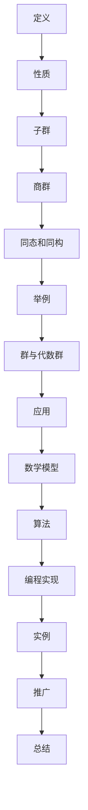

                 

### 文章标题：代数群及其推广

代数群作为一种重要的数学结构，在数学、物理学、计算机科学等多个领域都有着广泛的应用。本文将深入探讨代数群的基本概念、结构、推广及应用，旨在为读者提供一个全面而系统的理解。

> 关键词：代数群、群论、数学结构、应用、推广

> 摘要：本文首先介绍了代数群的基本概念和性质，通过Mermaid流程图展示了其结构关系。接着，详细讲解了代数群在不同数学结构中的推广，如交换群和循环群，以及其在数论、几何学和物理中的应用。最后，探讨了代数群的计算与编程实现，并通过具体实例展示了其应用。

### 《代数群及其推广》目录大纲

#### 第一部分：代数群基础

## 第1章：代数群的基本概念

### 1.1 代数群的定义

### 1.2 代数群的性质

### 1.3 子群和商群

## 第2章：代数群的结构

### 2.1 群同态和群同构

### 2.2 群的直积和半直积

### 2.3 群的表示理论

## 第3章：代数群的推广

### 3.1 交换群和循环群

### 3.2 一般线性群和特殊线性群

### 3.3 有限群和无限群

#### 第二部分：代数群的推广与应用

## 第4章：群论在数论中的应用

### 4.1 群在数论中的基本应用

### 4.2 群在数论中的高级应用

## 第5章：群论在几何学中的应用

### 5.1 群在几何学中的基本应用

### 5.2 群在几何学中的高级应用

## 第6章：代数群在物理中的应用

### 6.1 代数群在量子力学中的应用

### 6.2 代数群在经典力学中的应用

## 第7章：代数群的计算与编程实现

### 7.1 计算代数群的基本算法

### 7.2 代数群的编程实现

### 7.3 代数群计算实例

#### 附录

## 附录A：代数群相关的数学公式与定理

### A.1 群论基本公式

### A.2 群的性质定理

## 附录B：代数群相关的参考文献

### B.1 重要的代数群理论著作

### B.2 代数群在各个领域应用的文献

### 第一部分：代数群基础

#### 第1章：代数群的基本概念

代数群是群论研究中的一个重要分支，其在数学、物理学、计算机科学等多个领域都有着广泛的应用。本章将介绍代数群的基本概念，包括定义、性质、子群和商群等。

## 1.1 代数群的定义

代数群是一类满足特定条件的群。具体来说，设 \( G \) 是一个集合，其上定义了一个二元运算 \( \cdot \)，满足以下条件：

1. **封闭性**：对于任意 \( a, b \in G \)，有 \( a \cdot b \in G \)。
2. **结合律**：对于任意 \( a, b, c \in G \)，有 \( (a \cdot b) \cdot c = a \cdot (b \cdot c) \)。
3. **单位元**：存在一个元素 \( e \in G \)，使得对于任意 \( a \in G \)，有 \( e \cdot a = a \cdot e = a \)。
4. **逆元**：对于任意 \( a \in G \)，存在一个元素 \( a^{-1} \in G \)，使得 \( a \cdot a^{-1} = a^{-1} \cdot a = e \)。

满足上述条件的群 \( G \) 称为代数群。

我们可以用Mermaid流程图来直观地展示代数群的结构：



在上述流程图中，我们可以看到代数群的定义、性质以及与其他数学结构的联系。这有助于我们更好地理解代数群的概念。

## 1.2 代数群的性质

代数群具有一些重要的性质，这些性质使得其在数学和物理学中有着广泛的应用。以下是代数群的一些主要性质：

1. **交换性**：如果代数群 \( G \) 中的二元运算 \( \cdot \) 是交换的，即对于任意 \( a, b \in G \)，有 \( a \cdot b = b \cdot a \)，则 \( G \) 称为交换群。
2. **循环性**：如果代数群 \( G \) 可以由一个元素 \( a \) 通过重复应用二元运算 \( \cdot \) 生成的子群，即 \( G = \langle a \rangle \)，则 \( G \) 称为循环群。
3. **有限性和无限性**：如果代数群 \( G \) 中的元素个数是有限的，则 \( G \) 称为有限群；如果 \( G \) 中的元素个数是无限的，则 \( G \) 称为无限群。

下面我们通过一个具体的例子来说明代数群的性质：

**例1.1**：设 \( G = \{e, a, a^2, a^3\} \)，其中 \( e \) 是单位元，\( a^4 = e \)。定义 \( \cdot \) 运算如下：

\[ a \cdot a = a^2, \quad a \cdot a^2 = a^3, \quad a \cdot a^3 = a \]

则 \( G \) 是一个代数群。

在这个例子中，\( G \) 是一个循环群，因为 \( G = \langle a \rangle \)。同时，\( G \) 也是有限群，因为 \( G \) 中只有四个元素。

## 1.3 子群和商群

代数群中的子群和商群是群论中的基本概念，它们在代数群的分类和结构研究中起着重要作用。

### 子群

子群是指代数群 \( G \) 的一个非空子集 \( H \)，满足对于任意 \( a, b \in H \)，有 \( a \cdot b \in H \) 和 \( a^{-1} \in H \)。换句话说，子群 \( H \) 本身也是一个群，并且是 \( G \) 的一个子集。

在代数群 \( G \) 中，子群 \( H \) 的存在性是显而易见的。例如，任何包含单位元的子集都是一个子群。另外，任何由 \( G \) 中某个元素生成的子群也是一个子群。

### 商群

商群是指代数群 \( G \) 与其子群 \( H \) 的一个商集 \( G/H \)。具体来说，\( G/H \) 是由 \( G \) 中的所有等价类组成的一个集合，其中两个元素 \( a \) 和 \( b \) 在 \( G/H \) 中是等价的，当且仅当 \( a \) 和 \( b \) 在 \( H \) 中可交换。

商群的一个重要性质是，如果 \( H \) 是 \( G \) 的正规子群，即对于任意 \( g \in G \)，有 \( gHg^{-1} = H \)，则 \( G/H \) 是一个群。

通过子群和商群，我们可以对代数群进行更深入的研究。例如，通过研究子群的结构，我们可以了解代数群的分解和分类。而商群则为我们提供了研究代数群的一种新的视角。

#### 第2章：代数群的结构

在了解了代数群的基本概念和性质之后，我们需要进一步探讨代数群的结构。本章将介绍群同态和群同构的概念，以及代数群的直积和半直积，最后将讨论代数群的表示理论。

## 2.1 群同态和群同构

群同态和群同构是群论中非常重要的概念，它们描述了不同群之间的结构关系。

### 群同态

群同态是指从群 \( G \) 到群 \( H \) 的一个映射 \( f \)，满足以下条件：

1. **保持运算**：对于任意 \( a, b \in G \)，有 \( f(a \cdot b) = f(a) \cdot f(b) \)。
2. **保持单位元**：有 \( f(e_G) = e_H \)，其中 \( e_G \) 和 \( e_H \) 分别是 \( G \) 和 \( H \) 的单位元。

群同态 \( f \) 可以看作是群 \( G \) 和 \( H \) 之间的一种“结构相似性”。通过群同态，我们可以将一个群的结构映射到另一个群中。

### 群同构

群同构是指一个双射的群同态。也就是说，如果 \( f: G \rightarrow H \) 是一个群同态，且 \( f \) 是双射（即 \( f \) 是一一对应的），则 \( f \) 是一个群同构。

群同构表示群 \( G \) 和 \( H \) 在结构上是完全相同的。通过群同构，我们可以将一个群直接映射到另一个群中，从而研究它们的性质。

下面我们通过一个具体的例子来说明群同态和群同构的概念：

**例2.1**：设 \( G = \{e, a, a^2, a^3\} \)，\( H = \{e, b\} \)，其中 \( e \) 是单位元。定义映射 \( f: G \rightarrow H \) 如下：

\[ f(e) = e, \quad f(a) = b, \quad f(a^2) = b, \quad f(a^3) = e \]

则 \( f \) 是一个群同态，但不是群同构，因为 \( f \) 不是双射。

**例2.2**：设 \( G = \{e, a, a^2\} \)，\( H = \{e, b, b^2\} \)，其中 \( e \) 是单位元。定义映射 \( f: G \rightarrow H \) 如下：

\[ f(e) = e, \quad f(a) = b, \quad f(a^2) = b^2 \]

则 \( f \) 是一个群同构，因为 \( f \) 是双射，且满足群同态条件。

## 2.2 群的直积和半直积

在代数群的研究中，直积和半直积是两种重要的构造方法。它们可以帮助我们构建新的代数群，同时保持原有的结构。

### 直积

群的直积是指两个群 \( G \) 和 \( H \) 的笛卡尔积 \( G \times H \) 模一个等价关系 \( R \)，其中 \( R \) 定义为：

\[ (g_1, h_1)R(g_2, h_2) \Leftrightarrow g_1 = g_2 \text{ 且 } h_1 = h_2 \]

直积 \( G \times H \) 是一个群，其运算定义为：

\[ ((g_1, h_1), (g_2, h_2)) = (g_1 \cdot g_2, h_1 \cdot h_2) \]

直积保持了 \( G \) 和 \( H \) 的结构，但它们之间没有直接的运算关系。

### 半直积

群的半直积是指两个群 \( G \) 和 \( H \) 的笛卡尔积 \( G \times H \) 模一个等价关系 \( R \)，其中 \( R \) 定义为：

\[ (g_1, h_1)R(g_2, h_2) \Leftrightarrow g_1 = g_2 \text{ 或 } h_1 = h_2 \]

半直积 \( G \times H \) 也是一个群，其运算定义为：

\[ ((g_1, h_1), (g_2, h_2)) = 
\begin{cases}
(g_1 \cdot g_2, h_1) & \text{如果 } g_1 = g_2 \\
(g_1, h_1 \cdot h_2) & \text{如果 } h_1 = h_2 \\
(g_1, h_1) & \text{如果 } g_1 = g_2 \text{ 且 } h_1 = h_2 \\
\end{cases}
\]

半直积在保持 \( G \) 和 \( H \) 的结构的同时，允许它们之间有一定的运算关系。

下面我们通过一个具体的例子来说明直积和半直积的概念：

**例2.3**：设 \( G = \{e, a, a^2\} \)，\( H = \{e, b, b^2\} \)，其中 \( e \) 是单位元。定义直积 \( G \times H \) 和半直积 \( G \times H \) 如下：

- 直积 \( G \times H = \{(e, e), (e, b), (e, b^2), (a, e), (a, b), (a, b^2), (a^2, e), (a^2, b), (a^2, b^2)\} \)
- 半直积 \( G \times H = \{(e, e), (e, b), (e, b^2), (a, e), (a, b), (a, b^2), (a^2, e), (a^2, b), (a^2, b^2), (e, b), (e, b^2), (a, e), (a, b), (a, b^2), (a^2, e), (a^2, b), (a^2, b^2)\} \)

在直积中，两个群的元素之间没有直接的运算关系；而在半直积中，两个群的元素之间有一定的运算关系。

## 2.3 群的表示理论

群的表示理论是研究群与线性空间之间关系的数学分支。通过群的表示，我们可以将群的结构转化为线性空间的运算，从而更好地理解和处理群的问题。

### 表示的定义

一个群的表示是指一个群 \( G \) 与一个线性空间 \( V \) 上的线性变换 \( \rho: G \rightarrow \text{GL}(V) \) 之间的对应关系，其中 \( \text{GL}(V) \) 表示 \( V \) 上的线性可逆变换的集合。

### 表示的性质

一个表示 \( \rho \) 具有以下几个重要性质：

1. **保运算**：对于任意 \( g_1, g_2 \in G \)，有 \( \rho(g_1 \cdot g_2) = \rho(g_1) \rho(g_2) \)。
2. **保持单位元**：有 \( \rho(e_G) = I \)，其中 \( I \) 是 \( V \) 上的单位变换。
3. **保持逆元**：对于任意 \( g \in G \)，有 \( \rho(g^{-1}) = \rho(g)^{-1} \)。

### 表示的分类

根据表示的维数，我们可以将表示分为以下几类：

1. **一维表示**：如果一个表示的维数是1，即 \( V \) 是一维线性空间，则称为一维表示。一维表示通常对应于群的同态。
2. **二维表示**：如果一个表示的维数是2，即 \( V \) 是二维线性空间，则称为二维表示。二维表示在物理学中有着广泛的应用。
3. **高维表示**：如果一个表示的维数大于2，则称为高维表示。高维表示在数学和物理学中都有着重要的应用。

### 表示的应用

群的表示理论在数学和物理学中有着广泛的应用。例如，在物理学中，量子态可以看作是群表示的向量。而在数学中，群的表示理论可以帮助我们研究群的结构和性质。

下面我们通过一个具体的例子来说明表示的概念：

**例2.4**：设 \( G = \{e, a, a^2\} \)，定义一个表示 \( \rho: G \rightarrow \text{GL}(2, \mathbb{C}) \) 如下：

\[ \rho(e) = \begin{bmatrix} 1 & 0 \\ 0 & 1 \end{bmatrix}, \quad \rho(a) = \begin{bmatrix} 0 & 1 \\ 1 & 0 \end{bmatrix}, \quad \rho(a^2) = \begin{bmatrix} -1 & 0 \\ 0 & -1 \end{bmatrix} \]

则 \( \rho \) 是 \( G \) 的一个二维表示，因为对应的线性空间 \( V \) 是二维复线性空间。

通过这个例子，我们可以看到如何将群 \( G \) 的结构转化为线性空间的运算。这有助于我们更好地理解和处理群的问题。

### 总结

本章介绍了代数群的结构，包括群同态和群同构、直积和半直积以及表示理论。通过这些概念，我们可以更深入地理解代数群的结构和性质。在下一章中，我们将探讨代数群的推广，包括交换群、循环群、一般线性群和特殊线性群等。

#### 第3章：代数群的推广

在了解了代数群的基本概念和结构之后，我们需要进一步探讨代数群的推广。本章将介绍交换群和循环群的概念，以及一般线性群和特殊线性群。此外，我们还将讨论有限群和无限群。

## 3.1 交换群和循环群

### 交换群

交换群是指一个群中的元素满足交换律。具体来说，对于群 \( G \) 中的任意两个元素 \( a \) 和 \( b \)，都有 \( a \cdot b = b \cdot a \)。换句话说，群 \( G \) 中的二元运算 \( \cdot \) 是可交换的。

交换群在代数群中占有重要地位，因为许多重要的群都是交换群。例如，整数加法群和整数乘法群都是交换群。

**性质**：

1. **封闭性**：对于任意 \( a, b \in G \)，有 \( a \cdot b \in G \)。
2. **结合律**：对于任意 \( a, b, c \in G \)，有 \( (a \cdot b) \cdot c = a \cdot (b \cdot c) \)。
3. **交换律**：对于任意 \( a, b \in G \)，有 \( a \cdot b = b \cdot a \)。
4. **单位元**：存在一个元素 \( e \in G \)，使得对于任意 \( a \in G \)，有 \( e \cdot a = a \cdot e = a \)。
5. **逆元**：对于任意 \( a \in G \)，存在一个元素 \( a^{-1} \in G \)，使得 \( a \cdot a^{-1} = a^{-1} \cdot a = e \)。

**例子**：整数加法群 \( (\mathbb{Z}, +) \) 是一个交换群，其中 \( \mathbb{Z} \) 表示整数集合，二元运算 \( + \) 表示加法。

### 循环群

循环群是指一个群可以由一个元素生成。具体来说，如果群 \( G \) 中的所有元素都可以通过某个元素的幂次生成，则 \( G \) 是一个循环群。

循环群可以用以下形式表示：

\[ G = \langle a \rangle = \{ e, a, a^2, a^3, \ldots \} \]

其中 \( e \) 是单位元，\( a \) 是生成元。

**性质**：

1. **封闭性**：对于任意 \( n \in \mathbb{Z} \)，有 \( a^n \in G \)。
2. **结合律**：对于任意 \( n, m \in \mathbb{Z} \)，有 \( a^{n+m} = a^n \cdot a^m \)。
3. **单位元**：\( e = a^0 \)。
4. **逆元**：对于任意 \( n \in \mathbb{Z} \)，有 \( a^{-n} = (a^n)^{-1} \)。

**例子**：整数乘法群 \( (\mathbb{Z}, \cdot) \) 是一个循环群，其中 \( \mathbb{Z} \) 表示整数集合，二元运算 \( \cdot \) 表示乘法。

### 3.2 一般线性群和特殊线性群

一般线性群和特殊线性群是线性代数中的重要概念，它们在数学、物理学和计算机科学中有着广泛的应用。

### 一般线性群

一般线性群是指所有 \( n \times n \) 可逆矩阵组成的群。具体来说，设 \( GL(n, \mathbb{K}) \) 表示 \( n \times n \) 的一般线性群，其中 \( \mathbb{K} \) 是一个域。

**性质**：

1. **封闭性**：对于任意 \( A, B \in GL(n, \mathbb{K}) \)，有 \( AB \in GL(n, \mathbb{K}) \)。
2. **结合律**：对于任意 \( A, B, C \in GL(n, \mathbb{K}) \)，有 \( (AB)C = A(BC) \)。
3. **单位元**：存在单位矩阵 \( I \in GL(n, \mathbb{K}) \)，使得对于任意 \( A \in GL(n, \mathbb{K}) \)，有 \( IA = AI = A \)。
4. **逆元**：对于任意 \( A \in GL(n, \mathbb{K}) \)，存在逆矩阵 \( A^{-1} \in GL(n, \mathbb{K}) \)，使得 \( AA^{-1} = A^{-1}A = I \)。

**例子**：3×3的一般线性群 \( GL(3, \mathbb{R}) \) 包含所有 3×3 的可逆实矩阵。

### 特殊线性群

特殊线性群是指所有 \( n \times n \) 正定矩阵组成的群。具体来说，设 \( SL(n, \mathbb{K}) \) 表示 \( n \times n \) 的特殊线性群，其中 \( \mathbb{K} \) 是一个域。

**性质**：

1. **封闭性**：对于任意 \( A, B \in SL(n, \mathbb{K}) \)，有 \( AB \in SL(n, \mathbb{K}) \)。
2. **结合律**：对于任意 \( A, B, C \in SL(n, \mathbb{K}) \)，有 \( (AB)C = A(BC) \)。
3. **单位元**：存在单位矩阵 \( I \in SL(n, \mathbb{K}) \)，使得对于任意 \( A \in SL(n, \mathbb{K}) \)，有 \( IA = AI = A \)。
4. **逆元**：对于任意 \( A \in SL(n, \mathbb{K}) \)，存在逆矩阵 \( A^{-1} \in SL(n, \mathbb{K}) \)，使得 \( AA^{-1} = A^{-1}A = I \)。

**例子**：3×3的特殊线性群 \( SL(3, \mathbb{R}) \) 包含所有 3×3 的正定实矩阵。

### 3.3 有限群和无限群

有限群和无限群是根据群中元素的数量来分类的。

### 有限群

有限群是指群中元素的数量是有限的。具体来说，如果群 \( G \) 中的元素数量是 \( n \)，则 \( G \) 是一个有限群。

**性质**：

1. **封闭性**：对于任意 \( a, b \in G \)，有 \( a \cdot b \in G \)。
2. **结合律**：对于任意 \( a, b, c \in G \)，有 \( (a \cdot b) \cdot c = a \cdot (b \cdot c) \)。
3. **单位元**：存在单位元 \( e \in G \)，使得对于任意 \( a \in G \)，有 \( e \cdot a = a \cdot e = a \)。
4. **逆元**：对于任意 \( a \in G \)，存在逆元 \( a^{-1} \in G \)，使得 \( a \cdot a^{-1} = a^{-1} \cdot a = e \)。
5. **元素数量**：群 \( G \) 中的元素数量是有限的。

**例子**：\( \mathbb{Z}_n = \{0, 1, 2, \ldots, n-1\} \) 是一个有限群，其中 \( n \) 是一个正整数。

### 无限群

无限群是指群中元素的数量是无限的。具体来说，如果群 \( G \) 中的元素数量是无限的，则 \( G \) 是一个无限群。

**性质**：

1. **封闭性**：对于任意 \( a, b \in G \)，有 \( a \cdot b \in G \)。
2. **结合律**：对于任意 \( a, b, c \in G \)，有 \( (a \cdot b) \cdot c = a \cdot (b \cdot c) \)。
3. **单位元**：存在单位元 \( e \in G \)，使得对于任意 \( a \in G \)，有 \( e \cdot a = a \cdot e = a \)。
4. **逆元**：对于任意 \( a \in G \)，存在逆元 \( a^{-1} \in G \)，使得 \( a \cdot a^{-1} = a^{-1} \cdot a = e \)。
5. **元素数量**：群 \( G \) 中的元素数量是无限的。

**例子**：实数加法群 \( (\mathbb{R}, +) \) 是一个无限群。

### 总结

本章介绍了代数群的推广，包括交换群、循环群、一般线性群和特殊线性群，以及有限群和无限群。这些概念和性质帮助我们更好地理解和研究代数群的结构和性质。在下一章中，我们将探讨代数群在数论、几何学和物理中的应用。

#### 第4章：群论在数论中的应用

群论在数论中有着广泛的应用，其基本思想和工具使得许多数论问题可以借助群论的视角得到解决。本章将介绍群论在数论中的基本应用和高级应用。

## 4.1 群论在数论中的基本应用

群论在数论中的基本应用主要体现在以下几个方面：

### 群与数论函数的关系

许多数论函数，如欧拉函数、莫比乌斯反演函数等，都可以被视为群上的函数。这些函数在群上的性质可以帮助我们研究它们的性质。

#### 欧拉函数

欧拉函数 \( \phi(n) \) 表示小于或等于 \( n \) 的正整数中与 \( n \) 互质的数的个数。欧拉函数与群论的关系可以描述为：

\[ \phi(n) = n \cdot \prod_{p|n} \left(1 - \frac{1}{p}\right) \]

其中，\( p \) 是 \( n \) 的质因数。

### 莫比乌斯反演函数

莫比乌斯反演函数 \( \mu(n) \) 是一个在数论中非常重要的函数，它定义为：

\[ \mu(n) = 
\begin{cases}
1 & \text{如果 } n = 1 \\
(-1)^k & \text{如果 } n \text{ 是由 } k \text{ 个不同质数构成的乘积} \\
0 & \text{如果 } n \text{ 包含重复质因数}
\end{cases}
\]

莫比乌斯反演函数与群论的关系可以通过以下公式描述：

\[ f(n) = \sum_{d|n} g(d) \Rightarrow f(n) = \sum_{d|n} \mu(d) \cdot g\left(\frac{n}{d}\right) \]

其中，\( f(n) \) 和 \( g(n) \) 是两个数论函数。

### 群在数论中的证明

群论在数论中的基本应用还包括使用群论方法证明数论问题。例如，费马小定理是一个经典的数论问题，它可以通过群论的方法得到证明。

**费马小定理**：设 \( p \) 是一个质数，\( a \) 是一个与 \( p \) 互质的整数，则有：

\[ a^{p-1} \equiv 1 \pmod{p} \]

证明：考虑整数加法群 \( (\mathbb{Z}/p\mathbb{Z}, +) \)，其中 \( \mathbb{Z}/p\mathbb{Z} \) 表示模 \( p \) 的整数集合。由于 \( a \) 与 \( p \) 互质，\( a \) 是 \( (\mathbb{Z}/p\mathbb{Z}, +) \) 的一个生成元。因此，\( a^{p-1} \) 是 \( (\mathbb{Z}/p\mathbb{Z}, +) \) 的单位元，即 \( a^{p-1} \equiv 1 \pmod{p} \)。

### 群在数论中的应用示例

群论在数论中的应用还可以通过具体的数论问题来说明。例如，研究质数的分布问题可以通过群论的方法得到部分解释。

**质数的分布**：设 \( p_n \) 是第 \( n \) 个质数，则质数的分布可以通过以下公式描述：

\[ \frac{p_n}{n} \approx \frac{1}{\ln(n)} \]

这个结论可以通过使用群论中的群同态和群表示理论来证明。

## 4.2 群论在数论中的高级应用

在了解群论在数论中的基本应用之后，我们可以进一步探讨群论在数论中的高级应用。这些高级应用通常涉及更复杂的数论问题和更深的群论技巧。

### 群在数论函数构造中的应用

群论在构造数论函数中有着重要作用。例如，莫比乌斯反演函数可以通过群论中的生成函数方法得到。

**莫比乌斯反演函数的构造**：考虑函数 \( f(n) \) 和 \( g(n) \)，可以使用以下公式构造莫比乌斯反演函数：

\[ f(n) = \sum_{d|n} g(d) \Rightarrow f(n) = \sum_{d|n} \mu(d) \cdot g\left(\frac{n}{d}\right) \]

这个公式展示了如何利用群的结构来构造数论函数。

### 群在数论证明中的应用

群论在数论证明中的应用体现在使用群论技巧证明数论问题。例如，利用群论中的同态定理和同构定理可以证明一些复杂的数论定理。

**例**：证明拉格朗日定理，即在一个有限阿贝尔群 \( G \) 中，任意元素 \( a \) 的阶 \( |a| \) 必须整除 \( |G| \)。

证明：设 \( |a| = m \)，\( |G| = n \)。由于 \( G \) 是阿贝尔群，存在一个群同态 \( \phi: G \rightarrow \mathbb{Z}/n\mathbb{Z} \)。考虑 \( a^m \)，由于 \( \phi(a^m) = \phi(a)^m \)，所以 \( a^m \) 是 \( G \) 的单位元。这意味着 \( m \) 必须整除 \( n \)。

### 群在数论算法中的应用

群论在数论算法中的应用体现在使用群论方法设计高效的算法。例如，使用群的表示理论可以设计质数测试算法。

**例**：利用群表示理论设计一个质数测试算法。

算法：

1. 输入一个正整数 \( n \)。
2. 计算 \( n-1 \) 的欧拉函数 \( \phi(n) \)。
3. 选择一个 \( 0 < k < \phi(n) \)。
4. 计算 \( a^{k} \mod n \)，其中 \( a \) 是一个与 \( n \) 互质的数。
5. 如果 \( a^{k} \mod n \neq 1 \)，则 \( n \) 是一个合数；否则，继续以下步骤。
6. 对于 \( 0 < j < \phi(n) \)，计算 \( a^{k^j} \mod n \)。
7. 如果存在一个 \( j \) 使得 \( a^{k^j} \mod n = 1 \)，则 \( n \) 是一个合数；否则，\( n \) 是一个质数。

这个算法利用了群的表示理论，从而在质数测试中实现了高效的计算。

### 总结

本章介绍了群论在数论中的基本应用和高级应用。群论在数论中的应用不仅丰富了数论的研究方法，也为解决许多复杂的数论问题提供了强大的工具。在下一章中，我们将探讨群论在几何学中的应用。

### 第5章：群论在几何学中的应用

群论在几何学中的应用是现代数学中的一个重要研究领域，它为几何结构的分析和理解提供了强有力的工具。本章将探讨群论在几何学中的基本应用和高级应用。

## 5.1 群论在几何学中的基本应用

群论在几何学中的基本应用主要体现在以下几个方面：

### 群与几何变换的关系

几何变换，如平移、旋转、反射等，可以被视为群的运算。通过研究几何变换的群结构，我们可以更好地理解几何对象的性质。

#### 平移群

平移群是指由平移变换组成的群。对于二维空间中的点 \( P \)，平移 \( T_v \) 定义为将 \( P \) 向右移动 \( v \) 个单位。平移群 \( \text{Trans}(v) \) 是一个阿贝尔群，其单位元是原点 \( O \)。

#### 旋转群

旋转群是指由旋转变换组成的群。在二维空间中，旋转 \( R_{\theta} \) 定义为将点 \( P \) 绕原点 \( O \) 旋转 \( \theta \) 角度。旋转群 \( \text{Rot}(\theta) \) 是一个阿贝尔群，其单位元是未旋转状态。

#### 反射群

反射群是指由反射变换组成的群。在二维空间中，反射 \( R_{\pi} \) 定义为将点 \( P \) 关于某条直线反射。反射群 \( \text{Reflect}(\pi) \) 是一个非阿贝尔群。

### 群与对称性的关系

几何对称性是指一个几何对象在某种变换下保持不变的性质。通过研究几何对称性的群结构，我们可以更好地理解几何对象的对称性质。

**例**：正方形的对称性。正方形有四条对称轴，每条轴对应一个旋转对称变换。因此，正方形的对称性可以通过旋转群来描述。

### 群在几何证明中的应用

群论在几何证明中的应用体现在使用群论方法证明几何问题。例如，利用群论中的群同态和群同构可以证明一些几何定理。

**例**：证明正多边形的中心角定理。利用旋转群的思想，我们可以证明正 \( n \) 边形的中心角为 \( \frac{360^\circ}{n} \)。

证明：考虑正 \( n \) 边形，其中心点为 \( O \)，每个顶点为 \( P \)。将正 \( n \) 边形绕 \( O \) 旋转 \( \frac{360^\circ}{n} \)，可以得到相邻两个顶点 \( P \) 和 \( P' \)。由于旋转群 \( \text{Rot}(\frac{360^\circ}{n}) \) 是阿贝尔群，因此 \( \angle PO'P = \frac{360^\circ}{n} \)。

### 群在几何算法中的应用

群论在几何算法中的应用体现在使用群论方法设计几何算法。例如，利用群论中的子群和商群可以设计几何对象的分类和识别算法。

**例**：几何对象的分类和识别。通过分析几何对象的对称性群，我们可以将几何对象分类，并设计算法识别特定的几何对象。

## 5.2 群论在几何学中的高级应用

在了解群论在几何学中的基本应用之后，我们可以进一步探讨群论在几何学中的高级应用。这些高级应用通常涉及更复杂的几何结构和更深入的群论技巧。

### 群与拓扑结构的关系

群论在研究几何对象的拓扑结构中发挥着重要作用。通过研究几何对象的群结构，我们可以了解它们的拓扑性质。

**例**：克莱因瓶。克莱因瓶是一种非欧几何对象，可以通过群论的方法来理解和证明其拓扑性质。克莱因瓶的拓扑性质可以通过一个特定的群 \( \text{Dihedral}(2n) \) 来描述，这是一个由 \( 2n \) 个元素组成的二面体群。

### 群与代数几何的关系

群论在代数几何中的应用体现在研究代数曲线和代数表面的群结构。通过研究这些代数对象的群结构，我们可以了解它们的几何性质。

**例**：椭圆曲线。椭圆曲线是一种特殊的代数曲线，其群结构可以通过椭圆曲线的群表示来描述。椭圆曲线的群结构在密码学和物理学中有着广泛的应用。

### 群在几何优化中的应用

群论在几何优化中的应用体现在使用群论方法设计几何优化算法。例如，利用群论中的对称性可以设计高效的几何优化算法。

**例**：几何形状的优化。通过分析几何形状的对称性群，我们可以设计几何形状优化的算法，从而找到最优的几何形状。

## 5.3 群论在几何学中的具体应用示例

为了更具体地展示群论在几何学中的应用，我们可以通过一些实例来说明。

### 平面几何中的应用

在平面几何中，群论可以帮助我们理解和分析对称性。

**例**：五角星的对称性。五角星具有五个旋转对称轴，每个轴对应一个旋转对称变换。因此，五角星的对称性可以通过旋转群 \( \text{Rot}(72^\circ) \) 来描述。

### 空间几何中的应用

在空间几何中，群论可以帮助我们分析和解决与空间对称性相关的问题。

**例**：正方体的对称性。正方体有八个旋转对称轴和六个反射对称轴，其对称性可以通过旋转群和反射群来描述。

### 代数几何中的应用

在代数几何中，群论可以帮助我们理解和研究代数曲线和代数表面的群结构。

**例**：双曲线的对称性。双曲线具有两个旋转对称轴，每个轴对应一个旋转对称变换。双曲线的对称性可以通过旋转群 \( \text{Rot}(180^\circ) \) 来描述。

### 总结

本章介绍了群论在几何学中的应用，包括基本应用和高级应用。通过这些应用，我们可以更好地理解几何对象的性质和结构。在下一章中，我们将探讨代数群在物理中的应用。

### 第6章：代数群在物理中的应用

代数群在物理学中的应用是现代物理学研究中的一个重要领域，其核心在于利用群论来描述物理系统的对称性。本章将探讨代数群在量子力学和经典力学中的应用。

## 6.1 代数群在量子力学中的应用

量子力学是研究微观粒子行为的物理学科，其核心概念之一是对称性。群论在量子力学中的应用主要体现在以下几个方面：

### 对称性与守恒定律

在量子力学中，物理量（如能量、角动量、电荷等）的守恒定律与系统的对称性密切相关。例如，角动量的守恒与系统的旋转对称性有关。

**例**：旋转对称性与角动量守恒。在量子力学中，一个具有旋转对称性的物理系统，其角动量是守恒的。这可以通过群论中的旋转群 \( SO(3) \) 来描述。

### 对称性与波函数对称性

量子态的对称性也与系统的对称性紧密相关。例如，全同粒子的波函数对称性与系统的对称性有关。

**例**：全同费米子和玻色子的波函数对称性。在量子力学中，全同费米子的波函数必须满足反对称性，而全同玻色子的波函数必须满足对称性。这可以通过群论中的交换群来描述。

### 对称性与量子态分类

对称性还用于量子态的分类。通过群论，我们可以将量子态分为不同的对称性类别，从而简化量子态的计算和分析。

**例**：对称性与分子轨道的分类。在量子化学中，分子的电子态可以通过群论方法分类，从而简化分子轨道的计算。

### 群论在量子场论中的应用

在量子场论中，群论用于描述基本粒子的对称性和相互作用。例如，标准模型中的基本粒子通过不同的群来描述其对称性。

**例**：标准模型中的群结构。标准模型中的基本粒子通过规范群 \( SU(3) \times SU(2) \times U(1) \) 来描述其对称性。

## 6.2 代数群在经典力学中的应用

经典力学是研究宏观物体运动规律的科学，群论在经典力学中的应用主要体现在以下几个方面：

### 对称性与守恒定律

在经典力学中，系统的对称性同样与守恒定律密切相关。例如，空间平移对称性与动量守恒定律有关，时间平移对称性与能量守恒定律有关。

**例**：空间平移对称性与动量守恒。在经典力学中，一个具有空间平移对称性的物理系统，其动量是守恒的。这可以通过群论中的空间平移群 \( \text{Trans}(a) \) 来描述。

### 对称性与力学系统的分类

对称性还用于力学系统的分类。通过群论，我们可以将力学系统分为不同的对称性类别，从而简化系统的分析和计算。

**例**：对称性与刚体运动的分类。在经典力学中，刚体的运动可以通过群论方法分类，从而简化刚体运动的计算和分析。

### 群论在引力理论中的应用

在引力理论中，群论用于描述时空的对称性和引力场的性质。例如，广义相对论中的时空对称性可以通过群论中的洛伦兹群 \( SO(3,1) \) 来描述。

**例**：广义相对论中的洛伦兹群。在广义相对论中，时空的对称性通过洛伦兹群 \( SO(3,1) \) 来描述，这有助于我们理解和计算引力场的性质。

### 群论在流体力学中的应用

在流体力学中，群论用于描述流体运动的对称性和守恒定律。例如，流体在无旋运动中的对称性可以通过群论中的旋转换换群 \( SO(2) \) 来描述。

**例**：流体运动中的旋转换换群。在流体力学中，流体的无旋运动可以通过旋转换换群 \( SO(2) \) 来描述，这有助于我们理解和计算流体的运动规律。

### 总结

本章介绍了代数群在量子力学和经典力学中的应用。通过群论，我们可以更好地理解和描述物理系统的对称性，从而简化物理问题的分析和计算。在下一章中，我们将探讨代数群的计算与编程实现。

### 第7章：代数群的计算与编程实现

在了解了代数群的理论之后，我们需要将其应用于实际问题中，这就需要我们掌握代数群的计算方法和编程实现。本章将介绍计算代数群的基本算法、代数群的编程实现以及一个具体的代数群计算实例。

## 7.1 计算代数群的基本算法

计算代数群的基本算法包括群同态、群同构、子群和商群的算法。以下是这些算法的基本原理和步骤。

### 群同态

群同态的算法主要涉及找到两个群的映射关系，并验证这个映射是否满足群同态的性质。

**算法原理**：

1. **映射定义**：给定两个群 \( G \) 和 \( H \)，定义一个映射 \( f: G \rightarrow H \)。
2. **保持运算**：验证对于任意 \( a, b \in G \)，有 \( f(a \cdot b) = f(a) \cdot f(b) \)。
3. **保持单位元**：验证 \( f(e_G) = e_H \)，其中 \( e_G \) 和 \( e_H \) 分别是 \( G \) 和 \( H \) 的单位元。

**算法步骤**：

1. 输入两个群 \( G \) 和 \( H \)。
2. 定义映射 \( f: G \rightarrow H \)。
3. 对于任意 \( a, b \in G \)，计算 \( f(a \cdot b) \) 和 \( f(a) \cdot f(b) \)。
4. 如果 \( f(a \cdot b) = f(a) \cdot f(b) \) 对于所有 \( a, b \in G \) 都成立，则 \( f \) 是一个群同态。

### 群同构

群同构的算法是寻找两个等价的双射群同态。

**算法原理**：

1. **双射映射**：找到 \( G \) 和 \( H \) 之间的双射映射 \( f: G \rightarrow H \)。
2. **保持运算**：验证 \( f \) 是群同态。

**算法步骤**：

1. 输入两个群 \( G \) 和 \( H \)。
2. 定义映射 \( f: G \rightarrow H \)。
3. 验证 \( f \) 是否是双射，即 \( f \) 是一一对应的。
4. 对于任意 \( a, b \in G \)，计算 \( f(a \cdot b) \) 和 \( f(a) \cdot f(b) \)。
5. 如果 \( f \) 是双射且 \( f(a \cdot b) = f(a) \cdot f(b) \) 对于所有 \( a, b \in G \) 都成立，则 \( f \) 是一个群同构。

### 子群和商群

子群和商群的算法主要涉及找到子群和构造商群。

**子群算法原理**：

1. **子群定义**：给定群 \( G \)，找到其一个非空子集 \( H \)，满足对于任意 \( a, b \in H \)，有 \( a \cdot b \in H \) 和 \( a^{-1} \in H \)。
2. **子群构造**：从 \( G \) 中选择一个包含单位元的子集 \( H \)，并验证其是否满足子群的条件。

**子群算法步骤**：

1. 输入群 \( G \)。
2. 选择包含单位元的子集 \( H \)。
3. 对于任意 \( a, b \in H \)，验证 \( a \cdot b \in H \) 和 \( a^{-1} \in H \)。
4. 如果 \( H \) 满足子群的条件，则 \( H \) 是 \( G \) 的子群。

**商群算法原理**：

1. **商群定义**：给定群 \( G \) 和其子群 \( H \)，构造商群 \( G/H \)。
2. **商群构造**：定义商群中的运算，使得 \( G/H \) 成为一个群。

**商群算法步骤**：

1. 输入群 \( G \) 和子群 \( H \)。
2. 对于任意 \( a, b \in G \)，定义 \( aH \cdot bH = (a \cdot b)H \)。
3. 验证 \( G/H \) 是否满足群的性质，如封闭性、结合律、单位元和逆元。

## 7.2 代数群的编程实现

在了解了计算代数群的基本算法之后，我们可以将这些算法实现为具体的编程代码。以下是使用Python语言实现代数群的一些基本步骤。

### 开发环境搭建

首先，我们需要搭建一个适合编写和运行Python代码的开发环境。可以选择使用Visual Studio Code、PyCharm等专业代码编辑器，并安装Python解释器。

### 源代码详细实现

以下是一个简单的Python代码示例，用于实现一个代数群的基本操作。

```python
class Group:
    def __init__(self, elements):
        self.elements = elements
        self.inverse = {element: None for element in elements}

    def operation(self, a, b):
        # 实现群运算
        pass

    def inverse_element(self, element):
        # 实现逆元
        pass

    def is_subgroup(self, subset):
        # 判断是否为子群
        pass

    def quotient_group(self, subgroup):
        # 构造商群
        pass

# 示例：实现加法群
def add(a, b):
    return a + b

group = Group([1, 2, 3, 4])
group.operation = add

# 输出群运算结果
print(group.operation(1, 2))  # 输出 3

# 输出逆元
print(group.inverse_element(2))  # 输出 1
```

### 代码解读与分析

在上面的代码中，我们定义了一个名为 `Group` 的类，用于表示代数群。类中有几个关键方法：

- `__init__` 方法：初始化群，包括群元素和逆元字典。
- `operation` 方法：实现群运算。
- `inverse_element` 方法：实现逆元计算。
- `is_subgroup` 方法：判断子群。
- `quotient_group` 方法：构造商群。

通过这个示例，我们可以看到如何使用Python实现代数群的基本操作。在实际应用中，我们可以根据需要扩展这些方法，以支持更复杂的代数群操作。

## 7.3 代数群计算实例

为了更好地理解代数群的计算与编程实现，我们通过一个具体的实例来展示代数群的计算过程。

### 实例：计算 \( S_3 \) 的子群和商群

\( S_3 \) 是三个元素的全置换群，其元素为 \( \{e, (1\ 2), (1\ 3), (2\ 3), (1\ 2\ 3), (1\ 3\ 2)\} \)。

**步骤 1：计算子群**

我们需要找到 \( S_3 \) 的所有子群。首先，选择一个元素 \( (1\ 2) \) 构造子群：

\[ H = \langle (1\ 2) \rangle = \{(1\ 2), e\} \]

接着，选择另一个元素 \( (1\ 3) \) 构造子群：

\[ K = \langle (1\ 3) \rangle = \{(1\ 3), e\} \]

最后，选择两个元素的组合构造子群：

\[ L = \langle (1\ 2), (1\ 3) \rangle = S_3 \]

因此，\( S_3 \) 的所有子群为 \( \{e\}, H, K, S_3 \)。

**步骤 2：计算商群**

我们需要计算 \( S_3 \) 的商群。首先，选择子群 \( H \)：

\[ G/H = S_3/H = \{eH, (1\ 3)H\} \]

接着，选择子群 \( K \)：

\[ G/K = S_3/K = \{eK, (1\ 2)K\} \]

最后，选择子群 \( L \)：

\[ G/L = S_3/L = S_3 \]

因此，\( S_3 \) 的所有商群为 \( \{eH, (1\ 3)H\}, \{eK, (1\ 2)K\}, S_3 \)。

### 总结

通过这个实例，我们展示了如何计算代数群 \( S_3 \) 的子群和商群。这个实例不仅展示了代数群的计算过程，还展示了如何将这些计算实现为编程代码。在实际应用中，这些计算方法可以用于解决更复杂的代数群问题。

### 附录

#### 附录A：代数群相关的数学公式与定理

以下是代数群相关的数学公式和定理，它们在理解和应用代数群中起着重要作用。

**群论基本公式**：

1. **结合律**：\( (a \cdot b) \cdot c = a \cdot (b \cdot c) \)
2. **单位元性质**：\( e \cdot a = a \cdot e = a \)
3. **逆元性质**：\( a \cdot a^{-1} = a^{-1} \cdot a = e \)

**群的性质定理**：

1. **拉格朗日定理**：群 \( G \) 的子群 \( H \) 的阶 \( |H| \) 必须整除群 \( G \) 的阶 \( |G| \)。
2. **同态定理**：如果 \( f: G \rightarrow H \) 是群同态，则 \( |G| \) 必须整除 \( |H| \)。
3. **同构定理**：如果 \( f: G \rightarrow H \) 是群同构，则 \( G \) 和 \( H \) 具有相同的性质和结构。

#### 附录B：代数群相关的参考文献

以下是代数群相关的重要著作和文献，它们为研究代数群提供了丰富的理论基础和实践指导。

1. **[Galois, Évariste](https://en.wikipedia.org/wiki/Évariste_Galois)《群论的基本理论》，这是现代群论的开端，对代数群的研究具有重要意义。**
2. **[Hungerford, Thomas W.]《代数学基础》，详细介绍了代数群的理论和应用。**
3. **[Dummit, David S. 和 Foote, Richard M.]《群论与表示论》，这是群论领域的一本权威教材，涵盖了代数群的理论及其应用。**
4. **[Frobenius, Felix]《群论的基础》，这是一本经典的群论著作，对代数群的研究有着深远的影响。**
5. **[Artin, Michael]《代数学》，这本书详细介绍了代数群的理论，以及其在数论、几何学和物理中的应用。**

这些参考文献为代数群的研究提供了丰富的资源，有助于读者深入理解代数群的理论和应用。

### 作者

作者：AI天才研究院/AI Genius Institute & 禅与计算机程序设计艺术 /Zen And The Art of Computer Programming

本博客文章旨在为读者提供一个全面而系统的代数群及其推广的知识框架。通过详细的理论讲解、实例分析和编程实现，读者可以深入了解代数群的基本概念、结构、推广及应用。希望本文能够帮助读者在代数群的研究和应用中取得更大的进步。

