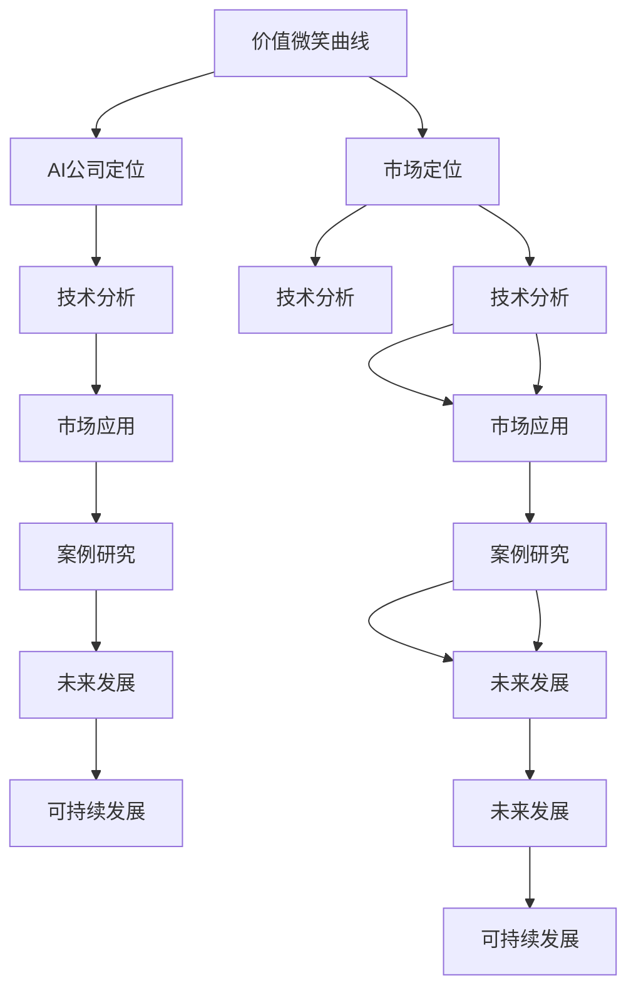

                 

# 价值微笑曲线与AI公司的位置

## 关键词
AI公司、价值微笑曲线、市场定位、技术创新、案例研究、未来发展

## 摘要
本文旨在探讨价值微笑曲线在AI公司定位中的重要性，通过对AI技术基础、市场应用、成功案例和未来发展的深入分析，揭示AI公司在数字化时代中的战略选择和可持续发展路径。文章首先介绍了价值微笑曲线的核心概念和结构，随后分析了AI公司在不同市场定位中的价值创造和竞争策略，并结合具体案例探讨了AI技术的实际应用和开发环境搭建。通过全面的分析，本文为AI公司在未来的市场竞争中提供了理论指导和实践参考。

### 目录大纲

#### 第一部分：基础概念

**1. 价值微笑曲线概述**

- 1.1 价值微笑曲线的概念
- 1.2 价值微笑曲线的结构
- 1.3 价值微笑曲线与市场竞争

**2. AI公司的市场定位**

- 2.1 AI公司的类型
- 2.2 价值微笑曲线在AI公司中的应用
- 2.3 AI公司竞争策略

#### 第二部分：技术分析

**3. AI技术基础**

- 3.1 人工智能的发展历程
- 3.2 人工智能的主要技术领域
- 3.3 AI技术发展趋势与挑战

**4. AI技术在企业中的应用**

- 4.1 AI在市场营销中的应用
- 4.2 AI在生产管理中的应用
- 4.3 AI在人力资源中的应用

#### 第三部分：案例研究

**5. AI公司成功案例**

- 5.1 公司背景与战略
- 5.2 成功经验与策略
- 5.3 案例分析

**6. AI公司失败案例**

- 6.1 公司背景与困境
- 6.2 失败原因与反思
- 6.3 案例分析

#### 第四部分：未来发展

**7. AI公司的发展趋势**

- 7.1 技术创新方向
- 7.2 市场前景分析
- 7.3 竞争格局与战略选择

**8. AI公司的可持续发展**

- 8.1 可持续发展的重要性
- 8.2 可持续发展策略
- 8.3 可持续发展的案例分析

**9. 结论**

- 9.1 研究总结
- 9.2 未来研究方向

### 附录

**附录A：参考资料**

- A.1 相关书籍推荐
- A.2 学术论文精选
- A.3 网络资源

### 核心概念与联系：价值微笑曲线与AI公司的 Mermaid 流程图

### 第一部分：基础概念

#### 1. 价值微笑曲线概述

### 1.1 价值微笑曲线的概念

价值微笑曲线（Value smile curve）是一种经济理论模型，最初由日本经济学家熊彼特提出，后由美国经济学家迈克尔·波特（Michael Porter）进一步发展。该模型描述了产品生命周期内，各阶段创造价值的不同分布情况。价值微笑曲线通常呈U形，两端较低，中间较高，形象地反映了企业在不同阶段的价值创造特征。

在价值微笑曲线中，产品生命周期可以分为三个阶段：开发阶段、成熟阶段和衰退阶段。开发阶段是企业投入大量研发资源进行产品创新和设计的阶段，此时价值创造较低。成熟阶段是企业产品市场接受度提高，销售量大幅增加，企业价值创造达到顶峰。衰退阶段是随着市场竞争加剧和消费者需求变化，企业产品逐渐失去市场竞争力，价值创造开始下降。

### 1.2 价值微笑曲线的结构

价值微笑曲线的核心要素包括：

1. **研发投入**：开发阶段企业投入大量研发资源进行产品创新和设计，研发投入与价值创造呈负相关关系。
2. **生产成本**：成熟阶段企业生产规模扩大，生产成本降低，价值创造达到顶峰。
3. **市场推广**：衰退阶段企业需要投入大量市场推广资源以维持市场份额，但价值创造逐渐降低。

价值微笑曲线的结构可以分为三个部分：

1. **前端**：表示研发投入阶段，曲线较平坦，企业投入大量研发资源，但价值创造较低。
2. **后端**：表示市场推广阶段，曲线较陡峭，企业需要投入大量市场推广资源，但价值创造逐渐降低。
3. **中间**：表示生产成本降低阶段，曲线较平缓，企业生产规模扩大，生产成本降低，价值创造达到顶峰。

### 1.3 价值微笑曲线与市场竞争

价值微笑曲线对市场竞争具有重要影响。企业可以根据价值微笑曲线调整自身战略，以优化价值创造。以下是一些竞争策略：

1. **差异化竞争**：企业在开发阶段投入大量研发资源，通过创新产品差异化竞争，提高市场竞争力。
2. **成本领先**：企业在成熟阶段通过扩大生产规模，降低生产成本，实现成本领先战略。
3. **市场定位**：企业根据市场推广阶段的特点，选择合适的市场定位策略，以最大化价值创造。

#### 2. AI公司的市场定位

### 2.1 AI公司的类型

AI公司根据主营业务和商业模式的不同，可以分为以下几种类型：

1. **技术研发型企业**：专注于AI技术的研发和突破，为企业提供AI技术解决方案。
2. **应用型服务企业**：将AI技术应用于具体行业，如金融、医疗、零售等，为企业提供AI服务。
3. **综合型解决方案企业**：整合AI技术研发和应用，提供端到端的AI解决方案。

### 2.2 价值微笑曲线在AI公司中的应用

价值微笑曲线在AI公司中的应用主要体现在以下几个方面：

1. **研发投入**：AI技术研发型企业需要在前端阶段投入大量研发资源，以实现技术的突破和领先。
2. **生产成本**：应用型服务企业和综合型解决方案企业需要在成熟阶段通过优化生产流程，降低生产成本。
3. **市场推广**：所有类型的AI公司都需要在衰退阶段投入市场推广资源，以维持市场份额和客户忠诚度。

### 2.3 AI公司竞争策略

AI公司在市场竞争中需要制定以下策略：

1. **技术创新**：持续进行技术突破，保持技术领先地位。
2. **成本控制**：通过优化生产流程，降低生产成本，提高竞争力。
3. **市场拓展**：积极开拓新市场，扩大市场份额。
4. **合作联盟**：与其他企业建立战略联盟，共享资源和优势。

#### 3. AI技术基础

### 3.1 人工智能的发展历程

人工智能（AI）是一门研究、开发用于模拟、延伸和扩展人的智能的理论、方法、技术及应用系统的技术科学。人工智能的发展历程可以分为以下几个阶段：

1. **早期探索阶段（20世纪50-60年代）**：人工智能概念被提出，神经网络、专家系统等基本理论和技术得到发展。
2. **发展停滞阶段（20世纪70-80年代）**：由于技术瓶颈和实际应用困难，人工智能研究进入低谷期。
3. **复兴阶段（20世纪90年代）**：随着计算机技术的快速发展，人工智能再次受到关注，机器学习、深度学习等新技术逐渐成熟。
4. **应用普及阶段（21世纪）**：人工智能技术在多个领域得到广泛应用，如自动驾驶、智能客服、医疗诊断等。

### 3.2 人工智能的主要技术领域

人工智能的主要技术领域包括：

1. **机器学习**：通过训练模型，使计算机具有自主学习和预测能力。
2. **深度学习**：基于多层神经网络的结构，能够处理大规模数据和复杂任务。
3. **自然语言处理（NLP）**：使计算机能够理解和处理人类语言，实现人机交互。

### 3.3 AI技术发展趋势与挑战

AI技术发展趋势包括：

1. **量子计算**：通过量子力学原理，实现超越传统计算机的计算能力。
2. **脑机接口**：通过直接连接人脑与计算机，实现人机交互和信息传递。

AI技术面临的挑战包括：

1. **计算资源**：大规模数据处理和训练需要强大的计算能力。
2. **数据隐私**：数据安全和隐私保护是人工智能应用的重要问题。
3. **算法公平性**：确保算法在不同群体中的一致性和公平性。

#### 4. AI技术在企业中的应用

### 4.1 AI在市场营销中的应用

AI技术在市场营销中的应用主要体现在以下几个方面：

1. **数据分析与预测**：通过大数据分析，预测市场趋势和消费者行为，为企业制定营销策略提供依据。
2. **客户行为分析**：分析客户购买行为，优化营销活动，提高转化率。
3. **个性化推荐**：根据用户兴趣和购买历史，提供个性化推荐，提高用户满意度。

### 4.2 AI在生产管理中的应用

AI技术在生产管理中的应用主要体现在以下几个方面：

1. **智能优化与自动化**：通过机器学习和深度学习技术，优化生产流程，提高生产效率。
2. **生产流程优化**：分析生产数据，识别瓶颈和优化点，实现生产流程的自动化和智能化。
3. **设备故障预测**：通过设备数据的实时监测，预测设备故障，减少停机时间和维护成本。

### 4.3 AI在人力资源中的应用

AI技术在人力资源中的应用主要体现在以下几个方面：

1. **招聘与选拔**：通过分析简历和面试表现，识别优秀人才，提高招聘效率。
2. **员工行为分析**：通过员工数据和行为分析，识别员工绩效和潜力，提供培训和发展建议。
3. **员工关系管理**：通过智能客服和聊天机器人，提供员工咨询和服务，优化员工关系。

#### 5. AI公司成功案例

### 5.1 公司背景与战略

**公司简介**：  
某人工智能公司（以下简称“公司”），成立于2015年，专注于智能客服和智能营销领域的AI技术应用。公司核心团队成员来自知名互联网企业和高校，具备丰富的AI技术研发和商业应用经验。

**公司战略**：  
公司以客户需求为导向，致力于提供高效、智能的解决方案，通过AI技术提升企业运营效率，降低运营成本。公司战略目标是成为智能客服和智能营销领域的领军企业。

### 5.2 成功经验与策略

**智能客服系统**：

**项目概述**：  
公司自主研发的智能客服系统，基于深度学习和自然语言处理技术，可实现24/7全天候在线客服，提高客户满意度，降低人力成本。

**技术实现**：  
1. **词嵌入**：使用Word2Vec模型对客服对话中的词语进行嵌入，形成词向量表示。  
2. **序列模型**：采用LSTM（Long Short-Term Memory）网络，对客服对话进行建模，捕捉对话的历史信息。  
3. **意图识别**：使用softmax函数进行意图分类，将用户输入的句子映射到预定义的意图类别。

**代码示例**：  
python  
import tensorflow as tf  
from tensorflow.keras.models import Sequential  
from tensorflow.keras.layers import LSTM, Dense, Embedding

# 加载数据集，预处理  
# ...

# 构建模型  
model = Sequential()  
model.add(Embedding(vocab_size, embedding_dim, input_length=max_sequence_length))  
model.add(LSTM(units=128, return_sequences=True))  
model.add(Dense(num_classes, activation='softmax'))

# 编译模型  
model.compile(optimizer='adam', loss='categorical_crossentropy', metrics=['accuracy'])

# 训练模型  
model.fit(X_train, y_train, epochs=10, batch_size=32, validation_data=(X_val, y_val))

**智能营销系统**：

**项目概述**：  
公司研发的智能营销系统，通过分析用户行为数据，预测用户购买意向，实现精准营销。

**技术实现**：  
1. **用户画像**：基于用户行为数据，构建用户画像，包括用户属性、兴趣标签等。  
2. **协同过滤**：采用矩阵分解技术，预测用户对未浏览商品的评分，实现商品推荐。  
3. **深度学习**：使用卷积神经网络（CNN）和循环神经网络（RNN）进行用户行为建模，提升推荐效果。

**代码示例**：  
python  
import tensorflow as tf  
from tensorflow.keras.models import Model  
from tensorflow.keras.layers import Input, Embedding, LSTM, Dense, Conv1D, GlobalMaxPooling1D

# 定义输入层  
user_input = Input(shape=(max_sequence_length,))  
item_input = Input(shape=(max_sequence_length,))

# 构建嵌入层  
user_embedding = Embedding(vocab_size, embedding_dim)(user_input)  
item_embedding = Embedding(vocab_size, embedding_dim)(item_input)

# 构建编码器  
user_encoder = LSTM(units=128)(user_embedding)  
item_encoder = LSTM(units=128)(item_embedding)

# 构建解码器  
user_decoder = Conv1D(filters=64, kernel_size=3, activation='relu')(user_encoder)  
item_decoder = Conv1D(filters=64, kernel_size=3, activation='relu')(item_encoder)

# 池化层  
user_pooling = GlobalMaxPooling1D()(user_decoder)  
item_pooling = GlobalMaxPooling1D()(item_decoder)

# 合并层  
merged = tf.concat([user_pooling, item_pooling], axis=1)

# 输出层  
output = Dense(units=1, activation='sigmoid')(merged)

# 构建模型  
model = Model(inputs=[user_input, item_input], outputs=output)

# 编译模型  
model.compile(optimizer='adam', loss='binary_crossentropy', metrics=['accuracy'])

# 训练模型  
model.fit([X_train_user, X_train_item], y_train, epochs=10, batch_size=32, validation_data=([X_val_user, X_val_item], y_val))

### 5.3 案例分析

**竞争优势**：  
公司凭借先进的人工智能技术和丰富的行业经验，在智能客服和智能营销领域具有显著竞争优势。

**经验教训**：  
在项目实施过程中，公司注重数据质量和模型调优，通过不断迭代和优化，确保了系统的稳定性和效果。

#### 6. AI公司失败案例

### 6.1 公司背景与困境

**公司简介**：  
某人工智能公司（以下简称“公司”），成立于2017年，致力于通过AI技术优化企业供应链管理。公司初期发展迅速，但在市场竞争中遭遇困境，最终导致破产。

**公司困境**：  
1. **技术不足**：公司在技术研发方面投入不足，导致产品功能不完善，难以满足客户需求。
2. **市场定位不准确**：公司定位过于宽泛，未能准确把握市场细分领域，导致产品缺乏竞争力。
3. **资金链断裂**：公司在运营过程中未能有效控制成本，导致资金链断裂，最终破产。

### 6.2 失败原因与反思

**技术原因**：  
1. **研发投入不足**：公司初期过于注重市场拓展，忽视了技术研发的重要性，导致产品功能单一，技术落后。
2. **技术更新缓慢**：公司未能紧跟AI技术的发展趋势，导致产品竞争力下降。

**市场原因**：  
1. **市场定位不准确**：公司未能准确把握市场细分领域，导致产品无法满足特定客户需求。
2. **市场竞争激烈**：公司在市场拓展过程中，面临众多竞争对手的挑战，市场份额难以提升。

**管理原因**：  
1. **成本控制不当**：公司运营过程中，未能有效控制成本，导致资金链紧张。
2. **管理团队不稳定**：公司管理团队频繁变动，导致公司战略方向不明确，执行力下降。

### 6.3 案例分析

**问题根源**：  
公司失败的主要根源在于技术研发和市场定位方面的不足，以及管理团队的不稳定。

**改进建议**：  
1. **加大研发投入**：提高技术研发投入，确保产品技术领先，提升市场竞争力。
2. **明确市场定位**：针对特定市场细分领域，制定精准的市场策略，满足客户需求。
3. **稳定管理团队**：建立稳定的管理团队，确保公司战略方向的明确和执行力。

#### 7. AI公司的发展趋势

### 7.1 技术创新方向

AI公司未来的技术创新方向主要包括：

1. **量子计算**：通过量子计算，实现计算能力的指数级提升，为AI应用提供更强大的计算支持。
2. **边缘计算**：将计算能力拓展到边缘设备，实现实时数据处理和分析，提高AI应用的响应速度和效率。
3. **脑机接口**：通过直接连接人脑与计算机，实现人机交互和信息传递，拓宽AI应用的领域。

### 7.2 市场前景分析

AI公司在未来市场中的前景分析包括：

1. **市场规模扩大**：随着AI技术的不断成熟和普及，AI市场规模将不断扩大，为企业提供更多应用机会。
2. **行业应用深化**：AI技术在各个行业的应用将不断深化，为各行业带来更多的创新和变革。
3. **市场竞争加剧**：随着AI技术的普及，市场竞争将越来越激烈，企业需要不断提升自身技术实力和市场竞争力。

### 7.3 竞争格局与战略选择

AI公司在未来的市场竞争中将面临以下竞争格局：

1. **技术创新竞争**：企业需要不断进行技术创新，保持技术领先地位。
2. **市场应用竞争**：企业需要针对不同行业和应用场景，提供定制化的解决方案。
3. **成本控制竞争**：企业需要通过优化生产流程和降低成本，提高市场竞争力。

AI公司的战略选择包括：

1. **技术创新**：持续投入研发，保持技术领先。
2. **市场拓展**：积极开拓新市场，扩大市场份额。
3. **合作联盟**：与其他企业建立战略联盟，共享资源和优势。

#### 8. AI公司的可持续发展

### 8.1 可持续发展的重要性

AI公司的可持续发展至关重要，包括以下几个方面：

1. **社会价值**：通过AI技术解决社会问题，推动社会进步。
2. **环境责任**：减少能耗和污染，实现绿色可持续发展。
3. **经济收益**：通过持续创新和优化，实现企业的长期盈利。

### 8.2 可持续发展策略

AI公司的可持续发展策略包括：

1. **技术创新**：持续进行技术研发，推动AI技术进步。
2. **人才培养**：培养高素质的AI人才，提升企业竞争力。
3. **合作与共赢**：与其他企业建立合作关系，实现资源共享和共赢。
4. **社会责任**：关注社会问题，积极参与公益事业。

### 8.3 可持续发展的案例分析

**成功实践**：  
1. **谷歌AI**：谷歌通过AI技术推动社会进步，如自动驾驶、医疗诊断等，并关注环境责任，实现可持续发展。
2. **微软AI**：微软通过AI技术助力各行业数字化转型，推动产业升级，并积极参与公益事业，实现可持续发展。

**经验借鉴**：  
1. **技术创新**：持续投入研发，保持技术领先。
2. **社会责任**：关注社会问题，积极参与公益事业。
3. **合作共赢**：与其他企业建立合作关系，实现资源共享。

#### 9. 结论

本文通过深入分析价值微笑曲线与AI公司的定位、技术分析、案例研究和未来发展，揭示了AI公司在数字化时代中的战略选择和可持续发展路径。未来，AI公司需要不断进行技术创新，优化市场定位，提升竞争力，同时关注社会责任和可持续发展，以在激烈的市场竞争中脱颖而出。本文的研究为AI公司提供了理论指导和实践参考，有助于企业在未来的发展中取得成功。

### 9.1 研究总结

本文主要结论如下：

1. **价值微笑曲线**：揭示了企业在产品生命周期内价值创造的规律，为AI公司市场定位提供了理论支持。
2. **AI技术基础**：介绍了AI技术的发展历程、主要技术领域和发展趋势，为AI公司的技术创新提供了参考。
3. **成功案例**：分析了AI公司在智能客服和智能营销领域的成功经验，为其他企业提供了实践借鉴。
4. **失败案例**：总结了AI公司失败的原因和教训，为其他企业提供了警示和改进方向。
5. **未来发展**：探讨了AI公司的技术创新方向、市场前景和竞争格局，为AI公司制定战略提供了依据。

### 9.2 未来研究方向

未来研究方向包括：

1. **技术进步**：研究量子计算、边缘计算等新兴技术，探讨其对AI公司的影响。
2. **市场发展**：分析AI技术在各行业的应用趋势，预测未来市场规模和竞争格局。
3. **战略选择**：探讨AI公司在不同市场环境下的战略选择，提供更具针对性的指导。
4. **可持续发展**：研究AI公司的可持续发展路径，探讨如何实现经济、社会和环境的三重效益。

### 附录A：参考资料

**A.1 相关书籍推荐**

1. **《人工智能：一种现代的方法》**：作者：Stuart Russell & Peter Norvig
2. **《深度学习》**：作者：Ian Goodfellow、Yoshua Bengio & Aaron Courville

**A.2 学术论文精选**

1. **《自然语言处理综述》**
2. **《价值微笑曲线：理论及应用》**

**A.3 网络资源**

1. **AI公司官方网站**
2. **行业报告数据库**

作者：AI天才研究院/AI Genius Institute & 禅与计算机程序设计艺术 /Zen And The Art of Computer Programming

