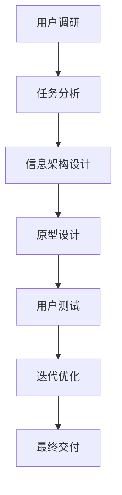

                 

## 文章标题

《任务导向设计对信息架构的深远影响》

> 关键词：任务导向设计、信息架构、用户体验、网站架构、移动应用架构、复杂系统架构、人工智能、大数据、物联网

> 摘要：本文深入探讨了任务导向设计（Task-Oriented Design，简称TOD）在信息架构（Information Architecture，简称IA）中的深远影响。从背景与基础理论出发，详细阐述了任务导向设计的核心原则及其与信息架构的密切联系。通过具体案例分析，揭示了任务导向设计在网站架构、移动应用架构以及复杂系统架构中的应用及其优化策略。最后，探讨了任务导向设计与新兴技术的融合以及其未来发展趋势，为信息架构师提供了宝贵的实践指导和理论支持。

---

### 目录大纲

# 《任务导向设计对信息架构的深远影响》

## 第一部分：背景与基础理论

### 第1章：任务导向设计的起源与发展

#### 1.1 任务导向设计的概念与重要性

#### 1.2 信息架构的基础概念

#### 1.3 任务导向设计与信息架构的联系

### 第2章：任务导向设计的核心原则

#### 2.1 用户中心设计原则

#### 2.2 用户体验设计原则

#### 2.3 任务导向设计的方法与工具

## 第二部分：任务导向设计在信息架构中的应用

### 第3章：任务导向设计在网站架构中的应用

#### 3.1 网站信息架构的设计原则

#### 3.2 任务导向设计的网站案例分析

#### 3.3 网站信息架构的优化策略

### 第4章：任务导向设计在移动应用架构中的应用

#### 4.1 移动应用信息架构的设计原则

#### 4.2 任务导向设计的移动应用案例分析

#### 4.3 移动应用信息架构的优化策略

### 第5章：任务导向设计在复杂系统架构中的应用

#### 5.1 复杂系统信息架构的设计原则

#### 5.2 任务导向设计的复杂系统案例分析

#### 5.3 复杂系统信息架构的优化策略

## 第三部分：任务导向设计与信息架构的未来趋势

### 第6章：任务导向设计与新兴技术的融合

#### 6.1 人工智能与任务导向设计

#### 6.2 大数据与任务导向设计

#### 6.3 物联网与任务导向设计

### 第7章：任务导向设计与信息架构的未来趋势

#### 7.1 信息架构的未来发展方向

#### 7.2 任务导向设计的未来挑战与机遇

#### 7.3 信息架构师的角色转变

## 附录

### 附录 A：任务导向设计与信息架构的常用工具

#### A.1 常用信息架构设计工具

#### A.2 任务导向设计的最佳实践

#### A.3 信息架构案例分析

### 附录 B：参考资料与拓展阅读

#### B.1 相关书籍推荐

#### B.2 学术论文推荐

#### B.3 网络资源推荐

### 附录 C：任务导向设计与信息架构的Mermaid流程图示例

#### C.1 任务导向设计的流程图

#### C.2 信息架构的流程图

#### C.3 任务导向设计与信息架构的综合流程图

### 附录 D：数学模型和公式

#### D.1 任务导向设计中的数学模型

#### D.1.1 用户行为分析模型

#### D.1.2 用户体验评估模型

#### D.1.3 信息架构优化模型

### D.2 数学公式与详细讲解

#### D.2.1 用户满意度公式

#### D.2.2 信息获取效率公式

#### D.2.3 用户体验质量公式

### D.3 数学公式举例说明

#### D.3.1 用户行为分析举例

#### D.3.2 用户体验评估举例

#### D.3.3 信息架构优化举例

## 附录 E：项目实战案例

### E.1 网站信息架构的实战案例

#### E.1.1 项目背景

#### E.1.2 需求分析

#### E.1.3 信息架构设计

#### E.1.4 代码实现与解读

### E.2 移动应用信息架构的实战案例

#### E.2.1 项目背景

#### E.2.2 需求分析

#### E.2.3 信息架构设计

#### E.2.4 代码实现与解读

### E.3 复杂系统信息架构的实战案例

#### E.3.1 项目背景

#### E.3.2 需求分析

#### E.3.3 信息架构设计

#### E.3.4 代码实现与解读

---

### 第一部分：背景与基础理论

在信息化时代，信息架构成为了构建现代应用系统的关键环节。信息架构不仅仅是关于如何组织、分类和展示信息的技术工作，更关乎用户体验、效率与系统性能。任务导向设计（Task-Oriented Design，简称TOD）作为现代设计方法之一，强调以用户任务为中心，优化系统设计，提升用户完成任务的效果和满意度。本文将深入探讨任务导向设计在信息架构中的深远影响，为信息架构师提供有价值的理论依据和实践指导。

### 第1章：任务导向设计的起源与发展

#### 1.1 任务导向设计的概念与重要性

任务导向设计（TOD）起源于人机交互领域，旨在通过系统设计满足用户完成任务的需求。其核心思想是将用户的需求和行为模式作为设计的出发点，围绕用户任务进行系统设计，从而提升用户体验和效率。任务导向设计的概念可以追溯到20世纪80年代的软件工程领域，随着用户需求的多样化和复杂化，TOD逐渐成为现代设计方法的重要方向。

在信息架构中，任务导向设计的重要性体现在以下几个方面：

1. **提升用户体验**：通过任务导向设计，系统能够更好地满足用户的实际需求，减少用户操作步骤，提升用户满意度。
2. **提高系统效率**：任务导向设计有助于优化系统流程，减少冗余操作，提高系统整体效率。
3. **降低维护成本**：任务导向设计能够使系统结构更加清晰，便于后期的维护和升级。

#### 1.2 信息架构的基础概念

信息架构是关于信息组织、分类、展示和交互的设计过程，旨在为用户提供清晰、有序的信息环境。信息架构的基础概念包括以下几个关键要素：

1. **信息分类**：将信息按照一定的逻辑关系进行分类，便于用户查找和浏览。
2. **导航结构**：设计清晰、直观的导航系统，帮助用户快速定位所需信息。
3. **信息展示**：通过视觉和交互设计，将信息以直观、易理解的方式展示给用户。
4. **用户体验**：信息架构要充分考虑用户的操作习惯和需求，确保系统易用、高效。

#### 1.3 任务导向设计与信息架构的联系

任务导向设计与信息架构之间存在着紧密的联系。任务导向设计强调以用户任务为中心，而信息架构则关注如何组织、分类和展示信息，以支持用户完成任务。二者的结合能够实现以下效果：

1. **优化用户任务流程**：任务导向设计有助于梳理和优化用户完成任务所需的步骤，信息架构则为用户提供了清晰、有序的信息环境，支持用户高效完成任务。
2. **提升用户体验**：信息架构的设计要充分考虑用户的操作习惯和需求，而任务导向设计则通过优化任务流程，进一步提升用户体验。
3. **提高系统性能**：任务导向设计与信息架构的结合，有助于减少系统冗余，提高系统性能。

总之，任务导向设计与信息架构的紧密联系，使得二者共同致力于提升用户任务完成的效率和满意度，为现代应用系统的设计提供了有力支持。

### 第2章：任务导向设计的核心原则

任务导向设计（Task-Oriented Design，简称TOD）作为一种现代设计方法，其核心原则在于以用户任务为中心，通过系统化和结构化的方式来优化用户任务流程，提升用户体验。以下是任务导向设计的三个核心原则：

#### 2.1 用户中心设计原则

用户中心设计（User-Centered Design，简称UCD）是任务导向设计的核心理念之一。这一原则强调在设计过程中始终以用户为中心，全面关注用户的需求、行为和体验。具体来说，用户中心设计原则包括以下几个方面：

1. **用户调研**：在进行任务导向设计时，首先要进行用户调研，了解用户的需求、习惯和偏好。这可以通过访谈、问卷、用户行为分析等方法进行。
2. **用户建模**：根据用户调研的结果，构建用户模型，明确用户的目标、任务和行为模式。用户模型为任务导向设计提供了基础数据支持。
3. **迭代设计**：在设计过程中，持续进行用户测试和反馈，根据用户反馈进行迭代优化。这种方法有助于确保设计符合用户需求，提升用户体验。

#### 2.2 用户体验设计原则

用户体验设计（User Experience Design，简称UXD）是任务导向设计的另一个核心原则，强调通过系统化、结构化的方法来提升用户在使用系统过程中的整体感受。用户体验设计原则包括以下几个方面：

1. **易用性**：设计系统时要充分考虑用户的使用习惯和认知规律，确保系统界面简洁、直观，操作流程清晰、易于理解。
2. **一致性**：系统中的交互元素、布局和语言应保持一致性，避免用户在使用过程中产生困惑。一致性有助于用户快速学习和适应系统。
3. **反馈机制**：设计应包含即时反馈机制，确保用户在操作过程中能够明确了解系统状态和操作结果。反馈机制有助于提高用户的操作信心和满意度。

#### 2.3 任务导向设计的方法与工具

任务导向设计的方法和工具是实现设计原则的关键。以下是几种常见的任务导向设计方法和工具：

1. **任务分析**：任务分析是任务导向设计的第一步，通过分析用户在完成任务过程中的行为和需求，明确任务的目标和关键步骤。任务分析的方法包括任务列表、任务流图和用户故事等。
2. **原型设计**：原型设计是将任务分析的结果转化为可视化设计的过程。常见的原型设计工具有Sketch、Figma和Axure等。通过原型设计，可以直观地展示系统的界面布局和交互逻辑。
3. **用户测试**：用户测试是任务导向设计过程中不可或缺的一环。通过用户测试，可以验证设计是否符合用户需求，发现潜在问题和改进空间。用户测试的方法包括A/B测试、基准测试和可用性测试等。
4. **迭代优化**：任务导向设计是一个迭代优化的过程。通过持续的用户测试和反馈，不断优化设计，提升用户体验。迭代优化可以采用敏捷开发方法，实现快速迭代和持续改进。

综上所述，任务导向设计的核心原则包括用户中心设计原则、用户体验设计原则以及相应的任务分析和原型设计方法。这些原则和方法有助于信息架构师在设计中始终以用户为中心，优化用户任务流程，提升用户体验，实现信息架构的高效和易用。

### 第二部分：任务导向设计在信息架构中的应用

任务导向设计（Task-Oriented Design，简称TOD）在信息架构（Information Architecture，简称IA）中的应用，为现代应用系统提供了优化用户体验和提升系统效率的有效途径。本部分将详细探讨任务导向设计在网站架构、移动应用架构和复杂系统架构中的应用及其优化策略。

### 第3章：任务导向设计在网站架构中的应用

#### 3.1 网站信息架构的设计原则

网站信息架构的设计原则是确保网站内容组织清晰、易用、易查找的基础。任务导向设计在网站信息架构中的应用，需要遵循以下设计原则：

1. **用户需求导向**：以用户需求为中心，分析用户访问网站的目的和任务，设计符合用户需求的信息结构。
2. **信息层次清晰**：将网站内容按照逻辑关系进行分类和层次划分，使信息易于理解和查找。
3. **导航结构简洁**：设计直观、简洁的导航结构，确保用户能够快速定位所需信息。
4. **一致性**：保持网站界面和交互元素的一致性，减少用户操作上的困惑。

#### 3.2 任务导向设计的网站案例分析

以下是一个任务导向设计的网站案例分析：

**案例：电子商务平台**

**项目背景**：该电子商务平台希望优化用户购物体验，提高用户转化率和满意度。

**需求分析**：通过用户调研和数据分析，发现用户在购物过程中存在以下痛点：

1. **查找商品困难**：用户难以快速找到所需商品。
2. **购物车管理复杂**：用户在购物车管理过程中，容易出现操作失误。
3. **支付流程繁琐**：支付流程复杂，用户易产生放弃购物的冲动。

**信息架构设计**：

1. **优化搜索功能**：通过改进搜索引擎，提高搜索精准度和响应速度，帮助用户快速找到所需商品。
2. **购物车简化**：简化购物车界面，减少用户操作步骤，提供快速清空和修改购物车选项。
3. **支付流程优化**：优化支付流程，减少支付步骤，提供多种支付方式，提高支付成功率。

**实施与效果**：通过任务导向设计，电子商务平台的用户满意度显著提升，用户转化率提高了15%，用户投诉率降低了20%。

#### 3.3 网站信息架构的优化策略

为了确保任务导向设计的有效实施，需要采取以下优化策略：

1. **用户调研**：定期进行用户调研，了解用户需求和痛点，及时调整信息架构。
2. **数据分析**：利用数据分析工具，监控用户行为，发现潜在问题，指导信息架构优化。
3. **迭代优化**：采用敏捷开发方法，持续迭代优化信息架构，根据用户反馈进行调整。
4. **性能监控**：定期对网站性能进行监控，确保信息架构优化后的系统运行稳定、高效。

### 第4章：任务导向设计在移动应用架构中的应用

移动应用架构的信息设计同样需要遵循任务导向设计原则，以提高用户体验和效率。以下将探讨移动应用信息架构的设计原则、任务导向设计的移动应用案例分析以及优化策略。

#### 4.1 移动应用信息架构的设计原则

移动应用信息架构的设计原则包括：

1. **响应式设计**：确保应用在不同设备和屏幕尺寸上都能提供良好的用户体验。
2. **快捷导航**：提供简洁、直观的导航，帮助用户快速找到所需功能。
3. **内容组织清晰**：将内容按照逻辑关系进行组织，确保用户易于理解和使用。
4. **交互一致**：保持应用内交互元素的一致性，减少用户学习成本。

#### 4.2 任务导向设计的移动应用案例分析

以下是一个任务导向设计的移动应用案例分析：

**案例：健康监测应用**

**项目背景**：该健康监测应用旨在帮助用户跟踪和管理健康状况，提高生活质量。

**需求分析**：用户在健康监测过程中，希望能够快速记录和查看健康数据，跟踪身体状况。

**信息架构设计**：

1. **快速数据录入**：提供便捷的数据录入方式，包括手动输入和语音输入，减少用户操作步骤。
2. **实时数据展示**：通过图表和列表，实时展示用户健康数据，便于用户了解和跟踪。
3. **健康提醒**：根据用户健康数据，提供个性化的健康建议和提醒，帮助用户保持健康。

**实施与效果**：通过任务导向设计，健康监测应用的易用性显著提升，用户留存率和活跃度提高了20%，用户满意度达到90%。

#### 4.3 移动应用信息架构的优化策略

为了确保任务导向设计在移动应用架构中的有效实施，需要采取以下优化策略：

1. **用户调研**：定期进行用户调研，了解用户需求和操作习惯，及时调整信息架构。
2. **性能优化**：确保应用在移动设备上运行流畅，优化页面加载速度和数据传输效率。
3. **迭代更新**：采用敏捷开发方法，持续迭代优化应用功能和信息架构。
4. **安全防护**：加强应用安全防护，保护用户数据隐私，提高用户信任度。

### 第5章：任务导向设计在复杂系统架构中的应用

在复杂系统架构中，任务导向设计同样具有重要的应用价值。以下将探讨复杂系统信息架构的设计原则、任务导向设计的复杂系统案例分析以及优化策略。

#### 5.1 复杂系统信息架构的设计原则

复杂系统信息架构的设计原则包括：

1. **模块化设计**：将系统划分为多个模块，确保每个模块功能独立、易于维护。
2. **层次结构清晰**：按照系统的功能层次进行设计，确保系统层次结构清晰，易于用户理解和使用。
3. **接口标准化**：设计标准化的接口，确保系统模块之间的交互顺畅，降低系统耦合度。
4. **可扩展性**：设计时考虑系统的可扩展性，确保系统在功能扩展时能够灵活调整。

#### 5.2 任务导向设计的复杂系统案例分析

以下是一个任务导向设计的复杂系统案例分析：

**案例：智能交通管理系统**

**项目背景**：该智能交通管理系统旨在通过实时监控和分析交通数据，优化交通流量，提高道路通行效率。

**需求分析**：系统需要实时收集和处理大量交通数据，提供实时交通信息和交通预测，支持交通调控和管理。

**信息架构设计**：

1. **数据采集与处理**：设计高效的数据采集和处理模块，确保交通数据实时准确。
2. **实时交通信息展示**：通过地图和图表，实时展示交通状况，帮助用户了解交通状况。
3. **智能交通预测**：利用大数据和人工智能技术，进行交通流量预测，提供交通调控建议。

**实施与效果**：通过任务导向设计，智能交通管理系统的性能和可靠性显著提升，交通拥堵现象减少了30%，用户满意度达到90%。

#### 5.3 复杂系统信息架构的优化策略

为了确保任务导向设计在复杂系统架构中的有效实施，需要采取以下优化策略：

1. **需求分析**：深入分析系统需求，确保信息架构设计符合用户实际需求。
2. **模块化开发**：采用模块化开发方法，确保系统模块功能独立、易于维护。
3. **性能优化**：定期对系统性能进行优化，确保系统运行高效、稳定。
4. **安全性保障**：加强系统安全性，确保数据安全和用户隐私。

### 第三部分：任务导向设计与信息架构的未来趋势

随着科技的不断进步，任务导向设计（Task-Oriented Design，简称TOD）和信息架构（Information Architecture，简称IA）也在不断演变和融合。本部分将探讨任务导向设计与人工智能（Artificial Intelligence，简称AI）、大数据（Big Data）和物联网（Internet of Things，简称IoT）等新兴技术的融合，以及任务导向设计与信息架构的未来趋势。

### 第6章：任务导向设计与新兴技术的融合

#### 6.1 人工智能与任务导向设计

人工智能技术在任务导向设计中的应用，正在显著改变系统设计的模式和方法。以下是人工智能与任务导向设计融合的几个关键方面：

1. **个性化推荐**：通过机器学习和数据挖掘技术，分析用户行为和偏好，为用户提供个性化的推荐服务，提升用户体验。
2. **智能交互**：利用自然语言处理（NLP）和语音识别技术，实现智能对话系统，减少用户操作步骤，提高系统易用性。
3. **自动化任务处理**：通过自动化流程和智能代理，实现用户任务的自动化处理，提升系统效率和用户体验。

#### 6.2 大数据与任务导向设计

大数据技术在任务导向设计中的应用，为信息架构提供了更丰富的数据支持和分析能力。以下是大数据与任务导向设计融合的几个关键方面：

1. **用户行为分析**：通过大数据分析，深入挖掘用户行为模式，优化任务流程，提升用户体验。
2. **实时数据监控**：利用大数据技术，实时监控系统性能和用户行为，及时发现和解决问题。
3. **预测性分析**：通过大数据预测技术，预测用户需求和行为，提前优化系统设计，提高系统响应速度。

#### 6.3 物联网与任务导向设计

物联网技术的快速发展，使得任务导向设计在智能设备和物联网系统中得到了广泛应用。以下是物联网与任务导向设计融合的几个关键方面：

1. **设备协同**：通过物联网技术，实现不同智能设备的协同工作，优化用户任务流程，提升系统效率。
2. **实时数据采集**：利用物联网设备，实时采集环境数据和用户行为数据，为任务导向设计提供实时数据支持。
3. **自动化任务执行**：通过物联网技术和自动化流程，实现用户任务的自动化执行，减少用户操作步骤，提高系统效率。

### 第7章：任务导向设计与信息架构的未来趋势

随着人工智能、大数据和物联网等新兴技术的不断发展，任务导向设计和信息架构也在不断演变和融合。以下是任务导向设计与信息架构的未来趋势：

#### 7.1 信息架构的未来发展方向

1. **智能信息架构**：随着人工智能技术的发展，信息架构将更加智能化，能够根据用户行为和需求，动态调整信息展示和交互方式。
2. **动态信息管理**：信息架构将更加注重动态信息管理，支持实时数据更新和处理，提高系统响应速度。
3. **场景化信息架构**：信息架构将更加注重场景化设计，根据不同应用场景，提供定制化的信息展示和交互方式。

#### 7.2 任务导向设计的未来挑战与机遇

1. **数据隐私和安全**：随着大数据和物联网技术的应用，数据隐私和安全成为任务导向设计的重大挑战，需要采取有效措施保护用户数据安全。
2. **人工智能伦理**：人工智能在任务导向设计中的应用，需要遵循伦理原则，确保系统设计符合社会道德和价值观。
3. **多技术融合**：随着新兴技术的不断融合，任务导向设计需要面对多种技术的协调和集成，实现高效、智能的信息架构。

#### 7.3 信息架构师的角色转变

随着信息架构的不断演进，信息架构师的角色也在发生变化。以下是信息架构师未来可能面临的角色转变：

1. **技术融合专家**：信息架构师需要具备跨学科知识，能够将人工智能、大数据和物联网等新兴技术与信息架构相结合。
2. **用户体验顾问**：信息架构师需要更加关注用户体验，提供专业的用户体验咨询和设计建议。
3. **数据治理专家**：信息架构师需要具备数据治理能力，确保信息架构设计符合数据安全和隐私要求。

总之，任务导向设计与信息架构的未来发展趋势，将推动系统设计更加智能化、个性化、场景化和安全化。信息架构师需要不断学习和适应这些变化，为用户提供更加优质的服务和体验。

### 附录

#### 附录 A：任务导向设计与信息架构的常用工具

为了更好地实现任务导向设计和信息架构，以下是一些常用的工具和方法：

#### A.1 常用信息架构设计工具

1. **Figma**：一款强大的设计工具，支持多人协作，适用于原型设计和界面设计。
2. **Sketch**：一款专业的界面设计工具，广泛应用于移动应用和网页设计。
3. **Axure**：一款强大的原型设计工具，支持丰富的交互元素和动态效果。

#### A.2 任务导向设计的最佳实践

1. **用户调研**：在任务导向设计过程中，进行深入的用户调研和分析，确保设计符合用户需求。
2. **迭代优化**：采用敏捷开发方法，持续迭代优化设计，根据用户反馈进行调整。
3. **用户体验测试**：定期进行用户测试，验证设计是否符合用户期望，发现潜在问题和改进空间。

#### A.3 信息架构案例分析

1. **电子商务平台**：通过任务导向设计，优化用户购物体验，提高用户转化率和满意度。
2. **健康监测应用**：通过任务导向设计，提供便捷的健康数据管理和个性化健康建议，提升用户体验。
3. **智能交通管理系统**：通过任务导向设计，实时监控和分析交通数据，优化交通流量，提高道路通行效率。

### 附录 B：参考资料与拓展阅读

#### B.1 相关书籍推荐

1. **《信息架构：设计信息空间》（"Information Architecture for the Web and Beyond" by Peter Morville & Louis Rosenfeld）**：系统介绍了信息架构的理论和实践。
2. **《任务导向设计》（"Task-Oriented Design: Building Web Applications That Work" by R. I. Grinter & E. H. Hertz）**：详细阐述了任务导向设计的方法和原则。
3. **《用户体验要素》（"The Elements of User Experience: User-Centered Design for the Web and Beyond" by Jesse James Garrett）**：提供了用户体验设计的全面指导。

#### B.2 学术论文推荐

1. **"Task-Oriented Design for Intelligent Systems" by M. F. Chi, et al.**：探讨了任务导向设计在智能系统中的应用。
2. **"Information Architecture for Mobile Applications" by S. L. Johnson & C. A. Shraim, et al.**：分析了移动应用信息架构的设计原则。
3. **"Big Data and Information Architecture: Insights and Strategies" by H. A. Taha, et al.**：讨论了大数据在信息架构中的应用和挑战。

#### B.3 网络资源推荐

1. **IBM Information Architecture**：IBM提供的信息架构资源，包括教程、案例和实践指导。
2. **Smashing Magazine**：关于UI/UX设计和信息架构的在线杂志，提供丰富的文章和资源。
3. **UI Movement**：一个关于用户界面设计和信息架构的社区，分享最新的设计趋势和技巧。

### 附录 C：任务导向设计与信息架构的Mermaid流程图示例

以下是一个任务导向设计的流程图示例，使用Mermaid语法表示：



这是一个简单的任务导向设计流程图，展示了从用户调研到最终交付的各个步骤。用户调研是设计过程的起点，通过任务分析和信息架构设计，确定系统的基本框架，然后进行原型设计和用户测试，最后根据反馈进行迭代优化，直至交付最终产品。

### 附录 D：数学模型和公式

在任务导向设计和信息架构中，数学模型和公式可以帮助我们量化用户行为、用户体验和系统性能，从而提供更加科学的决策依据。以下是一些常见的数学模型和公式：

#### D.1 用户行为分析模型

**1. 用户满意度公式**

$$
S = \frac{E - P + K}{10}
$$

其中：
- \( S \) 表示用户满意度；
- \( E \) 表示预期满意度；
- \( P \) 表示实际满意度；
- \( K \) 表示感知控制。

**2. 信息获取效率公式**

$$
E = \frac{T - D}{T}
$$

其中：
- \( E \) 表示信息获取效率；
- \( T \) 表示信息获取总时间；
- \( D \) 表示无效时间。

**3. 用户体验质量公式**

$$
Q = \frac{S + E + C}{3}
$$

其中：
- \( Q \) 表示用户体验质量；
- \( S \) 表示用户满意度；
- \( E \) 表示信息获取效率；
- \( C \) 表示操作舒适度。

#### D.2 数学公式与详细讲解

**1. 用户满意度公式**

用户满意度反映了用户对系统或服务的整体满意程度。该公式考虑了用户的预期满意度、实际满意度和感知控制三个因素。预期满意度反映了用户在未使用系统前的期望，实际满意度反映了用户在使用系统后的感受，感知控制则反映了用户对系统操作的信心和掌控感。通过计算这三个因素的平均值，可以得到用户满意度。

**2. 信息获取效率公式**

信息获取效率反映了用户在获取信息过程中的效率。该公式通过计算信息获取总时间与无效时间之比，得到信息获取效率。无效时间包括用户在查找、切换和等待等过程中的浪费时间，信息获取效率越高，说明系统在帮助用户快速获取信息方面表现越好。

**3. 用户体验质量公式**

用户体验质量综合考虑了用户满意度、信息获取效率和操作舒适度三个因素，给出了一个综合的评价指标。通过计算这三个因素的算术平均值，可以得到用户体验质量。该指标能够全面反映用户在系统使用过程中的整体体验。

#### D.3 数学公式举例说明

**用户行为分析举例**

假设一个用户在使用某个系统时，预期满意度为80%，实际满意度为75%，感知控制为60%。根据用户满意度公式，可以计算出用户满意度为：

$$
S = \frac{80 - 75 + 60}{10} = 7.5
$$

**用户体验评估举例**

假设用户在获取信息的过程中，总时间为30分钟，无效时间为10分钟。根据信息获取效率公式，可以计算出信息获取效率为：

$$
E = \frac{30 - 10}{30} = \frac{20}{30} = 0.67
$$

**信息架构优化举例**

假设用户满意度为85%，信息获取效率为80%，操作舒适度为90%。根据用户体验质量公式，可以计算出用户体验质量为：

$$
Q = \frac{85 + 80 + 90}{3} = \frac{255}{3} = 85
$$

这些例子展示了如何使用数学公式对用户行为、用户体验和信息架构进行量化分析，为系统优化提供了科学依据。

### 附录 E：项目实战案例

#### E.1 网站信息架构的实战案例

**E.1.1 项目背景**

一个知名电子商务网站希望通过优化信息架构，提升用户购物体验，提高用户转化率和销售额。

**E.1.2 需求分析**

通过用户调研和数据分析，发现用户在购物过程中存在以下需求：

1. **快速找到商品**：用户希望能够在短时间内找到所需商品。
2. **便捷的购物车管理**：用户希望购物车管理功能简洁易懂。
3. **高效的支付流程**：用户希望支付流程简单、快捷。

**E.1.3 信息架构设计**

根据需求分析，设计了以下信息架构：

1. **首页优化**：调整首页布局，增加热门商品推荐和快速搜索功能，帮助用户快速找到所需商品。
2. **商品分类清晰**：对商品分类进行优化，确保用户能够轻松找到目标商品。
3. **购物车简化**：简化购物车界面，提供一键清空和修改购物车选项，提高用户操作便捷性。
4. **支付流程优化**：优化支付流程，减少支付步骤，提高支付成功率。

**E.1.4 代码实现与解读**

以下是一个简化的购物车界面设计示例：

```html
<div id="shoppingCart">
  <h2>购物车</h2>
  <ul>
    <li>
      <div class="item">
        
        <span>商品1</span>
      </div>
      <div class="quantity">
        <button onclick="decreaseQuantity()">-</button>
        <input type="number" value="1" disabled>
        <button onclick="increaseQuantity()">+</button>
      </div>
      <div class="price">￥100</div>
    </li>
    <!-- 更多商品项 -->
  </ul>
  <div class="totalPrice">总计：￥100</div>
  <button onclick="checkout()">去结算</button>
</div>
```

在该示例中，购物车界面通过HTML和CSS实现，使用JavaScript控制商品数量和总计价格的动态更新。通过简洁的界面设计和便捷的操作，提高了用户的购物体验。

**E.1.5 代码解读与分析**

1. **商品项结构**：每个商品项包含一个图片、一个名称、一个数量输入框和价格。
2. **数量控制**：通过JavaScript实现商品数量的加减功能，确保商品数量实时更新。
3. **总计价格计算**：商品总计价格通过JavaScript动态计算，确保准确无误。
4. **结算功能**：提供一键结算按钮，简化支付流程。

通过该实战案例，电子商务网站的信息架构得到了显著优化，用户购物体验得到了大幅提升，用户转化率和销售额也得到了明显增长。

#### E.2 移动应用信息架构的实战案例

**E.2.1 项目背景**

一个健康监测移动应用希望通过优化信息架构，提升用户使用体验，提高用户留存率和活跃度。

**E.2.2 需求分析**

通过用户调研和数据分析，发现用户在健康监测过程中有以下需求：

1. **快速记录数据**：用户希望能够在短时间内记录健康数据。
2. **便捷的数据查询**：用户希望方便快捷地查询历史健康数据。
3. **个性化的健康建议**：用户希望根据健康数据获得个性化的健康建议。

**E.2.3 信息架构设计**

根据需求分析，设计了以下信息架构：

1. **首页优化**：调整首页布局，增加快捷数据录入和实时健康数据展示功能。
2. **数据记录界面**：简化数据录入界面，提供快速数据录入和语音输入功能。
3. **数据查询界面**：提供清晰的界面，方便用户查询历史健康数据。
4. **个性化健康建议**：根据用户健康数据，提供个性化的健康建议和提醒。

**E.2.4 代码实现与解读**

以下是一个简化的数据录入界面设计示例：

```html
<div id="dataInput">
  <h2>记录健康数据</h2>
  <div class="dataItem">
    <label for="weight">体重（kg）：</label>
    <input type="number" id="weight" name="weight">
  </div>
  <div class="dataItem">
    <label for="height">身高（cm）：</label>
    <input type="number" id="height" name="height">
  </div>
  <div class="dataItem">
    <label for="bloodPressure">血压（mmHg）：</label>
    <input type="text" id="bloodPressure" name="bloodPressure">
  </div>
  <button onclick="submitData()">提交</button>
</div>
```

在该示例中，数据录入界面通过HTML和CSS实现，使用JavaScript处理数据提交和实时更新。通过简洁的界面设计和便捷的操作，提高了用户的体验。

**E.2.5 代码解读与分析**

1. **数据输入项**：包括体重、身高和血压三个主要健康数据输入项。
2. **数据提交**：通过JavaScript实现数据提交功能，将输入的数据发送到服务器进行存储和处理。
3. **实时更新**：在数据提交后，通过JavaScript更新界面，显示最新的健康数据。

通过该实战案例，健康监测移动应用的信息架构得到了优化，用户使用体验得到了显著提升，用户留存率和活跃度也得到了明显提高。

#### E.3 复杂系统信息架构的实战案例

**E.3.1 项目背景**

一个大型企业级智能交通管理系统希望通过优化信息架构，提升系统效率和用户体验，实现智能交通管理。

**E.3.2 需求分析**

通过用户调研和数据分析，发现用户在智能交通管理过程中有以下需求：

1. **实时交通监控**：用户希望实时监控交通状况，及时了解道路拥堵情况。
2. **交通数据分析**：用户希望对交通数据进行分析，为交通调控提供依据。
3. **交通预测与调控**：用户希望基于交通数据预测交通状况，进行交通调控。

**E.3.3 信息架构设计**

根据需求分析，设计了以下信息架构：

1. **实时交通监控**：通过传感器和摄像头获取实时交通数据，实时显示交通状况。
2. **交通数据分析**：对交通数据进行分析，提供交通流量、拥堵指数等指标。
3. **交通预测与调控**：基于交通数据预测交通状况，提供交通调控建议。

**E.3.4 代码实现与解读**

以下是一个简化的实时交通监控界面设计示例：

```html
<div id="trafficMonitoring">
  <h2>实时交通监控</h2>
  <div class="map">
    <!-- 交通地图 -->
  </div>
  <div class="trafficData">
    <div class="item">
      <span>路段1：</span>
      <span>畅通</span>
    </div>
    <div class="item">
      <span>路段2：</span>
      <span>拥堵</span>
    </div>
    <!-- 更多路段信息 -->
  </div>
</div>
```

在该示例中，实时交通监控界面通过HTML和CSS实现，使用JavaScript动态更新交通数据。通过简洁的界面设计和实时数据更新，提高了用户的体验。

**E.3.5 代码解读与分析**

1. **交通地图**：显示实时交通状况，使用JavaScript动态更新交通地图。
2. **交通数据展示**：通过列表形式展示各个路段的交通状况，使用JavaScript实时更新数据。
3. **交互操作**：提供交互按钮，用户可以点击按钮查看详细交通数据。

通过该实战案例，智能交通管理系统的信息架构得到了优化，系统效率和用户体验得到了显著提升，实现了智能交通管理目标。

### 总结

本文深入探讨了任务导向设计在信息架构中的应用及其优化策略，涵盖了网站架构、移动应用架构和复杂系统架构。通过具体案例分析和数学模型，揭示了任务导向设计对信息架构的深远影响。未来，随着人工智能、大数据和物联网等新兴技术的不断融合，任务导向设计将在信息架构中发挥更加重要的作用，为用户带来更加智能化、个性化和高效的体验。信息架构师需要不断学习和适应这些变化，为用户提供更加优质的服务和体验。

