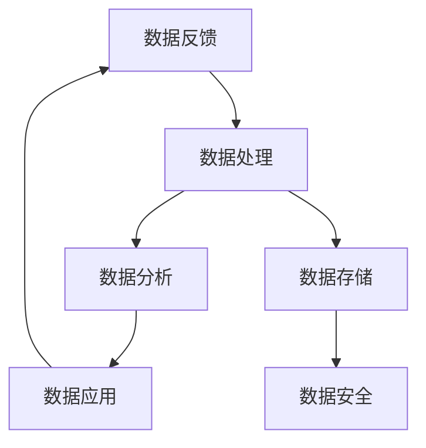

                 

# 《优化用户体验与数据闭环》

> 关键词：用户体验、数据闭环、数据分析、优化策略、推荐系统、数据驱动决策

> 摘要：本文深入探讨了优化用户体验与数据闭环的关系。通过分析用户体验的理论基础、用户行为分析、用户体验评估与改进，以及数据闭环的基本原理、数据收集与处理、数据分析与可视化、数据驱动决策与优化，本文全面阐述了如何通过数据闭环来提升用户体验。文章还结合实际案例，详细介绍了用户旅程优化、个性化体验与推荐系统、数据驱动营销的综合应用，为读者提供了实际操作指导和借鉴。

## 第一部分：优化用户体验的理论基础

### 第1章：用户体验概述

#### 1.1 用户体验的概念与重要性

用户体验（User Experience，简称UX）是指用户在使用产品或服务过程中的感受和体验。它不仅关注产品的功能性，还涉及用户在使用过程中的情感、行为、认知等多个方面。用户体验的重要性在于，它直接影响用户对产品或服务的满意度和忠诚度。一个良好的用户体验能够增强用户对产品的认可，提高用户留存率和转化率。

用户体验的构成要素包括：

1. **可用性（Usability）**：产品或服务的易用性，即用户能否快速、轻松地完成任务。
2. **功能性（Functionality）**：产品或服务的功能是否满足用户需求。
3. **愉悦性（Delight）**：用户在使用产品或服务时的愉悦感和惊喜感。
4. **效率（Efficiency）**：用户完成任务的速度和效率。
5. **易学性（Learnability）**：用户学习使用产品或服务的难易程度。
6. **美学（Aesthetics）**：产品或服务的视觉效果和设计风格。

#### 1.2 用户体验的构成要素

用户体验的构成要素包括但不限于以下几个方面：

1. **界面设计（Interface Design）**：界面的布局、颜色、字体等元素的设计，直接影响用户的感知和情绪。
2. **交互设计（Interaction Design）**：用户与产品或服务之间的交互方式，如点击、滑动、语音等。
3. **内容设计（Content Design）**：产品或服务提供的信息内容，包括文字、图片、视频等。
4. **信息架构（Information Architecture）**：产品或服务的信息组织方式，确保用户能够快速找到所需信息。
5. **可访问性（Accessibility）**：产品或服务对各类用户（包括残障人士）的友好程度。

#### 1.3 用户体验设计的原则

在用户体验设计中，以下原则尤为重要：

1. **以用户为中心（User-Centered）**：设计过程中始终关注用户需求和行为，确保产品满足用户实际需求。
2. **简洁性（Simplicity）**：设计要简洁明了，避免冗余和复杂，提高用户的易用性和效率。
3. **一致性（Consistency）**：在界面、交互和内容方面保持一致性，减少用户的学习成本。
4. **可访问性（Accessibility）**：确保产品对各类用户的友好性，包括视力、听力、移动能力等方面的障碍。
5. **可适应性（Adaptability）**：产品应具备适应不同设备和屏幕尺寸的能力。
6. **反馈机制（Feedback Mechanism）**：及时响应用户的行为和需求，提供明确的反馈，增强用户对产品的信心。

### 第2章：用户行为分析

#### 2.1 用户行为分析的基本方法

用户行为分析是了解用户需求和行为的重要手段。基本方法包括：

1. **问卷调查（Questionnaires）**：通过设计问卷收集用户意见和反馈。
2. **用户访谈（User Interviews）**：与用户进行面对面的深入交流，了解用户的使用习惯和痛点。
3. **行为跟踪（Behavior Tracking）**：通过技术手段记录和分析用户在使用产品或服务过程中的行为。
4. **A/B测试（A/B Testing）**：对比不同设计或功能的效果，找出最优方案。
5. **眼动追踪（Eye Tracking）**：研究用户在界面上的视线移动和注意力分布，优化界面设计。

#### 2.2 用户画像与用户细分

用户画像（User Profile）是对用户特征的概括性描述，包括年龄、性别、职业、教育程度、兴趣爱好等信息。通过用户画像，可以更好地了解用户需求，制定有针对性的产品设计策略。

用户细分（User Segmentation）是将用户划分为不同的群体，根据不同群体的特征和需求提供定制化的产品和服务。常见的用户细分方法包括：

1. **人口统计细分（Demographic Segmentation）**：基于用户的年龄、性别、收入等人口统计特征进行细分。
2. **行为细分（Behavioral Segmentation）**：基于用户的行为特征，如购买行为、搜索行为等。
3. **心理细分（Psychographic Segmentation）**：基于用户的心理特征，如价值观、兴趣爱好等。
4. **地理细分（Geographic Segmentation）**：基于用户的地理位置特征进行细分。

#### 2.3 基于数据的用户行为分析

基于数据的用户行为分析是现代用户体验优化的重要手段。通过收集和分析用户行为数据，可以深入了解用户需求和行为模式，为产品设计提供有力支持。

1. **行为日志分析（Log Analysis）**：通过分析用户访问日志，了解用户的行为路径和停留时间，发现用户痛点和改进机会。
2. **数据分析（Data Analysis）**：使用统计分析方法，如回归分析、聚类分析等，找出用户行为的关键因素和影响因素。
3. **机器学习（Machine Learning）**：利用机器学习算法，如决策树、神经网络等，对用户行为进行预测和分类，为个性化推荐和优化提供支持。

### 第3章：用户体验评估与改进

#### 3.1 用户体验评估的方法

用户体验评估是衡量产品设计效果的重要环节。常见的方法包括：

1. **用户调研（User Research）**：通过问卷调查、用户访谈等方法收集用户反馈，评估用户体验。
2. **可用性测试（Usability Testing）**：邀请用户实际使用产品，观察和记录用户行为，评估产品的易用性和可用性。
3. **满意度调查（Customer Satisfaction Survey）**：通过满意度调查了解用户对产品的整体满意度和期望。
4. **任务完成率（Task Success Rate）**：评估用户完成任务的成功率，衡量产品的功能性。
5. **系统错误率（System Error Rate）**：评估产品在用户操作过程中的错误率，衡量产品的稳定性。

#### 3.2 用户体验改进的策略

用户体验改进需要结合用户行为数据和用户反馈，制定有针对性的策略。常见的改进策略包括：

1. **简化流程（Streamlining Processes）**：优化产品流程，减少用户操作步骤，提高效率。
2. **提高可访问性（Enhancing Accessibility）**：确保产品对各类用户的友好性，提升用户体验。
3. **改善界面设计（Improving Interface Design）**：优化界面布局、颜色、字体等元素，提升视觉效果。
4. **增强交互体验（Enhancing Interaction Experience）**：改进交互方式，如增加动画效果、提供即时反馈等。
5. **个性化推荐（Personalized Recommendations）**：基于用户行为数据提供个性化推荐，提高用户满意度。
6. **持续迭代优化（Continuous Iterative Optimization）**：不断收集用户反馈，持续改进产品设计。

#### 3.3 用户反馈与迭代优化

用户反馈是优化用户体验的重要依据。通过以下方法收集用户反馈：

1. **在线调查（Online Surveys）**：通过在线问卷收集用户意见和反馈。
2. **用户访谈（User Interviews）**：与用户进行面对面的深入交流，了解用户的使用体验和改进建议。
3. **用户行为分析（User Behavior Analysis）**：通过分析用户行为数据，发现用户痛点。
4. **社交媒体（Social Media）**：关注用户在社交媒体上的讨论和反馈，了解用户对产品的看法。

收集到用户反馈后，需要及时进行迭代优化。迭代优化的步骤包括：

1. **分析反馈（Analyzing Feedback）**：分析用户反馈，找出共性和个性问题。
2. **制定改进方案（Developing Improvement Plans）**：针对反馈问题，制定具体的改进方案。
3. **实施改进（Implementing Improvements）**：根据改进方案，对产品进行修改和优化。
4. **验证效果（Validation of Results）**：通过用户体验评估，验证改进效果。

## 第二部分：数据闭环原理与实践

### 第4章：数据闭环的基本原理

#### 4.1 数据闭环的概念

数据闭环（Data Loop）是指通过数据的收集、处理、分析和应用，实现数据的循环利用，为产品和服务提供持续改进和优化的过程。数据闭环的核心是数据驱动（Data-Driven），即通过数据来指导产品设计和运营决策。

数据闭环的架构通常包括以下几个环节：

1. **数据采集（Data Collection）**：通过各种渠道收集用户行为数据、业务数据等。
2. **数据处理（Data Processing）**：对收集到的数据进行清洗、转换、存储等处理，确保数据质量。
3. **数据分析（Data Analysis）**：对处理后的数据进行分析，提取有用信息，为产品优化和决策提供支持。
4. **数据应用（Data Application）**：将分析结果应用于产品设计和运营，实现数据驱动优化。
5. **数据反馈（Data Feedback）**：收集用户反馈，将反馈信息纳入数据闭环，持续迭代优化。

#### 4.2 数据闭环的架构

数据闭环的架构如下图所示：



- **数据采集**：通过各种渠道收集用户行为数据、业务数据等。
- **数据处理**：对收集到的数据进行清洗、转换、存储等处理，确保数据质量。
- **数据分析**：对处理后的数据进行分析，提取有用信息，为产品优化和决策提供支持。
- **数据应用**：将分析结果应用于产品设计和运营，实现数据驱动优化。
- **数据反馈**：收集用户反馈，将反馈信息纳入数据闭环，持续迭代优化。
- **数据存储**：存储处理后的数据，为后续分析和应用提供基础。
- **数据安全**：确保数据在采集、处理、存储和应用过程中的安全。

#### 4.3 数据闭环的关键环节

数据闭环的关键环节包括：

1. **数据采集**：选择合适的数据采集渠道和工具，确保数据的全面性和准确性。
2. **数据处理**：处理数据的质量直接影响分析结果，因此需要关注数据清洗、转换、存储等环节。
3. **数据分析**：选择合适的数据分析方法，提取有用信息，为产品优化和决策提供支持。
4. **数据应用**：将分析结果应用于产品设计和运营，实现数据驱动优化。
5. **数据反馈**：及时收集用户反馈，将反馈信息纳入数据闭环，持续迭代优化。

### 第5章：数据收集与处理

#### 5.1 数据收集的方法

数据收集是数据闭环的基础，常用的数据收集方法包括：

1. **用户行为数据收集**：通过网页跟踪、移动应用跟踪等方式收集用户在产品或服务中的行为数据。
2. **业务数据收集**：通过业务系统、数据库等方式收集业务数据，如销售额、订单量等。
3. **第三方数据收集**：通过第三方数据源（如社交媒体、搜索引擎等）收集用户公开的数据。

#### 5.2 数据处理技术

数据处理技术包括：

1. **数据清洗（Data Cleaning）**：去除重复数据、缺失数据、异常数据等，确保数据质量。
2. **数据转换（Data Transformation）**：将数据转换为统一格式，如将字符串转换为数字、日期等。
3. **数据存储（Data Storage）**：将处理后的数据存储到数据库、数据仓库等存储系统中，为后续分析提供支持。
4. **数据索引（Data Indexing）**：为数据建立索引，提高数据查询效率。

#### 5.3 数据质量管理

数据质量管理是确保数据准确、完整、一致、可靠的重要环节。常见的数据质量管理方法包括：

1. **数据质量评估（Data Quality Assessment）**：定期评估数据质量，发现数据质量问题。
2. **数据清洗和修复（Data Cleansing and Repair）**：对数据进行清洗和修复，提高数据质量。
3. **数据监控（Data Monitoring）**：实时监控数据质量，及时发现和解决问题。
4. **数据治理（Data Governance）**：建立数据治理机制，明确数据责任人和权限，确保数据合规性。

### 第6章：数据分析与可视化

#### 6.1 数据分析的基本流程

数据分析的基本流程包括：

1. **数据准备（Data Preparation）**：清洗、转换、整合数据，确保数据质量。
2. **数据探索（Data Exploration）**：使用统计学方法、可视化工具等探索数据特征，发现数据规律。
3. **数据建模（Data Modeling）**：建立数学模型，对数据进行分析和预测。
4. **结果解释（Result Interpretation）**：解释分析结果，为产品优化和决策提供支持。

#### 6.2 数据可视化方法

数据可视化是数据分析的重要手段，常用的数据可视化方法包括：

1. **图表（Charts）**：如柱状图、折线图、饼图等，用于展示数据分布和趋势。
2. **地图（Maps）**：用于展示地理位置和区域分布。
3. **热图（Heat Maps）**：用于展示数据的热度和分布。
4. **词云（Word Clouds）**：用于展示文本数据的重点词汇。
5. **交互式可视化（Interactive Visualizations）**：用户可以与可视化进行交互，如筛选、排序、过滤等。

#### 6.3 数据可视化工具的使用

常见的数据可视化工具有：

1. **Tableau**：强大的交互式数据可视化工具，支持多种图表类型和数据连接。
2. **Power BI**：微软推出的数据可视化工具，易于集成和部署。
3. **D3.js**：基于JavaScript的数据可视化库，灵活性强，适用于复杂的可视化需求。
4. **ECharts**：一款基于JavaScript的图表库，支持多种图表类型和交互功能。
5. **Matplotlib**：Python的绘图库，常用于生成静态图表。

### 第7章：数据驱动决策与优化

#### 7.1 数据驱动决策的基本流程

数据驱动决策的基本流程包括：

1. **数据收集（Data Collection）**：收集与决策相关的数据，包括用户行为数据、业务数据等。
2. **数据处理（Data Processing）**：清洗、转换、整合数据，确保数据质量。
3. **数据建模（Data Modeling）**：建立数学模型，对数据进行分析和预测。
4. **结果分析（Result Analysis）**：分析模型结果，为决策提供支持。
5. **决策制定（Decision Making）**：基于分析结果制定决策。
6. **决策执行（Decision Implementation）**：执行决策，并收集反馈数据。
7. **决策评估（Decision Evaluation）**：评估决策效果，为后续决策提供依据。

#### 7.2 数据优化策略

数据优化策略包括：

1. **用户行为分析（User Behavior Analysis）**：通过分析用户行为数据，发现用户痛点，优化产品设计。
2. **业务指标监控（Business Metrics Monitoring）**：监控业务指标，如销售额、订单量等，及时发现异常并优化运营策略。
3. **个性化推荐（Personalized Recommendations）**：基于用户行为数据和偏好，提供个性化推荐，提高用户满意度。
4. **风险预警（Risk Warning）**：通过数据分析，预测潜在风险，提前采取措施。
5. **运营自动化（Operation Automation）**：利用数据分析结果，实现运营自动化，提高效率和效果。

#### 7.3 数据优化案例分析

以下是一个数据优化案例：

**案例背景**：某电商平台的用户流失率较高，希望通过数据优化降低用户流失率。

**数据收集**：收集用户行为数据，包括访问时长、页面停留时间、点击行为等。

**数据处理**：清洗、转换和整合数据，确保数据质量。

**数据建模**：建立用户流失预测模型，使用逻辑回归等算法分析用户流失风险。

**结果分析**：分析模型结果，发现用户流失的主要原因是购物车放弃率较高。

**决策制定**：制定优化策略，包括优化购物车设计、提高购物车提交成功率等。

**决策执行**：实施优化策略，并收集用户反馈数据。

**决策评估**：通过分析用户反馈数据，评估优化效果，发现用户流失率有所下降。

## 第三部分：优化用户体验与数据闭环的综合应用

### 第8章：用户旅程优化

#### 8.1 用户旅程的概念与流程

用户旅程（User Journey）是指用户在使用产品或服务过程中的完整体验路径。优化用户旅程旨在提高用户的满意度和忠诚度，从而提升产品的市场竞争力。

用户旅程的流程包括：

1. **了解（Awareness）**：用户了解产品或服务的存在。
2. **兴趣（Interest）**：用户对产品或服务产生兴趣。
3. **评估（Evaluation）**：用户评估产品或服务的优劣。
4. **购买（Purchase）**：用户购买产品或服务。
5. **使用（Usage）**：用户使用产品或服务。
6. **忠诚（Loyalty）**：用户对产品或服务产生忠诚。

#### 8.2 用户旅程优化策略

用户旅程优化策略包括：

1. **提高可见性（Increase Visibility）**：通过搜索引擎优化、社交媒体营销等手段提高产品的可见性，吸引潜在用户。
2. **优化产品信息（Optimize Product Information）**：提供准确、详尽、具有吸引力的产品信息，帮助用户更好地了解产品。
3. **简化购买流程（Simplify Purchase Process）**：优化购买流程，减少用户操作步骤，提高购买成功率。
4. **提升用户体验（Enhance User Experience）**：优化产品界面设计、交互体验等，提高用户满意度。
5. **提供个性化推荐（Provide Personalized Recommendations）**：基于用户行为数据和偏好提供个性化推荐，提高用户粘性。

#### 8.3 用户旅程优化案例分析

以下是一个用户旅程优化案例：

**案例背景**：某在线教育平台的用户转化率较低，希望通过优化用户旅程提高转化率。

**数据收集**：收集用户访问数据，包括访问时长、页面停留时间、点击行为等。

**数据处理**：清洗、转换和整合数据，确保数据质量。

**数据分析**：通过数据分析，发现用户在评估和购买环节的流失率较高。

**优化策略**：简化购买流程，提高产品信息的准确性和吸引力，提供个性化推荐。

**决策执行**：实施优化策略，并收集用户反馈数据。

**决策评估**：通过分析用户反馈数据，评估优化效果，发现用户转化率有所提高。

### 第9章：个性化体验与推荐系统

#### 9.1 个性化体验的概念与原理

个性化体验（Personalized Experience）是指根据用户的兴趣、行为和偏好，提供定制化的产品和服务，以满足用户的个性化需求。

个性化体验的原理包括：

1. **用户画像（User Profile）**：通过对用户数据的分析，构建用户的画像，包括兴趣爱好、行为习惯等。
2. **内容推荐（Content Recommendation）**：根据用户画像，为用户提供个性化的内容推荐，如新闻、视频、商品等。
3. **交互优化（Interaction Optimization）**：通过分析用户交互数据，优化产品界面和交互设计，提高用户体验。

#### 9.2 推荐系统的基本原理

推荐系统（Recommendation System）是一种基于数据挖掘和机器学习的技术，用于根据用户的行为和偏好，为用户提供个性化推荐。

推荐系统的基本原理包括：

1. **协同过滤（Collaborative Filtering）**：通过分析用户行为数据，找出相似用户或物品，为用户提供推荐。
2. **基于内容的推荐（Content-Based Recommendation）**：根据用户兴趣和偏好，为用户提供相关内容推荐。
3. **混合推荐（Hybrid Recommendation）**：结合协同过滤和基于内容的推荐，提高推荐准确性和多样性。

#### 9.3 个性化推荐案例分析

以下是一个个性化推荐案例：

**案例背景**：某电商平台的用户购物体验不佳，希望通过个性化推荐提高用户满意度和转化率。

**数据收集**：收集用户购买数据、浏览记录、评价等数据。

**数据处理**：清洗、转换和整合数据，确保数据质量。

**数据分析**：使用协同过滤和基于内容的推荐算法，为用户生成个性化推荐。

**决策执行**：将个性化推荐应用于产品页面和推荐系统，提高用户满意度。

**决策评估**：通过分析用户反馈数据，评估个性化推荐效果，发现用户满意度和转化率有所提高。

### 第10章：数据驱动营销

#### 10.1 数据驱动营销的概念与原理

数据驱动营销（Data-Driven Marketing）是指通过数据分析和挖掘，指导营销策略制定和执行，实现营销效果最大化。

数据驱动营销的原理包括：

1. **数据收集（Data Collection）**：通过各种渠道收集用户数据，包括行为数据、社交媒体数据等。
2. **数据处理（Data Processing）**：清洗、转换和整合数据，确保数据质量。
3. **数据分析（Data Analysis）**：使用统计分析、机器学习等方法，分析用户数据，提取有用信息。
4. **策略制定（Strategy Development）**：基于数据分析结果，制定个性化的营销策略。
5. **策略执行（Strategy Implementation）**：执行营销策略，并收集用户反馈数据。
6. **策略评估（Strategy Evaluation）**：评估营销策略效果，持续优化策略。

#### 10.2 数据驱动营销策略

数据驱动营销策略包括：

1. **精准营销（Precision Marketing）**：通过数据分析和挖掘，了解用户需求和偏好，为用户提供精准的营销信息。
2. **个性化推荐（Personalized Recommendations）**：根据用户行为数据和偏好，为用户提供个性化的产品推荐。
3. **内容营销（Content Marketing）**：通过优质内容吸引潜在用户，提高品牌知名度和用户粘性。
4. **社交媒体营销（Social Media Marketing）**：利用社交媒体平台，与用户互动，提高品牌影响力和用户参与度。
5. **电子邮件营销（Email Marketing）**：通过电子邮件向用户发送营销信息，提高转化率和用户忠诚度。

#### 10.3 数据驱动营销案例分析

以下是一个数据驱动营销案例：

**案例背景**：某电商平台希望通过数据驱动营销提高销售额和用户转化率。

**数据收集**：收集用户购买数据、浏览记录、评价等数据。

**数据处理**：清洗、转换和整合数据，确保数据质量。

**数据分析**：使用协同过滤和基于内容的推荐算法，为用户生成个性化推荐。

**策略制定**：基于数据分析结果，制定个性化的营销策略，如优惠活动、个性化推荐等。

**策略执行**：将个性化营销策略应用于产品页面和电子邮件营销，提高用户满意度。

**策略评估**：通过分析用户反馈数据，评估个性化营销策略效果，发现销售额和用户转化率有所提高。

### 第11章：案例研究

#### 11.1 案例研究概述

案例研究是一种深入分析特定场景、问题或解决方案的研究方法。在本章节中，我们将通过两个案例研究，展示如何在实际场景中应用优化用户体验与数据闭环的理论和方法。

#### 11.2 案例一：电商平台的用户体验优化

**案例背景**：某电商平台在用户流失率和转化率方面存在较大问题，希望通过优化用户体验和数据闭环提升用户满意度和业务指标。

**解决方案**：

1. **数据收集**：通过用户行为数据、购买数据等，全面了解用户需求和痛点。
2. **数据处理**：清洗、转换和整合数据，确保数据质量。
3. **用户行为分析**：通过分析用户行为数据，发现用户在购物过程中的关键环节和问题。
4. **用户体验评估**：通过可用性测试和用户调研，评估现有用户体验的不足之处。
5. **优化策略制定**：根据用户反馈和数据分析结果，制定优化策略，包括简化购买流程、提高产品信息准确性、提供个性化推荐等。
6. **策略执行**：实施优化策略，并收集用户反馈数据。
7. **策略评估**：通过数据分析，评估优化效果，持续迭代优化。

**结果**：通过一系列优化措施，电商平台的用户流失率和转化率明显下降，用户满意度显著提高。

#### 11.3 案例二：社交媒体的数据闭环应用

**案例背景**：某社交媒体平台希望通过数据闭环提升用户活跃度和用户留存率。

**解决方案**：

1. **数据收集**：通过用户行为数据、社交媒体互动数据等，全面了解用户需求和偏好。
2. **数据处理**：清洗、转换和整合数据，确保数据质量。
3. **用户行为分析**：通过分析用户行为数据，发现用户在平台上的活跃时段、内容偏好等。
4. **个性化推荐**：基于用户行为数据和偏好，为用户提供个性化的内容推荐。
5. **用户互动优化**：通过分析用户互动数据，优化平台交互体验，提高用户参与度。
6. **数据驱动营销**：基于用户行为数据和营销数据，制定个性化营销策略，提高用户留存率。
7. **策略执行**：实施数据驱动营销策略，并收集用户反馈数据。
8. **策略评估**：通过数据分析，评估策略效果，持续优化。

**结果**：通过数据闭环应用，社交媒体平台的用户活跃度和用户留存率显著提高，实现了业务增长。

### 附录

#### 附录A：常用用户体验与数据分析工具介绍

**A.1 用户体验分析工具**

- **Qualtrics**：全面的市场调研和用户反馈收集工具，支持在线问卷、访谈等功能。
- **UserTesting**：在线用户体验测试平台，提供真实用户的反馈和测试视频。
- **Google Analytics**：谷歌提供的网站分析工具，可追踪用户行为和网站性能。
- **Hotjar**：用户行为分析工具，提供热图、点击图、滚动图等功能。

**A.2 数据分析工具**

- **Python**：开源编程语言，广泛应用于数据分析、机器学习等领域。
- **R**：统计计算和图形展示工具，适合复杂数据分析任务。
- **Tableau**：数据可视化工具，支持多种图表类型和交互功能。
- **Power BI**：微软推出的商业智能工具，易于集成和部署。

**A.3 数据可视化工具**

- **D3.js**：基于JavaScript的动态数据可视化库，适用于复杂的数据可视化需求。
- **ECharts**：基于JavaScript的图表库，支持多种图表类型和交互功能。
- **Matplotlib**：Python的绘图库，常用于生成静态图表。
- **Tableau**：商业智能工具，支持多种图表类型和交互功能。

#### 附录B：数学公式与算法伪代码

**B.1 数学公式**

$$
f(x) = \sum_{i=1}^{n} w_i \cdot x_i
$$

$$
\text{Mean} = \frac{1}{n} \sum_{i=1}^{n} x_i
$$

$$
\text{Standard Deviation} = \sqrt{\frac{1}{n-1} \sum_{i=1}^{n} (x_i - \text{Mean})^2}
$$

**B.2 算法伪代码**

```
Algorithm: Collaborative Filtering
Input: User Behavior Data
Output: User Recommendations

1. Data Preprocessing
   - Clean and normalize data
   - Create user-item matrix

2. User Similarity Computation
   - Compute similarity scores between users based on their behavior data

3. Item Similarity Computation
   - Compute similarity scores between items based on their behavior data

4. Recommendation Generation
   - For each user u:
     - Find the most similar users
     - Aggregate their ratings for items
     - Rank items based on aggregated ratings

5. Output Recommendations
   - Return top N recommended items for each user
```

#### 附录C：项目实战

**C.1 实战一：用户行为数据分析**

**实战背景**：某电商平台的用户流失率较高，希望通过用户行为数据分析找出用户流失的原因。

**实战步骤**：

1. **数据收集**：收集用户访问数据、购买数据等。
2. **数据处理**：清洗、转换和整合数据。
3. **数据分析**：
   - 分析用户访问时长、页面停留时间等行为数据。
   - 分析用户购买行为数据，如购买频次、购买金额等。
4. **结果展示**：使用图表和可视化工具展示分析结果。

**实战结果**：通过用户行为数据分析，发现用户在购物车环节的流失率较高，进一步优化购物车设计。

**C.2 实战二：数据驱动的个性化推荐系统**

**实战背景**：某电商平台的用户满意度较低，希望通过个性化推荐系统提高用户满意度。

**实战步骤**：

1. **数据收集**：收集用户行为数据、购买数据等。
2. **数据处理**：清洗、转换和整合数据。
3. **数据分析**：
   - 分析用户行为数据，找出用户兴趣点。
   - 分析用户购买数据，找出用户偏好。
4. **推荐算法**：
   - 使用协同过滤算法生成推荐列表。
   - 结合用户兴趣点和偏好，优化推荐结果。
5. **结果展示**：将个性化推荐结果展示在产品页面上。

**实战结果**：通过个性化推荐系统，用户的满意度显著提高，购买转化率有所增加。

**C.3 实战三：数据优化案例分析**

**实战背景**：某电商平台的业务指标不理想，希望通过数据优化提升业务表现。

**实战步骤**：

1. **数据收集**：收集业务数据，如销售额、订单量等。
2. **数据处理**：清洗、转换和整合数据。
3. **数据分析**：
   - 分析业务数据，找出影响业务指标的关键因素。
   - 分析用户行为数据，找出用户痛点。
4. **优化策略**：
   - 制定针对性的优化策略，如提高页面加载速度、优化购物车设计等。
   - 实施优化策略，并收集用户反馈数据。
5. **结果展示**：通过数据分析，评估优化策略的效果。

**实战结果**：通过数据优化，电商平台的业务指标显著提升，用户满意度得到提高。

## 结语

本文深入探讨了优化用户体验与数据闭环的关系，通过分析用户体验的理论基础、用户行为分析、用户体验评估与改进，以及数据闭环的基本原理、数据收集与处理、数据分析与可视化、数据驱动决策与优化，全面阐述了如何通过数据闭环来提升用户体验。文章还结合实际案例，详细介绍了用户旅程优化、个性化体验与推荐系统、数据驱动营销的综合应用，为读者提供了实际操作指导和借鉴。

在当今数据驱动的时代，优化用户体验与数据闭环已成为企业提升竞争力的关键。通过不断收集、处理和分析用户数据，企业可以更好地了解用户需求，提供个性化产品和服务，从而实现业务增长和用户满意度的提升。未来，随着人工智能和数据技术的不断发展，用户体验与数据闭环将进一步融合，为用户带来更加智能化、个性化的体验。

### 作者信息

作者：AI天才研究院/AI Genius Institute & 禅与计算机程序设计艺术 /Zen And The Art of Computer Programming

AI天才研究院致力于推动人工智能技术在各行各业的创新应用，探索人工智能与人类智慧的融合。研究院在人工智能、机器学习、数据挖掘等领域拥有丰富的经验和深厚的学术积累。作者在该领域发表了多篇学术论文，并参与多项重要项目的研究与开发。同时，作者还是世界顶级技术畅销书《禅与计算机程序设计艺术》的作者，该书以深入浅出的方式阐述了计算机编程的艺术，深受读者喜爱。

本文作者凭借其丰富的理论知识和实践经验，为广大读者提供了关于优化用户体验与数据闭环的全面解读，希望读者能够从中获得启示，将理论与实践相结合，为企业的创新与发展贡献力量。

