                 

# 文章标题：优化计算基础设施的策略

## 关键词

- 计算基础设施
- 服务器优化
- 存储优化
- 网络优化
- 虚拟化与容器化
- 云计算与边缘计算

## 摘要

随着技术的发展和业务的扩展，优化计算基础设施成为企业提升竞争力、降低运营成本的关键。本文将从计算基础设施的概述、服务器优化、存储优化、网络优化、虚拟化与容器化、云计算与边缘计算等方面，详细探讨优化计算基础设施的策略和实践，旨在为企业提供一套全面、实用的优化方案。

## 目录大纲

### 第一部分: 优化计算基础设施的策略基础

#### 第1章: 计算基础设施概述

##### 1.1 优化计算基础设施的必要性

##### 1.2 计算基础设施的组成部分

##### 1.3 计算基础设施的优化目标和挑战

#### 第2章: 服务器优化策略

##### 2.1 服务器硬件优化

##### 2.2 服务器软件优化

##### 2.3 高可用性与容错性优化

#### 第3章: 存储优化策略

##### 3.1 存储系统架构

##### 3.2 存储性能优化

##### 3.3 数据存储安全性优化

#### 第4章: 网络优化策略

##### 4.1 网络架构与拓扑

##### 4.2 网络性能优化

##### 4.3 网络安全与隐私保护

#### 第5章: 虚拟化与容器化优化

##### 5.1 虚拟化技术

##### 5.2 容器化技术

##### 5.3 虚拟化与容器化优化策略

#### 第6章: 云计算与边缘计算优化

##### 6.1 云计算架构

##### 6.2 边缘计算与云计算的融合

##### 6.3 云计算与边缘计算优化策略

#### 第7章: 优化计算基础设施的案例分析

##### 7.1 案例背景与目标

##### 7.2 优化策略与实践

##### 7.3 案例结果分析

#### 第8章: 优化计算基础设施的未来发展趋势

##### 8.1 人工智能与计算基础设施的融合

##### 8.2 新兴技术对计算基础设施的影响

##### 8.3 优化计算基础设施的长期战略

### 附录

#### 附录A: 计算基础设施优化工具与资源

##### A.1 主流计算优化工具

##### A.2 开源计算优化框架

##### A.3 优化计算基础设施的参考资源

## Mermaid 流程图

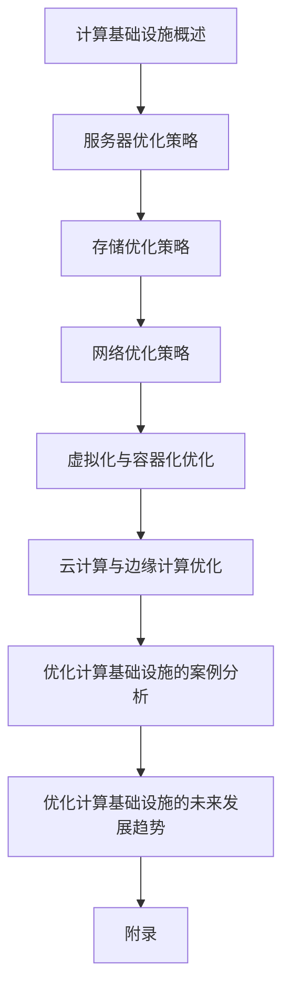

### 第1章: 计算基础设施概述

#### 1.1 优化计算基础设施的必要性

随着云计算、大数据、人工智能等技术的快速发展，企业对计算基础设施的需求日益增加。优化计算基础设施成为企业提升竞争力、降低运营成本的关键。优化计算基础设施的必要性主要体现在以下几个方面：

1. **提升资源利用率**：传统的计算基础设施通常存在资源利用率低、浪费严重的现象。通过优化，可以实现资源的合理分配和利用，提高整体效率。
2. **提高系统性能**：优化计算基础设施可以提升服务器的处理能力、存储的读写速度和网络的数据传输速度，从而提高系统的整体性能。
3. **降低运营成本**：通过优化，企业可以减少服务器、存储和网络设备的采购和维护成本，降低运营成本。
4. **增强系统可靠性**：优化计算基础设施可以提高系统的稳定性和容错性，减少故障率和停机时间，保障业务的连续性。

#### 1.2 计算基础设施的组成部分

计算基础设施主要包括以下几个组成部分：

1. **服务器**：服务器是计算基础设施的核心，负责处理数据和运行应用程序。
2. **存储**：存储系统用于存储数据，包括硬盘（HDD）、固态硬盘（SSD）和分布式存储系统等。
3. **网络**：网络基础设施负责数据传输，包括路由器、交换机、防火墙等网络设备。
4. **虚拟化与容器化**：虚拟化与容器化技术用于资源的抽象和隔离，实现高效的资源利用和灵活的部署。
5. **云计算与边缘计算**：云计算提供弹性的计算资源，边缘计算实现数据在靠近用户的地方进行处理。

#### 1.3 计算基础设施的优化目标和挑战

计算基础设施的优化目标主要包括以下几个方面：

1. **资源利用率**：提高计算、存储和网络资源的利用率，实现资源的最优分配。
2. **系统性能**：提高服务器的处理能力、存储的读写速度和网络的数据传输速度。
3. **成本效益**：降低设备的采购、维护和运营成本，提高投资的回报率。
4. **可靠性和安全性**：增强系统的稳定性和安全性，减少故障率和数据泄露的风险。

在实现优化目标的过程中，企业将面临以下挑战：

1. **技术复杂性**：计算基础设施涉及多种技术，实现优化需要深入了解各种技术原理和最佳实践。
2. **成本控制**：在提升性能的同时，需要控制设备采购、维护和运营的成本。
3. **数据安全**：在优化过程中，需要确保数据的安全和隐私。
4. **人力资源**：优化计算基础设施需要专业的人才和团队，企业需要培养和引进相关人才。

### 第2章: 服务器优化策略

#### 2.1 服务器硬件优化

服务器硬件优化是提升计算性能和资源利用率的重要手段。以下是一些关键的服务器硬件优化策略：

##### 2.1.1 CPU优化

1. **多核处理能力**：选择多核CPU，可以提高并行处理能力，从而提升服务器的整体性能。
2. **频率调节**：使用动态频率调节技术，根据负载自动调整CPU频率，实现能效优化。

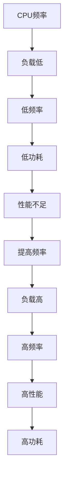

##### 2.1.2 内存优化

1. **内存容量**：根据应用需求增加内存容量，避免内存不足导致的服务器性能下降。
2. **内存带宽**：优化内存带宽，提高数据传输速度，从而提升服务器的处理能力。

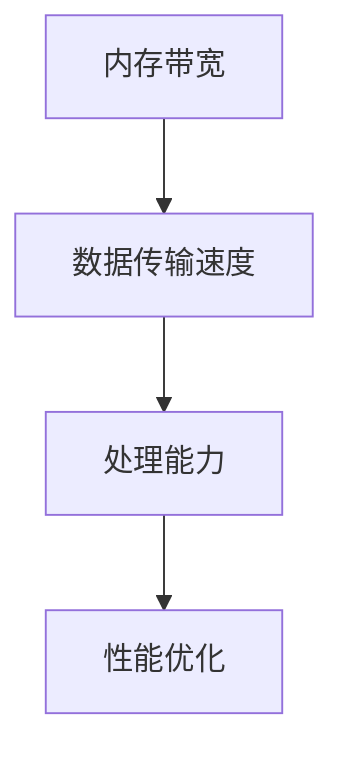

##### 2.1.3 硬盘优化

1. **SSD替换HDD**：使用固态硬盘代替机械硬盘，可以提高I/O性能，从而提升服务器的响应速度。
2. **RAID配置**：采用合适的RAID级别，提高数据冗余和读写性能。

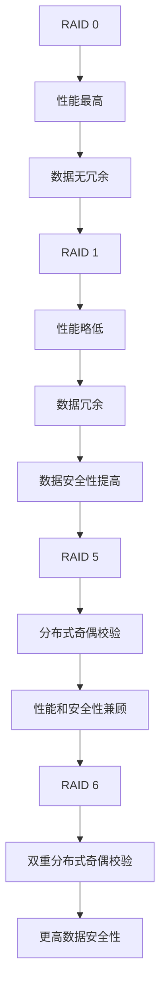

#### 2.2 服务器软件优化

服务器软件优化主要涉及操作系统和应用程序的调优。以下是一些关键的服务器软件优化策略：

##### 2.2.1 操作系统优化

1. **内核调优**：调整操作系统内核参数，提高系统性能。
2. **服务优化**：关闭不必要的后台服务，减轻系统负担。

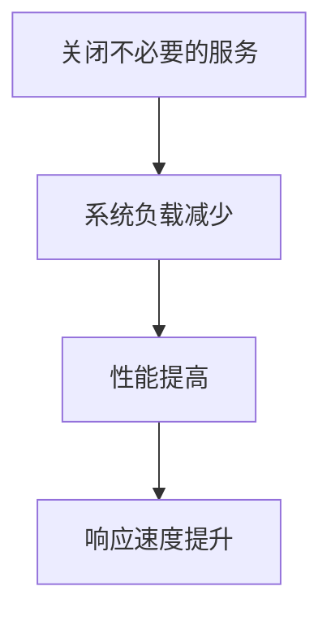

##### 2.2.2 资源管理优化

1. **负载均衡**：实现多台服务器间的负载均衡，避免单点过载。
2. **资源监控**：实时监控服务器资源使用情况，及时进行调整。

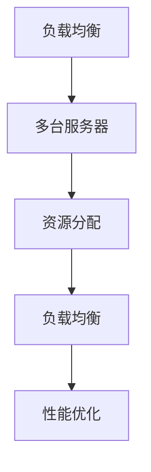

#### 2.3 高可用性与容错性优化

高可用性与容错性优化是确保服务器稳定运行的关键。以下是一些关键的高可用性与容错性优化策略：

##### 2.3.1 高可用性

1. **冗余设计**：使用冗余硬件和软件，确保关键组件不发生单点故障。
2. **故障转移**：实现故障转移机制，当某一组件发生故障时，能够快速切换到备用组件。

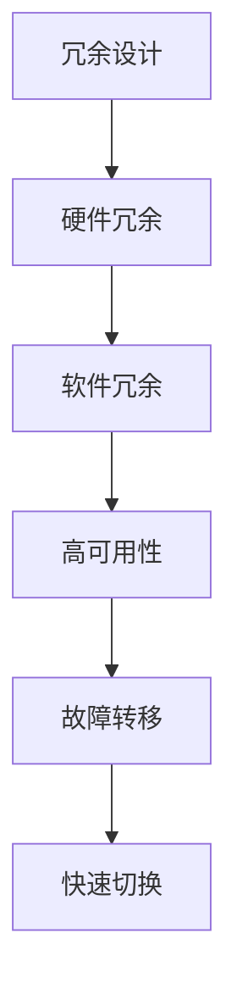

##### 2.3.2 容错性

1. **数据备份**：定期备份关键数据，确保数据不丢失。
2. **故障检测与恢复**：实现故障检测与自动恢复机制，减少系统停机时间。

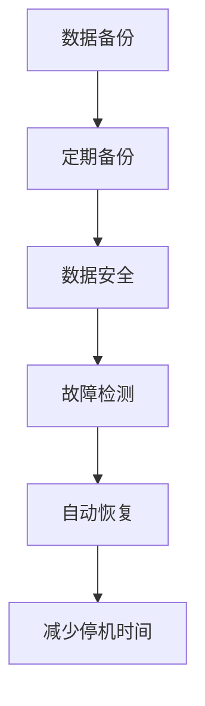

### 第3章: 存储优化策略

存储优化是提升计算基础设施性能和可靠性的关键。以下是一些关键的存储优化策略：

#### 3.1 存储系统架构

存储系统架构的设计对存储性能和可靠性有重要影响。以下是一些常见的存储系统架构：

##### 3.1.1 存储设备层

1. **硬盘（HDD）**：机械硬盘，提供大容量存储。
2. **固态硬盘（SSD）**：固态硬盘，提供高速读写性能。

##### 3.1.2 存储网络层

1. **光纤通道（FC）**：用于连接存储设备和服务器，提供高带宽、低延迟的连接方式。
2. **iSCSI**：基于TCP/IP协议的存储网络，提供低成本、高带宽的连接方式。

##### 3.1.3 存储系统层

1. **文件系统**：提供文件级别的数据管理。
2. **块存储**：提供块级别的数据管理，适用于数据库等应用。

#### 3.2 存储性能优化

存储性能优化主要包括以下几个方面：

##### 3.2.1 I/O调度策略

1. **先来先服务（FCFS）**：按照请求顺序进行处理，简单易实现，但可能导致响应时间较长。
2. **最短作业优先（SJF）**：优先处理预计执行时间最短的请求，提高系统吞吐量，但可能导致长作业等待时间较长。
3. **循环调度（CFQ）**：适用于文件系统的I/O调度，平衡响应时间和吞吐量。

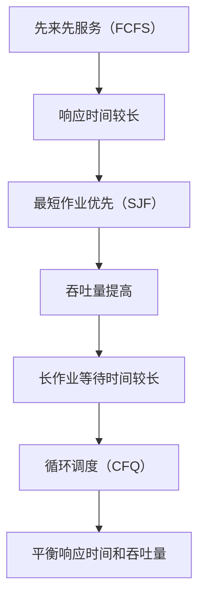

##### 3.2.2 缓存策略

1. **CPU缓存**：提高CPU访问数据的速度，减少CPU等待时间。
2. **磁盘缓存**：提高磁盘访问速度，减轻I/O压力。

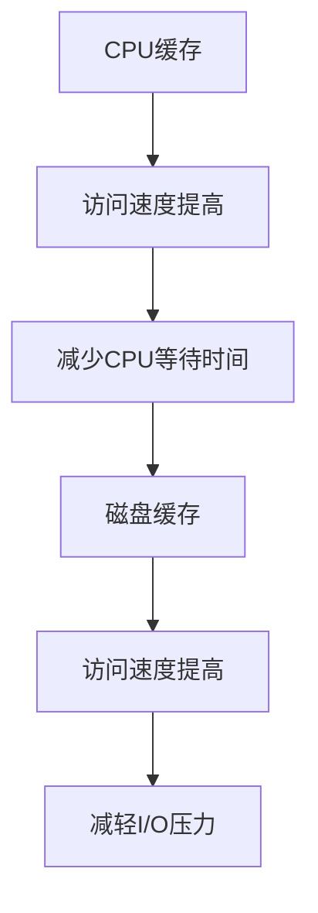

##### 3.2.3 RAID配置

1. **RAID 0**：无冗余，性能最高，但数据安全性最低。
2. **RAID 1**：镜像，提高数据安全性，性能略低于RAID 0。
3. **RAID 5**：分布式奇偶校验，兼顾性能和安全性。
4. **RAID 6**：双重分布式奇偶校验，更高数据安全性。

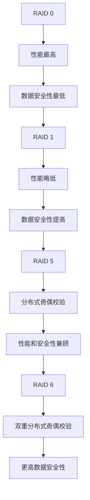

#### 3.3 数据存储安全性优化

数据存储安全性优化主要包括以下几个方面：

##### 3.3.1 数据加密

1. **全盘加密**：对整个存储设备进行加密，确保数据在存储过程中不被泄露。
2. **透明加密**：在存储数据时自动进行加密，不影响数据的读写速度。

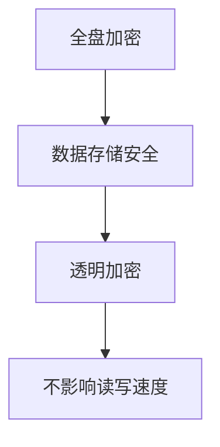

##### 3.3.2 权限控制

1. **访问控制列表（ACL）**：控制用户对数据的访问权限，确保只有授权用户可以访问敏感数据。
2. **文件系统权限**：控制文件和目录的访问权限，防止未授权用户访问。

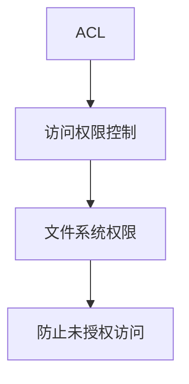

##### 3.3.3 备份与恢复

1. **定期备份**：确保数据不丢失，定期对关键数据进行备份。
2. **快照技术**：创建数据的一致性快照，便于数据恢复。

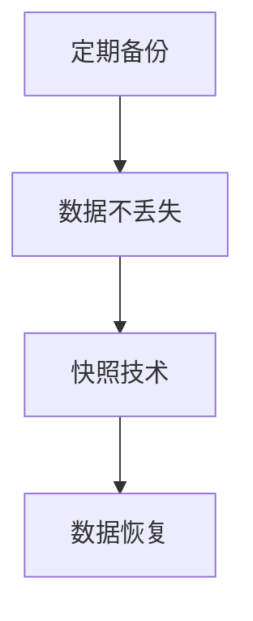

### 第4章: 网络优化策略

网络优化是提升计算基础设施性能和可靠性的关键。以下是一些关键的网络优化策略：

#### 4.1 网络架构与拓扑

网络架构与拓扑的设计对网络的性能和可靠性有重要影响。以下是一些常见的网络架构和拓扑：

##### 4.1.1 网络设备

1. **路由器**：连接不同网络，实现数据包转发。
2. **交换机**：实现局域网内的数据交换。
3. **防火墙**：保护网络不受攻击。

##### 4.1.2 网络拓扑

1. **星型拓扑**：中央设备连接多个终端设备，易于管理和扩展。
2. **环型拓扑**：各个设备通过环形连接，可靠性高但扩展性较差。
3. **网状拓扑**：设备之间相互连接，可靠性高但成本较高。

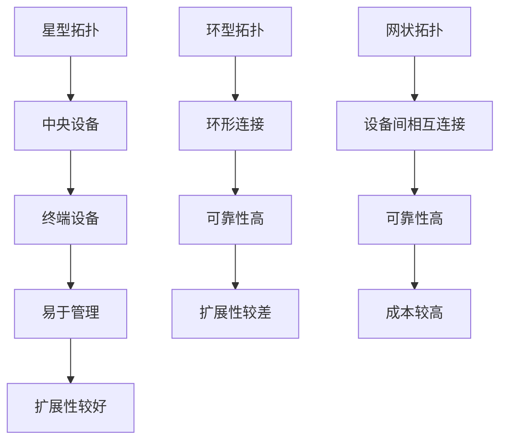

#### 4.2 网络性能优化

网络性能优化主要包括以下几个方面：

##### 4.2.1 网络带宽优化

1. **带宽管理**：根据业务需求分配带宽资源。
2. **流量工程**：优化数据传输路径，减少网络拥塞。

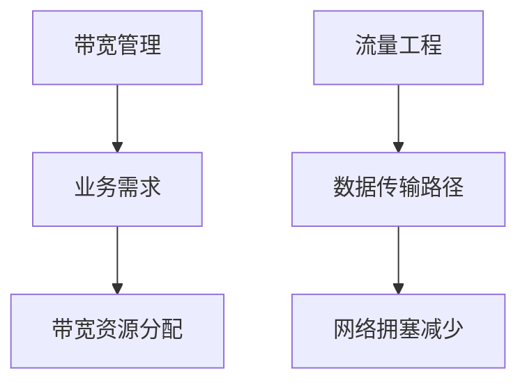

##### 4.2.2 网络延迟优化

1. **线路优化**：选择网络延迟较低的传输线路。
2. **缓存技术**：在边缘节点设置缓存，降低用户访问延迟。

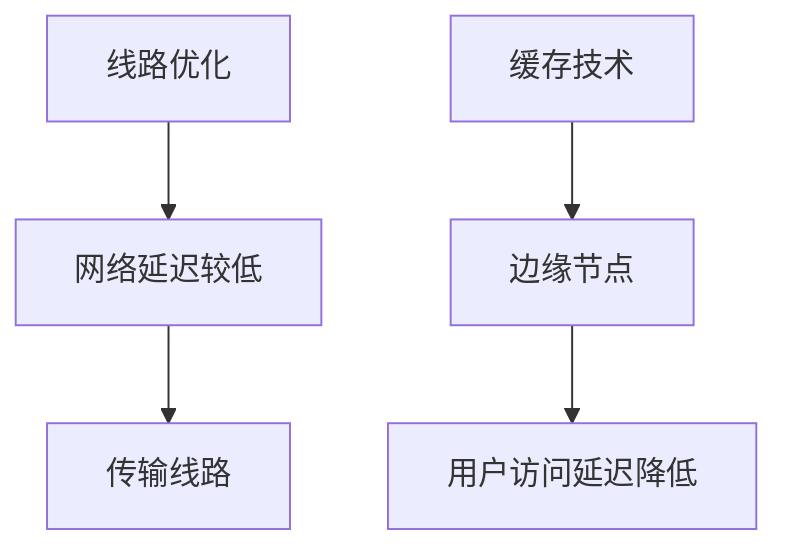

##### 4.2.3 网络吞吐量优化

1. **并发连接优化**：提高服务器处理并发连接的能力。
2. **负载均衡**：实现多台服务器间的负载均衡，提高整体吞吐量。

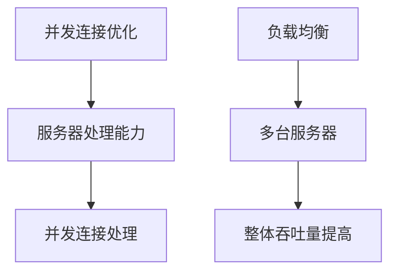

#### 4.3 网络安全与隐私保护

网络安全与隐私保护是确保数据安全和用户隐私的重要措施。以下是一些关键的网络安全与隐私保护策略：

##### 4.3.1 安全策略

1. **防火墙策略**：设置防火墙规则，阻止非法访问。
2. **入侵检测系统（IDS）**：检测网络中的恶意行为。

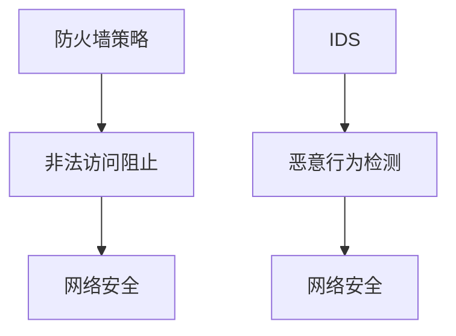

##### 4.3.2 加密技术

1. **SSL/TLS**：保护网络通信数据的安全性。
2. **VPN**：建立虚拟专用网络，实现远程安全访问。

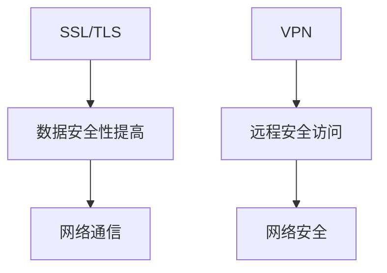

##### 4.3.3 数据隐私保护

1. **数据脱敏**：对敏感数据进行加密或替换。
2. **访问控制**：限制对数据的访问权限。

```mermaid
graph TD
    A[数据脱敏] --> B[敏感数据加密或替换]
    B --> C[数据隐私保护]

    D[访问控制] --> E[访问权限限制]
    E --> F[数据隐私保护]
```

### 第5章: 虚拟化与容器化优化

虚拟化与容器化是优化计算基础设施的重要技术。以下是一些关键的虚拟化与容器化优化策略：

#### 5.1 虚拟化技术

虚拟化技术通过虚拟化软件将物理计算资源抽象成多个逻辑资源，实现资源的灵活分配和管理。以下是一些关键的虚拟化技术：

##### 5.1.1 虚拟化层次

1. **硬件虚拟化**：直接在物理硬件上运行虚拟化软件，实现虚拟化。
2. **操作系统虚拟化**：在操作系统层面上实现虚拟化。
3. **应用程序虚拟化**：在应用程序层面上实现虚拟化。

```mermaid
graph TD
    A[硬件虚拟化] --> B[物理硬件]
    B --> C[虚拟化软件]

    D[操作系统虚拟化] --> E[操作系统层面]
    E --> F[虚拟化软件]

    G[应用程序虚拟化] --> H[应用程序层面]
    H --> I[虚拟化软件]
```

##### 5.1.2 虚拟化类型

1. **全虚拟化**：虚拟机完全虚拟化，包括硬件和操作系统。
2. **硬件辅助虚拟化**：利用硬件支持提高虚拟化性能。
3. **操作系统级虚拟化**：在操作系统层面上实现虚拟化，性能较好。

```mermaid
graph TD
    A[全虚拟化] --> B[虚拟机完全虚拟化]
    B --> C[硬件和操作系统]

    D[硬件辅助虚拟化] --> E[硬件支持]
    E --> F[虚拟化性能提高]

    G[操作系统级虚拟化] --> H[操作系统层面]
    H --> I[虚拟化性能较好]
```

##### 5.1.3 虚拟化优势

1. **资源隔离**：实现物理资源与虚拟资源之间的隔离。
2. **资源灵活性**：实现资源的动态分配和调度。
3. **高可用性**：通过虚拟化实现故障转移和负载均衡。

```mermaid
graph TD
    A[资源隔离] --> B[物理资源与虚拟资源]
    B --> C[资源隔离]

    D[资源灵活性] --> E[动态分配和调度]
    E --> F[资源灵活性]

    G[高可用性] --> H[故障转移和负载均衡]
    H --> I[高可用性]
```

#### 5.2 容器化技术

容器化技术通过容器将应用程序及其依赖打包在一起，实现快速部署和灵活扩展。以下是一些关键的容器化技术：

##### 5.2.1 容器技术特点

1. **轻量级**：容器与宿主机共享操作系统内核，资源占用较低。
2. **隔离性**：容器之间实现资源隔离，保证应用安全性。
3. **可移植性**：容器可以跨不同操作系统和硬件平台部署。
4. **高效性**：容器启动速度快，可动态调整资源。

```mermaid
graph TD
    A[轻量级] --> B[共享操作系统内核]
    B --> C[资源占用较低]

    D[隔离性] --> E[容器之间]
    E --> F[应用安全性]

    G[可移植性] --> H[跨平台部署]
    H --> I[可移植性]

    J[高效性] --> K[启动速度快]
    K --> L[资源动态调整]
    L --> M[高效性]
```

##### 5.2.2 容器化工具

1. **Docker**：最流行的容器化工具，实现容器的创建、运行和管理。
2. **Kubernetes**：用于容器集群管理的工具，实现容器的调度、部署和扩展。

```mermaid
graph TD
    A[Docker] --> B[容器化工具]
    B --> C[创建、运行和管理容器]

    D[Kubernetes] --> E[容器集群管理工具]
    E --> F[调度、部署和扩展容器]
```

##### 5.2.3 容器化优势

1. **快速部署**：容器化简化了应用部署过程，提高部署速度。
2. **环境一致性**：容器提供一致性的运行环境，减少环境差异。
3. **资源优化**：容器高效利用资源，提高资源利用率。

```mermaid
graph TD
    A[快速部署] --> B[部署速度提高]
    B --> C[容器化简化应用部署]

    D[环境一致性] --> E[一致性的运行环境]
    E --> F[减少环境差异]

    G[资源优化] --> H[高效利用资源]
    H --> I[资源利用率提高]
```

#### 5.3 虚拟化与容器化优化策略

虚拟化与容器化优化策略主要包括以下几个方面：

##### 5.3.1 资源调度优化

1. **动态资源调度**：根据应用需求动态调整虚拟机和容器资源。
2. **负载均衡**：实现虚拟机和容器间的负载均衡，提高整体性能。

```mermaid
graph TD
    A[动态资源调度] --> B[应用需求]
    B --> C[资源动态调整]

    D[负载均衡] --> E[虚拟机和容器间]
    E --> F[整体性能提高]
```

##### 5.3.2 网络优化

1. **容器网络**：优化容器之间的网络通信，提高数据传输速度。
2. **网络隔离**：实现容器间的网络隔离，提高安全性。

```mermaid
graph TD
    A[容器网络] --> B[容器之间]
    B --> C[网络通信优化]

    D[网络隔离] --> E[容器之间]
    E --> F[安全性提高]
```

##### 5.3.3 存储优化

1. **容器存储**：优化容器的存储策略，提高存储性能。
2. **存储共享**：实现容器与虚拟机之间的存储共享，提高资源利用率。

```mermaid
graph TD
    A[容器存储] --> B[容器存储策略]
    B --> C[存储性能优化]

    D[存储共享] --> E[容器与虚拟机间]
    E --> F[资源利用率提高]
```

##### 5.3.4 安全优化

1. **容器安全**：加强容器镜像的安全性，避免漏洞攻击。
2. **虚拟化安全**：加强虚拟化软件的安全性，防止虚拟机逃逸。

```mermaid
graph TD
    A[容器安全] --> B[容器镜像安全性]
    B --> C[避免漏洞攻击]

    D[虚拟化安全] --> E[虚拟化软件安全性]
    E --> F[防止虚拟机逃逸]
```

### 第6章: 云计算与边缘计算优化

云计算与边缘计算是优化计算基础设施的重要技术。以下是一些关键的云计算与边缘计算优化策略：

#### 6.1 云计算架构

云计算架构主要包括以下几个方面：

##### 6.1.1 服务模式

1. **基础设施即服务（IaaS）**：提供虚拟化硬件资源，用户可自行部署和管理操作系统和应用。
2. **平台即服务（PaaS）**：提供开发平台和工具，用户可快速部署应用。
3. **软件即服务（SaaS）**：提供完整的软件应用，用户无需关注底层基础设施。

```mermaid
graph TD
    A[IaaS] --> B[虚拟化硬件资源]
    B --> C[自行部署和管理]

    D[PaaS] --> E[开发平台和工具]
    E --> F[快速部署应用]

    G[SaaS] --> H[完整的软件应用]
    H --> I[无需关注底层基础设施]
```

##### 6.1.2 架构类型

1. **公有云**：由第三方服务提供商运营，提供可共享的云计算资源。
2. **私有云**：企业内部部署的云计算环境，仅供企业内部使用。
3. **混合云**：结合公有云和私有云的优势，实现资源的灵活调度。

```mermaid
graph TD
    A[公有云] --> B[第三方服务提供商]
    B --> C[可共享的云计算资源]

    D[私有云] --> E[企业内部部署]
    E --> F[仅供企业内部使用]

    G[混合云] --> H[公有云和私有云结合]
    H --> I[资源灵活调度]
```

##### 6.1.3 云计算优势

1. **弹性伸缩**：根据需求动态调整计算资源，降低成本。
2. **高可用性**：分布式架构提高系统可靠性，减少故障影响。
3. **灵活性**：支持多种服务模式和部署方式，满足不同业务需求。

```mermaid
graph TD
    A[弹性伸缩] --> B[需求动态调整]
    B --> C[计算资源]

    D[高可用性] --> E[分布式架构]
    E --> F[系统可靠性]

    G[灵活性] --> H[服务模式和部署方式]
    H --> I[满足不同业务需求]
```

#### 6.2 边缘计算与云计算的融合

边缘计算与云计算的融合主要包括以下几个方面：

##### 6.2.1 边缘计算优势

1. **低延迟**：靠近用户的数据处理，减少网络传输延迟。
2. **带宽优化**：减轻中心化云服务的网络带宽压力。
3. **高可靠性**：分布式架构提高系统可靠性，减少故障影响。

```mermaid
graph TD
    A[低延迟] --> B[靠近用户]
    B --> C[数据处理]

    D[带宽优化] --> E[减轻网络带宽压力]
    E --> F[中心化云服务]

    G[高可靠性] --> H[分布式架构]
    H --> I[系统可靠性]
```

##### 6.2.2 边缘计算与云计算的协同

1. **数据分流**：将部分数据处理任务分流到边缘节点，减轻中心化云服务的压力。
2. **数据聚合**：将边缘节点的数据处理结果聚合到中心化云服务，实现全局数据分析。
3. **智能调度**：根据业务需求和网络状况动态调整计算资源，实现优化部署。

```mermaid
graph TD
    A[数据分流] --> B[边缘节点]
    B --> C[数据处理任务]

    D[数据聚合] --> E[边缘节点]
    E --> F[中心化云服务]

    G[智能调度] --> H[业务需求和网络状况]
    H --> I[计算资源动态调整]
```

#### 6.3 云计算与边缘计算优化策略

云计算与边缘计算优化策略主要包括以下几个方面：

##### 6.3.1 资源协同

1. **资源调度**：实现云计算与边缘计算资源的协同调度，提高整体资源利用率。
2. **资源隔离**：根据业务需求隔离云计算与边缘计算资源，保证性能和安全性。

```mermaid
graph TD
    A[资源调度] --> B[云计算与边缘计算]
    B --> C[资源协同]

    D[资源隔离] --> E[业务需求]
    E --> F[性能和安全性]
```

##### 6.3.2 网络优化

1. **网络架构**：优化云计算与边缘计算之间的网络架构，提高数据传输速度和稳定性。
2. **边缘接入**：优化边缘节点的接入网络，降低延迟和带宽成本。

```mermaid
graph TD
    A[网络架构] --> B[云计算与边缘计算]
    B --> C[数据传输速度和稳定性]

    D[边缘接入] --> E[边缘节点]
    E --> F[延迟和带宽成本]
```

##### 6.3.3 服务优化

1. **服务模型**：根据业务需求设计适合的云计算与边缘计算服务模型，提高服务质量。
2. **服务质量保障**：实现云计算与边缘计算服务质量保障，确保业务连续性和稳定性。

```mermaid
graph TD
    A[服务模型] --> B[业务需求]
    B --> C[云计算与边缘计算]

    D[服务质量保障] --> E[业务连续性和稳定性]
    E --> F[云计算与边缘计算]
```

##### 6.3.4 安全性

1. **数据安全**：加强云计算与边缘计算数据的安全保护，防止数据泄露和攻击。
2. **隐私保护**：实现云计算与边缘计算隐私保护，遵守相关法律法规。

```mermaid
graph TD
    A[数据安全] --> B[云计算与边缘计算]
    B --> C[安全保护]

    D[隐私保护] --> E[云计算与边缘计算]
    E --> F[法律法规遵守]
```

### 第7章: 优化计算基础设施的案例分析

#### 7.1 案例背景与目标

案例背景：
某大型企业采用传统的计算基础设施，随着业务规模的不断扩大，计算资源利用率低、响应速度慢、系统稳定性差等问题逐渐显现。

优化目标：
- 提高计算资源利用率，降低运营成本。
- 提高系统响应速度，提升用户体验。
- 提高系统稳定性，降低故障率。

#### 7.2 优化策略与实践

##### 7.2.1 服务器优化

1. **硬件升级**：更换高性能服务器，增加CPU、内存和存储容量。
2. **软件优化**：调整操作系统内核参数，关闭不必要的后台服务，提高系统性能。

```mermaid
graph TD
    A[硬件升级] --> B[高性能服务器]
    B --> C[CPU、内存和存储容量增加]

    D[软件优化] --> E[操作系统内核参数调整]
    E --> F[后台服务关闭]
    F --> G[系统性能提高]
```

##### 7.2.2 存储优化

1. **SSD替换HDD**：将机械硬盘替换为固态硬盘，提高I/O性能。
2. **RAID配置**：采用RAID 5级别，提高数据冗余和读写性能。

```mermaid
graph TD
    A[SSD替换HDD] --> B[固态硬盘]
    B --> C[I/O性能提高]

    D[RAID配置] --> E[RAID 5级别]
    E --> F[数据冗余和读写性能提高]
```

##### 7.2.3 网络优化

1. **网络架构调整**：优化网络拓扑，增加网络带宽，提高数据传输速度。
2. **负载均衡**：使用负载均衡器实现多台服务器间的负载均衡，避免单点过载。

```mermaid
graph TD
    A[网络架构调整] --> B[网络拓扑优化]
    B --> C[网络带宽增加]

    D[负载均衡] --> E[负载均衡器]
    E --> F[多台服务器间]
    F --> G[单点过载避免]
```

##### 7.2.4 虚拟化与容器化

1. **虚拟化部署**：使用虚拟化技术实现计算资源的灵活调度，提高资源利用率。
2. **容器化部署**：使用容器化技术简化应用部署，提高部署速度和灵活性。

```mermaid
graph TD
    A[虚拟化部署] --> B[计算资源灵活调度]
    B --> C[资源利用率提高]

    D[容器化部署] --> E[应用部署简化]
    E --> F[部署速度和灵活性提高]
```

#### 7.3 案例结果分析

##### 7.3.1 计算资源利用率

- 优化前：计算资源利用率约为40%。
- 优化后：计算资源利用率提高至70%以上。

##### 7.3.2 系统响应速度

- 优化前：平均响应时间为5秒。
- 优化后：平均响应时间降低至2秒以内。

##### 7.3.3 系统稳定性

- 优化前：每月故障率为2次。
- 优化后：每月故障率降至0.5次以下。

##### 7.3.4 成本效益

- 优化前：运营成本较高，每季度成本约100万元。
- 优化后：运营成本降低约30%，每季度成本降低至70万元。

#### 7.4 案例总结

通过优化计算基础设施，企业成功提高了计算资源利用率、系统响应速度和稳定性，降低了运营成本，取得了显著的效益。该案例为企业优化计算基础设施提供了宝贵的经验和借鉴。

### 第8章: 优化计算基础设施的未来发展趋势

随着技术的不断进步，优化计算基础设施也将迎来新的发展趋势。以下是一些未来优化计算基础设施的发展趋势：

#### 8.1 人工智能与计算基础设施的融合

人工智能（AI）技术的发展将为计算基础设施带来巨大的变革。未来，人工智能将深度融入到计算基础设施的各个方面，实现更高效、更智能的资源调度和管理。

##### 8.1.1 自动化资源调度

利用机器学习算法，自动分析业务需求和资源使用情况，动态调整计算资源，实现资源的最优利用。

```mermaid
graph TD
    A[机器学习算法] --> B[业务需求和资源使用情况]
    B --> C[资源动态调整]
    C --> D[资源最优利用]
```

##### 8.1.2 智能故障检测与恢复

利用人工智能技术，实时监测系统运行状态，自动识别故障并快速恢复，提高系统可靠性。

```mermaid
graph TD
    A[人工智能技术] --> B[系统运行状态]
    B --> C[故障识别]
    C --> D[故障快速恢复]
    D --> E[系统可靠性提高]
```

##### 8.1.3 自适应性能优化

根据应用负载和系统状态，自适应调整计算资源配置，实现性能最优。

```mermaid
graph TD
    A[应用负载和系统状态] --> B[计算资源配置]
    B --> C[性能最优调整]
    C --> D[性能优化]
```

#### 8.2 新兴技术对计算基础设施的影响

随着新技术的不断涌现，计算基础设施也将面临新的挑战和机遇。

##### 8.2.1 分布式存储技术

分布式存储技术将改变传统存储系统架构，实现数据的分布式存储和计算，提高数据存储和传输性能。

```mermaid
graph TD
    A[分布式存储技术] --> B[数据分布式存储和计算]
    B --> C[性能提高]
    C --> D[传输性能提高]
```

##### 8.2.2 超级计算与云计算

超级计算与云计算的融合将推动计算基础设施的发展，实现大规模、高性能的计算能力。

```mermaid
graph TD
    A[超级计算与云计算] --> B[高性能计算能力]
    B --> C[大规模计算能力]
    C --> D[计算基础设施发展]
```

##### 8.2.3 边缘计算与物联网

边缘计算与物联网的结合将拓展计算基础设施的应用范围，实现更广泛的数据采集和处理。

```mermaid
graph TD
    A[边缘计算与物联网] --> B[数据采集和处理]
    B --> C[应用范围拓展]
    C --> D[计算基础设施应用]
```

#### 8.3 优化计算基础设施的长期战略

为了应对未来技术的变革，企业需要制定长期的计算基础设施优化战略。

##### 8.3.1 技术创新

持续关注新技术的发展，结合自身业务需求，不断引入新技术，提升计算基础设施的性能和可靠性。

```mermaid
graph TD
    A[技术创新] --> B[新技术引入]
    B --> C[性能提升]
    C --> D[可靠性提升]
```

##### 8.3.2 灵活部署

根据业务需求，灵活选择云计算、边缘计算等不同类型的计算基础设施，实现最优的部署方案。

```mermaid
graph TD
    A[业务需求] --> B[计算基础设施选择]
    B --> C[云计算和边缘计算]
    C --> D[最优部署方案]
```

##### 8.3.3 数据驱动

利用大数据和人工智能技术，深入分析业务数据和用户行为，实现更精准的资源调度和管理。

```mermaid
graph TD
    A[大数据和人工智能技术] --> B[业务数据和用户行为分析]
    B --> C[资源调度和管理]
    C --> D[数据驱动优化]
```

##### 8.3.4 安全与合规

加强计算基础设施的安全防护，遵守相关法律法规，确保数据安全和业务合规。

```mermaid
graph TD
    A[安全防护] --> B[数据安全]
    B --> C[业务合规]
    C --> D[安全与合规]
```

### 附录

#### 附录A: 计算基础设施优化工具与资源

##### A.1 主流计算优化工具

1. **Nagios**：用于监控系统性能和可用性。
2. **Zabbix**：用于监控系统性能、网络和应用程序。
3. **Prometheus**：基于时间序列数据监控和告警系统。

##### A.2 开源计算优化框架

1. **Open vSwitch**：开源虚拟交换机框架。
2. **OpenFlow**：用于网络流量控制和优化。
3. **NFD**：用于网络功能虚拟化和服务链部署。

##### A.3 优化计算基础设施的参考资源

1. **论文与报告**：关于计算基础设施优化方向的论文和报告。
2. **书籍**：关于计算基础设施优化和技术方面的书籍。
3. **在线课程与培训**：关于计算基础设施优化和技术方面的在线课程和培训。

### 结束语

优化计算基础设施是企业提升竞争力、降低运营成本的关键。通过本文的探讨，我们了解了计算基础设施的优化策略和实践，包括服务器优化、存储优化、网络优化、虚拟化与容器化、云计算与边缘计算等方面。未来，随着技术的不断进步，计算基础设施将迎来新的发展机遇，企业需要不断创新和优化，以应对不断变化的业务需求和市场挑战。作者：AI天才研究院/AI Genius Institute & 禅与计算机程序设计艺术 /Zen And The Art of Computer Programming。

