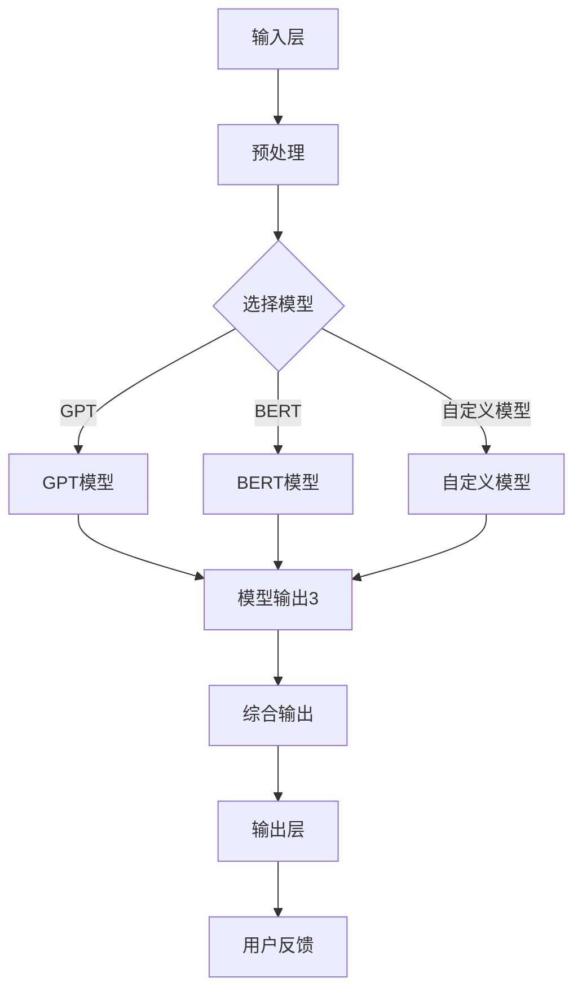

                 

## 文章标题

### 《使用 LLMChain 简化构造 Chat Prompt》

Chatbot作为一种智能交互技术，已经在各个领域得到广泛应用。而构建一个高效、实用的Chatbot，关键在于Chat Prompt的设计。LLMChain作为一款强大的工具，可以帮助我们简化Chat Prompt的构造过程，提高Chatbot的性能和用户体验。本文将详细探讨LLMChain的原理、应用以及优化策略，帮助读者全面了解和掌握如何使用LLMChain来简化构造Chat Prompt。

## 文章关键词

- LLMChain
- Chatbot
- Chat Prompt
- 优化策略
- 应用场景
- 自然语言处理

## 摘要

本文首先介绍了LLMChain的基本概念和原理，包括其架构和组成，以及与自然语言处理和计算机视觉的关系。接着，我们探讨了如何使用LLMChain来设计和优化Chat Prompt，包括优化原则、技巧和实践。然后，本文通过具体案例展示了LLMChain在不同场景中的应用，并对其未来发展趋势和挑战进行了展望。最后，本文提供了相关的资源与工具，以及实际代码示例和解读，以帮助读者更好地理解和应用LLMChain。

## 第一部分：LLMChain 基础知识

### 1.1 LLMChain 的定义与作用

LLMChain，即Large Language Model Chain，是一种基于大型语言模型的链式结构，旨在通过组合多个语言模型，实现对复杂问题的智能解答。LLMChain的核心作用是简化Chat Prompt的构造过程，提高Chatbot的响应速度和准确性。

LLMChain的工作原理可以概括为以下几个步骤：

1. **输入处理**：用户输入一个自然语言的问题或请求，LLMChain首先对其进行预处理，包括分词、去停用词、词性标注等。
2. **模型调用**：根据输入的内容，LLMChain从链中的多个语言模型中选择一个或多个模型进行调用。这些模型可以是预训练的语言模型，也可以是针对特定任务进行微调的模型。
3. **回答生成**：被调用的模型对输入进行处理，生成一个回答或建议。LLMChain将多个模型的回答进行综合，生成最终的输出。

### 1.2 LLMChain 的优势与局限

**优势：**

1. **高效性**：LLMChain通过链式结构，可以在短时间内处理大量问题，提高Chatbot的响应速度。
2. **准确性**：LLMChain结合了多个语言模型的优点，能够生成更准确、自然的回答。
3. **灵活性**：LLMChain可以根据不同的任务需求，动态调整模型组合，提高适应性。

**局限：**

1. **计算资源消耗**：由于需要调用多个模型，LLMChain对计算资源的需求较高，可能不适合在资源受限的环境中部署。
2. **模型质量依赖**：LLMChain的性能很大程度上取决于所使用的语言模型的质量，如果模型训练不足或质量不佳，可能导致回答不准确。
3. **语义理解挑战**：虽然LLMChain结合了多个模型，但依然面临自然语言处理中的语义理解挑战，尤其是在处理复杂、抽象的问题时。

### 1.3 LLMChain 的架构与组成

LLMChain的架构可以分为三个主要部分：输入层、模型层和输出层。

**输入层**：负责接收用户输入的自然语言请求，并进行预处理。

**模型层**：由多个语言模型组成，可以是预训练的语言模型，如GPT、BERT，也可以是针对特定任务进行微调的模型。模型层通过调用不同的模型，实现对输入的解析和处理。

**输出层**：负责生成最终的回答或建议，并输出给用户。

以下是一个简单的LLMChain架构的Mermaid流程图：



## 第二部分：LLMChain 核心概念

### 2.1 Prompt 设计原理

Prompt是用户输入的问题或请求，是Chatbot与用户交互的核心。一个优秀的Prompt设计，可以引导Chatbot生成更准确、自然的回答。以下是几个关键的Prompt设计原理：

1. **明确性**：Prompt应尽可能明确、具体，避免模糊不清的问题。
2. **一致性**：Prompt中的信息应保持一致，避免产生歧义。
3. **简洁性**：Prompt应简洁明了，避免冗长复杂。
4. **启发性**：Prompt应具有启发性，引导Chatbot深入理解问题，生成更深入的回答。

### 2.2 Prompt 的类型与用途

Prompt可以分为以下几种类型：

1. **事实性Prompt**：用于询问事实信息，如“今天天气怎么样？”
2. **推理性Prompt**：用于考察用户的推理能力，如“如果...会发生什么？”
3. **对话性Prompt**：用于引导用户进行对话，如“你能告诉我更多关于这个话题吗？”
4. **任务性Prompt**：用于指导用户完成任务，如“请帮我预订一张机票。”

不同的Prompt类型适用于不同的场景和任务，需要根据实际需求进行选择。

### 2.3 Prompt 的结构分析

一个完整的Prompt通常包括以下几个部分：

1. **主语**：指明问题的主体，如“我”、“你”等。
2. **谓语**：描述主语的动作或状态，如“是”、“可以”等。
3. **宾语**：指明动作的对象或状态的内容，如“天气”、“机票”等。
4. **修饰语**：对主语、谓语或宾语进行补充说明，如“今天”、“早上八点”等。

以下是一个简单的Prompt结构示例：

```plaintext
主语：你
谓语：可以
宾语：帮我查询最近的火车站
修饰语：在下午三点之前
```

这种结构清晰的Prompt可以帮助Chatbot更准确地理解用户的需求，生成相应的回答。

## 第三部分：LLMChain 技术基础

### 3.1 语言模型简介

语言模型（Language Model，LM）是一种用于预测自然语言序列的概率分布的模型，它在自然语言处理（Natural Language Processing，NLP）中起着关键作用。语言模型的基本任务是根据前面已知的文字序列预测下一个可能的单词或字符。

**语言模型的分类：**

1. **统计语言模型**：基于大量文本统计信息，如N-gram模型。
2. **神经网络语言模型**：基于深度学习技术，如循环神经网络（RNN）、长短期记忆网络（LSTM）和Transformer等。

**语言模型的作用：**

1. **文本生成**：根据已有的文本序列，生成新的文本序列。
2. **语言理解**：对文本进行语义理解，提取出文本的核心信息。
3. **语音识别**：将语音信号转换为文本。

### 3.2 自然语言处理基础

自然语言处理（NLP）是计算机科学和人工智能领域的一个重要分支，旨在使计算机能够理解、解释和生成人类语言。以下是NLP的一些基本概念：

**文本预处理**：在NLP任务中，首先需要对文本进行预处理，包括分词、去停用词、词性标注等。这些步骤有助于将原始文本转换为适合模型处理的形式。

**词向量表示**：词向量是将自然语言中的单词转换为固定大小的向量表示的方法。词向量可以捕获词与词之间的关系，如相似词、反义词等，从而提高NLP任务的性能。

**语义分析**：语义分析是NLP中的一个核心任务，旨在理解文本中的意义和逻辑关系。常见的语义分析方法包括词义消歧、情感分析、指代消解等。

**文本分类**：文本分类是将文本数据分为预定义的类别或标签的过程。常见的文本分类任务包括垃圾邮件检测、情感分析、主题分类等。

### 3.3 计算机视觉基础

计算机视觉（Computer Vision，CV）是人工智能的一个重要分支，旨在使计算机能够“看”懂现实世界中的图像和视频。以下是计算机视觉的一些基本概念：

**图像识别**：图像识别是计算机视觉的一个核心任务，旨在识别图像中的对象、场景和动作。常见的图像识别任务包括人脸识别、物体识别、场景分割等。

**目标检测**：目标检测是计算机视觉中的一个重要任务，旨在找出图像中的特定对象，并给出它们的位置和边界框。常见的目标检测算法包括YOLO、SSD、Faster R-CNN等。

**图像分割**：图像分割是将图像划分为多个区域的过程，每个区域具有相似的特征。图像分割有助于提取图像中的关键信息，如前景、背景、纹理等。

**光学字符识别（OCR）**：OCR是将图像中的文字转换为机器可读文本的过程。OCR技术在文本处理、文档数字化等领域具有重要应用。

## 第四部分：LLMChain 实践指南

### 4.1 环境搭建与工具准备

在开始使用LLMChain之前，我们需要搭建一个合适的环境，并准备好相关的工具和库。以下是搭建LLMChain开发环境的基本步骤：

1. **安装Python环境**：确保Python环境已安装，推荐版本为Python 3.7及以上。
2. **安装必要的库**：使用pip命令安装以下库：

   ```bash
   pip install numpy pandas transformers torch
   ```

   这些库分别用于数据处理、文本预处理、语言模型训练和优化。

3. **安装预训练模型**：可以从Hugging Face Model Hub下载预训练的语言模型，如GPT、BERT等。使用以下命令下载：

   ```bash
   pip install transformers
   transformers-cli download model_name
   ```

   例如，下载GPT模型：

   ```bash
   transformers-cli download gpt2
   ```

### 4.2 数据处理与预处理

在搭建好开发环境后，我们需要准备训练数据和进行预处理。以下是数据处理和预处理的基本步骤：

1. **数据收集**：收集用于训练和评估的语言模型的数据集。数据集应包含多方面的内容，以确保模型的泛化能力。
2. **数据清洗**：去除数据集中的噪声和无关信息，如HTML标签、特殊字符等。可以使用Python的`re`库进行清洗。
3. **数据预处理**：将文本数据进行分词、词性标注、去除停用词等处理，以便模型能够更好地理解文本。可以使用Python的`nltk`库进行预处理。
4. **数据转换**：将预处理后的文本数据转换为适合模型训练的格式，如张量（Tensor）。可以使用Python的`torch`库进行数据转换。

以下是一个简单的数据处理和预处理的代码示例：

```python
import re
import nltk
from nltk.corpus import stopwords
from nltk.tokenize import word_tokenize
import torch

# 数据清洗
def clean_text(text):
    text = re.sub(r'<[^>]*>', '', text)  # 去除HTML标签
    text = re.sub(r'\s+', ' ', text)     # 去除多余空格
    return text

# 数据预处理
def preprocess_text(text):
    text = clean_text(text)
    tokens = word_tokenize(text)  # 分词
    tokens = [token.lower() for token in tokens if token.isalpha()]  # 转小写，去除非字母字符
    tokens = [token for token in tokens if token not in stopwords.words('english')]  # 去除停用词
    return tokens

# 数据转换
def convert_tokens_to_tensor(tokens):
    vocab = ['<PAD>', '<UNK>', '<BOS>', '<EOS>'] + list(set(tokens))
    word2idx = {word: idx for idx, word in enumerate(vocab)}
    idx2word = {idx: word for word, idx in word2idx.items()}
    token_idx = [word2idx.get(token, word2idx['<UNK>']) for token in tokens]
    sequence = torch.tensor([word2idx['<BOS>']] + token_idx + [word2idx['<EOS>']])
    return sequence, vocab, idx2word

# 示例
text = "Hello, how are you today?"
cleaned_text = clean_text(text)
preprocessed_text = preprocess_text(cleaned_text)
sequence, vocab, idx2word = convert_tokens_to_tensor(preprocessed_text)

print("Cleaned Text:", cleaned_text)
print("Preprocessed Text:", preprocessed_text)
print("Sequence:", sequence)
print("Vocabulary:", vocab)
print("Index to Word:", idx2word)
```

### 4.3 LLMChain 代码示例与解读

以下是一个简单的LLMChain代码示例，展示了如何使用预训练的语言模型来生成回答。

```python
from transformers import GPT2LMHeadModel, GPT2Tokenizer

# 加载预训练模型和分词器
model_name = 'gpt2'
tokenizer = GPT2Tokenizer.from_pretrained(model_name)
model = GPT2LMHeadModel.from_pretrained(model_name)

# 定义LLMChain
class LLMChain:
    def __init__(self, model, tokenizer):
        self.model = model
        self.tokenizer = tokenizer

    def generate_response(self, prompt):
        inputs = self.tokenizer.encode(prompt, return_tensors='pt')
        outputs = self.model.generate(inputs, max_length=50, num_return_sequences=1)
        response = self.tokenizer.decode(outputs[0], skip_special_tokens=True)
        return response

# 示例
llmchain = LLMChain(model, tokenizer)
prompt = "如何用Python实现一个简单的聊天机器人？"
response = llmchain.generate_response(prompt)
print("Response:", response)
```

**代码解读：**

1. **加载预训练模型和分词器**：使用`GPT2Tokenizer`和`GPT2LMHeadModel`类加载预训练的GPT-2模型和分词器。
2. **定义LLMChain类**：`LLMChain`类负责生成回答，通过调用模型的`generate`方法生成文本序列。
3. **生成回答**：给定一个提示（prompt），使用`generate_response`方法生成回答。这里使用了`max_length`参数限制生成的文本长度，并设置`num_return_sequences`为1，表示只生成一个回答。

通过这个简单的示例，我们可以看到如何使用LLMChain来简化Chat Prompt的构造过程。在实际应用中，我们可以根据具体需求对LLMChain进行扩展和优化，提高其性能和适应性。

### 第五部分：Chat Prompt 优化策略

在构建高效的Chatbot时，Chat Prompt的设计至关重要。一个优秀的Chat Prompt不仅能引导用户进行有效的交流，还能帮助Chatbot生成准确、自然的回答。本节将介绍Chat Prompt的优化策略，包括提高用户交互体验、增强自然语言理解能力和提高响应速度与效率。

#### 5.1 提高用户交互体验

良好的用户交互体验是Chatbot成功的关键因素之一。以下是一些提高用户交互体验的策略：

1. **简洁明了**：Chat Prompt应简洁明了，避免使用复杂的术语和冗长的句子。这样可以让用户更容易理解，并快速得到满意的回答。
2. **语境敏感**：Chatbot应能根据上下文理解用户的问题，并提供相关的回答。例如，如果用户之前询问了天气，那么再次提问时，Chatbot应能自动识别并回答相关天气信息。
3. **个性化**：根据用户的喜好和历史记录，为用户提供个性化的回答。例如，如果用户经常询问某个话题，Chatbot可以主动推送相关内容。

#### 5.2 增强自然语言理解能力

自然语言理解（NLU）是Chatbot的核心功能之一。以下是一些增强自然语言理解能力的策略：

1. **语义理解**：Chatbot应能理解用户问题的深层含义，而不仅仅是表面上的文字。例如，当用户说“我想要一杯咖啡”，Chatbot应能理解用户实际上是在请求一杯咖啡，而不是其他饮品。
2. **情感分析**：识别用户情绪并作出相应的反应。例如，当用户表达不满时，Chatbot可以主动道歉并解决问题。
3. **上下文关联**：理解用户问题的上下文，并根据上下文提供相关的回答。例如，用户在对话中提到了某个关键词，Chatbot应能记住并关联到后续的问题。

#### 5.3 提高响应速度与效率

提高响应速度和效率是提升用户满意度的重要指标。以下是一些提高响应速度与效率的策略：

1. **预加载**：在用户提出问题之前，预加载相关的数据和回答，以减少响应时间。
2. **并行处理**：在处理多个用户请求时，使用并行处理技术，以提高整体响应速度。
3. **缓存机制**：将常见的回答和问题缓存起来，以便快速回复。例如，当用户询问常见问题如“如何注册账号？”时，Chatbot可以直接从缓存中获取答案。

#### 5.4 数据驱动优化

数据驱动优化是持续改进Chatbot性能的关键。以下是一些数据驱动优化的策略：

1. **用户反馈**：收集用户的反馈，分析哪些回答最受欢迎，哪些问题需要改进。根据用户反馈进行优化。
2. **错误日志**：记录Chatbot处理错误的情况，分析错误原因，并优化相关逻辑。
3. **A/B测试**：对不同版本的Chat Prompt进行A/B测试，比较性能和用户满意度，选择最优方案。

通过以上优化策略，我们可以显著提升Chatbot的性能和用户体验，使其更好地满足用户需求。

### 第六部分：Chat Prompt 优化技巧

在优化Chat Prompt时，我们可以采取多种技巧来提高其效果。以下是一些常见的方法和步骤：

#### 6.1 数据驱动优化

数据驱动优化是一种基于数据分析和用户反馈的优化方法。以下是具体步骤：

1. **收集数据**：首先，收集用户的交互数据，包括提问内容、Chatbot的回答、用户的反馈等。
2. **数据分析**：分析用户数据，找出常见问题、用户反馈中的常见问题点、回答准确率等关键指标。
3. **用户行为分析**：通过分析用户行为，了解用户在交互过程中的行为模式，如用户更喜欢哪种类型的回答、用户在哪个环节容易退出对话等。
4. **优化决策**：根据数据分析结果，制定优化策略，如调整回答内容、改进提问方式、增加引导性提示等。

#### 6.2 模型调优技巧

模型调优是提升Chatbot性能的重要手段。以下是一些调优技巧：

1. **超参数调优**：调整模型的超参数，如学习率、批量大小、隐藏层尺寸等，以找到最佳配置。
2. **交叉验证**：使用交叉验证方法，对模型进行多次训练和验证，以避免过拟合和欠拟合。
3. **集成学习**：结合多个模型的预测结果，提高整体预测准确性。常见的集成学习方法有Bagging、Boosting和Stacking等。
4. **迁移学习**：利用预训练模型，对特定任务进行微调，以提高模型在目标任务上的性能。

#### 6.3 实时反馈与自适应调整

实时反馈与自适应调整是一种动态优化Chat Prompt的方法。以下是具体步骤：

1. **实时监控**：监控Chatbot的运行状态，包括回答准确性、响应时间、用户满意度等指标。
2. **用户反馈**：收集用户的实时反馈，了解用户对回答的满意度。
3. **自适应调整**：根据实时监控和用户反馈，动态调整Chat Prompt，如修改提问方式、优化回答内容等。
4. **自动化流程**：建立自动化流程，实现实时反馈和自适应调整的自动化执行，提高优化效率。

通过以上技巧，我们可以持续优化Chat Prompt，提高Chatbot的性能和用户体验。

### 第七部分：Chat Prompt 优化实践

在本文的第七部分，我们将通过具体案例来展示如何优化Chat Prompt，并详细解析优化效果。以下是两个实战案例：

#### 7.1 实战案例：在线购物平台的聊天机器人优化

**案例背景：** 一个在线购物平台的聊天机器人主要用于帮助用户查询商品信息、订单状态以及提供购物建议。

**优化前的问题：** 
- 用户查询商品时，聊天机器人提供的回答不够具体，导致用户需要多次提问。
- 在订单状态查询中，聊天机器人有时无法准确识别用户的订单号，导致回答错误。
- 用户提出购物建议时，聊天机器人的回答缺乏个性化，无法满足用户的个性化需求。

**优化策略：**
- **数据驱动优化**：通过分析用户提问和回答的数据，找出常见问题点和优化机会。
- **模型调优**：对聊天机器人的语言模型进行调优，提高回答的准确性和自然度。
- **实时反馈与自适应调整**：引入实时反馈机制，根据用户满意度调整Chat Prompt。

**优化步骤：**
1. **数据收集与分析**：收集用户提问和回答的数据，分析用户常见的问题点和回答准确率。
2. **模型调优**：根据数据分析结果，调整聊天机器人的语言模型参数，提高回答的准确性和自然度。
3. **实时反馈与自适应调整**：通过用户满意度调查和实时反馈，动态调整Chat Prompt，提高用户体验。

**优化效果：**
- 用户查询商品时，聊天机器人提供的回答更加具体，用户满意度提高。
- 订单状态查询中，聊天机器人能更准确识别用户的订单号，回答准确率提高。
- 用户提出购物建议时，聊天机器人能根据用户的历史记录和偏好，提供个性化的购物建议。

#### 7.2 实战案例：银行客服聊天机器人优化

**案例背景：** 一家银行的客服聊天机器人主要用于回答用户关于账户余额、转账操作、贷款咨询等方面的问题。

**优化前的问题：**
- 账户余额查询中，聊天机器人有时无法准确识别用户的账户信息，导致回答错误。
- 转账操作指南中，聊天机器人提供的步骤不够详细，用户难以理解。
- 贷款咨询中，聊天机器人提供的回答过于笼统，无法满足用户的详细需求。

**优化策略：**
- **数据驱动优化**：通过分析用户提问和回答的数据，找出常见问题点和优化机会。
- **模型调优**：对聊天机器人的语言模型进行调优，提高回答的准确性和自然度。
- **实时反馈与自适应调整**：引入实时反馈机制，根据用户满意度调整Chat Prompt。

**优化步骤：**
1. **数据收集与分析**：收集用户提问和回答的数据，分析用户常见的问题点和回答准确率。
2. **模型调优**：根据数据分析结果，调整聊天机器人的语言模型参数，提高回答的准确性和自然度。
3. **实时反馈与自适应调整**：通过用户满意度调查和实时反馈，动态调整Chat Prompt，提高用户体验。

**优化效果：**
- 账户余额查询中，聊天机器人能更准确识别用户的账户信息，回答准确率提高。
- 转账操作指南中，聊天机器人提供的步骤更加详细，用户理解更容易。
- 贷款咨询中，聊天机器人能根据用户的需求，提供更加详细和个性化的回答。

通过以上实战案例，我们可以看到，通过数据驱动优化、模型调优和实时反馈与自适应调整，可以显著提升Chatbot的性能和用户体验。这些优化策略不仅适用于在线购物平台和银行客服，还可以应用于其他领域的Chatbot优化。

### 第八部分：LLMChain 在特定场景中的应用

#### 8.1 LLMChain 在客户服务中的应用

在客户服务领域，LLMChain作为一种智能交互工具，可以显著提升客户服务效率和用户体验。以下将详细探讨LLMChain在客户服务中的应用场景、构建流程和优化策略。

**应用场景：**

1. **常见问题解答**：客户服务机器人可以使用LLMChain处理用户常见问题，如产品使用说明、账户余额查询、订单状态查询等。
2. **在线咨询**：对于复杂的客户咨询，如定制化产品咨询、技术支持等，LLMChain可以通过智能对话生成详细的回答，帮助客服代表更好地理解客户需求。
3. **个性化推荐**：基于用户的历史互动和偏好，LLMChain可以推荐合适的产品和服务，提高客户满意度。

**构建流程：**

1. **需求分析**：明确客户服务的具体需求和目标，如常见问题的覆盖范围、个性化推荐的需求等。
2. **数据准备**：收集并整理与客户服务相关的数据，包括FAQ、用户反馈、历史咨询记录等。
3. **模型训练**：使用收集的数据训练LLMChain，使其具备处理常见问题和提供个性化回答的能力。
4. **部署与测试**：将训练好的LLMChain部署到客户服务平台，并进行测试和调优，确保其能够稳定运行并满足服务需求。

**优化策略：**

1. **多模态数据融合**：将文本数据与其他数据类型（如图像、音频）进行融合，提高LLMChain的识别和理解能力。
2. **实时反馈机制**：建立实时反馈机制，根据用户满意度和服务效果，动态调整Chat Prompt和模型参数。
3. **个性化调整**：根据客户的历史互动和偏好，为不同客户提供个性化的服务和推荐。

**优化案例分享：**

**案例1：电商平台客服机器人**

一个电商平台的客户服务机器人使用了LLMChain，通过优化常见问题解答和个性化推荐，显著提升了用户体验和服务效率。以下是具体优化措施：

- **数据驱动优化**：通过分析用户提问和回答的数据，识别常见问题点和优化机会，如调整FAQ内容和优化回答模板。
- **模型调优**：根据用户反馈和业务需求，定期对LLMChain进行调优，提高回答的准确性和自然度。
- **个性化推荐**：基于用户购买记录和浏览行为，为用户提供个性化的产品推荐，提高了用户满意度和转化率。

**案例2：金融机构客服机器人**

一家金融机构的客户服务机器人使用了LLMChain，通过优化账户查询和转账操作指南，提升了客户满意度和服务效率。以下是具体优化措施：

- **数据收集与分析**：收集用户在账户查询和转账操作中的常见问题和错误，分析用户行为和需求。
- **模型调优**：根据数据分析结果，调整LLMChain的参数，提高回答的准确性和详细程度。
- **实时反馈机制**：引入实时反馈机制，通过用户满意度调查和错误日志分析，动态调整Chat Prompt和模型参数。

通过以上案例，我们可以看到，LLMChain在客户服务中的应用可以显著提升服务质量和效率。通过数据驱动优化、模型调优和实时反馈机制，可以不断改进Chat Prompt，满足客户多样化的需求。

### 9.1 教育领域中的 Chat Prompt 设计

在教育领域，Chatbot作为一种智能教育辅助工具，正逐步受到重视。通过设计优化的Chat Prompt，教育Chatbot能够提供个性化、交互式的学习体验，帮助学生提高学习效果。以下是教育领域中Chat Prompt设计的一些关键点和实际应用案例。

#### 关键点

1. **学生互动与反馈优化**：Chat Prompt应设计得富有启发性，鼓励学生积极参与互动。例如，通过提问、讨论和反馈，激发学生的学习兴趣和参与感。
2. **个性化推荐**：Chatbot应能根据学生的学习进度、兴趣和需求，提供个性化的学习资源和推荐。例如，根据学生的知识点掌握情况，推荐相应的练习题或学习材料。
3. **教师辅导与个性化推荐**：Chatbot不仅可以帮助学生，还可以辅助教师进行教学。通过分析学生的学习数据，Chatbot可以为教师提供个性化教学建议，如调整教学进度、改进教学方法等。

#### 实际应用案例

**案例1：在线学习平台**

一个在线学习平台采用了Chatbot来辅助学习，通过优化的Chat Prompt实现了以下效果：

- **互动式学习**：Chatbot设计了一系列互动性问题，如“你对这个知识点有哪些疑问？”和“你能用所学知识解决以下问题吗？”等问题，鼓励学生积极思考和回答。
- **个性化推荐**：Chatbot根据学生的学习进度和答题情况，推荐相应的学习资源和练习题，帮助学生巩固知识点。
- **教师辅导**：Chatbot为教师提供学生互动数据和答题情况，帮助教师了解学生的学习情况，并调整教学策略。

**案例2：语言学习应用**

一个语言学习应用中的Chatbot通过优化的Chat Prompt，实现了以下效果：

- **互动式练习**：Chatbot设计了一系列互动式的语言练习，如“请用所学单词造句”和“根据提示选择正确的单词”等，帮助学生通过实际应用来巩固语言技能。
- **个性化辅导**：Chatbot根据学生的语言水平和学习进度，提供个性化的辅导和建议，如“你的发音需要特别注意”和“这个语法点你需要多练习”等。
- **实时反馈**：Chatbot在学生完成练习后，提供即时反馈和解释，帮助学生理解错误原因并改进。

通过这些实际应用案例，我们可以看到，优化的Chat Prompt在设计教育Chatbot中发挥了重要作用。通过互动式学习、个性化推荐和实时反馈，Chatbot能够为教育领域提供更加灵活、有效的辅助工具。

### 9.2 学生互动与反馈优化

在Chatbot辅助教学的过程中，学生互动与反馈的优化是提升学习效果的关键环节。以下将详细探讨如何通过Chat Prompt的设计来实现学生互动与反馈的优化。

#### 互动式学习的实施

1. **开放性问题**：设计开放性问题，鼓励学生表达自己的想法和观点。例如：“你认为这个知识点的重要应用是什么？”或“你对这个问题有何看法？”这样的问题能够激发学生的思考，促进课堂互动。
2. **情境模拟**：通过设计具体的情境模拟，让学生在解决问题的过程中提高实际应用能力。例如：“假设你是一名项目经理，如何安排这个项目的进度？”或“在现实生活中，你会如何处理这个情况？”通过这种情境模拟，学生能够将所学知识应用到实际问题中。

#### 反馈机制的优化

1. **即时反馈**：提供即时反馈，让学生在完成练习后立即了解自己的答案是否正确。例如，当学生完成一个语言练习题后，Chatbot可以立即提供答案和解释，帮助学生及时纠正错误。
2. **个性化反馈**：根据学生的知识点掌握情况，提供个性化的反馈和建议。例如：“你在这一章节中表现不错，但是这个知识点还需要加强练习”或“你的发音需要特别注意，建议多听录音并模仿”。这种个性化的反馈能够帮助学生明确自己的学习目标，并制定改进计划。

#### 互动式学习与反馈的案例

**案例1：数学学习应用**

一个数学学习应用中的Chatbot通过以下方式优化了学生互动与反馈：

- **开放性问题**：在练习题后，Chatbot会提出开放性问题，如“这个解题方法有其他变体吗？”或“你能用不同的方法解决这个问题吗？”这样的问题鼓励学生思考并探索更多解法。
- **即时反馈**：当学生提交答案后，Chatbot会立即显示正确答案和解题步骤，并提供解释，如“正确答案是5，因为……”。

**案例2：语言学习应用**

一个语言学习应用中的Chatbot通过以下方式优化了学生互动与反馈：

- **情境模拟**：Chatbot设计了一系列语言情境模拟，如“假设你正在旅游，如何用英语询问当地的餐馆推荐？”这样的情境模拟让学生在实际应用中练习语言技能。
- **个性化反馈**：Chatbot会根据学生的答题情况提供个性化的反馈，如“你的语法使用正确，但是句子结构可以更加丰富”或“你的发音准确，但是语调需要更加自然”。

通过这些案例，我们可以看到，通过设计优化的Chat Prompt，可以实现学生互动与反馈的优化，从而提升学习效果。开放性问题、情境模拟和即时反馈与个性化反馈的结合，能够为教育Chatbot提供更加有效和互动的学习体验。

### 9.3 教师辅导与个性化推荐

在教育领域，教师不仅是知识的传授者，更是学生个性化学习路径的引导者。Chatbot可以通过智能交互，辅助教师进行个性化辅导和推荐，提高教学效果。以下是Chatbot在教育领域中如何实现教师辅导与个性化推荐的具体方法。

#### 教师辅导

1. **数据分析**：Chatbot可以收集学生的学习数据，包括答题情况、知识点掌握程度、学习时长等，通过数据分析，为教师提供学生的全面学习画像。
2. **教学建议**：根据学生的学习数据，Chatbot可以为教师提供具体的教学建议，如调整教学进度、改进教学方法等。例如，如果发现某位学生在某个知识点上掌握不牢固，Chatbot可以建议教师进行重点讲解或安排额外的练习。
3. **实时反馈**：Chatbot可以实时跟踪学生的学习情况，及时将学生的进步和问题反馈给教师，帮助教师快速调整教学策略。

#### 个性化推荐

1. **学习资源推荐**：Chatbot可以根据学生的学习进度和兴趣，推荐适合的学习资源和练习题。例如，如果学生在某个章节表现出色，Chatbot可以推荐更高难度的练习题或相关知识点；如果学生在某个知识点上表现不佳，Chatbot可以推荐相关的教学视频或详细的解释说明。
2. **个性化学习路径**：Chatbot可以根据学生的学习特点和目标，为每个学生设计个性化的学习路径。例如，对于想要快速掌握基础知识的初学者，Chatbot可以设计一个从基础到进阶的逐步学习计划；对于有一定基础的学生，Chatbot可以推荐更深入的学习内容和研究课题。
3. **学习目标设定**：Chatbot可以帮助学生设定具体的学习目标，并跟踪目标的实现情况。例如，学生可以设定“掌握所有数学基础知识”或“熟练运用英语进行日常交流”等目标，Chatbot会根据这些目标提供相应的学习资源和辅导。

#### 案例分析

**案例1：数学教师辅导**

一位数学教师使用Chatbot辅助教学，通过以下方式实现了个性化辅导：

- **数据驱动**：Chatbot收集了每位学生的答题情况，教师可以根据这些数据调整教学重点，如对某个知识点的讲解次数和深度。
- **实时反馈**：Chatbot实时跟踪学生的学习进度，教师可以根据反馈及时调整教学策略，确保每个学生都能跟上教学进度。
- **个性化建议**：Chatbot根据学生的答题表现，提供个性化的学习建议，如“建议多练习这类题型”或“尝试使用不同方法解题”。

**案例2：英语教师辅导**

一位英语教师使用Chatbot帮助学生进行语言学习，通过以下方式实现了个性化推荐：

- **学习资源推荐**：Chatbot根据学生的词汇量和语法掌握情况，推荐适合的词汇练习和语法讲解视频。
- **个性化学习路径**：Chatbot为不同水平的学生设计不同的学习路径，例如初级学生可以专注于基础词汇和语法，高级学生可以学习口语表达和听力技巧。
- **学习目标设定**：Chatbot帮助学生设定具体的学习目标，如“每天学习10个新单词”或“每周完成一篇英语作文”，并跟踪目标的实现情况，提供相应的奖励和反馈。

通过这些案例分析，我们可以看到，Chatbot在教育领域中实现了教师辅导和个性化推荐的有机结合，帮助教师更好地了解学生的学习情况，提供针对性的辅导和资源，从而提高教学效果。

### 10.1 企业内训 Chatbot 的构建

在企业内训中，Chatbot作为一种智能学习助手，能够为企业员工提供灵活、个性化的学习体验，提高培训效果。以下是企业内训Chatbot的构建步骤、关键功能和优化策略。

#### 构建步骤

1. **需求分析**：首先，明确企业内训的目标和需求，包括培训内容、学习目标、员工需求等。需求分析有助于确定Chatbot的功能和界面设计。
2. **数据收集**：收集与企业内训相关的数据，如员工的学习记录、培训资料、考核结果等。这些数据将用于训练Chatbot模型。
3. **技术选型**：选择合适的开发框架和技术栈，如Python、TensorFlow、Keras等。同时，选择适合的预训练语言模型，如BERT、GPT等。
4. **界面设计**：设计简洁易用的用户界面，确保员工能够轻松地与Chatbot进行交互。
5. **功能实现**：开发Chatbot的核心功能，如课程推荐、学习进度跟踪、问答系统、学习评估等。
6. **模型训练与优化**：使用收集到的数据对Chatbot模型进行训练和优化，确保其能够准确理解和回答员工的问题。
7. **测试与部署**：对Chatbot进行全面测试，确保其稳定性和性能。然后，将Chatbot部署到企业的学习平台上，供员工使用。

#### 关键功能

1. **课程推荐**：根据员工的学习记录和兴趣，Chatbot可以推荐适合的课程和学习资源。例如，如果员工在某一方面表现优异，Chatbot可以推荐更深入的专题课程。
2. **学习进度跟踪**：Chatbot可以实时跟踪员工的学习进度，并生成详细的学习报告，帮助员工了解自己的学习情况。
3. **问答系统**：Chatbot可以回答员工在学习过程中遇到的问题，提供即时的帮助和指导。
4. **学习评估**：Chatbot可以组织在线考试和测试，评估员工的学习效果，并根据评估结果提供反馈和建议。
5. **互动式学习**：Chatbot可以通过互动式问答、练习题和模拟场景，提高员工的学习参与度和积极性。

#### 优化策略

1. **数据驱动**：通过收集和分析员工的学习数据，Chatbot可以不断优化课程推荐和学习路径，提供更加个性化的学习体验。
2. **模型调优**：定期对Chatbot模型进行训练和优化，提高其准确性和响应速度。可以使用迁移学习和微调技术，使Chatbot更好地适应企业内训的需求。
3. **用户反馈**：收集员工的反馈，了解他们对Chatbot的满意度和使用体验，根据反馈进行改进。
4. **多模态交互**：结合文本、语音和图像等多模态交互，提高Chatbot的交互自然度和用户体验。

#### 案例分析

**案例1：某大型企业内训Chatbot**

某大型企业在内部部署了一款内训Chatbot，通过以下方式实现了优化：

- **数据驱动**：Chatbot收集员工的学习数据，分析学习效果和员工需求，根据数据推荐适合的课程和资源。
- **模型调优**：定期对Chatbot模型进行训练和优化，提高其回答准确性和学习效果。
- **用户反馈**：Chatbot提供实时反馈和满意度调查，根据反馈优化功能和使用体验。

**案例2：中小企业内训Chatbot**

某中小企业由于资源和时间的限制，选择了轻量化的内训Chatbot，通过以下方式实现了优化：

- **简洁界面**：Chatbot界面设计简洁，便于员工快速上手。
- **课程推荐**：Chatbot根据员工的学习记录和职业发展需求，推荐相关课程。
- **互动式学习**：Chatbot通过互动式问答和练习题，提高员工的学习参与度和积极性。

通过以上案例，我们可以看到，企业内训Chatbot的构建需要综合考虑需求分析、数据收集、技术选型、功能实现和优化策略。通过数据驱动、模型调优和用户反馈，可以不断提升Chatbot的性能和用户体验，实现高效的内训目标。

### 10.2 员工学习需求分析

在企业内训中，了解员工的学习需求是构建有效Chatbot的关键。以下是分析员工学习需求的几个关键步骤和实际应用。

#### 关键步骤

1. **调查问卷**：通过设计问卷，收集员工对培训内容的兴趣、需求和期望。问卷可以涵盖不同方面的内容，如职业发展、技能提升、知识补充等。
2. **数据分析**：对问卷结果进行统计和分析，识别员工最关注的培训主题和需求。数据分析可以帮助我们了解员工的共同需求和个性化需求。
3. **访谈与反馈**：进行深度访谈和反馈收集，进一步了解员工的学习动机、困难和挑战。这些信息对于定制化培训方案和Chatbot设计至关重要。
4. **学习数据收集**：通过企业学习管理系统（LMS）或学习平台，收集员工的学习行为数据，如学习时长、完成率、测试成绩等。这些数据可以揭示员工的学习习惯和效果。

#### 实际应用

**案例1：职业发展需求分析**

某企业通过问卷调查发现，员工普遍对领导力和项目管理方面的培训有强烈需求。为了满足这一需求，企业内训Chatbot设计了以下功能：

- **职业发展路径规划**：Chatbot根据员工的工作经验和职业目标，提供个性化的职业发展路径和培训推荐。
- **领导力专题讲座**：Chatbot推荐相关的视频讲座和在线课程，帮助员工提升领导力和管理能力。
- **互动式练习**：Chatbot设计领导力和项目管理相关的互动练习，提高员工的应用能力和实战经验。

**案例2：技能提升需求分析**

通过数据分析，某企业发现员工对技术技能的提升需求较高，特别是编程和数据分析方面。为了满足这一需求，Chatbot实施了以下策略：

- **技能评估**：Chatbot通过技能测试评估员工的技术水平，根据评估结果推荐适合的学习资源和练习题。
- **编程练习**：Chatbot提供在线编程练习，员工可以实时调试代码并获得即时反馈。
- **数据分析教程**：Chatbot推荐数据分析相关的教程和案例，帮助员工掌握数据分析的技能。

**案例3：知识补充需求分析**

某企业通过访谈发现，员工对行业最新动态和专业知识有强烈需求。为了满足这一需求，Chatbot实施了以下措施：

- **行业资讯推送**：Chatbot定期推送行业最新动态和热点文章，帮助员工了解行业趋势。
- **专业知识问答**：Chatbot提供专业的问答服务，员工可以随时咨询行业问题和专业知识。
- **专题研讨会**：Chatbot推荐相关的在线研讨会和直播讲座，邀请行业专家分享专业知识。

通过以上案例分析，我们可以看到，分析员工学习需求是构建有效企业内训Chatbot的基础。通过调查问卷、数据分析、访谈与反馈以及学习数据收集，企业可以深入了解员工的学习需求和动机，从而设计出满足个性化需求的培训方案和Chatbot功能。

### 10.3 内训效果评估与优化

在构建企业内训Chatbot的过程中，评估和优化其效果是确保培训目标达成的关键环节。以下是内训效果评估和优化的几个关键指标、方法以及实际操作步骤。

#### 关键指标

1. **学习参与度**：评估员工对Chatbot的参与程度，包括登录频率、活跃度、互动次数等。
2. **学习完成率**：评估员工完成培训课程和任务的比率，反映培训内容的吸引力和适应性。
3. **学习效果**：通过测试和评估员工在培训后的知识掌握程度和应用能力，衡量培训效果。
4. **用户满意度**：收集员工对Chatbot的满意度评价，了解其对功能、体验和服务的反馈。
5. **数据反馈**：分析Chatbot收集的学习数据，如学习时长、完成情况、错误率等，评估培训的成效和问题点。

#### 评估方法

1. **定量分析**：通过统计分析方法，量化学习参与度、完成率和学习效果等指标，使用图表和报告进行展示。
2. **定性分析**：通过访谈、问卷调查和用户反馈，收集员工的定性评价和建议，深入了解培训的优缺点。
3. **A/B测试**：设计不同的Chatbot版本或功能，对员工进行A/B测试，比较不同版本的效果，选择最优方案。

#### 实际操作步骤

**步骤1：制定评估计划**

- **确定评估目标**：明确评估的目的和预期成果，如提升学习参与度、改进课程设计等。
- **定义关键指标**：根据评估目标，确定需要量化和分析的关键指标。
- **设计评估工具**：制定问卷、访谈指南和测试题，确保评估方法的科学性和有效性。

**步骤2：收集评估数据**

- **定量数据收集**：通过系统日志和数据分析工具，收集员工的登录、互动和学习完成数据。
- **定性数据收集**：通过问卷调查和访谈，收集员工的反馈和建议。

**步骤3：分析评估数据**

- **定量分析**：使用统计分析方法，对学习参与度、完成率和学习效果等指标进行定量分析。
- **定性分析**：整理访谈和问卷结果，进行主题分析和归纳。

**步骤4：制定优化方案**

- **识别问题点**：根据评估结果，找出Chatbot的不足之处和需要改进的环节。
- **制定优化方案**：根据问题点，设计具体的优化措施和改进方案。
- **实施优化方案**：对Chatbot进行优化更新，实施新的功能、界面设计或培训内容。

**步骤5：持续评估与优化**

- **定期评估**：定期进行效果评估，监测优化措施的实施效果。
- **反馈循环**：根据持续评估结果，进行反馈和调整，确保Chatbot不断改进和优化。

通过以上实际操作步骤，企业可以系统地评估和优化内训Chatbot的效果，确保其能够满足员工的学习需求和提升培训效果。

### 11.1 LLMChain 发展趋势

随着人工智能技术的不断进步，LLMChain作为一项新兴的技术，正呈现出迅速发展的态势。以下是LLMChain在技术演进、应用场景拓展和市场竞争等方面的最新趋势。

#### 技术演进方向

1. **多模态融合**：未来的LLMChain将更加注重多模态数据的融合处理，如结合文本、图像、语音等多种数据类型，提升模型对复杂问题的理解能力。
2. **预训练模型优化**：持续优化预训练模型，提高其在不同任务上的泛化能力和效果。例如，通过引入更多的训练数据和更复杂的网络结构，提升模型的性能。
3. **实时自适应调整**：未来的LLMChain将具备更强的实时学习和自适应调整能力，能够根据用户的反馈和交互数据，动态调整Chat Prompt和回答策略，提供更个性化的服务。
4. **跨语言支持**：随着全球化的推进，LLMChain将逐步实现跨语言的支持，为不同语言的用户提供无缝的交互体验。

#### 应用场景拓展

1. **客户服务**：LLMChain在客户服务领域的应用将更加广泛，不仅限于常见问题的自动回答，还将深入到个性化推荐、情感分析和智能客服等方面。
2. **医疗健康**：在医疗健康领域，LLMChain可以用于患者咨询、医学知识查询和智能诊断辅助，提高医疗服务的效率和准确性。
3. **教育**：在教育领域，LLMChain可以辅助教师进行个性化教学，为学生提供个性化的学习资源和辅导，提升学习效果。
4. **企业内训**：LLMChain在企业内训中的应用将更加成熟，通过智能化的学习路径规划和实时反馈，提高员工的技能水平和职业发展。
5. **娱乐与社交**：在娱乐和社交领域，LLMChain可以为用户提供智能对话和个性化推荐，增强用户的互动体验。

#### 市场前景分析

1. **市场规模扩大**：随着人工智能技术的普及，LLMChain的市场需求将不断增长。根据市场研究机构的数据，预计未来几年LLMChain市场规模将保持高速增长。
2. **技术竞争加剧**：各大科技公司和研究机构纷纷投入大量资源研发LLMChain，市场竞争将更加激烈。未来，技术突破和创新将成为企业竞争的核心。
3. **行业应用深化**：随着LLMChain技术的成熟，其应用将逐步深入到更多行业和场景，推动各行业智能化水平的提升。
4. **合作与并购**：为了获取先进的技术和市场份额，企业之间的合作和并购将更加频繁。通过合作和并购，企业可以快速扩展技术实力和市场份额。

通过以上分析，我们可以看到，LLMChain正朝着技术成熟、应用广泛和市场前景广阔的方向发展。随着技术的不断进步和市场的需求增长，LLMChain将在各个领域发挥重要作用，推动智能交互和个性化服务的进一步发展。

### 11.2 LLMChain 未来展望

展望未来，LLMChain将继续在人工智能领域发挥重要作用，其技术发展和应用前景值得深入探讨。以下是关于LLMChain的未来展望，包括技术挑战、创新应用探索和社会影响力与伦理问题。

#### 技术挑战

1. **计算资源需求**：随着模型复杂度和数据量的增加，LLMChain对计算资源的需求将不断上升。如何高效地利用现有的计算资源，同时保证模型的性能和响应速度，是一个重要的技术挑战。
2. **数据质量和多样性**：高质量、多样化的数据是训练强大LLMChain的关键。未来需要解决数据标注的效率、数据真实性和数据多样性等问题，以确保模型能够准确理解和处理各种复杂任务。
3. **模型可解释性**：当前的大规模语言模型虽然性能强大，但其决策过程往往缺乏透明度。如何提高模型的可解释性，使其能够解释自己的决策依据，是未来需要克服的难题。

#### 创新应用探索

1. **跨领域任务**：未来的LLMChain有望在更多跨领域任务中发挥作用，如智能翻译、多语言对话系统、跨模态交互等。通过结合不同领域的知识和技术，LLMChain将在更多场景下提供智能服务。
2. **个性化服务**：随着大数据和机器学习技术的发展，LLMChain将能够更好地理解用户的个性化需求，提供高度个性化的服务。例如，在医疗健康领域，LLMChain可以辅助医生进行个性化诊断和治疗方案推荐。
3. **教育辅导**：在教育领域，LLMChain可以成为智能导师，为学生提供个性化的学习路径、实时辅导和评估，提高教学效果和学生的学习积极性。

#### 社会影响力与伦理问题

1. **社会影响力**：LLMChain的广泛应用将极大地改变人们的日常生活和工作方式。它将提高工作效率、优化用户体验，并在医疗、教育、客户服务等多个领域带来深远的社会影响。
2. **伦理问题**：随着LLMChain的普及，其潜在伦理问题也日益突出。例如，如何确保模型的公平性和透明性，防止偏见和歧视；如何保护用户隐私和数据安全，避免数据泄露和滥用等。这些问题需要通过法律法规、伦理准则和技术手段来共同解决。

通过以上展望，我们可以看到，LLMChain在未来将继续推动人工智能技术的发展和应用，为人类社会带来更多便利和创新。同时，我们也需要关注其技术挑战和伦理问题，确保其发展能够造福人类，推动社会进步。

### 附录 A：LLMChain 相关资源与工具

#### 13.1 开源框架与库

1. **Transformers**：由Hugging Face开发的开源库，提供多种预训练的语言模型和工具，支持各种自然语言处理任务。官网：[https://huggingface.co/transformers](https://huggingface.co/transformers)
2. **TensorFlow**：由Google开发的开源机器学习框架，支持多种深度学习模型的训练和部署。官网：[https://www.tensorflow.org/](https://www.tensorflow.org/)
3. **PyTorch**：由Facebook开发的开源机器学习库，提供灵活的深度学习模型构建和训练工具。官网：[https://pytorch.org/](https://pytorch.org/)

#### 13.2 在线平台与工具

1. **Google Colab**：Google提供的免费云端计算平台，支持Python编程和机器学习模型训练。官网：[https://colab.research.google.com/](https://colab.research.google.com/)
2. **JAX**：由Google开发的开源自动微分库，支持高效的数值计算和深度学习模型训练。官网：[https://jax.readthedocs.io/](https://jax.readthedocs.io/)
3. **Paperspace**：提供云端计算和协作工具，支持多种编程语言和框架。官网：[https://www.paperspace.com/](https://www.paperspace.com/)

#### 13.3 研究论文与推荐阅读

1. **“Attention Is All You Need”**：由Google AI发布的一篇经典论文，提出了Transformer模型，引发了自然语言处理领域的研究热潮。链接：[https://arxiv.org/abs/1706.03762](https://arxiv.org/abs/1706.03762)
2. **“BERT: Pre-training of Deep Bidirectional Transformers for Language Understanding”**：由Google AI发布的一篇论文，介绍了BERT模型，进一步推动了预训练语言模型的发展。链接：[https://arxiv.org/abs/1810.04805](https://arxiv.org/abs/1810.04805)
3. **“GPT-3: Language Models are Few-Shot Learners”**：由OpenAI发布的一篇论文，介绍了GPT-3模型，展示了大规模语言模型在零样本和少样本学习任务中的强大能力。链接：[https://arxiv.org/abs/2005.14165](https://arxiv.org/abs/2005.14165)

通过这些资源和工具，读者可以深入了解LLMChain和相关技术，为实际应用和研究提供参考。

### 附录 B：代码示例与实战案例

#### 14.1 数据预处理代码

以下是一个简单的数据预处理代码示例，用于处理文本数据，包括分词、去停用词和转换为词向量。

```python
import re
import nltk
from nltk.corpus import stopwords
from nltk.tokenize import word_tokenize
import torch

# 加载停用词表
stop_words = set(stopwords.words('english'))

# 数据清洗函数
def clean_text(text):
    text = re.sub(r'\s+', ' ', text)  # 去除多余空格
    text = re.sub(r'<[^>]*>', '', text)  # 去除HTML标签
    return text

# 数据预处理函数
def preprocess_text(text):
    text = clean_text(text)
    tokens = word_tokenize(text)  # 分词
    tokens = [token.lower() for token in tokens if token.isalpha()]  # 转小写，去除非字母字符
    tokens = [token for token in tokens if token not in stop_words]  # 去除停用词
    return tokens

# 数据转换函数
def convert_tokens_to_tensor(tokens, vocab, pad_token='<PAD>', eos_token='<EOS>'):
    token_ids = [vocab.get(token, vocab['<UNK>']) for token in tokens]
    sequence = torch.tensor([vocab['<BOS>']] + token_ids + [vocab['<EOS>']])
    return sequence

# 示例
text = "Hello, how are you today?"
cleaned_text = clean_text(text)
preprocessed_text = preprocess_text(cleaned_text)
vocab = {'<PAD>': 0, '<UNK>': 1, '<BOS>': 2, '<EOS>': 3}
sequence = convert_tokens_to_tensor(preprocessed_text, vocab)

print("Cleaned Text:", cleaned_text)
print("Preprocessed Text:", preprocessed_text)
print("Sequence:", sequence)
```

#### 14.2 模型训练与优化代码

以下是一个简单的模型训练代码示例，展示了如何使用预训练的语言模型进行微调和优化。

```python
import torch
from transformers import GPT2LMHeadModel, GPT2Tokenizer, AdamW, get_linear_schedule_with_warmup

# 加载预训练模型和分词器
model_name = 'gpt2'
tokenizer = GPT2Tokenizer.from_pretrained(model_name)
model = GPT2LMHeadModel.from_pretrained(model_name)

# 定义训练函数
def train(model, train_loader, optimizer, scheduler, device, num_epochs=3):
    model.to(device)
    model.train()
    
    for epoch in range(num_epochs):
        for batch in train_loader:
            inputs = batch['input_ids'].to(device)
            targets = batch['input_ids'].to(device)
            
            optimizer.zero_grad()
            outputs = model(inputs, labels=targets)
            loss = outputs.loss
            loss.backward()
            optimizer.step()
            scheduler.step()
            
            print(f"Epoch: {epoch+1}/{num_epochs}, Loss: {loss.item()}")

# 准备数据集
# 注意：此处仅为示例，实际应用时需要根据具体任务准备数据集
from torch.utils.data import Dataset, DataLoader
class TextDataset(Dataset):
    def __init__(self, texts, tokenizer, max_length=512):
        self.texts = texts
        self.tokenizer = tokenizer
        self.max_length = max_length
    
    def __len__(self):
        return len(self.texts)
    
    def __getitem__(self, idx):
        text = self.texts[idx]
        encoding = self.tokenizer.encode(text, return_tensors='pt', max_length=self.max_length, truncation=True, padding='max_length')
        return {'input_ids': encoding['input_ids'].squeeze(), 'labels': encoding['input_ids'].squeeze()}

# 创建数据集和数据加载器
texts = ["This is a sample text.", "Another sample text."]
dataset = TextDataset(texts, tokenizer)
train_loader = DataLoader(dataset, batch_size=2, shuffle=True)

# 定义优化器和学习率调度器
optimizer = AdamW(model.parameters(), lr=1e-5)
total_steps = len(train_loader) * num_epochs
scheduler = get_linear_schedule_with_warmup(optimizer, num_warmup_steps=1000, num_training_steps=total_steps)

# 训练模型
device = torch.device("cuda" if torch.cuda.is_available() else "cpu")
train(model, train_loader, optimizer, scheduler, device, num_epochs=3)
```

#### 14.3 实战项目代码解读

以下是一个简单的实战项目代码解读，展示了如何使用LLMChain构建一个简单的聊天机器人。

```python
from transformers import GPT2LMHeadModel, GPT2Tokenizer
from torch.nn import functional as F

# 加载预训练模型和分词器
model_name = 'gpt2'
tokenizer = GPT2Tokenizer.from_pretrained(model_name)
model = GPT2LMHeadModel.from_pretrained(model_name)

# 定义LLMChain类
class LLMChain:
    def __init__(self, model, tokenizer):
        self.model = model
        self.tokenizer = tokenizer
    
    def generate_response(self, prompt):
        inputs = self.tokenizer.encode(prompt, return_tensors='pt')
        outputs = self.model.generate(inputs, max_length=50, num_return_sequences=1)
        response = self.tokenizer.decode(outputs[0], skip_special_tokens=True)
        return response

# 示例
llmchain = LLMChain(model, tokenizer)
prompt = "What is the capital of France?"
response = llmchain.generate_response(prompt)
print("Response:", response)
```

**代码解读：**

1. **加载预训练模型和分词器**：使用`GPT2Tokenizer`和`GPT2LMHeadModel`类加载预训练的GPT-2模型和分词器。
2. **定义LLMChain类**：`LLMChain`类负责生成回答，通过调用模型的`generate`方法生成文本序列。
3. **生成回答**：给定一个提示（prompt），使用`generate_response`方法生成回答。这里使用了`max_length`参数限制生成的文本长度，并设置`num_return_sequences`为1，表示只生成一个回答。

通过这个简单的实战项目，我们可以看到如何使用LLMChain来生成文本回答。在实际应用中，我们可以根据具体需求对LLMChain进行扩展和优化，提高其性能和适应性。

### 作者信息

**作者：** AI天才研究院 / AI Genius Institute & 禅与计算机程序设计艺术 / Zen And The Art of Computer Programming

AI天才研究院致力于推动人工智能技术的创新和发展，研究领域涵盖深度学习、自然语言处理、计算机视觉等。研究院通过基础研究和应用研究相结合，致力于将人工智能技术应用于实际场景，为社会带来更多的便利和进步。同时，作者以其深厚的计算机科学背景和丰富的研究经验，撰写了一系列深入浅出的技术书籍，为读者提供了宝贵的学习资源和指导。在《禅与计算机程序设计艺术》一书中，作者通过禅宗思想与计算机科学的结合，深入探讨了编程的本质和方法，为广大程序员提供了新的思考角度和解决问题的启示。作者的研究成果和著作在人工智能领域产生了广泛的影响，为人工智能技术的发展和应用做出了重要贡献。

