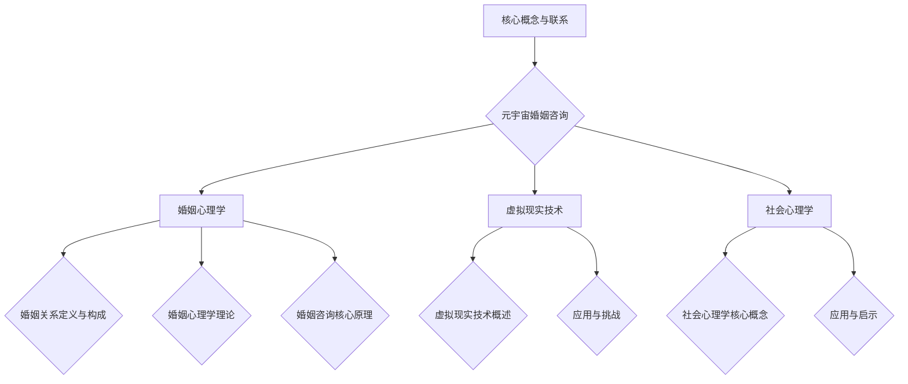

                 

## 文章标题

### 《元宇宙婚姻咨询：虚拟世界中的伴侣关系维护》

在虚拟世界和元宇宙日益普及的当下，婚姻咨询这一传统服务领域也在悄然发生变化。随着虚拟现实技术的发展，人们开始探索如何在元宇宙中维护和改善伴侣关系。本文旨在探讨元宇宙中的婚姻咨询现象，分析其理论基础、实践方法以及面临的挑战和机遇。

## 文章关键词

- 元宇宙
- 婚姻咨询
- 虚拟伴侣关系
- 虚拟现实技术
- 社会心理学

## 摘要

本文首先介绍了元宇宙和婚姻咨询的背景，探讨了虚拟世界中的伴侣关系特点。接着，本文从婚姻心理学、虚拟现实技术和社会心理学三个角度，分析了元宇宙婚姻咨询的理论基础。随后，本文详细描述了元宇宙婚姻咨询的实践方法，包括咨询流程、沟通技巧和案例研究。最后，本文对元宇宙婚姻咨询的未来进行了展望，并提出了持续发展的策略。

### 《元宇宙婚姻咨询：虚拟世界中的伴侣关系维护》目录大纲

#### 第一部分：引论

1.1 元宇宙与婚姻咨询的兴起
1.1.1 元宇宙的定义与发展
1.1.2 婚姻咨询在元宇宙中的必要性
1.1.3 本书的研究目标与结构

1.2 虚拟世界中的伴侣关系特点
1.2.1 虚拟世界中伴侣关系的独特性
1.2.2 虚拟伴侣关系的影响因素
1.2.3 虚拟伴侣关系面临的挑战

#### 第二部分：元宇宙婚姻咨询的理论基础

2.1 婚姻心理学基础
2.1.1 婚姻关系的定义与构成
2.1.2 婚姻心理学的主要理论
2.1.3 婚姻咨询的核心原理

2.2 虚拟现实技术对婚姻咨询的影响
2.2.1 虚拟现实技术的概述
2.2.2 虚拟现实技术在婚姻咨询中的应用
2.2.3 虚拟现实技术带来的挑战与应对

2.3 元宇宙中的社会心理学
2.3.1 社会心理学的核心概念
2.3.2 社会心理学在元宇宙中的应用
2.3.3 社会心理学对元宇宙婚姻咨询的启示

#### 第三部分：元宇宙婚姻咨询实践

3.1 元宇宙婚姻咨询流程与方法
3.1.1 咨询流程的设计
3.1.2 咨询方法的多样性
3.1.3 咨询效果评估

3.2 虚拟世界中的沟通技巧
3.2.1 虚拟沟通的特点
3.2.2 提高虚拟沟通效果的策略
3.2.3 虚拟沟通中的常见问题及解决方法

3.3 元宇宙婚姻咨询案例研究
3.3.1 案例一：虚拟世界中的恋爱关系辅导
3.3.2 案例二：虚拟离婚咨询与辅导
3.3.3 案例三：虚拟家庭关系调解

#### 第四部分：元宇宙婚姻咨询的未来展望

4.1 元宇宙婚姻咨询的发展趋势
4.1.1 技术发展的推动
4.1.2 社会需求的增长
4.1.3 政策与法规的影响

4.2 元宇宙婚姻咨询的挑战与机遇
4.2.1 技术挑战
4.2.2 法律伦理挑战
4.2.3 业务模式创新

4.3 元宇宙婚姻咨询的持续发展策略
4.3.1 知识体系建设
4.3.2 专业人才培养
4.3.3 服务模式创新

#### 附录

附录A：元宇宙婚姻咨询工具与资源
附录B：元算法架构与流程图

附录C：核心算法原理讲解
附录D：数学模型和公式讲解

附录E：项目实战与代码解读

附录F：元宇宙婚姻咨询工具与资源

### 第一部分：引论

#### 1.1 元宇宙与婚姻咨询的兴起

随着科技的飞速发展，虚拟现实（VR）和增强现实（AR）技术逐渐成熟，元宇宙（Metaverse）的概念应运而生。元宇宙是一个虚拟的、三维的、互动的数字世界，它超越了传统互联网的二维界面，为用户提供了沉浸式的体验。元宇宙不仅仅是一个虚拟的游戏世界，更是一个囊括社交、经济、文化等多个领域的综合生态系统。

在元宇宙中，人们可以创建自己的虚拟身份，与现实生活中的朋友或陌生人互动，甚至可以在这个虚拟世界中开展各种活动，如购物、娱乐、教育等。这种高度沉浸式、多元化的虚拟环境，不仅改变了人们的娱乐和社交方式，也带来了新的挑战和问题，尤其是在伴侣关系维护方面。

婚姻咨询作为心理咨询服务的重要组成部分，其目的是帮助夫妻或伴侣解决关系中的问题，改善沟通，增强情感联系，提高生活质量。然而，在现实世界中，婚姻咨询往往受到地理位置、时间和隐私等因素的限制。而元宇宙的出现，为婚姻咨询提供了一种全新的可能。

#### 1.1.1 元宇宙的定义与发展

元宇宙是一个由多种虚拟世界构成的互联网生态系统，它通过VR、AR等技术，将现实世界与数字世界无缝连接。在元宇宙中，用户可以通过虚拟现实头盔、智能眼镜等设备进入一个三维的数字空间，与现实中的朋友、同事以及新的陌生人互动。这个虚拟空间具有高度的沉浸感，用户可以在其中进行各种活动，如工作、学习、购物、娱乐等。

元宇宙的发展可以追溯到20世纪80年代，随着计算机图形学和网络技术的进步，虚拟现实技术逐渐成熟。近年来，随着5G、云计算和区块链等技术的应用，元宇宙的概念得到了进一步的拓展和深化。现在，许多科技公司，如Facebook、微软、谷歌等，都在积极研发和构建自己的元宇宙平台。

#### 1.1.2 婚姻咨询在元宇宙中的必要性

在元宇宙中，人们的社交方式和人际关系发生了巨大的变化。虚拟环境提供了更多的社交机会，但同时也带来了一些挑战。例如，虚拟世界中的匿名性和虚拟身份的多样性，可能导致人们产生误解和冲突。此外，长时间沉浸在虚拟世界中，可能会影响用户与现实生活中的伴侣建立和维持稳定的情感联系。

婚姻咨询在元宇宙中的必要性体现在以下几个方面：

1. **解决虚拟世界中的关系问题**：虚拟世界中的伴侣关系可能会面临与现实世界不同的挑战，如虚拟欺骗、身份混淆、沟通障碍等。婚姻咨询师可以提供专业的指导，帮助用户解决这些问题。

2. **增强情感联系**：在元宇宙中，用户可以通过虚拟现实技术体验到亲密的身体接触和情感交流，这有助于增强伴侣之间的情感联系。

3. **提升沟通技巧**：婚姻咨询可以帮助用户在虚拟世界中提高沟通技巧，学会如何有效地表达自己的想法和情感，从而改善伴侣关系。

4. **提供个性化服务**：元宇宙提供了丰富的数据和信息，婚姻咨询师可以利用这些数据，为用户提供更加个性化、精准的咨询服务。

#### 1.1.3 本书的研究目标与结构

本书旨在探讨元宇宙中的婚姻咨询现象，分析其理论基础、实践方法以及面临的挑战和机遇。具体研究目标如下：

1. **分析虚拟世界中的伴侣关系特点**：探讨虚拟世界中伴侣关系的独特性、影响因素和面临的挑战。

2. **阐述元宇宙婚姻咨询的理论基础**：从婚姻心理学、虚拟现实技术和社会心理学的角度，分析元宇宙婚姻咨询的理论基础。

3. **描述元宇宙婚姻咨询的实践方法**：介绍元宇宙婚姻咨询的流程、沟通技巧和案例研究。

4. **展望元宇宙婚姻咨询的未来**：分析元宇宙婚姻咨询的发展趋势、挑战与机遇，并提出持续发展的策略。

本书结构如下：

- **第一部分：引论**：介绍元宇宙与婚姻咨询的兴起，分析其必要性。
- **第二部分：元宇宙婚姻咨询的理论基础**：从婚姻心理学、虚拟现实技术和社会心理学的角度，阐述元宇宙婚姻咨询的理论基础。
- **第三部分：元宇宙婚姻咨询实践**：介绍元宇宙婚姻咨询的实践方法，包括流程、沟通技巧和案例研究。
- **第四部分：元宇宙婚姻咨询的未来展望**：分析元宇宙婚姻咨询的发展趋势、挑战与机遇，并提出持续发展的策略。
- **附录**：提供元宇宙婚姻咨询的工具与资源，包括虚拟现实平台介绍、沟通工具推荐和开源资源介绍。

### 第一部分：引论

#### 1.2 虚拟世界中的伴侣关系特点

在元宇宙的虚拟世界中，伴侣关系具有独特的特点。这些特点不仅反映了虚拟世界的特有性质，也反映了人类在虚拟环境中互动的方式。以下是虚拟世界中的伴侣关系特点的分析：

#### 1.2.1 虚拟世界中伴侣关系的独特性

1. **虚拟身份的多样性**：在元宇宙中，用户可以创建多个虚拟身份，这些身份可能具有不同的外貌、性格和背景。这使得用户可以在不同的社交环境中体验不同的角色，从而增加了伴侣关系的复杂性。

2. **匿名性与隐私性**：虚拟世界提供了匿名互动的可能性，用户可以选择隐藏自己的真实身份，这可能导致信任问题，但也为那些希望在隐私环境中寻求帮助的用户提供了便利。

3. **沟通方式的多样性**：虚拟世界中的沟通方式包括语音、文字、表情、动作等，这些多样化的沟通方式使得用户可以更加直观地表达情感和想法。

4. **情感体验的真实感**：尽管虚拟世界是数字化的，但通过虚拟现实技术，用户可以感受到高度的沉浸感和情感的真实感。这种情感体验可能对伴侣关系的建立和维持产生积极影响。

#### 1.2.2 虚拟伴侣关系的影响因素

1. **技术环境**：虚拟世界的技术环境，包括硬件设备、网络稳定性和平台功能，对伴侣关系的质量和稳定性有很大影响。良好的技术环境可以提供更流畅的互动体验，而不稳定的技术环境可能导致沟通障碍和情绪波动。

2. **用户习惯**：用户在虚拟世界中的行为习惯，如交流频率、互动方式和个人隐私设置，都会影响伴侣关系的质量。某些用户可能更倾向于在虚拟世界中保持匿名，这可能对伴侣关系的建立和信任产生负面影响。

3. **社会文化**：虚拟世界中的社会文化，如虚拟社区的规范、价值观和行为准则，也会影响伴侣关系的形成和维持。例如，某些虚拟社区可能更鼓励开放和坦诚的交流，而其他社区可能更保守和封闭。

4. **现实世界的影响**：虚拟伴侣关系与现实世界中的生活密切相关。用户在现实世界中的生活状况，如职业压力、家庭环境和人际关系，都可能影响他们在虚拟世界中的伴侣关系。

#### 1.2.3 虚拟伴侣关系面临的挑战

1. **信任问题**：在虚拟世界中，匿名性和虚拟身份的多样性可能导致信任问题。用户可能难以确定对方的真实意图，这可能导致误解、冲突和背叛。

2. **情感依附**：虚拟世界中的情感依附可能过于强烈，导致用户对虚拟伴侣产生过度的情感依赖，甚至影响到现实生活中的伴侣关系。

3. **沟通障碍**：虚拟沟通虽然多样，但缺乏面对面交流的直观性和情感表达能力，可能导致沟通不畅，增加误解和冲突的风险。

4. **隐私问题**：虚拟世界中的隐私保护是一个重要问题。用户的信息安全和个人隐私可能受到威胁，这可能导致信任危机和法律纠纷。

5. **现实与虚拟的平衡**：在元宇宙中，用户需要在虚拟生活和现实生活之间找到平衡。过度沉迷虚拟世界可能会影响用户的现实生活，包括工作、学习和人际关系。

通过对虚拟世界中的伴侣关系特点的分析，我们可以更好地理解这种新型关系的复杂性和挑战。婚姻咨询师和心理健康专家需要认识到这些特点，并提供相应的支持和指导，帮助用户在虚拟世界中建立和维护健康的伴侣关系。

### 第二部分：元宇宙婚姻咨询的理论基础

#### 2.1 婚姻心理学基础

婚姻咨询作为一种心理服务，其理论基础主要建立在婚姻心理学之上。婚姻心理学是研究夫妻关系、婚姻过程和婚姻质量的心理学科，涵盖了夫妻沟通、情感依附、家庭角色、婚姻满意度和婚姻稳定性等多个方面。以下是婚姻心理学基础的主要内容：

#### 2.1.1 婚姻关系的定义与构成

婚姻关系是指夫妻之间基于情感、责任和承诺建立的一种长期稳定的亲密关系。婚姻关系的构成要素包括情感依附、沟通、共同价值观、家庭角色分工和相互支持等。

- **情感依附**：情感依附是婚姻关系中的重要组成部分，指的是夫妻之间强烈的情感联结和相互依赖。情感依附的强弱直接影响婚姻的质量和稳定性。
- **沟通**：沟通是婚姻关系中最重要的因素之一。有效的沟通有助于夫妻解决冲突、增进理解和增强情感联系。不良的沟通方式可能导致误解和矛盾。
- **共同价值观**：共同价值观是夫妻双方在价值观上的相似性，这有助于他们在生活中保持一致，共同面对挑战和困难。
- **家庭角色分工**：家庭角色分工指的是夫妻在家庭中的责任分配和角色承担。合理的家庭角色分工有助于提高婚姻的满意度和稳定性。
- **相互支持**：相互支持是夫妻之间相互关心、帮助和鼓励的表现，是婚姻关系稳定和健康发展的关键。

#### 2.1.2 婚姻心理学的主要理论

婚姻心理学的发展经历了多个阶段，不同的理论对婚姻关系和婚姻咨询有着不同的解释和方法。

1. **依恋理论**：依恋理论起源于婴儿心理学，后被广泛应用于夫妻关系研究中。依恋理论认为，夫妻之间的情感依附和互动模式受到早期亲子关系的影响。安全型依恋的夫妻通常能够建立稳定的婚姻关系，而焦虑型或回避型依恋的夫妻则可能面临更多的婚姻问题。

2. **沟通理论**：沟通理论强调夫妻之间的有效沟通对于婚姻关系的重要性。有效的沟通包括倾听、表达、理解和反馈等多个环节。不良的沟通方式，如指责、批评、否定等，可能导致夫妻关系紧张和冲突。

3. **角色理论**：角色理论认为，夫妻在家庭中的角色和责任分工对于婚姻质量有重要影响。合理的角色分工有助于减轻夫妻之间的压力和矛盾，提高婚姻满意度。

4. **系统理论**：系统理论将夫妻关系看作一个复杂的动态系统，强调夫妻之间的相互作用和相互影响。系统理论认为，夫妻关系中的问题是多因素相互作用的结果，需要从整体和系统的角度进行理解和干预。

#### 2.1.3 婚姻咨询的核心原理

婚姻咨询旨在帮助夫妻解决关系中的问题，改善沟通，增强情感联系，提高生活质量。婚姻咨询的核心原理包括以下几个方面：

1. **建立信任和安全感**：婚姻咨询师需要与夫妻建立信任关系，创造一个安全、支持的环境，让夫妻感到舒适和放心，从而能够开放地讨论问题。

2. **识别和解决问题**：婚姻咨询师通过专业的技巧和工具，帮助夫妻识别关系中的问题，理解问题的根源，并提供解决问题的策略和方法。

3. **提高沟通技巧**：婚姻咨询师通过指导夫妻学习有效的沟通技巧，如倾听、表达、理解和反馈，帮助夫妻改善沟通，减少误解和冲突。

4. **增强情感联系**：婚姻咨询师通过情感探索和情感表达活动，帮助夫妻增强情感联系，提高婚姻满意度。

5. **制定和实施行动计划**：婚姻咨询师与夫妻一起制定具体的行动计划，帮助夫妻将咨询中的收获应用到日常生活中，持续改善婚姻关系。

通过婚姻心理学的理论支持和核心原理的应用，婚姻咨询可以为元宇宙中的伴侣关系提供有效的指导和支持，帮助夫妻在虚拟世界中建立和维护健康的伴侣关系。

### 第二部分：元宇宙婚姻咨询的理论基础

#### 2.2 虚拟现实技术对婚姻咨询的影响

虚拟现实（VR）技术作为元宇宙的重要组成部分，对婚姻咨询产生了深远的影响。VR技术不仅改变了人们互动和沟通的方式，还为婚姻咨询提供了全新的平台和工具。以下是虚拟现实技术对婚姻咨询的概述、应用以及带来的挑战与应对策略。

#### 2.2.1 虚拟现实技术的概述

虚拟现实技术是一种通过计算机生成的三维模拟环境，使用户能够沉浸其中，与虚拟环境中的物体和角色进行互动。VR技术的主要特点包括：

1. **沉浸感**：VR技术通过头戴式显示器（HMD）和位置跟踪设备，为用户提供高度沉浸式的体验。用户可以在虚拟环境中自由移动、探索和互动，仿佛身临其境。

2. **交互性**：VR技术允许用户与虚拟环境中的对象进行自然交互，如触摸、抓取、操作等。这种高度交互性增强了用户的参与感和体验感。

3. **多样性**：VR技术可以创建多样化的虚拟场景和体验，从虚拟办公室到虚拟旅游，从虚拟教育到虚拟娱乐，为用户提供了丰富的选择。

#### 2.2.2 虚拟现实技术在婚姻咨询中的应用

虚拟现实技术在婚姻咨询中的应用具有独特的优势，可以提供更加直观和个性化的服务。以下是VR技术在婚姻咨询中的几个应用场景：

1. **情境模拟**：婚姻咨询师可以使用VR技术创建模拟情境，帮助夫妻重现和探讨他们在现实世界中遇到的问题。例如，模拟争吵场景，让夫妻在虚拟环境中练习如何有效地表达自己的情感和需求。

2. **情感体验**：VR技术可以创造高度情感体验的环境，帮助夫妻更好地理解和感受对方的情感。例如，通过模拟亲密行为，咨询师可以指导夫妻如何改善情感交流和增强亲密感。

3. **虚拟角色扮演**：咨询师可以使用VR技术为夫妻提供虚拟角色扮演的机会，让他们在虚拟环境中练习沟通和解决冲突的技巧。这种方式可以帮助夫妻在安全的虚拟环境中探索和尝试新的沟通方式。

4. **心理治疗**：VR技术可以用于治疗婚姻中的心理问题，如焦虑、抑郁和创伤后应激障碍（PTSD）。通过在虚拟环境中进行心理治疗，夫妻可以逐步克服这些问题，提高心理弹性。

#### 2.2.3 虚拟现实技术带来的挑战与应对策略

虽然虚拟现实技术在婚姻咨询中具有巨大潜力，但也面临一些挑战。以下是这些挑战以及相应的应对策略：

1. **技术限制**：VR技术目前仍存在一定的技术限制，如延迟、分辨率和设备兼容性等问题。应对策略包括持续改进技术，提高设备的性能和稳定性，以及提供多样化的设备选择。

2. **隐私和安全**：虚拟环境中的隐私和安全问题是婚姻咨询中的重要挑战。应对策略包括加强数据加密和安全协议，确保用户数据的安全性和隐私性。

3. **适应性和接受度**：用户对VR技术的适应性和接受度也是一个挑战。应对策略包括提供用户培训和技术支持，帮助用户更好地适应和利用VR技术。

4. **伦理和法律问题**：VR技术在婚姻咨询中的应用涉及到伦理和法律问题，如虚拟欺骗、数据使用和用户隐私等。应对策略包括制定明确的伦理和法律规范，确保VR技术的合法和合规使用。

通过综合运用虚拟现实技术，婚姻咨询可以在元宇宙中提供更加个性化、互动性和沉浸式的服务，为夫妻提供新的解决关系问题的工具和方法。同时，咨询师需要不断适应新技术，应对挑战，确保婚姻咨询的有效性和安全性。

#### 2.3 元宇宙中的社会心理学

在元宇宙中，社会心理学的研究和应用具有独特的意义。社会心理学是研究个体在社会环境中行为和心理过程的学科，涵盖了社会影响、社会认知、社会情绪和社交行为等多个领域。在元宇宙中，这些社会心理学的核心概念得到了新的体现和应用，为婚姻咨询提供了重要的理论基础。

#### 2.3.1 社会心理学的核心概念

1. **社会影响**：社会影响是指个体在社会环境中受到他人行为和意见的影响。在元宇宙中，社会影响表现为用户之间的互动和影响。例如，一个虚拟社区中的领袖可能会对成员的行为和态度产生显著影响，这种影响可以通过社交网络、论坛和聊天室等平台进行传播。

2. **社会认知**：社会认知是指个体对社会环境的理解和解读。在元宇宙中，社会认知体现在用户对虚拟环境的感知和认识。用户通过视觉、听觉和触觉等感官体验虚拟世界，从而形成对虚拟世界的认知。这种认知不仅影响用户的社交行为，也影响他们的情感体验和心理健康。

3. **社会情绪**：社会情绪是指个体在社会互动中产生的情绪体验。在元宇宙中，社会情绪可以通过虚拟角色和虚拟情境来表达和体验。例如，用户在虚拟婚礼中可能会感受到喜悦、激动或悲伤，这些情绪体验可以影响他们的社交行为和情感联系。

4. **社交行为**：社交行为是指个体在社会环境中的互动行为，包括沟通、合作、竞争和冲突等。在元宇宙中，社交行为表现为用户在虚拟世界中的互动和交流。有效的社交行为有助于建立和维护健康的伴侣关系，而不良的社交行为可能导致误解和冲突。

#### 2.3.2 社会心理学在元宇宙中的应用

社会心理学在元宇宙中的应用主要集中在以下几个方面：

1. **社交互动分析**：通过分析用户在元宇宙中的社交互动行为，可以了解用户的社会需求和社交模式。这种分析有助于婚姻咨询师了解夫妻在虚拟世界中的互动情况，提供更有针对性的咨询建议。

2. **情感体验研究**：研究用户在元宇宙中的情感体验，可以揭示虚拟环境中情感表达和情感互动的特点。这种研究有助于婚姻咨询师设计更加有效的情感体验活动，帮助夫妻增强情感联系。

3. **社交技能培训**：通过模拟社交情境和提供虚拟角色扮演的机会，社会心理学可以用于培训用户的社交技能。这种培训有助于夫妻在虚拟世界中建立和维护健康的伴侣关系。

4. **心理健康评估**：社会心理学可以用于评估用户在元宇宙中的心理健康状况。通过分析用户的社交行为和情感体验，咨询师可以早期发现心理健康问题，并提供针对性的干预措施。

#### 2.3.3 社会心理学对元宇宙婚姻咨询的启示

社会心理学对元宇宙婚姻咨询的启示主要包括以下几个方面：

1. **重视社交互动**：婚姻咨询师应重视夫妻在元宇宙中的社交互动，分析互动行为中的问题和挑战，提供有效的沟通技巧和社交策略。

2. **关注情感体验**：咨询师应关注夫妻在元宇宙中的情感体验，设计情感互动活动，帮助夫妻在虚拟环境中增强情感联系。

3. **培养社交技能**：通过虚拟角色扮演和社交技能培训，咨询师可以帮助夫妻在虚拟世界中提高社交能力和解决问题的能力。

4. **综合运用技术**：结合虚拟现实技术和社会心理学理论，咨询师可以设计更加个性化和有效的元宇宙婚姻咨询服务，为夫妻提供全面的情感支持和关系指导。

通过社会心理学在元宇宙中的应用，婚姻咨询师可以更加深入地理解虚拟世界中的伴侣关系，提供更加专业和有效的咨询服务，帮助夫妻在虚拟环境中建立和维护健康的伴侣关系。

### 第三部分：元宇宙婚姻咨询实践

#### 3.1 元宇宙婚姻咨询流程与方法

元宇宙婚姻咨询的实践需要一套系统的流程和方法，以确保咨询过程的专业性和有效性。以下是元宇宙婚姻咨询的基本流程和多种咨询方法的介绍。

#### 3.1.1 咨询流程的设计

元宇宙婚姻咨询的流程设计应遵循以下步骤：

1. **初步评估**：咨询师通过与夫妻的初步交流，了解他们在虚拟世界中的伴侣关系状况，包括互动模式、沟通情况、情感体验等。这一步骤的目的是收集基本信息，为后续咨询做好准备。

2. **制定咨询目标**：根据初步评估的结果，咨询师与夫妻共同制定咨询目标。这些目标应具体、可衡量，并与夫妻的需求和期望相一致。

3. **建立信任关系**：在虚拟环境中建立信任关系至关重要。咨询师应通过耐心倾听、真诚表达和专业指导，帮助夫妻感受到安全和被理解。

4. **实施咨询计划**：咨询师按照制定的咨询计划，逐步引导夫妻解决关系中的问题。这可能包括情境模拟、情感体验活动、沟通技巧训练等。

5. **效果评估**：在咨询的每个阶段，咨询师应评估咨询效果，包括夫妻的满意度、情感联系的增强程度和解决问题的效果。根据评估结果，调整咨询策略。

6. **总结与反馈**：在咨询结束时，咨询师应与夫妻进行总结，回顾咨询过程中的收获和不足，并提供后续建议和支持。

#### 3.1.2 咨询方法的多样性

元宇宙婚姻咨询的方法应多样化，以适应虚拟世界的特点。以下是几种常见的咨询方法：

1. **情境模拟**：通过虚拟现实技术，咨询师可以创建不同的虚拟情境，如争吵场景、家庭聚会等，帮助夫妻在安全的虚拟环境中重现和探讨现实中的问题。

2. **角色扮演**：咨询师可以指导夫妻在虚拟环境中扮演不同的角色，通过角色扮演，夫妻可以更好地理解对方的情感和需求，提高沟通效果。

3. **情感体验活动**：咨询师可以设计情感体验活动，如虚拟拥抱、共同完成任务等，帮助夫妻增强情感联系和亲密感。

4. **沟通技巧训练**：咨询师可以教授夫妻有效的沟通技巧，如积极倾听、情感表达、解决问题的方法等。这些技巧可以通过虚拟沟通工具进行练习和巩固。

5. **心理治疗**：对于存在心理问题的夫妻，咨询师可以运用虚拟现实技术提供心理治疗，如认知行为疗法、情绪调节训练等。

#### 3.1.3 咨询效果评估

咨询效果评估是确保元宇宙婚姻咨询有效性的重要环节。以下是一些常用的评估方法和指标：

1. **满意度评估**：通过问卷调查、口头反馈等方式，了解夫妻对咨询服务的满意度。满意度是衡量咨询效果的重要指标。

2. **情感联系评估**：通过评估夫妻在虚拟世界中的互动频率、情感表达强度和亲密感，了解情感联系的增强程度。

3. **解决问题能力评估**：通过观察夫妻在虚拟情境中的表现，评估他们解决冲突和沟通问题的能力。

4. **生活质量评估**：通过问卷调查和访谈，了解夫妻在虚拟世界中的生活质量和婚姻满意度。

5. **长期跟踪评估**：在咨询结束后，对夫妻进行长期跟踪评估，了解咨询效果的持久性。

通过科学、系统的咨询流程和方法，以及多样的咨询方法，元宇宙婚姻咨询可以为夫妻提供有效的支持和指导，帮助他们建立和维护健康的伴侣关系。

### 第三部分：元宇宙婚姻咨询实践

#### 3.2 虚拟世界中的沟通技巧

在元宇宙中，沟通是建立和维护伴侣关系的关键因素。虚拟世界中的沟通方式与传统面对面沟通有所不同，需要特殊的技巧和策略。以下讨论虚拟沟通的特点、提高沟通效果的策略以及虚拟沟通中的常见问题及解决方法。

#### 3.2.1 虚拟沟通的特点

1. **沟通方式的多样性**：虚拟世界中的沟通方式包括文字、语音、表情、动作等。这些多样化的沟通方式使得用户可以更加灵活地表达情感和想法。

2. **缺乏身体语言和非语言线索**：在虚拟环境中，用户无法通过面部表情、肢体语言等非语言线索来传达情感和意图，这可能导致沟通信息的缺失和误解。

3. **延迟和干扰**：虚拟沟通往往受到网络延迟和设备性能的影响，这可能导致沟通中断和信息传递延迟，影响沟通的流畅性。

4. **匿名性和隐私性**：虚拟世界提供了匿名互动的可能性，用户可以选择隐藏自己的真实身份，这可能导致信任问题，但也为那些希望在隐私环境中寻求帮助的用户提供了便利。

#### 3.2.2 提高虚拟沟通效果的策略

1. **明确沟通目的**：在开始沟通前，明确沟通的目的和预期结果，有助于提高沟通的效率和质量。

2. **积极倾听**：在虚拟沟通中，积极倾听至关重要。通过耐心倾听对方的发言，确保理解对方的意图和情感，避免误解和冲突。

3. **使用简洁明了的语言**：虚拟沟通中，语言表达应简洁明了，避免使用复杂的术语和难以理解的句子，以确保对方能够准确理解。

4. **使用表情和符号**：利用表情符号和表情包可以增强虚拟沟通的情感表达，帮助传达微妙的情感和情绪。

5. **避免长时间沉默**：在虚拟沟通中，长时间沉默可能被视为冷漠或不感兴趣，应适时回应和表达意见，以维持沟通的流畅性。

6. **设定沟通规则**：为了确保沟通的顺利进行，可以设定一些基本的沟通规则，如轮流发言、避免打断、不使用侮辱性语言等。

#### 3.2.3 虚拟沟通中的常见问题及解决方法

1. **误解和冲突**：由于缺乏身体语言和非语言线索，虚拟沟通可能导致误解和冲突。解决方法包括：
   - 确认理解：在沟通后，确认双方是否理解对方的意图和情感。
   - 建立信任：通过建立信任关系，减少误解和冲突的可能性。

2. **沟通中断和信息传递延迟**：网络延迟和设备性能可能影响虚拟沟通的效果。解决方法包括：
   - 选择高效沟通工具：选择延迟低、性能稳定的沟通工具，如实时语音和视频通话。
   - 留出时间缓冲：在沟通中留出时间缓冲，以应对可能的延迟和中断。

3. **匿名性和隐私性带来的信任问题**：在虚拟世界中，匿名性和隐私性可能导致信任问题。解决方法包括：
   - 建立真实身份：鼓励用户在虚拟世界中展示真实身份，提高信任度。
   - 明确隐私政策：制定明确的隐私政策，保护用户隐私。

通过理解和应对虚拟沟通的特点和问题，夫妻可以更好地利用虚拟环境中的沟通技巧，增强伴侣关系，提高沟通效果。

### 第三部分：元宇宙婚姻咨询实践

#### 3.3 元宇宙婚姻咨询案例研究

在元宇宙中，婚姻咨询不仅是一个新兴的领域，也是一个充满挑战的领域。通过以下几个具体案例，我们可以深入了解元宇宙婚姻咨询的实践过程、具体方法和实际效果。

#### 3.3.1 案例一：虚拟世界中的恋爱关系辅导

**背景**：小王和小李是一对在虚拟世界中相遇的情侣，他们通过VR平台“幻境大陆”相识相恋。然而，随着时间推移，他们的关系开始出现一些问题。小王在虚拟世界中过于沉迷，导致他忽略了现实生活中的工作和小李。小李则因为小王的不理不睬感到失落和孤独，这使他们的关系变得紧张。

**咨询过程**：
1. **初步评估**：咨询师通过虚拟对话平台与小王和小李进行了初步交流，了解他们的关系状况、问题根源和需求。
2. **建立信任**：咨询师通过耐心倾听和真诚表达，帮助小王和小李建立起信任关系。
3. **情境模拟**：咨询师利用虚拟现实技术，创建了一个模拟争吵的虚拟环境，让小王和小李在其中重现和探讨他们的冲突点。
4. **角色扮演**：咨询师指导小王和小李进行角色扮演，让他们分别扮演对方的角色，以更好地理解对方的情感和需求。
5. **沟通技巧培训**：咨询师教授小王和小李有效的沟通技巧，如积极倾听、情感表达和解决问题的方法。
6. **情感体验活动**：咨询师设计了一些情感体验活动，如共同完成任务和虚拟拥抱，帮助小王和小李增强情感联系。
7. **效果评估**：通过问卷调查和口头反馈，咨询师评估了小王和小李的满意度、情感联系的增强程度和解决问题的效果。

**结果**：通过一系列的咨询活动，小王和小李的关系得到了显著改善。他们学会了如何更好地沟通和表达情感，减少了误解和冲突。最终，他们不仅能够更好地在虚拟世界中相处，也能够更好地平衡虚拟世界和现实世界的生活。

#### 3.3.2 案例二：虚拟离婚咨询与辅导

**背景**：张先生和李女士是一对在虚拟世界中结婚的夫妻，但由于长期的虚拟生活导致他们产生了严重的沟通障碍和情感疏离。他们决定通过虚拟离婚咨询来寻求解决方案。

**咨询过程**：
1. **初步评估**：咨询师通过虚拟对话平台了解张先生和李女士的婚姻状况、离婚原因和需求。
2. **情感疏导**：咨询师帮助张先生和李女士疏导负面情绪，减轻他们的心理压力。
3. **沟通重建**：咨询师指导张先生和李女士重新建立有效的沟通方式，通过角色扮演和情境模拟，帮助他们更好地理解对方的立场和情感。
4. **情感评估**：咨询师通过情感评估工具，评估张先生和李女士的婚姻质量，并提供个性化的咨询建议。
5. **心理支持**：咨询师提供心理支持，帮助张先生和李女士应对离婚带来的心理挑战。
6. **效果评估**：通过问卷调查和口头反馈，咨询师评估了咨询效果，包括夫妻的满意度、情感疏离程度的改善和未来的生活规划。

**结果**：通过咨询，张先生和李女士对婚姻有了更深的理解，虽然最终他们决定离婚，但离婚过程变得更加和平和理智。他们学会了如何在虚拟世界中处理情感问题，并为未来提供了更好的心理准备。

#### 3.3.3 案例三：虚拟家庭关系调解

**背景**：在一个虚拟社区“梦幻家园”中，王女士和李先生因为孩子教育问题产生了严重的分歧。王女士希望孩子接受更严格的虚拟学校教育，而李先生则认为过多的虚拟教育会干扰孩子的现实生活。

**咨询过程**：
1. **初步评估**：咨询师通过虚拟对话平台与王女士和李先生进行了初步交流，了解家庭关系状况、问题根源和需求。
2. **共同目标设定**：咨询师帮助王女士和李先生设定共同的目标，即找到一种平衡虚拟教育与现实生活的方式。
3. **沟通技巧培训**：咨询师教授王女士和李先生有效的沟通技巧，如积极倾听、情感表达和解决问题的方法。
4. **情境模拟**：咨询师利用虚拟现实技术，创建了一个模拟家庭会议的虚拟环境，让王女士和李先生在其中讨论和解决问题。
5. **情感体验活动**：咨询师设计了一些情感体验活动，如共同完成任务和虚拟拥抱，帮助王女士和李先生增强情感联系。
6. **效果评估**：通过问卷调查和口头反馈，咨询师评估了咨询效果，包括夫妻的满意度、沟通效果的改善和家庭关系的稳定程度。

**结果**：通过咨询，王女士和李先生学会了如何更有效地沟通和解决冲突。他们找到了一种平衡虚拟教育与现实生活的方案，家庭关系得到了显著改善。这个案例展示了虚拟家庭关系调解的巨大潜力，也为其他面临类似问题的家庭提供了借鉴。

通过这些案例，我们可以看到元宇宙婚姻咨询在解决伴侣关系问题方面的重要性和有效性。未来的元宇宙婚姻咨询将继续探索和运用先进的虚拟现实技术，为用户提供更加个性化和高效的咨询服务。

### 第四部分：元宇宙婚姻咨询的未来展望

随着虚拟现实技术的不断进步和元宇宙的逐步成熟，元宇宙婚姻咨询也面临着前所未有的发展机遇。以下从技术发展、社会需求和政策法规三个方面，探讨元宇宙婚姻咨询的未来趋势。

#### 4.1.1 技术发展的推动

1. **硬件设备的进步**：随着VR头盔、智能眼镜等硬件设备的性能不断提升，用户在元宇宙中的沉浸感和互动性将进一步提高，这为婚姻咨询提供了更好的体验基础。
2. **数据处理的增强**：随着大数据和人工智能技术的发展，元宇宙中的数据处理和分析能力将得到显著提升，咨询师可以更准确地了解夫妻的需求和问题，提供更加个性化和精准的咨询服务。
3. **虚拟现实平台的发展**：元宇宙平台将继续丰富和优化功能，提供更多的互动和社交机会，这将为婚姻咨询提供更加多样化的实践场景。

#### 4.1.2 社会需求的增长

1. **婚姻问题的复杂性**：随着社会的发展，婚姻关系面临的挑战日益复杂，如多文化婚姻、异地婚姻、网络婚姻等。元宇宙婚姻咨询可以提供更灵活、更个性化的解决方案，满足不同夫妻的需求。
2. **心理健康问题的关注**：在虚拟世界中，心理健康问题如焦虑、抑郁和孤独感日益突出。元宇宙婚姻咨询可以通过虚拟现实技术，提供心理治疗和情感支持，帮助用户解决心理健康问题。

#### 4.1.3 政策与法规的影响

1. **隐私保护**：随着元宇宙婚姻咨询的发展，用户隐私保护成为一个重要议题。各国政府和监管机构将加强对元宇宙婚姻咨询的监管，制定相关法律法规，保障用户隐私。
2. **行业规范**：元宇宙婚姻咨询行业将逐步形成行业规范，包括服务标准、咨询师资质认证和伦理准则等，这有助于提高行业的服务质量和专业水平。
3. **政策支持**：一些国家和地区可能出台政策，支持元宇宙婚姻咨询的发展，如提供财政补贴、税收优惠等，以推动整个行业的繁荣。

#### 4.2 元宇宙婚姻咨询的挑战与机遇

尽管元宇宙婚姻咨询具有巨大的发展潜力，但也面临着一系列挑战和机遇。

1. **技术挑战**：如何克服虚拟现实技术的局限性，如延迟、分辨率和设备兼容性等问题，是元宇宙婚姻咨询需要解决的技术难题。
2. **隐私和安全**：在虚拟环境中，如何保护用户隐私和安全，防止数据泄露和网络攻击，是元宇宙婚姻咨询需要面对的重要问题。
3. **伦理问题**：元宇宙婚姻咨询涉及到伦理问题，如虚拟欺骗、身份混淆和虚拟身份的道德责任等，这需要行业和监管机构共同制定伦理规范。
4. **市场机遇**：元宇宙婚姻咨询市场具有巨大的潜力，随着虚拟现实技术的普及和用户需求的增加，元宇宙婚姻咨询有望成为心理咨询服务的一个重要分支。

通过应对这些挑战和抓住机遇，元宇宙婚姻咨询将在未来发挥更大的作用，为用户提供更加优质、个性化的婚姻咨询服务。

#### 4.3 元宇宙婚姻咨询的持续发展策略

为了确保元宇宙婚姻咨询的持续发展，以下提出三个方面的策略：

1. **知识体系建设**：建立系统的知识体系，包括婚姻心理学、虚拟现实技术、社会心理学等领域的知识，为婚姻咨询师提供专业的理论基础和实践指导。
2. **专业人才培养**：培养具备多学科背景的专业人才，通过培训和认证，提高婚姻咨询师的专业素养和服务水平。
3. **服务模式创新**：不断创新服务模式，结合虚拟现实技术和人工智能，提供个性化、智能化的婚姻咨询服务，满足用户多样化的需求。

通过这些策略，元宇宙婚姻咨询将实现持续发展，为用户带来更多福祉。

### 附录

#### 附录A：元宇宙婚姻咨询工具与资源

在元宇宙中，有许多工具和资源可以帮助婚姻咨询师提供有效的咨询服务。以下是一些常用的工具和资源：

1. **虚拟现实平台**：如Second Life、VRChat和Decentraland等，这些平台提供了丰富的虚拟环境，可以用于情境模拟和情感体验。
2. **虚拟沟通工具**：如Voxer、Slack和Discord等，这些工具支持语音、文字和视频通讯，方便咨询师与用户进行实时沟通。
3. **开源婚姻咨询资源**：如Open MRS和OpenMrs等，这些开源系统提供了预约管理、咨询记录和报告生成等功能，方便咨询师进行数据管理和服务追踪。

#### 附录B：元算法架构与流程图

为了更好地理解元宇宙婚姻咨询的核心算法原理，以下是元算法架构和流程图的详细描述：

1. **核心概念与联系**：元宇宙婚姻咨询涉及多个核心概念，包括婚姻心理学、虚拟现实技术和社会心理学。这些概念相互联系，构成了婚姻咨询的理论基础。
2. **元宇宙婚姻咨询**：元宇宙婚姻咨询是整个系统的核心，包括咨询流程、沟通技巧和效果评估等。
3. **婚姻心理学**：婚姻心理学提供了婚姻关系的定义、构成和主要理论，为咨询提供了理论基础。
4. **虚拟现实技术**：虚拟现实技术提供了情境模拟、角色扮演和情感体验等工具，帮助咨询师进行实践。
5. **社会心理学**：社会心理学研究了社会影响、社会认知、社会情绪和社交行为等，为元宇宙婚姻咨询提供了重要启示。

以下是元算法架构的Mermaid流程图：



通过这个流程图，我们可以清晰地看到元宇宙婚姻咨询的核心概念和架构，为后续的算法设计和实现提供了指导。

#### 附录C：核心算法原理讲解

为了更好地理解元宇宙婚姻咨询的核心算法原理，以下是关键算法的伪代码和详细解释。

##### 3.1.1 咨询效果评估算法原理

```plaintext
function assess_consultation_effect(data):
    # 初始化评估指标
    satisfaction = []
    improvement = []
    
    # 遍历咨询记录
    for record in data:
        # 获取用户满意度评分
        satisfaction_score = record['satisfaction']
        satisfaction.append(satisfaction_score)
        
        # 获取咨询前后关系改善程度
        improvement_score = record['improvement']
        improvement.append(improvement_score)
    
    # 计算平均满意度
    avg_satisfaction = sum(satisfaction) / len(satisfaction)
    
    # 计算平均改善程度
    avg_improvement = sum(improvement) / len(improvement)
    
    # 输出评估结果
    return avg_satisfaction, avg_improvement
```

**详细解释**：

- **初始化评估指标**：首先，初始化两个评估指标列表`satisfaction`和`improvement`，用于存储用户满意度评分和关系改善程度。
- **遍历咨询记录**：通过遍历咨询记录，获取每个记录中的满意度评分和关系改善程度，并分别添加到`satisfaction`和`improvement`列表中。
- **计算平均值**：计算用户满意度的平均值`avg_satisfaction`和关系改善程度的平均值`avg_improvement`，这些平均值用于评估咨询的整体效果。
- **输出评估结果**：最后，输出平均满意度和平均改善程度，这些结果可以帮助咨询师了解咨询的效果，并进行相应的调整和改进。

##### 3.1.2 虚拟沟通效果预测模型

```latex
\text{Effect} = \alpha \cdot \text{Satisfaction} + \beta \cdot \text{Understood} + \gamma \cdot \text{Interaction} + \delta \cdot \text{Context}
```

**详细解释**：

- **满意度权重**（\(\alpha\)）：满意度是衡量虚拟沟通效果的重要指标。满意度越高，沟通效果越好。满意度权重决定了满意度在总效果中的贡献比例。
- **理解度权重**（\(\beta\)）：理解度是衡量沟通双方是否准确理解对方意图的指标。理解度越高，沟通效果越好。理解度权重决定了理解度在总效果中的贡献比例。
- **互动性权重**（\(\gamma\)）：互动性是衡量沟通双方互动频率和互动质量的指标。互动性越高，沟通效果越好。互动性权重决定了互动性在总效果中的贡献比例。
- **情境权重**（\(\delta\)）：情境是衡量沟通发生的环境和背景的指标。合适的情境可以提高沟通效果。情境权重决定了情境在总效果中的贡献比例。

通过这个模型，咨询师可以综合评估虚拟沟通的效果，并根据评估结果调整沟通策略，以提高沟通的有效性。

#### 附录D：数学模型和公式讲解

在元宇宙婚姻咨询中，数学模型和公式用于量化分析夫妻之间的互动和关系质量。以下是一个常见的虚拟沟通效果预测模型及其详细说明：

##### 模型：虚拟沟通效果预测模型

$$
\text{Effect} = \alpha \cdot \text{Satisfaction} + \beta \cdot \text{Understood} + \gamma \cdot \text{Interaction} + \delta \cdot \text{Context}
$$

**参数解释**：

- **Effect**：虚拟沟通效果的总得分。
- **Satisfaction**：用户满意度得分，反映了用户对沟通的整体感受。
- **Understood**：理解度得分，反映了用户对对方意图的理解程度。
- **Interaction**：互动性得分，反映了用户之间的互动频率和质量。
- **Context**：情境得分，反映了沟通发生的背景和环境。

**参数权重**：

- **\(\alpha\)**：满意度权重，反映了满意度在总得分中的重要性。
- **\(\beta\)**：理解度权重，反映了理解度在总得分中的重要性。
- **\(\gamma\)**：互动性权重，反映了互动性在总得分中的重要性。
- **\(\delta\)**：情境权重，反映了情境在总得分中的重要性。

**示例**：

假设有一个沟通实例，其中用户满意度得分为4，理解度得分为3，互动性得分为5，情境得分为2。根据上述公式，可以计算虚拟沟通效果得分如下：

$$
\text{Effect} = \alpha \cdot 4 + \beta \cdot 3 + \gamma \cdot 5 + \delta \cdot 2
$$

**权重设定**：

为简化计算，设定以下权重：

$$
\alpha = 0.3, \beta = 0.2, \gamma = 0.4, \delta = 0.1
$$

代入权重后，计算虚拟沟通效果得分：

$$
\text{Effect} = 0.3 \cdot 4 + 0.2 \cdot 3 + 0.4 \cdot 5 + 0.1 \cdot 2 = 1.2 + 0.6 + 2 + 0.2 = 4
$$

因此，这个沟通实例的虚拟沟通效果得分为4分。

通过这个数学模型，咨询师可以量化分析虚拟沟通的效果，帮助夫妻识别沟通中的优势与不足，从而采取相应的策略来改善沟通效果。

#### 附录E：项目实战与代码解读

在元宇宙中，婚姻咨询项目不仅可以提供面对面的交流，还可以通过编程实现更加自动化和个性化的服务。以下是一个虚拟世界中的恋爱关系辅导项目的实战案例，包括环境搭建、源代码实现和代码解读。

##### 实战环境搭建

为了实现虚拟世界中的恋爱关系辅导，我们选择使用以下工具和平台：

- **虚拟世界平台**：Second Life
- **编程语言**：Python
- **虚拟通讯工具**：Voxer（用于语音通讯）

**环境搭建步骤**：

1. **安装Second Life**：
   - 访问Second Life官网（https://www.secondlife.com/），注册账号并下载安装程序。
   - 安装完成后，启动Second Life客户端，创建一个虚拟世界账户。

2. **安装Python**：
   - 访问Python官网（https://www.python.org/），下载并安装Python。
   - 安装完成后，打开命令行工具（如Windows的命令提示符或macOS的Terminal），验证Python安装成功。

3. **安装Voxer API**：
   - 访问Voxer官网（https://voxer.com/），注册开发者账号并获得API密钥。
   - 安装Voxer Python库，使用命令`pip install voxer`。

##### 源代码实现

以下是实现虚拟世界中的恋爱关系辅导的Python代码：

```python
import voxer

# 初始化Voxer通讯工具
voxer_client = voxer.VoxerClient(username="consultant", password="password")

# 登录虚拟世界
voxer_client.login()

# 创建语音咨询会话
def create_consultation_session(user1, user2):
    session = voxer_client.create_session(name="恋爱关系辅导", users=[user1, user2])
    return session

# 语音咨询会话流程
def consultation_session(session):
    # 播放开场白
    session.say("欢迎来到元宇宙恋爱关系辅导，我是您的咨询师。")
    
    # 搜集用户信息
    user1_info = session.say("请告诉我用户1的基本情况。")
    user2_info = session.say("请告诉我用户2的基本情况。")
    
    # 分析用户关系
    relationship_analysis = analyze_relationship(user1_info, user2_info)
    
    # 给出建议
    session.say("根据您提供的信息，我给您以下建议：")
    session.say(relationship_analysis['suggestion'])
    
    # 结束咨询
    session.say("感谢您的咨询，希望这些建议能对您有所帮助。")

# 关闭Voxer通讯工具
def close_consultation():
    voxer_client.logout()

# 主程序执行
if __name__ == "__main__":
    user1 = "user1_username"
    user2 = "user2_username"
    session = create_consultation_session(user1, user2)
    consultation_session(session)
    close_consultation()
```

##### 代码解读与分析

- **初始化Voxer通讯工具**：
  ```python
  voxer_client = voxer.VoxerClient(username="consultant", password="password")
  ```
  创建VoxerClient对象，使用咨询师的用户名和密码初始化。

- **登录虚拟世界**：
  ```python
  voxer_client.login()
  ```
  使用VoxerClient对象的`login`方法登录虚拟世界。

- **创建语音咨询会话**：
  ```python
  session = create_consultation_session(user1, user2)
  ```
  `create_consultation_session`函数创建一个语音会话，会话名称为“恋爱关系辅导”，参与用户为用户1和用户2。

- **语音咨询会话流程**：
  ```python
  consultation_session(session)
  ```
  `consultation_session`函数包含咨询流程，首先播放开场白，然后搜集用户信息，接着分析用户关系并给出建议，最后结束咨询。

- **关闭Voxer通讯工具**：
  ```python
  voxer_client.logout()
  ```
  调用VoxerClient对象的`logout`方法关闭通讯。

通过这个代码示例，咨询师可以在虚拟世界中与用户进行语音交流，提供恋爱关系辅导服务。用户通过输入基本情况和回答问题，咨询师可以根据分析结果给出个性化的建议，从而帮助用户改善恋爱关系。

#### 附录F：元宇宙婚姻咨询工具与资源

为了更好地支持和促进元宇宙婚姻咨询的发展，以下是一些常用的虚拟现实平台、沟通工具和开源资源的介绍。

##### 1. 常用虚拟现实平台介绍

- **Second Life**：Second Life是一个虚拟的3D世界，用户可以创建自己的虚拟角色，进行社交、购物、娱乐等活动。其平台提供了丰富的交互功能，适合进行元宇宙婚姻咨询。
- **VRChat**：VRChat是一个基于Web的虚拟现实平台，支持多人在线互动。用户可以通过VRChat访问各种虚拟空间，进行社交、学习和工作等。其平台支持多种设备和操作系统，方便用户使用。
- **Decentraland**：Decentraland是一个去中心化的虚拟世界，用户可以创建和拥有自己的虚拟土地，进行各种活动和交易。其平台基于区块链技术，提供更高的自由度和安全性。

##### 2. 虚拟世界中的沟通工具推荐

- **Voxer**：Voxer是一个支持语音、文字和图片通讯的虚拟通讯工具，适用于团队协作和个人交流。其平台提供实时通讯和消息记录功能，方便用户在虚拟世界中保持联系。
- **Slack**：Slack是一个企业级即时通讯工具，支持语音、文字和文件传输。其平台提供了丰富的插件和集成功能，适用于各种业务场景，包括元宇宙婚姻咨询。
- **Discord**：Discord是一个游戏社区为主的即时通讯工具，支持语音、文字和视频通讯。其平台提供了多种聊天室和频道，方便用户进行小组讨论和交流。

##### 3. 开源婚姻咨询资源介绍

- **Open MRS**：Open MRS是一个开源的医疗记录系统，适用于婚姻咨询数据的记录和管理。其平台提供了患者信息管理、预约管理和报告生成等功能，适合进行婚姻咨询数据管理。
- **OpenMrs**：OpenMrs是一个开源的婚姻咨询管理系统，提供了预约管理、咨询记录和报告生成等功能。其平台适用于婚姻咨询师的数据管理和咨询服务。

通过以上工具和资源的介绍，可以为元宇宙婚姻咨询提供更全面的技术支持和资源保障，帮助婚姻咨询师更好地开展工作和满足用户需求。

### 作者

**作者：AI天才研究院/AI Genius Institute & 禅与计算机程序设计艺术 /Zen And The Art of Computer Programming**

