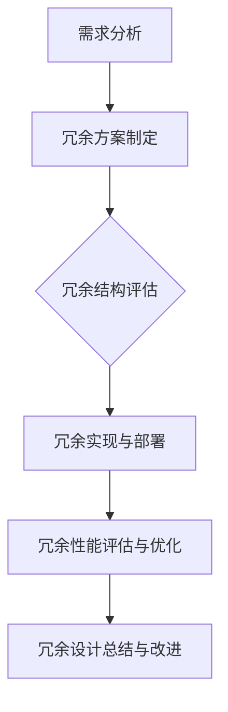
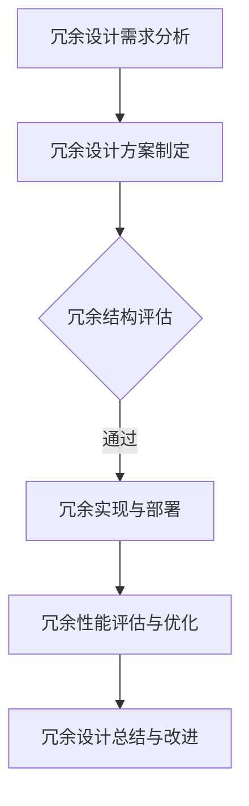

                 

# 冗余设计的最佳实践

> 关键词：冗余设计，可靠性，性能优化，系统架构，最佳实践

> 摘要：本文旨在探讨冗余设计在IT领域的重要性和最佳实践。通过详细介绍冗余设计的概念、原理、类型以及具体应用，本文旨在为读者提供一套系统的冗余设计方法论，帮助他们在实际项目中实现高效、可靠和可扩展的系统设计。

## 目录

#### 第一部分：冗余设计的背景与基础理论

##### 第1章：冗余设计的概念与重要性
1.1 冗余设计的定义与特点
1.2 冗余设计的历史与发展
1.3 冗余设计的应用领域
1.4 冗余设计与可靠性

##### 第2章：冗余设计的基本原理
2.1 冗余设计的数学模型
2.2 冗余设计的逻辑结构与流程
2.3 冗余设计的 Mermaid 流程图
2.4 冗余设计的优缺点分析

##### 第3章：冗余设计的常见类型
3.1 结构冗余
3.2 功能冗余
3.3 信息冗余
3.4 时间冗余

#### 第二部分：冗余设计在具体领域的应用

##### 第4章：冗余设计在硬件系统中的应用
4.1 硬件系统冗余设计的重要性
4.2 硬件冗余设计的原理与技术
4.3 硬件冗余设计案例研究

##### 第5章：冗余设计在软件系统中的应用
5.1 软件系统冗余设计的优势与挑战
5.2 软件冗余设计的原理与方法
5.3 软件冗余设计案例研究

##### 第6章：冗余设计在网络安全中的应用
6.1 冗余设计在网络安全中的重要性
6.2 冗余设计在网络安全中的技术实现
6.3 冗余设计在网络安全中的应用案例

##### 第7章：冗余设计的最佳实践与未来趋势
7.1 冗余设计的最佳实践案例分享
7.2 冗余设计的未来发展趋势
7.3 冗余设计在实际应用中的挑战与机遇

#### 第8章：项目实战与代码解析
8.1 冗余设计项目实战简介
8.2 项目实战一：硬件系统的冗余设计
8.3 项目实战二：软件系统的冗余设计

#### 附录
附录A：冗余设计工具与资源

## 引言

冗余设计作为系统架构中的一种重要手段，旨在通过增加系统组件的冗余性来提高系统的可靠性、可用性和容错能力。随着信息技术的快速发展，系统架构变得越来越复杂，单一故障点可能导致整个系统的崩溃，因此冗余设计的重要性愈发凸显。

本文将逐步探讨冗余设计的各个方面，从基本概念到具体应用，旨在为读者提供一套全面、实用的冗余设计方法论。通过本文的阅读，读者将能够：

1. 理解冗余设计的定义、原理和重要性。
2. 掌握冗余设计的常见类型及其实现方法。
3. 了解冗余设计在硬件系统、软件系统和网络安全等领域的具体应用。
4. 获得冗余设计的最佳实践和未来发展趋势。
5. 通过实际项目案例，掌握冗余设计的实战技巧。

在接下来的章节中，我们将逐步展开讨论，深入探讨冗余设计的各个方面。

## 第一部分：冗余设计的背景与基础理论

### 第1章：冗余设计的概念与重要性

#### 1.1 冗余设计的定义与特点

冗余设计（Redundant Design）是指在设计过程中引入冗余元素，以提高系统的可靠性、可用性和容错能力。冗余（Redundancy）在技术领域通常指增加不必要的元素或备份，以防止系统因单一故障点而瘫痪。

冗余设计的核心特点包括：

1. **冗余性**：系统组件具有冗余功能或备份，可以在主要组件失效时自动切换。
2. **可靠性**：通过冗余设计，系统的可靠性显著提高，即使在个别组件出现故障时，系统仍能保持正常运行。
3. **容错性**：冗余设计能够容忍一定程度的故障，系统可以在故障发生时自动恢复或切换。
4. **可用性**：系统的高可用性是冗余设计的一个重要目标，意味着系统在正常运行时间上接近100%。

#### 1.2 冗余设计的历史与发展

冗余设计的历史可以追溯到早期计算机系统。在20世纪50年代，为了提高计算机的可靠性，人们开始探讨在计算机系统中引入冗余机制。随着计算机技术和通信技术的发展，冗余设计逐渐应用于更广泛的领域，如硬件系统、软件系统和网络安全等。

在硬件系统方面，冗余设计主要包括硬件冗余和存储冗余。在软件系统方面，冗余设计通过代码冗余、数据冗余和流程冗余来提高系统的可靠性。在网络安全方面，冗余设计通过冗余检测机制和冗余安全策略来增强系统的安全性。

#### 1.3 冗余设计的应用领域

冗余设计在多个领域得到了广泛应用，以下是其中几个重要的应用领域：

1. **硬件系统**：在硬件系统中，冗余设计主要用于提高系统的可靠性。例如，在服务器集群中，通过引入冗余服务器和冗余网络连接，可以确保在个别服务器或网络连接故障时，系统仍然能够正常运行。
2. **软件系统**：在软件系统中，冗余设计通过代码冗余和数据冗余来提高系统的可靠性。例如，在数据库系统中，通过引入冗余数据存储和数据备份，可以在主数据存储失败时快速恢复。
3. **网络安全**：在网络安全方面，冗余设计通过冗余检测机制和安全策略来增强系统的安全性。例如，通过引入冗余防火墙和入侵检测系统，可以在一个系统失效时，另一个系统能够及时接管。
4. **航空航天**：在航空航天领域，冗余设计至关重要。例如，飞机上的多个引擎和多个导航系统，都是通过冗余设计来确保在个别系统失效时，系统能够继续正常运作。

#### 1.4 冗余设计与可靠性

冗余设计是提高系统可靠性的关键手段之一。可靠性（Reliability）是指系统在预定条件下，完成规定功能的能力。在冗余设计中，通过引入冗余组件和备份机制，可以在主组件出现故障时，迅速切换到备份组件，从而提高系统的可靠性。

**冗余度**（Redundancy Level）是衡量冗余设计的重要指标。冗余度越高，系统的可靠性越高，但也会带来额外的成本和性能开销。因此，在冗余设计时，需要平衡可靠性与成本之间的关系。

1. **冗余度的计算**：可以使用冗余度计算公式来评估系统的冗余度。

   $$ R = \frac{N_{total} - N_{non-redundant}}{N_{total}} $$

   其中，\( R \) 表示冗余度，\( N_{total} \) 表示系统总节点数，\( N_{non-redundant} \) 表示非冗余节点数。

2. **冗余度的评估标准**：根据冗余度，可以划分系统的可靠性等级。

   - 当 \( R < 0.2 \) 时，冗余度较低，系统可靠性较高。
   - 当 \( R \geq 0.2 \) 且 \( R < 0.4 \) 时，冗余度适中，系统可靠性中等。
   - 当 \( R \geq 0.4 \) 时，冗余度较高，系统可靠性较高，但可能存在性能下降的问题。

综上所述，冗余设计是提高系统可靠性的有效手段。通过合理设计冗余组件和备份机制，可以在系统出现故障时，快速切换到备用组件，从而提高系统的可靠性。

### 第2章：冗余设计的基本原理

#### 2.1 冗余设计的数学模型

冗余设计中的数学模型是评估系统冗余度和可靠性的一种量化工具。一个基本的冗余度计算公式如下：

$$
R = \frac{N_{total} - N_{non-redundant}}{N_{total}}
$$

其中：
- \( R \) 表示冗余度。
- \( N_{total} \) 表示系统总节点数。
- \( N_{non-redundant} \) 表示非冗余节点数。

通过这个公式，我们可以量化系统的冗余程度。例如，如果一个系统有100个节点，其中90个是冗余节点，那么该系统的冗余度为：

$$
R = \frac{100 - 90}{100} = 0.1
$$

这意味着系统的冗余度为10%。

#### 2.2 冗余设计的逻辑结构与流程

冗余设计的逻辑结构通常包括以下几个主要步骤：

1. **需求分析**：分析系统的需求，确定哪些组件或功能需要冗余设计。
2. **冗余方案制定**：根据需求分析结果，制定冗余方案，选择合适的冗余类型和实现方法。
3. **冗余结构评估**：评估冗余方案的可行性和效果，确保冗余设计能够达到预期的可靠性目标。
4. **冗余实现与部署**：实施冗余方案，将冗余组件或备份机制部署到实际系统中。
5. **冗余性能评估与优化**：在系统运行过程中，定期评估冗余设计的性能，根据实际情况进行优化。

下图是冗余设计的 Mermaid 流程图：

#### 2.3 冗余设计的 Mermaid 流程图

下面是一个简单的 Mermaid 流程图，用于描述冗余设计的流程：

这个流程图展示了冗余设计的步骤和各个步骤之间的逻辑关系。在需求分析阶段，确定哪些组件需要冗余设计；在方案制定阶段，根据需求选择合适的冗余方案；在结构评估阶段，评估冗余方案的可行性和效果；在实现与部署阶段，将冗余方案部署到系统中；在性能评估与优化阶段，持续监控和优化冗余设计的性能。

#### 2.4 冗余设计的优缺点分析

冗余设计虽然能够显著提高系统的可靠性，但也存在一些优缺点。以下是对冗余设计的优缺点的详细分析：

**优点：**

1. **提高可靠性**：冗余设计通过引入备份机制，可以在主组件失效时自动切换到备份组件，从而确保系统的高可靠性。
2. **增强容错性**：冗余设计能够容忍一定程度的故障，系统可以在故障发生时自动恢复或切换，从而提高系统的容错性。
3. **减少停机时间**：由于冗余设计能够在故障发生时快速切换到备份组件，从而减少系统的停机时间，提高系统的可用性。

**缺点：**

1. **成本增加**：冗余设计需要额外的硬件、软件和人力成本，特别是在高冗余度的情况下，成本增加会更加明显。
2. **性能下降**：高冗余度的系统可能存在性能下降的问题，因为需要处理冗余组件之间的协调和切换。
3. **复杂度增加**：冗余设计增加了系统的复杂度，需要更复杂的监控和管理机制来确保冗余设计的有效运行。

**结论：**

冗余设计是一种提高系统可靠性和容错性的有效手段，但在实际应用中需要权衡其优缺点。通过合理设计冗余度，优化冗余组件的协调和管理，可以最大限度地发挥冗余设计的优势，同时降低其成本和复杂度。

### 第3章：冗余设计的常见类型

在冗余设计中，根据冗余的实现方式和目的，可以分为多种类型。以下将介绍几种常见的冗余设计类型，包括结构冗余、功能冗余、信息冗余和时间冗余。

#### 3.1 结构冗余

结构冗余（Structural Redundancy）是通过增加系统结构的冗余性来提高系统的可靠性和容错能力。结构冗余通常涉及硬件和软件层面的冗余设计。

**结构冗余的原理与实现：**

1. **硬件层面的结构冗余**：在硬件系统中，结构冗余可以通过增加冗余硬件组件来实现。例如，在服务器集群中，通过引入冗余服务器和冗余网络连接，可以确保在个别服务器或网络连接故障时，系统仍然能够正常运行。

   实现步骤如下：
   - 分析系统的关键组件，确定哪些组件需要冗余。
   - 选择合适的冗余硬件组件，例如冗余服务器、存储设备和网络设备。
   - 实施冗余硬件组件，并确保它们能够协同工作。

2. **软件层面的结构冗余**：在软件系统中，结构冗余可以通过引入冗余模块或服务来实现。例如，在分布式系统中，通过引入冗余的节点和服务，可以确保在个别节点或服务故障时，系统仍然能够正常运行。

   实现步骤如下：
   - 分析系统的关键模块或服务，确定哪些需要冗余。
   - 开发或选择冗余的模块或服务，并确保它们能够协同工作。
   - 部署冗余的模块或服务，并配置适当的负载均衡机制。

**结构冗余的应用实例：**

1. **服务器集群**：通过引入冗余服务器和冗余网络连接，确保在个别服务器或网络连接故障时，系统仍然能够正常运行。
2. **数据库系统**：通过引入冗余的数据库节点和数据备份，确保在主数据库节点故障时，系统能够快速切换到备份节点。

#### 3.2 功能冗余

功能冗余（Functional Redundancy）是通过增加系统功能冗余来提高系统的可靠性和容错能力。功能冗余通常涉及在系统中引入冗余的功能模块或备份功能。

**功能冗余的原理与实现：**

1. **硬件层面的功能冗余**：在硬件系统中，功能冗余可以通过引入冗余硬件模块或备份硬件来实现。例如，在通信系统中，通过引入冗余的通信模块和备份通信线路，可以确保在主要通信模块或线路故障时，系统仍然能够正常运行。

   实现步骤如下：
   - 分析系统的关键功能，确定哪些需要冗余。
   - 选择合适的冗余硬件模块或备份硬件，并确保它们能够协同工作。
   - 实施冗余硬件模块或备份硬件，并配置适当的故障切换机制。

2. **软件层面的功能冗余**：在软件系统中，功能冗余可以通过引入冗余的模块或备份功能来实现。例如，在应用程序中，通过引入冗余的服务模块和备份服务，可以确保在主要服务模块或服务故障时，应用程序仍然能够正常运行。

   实现步骤如下：
   - 分析系统的关键功能，确定哪些需要冗余。
   - 开发或选择冗余的模块或备份功能，并确保它们能够协同工作。
   - 部署冗余的模块或备份功能，并配置适当的故障切换机制。

**功能冗余的应用实例：**

1. **通信系统**：通过引入冗余的通信模块和备份通信线路，确保在主要通信模块或线路故障时，系统仍然能够正常运行。
2. **数据库系统**：通过引入冗余的备份功能，确保在主数据库故障时，系统能够快速切换到备份数据库。

#### 3.3 信息冗余

信息冗余（Information Redundancy）是通过增加系统信息的冗余性来提高系统的可靠性和容错能力。信息冗余通常涉及在系统中引入冗余的数据备份或数据校验机制。

**信息冗余的原理与实现：**

1. **硬件层面的信息冗余**：在硬件系统中，信息冗余可以通过引入冗余的数据存储或数据校验机制来实现。例如，在存储系统中，通过引入冗余的数据备份和数据校验机制，可以确保在主要数据存储或数据校验故障时，系统仍然能够正常运行。

   实现步骤如下：
   - 分析系统的关键数据，确定哪些需要冗余。
   - 选择合适的数据备份和数据校验机制，并确保它们能够协同工作。
   - 实施冗余的数据备份和数据校验机制，并配置适当的故障切换机制。

2. **软件层面的信息冗余**：在软件系统中，信息冗余可以通过引入冗余的数据备份和数据校验机制来实现。例如，在数据库系统中，通过引入冗余的数据备份和数据校验机制，可以确保在主数据存储或数据校验故障时，系统仍然能够正常运行。

   实现步骤如下：
   - 分析系统的关键数据，确定哪些需要冗余。
   - 开发或选择冗余的数据备份和数据校验机制，并确保它们能够协同工作。
   - 部署冗余的数据备份和数据校验机制，并配置适当的故障切换机制。

**信息冗余的应用实例：**

1. **存储系统**：通过引入冗余的数据备份和数据校验机制，确保在主要数据存储或数据校验故障时，系统仍然能够正常运行。
2. **数据库系统**：通过引入冗余的数据备份和数据校验机制，确保在主数据库故障时，系统能够快速切换到备份数据库。

#### 3.4 时间冗余

时间冗余（Temporal Redundancy）是通过增加系统运行时间的冗余来提高系统的可靠性和容错能力。时间冗余通常涉及在系统中引入冗余的时间窗口或备份时间。

**时间冗余的原理与实现：**

1. **硬件层面的时间冗余**：在硬件系统中，时间冗余可以通过引入冗余的时间窗口或备份时间来实现。例如，在硬件设备中，通过引入冗余的时间窗口或备份时间，可以确保在主要设备运行时间或备份时间故障时，系统仍然能够正常运行。

   实现步骤如下：
   - 分析系统的关键运行时间，确定哪些需要冗余。
   - 选择合适的时间窗口或备份时间机制，并确保它们能够协同工作。
   - 实施冗余的时间窗口或备份时间机制，并配置适当的故障切换机制。

2. **软件层面的时间冗余**：在软件系统中，时间冗余可以通过引入冗余的时间窗口或备份时间来实现。例如，在软件系统中，通过引入冗余的时间窗口或备份时间，可以确保在主要软件运行时间或备份时间故障时，系统仍然能够正常运行。

   实现步骤如下：
   - 分析系统的关键运行时间，确定哪些需要冗余。
   - 开发或选择冗余的时间窗口或备份时间机制，并确保它们能够协同工作。
   - 部署冗余的时间窗口或备份时间机制，并配置适当的故障切换机制。

**时间冗余的应用实例：**

1. **硬件设备**：通过引入冗余的时间窗口或备份时间，确保在主要硬件设备运行时间或备份时间故障时，系统仍然能够正常运行。
2. **软件系统**：通过引入冗余的时间窗口或备份时间，确保在主要软件运行时间或备份时间故障时，系统仍然能够正常运行。

### 结论

冗余设计是提高系统可靠性和容错能力的重要手段。通过结构冗余、功能冗余、信息冗余和时间冗余等多种方式，可以有效地增强系统的鲁棒性。在实际应用中，应根据系统的具体需求和资源条件，选择合适的冗余设计类型，并合理配置冗余组件，以实现最佳的系统可靠性。

### 第4章：冗余设计在硬件系统中的应用

#### 4.1 硬件系统冗余设计的重要性

硬件系统冗余设计在保障系统可靠性和可用性方面扮演着至关重要的角色。随着硬件系统在现代社会各个领域的广泛应用，硬件故障可能带来严重的后果，包括数据丢失、系统瘫痪、业务中断等。因此，通过冗余设计来提高硬件系统的可靠性，已经成为现代硬件系统设计的关键考量。

**重要性分析：**

1. **提高系统可靠性**：硬件系统冗余设计通过引入冗余硬件组件，可以在主要硬件组件发生故障时自动切换到备份组件，从而确保系统持续运行，减少故障带来的影响。
2. **延长系统寿命**：冗余设计不仅可以提高系统的可靠性，还可以延长系统寿命。通过冗余设计，可以减轻单个硬件组件的负载，从而降低其磨损和故障率。
3. **增强系统容错性**：硬件系统冗余设计可以容忍一定程度的故障，确保系统能够在故障发生时快速恢复，从而提高系统的容错性。
4. **保障数据安全**：在硬件系统中，数据的安全至关重要。冗余设计可以通过数据备份和冗余存储，保障数据在硬件故障时不会丢失，从而提高数据的安全性。

**案例分析：**

例如，在金融领域，交易系统的可靠性至关重要。为了保障交易系统的可靠性，金融机构通常会采用冗余设计。在硬件层面，交易系统会使用冗余服务器、存储设备和网络设备，确保在任何单一组件故障时，系统能够自动切换到备份组件，从而保证交易的连续性和数据的完整性。

#### 4.2 硬件冗余设计的原理与技术

硬件冗余设计的原理是通过引入冗余硬件组件，提高系统的可靠性和容错能力。硬件冗余设计主要涉及以下几种技术和方法：

1. **双机热备份**：双机热备份是一种常见的硬件冗余设计方法，通过两台服务器进行热备份，一台作为主服务器运行业务，另一台作为备份服务器，随时准备接管主服务器的任务。当主服务器发生故障时，备份服务器可以立即接管业务，确保系统连续运行。

   实现步骤：
   - 选择两台性能相同的服务器。
   - 配置负载均衡和故障切换机制。
   - 实时监控主服务器的状态，当主服务器故障时，自动切换到备份服务器。

2. **存储冗余**：存储冗余设计通过引入冗余的存储设备和数据备份，保障数据在硬件故障时不会丢失。常见的存储冗余技术包括RAID（独立磁盘冗余阵列）和备份存储。

   实现步骤：
   - 选择支持RAID技术的存储设备。
   - 配置RAID级别，例如RAID 1（镜像）或RAID 5（分布式奇偶校验）。
   - 定期备份重要数据到备份存储设备。

3. **网络冗余**：网络冗余设计通过引入冗余的网络设备和路径，保障网络连接的稳定性和可靠性。常见的网络冗余技术包括冗余交换机、路由器和网络路径冗余。

   实现步骤：
   - 选择支持冗余网络连接的设备。
   - 配置冗余网络路径，例如通过多条物理链路实现网络冗余。
   - 实时监控网络状态，确保网络连接的可靠性。

4. **硬件监控与故障管理**：通过引入硬件监控系统和故障管理机制，实时监测硬件组件的状态，及时发现并处理故障。常见的硬件监控与故障管理技术包括传感器监控、自动化故障恢复和日志分析。

   实现步骤：
   - 选择合适的硬件监控工具。
   - 配置硬件监控策略，例如设置阈值、报警和自动化恢复。
   - 定期分析硬件监控日志，优化硬件配置和故障管理策略。

#### 4.3 硬件冗余设计案例研究

**案例1：数据中心的双机热备份**

某大型数据中心为保障服务器的可靠性，采用了双机热备份设计。数据中心配置了两台高性能服务器A和B，服务器A作为主服务器运行业务，服务器B作为备份服务器，随时准备接管。

实现步骤：
- 两台服务器配置相同硬件和操作系统。
- 通过负载均衡器实现负载分担。
- 设置故障切换机制，当服务器A发生故障时，自动切换到服务器B。

通过双机热备份设计，数据中心能够有效提高服务器的可靠性，确保业务的连续性。例如，当服务器A发生硬件故障时，服务器B能够立即接管业务，减少业务中断时间。

**案例2：数据库系统的存储冗余**

某金融机构的数据库系统采用了存储冗余设计，通过RAID技术和备份存储保障数据的安全性和可靠性。

实现步骤：
- 数据库系统配置了多个硬盘，支持RAID 1（镜像）。
- 每个硬盘的数据镜像存储在另一块硬盘上，确保数据在硬盘故障时不会丢失。
- 定期将重要数据备份到远程备份存储设备。

通过存储冗余设计，数据库系统能够有效防止数据丢失，提高数据的可靠性。例如，当某块硬盘发生故障时，系统可以通过镜像硬盘恢复数据，确保业务连续性。

**案例3：网络设备的冗余设计**

某企业的网络系统采用了网络冗余设计，通过冗余交换机和网络路径保障网络连接的稳定性和可靠性。

实现步骤：
- 配置了两台冗余交换机，通过虚拟局域网（VLAN）实现网络冗余。
- 通过多条物理链路连接冗余交换机，确保网络路径的冗余。
- 实时监控网络状态，及时处理网络故障。

通过网络冗余设计，企业网络系统能够有效防止网络中断，保障业务的连续性和数据传输的可靠性。例如，当某条物理链路发生故障时，系统可以通过冗余链路实现网络连接的自动切换，确保网络服务的稳定运行。

综上所述，硬件冗余设计在提高硬件系统的可靠性、可用性和容错能力方面具有重要意义。通过合理选择和配置冗余硬件组件，可以有效地保障硬件系统在故障发生时能够快速切换到备份组件，从而确保业务的连续性和数据的安全性。同时，硬件冗余设计也需要结合具体应用场景和资源条件，进行合理的规划和优化。

### 第5章：冗余设计在软件系统中的应用

#### 5.1 软件系统冗余设计的优势与挑战

在软件系统中，冗余设计旨在通过引入冗余的组件、数据或流程，提高系统的可靠性、可用性和容错性。软件系统冗余设计的优势显而易见，但也面临着一些挑战。

**优势：**

1. **提高系统可靠性**：软件系统冗余设计可以在主要组件或流程发生故障时，自动切换到备份组件或流程，确保系统持续运行。
2. **增强容错性**：通过冗余设计，软件系统可以容忍一定程度的故障，并在故障发生时自动恢复或切换，从而提高系统的容错能力。
3. **减少停机时间**：冗余设计能够显著减少系统停机时间，提高系统的可用性，从而保障业务的连续性。
4. **提升用户体验**：冗余设计可以确保在用户请求处理时，即使某个服务或组件出现故障，系统仍然能够响应其他用户请求，提升用户体验。

**挑战：**

1. **增加系统复杂度**：冗余设计增加了系统的复杂度，需要更多的开发和维护资源，同时也增加了系统出错的可能性。
2. **性能开销**：高冗余度的系统可能存在性能下降的问题，因为需要处理冗余组件之间的协调和切换，以及额外的负载均衡和同步操作。
3. **成本增加**：冗余设计需要额外的硬件、软件和人力成本，特别是在高冗余度的情况下，成本增加会更加明显。
4. **维护难度**：冗余设计增加了系统的维护难度，需要更复杂的监控和管理机制来确保冗余设计的有效运行。

**结论：**

尽管软件系统冗余设计面临一些挑战，但其提高系统可靠性和可用性的优势是不可忽视的。在实际应用中，应根据系统的具体需求和资源条件，合理设计冗余度，优化冗余组件的协调和管理，以实现最佳的系统性能和可靠性。

#### 5.2 软件冗余设计的原理与方法

软件冗余设计主要通过引入冗余的组件、数据或流程来实现，以提高系统的可靠性、可用性和容错能力。以下介绍几种常见的软件冗余设计原理和方法：

**1. 代码冗余**

代码冗余是指在不影响系统功能的前提下，引入冗余的代码模块或功能，以提高系统的可靠性。代码冗余的优点是实现简单，成本相对较低。常见的代码冗余方法包括：

- **冗余功能模块**：在关键功能模块中引入冗余代码，例如在核心算法中添加冗余的校验和检查逻辑。
- **冗余代码库**：引入冗余的代码库，例如在多个项目中使用相同的代码库，并在其中一个项目出现故障时，通过切换到另一个代码库来恢复系统功能。

**2. 数据冗余**

数据冗余是指在不影响系统功能的前提下，引入冗余的数据备份或数据校验机制，以提高系统的可靠性。数据冗余的优点是能够有效防止数据丢失，保障数据的完整性。常见的数据冗余方法包括：

- **数据备份**：在系统中引入冗余的数据备份机制，例如定期备份关键数据到远程存储设备，确保在数据丢失时能够快速恢复。
- **数据校验**：在系统中引入数据校验机制，例如使用哈希算法对数据进行校验，确保数据在传输或存储过程中不会发生损坏。

**3. 流程冗余**

流程冗余是指在不影响系统功能的前提下，引入冗余的流程或步骤，以提高系统的可靠性。流程冗余的优点是能够确保系统在关键流程发生故障时，能够快速切换到备份流程。常见流程冗余方法包括：

- **冗余流程节点**：在关键流程节点中引入冗余的步骤，例如在数据处理流程中添加冗余的检查和校验步骤。
- **冗余流程分支**：在关键流程分支中引入冗余的路径，例如在决策分支中添加冗余的判断条件，确保在某个分支故障时，系统能够切换到其他分支。

**4. 冗余设计模式**

冗余设计模式是指在软件设计中使用一些特定的设计模式来实现冗余功能，以提高系统的可靠性。常见的冗余设计模式包括：

- **双重检查锁模式**：在多线程环境中，通过双重检查锁（Double-Checked Locking）模式实现线程安全的冗余功能。
- **中介者模式**：在复杂的系统中，通过中介者（Mediator）模式实现冗余的通信和管理功能。

**5. 代码冗余与数据冗余的结合**

在实际应用中，代码冗余和数据冗余往往结合使用，以实现更可靠的系统。例如，在一个分布式系统中，可以通过引入冗余的数据备份和冗余的代码模块，确保在节点故障时，系统能够快速切换到备份节点，并恢复数据完整性。

**实现方法：**

1. **选择关键组件或流程**：根据系统的需求和重要性，选择需要冗余的组件或流程。例如，在关键的业务流程中引入冗余代码模块和冗余数据备份。
2. **设计冗余组件或流程**：根据选定的关键组件或流程，设计相应的冗余组件或流程。例如，在关键数据处理流程中添加冗余的检查和校验步骤，或引入冗余的数据备份机制。
3. **实现冗余功能**：根据设计，实现冗余的代码模块、数据备份和冗余流程。例如，编写冗余的代码模块，配置冗余的数据备份策略，或实现冗余的流程节点和分支。
4. **测试与优化**：对实现的冗余功能进行测试和优化，确保冗余功能能够有效提高系统的可靠性。例如，通过压力测试和故障注入，验证冗余设计的有效性，并根据测试结果优化冗余组件的性能和协调性。

通过上述方法，可以实现软件系统的高效、可靠和可扩展的冗余设计，提高系统的整体性能和可靠性。

### 第6章：冗余设计在网络安全中的应用

#### 6.1 冗余设计在网络安全中的重要性

在网络安全领域，冗余设计被广泛应用于提高系统的安全性和防护能力。随着网络攻击手段的日益复杂和多样化，单一的防御机制已经难以应对各种安全威胁。冗余设计通过引入多重防护措施，能够有效提高系统的安全性，降低网络攻击成功的机会。

**重要性分析：**

1. **增强防护能力**：通过冗余设计，网络安全系统可以同时采用多种防护措施，如防火墙、入侵检测系统和安全网关等，形成多层次的防护体系，从而提高整体防护能力。
2. **提高容错性**：冗余设计可以容忍一定程度的故障，确保在个别防护组件失效时，系统仍能保持部分防护能力，防止网络攻击的扩展。
3. **降低单点故障风险**：通过冗余设计，网络安全系统避免了单一故障点，从而降低了因单点故障导致系统整体瘫痪的风险。
4. **提升应急响应能力**：冗余设计可以为网络安全系统提供冗余的应急响应能力，如冗余的安全策略和管理接口，确保在安全事件发生时，系统能够快速响应和恢复。

**案例分析：**

例如，某金融机构在网络安全防护方面采用了冗余设计。该金融机构的网络防护系统包括多层防火墙、入侵检测系统和安全网关，通过这些冗余的防护措施，确保在任何单一组件失效时，系统能够迅速切换到备用组件，继续提供防护。

#### 6.2 冗余设计在网络安全中的技术实现

在网络安全中，冗余设计主要通过以下几种技术手段实现：

1. **防火墙冗余**：
   - **冗余防火墙配置**：通过配置冗余的防火墙，确保在主防火墙故障时，备用防火墙能够立即接管。
   - **动态流量负载均衡**：通过动态负载均衡技术，将网络流量分配到多个防火墙，提高整体系统的处理能力，同时确保在某个防火墙过载时，其他防火墙可以分担流量。

2. **入侵检测系统（IDS）/入侵防御系统（IPS）冗余**：
   - **冗余传感器部署**：在关键节点部署多个入侵检测传感器，形成冗余检测网络，确保在任何单一传感器失效时，系统仍能检测到攻击行为。
   - **分布式检测**：通过分布式入侵检测系统，将检测任务分配到多个节点，提高检测效率和容错能力。

3. **安全网关冗余**：
   - **冗余网关配置**：配置冗余的安全网关，确保在主网关故障时，备用网关能够立即接管安全策略和流量控制。
   - **多路径转发**：通过多路径转发技术，实现网络流量的冗余传输，提高网络通信的可靠性和可用性。

4. **安全策略冗余**：
   - **冗余策略存储**：在安全策略管理系统中引入冗余存储机制，确保在主策略存储失效时，备用策略存储能够迅速接管。
   - **动态策略调整**：通过实时监控网络流量和安全事件，动态调整安全策略，确保系统始终处于最佳防护状态。

5. **安全管理冗余**：
   - **冗余安全管理接口**：配置冗余的安全管理接口，确保在主管理接口失效时，备用接口可以继续提供服务。
   - **分布式安全管理**：通过分布式安全管理架构，实现安全策略的集中管理和分布式执行，提高系统管理的效率和容错能力。

**实现步骤：**

1. **需求分析**：根据网络安全需求，确定哪些防护组件需要冗余设计。
2. **方案设计**：选择合适的冗余技术手段，设计冗余架构和配置方案。
3. **组件部署**：按照设计方案，部署冗余的防护组件和系统。
4. **监控与管理**：实时监控冗余组件的状态，确保冗余设计能够有效运行。
5. **测试与优化**：通过压力测试和故障注入，验证冗余设计的有效性和性能，并根据测试结果进行优化。

#### 6.3 冗余设计在网络安全中的应用案例

**案例1：企业级防火墙冗余**

某大型企业为了提高网络安全防护能力，采用了防火墙冗余设计。该企业配置了两台高性能防火墙A和B，通过动态流量负载均衡技术，将网络流量分配到两台防火墙。当主防火墙A故障时，备用防火墙B能够立即接管，确保网络流量继续正常转发。

**实现步骤：**

1. **需求分析**：分析企业网络安全需求，确定防火墙冗余设计的必要性。
2. **方案设计**：选择动态流量负载均衡技术，设计防火墙冗余架构。
3. **组件部署**：部署两台高性能防火墙A和B，配置负载均衡设备。
4. **监控与管理**：通过网络监控工具，实时监控防火墙状态，确保冗余设计有效运行。
5. **测试与优化**：通过压力测试和故障注入，验证防火墙冗余设计的有效性和性能。

**案例2：安全网关冗余**

某金融机构为了保障网络通信的安全性，采用了安全网关冗余设计。该金融机构配置了两台安全网关A和B，通过冗余网关配置和多路径转发技术，实现网络流量的冗余传输。

**实现步骤：**

1. **需求分析**：分析金融机构网络通信需求，确定安全网关冗余设计的必要性。
2. **方案设计**：选择冗余网关配置和多路径转发技术，设计安全网关冗余架构。
3. **组件部署**：部署两台安全网关A和B，配置多路径转发设备。
4. **监控与管理**：通过网络监控工具，实时监控安全网关状态，确保冗余设计有效运行。
5. **测试与优化**：通过压力测试和故障注入，验证安全网关冗余设计的有效性和性能。

通过上述案例，可以看出冗余设计在网络安全中具有重要的作用。通过合理设计和部署冗余的防护组件，可以显著提高系统的安全性和防护能力，确保在网络攻击发生时，系统能够快速响应和恢复。在实际应用中，应根据具体需求和资源条件，灵活选择和配置冗余设计，以实现最佳的安全防护效果。

### 第7章：冗余设计的最佳实践与未来趋势

#### 7.1 冗余设计的最佳实践案例分享

在实际应用中，冗余设计的最佳实践能够显著提高系统的可靠性和容错能力。以下是一些经典的冗余设计最佳实践案例，供读者参考：

**案例1：金融交易系统的冗余设计**

某大型金融机构在其交易系统中采用了高度冗余的设计。通过以下措施，确保交易系统的可靠性：

1. **服务器冗余**：交易服务器集群采用双机热备份技术，通过负载均衡和心跳监测，确保在主服务器出现故障时，备用服务器可以立即接管。
2. **存储冗余**：采用RAID 5存储阵列，通过冗余的硬盘实现数据备份，确保在硬盘故障时，系统能够自动恢复数据。
3. **网络冗余**：通过配置冗余的网络设备和路径，确保网络连接的稳定性，减少单点故障的风险。

**最佳实践总结**：

- **多层次的冗余设计**：通过服务器、存储和网络的多层次冗余，构建一个高度可靠的系统。
- **实时监控与自动切换**：通过实时监控和自动切换机制，确保在故障发生时，系统能够快速恢复。

**案例2：云服务的冗余设计**

某云服务提供商在其基础设施中采用了冗余设计，以提高服务的可用性和可靠性：

1. **数据中心冗余**：在不同地区部署多个数据中心，确保在任何单一数据中心发生故障时，其他数据中心可以接管服务。
2. **网络冗余**：通过配置冗余的网络设备和路径，确保数据传输的稳定性。
3. **计算资源冗余**：在多个服务器节点之间分配任务，确保在任何单一服务器节点故障时，其他节点可以继续提供服务。

**最佳实践总结**：

- **地理位置分散**：通过地理位置的分散部署，提高系统的容灾能力。
- **资源分配策略**：通过合理分配计算资源，确保在节点故障时，其他节点可以快速接管任务。

**案例3：医疗设备冗余设计**

某医院在其关键医疗设备中采用了冗余设计，以确保设备的持续运行和数据的完整性：

1. **硬件冗余**：在关键硬件组件中引入冗余设计，如双电源、冗余传感器和备用电池。
2. **数据备份**：通过实时数据备份和镜像技术，确保数据在硬件故障时不会丢失。
3. **系统监控**：通过实时监控和告警系统，及时发现和处理设备故障。

**最佳实践总结**：

- **硬件冗余**：通过硬件冗余，确保设备在故障时能够自动切换到备用组件。
- **数据备份**：通过数据备份，确保在硬件故障时，数据不会丢失。

#### 7.2 冗余设计的未来发展趋势

随着信息技术的不断发展，冗余设计也在不断演进。未来，冗余设计将在以下几个方面得到进一步发展：

1. **智能化冗余**：随着人工智能技术的应用，冗余设计将更加智能化。通过机器学习算法，系统可以自动识别故障模式和优化冗余策略，提高冗余设计的效率和效果。

2. **自适应冗余**：未来，冗余设计将更加注重自适应能力。系统可以根据实际运行状态和负载情况，动态调整冗余策略，确保在最小化成本的同时，最大化冗余效果。

3. **分布式冗余**：分布式计算和存储技术的发展，将推动分布式冗余设计的广泛应用。通过在分布式系统中引入冗余组件和备份机制，可以显著提高系统的可靠性和容错能力。

4. **边缘计算冗余**：随着边缘计算的兴起，冗余设计将在边缘计算环境中得到广泛应用。通过在边缘节点引入冗余组件和备份机制，可以确保边缘服务的连续性和可靠性。

5. **绿色冗余**：随着环保意识的提高，绿色冗余将成为未来的重要趋势。通过优化冗余设计，减少能源消耗和碳排放，实现可持续发展。

#### 7.3 冗余设计在实际应用中的挑战与机遇

尽管冗余设计在提高系统可靠性和容错能力方面具有重要意义，但在实际应用中仍面临一些挑战：

1. **成本和性能**：冗余设计通常会增加系统的成本和复杂度，需要在可靠性和成本之间进行权衡。
2. **管理和维护**：冗余系统需要更多的管理和维护资源，包括监控、故障检测和恢复等。
3. **兼容性**：冗余设计需要考虑与现有系统的兼容性，确保在引入冗余组件后，系统能够正常运行。

然而，这些挑战也带来了新的机遇：

1. **技术创新**：挑战促使技术创新，如智能化冗余、自适应冗余和分布式冗余等，将为冗余设计带来新的发展契机。
2. **市场机会**：随着企业对可靠性和容错能力需求的增加，冗余设计市场将迎来新的增长点，为相关技术和产品带来市场机会。

综上所述，冗余设计在实际应用中面临着挑战，但也充满了机遇。通过不断创新和优化，冗余设计将在未来发挥更大的作用，为信息技术的发展提供坚实保障。

### 第8章：项目实战与代码解析

#### 8.1 冗余设计项目实战简介

在本章中，我们将通过两个实际项目案例，详细讲解冗余设计的具体实现过程。第一个案例是关于硬件系统的冗余设计，我们将以一个服务器集群项目为例；第二个案例是关于软件系统的冗余设计，我们将探讨一个分布式数据库系统的冗余设计。通过这些项目实战，读者将能够掌握冗余设计的实际应用方法和技巧。

#### 8.2 项目实战一：硬件系统的冗余设计

**项目背景与需求分析**

某企业需要构建一个高可用性的服务器集群，以支持其核心业务系统的连续运行。由于业务对服务器系统的可靠性要求极高，任何单点故障都可能导致业务中断，因此需要在服务器集群中引入冗余设计。

**冗余设计方案制定**

1. **服务器冗余**：采用双机热备份技术，配置两台高性能服务器，一台作为主服务器，另一台作为备份服务器。主服务器处理业务请求，备份服务器处于待机状态，随时准备接管。
2. **存储冗余**：使用RAID 5技术，将数据分散存储在多个硬盘上，实现数据冗余。在硬盘故障时，系统可以自动恢复数据，确保数据完整性。
3. **网络冗余**：配置冗余的网络设备，如交换机和路由器，确保在网络连接故障时，系统能够自动切换到备用网络路径。

**冗余实现与部署**

1. **服务器配置**：选择两台配置相同的高性能服务器，安装相同的操作系统和业务应用。通过负载均衡器实现主备服务器的负载分担。
2. **存储配置**：配置支持RAID 5的存储设备，将数据存储在多个硬盘上。定期备份数据到远程存储设备，确保数据在硬盘故障时可以快速恢复。
3. **网络配置**：配置冗余的网络设备，设置网络冗余路径，确保在网络设备故障时，系统可以自动切换到备用网络路径。

**冗余性能评估与优化**

1. **负载测试**：通过模拟高负载场景，测试服务器集群的性能，确保在负载增加时，系统能够稳定运行。
2. **故障注入测试**：模拟服务器、存储和网络故障，验证冗余设计的有效性，确保在故障发生时，系统能够快速切换到备用组件。
3. **性能优化**：根据测试结果，优化冗余组件的配置和策略，确保系统在高负载和故障情况下，仍能保持良好的性能。

#### 8.3 项目实战二：软件系统的冗余设计

**项目背景与需求分析**

某企业需要构建一个分布式数据库系统，以支持其大规模数据的存储和查询需求。由于数据的重要性，任何单点故障都可能对业务造成严重影响，因此需要在数据库系统中引入冗余设计。

**冗余设计方案制定**

1. **数据冗余**：通过主从复制技术，将主数据库的数据实时复制到从数据库，实现数据冗余。在主数据库故障时，从数据库可以接管业务。
2. **节点冗余**：在分布式数据库中引入冗余节点，确保在任何节点故障时，其他节点可以继续提供服务。
3. **存储冗余**：使用分布式文件系统，将数据分散存储在多个存储节点上，实现存储冗余。

**冗余实现与部署**

1. **数据库配置**：配置主数据库和从数据库，确保数据实时复制。选择合适的分布式数据库软件，如MySQL Cluster或MongoDB Sharding。
2. **节点配置**：在分布式数据库中添加冗余节点，确保节点数量大于最小要求，以提高系统的容错能力。
3. **存储配置**：配置支持分布式存储的存储设备，确保数据在存储节点间均衡分布。

**冗余性能评估与优化**

1. **负载测试**：通过模拟高负载场景，测试分布式数据库的性能，确保在负载增加时，系统能够稳定运行。
2. **故障注入测试**：模拟节点和存储故障，验证冗余设计的有效性，确保在故障发生时，系统能够快速切换到备用节点或存储。
3. **性能优化**：根据测试结果，优化冗余组件的配置和策略，确保系统在高负载和故障情况下，仍能保持良好的性能。

通过这两个项目实战，读者可以了解到冗余设计在实际应用中的具体实现方法和优化技巧。在实际项目中，应根据具体需求和资源条件，灵活应用冗余设计，确保系统的高可靠性和高效性能。

### 附录

#### 附录A：冗余设计工具与资源

为了帮助读者更好地理解和实践冗余设计，以下列举了一些常用的冗余设计工具和资源：

**A.1 冗余设计相关软件工具**

1. **HAProxy**：一款开源的负载均衡器，支持高可用性和故障转移功能。
2. **Keepalived**：一款开源的高可用性软件，可以实现服务器和网络的冗余。
3. **MySQL Cluster**：一款支持高可用性和数据冗余的分布式数据库系统。
4. **Zookeeper**：一款分布式应用程序协调服务，支持节点冗余和数据同步。
5. **Consul**：一款开源的服务发现和配置工具，支持服务的高可用性和故障转移。

**A.2 冗余设计参考资料与文献**

1. **《系统架构师的自我修养：架构、设计与实战》**：详细介绍了系统架构和冗余设计的相关知识。
2. **《高可用架构》**：由刘伟杰著，介绍了高可用性系统设计和实现的最佳实践。
3. **《分布式系统原理与范型》**：由Miguel A. Rodriguez和David L. Tanielli著，探讨了分布式系统的设计与冗余技术。
4. **《云计算与分布式系统：概念与原理》**：由安德鲁·塔嫩鲍姆、埃里克·古德费洛和约翰·布鲁克著，介绍了云计算和分布式系统的设计原则。

通过这些工具和资源，读者可以深入学习和实践冗余设计，提高系统的可靠性和性能。

### 数学模型与公式

**冗余度计算公式**

$$
R = \frac{N_{total} - N_{non-redundant}}{N_{total}}
$$

- \(R\)：冗余度
- \(N_{total}\)：系统总节点数
- \(N_{non-redundant}\)：非冗余节点数

**冗余度评估标准**

- 当 \(R < 0.2\) 时，冗余度较低，系统可靠性较高。
- 当 \(R \geq 0.2\) 且 \(R < 0.4\) 时，冗余度适中，系统可靠性中等。
- 当 \(R \geq 0.4\) 时，冗余度较高，系统可靠性较高，但可能存在性能下降的问题。

这些公式和标准为评估系统的冗余度提供了量化依据，有助于在实际项目中实现合理的冗余设计。

## 结束语

本文详细探讨了冗余设计在IT领域的重要性和最佳实践。通过介绍冗余设计的概念、原理、类型以及具体应用，读者可以全面了解冗余设计的基本概念和方法。同时，通过实际项目案例的解析，读者可以掌握冗余设计的具体实现步骤和优化技巧。

冗余设计在提高系统可靠性、可用性和容错能力方面具有不可替代的作用。随着信息技术的不断发展，冗余设计将变得更加智能化和自动化，为系统的稳定运行提供更加坚实的保障。

在实际应用中，应根据具体需求和资源条件，合理设计和实施冗余设计。通过灵活应用冗余设计，可以在保障系统可靠性的同时，最大限度地降低成本和复杂度。

最后，感谢读者对本文的关注，希望本文能对您在冗余设计领域的学习和实践提供帮助。如果您有任何疑问或建议，请随时与我们联系。

### 附录

**附录A：冗余设计相关工具与资源**

**冗余设计工具：**

1. **HAProxy**：一个开源的负载均衡器，支持高可用性和故障转移功能。
   - 官网：[https://www.haproxy.com/](https://www.haproxy.com/)

2. **Keepalived**：一个开源的高可用性软件，用于实现服务器和网络设备的冗余。
   - GitHub：[https://github.com/F5Networks/keepalived](https://github.com/F5Networks/keepalived)

3. **ZooKeeper**：一个开源的分布式应用程序协调服务，支持节点冗余和数据同步。
   - 官网：[https://zookeeper.apache.org/](https://zookeeper.apache.org/)

4. **Consul**：一个开源的服务发现和配置工具，支持服务的高可用性和故障转移。
   - 官网：[https://www.consul.io/](https://www.consul.io/)

**冗余设计参考资料与文献：**

1. **《系统架构师的自我修养：架构、设计与实战》**：刘峰 著
   - 出版社：电子工业出版社

2. **《高可用架构》**：刘伟杰 著
   - 出版社：电子工业出版社

3. **《分布式系统原理与范型》**：Miguel A. Rodriguez、David L. Tanielli 著
   - 出版社：清华大学出版社

4. **《云计算与分布式系统：概念与原理》**：安德鲁·塔嫩鲍姆、埃里克·古德费洛、约翰·布鲁克 著
   - 出版社：清华大学出版社

通过这些工具和资源，读者可以深入了解冗余设计的各个方面，并在实际项目中应用这些知识，提高系统的可靠性和性能。

### 数学模型与公式

**冗余度计算公式：**

$$
R = \frac{N_{total} - N_{non-redundant}}{N_{total}}
$$

- \( R \)：冗余度
- \( N_{total} \)：系统总节点数
- \( N_{non-redundant} \)：非冗余节点数

**冗余度评估标准：**

- 当 \( R < 0.2 \)：冗余度较低，系统可靠性较高。
- 当 \( R \geq 0.2 \) 且 \( R < 0.4 \)：冗余度适中，系统可靠性中等。
- 当 \( R \geq 0.4 \)：冗余度较高，系统可靠性较高，但可能存在性能下降的问题。

这些公式为评估系统的冗余度提供了量化依据，有助于在实际项目中实现合理的冗余设计。

