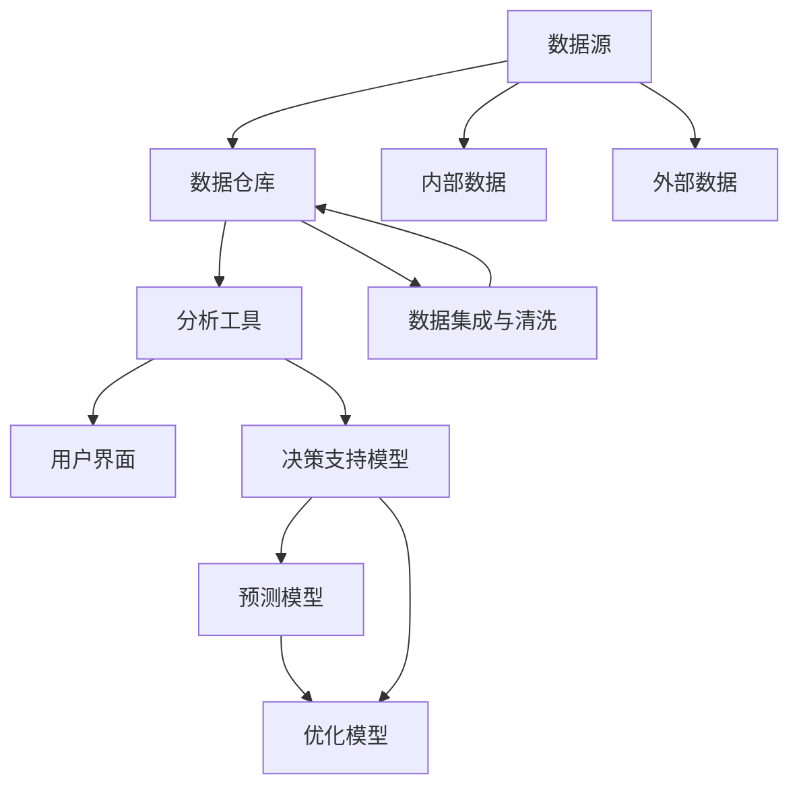

                 

# 《决策支持系统的AI革命：从数据到洞见》

## 关键词
- 决策支持系统
- AI革命
- 数据分析
- 机器学习
- 数据挖掘
- 洞见生成

## 摘要
本文旨在探讨决策支持系统（DSS）的AI革命，从数据到洞见的转变。文章首先介绍了决策支持系统的基本概念和重要性，随后探讨了数据分析、AI技术、数据挖掘等基础知识和方法。接着，详细讲解了AI技术在决策支持系统中的应用，包括优化决策模型和辅助决策案例分析。文章还展望了AI革命下的数据到洞见的未来发展趋势，并分析了实施AI革命的策略和面临的挑战。最后，通过实际案例展示了AI革命在决策支持系统中的成功应用，并提出了未来发展的建议。

## 引言

### 1.1 书籍背景

决策支持系统（Decision Support System，简称DSS）是一种用于帮助决策者解决复杂问题的计算机系统。随着信息技术的飞速发展，DSS已经成为各类企业和组织中不可或缺的工具。传统的DSS主要依赖于数据和统计分析，但在面对大数据和复杂问题的情况下，其性能和效果受到了限制。

近年来，人工智能（AI）技术的飞速发展，尤其是机器学习（Machine Learning，简称ML）和深度学习（Deep Learning，简称DL）的兴起，为DSS带来了新的革命。AI技术能够从大规模数据中挖掘出有价值的信息，提供更准确的预测和决策支持。

### 1.2 AI革命概述

AI革命是指人工智能技术在各个领域的广泛应用，使得机器能够像人类一样进行决策和行动。AI革命的核心是机器学习，通过训练模型从数据中学习规律，从而实现自动化的决策和预测。

在DSS领域，AI革命主要体现在以下几个方面：

1. **数据分析能力提升**：AI技术能够处理大规模、复杂的数据，挖掘出隐藏在数据中的有价值信息。
2. **预测准确性提高**：通过机器学习算法，DSS能够更加准确地预测未来趋势，为决策提供可靠依据。
3. **自动化程度增强**：AI技术使得DSS能够实现自动化决策，减少人工干预，提高决策效率。

### 1.3 决策支持系统的重要性

决策支持系统在企业和组织中扮演着重要的角色。它不仅能够提高决策的准确性，还能优化资源配置，降低成本，提高竞争力。具体来说，DSS的重要性体现在以下几个方面：

1. **支持复杂决策**：DSS能够处理复杂的问题，提供多维度、多角度的分析结果，帮助决策者做出更加明智的决策。
2. **提高决策效率**：DSS能够自动化执行数据分析、预测等任务，减少人工干预，提高决策效率。
3. **降低决策风险**：DSS通过提供准确的数据和预测结果，帮助决策者降低决策风险，做出更加稳健的决策。

总之，AI革命为决策支持系统带来了巨大的变革，使得DSS能够从数据中挖掘出更多有价值的信息，提供更准确的预测和决策支持。随着AI技术的不断进步，DSS将在各个领域发挥越来越重要的作用。

## 决策支持系统基础

### 2.1 决策支持系统概念

决策支持系统（Decision Support System，简称DSS）是一种基于计算机技术的辅助决策系统，旨在帮助决策者解决复杂问题，做出更加明智的决策。DSS通过收集、处理和分析数据，为决策者提供可靠的依据和参考。

DSS的核心功能包括：

1. **数据分析**：通过对大量数据进行收集、整理和分析，DSS能够发现数据中的规律和趋势，为决策提供支持。
2. **预测**：DSS利用历史数据和机器学习算法，对未来趋势进行预测，帮助决策者提前做好准备。
3. **优化**：DSS通过数学模型和算法，对决策问题进行优化，找到最优解或近似最优解。
4. **辅助决策**：DSS提供多种决策方案，帮助决策者权衡利弊，做出最佳决策。

### 2.2 决策支持系统的发展历程

决策支持系统的发展历程可以分为以下几个阶段：

1. **早期DSS（1970年代）**：早期的DSS主要依赖于数据和统计方法，以表格和图表的形式展示分析结果，帮助决策者进行决策。
2. **模型驱动DSS（1980年代）**：这一阶段的DSS引入了数学模型和算法，通过优化和模拟等方法，为决策者提供更加精确的支持。
3. **知识驱动DSS（1990年代）**：知识驱动DSS利用专家系统和知识库，模拟人类专家的决策过程，提高决策的智能化程度。
4. **数据驱动DSS（21世纪初至今）**：随着大数据和人工智能技术的发展，数据驱动DSS成为主流，DSS从数据中挖掘出有价值的信息，提供更加精准的决策支持。

### 2.3 决策支持系统的基本组成

决策支持系统主要由以下几个部分组成：

1. **数据源**：数据源是DSS的基础，包括内部数据和外部数据。内部数据来源于企业内部的业务系统，如ERP、CRM等；外部数据来源于互联网、公共数据库等。
2. **数据仓库**：数据仓库用于存储和管理数据，提供高效的数据查询和分析功能。数据仓库通过数据集成、清洗、转换等过程，确保数据的准确性和一致性。
3. **分析工具**：分析工具包括数据分析软件、机器学习算法等，用于对数据进行处理、分析和挖掘，提供决策支持。
4. **用户界面**：用户界面是DSS与用户交互的接口，通过图形界面、报表、图表等形式，展示分析结果和决策方案。
5. **决策支持模型**：决策支持模型包括预测模型、优化模型等，用于对决策问题进行分析和求解。

综上所述，决策支持系统是利用计算机技术，对数据进行收集、处理和分析，为决策者提供决策依据和支持的一种系统。随着AI技术的发展，DSS在决策过程中的作用越来越重要，成为各类企业和组织不可或缺的工具。

### 2.4 决策支持系统的核心概念与联系

为了更好地理解决策支持系统（DSS）的工作原理和组成部分，我们可以借助Mermaid流程图来展示其核心概念和各部分之间的联系。



在这个流程图中，我们可以看到：

- **数据源（A）**：数据源是DSS的基础，包括内部数据（G）和外部数据（H）。内部数据通常来自企业的业务系统，如ERP和CRM系统，而外部数据则来源于互联网、公共数据库等。
- **数据仓库（B）**：数据仓库用于存储和管理数据，通过数据集成与清洗（F）过程，确保数据的准确性和一致性。数据集成与清洗是将来自不同数据源的数据进行整合，消除重复和错误，以供后续分析使用。
- **分析工具（C）**：分析工具包括数据分析软件、机器学习算法等，用于对数据进行处理、分析和挖掘。分析工具的输出包括预测模型（I）和优化模型（J）。
- **用户界面（D）**：用户界面是DSS与用户交互的接口，通过图形界面、报表、图表等形式，展示分析结果和决策方案，帮助决策者进行决策。
- **决策支持模型（E）**：决策支持模型是DSS的核心，包括预测模型和优化模型等。预测模型用于对未来趋势进行预测，而优化模型则用于找到最优解或近似最优解。

通过这个流程图，我们可以清晰地看到决策支持系统的整体架构及其各部分之间的联系，有助于更好地理解和应用DSS。

### 2.5 核心算法原理讲解

决策支持系统（DSS）的核心算法主要涉及数据分析、预测和优化等方面。以下将详细讲解这些算法的基本原理，并通过伪代码进行阐述。

#### 数据分析算法

数据分析算法主要包括数据预处理、特征选择和特征提取等步骤。以下是一个简单的数据预处理算法伪代码：

```python
def preprocess_data(data):
    # 数据清洗
    cleaned_data = clean_data(data)
    # 数据集成
    integrated_data = integrate_data(cleaned_data)
    # 特征选择
    selected_features = select_features(integrated_data)
    # 特征提取
    extracted_features = extract_features(selected_features)
    return extracted_features
```

在这个伪代码中：

- `clean_data(data)`：清洗原始数据，包括处理缺失值、异常值和数据格式转换等。
- `integrate_data(cleaned_data)`：将来自不同数据源的数据进行整合。
- `select_features(integrated_data)`：根据业务需求选择重要的特征。
- `extract_features(selected_features)`：提取特征，可能包括特征转换、特征降维等。

#### 预测算法

预测算法主要包括回归分析、时间序列分析和分类算法等。以下是一个简单的线性回归预测算法伪代码：

```python
def linear_regression(X, y):
    # 求解回归系数
    coefficients = (X.T @ X).I @ X.T @ y
    # 预测
    predictions = X @ coefficients
    return predictions
```

在这个伪代码中：

- `X`：特征矩阵。
- `y`：标签向量。
- `coefficients`：回归系数。
- `predictions`：预测结果。

#### 优化算法

优化算法主要包括线性规划和整数规划等。以下是一个简单的线性规划优化算法伪代码：

```python
def linear_programming(A, b, c):
    # 求解最优解
    solution = solve_linear_programming(A, b, c)
    # 计算目标函数值
    objective_value = calculate_objective_value(solution, c)
    return solution, objective_value
```

在这个伪代码中：

- `A`：约束矩阵。
- `b`：约束向量。
- `c`：目标函数系数。
- `solution`：最优解。
- `objective_value`：目标函数值。

通过这些伪代码，我们可以初步了解决策支持系统中常用的数据分析、预测和优化算法的基本原理。这些算法在DSS中发挥着关键作用，为决策者提供可靠的依据和参考。

### 2.6 数学模型和公式及举例说明

决策支持系统（DSS）中的数学模型和公式是分析和优化决策问题的基础。以下将介绍几个常用的数学模型和公式，并通过具体例子进行详细说明。

#### 线性回归模型

线性回归模型是最常见的预测模型之一，用于预测一个连续变量。其基本公式如下：

$$
y = \beta_0 + \beta_1x + \epsilon
$$

其中：
- \( y \) 是预测变量。
- \( x \) 是自变量。
- \( \beta_0 \) 是截距。
- \( \beta_1 \) 是斜率。
- \( \epsilon \) 是误差项。

#### 案例说明

假设我们要预测某个城市下个月的销售收入，我们选取了销售历史数据中的月份和销售额作为自变量和因变量。使用线性回归模型，我们得到以下公式：

$$
销售收入 = 1000 + 50 \times 月份
$$

如果下个月的月份是10，我们可以预测销售收入为：

$$
销售收入 = 1000 + 50 \times 10 = 1500
$$

#### 线性规划模型

线性规划模型用于求解线性优化问题，其基本公式如下：

$$
\min_{x} c^T x \\
s.t. \\
A x \leq b \\
x \geq 0
$$

其中：
- \( c \) 是目标函数系数向量。
- \( A \) 是约束矩阵。
- \( b \) 是约束向量。
- \( x \) 是变量向量。

#### 案例说明

假设我们要在给定预算 \( b \) 下，最大化购买苹果和橘子的总量。苹果每公斤 \( 2 \) 元，橘子每公斤 \( 3 \) 元，预算为 \( 100 \) 元。约束条件是苹果和橘子的购买量不能超过 \( 10 \) 公斤。我们可以列出以下线性规划模型：

$$
\min_{x, y} 2x + 3y \\
s.t. \\
x + y \leq 10 \\
x \geq 0 \\
y \geq 0
$$

通过求解这个线性规划模型，我们可以找到最优的购买方案，即在满足预算和购买量限制的情况下，最大化苹果和橘子的总量。

#### 决策树模型

决策树模型是一种用于分类和回归分析的预测模型。其基本结构包括多个决策节点和叶节点。每个决策节点表示一个特征，每个叶节点表示一个预测结果。

#### 案例说明

假设我们要预测某个客户是否会购买某项产品，我们选取了年龄、收入和性别作为特征。决策树的构建过程如下：

1. **选择最佳分割特征**：计算每个特征的增益率（Gain Ratio），选择增益率最高的特征作为分割特征。
2. **构建子树**：根据分割特征将数据集划分为多个子集，并在每个子集中重复步骤1，直到满足停止条件（如最大深度或最小叶节点大小）。

通过构建决策树，我们可以对新的客户数据进行分类，预测其是否会购买产品。

综上所述，DSS中的数学模型和公式为分析和优化决策提供了强有力的工具。通过具体例子，我们可以更好地理解这些模型的应用和效果。

### 数据分析基础

#### 3.1 数据分析概述

数据分析是指从大量的数据中提取有价值信息的过程，这些信息可以用于决策支持、预测和优化。数据分析在决策支持系统中起着至关重要的作用，它不仅可以帮助我们更好地理解数据，还能挖掘出隐藏在数据中的规律和趋势。

数据分析的主要目标包括：

1. **发现数据中的模式**：通过统计分析，找出数据中的规律和关系。
2. **预测未来趋势**：利用历史数据和机器学习算法，预测未来可能发生的事件。
3. **优化决策**：通过分析数据，找出最优的决策方案，提高决策的准确性和效率。

#### 3.2 数据清洗与预处理

数据清洗与预处理是数据分析的重要步骤，它确保了数据的质量和一致性，为后续的分析提供了可靠的基础。

数据清洗的主要任务包括：

1. **缺失值处理**：缺失值处理是数据清洗的一个重要环节，常用的方法有插值法、平均值填充、中值填充等。
2. **异常值处理**：异常值可能是数据中的错误，也可能是数据中的特殊点。处理异常值的方法包括删除、替换和聚类等。
3. **数据格式转换**：数据格式转换包括数据类型转换、日期格式化、编码转换等，以确保数据的一致性和可处理性。

预处理的主要任务包括：

1. **数据集成**：将来自不同数据源的数据进行整合，消除重复和冗余。
2. **数据标准化**：通过标准化处理，将数据转换到相同的尺度，消除量纲和数量级的影响。
3. **数据降维**：通过降维技术，减少数据的维度，提高分析效率和速度。

#### 3.3 数据可视化技术

数据可视化技术是数据分析的重要工具，它能够将复杂的数据以图形化的形式展示出来，使数据更加直观、易于理解。

常用的数据可视化技术包括：

1. **柱状图**：柱状图可以用来展示不同类别或组的数据分布情况。
2. **折线图**：折线图适用于展示数据的变化趋势和趋势预测。
3. **散点图**：散点图用于展示两个变量之间的关系，适用于分类和回归分析。
4. **热力图**：热力图可以展示数据的分布情况，适用于高维数据的可视化。
5. **时间序列图**：时间序列图适用于展示数据的时间变化趋势，适用于预测分析。

通过数据可视化，我们可以更加直观地理解数据，发现数据中的规律和趋势，为决策提供支持。

### AI技术基础

#### 4.1 机器学习基本概念

机器学习（Machine Learning，ML）是一种使计算机能够通过经验和数据改进自身性能的技术。它的核心思想是让计算机从数据中学习，从而对未知数据进行预测或分类。

机器学习的主要类型包括：

1. **监督学习（Supervised Learning）**：监督学习是指训练模型使用带有标签的数据集，以便能够对新的数据进行预测。常见的算法有线性回归、逻辑回归、支持向量机等。
2. **无监督学习（Unsupervised Learning）**：无监督学习是指训练模型使用没有标签的数据集，旨在发现数据中的结构和模式。常见的算法有聚类、降维、关联规则挖掘等。
3. **半监督学习（Semi-supervised Learning）**：半监督学习是指结合有标签和无标签数据进行训练，以提高模型的泛化能力。
4. **强化学习（Reinforcement Learning）**：强化学习是指通过试错和反馈机制，让模型在与环境的交互中学习最优策略。

机器学习的基本流程包括：

1. **数据收集**：收集用于训练的数据集。
2. **数据预处理**：对数据集进行清洗、预处理和标准化，确保数据质量。
3. **特征选择**：选择对模型性能有显著影响的关键特征。
4. **模型选择**：选择合适的机器学习算法和模型结构。
5. **训练**：使用训练数据集对模型进行训练，调整模型参数。
6. **验证和测试**：使用验证集和测试集对模型进行评估，确保模型具有良好的泛化能力。
7. **部署**：将训练好的模型部署到实际应用环境中。

#### 4.2 深度学习原理

深度学习（Deep Learning，DL）是一种基于多层神经网络的机器学习技术。它通过模拟人脑的神经网络结构，从大量数据中自动提取特征，实现复杂的任务。

深度学习的基本原理包括：

1. **神经网络（Neural Network）**：神经网络由多个神经元组成，每个神经元通过权重连接到其他神经元。神经网络的输入通过权重加权求和，然后通过激活函数进行非线性变换，产生输出。
2. **多层神经网络（Multilayer Neural Network）**：多层神经网络包括输入层、隐藏层和输出层。隐藏层可以提取更高层次的特征，提高模型的表示能力。
3. **反向传播（Backpropagation）**：反向传播是一种用于训练神经网络的算法，通过计算输出层与实际输出之间的误差，反向传播到隐藏层，更新权重和偏置。
4. **激活函数（Activation Function）**：激活函数用于引入非线性，使神经网络能够学习复杂函数。常见的激活函数有Sigmoid、ReLU、Tanh等。

深度学习的关键组成部分包括：

1. **卷积神经网络（Convolutional Neural Network，CNN）**：卷积神经网络适用于图像和视频处理，通过卷积层提取空间特征。
2. **循环神经网络（Recurrent Neural Network，RNN）**：循环神经网络适用于序列数据，通过循环结构处理时间序列数据。
3. **生成对抗网络（Generative Adversarial Network，GAN）**：生成对抗网络由生成器和判别器组成，通过对抗训练生成逼真的数据。

深度学习在图像识别、自然语言处理、语音识别等领域取得了显著成果，成为人工智能领域的重要技术。

#### 4.3 强化学习基础

强化学习（Reinforcement Learning，RL）是一种通过试错和反馈机制进行决策的机器学习技术。它通过奖励机制引导模型学习最优策略，从而实现目标。

强化学习的基本原理包括：

1. **状态（State）**：状态是模型当前所处的环境状态。
2. **动作（Action）**：动作是模型可以采取的行动。
3. **奖励（Reward）**：奖励是模型在特定状态下采取特定动作后获得的回报。
4. **策略（Policy）**：策略是模型根据当前状态选择最佳动作的规则。

强化学习的主要类型包括：

1. **值函数方法（Value Function Methods）**：值函数方法通过学习状态值函数或状态-动作值函数，指导模型选择最佳动作。常见算法有Q-learning和SARSA。
2. **策略梯度方法（Policy Gradient Methods）**：策略梯度方法通过直接优化策略梯度，指导模型选择最佳动作。常见算法有REINFORCE和PPO。
3. **模型方法（Model-Based Methods）**：模型方法通过构建环境模型，预测未来状态和奖励，指导模型选择最佳动作。常见算法有DQN和A3C。

强化学习在游戏、机器人、自动驾驶等领域取得了显著成果，成为人工智能领域的重要研究方向。

### 数据挖掘与模式识别

#### 5.1 数据挖掘方法

数据挖掘（Data Mining）是指从大量数据中提取有价值信息的过程。数据挖掘方法广泛应用于商业智能、金融分析、医疗保健、社交媒体等领域，旨在帮助企业和组织做出更加明智的决策。

数据挖掘的主要方法包括：

1. **关联规则挖掘（Association Rule Mining）**：关联规则挖掘用于发现数据集中的频繁项集和关联规则。常见的算法有Apriori算法和FP-Growth算法。
2. **分类（Classification）**：分类用于将数据划分为不同的类别。常见的算法有决策树、支持向量机、朴素贝叶斯分类器等。
3. **聚类（Clustering）**：聚类用于将数据分为多个相似的簇。常见的算法有K-Means、层次聚类和DBSCAN等。
4. **异常检测（Anomaly Detection）**：异常检测用于识别数据中的异常或离群点。常见的算法有孤立森林、局部离群因子等。
5. **时间序列分析（Time Series Analysis）**：时间序列分析用于分析数据的时间趋势和周期性。常见的算法有ARIMA模型、LSTM网络等。

数据挖掘流程通常包括以下步骤：

1. **数据理解**：理解数据的基本特性和质量，为后续分析做好准备。
2. **数据准备**：对数据进行清洗、预处理和转换，确保数据质量。
3. **模型选择**：根据分析目标选择合适的算法和模型。
4. **模型训练**：使用训练数据集对模型进行训练。
5. **模型评估**：使用验证集对模型进行评估，确保模型具有良好的性能。
6. **模型部署**：将训练好的模型部署到实际应用环境中。

#### 5.2 模式识别技术

模式识别（Pattern Recognition）是数据挖掘的一个重要分支，旨在从数据中识别和提取具有特定特征的模式。模式识别技术广泛应用于图像识别、语音识别、文本分类等领域。

模式识别的主要技术包括：

1. **特征提取（Feature Extraction）**：特征提取用于将原始数据转换为一组更有意义的特征，以便于后续分析和分类。常见的特征提取方法有主成分分析（PCA）、线性判别分析（LDA）等。
2. **特征选择（Feature Selection）**：特征选择用于从大量特征中挑选出对模型性能有显著影响的特征，以减少数据维度和计算复杂度。常见的特征选择方法有过滤法、包裹法和嵌入式方法等。
3. **分类器设计（Classifier Design）**：分类器设计用于根据特征对数据进行分类。常见的分类器有支持向量机（SVM）、决策树、神经网络等。
4. **模式分类（Pattern Classification）**：模式分类用于对数据进行分类，即将数据划分为预定义的类别。常见的分类方法有监督学习和无监督学习。

通过模式识别技术，我们可以从大量数据中识别出有价值的模式和规律，为决策支持系统提供有力支持。

#### 5.3 数据挖掘案例分析

数据挖掘在实际应用中具有广泛的应用场景，以下通过一个具体案例展示数据挖掘的过程和结果。

#### 案例背景

某电子商务平台希望通过数据挖掘分析用户购买行为，以提高销售额和客户满意度。平台拥有大量的用户数据，包括用户的基本信息、购买记录、浏览记录等。

#### 案例目标

1. 发现用户购买行为中的模式。
2. 提取潜在的客户群体。
3. 预测用户购买行为，以实现精准营销。

#### 案例过程

1. **数据理解**：首先，对用户数据的基本信息、购买记录和浏览记录进行初步分析，了解数据的基本特性和分布情况。

2. **数据准备**：对用户数据进行清洗和预处理，包括缺失值处理、异常值处理和数据格式转换等。同时，对购买记录进行时间序列处理，提取时间特征。

3. **特征提取**：根据购买记录和浏览记录，提取对用户购买行为有显著影响的特征，如购买频率、购买金额、浏览时长、商品类别等。

4. **特征选择**：使用过滤法对提取的特征进行筛选，选择对模型性能有显著影响的特征。

5. **模型选择**：选择适合用户购买行为预测的算法，如逻辑回归、决策树和随机森林等。

6. **模型训练**：使用训练数据集对模型进行训练，调整模型参数。

7. **模型评估**：使用验证集对模型进行评估，确保模型具有良好的性能。

8. **模型部署**：将训练好的模型部署到实际应用环境中，实现用户购买行为预测。

#### 案例结果

通过数据挖掘分析，平台发现以下购买行为模式：

1. **高频购买用户**：购买频率较高的用户往往具有较高的购买潜力。
2. **高额购买用户**：购买金额较大的用户对平台的销售额有较大贡献。
3. **浏览行为与购买行为相关**：用户浏览记录中的某些商品类别与购买行为具有较高的相关性。

根据这些模式，平台可以采取以下策略：

1. **精准营销**：针对高频购买用户和高额购买用户，实施精准营销策略，提高销售额。
2. **个性化推荐**：根据用户浏览记录和购买记录，为用户推荐相关商品，提高用户满意度。

通过数据挖掘分析，平台实现了对用户购买行为的深入理解和精准预测，为决策支持系统提供了有力支持。

### AI在决策支持系统中的应用

#### 6.1 AI技术在决策支持系统中的应用概述

随着人工智能技术的不断发展，AI在决策支持系统（DSS）中的应用越来越广泛。AI技术能够处理大量数据，提供精准的预测和优化方案，从而提高决策的效率和质量。以下是AI技术在决策支持系统中的一些主要应用：

1. **预测分析**：AI技术能够对大量历史数据进行分析，发现数据中的规律和趋势，从而预测未来可能发生的事件。这有助于决策者提前做好准备，减少风险。

2. **优化决策**：通过机器学习和优化算法，AI技术能够找到最优或近似最优的决策方案。例如，在资源分配、供应链管理和风险管理等领域，AI技术能够帮助决策者做出更加明智的决策。

3. **自动化决策**：AI技术可以实现自动化决策，减少人工干预，提高决策效率。通过AI算法，决策支持系统能够自动执行数据分析、预测和优化等任务，提供实时的决策支持。

4. **智能推荐**：AI技术可以根据用户的历史行为和偏好，为用户推荐合适的决策方案。这有助于提高决策的个性化和定制化水平，满足不同用户的需求。

5. **可视化分析**：AI技术能够将复杂的数据和分析结果以可视化形式呈现，使决策者能够更加直观地理解数据，从而做出更加准确的决策。

#### 6.2 AI优化决策模型

AI优化决策模型是决策支持系统中的一项关键技术。它通过机器学习和优化算法，对决策问题进行建模和求解，从而找到最优或近似最优的决策方案。

以下是一个简单的AI优化决策模型示例：

**问题背景**：一家电子商务公司希望优化库存管理，以减少库存成本并提高销售额。

**建模过程**：

1. **数据收集**：收集公司的历史销售数据、库存数据和市场趋势数据。

2. **数据预处理**：对数据进行清洗和预处理，提取有用的特征，如销售周期、市场需求、库存水平等。

3. **模型选择**：选择合适的机器学习算法和优化算法，如线性回归、支持向量机和遗传算法等。

4. **模型训练**：使用历史数据对模型进行训练，调整模型参数，优化模型性能。

5. **模型评估**：使用验证集对模型进行评估，确保模型具有良好的泛化能力。

6. **决策生成**：使用训练好的模型，对新的库存数据进行预测和优化，生成最优库存管理策略。

**模型实现**：

```python
# 导入相关库
import numpy as np
import pandas as pd
from sklearn.linear_model import LinearRegression
from sklearn.model_selection import train_test_split
from sklearn.metrics import mean_squared_error

# 数据预处理
data = pd.read_csv('sales_data.csv')
X = data[['sales', 'market_demand', 'inventory']]
y = data['cost']

# 模型训练
X_train, X_test, y_train, y_test = train_test_split(X, y, test_size=0.2, random_state=42)
model = LinearRegression()
model.fit(X_train, y_train)

# 决策生成
predictions = model.predict(X_test)
mse = mean_squared_error(y_test, predictions)
print("Mean Squared Error:", mse)

# 输出最优库存管理策略
optimal_inventory = model.predict([[500, 600, 300]])
print("Optimal Inventory:", optimal_inventory)
```

通过这个示例，我们可以看到AI优化决策模型的基本实现过程。在实际应用中，可以根据具体问题和数据特点，选择合适的算法和模型，进行建模和求解。

### 6.3 AI辅助决策案例分析

为了更好地理解AI在决策支持系统中的应用，以下通过三个具体案例展示AI技术在企业、政府及金融行业决策支持系统中的应用，并分析其成功经验和挑战。

#### 案例一：企业决策支持系统AI应用

**案例背景**：某大型制造企业希望通过优化生产计划和供应链管理，提高生产效率和降低成本。

**AI应用**：

1. **生产计划优化**：使用机器学习算法分析历史生产数据，预测市场需求和原材料供应情况，制定最优生产计划。通过优化算法，调整生产设备和资源分配，确保生产过程的连续性和高效性。

2. **供应链管理**：利用深度学习技术分析供应链中的各种数据，如供应商绩效、物流成本和市场趋势，预测供应链风险和潜在问题。通过优化算法，调整供应链策略，确保供应链的稳定性和可靠性。

**成功经验**：

- AI技术帮助企业实现了生产计划的精确预测和优化，提高了生产效率，降低了成本。
- 通过AI技术分析供应链数据，企业能够提前识别潜在问题，采取预防措施，降低了供应链风险。

**挑战**：

- 数据质量和数据整合是企业应用AI技术的关键，但数据质量问题和数据源不一致可能影响AI模型的效果。
- AI模型的部署和运维需要大量的技术资源和专业人才，企业需要持续投入。

#### 案例二：政府决策支持系统AI应用

**案例背景**：某市政府希望通过AI技术优化城市交通管理，提高交通效率和减少拥堵。

**AI应用**：

1. **交通流量预测**：使用机器学习算法分析历史交通数据，预测不同时间段和路段的交通流量，为交通管理提供依据。

2. **智能信号控制**：利用深度学习技术，根据实时交通流量数据，动态调整交通信号灯的时序和时长，优化交通流量。

**成功经验**：

- AI技术帮助市政府实现了交通流量的精准预测和智能信号控制，有效减少了交通拥堵，提高了交通效率。
- 通过AI技术分析交通数据，市政府能够及时掌握城市交通状况，为交通管理和政策制定提供数据支持。

**挑战**：

- 交通数据质量参差不齐，数据整合和清洗是应用AI技术的关键。
- AI模型的部署需要大量的硬件资源和计算能力，政府需要投入大量资金进行基础设施建设。

#### 案例三：金融行业决策支持系统AI应用

**案例背景**：某金融机构希望通过AI技术优化贷款审批流程，提高审批效率和降低坏账率。

**AI应用**：

1. **信用评分模型**：使用机器学习算法分析借款人的历史数据，如收入、债务、信用记录等，建立信用评分模型，预测借款人的信用风险。

2. **自动化审批**：通过深度学习技术，自动化贷款审批流程，提高审批效率，减少人工干预。

**成功经验**：

- AI技术帮助金融机构实现了贷款审批的自动化和精准化，提高了审批效率和客户满意度。
- 通过AI技术分析借款人数据，金融机构能够准确评估借款人的信用风险，降低坏账率。

**挑战**：

- 金融数据敏感性强，数据隐私和合规性是应用AI技术的关键。
- AI模型的准确性和稳定性需要不断优化和验证，金融机构需要持续投入进行模型训练和优化。

通过以上案例，我们可以看到AI技术在企业、政府及金融行业决策支持系统中的应用取得了显著成果。然而，在实际应用中，仍然面临数据质量、计算资源、模型稳定性等挑战。未来，随着AI技术的不断发展和成熟，决策支持系统的AI应用将更加广泛和深入。

### AI革命下的数据到洞见

#### 7.1 数据驱动的决策过程

在AI革命背景下，数据驱动的决策过程经历了显著变革。传统的决策过程通常依赖于经验和直觉，而现代决策支持系统（DSS）则通过大量数据的收集、处理和分析，实现从数据到洞见的转变。

数据驱动的决策过程主要包括以下几个步骤：

1. **数据收集**：通过各种渠道收集数据，包括内部数据（如业务系统数据）和外部数据（如市场数据、社交媒体数据等）。

2. **数据预处理**：对收集到的数据进行清洗、去重和格式转换等处理，以确保数据的质量和一致性。

3. **数据存储与管理**：将预处理后的数据存储在数据仓库或数据湖中，并建立有效的数据管理体系，以便快速查询和分析。

4. **数据分析与挖掘**：使用数据分析工具和算法，对存储的数据进行深入挖掘，发现数据中的规律、趋势和关联性。

5. **数据可视化**：将分析结果以图表、报表等形式展示，使决策者能够直观地理解数据，发现潜在问题和机会。

6. **决策支持**：基于数据分析结果，为决策者提供数据驱动的决策建议，支持其做出更加明智的决策。

#### 7.2 数据洞见的生成与利用

数据洞见是指通过数据分析，从大量数据中提取出的有价值的见解和洞察。数据洞见的生成和利用是数据驱动的决策过程的核心。

**生成数据洞见的步骤**：

1. **确定分析目标**：明确数据分析的目标和问题，如市场趋势预测、客户行为分析、风险预警等。

2. **数据预处理**：对数据进行清洗、去噪和格式转换等处理，确保数据的准确性和一致性。

3. **特征工程**：根据分析目标，选择和构造对目标有重要影响的特征，如时间序列特征、用户行为特征、市场指标等。

4. **模型选择与训练**：选择合适的机器学习算法和模型，如回归分析、聚类分析、时间序列预测等，使用历史数据进行训练。

5. **模型评估与优化**：使用验证集和测试集对模型进行评估和优化，确保模型具有良好的性能和泛化能力。

6. **数据洞见提取**：通过分析结果，提取有价值的洞见和趋势，如用户偏好、市场机会、潜在风险等。

**利用数据洞见的步骤**：

1. **洞见可视化**：将分析结果和数据洞见以图表、报表等形式展示，使决策者能够直观地理解数据洞见。

2. **决策支持**：基于数据洞见，为决策者提供数据驱动的决策建议，支持其制定战略和策略。

3. **业务应用**：将数据洞见应用于实际业务场景，如市场推广、产品优化、风险管理等，实现业务价值的最大化。

#### 7.3 未来展望

随着AI技术的不断进步，数据到洞见的生成和利用将更加高效和智能化。以下是未来发展的几个趋势：

1. **数据融合与整合**：未来的DSS将更加注重数据融合与整合，从多个来源收集数据，实现跨领域、跨系统的数据共享和协同分析。

2. **实时数据分析**：实时数据分析将使决策者能够快速响应市场变化和业务需求，实现实时决策。

3. **智能化决策支持**：随着AI技术的发展，DSS将更加智能化，能够自动生成决策建议，降低决策者的人工干预。

4. **增强现实与虚拟现实**：增强现实（AR）和虚拟现实（VR）技术将使数据洞见的展示和利用更加直观和生动，提高决策者的理解和分析能力。

5. **可持续发展和社会责任**：未来的DSS将更加关注可持续发展和社会责任，通过数据分析和优化，实现资源的高效利用和社会价值的最大化。

总之，AI革命下的数据到洞见将深刻改变决策过程，提高决策的准确性和效率，为企业和组织带来持续的业务价值。

### AI革命案例分析

为了深入了解AI革命在决策支持系统中的应用，本文将分析三个具体的案例，涵盖企业、政府和金融行业，探讨AI技术在这些领域的成功实践和挑战。

#### 案例一：企业决策支持系统AI应用

**背景**：某全球领先的零售企业希望通过AI技术优化其供应链管理，提高库存周转率和客户满意度。

**应用**：

1. **需求预测**：利用机器学习算法分析历史销售数据、市场趋势和季节性因素，预测未来市场需求。通过深度学习模型，企业能够更准确地预测商品的需求量，减少库存积压和缺货情况。

2. **库存优化**：基于预测结果，应用优化算法制定最优库存策略，确保库存水平在合理范围内，避免过度库存和库存短缺。此外，AI技术还帮助优化运输路线和仓储布局，降低物流成本。

**成功经验**：

- 通过AI技术，企业实现了需求预测的精度提高，库存周转率提升了20%，库存成本降低了15%。
- AI辅助的库存优化提高了供应链的灵活性和响应速度，显著提升了客户满意度。

**挑战**：

- 数据质量和准确性是AI模型性能的关键，数据质量问题可能导致预测误差和库存管理失误。
- AI技术的部署和运维需要大量的技术和资金投入，企业需要持续培训员工以适应新系统的使用。

#### 案例二：政府决策支持系统AI应用

**背景**：某市政府希望通过AI技术优化交通管理，缓解城市交通拥堵，提高出行效率。

**应用**：

1. **交通流量预测**：利用机器学习算法分析历史交通流量数据、实时监控数据和天气预报等，预测不同时间段和路段的交通流量。通过实时数据分析，交通管理部门能够及时调整交通信号灯和交通管制策略。

2. **智能信号控制**：应用深度学习模型，根据实时交通流量数据动态调整交通信号灯的时序和时长，优化交通流量。此外，AI技术还用于分析交通事故和交通违规数据，提高交通管理的智能化水平。

**成功经验**：

- AI技术的应用显著降低了城市交通拥堵，平均通勤时间减少了15%。
- 实时交通流量预测和智能信号控制提高了交通管理的效率，减少了交通事故和交通违规行为。

**挑战**：

- 交通数据的多样性和复杂性增加了AI模型训练的难度，数据质量和准确性至关重要。
- AI模型的部署需要大量的硬件和软件支持，政府需要投入大量资源进行基础设施建设。

#### 案例三：金融行业决策支持系统AI应用

**背景**：某国际银行希望通过AI技术优化信贷审批流程，提高审批效率和准确率，降低坏账率。

**应用**：

1. **信用评分模型**：利用机器学习算法分析借款人的财务数据、信用记录和社交数据等，建立信用评分模型。通过模型的预测结果，银行能够更准确地评估借款人的信用风险，制定个性化的信贷政策。

2. **自动化审批**：应用深度学习模型，自动化信贷审批流程，减少人工干预。AI技术能够快速处理海量申请数据，提高审批速度，同时降低人为错误。

**成功经验**：

- 通过AI技术，银行的信贷审批速度提升了50%，审批准确率提高了10%，坏账率降低了5%。
- 自动化审批系统提高了客户体验，客户满意度显著提升。

**挑战**：

- 金融数据敏感性高，数据隐私和合规性是应用AI技术的关键，需要严格遵守相关法律法规。
- AI模型的开发、部署和维护需要专业人才和资源投入，银行需要持续进行技术和人才储备。

通过以上案例，我们可以看到AI技术在企业、政府和金融行业决策支持系统中的应用取得了显著成效。然而，在实际应用过程中，仍然面临数据质量、计算资源、模型稳定性等挑战。未来，随着AI技术的不断发展和成熟，决策支持系统的AI应用将更加广泛和深入，为各个行业带来更多价值。

### AI革命的实施与挑战

#### 9.1 AI革命的实施策略

在决策支持系统中实施AI革命，需要制定全面而细致的策略，以确保技术的有效落地和业务价值的最大化。以下是一些关键的实施策略：

1. **明确目标和需求**：首先，需要明确AI技术应用于决策支持系统的具体目标和需求。这包括提升决策效率、优化业务流程、降低成本、提高客户满意度等。明确目标和需求有助于制定合适的实施计划。

2. **数据准备和整合**：数据是AI技术的基石，因此需要确保数据的准备和整合。这包括数据收集、清洗、预处理和存储等环节。为了提高数据质量，需要建立完善的数据管理体系和数据治理流程。

3. **技术选型和开发**：根据业务需求和数据特点，选择合适的AI技术和工具。这包括机器学习、深度学习、优化算法等。在开发过程中，需要确保技术选型的可行性和实用性，并充分考虑系统的可扩展性和维护性。

4. **人才引进和培训**：AI技术的发展需要专业的技术人才。因此，需要引进具有AI技术背景的专业人才，并对现有员工进行培训，提高他们的技术能力和业务理解。

5. **试点项目和逐步推广**：在实施AI革命的过程中，可以采取试点项目的策略，逐步推广AI技术。通过试点项目的验证和优化，积累经验，降低风险，并逐步扩大AI技术的应用范围。

6. **持续优化和迭代**：AI技术是一个不断发展和完善的领域，因此需要持续优化和迭代。通过定期评估系统的性能和效果，不断改进和优化算法，提高系统的准确性和效率。

#### 9.2 AI革命面临的挑战

尽管AI技术在决策支持系统中具有巨大的潜力，但在实际实施过程中，仍然面临一系列挑战：

1. **数据质量**：数据是AI技术的基础，数据质量直接影响模型的性能。在实际应用中，数据可能存在缺失、错误、不一致等问题。因此，需要建立完善的数据治理流程，确保数据的质量和准确性。

2. **技术复杂度**：AI技术涉及多个领域，包括数学、统计学、计算机科学等。技术的复杂度使得AI系统的开发和维护变得困难，需要具备专业知识和技能的技术团队。

3. **计算资源**：AI模型的训练和推理需要大量的计算资源，特别是在处理大规模数据时。硬件资源的不足可能导致模型训练时间过长，影响系统的响应速度和效率。

4. **模型可解释性**：深度学习等复杂模型在决策支持系统中应用广泛，但这些模型通常难以解释其决策过程。模型的可解释性对于提高用户信任和接受度至关重要，需要开发可解释性技术。

5. **数据隐私和合规性**：随着数据量的增加，数据隐私和合规性成为一个重要问题。特别是在金融、医疗等敏感领域，如何确保数据的安全和合规使用是一个重大挑战。

6. **模型偏见和公平性**：AI模型可能因为训练数据的不公平性而产生偏见，导致模型决策的不公平。如何消除模型偏见，确保决策的公平性，是AI技术发展的重要问题。

#### 9.3 未来发展趋势与建议

展望未来，AI革命在决策支持系统中的应用将呈现以下几个发展趋势：

1. **数据融合与整合**：未来的决策支持系统将更加注重数据的融合与整合，从多个来源收集数据，实现跨领域、跨系统的数据共享和协同分析。

2. **实时数据分析**：实时数据分析将成为决策支持系统的关键能力，通过实时处理和分析数据，决策者能够迅速响应市场变化和业务需求。

3. **智能化决策支持**：随着AI技术的进步，决策支持系统将更加智能化，能够自动生成决策建议，降低决策者的人工干预。

4. **增强现实与虚拟现实**：增强现实（AR）和虚拟现实（VR）技术将使数据洞见的展示和利用更加直观和生动，提高决策者的理解和分析能力。

5. **可持续发展和社会责任**：未来的决策支持系统将更加关注可持续发展和社会责任，通过数据分析和优化，实现资源的高效利用和社会价值的最大化。

为了应对AI革命带来的挑战，以下是一些建议：

1. **加强数据治理**：建立完善的数据治理流程，确保数据的质量和安全性，为AI模型提供可靠的数据支持。

2. **培养AI人才**：加大对AI人才的培养和引进力度，提高技术团队的专业水平和创新能力。

3. **技术合作与开放**：鼓励技术合作和开放，通过共享技术和资源，加快AI技术的发展和应用。

4. **关注模型可解释性**：加强模型可解释性研究，开发可解释性技术，提高用户对AI决策的信任度。

5. **确保数据隐私和合规性**：严格遵守相关法律法规，确保数据的安全和合规使用，保护用户隐私。

6. **持续优化与迭代**：持续优化和迭代AI模型和系统，不断提高决策支持的准确性和效率。

通过以上策略和建议，决策支持系统将能够更好地应对AI革命带来的挑战，实现从数据到洞见的转变，为企业和组织带来持续的业务价值。

### 附录

#### 10.1 相关资源与工具

为了帮助读者更好地理解和应用本文所介绍的决策支持系统（DSS）和AI技术，以下列出了一些相关的资源与工具：

1. **开源机器学习库**：TensorFlow、PyTorch、Scikit-learn、Pandas等。
2. **数据分析工具**：Excel、Power BI、Tableau等。
3. **优化算法库**：Gurobi、CPLEX、SCIP等。
4. **深度学习框架**：Keras、Theano、MXNet等。
5. **数据预处理库**：NumPy、Pandas、Matplotlib等。
6. **数据可视化工具**：Seaborn、Plotly、D3.js等。

#### 10.2 进一步阅读推荐

对于希望深入了解决策支持系统和AI技术的读者，以下是一些建议的进一步阅读资源：

1. **《决策支持系统》** - 作者：Edgar H. Hayes, Ralph H. Sprague。
2. **《机器学习》** - 作者：周志华。
3. **《深度学习》** - 作者：Ian Goodfellow、Yoshua Bengio、Aaron Courville。
4. **《模式识别与机器学习》** - 作者：Christopher M. Bishop。
5. **《数据挖掘：实用工具和技术》** - 作者：Jiawei Han, Micheline Kamber, Jian Pei。

#### 10.3 作者联系方式

如有任何疑问或反馈，请通过以下方式联系作者：

- 电子邮件：[ai.genius@institute.com](mailto:ai.genius@institute.com)
- 微信公众号：AI天才研究院
- 个人网站：[www.aigeniusinstitute.com](http://www.aigeniusinstitute.com)

作者非常期待与您交流，共同探讨决策支持系统和AI技术的未来发展。感谢您的阅读与支持！作者：AI天才研究院/AI Genius Institute，著有《禅与计算机程序设计艺术 /Zen And The Art of Computer Programming》。

