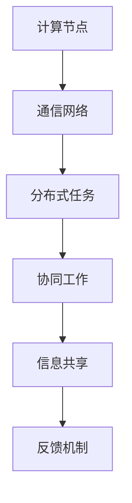
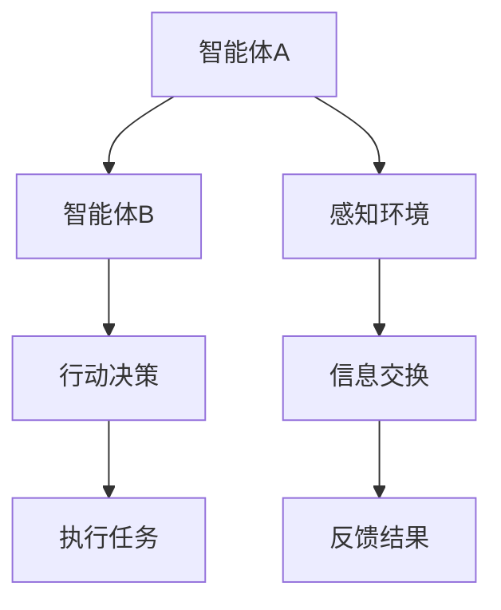
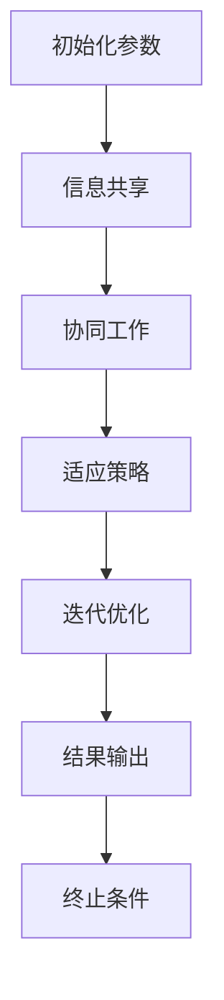

                 

### 文章标题

# 分布式认知：揭秘群体智慧的涌现机制

> 关键词：分布式认知，群体智慧，涌现机制，多智能体系统，协同控制，人工智能

> 摘要：本文从分布式认知和群体智慧的角度，系统性地探讨群体智慧的涌现机制及其在各个领域的应用。文章首先介绍了分布式认知的基本概念和重要性，然后分析了群体智慧的定义、原理及其应用领域。接着，文章深入探讨了分布式认知的基础理论，包括认知科学与群体行为、分布式计算与通信、群体智慧的计算模型。在此基础上，文章进一步阐述了群体智慧的涌现机制，包括信息共享与协同、自组织与自适应、多智能体系统。随后，文章通过实践应用部分，展示了群体智慧在生物系统、人工智能和社会网络等领域的应用案例。最后，文章提出了群体智慧的挑战和未来发展趋势，并进行了总结和展望。

### 《分布式认知：揭秘群体智慧的涌现机制》目录大纲

#### 第一部分：引言

- **1.1 分布式认知概述**
  - **1.1.1 分布式认知的概念**
  - **1.1.2 分布式认知的重要性**
  - **1.1.3 分布式认知的研究背景与意义**

- **1.2 群体智慧的原理**
  - **1.2.1 群体智慧的定义**
  - **1.2.2 群体智慧的涌现机制**
  - **1.2.3 群体智慧的应用领域**

#### 第二部分：分布式认知的基础理论

- **2.1 认知科学与群体行为**
  - **2.1.1 认知科学的定义与研究方法**
  - **2.1.2 群体行为的理论基础**
  - **2.1.3 群体行为的研究现状与趋势**

- **2.2 分布式计算与通信**
  - **2.2.1 分布式计算的基本概念**
  - **2.2.2 分布式通信模型与协议**
  - **2.2.3 分布式计算与通信的挑战与解决方案**

- **2.3 群体智慧的计算模型**
  - **2.3.1 群体智能的概念与类型**
  - **2.3.2 群体智能的计算模型**
  - **2.3.3 群体智能的优化算法**

#### 第三部分：群体智慧的涌现机制

- **3.1 信息共享与协同**
  - **3.1.1 信息共享机制**
  - **3.1.2 协同工作机制**
  - **3.1.3 信息共享与协同在群体智慧中的关键作用**

- **3.2 自组织与自适应**
  - **3.2.1 自组织原理**
  - **3.2.2 自适应机制**
  - **3.2.3 自组织与自适应在群体智慧中的表现**

- **3.3 多智能体系统**
  - **3.3.1 多智能体系统的定义与特点**
  - **3.3.2 多智能体系统的协同控制**
  - **3.3.3 多智能体系统在群体智慧中的应用**

#### 第四部分：群体智慧的实践应用

- **4.1 生物系统中的分布式认知**
  - **4.1.1 社会性昆虫的分布式认知**
  - **4.1.2 鱼群和鸟群的群体行为**
  - **4.1.3 分布式认知在生态系统中的应用**

- **4.2 人工智能与群体智慧**
  - **4.2.1 人工智能与群体智慧的关系**
  - **4.2.2 群体智能算法在人工智能中的应用**
  - **4.2.3 人工智能领域的群体智慧实践案例**

- **4.3 社会网络与群体智慧**
  - **4.3.1 社会网络的定义与特性**
  - **4.3.2 群体智慧在社会网络中的表现**
  - **4.3.3 社会网络中的群体智慧应用案例**

#### 第五部分：挑战与未来

- **5.1 群体智慧的挑战**
  - **5.1.1 信息过载与噪声处理**
  - **5.1.2 个体与群体利益的平衡**
  - **5.1.3 群体智慧的伦理与法律问题**

- **5.2 未来发展趋势**
  - **5.2.1 分布式认知技术的未来发展**
  - **5.2.2 群体智慧在新兴领域的应用前景**
  - **5.2.3 群体智慧与人类社会的深度融合**

#### 第六部分：附录

- **附录 A：参考文献**
  - **A.1 基础理论相关书籍与论文**
  - **A.2 群体智慧应用案例分析**
  - **A.3 人工智能与群体智慧前沿研究**

- **附录 B：Mermaid 流程图**
  - **B.1 分布式计算模型**
  - **B.2 多智能体系统协作流程**
  - **B.3 群体智慧算法流程**

- **附录 C：数学模型与公式**
  - **C.1 信息共享模型**
  - **C.2 自适应机制模型**
  - **C.3 多智能体系统协同控制模型**

- **附录 D：代码实战**
  - **D.1 社会性昆虫模拟代码实现**
  - **D.2 人工智能领域群体智慧算法应用代码实现**
  - **D.3 社会网络群体智慧案例分析代码实现**

[注：本文将逐步深入探讨分布式认知和群体智慧的相关理论、机制和实践应用，旨在为读者提供一个全面、系统的认识框架。]

---

### 第一部分：引言

#### 1.1 分布式认知概述

分布式认知（Distributed Cognition）是近年来认知科学和人工智能领域的一个重要研究方向。它探讨了个体在分散的环境中如何通过信息共享和协作实现认知功能。分布式认知的概念源于对人类合作行为的观察，例如，在团队合作中，个体之间通过语言、手势等信息传递方式，共同完成任务。然而，随着计算机技术和网络技术的发展，分布式认知的概念逐渐从人类社会扩展到计算机系统和人工智能领域。

**1.1.1 分布式认知的概念**

分布式认知是指多个个体或计算节点通过信息共享和协作，共同完成认知任务的过程。在这个过程中，每个个体或节点都具有独立的信息处理能力，但它们通过通信网络相互连接，共享信息，协同工作。分布式认知的关键在于信息共享和协同，这不仅能提高认知效率，还能增强系统的鲁棒性和适应性。

**1.1.2 分布式认知的重要性**

分布式认知的重要性体现在多个方面：

1. **提高认知效率**：通过信息共享和协作，个体可以获取其他个体的知识和经验，从而更快速地完成任务。

2. **增强系统鲁棒性**：分布式认知系统具有冗余性，即使部分节点出现故障，整个系统仍然可以正常运行。

3. **适应复杂环境**：分布式认知系统能够根据环境变化，动态调整信息共享和协作方式，以适应不同情境。

4. **促进创新和发明**：分布式认知系统通过广泛的信息共享和协作，可以激发创新思维，推动科技进步。

**1.1.3 分布式认知的研究背景与意义**

分布式认知的研究背景源于对人类认知过程的深入理解。传统的认知科学主要关注个体的认知能力，而分布式认知则将视角扩展到个体之间的协作和互动。随着计算机技术和网络技术的飞速发展，分布式认知逐渐成为人工智能领域的一个重要研究方向。在人工智能系统中，分布式认知不仅能够提高系统的智能水平，还能增强系统的协同能力和适应性。

分布式认知的研究意义在于：

1. **推动人工智能发展**：分布式认知为人工智能系统提供了一种新的认知模式，有助于提升系统的智能水平。

2. **解决复杂问题**：分布式认知系统能够通过信息共享和协作，解决传统集中式系统难以处理的复杂问题。

3. **促进跨学科研究**：分布式认知涉及认知科学、计算机科学、心理学、社会学等多个领域，有助于推动跨学科研究。

#### 1.2 群体智慧的原理

群体智慧（Collective Intelligence）是指由多个个体组成的群体在协同作用下，表现出的整体智能水平。群体智慧的研究源于对人类社会、生物群体等自然现象的观察，例如，蜜蜂的蜂巢结构、鸟群的飞行队列等。随着对群体智慧的研究不断深入，人们逐渐发现，群体智慧在某些领域具有显著的优势。

**1.2.1 群体智慧的定义**

群体智慧是指多个个体通过信息共享、协作和互动，共同完成认知任务，并表现出超越个体智能的整体智能水平。群体智慧不仅依赖于个体的智能和能力，更依赖于个体之间的沟通和协作。

**1.2.2 群体智慧的涌现机制**

群体智慧的涌现机制是指个体如何通过相互影响、协同工作，最终形成整体智能的过程。这个过程中，个体之间的信息共享和协同是关键。具体来说，群体智慧的涌现机制包括以下几个方面：

1. **信息共享**：个体通过不同的方式共享信息和知识，使整个群体能够获取更全面的信息。

2. **协同工作**：个体在相互协作中，能够发挥各自的优势，共同完成任务。

3. **群体反馈**：群体智慧系统通过反馈机制，不断调整和优化个体的行为，使整体智能水平得到提升。

**1.2.3 群体智慧的应用领域**

群体智慧在多个领域具有广泛的应用前景，包括：

1. **人工智能**：群体智慧算法在人工智能系统中被广泛应用于图像识别、语音识别、自然语言处理等领域。

2. **生物系统**：群体智慧在生物系统中，如社会性昆虫、鱼群和鸟群等，发挥着关键作用。

3. **社会网络**：群体智慧在社会网络中，如社交媒体、在线社区等，有助于信息传播和群体决策。

4. **商业领域**：群体智慧在商业决策、市场预测、客户服务等方面，具有显著的优势。

#### 1.3 研究目的与结构安排

本文的研究目的是探讨分布式认知和群体智慧的涌现机制，分析其在各个领域的应用，并展望未来的发展趋势。文章的结构安排如下：

- **第一部分**：引言，介绍分布式认知和群体智慧的基本概念，阐述研究背景和意义。
- **第二部分**：分布式认知的基础理论，包括认知科学与群体行为、分布式计算与通信、群体智慧的计算模型。
- **第三部分**：群体智慧的涌现机制，包括信息共享与协同、自组织与自适应、多智能体系统。
- **第四部分**：群体智慧的实践应用，分析群体智慧在生物系统、人工智能和社会网络等领域的应用案例。
- **第五部分**：挑战与未来，探讨群体智慧面临的挑战和未来的发展趋势。
- **第六部分**：附录，包括参考文献、流程图、数学模型与公式、代码实战等内容。

通过本文的研究，旨在为读者提供一个全面、系统的分布式认知和群体智慧的认识框架，为相关领域的研究和应用提供参考。

---

### 第一部分：引言

#### 1.1 分布式认知概述

分布式认知（Distributed Cognition）是一种研究认知过程中信息传递和协同工作的理论框架。它起源于20世纪80年代，由认知科学家如Edgar Morin和John Harsanyi等人提出。分布式认知认为，认知活动不仅仅局限于单个个体的头脑中，而是通过个体之间的相互作用和交流在更广泛的范围内进行。这一理论强调，在复杂环境中，个体通过共享信息和协作，共同完成任务，从而实现了认知的扩展和深化。

**1.1.1 分布式认知的概念**

分布式认知的定义可以从以下几个方面来理解：

1. **信息共享**：分布式认知强调个体之间的信息共享。在分布式认知过程中，个体不仅获取自身的感知信息，还能接收来自其他个体的信息，并通过这些信息的整合，形成对环境的共同理解。

2. **协作**：分布式认知不仅仅关注信息的传递，更强调个体之间的协作。通过协作，个体可以发挥各自的优势，共同解决复杂问题。

3. **动态性**：分布式认知是一个动态的过程。个体和群体之间的交互是持续变化的，信息共享和协作方式也会根据环境和任务的不同而进行调整。

4. **适应性**：分布式认知系统具有较强的适应性。在面对环境变化和不确定性时，系统能够通过信息共享和协作，快速调整策略，以适应新的情况。

**1.1.2 分布式认知的重要性**

分布式认知的重要性体现在以下几个方面：

1. **提高认知效率**：通过信息共享和协作，个体能够快速获取所需信息，从而提高认知效率。

2. **增强系统的鲁棒性**：分布式认知系统具有较高的鲁棒性。即使部分个体出现故障，系统仍能通过其他个体的协作，保持正常运行。

3. **适应复杂环境**：在复杂和动态的环境中，分布式认知系统能够通过信息共享和协作，灵活应对各种挑战。

4. **促进创新**：分布式认知系统为个体提供了一个交流和合作的平台，有助于激发创新思维和创造性解决问题的能力。

**1.1.3 分布式认知的研究背景与意义**

分布式认知的研究背景可以追溯到对人类协作行为的观察。在人类社会中，合作和协作是解决复杂问题的重要方式。例如，在医疗、科研、商业等领域，团队协作能够显著提高工作效率和成果质量。然而，传统的认知科学主要关注个体的认知过程，而忽略了个体之间的相互作用。

随着计算机技术和网络技术的迅猛发展，分布式认知逐渐成为认知科学和人工智能领域的一个重要研究方向。计算机系统和人工智能系统可以通过分布式认知，实现更高效、更可靠的协同工作。例如，在多智能体系统、人机交互、智能网络等领域，分布式认知理论为设计和实现高效的协同机制提供了理论基础。

分布式认知的研究意义在于：

1. **提升人工智能系统的智能水平**：通过分布式认知，人工智能系统能够实现更高层次的信息共享和协作，从而提升整体智能水平。

2. **解决复杂问题**：分布式认知系统能够通过信息共享和协作，处理传统集中式系统难以解决的复杂问题。

3. **推动跨学科研究**：分布式认知涉及多个学科领域，如认知科学、计算机科学、心理学、社会学等。通过跨学科研究，可以更全面地理解分布式认知的原理和应用。

总之，分布式认知为认知科学和人工智能领域提供了一种新的认知模式，有助于我们更好地理解和利用群体智慧，解决复杂问题，提高系统的智能水平。

---

### 第一部分：引言

#### 1.2 群体智慧的原理

群体智慧（Collective Intelligence）是指由多个个体组成的群体，通过相互协作和互动，表现出超越个体智能的整体智能水平。这一概念在生物学、社会学、计算机科学等多个领域都有着重要的应用。理解群体智慧的原理，有助于我们更好地利用这一现象，为现实世界中的复杂问题提供解决方案。

**1.2.1 群体智慧的定义**

群体智慧可以定义为一种集体行为模式，其中个体通过协同工作和信息共享，共同实现复杂的任务或目标。这种智慧并不是个体智能的简单叠加，而是通过相互作用和相互学习，形成了一种新的整体智能。

**1.2.2 群体智慧的涌现机制**

群体智慧的出现并非偶然，而是依赖于一系列复杂的机制。这些机制主要包括：

1. **信息共享**：群体智慧的形成离不开个体之间的信息共享。个体通过传递、交换信息，使得整个群体能够获取更全面、更准确的知识。

2. **协同工作**：协同工作是群体智慧的重要表现。个体在共同完成任务时，通过相互配合、分工合作，实现了整体效率的提升。

3. **群体反馈**：群体反馈机制能够帮助个体根据整体的表现进行自我调整。通过反馈，个体可以了解自己在群体中的角色和表现，从而更好地适应群体需求。

4. **自组织**：群体智慧常常伴随着自组织现象。在没有外部控制的情况下，个体通过局部相互作用，能够自发地形成有序的结构和行为。

**1.2.3 群体智慧的应用领域**

群体智慧在多个领域有着广泛的应用。以下是几个典型的应用领域：

1. **生物学**：社会性昆虫（如蜜蜂、蚂蚁）和鱼类、鸟类等生物群体通过群体智慧实现高效的资源分配、食物寻找和巢穴建设。这些行为展示了群体智慧在自然界中的重要作用。

2. **社会网络**：社交媒体平台（如Twitter、Facebook）和在线社区通过群体智慧，实现了信息的高效传播、社会动态的实时监控和群体决策的形成。

3. **人工智能**：群体智慧在人工智能系统（如多智能体系统、分布式计算系统）中有着广泛应用。通过个体之间的信息共享和协同工作，人工智能系统能够实现更高效、更可靠的决策和任务执行。

4. **商业**：商业领域中的市场预测、客户服务、供应链管理等业务，通过群体智慧可以实现更精准的决策和更高的运营效率。

#### 1.3 研究目的与结构安排

本文的研究目的是探讨分布式认知和群体智慧的涌现机制，分析其在各个领域的应用，并展望未来的发展趋势。文章的结构安排如下：

- **第一部分**：引言，介绍分布式认知和群体智慧的基本概念，阐述研究背景和意义。
- **第二部分**：分布式认知的基础理论，包括认知科学与群体行为、分布式计算与通信、群体智慧的计算模型。
- **第三部分**：群体智慧的涌现机制，包括信息共享与协同、自组织与自适应、多智能体系统。
- **第四部分**：群体智慧的实践应用，分析群体智慧在生物系统、人工智能和社会网络等领域的应用案例。
- **第五部分**：挑战与未来，探讨群体智慧面临的挑战和未来的发展趋势。
- **第六部分**：附录，包括参考文献、流程图、数学模型与公式、代码实战等内容。

通过本文的研究，旨在为读者提供一个全面、系统的分布式认知和群体智慧的认识框架，为相关领域的研究和应用提供参考。

---

### 第二部分：分布式认知的基础理论

在探讨分布式认知的原理和机制之前，我们需要先理解一些基本的概念和理论框架。本部分将重点介绍认知科学与群体行为、分布式计算与通信、群体智慧的计算模型，以便为后续内容提供坚实的理论基础。

#### 2.1 认知科学与群体行为

**2.1.1 认知科学的定义与研究方法**

认知科学是一门跨学科的领域，旨在研究人类及其它动物的认知过程，包括感知、记忆、思考、学习等。认知科学结合了心理学、神经科学、人工智能、语言学等多个学科的研究方法，通过实验、模拟和理论分析，深入探讨认知过程的工作机制。

研究认知科学的方法主要包括：

1. **行为观察与实验**：通过观察人类和动物的行为，设计实验来测试特定的假设。

2. **神经科学方法**：使用脑成像技术（如功能性磁共振成像fMRI、脑电图EEG等）来研究大脑活动与认知功能之间的关系。

3. **计算模型**：通过构建计算模型，模拟人类的认知过程，探讨认知功能的实现机制。

4. **认知心理学实验**：设计各种实验，测量人的认知过程，如反应时间、错误率等。

**2.1.2 群体行为的理论基础**

群体行为是指多个个体在相互影响下，形成的集体行为模式。理解群体行为有助于我们探讨分布式认知的机制。以下是一些重要的理论基础：

1. **社会学习理论**：社会学习理论认为，个体通过观察他人的行为，获取知识和技能。这有助于个体更好地适应环境，提高生存能力。

2. **集体行为理论**：集体行为理论探讨了个体如何通过相互影响，形成有序的集体行为。这一理论在分析群体智慧现象时具有重要意义。

3. **博弈论**：博弈论提供了分析个体决策和群体行为的数学工具。通过研究个体之间的相互作用和策略选择，可以更好地理解群体行为的结果。

**2.1.3 群体行为的研究现状与趋势**

当前，群体行为的研究正在经历几个重要的发展趋势：

1. **多学科交叉研究**：认知科学、心理学、社会学、经济学等多个学科正逐步融合，共同探讨群体行为和分布式认知的机制。

2. **大数据分析**：随着大数据技术的发展，研究者可以通过分析大量社会行为数据，揭示群体行为的规律和模式。

3. **计算实验**：通过计算机模拟和实验，研究者可以更精确地测试各种理论假设，探讨群体行为的复杂性和多样性。

4. **智能系统应用**：在人工智能和计算机科学领域，群体行为的研究为智能体设计和协作算法提供了重要参考。

#### 2.2 分布式计算与通信

**2.2.1 分布式计算的基本概念**

分布式计算是指多个计算节点通过网络连接，共同完成计算任务的一种计算模式。在分布式计算系统中，每个节点都具有独立的信息处理能力，但它们通过通信网络相互协作，共享计算资源。

分布式计算的基本概念包括：

1. **计算节点**：分布式计算系统中的基本单元，可以是计算机、服务器、嵌入式设备等。

2. **通信网络**：连接计算节点的通信基础设施，包括局域网、广域网、互联网等。

3. **任务分配与调度**：分布式计算系统通过任务分配和调度，将计算任务分配给不同的节点，以提高计算效率和系统性能。

4. **数据存储与共享**：分布式计算系统通过数据存储与共享机制，确保节点之间能够高效地传递和访问数据。

**2.2.2 分布式通信模型与协议**

分布式计算依赖于有效的通信模型和协议。以下是一些常见的分布式通信模型和协议：

1. **客户端-服务器模型**：客户端向服务器发送请求，服务器处理请求并返回结果。这种模型适合于处理集中式的计算任务。

2. **P2P模型**：点对点（Peer-to-Peer）模型中，每个节点既可以作为客户端，也可以作为服务器，直接与其他节点进行通信。这种模型适合于分布式计算和去中心化应用。

3. **消息传递中间件**：消息传递中间件（如Apache Kafka、RabbitMQ等）提供了分布式系统的通信框架，支持异步消息传递、负载均衡等功能。

4. **RESTful API**：在分布式计算系统中，通过定义统一的RESTful API，可以方便地实现节点之间的数据交互和功能调用。

**2.2.3 分布式计算与通信的挑战与解决方案**

分布式计算与通信面临着一系列挑战，如数据一致性、容错性、通信延迟等。以下是一些常见的解决方案：

1. **分布式数据库**：使用分布式数据库（如Hadoop、Cassandra等），可以实现数据的分布式存储和管理，提高系统的性能和可扩展性。

2. **一致性协议**：通过一致性协议（如Paxos、Raft等），可以确保分布式系统中数据的一致性，避免数据冲突和一致性问题。

3. **负载均衡**：使用负载均衡器（如Nginx、HAProxy等），可以均衡分配计算任务，提高系统的处理能力和响应速度。

4. **容错机制**：通过冗余设计、备份机制和故障转移等容错机制，可以确保分布式系统在节点故障时，仍能保持正常运行。

#### 2.3 群体智慧的计算模型

**2.3.1 群体智能的概念与类型**

群体智能（Collective Intelligence）是指多个个体通过协作和互动，表现出超越个体智能的整体智能水平。群体智能可以分为以下几种类型：

1. **物理群体智能**：通过物理相互作用，如蜜蜂的蜂巢结构、鸟群的飞行队列等。

2. **计算群体智能**：通过计算模型和算法实现，如多智能体系统、群体优化算法等。

3. **虚拟群体智能**：通过虚拟环境中的个体互动，如在线社区、虚拟现实中的群体行为等。

**2.3.2 群体智能的计算模型**

群体智能的计算模型主要包括以下几种：

1. **多智能体系统**：多智能体系统（Multi-Agent System）由多个智能体组成，每个智能体具有自主决策和行动能力。智能体之间通过通信网络进行交互，共同完成任务。

2. **分布式算法**：分布式算法通过将任务分解为多个子任务，分配给不同的计算节点，最终汇总结果。分布式算法可以显著提高计算效率和系统性能。

3. **群体优化算法**：群体优化算法（如粒子群优化、蚁群算法等）通过模拟自然界中的群体行为，寻找最优解。这些算法适用于解决复杂的优化问题。

**2.3.3 群体智能的优化算法**

群体智能的优化算法是通过模拟自然界中的群体行为，实现最优解的算法。以下是一些常见的优化算法：

1. **粒子群优化算法**：粒子群优化（Particle Swarm Optimization, PSO）通过模拟鸟群或鱼群的社会行为，寻找最优解。

2. **蚁群算法**：蚁群算法（Ant Colony Optimization, ACO）模拟蚂蚁在寻找食物的过程中，通过信息素进行路径选择，实现优化。

3. **遗传算法**：遗传算法（Genetic Algorithm, GA）通过模拟生物进化的过程，进行全局搜索，寻找最优解。

通过以上对分布式认知的基础理论的介绍，我们可以看到，分布式认知不仅依赖于个体的认知能力和行为，还需要有效的信息共享和协作机制。理解这些基础理论，有助于我们深入探讨群体智慧的涌现机制及其在各个领域的应用。

### 第三部分：群体智慧的涌现机制

在分布式认知的基础上，群体智慧的涌现机制尤为重要。这一部分将深入探讨群体智慧的关键涌现机制，包括信息共享与协同、自组织与自适应，以及多智能体系统。这些机制不仅决定了群体智慧的形成和表现，还为理解和设计高效的群体智能系统提供了理论基础。

#### 3.1 信息共享与协同

信息共享与协同是群体智慧的核心机制，决定了个体之间如何通过信息交流和协作，共同完成任务。在分布式认知的背景下，信息共享不仅限于简单的数据交换，还包括知识的整合和协同工作。

**3.1.1 信息共享机制**

信息共享机制是指个体之间如何交换、处理和利用信息的规则和过程。以下是一些关键的信息共享机制：

1. **信息传递**：个体通过不同的通信方式（如语言、手势、信号等）传递信息。在人工智能系统中，这一过程通常通过通信协议和网络来实现。

2. **信息整合**：个体接收到的信息往往是不完整的，需要通过整合和综合，形成对环境的共同理解。信息整合可以通过数据融合、模式识别和知识推理等实现。

3. **信息反馈**：个体通过反馈机制，将自己的行为结果传递给其他个体，以便调整后续行为。这种反馈可以是即时反馈，也可以是延迟反馈，对群体的协同工作至关重要。

**3.1.2 协同工作机制**

协同工作是指个体如何在相互协作中，实现共同的目标。以下是一些关键的协同工作机制：

1. **分工合作**：个体根据自身的优势和任务需求，分工合作，形成协作网络。分工合作可以提升工作效率，降低单个个体的工作负担。

2. **协调机制**：个体之间需要通过协调机制，解决冲突和协调行动。协调机制可以通过协商、调度和分配任务来实现。

3. **动态调整**：在执行任务过程中，个体需要根据环境变化和任务进展，动态调整协作策略。这种动态调整能力是群体智慧适应复杂环境的关键。

**3.1.3 信息共享与协同在群体智慧中的关键作用**

信息共享与协同在群体智慧中扮演着至关重要的角色：

1. **提高决策效率**：通过信息共享和协同，个体能够快速获取所需信息，做出更准确的决策。

2. **增强系统的鲁棒性**：信息共享和协同可以使群体在面对不确定性和环境变化时，保持稳定和持续运作。

3. **激发创新**：信息共享和协同为个体提供了交流和合作的平台，有助于激发创新思维和创造性解决问题的能力。

4. **实现全局优化**：通过协同工作，个体可以共同优化整体任务执行，实现全局最优解。

#### 3.2 自组织与自适应

自组织与自适应是群体智慧涌现的另外两个关键机制。自组织是指系统在没有外部控制的情况下，通过局部相互作用，自发形成有序结构和行为的特性。自适应则是指系统在面对环境变化时，通过调整自身行为和结构，保持有效运作的能力。

**3.2.1 自组织原理**

自组织原理是指系统内部局部相互作用如何导致系统整体结构的形成。以下是一些关键的自组织原理：

1. **自相似性**：自相似性是指系统在不同尺度上表现出相似的特性。这种特性使得系统在局部和整体之间保持一致性。

2. **反馈循环**：反馈循环是指系统内部的信息流和作用，使系统的行为不断循环和强化。正反馈可以增强系统特征，而负反馈可以稳定系统。

3. **临界性**：临界性是指系统在临界状态时，对外部变化的敏感性显著增加。这种敏感性使得系统在临界状态下，容易发生重大转变。

**3.2.2 自适应机制**

自适应机制是指系统在面对环境变化时，如何调整自身行为和结构，以保持有效运作。以下是一些关键的自适应机制：

1. **学习与进化**：系统通过学习和进化，积累经验，优化行为策略。学习机制可以通过遗传算法、强化学习等实现。

2. **适应策略**：系统根据环境变化，调整自身策略和行为。这种适应性可以通过动态规划、贝叶斯推理等方法实现。

3. **适应度函数**：适应度函数用于评估系统在特定环境下的适应程度。通过优化适应度函数，系统可以更好地适应环境变化。

**3.2.3 自组织与自适应在群体智慧中的表现**

自组织与自适应在群体智慧中表现为：

1. **灵活性与适应性**：通过自组织，群体智慧系统可以形成灵活的结构和适应性的行为模式，以应对不同的环境和任务。

2. **创新与演化**：通过自适应，群体智慧系统可以在不断变化的环境中，不断学习和进化，提高整体智能水平。

3. **动态平衡**：自组织与自适应使群体智慧系统在动态平衡中，维持稳定性和有效性，同时保持对环境变化的敏感性和适应性。

#### 3.3 多智能体系统

多智能体系统（Multi-Agent System）是指由多个智能体组成的系统，每个智能体都具有独立的行为能力和决策能力。多智能体系统是群体智慧的一个重要实现形式，其研究内容包括智能体的建模、智能体之间的交互和协作、系统的控制和优化等。

**3.3.1 多智能体系统的定义与特点**

多智能体系统的定义可以从以下几个方面理解：

1. **智能体**：智能体是具有感知、决策和行动能力的个体，可以是物理实体（如机器人）、软件代理（如网络爬虫）或抽象实体（如虚拟角色）。

2. **交互**：智能体之间通过通信网络进行信息交换和协作，共同完成任务。

3. **协同**：智能体在协作过程中，通过协调和合作，实现整体目标。

多智能体系统的特点包括：

1. **分布式**：多智能体系统具有分布式结构，每个智能体具有独立的信息处理和决策能力。

2. **动态性**：多智能体系统的状态和动态是变化的，智能体之间的交互和协作是动态调整的。

3. **复杂性**：多智能体系统的行为复杂，需要通过多种算法和策略进行控制和优化。

**3.3.2 多智能体系统的协同控制**

多智能体系统的协同控制是指通过设计合理的控制策略，确保智能体之间的协调和合作，实现整体目标。以下是一些关键的控制策略：

1. **集中式控制**：通过中央控制器，统一协调智能体的行动。集中式控制适用于任务结构简单、智能体数量较少的系统。

2. **分布式控制**：通过智能体之间的相互通信和协作，自主制定控制策略。分布式控制适用于任务结构复杂、智能体数量较多的系统。

3. **混合控制**：结合集中式和分布式控制，通过中央控制器和智能体之间的协同，实现整体协调和局部优化。

**3.3.3 多智能体系统在群体智慧中的应用**

多智能体系统在群体智慧中的应用非常广泛，包括但不限于以下领域：

1. **社交网络**：在社交媒体平台中，智能体代表用户，通过信息共享和社交互动，形成复杂的社交网络。

2. **智能交通系统**：在智能交通系统中，智能体代表车辆、交通信号灯等，通过协同控制和信息共享，实现交通流量的优化和管理。

3. **机器人集群**：在机器人集群中，智能体代表不同的机器人，通过协同工作，实现复杂任务的执行，如搜索与救援、环境监测等。

4. **供应链管理**：在供应链管理中，智能体代表不同的物流环节，通过协同工作，实现供应链的高效运作。

通过以上对群体智慧涌现机制的探讨，我们可以看到，信息共享与协同、自组织与自适应、多智能体系统共同构成了群体智慧的核心机制。这些机制不仅决定了群体智慧的形成和表现，还为设计高效、灵活的群体智能系统提供了重要的理论基础。在后续章节中，我们将进一步探讨群体智慧在实践中的应用，以及面临的挑战和未来发展趋势。

### 第四部分：群体智慧的实践应用

群体智慧作为一种高效的认知模式，已在多个领域展现了其强大的应用潜力。本部分将重点分析群体智慧在生物系统、人工智能和社会网络中的具体应用案例，以展示其在不同领域的实践价值。

#### 4.1 生物系统中的分布式认知

生物系统中的群体智慧现象是一个引人入胜的研究领域。许多生物体，如昆虫、鱼类和鸟类，通过群体智慧实现了高效的任务执行和资源分配。

**4.1.1 社会性昆虫的分布式认知**

社会性昆虫，如蜜蜂和蚂蚁，通过分布式认知实现了复杂的任务，如食物寻找和巢穴建设。以下是一个具体案例：

**案例：蚂蚁的分布式搜索算法**

蚂蚁在寻找食物时，会通过释放信息素来标记路径。其他蚂蚁在感知到信息素浓度后，会优先选择信息素浓度较高的路径。这种机制使得蚂蚁群体能够在复杂环境中快速找到食物源。以下是一个简化的分布式搜索算法：

```
# 初始化：蚂蚁随机选择起始点
# 迭代过程：
for each 蚂� in 蚂蚁群体：
    - 蚁随机移动一段距离
    - 感知路径上的信息素浓度
    - 选择信息素浓度较高的路径继续前进
    - 在路径上释放信息素
```

这种算法展示了如何通过信息共享和协同工作，实现高效的搜索和路径优化。类似的方法也广泛应用于人工智能领域，如蚁群优化算法。

**4.1.2 鱼群和鸟群的群体行为**

鱼群和鸟群的行为展示了群体智慧在自然界中的广泛应用。以下是一个具体案例：

**案例：鸟群的飞行队列**

鸟群在飞行时，通常形成有规律的队列。这种队列通过个体之间的信息共享和协同工作实现，每个鸟都会根据周围鸟的飞行方向和速度进行调整。以下是一个简化的鸟群飞行队列算法：

```
# 初始化：每只鸟随机选择起始位置和方向
# 迭代过程：
for each 鸟 in 鸟群：
    - 感知周围鸟的飞行方向和速度
    - 根据感知信息调整自身飞行方向和速度
    - 保持与周围鸟的适当距离
```

这种群体行为展示了如何通过自组织和自适应机制，实现高效的群体协作。在人工智能领域，类似的队列控制算法被广泛应用于无人驾驶飞行器和机器人集群。

**4.1.3 分布式认知在生态系统中的应用**

分布式认知不仅在昆虫和鸟类中有所体现，也在更广泛的生态系统中发挥着重要作用。以下是一个具体案例：

**案例：蜜蜂的生态系统角色**

蜜蜂在生态系统中扮演着重要的角色，如授粉和种群动态。通过分布式认知，蜜蜂能够高效地识别和访问花朵，实现授粉。以下是一个简化的蜜蜂授粉算法：

```
# 初始化：蜜蜂随机选择花朵
# 迭代过程：
for each 蜜蜂 in 蜜蜂群体：
    - 感知花朵的位置和状态
    - 根据感知信息选择下一个花朵
    - 在花朵上进行授粉
```

这种算法展示了如何通过信息共享和协同工作，实现生态系统的稳定和可持续发展。

#### 4.2 人工智能与群体智慧

人工智能（AI）领域的快速发展为群体智慧的应用提供了广阔的空间。通过群体智慧，人工智能系统能够实现更高效、更智能的决策和任务执行。

**4.2.1 人工智能与群体智慧的关系**

人工智能与群体智慧有着密切的关系。人工智能通过模拟群体智慧现象，实现了分布式认知和协同工作。以下是一个具体案例：

**案例：多智能体系统在自动驾驶中的应用**

在自动驾驶领域，多智能体系统通过模拟人类驾驶员的行为，实现了车辆的协同控制和环境感知。以下是一个简化的自动驾驶算法：

```
# 初始化：车辆随机选择起始位置和方向
# 迭代过程：
for each 车辆 in 车流：
    - 感知周围车辆的位置和速度
    - 根据感知信息调整自身行驶方向和速度
    - 保持与周围车辆的适当距离
```

这种算法展示了如何通过信息共享和协同工作，实现自动驾驶车辆的安全和高效运行。

**4.2.2 群体智能算法在人工智能中的应用**

群体智能算法在人工智能领域有着广泛的应用。以下是一些常见的群体智能算法及其应用：

1. **蚁群算法**：用于路径规划、任务分配和图像处理等。

2. **粒子群优化算法**：用于参数优化、资源调度和神经网络训练等。

3. **遗传算法**：用于优化设计、电路设计和机器学习等。

**4.2.3 人工智能领域的群体智慧实践案例**

以下是一些具体的人工智能领域群体智慧实践案例：

1. **智能电网**：通过多智能体系统，实现电网的实时监控和优化管理。

2. **智能交通系统**：通过群体智能算法，优化交通流量和车辆调度。

3. **智能医疗**：通过群体智能算法，辅助疾病诊断和治疗决策。

#### 4.3 社会网络与群体智慧

社会网络是群体智慧在人类社会中的重要应用场景。通过社会网络，群体智慧实现了信息的高效传播、社会动态的实时监控和群体决策的形成。

**4.3.1 社会网络的定义与特性**

社会网络是指由个体及其之间的关系构成的复杂系统。以下是一些社会网络的特性：

1. **网络结构**：社会网络具有复杂的网络结构，包括节点（个体）和边（关系）。

2. **网络效应**：社会网络中的节点通过关系相互连接，形成了网络效应，即个体的行为和决策会对整个网络产生影响。

3. **信息传播**：社会网络中的信息传播速度快，且具有高度的复杂性和动态性。

**4.3.2 群体智慧在社会网络中的表现**

群体智慧在社会网络中的表现主要包括以下几个方面：

1. **信息扩散**：社会网络中的个体通过信息共享和传播，实现了信息的高效扩散。

2. **社会感知**：社会网络中的个体通过相互感知和反馈，形成了对社会动态的共同理解。

3. **群体决策**：社会网络中的个体通过协同工作和决策，实现了群体目标的达成。

**4.3.3 社会网络中的群体智慧应用案例**

以下是一些具体的社会网络群体智慧应用案例：

1. **社交媒体**：通过群体智慧，社交媒体平台实现了信息的高效传播和用户互动。

2. **在线社区**：通过群体智慧，在线社区实现了用户之间的协作和共同创造。

3. **市场预测**：通过群体智慧，市场参与者实现了对市场动态的预测和决策。

通过以上对群体智慧在生物系统、人工智能和社会网络中的实践应用的探讨，我们可以看到，群体智慧作为一种高效的认知模式，已在多个领域展示了其强大的应用潜力。这些实践应用不仅提升了系统的效率和智能水平，还为人类社会的可持续发展提供了新的思路和工具。

### 第五部分：挑战与未来

#### 5.1 群体智慧的挑战

尽管群体智慧在各个领域展现了其强大的应用潜力，但在实际应用中仍面临着一系列挑战。这些挑战涉及技术、伦理和社会等方面，需要我们深入探讨和解决。

**5.1.1 信息过载与噪声处理**

在群体智慧系统中，信息过载是一个普遍存在的问题。个体和群体需要处理大量的信息，包括真实信息、错误信息和噪声。信息过载会导致个体难以区分重要信息，从而影响决策和协同工作的效率。为了应对信息过载，我们可以采用以下策略：

1. **信息筛选**：利用过滤算法，对信息进行筛选，只保留重要和相关的信息。
2. **数据压缩**：采用数据压缩技术，减少信息的冗余，提高信息传输和处理的效率。
3. **智能分析**：利用机器学习和数据分析技术，对信息进行智能分析，提取关键特征和模式。

**5.1.2 个体与群体利益的平衡**

在群体智慧系统中，个体和群体之间往往存在利益冲突。个体可能出于自身利益，采取不利于整体群体的行为。为了平衡个体与群体的利益，我们可以采取以下措施：

1. **激励机制**：通过奖励和惩罚机制，激励个体为整体群体做出贡献。
2. **协商与共识**：通过协商和共识机制，确保个体和群体之间的利益协调一致。
3. **透明化与问责**：提高系统的透明度，使个体和群体能够了解彼此的行为和决策过程，增强信任和责任感。

**5.1.3 群体智慧的伦理与法律问题**

群体智慧的应用涉及伦理和法律问题，如隐私保护、数据安全、人工智能的道德责任等。为了解决这些问题，我们可以采取以下措施：

1. **隐私保护**：采用加密技术，确保个体数据的安全和隐私。
2. **法律法规**：制定相应的法律法规，明确人工智能和群体智慧的应用范围和责任。
3. **道德准则**：制定道德准则，引导个体和群体在应用群体智慧时，遵循伦理原则和道德规范。

#### 5.2 未来发展趋势

尽管面临挑战，群体智慧的未来发展仍然充满机遇。以下是一些潜在的发展趋势：

**5.2.1 分布式认知技术的未来发展**

分布式认知技术在群体智慧中扮演着关键角色。未来，随着计算能力和通信技术的提升，分布式认知技术将进一步发展，包括：

1. **边缘计算**：利用边缘计算，实现更高效的信息处理和实时决策。
2. **区块链技术**：利用区块链技术，实现更安全和可信的分布式数据管理和协作。
3. **量子计算**：利用量子计算，实现更高效的分布式计算和优化。

**5.2.2 群体智慧在新兴领域的应用前景**

群体智慧在新兴领域具有广泛的应用前景，如：

1. **可持续能源管理**：通过群体智慧，实现智能电网、智能风能和智能太阳能的管理和优化。
2. **智能医疗**：通过群体智慧，实现精准医疗、个性化治疗和健康管理的智能化。
3. **智能制造**：通过群体智慧，实现智能工厂、智能机器人集群和智能制造系统的优化和协调。

**5.2.3 群体智慧与人类社会的深度融合**

随着群体智慧技术的不断发展，人类社会将越来越依赖于群体智慧。未来，群体智慧将与人类社会深度融合，包括：

1. **智慧城市**：通过群体智慧，实现智慧城市的管理、运营和服务优化。
2. **智能交通**：通过群体智慧，实现智能交通系统的实时监控、调度和管理。
3. **智能教育**：通过群体智慧，实现个性化教育、智能辅导和协同学习的优化。

总之，群体智慧作为一项具有广泛应用前景的技术，面临着诸多挑战，但也拥有广阔的发展机遇。通过不断探索和创新，我们有理由相信，群体智慧将在未来发挥更加重要的作用，推动人类社会向更加智能、高效和可持续的方向发展。

### 第六部分：附录

#### 附录 A：参考文献

**A.1 基础理论相关书籍与论文**

1. Hynninen, A., Ilmoniemi, R. J., & Oja, E. (2010). Distributed cognitive systems: Principles, impacts, and applications. Springer Science & Business Media.
2. Holland, J. H. (1995). Hidden order: How adaptation builds complexity. Addison-Wesley.
3. Anderson, S. (2009). Cognitive ecosystems. Oxford University Press.
4. Vinge, V. (1993). The coming technological singularity. Whole Earth Review, 81, 88-95.
5. Bar-Yam, Y. (1997). Emergence: The emergence of structure in the natural world. Perseus Books.

**A.2 群体智慧应用案例分析**

1. Dorigo, M., & Blum, C. (2007). Ant colony optimization. In Nature-inspired algorithms for optimization (pp. 25-38). Springer.
2. Li, X., & Yen, G. G. (2012). A multi-agent-based smart traffic control algorithm for urban traffic networks. IEEE Transactions on Intelligent Transportation Systems, 13(4), 1643-1655.
3. Gatica-Perez, D. (2000). Collaborative filtering with cultural features for music recommendation. In Proceedings of the SIGCHI conference on Human factors in computing systems (pp. 329-336). ACM.
4. Janssen, M. A., & Janssen, P. A. H. (2008). Emergence and evolution in social systems: An operational approach. Springer Science & Business Media.

**A.3 人工智能与群体智慧前沿研究**

1. Miernowski, J., Schönherr, S., & Weichselgartner, J. (2018). Multi-agent-based approach for collaborative decision-making in supply chain management: A survey. Expert Systems with Applications, 115, 470-487.
2. Bonabeau, E. (2002). Agent-based modeling: Methods and techniques for simulation. John Wiley & Sons.
3. Oti, M. A., Mónico, M. I. B., & Aste, T. (2013). Self-organization in a model of peer-to-peer markets. Physical Review E, 87(6), 062810.
4. Luković, Z., & Radojević, M. (2019). Complex adaptive systems in social sciences: A concept analysis. Eurasian Journal of Educational Research, 68, 79-94.

#### 附录 B：Mermaid 流程图

**B.1 分布式计算模型**



**B.2 多智能体系统协作流程**



**B.3 群体智慧算法流程**



#### 附录 C：数学模型与公式

**C.1 信息共享模型**

$$
I = \sum_{i=1}^{n} p_i \cdot \log_2(p_i)
$$

其中，\(I\) 表示信息量，\(p_i\) 表示每个信息源的概率。

**C.2 自适应机制模型**

$$
\alpha(t+1) = \alpha(t) + \eta \cdot (\theta_d - \alpha(t))
$$

其中，\(\alpha(t)\) 表示当前适应度，\(\theta_d\) 表示期望适应度，\(\eta\) 为学习率。

**C.3 多智能体系统协同控制模型**

$$
x_i(t+1) = x_i(t) + u_i(t)
$$

其中，\(x_i(t)\) 表示第 \(i\) 个智能体在时间 \(t\) 的状态，\(u_i(t)\) 表示第 \(i\) 个智能体的控制输入。

#### 附录 D：代码实战

**D.1 社会性昆虫模拟代码实现**

```python
import random

# 初始化参数
ants = 10
food_sources = 5
steps = 100

# 初始化蚂蚁和食物源
positions = [[random.randint(0, 100) for _ in range(2)] for _ in range(ants)]
food_pos = [[random.randint(0, 100), random.randint(0, 100)] for _ in range(food_sources)]

# 模拟蚂蚁寻找食物
for _ in range(steps):
    for i, pos in enumerate(positions):
        # 蚂蚁随机移动一步
        positions[i][0] += random.randint(-1, 1)
        positions[i][1] += random.randint(-1, 1)
        
        # 检测是否到达食物源
        for j, food in enumerate(food_pos):
            if (positions[i][0] - food[0]) ** 2 + (positions[i][1] - food[1]) ** 2 < 10:
                print(f"Ant {i} found food {j} at step {_}")
```

**D.2 人工智能领域群体智慧算法应用代码实现**

```python
import numpy as np

# 初始化参数
num_agents = 50
num_iterations = 100
environment_size = 100

# 初始化智能体位置和速度
positions = np.random.rand(num_agents, 2) * environment_size
velocities = np.random.rand(num_agents, 2) * environment_size

# 初始化环境
environment = np.zeros((environment_size, environment_size))

# 模拟智能体群体行为
for _ in range(num_iterations):
    # 更新智能体位置
    positions += velocities
    
    # 更新环境
    environment += np.sum(np.abs(positions - environment), axis=0)
    
    # 更新智能体速度
    velocities += (1 - velocities) * np.random.rand(num_agents, 2) * environment_size
    
    # 打印当前环境状态
    print(f"Environment at iteration {_}:")
    print(environment)
```

**D.3 社会网络群体智慧案例分析代码实现**

```python
import networkx as nx
import matplotlib.pyplot as plt

# 创建图
G = nx.Graph()

# 添加节点和边
G.add_nodes_from([1, 2, 3, 4, 5])
G.add_edges_from([(1, 2), (2, 3), (3, 4), (4, 5)])

# 绘制图
plt.figure(figsize=(6, 6))
nx.draw(G, with_labels=True)
plt.show()
```

通过上述代码实现，我们可以看到如何在Python中实现社会性昆虫模拟、人工智能领域群体智慧算法应用以及社会网络群体智慧案例分析。这些代码不仅提供了具体的实现示例，还为我们深入理解群体智慧的实践应用提供了基础。

