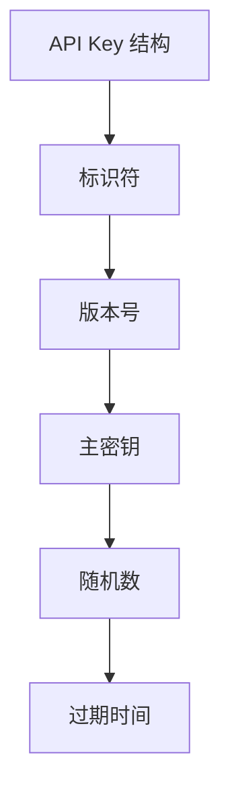

                 

# 分级 API Key 的应用

## 关键词

- API Key
- 分级管理
- 权限控制
- 技术实现
- 法规合规
- 最佳实践

## 摘要

本文将深入探讨分级 API Key 的应用，从概念、管理、实践、技术实现、最佳实践、发展趋势和法律法规等多个角度进行详细分析。分级 API Key 是一种用于实现权限控制和资源分配的重要机制，在 API 接口设计中发挥着关键作用。本文旨在为读者提供一个全面的技术指南，帮助他们理解和应用分级 API Key，以提升系统的安全性和可靠性。

## 第一部分: 分级 API Key 的应用概述

### 第1章: API Key 分级管理的重要性

#### 1.1.1 API Key 分级管理的概念与意义

API Key 是一种用于识别和验证调用者身份的密钥，常用于保护 API 接口的访问权限。分级管理指的是根据 API Key 的不同权限等级，对访问者进行区分和限制。这种管理方式的核心意义在于：

1. **增强安全性**：通过权限分级，可以防止未授权用户访问敏感资源。
2. **资源合理分配**：根据不同用户的需求，合理分配资源，提高系统性能。
3. **便于监控和管理**：分级管理有助于对 API 调用进行监控，便于发现和解决潜在问题。

#### 1.1.2 API Key 分级管理的挑战与机会

**挑战**：

1. **权限控制复杂度**：随着权限等级的增加，控制策略变得更加复杂。
2. **安全漏洞**：权限分级管理如果设置不当，可能导致安全漏洞。
3. **用户体验**：不同权限等级可能导致用户体验不一致。

**机会**：

1. **灵活扩展**：分级管理为系统扩展提供了便利，可以轻松适应新需求。
2. **精细化运营**：通过分级管理，可以更好地运营和优化 API 服务。
3. **增加收益**：合理的权限分级可以吸引更多付费用户，增加收益。

#### 1.1.3 分级 API Key 的应用场景

1. **第三方服务集成**：企业可以通过分级 API Key 控制第三方服务的访问权限。
2. **内部系统互通**：企业内部系统可以通过分级 API Key 确保安全互通。
3. **收费服务**：提供不同的收费等级，满足不同用户的需求。
4. **社交平台**：社交平台可以通过分级 API Key 控制用户的权限范围。

### 第2章: API Key 分级管理的核心概念

#### 2.1.1 API Key 的基本结构

API Key 通常由一组字符组成，包括数字、字母和特殊字符。其基本结构如下：

#### 2.1.2 分级 API Key 的分类

根据权限等级的不同，分级 API Key 可以分为以下几类：

1. **开放级**：无权限限制，适用于公开的 API 接口。
2. **私有级**：限制较高的权限，适用于内部系统或特定用户。
3. **受限级**：介于开放级和私有级之间，适用于部分公开的 API 接口。
4. **付费级**：提供额外的功能或服务，需要付费获取。

#### 2.1.3 分级 API Key 的权限控制策略

权限控制策略包括以下几种：

1. **访问控制列表（ACL）**：根据用户角色或权限等级，控制访问权限。
2. **资源隔离**：将不同权限等级的用户请求隔离，防止越权访问。
3. **API 限流**：根据权限等级，设置不同的请求频率限制，防止滥用。

### 第3章: API Key 分级管理的实践

#### 3.1.1 API Key 分级管理流程设计

API Key 分级管理的流程包括以下步骤：

1. **需求分析**：确定系统需求和用户角色。
2. **权限设计**：根据需求设计权限等级和权限控制策略。
3. **API Key 生成**：根据权限等级生成相应的 API Key。
4. **权限验证**：在 API 调用时，验证 API Key 的权限等级。
5. **日志记录**：记录 API 调用日志，便于监控和管理。

#### 3.1.2 API Key 分级管理的实施步骤

1. **系统架构设计**：确定系统架构，包括 API 接口、权限管理系统、日志系统等。
2. **数据库设计**：设计权限数据库，包括用户、角色、权限等级等表结构。
3. **API Key 生成与验证**：实现 API Key 生成和验证功能。
4. **权限控制**：实现权限控制策略，如 ACL、资源隔离、API 限流等。
5. **系统部署与测试**：部署系统，并进行功能测试和性能测试。

#### 3.1.3 API Key 分级管理的风险评估

API Key 分级管理的风险评估包括以下方面：

1. **安全漏洞**：评估 API Key 被窃取或滥用的风险。
2. **权限滥用**：评估用户滥用权限的风险。
3. **系统性能**：评估权限控制对系统性能的影响。
4. **用户体验**：评估权限分级对用户体验的影响。

### 第4章: API Key 分级管理的技术实现

#### 4.1.1 API Key 分级管理的系统架构

API Key 分级管理的系统架构包括以下组件：

1. **API 接口**：提供 API 接口服务。
2. **权限管理系统**：实现 API Key 生成、验证和权限控制功能。
3. **日志系统**：记录 API 调用日志。
4. **数据库**：存储用户、角色、权限等级等数据。

#### 4.1.2 API Key 分级管理的关键技术

1. **API Key 生成与验证**：使用哈希算法生成 API Key，并在调用时验证其有效性。
2. **权限控制策略**：使用 ACL、资源隔离、API 限流等策略实现权限控制。
3. **加密技术**：使用加密算法保护 API Key 的传输和存储。

#### 4.1.3 API Key 分级管理的优化策略

1. **缓存机制**：使用缓存机制减少数据库访问，提高系统性能。
2. **分布式架构**：使用分布式架构提高系统的可扩展性和性能。
3. **监控与报警**：使用监控工具实时监控 API 调用情况，并设置报警机制。

### 第5章: API Key 分级管理的最佳实践

#### 5.1.1 成功案例分析

成功案例包括：

1. **某电商平台**：通过分级 API Key 实现了内部系统与第三方服务的安全互通。
2. **某社交平台**：通过分级 API Key 管理用户权限，提高了系统的安全性和用户体验。

#### 5.1.2 分级 API Key 的使用注意事项

1. **权限分级合理**：根据实际需求设计合理的权限分级。
2. **安全性**：确保 API Key 生成、验证和传输的安全性。
3. **用户体验**：考虑权限分级对用户体验的影响，避免过度限制。

#### 5.1.3 避免常见错误

常见错误包括：

1. **权限控制不当**：导致安全漏洞或权限滥用。
2. **API Key 泄露**：导致 API 被恶意使用。
3. **性能问题**：权限控制策略不当导致系统性能下降。

### 第6章: API Key 分级管理的发展趋势

#### 6.1.1 未来技术展望

未来技术展望包括：

1. **人工智能**：使用人工智能技术优化权限分级策略。
2. **区块链**：使用区块链技术提高 API Key 的安全性。

#### 6.1.2 API Key 分级管理的未来发展方向

未来发展方向包括：

1. **精细化权限管理**：实现更加细粒度的权限管理。
2. **无服务器架构**：使用无服务器架构提高系统的灵活性。

#### 6.1.3 持续学习和改进的策略

持续学习和改进的策略包括：

1. **技术交流**：参加技术会议和研讨会，了解最新技术动态。
2. **实践总结**：定期总结实践中的问题和经验，持续改进。
3. **法规合规**：关注法律法规变化，确保合规性。

### 第7章: API Key 分级管理的法律法规与合规性

#### 7.1.1 API Key 分级管理的法律法规概述

法律法规概述包括：

1. **数据保护法**：如《通用数据保护条例》（GDPR）。
2. **网络安全法**：如《中华人民共和国网络安全法》。
3. **个人信息保护法**：如《中华人民共和国个人信息保护法》。

#### 7.1.2 合规性要求与措施

合规性要求与措施包括：

1. **数据安全**：确保 API Key 的安全存储和传输。
2. **隐私保护**：确保用户个人信息得到保护。
3. **权限管理**：确保权限分级合理，防止滥用。

#### 7.1.3 遵守法律法规的实践指南

实践指南包括：

1. **合规性评估**：定期进行合规性评估。
2. **培训与意识提升**：培训员工，提高合规意识。
3. **审计与监督**：进行内部审计和外部监督。

### 第8章: API Key 分级管理的工具与资源

#### 8.1.1 开源工具介绍

开源工具介绍包括：

1. **Keycloak**：开源的身份和访问管理（IAM）解决方案。
2. **Apache Ranger**：用于数据安全和管理的开源项目。

#### 8.1.2 商业工具比较

商业工具比较包括：

1. **Okta**：提供全面的身份认证和访问管理服务。
2. **OneLogin**：提供安全的单点登录（SSO）和身份认证服务。

#### 8.1.3 学习资源推荐

学习资源推荐包括：

1. **在线课程**：如 Coursera、Udemy 上的相关课程。
2. **技术博客**：如 Medium、博客园上的专业文章。
3. **书籍**：如《API 设计指南》、《RESTful API 设计》等。

## 结束语

分级 API Key 的应用在保障系统安全、优化资源分配和提高用户体验方面具有重要意义。本文从多个角度详细探讨了分级 API Key 的应用，旨在为读者提供一个全面的技术指南。随着技术的不断发展，分级 API Key 的应用将更加广泛和深入，为 API 接口设计带来更多创新和优化。希望本文能对读者在实际应用中提供有益的启示和参考。

### 作者

**作者：AI天才研究院/AI Genius Institute & 禅与计算机程序设计艺术 /Zen And The Art of Computer Programming**

