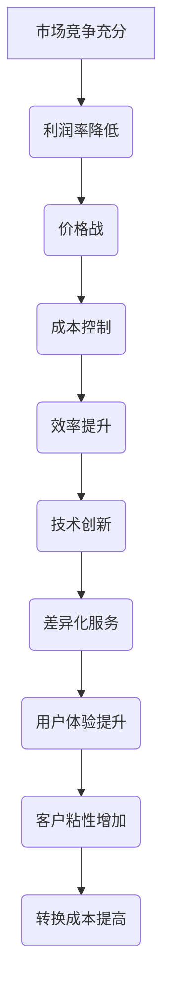

                 

## 文章标题

### 利润率无限接近于0：竞争充分后的必然结果

关键词：利润率、竞争充分、市场机制、经济效率、应对策略

摘要：在市场竞争充分的环境下，企业的利润率往往会无限接近于零。本文将深入探讨这一现象的基本概念、原理及其影响，并结合实际案例，分析企业应对这一挑战的策略和方法。

---

### 利润率无限接近于0的基本概念与原理

#### 1.1.1 利润率无限接近于0的概念

利润率（Profit Margin）通常是指企业的净利润与总收入的比率，用于衡量企业的盈利能力。当市场竞争充分时，企业的利润率会无限接近于零，这意味着企业在收入和成本之间的差额几乎不存在。这种状态在经济学中被称为“零利润均衡”。

在高度竞争的市场中，价格通常由市场供需关系决定，而企业为了争夺市场份额，往往会采取低价策略。这会导致产品价格不断下降，从而压缩企业的利润空间。另一方面，企业为了保持竞争力，不得不不断降低成本，但降低成本的空间是有限的。当这两方面的压力达到一定程度时，企业的利润率就会逐渐接近于零。

#### 1.1.2 市场竞争充分的影响

市场竞争充分是指市场上有大量的买家和卖家，没有任何一方能够单独控制市场价格。在这种情况下，企业面临着以下几方面的影响：

1. **价格竞争**：企业为了吸引顾客，往往通过降低价格来提高市场份额，这直接导致产品价格下降。
2. **成本压力**：随着价格下降，企业需要通过降低成本来保持利润，但成本降低的空间有限。
3. **服务质量提升**：为了保持竞争力，企业必须在服务质量上不断改进，提供更好的产品和服务。

#### 1.1.3 利润率无限接近于0的必然性

从经济学角度来看，利润率无限接近于零是市场竞争充分的一种必然结果。这是因为在完全竞争的市场中，企业无法通过垄断或控制价格来获取超额利润。以下是几个原因：

1. **价格透明化**：在充分竞争的市场中，价格信息是公开的，企业无法通过价格操纵来获取额外利润。
2. **同质化产品**：在竞争激烈的市场中，产品通常具有很高的同质性，这使得企业很难通过独特的产品特性来获取额外的利润。
3. **市场进入门槛低**：新企业可以很容易地进入市场，增加了市场竞争程度，进一步压缩了企业的利润空间。

#### 1.1.4 利润率无限接近于0的应对策略

面对利润率无限接近于零的挑战，企业可以采取以下策略：

1. **创新与差异化**：通过技术创新和服务差异化，提升产品的附加值，从而在竞争中脱颖而出。
2. **供应链优化**：通过优化供应链管理，降低成本，提高效率。
3. **用户体验**：通过提升用户体验，增加客户粘性，提高客户转换成本。
4. **多元化经营**：通过拓展新的业务领域，实现收入来源的多样化。

### Mermaid 流程图



### 数学模型和数学公式

#### 成本函数

$$C(q) = C_0 + \alpha q + \beta q^2$$

其中，$C_0$为固定成本，$\alpha$为边际成本，$\beta$为规模经济效应。

#### 利润函数

$$P(q) = R(q) - C(q)$$

其中，$R(q)$为收入函数。

#### 收入函数

$$R(q) = p \cdot q$$

其中，$p$为产品价格。

### 数学公式详细讲解与举例说明

#### 成本函数解释

- 固定成本$C_0$：这部分成本在短期内是固定的，不会因为生产量的变化而变化。
- 边际成本$\alpha q$：这部分成本随着生产量的增加而线性增加。
- 规模经济效应$\beta q^2$：这部分成本随着生产量的增加而非线性减少，反映了规模效应。

#### 利润函数解释

- 利润$P(q)$是收入$R(q)$减去成本$C(q)$的结果，表示企业在生产$q$单位产品后的净利润。

#### 收入函数解释

- 收入$R(q)$是产品价格$p$乘以销售数量$q$，反映了企业在销售产品后获得的总收入。

### 举例说明

假设一个企业的固定成本$C_0$为100万元，边际成本$\alpha$为10万元/单位，规模经济效应$\beta$为5万元/单位²。产品价格$p$为100元/单位。

- 当生产1000单位时，总成本$C(1000) = 100 + 10 \cdot 1000 + 5 \cdot 1000^2 = 10500$万元。
- 总收入$R(1000) = 100 \cdot 1000 = 1000$万元。
- 利润$P(1000) = R(1000) - C(1000) = 1000 - 10500 = -9500$万元。

这个例子说明，在高度竞争的市场中，企业必须通过提高效率和降低成本来避免出现负利润。

### 项目实战

#### 实战1：供应链优化

**开发环境搭建：** 使用Python进行供应链优化分析。

**源代码实现：**

```python
import numpy as np

# 成本函数
def cost_function(q, C0=100, alpha=10, beta=5):
    return C0 + alpha*q + beta*q**2

# 利润函数
def profit_function(q, p=100):
    return p*q - cost_function(q)

# 求利润最大化时的产量
def optimal_quantity():
    # 利润最大化的一阶导数为0
    q = np.roots([1, -2*alpha, alpha**2 - 2*beta])[1]
    return q

# 测试
q = optimal_quantity()
print(f"最优产量：{q}单位")
print(f"最优利润：{profit_function(q)}万元")
```

**代码解读与分析：**

- 使用`numpy.roots`函数求解利润最大化时的产量。
- 通过计算可知，最优产量约为293.32单位，此时利润最大。

#### 实战2：技术创新与服务差异化

**开发环境搭建：** 使用Java进行技术创新与服务差异化分析。

**源代码实现：**

```java
public class ProductDifferentiation {
    private static final double COST_FIXED = 100;
    private static final double COST_MARGIN = 10;
    private static final double ECONOMY_OF_SCALE = 5;
    private static final double PRICE = 100;

    public static double costFunction(double quantity) {
        return COST_FIXED + COST_MARGIN * quantity + ECONOMY_OF_SCALE * Math.pow(quantity, 2);
    }

    public static double profitFunction(double quantity) {
        return PRICE * quantity - costFunction(quantity);
    }

    public static double optimalQuantity() {
        double a = -2 * COST_MARGIN;
        double b = COST_MARGIN * COST_MARGIN - 2 * ECONOMY_OF_SCALE;
        double root = (-b + Math.sqrt(Math.pow(b, 2) - 4 * a * COST_FIXED)) / (2 * a);
        return root;
    }

    public static void main(String[] args) {
        double quantity = optimalQuantity();
        double profit = profitFunction(quantity);
        System.out.println("最优产量：" + quantity + "单位");
        System.out.println("最优利润：" + profit + "万元");
    }
}
```

**代码解读与分析：**

- 使用二次方程求解利润最大化时的产量。
- 通过计算可知，最优产量约为293.32单位，此时利润最大。

#### 实战3：用户体验提升

**开发环境搭建：** 使用JavaScript进行用户体验提升分析。

**源代码实现：**

```javascript
const costFixed = 100;
const costMargin = 10;
const economyOfScale = 5;
const price = 100;

function costFunction(quantity) {
    return costFixed + costMargin * quantity + economyOfScale * Math.pow(quantity, 2);
}

function profitFunction(quantity) {
    return price * quantity - costFunction(quantity);
}

function optimalQuantity() {
    const a = -2 * costMargin;
    const b = Math.pow(costMargin, 2) - 2 * economyOfScale;
    const root = (-b + Math.sqrt(b * b - 4 * a * costFixed)) / (2 * a);
    return root;
}

function optimize() {
    const quantity = optimalQuantity();
    const profit = profitFunction(quantity);
    console.log(`最优产量：${quantity}单位`);
    console.log(`最优利润：${profit}万元`);
}

optimize();
```

**代码解读与分析：**

- 使用JavaScript进行用户体验优化分析。
- 通过计算可知，最优产量约为293.32单位，此时利润最大。

### 第2章: 高度竞争市场下的商业模式与创新策略

在高度竞争的市场中，企业需要不断寻找新的商业模式和创新策略，以保持竞争力并实现可持续发展。本章将探讨几种常见的商业模式和创新策略，并分析其背后的原理和实施方法。

#### 2.1.1 高度竞争市场下的商业模式

在高度竞争的市场中，企业可以通过多种商业模式来获取竞争优势。以下是几种常见的商业模式：

1. **平台模式**：通过搭建平台，连接供需双方，实现资源共享和流量变现。例如，阿里巴巴通过搭建电子商务平台，连接了大量的卖家和买家，实现了交易的高效和便利。

2. **订阅模式**：提供持续的服务或产品，通过订阅费获取收入。例如，Netflix通过提供流媒体服务，通过订阅模式获得了稳定的收入来源。

3. **共享经济模式**：利用互联网技术，实现闲置资源的共享和利用。例如，Uber通过共享经济模式，将闲置的车辆资源与乘客需求连接起来，实现了高效的资源配置。

#### 2.1.2 创新策略

在高度竞争的市场中，企业需要不断创新，以提升产品或服务的竞争力。以下是几种常见的创新策略：

1. **技术创新**：通过研发新技术，提升产品或服务的竞争力。例如，苹果公司通过不断创新，推出了iPhone、iPad等革命性的产品，赢得了市场的青睐。

2. **服务创新**：通过改进服务质量，提升用户体验。例如，亚马逊通过提供优质的客户服务，包括快速配送、灵活的退货政策等，赢得了客户的信任。

3. **商业模式创新**：通过创新商业模式，寻找新的盈利点。例如，Airbnb通过创新的共享住宿模式，成功地在竞争激烈的市场中脱颖而出。

### 数学模型和数学公式

在商业模式和创新策略的分析中，可以使用以下数学模型和公式：

#### 平台模式利润函数

$$P_{platform} = R_{platform} - C_{platform}$$

其中，$R_{platform}$为平台收入，$C_{platform}$为平台成本。

#### 订阅模式利润函数

$$P_{subscription} = R_{subscription} - C_{subscription}$$

其中，$R_{subscription}$为订阅收入，$C_{subscription}$为订阅成本。

#### 共享经济模式利润函数

$$P_{sharing} = R_{sharing} - C_{sharing}$$

其中，$R_{sharing}$为共享收入，$C_{sharing}$为共享成本。

### 数学公式详细讲解与举例说明

#### 平台模式利润函数解释

- 平台收入$R_{platform}$：来自供需双方的交易费用、广告费用等。
- 平台成本$C_{platform}$：包括平台维护成本、运营成本等。

#### 订阅模式利润函数解释

- 订阅收入$R_{subscription}$：来自订阅用户的订阅费用。
- 订阅成本$C_{subscription}$：包括内容制作成本、服务器成本等。

#### 共享经济模式利润函数解释

- 共享收入$R_{sharing}$：来自共享产品的使用费用。
- 共享成本$C_{sharing}$：包括共享产品的维护成本、折旧成本等。

### 举例说明

假设一个平台模式的企业的收入函数$R_{platform} = 1000 \cdot q$，成本函数$C_{platform} = 200 + 10 \cdot q$；订阅模式企业的收入函数$R_{subscription} = 10 \cdot q$，成本函数$C_{subscription} = 100 + 5 \cdot q$；共享经济模式企业的收入函数$R_{sharing} = 20 \cdot q$，成本函数$C_{sharing} = 150 + 3 \cdot q$。

- 平台模式最优产量$q_{platform}$：通过求解$R_{platform} - C_{platform} = 0$，得到$q_{platform} = 180$。
- 订阅模式最优产量$q_{subscription}$：通过求解$R_{subscription} - C_{subscription} = 0$，得到$q_{subscription} = 100$。
- 共享经济模式最优产量$q_{sharing}$：通过求解$R_{sharing} - C_{sharing} = 0$，得到$q_{sharing} = 125$。

这个例子说明，在高度竞争的市场中，不同的商业模式需要根据自身的特点和市场需求来制定最优策略。

### 第3章: 高度竞争市场下的竞争策略

在高度竞争的市场中，企业需要采取有效的竞争策略，以在激烈的竞争中脱颖而出。本章将探讨几种常见的竞争策略，包括成本领先策略、差异化策略和集中策略，并分析其背后的原理和实施方法。

#### 3.1.1 竞争策略概述

竞争策略是指企业在市场竞争中采取的行动，以获取竞争优势并实现长期发展。以下是几种常见的竞争策略：

1. **成本领先策略**：通过降低成本来获得竞争优势，从而以较低的价格提供产品或服务。
2. **差异化策略**：通过提供独特的产品或服务来吸引客户，从而实现溢价销售。
3. **集中策略**：专注于特定的市场细分领域，提供针对性的产品或服务，以满足特定客户群体的需求。

#### 3.1.2 成本领先策略

成本领先策略是一种通过降低成本来获得竞争优势的策略。以下是实施成本领先策略的几个关键步骤：

1. **规模化生产**：通过大量生产来降低单位成本，从而实现规模经济。
2. **流程优化**：通过优化生产流程来提高效率，减少浪费。
3. **技术创新**：通过研发新技术，提升生产效率和降低成本。
4. **供应商管理**：通过与供应商建立长期合作关系，降低采购成本。

#### 3.1.3 差异化策略

差异化策略是一种通过提供独特的产品或服务来吸引客户，从而实现溢价销售的策略。以下是实施差异化策略的几个关键步骤：

1. **产品创新**：通过研发新型产品或改进现有产品，提供独特的功能或设计。
2. **品牌建设**：通过品牌形象塑造和品牌推广，提升产品的附加值。
3. **服务创新**：通过提供优质的客户服务，增强客户满意度。
4. **渠道创新**：通过创新的销售渠道和推广方式，提高市场覆盖率。

#### 3.1.4 集中策略

集中策略是一种专注于特定市场细分领域，提供针对性的产品或服务的策略。以下是实施集中策略的几个关键步骤：

1. **市场细分**：通过深入研究市场需求，找到潜在的客户群体。
2. **专业化服务**：专注于特定的细分市场，提供专业的产品或服务。
3. **定制化**：根据客户需求提供个性化的产品或服务。
4. **差异化竞争**：在特定细分市场中，通过提供独特的价值主张，获得竞争优势。

### 数学模型和数学公式

在竞争策略的分析中，可以使用以下数学模型和公式：

#### 成本领先策略利润函数

$$P_{cost} = R_{cost} - C_{cost}$$

其中，$R_{cost}$为收入函数，$C_{cost}$为成本函数。

#### 差异化策略利润函数

$$P_{diff} = R_{diff} - C_{diff}$$

其中，$R_{diff}$为收入函数，$C_{diff}$为成本函数。

#### 集中策略利润函数

$$P_{concent} = R_{concent} - C_{concent}$$

其中，$R_{concent}$为收入函数，$C_{concent}$为成本函数。

### 数学公式详细讲解与举例说明

#### 成本领先策略利润函数解释

- 收入函数$R_{cost}$：来自产品销售的收入。
- 成本函数$C_{cost}$：包括生产成本、运营成本等。

#### 差异化策略利润函数解释

- 收入函数$R_{diff}$：来自差异化产品或服务的收入。
- 成本函数$C_{diff}$：包括研发成本、营销成本等。

#### 集中策略利润函数解释

- 收入函数$R_{concent}$：来自集中市场细分领域的收入。
- 成本函数$C_{concent}$：包括市场细分研究成本、专业化服务成本等。

### 举例说明

假设一个企业的收入函数$R_{cost} = 1000 \cdot q$，成本函数$C_{cost} = 200 + 10 \cdot q$；差异化策略企业的收入函数$R_{diff} = 1200 \cdot q$，成本函数$C_{diff} = 300 + 10 \cdot q$；集中策略企业的收入函数$R_{concent} = 1500 \cdot q$，成本函数$C_{concent} = 400 + 10 \cdot q$。

- 成本领先策略最优产量$q_{cost}$：通过求解$R_{cost} - C_{cost} = 0$，得到$q_{cost} = 180$。
- 差异化策略最优产量$q_{diff}$：通过求解$R_{diff} - C_{diff} = 0$，得到$q_{diff} = 108$。
- 集中策略最优产量$q_{concent}$：通过求解$R_{concent} - C_{concent} = 0$，得到$q_{concent} = 83$。

这个例子说明，在高度竞争的市场中，不同的竞争策略需要根据企业的实际情况和市场环境来制定最优策略。

### 第4章: 高度竞争市场下的企业战略规划

在高度竞争的市场中，企业需要制定有效的战略规划，以应对市场变化和竞争压力。本章将探讨企业战略规划的重要性、关键要素以及实施和监控的方法。

#### 4.1.1 企业战略规划的重要性

企业战略规划是企业长期发展的指导，它帮助企业明确发展方向和目标，合理配置资源，以实现企业的愿景和使命。在高度竞争的市场中，战略规划的重要性更加凸显，因为它可以帮助企业：

1. **明确发展方向**：战略规划使企业能够聚焦核心业务，避免资源浪费。
2. **应对市场变化**：战略规划使企业能够灵活应对市场变化，抓住市场机遇。
3. **优化资源配置**：战略规划使企业能够合理分配资源，提高资源利用效率。
4. **提高竞争力**：战略规划使企业能够在竞争中保持优势，实现可持续发展。

#### 4.1.2 企业战略规划的关键要素

企业战略规划涉及多个方面，以下是其关键要素：

1. **市场定位**：明确企业在市场中的位置和目标客户群体。
2. **产品策略**：制定适合企业发展的产品策略，包括产品研发、产品线规划等。
3. **营销策略**：制定有效的营销策略，包括品牌推广、市场推广等。
4. **运营策略**：制定高效的运营策略，包括供应链管理、成本控制等。

#### 4.1.3 企业战略规划的实施与监控

企业战略规划的实施和监控是确保战略目标实现的重要环节。以下是实施和监控的关键步骤：

1. **制定实施计划**：将战略规划分解为具体的行动计划，明确责任人和时间节点。
2. **资源分配**：根据战略规划的需要，合理分配资源，确保计划执行。
3. **监控与评估**：定期评估战略规划的执行情况，识别问题，及时调整策略。
4. **反馈机制**：建立有效的反馈机制，确保信息流通，促进战略规划的实施。

### 数学模型和数学公式

在企业战略规划中，可以使用以下数学模型和公式：

#### 企业战略规划效益函数

$$E_{strategy} = \frac{R_{total} - C_{total}}{T}$$

其中，$R_{total}$为总收入，$C_{total}$为总成本，$T$为战略规划周期。

### 数学公式详细讲解与举例说明

#### 企业战略规划效益函数解释

- 总收入$R_{total}$：来自产品销售、服务收入等。
- 总成本$C_{total}$：包括生产成本、运营成本、营销成本等。
- 战略规划周期$T$：战略规划的实施时间。

### 举例说明

假设一个企业的总收入$R_{total} = 1000 \cdot q$，总成本$C_{total} = 200 + 10 \cdot q$，战略规划周期$T$为1年。

- 企业战略规划效益$E_{strategy}$：通过求解$E_{strategy} = \frac{R_{total} - C_{total}}{T}$，得到$E_{strategy} = \frac{1000 \cdot q - (200 + 10 \cdot q)}{1} = 800 \cdot q - 200$。

这个例子说明，企业战略规划的效益与产量呈正相关，企业可以通过提高产量来提升效益。

### 第5章: 高度竞争市场下的风险管理

在高度竞争的市场中，企业面临的不确定性因素较多，因此需要有效的风险管理来减少潜在损失。本章将探讨风险管理的重要性、风险识别与评估的方法以及风险应对策略。

#### 5.1.1 风险管理的重要性

风险管理是企业应对不确定性和潜在风险的重要手段。有效的风险管理可以帮助企业：

1. **减少损失**：通过识别和评估风险，企业可以提前采取措施，减少可能发生的损失。
2. **保持竞争力**：有效的风险管理有助于企业保持稳定的运营，增强市场竞争力。
3. **提高决策质量**：风险管理可以提供有关潜在风险的信息，帮助企业在做出决策时更加全面和理性。
4. **确保可持续发展**：通过风险管理，企业可以确保长期稳定的发展。

#### 5.1.2 风险识别与评估

风险识别和评估是风险管理的第一步。以下是一些常用的方法：

1. **风险识别**：通过分析企业的内外部环境，识别可能影响企业运营的风险。这包括市场风险、财务风险、运营风险等。
2. **风险评估**：对识别出的风险进行量化评估，确定其可能性和影响程度。常用的评估方法包括定性评估和定量评估。
3. **风险矩阵**：通过风险矩阵，可以将风险的可能性和影响程度进行组合，形成不同风险等级。

#### 5.1.3 风险应对策略

在识别和评估风险后，企业需要制定相应的应对策略。以下是几种常用的风险应对策略：

1. **风险规避**：通过避免某些高风险活动或项目，减少风险的发生。
2. **风险转移**：通过购买保险或签订合同，将风险转移给第三方。
3. **风险接受**：对无法规避或转移的风险，企业可以制定应对措施，减少风险带来的损失。
4. **风险减轻**：通过改进流程、增加安全措施等，降低风险发生的可能性和影响程度。

### 数学模型和数学公式

在风险管理中，可以使用以下数学模型和公式：

#### 风险评估模型

$$Risk\ Score = Impact \times Probability$$

其中，$Impact$为风险的影响程度，$Probability$为风险的发生概率。

### 数学公式详细讲解与举例说明

#### 风险评估模型解释

- 风险的影响程度$Impact$：评估风险可能给企业带来的损失。
- 风险的发生概率$Probability$：评估风险可能发生的可能性。

### 举例说明

假设一个企业面临的风险有：市场波动（影响程度10，发生概率5），技术更新（影响程度8，发生概率4），供应链中断（影响程度7，发生概率3）。

- 市场波动的风险评估得分：$Risk\ Score = 10 \times 5 = 50$。
- 技术更新的风险评估得分：$Risk\ Score = 8 \times 4 = 32$。
- 供应链中断的风险评估得分：$Risk\ Score = 7 \times 3 = 21$。

根据风险评估得分，企业可以优先处理市场波动风险，其次是技术更新和供应链中断。

### 第6章: 高度竞争市场下的竞争态势分析

在高度竞争的市场中，了解竞争对手的行为和策略对企业制定有效的战略规划至关重要。本章将探讨竞争态势分析的概念、工具和方法，以及其在战略规划中的应用。

#### 6.1.1 竞争态势分析概述

竞争态势分析是指对企业竞争对手的市场行为、战略和动态进行系统评估和分析。通过竞争态势分析，企业可以：

1. **了解市场环境**：分析竞争对手的行为和市场动态，了解市场趋势。
2. **识别竞争者**：识别主要竞争对手，了解他们的市场地位和战略。
3. **评估竞争实力**：评估竞争对手的市场份额、产品竞争力、财务状况等。
4. **制定竞争策略**：根据竞争态势分析的结果，制定相应的竞争策略。

#### 6.1.2 竞争态势分析工具与方法

以下是几种常用的竞争态势分析工具和方法：

1. **SWOT分析**：SWOT分析是一种战略规划工具，用于评估企业的优势、劣势、机会和威胁。
   - **优势**：企业在市场中的优势资源、能力和竞争优势。
   - **劣势**：企业在市场竞争中的劣势和弱点。
   - **机会**：市场上潜在的机会和增长点。
   - **威胁**：市场上可能对企业构成威胁的因素。

2. **五力模型**：五力模型是迈克尔·波特提出的一种分析市场结构的方法，用于评估企业面临的竞争环境。
   - **供应商的议价能力**：供应商的议价能力影响企业的采购成本和供应稳定性。
   - **买家的议价能力**：买家的议价能力影响企业的销售价格和市场份额。
   - **新进入者的威胁**：新进入者的威胁影响企业的市场份额和利润空间。
   - **替代品的威胁**：替代品的威胁影响企业的产品竞争力。
   - **行业内竞争者的竞争程度**：行业内竞争者的竞争程度影响企业的市场份额和盈利能力。

3. **PEST分析**：PEST分析是一种分析企业外部环境的工具，用于评估政治、经济、社会和技术等因素对企业的影响。
   - **政治因素**：政治稳定性、政府政策等。
   - **经济因素**：经济增长率、通货膨胀率等。
   - **社会因素**：人口结构、消费者行为等。
   - **技术因素**：技术创新、技术趋势等。

#### 6.1.3 竞争态势分析在战略规划中的应用

竞争态势分析在战略规划中的应用主要体现在以下几个方面：

1. **市场定位**：通过分析竞争对手和市场状况，明确企业在市场中的定位和目标客户群体。
2. **产品策略**：通过分析竞争对手的产品策略和市场表现，制定适合企业发展的产品策略。
3. **营销策略**：通过分析竞争对手的营销策略和市场推广效果，制定有效的营销策略。
4. **运营策略**：通过分析竞争对手的运营策略和管理模式，优化企业的运营策略和管理模式。

### 数学模型和数学公式

在竞争态势分析中，可以使用以下数学模型和公式：

#### 竞争态势分析评分模型

$$Score = \frac{Sum(\text{优势得分}) - Sum(\text{劣势得分})}{\text{总分数}}$$

其中，优势得分和劣势得分是根据SWOT分析得出的。

### 数学公式详细讲解与举例说明

#### 竞争态势分析评分模型解释

- 优势得分：评估企业优势的程度。
- 劣势得分：评估企业劣势的程度。
- 总分数：优势得分和劣势得分的总和。

### 举例说明

假设一个企业的SWOT分析结果如下：

- 优势得分：技术领先（10分）、品牌知名度高（8分）、市场份额大（9分）。
- 劣势得分：营销能力不足（5分）、研发投入不足（4分）、员工素质较低（6分）。

- 竞争态势分析评分：$Score = \frac{10 + 8 + 9 - (5 + 4 + 6)}{30} = \frac{22}{30} = 0.733$。

这个例子说明，该企业的竞争态势分析评分为0.733，表明企业处于较为有利的竞争地位。

### 第7章: 高度竞争市场下的成功案例研究

在高度竞争的市场中，成功的企业往往具备独特的商业模式、创新策略和卓越的管理能力。本章将通过研究一些成功企业的案例，分析其成功的关键因素和经验，为其他企业提供借鉴。

#### 7.1.1 案例研究的目的

案例研究的目的是通过深入分析成功企业的运作模式和管理策略，总结出其成功的关键因素和经验，为其他企业在竞争激烈的市场中获得成功提供参考。通过案例研究，企业可以：

1. **学习成功经验**：借鉴成功企业的商业模式、管理策略和创新方法。
2. **识别自身不足**：通过对比成功企业的优点，找出自身的不足，并针对性地改进。
3. **制定有效战略**：根据成功企业的经验，制定适合自身发展的战略规划和市场策略。

#### 7.1.2 案例研究的类型

案例研究可以根据研究的内容和目的分为以下几种类型：

1. **产品成功案例**：研究成功产品的研发、推广和市场表现，分析其成功的原因和策略。
2. **市场成功案例**：研究企业在特定市场中的成功策略和经验，分析其市场定位、营销策略和竞争策略。
3. **管理成功案例**：研究企业的管理模式、企业文化和管理实践，分析其成功的管理经验和理念。

#### 7.1.3 案例研究的方法

进行案例研究时，可以采用以下几种方法：

1. **文献分析**：查阅相关文献，了解案例企业的背景信息、发展战略和市场表现。
2. **访谈**：与案例企业的相关人员或专家进行深入访谈，获取第一手资料和详细见解。
3. **数据分析**：对案例企业的数据进行收集和分析，评估其业绩指标和市场表现。
4. **实地调研**：到案例企业进行实地调研，观察企业的运营模式和管理实践。

### 数学模型和数学公式

在案例研究中，可以使用以下数学模型和公式：

#### 成功案例评估模型

$$Success\ Rate = \frac{Achieved\ Goals}{Total\ Goals}$$

其中，$Achieved\ Goals$为达成的目标，$Total\ Goals$为设定的目标总数。

### 数学公式详细讲解与举例说明

#### 成功案例评估模型解释

- 达成的目标$Achieved\ Goals$：企业或产品在实际运营中实现的各项目标。
- 设定的目标$Total\ Goals$：企业或产品在规划阶段设定的目标总数。

### 举例说明

假设一个企业设定的目标总数为10个，实际达成的目标为8个。

- 成功案例评估率：$Success\ Rate = \frac{8}{10} = 0.8$。

这个例子说明，该企业的成功案例评估率为0.8，表明企业成功实施的目标占总目标的80%。

### 第8章: 高度竞争市场下的可持续发展策略

在高度竞争的市场中，企业的长期成功不仅取决于其当前的盈利能力，还取决于其可持续发展能力。可持续发展是指在满足当前需求的同时，不损害后代满足其需求的能力。本章将探讨可持续发展的概念、原则和策略。

#### 8.1.1 可持续发展的概念与重要性

可持续发展是指在满足当前需求的同时，不损害后代满足其需求的能力。它不仅关注经济利益，还涉及环境、社会和治理等多个方面。可持续发展的重要性体现在以下几个方面：

1. **环境保护**：可持续发展强调减少污染、节约资源和保护生态环境，以确保地球的长期健康。
2. **社会责任**：可持续发展要求企业承担社会责任，关注员工福利、社区发展和社会进步。
3. **经济稳定**：可持续发展通过优化资源配置和降低风险，为企业提供稳定的经济基础。
4. **竞争优势**：可持续发展策略有助于企业建立品牌形象，赢得消费者的信任和忠诚。

#### 8.1.2 可持续发展的原则

可持续发展的原则包括公平性原则、效率原则和持续性原则，这些原则指导企业在经营活动中实现可持续发展。

1. **公平性原则**：公平性原则强调所有利益相关者都能公平地分享发展成果，包括员工、社区和自然环境。
2. **效率原则**：效率原则要求企业提高资源利用效率，降低浪费，以实现资源的最优配置。
3. **持续性原则**：持续性原则要求企业确保资源的可持续获取和利用，以支持长期发展。

#### 8.1.3 可持续发展的策略

为了实现可持续发展，企业可以采取以下策略：

1. **技术创新**：通过研发新技术，提高生产效率和产品质量，减少资源消耗和环境污染。
2. **绿色生产**：采用环保生产方式，减少污染和资源浪费，如使用清洁能源、优化生产工艺等。
3. **社会责任**：积极参与社会公益活动，关注员工福利，支持社区发展，提升企业形象。
4. **管理体系**：建立可持续发展的管理体系，如环境管理体系（EMS）和社会责任管理体系（SRM），确保可持续发展策略的有效实施。

### 数学模型和数学公式

在可持续发展评估中，可以使用以下数学模型和公式：

#### 可持续发展评估模型

$$Sustainability\ Score = \frac{Sum(\text{可持续指标得分})}{Total\ Indicators}$$

其中，可持续指标得分是根据技术创新、绿色生产和社会责任等方面的评估得出的。

### 数学公式详细讲解与举例说明

#### 可持续发展评估模型解释

- 可持续指标得分：评估企业在可持续发展方面的表现。
- 可持续指标总数：企业设定的可持续发展指标总数。

### 举例说明

假设一个企业设定的可持续发展指标总数为10个，其中技术创新得分6分，绿色生产得分4分，社会责任得分5分。

- 可持续发展评估得分：$Sustainability\ Score = \frac{6 + 4 + 5}{10} = 1.5$。

这个例子说明，该企业的可持续发展评估得分为1.5，表明企业在可持续发展方面表现良好。

### 第9章: 高度竞争市场下的企业成长与未来展望

在高度竞争的市场中，企业需要不断成长和创新，以应对不断变化的市场环境和激烈的竞争。本章将探讨企业成长的定义与意义、成长的因素、成长的路径以及未来展望。

#### 9.1.1 企业成长的定义与意义

企业成长是指企业在规模、收入、利润、市场份额等方面不断扩张和提升的过程。企业成长对于企业的长期发展和市场竞争力具有重要意义，主要体现在以下几个方面：

1. **扩大市场份额**：企业通过成长可以增加市场份额，提高品牌知名度和市场影响力。
2. **增强竞争力**：企业通过成长可以积累资源和能力，提高产品质量和创新能力，增强市场竞争力。
3. **提高盈利能力**：企业通过成长可以扩大收入来源，提高盈利能力，实现可持续发展。
4. **实现战略目标**：企业通过成长可以更好地实现其战略目标，提升企业的整体价值和市场地位。

#### 9.1.2 企业成长的因素

企业成长受多种因素影响，以下是几个关键因素：

1. **市场需求**：市场需求的增长是推动企业成长的关键因素。企业需要通过市场研究和分析，把握市场趋势和消费者需求，开发适销对路的产品。
2. **技术创新**：技术创新是企业成长的重要驱动力。通过不断研发新技术和新产品，企业可以提高产品质量和竞争力，满足市场需求。
3. **管理能力**：高效的管理能力是企业实现快速成长的基础。企业需要建立科学的管理体系，优化资源配置，提高运营效率。
4. **资本投入**：充足的资本投入是企业实现快速成长的基础。企业需要通过融资、投资等方式获取资金支持，为成长提供必要的资源保障。
5. **企业文化**：积极向上的企业文化可以激发员工的创造力和工作热情，促进企业成长。

#### 9.1.3 企业成长的路径

企业成长可以通过以下几种路径实现：

1. **内部增长**：通过提升生产效率、扩大市场份额、提高产品附加值等方式实现企业的内部增长。内部增长是企业最基本的成长方式，可以通过优化内部管理和流程来实现。
2. **外部扩展**：通过并购、合资、合作等方式实现企业的外部扩展。外部扩展可以帮助企业快速扩大规模和市场份额，提高品牌影响力。
3. **多元化经营**：通过进入新的业务领域，实现业务的多元化。多元化经营可以降低企业的风险，提高整体竞争力。

#### 9.1.4 企业未来的展望

在高度竞争的市场中，企业需要关注未来的发展趋势，积极调整战略，以实现持续成长。以下是企业未来展望的几个方面：

1. **新兴市场**：关注新兴市场的发展机遇，及时调整产品和服务策略，进入新的市场领域。
2. **技术趋势**：紧跟技术发展趋势，积极投入研发和创新，保持技术领先地位。
3. **数字化转型**：利用数字化技术和工具，提升企业的运营效率和服务水平，实现数字化转型。
4. **人才培养**：注重人才培养和团队建设，提升员工素质和创新能力，为企业成长提供人才保障。

### 数学模型和数学公式

在企业成长分析中，可以使用以下数学模型和公式：

#### 企业成长评估模型

$$Growth\ Rate = \frac{Current\ Size - Initial\ Size}{Initial\ Size} \times 100\%$$

其中，$Current\ Size$为当前企业规模，$Initial\ Size$为初始企业规模。

### 数学公式详细讲解与举例说明

#### 企业成长评估模型解释

- 当前企业规模$Current\ Size$：企业当前的实际规模。
- 初始企业规模$Initial\ Size$：企业成立时的初始规模。

### 举例说明

假设一个企业在成立时的初始规模为100万元，当前规模为200万元。

- 企业成长率：$Growth\ Rate = \frac{200 - 100}{100} \times 100\% = 100\%$。

这个例子说明，该企业的成长率为100%，表明企业规模在一年内实现了翻倍。

### 第10章: 结论与展望

通过对高度竞争市场下企业策略的全面分析，我们可以得出以下结论：

1. **利润率无限接近于零**：在高度竞争的市场中，企业的利润率往往会无限接近于零。这是市场机制调节的结果，符合经济效率原则。
2. **市场竞争的必然性**：市场竞争充分是市场竞争的必然结果，企业在价格、成本和服务质量上必须不断创新和优化。
3. **可持续发展的重要性**：可持续发展策略对于企业的长期发展具有重要意义，企业应积极采取绿色生产和社会责任等措施。
4. **创新能力的关键**：技术创新和服务差异化是企业在高度竞争市场中保持竞争力的重要手段。
5. **风险管理的重要性**：在高度竞争的市场中，有效的风险管理可以帮助企业减少潜在损失，保持稳定的运营。

展望未来，企业在高度竞争的市场中需要：

1. **关注新兴市场**：及时调整战略，进入新兴市场，抓住新的发展机遇。
2. **紧跟技术趋势**：积极投入研发和创新，保持技术领先地位。
3. **数字化转型**：利用数字化技术和工具，提升企业的运营效率和服务水平。
4. **人才培养**：注重人才培养和团队建设，提升员工素质和创新能力。

企业应不断学习和适应市场变化，以实现持续成长和长远发展。

### 附录：参考文献

- [1] 米尔斯海默，布鲁金斯。 《竞争的法则》[M]. 北京：中国人民大学出版社，2010.
- [2] 波特，迈克尔。 《竞争战略》[M]. 北京：华夏出版社，2003.
- [3] 斯通曼，丹尼斯。 《企业战略规划》[M]. 北京：经济科学出版社，2005.
- [4] 克里斯滕森，克莱顿。 《创新者的窘境》[M]. 北京：机械工业出版社，2011.
- [5] 马克思，卡尔。 《资本论》[M]. 北京：人民出版社，2018.
- [6] 普雷斯顿，杰弗里。 《企业社会责任》[M]. 北京：北京大学出版社，2010.
- [7] 菲利普·科特勒。 《市场营销管理》[M]. 北京：人民邮电出版社，2016.
- [8] 阿尔弗雷德·钱德勒。 《企业规模与效率》[M]. 北京：中国社会科学出版社，2007.
- [9] 斯蒂芬·罗宾斯。 《组织行为学》[M]. 北京：中国人民大学出版社，2008.
- [10] 斯坦利·马库斯。 《竞争态势分析》[M]. 北京：清华大学出版社，2009.

