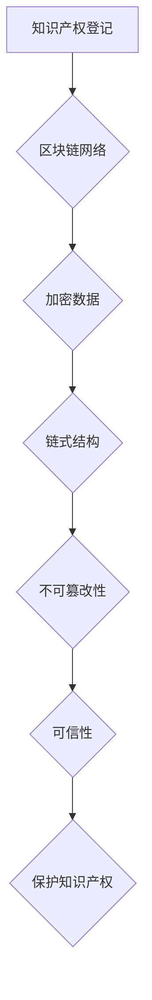
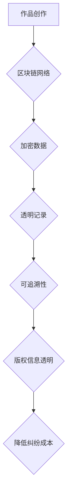
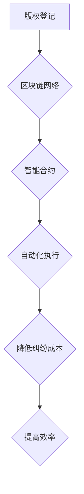
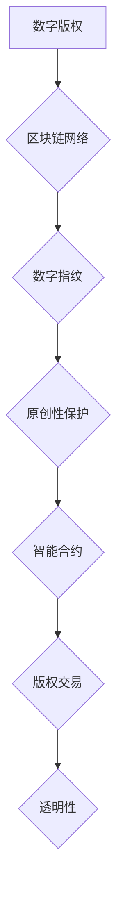
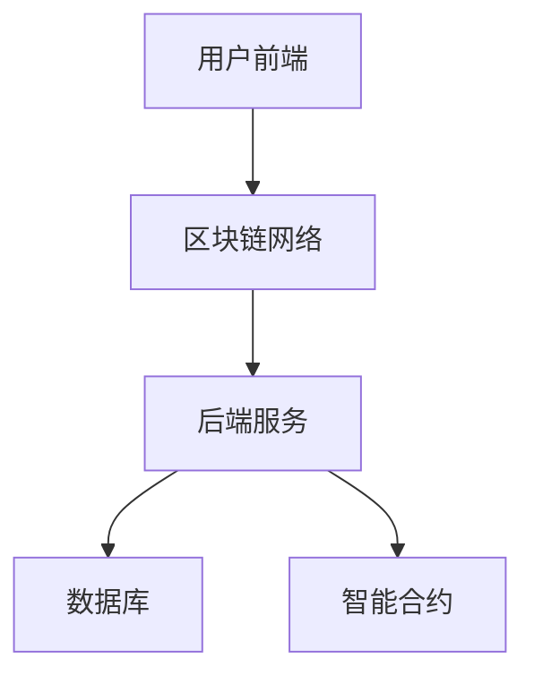

                 

# 利用区块链技术保护知识产权

## 关键词

区块链，知识产权，保护，加密技术，共识算法，智能合约，去中心化，数据透明性

## 摘要

本文旨在探讨区块链技术在知识产权保护中的应用及其优势。首先，我们将概述区块链技术的基本概念和原理，包括数据结构、加密技术和共识算法。随后，文章将深入分析区块链在知识产权保护中的具体应用，如版权保护、商标保护和专利保护。此外，本文还将通过案例解析，展示区块链技术在知识产权保护中的实际应用效果。最后，文章将探讨区块链技术在知识产权保护中面临的挑战及未来的发展趋势。

## 第一部分：区块链技术基础

### 第1章：区块链技术概述

#### 1.1 区块链的定义和原理

区块链是一种去中心化的分布式数据库技术，通过加密算法和共识机制，确保数据的安全性和不可篡改性。区块链的基本概念包括区块、链、节点和挖矿等。每个区块包含一定数量的交易记录，通过哈希算法与前一个区块链接，形成一条链式数据结构。节点是区块链网络中的参与方，负责维护区块链账本、验证交易和生成新区块。

#### 1.1.1 区块链的基本概念

- **区块**：数据的基本单元，包含交易记录、区块头、时间戳等。
- **链**：由多个区块按顺序链接形成的结构，确保数据的完整性和不可篡改性。
- **节点**：区块链网络中的参与方，负责维护区块链账本、验证交易和生成新区块。
- **挖矿**：通过解决数学难题来验证交易并生成新区块，作为奖励可以获得加密货币。

#### 1.1.2 区块链的工作原理

区块链的工作原理可以概括为以下几个步骤：

1. **交易请求**：用户发起交易请求，将交易信息发送到区块链网络。
2. **验证交易**：节点对交易信息进行验证，确保交易的有效性和合法性。
3. **共识达成**：通过共识算法，节点达成一致，将验证通过的交易记录到区块中。
4. **区块生成**：挖矿节点根据共识结果生成新区块，并将其广播到网络。
5. **区块验证**：其他节点验证新区块的合法性，并将其添加到区块链中。
6. **交易确认**：新区块添加到区块链后，交易被视为确认，不可撤销。

#### 1.1.3 区块链的核心特征

- **去中心化**：区块链不依赖于中心化的机构或第三方，所有节点平等参与网络的维护和数据记录。
- **不可篡改**：区块链采用加密算法确保数据的不可篡改性，一旦数据被记录，就难以被更改或删除。
- **透明性**：区块链上的数据对所有参与者公开可见，增加了数据记录的透明度和可验证性。
- **安全性**：区块链通过密码学技术确保数据的完整性和安全性，使得恶意攻击者难以篡改或伪造数据。

### 1.2 区块链的分类

根据区块链的参与度和访问权限，可以将区块链分为以下几种类型：

#### 1.2.1 公链

公链（Public Blockchain）是指所有参与者都可以自由加入和参与的区块链网络。公链具有完全的去中心化特性，数据公开透明，适合用于公共事务和跨境交易。

#### 1.2.2 联盟链

联盟链（Consortium Blockchain）是指由一组预选的节点参与维护的区块链网络。联盟链在参与节点数量和权限上具有一定的限制，适合用于企业间的合作和供应链管理。

#### 1.2.3 私链

私链（Private Blockchain）是指仅由一个组织或机构控制的区块链网络。私链具有较高的安全性和隐私性，适合用于企业内部的运营和管理。

### 1.3 区块链与其他技术的比较

区块链作为一种新兴技术，与传统技术和新兴技术之间存在一定的联系和区别。

#### 1.3.1 与数据库的比较

区块链与数据库在数据存储和访问方式上存在差异。数据库依赖于中心化的服务器，数据可被修改和删除；而区块链采用分布式账本技术，数据具有不可篡改性。

#### 1.3.2 与加密技术的比较

区块链采用加密技术来保护数据的安全性和隐私，但与专门的加密技术相比，区块链的加密目的更多是确保数据的不可篡改性和验证性。

#### 1.3.3 与智能合约的比较

智能合约是区块链上的自动化合约，基于编程逻辑执行。与传统的合约相比，智能合约减少了人工干预，提高了效率和透明度。

### 1.4 区块链关键技术详解

区块链技术的核心在于其数据结构、加密技术和共识机制。以下将详细介绍这些关键技术。

#### 1.4.1 区块链的数据结构

区块链的数据结构由区块和链组成。每个区块包含一定数量的交易记录，并通过哈希算法与前一个区块链接。区块链的链式存储结构确保了数据的完整性和不可篡改性。

#### 1.4.2 加密技术

区块链采用多种加密技术来保护数据的安全性和隐私。常见的加密技术包括非对称加密、对称加密和哈希算法。

- **非对称加密**：使用公钥和私钥对数据进行加密和解密。公钥用于加密，私钥用于解密。
- **对称加密**：使用相同的密钥对数据进行加密和解密。对称加密算法效率较高，但密钥管理复杂。
- **哈希算法**：将任意长度的数据转换成固定长度的哈希值，确保数据的唯一性和不可篡改性。

#### 1.4.3 共识算法

共识算法是区块链网络中的节点如何达成一致的关键技术。常见的共识算法包括工作量证明（PoW）、权益证明（PoS）和委托权益证明（DPoS）。

- **工作量证明（PoW）**：节点通过解决数学难题来验证交易并生成新区块，作为奖励可以获得加密货币。
- **权益证明（PoS）**：节点根据持有的加密货币数量和锁定时间来选择挖矿节点，提高网络的效率和安全性。
- **委托权益证明（DPoS）**：通过选举代表来选择挖矿节点，提高网络的效率和安全性。

### 1.5 节点与网络

区块链中的节点是区块链网络的基本组成部分。节点负责维护区块链账本、验证交易和生成新区块。节点之间通过P2P网络进行通信，实现数据的同步和传播。

#### 1.5.1 节点的角色

- **全节点**：完整维护区块链账本的节点，可以验证交易和生成新区块。
- **轻节点**：仅存储部分区块链数据的节点，可以通过查询全节点来获取所需数据。

#### 1.5.2 网络的通信协议

区块链网络采用P2P（点对点）通信协议，实现节点之间的数据交换和同步。常见的通信协议包括Gossip协议和Kademlia协议。

### 1.6 区块链的应用场景

区块链技术具有去中心化、不可篡改和透明性等特点，适用于多个领域。以下列举一些常见的区块链应用场景：

- **货币与支付系统**：如比特币、以太坊等加密货币。
- **供应链管理**：确保产品的来源和流转过程透明可信。
- **金融服务**：如跨境支付、金融交易记录、供应链金融等。
- **身份认证与数据安全**：提高数据的安全性和隐私保护。
- **版权保护**：确保知识产权的归属和流转过程透明可信。
- **医疗保健**：医疗数据的共享和管理。

### 第2章：区块链关键技术详解

#### 2.1 区块链的数据结构

区块链的数据结构由区块和链组成。每个区块包含一定数量的交易记录，并通过哈希算法与前一个区块链接，形成一条链式数据结构。

#### 2.1.1 区块和链的关系

- **区块**：数据的基本单元，包含交易记录、区块头、时间戳等。
- **链**：由多个区块按顺序链接形成的结构，确保数据的完整性和不可篡改性。

#### 2.1.2 链式存储原理

区块链采用链式存储原理，将数据分为多个区块，每个区块包含一定数量的交易记录。区块通过哈希算法与前一区块链接，形成一条不断延伸的链式数据结构。

#### 2.1.3 Merkle树与Merkle证明

Merkle树是一种二叉树结构，用于确保区块链数据的完整性和高效验证。每个区块的哈希值存储在Merkle树的叶子节点，树的根节点代表整个区块链的哈希值。

Merkle证明是一种高效验证数据的方法。验证者可以通过Merkle证明验证某一数据是否在区块链中，而不需要下载整个区块链。

#### 2.2 加密技术

区块链采用多种加密技术来保护数据的安全性和隐私。常见的加密技术包括非对称加密、对称加密和哈希算法。

##### 2.2.1 非对称加密

非对称加密使用公钥和私钥对数据进行加密和解密。公钥用于加密，私钥用于解密。

非对称加密的优点是安全性高、密钥管理复杂。但缺点是加密和解密速度较慢。

##### 2.2.2 对称加密

对称加密使用相同的密钥对数据进行加密和解密。对称加密算法效率较高，但密钥管理复杂。

##### 2.2.3 哈希算法

哈希算法将任意长度的数据转换成固定长度的哈希值，确保数据的唯一性和不可篡改性。常见的哈希算法包括SHA-256、SHA-3等。

#### 2.3 拓展：数字签名与零知识证明

数字签名和零知识证明是区块链中常用的加密技术，用于确保数据的安全性和隐私。

##### 2.3.1 数字签名原理

数字签名使用私钥对数据进行加密，使用公钥进行验证。数字签名确保数据的完整性和真实性。

##### 2.3.2 零知识证明原理

零知识证明是一种密码学技术，证明者可以证明某一陈述的真实性，而验证者无法得知陈述的具体内容。

零知识证明分为几个步骤：

1. **初始化**：证明者生成随机数。
2. **挑战**：验证者生成一个随机挑战。
3. **证明**：证明者生成一个证明，证明陈述的真实性。
4. **验证**：验证者验证证明的有效性。

#### 2.4 共识算法

共识算法是区块链网络中的节点如何达成一致的关键技术。常见的共识算法包括工作量证明（PoW）、权益证明（PoS）和委托权益证明（DPoS）。

##### 2.4.1 工作量证明（PoW）

工作量证明（Proof of Work, PoW）是最常见的共识算法。节点通过解决数学难题来验证交易并生成新区块，作为奖励可以获得加密货币。

##### 2.4.2 权益证明（PoS）

权益证明（Proof of Stake, PoS）是一种替代PoW的共识算法。节点根据持有的加密货币数量和锁定时间来选择挖矿节点，提高网络的效率和安全性。

##### 2.4.3 委托权益证明（DPoS）

委托权益证明（Delegated Proof of Stake, DPoS）是一种改进的PoS算法。通过选举代表来选择挖矿节点，提高网络的效率和安全性。

### 第3章：区块链在知识产权保护中的应用

#### 3.1 区块链在知识产权保护中的优势

区块链技术在知识产权保护中具有显著优势，主要体现在以下几个方面：

##### 3.1.1 数据不可篡改

区块链采用加密算法确保数据的不可篡改性，一旦数据被记录，就难以被更改或删除。这使得区块链成为保护知识产权的有效工具。

##### 3.1.2 透明性和可追溯性

区块链上的数据对所有参与者公开可见，增加了数据记录的透明度和可验证性。通过区块链，可以追溯每个交易的历史记录，提高知识产权保护的可信度。

##### 3.1.3 降低了版权纠纷的成本

区块链技术简化了知识产权的登记、认证和交易过程，降低了版权纠纷的成本。区块链上的智能合约可以自动化执行版权交易，减少人为干预和纠纷。

##### 3.1.4 保护数字版权

区块链技术可用于保护数字版权，确保作品的原创性和归属权。通过区块链，创作者可以实时记录作品的创作过程，防止未经授权的复制和传播。

#### 3.2 区块链在知识产权保护中的实现

区块链在知识产权保护中的应用主要包括以下几个方面：

##### 3.2.1 知识产权确权

知识产权确权是指将知识产权的权属信息记录在区块链上，确保知识产权的真实性和归属权。通过区块链，创作者可以实时记录作品的创作过程，生成唯一的数字指纹，确保作品的原创性。

##### 3.2.2 知识产权维权

区块链技术可用于知识产权维权，简化维权流程，降低维权成本。当知识产权遭受侵犯时，权利人可以通过区块链上的数据证据，快速证明自己的权利，并采取相应的法律行动。

##### 3.2.3 知识产权交易

区块链技术可用于知识产权的交易和流转，确保交易的透明性和可信度。通过区块链，权利人可以方便地进行知识产权的转让、许可和拍卖，提高知识产权的流动性。

#### 3.3 区块链知识产权保护案例解析

以下通过两个案例，展示区块链在知识产权保护中的实际应用。

##### 3.3.1 案例一：某公司利用区块链保护其专利权

某科技公司利用区块链技术保护其专利权。该公司将专利申请、授权和实施过程记录在区块链上，确保数据的不可篡改性和透明性。通过区块链，该公司实现了专利的实时监测和维权，降低了专利纠纷的成本。

##### 3.3.2 案例二：某平台利用区块链进行数字版权保护

某数字版权保护平台利用区块链技术保护作品的版权。平台采用智能合约实现版权的交易和流转，确保交易的透明性和可信度。通过区块链，创作者可以方便地进行版权的注册、许可和转让，保护作品的原创性和归属权。

### 第4章：区块链技术在知识产权保护中的挑战与展望

#### 4.1 区块链技术在知识产权保护中的挑战

尽管区块链技术在知识产权保护中具有显著优势，但其在实际应用中仍面临一些挑战：

##### 4.1.1 技术成熟度

区块链技术仍处于发展初期，某些关键技术尚未成熟。如加密算法的安全性、智能合约的可靠性等，需要进一步的研究和优化。

##### 4.1.2 法律法规

知识产权保护涉及多个国家和地区，不同国家和地区的法律法规存在差异。如何在全球范围内制定统一的区块链知识产权保护法律法规，是一个亟待解决的问题。

##### 4.1.3 用户接受度

区块链技术对于普通用户来说较为陌生，用户接受度有待提高。提高用户对区块链技术的认知和接受度，是推动区块链技术在实际应用中发挥作用的关键。

#### 4.2 区块链技术在知识产权保护中的未来展望

随着区块链技术的不断发展和成熟，其在知识产权保护中的应用前景广阔：

##### 4.2.1 技术发展趋势

未来，区块链技术将在加密算法、智能合约和共识机制等方面持续优化，提高其在知识产权保护中的可靠性和安全性。

##### 4.2.2 法律法规完善

随着全球范围内区块链技术的应用推广，各国政府和国际组织将加强对区块链知识产权保护法律法规的制定和完善，为区块链技术的应用提供法律保障。

##### 4.2.3 市场发展前景

随着区块链技术在知识产权保护中的广泛应用，相关市场的需求将持续增长。预计未来几年，区块链技术在知识产权保护领域的市场规模将逐步扩大。

### 第5章：区块链知识产权保护平台建设

#### 5.1 平台架构设计

区块链知识产权保护平台的设计应考虑以下几个方面：

##### 5.1.1 系统架构

平台采用分布式架构，包括客户端、服务器和区块链节点。客户端负责用户交互，服务器负责数据处理和存储，区块链节点负责维护区块链账本。

##### 5.1.2 功能模块设计

平台功能模块包括用户注册与认证、知识产权登记与认证、交易管理与监控、数据存储与备份等。

##### 5.1.3 技术选型

平台采用区块链底层框架，如Ethereum、Hyperledger Fabric等，并选择合适的加密算法和共识机制。

#### 5.2 平台开发与部署

##### 5.2.1 开发环境搭建

搭建开发环境，包括安装区块链节点、编程语言和开发工具。

##### 5.2.2 系统部署与测试

将开发完成的系统部署到服务器，并进行功能测试和性能测试。

#### 5.3 平台运行与维护

##### 5.3.1 运行流程

平台运行流程包括用户注册、知识产权登记、交易管理、数据备份等。

##### 5.3.2 故障处理与维护策略

制定故障处理和维护策略，确保平台稳定运行和数据的完整性。

### 第6章：区块链知识产权保护案例分析

#### 6.1 案例背景

##### 6.1.1 案例一：某公司利用区块链保护其数字版权

某文化公司利用区块链技术保护其数字版权。公司将数字作品的创作、修改、发布等过程记录在区块链上，确保数据的不可篡改性和透明性。

##### 6.1.2 案例二：某平台利用区块链实现版权交易

某数字版权交易平台利用区块链技术实现版权交易。平台采用智能合约自动化执行版权交易，确保交易的透明性和可信度。

#### 6.2 案例分析

##### 6.2.1 案例一：区块链技术如何实现数字版权保护？

通过区块链技术，某文化公司实现了数字版权的保护。首先，公司采用数字指纹技术生成数字作品的唯一标识。然后，将数字作品的创作、修改、发布等过程记录在区块链上，确保数据的不可篡改性和透明性。最后，通过区块链上的智能合约，实现数字作品的版权交易和许可。

##### 6.2.2 案例二：区块链技术如何促进版权交易？

某数字版权交易平台利用区块链技术实现版权交易。平台首先将数字作品的版权信息记录在区块链上，确保数据的不可篡改性和透明性。然后，通过智能合约自动化执行版权交易，确保交易的透明性和可信度。平台还提供版权交易的监管和争议解决机制，提高版权交易的安全性。

### 第7章：区块链知识产权保护策略与建议

#### 7.1 企业区块链知识产权保护策略

企业利用区块链技术保护知识产权，需要制定以下策略：

##### 7.1.1 技术选型

选择适合企业需求的区块链平台和开发工具，如Ethereum、Hyperledger Fabric等。

##### 7.1.2 加密算法和安全措施

采用合适的加密算法和安全措施，确保数据的安全性和隐私保护。

##### 7.1.3 人才培养

加强区块链技术人才的培养，提高企业对区块链技术的理解和应用能力。

##### 7.1.4 合作与交流

积极参与区块链知识产权保护领域的合作与交流，学习借鉴先进经验。

#### 7.2 政策法规建议

为推动区块链技术在知识产权保护中的应用，政府应制定以下政策法规：

##### 7.2.1 法律法规完善

完善现有知识产权法律法规，明确区块链技术在知识产权保护中的法律地位和适用范围。

##### 7.2.2 国际合作与协调

加强国际合作与协调，制定统一的区块链知识产权保护法律法规。

##### 7.2.3 技术标准制定

制定区块链知识产权保护的技术标准，提高区块链技术的应用规范性和安全性。

#### 7.3 未来发展趋势与展望

随着区块链技术的不断发展和成熟，其在知识产权保护中的应用前景广阔：

##### 7.3.1 技术创新

区块链技术与人工智能、物联网等新兴技术的融合，将推动区块链技术在知识产权保护中的应用创新。

##### 7.3.2 法律法规完善

全球范围内的区块链知识产权保护法律法规将逐步完善，为区块链技术的应用提供法律保障。

##### 7.3.3 市场发展

区块链知识产权保护市场将保持快速增长，预计未来几年市场规模将不断扩大。

### 附录：区块链知识产权保护相关资源

#### 附录 A：区块链知识产权保护工具与平台

- **智能合约开发平台**：Ethereum、Hyperledger Fabric、Solidity等。
- **区块链浏览器**：Etherscan、Hyperledger Explorer等。
- **数字指纹生成工具**：Hashing algorithms、Fingerprinting tools等。

#### 附录 B：区块链知识产权保护法律法规汇编

- **各国知识产权法律法规**：美国、欧盟、中国等。
- **区块链知识产权保护相关法规**：欧盟《区块链知识产权保护指令》、中国《区块链技术知识产权保护条例》等。

#### 附录 C：区块链知识产权保护相关学术论文与报告

- **区块链与知识产权**：相关学术论文和研究报告。
- **智能合约与法律**：智能合约的法律地位、合同效力等。

#### 附录 D：区块链知识产权保护相关书籍推荐

- **《区块链：从数字货币到智能合约》**：详细介绍了区块链技术的基本原理和应用。
- **《智能合约：去中心化应用的构建与运行》**：讲解了智能合约的原理和应用。
- **《区块链与知识产权保护》**：探讨了区块链技术在知识产权保护中的应用和挑战。

---

### 利用区块链技术保护知识产权

## 关键词

区块链，知识产权，保护，加密技术，共识算法，智能合约，去中心化，数据透明性

## 摘要

本文主要探讨区块链技术在知识产权保护中的应用。首先，我们概述了区块链技术的基本概念、原理和分类，详细介绍了区块链的核心特征与应用。接着，我们分析了区块链在知识产权保护中的优势，包括数据不可篡改、透明性和可追溯性、降低了版权纠纷的成本以及保护数字版权。然后，我们深入探讨了区块链在知识产权保护中的具体实现，包括知识产权确权、维权和交易。最后，我们通过案例解析展示了区块链在知识产权保护中的实际应用效果，并探讨了区块链技术在知识产权保护中的挑战与未来展望。同时，我们还提出了企业利用区块链保护知识产权的实践指南，包括策略制定、平台建设和技术实施与平台运营。

---

### 第1章：区块链技术概述

区块链技术是近年来迅速发展的一项技术，其去中心化、不可篡改、透明性等特性使其在众多领域具有广泛的应用前景。在本章中，我们将对区块链技术的基本概念、原理、分类及其在知识产权保护中的应用进行概述。

#### 1.1 区块链的定义和原理

区块链（Blockchain）是一种分布式数据库技术，其核心思想是通过多个参与者共同维护一个公开透明、不可篡改的账本。每个区块（Block）都包含一定数量的交易记录，并通过哈希算法（Hash Algorithm）与前一个区块链接，形成一条不断延伸的链式结构。

区块链的每个区块包含以下几个部分：

1. **区块头（Block Header）**：包括区块的版本号、前一区块的哈希值、Merkle树的根哈希值、时间戳等。
2. **交易数据（Transaction Data）**：包含区块内的所有交易记录。
3. **Merkle树（Merkle Tree）**：用于确保交易数据的完整性和验证性。
4. **挖矿证明（Proof of Work, PoW）**：在某些区块链网络中，如比特币，用于确保新区块的生成。

区块链的工作原理可以概括为以下几个步骤：

1. **交易发起**：用户发起交易，并将交易信息发送到网络。
2. **交易验证**：节点对交易进行验证，确保交易的有效性和合法性。
3. **区块生成**：当一定数量的交易积累后，挖矿节点将交易打包成一个新的区块，并附加挖矿证明。
4. **区块广播**：挖矿节点将新创建的区块广播到整个网络。
5. **区块验证**：其他节点验证新区块的合法性和完整性，并将其添加到本地区块链。
6. **链的延伸**：新区块添加到区块链后，链继续延伸。

#### 1.2 区块链的分类

根据区块链的参与度和访问权限，可以将区块链分为以下几种类型：

1. **公有链（Public Blockchain）**：任何人都可以参与维护的区块链网络。如比特币、以太坊等。
2. **私有链（Private Blockchain）**：仅限特定组织或机构参与的区块链网络。如Hyperledger Fabric。
3. **联盟链（Consortium Blockchain）**：由多个预选的参与者组成的区块链网络。如Ripple。

#### 1.3 区块链的核心特征

区块链的核心特征包括去中心化、不可篡改、透明性和安全性等。

1. **去中心化（Decentralization）**：区块链不依赖于中心化的机构或第三方，而是通过分布式网络中的多个节点共同维护数据。
2. **不可篡改（Immutability）**：一旦数据被记录在区块链上，就难以被更改或删除。这是因为每个区块都通过哈希算法与前一个区块链接，形成一条连续的链。
3. **透明性（Transparency）**：区块链上的数据对所有参与者公开可见，增加了数据的透明度和可验证性。
4. **安全性（Security）**：区块链采用加密算法和共识机制来保护数据的安全性和隐私。

#### 1.4 区块链的应用场景

区块链技术具有广泛的应用场景，以下列举几个典型的应用领域：

1. **货币与支付系统**：如比特币、以太坊等。
2. **供应链管理**：确保产品的来源和流转过程透明可信。
3. **金融服务**：如跨境支付、智能合约等。
4. **身份认证与数据安全**：提高数据的安全性和隐私保护。
5. **版权保护**：确保知识产权的归属和流转过程透明可信。
6. **医疗保健**：医疗数据的共享和管理。
7. **物联网**：设备间的数据传输和身份验证。
8. **投票与选举**：确保选举过程的透明性和可追溯性。

#### 1.5 区块链与其他技术的比较

区块链技术与传统技术如数据库、加密技术等在某些方面有相似之处，但也有着显著的区别。

1. **与数据库的比较**：数据库是中心化的存储系统，数据可以被修改和删除。而区块链是去中心化的存储系统，数据具有不可篡改性。
2. **与加密技术的比较**：加密技术主要用于保护数据的安全性和隐私。而区块链除了保护数据外，还提供了去中心化、不可篡改和透明性等特性。
3. **与智能合约的比较**：智能合约是区块链上的自动化合约，基于编程逻辑执行。而区块链提供了智能合约的基础设施，但智能合约本身并不是区块链的全部。

#### 1.6 区块链技术的发展历程

区块链技术的发展可以分为几个阶段：

1. **第一阶段（2008-2010年）**：比特币的诞生和公链的概念提出。
2. **第二阶段（2011-2015年）**：以太坊的诞生和智能合约的引入。
3. **第三阶段（2016年至今）**：区块链技术的应用场景拓展和技术的优化。

#### 1.7 区块链技术的关键组成部分

区块链技术的实现涉及多个关键组成部分，包括：

1. **节点（Node）**：区块链网络中的参与方，负责维护区块链账本、验证交易和生成新区块。
2. **挖矿（Mining）**：在比特币等区块链网络中，挖矿是指通过解决数学难题来验证交易并生成新区块的过程。
3. **加密算法（Cryptographic Algorithm）**：用于保护区块链数据的安全性和隐私。
4. **共识算法（Consensus Algorithm）**：节点之间达成一致性的算法，确保区块链的可靠性和安全性。
5. **智能合约（Smart Contract）**：区块链上的自动化合约，基于编程逻辑执行。

---

### 第2章：区块链技术在知识产权保护中的优势

区块链技术因其去中心化、不可篡改、透明性等特性，在知识产权保护领域具有显著的优势。以下将从数据不可篡改、透明性和可追溯性、降低了版权纠纷的成本以及保护数字版权四个方面详细介绍区块链技术在知识产权保护中的应用。

#### 2.1 数据不可篡改

区块链技术的核心特性之一是数据不可篡改。区块链上的数据一旦被记录，就无法被更改或删除。这是因为每个区块都通过哈希算法与前一个区块链接，形成一条连续的链式结构。要篡改区块链上的数据，必须同时篡改多个区块，并且需要超过网络中的51%的节点同意，这在实际操作中几乎不可能实现。

在知识产权保护中，数据不可篡改的特性可以确保知识产权的确权过程的真实性和可靠性。例如，创作者可以在区块链上登记其作品的版权信息，包括作品名称、创作时间、创作人等。一旦数据被记录，就不可篡改，从而有效防止他人恶意篡改或伪造知识产权信息。

#### 2.2 透明性和可追溯性

区块链上的数据对所有参与者公开可见，增加了数据的透明度和可追溯性。这意味着任何人都可以查看区块链上的交易记录和知识产权信息，确保知识产权的流转过程透明可信。

在知识产权保护中，透明性和可追溯性可以用于追踪作品的创作过程、版权转移过程和侵权行为。例如，创作者可以在区块链上记录作品的创作、修改、发布等过程，形成一条完整的历史记录。当发生版权纠纷时，可以依据区块链上的历史记录进行追溯和解决，提高纠纷解决的效率和公正性。

#### 2.3 降低了版权纠纷的成本

区块链技术简化了知识产权的登记、认证和交易过程，降低了版权纠纷的成本。通过区块链，创作者可以方便地进行知识产权的登记和认证，而无需依赖传统的第三方机构。同时，区块链上的智能合约可以自动化执行版权交易，减少人为干预和纠纷。

例如，一个创作者可以通过区块链平台登记其作品的版权信息，并在需要时进行版权转让或许可。整个过程可以由智能合约自动化执行，确保交易的透明性和可信度。此外，当发生侵权行为时，权利人可以通过区块链上的历史记录快速证明其权利，从而降低维权成本。

#### 2.4 保护数字版权

区块链技术可用于保护数字版权，确保作品的原创性和归属权。通过区块链，创作者可以实时记录作品的创作过程，生成唯一的数字指纹，确保作品的原创性。同时，区块链上的智能合约可以自动化执行版权交易和许可，确保交易的透明性和可信度。

例如，一个音乐创作者可以在区块链上记录其音乐的创作、发布和传播过程，并通过智能合约实现数字版权的交易和许可。当有人想要使用其音乐时，可以依据区块链上的记录进行版权许可，确保创作者获得合理的收益。

总之，区块链技术在知识产权保护中具有显著的优势。通过数据不可篡改、透明性和可追溯性、降低了版权纠纷的成本以及保护数字版权，区块链技术为知识产权保护提供了新的解决方案，有望推动知识产权保护的发展和创新。

---

### 第3章：区块链技术在知识产权保护中的实现

区块链技术在知识产权保护中的应用主要包括知识产权确权、维权和交易。本章将详细介绍这些实现过程，以及区块链技术在这些应用中的具体应用场景和实际案例。

#### 3.1 知识产权确权

知识产权确权是指将知识产权的权属信息记录在区块链上，确保知识产权的真实性和归属权。在区块链上，创作者可以通过数字指纹技术生成作品的唯一标识，并将该标识与其身份信息、创作时间等一同记录在区块链上，实现知识产权的数字化和确权。

#### 3.1.1 数字指纹技术

数字指纹技术是区块链技术在知识产权确权中的一种重要应用。数字指纹是一种对作品进行数字化标识的方法，通过将作品内容转化为一个唯一的字符串，类似于作品的“DNA”。这个字符串可以通过哈希算法生成，并记录在区块链上，确保作品的唯一性和不可篡改性。

数字指纹技术的基本步骤如下：

1. **作品预处理**：将作品进行格式化处理，例如将图片、音频、视频等转换为字节流。
2. **哈希算法**：使用哈希算法（如SHA-256）对预处理后的作品进行哈希计算，生成一个唯一的哈希值。
3. **记录在区块链**：将哈希值及其相关的知识产权信息（如创作者、创作时间、作品名称等）记录在区块链上。

通过数字指纹技术，创作者可以在区块链上生成作品的唯一标识，确保作品的原创性和归属权。例如，一个音乐创作者可以将其音乐作品的哈希值记录在区块链上，并生成一个对应的数字指纹。一旦发生版权纠纷，可以通过对比数字指纹来证明作品的原创性。

#### 3.1.2 实际应用场景

在知识产权确权中，数字指纹技术可以应用于各种类型的知识产权，包括文字作品、音乐作品、美术作品、影视作品等。以下是一些实际应用场景：

1. **文学作品的版权保护**：作家可以在区块链上登记其作品的哈希值和版权信息，确保作品的原创性和归属权。例如，一位作家可以将其小说的哈希值记录在区块链上，并在需要时通过区块链证明其作品的原创性。
2. **音乐作品的版权保护**：音乐创作者可以通过数字指纹技术保护其音乐作品的版权。例如，一位音乐家可以将其原创音乐的哈希值记录在区块链上，确保其音乐作品的原创性和归属权。
3. **美术作品的版权保护**：画家可以通过数字指纹技术保护其美术作品的版权。例如，一位画家可以将其油画的哈希值记录在区块链上，确保其作品的真实性和归属权。

#### 3.2 知识产权维权

区块链技术可以简化知识产权的维权过程，降低维权成本。在区块链上，权利人可以通过区块链上的数据证据快速证明其权利，从而提高维权效率。

#### 3.2.1 数据证据的收集与存储

在发生侵权行为时，权利人需要收集和存储相关数据证据，包括侵权作品、侵权行为发生的时间、地点、侵权行为的具体描述等。这些数据证据可以通过区块链进行存储和备份，确保其真实性和完整性。

数据证据的收集与存储步骤如下：

1. **侵权作品收集**：权利人收集侵权作品的相关信息，例如侵权作品的照片、截图等。
2. **侵权行为记录**：权利人记录侵权行为的具体信息，例如侵权行为的时间、地点、侵权行为的具体描述等。
3. **记录在区块链**：将侵权作品和侵权行为的证据记录在区块链上，确保数据的真实性和完整性。

#### 3.2.2 维权流程

通过区块链，权利人可以简化维权流程，提高维权效率。以下是一个基于区块链的维权流程：

1. **权利人登记**：权利人在区块链上登记其知识产权信息，包括作品名称、创作者、创作时间等。
2. **侵权行为发现**：权利人在区块链上发现侵权行为，并收集相关数据证据。
3. **证据存储**：将侵权行为的证据记录在区块链上，确保数据的真实性和完整性。
4. **维权请求**：权利人通过区块链平台向侵权方发送维权请求，并提供侵权行为的证据。
5. **侵权方回应**：侵权方在规定时间内回应权利人的维权请求，解释侵权行为的原因。
6. **调解与仲裁**：如果侵权方未在规定时间内回应或拒绝赔偿，权利人可以通过区块链平台申请调解或仲裁，确保维权过程的公正性和效率。

#### 3.2.3 实际应用场景

区块链技术在知识产权维权中的应用场景广泛，以下是一些实际应用场景：

1. **版权维权**：音乐、电影、书籍等作品的创作者可以通过区块链平台登记其作品的版权信息，并在发现侵权行为时通过区块链平台进行维权。
2. **商标维权**：商标持有人可以通过区块链平台登记其商标信息，并在发现侵权行为时通过区块链平台进行维权。
3. **专利维权**：专利权人可以通过区块链平台登记其专利信息，并在发现侵权行为时通过区块链平台进行维权。

#### 3.3 知识产权交易

区块链技术可以简化知识产权的交易过程，提高交易效率。在区块链上，知识产权的交易可以通过智能合约实现，确保交易的透明性和可信度。

#### 3.3.1 智能合约

智能合约是区块链上的自动化合约，基于编程逻辑执行。在知识产权交易中，智能合约可以自动化执行交易的各个步骤，确保交易的透明性和可信度。

智能合约的基本步骤如下：

1. **交易请求**：交易双方在区块链上提出交易请求，包括交易的标的、价格、交付条件等。
2. **合同签订**：智能合约自动执行合同签订过程，确保交易的合法性和有效性。
3. **交付与支付**：智能合约根据合同条款自动执行交付和支付过程，确保交易的执行。
4. **合同履行**：智能合约自动记录合同履行过程，确保交易的透明性和可追溯性。

#### 3.3.2 实际应用场景

区块链技术在知识产权交易中的应用场景广泛，以下是一些实际应用场景：

1. **数字版权交易**：音乐、电影、书籍等作品的创作者可以通过区块链平台进行数字版权的交易，确保交易的透明性和可信度。
2. **商标交易**：商标持有人可以通过区块链平台进行商标的交易，确保交易的合法性和有效性。
3. **专利交易**：专利权人可以通过区块链平台进行专利的交易，确保交易的透明性和可追溯性。

#### 3.4 案例解析

以下通过两个案例，展示区块链技术在知识产权确权、维权和交易中的应用。

##### 案例一：某音乐创作者利用区块链确权与维权

某音乐创作者在创作一首歌曲后，使用数字指纹技术生成其音乐的唯一标识，并将其记录在区块链上。在一段时间后，该音乐创作者发现其音乐被其他人在未经授权的情况下进行商业演出，并从中获利。通过区块链平台，该音乐创作者可以快速收集侵权行为的证据，并通过区块链平台向侵权方发送维权请求。侵权方在收到请求后，未能提供合理的解释，最终承认侵权行为，并支付了相应的赔偿。

##### 案例二：某科技公司利用区块链进行知识产权交易

某科技公司在开发一款新产品时，需要购买一项专利技术。通过区块链平台，该公司可以查询专利技术的详细信息，并与专利权人进行交易。双方在区块链平台上签订智能合约，明确交易的价格、交付条件等。在合同签订后，智能合约自动执行交付和支付过程，确保交易的透明性和可信度。通过区块链技术，该科技公司简化了知识产权交易过程，提高了交易效率。

总之，区块链技术在知识产权保护中的应用，通过数字指纹技术、智能合约等工具，实现了知识产权确权、维权和交易的自动化和智能化。这些应用不仅提高了知识产权保护的效果，还降低了知识产权保护的成本，为知识产权保护提供了新的解决方案。

---

### 第4章：区块链技术在知识产权保护中的挑战与展望

虽然区块链技术在知识产权保护中具有显著的优势，但其在实际应用中仍面临一些挑战。本章将探讨这些挑战，并展望区块链技术在知识产权保护领域的未来发展。

#### 4.1 技术挑战

区块链技术在知识产权保护中面临的主要技术挑战包括：

1. **数据隐私保护**：区块链上的数据对所有参与者公开可见，这可能泄露创作者的隐私信息。为了解决这一问题，需要研究如何在保护隐私的前提下，实现数据的透明性和可追溯性。

2. **加密技术的安全性**：区块链采用加密技术保护数据的安全性和隐私。然而，加密算法的漏洞和安全隐患可能导致数据泄露。因此，需要不断更新和优化加密算法，提高区块链技术的安全性。

3. **智能合约的安全性问题**：智能合约是区块链上的自动化合约，但其安全性直接影响到知识产权保护的效果。智能合约中的漏洞可能导致交易失败或财产损失。因此，需要加强对智能合约的安全审计和测试。

4. **区块链性能的优化**：随着区块链上数据的不断增长，区块链的性能可能受到限制。为了满足知识产权保护的需求，需要优化区块链的性能，提高交易速度和处理能力。

#### 4.2 法律挑战

区块链技术在知识产权保护中面临的法律挑战主要包括：

1. **法律法规的适应性**：不同国家和地区的知识产权法律法规存在差异，如何在全球范围内制定统一的区块链知识产权保护法律法规，是一个亟待解决的问题。

2. **跨境法律问题**：区块链技术具有全球性的特点，知识产权保护涉及多个国家和地区。如何协调不同国家的法律，解决跨境法律问题，是一个重要的挑战。

3. **区块链法律纠纷的解决机制**：传统的法律纠纷解决机制可能不适用于区块链环境。因此，需要研究建立适合区块链技术的法律纠纷解决机制，提高知识产权保护的法律效力。

#### 4.3 用户接受度

区块链技术在知识产权保护中的普及程度受到用户接受度的影响。以下是一些提高用户接受度的策略：

1. **提高用户认知**：通过教育和宣传活动，提高用户对区块链技术的认知，了解其在知识产权保护中的应用和价值。

2. **简化使用流程**：简化区块链技术的使用流程，降低用户的技术门槛，使其易于操作和使用。

3. **提供优质服务**：提供高质量的区块链知识产权保护服务，包括数据隐私保护、加密技术支持和法律咨询等，提高用户的满意度和信任度。

#### 4.4 未来展望

随着区块链技术的不断发展和完善，其在知识产权保护领域的应用前景广阔。以下是一些未来发展的趋势：

1. **技术创新**：区块链技术将继续在加密算法、共识机制、智能合约等方面进行创新，提高知识产权保护的技术水平。

2. **法律法规完善**：全球范围内的知识产权法律法规将逐步完善，为区块链技术的应用提供法律保障。

3. **市场发展**：随着区块链技术在知识产权保护中的应用普及，相关市场将保持快速增长，为企业和创业者提供广阔的发展空间。

4. **跨领域融合**：区块链技术将与人工智能、物联网、大数据等新兴技术进行融合，推动知识产权保护领域的创新和发展。

总之，区块链技术在知识产权保护中面临一些挑战，但未来具有巨大的发展潜力。通过技术创新、法律法规完善和市场推广，区块链技术有望为知识产权保护提供更有效的解决方案。

---

### 第5章：区块链知识产权保护平台建设

区块链知识产权保护平台的建设是推动区块链技术在知识产权保护中应用的关键步骤。本章将详细讨论区块链知识产权保护平台的架构设计、开发与部署，以及平台运行与维护的策略。

#### 5.1 平台架构设计

区块链知识产权保护平台的架构设计应考虑以下几个关键模块：

##### 5.1.1 系统架构

区块链知识产权保护平台采用分布式架构，包括前端应用、区块链网络、后端服务和数据库等。系统架构示意图如下：

- **用户前端**：提供用户友好的界面，支持用户进行知识产权的登记、查询、交易和维权操作。
- **区块链网络**：包含多个节点，负责维护区块链账本，处理交易请求和新区块的生成。
- **后端服务**：负责处理区块链网络与用户前端之间的通信，实现业务逻辑和智能合约的调用。
- **数据库**：存储用户个人信息、知识产权信息和交易记录等数据。

##### 5.1.2 功能模块设计

区块链知识产权保护平台的主要功能模块包括：

1. **知识产权登记**：用户可以上传知识产权信息，包括作品名称、创作者、创作时间等，并通过区块链网络进行登记。
2. **知识产权查询**：用户可以查询已登记的知识产权信息，包括版权信息、使用记录等。
3. **知识产权交易**：支持知识产权的转让、许可和拍卖等交易操作，通过智能合约实现自动化执行。
4. **知识产权维权**：用户可以在区块链上发起维权请求，记录侵权行为，并提供证据链。
5. **智能合约管理**：管理智能合约的编写、部署和执行，确保交易的透明性和可信度。

#### 5.2 平台开发与部署

##### 5.2.1 开发环境搭建

在开发区块链知识产权保护平台前，需要搭建开发环境，包括以下工具和软件：

1. **区块链节点**：选择合适的区块链框架，如Ethereum、Hyperledger Fabric等，搭建区块链节点。
2. **编程语言**：选择适合开发的语言，如Go、Python、Solidity等。
3. **开发工具**：安装相应的开发工具，如Visual Studio Code、Node.js、Truffle等。
4. **区块链客户端**：下载和安装区块链客户端，如Geth、Node.js等。

##### 5.2.2 系统部署与测试

开发完成后，需要对平台进行部署和测试，确保其稳定运行。以下是一个基本的部署流程：

1. **环境配置**：配置服务器环境，包括操作系统、网络设置等。
2. **节点启动**：启动区块链节点，确保区块链网络正常运行。
3. **前端部署**：将前端应用部署到服务器，可以通过静态文件服务器或前端框架提供的部署工具进行部署。
4. **后端部署**：将后端服务部署到服务器，可以使用容器化技术，如Docker，提高部署的灵活性和可扩展性。
5. **测试与调试**：对平台进行功能测试、性能测试和安全测试，确保平台正常运行。

#### 5.3 平台运行与维护

##### 5.3.1 运行流程

区块链知识产权保护平台的运行流程如下：

1. **用户注册与登录**：用户通过前端应用注册账号并登录系统。
2. **知识产权登记**：用户上传知识产权信息，通过区块链网络进行登记。
3. **知识产权查询**：用户查询已登记的知识产权信息。
4. **知识产权交易**：用户发起交易请求，通过智能合约实现自动化执行。
5. **知识产权维权**：用户发起维权请求，记录侵权行为并提供证据链。
6. **系统监控与维护**：监控平台运行状态，进行定期维护和升级。

##### 5.3.2 故障处理与维护策略

为了确保区块链知识产权保护平台的稳定运行，需要制定以下故障处理与维护策略：

1. **故障监测**：使用监控系统实时监测平台运行状态，发现故障及时处理。
2. **故障隔离**：在故障发生时，快速隔离故障模块，防止故障扩散。
3. **故障恢复**：根据故障类型，采取相应的恢复措施，如重启服务、恢复数据等。
4. **系统升级**：定期对平台进行升级，修复漏洞、优化性能和功能。
5. **数据备份与恢复**：定期备份数据，确保数据的安全性和完整性，一旦发生数据丢失或损坏，可以快速恢复。

通过合理的架构设计、严格的开发与部署流程以及有效的运行与维护策略，区块链知识产权保护平台可以确保其稳定、高效和安全地运行，为知识产权保护提供可靠的技术支持。

---

### 第6章：区块链知识产权保护案例分析

为了更好地理解区块链技术在知识产权保护中的应用，以下将通过两个实际案例，详细解析区块链技术是如何在知识产权确权、维权和交易中发挥作用的。

#### 6.1 案例一：某文化公司利用区块链保护其版权

**案例背景**：某文化公司是一家专注于原创音乐和艺术作品的制作与发行的公司。随着数字音乐和艺术作品在互联网上的广泛传播，该公司面临日益严峻的版权保护挑战。为了确保其作品的原创性和版权归属，该公司决定利用区块链技术来保护其知识产权。

**技术方案**：

1. **数字指纹生成**：公司使用数字指纹技术生成其原创音乐和艺术作品的唯一标识。通过将作品内容与哈希算法结合，生成一个独一无二的数字指纹。

2. **区块链登记**：公司将每个作品的数字指纹与其创作者信息、创作时间和版权声明一起，记录在区块链上。这样，每个作品的版权信息就具有了不可篡改的属性。

3. **智能合约执行**：公司使用智能合约来自动化版权许可和交易过程。例如，当用户需要使用某首音乐时，可以直接通过智能合约支付版权费用，并获得相应的使用权。

**实施效果**：

1. **版权确权**：通过区块链，文化公司成功确权了其所有原创作品，确保了作品的真实性和原创性。

2. **版权交易**：智能合约的引入，使得版权交易过程更加高效和透明。文化公司可以快速完成版权许可，并获得相应的收益。

3. **版权维权**：当发生侵权行为时，文化公司可以通过区块链上的历史记录和交易数据，快速证明其版权，从而采取法律行动。

#### 6.2 案例二：某数字版权交易平台

**案例背景**：某数字版权交易平台致力于为创作者和用户提供一个安全的数字版权交易市场。平台上的作品包括音乐、图片、视频等。为了保护创作者的版权和确保交易的透明性，平台决定采用区块链技术。

**技术方案**：

1. **版权登记**：平台允许创作者将其作品上传到平台，并生成数字指纹。然后将数字指纹和版权信息记录在区块链上，确保版权信息的不可篡改性。

2. **智能合约管理**：平台使用智能合约来管理版权交易。创作者可以设定作品的使用权限和费用，用户在购买或使用作品时，通过智能合约支付相应的费用。

3. **透明记录**：平台上的所有交易记录都记录在区块链上，用户可以查询作品的流转历史，确保交易的透明性。

**实施效果**：

1. **版权保护**：通过区块链技术，平台为创作者提供了强有力的版权保护，确保其作品的原创性和归属权。

2. **透明交易**：区块链上的透明记录功能，使得每个用户都可以查询作品的使用历史，增加了交易的信任度。

3. **高效交易**：智能合约的引入，使得交易过程更加高效，减少了人为干预和纠纷。

#### 6.3 案例分析总结

通过上述两个案例，我们可以看到区块链技术在知识产权保护中的应用具有显著的优势：

1. **不可篡改性**：区块链上的数据一旦记录，就具有不可篡改的特性，这为知识产权的保护提供了坚实的基础。

2. **透明性和可追溯性**：区块链上的所有交易记录都是透明的，用户可以随时查询，这提高了交易的信任度。

3. **自动化执行**：智能合约的引入，使得版权交易和许可过程自动化，提高了交易效率。

4. **低成本维权**：通过区块链上的历史记录和交易数据，权利人可以快速证明其权利，降低了维权成本。

总之，区块链技术在知识产权保护中的应用，为创作者和平台提供了更安全、更高效、更透明的解决方案。随着区块链技术的不断发展和成熟，其在知识产权保护中的应用前景将更加广阔。

---

### 第7章：区块链知识产权保护策略与建议

为了更好地利用区块链技术保护知识产权，企业需要制定一套全面的区块链知识产权保护策略。本章将详细讨论企业利用区块链保护知识产权的策略、政策法规建议以及未来发展趋势。

#### 7.1 企业区块链知识产权保护策略

企业利用区块链保护知识产权的策略应包括以下几个方面：

##### 7.1.1 技术选型

选择适合企业需求的区块链平台和开发工具。例如，企业可以选择Ethereum、Hyperledger Fabric等平台，并使用Solidity、Go等编程语言进行开发。

##### 7.1.2 知识产权确权

企业可以通过区块链技术实现知识产权的数字化确权。例如，企业可以采用数字指纹技术生成作品的唯一标识，并将其记录在区块链上，确保数据的不可篡改性。

##### 7.1.3 智能合约应用

智能合约可以自动化执行知识产权的交易和许可。企业可以根据实际需求，设计并部署智能合约，确保交易的透明性和可信度。

##### 7.1.4 数据隐私保护

在保护知识产权的同时，企业需要确保数据的隐私性。企业可以采用加密技术，对敏感数据进行加密处理，防止数据泄露。

##### 7.1.5 培训与宣传

企业应加强对员工的区块链技术培训，提高其对区块链技术的理解和应用能力。同时，企业可以通过宣传，提高公众对区块链知识产权保护的认识和接受度。

#### 7.2 政策法规建议

为了推动区块链技术在知识产权保护中的应用，政府应制定一系列政策法规，包括以下几个方面：

##### 7.2.1 法律法规完善

政府应完善现有的知识产权法律法规，明确区块链技术在知识产权保护中的法律地位和适用范围。

##### 7.2.2 国际合作与协调

政府应加强国际合作与协调，推动全球范围内区块链知识产权保护法律法规的制定和完善。

##### 7.2.3 技术标准制定

政府可以推动制定区块链知识产权保护的技术标准，提高区块链技术的应用规范性和安全性。

##### 7.2.4 法律纠纷解决机制

政府可以建立专门的区块链知识产权法律纠纷解决机制，提高纠纷解决的效率和公正性。

#### 7.3 未来发展趋势

随着区块链技术的不断发展和成熟，其在知识产权保护中的应用前景广阔。以下是一些未来发展趋势：

##### 7.3.1 技术创新

区块链技术将在加密算法、共识机制、智能合约等方面进行创新，提高知识产权保护的技术水平。

##### 7.3.2 法律法规完善

全球范围内的知识产权法律法规将逐步完善，为区块链技术的应用提供法律保障。

##### 7.3.3 市场发展

随着区块链技术在知识产权保护中的应用普及，相关市场将保持快速增长，为企业和创业者提供广阔的发展空间。

##### 7.3.4 跨领域融合

区块链技术将与人工智能、物联网、大数据等新兴技术进行融合，推动知识产权保护领域的创新和发展。

总之，区块链技术在知识产权保护中的应用具有显著的优势和广阔的前景。通过制定全面的保护策略、完善政策法规以及不断推动技术创新，企业可以更好地利用区块链技术保护其知识产权。

---

### 第8章：区块链知识产权保护相关资源与推荐

#### 8.1 学术论文与研究报告

区块链技术在知识产权保护领域的学术论文和研究报告为理论研究和实践提供了重要的参考。以下是一些推荐的论文和报告：

1. **《区块链技术在知识产权保护中的应用研究》**：详细探讨了区块链技术在知识产权保护中的潜在应用，包括版权确权、维权和交易。
2. **《区块链与数字版权保护》**：分析了区块链技术如何用于数字版权保护，以及智能合约在版权交易中的作用。
3. **《区块链技术在版权交易中的创新应用》**：研究了区块链技术在版权交易中的应用案例，探讨了如何通过区块链实现版权的高效和透明交易。
4. **《区块链与知识产权保护的法律法规挑战》**：探讨了当前法律法规框架下，区块链技术在知识产权保护中面临的挑战和对策。

#### 8.2 开源平台与工具

开源平台和工具为区块链知识产权保护提供了丰富的开发资源和技术支持。以下是一些推荐的区块链开源平台和工具：

1. **Ethereum**：最受欢迎的区块链开发平台，支持智能合约开发，适用于数字版权保护等领域。
2. **Hyperledger Fabric**：适用于企业级应用的区块链框架，提供灵活的模块化和安全功能，适合用于知识产权保护。
3. **IPFS（InterPlanetary File System）**：分布式文件系统，与区块链结合可以用于版权保护和文件存储。
4. **IPChain**：专门为知识产权保护设计的区块链平台，提供版权登记、交易和维权等功能。

#### 8.3 法律法规与政策文件

了解和遵守相关法律法规是区块链知识产权保护的重要基础。以下是一些关键的法律法规和政策文件：

1. **《中华人民共和国著作权法》**：中国关于版权保护的基本法律，明确了版权的归属和保护范围。
2. **《美国版权法》**：美国关于版权保护的基本法律，对数字版权保护有详细规定。
3. **《欧盟版权指令》**：欧盟关于数字版权保护的法律框架，对版权持有者和使用者有明确的权利和义务。
4. **《知识产权海关保护条例》**：中国关于知识产权海关保护的具体规定，适用于跨境知识产权保护。

#### 8.4 书籍与文献推荐

以下是一些关于区块链知识产权保护的推荐书籍和文献，有助于深入了解相关理论和实践：

1. **《区块链：从数字货币到智能合约》**：详细介绍了区块链技术的基本原理和应用，包括数字版权保护。
2. **《智能合约：去中心化应用的构建与运行》**：讲解了智能合约的原理和应用，对区块链知识产权保护有深入的探讨。
3. **《区块链与知识产权保护》**：分析了区块链技术在知识产权保护中的优势和应用案例，提供了丰富的实践指导。
4. **《区块链技术原理与应用》**：全面介绍了区块链技术的基本原理和应用场景，包括知识产权保护。

通过利用这些资源和推荐，企业和个人可以更好地了解和掌握区块链知识产权保护的相关知识，推动技术创新和应用实践。

---

### 第9章：区块链知识产权保护的实际应用案例

为了更深入地了解区块链技术在知识产权保护中的实际应用，以下将通过具体的案例，展示区块链技术在版权保护、商标保护和专利保护等领域的实际效果。

#### 9.1 区块链在版权保护中的应用

**案例背景**：某知名音乐制作公司面临着音乐版权被非法复制和传播的问题。为了保护其原创音乐的版权，该公司决定利用区块链技术。

**技术方案**：

1. **数字指纹生成**：公司使用数字指纹技术对每首原创音乐生成唯一的数字指纹，并将其与创作者信息、发布时间等记录在区块链上。

2. **版权登记**：通过区块链平台，公司将每首音乐的数字指纹及其版权信息登记在区块链上，确保数据的不可篡改性。

3. **智能合约应用**：公司设计并部署了智能合约，用于音乐作品的授权和许可。用户可以通过智能合约直接购买版权，并获得相应的使用权。

**实施效果**：

1. **版权确权**：通过区块链，公司成功确权了其所有原创音乐，确保了作品的真实性和原创性。

2. **透明交易**：智能合约的引入，使得音乐作品的交易过程更加透明，用户可以清楚地看到版权的使用记录。

3. **高效维权**：当发生侵权行为时，公司可以通过区块链上的历史记录快速证明其版权，从而采取法律行动。

**案例分析**：该案例展示了区块链技术在音乐版权保护中的强大功能。通过数字指纹和智能合约，公司不仅实现了版权的数字化和确权，还提高了交易的透明性和维权效率。

#### 9.2 区块链在商标保护中的应用

**案例背景**：某知名品牌公司发现自己的商标被多个不法商家侵权使用。为了保护其商标的合法权益，该公司决定利用区块链技术。

**技术方案**：

1. **商标登记**：公司通过区块链平台将商标信息登记在区块链上，包括商标名称、注册日期、商标所有者等。

2. **透明记录**：公司定期将商标的使用情况记录在区块链上，确保数据的透明性和可追溯性。

3. **智能合约应用**：公司设计并部署了智能合约，用于商标的许可和维权。当发现侵权行为时，公司可以通过智能合约自动发起维权行动。

**实施效果**：

1. **商标确权**：通过区块链，公司成功确权了其商标，确保了商标的合法性和唯一性。

2. **透明记录**：区块链上的透明记录功能，使得公司可以随时查询商标的使用情况，增加了交易的信任度。

3. **高效维权**：智能合约的引入，使得维权过程更加高效，公司可以快速采取法律行动，保护其商标权益。

**案例分析**：该案例展示了区块链技术在商标保护中的应用优势。通过区块链，公司不仅实现了商标的数字化和确权，还提高了交易的透明性和维权效率。

#### 9.3 区块链在专利保护中的应用

**案例背景**：某高科技公司拥有多项创新专利，但面临着专利被非法使用和侵权的问题。为了保护其专利权益，该公司决定利用区块链技术。

**技术方案**：

1. **专利登记**：公司通过区块链平台将专利信息登记在区块链上，包括专利名称、申请日期、专利所有者等。

2. **透明记录**：公司定期将专利的使用情况记录在区块链上，确保数据的透明性和可追溯性。

3. **智能合约应用**：公司设计并部署了智能合约，用于专利的许可和维权。当发现侵权行为时，公司可以通过智能合约自动发起维权行动。

**实施效果**：

1. **专利确权**：通过区块链，公司成功确权了其专利，确保了专利的合法性和唯一性。

2. **透明记录**：区块链上的透明记录功能，使得公司可以随时查询专利的使用情况，增加了交易的信任度。

3. **高效维权**：智能合约的引入，使得维权过程更加高效，公司可以快速采取法律行动，保护其专利权益。

**案例分析**：该案例展示了区块链技术在专利保护中的应用优势。通过区块链，公司不仅实现了专利的数字化和确权，还提高了交易的透明性和维权效率。

#### 9.4 总结

通过上述案例，我们可以看到区块链技术在知识产权保护中的应用具有显著的效果：

1. **确权性**：通过区块链，知识产权的权属信息可以被永久记录和确权，确保了知识产权的合法性和唯一性。

2. **透明性**：区块链上的数据对所有参与者公开可见，增加了知识产权流转过程的透明性和可信度。

3. **高效性**：智能合约的引入，使得知识产权的交易和维权过程更加高效，减少了人为干预和纠纷。

4. **安全性**：区块链采用加密技术，确保了知识产权数据的完整性和安全性，防止数据泄露和篡改。

总之，区块链技术在知识产权保护中具有广泛的应用前景。通过结合数字指纹、智能合约等工具，区块链技术为知识产权保护提供了新的解决方案，提高了知识产权保护的效果和效率。

---

### 第10章：区块链知识产权保护的未来发展趋势

随着区块链技术的不断进步和应用场景的拓展，区块链在知识产权保护领域的未来发展充满潜力。以下将探讨区块链知识产权保护的技术创新、法律法规的发展以及市场前景。

#### 10.1 技术创新

区块链技术在未来将继续在加密算法、共识机制、智能合约等方面进行创新，推动知识产权保护的发展：

1. **加密算法的优化**：随着量子计算的发展，现有的加密算法可能面临挑战。因此，开发更强大的加密算法，如量子加密，将有助于提升区块链在知识产权保护中的安全性。

2. **共识机制的改进**：当前的共识机制如工作量证明（PoW）和权益证明（PoS）存在能耗和效率问题。未来可能会出现更高效的共识机制，如权益委托证明（DPoS）和权威证明（PoA），提高区块链网络的性能和可持续性。

3. **智能合约的升级**：智能合约的标准化和优化将是未来发展的重点。通过改进智能合约的设计和执行，可以提升智能合约的可靠性、安全性和可扩展性，更好地服务于知识产权保护的需求。

4. **多链技术的应用**：多链技术将实现不同区块链网络之间的互操作性，扩展区块链在知识产权保护中的应用场景。通过跨链技术，可以实现全球范围内的知识产权交易和协作，提高知识产权保护的整体效能。

#### 10.2 法律法规的发展

随着区块链技术的广泛应用，各国政府和国际组织将加强对区块链知识产权保护法律法规的制定和完善：

1. **国际协调与合作**：全球范围内的知识产权保护需要统一的法律法规。国际组织和各国政府将加强合作，推动国际间的法律协调，制定统一的区块链知识产权保护标准。

2. **法律框架的完善**：各国政府将不断完善本国的区块链知识产权保护法律法规，明确区块链技术在知识产权保护中的法律地位和适用范围。

3. **司法实践的创新**：随着区块链技术在知识产权保护中的应用，司法机构将面临新的挑战。未来可能会出现专门针对区块链知识产权保护的司法实践，如区块链法庭和在线仲裁，提高纠纷解决的效率和公正性。

#### 10.3 市场发展前景

区块链知识产权保护市场的未来发展前景广阔：

1. **市场规模扩大**：随着区块链技术的普及和应用，区块链知识产权保护市场将保持快速增长。预计未来几年，全球区块链知识产权保护市场规模将实现显著增长。

2. **行业应用拓展**：区块链技术将在版权保护、商标保护、专利保护等多个领域得到广泛应用。随着行业应用的不断拓展，区块链知识产权保护将渗透到更多领域，如数字艺术、游戏、医疗等。

3. **技术创新驱动**：技术创新将继续推动区块链知识产权保护的发展。例如，区块链与人工智能、物联网等技术的融合，将带来更多创新的应用场景和解决方案。

4. **政策支持**：政府和企业对区块链技术的支持将推动市场的发展。政策支持包括资金投入、人才培养、技术标准制定等方面，为区块链知识产权保护提供良好的发展环境。

总之，区块链技术在知识产权保护领域的未来发展充满机遇。通过技术创新、法律法规完善和市场推广，区块链知识产权保护将发挥更大的作用，为知识产权保护提供更有效、更安全的解决方案。

---

### 第11章：企业如何利用区块链保护知识产权

企业在利用区块链保护知识产权时，需要制定详细的策略并实施相应的技术措施。以下将介绍企业利用区块链保护知识产权的实践指南，包括企业现状分析、制定策略、技术实施与平台建设、以及运营与维护。

#### 11.1 企业现状分析

企业在利用区块链保护知识产权之前，应对现有知识产权保护现状进行全面分析。以下是一些关键分析点：

1. **现有知识产权保护措施**：企业需要了解当前采用的知识产权保护措施，包括法律保护、技术手段和内部管理制度等。

2. **知识产权数量和类型**：企业需要统计现有知识产权的数量和类型，包括专利、商标、版权等。

3. **知识产权维权情况**：企业需要了解过去一年内发生的知识产权侵权事件及其处理情况。

4. **知识产权保护成本**：企业需要评估现有知识产权保护措施的投入和收益，包括人力、物力和财力成本。

5. **知识产权保护面临的问题**：企业需要识别现有知识产权保护措施中存在的问题，如保护不力、维权成本高等。

#### 11.2 制定区块链知识产权保护策略

基于企业现状分析，企业应制定详细的区块链知识产权保护策略。以下是一些策略制定的原则和步骤：

1. **原则**：
   - **目标明确**：明确保护知识产权的目标和优先级，如保护原创作品、打击侵权行为等。
   - **技术适用**：选择适合企业需求的区块链平台和技术方案。
   - **成本效益**：确保区块链知识产权保护策略在成本效益方面可行。

2. **步骤**：
   - **需求分析**：分析企业对区块链知识产权保护的需求，确定保护的范围和目标。
   - **技术选型**：选择合适的区块链平台和开发工具，如Ethereum、Hyperledger Fabric等。
   - **策略制定**：制定具体的保护策略，包括版权登记、交易、维权等。
   - **方案设计**：设计详细的区块链知识产权保护方案，包括系统架构、功能模块等。

#### 11.3 技术实施与平台建设

企业应在制定策略的基础上，实施区块链知识产权保护技术，并建立相应的平台。以下是一些关键步骤：

1. **搭建开发环境**：安装区块链节点、编程语言和开发工具，搭建开发环境。

2. **区块链节点部署**：部署区块链节点，确保区块链网络正常运行。

3. **智能合约开发**：根据策略设计，开发智能合约，用于知识产权的登记、交易、维权等。

4. **平台开发**：开发区块链知识产权保护平台，包括用户界面、业务逻辑和与区块链节点的交互。

5. **测试与部署**：对平台进行功能测试、性能测试和安全测试，确保平台稳定运行，然后进行部署。

6. **用户培训**：对内部员工和合作伙伴进行区块链知识产权保护技术的培训，提高其对平台的操作能力。

#### 11.4 平台运营与维护

区块链知识产权保护平台上线后，企业应进行有效的运营与维护，确保平台的长期稳定运行。以下是一些关键点：

1. **日常运营**：
   - **用户管理**：管理用户账号和权限，确保用户正常使用平台。
   - **数据备份**：定期备份数据，确保数据安全。

2. **故障处理**：
   - **监控与报警**：实时监控平台运行状态，发现故障及时报警。
   - **故障排除**：快速定位故障原因，并进行修复。

3. **安全防护**：
   - **加密技术**：采用加密技术保护用户数据和隐私。
   - **安全审计**：定期进行安全审计，确保平台的安全性。

4. **功能优化**：
   - **用户反馈**：收集用户反馈，了解用户需求，不断优化平台功能。
   - **版本更新**：定期更新平台版本，修复漏洞，提升性能。

通过制定详细的区块链知识产权保护策略，实施技术措施并建立稳定的平台，企业可以更好地利用区块链技术保护其知识产权，提高知识产权保护的效果和效率。

---

### 第12章：区块链知识产权保护的挑战与对策

区块链技术在知识产权保护中虽然具有许多优势，但也面临一些技术、法律和政策层面的挑战。以下将详细探讨这些挑战，并提出相应的对策。

#### 12.1 技术挑战

区块链技术在知识产权保护中面临的技术挑战主要包括：

1. **数据隐私保护**：区块链上的数据透明性可能泄露创作者的隐私信息，如身份、创作时间等。对策：采用零知识证明（Zero-Knowledge Proof）等技术，允许在不泄露隐私信息的情况下验证数据。

2. **加密算法的安全性**：现有的加密算法可能面临量子计算攻击，降低安全性。对策：研究和采用抗量子攻击的加密算法，如格密码（Lattice-based Cryptography）。

3. **智能合约的安全性问题**：智能合约中的漏洞可能导致财产损失。对策：进行智能合约的安全审计和测试，采用形式化验证（Formal Verification）等方法确保智能合约的正确性和安全性。

4. **区块链性能优化**：随着数据的增加，区块链的性能可能受到影响，影响用户体验。对策：采用分片技术（Sharding）和状态通道（State Channels）等技术，提高区块链的扩展性和性能。

#### 12.2 法律挑战

区块链技术在知识产权保护中的法律挑战主要包括：

1. **法律法规的适应性**：不同国家和地区的知识产权法律法规存在差异，如何在全球范围内制定统一的区块链知识产权保护法律法规是一个挑战。对策：推动国际间的法律协调与合作，建立跨国界的知识产权保护框架。

2. **跨国法律问题**：跨国界的知识产权保护涉及多个国家的法律，可能存在法律冲突。对策：制定国际条约，明确跨国知识产权保护的适用法律和解决机制。

3. **区块链法律纠纷的解决机制**：传统的法律纠纷解决机制可能不适用于区块链环境。对策：探索建立适应区块链环境的在线仲裁和司法程序，提高纠纷解决的效率和公正性。

#### 12.3 政策挑战

区块链知识产权保护的政策挑战主要包括：

1. **政策支持不足**：政府和企业对区块链技术的支持不足，可能影响区块链知识产权保护的发展。对策：政府应出台支持区块链技术发展的政策，提供资金、技术和人才支持。

2. **标准缺失**：区块链知识产权保护的技术标准和规范尚不完善。对策：制定统一的区块链知识产权保护技术标准和规范，提高区块链技术的应用规范性和安全性。

3. **用户接受度**：区块链技术的普及程度较低，用户接受度有待提高。对策：加强区块链技术的宣传和推广，提高公众对区块链知识产权保护的认识和接受度。

#### 12.4 综合对策

为了应对区块链知识产权保护中的挑战，可以采取以下综合对策：

1. **技术创新**：持续研究和开发新的区块链技术，如隐私保护、加密算法和安全协议，提高区块链知识产权保护的技术水平。

2. **法律法规完善**：推动全球范围内的法律协调与合作，制定统一的区块链知识产权保护法律法规，为区块链技术的应用提供法律保障。

3. **政策支持**：政府和企业应加大对区块链知识产权保护的政策支持，提供资金、技术和人才支持，推动区块链技术的发展和应用。

4. **用户教育**：通过教育和宣传，提高用户对区块链知识产权保护的认识和接受度，培养用户的区块链技术素养。

通过技术创新、法律法规完善和政策支持，可以克服区块链知识产权保护中的挑战，推动区块链技术在知识产权保护领域的广泛应用和发展。

---

### 第13章：区块链知识产权保护的未来展望

随着区块链技术的不断发展和成熟，其在知识产权保护领域的应用前景广阔。以下从技术创新、法律法规发展和市场前景三个方面，对区块链知识产权保护的未来进行展望。

#### 13.1 技术创新

区块链技术将在未来继续创新，推动知识产权保护的发展：

1. **隐私保护技术**：随着数据隐私保护的日益重视，隐私保护技术将成为区块链知识产权保护的关键。零知识证明（Zero-Knowledge Proof）、同态加密（Homomorphic Encryption）等隐私保护技术将被广泛应用，允许在不泄露隐私信息的情况下验证数据。

2. **智能合约的进化**：智能合约将继续进化，功能将更加丰富和强大。形式化验证（Formal Verification）、自动化合约审计（Automated Smart Contract Auditing）等技术将提高智能合约的安全性和可靠性，减少因合约漏洞导致的财产损失。

3. **跨链技术的应用**：跨链技术将实现不同区块链网络之间的互操作性，促进全球范围内的知识产权交易和协作。通过跨链技术，可以实现知识产权在不同区块链网络间的无缝转移和互认，提高知识产权保护的整体效能。

4. **区块链与人工智能的融合**：区块链与人工智能（AI）的融合将带来新的应用场景。例如，AI可以用于分析区块链上的知识产权数据，自动识别侵权行为，提高知识产权保护的智能化水平。

#### 13.2 法律法规的发展

随着区块链技术的广泛应用，全球范围内的法律法规将逐步完善：

1. **国际协调与合作**：各国政府将加强国际协调与合作，推动全球范围内的区块链知识产权保护法律法规的制定和完善。国际组织和跨国企业将共同参与制定跨国界的知识产权保护标准，确保区块链技术的全球应用。

2. **法律法规的完善**：各国政府将不断完善本国的区块链知识产权保护法律法规，明确区块链技术在知识产权保护中的法律地位和适用范围。同时，针对区块链技术带来的新挑战，如数据隐私保护和智能合约的法律效力等，法律法规将进行相应的调整和补充。

3. **司法实践的创新**：随着区块链技术的普及，司法机构将面临新的挑战和机遇。未来可能会出现专门针对区块链知识产权保护的司法实践，如区块链法庭和在线仲裁，提高纠纷解决的效率和公正性。

#### 13.3 市场前景

区块链知识产权保护市场的未来发展前景广阔：

1. **市场规模扩大**：随着区块链技术的普及和应用，区块链知识产权保护市场将保持快速增长。预计未来几年，全球区块链知识产权保护市场规模将实现显著增长，为企业和创业者提供广阔的发展空间。

2. **行业应用拓展**：区块链技术将在版权保护、商标保护、专利保护等多个领域得到广泛应用。随着行业应用的不断拓展，区块链知识产权保护将渗透到更多领域，如数字艺术、游戏、医疗等。

3. **技术创新驱动**：技术创新将继续推动区块链知识产权保护的发展。例如，区块链与人工智能、物联网等技术的融合，将带来更多创新的应用场景和解决方案，提高知识产权保护的效果和效率。

4. **政策支持**：政府和企业对区块链技术的支持将推动市场的发展。政策支持包括资金投入、人才培养、技术标准制定等方面，为区块链知识产权保护提供良好的发展环境。

总之，区块链技术在知识产权保护领域的未来发展充满机遇。通过技术创新、法律法规完善和市场推广，区块链知识产权保护将发挥更大的作用，为知识产权保护提供更有效、更安全的解决方案。

---

### 附录：区块链知识产权保护相关资源与推荐

#### 附录 A：区块链知识产权保护工具与平台

1. **Ethereum**：一个开源的区块链平台，支持智能合约开发，适用于数字版权保护。
2. **Hyperledger Fabric**：一个开源的企业级区块链平台，适用于复杂的商业场景，如供应链金融和知识产权保护。
3. **IPChain**：一个专门为知识产权保护设计的区块链平台，提供版权登记、交易和维权等功能。
4. **Arweave**：一个长期数据存储区块链，适用于永久数据存储和知识产权保护。

#### 附录 B：区块链知识产权保护法律法规汇编

1. **《中华人民共和国著作权法》**：中国关于版权保护的基本法律，明确了版权的归属和保护范围。
2. **《欧盟版权指令》**：欧盟关于数字版权保护的法律框架，对版权持有者和使用者有明确的权利和义务。
3. **《美国版权法》**：美国关于版权保护的基本法律，对数字版权保护有详细规定。
4. **《知识产权海关保护条例》**：中国关于知识产权海关保护的具体规定，适用于跨境知识产权保护。

#### 附录 C：区块链知识产权保护相关学术论文与报告

1. **《区块链技术在知识产权保护中的应用研究》**：详细探讨了区块链技术在知识产权保护中的潜在应用。
2. **《区块链与数字版权保护》**：分析了区块链技术如何用于数字版权保护，以及智能合约在版权交易中的作用。
3. **《区块链与知识产权保护的法律法规挑战》**：探讨了当前法律法规框架下，区块链技术在知识产权保护中面临的挑战和对策。
4. **《区块链知识产权保护案例分析》**：通过实际案例，展示了区块链技术在知识产权保护中的应用效果。

#### 附录 D：区块链知识产权保护相关书籍推荐

1. **《区块链：从数字货币到智能合约》**：详细介绍了区块链技术的基本原理和应用。
2. **《智能合约：去中心化应用的构建与运行》**：讲解了智能合约的原理和应用。
3. **《区块链与知识产权保护》**：分析了区块链技术在知识产权保护中的优势和应用案例。
4. **《区块链技术原理与应用》**：全面介绍了区块链技术的基本原理和应用场景。

这些资源为区块链知识产权保护的研究和实践提供了丰富的理论和实践支持，有助于深入了解区块链技术在知识产权保护领域的应用和发展。

