                 

# 《前言：大模型的火热与微软的All In AI策略》

## 关键词
- 大模型
- 微软AI战略
- 人工智能
- AI技术
- AI产品与服务
- AI项目实践
- AI人才培养
- AI伦理

## 摘要
本文将探讨人工智能（AI）领域的最新发展趋势，特别是大模型的火热以及微软全面投入AI战略的背景和意义。文章将从AI的发展现状、微软的AI战略、大模型在微软战略中的地位、微软的核心技术与实践、AI人才培养以及未来展望等方面进行深入分析，以揭示AI在现代社会中的重要性和微软在推动AI发展方面的努力。

## 目录

### 第一部分：AI与微软All In AI策略概述

#### 1.1 AI的发展与现状

##### 1.1.1 AI的概念与分类
**核心概念与联系：** AI的概念可以通过Mermaid流程图展示如下：
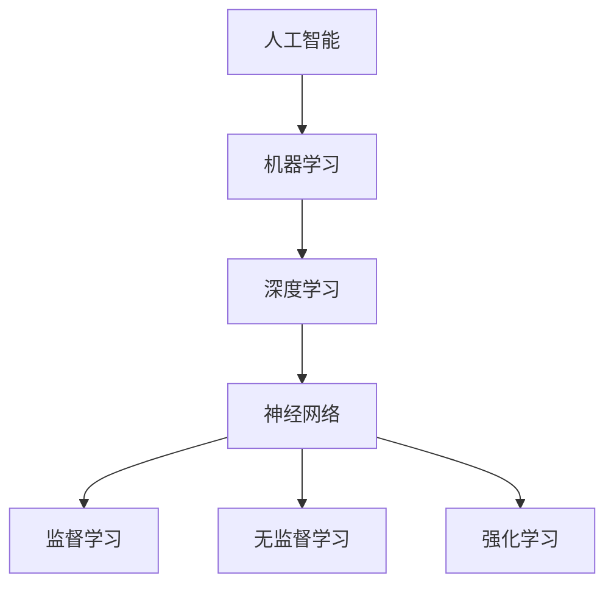

##### 1.1.2 AI技术的发展趋势
**核心概念与联系：** AI技术的发展趋势可以通过以下流程图展示：
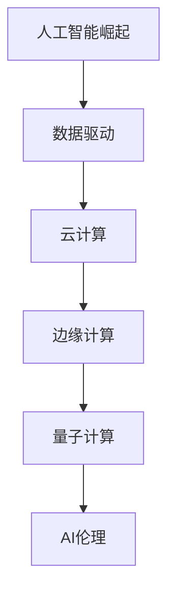

##### 1.1.3 AI在全球的应用现状
**核心概念与联系：** AI在全球的应用现状可以通过以下流程图展示：
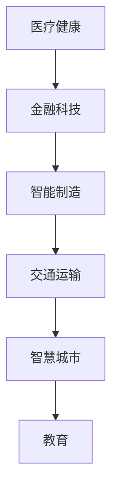

#### 1.2 微软的AI战略

##### 1.2.1 微软AI战略的背景
**核心概念与联系：** 微软AI战略的背景可以通过以下流程图展示：
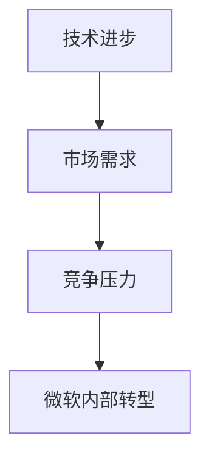

##### 1.2.2 微软AI战略的目标
**核心概念与联系：** 微软AI战略的目标可以通过以下流程图展示：
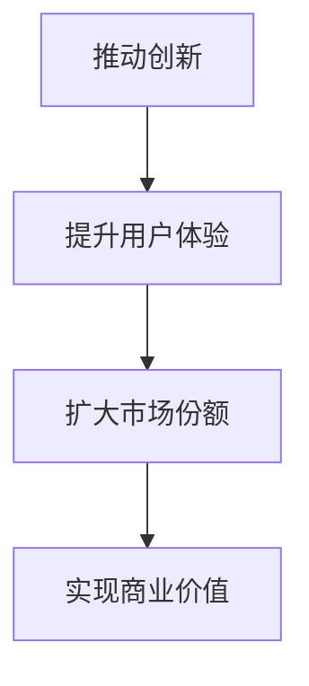

##### 1.2.3 微软AI战略的核心举措
**核心概念与联系：** 微软AI战略的核心举措可以通过以下流程图展示：
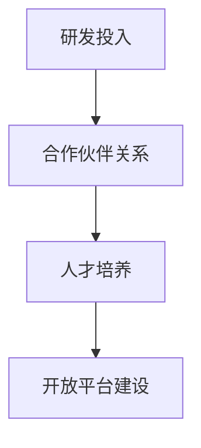

#### 1.3 大模型在微软AI战略中的地位

##### 1.3.1 大模型的概念与特点
**核心概念与联系：** 大模型的概念与特点可以通过以下流程图展示：
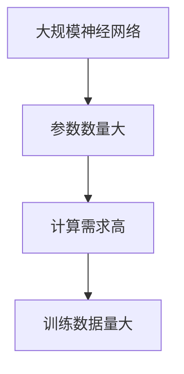

##### 1.3.2 大模型在微软AI战略中的作用
**核心概念与联系：** 大模型在微软AI战略中的作用可以通过以下流程图展示：
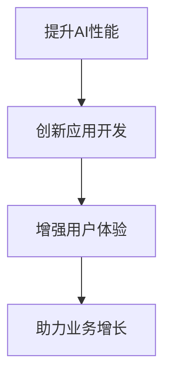

##### 1.3.3 大模型对微软业务的影响
**核心概念与联系：** 大模型对微软业务的影响可以通过以下流程图展示：
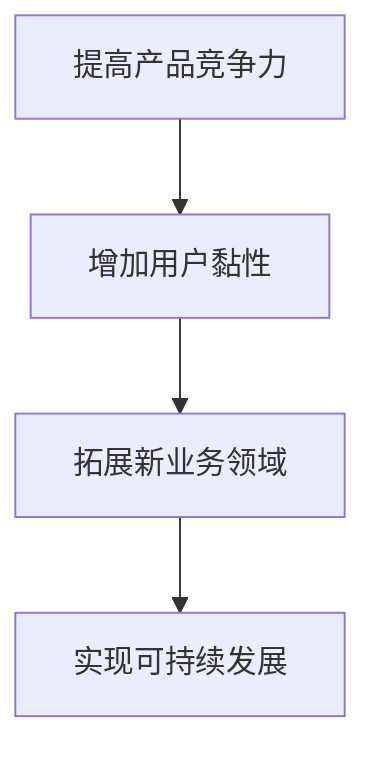

### 第二部分：微软All In AI策略的核心技术与实践

#### 2.1 微软大模型技术

##### 2.1.1 微软大模型技术的发展历程
**核心算法原理讲解：** 微软大模型技术的发展历程可以通过以下伪代码展示：
```python
def model_development():
    # 初始化模型
    model = initialize_model()
    # 数据预处理
    data = preprocess_data()
    # 训练模型
    for epoch in range(num_epochs):
        for data_batch in data_batches:
            loss = train_on_batch(model, data_batch)
            if loss <= threshold:
                break
    # 评估模型
    evaluate_model(model)
```

##### 2.1.2 微软大模型的技术架构
**核心概念与联系：** 微软大模型的技术架构可以通过以下流程图展示：
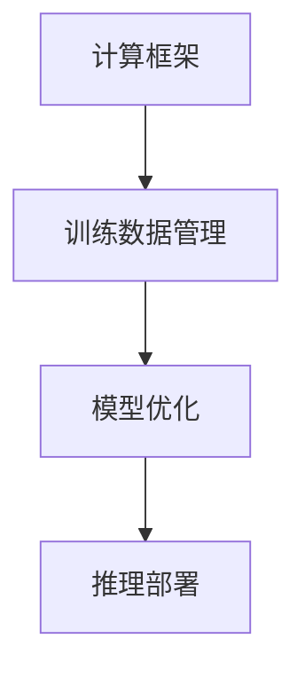

##### 2.1.3 微软大模型的技术优势
**核心概念与联系：** 微软大模型的技术优势可以通过以下流程图展示：
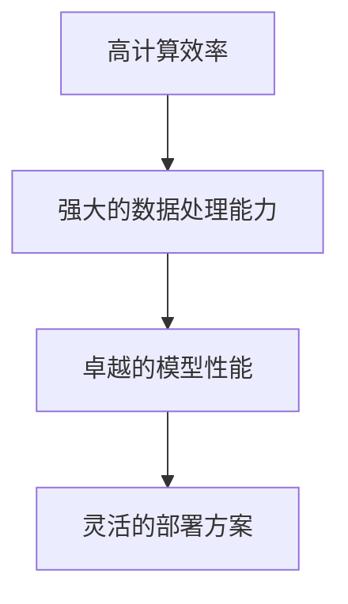

#### 2.2 微软AI产品与服务

##### 2.2.1 微软Azure AI平台
**核心概念与联系：** 微软Azure AI平台的架构可以通过以下流程图展示：
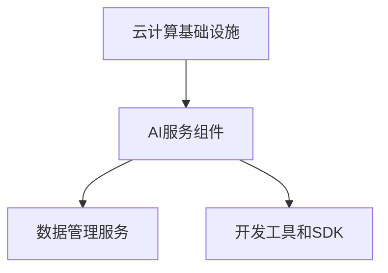

##### 2.2.2 微软Office 365 AI功能
**核心概念与联系：** 微软Office 365 AI功能的实现可以通过以下流程图展示：
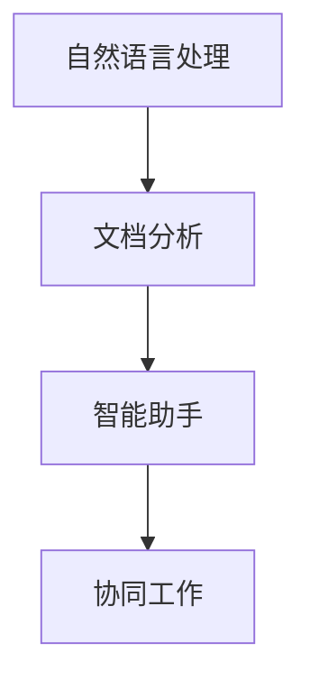

##### 2.2.3 微软Xbox AI技术
**核心概念与联系：** 微软Xbox AI技术的实现可以通过以下流程图展示：
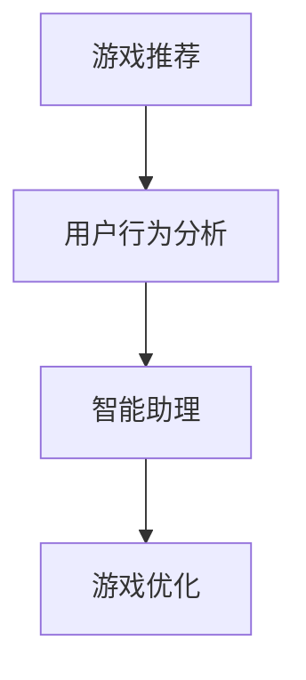

#### 2.3 微软AI项目实践

##### 2.3.1 微软Health AI案例
**核心概念与联系：** 微软Health AI案例的应用场景可以通过以下流程图展示：
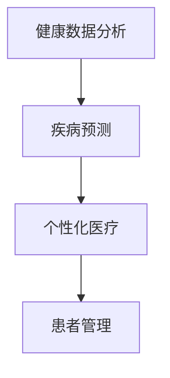

##### 2.3.2 微软教育AI应用
**核心概念与联系：** 微软教育AI应用的教学流程可以通过以下流程图展示：
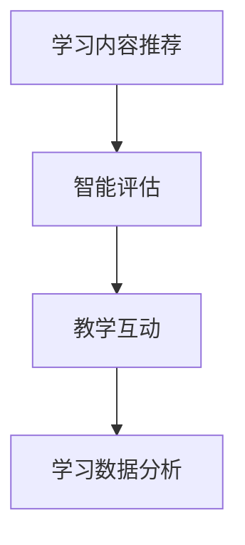

##### 2.3.3 微软制造AI创新
**核心概念与联系：** 微软制造AI创新的生产流程可以通过以下流程图展示：
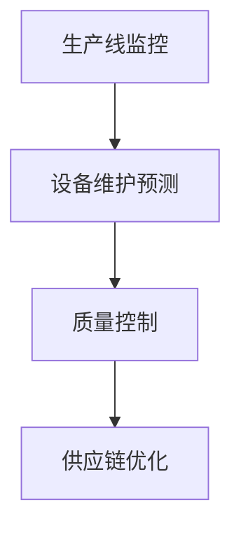

#### 2.4 微软AI人才培养

##### 2.4.1 微软AI教育项目
**核心概念与联系：** 微软AI教育项目的课程设计可以通过以下流程图展示：
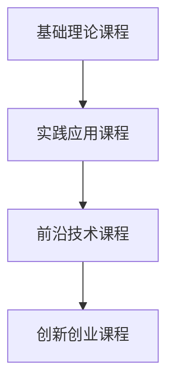

##### 2.4.2 微软AI人才培养战略
**核心概念与联系：** 微软AI人才培养战略的执行可以通过以下流程图展示：
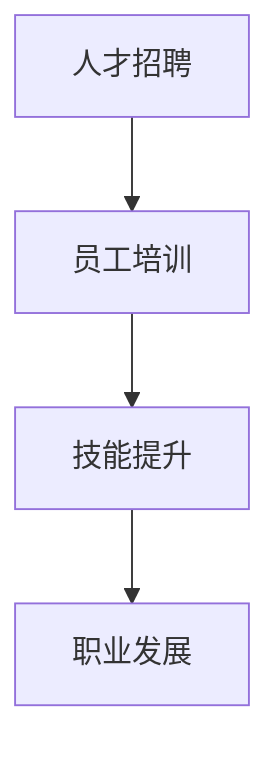

##### 2.4.3 微软AI人才发展的挑战与机遇
**核心概念与联系：** 微软AI人才发展的挑战与机遇可以通过以下流程图展示：
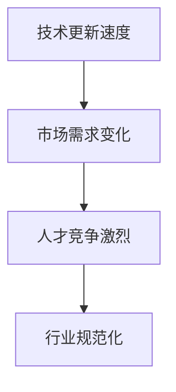

### 第三部分：微软All In AI策略的未来展望

#### 3.1 AI时代的社会影响

##### 3.1.1 AI对经济的影响
**数学模型与公式：** AI对经济的促进作用可以通过以下模型进行描述：
$$
ROI = \frac{AI\_产生的经济效益}{AI\_投入成本}
$$
其中，$ROI$代表投资回报率。

##### 3.1.2 AI对人类生活方式的影响
**核心概念与联系：** AI对人类生活方式的影响可以通过以下流程图展示：
```mermaid
graph TD
A[提高生活效率] --> B[智能服务]
B --> C[娱乐休闲]
C --> D[社交互动]
```

##### 3.1.3 AI伦理与社会责任
**核心概念与联系：** AI伦理与社会责任可以通过以下流程图展示：
```mermaid
graph TD
A[数据隐私保护] --> B[算法公平性]
B --> C[算法透明度]
C --> D[社会责任担当]
```

#### 3.2 微软AI战略的持续发展

##### 3.2.1 微软AI战略的长期目标
**核心概念与联系：** 微软AI战略的长期目标可以通过以下流程图展示：
```mermaid
graph TD
A[全球领导地位] --> B[技术创新]
B --> C[商业成功]
C --> D[社会责任]
```

##### 3.2.2 微软AI技术的未来发展方向
**核心概念与联系：** 微软AI技术的未来发展方向可以通过以下流程图展示：
```mermaid
graph TD
A[量子计算] --> B[边缘AI]
B --> C[强化学习]
C --> D[自监督学习]
```

##### 3.2.3 微软AI战略的全球化布局
**核心概念与联系：** 微软AI战略的全球化布局可以通过以下流程图展示：
```mermaid
graph TD
A[本地化服务] --> B[国际合作]
B --> C[全球市场]
C --> D[全球人才]
```

#### 3.3 AI时代的人才需求

##### 3.3.1 AI时代的人才标准
**核心概念与联系：** AI时代的人才标准可以通过以下流程图展示：
```mermaid
graph TD
A[技术能力] --> B[创新思维]
B --> C[跨学科知识]
C --> D[伦理意识]
```

##### 3.3.2 AI时代的教育改革
**核心概念与联系：** AI时代的教育改革可以通过以下流程图展示：
```mermaid
graph TD
A[课程设置] --> B[教学方法]
B --> C[教育评价]
C --> D[教育资源]
```

##### 3.3.3 AI时代的人才培养策略
**核心概念与联系：** AI时代的人才培养策略可以通过以下流程图展示：
```mermaid
graph TD
A[早期教育] --> B[专业技能培养]
B --> C[创新能力培养]
C --> D[职业发展指导]
```

### 附录

#### 附录A：参考文献
1. Anderson, J. A. (2011). Machine Learning: A Probabilistic Perspective. MIT Press.
2. Goodfellow, I., Bengio, Y., & Courville, A. (2016). Deep Learning. MIT Press.
3. Russell, S., & Norvig, P. (2020). Artificial Intelligence: A Modern Approach. Prentice Hall.

#### 附录B：微软AI相关资源
1. Microsoft AI官网: <https://www.microsoft.com/en-us/ai>
2. 微软AI博客: <https://blogs.microsoft.com/ai/>
3. 微软AI研究报告: <https://www.microsoft.com/en-us/research/group/microsoft-research-ai/>
4. 微软AI相关书籍: <https://www.microsoft.com/en-us/store/top-free-books/ai-machine-learning>

#### 术语表

##### A.1 AI
人工智能（Artificial Intelligence）是指计算机系统模拟人类智能行为的技术。

##### A.2 大模型
大模型是指具有大规模参数和复杂结构的神经网络模型。

##### A.3 微软Azure AI
微软Azure AI是微软提供的云计算平台，用于开发、部署和托管AI应用程序。

##### A.4 微软Office 365 AI
微软Office 365 AI是集成了AI功能的办公软件套件，旨在提升用户的生产力。

##### A.5 微软Xbox AI
微软Xbox AI是应用于Xbox游戏平台的人工智能技术，提供个性化游戏体验。

##### A.6 伦理AI
伦理AI是指遵循道德规范和伦理原则的人工智能系统。

##### A.7 机器学习
机器学习（Machine Learning）是一种让计算机从数据中自动学习并改进性能的技术。

##### A.8 深度学习
深度学习（Deep Learning）是一种基于多层神经网络进行数据处理的机器学习技术。

##### A.9 自监督学习
自监督学习（Self-supervised Learning）是一种不需要人工标签的数据处理方法。

##### A.10 迁移学习
迁移学习（Transfer Learning）是一种将知识从一个任务转移到另一个任务的技术。

##### A.11 微调
微调（Fine-tuning）是在预训练模型的基础上进行特定任务训练的过程。

##### A.12 优化算法
优化算法（Optimization Algorithm）是一种用于寻找最优解的计算方法。

##### A.13 ROI
ROI（Return on Investment）是投资回报率，用于衡量投资的效益。

##### A.14 工程师文化
工程师文化是指工程师共同遵循的工作方法和价值观。

##### A.15 人才战略
人才战略是指企业为实现长远发展目标而制定的人才培养和使用策略。

##### A.16 教育改革
教育改革是指为了适应社会需求而进行的系统性教育变革。

##### A.17 全球化布局
全球化布局是指企业在全球范围内进行市场拓展和资源配置的战略。

##### A.18 伦理与社会责任
伦理与社会责任是指企业在经营活动中应遵循的道德和社会责任原则。

##### A.19 持续发展
持续发展是指企业在长期发展过程中实现经济、社会和环境三者之间的平衡。

