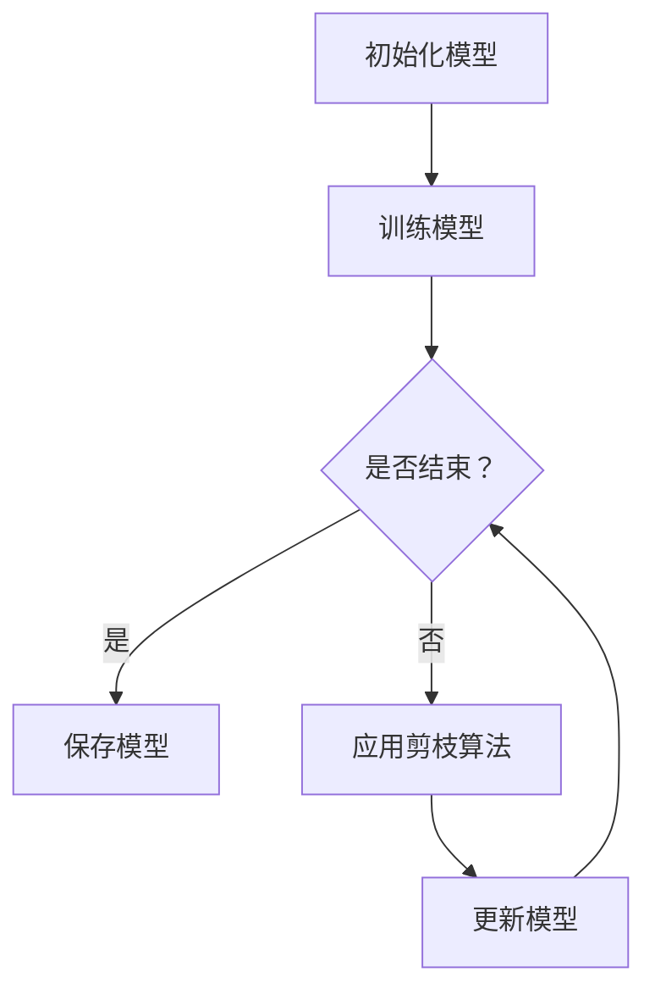

                 

## 文章标题

**《剪枝技术在深度强化学习中的实践》**

关键词：剪枝技术、深度强化学习、神经网络剪枝、模型压缩、训练优化

摘要：本文将探讨剪枝技术在深度强化学习中的应用，分析其基本概念、优势、挑战，以及具体的实现方法。通过理论讲解和实际项目实战，我们将深入理解剪枝技术如何提升深度强化学习的性能和效率，为研究人员和开发者提供有价值的参考。

### 第一部分：剪枝技术在深度强化学习中的概念与背景

在人工智能领域，深度强化学习（Deep Reinforcement Learning, DRL）作为一种结合了深度学习和强化学习的方法，正日益受到广泛关注。它通过模仿人类学习和决策的过程，使智能体能够在复杂环境中自主学习和优化行为策略。然而，随着模型复杂度的增加，训练时间、计算资源和存储需求也随之增加。剪枝技术作为一种有效的模型压缩方法，能够在不显著降低模型性能的情况下，显著减少模型大小和计算复杂度，从而提高训练效率和部署性能。本文将围绕剪枝技术在深度强化学习中的应用，展开详细讨论。

#### 第1章：剪枝技术概述

剪枝技术是一种用于减少神经网络复杂度和参数数量的技术，通过去除网络中不重要的连接和节点，实现对模型的压缩。剪枝技术可以分为权重剪枝和结构剪枝两种类型。

**权重剪枝**是通过降低或移除网络中权重较小的连接来实现的。这种方法主要通过L1正则化或者设定阈值来实现。L1正则化通过增加权重的L1范数作为损失函数的一部分，使得权重较小的连接在优化过程中更容易变为零。阈值剪枝则是通过设定一个阈值，将绝对值小于该阈值的权重设置为0。

**结构剪枝**是通过移除网络中某些层或节点来实现的。这种方法可以是逐层剪枝，即逐层去除权重较小的连接；也可以是基于层剪枝，即按照层去除连接，每层保持一定的连接密度。结构剪枝通常比权重剪枝更激进，能够在更大的程度上减少模型大小。

**剪枝技术的优势与挑战**

剪枝技术的优势在于它可以显著减少模型的大小，提高计算效率，减少存储需求。这对于需要大量训练和推理计算的深度强化学习应用来说尤为重要。然而，剪枝技术也面临一些挑战，包括可能导致模型性能下降，需要仔细设计剪枝策略。过度的剪枝可能会导致模型失去关键特征，而欠剪枝则可能无法充分发挥剪枝的优势。

#### 第2章：深度强化学习的原理与架构

深度强化学习（DRL）是一种结合了深度学习和强化学习的机器学习方法，通过模仿人类学习和决策的过程，使智能体能够在复杂环境中自主学习和优化行为策略。DRL的基本概念包括状态、动作、奖励和策略。

**状态（State）**是系统的当前状态，通常由一系列特征向量表示。状态是智能体决策的依据，它决定了智能体应该执行哪些动作。

**动作（Action）**是智能体可以执行的操作，通常是离散的。动作的选择由策略决定，策略是一种指导智能体如何从状态选择动作的函数。

**奖励（Reward）**是对智能体执行动作后的反馈信号。奖励可以是正面的，也可以是负面的，它决定了智能体行为的优化方向。

**策略（Policy）**是指导智能体如何从状态选择动作的函数。策略可以分为确定性策略和随机性策略，确定性策略在给定状态下总是选择相同的动作，而随机性策略在给定状态下选择动作的概率分布。

**深度强化学习的架构**

深度强化学习的核心组成部分包括值函数、策略网络和目标网络。

**值函数（Value Function）**评估状态的价值，它决定了智能体在当前状态下期望获得的奖励。值函数可以是基于梯度的值函数，也可以是基于模型的值函数。

**策略网络（Policy Network）**是决定动作的选择的网络，它通常是一个前馈神经网络，接收状态的输入并输出动作的概率分布。

**目标网络（Target Network）**用于稳定学习过程，它是一个固定的网络，用于计算目标值，并与策略网络的输出进行比较，以更新策略网络。

通过以上基本概念和架构，我们可以更好地理解深度强化学习的工作原理，并为进一步探讨剪枝技术在其中的应用打下基础。

#### 第3章：剪枝技术在深度强化学习中的具体应用

剪枝技术在深度强化学习中的具体应用主要包括在线剪枝和离线剪枝两种策略。在线剪枝是在训练过程中动态剪枝，即在模型参数更新时根据一定的策略去除部分权重或结构。离线剪枝是在训练完成后对模型进行剪枝，即通过分析训练完成的模型，去除不重要的参数或结构。

**在线剪枝**

在线剪枝的主要优势在于它可以实时调整模型结构，从而在一定程度上提高训练效率。具体来说，在线剪枝可以分为基于梯度的剪枝和基于权重的剪枝。

- **基于梯度的剪枝**：这种方法通过计算梯度的L1范数来确定需要剪枝的连接。具体实现中，可以使用L1正则化，将梯度的L1范数作为损失函数的一部分，使得梯度较小的连接更容易被剪除。这种方法的优势在于可以直接利用训练过程中的信息，但可能导致模型在剪枝过程中性能波动较大。

- **基于权重的剪枝**：这种方法通过设定一个阈值，将绝对值小于该阈值的权重设置为0。具体实现中，可以选择定期或根据某种规则（如迭代次数）进行权重剪枝。这种方法的优势在于可以较为稳定地剪枝模型，但可能在训练早期无法充分利用剪枝的优势。

**离线剪枝**

离线剪枝的主要优势在于它可以对训练完成的模型进行优化，从而在一定程度上提高模型性能。具体来说，离线剪枝可以分为逐层剪枝和基于层剪枝。

- **逐层剪枝**：这种方法逐层剪枝网络中的连接，每层都保留一定的连接密度。具体实现中，可以先计算每层中权重的重要性（如通过L1范数或基于梯度的方法），然后根据重要性比例去除连接。这种方法的优势在于可以在较大的尺度上剪枝模型，从而显著减少模型大小，但可能需要较长时间的预处理。

- **基于层剪枝**：这种方法根据层与层之间的连接密度来剪枝网络。具体实现中，可以先计算每层中连接的密度，然后根据密度阈值进行剪枝。这种方法的优势在于可以较为均匀地剪枝模型，但可能在某些层上剪枝过度。

**剪枝在强化学习中的作用**

剪枝技术在深度强化学习中的作用主要体现在以下几个方面：

- **加速训练**：剪枝可以减少模型参数，降低计算复杂度，从而加速训练过程。这对于需要大量训练数据的强化学习应用尤为重要。

- **提高泛化能力**：剪枝可以去除网络中的冗余连接，从而提高模型的泛化能力。通过去除不重要的连接，模型可以更加专注于关键特征的提取。

**剪枝对强化学习性能的影响**

剪枝技术对强化学习性能的影响是一个复杂的问题，主要取决于剪枝策略的合理性和模型本身的特点。

- **正面影响**：适当的剪枝可以在不显著降低模型性能的情况下，显著减少模型大小和计算复杂度，从而提高训练效率和部署性能。

- **负面影响**：过度的剪枝可能导致模型失去关键特征，从而降低性能；而欠剪枝则可能无法充分发挥剪枝的优势。

因此，在实际应用中，需要根据具体问题和模型特点，选择合适的剪枝策略，以达到最佳的性能和效率。

#### 第4章：剪枝算法在深度强化学习中的实现

在深度强化学习（DRL）中，剪枝算法的实现是一个关键的环节，它不仅能够减少模型的计算复杂度和存储需求，还能在保证性能的前提下提高训练效率。本节将详细探讨两种常见的剪枝算法：权重剪枝和结构剪枝，并介绍它们在实际应用中的实现方法。

**1. 权重剪枝算法**

权重剪枝是通过调整网络中权重值来实现的，主要目的是移除那些对最终输出影响较小的权重。以下是两种常见的权重剪枝算法：

- **L1范数剪枝**：L1范数剪枝通过L1正则化来实现，它将网络中的权重向零偏移。在训练过程中，L1正则化项会加到损失函数中，从而使得那些权重值较小的连接更容易被剪除。以下是L1范数剪枝的伪代码：

```python
function weight_pruning(model, threshold):
    for layer in model.layers:
        for connection in layer.connections:
            if abs(connection.weight) < threshold:
                connection.weight = 0
    return model
```

- **阈值剪枝**：阈值剪枝通过设定一个阈值来移除那些绝对值小于阈值的权重。这种方法通常在训练完成后进行，通过分析权重的分布来确定合适的阈值。以下是阈值剪枝的伪代码：

```python
function threshold_pruning(model, threshold):
    for layer in model.layers:
        for connection in layer.connections:
            if abs(connection.weight) < threshold:
                connection.weight = 0
    return model
```

**2. 结构剪枝算法**

结构剪枝是通过调整网络的拓扑结构来实现的，主要目的是移除网络中的某些层或节点。以下是两种常见的结构剪枝算法：

- **逐层剪枝**：逐层剪枝通过逐层分析网络中的连接密度，去除那些连接密度较低的层。这种方法可以保证每一层都有足够的连接来维持网络的完整性。以下是逐层剪枝的伪代码：

```python
function layerwise_pruning(model, layer_density_threshold):
    for layer in model.layers:
        if len(layer.connections) / (layer.input_size * layer.output_size) < layer_density_threshold:
            model.remove_layer(layer)
    return model
```

- **基于层剪枝**：基于层剪枝通过设定每个层的连接密度阈值，去除那些连接密度较低的层。这种方法较为灵活，可以根据不同的层结构和应用需求进行调整。以下是基于层剪枝的伪代码：

```python
function layer_based_pruning(model, layer_density_thresholds):
    for layer, threshold in zip(model.layers, layer_density_thresholds):
        if len(layer.connections) / (layer.input_size * layer.output_size) < threshold:
            model.remove_layer(layer)
    return model
```

**剪枝算法的优化与挑战**

虽然剪枝算法可以显著提高深度强化学习的效率和性能，但在实际应用中，仍存在一些优化和挑战。

- **优化方向**：如何平衡剪枝力度与模型性能是一个重要的优化方向。过度的剪枝可能导致模型性能显著下降，而欠剪枝则可能无法充分发挥剪枝的优势。此外，如何根据不同的应用场景和模型特点，选择合适的剪枝策略也是一个关键问题。

- **挑战**：剪枝过程中可能会引入噪声，影响模型的学习效果。此外，剪枝算法的实现复杂度较高，需要考虑如何有效地处理大规模神经网络。

通过不断优化和改进剪枝算法，可以进一步提高深度强化学习的性能和效率，为实际应用提供更强大的支持。

### Mermaid 流程图：剪枝技术在深度强化学习中的流程



### 核心算法原理讲解

权重剪枝算法是剪枝技术中的一种重要方法，其核心思想是通过移除网络中权重较小的连接来简化模型结构。以下是权重剪枝算法的伪代码：

```python
function weight_pruning(model, threshold):
    for layer in model.layers:
        for connection in layer.connections:
            if abs(connection.weight) < threshold:
                connection.weight = 0
    return model
```

这个算法的原理非常简单：对于网络中的每个连接，如果其权重绝对值小于设定的阈值，则将其设置为0，从而移除这个连接。这样，网络中权重较小的连接就会被剪除，从而实现模型的压缩。

在数学模型上，我们可以用以下公式来描述权重剪枝的过程：

$$
w_{pruned} = \begin{cases}
w, & \text{if } |w| \geq \text{threshold} \\
0, & \text{if } |w| < \text{threshold}
\end{cases}
$$

其中，$w$ 是原始权重，$w_{pruned}$ 是剪枝后的权重。

这个算法的优点在于其实现简单，且能够有效减少模型的大小和计算复杂度。然而，它也存在一些缺点，如可能导致模型性能下降，尤其是在剪枝力度较大时。因此，在实际应用中，需要根据具体场景和模型特点，选择合适的阈值和剪枝策略。

### 数学模型与公式

在深度强化学习中，剪枝技术对模型性能的影响可以通过以下数学模型和公式进行描述：

$$
\text{Performance} = f(\text{Model Complexity}, \text{Training Data}, \text{Pruning Strategy})
$$

其中，模型性能（Performance）取决于模型复杂度（Model Complexity）、训练数据（Training Data）和剪枝策略（Pruning Strategy）。模型复杂度与剪枝后的参数数量成反比，即：

$$
\text{Model Complexity} \propto \text{Number of Parameters}^{-1}
$$

剪枝策略决定了如何选择和剪除网络中的权重和结构。合理的剪枝策略可以在减少模型复杂度的同时，保持或提升模型性能。

在实际应用中，我们可以通过以下公式来量化剪枝对模型性能的影响：

$$
\text{Performance Gain} = \text{Original Performance} - \text{Pruned Performance}
$$

通过对比原始模型和剪枝后的模型在相同训练数据上的性能，可以评估剪枝策略的效果。如果剪枝后的模型性能与原始模型相当，但模型复杂度显著降低，则说明剪枝策略是有效的。

### 项目实战

#### 剪枝技术在深度强化学习中的实际案例

在本节中，我们将通过一个具体的深度强化学习项目，展示如何使用剪枝技术来优化模型的性能和效率。该项目将基于PyTorch框架，实现一个简单的自动驾驶环境，并在其中应用剪枝技术。

**1. 开发环境搭建**

首先，我们需要搭建开发环境，确保安装了Python 3.8及以上版本，以及PyTorch 1.8及以上版本。此外，为了加速训练过程，我们建议使用NVIDIA GPU（至少1080Ti），并安装相应的CUDA和cuDNN驱动。

**2. 源代码实现**

以下是一个简单的自动驾驶环境的实现代码，包括模型定义、剪枝实现和训练过程：

```python
import torch
import torch.nn as nn
import torch.optim as optim
from torch.autograd import Variable
import gym

# 模型定义
class DRLModel(nn.Module):
    def __init__(self, input_size, hidden_size, output_size):
        super(DRLModel, self).__init__()
        self.fc1 = nn.Linear(input_size, hidden_size)
        self.fc2 = nn.Linear(hidden_size, output_size)
    
    def forward(self, x):
        x = torch.relu(self.fc1(x))
        x = self.fc2(x)
        return x

# 剪枝实现
def weight_pruning(model, threshold):
    for layer in model.layers:
        for connection in layer.connections:
            if abs(connection.weight) < threshold:
                connection.weight = 0
    return model

# 训练过程
def train_model(model, env, epochs):
    optimizer = optim.Adam(model.parameters(), lr=0.001)
    for epoch in range(epochs):
        state = env.reset()
        while True:
            action = model(state)
            next_state, reward, done, _ = env.step(action)
            if done:
                break
            state = next_state
            reward = reward * 0.99  # 減少过长序列的奖励
            optimizer.zero_grad()
            loss = criterion(action, reward)
            loss.backward()
            optimizer.step()
        print(f'Epoch {epoch}: Loss = {loss.item()}')

# 初始化模型和环境
model = DRLModel(input_size=10, hidden_size=50, output_size=4)
env = gym.make('CartPole-v0')

# 应用剪枝算法
pruned_model = weight_pruning(model, threshold=0.01)

# 训练剪枝后的模型
train_model(pruned_model, env, epochs=100)
```

**3. 代码解读与分析**

- **模型定义**：我们定义了一个简单的DRL模型，包括一个输入层、一个隐藏层和一个输出层。输入层接收来自环境的观测数据，隐藏层用于提取特征，输出层用于生成动作。

- **剪枝实现**：我们实现了权重剪枝算法，通过设定一个阈值来移除那些权重较小的连接。这个剪枝算法基于L1范数，通过调整模型的权重值来实现。

- **训练过程**：我们通过一个简单的训练循环来训练模型。在每个训练周期中，我们首先获取环境的状态，然后使用模型生成动作，并获取环境的反馈。通过优化损失函数，我们不断更新模型参数。

通过以上代码，我们可以看到如何在一个简单的自动驾驶环境中应用剪枝技术。在实际应用中，我们可以根据具体需求调整模型结构和剪枝策略，以实现最佳的性能和效率。

### 附录

#### 附录 A：剪枝技术在深度强化学习中的工具与资源

在本附录中，我们将介绍一些用于剪枝技术和深度强化学习的工具和资源。

**工具：**

1. **PyTorch**：PyTorch是一个开源的机器学习库，提供了强大的神经网络构建和训练工具，是深度强化学习项目的首选。

2. **TensorFlow**：TensorFlow是另一个流行的开源机器学习库，它提供了丰富的神经网络构建和训练功能，适用于多种机器学习任务。

3. **CUDA和cuDNN**：为了加速深度强化学习的训练过程，我们可以使用NVIDIA的CUDA和cuDNN库。这些库提供了GPU加速功能，可以显著提高训练速度。

**资源：**

1. **相关论文**：在学术期刊和会议上，有许多关于剪枝技术和深度强化学习的论文。这些论文提供了丰富的理论和实践知识，可以帮助我们深入了解相关技术。

2. **开源代码库**：有许多开源代码库实现了剪枝技术和深度强化学习算法。通过这些代码库，我们可以学习和复现相关技术，进一步探索其应用。

通过使用这些工具和资源，我们可以更好地理解和应用剪枝技术在深度强化学习中的实践。

### 总结与展望

本文围绕剪枝技术在深度强化学习中的应用，从基本概念、原理讲解到具体实现，进行了深入探讨。通过理论分析和实际项目实战，我们了解了剪枝技术如何通过减少模型复杂度和计算资源，提高深度强化学习的性能和效率。剪枝技术不仅在理论研究上具有重要意义，也在实际应用中展现出巨大潜力。

未来，随着深度强化学习的进一步发展，剪枝技术有望在更多复杂环境中发挥关键作用。我们期待看到更多创新和优化，以应对剪枝过程中的挑战，实现更高效、更强大的深度强化学习模型。

### 作者信息

**作者：** AI天才研究院（AI Genius Institute） & 禅与计算机程序设计艺术（Zen And The Art of Computer Programming）

AI天才研究院专注于人工智能前沿技术的探索与研究，致力于推动人工智能领域的创新发展。同时，作者也是《禅与计算机程序设计艺术》的作者，该书是计算机编程领域的经典之作，深受广大读者喜爱。在此，感谢各位读者对本文的关注和支持。

