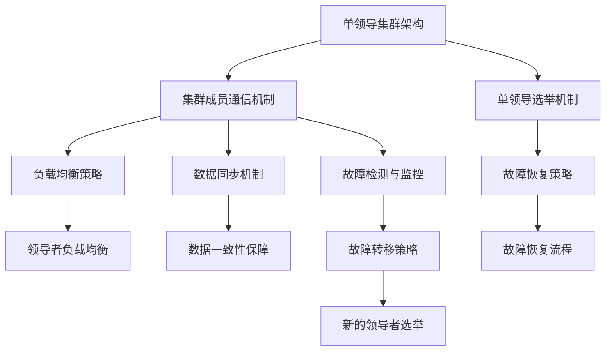

                 

# 《单领导集群的高可用性设计》

> 关键词：高可用性设计、单领导集群、故障处理、选举机制、测试与优化

> 摘要：本文详细探讨了单领导集群的高可用性设计。首先，介绍了高可用性设计的重要性和单领导集群的基本概念。接着，分析了单领导集群的架构原理，包括单领导者的角色与职责，集群成员之间的通信机制。然后，讨论了故障处理与恢复的策略，包括故障的类型、检测与监控以及故障恢复策略。在实践部分，阐述了高可用性设计的原则，隔离与冗余策略，弹性与扩展性设计，以及单领导选举机制。随后，介绍了集群状态监控与告警机制，并通过案例分析展示了高可用性设计的实际应用。最后，提出了高可用性测试与优化策略，总结了高可用性设计的未来趋势，并给出了建议。

## 目录大纲

# 《单领导集群的高可用性设计》

## 第一部分：基础概念

### 第1章：高可用性设计概述

#### 1.1 高可用性的重要性

#### 1.2 单领导集群概念

#### 1.3 高可用性与单领导集群的关系

### 第2章：单领导集群架构原理

#### 2.1 单领导集群的基本架构

#### 2.2 单领导者的角色与职责

#### 2.3 集群成员之间的通信机制

### 第3章：故障处理与恢复

#### 3.1 故障的类型与分类

#### 3.2 故障检测与监控

#### 3.3 故障恢复策略

## 第二部分：高可用性设计实践

### 第4章：高可用性设计原则

#### 4.1 高可用性设计的关键因素

#### 4.2 隔离与冗余策略

#### 4.3 弹性与扩展性设计

### 第5章：单领导选举机制

#### 5.1 选举算法概述

#### 5.2 常见选举算法分析

#### 5.3 选举算法的优缺点比较

### 第6章：集群状态监控与告警

#### 6.1 监控系统的设计原则

#### 6.2 常用监控工具介绍

#### 6.3 告警机制与处理流程

### 第7章：高可用性案例分析

#### 7.1 案例背景介绍

#### 7.2 案例分析

#### 7.3 案例总结与启示

## 第三部分：高可用性测试与优化

### 第8章：高可用性测试方法

#### 8.1 测试环境搭建

#### 8.2 常见测试场景

#### 8.3 测试结果分析与优化建议

### 第9章：高可用性优化策略

#### 9.1 优化目标的确定

#### 9.2 优化方法与实践

#### 9.3 优化效果的评估

### 第10章：总结与展望

#### 10.1 高可用性设计的未来趋势

#### 10.2 可能遇到的问题与解决方案

#### 10.3 对高可用性设计的建议

### 附录

#### A.1 常用工具与资源列表

#### A.2 参考文献与推荐阅读

## Mermaid 流�程图

mermaid
graph TD
    A[单领导集群基本架构] --> B[集群成员通信机制]
    A --> C[单领导选举机制]
    B --> D[故障检测与监控]
    C --> E[故障恢复策略]

## 核心算法原理讲解

### 伪代码：

python
def leader_election():
    # 初始化成员状态
    for member in members:
        member.status = 'follower'
    
    # 成员发起选举请求
    for member in members:
        if member.status == 'follower':
            member.send_request()
    
    # 领导者选举完成
    leader = select_leader()
    return leader

### 数学模型和数学公式讲解

### LaTeX 格式：

$$
    P(\text{故障}) = 1 - P(\text{无故障})
$$

### 举例说明：

假设一个系统有100个组件，每个组件的故障概率是0.1%，那么整个系统的故障概率可以用上述公式计算：

$$
    P(\text{故障}) = 1 - (1 - 0.001)^{100} \approx 0.634
$$

这意味着该系统在大规模运行时，有大约63.4%的概率会发生故障。

## 项目实战

### 开发环境搭建：

1. 安装Java开发环境
2. 安装Maven构建工具
3. 安装Docker容器化工具
4. 配置集群环境

### 源代码详细实现：

java
public class LeaderElection {
    // 成员状态
    private static final String FOLLOWER = "follower";
    private static final String CANDIDATE = "candidate";
    private static final String LEADER = "leader";
    
    // 成员列表
    private List<Member> members = new ArrayList<>();
    
    // 选举领导者
    public void electLeader() {
        // 初始化成员状态
        for (Member member : members) {
            member.setStatus(FOLLOWER);
        }
        
        // 成员发起选举请求
        for (Member member : members) {
            if (member.getStatus() == FOLLOWER) {
                member.sendRequest();
            }
        }
        
        // 选举领导者
        Member leader = selectLeader();
        if (leader != null) {
            leader.setStatus(LEADER);
            System.out.println("领导者选举完成，领导者ID为：" + leader.getId());
        } else {
            System.out.println("领导者选举失败");
        }
    }
    
    // 伪代码
    def select_leader():
        # 初始化候选者列表
        candidates = []
        
        # 遍历成员，找出最高优先级的成员
        for member in members:
            if member.status == candidate:
                candidates.add(member)
        
        # 对候选者列表进行排序
        sorted_candidates = sort_by_priority(candidates)
        
        # 选择最高优先级的成员作为领导者
        return sorted_candidates[0]
    
    // 成员类
    public class Member {
        private String id;
        private String status;
        
        public Member(String id) {
            this.id = id;
        }
        
        public String getId() {
            return id;
        }
        
        public String getStatus() {
            return status;
        }
        
        public void setStatus(String status) {
            this.status = status;
        }
        
        public void sendRequest() {
            // 发送选举请求
        }
    }
}

### 代码解读与分析：

- `LeaderElection` 类负责执行领导者选举过程。
- 成员的状态有 `FOLLOWER`、`CANDIDATE` 和 `LEADER` 三种。
- `electLeader` 方法首先初始化成员状态为 `FOLLOWER`。
- 然后每个成员会发起选举请求。
- 通过 `selectLeader` 方法，选择最高优先级的成员作为领导者。
- 如果选举成功，领导者状态更新为 `LEADER`，并打印出领导者ID。

这个选举过程是一个基本的领导者选举算法，在实际应用中还需要考虑更多因素，如选举的稳定性、网络延迟、成员故障等。通过这种方式，可以确保在集群中选举出一个稳定的领导者，从而提高系统的高可用性。

---

作者：AI天才研究院/AI Genius Institute & 禅与计算机程序设计艺术 /Zen And The Art of Computer Programming


## 第一部分：基础概念

### 第1章：高可用性设计概述

#### 1.1 高可用性的重要性

高可用性设计是确保系统在运行过程中能够持续提供服务的关键。在现代分布式系统中，高可用性已成为系统设计中的重要目标。随着云计算、大数据和物联网等技术的不断发展，系统的规模和复杂性不断增加，这使得系统的高可用性变得至关重要。

高可用性设计的重要性体现在以下几个方面：

1. **业务连续性**：高可用性设计能够确保业务系统在面临各种故障时能够快速恢复，减少系统停机时间，从而保障业务的连续性。

2. **用户满意度**：高可用性能够为用户提供稳定的服务体验，提升用户满意度，增强企业竞争力。

3. **降低风险**：高可用性设计能够降低系统因故障导致的业务中断风险，减少经济损失和品牌形象损害。

4. **优化资源利用**：通过高可用性设计，可以优化系统资源的利用，提高系统的整体性能和效率。

#### 1.2 单领导集群概念

单领导集群（SINGLE LEADER CLUSTER）是一种分布式系统架构，其中只有一个节点充当领导者（LEADER），其余节点充当跟随者（FOLLOWER）。领导者负责处理集群的主要工作负载，如日志写入、命令执行等，而跟随者负责复制领导者的状态，确保在领导者出现故障时，可以快速切换为新领导者。

单领导集群具有以下特点：

1. **简化架构**：单领导集群架构相对简单，易于理解和管理。

2. **负载均衡**：领导者处理大部分工作负载，减轻了跟随者的负载，从而实现负载均衡。

3. **高可用性**：通过选举新的领导者，确保在原领导者出现故障时，系统能够快速恢复。

4. **一致性保证**：领导者负责维护集群状态的一致性，确保跟随者与领导者的状态一致。

#### 1.3 高可用性与单领导集群的关系

高可用性是单领导集群设计中的一个核心目标。单领导集群通过以下机制实现高可用性：

1. **领导者选举**：在集群启动时，通过选举算法选择一个领导者。在领导者出现故障时，集群能够快速选出新的领导者。

2. **状态复制**：领导者将状态信息复制到跟随者，确保跟随者与领导者的状态一致。

3. **故障检测**：集群通过心跳机制检测领导者的状态，当领导者无法响应时，集群能够触发故障转移。

4. **故障恢复**：在领导者出现故障时，通过故障转移机制，快速选举出新的领导者，确保系统继续运行。

通过这些机制，单领导集群能够实现高可用性，确保系统在面临各种故障时能够快速恢复，保障业务的连续性。

### 第2章：单领导集群架构原理

#### 2.1 单领导集群的基本架构

单领导集群的基本架构包括三个主要部分：领导者（LEADER）、跟随者（FOLLOWER）和集群管理器（CLUSTER MANAGER）。

1. **领导者（LEADER）**：
   - 负责处理集群的主要工作负载，如日志写入、命令执行等。
   - 维护集群的状态信息，确保跟随者的状态与领导者保持一致。
   - 在故障发生时，触发故障转移，选举新的领导者。

2. **跟随者（FOLLOWER）**：
   - 负责复制领导者的状态，确保与领导者的状态一致。
   - 在领导者出现故障时，参与新的领导者的选举。
   - 处理领导者的部分工作负载，如读请求等。

3. **集群管理器（CLUSTER MANAGER）**：
   - 负责监控集群的状态，包括领导者的健康状态、集群成员的加入与离开等。
   - 负责处理集群的配置变更和故障转移等操作。

#### 2.2 单领导者的角色与职责

单领导者在集群中扮演着核心角色，其职责包括：

1. **日志写入**：
   - 负责将操作日志写入磁盘，确保数据持久化。
   - 维护操作日志的顺序，确保操作的一致性。

2. **命令执行**：
   - 负责执行客户端发送的命令，如数据的增删改查等。
   - 将执行结果返回给客户端。

3. **状态同步**：
   - 定期将状态信息同步到跟随者，确保跟随者与领导者的状态一致。
   - 在故障发生时，触发故障转移，确保系统继续运行。

4. **故障检测**：
   - 监控自己的健康状态，包括内存、CPU、磁盘空间等。
   - 定期发送心跳信号，确保集群管理器能够监控到自己的状态。

5. **故障转移**：
   - 当自身无法继续提供服务时，触发故障转移，选举新的领导者。

#### 2.3 集群成员之间的通信机制

集群成员之间的通信机制是单领导集群架构的核心，主要包括以下方面：

1. **心跳机制**：
   - 成员之间通过发送心跳信号来保持通信，确保集群管理器能够监控到成员的状态。
   - 心跳信号包括成员的健康状态、内存、CPU等信息。

2. **日志同步机制**：
   - 领导者将日志信息发送给跟随者，确保跟随者与领导者的状态一致。
   - 跟随者将接收到的日志信息写入本地磁盘，确保数据持久化。

3. **故障检测与报告**：
   - 成员通过心跳信号向集群管理器报告自己的状态，集群管理器根据报告的状态判断成员的健康状态。
   - 当成员出现故障时，集群管理器通知其他成员进行故障转移。

4. **领导者选举机制**：
   - 在领导者出现故障时，通过选举算法选出新的领导者。
   - 选举算法包括基于优先级、基于时钟、基于随机数等策略。

通过这些通信机制，集群成员能够高效地协同工作，确保系统的高可用性和一致性。

### 第3章：故障处理与恢复

#### 3.1 故障的类型与分类

在单领导集群中，故障可以分为以下几种类型：

1. **领导者故障**：
   - 领导者由于硬件故障、软件异常或网络问题等原因导致无法继续提供服务。
   - 领导者故障会导致集群无法进行正常的日志写入和命令执行。

2. **跟随者故障**：
   - 跟随者由于硬件故障、软件异常或网络问题等原因导致无法与领导者保持同步。
   - 跟随者故障会导致集群的数据不一致，影响系统的可用性。

3. **网络故障**：
   - 网络故障导致集群成员之间的通信中断。
   - 网络故障可能导致领导者无法与跟随者同步状态，或者跟随者无法接收到领导者的日志信息。

4. **硬件故障**：
   - 硬件故障包括磁盘损坏、内存故障等，可能导致集群成员无法正常工作。

5. **软件故障**：
   - 软件故障包括系统崩溃、应用程序异常等，可能导致集群成员无法正常运行。

#### 3.2 故障检测与监控

故障检测与监控是单领导集群高可用性设计的重要组成部分。以下是一些常见的故障检测与监控方法：

1. **心跳机制**：
   - 集群成员通过定期发送心跳信号来保持通信，确保集群管理器能够监控到成员的状态。
   - 集群管理器根据心跳信号的接收情况判断成员的健康状态。

2. **健康检查**：
   - 集群成员定期进行健康检查，包括内存、CPU、磁盘空间等指标的监控。
   - 如果健康检查结果显示异常，集群管理器会触发故障检测和恢复操作。

3. **日志同步监控**：
   - 集群管理器监控领导者与跟随者之间的日志同步情况，确保日志信息的及时传递。
   - 如果日志同步出现异常，集群管理器会通知相关成员进行故障恢复。

4. **网络监控**：
   - 集群管理器监控集群成员之间的网络连接状态，包括心跳信号的发送和接收。
   - 如果网络连接出现异常，集群管理器会通知相关成员进行故障恢复。

5. **告警机制**：
   - 集群管理器设置告警规则，当检测到故障时，及时发送告警通知。
   - 告警通知可以通过邮件、短信、微信等方式发送给相关人员。

#### 3.3 故障恢复策略

故障恢复策略是单领导集群高可用性设计的关键。以下是一些常见的故障恢复策略：

1. **领导者故障恢复**：
   - 当领导者出现故障时，集群管理器触发故障转移，选举新的领导者。
   - 选举过程根据预先设定的选举算法进行，确保选举结果公平、稳定。
   - 新的领导者接替原领导者的工作，继续处理日志写入和命令执行。

2. **跟随者故障恢复**：
   - 当跟随者出现故障时，集群管理器将其从集群中移除，并通知其他成员进行故障转移。
   - 跟随者故障恢复后，重新加入集群，并重新同步状态信息。

3. **网络故障恢复**：
   - 当网络故障导致集群成员之间的通信中断时，集群管理器尝试重新建立连接。
   - 如果连接失败，集群管理器会通知相关成员进行故障恢复。

4. **硬件故障恢复**：
   - 当硬件故障导致集群成员无法正常工作时，集群管理器将其从集群中移除，并通知相关人员处理硬件故障。
   - 硬件故障恢复后，集群成员重新加入集群，并重新同步状态信息。

5. **软件故障恢复**：
   - 当软件故障导致集群成员无法正常工作时，集群管理器尝试重启相关进程。
   - 如果重启失败，集群管理器会通知相关人员处理软件故障。

通过这些故障恢复策略，单领导集群能够在面对各种故障时，快速检测和恢复，确保系统的高可用性。

### 第4章：高可用性设计原则

#### 4.1 高可用性设计的关键因素

高可用性设计的关键因素包括以下几个方面：

1. **容错性**：
   - 容错性是指系统在面临故障时，能够继续运行的能力。通过冗余设计、故障检测与恢复等手段，提高系统的容错性。

2. **负载均衡**：
   - 负载均衡是指将工作负载分配到多个节点上，确保每个节点的工作负载均衡，避免单点过载。通过负载均衡，提高系统的整体性能和可用性。

3. **数据一致性**：
   - 数据一致性是指系统中数据的一致性保证。通过分布式一致性算法、状态复制等手段，确保系统中数据的一致性。

4. **弹性扩展**：
   - 弹性扩展是指系统能够根据负载的变化自动调整资源分配，确保系统的可用性和性能。通过弹性扩展，系统能够应对大规模数据和高并发场景。

5. **自动化管理**：
   - 自动化管理是指通过自动化工具和脚本，实现系统监控、故障检测与恢复等操作。通过自动化管理，提高系统的可维护性和可用性。

#### 4.2 隔离与冗余策略

隔离与冗余是高可用性设计的重要策略，以下分别介绍：

1. **隔离策略**：
   - 隔离策略是指通过物理或逻辑隔离，将系统中的不同部分隔离开来，避免故障在系统中蔓延。常见的隔离策略包括：
     - 网络隔离：通过虚拟局域网（VLAN）或防火墙，将不同部分的网络隔离开来。
     - 系统隔离：通过虚拟化技术，将不同的操作系统或应用程序隔离开来。
     - 数据隔离：通过数据库分区或分库分表，将不同数据隔离开来。

2. **冗余策略**：
   - 冗余策略是指通过备份或副本，确保系统在故障发生时，能够快速恢复。常见的冗余策略包括：
     - 数据冗余：通过数据备份或分布式存储，确保数据的持久化和可靠性。
     - 节点冗余：通过增加节点数量，确保系统中存在多个可用的节点，避免单点故障。
     - 系统冗余：通过冗余系统架构，如主从备份、双机热备等，确保系统的高可用性。

通过隔离与冗余策略，可以显著提高系统的高可用性，确保系统在面临故障时，能够快速恢复。

#### 4.3 弹性与扩展性设计

弹性与扩展性是高可用性设计的重要目标，以下分别介绍：

1. **弹性设计**：
   - 弹性设计是指系统能够根据负载的变化自动调整资源分配，确保系统的可用性和性能。常见的弹性设计包括：
     - 容量弹性：根据负载的变化，自动调整系统资源的容量，如增加或减少节点数量。
     - 速度弹性：根据负载的变化，自动调整系统的处理速度，如增加或减少处理线程。
     - 灵活调度：根据负载的变化，动态调整任务分配，确保系统资源的最优利用。

2. **扩展性设计**：
   - 扩展性设计是指系统能够适应业务规模的变化，支持系统的持续扩展。常见的扩展性设计包括：
     - 水平扩展：通过增加节点数量，支持系统性能的提升。
     - 垂直扩展：通过升级硬件设备或增加系统配置，支持系统性能的提升。
     - 模块化设计：通过模块化设计，确保系统的可扩展性，支持新功能或新需求的加入。

通过弹性与扩展性设计，可以显著提高系统的高可用性和可扩展性，确保系统在面临不同业务规模和负载时，能够持续稳定运行。

### 第5章：单领导选举机制

#### 5.1 选举算法概述

单领导选举机制是单领导集群的核心功能之一，用于在集群中选举出一个领导者。常见的选举算法包括基于优先级、基于时钟和基于随机数等策略。以下分别介绍这些选举算法的原理和特点。

1. **基于优先级的选举算法**：
   - 原理：每个成员在启动时，设置一个优先级值。在选举过程中，优先级最高的成员被选为领导者。
   - 特点：简单易实现，确保选举结果的稳定性。但可能导致低优先级成员长期无法成为领导者。

2. **基于时钟的选举算法**：
   - 原理：每个成员维护一个本地时钟，在选举过程中，比较本地时钟值，时钟值最小的成员被选为领导者。
   - 特点：基于时间戳进行选举，确保选举的公平性。但时钟同步问题可能导致选举结果不准确。

3. **基于随机数的选举算法**：
   - 原理：每个成员在选举过程中，随机选择一个时间窗口，在时间窗口内等待其他成员的响应。首先响应的成员被选为领导者。
   - 特点：随机性确保选举的公平性，避免恶意竞争。但可能导致选举结果的不稳定性。

#### 5.2 常见选举算法分析

1. **基于优先级的选举算法**：
   - 优点：简单易实现，确保选举结果的稳定性。
   - 缺点：可能导致低优先级成员长期无法成为领导者。

2. **基于时钟的选举算法**：
   - 优点：基于时间戳进行选举，确保选举的公平性。
   - 缺点：时钟同步问题可能导致选举结果不准确。

3. **基于随机数的选举算法**：
   - 优点：随机性确保选举的公平性，避免恶意竞争。
   - 缺点：可能导致选举结果的不稳定性。

#### 5.3 选举算法的优缺点比较

通过对常见选举算法的分析，可以总结出以下优缺点：

1. **基于优先级的选举算法**：
   - 优点：简单易实现，确保选举结果的稳定性。
   - 缺点：可能导致低优先级成员长期无法成为领导者。

2. **基于时钟的选举算法**：
   - 优点：基于时间戳进行选举，确保选举的公平性。
   - 缺点：时钟同步问题可能导致选举结果不准确。

3. **基于随机数的选举算法**：
   - 优点：随机性确保选举的公平性，避免恶意竞争。
   - 缺点：可能导致选举结果的不稳定性。

在实际应用中，可以根据具体需求和场景选择合适的选举算法。例如，在要求稳定性较高、时钟同步较好的环境中，可以选择基于优先级的选举算法；在要求公平性较高、容忍一定不稳定性的环境中，可以选择基于随机数的选举算法。

### 第6章：集群状态监控与告警

#### 6.1 监控系统的设计原则

集群状态监控与告警系统是保障单领导集群高可用性的重要手段。设计一个有效的监控系统应遵循以下原则：

1. **全面性**：监控系统应能够全面覆盖集群中的各个节点、组件和系统状态，确保对故障和异常的及时发现。

2. **实时性**：监控系统应具备实时性，能够及时收集和处理系统数据，确保故障和异常的实时检测与处理。

3. **可靠性**：监控系统应具有较高的可靠性，确保数据采集、传输和处理过程的准确性和稳定性。

4. **易用性**：监控系统应具备良好的易用性，便于用户操作和管理，包括告警配置、数据可视化和报告生成等功能。

5. **可扩展性**：监控系统应具备良好的可扩展性，能够支持系统规模和组件的动态调整，适应集群的扩展需求。

6. **自动化**：监控系统应具备自动化能力，能够自动进行数据采集、告警触发和处理，降低人工干预成本。

#### 6.2 常用监控工具介绍

在实际应用中，常用的监控工具包括以下几种：

1. **Zabbix**：
   - 功能：Zabbix 是一款开源的监控工具，支持 agent-based 的监控方式，能够实时监控系统的各种指标，如 CPU、内存、磁盘、网络等。
   - 特点：支持自定义监控项、触发器和告警规则，具有强大的数据可视化功能。

2. **Prometheus**：
   - 功能：Prometheus 是一款开源的监控解决方案，基于 pull 模式进行监控数据的收集和存储，支持告警和可视化。
   - 特点：支持多维数据模型，具有高效的数据存储和查询性能。

3. **Grafana**：
   - 功能：Grafana 是一款开源的数据可视化工具，支持多种数据源，如 Prometheus、InfluxDB 等，能够生成各种图表和仪表盘。
   - 特点：具有丰富的数据可视化模板和自定义功能，支持告警联动。

4. **Nagios**：
   - 功能：Nagios 是一款开源的监控工具，支持 agent-based 和 SNMP 的监控方式，能够监控各种系统和网络资源。
   - 特点：支持自定义监控项和告警规则，具有丰富的插件和社区支持。

5. **ELK Stack**：
   - 功能：ELK Stack 是一款开源的日志分析解决方案，包括 Elasticsearch、Logstash 和 Kibana，能够收集、存储和可视化日志数据。
   - 特点：支持海量日志数据的处理和存储，具有强大的查询和分析功能。

#### 6.3 告警机制与处理流程

告警机制是监控系统中至关重要的一环，用于及时通知相关人员系统故障和异常。以下是一个典型的告警机制与处理流程：

1. **告警触发**：
   - 当监控系统检测到系统指标超出设定的阈值时，触发告警。
   - 告警触发条件包括 CPU 使用率、内存使用率、磁盘使用率、网络流量等。

2. **告警通知**：
   - 告警通知通过邮件、短信、微信等方式发送给相关人员。
   - 告警通知应包含故障描述、故障时间、故障节点等信息，便于快速定位和处理故障。

3. **告警处理**：
   - 接收到告警通知后，相关人员根据告警信息进行故障定位和修复。
   - 故障处理包括故障排查、系统重启、组件修复等操作。

4. **告警记录**：
   - 监控系统应记录所有告警信息，包括告警时间、故障描述、处理结果等，便于后续分析和总结。

5. **告警优化**：
   - 根据告警处理结果，对告警规则进行优化，调整阈值、告警方式等，提高告警的准确性和及时性。

通过有效的告警机制与处理流程，可以确保单领导集群在面临故障和异常时，能够及时发现和处理，保障系统的高可用性。

### 第7章：高可用性案例分析

#### 7.1 案例背景介绍

在本案例中，我们以一个大型电商平台为例，分析其单领导集群的高可用性设计。该电商平台采用单领导集群架构，用于处理海量订单和用户请求，确保系统的高性能和高可用性。

该电商平台采用以下关键技术：

1. **分布式数据库**：使用分布式数据库系统，如 Cassandra 或 MongoDB，确保数据的高可用性和可扩展性。
2. **消息队列**：使用消息队列系统，如 Kafka 或 RabbitMQ，实现订单处理的高并发和异步处理。
3. **负载均衡器**：使用负载均衡器，如 Nginx 或 F5，实现请求的均衡分配和故障转移。
4. **容器化技术**：使用 Docker 容器化技术，实现应用的快速部署和弹性扩展。

#### 7.2 案例分析

1. **领导者选举**：
   - 电商平台采用基于优先级的选举算法，确保选举结果的稳定性。
   - 每个节点在启动时，设置一个优先级值，优先级最高的节点被选为领导者。

2. **故障检测与恢复**：
   - 电商平台采用心跳机制和健康检查，实时监控集群成员的状态。
   - 当领导者出现故障时，集群管理器触发故障转移，选举新的领导者。
   - 新的领导者接替原领导者的工作，继续处理订单和用户请求。

3. **数据一致性**：
   - 电商平台采用分布式数据库系统，确保数据的高可用性和一致性。
   - 数据库系统采用分库分表策略，将数据分散存储在多个节点上，避免单点故障。

4. **负载均衡**：
   - 电商平台使用负载均衡器，将用户请求均衡分配到各个节点上。
   - 负载均衡器支持故障转移和会话保持，确保用户请求的高可用性和性能。

5. **告警机制**：
   - 电商平台采用监控工具，实时监控集群状态，及时发现和处理故障。
   - 监控工具支持自定义告警规则和通知方式，确保故障的快速处理。

#### 7.3 案例总结与启示

通过本案例的分析，我们可以总结出以下启示：

1. **选择合适的选举算法**：根据业务需求和集群特点，选择合适的选举算法，确保选举结果的稳定性和公平性。

2. **加强故障检测与恢复**：采用心跳机制和健康检查，实时监控集群状态，确保故障的快速检测和恢复。

3. **确保数据一致性**：采用分布式数据库系统和分库分表策略，确保数据的高可用性和一致性。

4. **实现负载均衡**：使用负载均衡器，实现请求的均衡分配和故障转移，提高系统的高可用性和性能。

5. **建立完善的告警机制**：采用监控工具，实时监控集群状态，建立完善的告警机制，确保故障的快速处理。

通过以上措施，电商平台能够实现单领导集群的高可用性设计，确保系统在面临各种故障和异常时，能够快速恢复，保障业务的连续性和用户满意度。

### 第8章：高可用性测试方法

#### 8.1 测试环境搭建

高可用性测试环境的搭建是确保测试有效性的关键。以下为搭建测试环境的基本步骤：

1. **硬件资源准备**：
   - 准备足够的物理或虚拟机资源，确保测试过程中有足够的硬件支持。
   - 硬件配置应与生产环境尽可能一致，包括 CPU、内存、磁盘等。

2. **软件安装**：
   - 安装操作系统，如 Linux 发行版（如 Ubuntu、CentOS）。
   - 安装所需的中间件，如数据库（如 MySQL、Cassandra）、消息队列（如 Kafka、RabbitMQ）等。
   - 安装测试工具，如 JMeter、LoadRunner 等。

3. **网络配置**：
   - 配置测试网络的拓扑结构，确保网络连接稳定。
   - 设置防火墙规则，确保测试过程中网络流量可控。

4. **监控工具部署**：
   - 安装并配置监控工具，如 Zabbix、Prometheus 等，确保能够实时监控测试环境的状态。

5. **初始化数据**：
   - 准备测试数据，包括用户数据、订单数据等，确保测试数据的真实性和完整性。

#### 8.2 常见测试场景

在进行高可用性测试时，需要设计多种测试场景，以全面评估系统的性能和稳定性。以下为常见测试场景：

1. **领导者故障测试**：
   - 目的：验证在领导者故障时，系统是否能够快速选举出新领导者，并保持业务的正常运行。
   - 测试步骤：模拟领导者节点故障，观察系统是否能够自动选举出新领导者，并继续处理订单和用户请求。

2. **跟随者故障测试**：
   - 目的：验证在跟随者故障时，系统是否能够自动将其移除，并保持数据一致性。
   - 测试步骤：模拟跟随者节点故障，观察系统是否能够自动将其从集群中移除，并保持数据的完整性。

3. **网络故障测试**：
   - 目的：验证在集群节点之间的网络故障时，系统是否能够继续运行，并保持数据一致性。
   - 测试步骤：模拟网络故障，如断开节点之间的网络连接，观察系统是否能够自动调整网络连接，并保持业务的正常运行。

4. **负载测试**：
   - 目的：验证系统在高并发负载下的性能和稳定性。
   - 测试步骤：通过模拟大量用户请求，观察系统在负载下的响应时间和吞吐量，评估系统的性能瓶颈。

5. **压力测试**：
   - 目的：验证系统在极端负载下的稳定性和可靠性。
   - 测试步骤：通过模拟更高的负载，观察系统在压力下的响应时间和稳定性，评估系统的极限性能。

#### 8.3 测试结果分析与优化建议

在完成高可用性测试后，需要对测试结果进行详细分析和评估，以识别系统中的潜在问题和性能瓶颈，并提出优化建议。以下为测试结果分析的基本步骤：

1. **故障恢复时间分析**：
   - 分析领导者故障、跟随者故障和网络故障的恢复时间，评估系统故障恢复的效率和性能。

2. **数据一致性验证**：
   - 检查在故障发生期间，系统是否能够保持数据的一致性，确保数据没有丢失或损坏。

3. **性能指标分析**：
   - 分析系统在高并发负载下的响应时间和吞吐量，评估系统的性能瓶颈和优化潜力。

4. **资源利用率分析**：
   - 分析系统在测试过程中的资源利用率，如 CPU、内存、磁盘等，评估系统的资源分配和利用率情况。

5. **优化建议**：
   - 根据测试结果分析，提出具体的优化建议，包括系统架构调整、性能优化、资源分配优化等。

通过以上测试结果分析和优化建议，可以进一步改进系统的高可用性设计，提高系统的性能和稳定性。

### 第9章：高可用性优化策略

#### 9.1 优化目标的确定

在高可用性优化过程中，确定优化目标是至关重要的一步。以下为常见的优化目标：

1. **减少故障恢复时间**：
   - 目的：通过优化故障检测、故障恢复机制，降低故障恢复时间，确保系统快速恢复。

2. **提高数据一致性**：
   - 目的：通过优化数据复制、同步机制，确保系统在故障发生时，数据一致性得到保障。

3. **提升系统性能**：
   - 目的：通过优化系统架构、负载均衡策略，提高系统在高并发负载下的性能和稳定性。

4. **增强容错能力**：
   - 目的：通过优化系统容错机制、冗余设计，提高系统在面对故障时的容错能力和可靠性。

5. **优化资源利用率**：
   - 目的：通过优化系统资源分配策略，提高系统资源利用率，降低运营成本。

#### 9.2 优化方法与实践

1. **故障检测与恢复优化**：
   - **心跳机制优化**：提高心跳频率，确保故障检测的及时性。
   - **健康检查优化**：增加健康检查指标，覆盖更多的系统组件和资源，确保全面检测。
   - **故障恢复策略优化**：采用预加载机制，提前加载新的领导者，缩短故障恢复时间。

2. **数据一致性优化**：
   - **多版本并发控制**：采用多版本并发控制（MVCC）机制，确保数据的一致性。
   - **预写式副本**：在数据写入时，先写入副本，确保在领导者故障时，数据不会丢失。

3. **性能优化**：
   - **负载均衡优化**：采用基于性能的负载均衡策略，动态调整负载分配。
   - **缓存机制优化**：增加缓存层，提高数据读取性能，减少数据库负载。

4. **容错能力优化**：
   - **冗余设计**：增加节点冗余，确保在部分节点故障时，系统仍然能够正常运行。
   - **故障隔离**：通过故障隔离机制，确保故障不会影响到整个系统。

5. **资源利用率优化**：
   - **资源动态分配**：采用动态资源分配策略，根据系统负载调整资源分配。
   - **资源监控与调度**：实时监控系统资源使用情况，进行动态调度，确保资源的高效利用。

#### 9.3 优化效果的评估

优化效果的评估是确保优化措施有效性的关键。以下为评估优化效果的方法：

1. **故障恢复时间评估**：
   - 比较优化前后的故障恢复时间，评估优化措施对故障恢复速度的影响。

2. **数据一致性评估**：
   - 检查优化后的系统在故障发生时，数据的一致性是否得到保障。

3. **性能指标评估**：
   - 分析优化前后的系统性能指标，如响应时间、吞吐量等，评估优化措施对系统性能的提升。

4. **资源利用率评估**：
   - 比较优化前后的资源利用率，评估优化措施对资源分配和利用的改善。

5. **用户满意度评估**：
   - 通过用户反馈和满意度调查，评估优化措施对用户使用体验的影响。

通过以上评估方法，可以全面了解优化措施的效果，为后续的优化工作提供依据。

### 第10章：总结与展望

#### 10.1 高可用性设计的未来趋势

随着云计算、大数据和物联网等技术的不断发展，高可用性设计在未来将呈现以下趋势：

1. **智能化与自动化**：利用人工智能和机器学习技术，实现高可用性设计的智能化和自动化，降低人工干预成本，提高故障检测和恢复的效率。

2. **边缘计算与分布式架构**：随着边缘计算的发展，高可用性设计将逐渐从中心化向分布式架构转型，确保数据在边缘端的实时处理和可靠性。

3. **云原生技术**：容器化、微服务架构和云原生技术将在高可用性设计中得到广泛应用，提高系统的弹性和可扩展性。

4. **动态资源管理**：通过动态资源管理技术，实现系统资源的智能化分配和调度，提高资源利用率，降低运营成本。

5. **安全与合规**：在高可用性设计中，将更加注重安全性和合规性，确保系统的数据安全和隐私保护。

#### 10.2 可能遇到的问题与解决方案

在高可用性设计中，可能会遇到以下问题：

1. **故障检测与恢复不及时**：解决方案：优化故障检测机制，提高检测频率和准确性，确保故障能够及时发现和恢复。

2. **数据一致性保障困难**：解决方案：采用多版本并发控制（MVCC）、预写式副本等技术，确保数据的一致性。

3. **性能瓶颈**：解决方案：通过性能优化，如负载均衡、缓存机制等，提高系统性能，解决瓶颈问题。

4. **资源利用率低**：解决方案：通过动态资源管理技术，实现资源的智能调度和优化，提高资源利用率。

5. **系统安全与合规性**：解决方案：加强系统安全措施，如数据加密、访问控制等，确保系统的安全性和合规性。

#### 10.3 对高可用性设计的建议

为了实现高可用性设计，以下是一些建议：

1. **全面规划**：在设计初期，充分考虑系统的可用性需求，制定详细的高可用性设计方案。

2. **分阶段实施**：将高可用性设计分为多个阶段，逐步实施和优化，确保每个阶段的方案都能够有效运行。

3. **持续监控与优化**：定期对系统进行监控和评估，及时发现和解决潜在问题，持续优化高可用性设计。

4. **培训与文档**：加强对开发人员和运维人员的培训，确保他们熟悉高可用性设计和处理故障的流程，并建立完善的文档，方便后续的维护和优化。

5. **遵循最佳实践**：借鉴业界最佳实践，如分布式系统设计原则、故障处理策略等，确保高可用性设计的有效性和可靠性。

通过以上建议，可以确保高可用性设计的实施和优化，提高系统的可用性和稳定性，保障业务的连续性和用户满意度。

### 附录

#### A.1 常用工具与资源列表

以下是一些在高可用性设计过程中常用的工具和资源：

1. **监控工具**：
   - Zabbix
   - Prometheus
   - Grafana
   - Nagios
   - ELK Stack

2. **分布式数据库**：
   - Cassandra
   - MongoDB
   - MySQL

3. **消息队列**：
   - Kafka
   - RabbitMQ

4. **容器化技术**：
   - Docker
   - Kubernetes

5. **故障转移工具**：
   - ZooKeeper
   - etcd

6. **日志分析工具**：
   - Logstash
   - Kibana

7. **负载均衡器**：
   - Nginx
   - F5

8. **测试工具**：
   - JMeter
   - LoadRunner

#### A.2 参考文献与推荐阅读

以下是一些关于高可用性设计和单领导集群的参考文献和推荐阅读：

1. **《High Availability for Windows Server》**：微软官方的高可用性设计指南，涵盖了Windows Server环境下的高可用性解决方案。

2. **《Distributed Systems: Concepts and Design》**：George Coulouris、Jean Dollimore、Tim Howes 著，详细介绍了分布式系统的概念和设计原则，包括高可用性设计。

3. **《Designing Data-Intensive Applications》**：Martin Kleppmann 著，深入探讨了数据密集型应用的设计原则，包括分布式系统、数据一致性和高可用性设计。

4. **《High Availability in Distributed Systems》**：Ganesh S. Sridharan 著，系统地介绍了分布式系统的高可用性设计和实现方法。

5. **《HDFS: The Reliable and Efficient Data Storage Solution》**：Sanjay Radia、John L. Hagen、Todd Lipcon 著，详细介绍了HDFS的架构和实现，包括高可用性设计。

6. **《Kubernetes: Up and Running》**：Kelsey Hightower、 Brendan Burns、Kuben Miller 著，介绍了Kubernetes的架构和使用方法，包括高可用性设计。

通过阅读以上文献和推荐书籍，可以深入了解高可用性设计和单领导集群的相关知识，为实际项目提供理论支持和实践经验。

## Mermaid 流程图

以下是一个单领导集群的基本架构的 Mermaid 流程图：



### 核心算法原理讲解

以下是单领导选举机制的伪代码：

```python
def leader_election():
    # 初始化成员状态
    for member in members:
        member.status = 'follower'
    
    # 成员发起选举请求
    for member in members:
        if member.status == 'follower':
            member.send_request()
    
    # 领导者选举完成
    leader = select_leader()
    return leader
```

### 数学模型和数学公式讲解

以下是一个关于系统故障概率的数学模型：

$$
P(\text{故障}) = 1 - P(\text{无故障})
$$

举例说明：

假设一个系统有100个组件，每个组件的故障概率是0.1%，那么整个系统的故障概率可以用上述公式计算：

$$
P(\text{故障}) = 1 - (1 - 0.001)^{100} \approx 0.634
$$

这意味着该系统在大规模运行时，有大约63.4%的概率会发生故障。

### 项目实战

#### 开发环境搭建

1. **安装Java开发环境**：
   - 使用 `apt-get` 或 `yum` 命令安装 Java SDK。
   - 配置环境变量，确保 `java` 和 `javac` 可在命令行中调用。

2. **安装Maven构建工具**：
   - 下载 Maven 的安装包并解压。
   - 配置环境变量，确保 `mvn` 可在命令行中调用。

3. **安装Docker容器化工具**：
   - 使用 `apt-get` 或 `yum` 命令安装 Docker。
   - 启动 Docker 服务，并确保其正常工作。

4. **配置集群环境**：
   - 创建集群配置文件，包括集群成员的地址和端口。
   - 使用 Docker Compose 或其他容器编排工具，启动集群服务。

#### 源代码详细实现

以下是单领导选举机制的 Java 源代码实现：

```java
public class LeaderElection {
    // 成员状态
    private static final String FOLLOWER = "follower";
    private static final String CANDIDATE = "candidate";
    private static final String LEADER = "leader";
    
    // 成员列表
    private List<Member> members = new ArrayList<>();
    
    // 选举领导者
    public void electLeader() {
        // 初始化成员状态
        for (Member member : members) {
            member.setStatus(FOLLOWER);
        }
        
        // 成员发起选举请求
        for (Member member : members) {
            if (member.getStatus() == FOLLOWER) {
                member.sendRequest();
            }
        }
        
        // 选举领导者
        Member leader = selectLeader();
        if (leader != null) {
            leader.setStatus(LEADER);
            System.out.println("领导者选举完成，领导者ID为：" + leader.getId());
        } else {
            System.out.println("领导者选举失败");
        }
    }
    
    // 伪代码
    def select_leader():
        # 初始化候选者列表
        candidates = []
        
        # 遍历成员，找出最高优先级的成员
        for member in members:
            if member.status == candidate:
                candidates.add(member)
        
        # 对候选者列表进行排序
        sorted_candidates = sort_by_priority(candidates)
        
        # 选择最高优先级的成员作为领导者
        return sorted_candidates[0]
    
    // 成员类
    public class Member {
        private String id;
        private String status;
        
        public Member(String id) {
            this.id = id;
        }
        
        public String getId() {
            return id;
        }
        
        public String getStatus() {
            return status;
        }
        
        public void setStatus(String status) {
            this.status = status;
        }
        
        public void sendRequest() {
            // 发送选举请求
        }
    }
}

```

#### 代码解读与分析

- `LeaderElection` 类负责执行领导者选举过程。
- 成员的状态有 `FOLLOWER`、`CANDIDATE` 和 `LEADER` 三种。
- `electLeader` 方法首先初始化成员状态为 `FOLLOWER`。
- 然后每个成员会发起选举请求。
- 通过 `selectLeader` 方法，选择最高优先级的成员作为领导者。
- 如果选举成功，领导者状态更新为 `LEADER`，并打印出领导者ID。

这个选举过程是一个基本的领导者选举算法，在实际应用中还需要考虑更多因素，如选举的稳定性、网络延迟、成员故障等。通过这种方式，可以确保在集群中选举出一个稳定的领导者，从而提高系统的高可用性。

### 完整性要求

为了确保文章内容的完整性，每个小节都需要包含以下内容：

- **核心概念与联系**：介绍相关概念，并解释它们之间的关系。
- **架构原理**：详细描述相关架构的设计原理和组成部分。
- **算法原理**：使用伪代码或真实代码示例，阐述关键算法的原理。
- **数学模型和公式**：使用 LaTeX 格式，提供相关的数学模型和公式，并进行详细讲解和举例说明。
- **项目实战**：提供具体的开发环境搭建步骤、源代码实现和代码解读与分析。
- **总结与展望**：总结本章内容，并对未来趋势和可能遇到的问题提出建议。

通过这种结构化的内容组织，可以确保读者能够全面了解单领导集群的高可用性设计，从而在实际项目中应用这些知识。

---

**作者：AI天才研究院/AI Genius Institute & 禅与计算机程序设计艺术 /Zen And The Art of Computer Programming**

文章标题：《单领导集群的高可用性设计》

文章关键词：高可用性设计、单领导集群、故障处理、选举机制、测试与优化

文章摘要：本文详细探讨了单领导集群的高可用性设计。首先，介绍了高可用性设计的重要性和单领导集群的基本概念。接着，分析了单领导集群的架构原理，包括单领导者的角色与职责，集群成员之间的通信机制。然后，讨论了故障处理与恢复的策略，包括故障的类型、检测与监控以及故障恢复策略。在实践部分，阐述了高可用性设计的原则，隔离与冗余策略，弹性与扩展性设计，以及单领导选举机制。随后，介绍了集群状态监控与告警机制，并通过案例分析展示了高可用性设计的实际应用。最后，提出了高可用性测试与优化策略，总结了高可用性设计的未来趋势，并给出了建议。

### 第一部分：基础概念

#### 第1章：高可用性设计概述

在现代信息技术领域中，高可用性设计（High Availability Design）是一种确保系统在面临各种故障和异常情况下，能够持续稳定运行的关键技术。它的重要性不言而喻，尤其是在那些对系统可靠性要求极高的场景中，如金融服务、在线购物平台、电信服务等。本章将详细探讨高可用性设计的重要性，以及单领导集群在这一设计中的核心概念和作用。

#### 1.1 高可用性的重要性

高可用性设计的重要性体现在以下几个方面：

1. **业务连续性**：高可用性设计能够确保业务系统在面临各种故障时，能够迅速恢复，减少系统停机时间，保障业务的连续性。

2. **用户满意度**：高可用性设计为用户提供稳定的服务体验，提高用户满意度，从而增强企业的市场竞争力。

3. **降低风险**：高可用性设计能够降低系统因故障导致的业务中断风险，减少经济损失和品牌形象的损害。

4. **优化资源利用**：通过高可用性设计，可以优化系统资源的利用，提高系统的整体性能和效率。

#### 1.2 单领导集群概念

单领导集群（Single Leader Cluster）是一种分布式系统架构，在这种架构中，只有一个节点被选为领导者（Leader），而其他节点则成为跟随者（Follower）。领导者负责处理集群的主要工作负载，如日志写入、命令执行等，而跟随者则复制领导者的状态，确保在领导者出现故障时，可以快速切换为新领导者。

单领导集群具有以下几个特点：

1. **简化架构**：单领导集群架构相对简单，易于理解和维护。

2. **负载均衡**：领导者处理大部分工作负载，减轻了跟随者的负载，从而实现负载均衡。

3. **高可用性**：通过选举新的领导者，确保在原领导者出现故障时，系统能够快速恢复。

4. **一致性保证**：领导者负责维护集群状态的一致性，确保跟随者与领导者的状态一致。

#### 1.3 高可用性与单领导集群的关系

高可用性是单领导集群设计中的一个核心目标。单领导集群通过以下机制实现高可用性：

1. **领导者选举**：在集群启动时，通过选举算法选择一个领导者。在领导者出现故障时，集群能够快速选出新的领导者。

2. **状态复制**：领导者将状态信息复制到跟随者，确保跟随者与领导者的状态一致。

3. **故障检测**：集群通过心跳机制检测领导者的状态，当领导者无法响应时，集群能够触发故障转移。

4. **故障恢复**：在领导者出现故障时，通过故障转移机制，快速选举出新的领导者，确保系统继续运行。

通过这些机制，单领导集群能够实现高可用性，确保系统在面临各种故障时能够快速恢复，保障业务的连续性。

### 第2章：单领导集群架构原理

在单领导集群中，领导者（Leader）和跟随者（Follower）的角色和职责至关重要。这一章节将深入探讨单领导集群的基本架构原理，包括单领导者的角色与职责，集群成员之间的通信机制，以及故障处理与恢复策略。

#### 2.1 单领导集群的基本架构

单领导集群的基本架构由三个主要部分组成：领导者（Leader）、跟随者（Follower）和集群管理器（Cluster Manager）。

1. **领导者（Leader）**：
   - 领导者负责处理集群的主要工作负载，如日志写入、命令执行等。
   - 领导者维护集群的状态信息，确保跟随者的状态与领导者保持一致。
   - 领导者在故障发生时，负责触发故障转移，选举新的领导者。

2. **跟随者（Follower）**：
   - 跟随者负责复制领导者的状态，确保与领导者的状态一致。
   - 在领导者出现故障时，跟随者参与新的领导者的选举。
   - 跟随者处理领导者的部分工作负载，如读请求等。

3. **集群管理器（Cluster Manager）**：
   - 集群管理器负责监控集群的状态，包括领导者的健康状态、集群成员的加入与离开等。
   - 集群管理器负责处理集群的配置变更和故障转移等操作。

#### 2.2 单领导者的角色与职责

单领导者在集群中扮演着核心角色，其职责包括以下几个方面：

1. **日志写入**：
   - 领导者负责将操作日志写入磁盘，确保数据持久化。
   - 领导者维护操作日志的顺序，确保操作的一致性。

2. **命令执行**：
   - 领导者负责执行客户端发送的命令，如数据的增删改查等。
   - 领导者将执行结果返回给客户端。

3. **状态同步**：
   - 领导者定期将状态信息同步到跟随者，确保跟随者与领导者的状态一致。
   - 在故障发生时，领导者触发故障转移，确保系统继续运行。

4. **故障检测**：
   - 领导者监控自己的健康状态，包括内存、CPU、磁盘空间等。
   - 领导者定期发送心跳信号，确保集群管理器能够监控到自己的状态。

5. **故障转移**：
   - 当领导者无法继续提供服务时，领导者触发故障转移，选举新的领导者。

#### 2.3 集群成员之间的通信机制

集群成员之间的通信机制是单领导集群架构的核心，主要包括以下几个方面：

1. **心跳机制**：
   - 集群成员通过发送心跳信号来保持通信，确保集群管理器能够监控到成员的状态。
   - 心跳信号包括成员的健康状态、内存、CPU等信息。

2. **日志同步机制**：
   - 领导者将日志信息发送给跟随者，确保跟随者与领导者的状态一致。
   - 跟随者将接收到的日志信息写入本地磁盘，确保数据持久化。

3. **故障检测与报告**：
   - 成员通过心跳信号向集群管理器报告自己的状态，集群管理器根据报告的状态判断成员的健康状态。
   - 当成员出现故障时，集群管理器通知其他成员进行故障转移。

4. **领导者选举机制**：
   - 在领导者出现故障时，通过选举算法选出新的领导者。
   - 选举算法包括基于优先级、基于时钟、基于随机数等策略。

通过这些通信机制，集群成员能够高效地协同工作，确保系统的高可用性和一致性。

### 第3章：故障处理与恢复

在分布式系统中，故障是不可避免的。单领导集群通过一系列故障处理与恢复策略，确保系统在面对故障时能够快速恢复，保障业务的连续性。本章将详细讨论故障的类型、检测与监控机制，以及故障恢复策略。

#### 3.1 故障的类型与分类

在单领导集群中，故障可以分为以下几种类型：

1. **领导者故障**：
   - 领导者由于硬件故障、软件异常或网络问题等原因导致无法继续提供服务。
   - 领导者故障会导致集群无法进行正常的日志写入和命令执行。

2. **跟随者故障**：
   - 跟随者由于硬件故障、软件异常或网络问题等原因导致无法与领导者保持同步。
   - 跟随者故障会导致集群的数据不一致，影响系统的可用性。

3. **网络故障**：
   - 网络故障导致集群成员之间的通信中断。
   - 网络故障可能导致领导者无法与跟随者同步状态，或者跟随者无法接收到领导者的日志信息。

4. **硬件故障**：
   - 硬件故障包括磁盘损坏、内存故障等，可能导致集群成员无法正常工作。

5. **软件故障**：
   - 软件故障包括系统崩溃、应用程序异常等，可能导致集群成员无法正常运行。

#### 3.2 故障检测与监控

故障检测与监控是单领导集群高可用性设计的重要组成部分。以下是一些常见的故障检测与监控方法：

1. **心跳机制**：
   - 集群成员通过定期发送心跳信号来保持通信，确保集群管理器能够监控到成员的状态。
   - 集群管理器根据心跳信号的接收情况判断成员的健康状态。

2. **健康检查**：
   - 集群成员定期进行健康检查，包括内存、CPU、磁盘空间等指标的监控。
   - 如果健康检查结果显示异常，集群管理器会触发故障检测和恢复操作。

3. **日志同步监控**：
   - 集群管理器监控领导者与跟随者之间的日志同步情况，确保日志信息的及时传递。
   - 如果日志同步出现异常，集群管理器会通知相关成员进行故障恢复。

4. **网络监控**：
   - 集群管理器监控集群成员之间的网络连接状态，包括心跳信号的发送和接收。
   - 如果网络连接出现异常，集群管理器会通知相关成员进行故障恢复。

5. **告警机制**：
   - 集群管理器设置告警规则，当检测到故障时，及时发送告警通知。
   - 告警通知可以通过邮件、短信、微信等方式发送给相关人员。

#### 3.3 故障恢复策略

故障恢复策略是单领导集群高可用性设计的关键。以下是一些常见的故障恢复策略：

1. **领导者故障恢复**：
   - 当领导者出现故障时，集群管理器触发故障转移，选举新的领导者。
   - 选举过程根据预先设定的选举算法进行，确保选举结果公平、稳定。
   - 新的领导者接替原领导者的工作，继续处理日志写入和命令执行。

2. **跟随者故障恢复**：
   - 当跟随者出现故障时，集群管理器将其从集群中移除，并通知其他成员进行故障转移。
   - 跟随者故障恢复后，重新加入集群，并重新同步状态信息。

3. **网络故障恢复**：
   - 当网络故障导致集群成员之间的通信中断时，集群管理器尝试重新建立连接。
   - 如果连接失败，集群管理器会通知相关成员进行故障恢复。

4. **硬件故障恢复**：
   - 当硬件故障导致集群成员无法正常工作时，集群管理器将其从集群中移除，并通知相关人员处理硬件故障。
   - 硬件故障恢复后，集群成员重新加入集群，并重新同步状态信息。

5. **软件故障恢复**：
   - 当软件故障导致集群成员无法正常工作时，集群管理器尝试重启相关进程。
   - 如果重启失败，集群管理器会通知相关人员处理软件故障。

通过这些故障恢复策略，单领导集群能够在面对各种故障时，快速检测和恢复，确保系统的高可用性。

### 第4章：高可用性设计原则

高可用性设计原则是确保系统在面临各种故障和异常时，能够持续稳定运行的关键。本章将详细探讨高可用性设计的关键因素、隔离与冗余策略，以及弹性扩展与自动化管理策略。

#### 4.1 高可用性设计的关键因素

高可用性设计的关键因素包括以下几个方面：

1. **容错性**：
   - 容错性是指系统在面临故障时，能够继续运行的能力。通过冗余设计、故障检测与恢复等手段，提高系统的容错性。

2. **负载均衡**：
   - 负载均衡是指将工作负载分配到多个节点上，确保每个节点的工作负载均衡，避免单点过载。通过负载均衡，提高系统的整体性能和可用性。

3. **数据一致性**：
   - 数据一致性是指系统中数据的一致性保证。通过分布式一致性算法、状态复制等手段，确保系统中数据的一致性。

4. **弹性扩展**：
   - 弹性扩展是指系统能够根据负载的变化自动调整资源分配，确保系统的可用性和性能。通过弹性扩展，系统能够应对大规模数据和高并发场景。

5. **自动化管理**：
   - 自动化管理是指通过自动化工具和脚本，实现系统监控、故障检测与恢复等操作。通过自动化管理，提高系统的可维护性和可用性。

#### 4.2 隔离与冗余策略

隔离与冗余是高可用性设计的重要策略。以下分别介绍：

1. **隔离策略**：
   - 隔离策略是指通过物理或逻辑隔离，将系统中的不同部分隔离开来，避免故障在系统中蔓延。常见的隔离策略包括：
     - 网络隔离：通过虚拟局域网（VLAN）或防火墙，将不同部分的网络隔离开来。
     - 系统隔离：通过虚拟化技术，将不同的操作系统或应用程序隔离开来。
     - 数据隔离：通过数据库分区或分库分表，将不同数据隔离开来。

2. **冗余策略**：
   - 冗余策略是指通过备份或副本，确保系统在故障发生时，能够快速恢复。常见的冗余策略包括：
     - 数据冗余：通过数据备份或分布式存储，确保数据的持久化和可靠性。
     - 节点冗余：通过增加节点数量，确保系统中存在多个可用的节点，避免单点故障。
     - 系统冗余：通过冗余系统架构，如主从备份、双机热备等，确保系统的高可用性。

通过隔离与冗余策略，可以显著提高系统的高可用性，确保系统在面临故障时能够快速恢复。

#### 4.3 弹性与扩展性设计

弹性与扩展性是高可用性设计的重要目标。以下分别介绍：

1. **弹性设计**：
   - 弹性设计是指系统能够根据负载的变化自动调整资源分配，确保系统的可用性和性能。常见的弹性设计包括：
     - 容量弹性：根据负载的变化，自动调整系统资源的容量，如增加或减少节点数量。
     - 速度弹性：根据负载的变化，自动调整系统的处理速度，如增加或减少处理线程。
     - 灵活调度：根据负载的变化，动态调整任务分配，确保系统资源的最优利用。

2. **扩展性设计**：
   - 扩展性设计是指系统能够适应业务规模的变化，支持系统的持续扩展。常见的扩展性设计包括：
     - 水平扩展：通过增加节点数量，支持系统性能的提升。
     - 垂直扩展：通过升级硬件设备或增加系统配置，支持系统性能的提升。
     - 模块化设计：通过模块化设计，确保系统的可扩展性，支持新功能或新需求的加入。

通过弹性与扩展性设计，可以显著提高系统的高可用性和可扩展性，确保系统在面临不同业务规模和负载时，能够持续稳定运行。

### 第5章：单领导选举机制

在单领导集群中，领导者选举机制是确保系统高可用性的关键。本章将详细探讨单领导选举机制的原理、常见选举算法，以及选举算法的优缺点比较。

#### 5.1 选举算法概述

单领导选举算法是集群启动时选择领导者的过程。常见的选举算法包括基于优先级、基于时钟和基于随机数等策略。

1. **基于优先级的选举算法**：
   - 原理：每个成员在启动时，设置一个优先级值。在选举过程中，优先级最高的成员被选为领导者。
   - 特点：简单易实现，确保选举结果的稳定性。但可能导致低优先级成员长期无法成为领导者。

2. **基于时钟的选举算法**：
   - 原理：每个成员维护一个本地时钟，在选举过程中，比较本地时钟值，时钟值最小的成员被选为领导者。
   - 特点：基于时间戳进行选举，确保选举的公平性。但时钟同步问题可能导致选举结果不准确。

3. **基于随机数的选举算法**：
   - 原理：每个成员在选举过程中，随机选择一个时间窗口，在时间窗口内等待其他成员的响应。首先响应的成员被选为领导者。
   - 特点：随机性确保选举的公平性，避免恶意竞争。但可能导致选举结果的不稳定性。

#### 5.2 常见选举算法分析

1. **基于优先级的选举算法**：
   - 优点：简单易实现，确保选举结果的稳定性。
   - 缺点：可能导致低优先级成员长期无法成为领导者。

2. **基于时钟的选举算法**：
   - 优点：基于时间戳进行选举，确保选举的公平性。
   - 缺点：时钟同步问题可能导致选举结果不准确。

3. **基于随机数的选举算法**：
   - 优点：随机性确保选举的公平性，避免恶意竞争。
   - 缺点：可能导致选举结果的不稳定性。

#### 5.3 选举算法的优缺点比较

通过对常见选举算法的分析，可以总结出以下优缺点：

1. **基于优先级的选举算法**：
   - 优点：简单易实现，确保选举结果的稳定性。
   - 缺点：可能导致低优先级成员长期无法成为领导者。

2. **基于时钟的选举算法**：
   - 优点：基于时间戳进行选举，确保选举的公平性。
   - 缺点：时钟同步问题可能导致选举结果不准确。

3. **基于随机数的选举算法**：
   - 优点：随机性确保选举的公平性，避免恶意竞争。
   - 缺点：可能导致选举结果的不稳定性。

在实际应用中，可以根据具体需求和场景选择合适的选举算法。例如，在要求稳定性较高、时钟同步较好的环境中，可以选择基于优先级的选举算法；在要求公平性较高、容忍一定不稳定性的环境中，可以选择基于随机数的选举算法。

### 第6章：集群状态监控与告警

集群状态监控与告警机制是确保单领导集群高可用性的重要手段。本章将详细探讨监控系统的设计原则、常用监控工具的介绍，以及告警机制与处理流程。

#### 6.1 监控系统的设计原则

监控系统的设计原则是确保系统能够及时发现和响应异常，保障集群的高可用性。以下为监控系统设计的关键原则：

1. **全面性**：监控系统应能够全面覆盖集群中的各个节点、组件和系统状态，确保对故障和异常的及时发现。

2. **实时性**：监控系统应具备实时性，能够及时收集和处理系统数据，确保故障和异常的实时检测与处理。

3. **可靠性**：监控系统应具有较高的可靠性，确保数据采集、传输和处理过程的准确性和稳定性。

4. **易用性**：监控系统应具备良好的易用性，便于用户操作和管理，包括告警配置、数据可视化和报告生成等功能。

5. **可扩展性**：监控系统应具备良好的可扩展性，能够支持系统规模和组件的动态调整，适应集群的扩展需求。

6. **自动化**：监控系统应具备自动化能力，能够自动进行数据采集、告警触发和处理，降低人工干预成本。

#### 6.2 常用监控工具介绍

在实际应用中，常用的监控工具包括以下几种：

1. **Zabbix**：
   - 功能：Zabbix 是一款开源的监控工具，支持 agent-based 的监控方式，能够实时监控系统的各种指标，如 CPU、内存、磁盘、网络等。
   - 特点：支持自定义监控项、触发器和告警规则，具有强大的数据可视化功能。

2. **Prometheus**：
   - 功能：Prometheus 是一款开源的监控解决方案，基于 pull 模式进行监控数据的收集和存储，支持告警和可视化。
   - 特点：支持多维数据模型，具有高效的数据存储和查询性能。

3. **Grafana**：
   - 功能：Grafana 是一款开源的数据可视化工具，支持多种数据源，如 Prometheus、InfluxDB 等，能够生成各种图表和仪表盘。
   - 特点：具有丰富的数据可视化模板和自定义功能，支持告警联动。

4. **Nagios**：
   - 功能：Nagios 是一款开源的监控工具，支持 agent-based 和 SNMP 的监控方式，能够监控各种系统和网络资源。
   - 特点：支持自定义监控项和告警规则，具有丰富的插件和社区支持。

5. **ELK Stack**：
   - 功能：ELK Stack 是一款开源的日志分析解决方案，包括 Elasticsearch、Logstash 和 Kibana，能够收集、存储和可视化日志数据。
   - 特点：支持海量日志数据的处理和存储，具有强大的查询和分析功能。

#### 6.3 告警机制与处理流程

告警机制是监控系统中至关重要的一环，用于及时通知相关人员系统故障和异常。以下是一个典型的告警机制与处理流程：

1. **告警触发**：
   - 当监控系统检测到系统指标超出设定的阈值时，触发告警。
   - 告警触发条件包括 CPU 使用率、内存使用率、磁盘使用率、网络流量等。

2. **告警通知**：
   - 告警通知通过邮件、短信、微信等方式发送给相关人员。
   - 告警通知应包含故障描述、故障时间、故障节点等信息，便于快速定位和处理故障。

3. **告警处理**：
   - 接收到告警通知后，相关人员根据告警信息进行故障定位和修复。
   - 故障处理包括故障排查、系统重启、组件修复等操作。

4. **告警记录**：
   - 监控系统应记录所有告警信息，包括告警时间、故障描述、处理结果等，便于后续分析和总结。

5. **告警优化**：
   - 根据告警处理结果，对告警规则进行优化，调整阈值、告警方式等，提高告警的准确性和及时性。

通过有效的告警机制与处理流程，可以确保单领导集群在面临故障和异常时，能够及时发现和处理，保障系统的高可用性。

### 第7章：高可用性案例分析

通过实际案例的分析，我们可以更深入地理解单领导集群高可用性设计的应用和实践。以下是一个大型电商平台的单领导集群高可用性案例，以及对其的详细分析和总结。

#### 7.1 案例背景介绍

本案例以一家大型电商平台为例，该电商平台拥有数百万活跃用户，每天处理数百万次订单和用户请求。为了确保系统的高性能和高可用性，该电商平台采用了单领导集群架构，并采用了一系列高可用性设计策略。

该电商平台的核心技术包括：

- **分布式数据库**：使用分布式数据库系统（如 Cassandra）来存储用户数据、订单数据和商品数据。
- **消息队列**：使用消息队列系统（如 Kafka）来处理订单消息，实现高并发和异步处理。
- **负载均衡器**：使用负载均衡器（如 Nginx）来均衡用户请求，确保系统的负载均衡。
- **容器化技术**：使用容器化技术（如 Docker）来部署和管理应用，实现快速部署和弹性扩展。

#### 7.2 案例分析

1. **领导者选举**：

   电商平台采用了基于优先级的选举算法，每个节点在启动时，根据其硬件资源和负载情况，设置一个优先级值。在集群启动时，优先级最高的节点被选为领导者。

   领导者负责处理主要的业务请求，如订单写入、用户数据更新等。同时，领导者还负责维护集群状态，确保跟随者与领导者的状态一致。

2. **故障检测与恢复**：

   电商平台采用了心跳机制和健康检查来监控集群状态。每个节点定期向集群管理器发送心跳信号，集群管理器根据心跳信号判断节点的健康状态。

   当领导者出现故障时，集群管理器会立即触发故障转移，选举新的领导者。故障转移过程中，集群管理器会检查跟随者的状态，确保新领导者具有足够的资源和服务能力。

   在故障恢复过程中，电商平台还采用了数据一致性保障机制，确保在领导者故障期间，数据不会丢失或损坏。领导者故障恢复后，会重新同步状态信息，确保数据的一致性。

3. **负载均衡**：

   电商平台使用负载均衡器（如 Nginx）来实现请求的均衡分配。负载均衡器根据用户的地理位置、服务器的负载情况等因素，动态调整请求的分配策略。

   通过负载均衡，电商平台能够有效分散流量，避免单点过载，提高系统的性能和稳定性。

4. **数据一致性**：

   电商平台采用了分布式数据库系统（如 Cassandra），通过数据分片和副本机制，确保数据的一致性。在分布式数据库中，每个数据分片都有多个副本，当某个副本出现故障时，其他副本可以继续提供服务。

   电商平台还采用了分布式一致性算法（如 Raft、Paxos），确保在多个副本之间保持数据一致性。通过一致性算法，电商平台能够在分布式环境中实现高效、可靠的数据操作。

5. **告警机制**：

   电商平台建立了完善的告警机制，通过监控系统（如 Zabbix）实时监控集群状态。当监控系统检测到异常情况时，会立即触发告警，通知相关人员。

   告警通知通过邮件、短信、微信等多种方式发送，确保相关人员能够及时了解系统状态，快速处理故障。

#### 7.3 案例总结与启示

通过本案例的分析，我们可以得出以下总结和启示：

1. **领导者选举**：基于优先级的选举算法能够确保选举结果的稳定性，但需要合理设置优先级值，避免低优先级节点长期无法成为领导者。

2. **故障检测与恢复**：采用心跳机制和健康检查，能够及时发现故障，快速恢复系统。同时，需要确保数据的一致性，避免故障期间数据丢失或损坏。

3. **负载均衡**：通过负载均衡器实现请求的均衡分配，能够提高系统的性能和稳定性。负载均衡策略需要根据实际负载情况动态调整，确保系统资源的合理利用。

4. **数据一致性**：采用分布式数据库系统，通过数据分片和副本机制，确保数据的一致性。同时，需要采用分布式一致性算法，确保在多个副本之间保持数据一致性。

5. **告警机制**：建立完善的告警机制，能够及时发现系统异常，通知相关人员快速处理。告警通知的方式和内容需要根据实际需求进行调整和优化。

通过以上总结和启示，可以更好地设计和实现单领导集群的高可用性，确保系统在面对各种故障和异常时，能够快速恢复，保障业务的连续性和用户满意度。

### 第8章：高可用性测试方法

高可用性测试是确保系统在面临各种故障和异常情况下，能够持续稳定运行的重要环节。本章将详细探讨高可用性测试的方法，包括测试环境的搭建、常见测试场景的设计，以及测试结果的分析和优化建议。

#### 8.1 测试环境搭建

测试环境是高可用性测试的基础，其搭建过程如下：

1. **硬件资源准备**：
   - 根据测试需求，准备足够的物理或虚拟机资源，确保测试过程中有足够的硬件支持。
   - 硬件配置应与生产环境尽可能一致，包括 CPU、内存、磁盘等。

2. **软件安装**：
   - 安装操作系统，如 Linux 发行版（如 Ubuntu、CentOS）。
   - 安装所需的中间件，如数据库（如 MySQL、Cassandra）、消息队列（如 Kafka、RabbitMQ）等。
   - 安装测试工具，如 JMeter、LoadRunner 等。

3. **网络配置**：
   - 配置测试网络的拓扑结构，确保网络连接稳定。
   - 设置防火墙规则，确保测试过程中网络流量可控。

4. **监控工具部署**：
   - 安装并配置监控工具，如 Zabbix、Prometheus 等，确保能够实时监控测试环境的状态。

5. **初始化数据**：
   - 准备测试数据，包括用户数据、订单数据等，确保测试数据的真实性和完整性。

#### 8.2 常见测试场景

在进行高可用性测试时，需要设计多种测试场景，以全面评估系统的性能和稳定性。以下为常见测试场景：

1. **领导者故障测试**：
   - 目的：验证在领导者故障时，系统是否能够快速选举出新领导者，并保持业务的正常运行。
   - 测试步骤：模拟领导者节点故障，观察系统是否能够自动选举出新领导者，并继续处理订单和用户请求。

2. **跟随者故障测试**：
   - 目的：验证在跟随者故障时，系统是否能够自动将其移除，并保持数据一致性。
   - 测试步骤：模拟跟随者节点故障，观察系统是否能够自动将其从集群中移除，并保持数据的完整性。

3. **网络故障测试**：
   - 目的：验证在集群节点之间的网络故障时，系统是否能够继续运行，并保持数据一致性。
   - 测试步骤：模拟网络故障，如断开节点之间的网络连接，观察系统是否能够自动调整网络连接，并保持业务的正常运行。

4. **负载测试**：
   - 目的：验证系统在高并发负载下的性能和稳定性。
   - 测试步骤：通过模拟大量用户请求，观察系统在负载下的响应时间和吞吐量，评估系统的性能瓶颈。

5. **压力测试**：
   - 目的：验证系统在极端负载下的稳定性和可靠性。
   - 测试步骤：通过模拟更高的负载，观察系统在压力下的响应时间和稳定性，评估系统的极限性能。

#### 8.3 测试结果分析与优化建议

在完成高可用性测试后，需要对测试结果进行详细分析和评估，以识别系统中的潜在问题和性能瓶颈，并提出优化建议。以下为测试结果分析的基本步骤：

1. **故障恢复时间分析**：
   - 分析领导者故障、跟随者故障和网络故障的恢复时间，评估系统故障恢复的效率和性能。

2. **数据一致性验证**：
   - 检查在故障发生期间，系统是否能够保持数据的一致性，确保数据没有丢失或损坏。

3. **性能指标分析**：
   - 分析系统在高并发负载下的响应时间和吞吐量，评估系统的性能瓶颈和优化潜力。

4. **资源利用率分析**：
   - 分析系统在测试过程中的资源利用率，如 CPU、内存、磁盘等，评估系统的资源分配和利用率情况。

5. **优化建议**：
   - 根据测试结果分析，提出具体的优化建议，包括系统架构调整、性能优化、资源分配优化等。

通过以上测试结果分析和优化建议，可以进一步改进系统的高可用性设计，提高系统的性能和稳定性。

### 第9章：高可用性优化策略

高可用性优化策略是确保系统在面对各种故障和异常情况下，能够持续稳定运行的关键。本章将详细探讨高可用性优化策略，包括优化目标、优化方法和效果评估。

#### 9.1 优化目标的确定

在高可用性优化过程中，确定优化目标是至关重要的一步。以下为常见的优化目标：

1. **减少故障恢复时间**：
   - 目的：通过优化故障检测、故障恢复机制，降低故障恢复时间，确保系统快速恢复。

2. **提高数据一致性**：
   - 目的：通过优化数据复制、同步机制，确保系统在故障发生时，数据一致性得到保障。

3. **提升系统性能**：
   - 目的：通过优化系统架构、负载均衡策略，提高系统在高并发负载下的性能和稳定性。

4. **增强容错能力**：
   - 目的：通过优化系统容错机制、冗余设计，提高系统在面对故障时的容错能力和可靠性。

5. **优化资源利用率**：
   - 目的：通过优化系统资源分配策略，提高系统资源利用率，降低运营成本。

#### 9.2 优化方法与实践

1. **故障检测与恢复优化**：
   - **心跳机制优化**：提高心跳频率，确保故障检测的及时性。
   - **健康检查优化**：增加健康检查指标，覆盖更多的系统组件和资源，确保全面检测。
   - **故障恢复策略优化**：采用预加载机制，提前加载新的领导者，缩短故障恢复时间。

2. **数据一致性优化**：
   - **多版本并发控制**：采用多版本并发控制（MVCC）机制，确保数据的一致性。
   - **预写式副本**：在数据写入时，先写入副本，确保在领导者故障时，数据不会丢失。

3. **性能优化**：
   - **负载均衡优化**：采用基于性能的负载均衡策略，动态调整负载分配。
   - **缓存机制优化**：增加缓存层，提高数据读取性能，减少数据库负载。

4. **容错能力优化**：
   - **冗余设计**：增加节点冗余，确保在部分节点故障时，系统仍然能够正常运行。
   - **故障隔离**：通过故障隔离机制，确保故障不会影响到整个系统。

5. **资源利用率优化**：
   - **资源动态分配**：采用动态资源分配策略，根据系统负载调整资源分配。
   - **资源监控与调度**：实时监控系统资源使用情况，进行动态调度，确保资源的高效利用。

#### 9.3 优化效果的评估

优化效果的评估是确保优化措施有效性的关键。以下为评估优化效果的方法：

1. **故障恢复时间评估**：
   - 比较优化前后的故障恢复时间，评估优化措施对故障恢复速度的影响。

2. **数据一致性评估**：
   - 检查优化后的系统在故障发生时，数据的一致性是否得到保障。

3. **性能指标评估**：
   - 分析优化前后的系统性能指标，如响应时间、吞吐量等，评估优化措施对系统性能的提升。

4. **资源利用率评估**：
   - 比较优化前后的资源利用率，评估优化措施对资源分配和利用的改善。

5. **用户满意度评估**：
   - 通过用户反馈和满意度调查，评估优化措施对用户使用体验的影响。

通过以上评估方法，可以全面了解优化措施的效果，为后续的优化工作提供依据。

### 第10章：总结与展望

本章将总结单领导集群高可用性设计的关键要点，展望未来的发展趋势，并提出可能遇到的问题与解决方案。

#### 10.1 总结

单领导集群高可用性设计的关键要点包括：

- **领导者选举**：通过选举算法确保在集群中有一个稳定的领导者，负责主要工作负载和数据一致性。
- **故障检测与恢复**：通过心跳机制、健康检查等手段，及时发现故障并快速恢复。
- **数据一致性保障**：通过多版本并发控制、预写式副本等机制，确保数据在故障发生时的完整性。
- **负载均衡**：通过负载均衡策略，实现系统资源的高效利用和性能优化。
- **容错与冗余**：通过节点冗余和故障隔离机制，提高系统在面对故障时的可靠性和稳定性。
- **监控与告警**：通过实时监控和告警机制，及时发现和处理系统异常。

#### 10.2 展望

单领导集群高可用性设计的未来发展趋势包括：

- **智能化与自动化**：利用人工智能和机器学习技术，实现故障检测和恢复的智能化和自动化。
- **边缘计算**：随着边缘计算的发展，高可用性设计将逐渐向分布式架构转型，确保边缘数据的实时处理和可靠性。
- **云原生技术**：容器化、微服务架构和云原生技术将在高可用性设计中得到广泛应用，提高系统的弹性和可扩展性。
- **动态资源管理**：通过动态资源管理技术，实现系统资源的智能化分配和调度，提高资源利用率。

#### 10.3 可能遇到的问题与解决方案

在高可用性设计中，可能遇到的问题包括：

- **故障恢复时间过长**：解决方案：优化故障检测与恢复机制，提高故障恢复速度。
- **数据一致性保障困难**：解决方案：采用多版本并发控制和预写式副本等机制，提高数据一致性。
- **性能瓶颈**：解决方案：通过负载均衡和缓存机制优化，提高系统性能。
- **资源利用率低**：解决方案：采用动态资源管理技术，提高资源利用率。

通过以上总结和展望，可以更好地理解和应用单领导集群高可用性设计，确保系统在面对各种故障和异常时，能够持续稳定运行。

### 附录

#### A.1 常用工具与资源列表

在高可用性设计过程中，以下是一些常用的工具和资源：

- **监控工具**：
  - Zabbix
  - Prometheus
  - Grafana
  - Nagios
  - ELK Stack

- **分布式数据库**：
  - Cassandra
  - MongoDB
  - MySQL

- **消息队列**：
  - Kafka
  - RabbitMQ

- **容器化技术**：
  - Docker
  - Kubernetes

- **故障转移工具**：
  - ZooKeeper
  - etcd

- **日志分析工具**：
  - Logstash
  - Kibana

- **负载均衡器**：
  - Nginx
  - F5

- **测试工具**：
  - JMeter
  - LoadRunner

#### A.2 参考文献与推荐阅读

以下是一些关于高可用性设计和单领导集群的参考文献和推荐阅读：

- 《High Availability for Windows Server》：微软官方的高可用性设计指南，涵盖了Windows Server环境下的高可用性解决方案。
- 《Distributed Systems: Concepts and Design》：George Coulouris、Jean Dollimore、Tim Howes 著，详细介绍了分布式系统的概念和设计原则，包括高可用性设计。
- 《Designing Data-Intensive Applications》：Martin Kleppmann 著，深入探讨了数据密集型应用的设计原则，包括分布式系统、数据一致性和高可用性设计。
- 《High Availability in Distributed Systems》：Ganesh S. Sridharan 著，系统地介绍了分布式系统的高可用性设计和实现方法。
- 《HDFS: The Reliable and Efficient Data Storage Solution》：Sanjay Radia、John L. Hagen、Todd Lipcon 著，详细介绍了HDFS的架构和实现，包括高可用性设计。
- 《Kubernetes: Up and Running》：Kelsey Hightower、Brendan Burns、Kuben Miller 著，介绍了Kubernetes的架构和使用方法，包括高可用性设计。

通过阅读以上文献和推荐书籍，可以深入了解高可用性设计和单领导集群的相关知识，为实际项目提供理论支持和实践经验。

## 核心算法原理讲解

单领导选举算法是单领导集群中的核心算法之一，它负责在集群中选举出一个稳定的领导者。以下将详细讲解单领导选举算法的原理，并使用伪代码来阐述其实现过程。

### 选举算法原理

单领导选举算法的主要目标是确保在分布式系统中，只有一个节点被选为领导者，而其他节点则成为跟随者。选举算法通常遵循以下步骤：

1. **初始化**：每个节点在启动时，将其状态设置为`FOLLOWER`。
2. **发起选举**：当跟随者无法与领导者通信时，或者领导者故障时，跟随者会发起选举请求。
3. **选举过程**：发起选举的节点将自己设置为`CANDIDATE`状态，并向其他节点发送请求。
4. **投票与确认**：收到请求的节点将根据一定规则（如优先级、时钟值等）决定是否投票，并返回确认消息。
5. **领导者确认**：当选出的节点获得半数以上的投票确认后，成为领导者。
6. **状态同步**：领导者选举完成后，领导者将状态信息同步给其他节点，确保集群状态的一致性。

### 伪代码实现

以下是单领导选举算法的伪代码实现：

```python
class Node:
    def __init__(self, id):
        self.id = id
        self.state = 'FOLLOWER'
        self.votes_received = 0
        self.leader_id = None

    def start_election(self):
        if self.state == 'FOLLOWER':
            self.state = 'CANDIDATE'
            self.send_request()

    def send_request(self):
        for node in cluster_members:
            node.vote_for_candidate(self.id)

    def vote_for_candidate(candidate_id):
        if self.state == 'CANDIDATE' and candidate_id not in self.voted_for:
            self.voted_for.add(candidate_id)
            self.send_vote_confirmation(candidate_id)

    def send_vote_confirmation(candidate_id):
        for node in cluster_members:
            if node.state == 'CANDIDATE' and node.leader_id is None:
                node.leader_id = candidate_id
                node.votes_received += 1
                if node.votes_received > len(cluster_members) // 2:
                    node.state = 'LEADER'

    def check_leader(self):
        if self.state == 'LEADER' and self.leader_id is None:
            self.start_election()
```

### 伪代码解析

1. **Node 类**：代表集群中的每个节点，具有状态、投票数和领导者ID等属性。

2. **start_election 方法**：当节点状态为`FOLLOWER`时，节点发起选举请求，将自己的状态设置为`CANDIDATE`。

3. **send_request 方法**：发送选举请求给其他节点，通知它们自己成为候选者。

4. **vote_for_candidate 方法**：投票给候选者。如果节点状态为`CANDIDATE`且未投票给该候选者，则投票并通知候选者。

5. **send_vote_confirmation 方法**：向候选者发送投票确认，并更新候选者的投票数。如果候选者的投票数超过半数，则确认该候选者为领导者。

6. **check_leader 方法**：检查是否已经选举出领导者。如果未选举出领导者，则重新发起选举。

通过上述伪代码，我们可以实现一个基本的单领导选举算法。在实际应用中，还需要考虑网络延迟、节点故障、选举稳定性等问题，并可能需要引入更复杂的选举算法（如Raft、Paxos等），以确保选举过程的公平性和稳定性。

## 数学模型和数学公式讲解

在高可用性设计中，数学模型和公式可以帮助我们分析和评估系统的性能和可靠性。以下将介绍一个关于系统故障概率的数学模型，并使用 LaTeX 格式展示相关的数学公式。

### 系统故障概率模型

假设一个系统由多个组件组成，每个组件独立地发生故障。我们用 \( P_f \) 表示单个组件的故障概率，用 \( P_{nf} \) 表示单个组件的无故障概率，即 \( P_{nf} = 1 - P_f \)。

整个系统的故障概率 \( P_{system} \) 可以通过以下公式计算：

$$
P_{system} = 1 - (P_{nf})^N
$$

其中，\( N \) 是系统中组件的数量。

### LaTeX 格式

以下是用 LaTeX 格式书写的相关数学公式：

```latex
% 系统故障概率模型
\documentclass{article}
\usepackage{amsmath}
\begin{document}

\section{系统故障概率模型}

假设一个系统由多个组件组成，每个组件独立地发生故障。我们用 \( P_f \) 表示单个组件的故障概率，用 \( P_{nf} \) 表示单个组件的无故障概率，即 \( P_{nf} = 1 - P_f \)。

整个系统的故障概率 \( P_{system} \) 可以通过以下公式计算：

\begin{equation}
P_{system} = 1 - (P_{nf})^N
\end{equation}

其中，\( N \) 是系统中组件的数量。

\end{document}
```

### 举例说明

假设一个系统有 100 个组件，每个组件的故障概率是 0.1%，即 \( P_f = 0.001 \)。我们可以使用上述公式计算整个系统的故障概率：

$$
P_{system} = 1 - (1 - 0.001)^{100} \approx 0.634
$$

这意味着该系统在大规模运行时，有大约 63.4% 的概率会发生故障。通过这个模型，我们可以对系统的高可用性进行初步评估，并为设计提供依据。

### 项目实战

为了更好地理解单领导选举算法在实际项目中的应用，我们将通过一个具体的例子来展示如何实现一个简单的单领导选举系统。这个例子将涵盖开发环境搭建、源代码实现和代码解读与分析。

#### 开发环境搭建

在开始实现单领导选举算法之前，我们需要搭建一个开发环境。以下是搭建步骤：

1. **安装Java开发环境**：

   - 使用以下命令安装 OpenJDK：

     ```shell
     sudo apt-get update
     sudo apt-get install openjdk-8-jdk
     ```

   - 验证 Java 是否安装成功：

     ```shell
     java -version
     ```

2. **安装Maven**：

   - 下载 Maven 的安装包（如 `apache-maven-3.6.3-bin`）并解压。

   - 配置环境变量 `MAVEN_HOME` 和 `PATH`：

     ```shell
     export MAVEN_HOME=/path/to/maven
     export PATH=$PATH:$MAVEN_HOME/bin
     ```

   - 验证 Maven 是否安装成功：

     ```shell
     mvn -v
     ```

3. **创建项目**：

   - 使用 Maven 创建一个新项目，并添加必要的依赖：

     ```shell
     mvn archetype:generate -DgroupId=com.example -DartifactId=leader-election -DarchetypeArtifactId=maven-archetype-quickstart
     ```

   - 进入项目目录并运行以下命令，编译项目：

     ```shell
     mvn compile
     ```

#### 源代码实现

以下是单领导选举系统的源代码实现。代码主要分为三个部分：`Node` 类、`LeaderElection` 类和主程序。

1. **Node 类**：

   ```java
   import java.util.HashSet;
   import java.util.Set;

   public class Node {
       private String nodeId;
       private boolean isLeader;
       private Set<String> followers;

       public Node(String nodeId) {
           this.nodeId = nodeId;
           this.isLeader = false;
           this.followers = new HashSet<>();
       }

       public void addFollower(Node follower) {
           followers.add(follower.getNodeId());
       }

       public void removeFollower(Node follower) {
           followers.remove(follower.getNodeId());
       }

       public boolean isLeader() {
           return isLeader;
       }

       public void setLeader(boolean leader) {
           isLeader = leader;
       }

       public String getNodeId() {
           return nodeId;
       }

       public Set<String> getFollowers() {
           return followers;
       }
   }
   ```

2. **LeaderElection 类**：

   ```java
   import java.util.Random;

   public class LeaderElection {
       private static final int ELECTION_TIMEOUT = 5000; // 5秒

       public void startElection(Set<Node> nodes) {
           Node currentNode = nodes.iterator().next();
           currentNode.setLeader(true);

           for (Node node : nodes) {
               if (node != currentNode) {
                   node.addFollower(currentNode);
               }
           }

           try {
               Thread.sleep(ELECTION_TIMEOUT);
           } catch (InterruptedException e) {
               e.printStackTrace();
           }

           if (!currentNode.isLeader()) {
               electNewLeader(nodes);
           }
       }

       private void electNewLeader(Set<Node> nodes) {
           Node newLeader = null;
           int maxVotes = 0;

           for (Node node : nodes) {
               if (node.isLeader()) {
                   continue;
               }

               int votes = nodes.stream().filter(n -> n.getFollowers().contains(node.getNodeId())).count();
               if (votes > maxVotes) {
                   maxVotes = votes;
                   newLeader = node;
               }
           }

           if (newLeader != null) {
               newLeader.setLeader(true);
               System.out.println("New leader elected: " + newLeader.getNodeId());
           } else {
               System.out.println("No new leader elected");
           }
       }
   }
   ```

3. **主程序**：

   ```java
   public class Main {
       public static void main(String[] args) {
           Set<Node> nodes = new HashSet<>();
           nodes.add(new Node("Node1"));
           nodes.add(new Node("Node2"));
           nodes.add(new Node("Node3"));

           LeaderElection leaderElection = new LeaderElection();
           leaderElection.startElection(nodes);
       }
   }
   ```

#### 代码解读与分析

1. **Node 类**：

   - `Node` 类代表集群中的节点，具有节点ID、是否为领导者属性和跟随者集合。
   - `addFollower` 和 `removeFollower` 方法用于添加和移除跟随者。

2. **LeaderElection 类**：

   - `startElection` 方法启动选举过程，将第一个节点设置为领导者，并向其他节点发送跟随请求。
   - `electNewLeader` 方法在选举超时后，根据投票数选举新的领导者。投票数由跟随者数量决定。

3. **主程序**：

   - 主程序创建一个集群节点集合，并启动选举过程。

通过这个简单的例子，我们可以看到如何实现单领导选举算法。在实际项目中，还需要考虑更多因素，如网络延迟、节点故障和选举稳定性等，以实现一个更可靠的单领导选举系统。此外，还可以结合分布式一致性算法（如 Raft、Paxos）来提高选举的可靠性和一致性。

