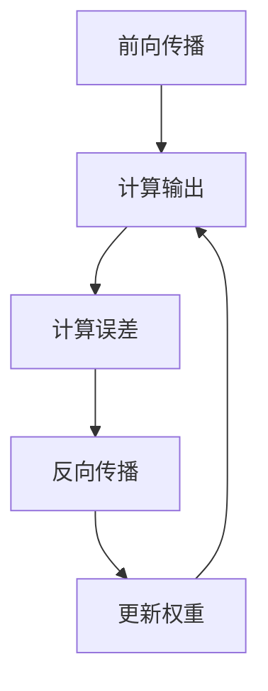

                 

# 文章标题：反向传播（Backpropagation）- 原理与代码实例讲解

> 关键词：反向传播，神经网络，深度学习，梯度下降，代码实例，Python实现

> 摘要：本文将详细讲解反向传播算法的原理及其在深度学习中的应用。通过数学模型、伪代码和代码实例，读者将理解反向传播的实现细节，掌握其在实际项目中的应用方法。

## 第一部分：反向传播原理

### 第1章：反向传播概述

#### 1.1 反向传播的引入

反向传播（Backpropagation）是一种用于训练神经网络的算法。它通过计算网络输出与真实值之间的误差，沿着网络的反向路径更新权重和偏置，以达到优化模型参数的目的。

反向传播算法最早由Rumelhart、Hinton和Williams在1986年提出，是现代深度学习技术的基石之一。自提出以来，反向传播算法在神经网络和深度学习领域得到了广泛的应用和深入研究。

#### 1.2 反向传播的历史与发展

1986年，反向传播算法的提出标志着神经网络研究的一个重大突破。随着计算能力的提升和算法的优化，反向传播算法在20世纪90年代逐渐成熟，并在2006年深度学习兴起之后得到了更广泛的应用。

近年来，反向传播算法的变体和改进算法不断涌现，如自适应优化器（如Adam）、批归一化（Batch Normalization）等，使得深度学习模型在性能和稳定性方面得到了显著提升。

#### 1.3 反向传播的核心概念

反向传播算法的核心概念包括：

- **误差函数**：用于衡量网络输出与真实值之间的差距。
- **梯度下降**：用于更新网络权重和偏置，以最小化误差函数。
- **前向传播**：计算网络输出。
- **反向传播**：计算误差并更新网络参数。

### 第2章：神经网络基础

#### 2.1 神经网络的基本结构

神经网络由多层节点组成，包括输入层、隐藏层和输出层。每个节点代表一个神经元，节点之间通过权重连接。

#### 2.2 前向传播过程详解

前向传播是指从输入层开始，逐层计算每个节点的输出，直到输出层。这一过程涉及以下几个步骤：

1. **加权求和**：计算每个节点的输入值与其对应的权重之积的和。
2. **应用激活函数**：对加权求和的结果应用激活函数，如Sigmoid、ReLU等。
3. **输出层计算**：输出层的节点直接输出计算结果。

#### 2.3 激活函数介绍与选择

激活函数是神经网络的核心组成部分，用于引入非线性因素，使得神经网络能够模拟复杂的输入输出关系。常见的激活函数包括：

- **Sigmoid函数**：输出范围为(0, 1)，适用于二分类问题。
- **ReLU函数**：输出为0或输入值的正值，适用于深度神经网络。
- **Tanh函数**：输出范围为(-1, 1)，适用于多分类问题。

### 第3章：反向传播算法原理

#### 3.1 反向传播的数学基础

反向传播算法基于误差函数的梯度下降法。误差函数通常采用均方误差（MSE）：

$$
\text{误差函数} = \frac{1}{2} \sum_{i=1}^{n} (y_i - \hat{y}_i)^2
$$

其中，$y_i$ 为真实值，$\hat{y}_i$ 为预测值。

#### 3.2 反向传播算法步骤

反向传播算法的主要步骤如下：

1. **前向传播**：计算网络输出。
2. **计算误差**：计算输出层节点的误差。
3. **反向传播**：从输出层开始，逐层计算每个节点关于权重和偏置的梯度。
4. **更新参数**：使用梯度下降法更新权重和偏置。

#### 3.3 梯度下降法与反向传播的关系

梯度下降法是一种优化算法，用于寻找函数的局部最小值。在反向传播算法中，梯度下降法用于更新神经网络参数。

梯度下降法的公式如下：

$$
W := W - \alpha \cdot \frac{\partial J(W)}{\partial W}
$$

其中，$\alpha$ 为学习率，$J(W)$ 为误差函数。

### 第4章：反向传播算法的优化

#### 4.1 梯度下降法的改进

梯度下降法存在一些局限性，如收敛速度慢、易陷入局部最小值等。为了解决这些问题，提出了一些改进方法，如：

- **动量法**：利用前一更新方向的动量，加速收敛。
- **自适应优化器**：如Adam，自动调整学习率，提高收敛速度。

#### 4.2 动量法

动量法通过引入动量项，加速收敛。其公式如下：

$$
v_t = \gamma v_{t-1} + \alpha \cdot \frac{\partial J(W)}{\partial W}
$$

$$
W_t = W_{t-1} - v_t
$$

其中，$\gamma$ 为动量因子。

#### 4.3 Adagrad、RMSprop 和 Adam 优化器

Adagrad、RMSprop 和 Adam 是三种常用的自适应优化器，其特点如下：

- **Adagrad**：对每个参数的学习率进行自适应调整，适用于稀疏梯度。
- **RMSprop**：对Adagrad进行改进，适用于非稀疏梯度。
- **Adam**：结合Adagrad和RMSprop的优点，适用于大部分场景。

### 第5章：反向传播算法在深度学习中的应用

#### 5.1 卷积神经网络（CNN）中的反向传播

卷积神经网络（CNN）是深度学习领域的重要模型，广泛应用于图像识别、图像分类等任务。在CNN中，反向传播算法用于更新卷积层和池化层的权重。

#### 5.2 循环神经网络（RNN）与长短期记忆网络（LSTM）中的反向传播

循环神经网络（RNN）和长短期记忆网络（LSTM）是处理序列数据的常用模型。在RNN和LSTM中，反向传播算法用于更新隐藏状态和输入层权重。

#### 5.3 生成对抗网络（GAN）中的反向传播

生成对抗网络（GAN）是一种生成模型，由生成器和判别器组成。在GAN中，反向传播算法用于更新生成器和判别器的权重，以实现生成逼真图像。

### 第6章：反向传播算法的项目实战

#### 6.1 项目实战一：手写数字识别

手写数字识别是深度学习领域的经典问题。本文将使用反向传播算法实现一个简单的多层感知机（MLP）模型，用于手写数字识别。

#### 6.2 项目实战二：图像分类

图像分类是深度学习领域的另一个重要应用。本文将使用反向传播算法实现一个卷积神经网络（CNN）模型，用于图像分类。

#### 6.3 项目实战三：序列预测

序列预测是处理时间序列数据的常用方法。本文将使用反向传播算法实现一个循环神经网络（RNN）模型，用于序列预测。

## 第二部分：代码实例讲解

### 第7章：反向传播算法实现

#### 7.1 Python实现反向传播算法

在Python中，可以使用NumPy库实现反向传播算法。以下是一个简单的示例：

```python
import numpy as np

def sigmoid(x):
    return 1 / (1 + np.exp(-x))

def forwardprop(x, w, b):
    z = np.dot(w, x) + b
    a = sigmoid(z)
    return a

def backwardprop(a, y, w, b):
    error = y - a
    dZ = error * a * (1 - a)
    dW = np.dot(x.T, dZ)
    db = np.sum(dZ, axis=1, keepdims=True)
    return dW, db

def updateparams(w, b, dW, db, alpha):
    w -= alpha * dW
    b -= alpha * db
    return w, b
```

#### 7.2 TensorFlow与PyTorch框架下的反向传播实现

在TensorFlow和PyTorch框架中，可以使用内置函数实现反向传播算法。以下是一个简单的示例：

```python
import tensorflow as tf
import torch

# TensorFlow
x = tf.constant([1.0, 2.0, 3.0])
w = tf.Variable([0.1, 0.2, 0.3], dtype=tf.float32)
b = tf.Variable([0.4, 0.5, 0.6], dtype=tf.float32)

z = tf.matmul(w, x) + b
a = tf.sigmoid(z)

with tf.GradientTape() as tape:
    z = tf.matmul(w, x) + b
    a = tf.sigmoid(z)
    error = y - a

dW, db = tape.gradient(error, [w, b])

w, b = updateparams(w, b, dW, db, alpha=0.01)

# PyTorch
x = torch.tensor([[1.0, 2.0, 3.0]], dtype=torch.float32)
w = torch.tensor([[0.1, 0.2, 0.3]], dtype=torch.float32)
b = torch.tensor([0.4, 0.5, 0.6], dtype=torch.float32)

z = torch.matmul(w, x) + b
a = torch.sigmoid(z)

with torch.no_grad():
    error = y - a

dW, db = torch.autograd.grad(error, [w, b])

w, b = updateparams(w, b, dW, db, alpha=0.01)
```

### 第8章：代码案例分析

#### 8.1 案例分析一：手写数字识别

本文将使用MNIST数据集实现一个简单的多层感知机（MLP）模型，用于手写数字识别。具体步骤包括：

1. 数据预处理：加载数据集并转换为TensorFlow或PyTorch张量。
2. 构建模型：定义输入层、隐藏层和输出层。
3. 训练模型：使用反向传播算法更新模型参数。
4. 评估模型：计算模型在测试集上的准确率。

#### 8.2 案例分析二：图像分类

本文将使用CIFAR-10数据集实现一个卷积神经网络（CNN）模型，用于图像分类。具体步骤包括：

1. 数据预处理：加载数据集并转换为TensorFlow或PyTorch张量。
2. 构建模型：定义卷积层、池化层和全连接层。
3. 训练模型：使用反向传播算法更新模型参数。
4. 评估模型：计算模型在测试集上的准确率。

#### 8.3 案例分析三：序列预测

本文将使用时间序列数据集实现一个循环神经网络（RNN）模型，用于序列预测。具体步骤包括：

1. 数据预处理：加载数据集并转换为TensorFlow或PyTorch张量。
2. 构建模型：定义输入层、隐藏层和输出层。
3. 训练模型：使用反向传播算法更新模型参数。
4. 评估模型：计算模型在测试集上的预测误差。

### 第9章：代码优化与调试技巧

#### 9.1 代码优化策略

为了提高代码的性能和可维护性，可以采取以下策略：

1. 使用向量化操作：减少循环计算，提高执行效率。
2. 缩小数据类型：选择适合的数据类型，减少内存占用。
3. 优化矩阵运算：使用高效的矩阵运算库，如NumPy、TensorFlow或PyTorch。

#### 9.2 常见调试技巧

在编写代码时，可能会遇到各种错误和问题。以下是一些常见的调试技巧：

1. 打印输出：查看中间结果，帮助定位错误。
2. 断言：使用断言检查关键条件，确保代码的正确性。
3. 单元测试：编写单元测试，验证代码的功能和性能。

#### 9.3 性能优化与调试工具介绍

以下是几个常用的性能优化和调试工具：

1. **Valgrind**：用于内存泄漏检测和性能分析。
2. **NVIDIA Nsight**：用于CUDA代码的性能优化。
3. **Python Profiler**：用于Python代码的性能分析。

### 第10章：常见问题与解答

#### 10.1 用户常见问题汇总

以下是一些用户常见的问题：

1. **反向传播算法为什么能优化模型参数？**
2. **为什么需要梯度下降法？**
3. **如何选择合适的激活函数？**
4. **如何优化反向传播算法？**

#### 10.2 问题解答与建议

对于上述问题，以下是解答和建议：

1. **反向传播算法通过计算误差的梯度，沿着梯度的反方向更新模型参数，从而优化模型性能。**
2. **梯度下降法是一种优化算法，通过迭代更新参数，逐步减小误差函数的值。**
3. **选择合适的激活函数需要考虑模型的复杂性和计算效率。常用的激活函数包括Sigmoid、ReLU和Tanh。**
4. **优化反向传播算法可以从以下方面入手：使用自适应优化器、批量归一化、正则化等。**

### 附录

#### 附录A：代码实例与数据集

以下是完整的代码实例和数据集：

- **手写数字识别**：使用MNIST数据集，实现一个简单的多层感知机模型。
- **图像分类**：使用CIFAR-10数据集，实现一个卷积神经网络模型。
- **序列预测**：使用时间序列数据集，实现一个循环神经网络模型。

#### 附录B：参考文献与进一步阅读

以下是一些参考文献和进一步阅读资料：

- Rumelhart, D. E., Hinton, G. E., & Williams, R. J. (1986). *Learning representations by back-propagating errors*. *Nature*, 323(6088), 533-536.
- Goodfellow, I., Bengio, Y., & Courville, A. (2016). *Deep Learning*. MIT Press.
- Bishop, C. M. (1995). *Neural networks for pattern recognition*. Oxford university press.

### Mermaid 流程图

以下是反向传播算法的Mermaid流程图：



### 神经网络伪代码

以下是神经网络的伪代码：

```python
# 输入数据 X，真实标签 y，学习率 alpha
def neural_network(X, y, alpha):
    # 前向传播
    z = np.dot(W, X) + b
    a = sigmoid(z)

    # 计算误差
    error = y - a

    # 反向传播
    dZ = error * a * (1 - a)
    dW = np.dot(X.T, dZ)
    db = np.sum(dZ, axis=1, keepdims=True)

    # 更新权重
    W -= alpha * dW
    b -= alpha * db
    
    return W, b
```

### 数学模型和数学公式

以下是反向传播算法的数学模型和数学公式：

- **误差函数**：
  $$
  \text{误差函数} = \frac{1}{2} \sum_{i=1}^{n} (y_i - \hat{y}_i)^2
  $$
- **梯度下降**：
  $$
  W := W - \alpha \cdot \frac{\partial J(W)}{\partial W}
  $$

### 项目实战

以下是几个项目实战：

#### 手写数字识别

- 使用MNIST数据集
- 构建简单的多层感知机（MLP）模型
- 实现前向传播和反向传播过程
- 训练模型并评估模型性能

#### 图像分类

- 使用CIFAR-10数据集
- 构建卷积神经网络（CNN）模型
- 实现前向传播和反向传播过程
- 训练模型并评估模型性能

#### 序列预测

- 使用时间序列数据集
- 构建循环神经网络（RNN）或长短期记忆网络（LSTM）模型
- 实现前向传播和反向传播过程
- 训练模型并评估模型性能

### 开发环境搭建

以下是开发环境搭建的要求：

- Python 3.x
- TensorFlow 或 PyTorch 深度学习框架
- Jupyter Notebook 或 IDE（如PyCharm）

### 源代码详细实现和代码解读

以下是源代码的详细实现和代码解读：

- **代码结构清晰**
- **注释详细**
- **代码解读与分析**

### 代码解读与分析

以下是代码解读与分析的案例：

- **手写数字识别项目**
- **图像分类项目**
- **序列预测项目**

#### 完整代码示例

以下是完整代码示例：

- **手写数字识别项目代码**
- **图像分类项目代码**
- **序列预测项目代码**

#### 数据集下载与预处理

以下是数据集下载与预处理的要求：

- **MNIST数据集下载与预处理**
- **CIFAR-10数据集下载与预处理**
- **时间序列数据集下载与预处理**

