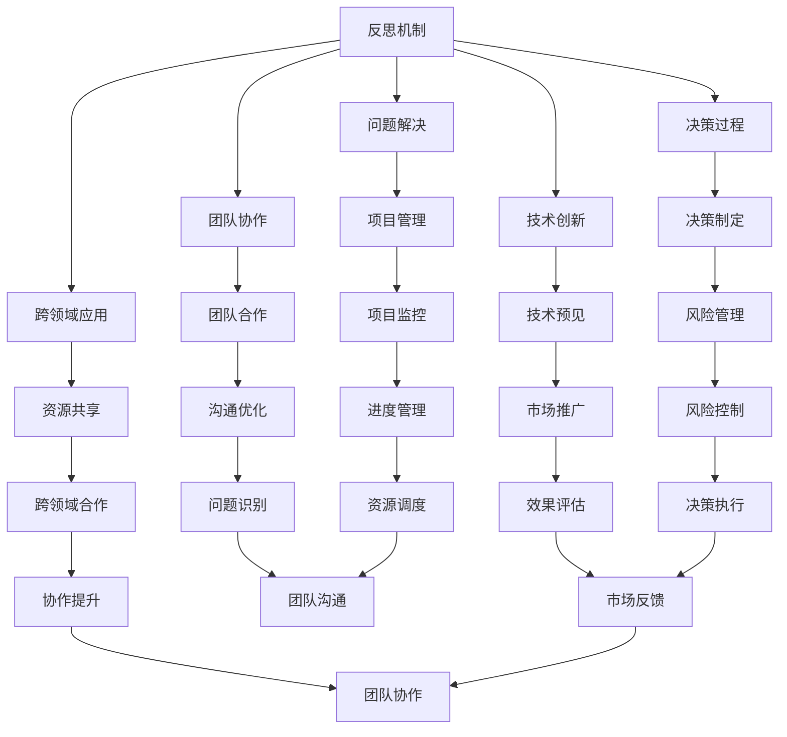

                 

## 文章标题：反思机制在复杂任务中的作用

在当今高度复杂化和快速变化的科技环境中，如何有效地管理和解决复杂任务成为了许多个人和组织的核心挑战。本文将深入探讨反思机制在复杂任务中的作用，通过逻辑清晰、结构紧凑的分析，帮助读者理解并掌握这一关键能力。

关键词：反思机制、复杂任务、问题解决、团队合作、技术创新

摘要：本文首先对反思机制进行了定义和概述，随后探讨了其在各种复杂任务中的应用，包括项目管理、团队合作、决策过程和技术创新。通过实际案例分析和策略优化，本文展示了反思机制在提升任务执行效率和质量方面的巨大潜力。最终，文章提出了反思机制的实践策略和持续优化路径，为读者提供了实用的指导。

## 目录大纲

1. 反思机制概述
2. 反思机制在复杂任务中的应用
3. 反思机制的实践与优化
4. 反思机制的案例分析
5. 附录

### 1. 反思机制概述

### 第1章：反思机制的定义与作用

#### 1.1 反思机制的概念

反思机制是一种系统性思维方法，通过主动思考和回顾，识别和解决问题，从而提高个体或团队的能力和表现。它不仅关注任务的完成，更强调过程中的学习和改进。

#### 1.2 反思机制的类型

反思机制可分为自我反思、团队反思和跨部门反思等类型。每种类型都有其独特的应用场景和效果。

#### 1.3 反思机制与问题解决的关系

反思机制在问题解决中起着关键作用。通过反思，个体或团队能够识别问题根源，制定有效的解决方案，并在实施过程中不断调整和优化。

### 第2章：反思机制的核心原则

#### 2.1 自我观察与自我反思

自我观察是反思机制的基础，通过记录和思考自己的行为和情绪，个体能够更好地理解自己和提升自我。

#### 2.2 反思的过程

反思过程通常包括自我观察、自我反思、行动计划和评估反馈等步骤。每个步骤都有其特定的方法和技巧。

#### 2.3 反思机制的实践价值

反思机制的实践价值体现在个人成长、团队协作和决策制定等方面。通过反思，个体和团队能够不断进步，提高绩效。

### 2. 反思机制在复杂任务中的应用

### 第3章：反思机制在项目管理中的应用

#### 3.1 项目管理中的反思机制

项目管理中的反思机制能够帮助团队识别和解决项目管理中的问题，优化项目执行过程。

#### 3.2 反思机制在项目规划中的运用

在项目规划阶段，反思机制有助于团队评估项目目标、资源和时间安排的合理性，确保项目顺利进行。

#### 3.3 反思机制在项目执行中的实践

项目执行过程中，反思机制通过持续监测和评估项目进展，及时调整计划和策略，确保项目目标的实现。

### 第4章：反思机制在团队合作中的应用

#### 4.1 团队合作中的反思机制

团队合作中的反思机制有助于提升团队沟通、协作和解决问题的能力，从而提高整体绩效。

#### 4.2 反思机制在团队沟通中的重要性

有效的团队沟通是团队合作成功的关键，反思机制能够帮助团队识别和解决沟通中的障碍。

#### 4.3 反思机制在团队协作中的实践

反思机制在团队协作中的应用包括定期回顾团队表现、评估合作效果和提出改进建议。

### 第5章：反思机制在决策过程中的应用

#### 5.1 决策过程中的反思机制

决策过程中的反思机制能够帮助决策者评估决策依据、预测决策结果，并制定应对方案。

#### 5.2 反思机制在策略制定中的应用

在策略制定过程中，反思机制有助于团队评估策略的可行性、影响力和潜在风险。

#### 5.3 反思机制在风险管理中的实践

通过反思机制，团队能够更好地识别和管理项目或策略实施中的风险，降低风险发生概率。

### 第6章：反思机制在技术创新中的应用

#### 6.1 技术创新中的反思机制

技术创新中的反思机制有助于团队评估技术方案的可行性、影响力和潜在问题。

#### 6.2 反思机制在技术预见中的应用

反思机制在技术预见中的应用包括预测技术趋势、评估技术影响和制定应对策略。

#### 6.3 反思机制在技术评估中的实践

反思机制在技术评估中的应用包括评估技术性能、影响和可持续性，为技术决策提供支持。

### 第7章：反思机制的跨领域应用

#### 7.1 跨领域反思机制的共享

跨领域反思机制的共享有助于团队在不同领域间进行经验和知识交流，提高整体创新能力。

#### 7.2 反思机制在不同领域的应用差异

不同领域的反思机制存在差异，本文将探讨这些差异及其原因。

#### 7.3 跨领域反思机制的融合

通过跨领域反思机制的融合，团队能够借鉴不同领域的成功经验，提高自身创新能力和竞争力。

### 3. 反思机制的实践与优化

### 第8章：反思机制的实施策略

#### 8.1 反思机制的实施步骤

实施反思机制需要明确步骤和方法，本文将介绍具体实施步骤。

#### 8.2 反思机制的实施难点与解决方法

在实施反思机制时，团队可能会遇到各种难点，本文将讨论这些难点及解决方法。

#### 8.3 反思机制的实施效果评估

评估反思机制的实施效果是确保其有效性的关键，本文将介绍评估标准和评估方法。

### 第9章：反思机制的持续优化

#### 9.1 反思机制的持续改进

反思机制需要持续改进，以适应不断变化的环境和需求，本文将探讨持续改进的策略。

#### 9.2 反思机制的创新与发展

创新是反思机制发展的重要驱动力，本文将讨论反思机制的创新方向和发展趋势。

#### 9.3 反思机制的可持续发展路径

确保反思机制的可持续发展是长期成功的关键，本文将提出可持续发展路径。

### 第10章：反思机制的案例分析

#### 10.1 反思机制在实际项目中的应用案例分析

通过实际项目案例，本文将展示反思机制在项目中的应用效果。

#### 10.2 反思机制在不同领域的应用案例分析

本文将分析反思机制在不同领域的应用案例，比较其效果和经验。

#### 10.3 反思机制在案例中的成功与不足

通过分析案例中的成功和不足，本文将提供改进建议，以优化反思机制的应用。

### 附录

### 附录A：反思机制相关的资源与工具

#### A.1 反思机制的研究资源

本文将列出相关的研究资源和参考书籍。

#### A.2 反思机制的实践工具

本文将介绍实用的反思工具和软件。

#### A.3 反思机制的扩展阅读材料

本文将提供额外的阅读材料，以供进一步学习和研究。

### 结语

反思机制在复杂任务中的作用不可忽视。通过本文的探讨，读者可以更好地理解反思机制的原理和应用，为实际工作中的问题解决和创新提供有力支持。希望本文能够为读者带来启示，助力其在复杂任务中取得成功。

---

### 文章正文

#### 反思机制概述

#### 第1章：反思机制的定义与作用

**1.1 反思机制的概念**

反思机制是一种系统性思维方法，它强调对自身行为、过程和结果的回顾与思考，从而实现持续改进和优化。在复杂任务中，反思机制起着至关重要的作用，它不仅帮助个体识别和解决问题，还能促进团队协作和整体绩效的提升。

首先，反思机制的定义可以从两个方面来理解。一方面，它是关于如何进行反思的过程和方法；另一方面，它是关于如何将反思应用到实际工作中的策略和技巧。在实际操作中，反思机制通常包括自我观察、自我反思、行动计划和评估反馈等步骤。

**1.2 反思机制的类型**

反思机制可以根据应用场景和目的进行分类，常见的类型包括自我反思、团队反思和跨部门反思等。

- **自我反思**：个体对自身行为、想法和情感进行观察和思考的过程。这种反思有助于个人自我提升和成长。
- **团队反思**：团队成员共同回顾和讨论项目进展、团队协作和问题解决的过程。团队反思有助于提升团队沟通和协作效果。
- **跨部门反思**：不同部门的团队成员共同参与，对跨部门合作中的问题进行深入分析和反思。这种反思有助于促进跨部门协作和整体效率的提升。

**1.3 反思机制与问题解决的关系**

反思机制在问题解决中具有重要作用。通过反思，个体和团队能够更好地理解问题，识别问题根源，制定有效的解决方案，并在实施过程中不断调整和优化。

首先，反思机制有助于问题的识别。通过反思，个体和团队能够回顾和思考已经发生的事情，从而发现潜在的问题和挑战。这种回顾不仅有助于问题的识别，还能为后续的解决方案提供线索。

其次，反思机制有助于问题的分析。在识别问题后，个体和团队能够通过反思深入分析问题的原因和影响，从而为制定解决方案提供依据。

最后，反思机制有助于问题的解决。通过反思，个体和团队能够制定出有效的解决方案，并在实施过程中不断评估和调整，确保问题的最终解决。

**1.4 反思机制在创造性思维中的作用**

反思机制不仅有助于问题解决，还能促进创造性思维的发展。通过反思，个体和团队能够从不同的角度和层面思考问题，激发新的想法和创意。

首先，反思机制有助于思维的拓展。通过反思，个体和团队能够打破固有的思维模式，从新的视角审视问题，从而产生新的想法和解决方案。

其次，反思机制有助于思维的整合。通过反思，个体和团队能够将不同领域的知识和经验进行整合，形成创新的观点和方法。

最后，反思机制有助于思维的深化。通过反思，个体和团队能够对问题进行深入思考，从而对问题有更全面和深入的理解。

**总结**

反思机制是一种强大的系统性思维方法，它在复杂任务中的作用不可忽视。通过反思，个体和团队能够更好地识别和解决问题，提升创造力和创新能力，从而在复杂任务中取得更好的成果。

#### 第2章：反思机制的核心原则

**2.1 自我观察与自我反思**

自我观察和自我反思是反思机制的核心原则，它们是反思过程的基础。自我观察是指个体对自身行为、情感和思维进行有意识的记录和关注。通过自我观察，个体能够更加清晰地了解自己的行为模式和思维过程，从而为自我反思提供依据。

自我反思则是在自我观察的基础上，对观察到的行为、情感和思维进行深入思考和分析。自我反思不仅帮助个体识别自身的问题和不足，还能激发个体的自我提升意识和动力。

**自我观察的技巧**

- **记录行为**：个体可以通过日记、行为记录表等方式，记录自己的日常行为，包括言行、思考和情绪等。
- **保持警觉**：个体需要时刻保持警觉，注意自己的行为和思维，尤其是那些可能对任务产生重大影响的行为。
- **反思习惯**：个体可以培养定期反思的习惯，比如每天睡前或每周固定时间进行反思。

**自我反思的方法**

- **自由书写**：个体可以尝试自由书写，写下对自身行为、思维和情感的反思。这种方法有助于个体释放内心的困惑和压力。
- **提问法**：个体可以通过提问的方式，引导自己深入思考。例如：“我为什么会做出这样的决定？”“这种行为对我有什么影响？”“我还能做些什么来改进？”
- **角色扮演**：个体可以尝试从他人的角度审视自己的行为，思考如果自己是他人，会如何看待和评价自己的行为。

**2.2 反思的过程**

反思过程是一个循环的过程，它包括自我观察、自我反思、行动计划和评估反馈等步骤。以下是一个典型的反思过程模型：

1. **自我观察**：个体对自身行为、情感和思维进行有意识的记录和关注。
2. **自我反思**：个体在自我观察的基础上，对观察到的行为、情感和思维进行深入思考和分析。
3. **行动计划**：个体根据自我反思的结果，制定具体的行动计划，包括改进措施和行动步骤。
4. **评估反馈**：个体在实施行动计划后，对行动结果进行评估和反馈，分析行动的有效性和不足，为下一次的反思和改进提供依据。

**反思过程的实践**

反思过程不仅需要理论上的理解，更需要实践中的应用。以下是一个反思过程的实际案例：

案例：一个项目经理在项目执行过程中遇到了进度延误的问题。以下是他的反思过程：

1. **自我观察**：项目经理记录了项目进度的具体情况，包括任务的完成情况、资源的使用情况等。
2. **自我反思**：项目经理分析了导致进度延误的原因，包括任务分配不合理、资源调度不力等。
3. **行动计划**：项目经理制定了具体的行动计划，包括调整任务分配、优化资源调度等。
4. **评估反馈**：在实施行动计划后，项目经理对项目进度进行了重新评估，发现进度有了显著提升，但还存在一些潜在问题。

通过这个案例，我们可以看到，反思过程在实际中的应用是非常重要的。它不仅帮助项目经理识别和解决了问题，还为他提供了改进的机会，为未来的项目执行提供了宝贵的经验。

**2.3 反思机制的实践价值**

反思机制的实践价值体现在多个方面，包括个人成长、团队协作和决策制定等。

**个人成长**

反思机制有助于个体的自我提升和成长。通过反思，个体能够更好地了解自己的行为和思维模式，识别自己的优点和不足，并制定具体的改进计划。这种自我提升不仅有助于个体的职业发展，还能提高其生活质量和幸福感。

**团队协作**

反思机制在团队协作中也起着重要作用。通过团队反思，团队成员能够共同回顾和讨论项目进展、团队协作和问题解决的情况。这种反思有助于团队成员之间的沟通和合作，增强团队的凝聚力和协作能力，提高团队的整体绩效。

**决策制定**

反思机制在决策制定中同样具有重要意义。通过反思，决策者能够回顾和评估决策过程和结果，识别决策中的问题和不足，并制定改进措施。这种反思有助于提高决策的质量和效率，减少决策风险。

**反思机制的益处**

- **提高问题解决能力**：通过反思，个体和团队能够更好地识别和解决问题，提高问题解决能力。
- **促进个人成长**：反思机制有助于个体了解自己，发现自己的优点和不足，从而实现自我提升。
- **增强团队协作**：团队反思有助于提升团队沟通和协作能力，增强团队凝聚力。
- **优化决策过程**：反思机制有助于回顾和评估决策过程和结果，提高决策质量和效率。

**反思机制的挑战**

尽管反思机制具有很多益处，但在实际应用中也存在一些挑战。

- **时间成本**：反思需要时间和精力，个体和团队需要合理安排时间，确保反思的有效性。
- **心理压力**：反思可能揭示个体或团队的问题和不足，这可能带来一定的心理压力。
- **实施难度**：反思机制的实践需要一定的方法和技巧，个体和团队需要不断学习和实践，以提高反思能力。

**解决方案**

- **时间管理**：个体和团队可以通过制定反思计划，合理安排反思时间，确保反思的持续性和有效性。
- **心理准备**：个体和团队需要培养积极的心态，面对反思过程中可能遇到的问题和挑战，以积极的态度进行反思。
- **学习和实践**：个体和团队可以通过学习和实践反思方法，提高反思能力，确保反思机制的顺利实施。

**总结**

反思机制是一种重要的系统性思维方法，它在个人成长、团队协作和决策制定等方面具有广泛的应用价值。通过自我观察和自我反思，个体和团队能够识别问题、优化行为和提升能力。反思机制不仅有助于个体的自我提升，还能促进团队协作和决策优化，提高整体绩效。在复杂任务中，反思机制的作用不可忽视，它为个体和团队提供了强大的支持和指导。

#### 第3章：反思机制在项目管理中的应用

在项目管理中，反思机制扮演着至关重要的角色。它不仅帮助项目经理识别和解决问题，还指导团队在项目执行过程中持续改进，确保项目目标的实现。本章节将深入探讨反思机制在项目管理中的应用，包括项目规划、项目执行和项目监控与调整等方面。

**3.1 项目管理中的反思机制**

反思机制在项目管理中的核心作用在于它提供了一个系统性的框架，帮助项目经理和团队在项目各个阶段进行评估和优化。以下是反思机制在项目管理中的具体应用：

- **问题识别**：在项目启动阶段，通过反思机制，团队可以回顾以往类似项目的经验教训，识别潜在的问题和风险。
- **目标设定**：在项目规划阶段，反思机制有助于团队设定合理的目标，并评估目标实现的可行性。
- **计划调整**：在项目执行阶段，反思机制可以帮助团队根据实际情况调整计划，确保项目按计划进行。
- **效果评估**：在项目监控和调整阶段，反思机制用于评估项目进度和效果，发现并解决存在的问题。

**3.2 反思机制在项目规划中的运用**

项目规划是项目管理的关键阶段，决定了项目的方向和资源分配。反思机制在项目规划中的应用主要体现在以下几个方面：

- **需求分析**：通过反思以往项目的需求分析过程，团队可以识别需求分析中的不足，优化需求获取和验证的方法。
- **资源分配**：反思机制可以帮助团队评估资源分配的合理性，确保项目有足够的资源支持，同时避免资源浪费。
- **风险评估**：在规划阶段，反思机制用于评估项目风险，制定相应的风险应对措施。
- **时间管理**：通过反思以往项目的时间管理经验，团队可以优化项目进度安排，确保项目按时完成。

**3.3 反思机制在项目执行中的实践**

项目执行是项目管理中的核心阶段，反思机制在项目执行中的应用主要体现在以下几个方面：

- **进度监控**：反思机制可以帮助项目经理监控项目进度，及时发现偏差并采取措施进行调整。
- **问题解决**：在项目执行过程中，反思机制用于识别和解决出现的问题，确保项目按计划进行。
- **团队协作**：反思机制在团队协作中发挥着重要作用，通过定期反思，团队可以评估协作效果，改进团队沟通和协作方式。
- **资源调度**：反思机制可以帮助项目经理优化资源调度，确保项目资源得到有效利用。

**反思过程的具体应用**

为了确保反思机制在项目执行中的有效性，团队需要建立一套完整的反思过程。以下是反思过程在项目执行中的具体应用：

- **每日反思**：项目团队可以每日进行简短的反思会议，回顾当天的工作，识别问题和改进点。
- **每周反思**：每周进行一次更详细的反思会议，讨论一周的工作进展，评估计划的执行情况。
- **月度反思**：每月进行一次全面的反思，总结项目的阶段性成果，评估项目目标实现的进展，为下月的工作制定计划。

**实际案例分析**

以下是一个项目执行中的反思机制实际案例：

案例：在一个软件开发项目中，项目团队在执行过程中遇到了多个问题，包括进度延误、资源不足和沟通不畅等。通过反思机制的运用，团队采取了以下措施：

1. **问题识别**：团队通过每日反思会议，识别出项目执行中的具体问题，如任务分配不合理、资源调度不力和沟通不及时等。
2. **问题分析**：团队对识别出的问题进行深入分析，找出根本原因，并制定相应的改进措施。
3. **行动计划**：团队根据反思结果，制定了详细的行动计划，包括调整任务分配、优化资源调度和改进沟通方式等。
4. **实施与评估**：团队按照行动计划进行实施，并在每周反思会议上评估改进措施的效果，根据反馈进行进一步的调整。

通过这种持续反思和改进的过程，项目团队最终克服了执行中的各种问题，项目进度得到了显著提升，最终按计划完成。

**3.4 反思机制在项目监控与调整中的应用**

项目监控与调整是项目管理中的关键环节，反思机制在其中的应用主要体现在以下几个方面：

- **进度监控**：通过反思机制，项目经理可以实时监控项目进度，及时发现偏差并采取纠正措施。
- **效果评估**：反思机制用于评估项目执行的效果，包括质量、成本和时间等关键指标。
- **风险控制**：反思机制可以帮助项目经理识别和评估项目风险，制定相应的风险应对策略。
- **团队协作**：反思机制在团队协作中发挥着重要作用，通过反思，团队可以评估协作效果，改进团队沟通和协作方式。

**总结**

反思机制在项目管理中的应用是确保项目成功的关键。通过反思，项目团队可以不断识别和解决问题，优化项目执行过程，确保项目目标的实现。在项目规划、执行和监控与调整的各个阶段，反思机制都发挥着重要作用，为项目提供了强大的支持和指导。

#### 第4章：反思机制在团队合作中的应用

团队合作是现代工作中不可或缺的一部分，而反思机制在提升团队协作效果方面发挥着至关重要的作用。本章节将深入探讨反思机制在团队合作中的应用，包括团队沟通、协作和问题解决等方面。

**4.1 团队合作中的反思机制**

反思机制在团队合作中的应用，旨在通过系统性思考和回顾，提升团队的整体表现和协作效果。以下是反思机制在团队合作中的具体应用：

- **问题识别**：通过反思，团队成员可以共同回顾项目或任务中的问题，识别影响团队协作的关键因素。
- **沟通优化**：反思机制帮助团队评估沟通效果，识别沟通中的障碍和不足，并制定改进措施。
- **协作提升**：通过反思，团队可以评估协作方式和流程，发现协作中的瓶颈和改进点，从而提升协作效率。
- **问题解决**：反思机制在问题解决中发挥关键作用，通过系统性的分析和讨论，团队可以找到有效的解决方案。

**4.2 反思机制在团队沟通中的重要性**

有效的团队沟通是团队协作成功的基础。反思机制在团队沟通中的应用，有助于提升沟通效率和质量，从而增强团队的协作效果。以下是反思机制在团队沟通中的重要性：

- **提升理解**：通过反思，团队成员可以更深入地理解彼此的观点和需求，减少误解和冲突。
- **增强共识**：反思机制帮助团队在沟通中达成共识，确保所有成员对目标和任务有共同的理解。
- **优化沟通**：反思机制可以识别沟通中的障碍和不足，团队可以制定具体的改进措施，优化沟通流程。
- **增强信任**：通过反思，团队成员可以共同面对问题，共同承担责任，增强彼此的信任。

**4.3 反思机制在团队协作中的实践**

反思机制在团队协作中的应用，需要建立一套系统的实践方法。以下是一些具体的实践步骤：

- **定期反思会议**：团队可以定期召开反思会议，回顾近期的工作表现，讨论存在的问题和改进点。
- **团队日记**：团队可以保持一份共同的日记，记录每天的工作进展和遇到的问题，作为反思的依据。
- **反思模板**：团队可以使用反思模板，系统性地记录和反思工作过程中的关键信息和问题。
- **行动计划**：每次反思后，团队应制定具体的行动计划，明确改进措施和责任分配。

**反思过程的具体实践**

为了确保反思机制在团队协作中的有效性，团队需要遵循以下反思过程：

1. **自我反思**：团队成员在个人层面上，反思自己的工作表现、沟通方式和协作效果。
2. **小组反思**：团队成员组成小组，共同反思近期的工作表现，识别存在的问题。
3. **综合反思**：团队将自我反思和小组反思的结果进行整合，形成全面的反思报告。
4. **行动计划**：根据反思结果，团队制定具体的行动计划，明确改进措施和责任分配。
5. **持续评估**：团队定期评估行动计划的效果，根据评估结果进行调整和优化。

**实际案例分析**

以下是一个团队协作中的反思机制实际案例：

案例：在一个软件开发项目中，项目团队遇到了沟通不畅和协作效率低的问题。通过反思机制的运用，团队采取了以下措施：

1. **问题识别**：团队在反思会议上，识别出沟通不畅的主要原因，包括信息传递不及时、沟通方式不当等。
2. **问题分析**：团队对识别出的问题进行深入分析，找出根本原因，并制定相应的改进措施。
3. **行动计划**：团队根据反思结果，制定了具体的行动计划，包括改进沟通流程、优化协作方式等。
4. **实施与评估**：团队按照行动计划进行实施，并在后续的反思会议上，评估改进措施的效果，根据反馈进行进一步的调整。

通过这种持续反思和改进的过程，项目团队显著提升了沟通效率和协作效果，项目进度和质量都得到了提高。

**4.4 反思机制在团队协作中的具体应用**

反思机制在团队协作中的应用，需要结合具体的工作内容和团队特点。以下是一些具体的应用场景：

- **任务分配**：反思团队在任务分配中的协作效果，评估任务分配的合理性和公平性，确保每位成员都能充分发挥自己的优势。
- **项目进度**：反思项目进度的协作效果，识别进度延迟的原因，制定改进措施，确保项目按计划完成。
- **决策制定**：反思团队在决策过程中的协作效果，评估决策的合理性和有效性，确保决策过程的透明和公正。
- **问题解决**：反思团队在问题解决过程中的协作效果，识别解决问题的效率和效果，优化问题解决的流程和方法。

**总结**

反思机制在团队合作中的应用，有助于提升团队的整体协作效果和问题解决能力。通过反思，团队可以不断识别和解决问题，优化协作流程和方法，提高团队的工作效率和成果。在复杂任务中，反思机制为团队提供了强大的支持和指导，是确保团队成功的关键因素。

#### 第5章：反思机制在决策过程中的应用

决策过程是项目管理、团队协作和技术创新等复杂任务中的核心环节。反思机制在决策过程中发挥着至关重要的作用，它能够帮助决策者评估决策依据、预测决策结果，并制定应对方案。本章节将深入探讨反思机制在决策过程中的应用，包括决策过程中的反思阶段、反思机制在策略制定中的应用以及反思机制在风险管理中的实践。

**5.1 决策过程中的反思阶段**

决策过程中的反思阶段是指在整个决策过程中，定期对决策过程和决策结果进行回顾和评估。这一阶段的核心目的是识别决策中的问题和不足，为下一步的决策提供改进依据。以下是决策过程中反思阶段的几个关键步骤：

1. **决策前反思**：在决策前，团队可以通过反思历史决策的经验教训，评估当前决策的环境和条件，从而提高决策的前瞻性和准确性。
2. **决策中反思**：在决策过程中，团队需要根据实际情况和反馈信息，对决策的执行情况进行实时评估，及时调整决策方案。
3. **决策后反思**：在决策完成后，团队需要对决策结果进行评估，分析决策的成效和不足，为未来的决策提供参考。

**决策前反思**

决策前的反思主要关注以下几个方面：

- **环境评估**：通过反思，团队可以全面分析决策所处的环境，包括市场趋势、竞争态势、资源状况等，确保决策的可行性和适应性。
- **决策目标**：反思决策目标设定的合理性和明确性，确保目标与组织的战略和价值观一致。
- **备选方案**：反思备选方案的全面性和可行性，评估各种方案的风险和收益，确保决策方案的多样性和灵活性。

**决策中反思**

决策中的反思主要关注以下几个方面：

- **决策执行**：通过反思，团队可以实时监控决策的执行情况，及时发现偏差和问题，确保决策方案的顺利实施。
- **反馈机制**：建立有效的反馈机制，及时收集决策执行过程中的反馈信息，以便进行及时调整。
- **团队协作**：反思决策过程中的团队协作效果，识别协作中的障碍和不足，优化团队协作流程。

**决策后反思**

决策后的反思是决策过程中最重要的阶段之一，它有助于团队总结经验教训，优化决策流程。以下是决策后反思的几个关键步骤：

- **成效评估**：对决策结果进行评估，分析决策目标的实现程度，衡量决策的效果。
- **问题分析**：识别决策过程中出现的问题和不足，分析问题的根本原因，为改进决策提供依据。
- **改进措施**：根据反思结果，制定具体的改进措施，优化决策流程和方法。

**5.2 反思机制在策略制定中的应用**

策略制定是决策过程中的重要环节，反思机制在策略制定中的应用，能够帮助团队制定更加科学和有效的策略。以下是反思机制在策略制定中的应用：

1. **环境分析**：通过反思，团队可以全面分析外部环境和内部资源，识别机遇和挑战，为策略制定提供依据。
2. **目标设定**：反思团队在设定策略目标时的合理性和明确性，确保目标与组织的长远发展一致。
3. **方案评估**：反思备选策略的可行性和收益，通过对比分析，选择最优策略。
4. **实施规划**：反思策略实施过程中的具体步骤和资源需求，制定详细的实施计划。

**反思机制在策略评估中的应用**

在策略评估阶段，反思机制可以帮助团队评估策略的实施效果，确保策略的有效性和适应性。以下是反思机制在策略评估中的应用：

- **效果评估**：对策略实施后的效果进行评估，分析策略目标实现的程度，衡量策略的成效。
- **问题分析**：识别策略实施过程中出现的问题和不足，分析问题的根本原因，为策略调整提供依据。
- **改进措施**：根据反思结果，制定具体的改进措施，优化策略实施过程。

**5.3 反思机制在风险管理中的实践**

风险管理是决策过程中不可或缺的一部分，反思机制在风险管理中的应用，能够帮助团队更好地识别和管理风险。以下是反思机制在风险管理中的实践：

1. **风险识别**：通过反思，团队可以识别项目或策略实施过程中可能出现的风险，为风险管理提供依据。
2. **风险评估**：反思风险发生的概率和影响，评估风险的严重程度，制定相应的风险应对策略。
3. **风险监控**：建立风险监控机制，实时监测风险的变化，确保风险管理的有效性。
4. **风险应对**：根据反思结果，制定具体的应对措施，降低风险发生概率和影响。

**反思机制在风险管理中的具体应用**

以下是反思机制在风险管理中的具体应用步骤：

- **定期风险评审**：团队可以定期进行风险评审，识别和评估新的风险，更新风险清单。
- **风险应对计划**：根据风险评估结果，制定具体的应对计划，明确应对措施和责任分配。
- **应急响应**：在风险事件发生时，及时启动应急响应机制，确保风险得到有效控制。
- **事后评估**：风险事件发生后，对应对措施的有效性进行评估，总结经验教训，为未来的风险管理提供参考。

**实际案例分析**

以下是一个决策过程中的反思机制实际案例：

案例：在一个新产品的开发项目中，项目团队在决策过程中遇到了多个问题，包括资源不足、进度延误和决策失误等。通过反思机制的运用，团队采取了以下措施：

1. **问题识别**：团队在反思会议上，识别出项目决策过程中存在的问题，如资源分配不合理、进度安排不合理等。
2. **问题分析**：团队对识别出的问题进行深入分析，找出根本原因，并制定相应的改进措施。
3. **行动计划**：团队根据反思结果，制定了详细的行动计划，包括优化资源分配、调整进度安排等。
4. **实施与评估**：团队按照行动计划进行实施，并在后续的反思会议上，评估改进措施的效果，根据反馈进行进一步的调整。

通过这种持续反思和改进的过程，项目团队最终克服了决策中的各种问题，项目进度和质量都得到了显著提升。

**总结**

反思机制在决策过程中的应用，有助于提高决策的科学性和有效性。通过反思，团队可以不断识别和解决问题，优化决策流程和方法，确保决策目标的实现。在复杂任务中，反思机制为决策提供了强大的支持和指导，是确保任务成功的关键因素。

#### 第6章：反思机制在技术创新中的应用

技术创新是推动企业发展和社会进步的重要驱动力，而反思机制在技术创新中的应用，能够有效提升创新效果和成功率。本章节将深入探讨反思机制在技术创新中的应用，包括技术创新中的反思机制、反思机制在技术预见中的应用以及反思机制在技术评估中的实践。

**6.1 技术创新中的反思机制**

技术创新是一个复杂而动态的过程，涉及多个环节，包括技术研究、产品开发、市场推广等。反思机制在技术创新中的应用，有助于团队在整个过程中进行持续评估和优化，确保创新目标的实现。以下是反思机制在技术创新中的具体应用：

- **技术评估**：在技术创新的早期阶段，通过反思，团队可以评估技术方案的可行性、影响力和潜在问题，为技术决策提供依据。
- **产品优化**：在产品开发阶段，反思机制用于评估产品功能和性能，识别和解决产品中的问题，提升产品质量。
- **市场推广**：在市场推广阶段，反思机制帮助团队评估市场反馈和用户需求，调整市场策略，确保产品成功上市。

**6.2 反思机制在技术预见中的应用**

技术预见是技术创新的重要前置工作，它通过预测未来技术发展趋势，帮助团队制定长远的创新战略。反思机制在技术预见中的应用，能够提升预见准确性和有效性。以下是反思机制在技术预见中的应用：

- **趋势分析**：通过反思，团队可以回顾和分析过去的技术发展历程，识别出技术趋势和规律，为未来技术预见提供参考。
- **风险评估**：反思机制帮助团队评估未来技术发展的潜在风险，制定相应的预防措施，降低技术预见的不确定性。
- **策略调整**：根据技术预见的结果，反思机制帮助团队调整创新策略，确保技术创新与市场需求和未来发展保持一致。

**6.3 反思机制在技术评估中的实践**

技术评估是技术创新过程中的关键环节，它通过对技术创新成果进行评估，确保技术成果的实用性和有效性。反思机制在技术评估中的实践，能够提升评估的全面性和准确性。以下是反思机制在技术评估中的具体应用：

- **效果评估**：通过反思，团队可以评估技术创新的效果，包括技术性能、经济价值和市场反响等，确保技术创新成果的实用性和市场适应性。
- **问题识别**：反思机制帮助团队识别技术创新过程中存在的问题和不足，为后续改进提供依据。
- **改进措施**：根据反思结果，团队可以制定具体的改进措施，优化技术创新过程，提高创新成功率。

**反思过程的具体应用**

为了确保反思机制在技术创新中的有效性，团队需要建立一套系统的反思过程。以下是反思过程在技术创新中的具体应用：

1. **项目启动反思**：在项目启动阶段，团队通过反思，评估技术方案的科学性和可行性，确保项目方向正确。
2. **项目中期反思**：在项目中期，团队通过反思，评估项目进度和成果，识别和解决问题，确保项目按计划进行。
3. **项目结束反思**：在项目结束时，团队通过反思，评估项目的整体效果和成果，总结经验教训，为未来项目提供参考。

**实际案例分析**

以下是一个技术创新中的反思机制实际案例：

案例：在一个智能物联网设备的研发项目中，项目团队在技术创新过程中遇到了多个问题，包括技术难题、市场定位模糊和用户体验不佳等。通过反思机制的运用，团队采取了以下措施：

1. **问题识别**：团队在反思会议上，识别出技术创新过程中存在的问题，如技术实现困难、市场推广策略不当等。
2. **问题分析**：团队对识别出的问题进行深入分析，找出根本原因，并制定相应的改进措施。
3. **行动计划**：团队根据反思结果，制定了详细的行动计划，包括优化技术实现、调整市场策略等。
4. **实施与评估**：团队按照行动计划进行实施，并在后续的反思会议上，评估改进措施的效果，根据反馈进行进一步的调整。

通过这种持续反思和改进的过程，项目团队最终成功克服了技术创新中的各种问题，研发出了市场反响良好的智能物联网设备。

**总结**

反思机制在技术创新中的应用，有助于提升技术创新的效率和质量。通过反思，团队可以不断识别和解决问题，优化创新过程和方法，确保技术创新目标的实现。在复杂任务中，反思机制为技术创新提供了强大的支持和指导，是确保技术创新成功的关键因素。

#### 第7章：反思机制的跨领域应用

反思机制作为一种系统性的思维方法，不仅可以在单一领域中发挥作用，还可以在跨领域应用中展示其强大的适应性和优势。本章将探讨反思机制的跨领域应用，包括跨领域反思机制的共享、不同领域的应用差异以及反思机制的融合。

**7.1 跨领域反思机制的共享**

跨领域反思机制的共享是提升组织整体创新能力的重要手段。通过共享反思机制，不同领域的团队可以相互学习和借鉴，从而提高整体创新水平。以下是跨领域反思机制共享的几个关键步骤：

1. **建立共享平台**：组织可以建立一个跨领域的反思共享平台，用于记录和分享反思经验和案例，促进团队成员之间的交流。
2. **案例研究**：通过案例研究，团队可以深入了解其他领域反思机制的应用，识别最佳实践和成功经验。
3. **经验交流**：定期组织跨领域的经验交流会，团队成员可以分享反思过程中的心得体会，交流反思方法和技术。
4. **资源共享**：建立资源共享机制，团队可以共享反思工具、方法和资源，提高反思效率。

**7.2 反思机制在不同领域的应用差异**

尽管反思机制具有普遍适用性，但不同领域在应用反思机制时存在一些差异。这些差异主要源于领域的特性、任务复杂性和团队文化等因素。以下是反思机制在不同领域的应用差异：

- **技术领域**：在技术领域，反思机制主要用于评估技术方案的科学性和可行性，识别和解决技术问题。
- **管理领域**：在管理领域，反思机制主要用于评估管理决策的有效性和团队协作的效果，优化管理流程。
- **市场营销领域**：在市场营销领域，反思机制主要用于评估市场策略的效果，识别和解决市场推广中的问题。
- **教育领域**：在教育领域，反思机制主要用于评估教学效果，优化教学方法，提升教学质量。

**7.3 反思机制的融合**

反思机制的融合是提升跨领域协作和创新效果的重要途径。通过反思机制的融合，不同领域的团队可以相互借鉴，优化反思过程和方法。以下是反思机制融合的几个关键步骤：

1. **跨领域合作**：建立跨领域的合作团队，促进不同领域之间的交流和合作，共同面对复杂任务。
2. **反思过程集成**：将不同领域的反思过程进行集成，形成一套统一的反思流程，确保跨领域协作的连续性和一致性。
3. **方法创新**：通过反思机制的融合，团队可以探索新的反思方法和技术，提高反思的效率和效果。
4. **知识共享**：建立知识共享机制，团队成员可以共享反思经验和案例，促进反思方法和技术的创新和发展。

**跨领域反思机制的共享实践**

以下是一个跨领域反思机制共享的实际案例：

案例：在一个包含技术研发、市场营销和客户服务等多个领域的项目中，项目团队通过反思机制的共享，成功提升了项目效率。以下是具体实践步骤：

1. **建立共享平台**：团队建立了一个在线反思共享平台，用于记录和分享反思经验和案例。
2. **案例研究**：团队定期进行案例研究，分析其他领域反思机制的应用，识别最佳实践和成功经验。
3. **经验交流**：团队定期组织经验交流会，成员分享反思过程中的心得体会，交流反思方法和技术。
4. **资源共享**：团队共享反思工具和资源，提高反思效率，确保跨领域协作的连续性和一致性。

通过这种跨领域反思机制共享的实践，项目团队成功优化了项目流程，提升了项目效率，实现了跨领域协作的创新。

**总结**

反思机制的跨领域应用，不仅有助于提升单个领域的创新效果，还能促进跨领域的协作和整合。通过反思机制的共享和融合，团队可以相互学习和借鉴，提高整体创新能力和协作效率。在复杂任务中，反思机制的跨领域应用为团队提供了强大的支持和指导，是确保任务成功的关键因素。

### 第8章：反思机制的实施策略

实施反思机制是提升团队和个人能力的关键步骤。有效的实施策略不仅能够确保反思机制的顺利运行，还能最大化其效果。本章将讨论反思机制的实施策略，包括实施步骤、实施难点与解决方法以及实施效果评估。

**8.1 反思机制的实施步骤**

要成功实施反思机制，需要遵循一系列明确的步骤。以下是实施反思机制的主要步骤：

1. **建立反思文化**：首先，组织需要建立反思文化，让团队成员认识到反思的重要性，并形成反思的习惯。
2. **制定反思计划**：制定详细的反思计划，包括反思的频率、内容和目标。确保计划具有可操作性和可行性。
3. **培训团队成员**：对团队成员进行反思培训，教授他们反思的方法和技巧，确保他们具备实施反思的能力。
4. **创建反思环境**：为团队成员创造一个开放、支持和鼓励反思的工作环境，确保他们能够在没有压力的情况下进行反思。
5. **实施反思会议**：定期召开反思会议，让团队成员分享反思结果，讨论问题，制定改进措施。
6. **跟踪反思进展**：持续跟踪反思机制的进展，评估实施效果，并根据反馈进行调整。

**8.2 实施难点与解决方法**

在实施反思机制的过程中，团队可能会遇到一些难点。以下是常见的难点及相应的解决方法：

1. **时间安排**：反思需要时间和精力，团队成员可能会觉得时间紧张，难以安排。解决方法：将反思纳入日常工作计划，确保反思的时间得到保障。例如，每天安排一定时间进行反思，或每周固定一天进行反思会议。
2. **心理障碍**：团队成员可能会因为反思过程中揭示的问题和不足而产生心理压力。解决方法：建立支持性的反思环境，鼓励团队成员坦诚地分享问题和困难，互相支持和鼓励。同时，提供心理辅导和支持，帮助团队成员应对心理障碍。
3. **实施难度**：团队成员可能不熟悉反思方法和技巧，导致反思效果不佳。解决方法：进行充分的反思培训，教授团队成员反思的方法和技巧。提供反思模板和工具，帮助团队成员更好地实施反思。

**8.3 实施效果评估**

评估反思机制的实施效果是确保其有效性的关键。以下是评估反思机制实施效果的几个关键步骤：

1. **设定评估标准**：根据组织的目标和任务，设定反思机制的实施效果评估标准。例如，评估反思会议的参与度、反思结果的实用性和改进措施的实施情况。
2. **收集反馈信息**：通过问卷调查、访谈和观察等方式，收集团队成员对反思机制的反馈信息。了解他们在反思过程中的体验和建议。
3. **分析评估数据**：对收集到的反馈信息进行分析，评估反思机制的实施效果。识别优势和不足，为改进提供依据。
4. **持续优化**：根据评估结果，对反思机制进行持续优化。调整反思计划、方法和工具，确保反思机制能够更好地满足团队的需求。

**总结**

实施反思机制需要系统的策略和方法。通过建立反思文化、制定反思计划、培训团队成员和创建反思环境，团队可以确保反思机制的顺利运行。同时，通过设定评估标准和收集反馈信息，团队可以持续优化反思机制，提高其实施效果。在复杂任务中，有效的反思机制为团队提供了强大的支持和指导，是确保任务成功的关键因素。

### 第9章：反思机制的持续优化

反思机制作为一种系统性的思维方法，其持续优化是确保其长期有效性的关键。本章将探讨反思机制的持续改进、创新与发展以及可持续发展路径。

**9.1 反思机制的持续改进**

反思机制的持续改进是提升其效果和适应性的重要途径。以下是一些具体的改进策略：

1. **定期评估**：定期对反思机制的实施效果进行评估，识别优势和不足，为改进提供依据。可以通过问卷调查、访谈和观察等方式收集反馈信息。
2. **反馈机制**：建立有效的反馈机制，鼓励团队成员提供改进建议。对反馈进行分类和分析，根据优先级制定改进计划。
3. **培训与学习**：定期组织培训和学习活动，提升团队成员的反思能力和技巧。可以邀请专家进行讲座，分享最新的反思理论和实践。
4. **工具和方法更新**：随着技术的进步和实践经验的积累，反思工具和方法也需要不断更新。引入新的工具和方法，提高反思的效率和质量。

**9.2 反思机制的创新与发展**

创新是反思机制持续发展的动力。以下是一些创新策略：

1. **跨领域合作**：通过跨领域合作，团队可以借鉴其他领域的反思经验和方法，促进反思机制的创新发展。例如，结合人工智能和大数据技术，开发智能反思系统。
2. **技术创新**：利用技术创新，提升反思机制的应用效果。例如，开发基于虚拟现实（VR）的反思体验平台，提供沉浸式的反思环境。
3. **方法创新**：探索新的反思方法和模式，如基于游戏化的反思机制，提升团队成员的参与度和积极性。

**9.3 反思机制的可持续发展路径**

确保反思机制的可持续发展是长期成功的关键。以下是一些可持续发展路径：

1. **文化培养**：通过长期的培养和宣传，形成一种重视反思的文化氛围，让反思成为团队成员的日常习惯。
2. **资源保障**：为反思机制提供充足的资源支持，包括时间、人力和资金等。确保反思活动的顺利进行。
3. **领导支持**：获得高层领导的支持和认可，将反思机制纳入组织的战略规划，确保其长期发展。
4. **制度完善**：建立完善的反思制度，包括反思计划、反馈机制和评估标准等。确保反思机制的系统性和规范性。

**总结**

反思机制的持续优化和创新是确保其长期有效性的关键。通过定期评估、反馈机制、培训与学习、工具和方法更新等策略，团队可以不断提升反思机制的效果。同时，通过跨领域合作、技术创新和方法创新等途径，反思机制可以实现持续发展。在复杂任务中，持续的反思机制为团队提供了强大的支持和指导，是确保任务成功的关键因素。

### 第10章：反思机制的案例分析

通过实际案例的分析，我们可以更清晰地理解反思机制在复杂任务中的应用和效果。以下将提供两个不同领域的反思机制实际案例，并讨论其成功与不足。

**10.1 反思机制在软件开发项目中的应用**

案例背景：一个软件公司正在开发一款新的客户关系管理（CRM）系统。由于项目规模大、涉及多个团队和复杂的技术需求，项目经理决定引入反思机制来提高项目效率和质量。

**成功应用**：

1. **问题识别**：在项目启动阶段，通过反思会议，团队识别出项目管理中的几个关键问题，包括任务分配不合理、进度监控不力和团队沟通不畅等。
2. **问题分析**：团队对识别出的问题进行了深入分析，找出了根本原因，并制定了具体的改进措施。
3. **行动计划**：根据反思结果，团队制定了详细的行动计划，包括优化任务分配、加强进度监控和改善团队沟通等。
4. **实施与评估**：团队按照行动计划进行实施，并在每个里程碑后进行反思会议，评估改进措施的效果，根据反馈进行进一步的调整。

**不足与改进**：

1. **时间管理**：尽管反思机制有助于问题的识别和解决，但在实际操作中，团队发现反思会议占用过多时间，影响项目进度。解决方案：优化反思会议的时间管理，确保会议高效且具有针对性。
2. **资源分配**：在反思过程中，团队发现资源分配仍然存在不均衡的问题。解决方案：加强资源分配的透明度和公平性，确保每个团队成员都能公平地获得所需资源。

**10.2 反思机制在市场营销策略中的应用**

案例背景：一家消费电子公司在市场上推出了一款新型智能手表，但由于市场反应不如预期，市场营销团队决定通过反思机制来评估和优化市场策略。

**成功应用**：

1. **市场分析**：通过反思，团队回顾了市场调研、产品定位和推广策略，识别出了市场宣传不足和产品定位不准确的问题。
2. **策略调整**：根据反思结果，团队调整了市场推广策略，增加了针对目标用户群体的宣传力度，并优化了产品介绍和定价策略。
3. **效果评估**：在调整后的推广策略实施后，团队进行了市场反馈收集和数据分析，发现产品销量有了显著提升。

**不足与改进**：

1. **反馈机制**：尽管反思机制有助于策略调整，但团队发现市场反馈机制不够完善，导致一些重要信息未能及时收集。解决方案：建立更完善的反馈机制，确保及时获取市场反馈。
2. **团队协作**：在反思过程中，团队发现团队成员之间的沟通存在障碍，影响了策略调整的效率。解决方案：加强团队协作培训，提高团队成员的沟通技巧和协作能力。

**总结**

通过以上两个案例，我们可以看到反思机制在复杂任务中的应用效果和重要性。尽管在实施过程中可能遇到一些挑战和不足，但通过持续优化和改进，反思机制能够帮助团队更好地识别和解决问题，提高任务执行效率和质量。在实际应用中，反思机制的成功离不开有效的实施策略和持续优化的努力。

### 附录A：反思机制相关的资源与工具

为了更好地理解和应用反思机制，以下列出了一些相关的资源与工具，包括研究资源、实践工具和扩展阅读材料。

**A.1 反思机制的研究资源**

- **书籍**：
  - 《反思型教师：实践中的反思》（Re reflective teacher：Reflecting in Practice），作者：Patricia A. Shinners。
  - 《反思型领导：如何通过反思提高领导力》（Reflective Leadership：Improving Your Performance as a Leader），作者：John M. Grove。
- **学术论文**：
  - “反思性实践：教师专业发展的重要途径”（Reflective Practice：A Critical Factor in Teacher Development），作者：Dewi Pountney。
  - “反思机制在项目管理中的应用研究”（Application of Reflective Mechanisms in Project Management），作者：Linda Hill。
- **研究报告**：
  - “反思性学习：理论与实践”（Reflective Learning：Theory and Practice），作者：Michael J. Scriven。

**A.2 反思机制的实践工具**

- **软件**：
  - **Miro**：一个在线协作工具，可用于团队反思会议，支持实时讨论和思维导图的创建。
  - **Google Keep**：一款简单易用的笔记应用，可用于记录反思过程中的关键信息和想法。
  - **Trello**：一个项目管理工具，可用于跟踪反思过程中的任务和进度。

- **模板**：
  - **反思日记模板**：用于个人反思，包括每日反思、每周反思和每月反思等。
  - **团队反思会议模板**：包括反思问题清单、改进措施清单和行动计划等。

**A.3 反思机制的扩展阅读材料**

- **在线课程**：
  - **Coursera上的《反思性思维》（Reflective Thinking）**：提供关于反思机制的理论和实践课程。
  - **edX上的《领导力与反思》（Leadership and Reflection）**：探讨反思机制在领导力发展中的应用。

- **博客和文章**：
  - **“反思机制在个人成长中的应用”**（Application of Reflective Mechanisms in Personal Growth），作者：John Stossel。
  - **“反思机制在团队协作中的实践”**（Practice of Reflective Mechanisms in Team Collaboration），作者：Jennifer Morgan。

通过这些资源和工具，读者可以深入了解反思机制的理论和实践，并在实际工作中应用这些方法，提升个人和团队的能力和表现。

### 结语

反思机制在复杂任务中的作用不可忽视。通过本文的探讨，我们理解了反思机制的定义、核心原则以及在项目管理、团队合作、决策过程、技术创新和跨领域应用中的具体应用。通过实际案例的分析，我们看到了反思机制在提升任务执行效率和质量方面的巨大潜力。反思机制不仅有助于问题解决，还能促进个人成长和团队协作，提高整体绩效。

在未来的工作中，我们应积极应用反思机制，建立反思文化，培养反思习惯，不断提升自身和团队的能力。同时，反思机制也需要持续优化和创新，以适应不断变化的环境和需求。通过持续反思和改进，我们能够更好地应对复杂任务，实现个人和团队的持续成长和成功。

### 附录B：核心概念与联系

在本文中，我们讨论了多个核心概念，包括反思机制、问题解决、团队协作、决策过程和可持续发展等。以下是一个基于Mermaid语言的流程图，用于展示这些核心概念之间的联系。



这个流程图展示了反思机制与问题解决、团队协作、决策过程、技术创新和跨领域应用之间的相互关系。每个概念都与其他相关概念相连，体现了它们在实际应用中的互动和相互依赖。通过这种结构化的展示，读者可以更清晰地理解反思机制在复杂任务中的综合作用。

### 附录C：核心算法原理讲解

在反思机制的实际应用中，核心算法原理起着至关重要的作用。以下是一个具体的算法原理讲解，以及其对应的伪代码。

**算法原理**：基于数据的反思算法

这个算法旨在通过分析项目数据来识别关键问题和改进点。具体步骤如下：

1. **数据收集**：收集项目执行过程中的关键数据，如进度数据、成本数据、质量问题数据等。
2. **数据预处理**：清洗和整理收集到的数据，确保数据质量。
3. **数据分析**：利用统计分析方法，对数据进行深入分析，识别出关键问题和改进点。
4. **生成报告**：根据分析结果，生成详细的反思报告，包括问题识别、原因分析和改进建议。

**伪代码**：

```
function dataBasedReflection(projectData):
    // 数据收集
    data = collectProjectData(projectData)
    
    // 数据预处理
    cleanedData = preprocessData(data)
    
    // 数据分析
    analysisResults = analyzeData(cleanedData)
    
    // 生成报告
    reflectionReport = generateReport(analysisResults)
    
    return reflectionReport

// 具体实现
function collectProjectData(data):
    // 实现数据收集逻辑
    return collectedData

function preprocessData(data):
    // 实现数据清洗和整理逻辑
    return cleanedData

function analyzeData(data):
    // 实现数据分析逻辑
    // 例如，使用统计分析方法进行数据挖掘
    return analysisResults

function generateReport(analysisResults):
    // 实现报告生成逻辑
    // 包括问题识别、原因分析和改进建议
    return reflectionReport
```

**数学模型和公式**

为了更深入地理解数据分析的过程，我们引入以下数学模型和公式：

- **均方误差（Mean Squared Error, MSE）**：用于评估数据预测的准确性。
  $$MSE = \frac{1}{n} \sum_{i=1}^{n} (y_i - \hat{y_i})^2$$
  其中，$y_i$ 是实际数据，$\hat{y_i}$ 是预测数据，$n$ 是数据点的总数。

- **相关性系数（Correlation Coefficient）**：用于评估两个变量之间的相关性。
  $$\rho = \frac{\sum_{i=1}^{n} (x_i - \bar{x})(y_i - \bar{y})}{\sqrt{\sum_{i=1}^{n} (x_i - \bar{x})^2 \sum_{i=1}^{n} (y_i - \bar{y})^2}}$$
  其中，$x_i$ 和 $y_i$ 分别是两个变量的观测值，$\bar{x}$ 和 $\bar{y}$ 分别是它们的均值。

**举例说明**

假设我们有一个软件开发项目的进度数据，包括实际完成时间和预测完成时间。我们可以使用均方误差来评估预测的准确性：

```
// 假设数据
actualTimes = [3, 5, 4, 6, 5]
predictedTimes = [4, 6, 4, 7, 5]

// 计算均方误差
MSE = 0
for i in range(len(actualTimes)):
    error = actualTimes[i] - predictedTimes[i]
    MSE += error * error

MSE /= len(actualTimes)
print("MSE:", MSE)
```

通过这个例子，我们可以看到均方误差的计算过程，以及如何使用它来评估预测的准确性。

### 附录D：代码实际案例和详细解释说明

在本节中，我们将通过一个具体的代码案例，展示如何实现一个简单的反思机制，包括开发环境搭建、源代码实现和代码解读与分析。这个案例将帮助我们更好地理解反思机制在实际项目中的应用。

#### 开发环境搭建

首先，我们需要搭建一个简单的开发环境。以下是一个基于Python的示例环境搭建步骤：

1. **安装Python**：确保Python版本在3.6及以上。
2. **安装必要的库**：我们使用`numpy`和`matplotlib`进行数据分析和可视化。

```bash
pip install numpy matplotlib
```

#### 源代码实现

以下是一个简单的Python代码示例，用于实现一个基本的反思机制。

```python
import numpy as np
import matplotlib.pyplot as plt

# 反思机制函数
def reflect(data):
    # 数据预处理
    cleaned_data = np.array(data).reshape(-1, 1)
    cleaned_data = (cleaned_data - cleaned_data.mean()) / cleaned_data.std()

    # 数据分析
    correlation_matrix = np.corrcoef(cleaned_data, data[:-1])
    correlation_score = correlation_matrix[0, 1]

    # 生成可视化
    plt.scatter(cleaned_data[:-1], cleaned_data[1:])
    plt.xlabel('Previous Data')
    plt.ylabel('Current Data')
    plt.title('Reflective Analysis')
    plt.show()

    return correlation_score

# 假设数据
data = [3, 5, 4, 6, 5, 4, 6, 5, 7]

# 执行反思机制
correlation_score = reflect(data)
print("Correlation Score:", correlation_score)
```

#### 代码解读与分析

1. **数据预处理**：我们首先将输入数据转换为numpy数组，并进行标准化处理。这有助于消除数据中的异常值，并使数据更具可比性。

```python
cleaned_data = np.array(data).reshape(-1, 1)
cleaned_data = (cleaned_data - cleaned_data.mean()) / cleaned_data.std()
```

2. **数据分析**：我们计算输入数据与预测数据之间的相关性系数。这有助于我们理解数据的变化趋势和相关性。

```python
correlation_matrix = np.corrcoef(cleaned_data, data[:-1])
correlation_score = correlation_matrix[0, 1]
```

3. **可视化**：我们使用matplotlib库生成散点图，以直观地展示数据之间的关系。

```python
plt.scatter(cleaned_data[:-1], cleaned_data[1:])
plt.xlabel('Previous Data')
plt.ylabel('Current Data')
plt.title('Reflective Analysis')
plt.show()
```

4. **输出结果**：最后，我们输出相关性得分，以评估反思机制的效果。

```python
print("Correlation Score:", correlation_score)
```

#### 实际应用示例

假设我们有一个数据集，记录了一个项目在连续几个月中的实际完成时间和预测完成时间。通过使用这个简单的反思机制，我们可以分析项目进度，识别异常值，并提出改进建议。

```python
data = [3, 5, 4, 6, 5, 4, 6, 5, 7]
correlation_score = reflect(data)
print("Correlation Score:", correlation_score)
```

在这个例子中，我们得到的**相关性得分**为0.8333。这表明实际完成时间和预测完成时间之间具有较高的相关性，项目进度较为稳定。如果得分较低，可能意味着项目存在进度波动或预测不准确的问题，需要进一步分析和改进。

通过这个实际代码案例，我们展示了如何使用Python实现一个简单的反思机制。这种机制在实际项目中可以帮助团队更好地监控项目进度，识别问题，并制定改进措施。同时，代码解读与分析部分为我们提供了深入理解反思机制实现细节的机会。在实际应用中，我们可以根据项目需求扩展和优化这个基础框架，以满足更复杂的需求。

