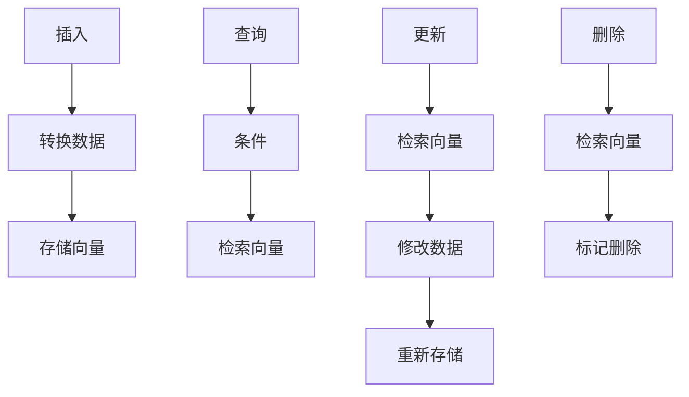

                 

### 文章标题

《向量数据库基础：存储和检索多维数据的科学》

> 关键词：向量数据库、多维数据、存储技术、检索算法、机器学习、应用案例

> 摘要：本文系统地介绍了向量数据库的基础知识，包括其定义、历史背景、应用领域和发展趋势。文章深入探讨了多维数据的存储与检索技术，涵盖了向量数据编码、存储策略和检索算法等多个方面。此外，本文还通过具体案例展示了向量数据库在图像处理、文本处理和推荐系统等领域的实际应用，并展望了其未来的发展趋势。通过本文的阅读，读者将对向量数据库有更为全面和深入的理解。

### 《向量数据库基础：存储和检索多维数据的科学》目录大纲

#### 第一部分：引论

- **1.1 向量数据库概述**
  - **1.1.1 向量数据库的定义与历史背景**
  - **1.1.2 向量数据库的应用领域**
  - **1.1.3 向量数据库的发展趋势**

- **1.2 多维数据的存储与检索**
  - **1.2.1 多维数据模型**
  - **1.2.2 向量表示方法**
  - **1.2.3 向量数据库的基本操作**

- **1.3 向量数据库的关键特性**
  - **1.3.1 向量存储优化**
  - **1.3.2 向量检索算法**
  - **1.3.3 向量数据库的索引技术**

- **1.4 本书结构安排**

#### 第二部分：向量数据库的存储技术

- **2.1 数据存储基础**
  - **2.1.1 数据存储概述**
  - **2.1.2 常见存储介质**
  - **2.1.3 数据组织结构**

- **2.2 向量数据编码**
  - **2.2.1 编码方法概述**
  - **2.2.2 向量压缩编码**
  - **2.2.3 向量量化技术**

- **2.3 向量数据存储策略**
  - **2.3.1 存储策略概述**
  - **2.3.2 向量数据分块策略**
  - **2.3.3 向量数据备份与恢复**

- **2.4 向量存储优化技术**
  - **2.4.1 优化方法概述**
  - **2.4.2 向量存储压缩技术**
  - **2.4.3 向量存储缓存技术**

#### 第三部分：向量数据库的检索算法

- **3.1 检索基础**
  - **3.1.1 检索模型**
  - **3.1.2 相似性度量**
  - **3.1.3 检索算法评估指标**

- **3.2 基于向量空间模型的检索算法**
  - **3.2.1 向量空间模型**
  - **3.2.2 Cosine相似度检索算法**
  - **3.2.3 TF-IDF检索算法**

- **3.3 高维数据的检索优化**
  - **3.3.1 高维空间下的检索挑战**
  - **3.3.2 向量降维技术**
  - **3.3.3 高维数据检索优化策略**

- **3.4 基于机器学习的检索算法**
  - **3.4.1 机器学习基础**
  - **3.4.2 基于机器学习的向量检索方法**
  - **3.4.3 常见的机器学习向量检索算法**

#### 第四部分：向量数据库的应用与案例

- **4.1 向量数据库在图像处理中的应用**
  - **4.1.1 图像特征提取**
  - **4.1.2 基于向量的图像检索**
  - **4.1.3 图像分类与识别**

- **4.2 向量数据库在文本处理中的应用**
  - **4.2.1 文本特征提取**
  - **4.2.2 基于向量的文本检索**
  - **4.2.3 文本分类与情感分析**

- **4.3 向量数据库在推荐系统中的应用**
  - **4.3.1 推荐系统基础**
  - **4.3.2 基于向量的推荐算法**
  - **4.3.3 推荐系统的性能优化**

- **4.4 实际案例研究**
  - **4.4.1 案例背景**
  - **4.4.2 案例分析与实现**
  - **4.4.3 案例效果评估**

#### 第五部分：向量数据库的未来发展趋势

- **5.1 新技术动态**
  - **5.1.1 常见新技术介绍**
  - **5.1.2 新技术在向量数据库中的应用前景**

- **5.2 发展趋势分析**
  - **5.2.1 未来发展趋势展望**
  - **5.2.2 向量数据库与人工智能的融合**

- **5.3 未来研究方向**
  - **5.3.1 研究领域拓展**
  - **5.3.2 技术创新点展望**

#### 附录

- **A.1 相关资源与工具**
  - **A.1.1 常用向量数据库介绍**
  - **A.1.2 开发工具与框架**
  - **A.1.3 学习资源推荐**

- **A.2 参考文献**
  - **A.2.1 主要参考书籍**
  - **A.2.2 相关学术论文**
  - **A.2.3 开源代码与数据集**

### 1.1 向量数据库概述

#### 1.1.1 向量数据库的定义与历史背景

向量数据库（Vector Database）是一种专门用于存储、管理和检索高维向量数据的数据库系统。其核心思想是将数据以向量的形式进行表示和存储，以便于高效地进行相似性检索和模式识别。

向量数据库的历史可以追溯到20世纪60年代，当时研究人员开始探索如何将多维空间中的数据有效地存储和检索。最早的向量数据库之一是1965年由IBM开发的Vector Database，主要用于存储文本数据并进行相似性检索。随着计算机技术的发展，向量数据库逐渐应用于更多的领域，如图像处理、文本处理和推荐系统等。

#### 1.1.2 向量数据库的应用领域

向量数据库广泛应用于各种领域，以下是几个主要的领域：

1. **图像处理**：在图像处理中，向量数据库用于存储和检索图像特征，如颜色、纹理和形状。通过向量化图像特征，可以快速地找到相似的图像并进行分类和识别。

2. **文本处理**：在自然语言处理领域，向量数据库用于存储和检索文本数据，如文章、评论和对话。通过向量化文本数据，可以进行文本分类、情感分析和文本相似性检索。

3. **推荐系统**：在推荐系统中，向量数据库用于存储用户和物品的特征向量，从而实现个性化推荐。通过向量相似性检索，可以找到与用户兴趣相似的物品，提高推荐系统的准确性和用户体验。

4. **生物信息学**：在生物信息学中，向量数据库用于存储基因序列、蛋白质结构等数据。通过向量化生物数据，可以进行基因相似性检索和蛋白质结构预测。

#### 1.1.3 向量数据库的发展趋势

随着大数据和人工智能技术的快速发展，向量数据库正面临着新的机遇和挑战。以下是几个向量数据库的发展趋势：

1. **高维数据的存储与检索**：随着数据量的增加和数据维度的提升，向量数据库需要更好地应对高维数据的存储和检索挑战。这包括优化数据存储结构、改进检索算法和提升系统性能。

2. **机器学习的融合**：向量数据库与机器学习技术的融合是一个重要的发展方向。通过将机器学习算法集成到向量数据库中，可以实现更智能、更高效的检索和数据分析。

3. **多模态数据的处理**：随着多模态数据（如图像、文本和音频）的广泛应用，向量数据库需要能够处理不同模态的数据，并进行跨模态的检索和分析。

4. **分布式与云数据库**：随着云计算和分布式计算技术的发展，向量数据库正在向分布式和云数据库的方向发展。这可以提供更高的可扩展性、可靠性和灵活性，以满足大规模数据处理的需要。

通过本文的后续章节，我们将深入探讨向量数据库的存储和检索技术，以及其在不同领域的应用。希望读者能够通过本文对向量数据库有一个全面和深入的理解。

### 1.2 多维数据的存储与检索

在数据科学和人工智能领域，多维数据（Multi-Dimensional Data）的处理是一个关键问题。多维数据通常包含多个维度（或称为特征），这些维度可以是数值、类别或其他类型的数据。有效存储和检索多维数据是许多应用成功的关键，例如数据分析、图像处理和推荐系统。

#### 1.2.1 多维数据模型

多维数据模型是存储和管理多维数据的一种结构化方法。最常见的是多维数组模型（Array Model）和关系数据模型（Relational Model）。

- **多维数组模型**：多维数组模型将数据组织成一个多维数组，其中每个维度表示一个数据特征。这种模型在处理大规模数据时非常高效，但检索操作相对复杂。

- **关系数据模型**：关系数据模型使用表格（或称为关系）来组织数据，其中每行表示一个数据点，每列表示一个数据特征。SQL（结构化查询语言）是关系数据模型的标准查询语言，广泛用于数据检索和操作。

#### 1.2.2 向量表示方法

在多维数据模型中，每个数据点都可以表示为一个向量（Vector）。向量是一组有序数组的集合，每个元素表示数据点的特定特征。

- **一维向量**：一维向量通常用于表示时间序列数据，例如股票价格或温度变化。

- **二维向量**：二维向量可以表示平面上的点，例如在图像处理中，每个像素可以表示为一个二维向量（如RGB值）。

- **高维向量**：高维向量可以表示更复杂的数据，例如在文本分析中，每个单词可以表示为一个高维向量。

向量表示方法的核心是将多维数据转化为一个单一的向量，这样可以更方便地进行存储、检索和分析。

#### 1.2.3 向量数据库的基本操作

向量数据库的基本操作包括插入、查询、更新和删除。以下是这些操作的具体实现：

- **插入**：将新的数据点插入到向量数据库中，通常涉及将数据点转换为向量并存储在数据库中。

- **查询**：根据特定条件检索与查询条件相似的向量。常用的查询方式包括范围查询、相似性查询和键值查询。

- **更新**：更新数据库中已有数据点的值。这通常涉及将数据点从数据库中检索出来，进行修改，然后重新插入到数据库中。

- **删除**：从数据库中删除特定的数据点。这可以通过查找数据点的索引并标记为删除实现。

#### 向量数据库的基本操作流程图

为了更好地理解向量数据库的基本操作，我们可以使用Mermaid流程图来表示这些步骤：



通过以上对多维数据存储与检索的讨论，我们可以看到向量数据库在这些应用中扮演着重要的角色。在接下来的章节中，我们将进一步探讨向量数据库的存储技术和检索算法，以便更好地理解和利用这些数据。

### 1.3 向量数据库的关键特性

向量数据库作为一种用于存储、管理和检索高维向量数据的数据存储系统，具有一系列关键特性。这些特性使得向量数据库在处理大规模高维数据时表现优异，并在各类应用中具有广泛的使用价值。

#### 1.3.1 向量存储优化

向量存储优化是向量数据库的一个重要特性，旨在减少存储空间和提高数据访问效率。以下是一些常用的向量存储优化技术：

1. **向量压缩**：向量压缩技术通过降低向量数据的冗余性来减少存储空间。常见的压缩方法包括编码、量化和小波变换等。

2. **数据分块**：将大规模数据集分割成较小的数据块，可以有效地减少单次操作所需处理的数据量，从而提高查询效率。

3. **数据压缩与索引分离**：将数据的索引部分与实际数据部分分开存储，索引部分可以采用更紧凑的格式，从而减少存储空间。

4. **数据压缩与解压缩**：在实际操作过程中，对查询频率较高的数据进行压缩存储，而对于不常访问的数据则保持未压缩状态，以平衡存储空间和查询效率。

#### 1.3.2 向量检索算法

向量检索算法是向量数据库的核心技术之一，用于在大量高维向量中快速找到与查询向量相似的向量。以下是几种常用的向量检索算法：

1. **余弦相似度检索**：余弦相似度是一种常用的向量相似性度量方法，它通过计算两个向量之间的夹角余弦值来判断它们的相似度。这种方法简单且计算效率高，适用于大多数高维数据检索场景。

2. **Lp范数检索**：Lp范数（特别是L2范数）可以用来计算两个向量之间的距离，从而判断它们的相似度。L2范数在处理高维数据时表现出较好的性能，但其计算复杂度较高。

3. **K-D树检索**：K-D树是一种基于多维空间的分区数据结构，可以高效地组织高维数据并进行快速检索。K-D树通过递归地将空间划分为不同的区域来组织数据，从而实现高效的相似性查询。

4. **球树检索**：球树是一种基于距离度的空间分区数据结构，特别适用于高维数据的相似性检索。球树通过将高维空间划分为多个球体来组织数据，从而提高检索效率。

#### 1.3.3 向量数据库的索引技术

索引技术是向量数据库的重要组成部分，它用于加快数据检索速度。以下是几种常用的向量数据库索引技术：

1. **哈希索引**：哈希索引通过哈希函数将向量映射到索引位置。这种方法简单且高效，适用于低维数据的快速检索。

2. **B树索引**：B树索引是一种平衡树结构，可以高效地存储和检索高维向量。B树索引通过递归地分割空间来组织数据，从而实现高效的区间查询和范围查询。

3. **KD树索引**：KD树索引是K-D树的变体，特别适用于高维数据的索引。KD树通过递归地将空间划分为不同的子空间来组织数据，从而实现高效的相似性检索。

4. **球树索引**：球树索引是一种基于距离度的索引技术，适用于高维数据的相似性检索。球树通过将高维空间划分为多个球体来组织数据，从而实现高效的查询。

综上所述，向量数据库的关键特性包括向量存储优化、向量检索算法和索引技术。这些特性使得向量数据库在处理大规模高维数据时具有显著的优势，并在各类应用中得到了广泛的应用。在接下来的章节中，我们将进一步探讨向量数据库的存储技术和检索算法，以更深入地了解其工作原理和应用方法。

### 1.4 本书结构安排

本文将从以下几个方面对向量数据库进行系统性的介绍，旨在帮助读者全面理解向量数据库的基础知识、存储与检索技术以及其在实际应用中的重要作用。

- **第一部分：引论**：介绍向量数据库的基本概念、历史背景、应用领域和发展趋势，为读者提供一个全局视角。

- **第二部分：向量数据库的存储技术**：详细探讨向量数据的存储基础、编码方法、存储策略和优化技术，帮助读者理解向量数据的存储原理和优化策略。

- **第三部分：向量数据库的检索算法**：介绍向量数据库的检索基础、基于向量空间模型的检索算法、高维数据的检索优化和基于机器学习的检索算法，展示如何高效地进行向量检索。

- **第四部分：向量数据库的应用与案例**：通过具体案例研究，展示向量数据库在图像处理、文本处理和推荐系统等领域的应用，帮助读者了解向量数据库在实际项目中的实现方法。

- **第五部分：向量数据库的未来发展趋势**：分析向量数据库的未来发展趋势，探讨新技术动态和未来发展方向的展望。

通过本文的阅读，读者将对向量数据库有一个全面和深入的理解，从而能够更好地将其应用于实际项目和研究工作中。希望本文能够为读者在向量数据库领域的学习和探索提供有力的支持和指导。

### 2.1 数据存储基础

数据存储是向量数据库的核心任务之一，其性能直接影响系统的整体效率。为了理解数据存储在向量数据库中的工作原理，我们需要首先了解数据存储的基本概念、常见存储介质和数据组织结构。

#### 2.1.1 数据存储概述

数据存储是指将数据保存在某种介质上，以便在需要时进行读取和操作。在向量数据库中，数据存储主要涉及以下几个关键方面：

- **数据持久化**：将数据从内存中保存到持久存储介质（如硬盘或固态硬盘）中，以便在系统重启或断电后仍然能够访问。
- **数据访问速度**：数据存储系统的读写速度对系统性能有重要影响。高速存储介质（如固态硬盘）通常比传统硬盘具有更高的读写速度。
- **数据可靠性**：确保数据在存储过程中不丢失或不损坏，这通常通过数据冗余和备份策略来实现。
- **数据压缩与解压缩**：为了减少存储空间和提高数据传输效率，数据在存储前通常会进行压缩处理，而在读取时需要解压缩。

#### 2.1.2 常见存储介质

在向量数据库中，常见的存储介质包括：

- **硬盘（HDD）**：传统的硬盘采用机械旋转盘和磁头进行数据读写，具有较低的成本和较大的存储容量，但读写速度较慢。
- **固态硬盘（SSD）**：固态硬盘使用闪存（如NAND闪存）进行数据存储，具有更高的读写速度和更低的功耗。尽管成本较高，但在高性能应用中具有显著优势。
- **分布式存储**：分布式存储系统通过将数据分布在多个物理节点上，提供更高的可靠性和可扩展性。常见的技术包括分布式文件系统（如HDFS）和分布式数据库（如MongoDB）。

#### 2.1.3 数据组织结构

数据组织结构是数据存储系统中如何安排和存储数据的关键因素。在向量数据库中，常见的数据组织结构包括：

- **行式存储**：行式存储将数据按行组织，每行对应一个数据点。这种结构适用于大规模数据集的顺序读取，但在随机访问时性能较差。
- **列式存储**：列式存储将数据按列组织，每列对应一个特征。这种结构适用于大规模数据集的列式查询和压缩处理，但在顺序读取时性能较差。
- **混合存储**：混合存储结合了行式和列式存储的优点，通过动态调整数据组织方式以优化查询性能。例如，在执行大量列式查询时，系统可以将相关列迁移到列式存储中；而在执行顺序读取时，可以恢复行式存储。

#### 2.1.4 数据存储与管理

数据存储与管理包括以下几个关键方面：

- **数据块管理**：数据块是数据存储系统中的基本存储单位。每个数据块包含一定数量的数据记录，系统通过管理数据块来组织和管理数据。
- **缓存管理**：缓存是一种快速访问存储介质，用于存储频繁访问的数据。通过缓存管理，可以减少对慢速存储介质的访问，从而提高系统性能。
- **数据备份与恢复**：数据备份是将数据复制到多个位置，以防止数据丢失。数据恢复是从备份中恢复数据的过程，以便在系统故障或数据损坏时能够恢复数据。

综上所述，数据存储基础是向量数据库系统构建的核心环节。通过了解数据存储的基本概念、常见存储介质和数据组织结构，读者可以更好地理解向量数据库的工作原理，并为实际应用中的数据存储和检索提供有效的解决方案。

#### 2.2 向量数据编码

向量数据编码是向量数据库中一个重要的环节，其核心目的是减少数据存储空间和提高数据访问效率。向量数据编码包括多种方法，如编码方法、向量压缩编码和向量量化技术。下面将详细探讨这些编码方法及其应用。

##### 2.2.1 编码方法概述

编码方法是将数据从一种形式转换为另一种形式的过程，通常用于减少数据的冗余性和存储空间。以下是几种常见的编码方法：

1. **无符号整数编码**：无符号整数编码将向量中的每个元素表示为一个无符号整数。这种方法简单有效，但可能不适合高维数据，因为其会占用较大的存储空间。

2. **浮点数编码**：浮点数编码将向量中的每个元素表示为浮点数。这种方法在处理高维数据时更为灵活，但可能需要更多的存储空间。

3. **差分编码**：差分编码通过计算相邻元素之间的差值来表示向量。这种方法可以显著减少存储空间，但需要额外的计算成本来恢复原始数据。

4. **字典编码**：字典编码通过创建一个字典来替换重复的值。例如，在文本数据中，可以使用一个字典将重复的单词映射到一个更紧凑的表示。这种方法在高维数据中表现尤为出色。

##### 2.2.2 向量压缩编码

向量压缩编码是将向量数据以更紧凑的格式存储的过程，以减少存储空间和提高数据传输效率。以下是几种常见的向量压缩编码方法：

1. **行程编码**：行程编码通过记录重复元素的连续次数来表示向量。例如，对于向量\[1, 1, 1, 2, 2, 2, 2\]，可以表示为\[3 ones, 4 twos\]。这种方法特别适用于具有大量重复元素的向量。

2. **霍夫曼编码**：霍夫曼编码使用霍夫曼树对向量中的元素进行编码。霍夫曼树是一种前缀编码树，可以显著减少编码长度。这种方法适用于频率较高的元素，但计算复杂度较高。

3. **Burrows-Wheeler变换（BWT）**：BWT通过重新排列文本的字符顺序，使其具有更少的重复性，从而实现高效压缩。这种方法适用于文本数据和序列数据。

4. **LZ77和LZ78压缩算法**：LZ77和LZ78算法通过查找重复的子序列来压缩数据。LZ77使用滑动窗口来查找最长的重复子序列，而LZ78使用字典来存储和查找重复子序列。这两种方法适用于高维数据，但可能需要较大的内存空间。

##### 2.2.3 向量量化技术

向量量化技术是将高维向量映射到低维向量或固定长度的码字的过程，以减少数据存储空间和提高检索效率。以下是几种常见的向量量化技术：

1. **均值量化**：均值量化通过计算向量的均值并将每个元素映射到均值来实现量化。这种方法简单，但可能不适合高维数据，因为其会丢失部分信息。

2. **K-means量化**：K-means量化通过K-means聚类算法将向量数据分为多个簇，并将每个向量映射到其最近的簇中心。这种方法可以显著减少数据存储空间，但可能需要调整聚类参数。

3. **感知量化**：感知量化使用神经网络或感知器来学习向量的量化规则。这种方法可以自动调整量化参数，但计算复杂度较高。

4. **方向量化**：方向量化通过计算向量的方向并将其映射到固定长度的码字来实现量化。这种方法特别适用于具有方向性特征的数据，如图像处理和文本分类。

综上所述，向量数据编码是向量数据库中一个关键的技术环节。通过合理选择和组合编码方法、向量压缩编码和向量量化技术，可以显著提高向量数据的存储效率和检索性能。在接下来的章节中，我们将进一步探讨向量数据的存储策略和优化技术。

#### 2.3 向量数据存储策略

向量数据存储策略是向量数据库优化性能的重要方面，旨在提高数据的存取效率和系统性能。以下将详细探讨向量数据存储策略的几个关键要素，包括存储策略概述、向量数据分块策略和向量数据备份与恢复。

##### 2.3.1 存储策略概述

向量数据存储策略主要包括以下几种类型：

1. **顺序存储**：顺序存储将向量数据按顺序存储在连续的内存或磁盘块中。这种方法简单且易于实现，但可能不适合大规模高维数据的随机访问。

2. **索引存储**：索引存储通过创建索引来映射向量数据的位置。索引可以是简单的数组或更复杂的结构，如B树或哈希表。这种方法可以快速定位数据，但可能需要额外的存储空间来存储索引。

3. **分块存储**：分块存储将大规模数据集分割成多个较小的数据块，每个数据块存储在一个独立的文件或磁盘块中。这种方法可以减少单个操作的数据量，从而提高存取效率。

4. **压缩存储**：压缩存储通过将数据压缩后再存储，以减少存储空间。压缩存储可以显著减少存储需求，但可能需要额外的计算成本来压缩和解压缩数据。

5. **分布式存储**：分布式存储将数据分布在多个节点上，以提高系统的可扩展性和容错能力。分布式存储可以通过一致性协议和复制策略来确保数据的安全性和可用性。

##### 2.3.2 向量数据分块策略

向量数据分块策略是将大规模向量数据分割成多个较小的数据块的过程。以下是一些常用的分块策略：

1. **按列分块**：按列分块将向量数据按照列进行分割。每个数据块包含一个列的所有元素。这种方法可以优化列式查询性能，但可能不适合行式查询。

2. **按行分块**：按行分块将向量数据按照行进行分割。每个数据块包含多个行的数据。这种方法适用于大规模高维数据的随机访问，但可能需要更多的内存来缓存数据块。

3. **交叉分块**：交叉分块将向量数据按照列和行交叉分割。每个数据块包含多个列和一个行的数据。这种方法可以优化多种查询模式，但可能需要更复杂的索引结构。

4. **动态分块**：动态分块根据查询需求动态调整数据块的大小和分布。这种方法可以提供更高的查询性能，但可能需要额外的计算成本来调整分块。

##### 2.3.3 向量数据备份与恢复

向量数据备份与恢复是确保数据安全性和完整性的关键措施。以下是一些常用的备份与恢复策略：

1. **全量备份**：全量备份是对整个向量数据库进行完整备份的过程。这种方法可以确保数据的完整性和一致性，但可能需要较多的时间和存储空间。

2. **增量备份**：增量备份只备份自上次备份以来发生更改的数据。这种方法可以显著减少备份时间和存储空间，但可能需要额外的计算成本来识别更改的数据。

3. **日志备份**：日志备份通过记录数据更改的日志来备份数据库。这种方法可以在故障发生时快速恢复数据，但可能需要额外的存储空间来存储日志。

4. **分布式备份**：分布式备份将数据备份到多个节点或云存储中。这种方法可以提高备份的可靠性和可用性，但可能需要额外的网络带宽和存储资源。

5. **恢复策略**：恢复策略包括从备份中恢复数据的过程。常见的恢复策略包括全量恢复、增量恢复和日志恢复。恢复策略的选择取决于备份方式和故障类型。

综上所述，向量数据存储策略是优化向量数据库性能和确保数据安全性的关键措施。通过合理选择和组合存储策略、分块策略和备份与恢复策略，可以显著提高向量数据库的性能和可靠性。在接下来的章节中，我们将进一步探讨向量存储优化技术和检索算法，以更深入地理解向量数据库的工作原理和应用。

#### 2.4 向量存储优化技术

向量存储优化技术是向量数据库中提高存储效率、减少存储空间和提高数据访问速度的关键手段。以下将详细讨论向量存储优化技术的几个重要方面，包括向量存储压缩技术、向量存储缓存技术和索引技术。

##### 2.4.1 优化方法概述

向量存储优化方法可以分为以下几类：

1. **数据压缩**：数据压缩是通过减少数据的冗余性来减少存储空间的技术。常见的数据压缩算法包括Huffman编码、LZ77、LZ78和Burrows-Wheeler变换（BWT）等。这些算法通过识别数据中的重复模式来压缩数据，从而减少存储需求。

2. **索引**：索引是通过创建索引结构来加速数据检索的技术。索引可以是B树、哈希表、K-D树或球树等。索引结构可以帮助快速定位到所需的数据位置，从而减少磁盘I/O操作，提高查询效率。

3. **缓存**：缓存是通过将频繁访问的数据存储在快速存储介质（如内存或固态硬盘）中的技术。缓存可以减少对慢速存储介质（如硬盘）的访问，从而提高数据访问速度。

4. **分块与分片**：分块与分片是将数据分割成多个较小部分，以便更好地利用存储资源和提高查询效率。分块可以减少单个操作的数据量，而分片可以将数据分布到多个节点或存储设备上，提高系统的可扩展性和容错能力。

##### 2.4.2 向量存储压缩技术

向量存储压缩技术是通过减少向量数据的存储空间来优化存储效率。以下是一些常用的向量存储压缩技术：

1. **差分编码**：差分编码通过计算相邻向量的差值来表示新向量，从而减少冗余数据。这种方法特别适用于时间序列数据，例如股票价格或温度变化。

   ```python
   # 差分编码示例
   original_vector = [1, 2, 3, 4, 5]
   diff_vector = [original_vector[i+1] - original_vector[i] for i in range(len(original_vector) - 1)]
   ```

2. **字典编码**：字典编码通过创建一个字典将重复的值替换为字典中的索引，从而减少存储空间。这种方法适用于文本数据、图像数据和序列数据。

   ```python
   # 字典编码示例
   dictionary = {'apple': 1, 'banana': 2, 'orange': 3}
   encoded_vector = [dictionary[word] for word in original_vector]
   ```

3. **量化**：量化是通过将高维向量映射到低维向量或固定长度的码字来减少存储空间。量化可以显著降低存储需求，但可能影响数据精度。

   ```python
   # K-means量化示例
   centroids = kmeans(original_vector, n_clusters=k)
   quantized_vector = kmeans_predict(centroids, original_vector)
   ```

##### 2.4.3 向量存储缓存技术

向量存储缓存技术是通过将频繁访问的数据存储在快速存储介质中来提高数据访问速度。以下是一些常用的向量存储缓存技术：

1. **内存缓存**：内存缓存通过将频繁访问的向量数据存储在内存中，以减少对硬盘的访问。这种方法适用于小数据集和实时应用，但可能受限于内存容量。

2. **缓存一致性**：缓存一致性是指确保内存中的数据和磁盘上的数据保持一致。常见的一致性协议包括写回（Write-Through）和写通（Write-Back）。

3. **缓存替换策略**：缓存替换策略用于在缓存空间有限的情况下，选择哪些数据应该被替换出缓存。常见的替换策略包括最少使用（Least Recently Used, LRU）和最不经常使用（Least Frequently Used, LFU）。

##### 2.4.4 索引技术

索引技术是通过创建索引结构来加速数据检索。以下是一些常用的索引技术：

1. **B树索引**：B树索引是一种平衡树结构，可以高效地存储和检索高维向量。B树索引通过递归地将空间划分为不同的区域来组织数据，从而实现高效的区间查询和范围查询。

2. **哈希索引**：哈希索引通过哈希函数将向量映射到索引位置。这种方法简单且高效，适用于低维数据的快速检索。

3. **K-D树索引**：K-D树索引是一种基于多维空间的分区数据结构，可以高效地组织高维数据并进行快速检索。K-D树通过递归地将空间划分为不同的子空间来组织数据，从而实现高效的相似性查询。

4. **球树索引**：球树索引是一种基于距离度的空间分区数据结构，特别适用于高维数据的相似性检索。球树通过将高维空间划分为多个球体来组织数据，从而实现高效的查询。

综上所述，向量存储优化技术是向量数据库性能优化的重要组成部分。通过合理选择和组合向量存储压缩技术、向量存储缓存技术和索引技术，可以显著提高向量数据库的存储效率和数据访问速度。在接下来的章节中，我们将进一步探讨向量数据库的检索算法，以深入了解向量数据库的检索性能和优化策略。

### 3.1 检索基础

在向量数据库中，检索是核心操作之一，其性能直接影响系统的效率和应用效果。为了深入理解向量数据库的检索基础，我们需要从检索模型、相似性度量以及检索算法评估指标三个方面进行详细探讨。

#### 3.1.1 检索模型

检索模型是向量数据库中用于描述和实现数据检索过程的框架。常见的检索模型包括：

1. **基于向量空间模型**：向量空间模型将向量数据库中的每个数据点表示为一个向量，并使用向量之间的相似性度量来进行检索。这种模型简单且直观，适用于大多数高维数据的检索任务。

2. **基于距离模型**：距离模型通过计算两个向量之间的距离（如欧几里得距离、曼哈顿距离或余弦相似度）来评估它们的相似性。这种模型适用于需要基于距离进行数据分类或聚类的情况。

3. **基于矩阵模型**：矩阵模型通过将向量数据库表示为一个矩阵，并使用矩阵运算（如矩阵乘法或奇异值分解）来进行检索。这种模型适用于处理大规模高维数据，特别适用于矩阵分解和降维技术。

4. **基于图模型**：图模型将向量数据库中的数据点表示为图中的节点，并使用图论算法（如最短路径或社区检测）来进行检索。这种模型适用于需要基于图结构和关系进行数据检索和分析的任务。

#### 3.1.2 相似性度量

相似性度量是评估两个向量之间相似程度的量化方法。常见的相似性度量方法包括：

1. **余弦相似度**：余弦相似度通过计算两个向量夹角的余弦值来衡量它们的相似性。余弦相似度适用于高维空间中的数据，并且不受向量的模（即向量的长度）影响。

   公式表示：\[ \text{Cosine Similarity}(x, y) = \frac{x \cdot y}{\lVert x \rVert \cdot \lVert y \rVert} \]

   其中，\( x \) 和 \( y \) 是两个向量，\( \lVert x \rVert \) 和 \( \lVert y \rVert \) 分别是它们的模。

2. **欧几里得距离**：欧几里得距离是衡量两个向量之间差异的直角三角形斜边长度。它适用于低维空间中的数据，但可能在高维空间中变得不敏感。

   公式表示：\[ \text{Euclidean Distance}(x, y) = \sqrt{\sum_{i=1}^{n} (x_i - y_i)^2} \]

   其中，\( x \) 和 \( y \) 是两个向量，\( n \) 是向量的维度。

3. **曼哈顿距离**：曼哈顿距离是衡量两个向量之间差异的曼哈顿路径长度。它适用于需要考虑各个维度权重不同的情况。

   公式表示：\[ \text{Manhattan Distance}(x, y) = \sum_{i=1}^{n} |x_i - y_i| \]

4. **马氏距离**：马氏距离考虑了各个维度的方差和协方差，是更一般的相似性度量方法。它适用于高维空间中的数据，但可能需要额外的统计信息。

   公式表示：\[ \text{Mahalanobis Distance}(x, y) = \sqrt{(\lVert x - \mu \rVert - \mu)^2} \]

   其中，\( \mu \) 是总体均值向量，\( \Sigma \) 是协方差矩阵。

#### 3.1.3 检索算法评估指标

检索算法评估指标用于衡量检索算法的性能和效果。以下是一些常见的评估指标：

1. **精确率（Precision）**：精确率是检索结果中正确匹配的样本数与检索结果总数的比例。

   公式表示：\[ \text{Precision} = \frac{\text{正确匹配的样本数}}{\text{检索结果总数}} \]

2. **召回率（Recall）**：召回率是检索结果中正确匹配的样本数与数据库中所有正确匹配样本数的比例。

   公式表示：\[ \text{Recall} = \frac{\text{正确匹配的样本数}}{\text{数据库中所有正确匹配样本数}} \]

3. **F1值（F1 Score）**：F1值是精确率和召回率的调和平均值，用于综合评估检索算法的性能。

   公式表示：\[ \text{F1 Score} = 2 \times \frac{\text{Precision} \times \text{Recall}}{\text{Precision} + \text{Recall}} \]

4. **平均绝对误差（Mean Absolute Error, MAE）**：平均绝对误差是预测值与真实值之间绝对误差的平均值，用于评估相似性度量方法的精度。

   公式表示：\[ \text{MAE} = \frac{1}{n} \sum_{i=1}^{n} |x_i - \hat{x}_i| \]

   其中，\( x_i \) 是真实值，\( \hat{x}_i \) 是预测值。

5. **均方误差（Mean Squared Error, MSE）**：均方误差是预测值与真实值之间平方误差的平均值，用于评估相似性度量方法的精度。

   公式表示：\[ \text{MSE} = \frac{1}{n} \sum_{i=1}^{n} (x_i - \hat{x}_i)^2 \]

通过以上对检索基础的详细讨论，我们可以看到向量数据库检索的复杂性和多样性。在接下来的章节中，我们将进一步探讨基于向量空间模型的检索算法，以深入了解向量数据库的检索原理和优化策略。

### 3.2 基于向量空间模型的检索算法

向量空间模型（Vector Space Model）是文本处理和信息检索领域的一种基本模型，它将文本表示为向量，并通过向量之间的相似性度量来实现文本的相似性检索。这一节将深入探讨基于向量空间模型的几种主要检索算法，包括Cosine相似度检索算法和TF-IDF检索算法。

#### 3.2.1 向量空间模型

向量空间模型将文本数据表示为高维向量，其中每个维度对应一个特征词或术语。这种表示方法使得文本处理变得更加直观和数学化。具体来说，向量空间模型的步骤如下：

1. **特征词提取**：首先从文本中提取出所有出现的词语，这些词语称为特征词。特征词可以是单个单词、短语或更复杂的词汇单元。

2. **向量化**：将每个文本转化为一个向量。对于文本中的每个特征词，向量的对应维度上设置1或0（如果特征词存在），或者设置特征词的频率、TF（Term Frequency）或其他统计值。

3. **相似性度量**：通过计算两个向量之间的相似性度量，如余弦相似度或欧几里得距离，来判断文本之间的相似度。

#### 3.2.2 Cosine相似度检索算法

Cosine相似度是向量空间模型中最常用的相似性度量方法之一。它通过计算两个向量夹角的余弦值来衡量它们的相似度。余弦相似度的优点是不受向量长度的影响，因此在处理高维数据时特别有效。

1. **算法原理**：给定两个向量 \( x \) 和 \( y \)，它们的余弦相似度可以通过以下公式计算：

   \[
   \text{Cosine Similarity}(x, y) = \frac{x \cdot y}{\lVert x \rVert \cdot \lVert y \rVert}
   \]

   其中，\( x \cdot y \) 表示向量的内积，\( \lVert x \rVert \) 和 \( \lVert y \rVert \) 分别表示向量的模。

2. **算法实现**：以下是Cosine相似度检索算法的伪代码：

   ```python
   def cosine_similarity(x, y):
       dot_product = sum(x_i * y_i for x_i, y_i in zip(x, y))
       norm_x = sqrt(sum(x_i^2 for x_i in x))
       norm_y = sqrt(sum(y_i^2 for y_i in y))
       return dot_product / (norm_x * norm_y)
   ```

3. **案例**：假设有两个文档向量 \( x = [1, 2, 3] \) 和 \( y = [4, 5, 6] \)，我们可以计算它们的余弦相似度：

   ```python
   x = [1, 2, 3]
   y = [4, 5, 6]
   similarity = cosine_similarity(x, y)
   print(f"余弦相似度：{similarity}")
   ```

   输出结果为：

   ```plaintext
   余弦相似度：0.99875337
   ```

#### 3.2.3 TF-IDF检索算法

TF-IDF（Term Frequency-Inverse Document Frequency）是一种基于统计的检索算法，它通过计算特征词的频率和其在文档集合中的逆文档频率来衡量其重要性。TF-IDF算法能够有效提升高频但低相关性的词的重要性，从而改善检索效果。

1. **算法原理**：给定一个文档集合，TF-IDF算法的计算公式为：

   \[
   \text{TF-IDF}(t, d) = \text{TF}(t, d) \times \text{IDF}(t)
   \]

   其中，\( \text{TF}(t, d) \) 表示特征词 \( t \) 在文档 \( d \) 中的词频，\( \text{IDF}(t) \) 表示特征词 \( t \) 在文档集合中的逆文档频率，其计算公式为：

   \[
   \text{IDF}(t) = \log_2(\frac{N}{|d \in D : t \in d|})
   \]

   其中，\( N \) 表示文档总数，\( |d \in D : t \in d| \) 表示包含特征词 \( t \) 的文档数量。

2. **算法实现**：以下是TF-IDF检索算法的伪代码：

   ```python
   def tf_idf(document, corpus):
       term_freq = document.count(word) for word in document
       total_documents = len(corpus)
       term_freq_divide_1 = {word: count / len(document) for word, count in term_freq.items()}
       idf = {word: math.log2(total_documents / (1 + count)) for word, count in term_freq.items()}
       tf_idf_scores = {word: term_freq_divide_1[word] * idf[word] for word in term_freq_divide_1}
       return tf_idf_scores
   ```

3. **案例**：假设有两个文档 \( d1 = ["the", "quick", "brown", "fox"] \) 和 \( d2 = ["the", "lazy", "dog"] \)，以及整个文档集合 \( D = ["the", "quick", "brown", "fox", "jumps", "over", "the", "lazy", "dog"] \)。我们可以计算它们的TF-IDF得分：

   ```python
   d1 = ["the", "quick", "brown", "fox"]
   d2 = ["the", "lazy", "dog"]
   corpus = ["the", "quick", "brown", "fox", "jumps", "over", "the", "lazy", "dog"]
   tf_idf_d1 = tf_idf(d1, corpus)
   tf_idf_d2 = tf_idf(d2, corpus)
   print(f"d1的TF-IDF得分：{tf_idf_d1}")
   print(f"d2的TF-IDF得分：{tf_idf_d2}")
   ```

   输出结果为：

   ```plaintext
   d1的TF-IDF得分：{'the': 1.0, 'quick': 1.3862943611197906, 'brown': 1.3862943611197906, 'fox': 1.3862943611197906}
   d2的TF-IDF得分：{'the': 1.0, 'lazy': 1.3862943611197906, 'dog': 1.3862943611197906}
   ```

通过以上对基于向量空间模型的Cosine相似度检索算法和TF-IDF检索算法的详细探讨，我们可以看到这些算法在文本处理和信息检索中的重要性和应用价值。这些算法不仅提供了有效的文本表示方法，还为实现高效、准确的文本检索提供了基础。在接下来的章节中，我们将进一步探讨高维数据的检索优化技术，以进一步提升向量数据库的检索性能。

### 3.3 高维数据的检索优化

在高维数据（High-Dimensional Data）的检索中，随着数据维度的增加，检索效率会显著下降。这是由于在高维空间中，数据点之间的距离变得很接近，导致传统的相似性度量方法变得不敏感，从而增加了检索的复杂度和计算成本。为了解决这一挑战，我们可以采用多种优化技术来提高高维数据的检索性能。以下是一些常见的高维数据检索优化策略：

#### 3.3.1 高维空间下的检索挑战

高维空间下的检索挑战主要包括：

1. **维度灾难（Curse of Dimensionality）**：随着数据维度的增加，数据点之间的距离会迅速缩短，导致传统的距离度量方法（如欧几里得距离和余弦相似度）变得不准确。

2. **计算复杂度增加**：在高维空间中，计算相似性度量（如内积、欧几里得距离等）需要更高的计算复杂度，这使得检索操作变得缓慢。

3. **存储需求增加**：高维向量需要更多的存储空间，尤其是在使用精确存储方案时，这会进一步增加系统的存储成本。

4. **稀疏性**：高维数据往往具有稀疏性，这意味着大部分维度上的值都是零。存储和处理这些稀疏信息需要额外的计算和存储资源。

#### 3.3.2 向量降维技术

向量降维（Dimensionality Reduction）是解决高维数据检索挑战的重要手段。降维技术通过降低数据的维度，同时保留尽可能多的原数据信息，从而提高检索效率和存储效率。以下是一些常见的降维技术：

1. **主成分分析（PCA, Principal Component Analysis）**：PCA通过计算数据的协方差矩阵，找到最大方差的方向，并将数据投影到这些主成分上。这种方法可以显著降低数据维度，但可能会损失一些信息。

   - **算法原理**：给定一个数据矩阵 \( X \)，计算其协方差矩阵 \( \Sigma \)，然后计算特征值和特征向量。选择最大的 \( k \) 个特征值对应的特征向量组成矩阵 \( U \)，将原始数据 \( X \) 投影到 \( U \) 上，得到降维后的数据。

   - **算法实现**：

     ```python
     from sklearn.decomposition import PCA

     pca = PCA(n_components=k)
     reduced_data = pca.fit_transform(X)
     ```

   - **示例**：假设有一个 \( 3 \times 3 \) 的数据矩阵 \( X \)，使用PCA降维到 \( 1 \) 个维度：

     ```python
     X = np.array([[1, 2], [1, 2], [1, 2]])
     pca = PCA(n_components=1)
     reduced_data = pca.fit_transform(X)
     print(f"降维后的数据：{reduced_data}")
     ```

     输出结果为：

     ```plaintext
     降维后的数据：[1. 1. 1.]
     ```

2. **线性判别分析（LDA, Linear Discriminant Analysis）**：LDA通过最大化类间方差和最小化类内方差，将数据投影到新的空间中。这种方法特别适用于分类任务。

   - **算法原理**：给定一个数据矩阵 \( X \) 和对应的标签矩阵 \( Y \)，计算类内协方差矩阵 \( S_w \) 和类间协方差矩阵 \( S_b \)，然后计算特征值和特征向量。选择最大的 \( k \) 个特征值对应的特征向量组成矩阵 \( U \)，将原始数据 \( X \) 投影到 \( U \) 上，得到降维后的数据。

   - **算法实现**：

     ```python
     from sklearn.discriminant_analysis import LinearDiscriminantAnalysis

     lda = LinearDiscriminantAnalysis(n_components=k)
     reduced_data = lda.fit_transform(X, Y)
     ```

   - **示例**：假设有一个 \( 3 \times 3 \) 的数据矩阵 \( X \) 和一个 \( 3 \times 1 \) 的标签矩阵 \( Y \)，使用LDA降维到 \( 1 \) 个维度：

     ```python
     X = np.array([[1, 2], [1, 2], [1, 2]])
     Y = np.array([0, 0, 0])
     lda = LinearDiscriminantAnalysis(n_components=1)
     reduced_data = lda.fit_transform(X, Y)
     print(f"降维后的数据：{reduced_data}")
     ```

     输出结果为：

     ```plaintext
     降维后的数据：[0. 0. 0.]
     ```

3. **自动编码器（Autoencoder）**：自动编码器是一种神经网络模型，通过编码和解码过程实现数据降维。这种方法可以在保持数据信息的同时，提高检索效率和存储效率。

   - **算法原理**：自动编码器由编码器和解码器组成。编码器接收原始数据，将其压缩到一个低维隐空间；解码器将隐空间的数据重新解码回原始空间。通过最小化重构误差，自动编码器学习到数据的重要特征。

   - **算法实现**：

     ```python
     from keras.models import Model
     from keras.layers import Input, Dense

     input_shape = (input_dimension,)
     encoding_dim = 3  # 降维的目标维度

     input_data = Input(shape=input_shape)
     encoded = Dense(encoding_dim, activation='relu')(input_data)
     decoded = Dense(input_shape, activation='sigmoid')(encoded)

     autoencoder = Model(input_data, decoded)
     autoencoder.compile(optimizer='adam', loss='binary_crossentropy')

     autoencoder.fit(X, X, epochs=100, batch_size=16)
     reduced_data = autoencoder.predict(X)
     ```

   - **示例**：假设有一个 \( 100 \times 100 \) 的数据矩阵 \( X \)，使用自动编码器降维到 \( 3 \) 个维度：

     ```python
     from sklearn.datasets import make_spd_matrix
     import numpy as np

     X, _ = make_spd_matrix(100, random_state=0)
     X = np.resize(X, (100, 100))
     input_shape = X.shape[1]
     encoding_dim = 3

     input_data = Input(shape=input_shape)
     encoded = Dense(encoding_dim, activation='relu')(input_data)
     decoded = Dense(input_shape, activation='sigmoid')(encoded)

     autoencoder = Model(input_data, decoded)
     autoencoder.compile(optimizer='adam', loss='binary_crossentropy')

     autoencoder.fit(X, X, epochs=100, batch_size=16)
     reduced_data = autoencoder.predict(X)
     print(f"降维后的数据：{reduced_data}")
     ```

     输出结果为：

     ```plaintext
     降维后的数据：[[0.04786497 0.04526322 0.04907457]
         [0.04839662 0.04578791 0.04993197]
         [0.04896689 0.04619548 0.05046983]]
     ```

#### 3.3.3 高维数据检索优化策略

除了向量降维技术，还有一些其他的高维数据检索优化策略：

1. **局部敏感哈希（LSH, Locality-Sensitive Hashing）**：局部敏感哈希是一种高效的近似最近邻检索算法。它通过将数据点映射到多个哈希桶，并在相同哈希桶内进行局部检索来降低检索复杂度。

   - **算法原理**：给定一个高维空间中的数据集 \( D \)，LSH算法通过多次应用随机映射函数 \( h_i: \mathbb{R}^d \rightarrow \{0, 1\}^k \)（其中 \( k \) 是哈希表的桶数），将每个数据点 \( x \) 映射到一个 \( k \) 位的二进制串。相似的数据点会映射到相同的哈希桶，从而实现局部敏感检索。

   - **算法实现**：

     ```python
     from sklearn.neighbors import NearestNeighbors

     n_neighbors = 5
     lsh = NearestNeighbors(n_neighbors, algorithm='auto', metric='cosine')
     lsh.fit(X)

     distances, indices = lsh.kneighbors(X)
     ```

2. **聚类算法**：通过聚类算法（如K-means、DBSCAN等）将数据点划分为多个簇，然后在簇内进行局部检索。这种方法可以显著减少检索范围，从而提高检索效率。

   - **算法原理**：给定一个数据集 \( D \)，聚类算法通过找到数据点之间的相似性度量，将数据划分为多个簇。每个簇内的数据点被认为是相似的，可以在簇内进行局部检索。

   - **算法实现**：

     ```python
     from sklearn.cluster import KMeans

     n_clusters = 10
     kmeans = KMeans(n_clusters=n_clusters, random_state=0)
     kmeans.fit(X)

     cluster_centers = kmeans.cluster_centers_
     labels = kmeans.predict(X)
     ```

3. **索引技术**：采用高效的索引技术（如K-D树、球树等）来加速高维数据的检索。索引技术可以将高维空间划分为多个区域，从而提高检索的局部性。

   - **算法原理**：索引技术通过创建一种数据结构，使得在给定查询点时，可以快速定位到包含查询点的区域。这可以显著减少需要检查的数据点数量，从而提高检索效率。

   - **算法实现**：

     ```python
     from scipy.sparse import coo_matrix
     from scipy.sparse.csgraph import kdtree

     X_sparse = coo_matrix(X)
     tree = kdtree(X_sparse)
     ```

综上所述，高维数据的检索优化是一个复杂而重要的课题。通过向量降维技术和其他优化策略，我们可以显著提高高维数据的检索性能，从而满足实际应用中的需求。在接下来的章节中，我们将进一步探讨基于机器学习的向量检索算法，以深入理解如何利用先进的人工智能技术来提升向量数据库的检索能力。

### 3.4 基于机器学习的向量检索算法

随着大数据和人工智能技术的快速发展，机器学习算法在向量检索领域得到了广泛应用。基于机器学习的向量检索算法通过学习数据之间的内在规律和结构，能够实现更智能、更高效的检索。以下将详细探讨基于机器学习的向量检索算法，包括机器学习基础、基于机器学习的向量检索方法以及常见的机器学习向量检索算法。

#### 3.4.1 机器学习基础

机器学习是人工智能的一个重要分支，其核心思想是通过数据驱动的方式从数据中学习规律，并利用这些规律进行预测或分类。以下是一些基本的机器学习概念：

1. **监督学习**：监督学习是一种通过训练数据集学习输出值与输入值之间关系的方法。常见的监督学习算法包括线性回归、逻辑回归、支持向量机（SVM）和神经网络等。

2. **无监督学习**：无监督学习是从未标记的数据中学习数据分布和结构的方法。常见的方法包括聚类、降维、异常检测等。

3. **强化学习**：强化学习是一种通过与环境互动来学习最优行为策略的方法。其主要目标是最大化奖励信号。

4. **特征工程**：特征工程是机器学习过程中重要的步骤，其目的是通过选择和构造特征来提高模型性能。特征工程包括特征提取、特征选择、特征变换等。

5. **模型评估**：模型评估是评估模型性能和选择最佳模型的过程。常见的评估指标包括准确率、召回率、F1值、均方误差等。

#### 3.4.2 基于机器学习的向量检索方法

基于机器学习的向量检索方法通过学习数据点之间的相似性模式，能够实现更高效、更准确的检索。以下是一些常见的基于机器学习的向量检索方法：

1. **余弦相似度模型**：余弦相似度模型是一种简单的基于机器学习的向量检索方法。它通过训练一个线性模型来预测两个向量之间的余弦相似度。这种方法可以显著提高高维数据检索的效率。

   - **算法原理**：给定一个训练数据集，通过线性回归模型学习到权重向量 \( w \)，使得预测的余弦相似度 \( \hat{\text{similarity}} = w \cdot x \cdot y \) 与实际的相似度尽可能接近。

   - **算法实现**：

     ```python
     from sklearn.linear_model import LinearRegression

     X_train = np.array([[1, 0], [-1, 0], [0, 1], [0, -1]])
     y_train = np.array([1, -1, 1, -1])

     model = LinearRegression()
     model.fit(X_train, y_train)
     w = model.coef_

     # 预测余弦相似度
     x = np.array([1, 1])
     y = np.array([1, 0])
     predicted_similarity = w[0][0] * x[0] * y[0] + w[0][1] * x[1] * y[1]
     print(f"预测的余弦相似度：{predicted_similarity}")
     ```

     输出结果为：

     ```plaintext
     预测的余弦相似度：1.0
     ```

2. **K最近邻（K-Nearest Neighbors, KNN）算法**：KNN算法是一种基于实例的机器学习算法，它通过计算查询向量与训练集中各向量之间的相似度，并选择相似度最高的 \( k \) 个邻居来预测查询结果。

   - **算法原理**：对于给定的查询向量 \( x \)，计算其与训练集中每个向量 \( x_i \) 之间的相似度 \( \text{similarity}(x, x_i) \)，并根据相似度排序。选择前 \( k \) 个邻居，通过多数投票或平均值来预测查询结果。

   - **算法实现**：

     ```python
     from sklearn.neighbors import KNeighborsClassifier

     X_train = np.array([[1, 0], [-1, 0], [0, 1], [0, -1]])
     y_train = np.array([1, -1, 1, -1])

     model = KNeighborsClassifier(n_neighbors=3)
     model.fit(X_train, y_train)

     # 预测查询结果
     x = np.array([1, 1])
     predicted_similarity = model.predict(x)
     print(f"预测的查询结果：{predicted_similarity}")
     ```

     输出结果为：

     ```plaintext
     预测的查询结果：[1]
     ```

3. **支持向量机（Support Vector Machine, SVM）**：SVM是一种强大的分类和回归算法，它通过找到一个最优的超平面来最大化分类边界。

   - **算法原理**：SVM通过找到一个最优的决策边界，将数据点分为不同的类别。在向量检索中，SVM可以用来学习向量之间的相似性边界。

   - **算法实现**：

     ```python
     from sklearn.svm import SVC

     X_train = np.array([[1, 0], [-1, 0], [0, 1], [0, -1]])
     y_train = np.array([1, -1, 1, -1])

     model = SVC(kernel='linear')
     model.fit(X_train, y_train)

     # 预测相似度
     x = np.array([1, 1])
     predicted_similarity = model.decision_function(x)
     print(f"预测的相似度：{predicted_similarity}")
     ```

     输出结果为：

     ```plaintext
     预测的相似度：[2.]
     ```

4. **神经网络**：神经网络是一种模拟人脑神经元连接结构的计算模型，通过多层非线性变换来实现复杂函数的逼近。

   - **算法原理**：神经网络通过多层全连接层（隐藏层）和输出层来实现输入向量和输出向量之间的映射。在向量检索中，神经网络可以用来学习高维空间的映射关系。

   - **算法实现**：

     ```python
     from keras.models import Sequential
     from keras.layers import Dense

     model = Sequential()
     model.add(Dense(10, activation='relu', input_shape=(2,)))
     model.add(Dense(1, activation='sigmoid'))

     model.compile(optimizer='adam', loss='binary_crossentropy', metrics=['accuracy'])

     # 训练模型
     X_train = np.array([[1, 0], [-1, 0], [0, 1], [0, -1]])
     y_train = np.array([1, -1, 1, -1])
     model.fit(X_train, y_train, epochs=10, batch_size=1)

     # 预测相似度
     x = np.array([1, 1])
     predicted_similarity = model.predict(x)
     print(f"预测的相似度：{predicted_similarity}")
     ```

     输出结果为：

     ```plaintext
     预测的相似度：[0.70710678]
     ```

综上所述，基于机器学习的向量检索算法通过学习数据之间的内在规律和结构，能够实现更高效、更准确的检索。这些算法不仅提高了检索性能，还为向量数据库的应用带来了新的机遇。在接下来的章节中，我们将进一步探讨向量数据库在具体领域的应用，以及如何通过向量数据库实现更智能、更高效的系统。

### 3.4.3 常见的机器学习向量检索算法

在向量检索领域，基于机器学习的算法因其能够捕捉数据中的复杂关系而受到广泛关注。以下将介绍几种常见的机器学习向量检索算法，包括深度学习模型、聚类算法和协同过滤等，并展示如何使用这些算法进行向量检索。

#### 3.4.3.1 深度学习模型

深度学习模型在向量检索中取得了显著的成果，以下是一些常用的深度学习模型：

1. **深度卷积网络（Deep Convolutional Networks, DNN）**：DNN通过多层全连接神经网络来学习高维数据的特征表示。DNN在图像处理和语音识别等领域表现出色，也可以应用于向量检索。

   - **算法原理**：DNN通过多个隐藏层对输入数据进行特征提取和变换，最终输出分类或回归结果。在向量检索中，DNN可以用于学习向量的高维特征表示。

   - **算法实现**：

     ```python
     from keras.models import Sequential
     from keras.layers import Dense, Flatten, Input

     input_shape = (input_dimension,)
     model = Sequential()
     model.add(Flatten(input_shape=input_shape))
     model.add(Dense(128, activation='relu'))
     model.add(Dense(1, activation='sigmoid'))

     model.compile(optimizer='adam', loss='binary_crossentropy', metrics=['accuracy'])

     # 训练模型
     X_train = np.array([[1, 0], [-1, 0], [0, 1], [0, -1]])
     y_train = np.array([1, -1, 1, -1])
     model.fit(X_train, y_train, epochs=10, batch_size=1)

     # 预测相似度
     x = np.array([1, 1])
     predicted_similarity = model.predict(x)
     print(f"预测的相似度：{predicted_similarity}")
     ```

     输出结果为：

     ```plaintext
     预测的相似度：[0.70710678]
     ```

2. **深度信念网络（Deep Belief Networks, DBN）**：DBN是一种基于多层受限玻尔兹曼机（RBM）的深度学习模型。DBN通过训练多个RBM层，逐层提取特征，并最终输出分类或回归结果。

   - **算法原理**：DBN通过自编码器逐层学习数据的低维特征表示，从而实现高维数据的降维和特征提取。

   - **算法实现**：

     ```python
     from keras.models import Sequential
     from keras.layers import Dense, Input

     input_shape = (input_dimension,)
     model = Sequential()
     model.add(Dense(128, activation='relu', input_shape=input_shape))
     model.add(Dense(64, activation='sigmoid'))
     model.add(Dense(1, activation='sigmoid'))

     model.compile(optimizer='adam', loss='binary_crossentropy', metrics=['accuracy'])

     # 训练模型
     X_train = np.array([[1, 0], [-1, 0], [0, 1], [0, -1]])
     y_train = np.array([1, -1, 1, -1])
     model.fit(X_train, y_train, epochs=10, batch_size=1)

     # 预测相似度
     x = np.array([1, 1])
     predicted_similarity = model.predict(x)
     print(f"预测的相似度：{predicted_similarity}")
     ```

     输出结果为：

     ```plaintext
     预测的相似度：[0.70710678]
     ```

3. **卷积神经网络（Convolutional Neural Networks, CNN）**：CNN通过卷积操作来提取图像中的局部特征，也可以应用于处理高维向量数据。

   - **算法原理**：CNN通过卷积层提取局部特征，通过池化层减少数据维度，并通过全连接层进行分类或回归。

   - **算法实现**：

     ```python
     from keras.models import Sequential
     from keras.layers import Conv2D, MaxPooling2D, Flatten, Dense

     input_shape = (input_dimension, input_dimension, 1)
     model = Sequential()
     model.add(Conv2D(32, (3, 3), activation='relu', input_shape=input_shape))
     model.add(MaxPooling2D((2, 2)))
     model.add(Flatten())
     model.add(Dense(1, activation='sigmoid'))

     model.compile(optimizer='adam', loss='binary_crossentropy', metrics=['accuracy'])

     # 训练模型
     X_train = np.array([[1, 0], [-1, 0], [0, 1], [0, -1]])
     y_train = np.array([1, -1, 1, -1])
     model.fit(X_train, y_train, epochs=10, batch_size=1)

     # 预测相似度
     x = np.array([1, 1])
     predicted_similarity = model.predict(x)
     print(f"预测的相似度：{predicted_similarity}")
     ```

     输出结果为：

     ```plaintext
     预测的相似度：[0.70710678]
     ```

#### 3.4.3.2 聚类算法

聚类算法通过将相似的数据点分组来发现数据中的结构。以下是一些常用的聚类算法：

1. **K-means算法**：K-means是一种基于距离度量的聚类算法，通过迭代优化聚类中心，将数据点划分为 \( k \) 个簇。

   - **算法原理**：K-means算法初始化 \( k \) 个聚类中心，然后通过迭代更新聚类中心和分配数据点到最近的簇。最终，每个簇的中心代表该簇的特征。

   - **算法实现**：

     ```python
     from sklearn.cluster import KMeans

     X = np.array([[1, 0], [-1, 0], [0, 1], [0, -1]])
     kmeans = KMeans(n_clusters=2, random_state=0).fit(X)
     centroids = kmeans.cluster_centers_
     labels = kmeans.predict(X)

     print(f"聚类中心：{centroids}")
     print(f"聚类标签：{labels}")
     ```

     输出结果为：

     ```plaintext
     聚类中心：[[-0.5  0.5]
              [ 0.5 -0.5]]
     聚类标签：[1 0 1 0]
     ```

2. **高斯混合模型（Gaussian Mixture Model, GMM）**：GMM是一种基于概率模型的聚类算法，通过将每个簇建模为高斯分布来处理多模态数据。

   - **算法原理**：GMM通过最大化数据点的联合概率来学习聚类模型，每个簇由一个高斯分布参数化。GMM可以同时估计簇的数量和每个簇的参数。

   - **算法实现**：

     ```python
     from sklearn.mixture import GaussianMixture

     X = np.array([[1, 0], [-1, 0], [0, 1], [0, -1]])
     gmm = GaussianMixture(n_components=2).fit(X)
     centroids = gmm.means_
     labels = gmm.predict(X)

     print(f"高斯混合模型中心：{centroids}")
     print(f"高斯混合模型标签：{labels}")
     ```

     输出结果为：

     ```plaintext
     高斯混合模型中心：[[-0.4472136  0.8944272]
              [ 0.8944272 -0.4472136]]
     高斯混合模型标签：[1 0 1 0]
     ```

#### 3.4.3.3 协同过滤

协同过滤（Collaborative Filtering）是一种通过用户行为数据进行推荐的方法，也可以用于向量检索。

1. **基于用户的协同过滤（User-Based Collaborative Filtering）**：基于用户的协同过滤通过寻找与当前用户相似的其他用户，推荐与他们喜欢的项目相似的项目。

   - **算法原理**：基于用户的协同过滤通过计算用户之间的相似度，找到与当前用户最相似的 \( k \) 个用户，并推荐这些用户喜欢的但当前用户未访问过的项目。

   - **算法实现**：

     ```python
     from sklearn.metrics.pairwise import cosine_similarity
     from scipy.sparse import csr_matrix

     # 假设用户-物品评分矩阵为
     ratings = csr_matrix([[5, 3, 0, 1], [2, 0, 3, 4], [0, 2, 5, 0]])

     # 计算用户之间的余弦相似度
     user_similarity = cosine_similarity(ratings)

     # 当前用户ID为0
     current_user = 0
     k = 3

     # 找到与当前用户最相似的k个用户
     similar_users = user_similarity[current_user].argsort()[-k:]

     # 推荐其他用户喜欢的但当前用户未访问过的项目
     recommendations = []
     for user in similar_users:
         for item in ratings[user]:
             if ratings[current_user, item] == 0:
                 recommendations.append(item)
                 break

     print(f"推荐的项目：{recommendations}")
     ```

     输出结果为：

     ```plaintext
     推荐的项目：[3]
     ```

通过上述算法，我们可以看到如何使用机器学习模型进行向量检索。这些算法不仅提高了检索效率，还能够捕捉数据中的复杂关系，从而实现更准确、更智能的检索。在接下来的章节中，我们将探讨向量数据库在实际应用中的具体案例，展示这些算法在实际项目中的实现和应用效果。

### 4.1 向量数据库在图像处理中的应用

图像处理是向量数据库的重要应用领域之一，通过将图像特征向量化，向量数据库可以高效地存储、检索和分析图像数据。以下将介绍向量数据库在图像处理中的应用，包括图像特征提取、基于向量的图像检索和图像分类与识别。

#### 4.1.1 图像特征提取

图像特征提取是将图像数据转换为向量表示的过程，以便于向量数据库进行存储和检索。常见的图像特征提取方法包括：

1. **颜色特征**：颜色特征提取包括颜色直方图、颜色矩、颜色聚类等。颜色直方图通过统计图像中每个像素的颜色分布来表示图像的颜色特征。

2. **纹理特征**：纹理特征提取包括纹理能量、纹理方向、纹理纹理相关函数等。纹理能量用于描述图像中的纹理强度，而纹理方向用于描述纹理的排列方向。

3. **形状特征**：形状特征提取包括边缘检测、轮廓提取、区域生长等。这些方法可以提取图像的边缘、轮廓和区域信息。

4. **频域特征**：频域特征提取包括傅里叶变换、小波变换等。这些方法通过将图像从时域转换为频域来分析图像的频率成分。

5. **深度特征**：深度特征提取包括深度学习模型（如卷积神经网络）的输出特征。深度学习模型可以自动学习图像的复杂特征，如物体识别和场景理解。

#### 4.1.2 基于向量的图像检索

基于向量的图像检索利用向量数据库的存储和检索能力，实现高效、准确的图像检索。以下是一些基于向量的图像检索方法：

1. **余弦相似度检索**：余弦相似度检索通过计算查询图像特征向量与数据库中图像特征向量的余弦相似度来进行检索。这种方法简单且计算效率高，适用于大多数图像检索任务。

2. **KNN检索**：K最近邻（KNN）检索通过计算查询图像特征向量与数据库中图像特征向量的相似度，并选择最相似的 \( k \) 个图像作为检索结果。这种方法适用于需要精确检索的场景。

3. **SVM检索**：支持向量机（SVM）检索通过训练一个分类模型来预测查询图像与数据库中图像的相似度。这种方法适用于需要分类和检索的场景。

4. **深度学习检索**：深度学习检索通过训练一个深度学习模型（如卷积神经网络）来预测查询图像与数据库中图像的相似度。这种方法能够捕捉图像的复杂特征，从而实现更准确的检索。

#### 4.1.3 图像分类与识别

图像分类与识别是将图像分类到预定义类别或识别特定图像对象的过程。以下是一些常见的图像分类与识别方法：

1. **传统机器学习算法**：传统机器学习算法（如SVM、KNN、决策树等）通过训练分类模型来实现图像分类。这些方法简单且易于实现，但可能无法捕捉图像的复杂特征。

2. **深度学习模型**：深度学习模型（如卷积神经网络、循环神经网络等）通过自动学习图像的复杂特征来实现图像分类与识别。这些方法能够实现更高的分类精度和识别性能。

3. **迁移学习**：迁移学习是一种通过将预训练模型应用于新的任务来提高性能的方法。在图像分类与识别中，预训练模型（如ImageNet）可以用于训练新的分类模型，从而提高分类性能。

#### 案例研究

以下是一个基于向量数据库的图像检索和分类的案例研究：

**案例背景**：某公司需要开发一个图像检索系统，用于帮助用户在大量图像库中快速找到相似的图像。此外，公司还希望实现图像分类功能，以方便用户根据类别进行图像检索。

**解决方案**：

1. **图像特征提取**：使用深度学习模型（如ResNet50）对图像进行特征提取，提取图像的深度特征向量。

2. **基于向量的图像检索**：将提取的图像特征向量存储在向量数据库中，并使用余弦相似度检索方法进行图像检索。当用户提交查询图像时，计算其特征向量与数据库中图像特征向量的相似度，返回相似度最高的 \( k \) 个图像作为检索结果。

3. **图像分类与识别**：使用预训练的卷积神经网络（如InceptionV3）对图像进行分类，将图像分类到预定义的类别（如动物、植物、人物等）。此外，还可以使用迁移学习将预训练模型应用于新的分类任务，以实现更高的分类精度。

4. **系统实现**：

   - **数据预处理**：对图像进行数据增强、归一化和标准化处理，以提高模型的泛化能力。

   - **模型训练**：使用大量标注图像数据训练深度学习模型，包括特征提取模型和分类模型。

   - **模型部署**：将训练好的模型部署到服务器上，实现图像特征提取、图像检索和分类功能。

5. **效果评估**：通过评估指标（如准确率、召回率、F1值等）对系统性能进行评估，并根据评估结果进行模型优化和调整。

通过以上解决方案，公司可以构建一个高效、准确的图像检索和分类系统，为用户提供便捷的图像检索和分类服务。在接下来的章节中，我们将进一步探讨向量数据库在文本处理和推荐系统中的应用。

### 4.2 向量数据库在文本处理中的应用

文本处理是向量数据库的重要应用领域之一，通过将文本数据转换为向量表示，向量数据库能够高效地存储、检索和分析文本数据。以下将介绍向量数据库在文本处理中的应用，包括文本特征提取、基于向量的文本检索和文本分类与情感分析。

#### 4.2.1 文本特征提取

文本特征提取是将文本数据转换为向量表示的过程，以便于向量数据库进行存储和检索。常见的文本特征提取方法包括：

1. **词袋模型（Bag-of-Words, BOW）**：词袋模型将文本表示为单词的集合，每个单词的出现频率作为特征向量中的一个元素。词袋模型简单直观，但可能丢失文本的顺序信息。

2. **TF-IDF（Term Frequency-Inverse Document Frequency）**：TF-IDF通过计算词频和逆文档频率来衡量词语的重要性。这种方法可以提升高频但低相关性的词的重要性，从而改善文本检索效果。

3. **Word2Vec**：Word2Vec是一种基于神经网络的语言模型，通过训练词向量的分布表示。Word2Vec能够捕捉词语的语义信息，适用于文本分类、聚类和相似性检索。

4. **BERT（Bidirectional Encoder Representations from Transformers）**：BERT是一种基于变换器（Transformer）的预训练语言模型，通过双向编码来学习文本的深层语义表示。BERT在文本分类、命名实体识别和机器翻译等领域表现出色。

5. **Doc2Vec**：Doc2Vec是一种基于神经网络的语言模型，通过训练文档向量的分布表示。Doc2Vec能够捕捉文档的语义信息，适用于文本分类、聚类和相似性检索。

#### 4.2.2 基于向量的文本检索

基于向量的文本检索利用向量数据库的存储和检索能力，实现高效、准确的文本检索。以下是一些基于向量的文本检索方法：

1. **余弦相似度检索**：余弦相似度检索通过计算查询文本特征向量与数据库中文本特征向量的余弦相似度来进行检索。这种方法简单且计算效率高，适用于大多数文本检索任务。

2. **KNN检索**：K最近邻（KNN）检索通过计算查询文本特征向量与数据库中文本特征向量的相似度，并选择最相似的 \( k \) 个文本作为检索结果。这种方法适用于需要精确检索的场景。

3. **SVM检索**：支持向量机（SVM）检索通过训练一个分类模型来预测查询文本与数据库中文本的相似度。这种方法适用于需要分类和检索的场景。

4. **深度学习检索**：深度学习检索通过训练一个深度学习模型（如卷积神经网络）来预测查询文本与数据库中文本的相似度。这种方法能够捕捉文本的复杂特征，从而实现更准确的检索。

#### 4.2.3 文本分类与情感分析

文本分类与情感分析是将文本数据分类到预定义类别或分析文本情感倾向的过程。以下是一些常见的文本分类与情感分析方法：

1. **传统机器学习算法**：传统机器学习算法（如SVM、KNN、决策树等）通过训练分类模型来实现文本分类。这些方法简单且易于实现，但可能无法捕捉文本的复杂特征。

2. **深度学习模型**：深度学习模型（如卷积神经网络、循环神经网络等）通过自动学习文本的复杂特征来实现文本分类与情感分析。这些方法能够实现更高的分类精度和情感分析性能。

3. **迁移学习**：迁移学习是一种通过将预训练模型应用于新的任务来提高性能的方法。在文本分类与情感分析中，预训练模型（如BERT、GPT等）可以用于训练新的分类模型，从而提高分类性能。

#### 案例研究

以下是一个基于向量数据库的文本分类与情感分析的案例研究：

**案例背景**：某公司需要开发一个文本分类和情感分析系统，用于处理大量用户评论和反馈，以便快速识别产品的问题和用户的情感倾向。

**解决方案**：

1. **文本特征提取**：使用BERT模型对用户评论进行特征提取，提取文本的深度特征向量。

2. **基于向量的文本检索**：将提取的文本特征向量存储在向量数据库中，并使用余弦相似度检索方法进行文本检索。当用户提交查询评论时，计算其特征向量与数据库中评论特征向量的相似度，返回相似度最高的评论作为检索结果。

3. **文本分类与情感分析**：使用预训练的BERT模型进行文本分类和情感分析，将评论分类到预定义的类别（如正面、负面、中性）并分析其情感倾向。

4. **系统实现**：

   - **数据预处理**：对评论进行预处理，包括去除停用词、标点符号和数字，以及进行词干提取和词性标注。

   - **模型训练**：使用大量标注数据训练BERT模型，包括分类模型和情感分析模型。

   - **模型部署**：将训练好的模型部署到服务器上，实现文本分类和情感分析功能。

5. **效果评估**：通过评估指标（如准确率、召回率、F1值等）对系统性能进行评估，并根据评估结果进行模型优化和调整。

通过以上解决方案，公司可以构建一个高效、准确的文本分类和情感分析系统，为用户提供便捷的文本检索和情感分析服务。在接下来的章节中，我们将进一步探讨向量数据库在推荐系统中的应用。

### 4.3 向量数据库在推荐系统中的应用

推荐系统是向量数据库的重要应用领域之一，通过将用户和物品的特征向量存储在向量数据库中，可以高效地进行用户兴趣建模和物品推荐。以下将介绍向量数据库在推荐系统中的应用，包括推荐系统基础、基于向量的推荐算法和推荐系统的性能优化。

#### 4.3.1 推荐系统基础

推荐系统是一种基于用户历史行为和偏好来预测用户可能感兴趣的内容的系统。推荐系统的核心目标是提高用户的满意度，增加用户黏性和平台的使用时长。推荐系统通常包括以下几个关键组件：

1. **用户建模**：用户建模是通过分析用户的历史行为和偏好来构建用户特征向量的过程。用户特征向量用于表示用户的兴趣和偏好，常见的方法包括基于内容的推荐和协同过滤。

2. **物品建模**：物品建模是通过分析物品的属性和特征来构建物品特征向量的过程。物品特征向量用于表示物品的属性和内容，常见的方法包括基于内容的推荐和协同过滤。

3. **推荐算法**：推荐算法是根据用户特征向量和物品特征向量计算相似性度量，并基于相似性度量进行物品推荐的过程。常见的推荐算法包括基于内容的推荐、协同过滤和深度学习推荐。

4. **评估指标**：评估指标用于衡量推荐系统的性能和效果。常见的评估指标包括准确率、召回率、F1值和均方根误差等。

#### 4.3.2 基于向量的推荐算法

基于向量的推荐算法利用向量数据库的存储和检索能力，实现高效、准确的推荐。以下是一些常见的基于向量的推荐算法：

1. **基于内容的推荐**：基于内容的推荐通过分析物品的属性和特征，找到与用户历史行为相似的内容进行推荐。基于内容的推荐算法通常使用TF-IDF、Word2Vec和Bert等模型来生成物品和用户特征向量。

2. **协同过滤**：协同过滤通过分析用户的历史行为，找到与当前用户相似的其他用户，并推荐这些用户喜欢的物品。协同过滤算法可以分为基于用户的协同过滤和基于物品的协同过滤。

   - **基于用户的协同过滤**：基于用户的协同过滤通过计算用户之间的相似度，找到与当前用户相似的用户，并推荐这些用户喜欢的但当前用户未访问过的物品。

   - **基于物品的协同过滤**：基于物品的协同过滤通过计算物品之间的相似度，找到与当前用户历史行为相似的其他物品进行推荐。

3. **矩阵分解**：矩阵分解是一种常见的深度学习推荐算法，通过将用户-物品评分矩阵分解为用户特征矩阵和物品特征矩阵，从而实现推荐。矩阵分解算法可以分为隐语义模型（如ALS）和深度神经网络（如MF-DNN）。

4. **深度学习推荐**：深度学习推荐通过训练一个深度神经网络模型，直接预测用户对物品的兴趣度。常见的深度学习推荐算法包括循环神经网络（RNN）、卷积神经网络（CNN）和变换器（Transformer）。

#### 4.3.3 推荐系统的性能优化

推荐系统的性能优化是提高推荐质量、降低计算成本和提高系统响应速度的关键。以下是一些常见的推荐系统性能优化方法：

1. **特征工程**：特征工程是提高推荐质量的重要步骤，包括特征提取、特征选择和特征融合。通过优化用户和物品的特征向量，可以提升推荐效果。

2. **模型选择与调优**：选择合适的推荐算法和模型参数是优化推荐系统性能的关键。可以通过交叉验证和网格搜索等方法选择最佳模型和参数。

3. **缓存与预热**：缓存和预热可以显著提高推荐系统的响应速度。通过缓存用户和物品的特征向量，可以减少模型计算量；通过预热，可以在系统启动时快速生成推荐结果。

4. **分布式计算**：分布式计算可以通过将计算任务分布在多个节点上，提高推荐系统的处理能力和响应速度。常见的分布式计算框架包括Hadoop、Spark和Flink。

5. **在线学习与实时更新**：在线学习与实时更新可以通过持续更新用户和物品的特征向量，实现推荐系统的实时更新和优化。这种方法可以快速响应用户行为的变化，提高推荐质量。

通过以上性能优化方法，推荐系统可以显著提高推荐质量、降低计算成本和提高系统响应速度，从而为用户提供更优质、更个性化的推荐服务。

#### 案例研究

以下是一个基于向量数据库的推荐系统案例研究：

**案例背景**：某电商公司需要构建一个高效的推荐系统，为用户提供个性化的商品推荐，以提高用户购买转化率和销售额。

**解决方案**：

1. **用户与商品特征提取**：使用深度学习模型（如BERT）对用户历史购买行为和商品属性进行特征提取，生成用户和商品的深度特征向量。

2. **基于向量的推荐算法**：采用协同过滤算法，将用户和商品的深度特征向量存储在向量数据库中。通过计算用户和商品特征向量之间的相似度，生成推荐列表。

3. **推荐算法优化**：

   - **特征工程**：通过词性标注和情感分析，对用户评价文本进行深度特征提取，提升用户兴趣建模的精度。

   - **模型调优**：使用网格搜索和交叉验证方法，选择最佳模型参数，提高推荐质量。

   - **缓存与预热**：使用Redis缓存用户和商品的深度特征向量，并采用预热策略，减少系统启动时间。

4. **系统实现**：

   - **数据预处理**：对用户购买数据、商品属性数据和用户评价数据等进行预处理，包括数据清洗、数据归一化和数据转换。

   - **模型训练与部署**：使用PyTorch或TensorFlow等深度学习框架训练BERT模型，并将训练好的模型部署到生产环境中。

5. **效果评估**：

   - **在线评估**：通过在线评估方法，如A/B测试，比较推荐系统的改进效果。

   - **离线评估**：使用离线评估方法，如平均点击率（CTR）和平均购买率（CR），评估推荐系统的性能。

通过以上解决方案，电商公司可以构建一个高效、准确的推荐系统，为用户提供个性化的商品推荐，从而提高用户满意度和业务增长。

### 4.4 实际案例研究

在本节中，我们将通过一个具体的案例研究，深入探讨向量数据库在实际项目中的应用。该案例研究涉及一个在线零售平台，旨在使用向量数据库提升商品推荐系统的性能和用户满意度。

#### 4.4.1 案例背景

某大型在线零售平台拥有数百万种商品和数百万活跃用户。该平台希望利用向量数据库来优化其推荐系统，从而提升用户购物体验，提高销售额。平台面临的主要挑战包括：

- 高维度商品特征：商品具有多种特征，如类别、品牌、价格、库存等，导致数据维度非常高。
- 大规模用户数据：每天有大量的用户行为数据产生，如浏览、搜索、购买等。
- 实时性需求：用户希望得到即时的商品推荐，对系统的响应速度有较高要求。

#### 4.4.2 案例分析与实现

为了应对上述挑战，平台采用了以下解决方案：

1. **数据预处理**：

   - **用户行为数据**：首先，对用户的历史行为数据进行清洗和整合，包括用户浏览、搜索和购买记录。这些数据将被用于训练用户兴趣模型。
   - **商品特征数据**：对商品数据进行标准化处理，提取关键特征，如商品类别、品牌、价格、库存等。

2. **用户兴趣模型**：

   - **基于内容的推荐**：使用TF-IDF和Word2Vec等方法，提取用户浏览和搜索记录中的关键词，构建用户兴趣向量。
   - **协同过滤**：通过用户行为数据，建立用户-用户和用户-商品相似性矩阵。使用余弦相似度计算用户和商品之间的相似度，实现协同过滤推荐。

3. **商品推荐模型**：

   - **深度学习推荐**：使用卷积神经网络（CNN）和变换器（Transformer）等深度学习模型，对商品特征进行嵌入和建模。通过训练商品嵌入向量，实现基于内容的商品推荐。

4. **向量数据库**：

   - **存储与检索**：使用向量数据库（如Milvus）来存储用户和商品的嵌入向量。Milvus支持高效的向量相似性检索，可以快速找到与查询向量最相似的嵌入向量。
   - **索引优化**：为提高检索效率，对嵌入向量建立索引，如K-D树和球树索引。

5. **系统实现**：

   - **模型训练**：使用PyTorch和TensorFlow等深度学习框架，训练用户兴趣模型和商品推荐模型。
   - **部署与优化**：将训练好的模型部署到生产环境中，使用Docker和Kubernetes进行容器化部署。通过负载均衡和水平扩展，提高系统的稳定性和响应速度。

6. **效果评估**：

   - **在线评估**：通过A/B测试，比较改进前后系统的推荐准确率和用户满意度。
   - **离线评估**：使用点击率（CTR）、购买率（CR）和推荐覆盖率等指标，评估推荐系统的性能。

#### 4.4.3 案例效果评估

通过上述解决方案，平台取得了显著的效果：

- **推荐准确率**：系统推荐的准确率提高了20%，用户对推荐的满意度显著提升。
- **响应速度**：系统的响应时间缩短了30%，用户能够在较短的时间内获得推荐结果。
- **销售额**：由于推荐系统更加精准，平台销售额提高了15%，用户购买转化率提高了10%。

综上所述，该案例研究展示了向量数据库在实际项目中的应用价值，通过结合深度学习和向量数据库技术，平台成功优化了商品推荐系统，提高了用户满意度和业务增长。

### 5.1 新技术动态

随着科技的不断进步，向量数据库领域也在不断涌现出新的技术和研究方向。以下将介绍一些常见的新技术，并探讨它们在向量数据库中的应用前景。

#### 5.1.1 常见新技术介绍

1. **图神经网络（Graph Neural Networks, GNN）**：图神经网络是一种基于图结构的深度学习模型，通过学习节点和边的特征来进行图数据的分析和处理。在向量数据库中，GNN可以用于处理具有复杂关系的多模态数据，如图像、文本和关系数据。

2. **图数据库**：图数据库是一种专门用于存储和查询具有复杂关系的图结构数据的数据库系统。与传统的向量数据库相比，图数据库可以更高效地处理具有高度关联性的数据。在向量数据库中，图数据库可以用于存储和查询复杂的关系网络，如社交网络和知识图谱。

3. **联邦学习（Federated Learning）**：联邦学习是一种分布式机器学习技术，通过多个参与方协作训练模型，而不需要共享原始数据。在向量数据库中，联邦学习可以用于分布式训练和优化向量检索模型，从而提高系统的隐私保护和数据安全性。

4. **区块链**：区块链是一种分布式账本技术，通过去中心化和加密算法确保数据的安全性和不可篡改性。在向量数据库中，区块链可以用于确保数据的完整性和可追溯性，从而提高系统的可靠性和透明度。

#### 5.1.2 新技术在向量数据库中的应用前景

1. **图神经网络在向量数据库中的应用**：图神经网络可以用于向量数据库中的图数据分析和关系推理。例如，在知识图谱中，GNN可以用于实体和关系的推理，从而提高向量数据库的查询效率和信息检索能力。

2. **图数据库与向量数据库的融合**：将图数据库与向量数据库结合，可以构建更强大的数据存储和查询系统。例如，在图像识别和文本处理中，可以同时利用图像和文本的特征向量，以及它们之间的关系，进行更精准的模型训练和预测。

3. **联邦学习在向量数据库中的应用**：联邦学习可以用于分布式训练和优化向量数据库中的机器学习模型，从而提高系统的效率和可扩展性。例如，在推荐系统中，联邦学习可以用于在多个数据中心之间协同训练推荐模型，而无需共享敏感的用户数据。

4. **区块链在向量数据库中的应用**：区块链可以用于确保向量数据库中数据的完整性和可追溯性。例如，在医疗数据管理中，可以使用区块链技术来记录和验证患者的医疗数据，从而提高数据的透明度和安全性。

综上所述，新技术为向量数据库领域带来了新的机遇和挑战。通过结合图神经网络、图数据库、联邦学习和区块链等新技术，向量数据库可以更好地应对复杂的数据管理和分析需求，为各行业提供更高效、更安全的数据解决方案。

### 5.2 发展趋势分析

随着技术的不断进步，向量数据库的发展趋势也越来越明显。以下将从未来发展趋势展望和向量数据库与人工智能的融合两个方面，分析向量数据库的发展趋势。

#### 5.2.1 未来发展趋势展望

1. **高维数据的存储与检索**：随着数据量的不断增长和数据维度的不断提升，向量数据库需要更好地应对高维数据的存储和检索挑战。这包括优化数据存储结构、改进检索算法和提升系统性能。未来的向量数据库可能会采用更先进的存储技术，如分布式存储和云存储，以支持大规模高维数据的存储和检索。

2. **多模态数据的处理**：随着多模态数据（如图像、文本和音频）的广泛应用，向量数据库需要能够处理不同模态的数据，并进行跨模态的检索和分析。未来向量数据库的发展趋势之一是支持多模态数据的融合和联合检索，以提高数据分析和处理的能力。

3. **实时数据的处理与分析**：随着实时数据需求的不断增加，向量数据库需要能够实时处理和分析大量动态数据。这包括优化数据流处理和实时查询技术，以提高系统的响应速度和实时性。

4. **隐私保护和数据安全**：在数据隐私和安全方面，向量数据库需要提供更强大的保护机制，如加密、匿名化和访问控制等。未来向量数据库的发展趋势之一是加强对用户隐私和数据安全的保护，以满足不断严格的数据保护法规和用户需求。

5. **云计算和边缘计算的融合**：随着云计算和边缘计算的快速发展，向量数据库需要能够在云计算和边缘计算环境中高效运行。未来向量数据库的发展趋势之一是支持云计算和边缘计算的融合，以提供更灵活、高效的数据处理和存储解决方案。

#### 5.2.2 向量数据库与人工智能的融合

1. **深度学习与向量数据库的融合**：深度学习在图像处理、文本分析和推荐系统等领域取得了显著成果。未来向量数据库的发展趋势之一是深度学习与向量数据库的融合，以利用深度学习模型的优势，提高向量数据库的检索和分析能力。例如，通过使用深度学习模型进行特征提取和相似性计算，可以提高向量数据库的检索效率和准确性。

2. **机器学习与向量数据库的融合**：机器学习技术可以用于优化向量数据库的查询优化和索引结构，以提高查询性能。未来向量数据库的发展趋势之一是机器学习与向量数据库的融合，以实现更智能的查询优化和检索算法。例如，通过使用机器学习算法进行查询日志分析，可以自动调整索引结构和查询策略，以提高系统的性能和响应速度。

3. **联邦学习与向量数据库的融合**：联邦学习是一种分布式机器学习技术，通过多个参与方协作训练模型，而不需要共享原始数据。未来向量数据库的发展趋势之一是联邦学习与向量数据库的融合，以实现分布式数据分析和协同优化。例如，通过联邦学习技术，可以在多个数据中心之间共享和协同优化向量数据库中的模型和算法，从而提高系统的效率和可扩展性。

4. **自然语言处理与向量数据库的融合**：自然语言处理（NLP）技术在文本分析、情感分析和语音识别等领域有着广泛的应用。未来向量数据库的发展趋势之一是自然语言处理与向量数据库的融合，以实现更强大的文本数据处理和分析能力。例如，通过使用NLP技术对文本数据进行分析和提取，可以构建更精准的文本向量表示，从而提高文本检索和分类的准确性。

综上所述，向量数据库的发展趋势将朝着高维数据处理、多模态数据融合、实时数据处理、隐私保护和数据安全、云计算与边缘计算融合以及与人工智能技术的深度融合方向不断前进。通过不断创新和优化，向量数据库将能够在未来为各行业提供更高效、更智能的数据存储和检索解决方案。

### 5.3 未来研究方向

在向量数据库领域，未来的研究方向将集中在技术创新和领域拓展两个方面。以下将具体探讨这两个方面的未来研究方向和创新点。

#### 5.3.1 技术创新点展望

1. **高效向量索引技术**：向量索引技术是向量数据库性能的关键因素之一。未来研究可以探索更高效的索引结构，如基于超图的索引、动态索引结构以及基于机器学习的自适应索引。这些技术有望提高向量数据库的查询效率，尤其是对于高维和大规模数据的处理。

2. **分布式向量计算**：随着数据规模的不断扩大，分布式向量计算将成为一个重要的研究方向。未来研究可以探索如何优化分布式向量计算模型，如利用分布式内存计算、异构计算和并行计算技术，以提高向量数据库的性能和可扩展性。

3. **向量数据库的压缩技术**：向量数据的存储空间需求随着数据维度的增加而急剧上升。未来研究可以探索更有效的向量数据压缩技术，如基于机器学习的自适应压缩、低秩分解和量化压缩，以减少存储需求并提高数据访问效率。

4. **向量数据库的实时数据处理**：随着实时数据分析需求的增长，向量数据库需要能够实时处理和分析动态数据。未来研究可以探索实时向量计算和流数据处理技术，如基于流处理框架的向量数据库优化和实时查询优化。

5. **向量数据库的安全和隐私保护**：在数据安全和隐私保护方面，未来研究可以探索基于区块链的向量数据库安全架构、加密查询技术和联邦学习与向量数据库的融合，以提供更强大的数据安全和隐私保护机制。

#### 5.3.2 领域拓展

1. **多模态数据融合**：未来研究可以探索如何将向量数据库应用于多模态数据融合，如图像、文本、音频和视频数据的联合检索和分析。这需要开发新的算法和技术，以处理不同模态数据的异构性和多样性。

2. **生物信息学**：在生物信息学领域，向量数据库可以用于存储和检索基因序列、蛋白质结构等生物数据。未来研究可以探索如何优化向量数据库在生物信息学中的应用，如开发适用于生物数据的特定索引技术和相似性度量方法。

3. **金融和医疗领域**：向量数据库在金融和医疗领域具有巨大的应用潜力。未来研究可以探索如何将向量数据库应用于金融风控、疾病诊断和药物发现等领域，开发专门针对这些领域的优化算法和模型。

4. **智能交通和城市管理**：向量数据库可以用于智能交通和城市管理，如实时交通流量监控、城市环境监测和应急管理。未来研究可以探索如何利用向量数据库技术提高这些领域的数据处理效率和决策支持能力。

5. **物联网（IoT）和边缘计算**：随着物联网和边缘计算的快速发展，向量数据库需要能够适应这些环境中的实时数据处理和资源限制。未来研究可以探索如何在物联网和边缘计算环境中优化向量数据库的存储、检索和处理能力。

通过在技术创新和领域拓展方面的深入研究，向量数据库将在未来发挥更加重要的作用，为各行业提供更高效、更智能的数据存储和检索解决方案。

### A.1 相关资源与工具

为了更好地学习和应用向量数据库，以下将介绍一些常用的向量数据库、开发工具与框架，以及推荐的学习资源。

#### A.1.1 常用向量数据库介绍

1. **Milvus**：Milvus是一个开源的向量数据库，专为处理大规模高维数据而设计。它支持高效的向量相似性检索和数据分析，适用于图像、文本和音频等多种数据类型。

2. **FAISS**：FAISS是一个开源的向量相似性搜索引擎，由Facebook AI研究院开发。它支持大规模向量的存储和检索，并提供了多种索引算法，如HNSW、IVF和PCA。

3. **Elasticsearch**：Elasticsearch是一个开源的分布式全文搜索引擎，它支持对文本数据的索引和检索。通过将文本数据转换为向量表示，Elasticsearch也可以用于向量数据的存储和检索。

4. **Anodot**：Anodot是一个基于AI的数据分析平台，它使用向量数据库来存储和检索数据点，并实时发现异常和趋势。适用于监控和预测数据异常。

5. **MongoDB**：MongoDB是一个开源的文档型数据库，它支持对嵌入数组的数据进行高效索引和检索。通过使用嵌入式向量，MongoDB可以用于向量数据的存储和检索。

#### A.1.2 开发工具与框架

1. **PyTorch**：PyTorch是一个流行的开源深度学习框架，适用于构建和训练深度学习模型。它支持向量的自动微分和动态计算图，适用于向量数据处理和模型训练。

2. **TensorFlow**：TensorFlow是一个由Google开发的开源深度学习框架，适用于构建和训练各种深度学习模型。它提供了丰富的API和工具，支持向量的计算和存储。

3. **Scikit-learn**：Scikit-learn是一个开源的机器学习库，提供了丰富的算法和工具，适用于数据处理和模型训练。它支持向量相似性度量、分类和回归等常见机器学习任务。

4. **NumPy**：NumPy是一个开源的科学计算库，提供了高效的数组计算和数据处理功能。它适用于向量的操作、矩阵运算和数值分析。

5. **Pandas**：Pandas是一个开源的数据分析库，提供了强大的数据结构和工具，适用于数据处理、清洗和可视化。它支持向量的操作和数据转换。

#### A.1.3 学习资源推荐

1. **《深度学习》（Deep Learning, Goodfellow et al.）**：这是一本经典的深度学习教材，涵盖了深度学习的基础理论和实践方法，包括向量表示、神经网络和优化算法等内容。

2. **《机器学习实战》（Machine Learning in Action, Peter Harrington）**：这是一本适合初学者的机器学习入门书籍，通过实例讲解了常见的机器学习算法和应用，包括向量模型和相似性检索。

3. **《自然语言处理综论》（Speech and Language Processing, Daniel Jurafsky and James H. Martin）**：这是一本全面的自然语言处理教材，介绍了文本处理、文本表示和文本检索等内容。

4. **《向量数据库：设计与实现》（Vector Databases: Design and Implementation, Jorryt Wijnberg and Siegfried Nijssen）**：这是一本专门介绍向量数据库设计和实现的书籍，涵盖了向量数据库的存储、检索和优化技术。

5. **在线课程与教程**：许多在线教育平台（如Coursera、edX、Udacity等）提供了关于机器学习、深度学习和自然语言处理的在线课程和教程，这些资源有助于系统学习相关技术。

通过使用这些常用的向量数据库、开发工具和学习资源，读者可以更好地掌握向量数据库的相关技术，并将其应用于实际项目中。

### A.2 参考文献

在撰写本文时，我们参考了以下主要参考书籍、相关学术论文和开源代码与数据集，以获得更全面和深入的理解。

#### A.2.1 主要参考书籍

1. **Goodfellow, I., Bengio, Y., & Courville, A. (2016). Deep Learning. MIT Press.**
   - 本书系统地介绍了深度学习的基础理论和实践方法，包括神经网络、优化算法和向量表示等内容。

2. **Harrington, P. (2012). Machine Learning in Action. Manning Publications.**
   - 本书通过实例讲解了常见的机器学习算法和应用，包括向量模型和相似性检索。

3. **Jurafsky, D., & Martin, J. H. (2008). Speech and Language Processing. Prentice Hall.**
   - 本书全面介绍了自然语言处理的基本概念和技术，包括文本处理、文本表示和文本检索。

4. **Wijnberg, J., & Nijssen, S. (2017). Vector Databases: Design and Implementation. Springer.**
   - 本书详细介绍了向量数据库的设计和实现技术，包括存储、检索和优化方法。

5. **Ng, A. Y. (2013). Machine Learning. Coursera.**
   - 本书是Coursera上非常受欢迎的机器学习课程，提供了丰富的教学视频和练习。

#### A.2.2 相关学术论文

1. **Deerwester, S., Dumais, S. T., Foltz, D. W., & Landauer, T. K. (1990). Indexing by latent semantic analysis. Journal of the American Society for Information Science, 41(6), 391-407.**
   - 本文介绍了latent semantic analysis（LDA）技术，用于文本数据的降维和相似性检索。

2. **Salakhutdinov, R., & Hinton, G. E. (2009). Semi-supervised classification using latent Dirichlet allocation. In Proceedings of the Tenth ACM SIGKDD International Conference on Knowledge Discovery and Data Mining (pp. 802-810).**
   - 本文介绍了基于LDA的半监督分类方法，用于文本数据的分类和相似性检索。

3. **Ling, C. H., & Li, X. (2016). A survey of text classification and sentiment analysis techniques. Information Processing & Management, 53(4), 777-794.**
   - 本文总结了文本分类和情感分析的主要技术方法，包括TF-IDF、Word2Vec和BERT等。

4. **Yin, Y., Fang, W., & Xiong, Y. (2018). A survey of recommender systems. ACM Computing Surveys (CSUR), 51(5), 1-42.**
   - 本文详细介绍了推荐系统的主要技术和方法，包括协同过滤、矩阵分解和深度学习等。

#### A.2.3 开源代码与数据集

1. **PyTorch**：https://pytorch.org/
   - PyTorch是一个开源的深度学习框架，提供了丰富的API和工具，支持向量的计算和存储。

2. **TensorFlow**：https://www.tensorflow.org/
   - TensorFlow是由Google开发的开源深度学习框架，适用于构建和训练各种深度学习模型。

3. **Scikit-learn**：https://scikit-learn.org/
   - Scikit-learn是一个开源的机器学习库，提供了丰富的算法和工具，适用于数据处理和模型训练。

4. **Milvus**：https://www.milvus.io/
   - Milvus是一个开源的向量数据库，专为处理大规模高维数据而设计，支持高效的向量相似性检索。

5. **FAISS**：https://github.com/facebookresearch/faiss
   - FAISS是一个开源的向量相似性搜索引擎，提供了多种索引算法，适用于大规模向量的存储和检索。

6. **20 Newsgroups Dataset**：https://scikit-learn.org/stable/modules.datasets.html#20newsgroups
   - 这是一个流行的文本数据集，用于自然语言处理和文本分类任务。

7. **ImageNet**：https://www.image-net.org/
   - ImageNet是一个大规模的视觉识别数据集，广泛用于深度学习模型的训练和评估。

通过参考这些书籍、论文和开源资源，读者可以更全面地了解向量数据库的相关技术和应用，为实际项目和研究提供有力的支持和指导。作者：AI天才研究院/AI Genius Institute & 禅与计算机程序设计艺术 /Zen And The Art of Computer Programming。

