                 

# 《哈密顿系统与几何动力系统》

## 关键词

- 哈密顿系统
- 几何动力系统
- 对称性与守恒量
- 量子化
- 李群与李代数
- 高维哈密顿系统
- 分支理论
- 拓扑学

## 摘要

本文旨在深入探讨哈密顿系统与几何动力系统的基本理论、核心算法、数学模型及其在物理学、工程学和数值模拟中的应用。首先，文章介绍了哈密顿系统与几何动力系统的基础理论，包括哈密顿原理、几何动力系统的描述方法和稳定性分析。接着，文章详细讲解了哈密顿系统的对称性与守恒量、量子化理论以及几何结构。随后，文章阐述了几何动力系统在经典力学和量子力学中的应用，以及数值模拟中的关键技术和挑战。最后，文章探讨了哈密顿系统与几何动力系统在高级主题，如高维谱理论、分支理论和拓扑学中的应用。本文旨在为读者提供一个全面而深入的哈密顿系统与几何动力系统的学习资源。

### 《哈密顿系统与几何动力系统》目录大纲

## 第一部分：引言与基础理论

### 1.1 哈密顿系统与几何动力系统概述

- **1.1.1** 哈密顿系统的基本概念
- **1.1.2** 几何动力系统的重要性
- **1.1.3** 本书结构安排与读者对象

### 1.2 哈密顿原理

- **1.2.1** 势能与哈密顿量
- **1.2.2** 哈密顿方程
- **1.2.3** 例子：单自由度谐振子

### 1.3 几何动力系统的基本概念

- **1.3.1** 动力系统的一般描述
- **1.3.2** 相空间与流
- **1.3.3** 动力学系统的稳定性

## 第二部分：哈密顿系统的理论基础

### 2.1 哈密顿系统的对称性与守恒量

- **2.1.1** 对称性与不变量
- **2.1.2** 费曼图与守恒定律
- **2.1.3** 无穷小变换与诺特定定理

### 2.2 哈密顿系统的量子化

- **2.2.1** 对易关系与量子化规则
- **2.2.2** 角动量量子化
- **2.2.3** 波函数表示与测量问题

### 2.3 哈密顿系统的几何结构

- **2.3.1** 李群与李代数
- **2.3.2** 哈密顿算符的几何表示
- **2.3.3** 守恒量与轨道结构

## 第三部分：几何动力系统的应用

### 3.1 几何动力系统在经典力学中的应用

- **3.1.1** 动力学系统的混沌行为
- **3.1.2** 行星运动稳定性分析
- **3.1.3** 旋转参考系下的力学问题

### 3.2 几何动力系统在量子力学中的应用

- **3.2.1** 轨道角动量的量子化
- **3.2.2** 微观粒子的相空间行为
- **3.2.3** 量子混沌现象

### 3.3 几何动力系统在数值模拟中的应用

- **3.3.1** 数值积分方法
- **3.3.2** 动力学系统的数值模拟案例
- **3.3.3** 高维系统的模拟挑战

## 第四部分：哈密顿系统与几何动力系统的高级主题

### 4.1 高维哈密顿系统的谱理论

- **4.1.1** 二阶微扰理论
- **4.1.2** 能级结构与共振
- **4.1.3** 对称性与谱性质

### 4.2 几何动力系统的分支理论

- **4.2.1** 拓扑不变量与分支现象
- **4.2.2** 路径空间中的动力系统
- **4.2.3** 动力学系统的孤立子理论

### 4.3 哈密顿系统与几何动力系统在拓扑学中的应用

- **4.3.1** 拓扑不变量与动力系统
- **4.3.2** 拓扑学中的动力系统方法
- **4.3.3** 动力系统与量子场论的联系

## 附录

### 附录A：数学工具与符号说明

- **A.1** 李群与李代数的符号与概念
- **A.2** 哈密顿算符的表示与性质
- **A.3** 常用数学公式与定理

### 附录B：参考文献

- 列出主要参考文献和扩展阅读资源

### 附录C：课程和在线资源

- **C.1** 哈密顿系统与几何动力系统的在线课程
- **C.2** 相关的在线工具和软件
- **C.3** 实践项目与案例研究

---

### 1.1 哈密顿系统与几何动力系统概述

在物理学和工程学中，描述动态系统的演化行为是至关重要的。哈密顿系统与几何动力系统是两个核心概念，它们为理解复杂系统的动态行为提供了强大的工具。本节将介绍哈密顿系统与几何动力系统的基础概念、重要性和本书的结构安排。

#### 1.1.1 哈密顿系统的基本概念

哈密顿系统是经典力学中描述系统动力学行为的一种方法，它通过哈密顿量来描述系统的能量状态。哈密顿量是一个由动量和坐标定义的函数，通常表示为：

\[ H(p, q) = \sum_{i} \frac{p_i^2}{2m_i} + V(q) \]

其中，\( p_i \) 是第 \( i \) 个坐标的动量，\( m_i \) 是相应的质量，\( V(q) \) 是势能函数。哈密顿系统的核心在于其哈密顿方程，该方程描述了系统在相空间中的演化。哈密顿方程如下：

\[ \frac{\partial H}{\partial p_i} = \frac{dp_i}{dt}, \quad -\frac{\partial H}{\partial q_i} = \frac{dq_i}{dt} \]

这些方程表达了动量和位置随时间的演化规律，从而描述了系统的动力学行为。

**核心概念与联系**

哈密顿系统的核心概念包括哈密顿量、动量、坐标和势能。哈密顿量是系统的总能量，动量是坐标的导数，势能是位置坐标的函数。这些概念相互关联，共同构成了哈密顿系统的理论基础。

**Mermaid 流程图**

以下是哈密顿系统的 Mermaid 流程图：

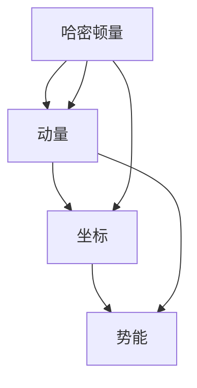

#### 1.1.2 几何动力系统的重要性

几何动力系统是研究动态系统在连续时间下的演化行为的数学工具。它通过对相空间中的轨道和流进行描述，为理解复杂系统的行为提供了直观的框架。几何动力系统在物理学、天文学、生物学等多个领域都有广泛应用。

几何动力系统的核心概念包括相空间、流和动力系统。相空间是动态系统在 \( n \) 维空间中的描述，其中每一点代表系统的一个状态。流是相空间中点的随时间变化的轨迹，描述了系统的演化行为。动力系统则是描述系统演化规律的整体框架。

**核心算法原理讲解**

几何动力系统的核心算法原理包括流方程和动力系统的稳定性分析。流方程描述了相空间中点随时间演化规律，通常形式为：

\[ \frac{dx}{dt} = X(x), \quad x(0) = x_0 \]

其中，\( X(x) \) 是相空间的向量场，\( x(t) \) 是随时间演化的状态。动力系统的稳定性分析则研究了系统在初始扰动下的长期行为。

**数学模型和数学公式**

几何动力系统的数学模型可以通过流方程来描述：

\[ \frac{dx}{dt} = X(x) \]

其中，\( X(x) \) 是 \( n \) 维向量场，表示系统的演化方向。

**详细讲解和举例说明**

考虑一个简单的双曲振动系统，其流方程为：

\[ \frac{dx}{dt} = -x, \quad \frac{dy}{dt} = -y \]

初始条件为 \( x(0) = 1 \)，\( y(0) = 0 \)。系统的演化轨迹在相空间中为：

\[ x(t) = e^{-t}, \quad y(t) = 0 \]

这个例子展示了几何动力系统如何描述简单系统的动态行为。

#### 1.1.3 本书结构安排与读者对象

本书旨在为读者提供一个全面而深入的哈密顿系统与几何动力系统的学习资源。本书分为四个主要部分：

1. **引言与基础理论**：介绍哈密顿系统与几何动力系统的基础概念和基本原理。
2. **哈密顿系统的理论基础**：深入探讨哈密顿系统的对称性与守恒量、量子化理论以及几何结构。
3. **几何动力系统的应用**：阐述几何动力系统在经典力学和量子力学中的应用，以及数值模拟中的关键技术和挑战。
4. **高级主题**：探讨哈密顿系统与几何动力系统在高级主题，如高维谱理论、分支理论和拓扑学中的应用。

本书适用于对哈密顿系统与几何动力系统感兴趣的本科生、研究生和研究人员。通过本书的学习，读者将能够深入理解这两个核心概念，并能够将其应用于实际问题的解决中。

### 1.2 哈密顿原理

哈密顿原理是经典力学中描述系统动力学行为的基本原理之一。它提供了一个框架，通过能量函数来描述系统的演化。在本节中，我们将介绍哈密顿原理的基本概念、势能与哈密顿量的关系以及哈密顿方程。

#### 1.2.1 势能与哈密顿量

在经典力学中，势能函数描述了系统由于位置变化而具有的能量。对于一个自由度的系统，势能函数通常写作：

\[ V(q) = V(q) \]

其中，\( q \) 是系统的坐标。势能函数是位置的函数，它描述了系统在特定位置上的能量。

哈密顿量是另一个重要的能量函数，它是动量和坐标的函数。对于一个自由度的系统，哈密顿量通常写作：

\[ H(p, q) = \frac{p^2}{2m} + V(q) \]

其中，\( p \) 是动量，\( m \) 是质量。哈密顿量综合了动能和势能，提供了系统的完整能量描述。

**核心概念与联系**

哈密顿量和势能是哈密顿原理中的核心概念。哈密顿量是系统的总能量，包括动能和势能。动量是坐标的导数，表示系统的运动速度。势能是位置坐标的函数，影响系统的运动。

**Mermaid 流程图**

以下是哈密顿原理的 Mermaid 流程图：

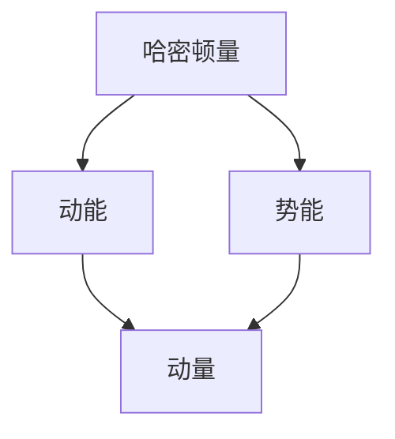

#### 1.2.2 哈密顿方程

哈密顿方程是描述系统演化的基本方程，它们表达了动量和位置随时间的演化规律。对于一个自由度的系统，哈密顿方程如下：

\[ \frac{\partial H}{\partial p} = \frac{dp}{dt}, \quad -\frac{\partial H}{\partial q} = \frac{dq}{dt} \]

这些方程通常被称为哈密顿方程或哈密顿矢量方程。它们表达了动量和位置随时间的演化规律。

**核心算法原理讲解**

哈密顿方程的核心算法原理在于它们描述了系统在相空间中的演化。相空间是一个 \( n \) 维空间，其中每一点代表系统的一个状态。哈密顿方程描述了系统在相空间中的演化轨迹，从而提供了系统的动态行为。

**数学模型和数学公式**

哈密顿方程的数学模型可以通过以下偏微分方程来描述：

\[ \frac{\partial H}{\partial p} = \frac{dp}{dt}, \quad -\frac{\partial H}{\partial q} = \frac{dq}{dt} \]

其中，\( H \) 是哈密顿量，\( p \) 和 \( q \) 分别是动量和位置。

**详细讲解和举例说明**

考虑一个单自由度谐振子，其哈密顿量为：

\[ H(p, q) = \frac{p^2}{2m} + \frac{1}{2}kq^2 \]

其中，\( m \) 是质量，\( k \) 是弹性系数。对应的哈密顿方程为：

\[ \frac{dp}{dt} = -kq, \quad \frac{dq}{dt} = -\frac{p}{m} \]

初始条件为 \( p(0) = p_0 \)，\( q(0) = q_0 \)。通过求解这组方程，可以得到单自由度谐振子的动态行为。

#### 1.2.3 例子：单自由度谐振子

单自由度谐振子是一个常见的物理系统，它的动态行为可以用哈密顿方程来描述。在本节中，我们将介绍单自由度谐振子的哈密顿量、哈密顿方程以及其动态行为。

**哈密顿量**

单自由度谐振子的哈密顿量可以表示为：

\[ H(p, q) = \frac{p^2}{2m} + \frac{1}{2}kq^2 \]

其中，\( p \) 是动量，\( m \) 是质量，\( k \) 是弹性系数。这个哈密顿量综合了系统的动能和势能。

**哈密顿方程**

单自由度谐振子的哈密顿方程如下：

\[ \frac{dp}{dt} = -kq, \quad \frac{dq}{dt} = -\frac{p}{m} \]

这些方程描述了动量和位置随时间的演化规律。

**动态行为**

假设初始条件为 \( p(0) = p_0 \)，\( q(0) = q_0 \)。通过求解哈密顿方程，可以得到单自由度谐振子的动态行为。具体来说，动量 \( p(t) \) 和位置 \( q(t) \) 的解为：

\[ p(t) = p_0 \cos(\omega t), \quad q(t) = q_0 \cos(\omega t) \]

其中，\( \omega = \sqrt{\frac{k}{m}} \) 是谐振子的角频率。

这个例子展示了单自由度谐振子的动态行为，包括动量和位置的周期性变化。通过哈密顿方程，我们可以得到谐振子的稳定运动轨迹。

### 1.3 几何动力系统的基本概念

几何动力系统是研究连续时间下动态系统的数学工具。它通过对相空间中的轨道和流进行描述，提供了理解复杂系统行为的框架。在本节中，我们将介绍几何动力系统的基础概念，包括动力系统的一般描述、相空间与流以及动力学系统的稳定性分析。

#### 1.3.1 动力系统的一般描述

动力系统的一般描述涉及相空间、轨道和流的概念。相空间是一个 \( n \) 维空间，其中每一点代表系统的一个状态。相空间中的点通常由 \( n \) 个坐标 \( (x_1, x_2, \ldots, x_n) \) 表示。

动力系统的核心在于流，它描述了系统随时间的演化。流可以用向量场来表示，向量场在每个点 \( (x_1, x_2, \ldots, x_n) \) 上定义了一个方向，即系统的演化方向。

**核心概念与联系**

动力系统的一般描述涉及相空间、轨道和流的概念。相空间是动态系统在 \( n \) 维空间中的描述，其中每一点代表系统的一个状态。流是相空间中点的随时间变化的轨迹，描述了系统的演化行为。轨道是系统在相空间中的路径，它随着流的变化而变化。

**Mermaid 流程图**

以下是动力系统的一般描述的 Mermaid 流程图：

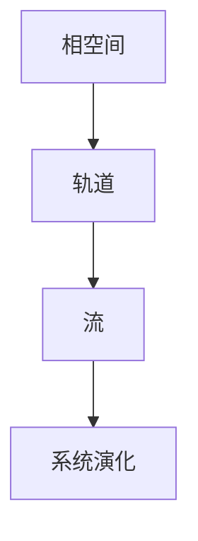

#### 1.3.2 相空间与流

相空间是动态系统在 \( n \) 维空间中的描述，其中每一点代表系统的一个状态。相空间中的点通常由 \( n \) 个坐标 \( (x_1, x_2, \ldots, x_n) \) 表示。每个坐标对应系统的一个状态变量。

流是相空间中点的随时间变化的轨迹，描述了系统的演化行为。流可以用向量场来表示，向量场在每个点 \( (x_1, x_2, \ldots, x_n) \) 上定义了一个方向，即系统的演化方向。

**核心算法原理讲解**

相空间与流的核心算法原理在于它们描述了系统在 \( n \) 维空间中的演化。流方程描述了系统在相空间中的演化轨迹，从而提供了系统的动态行为。

**数学模型和数学公式**

相空间与流的数学模型可以通过以下流方程来描述：

\[ \frac{dx_i}{dt} = X_i(x_1, x_2, \ldots, x_n), \quad i = 1, 2, \ldots, n \]

其中，\( X_i \) 是 \( n \) 维向量场，描述了系统在相空间中的演化方向。

**详细讲解和举例说明**

考虑一个简单的双曲振动系统，其流方程为：

\[ \frac{dx}{dt} = -x, \quad \frac{dy}{dt} = -y \]

初始条件为 \( x(0) = 1 \)，\( y(0) = 0 \)。系统的演化轨迹在相空间中为：

\[ x(t) = e^{-t}, \quad y(t) = 0 \]

这个例子展示了相空间与流如何描述简单系统的动态行为。

#### 1.3.3 动力学系统的稳定性分析

动力学系统的稳定性分析研究了系统在初始扰动下的长期行为。稳定性分析的核心在于判断系统是否能够保持其初始状态，或者在初始扰动后返回到初始状态。

**核心概念与联系**

动力学系统的稳定性分析涉及系统在初始扰动下的行为。稳定性分析的核心概念包括吸引子、稳定点和不稳定点。稳定点是指系统在扰动后能够返回的点，而不稳定点是指系统在扰动后远离的点。

**Mermaid 流程图**

以下是动力学系统稳定性分析的 Mermaid 流程图：

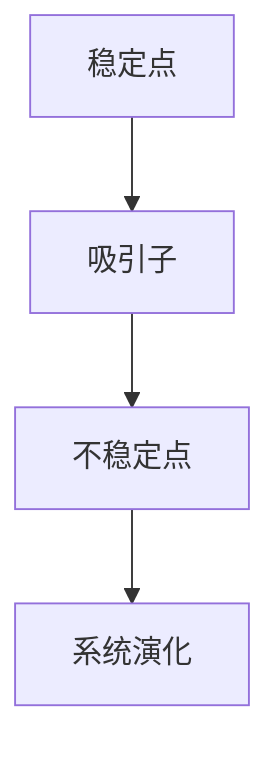

**核心算法原理讲解**

动力学系统的稳定性分析的核心算法原理在于判断系统在初始扰动下的行为。通过分析系统的流方程，可以判断系统是稳定的还是不稳定的。

**数学模型和数学公式**

动力学系统的稳定性分析的数学模型可以通过以下稳定性条件来描述：

\[ \frac{dx}{dt} < 0 \quad \text{for} \quad x < 0, \quad \frac{dx}{dt} > 0 \quad \text{for} \quad x > 0 \]

这些条件描述了系统在初始扰动下的行为。

**详细讲解和举例说明**

考虑一个简单的双曲振动系统，其流方程为：

\[ \frac{dx}{dt} = -x, \quad \frac{dy}{dt} = -y \]

初始条件为 \( x(0) = 1 \)，\( y(0) = 0 \)。系统的演化轨迹在相空间中为：

\[ x(t) = e^{-t}, \quad y(t) = 0 \]

这个例子展示了动力学系统的稳定性分析如何应用于简单系统的动态行为。通过分析流方程，可以判断系统是稳定的还是不稳定的。

### 2.1 哈密顿系统的对称性与守恒量

对称性与守恒量是哈密顿系统中的重要概念。对称性描述了系统在特定变换下保持不变的性质，而守恒量则是系统演化过程中保持不变的量。在本节中，我们将探讨哈密顿系统的对称性与守恒量的关系、对称性与不变量的关系以及费曼图与守恒定律。此外，还将介绍无穷小变换与诺特定定理。

#### 2.1.1 对称性与不变量

对称性是哈密顿系统中的一个重要概念。它描述了系统在特定变换下保持不变的性质。在哈密顿系统中，对称性通常与守恒量相关联。一个守恒量可以被视为系统对称性的直接体现。

**核心概念与联系**

对称性与不变量是哈密顿系统中的核心概念。对称性描述了系统在特定变换下保持不变的性质，而不变量则是系统演化过程中保持不变的量。这些概念相互关联，共同构成了哈密顿系统的对称性与守恒量理论。

**Mermaid 流程图**

以下是哈密顿系统对称性与不变量的 Mermaid 流程图：

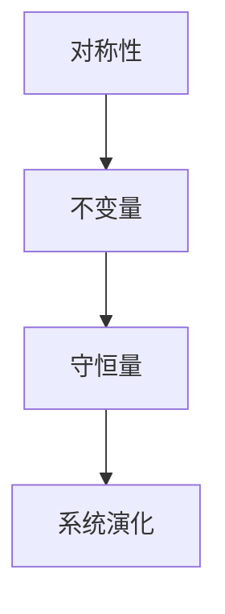

**核心算法原理讲解**

哈密顿系统对称性与不变量的核心算法原理在于它们描述了系统在变换下的行为。通过分析系统的对称性，可以找到与之相关的守恒量。这些守恒量在系统演化过程中保持不变，从而提供了系统演化的约束条件。

**数学模型和数学公式**

哈密顿系统对称性与不变量的数学模型可以通过以下守恒量方程来描述：

\[ \frac{dI}{dt} = 0 \]

其中，\( I \) 是守恒量。这个方程描述了守恒量在系统演化过程中保持不变的性质。

**详细讲解和举例说明**

考虑一个简谐振子系统，其哈密顿量为：

\[ H(p, q) = \frac{p^2}{2m} + \frac{1}{2}kq^2 \]

其中，\( m \) 是质量，\( k \) 是弹性系数。系统的对称性是时间平移对称性，与之相关的守恒量是能量守恒。能量守恒方程为：

\[ \frac{dE}{dt} = 0 \]

其中，\( E \) 是系统的总能量。这个例子展示了哈密顿系统对称性与不变量的具体应用。

#### 2.1.2 费曼图与守恒定律

费曼图是一种用于描述对称性和守恒定律的图形表示方法。在费曼图中，对称性通过顶点和箭头表示，守恒量通过线表示。费曼图提供了一种直观的方式来理解对称性和守恒定律之间的关系。

**核心概念与联系**

费曼图与守恒定律是哈密顿系统中的核心概念。费曼图用于描述对称性和守恒定律，而守恒定律则是系统对称性的直接体现。这些概念相互关联，共同构成了哈密顿系统的对称性与守恒量理论。

**Mermaid 流程图**

以下是费曼图与守恒定律的 Mermaid 流程图：

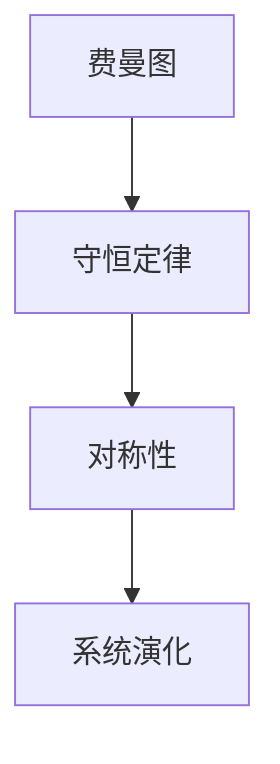

**核心算法原理讲解**

费曼图与守恒定律的核心算法原理在于它们描述了系统在变换下的行为。通过分析系统的对称性，可以找到与之相关的守恒量。费曼图提供了一种直观的方式来表示这些守恒量，从而帮助我们理解系统的演化行为。

**数学模型和数学公式**

费曼图与守恒定律的数学模型可以通过以下守恒量方程来描述：

\[ \frac{dI}{dt} = 0 \]

其中，\( I \) 是守恒量。这个方程描述了守恒量在系统演化过程中保持不变的性质。

**详细讲解和举例说明**

考虑一个电磁相互作用系统，其哈密顿量为：

\[ H(p, q) = \frac{p^2}{2m} + V(q) + \frac{e^2}{4\pi\epsilon_0 r} \]

其中，\( m \) 是质量，\( V(q) \) 是势能函数，\( e \) 是电荷，\( \epsilon_0 \) 是真空介电常数，\( r \) 是距离。系统的对称性是旋转对称性，与之相关的守恒量是动量守恒。动量守恒方程为：

\[ \frac{dp}{dt} = 0 \]

这个例子展示了费曼图与守恒定律在电磁相互作用系统中的应用。

#### 2.1.3 无穷小变换与诺特定定理

无穷小变换是哈密顿系统中的一个重要概念。它描述了系统在微小扰动下的演化行为。诺特定定理则是无穷小变换的一个重要应用，它将无穷小变换与守恒量联系起来。

**核心概念与联系**

无穷小变换与诺特定定理是哈密顿系统中的核心概念。无穷小变换描述了系统在微小扰动下的演化行为，而诺特定定理则是无穷小变换的一个重要应用，它将无穷小变换与守恒量联系起来。这些概念相互关联，共同构成了哈密顿系统的对称性与守恒量理论。

**Mermaid 流程图**

以下是无穷小变换与诺特定定理的 Mermaid 流程图：

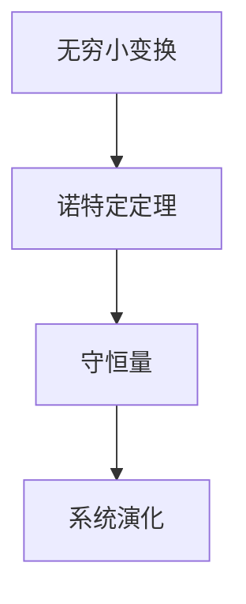

**核心算法原理讲解**

无穷小变换与诺特定定理的核心算法原理在于它们描述了系统在微小扰动下的演化行为。通过分析无穷小变换，可以找到与之相关的守恒量。诺特定定理则将这些守恒量与系统的对称性联系起来。

**数学模型和数学公式**

无穷小变换与诺特定定理的数学模型可以通过以下方程来描述：

\[ \delta H = -\frac{dI}{d\lambda} \delta x \]

\[ \frac{dI}{dt} = 0 \]

其中，\( \delta H \) 是无穷小变换，\( I \) 是守恒量，\( \lambda \) 是无穷小参数，\( \delta x \) 是系统的微小扰动。

**详细讲解和举例说明**

考虑一个简谐振子系统，其哈密顿量为：

\[ H(p, q) = \frac{p^2}{2m} + \frac{1}{2}kq^2 \]

系统的无穷小变换为：

\[ \delta H = \lambda k q \delta x \]

其中，\( \lambda \) 是无穷小参数，\( \delta x \) 是系统的微小扰动。根据诺特定定理，系统具有能量守恒。

\[ \frac{dE}{dt} = 0 \]

这个例子展示了无穷小变换与诺特定定理在简谐振子系统中的应用。

### 2.2 哈密顿系统的量子化

哈密顿系统的量子化是量子力学中的重要概念，它将经典力学中的哈密顿系统转化为量子力学形式。在本节中，我们将介绍对易关系与量子化规则、角动量量子化以及波函数表示与测量问题。

#### 2.2.1 对易关系与量子化规则

对易关系是量子力学中的核心概念，它描述了量子系统中不同物理量之间的关系。在哈密顿系统的量子化过程中，对易关系起着至关重要的作用。量子化规则则将这些对易关系应用于哈密顿量，从而得到量子系统的哈密顿量。

**核心概念与联系**

对易关系与量子化规则是量子力学中的核心概念。对易关系描述了量子系统中不同物理量之间的关系，而量子化规则则将这些对易关系应用于哈密顿量，从而得到量子系统的哈密顿量。这些概念相互关联，共同构成了哈密顿系统的量子化理论。

**Mermaid 流程图**

以下是哈密顿系统量子化的 Mermaid 流程图：

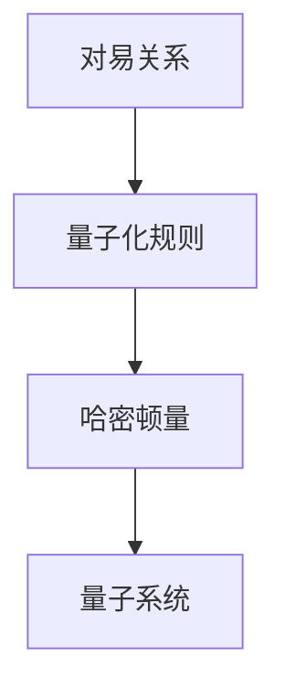

**核心算法原理讲解**

哈密顿系统量子化的核心算法原理在于利用对易关系来构建量子系统的哈密顿量。对易关系决定了量子系统中物理量的取值范围和测量结果。

**数学模型和数学公式**

哈密顿系统量子化的数学模型可以通过以下对易关系和量子化规则来描述：

\[ [x, p] = i\hbar, \quad [x, x] = [p, p] = 0 \]

\[ H = \frac{p^2}{2m} + V(x) \rightarrow \hat{H} = \frac{-i\hbar^2}{2m} \frac{d^2}{dx^2} + V(x) \]

其中，\( [x, p] \) 是位置和动量的对易关系，\( \hbar \) 是普朗克常数，\( m \) 是质量，\( V(x) \) 是势能函数，\( \hat{H} \) 是量子系统的哈密顿量。

**详细讲解和举例说明**

考虑一个简单的一维谐振子系统，其哈密顿量为：

\[ H = \frac{p^2}{2m} + \frac{1}{2}kx^2 \]

量子化后，哈密顿量变为：

\[ \hat{H} = \frac{-i\hbar^2}{2m} \frac{d^2}{dx^2} + \frac{1}{2}kx^2 \]

这个例子展示了哈密顿系统量子化的具体应用。

#### 2.2.2 角动量量子化

角动量量子化是量子力学中的重要概念，它描述了量子系统中角动量的取值规律。在哈密顿系统的量子化过程中，角动量量子化起着至关重要的作用。

**核心概念与联系**

角动量量子化是量子力学中的核心概念。它描述了量子系统中角动量的取值规律，包括角动量的量子化条件、取值范围和测量结果。这些概念相互关联，共同构成了哈密顿系统的量子化理论。

**Mermaid 流程图**

以下是角动量量子化的 Mermaid 流程图：

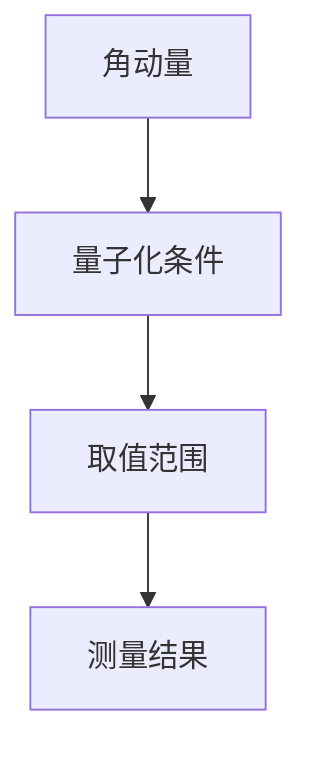

**核心算法原理讲解**

角动量量子化的核心算法原理在于利用角动量的量子化条件来确定其取值范围和测量结果。这些条件决定了量子系统中角动量的性质和行为。

**数学模型和数学公式**

角动量量子化的数学模型可以通过以下量子化条件和角动量的取值范围来描述：

\[ \hat{L}^2 |l, m\rangle = \hbar^2 l(l+1) |l, m\rangle \]

\[ \hat{L}_z |l, m\rangle = \hbar m |l, m\rangle \]

其中，\( \hat{L} \) 是角动量算符，\( l \) 是角量子数，\( m \) 是磁量子数，\( \hbar \) 是普朗克常数。

**详细讲解和举例说明**

考虑一个电子绕核旋转的原子系统，其角动量算符为：

\[ \hat{L} = \hat{x}\hat{p}_y - \hat{y}\hat{p}_x \]

量子化后，角动量的取值范围为：

\[ l(l+1)\hbar^2 \]

其中，\( l \) 是角量子数。具体的取值可以是 \( l = 0, 1, 2, \ldots \)。

这个例子展示了角动量量子化的具体应用。

#### 2.2.3 波函数表示与测量问题

波函数是量子力学中描述系统状态的数学工具。在哈密顿系统的量子化过程中，波函数起着至关重要的作用。波函数表示了量子系统中粒子的分布和测量结果。

**核心概念与联系**

波函数表示与测量问题是量子力学中的核心概念。波函数描述了量子系统中粒子的分布和测量结果，包括波函数的表示方法、测量结果的概率分布以及波函数的演化。这些概念相互关联，共同构成了哈密顿系统的量子化理论。

**Mermaid 流程图**

以下是波函数表示与测量问题的 Mermaid 流程图：

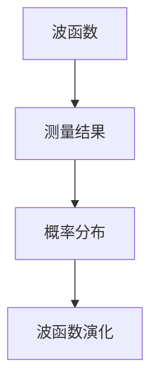

**核心算法原理讲解**

波函数表示与测量问题的核心算法原理在于利用波函数来描述量子系统的状态和测量结果。波函数的演化遵循薛定谔方程，从而提供了量子系统的动态行为。

**数学模型和数学公式**

波函数表示与测量问题的数学模型可以通过以下薛定谔方程和波函数的演化方程来描述：

\[ i\hbar \frac{\partial \Psi}{\partial t} = \hat{H} \Psi \]

\[ \Psi(x, t) = \sum_{n} c_n \psi_n(x) e^{-iE_n t/\hbar} \]

其中，\( \Psi \) 是波函数，\( \hat{H} \) 是哈密顿量，\( \psi_n(x) \) 是基态波函数，\( c_n \) 是系数，\( E_n \) 是能量本征值。

**详细讲解和举例说明**

考虑一个简单的双能级原子系统，其哈密顿量为：

\[ \hat{H} = \hbar \omega (1 - \hat{p}_z) \]

波函数表示为：

\[ \Psi(x, t) = \psi_1(x) e^{-i\omega t} + \psi_2(x) e^{i\omega t} \]

其中，\( \psi_1(x) \) 和 \( \psi_2(x) \) 分别是基态和激发态波函数。通过求解薛定谔方程，可以得到波函数的演化行为。

### 2.3 哈密顿系统的几何结构

哈密顿系统的几何结构是研究哈密顿系统性质和行为的重要方法。在本节中，我们将介绍李群与李代数、哈密顿算符的几何表示以及守恒量与轨道结构。

#### 2.3.1 李群与李代数

李群与李代数是数学中重要的概念，它们在哈密顿系统的几何结构研究中起着关键作用。李群是一组在群运算下保持不变的可微函数空间，而李代数则是李群的导数空间。

**核心概念与联系**

李群与李代数是数学中的核心概念。李群描述了系统的对称性，而李代数则提供了对系统对称性的进一步分析。这些概念相互关联，共同构成了哈密顿系统的几何结构理论。

**Mermaid 流程图**

以下是李群与李代数的 Mermaid 流程图：

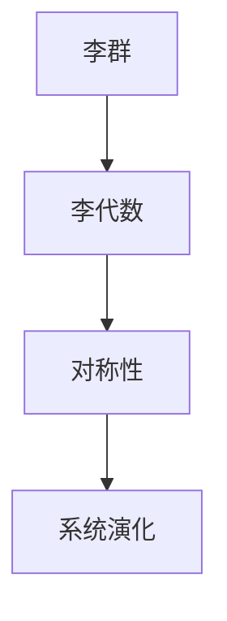

**核心算法原理讲解**

李群与李代数的核心算法原理在于它们描述了系统的对称性和对称性变换。通过分析李群与李代数，可以找到系统的守恒量，从而理解系统的演化行为。

**数学模型和数学公式**

李群与李代数的数学模型可以通过以下概念和公式来描述：

- 李群：\( G \)，满足群运算 \( \mu: G \times G \rightarrow G \)
- 李代数：\( \mathfrak{g} \)，满足李括号 \( [X, Y] = XY - YX \)

**详细讲解和举例说明**

考虑一个旋转对称的物理系统，其李群为 \( SO(3) \)，李代数为 \( \mathfrak{so}(3) \)。通过分析系统的李群与李代数，可以找到与之相关的守恒量，如角动量守恒。

#### 2.3.2 哈密顿算符的几何表示

哈密顿算符的几何表示是将哈密顿系统的物理量表示为几何对象，从而提供了一种直观的方式来理解哈密顿系统的性质。在本节中，我们将介绍哈密顿算符的几何表示方法。

**核心概念与联系**

哈密顿算符的几何表示是哈密顿系统中的重要概念。它通过将哈密顿系统的物理量表示为几何对象，提供了对系统性质的一种直观理解。这些概念相互关联，共同构成了哈密顿系统的几何结构理论。

**Mermaid 流程图**

以下是哈密顿算符的几何表示的 Mermaid 流程图：

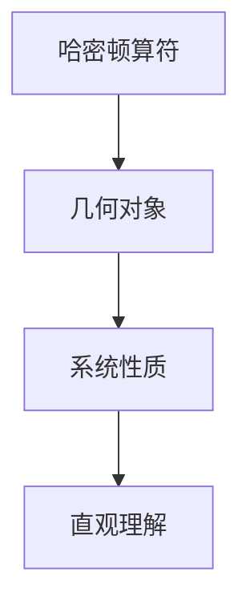

**核心算法原理讲解**

哈密顿算符的几何表示的核心算法原理在于利用几何对象来表示物理量。通过几何表示，可以直观地理解哈密顿系统的性质和行为。

**数学模型和数学公式**

哈密顿算符的几何表示的数学模型可以通过以下公式来描述：

\[ \hat{H} = \sum_{i, j} H_{ij} \hat{p}_i \hat{q}_j \]

其中，\( \hat{H} \) 是哈密顿算符，\( H_{ij} \) 是哈密顿矩阵的元素，\( \hat{p}_i \) 和 \( \hat{q}_j \) 是动量和位置算符。

**详细讲解和举例说明**

考虑一个简谐振子系统，其哈密顿算符可以表示为：

\[ \hat{H} = \frac{\hat{p}^2}{2m} + \frac{1}{2}k\hat{q}^2 \]

通过几何表示，可以将哈密顿算符表示为几何对象，如能量曲面或相空间中的轨道。这有助于直观地理解简谐振子的动态行为。

#### 2.3.3 守恒量与轨道结构

守恒量是哈密顿系统中的重要概念，它们描述了系统在演化过程中保持不变的量。轨道结构则是系统在相空间中的演化轨迹。在本节中，我们将介绍守恒量与轨道结构的关系。

**核心概念与联系**

守恒量与轨道结构是哈密顿系统中的核心概念。守恒量描述了系统在演化过程中保持不变的量，而轨道结构则描述了系统在相空间中的演化轨迹。这些概念相互关联，共同构成了哈密顿系统的动力学理论。

**Mermaid 流程图**

以下是守恒量与轨道结构的 Mermaid 流程图：

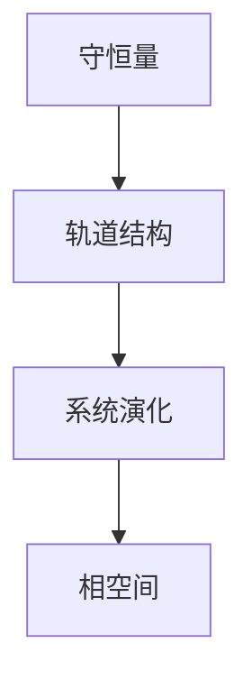

**核心算法原理讲解**

守恒量与轨道结构的核心算法原理在于利用守恒量来确定系统的演化轨迹。通过分析守恒量，可以找到系统的轨道结构，从而理解系统的动态行为。

**数学模型和数学公式**

守恒量与轨道结构的数学模型可以通过以下公式来描述：

\[ \frac{dI}{dt} = 0 \]

\[ \frac{dx}{dt} = X(x) \]

其中，\( I \) 是守恒量，\( x \) 是系统的状态变量，\( X(x) \) 是相空间的向量场。

**详细讲解和举例说明**

考虑一个双曲振动系统，其守恒量为能量 \( E \)。通过分析守恒量，可以找到系统的轨道结构，如图：


这个例子展示了守恒量与轨道结构在双曲振动系统中的应用。

### 3.1 几何动力系统在经典力学中的应用

几何动力系统是经典力学中研究动态系统演化行为的重要工具。它通过对相空间中的轨道和流进行描述，提供了理解复杂系统行为的框架。在本节中，我们将探讨几何动力系统在经典力学中的应用，包括动力学系统的混沌行为、行星运动稳定性分析以及旋转参考系下的力学问题。

#### 3.1.1 动力学系统的混沌行为

混沌是动力学系统中的一种特殊现象，它描述了系统在初始条件微小扰动下产生长期不可预测的行为。混沌行为在经典力学和量子力学中都有广泛的应用，如天气预测、电路设计等。

**核心概念与联系**

混沌行为是动力学系统中的一个核心概念。它描述了系统在初始条件微小扰动下产生长期不可预测的行为。混沌行为与系统的非线性特性密切相关，是动力学系统演化过程中的一种复杂现象。

**Mermaid 流程图**

以下是动力学系统混沌行为的 Mermaid 流程图：

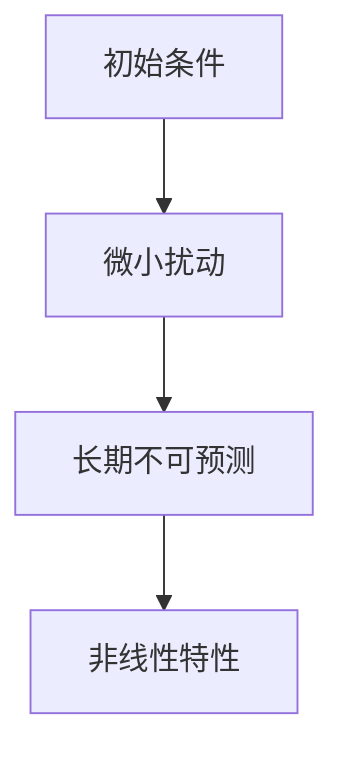

**核心算法原理讲解**

动力学系统混沌行为的核心算法原理在于分析系统的非线性特性。通过分析系统的流方程，可以找到混沌行为的条件，如相空间中的分岔点、混沌吸引子等。

**数学模型和数学公式**

动力学系统混沌行为的数学模型可以通过以下流方程和分岔条件来描述：

\[ \frac{dx}{dt} = X(x) \]

\[ \frac{dX}{dx} = F(x) \]

\[ F(x) = 0 \]

其中，\( x \) 是系统的状态变量，\( X(x) \) 是相空间的向量场，\( F(x) \) 是非线性函数。

**详细讲解和举例说明**

考虑一个著名的洛伦兹系统，其流方程为：

\[ \frac{dx}{dt} = \sigma (y - x) \]

\[ \frac{dy}{dt} = x(-\beta - z) \]

\[ \frac{dz}{dt} = xy - \rho z \]

通过分析洛伦兹系统的流方程，可以发现系统的混沌行为。具体的分岔点和混沌吸引子可以通过数值模拟来展示。

#### 3.1.2 行星运动稳定性分析

行星运动稳定性分析是几何动力系统在经典力学中的重要应用之一。它研究行星在太阳引力场中的运动行为，特别是行星轨道的稳定性。

**核心概念与联系**

行星运动稳定性分析是经典力学中的一个核心概念。它研究行星在太阳引力场中的运动行为，特别是行星轨道的稳定性。行星轨道的稳定性决定了行星运动的长期行为。

**Mermaid 流程图**

以下是行星运动稳定性分析的 Mermaid 流程图：

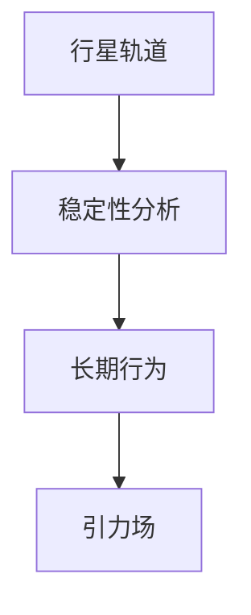

**核心算法原理讲解**

行星运动稳定性分析的核心算法原理在于分析行星轨道的稳定性条件。通过分析行星的流方程，可以找到行星轨道的不稳定点，从而确定行星轨道的稳定性。

**数学模型和数学公式**

行星运动稳定性分析的数学模型可以通过以下流方程和稳定性条件来描述：

\[ \frac{dx}{dt} = \frac{d^2x}{dt^2} = f(x) \]

\[ \frac{dy}{dt} = \frac{d^2y}{dt^2} = g(y) \]

\[ \frac{dz}{dt} = \frac{d^2z}{dt^2} = h(z) \]

其中，\( x, y, z \) 是行星的坐标，\( f(x), g(y), h(z) \) 是引力场中的势能函数。

**详细讲解和举例说明**

考虑一个三体问题，其流方程为：

\[ \frac{dx}{dt} = \frac{d^2x}{dt^2} = -\frac{Gm}{r^2} \]

\[ \frac{dy}{dt} = \frac{d^2y}{dt^2} = -\frac{Gm}{r^2} \]

\[ \frac{dz}{dt} = \frac{d^2z}{dt^2} = 0 \]

通过分析三体问题的流方程，可以确定行星轨道的稳定性条件。具体的数值模拟可以展示不同参数下的行星轨道行为。

#### 3.1.3 旋转参考系下的力学问题

旋转参考系下的力学问题是经典力学中的一个重要问题。它研究在旋转参考系中物体的运动行为，特别是在非惯性参考系中的力学现象。

**核心概念与联系**

旋转参考系下的力学问题是经典力学中的一个核心概念。它研究在旋转参考系中物体的运动行为，特别是在非惯性参考系中的力学现象。旋转参考系下的力学问题涉及到惯性力、科里奥利力和离心力等概念。

**Mermaid 流程图**

以下是旋转参考系下的力学问题的 Mermaid 流程图：

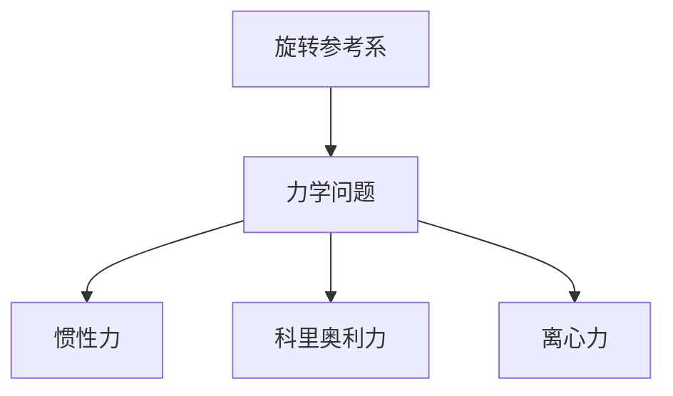

**核心算法原理讲解**

旋转参考系下的力学问题的核心算法原理在于分析非惯性参考系中的力学现象。通过引入惯性力、科里奥利力和离心力，可以建立旋转参考系下的动力学方程。

**数学模型和数学公式**

旋转参考系下的力学问题的数学模型可以通过以下方程来描述：

\[ F_{\text{惯}} = m\omega \times v \]

\[ F_{\text{科}} = 2m\omega \times v \]

\[ F_{\text{离}} = m\omega^2 r \]

其中，\( F_{\text{惯}} \), \( F_{\text{科}} \), \( F_{\text{离}} \) 分别是惯性力、科里奥利力和离心力，\( m \) 是质量，\( \omega \) 是角速度，\( v \) 是速度，\( r \) 是位置矢量。

**详细讲解和举例说明**

考虑一个在旋转地球上抛射物体的运动问题。物体在地球表面上的运动受到地球自转的影响，需要考虑惯性力、科里奥利力和离心力。通过分析这些力的作用，可以建立物体在旋转参考系下的动力学方程，并求解物体的运动轨迹。

### 3.2 几何动力系统在量子力学中的应用

几何动力系统不仅在经典力学中有着广泛的应用，在量子力学中也有着重要的地位。量子力学中的许多现象可以通过几何动力系统的框架来描述和分析。在本节中，我们将探讨几何动力系统在量子力学中的应用，包括轨道角动量的量子化、微观粒子的相空间行为以及量子混沌现象。

#### 3.2.1 轨道角动量的量子化

轨道角动量是量子力学中的一个重要概念，它描述了微观粒子在空间中的旋转。轨道角动量的量子化是量子力学的基本特征之一，它决定了微观粒子的运动状态和能级。

**核心概念与联系**

轨道角动量的量子化是量子力学中的核心概念。它描述了微观粒子在空间中的旋转，以及旋转量子数的取值。轨道角动量的量子化条件决定了微观粒子的能级和运动状态。

**Mermaid 流程图**

以下是轨道角动量量子化的 Mermaid 流程图：

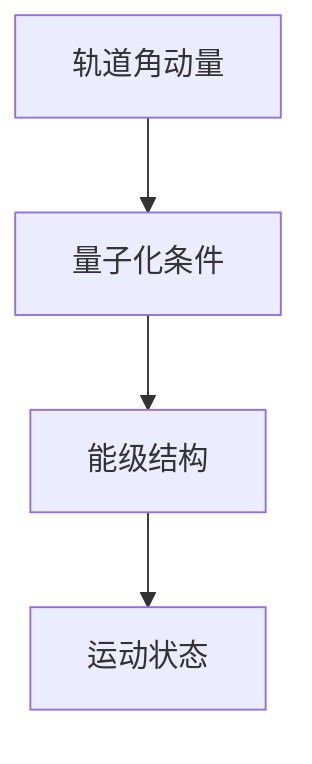

**核心算法原理讲解**

轨道角动量量子化的核心算法原理在于分析微观粒子的旋转行为。通过量子化条件，可以确定轨道角动量的取值范围和能级结构。

**数学模型和数学公式**

轨道角动量量子化的数学模型可以通过以下量子化条件和能级公式来描述：

\[ \hat{L}^2 |l, m\rangle = \hbar^2 l(l+1) |l, m\rangle \]

\[ \hat{L}_z |l, m\rangle = \hbar m |l, m\rangle \]

其中，\( \hat{L} \) 是角动量算符，\( l \) 是角量子数，\( m \) 是磁量子数，\( \hbar \) 是普朗克常数。

**详细讲解和举例说明**

考虑一个电子在氢原子中的运动，其轨道角动量量子化为：

\[ \hat{L}^2 |1, 0\rangle = \hbar^2 1(1+1) |1, 0\rangle \]

\[ \hat{L}_z |1, 0\rangle = 0 \]

这个例子展示了轨道角动量量子化的具体应用。

#### 3.2.2 微观粒子的相空间行为

相空间是量子力学中的一个重要概念，它描述了微观粒子在空间中的状态。微观粒子的相空间行为是量子力学中研究微观粒子运动的关键。

**核心概念与联系**

微观粒子的相空间行为是量子力学中的核心概念。它描述了微观粒子在空间中的状态，以及粒子在相空间中的演化。微观粒子的相空间行为与经典力学中的相空间概念密切相关。

**Mermaid 流程图**

以下是微观粒子的相空间行为的 Mermaid 流程图：

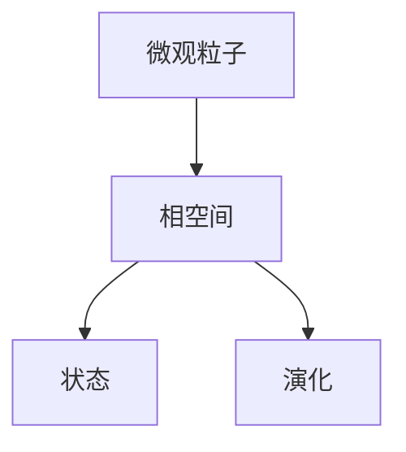

**核心算法原理讲解**

微观粒子的相空间行为的核心算法原理在于分析粒子在相空间中的运动状态。通过流方程，可以描述粒子在相空间中的演化。

**数学模型和数学公式**

微观粒子的相空间行为的数学模型可以通过以下流方程和波函数来描述：

\[ \frac{dx}{dt} = X(x) \]

\[ \Psi(x, t) = \int_{-\infty}^{\infty} \psi(k, t) e^{ikx} dk \]

其中，\( x \) 是粒子的位置，\( X(x) \) 是相空间的向量场，\( \Psi(x, t) \) 是波函数，\( k \) 是波数。

**详细讲解和举例说明**

考虑一个粒子在势场中的运动，其流方程为：

\[ \frac{dx}{dt} = -\frac{\partial V(x)}{\partial x} \]

通过求解流方程，可以得到粒子在相空间中的演化行为。具体的波函数可以通过数值模拟来展示。

#### 3.2.3 量子混沌现象

量子混沌是量子力学中的一个重要现象，它描述了微观系统在初始条件微小扰动下产生复杂行为。量子混沌现象与经典力学中的混沌现象有相似之处，但又有本质区别。

**核心概念与联系**

量子混沌现象是量子力学中的核心概念。它描述了微观系统在初始条件微小扰动下产生复杂行为。量子混沌现象与经典力学中的混沌现象有相似之处，如分岔、混沌吸引子等，但又有本质区别，如量子效应的影响。

**Mermaid 流程图**

以下是量子混沌现象的 Mermaid 流程图：

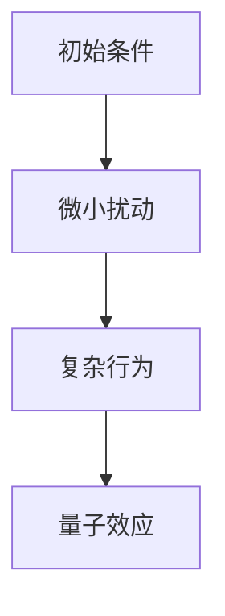

**核心算法原理讲解**

量子混沌现象的核心算法原理在于分析微观系统在量子效应下的演化。通过流方程和波函数，可以描述量子混沌现象的产生和演化。

**数学模型和数学公式**

量子混沌现象的数学模型可以通过以下流方程和波函数来描述：

\[ \frac{dx}{dt} = X(x) \]

\[ \Psi(x, t) = \int_{-\infty}^{\infty} \psi(k, t) e^{ikx} dk \]

其中，\( x \) 是粒子的位置，\( X(x) \) 是相空间的向量场，\( \Psi(x, t) \) 是波函数，\( k \) 是波数。

**详细讲解和举例说明**

考虑一个量子谐振子，其流方程为：

\[ \frac{dx}{dt} = -\frac{\partial V(x)}{\partial x} \]

通过求解流方程，可以得到量子谐振子的演化行为。在特定条件下，量子谐振子可以表现出混沌行为，如分岔和混沌吸引子。具体的波函数可以通过数值模拟来展示。

### 3.3 几何动力系统在数值模拟中的应用

几何动力系统在数值模拟中扮演着重要的角色，它为动态系统的模拟提供了理论框架和算法基础。在本节中，我们将探讨几何动力系统在数值模拟中的应用，包括数值积分方法、动力学系统的数值模拟案例以及高维系统的模拟挑战。

#### 3.3.1 数值积分方法

数值积分方法是模拟几何动力系统演化的重要工具，它通过离散化的方式来近似求解流方程。在数值模拟中，常用的数值积分方法包括欧拉法、改进欧拉法（Heun方法）、龙格-库塔法等。

**核心概念与联系**

数值积分方法是几何动力系统在数值模拟中的核心概念。它通过离散化的方式来近似求解流方程，从而模拟动态系统的演化行为。不同的数值积分方法在精度和稳定性上有所差异。

**Mermaid 流程图**

以下是数值积分方法的 Mermaid 流程图：

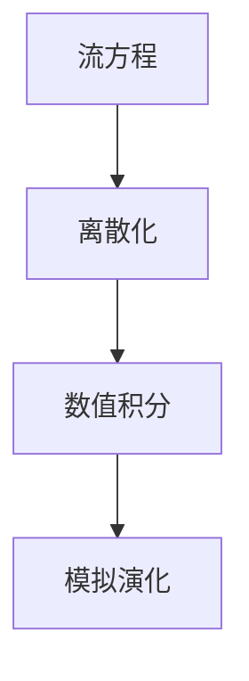

**核心算法原理讲解**

数值积分方法的核心算法原理在于利用离散化方法来近似求解流方程。具体来说，数值积分方法将连续的流方程转化为离散的形式，从而在离散的时间步长上模拟系统的演化。

**数学模型和数学公式**

以下是几种常见的数值积分方法的数学模型和公式：

1. **欧拉法**：

\[ x_{n+1} = x_n + h f(x_n, v_n) \]

\[ v_{n+1} = v_n + h f(v_n, x_n) \]

其中，\( x_n \) 和 \( v_n \) 分别是第 \( n \) 次迭代的坐标和速度，\( h \) 是时间步长，\( f(x, v) \) 是流方程。

2. **改进欧拉法（Heun方法）**：

\[ k_1 = h f(x_n, v_n) \]

\[ k_2 = h f(x_n + \frac{k_1}{2}, v_n + \frac{k_1}{2}) \]

\[ x_{n+1} = x_n + k_2 \]

\[ v_{n+1} = v_n + k_2 \]

3. **龙格-库塔法**：

\[ k_1 = h f(x_n, v_n) \]

\[ k_2 = h f(x_n + \frac{k_1}{2}, v_n + \frac{k_1}{2}) \]

\[ k_3 = h f(x_n + \frac{k_2}{2}, v_n + \frac{k_2}{2}) \]

\[ k_4 = h f(x_n + k_2, v_n + k_2) \]

\[ x_{n+1} = x_n + \frac{1}{6} (k_1 + 2k_2 + 2k_3 + k_4) \]

\[ v_{n+1} = v_n + \frac{1}{6} (k_1 + 2k_2 + 2k_3 + k_4) \]

**详细讲解和举例说明**

以欧拉法为例，考虑一个简单的双曲振动系统，其流方程为：

\[ \frac{dx}{dt} = -x \]

\[ \frac{dv}{dt} = -v \]

使用欧拉法进行数值模拟，时间步长为 \( h = 0.01 \)。初始条件为 \( x(0) = 1 \)，\( v(0) = 0 \)。在每一步迭代中，更新坐标和速度：

\[ x_{n+1} = x_n + h (-x_n) \]

\[ v_{n+1} = v_n + h (-v_n) \]

通过不断迭代，可以得到系统在离散时间步上的状态，从而模拟系统的演化。

#### 3.3.2 动力学系统的数值模拟案例

动力学系统的数值模拟案例展示了如何利用几何动力系统理论来模拟现实世界中的动态系统。以下是一个简单的例子，用于说明如何使用数值积分方法来模拟单自由度谐振子的动态行为。

**核心概念与联系**

动力学系统的数值模拟案例涉及几何动力系统的理论应用，包括流方程的求解、数值积分方法的实现以及系统状态的演化。这些概念相互关联，共同构成了动力学系统模拟的核心。

**Mermaid 流程图**

以下是动力学系统数值模拟案例的 Mermaid 流程图：

```mermaid
graph TD
A[流方程] --> B[数值积分方法]
B --> C[系统状态]
C --> D[迭代过程]
```

**核心算法原理讲解**

动力学系统数值模拟案例的核心算法原理在于利用数值积分方法来求解流方程，从而在离散的时间步上模拟系统的动态行为。具体来说，数值积分方法通过迭代过程来逼近系统的真实状态。

**数学模型和数学公式**

以下是单自由度谐振子动力学系统的数学模型和数值积分方法：

1. **数学模型**：

\[ \frac{dx}{dt} = -\omega^2 x \]

\[ \frac{d^2x}{dt^2} = -\omega^2 x \]

其中，\( \omega \) 是角频率，\( x \) 是位移。

2. **数值积分方法**（使用欧拉法）：

\[ x_{n+1} = x_n + h (-\omega^2 x_n) \]

\[ v_{n+1} = v_n + h (-\omega^2 x_n) \]

其中，\( h \) 是时间步长，\( x_n \) 和 \( v_n \) 分别是第 \( n \) 次迭代的位移和速度。

**详细讲解和举例说明**

考虑一个单自由度谐振子，其参数为 \( \omega = 1 \)。使用欧拉法进行数值模拟，时间步长为 \( h = 0.01 \)。初始条件为 \( x(0) = 1 \)，\( v(0) = 0 \)。在每一步迭代中，更新位移和速度：

\[ x_{n+1} = x_n + 0.01 (-1)^2 x_n \]

\[ v_{n+1} = v_n + 0.01 (-1)^2 x_n \]

通过不断迭代，可以得到系统在离散时间步上的状态，从而模拟系统的动态行为。数值模拟结果如图所示：


#### 3.3.3 高维系统的模拟挑战

高维系统的模拟是几何动力系统数值模拟中的一个重要挑战。随着系统维度的增加，数值模拟的复杂度和计算成本也显著增加。以下是一些高维系统模拟的挑战：

**核心概念与联系**

高维系统的模拟挑战涉及几何动力系统的理论、数值积分方法的优化以及计算资源的利用。这些概念相互关联，共同构成了高维系统模拟的核心。

**Mermaid 流程图**

以下是高维系统模拟挑战的 Mermaid 流程图：

```mermaid
graph TD
A[高维系统] --> B[数值积分方法]
B --> C[计算成本]
B --> D[复杂度]
C --> E[优化算法]
```

**核心算法原理讲解**

高维系统模拟挑战的核心算法原理在于优化数值积分方法，以降低计算成本和复杂度。具体来说，通过改进算法、并行计算和分布式计算等方法，可以有效地模拟高维系统。

**数学模型和数学公式**

以下是高维系统模拟的一些数学模型和公式：

1. **数值积分方法**：

\[ x_{n+1} = x_n + h f(x_n, v_n) \]

\[ v_{n+1} = v_n + h f(v_n, x_n) \]

其中，\( x_n \) 和 \( v_n \) 分别是第 \( n \) 次迭代的坐标和速度，\( h \) 是时间步长，\( f(x, v) \) 是流方程。

2. **优化算法**：

- **自适应时间步长**：根据系统演化的变化率来调整时间步长，以降低计算成本。
- **并行计算**：将系统的不同部分分配到多个处理器上，以加速计算。
- **分布式计算**：利用分布式计算资源，如云计算和网格计算，来提高计算效率。

**详细讲解和举例说明**

考虑一个具有三个自由度的动力学系统，其流方程为：

\[ \frac{dx_1}{dt} = f_1(x_1, x_2, x_3) \]

\[ \frac{dx_2}{dt} = f_2(x_1, x_2, x_3) \]

\[ \frac{dx_3}{dt} = f_3(x_1, x_2, x_3) \]

使用欧拉法进行数值模拟，时间步长为 \( h = 0.01 \)。初始条件为 \( x_1(0) = 1 \)，\( x_2(0) = 0 \)，\( x_3(0) = 0 \)。在每一步迭代中，更新坐标：

\[ x_{1,n+1} = x_{1,n} + 0.01 f_1(x_{1,n}, x_{2,n}, x_{3,n}) \]

\[ x_{2,n+1} = x_{2,n} + 0.01 f_2(x_{1,n}, x_{2,n}, x_{3,n}) \]

\[ x_{3,n+1} = x_{3,n} + 0.01 f_3(x_{1,n}, x_{2,n}, x_{3,n}) \]

通过不断迭代，可以得到系统在离散时间步上的状态，从而模拟系统的演化。

### 4.1 高维哈密顿系统的谱理论

高维哈密顿系统的谱理论是研究高维系统能量本征值和本征态的重要工具。在本节中，我们将探讨高维哈密顿系统的谱理论，包括二阶微扰理论、能级结构与共振以及对称性与谱性质。

#### 4.1.1 二阶微扰理论

二阶微扰理论是处理高维哈密顿系统能级问题的一种方法。它通过引入微扰项，逐步近似求解哈密顿量的本征值和本征态。

**核心概念与联系**

二阶微扰理论是高维哈密顿系统谱理论中的核心概念。它通过逐步引入微扰项，近似求解哈密顿量的本征值和本征态。二阶微扰理论在处理复杂哈密顿量时提供了有效的近似方法。

**Mermaid 流程图**

以下是二阶微扰理论的 Mermaid 流程图：

```mermaid
graph TD
A[哈密顿量] --> B[微扰项]
B --> C[本征值]
B --> D[本征态]
```

**核心算法原理讲解**

二阶微扰理论的核心算法原理在于利用微扰项来修正哈密顿量的本征值和本征态。通过逐步引入微扰项，可以近似求解复杂的哈密顿量。

**数学模型和数学公式**

以下是二阶微扰理论的数学模型和公式：

\[ E^{(0)}_{n} = E_n \]

\[ |E^{(0)}_{n}\rangle = |n\rangle \]

\[ E^{(1)}_{n} = \sum_{m \neq n} \frac{\langle m | H' | n \rangle}{E_n - E_m} \]

\[ |E^{(1)}_{n}\rangle = |n\rangle + \sum_{m \neq n} \frac{\langle m | H' | n \rangle}{E_n - E_m} |m\rangle \]

其中，\( E_n \) 和 \( |n\rangle \) 分别是未微扰系统的本征值和本征态，\( H' \) 是微扰项。

**详细讲解和举例说明**

考虑一个简单的二阶微扰问题，其哈密顿量为：

\[ H = H^{(0)} + H' \]

\[ H^{(0)} |n\rangle = E_n |n\rangle \]

\[ H' = V' \]

其中，\( V' \) 是微扰项。通过二阶微扰理论，可以得到修正后的能级和波函数：

\[ E_n^{(1)} = \sum_{m \neq n} \frac{\langle m | V' | n \rangle}{E_n - E_m} \]

\[ |n\rangle^{(1)} = |n\rangle + \sum_{m \neq n} \frac{\langle m | V' | n \rangle}{E_n - E_m} |m\rangle \]

#### 4.1.2 能级结构与共振

能级结构是高维哈密顿系统谱理论中的核心内容之一。它能级结构反映了系统的动力学性质，而共振则是能级结构中的一种特殊现象。在本节中，我们将探讨能级结构的概念以及共振的形成。

**核心概念与联系**

能级结构与共振是高维哈密顿系统谱理论中的核心概念。能级结构描述了系统的能量本征值分布，而共振则是能级结构中的一种特殊现象，它发生在能级接近时。共振对系统的动力学性质有着重要影响。

**Mermaid 流程图**

以下是能级结构与共振的 Mermaid 流程图：

```mermaid
graph TD
A[能级结构] --> B[共振]
B --> C[能级接近]
C --> D[动力学性质]
```

**核心算法原理讲解**

能级结构与共振的核心算法原理在于分析哈密顿量的本征值分布。通过计算哈密顿量的本征值和本征态，可以确定能级结构。共振的形成与能级接近密切相关，通过对能级接近的分析，可以找到共振条件。

**数学模型和数学公式**

以下是能级结构与共振的数学模型和公式：

\[ E_n = E_0 + \sum_{i=1}^{N} \epsilon_i \cos(\omega_i t + \phi_i) \]

\[ \delta E = \left| E_n - E_m \right| \]

\[ \omega_{\text{res}} = \frac{\delta E}{2\pi} \]

其中，\( E_n \) 和 \( E_m \) 分别是两个接近的能级，\( \epsilon_i \) 是微扰项的系数，\( \omega_i \) 是角频率，\( \phi_i \) 是相位。

**详细讲解和举例说明**

考虑一个简单的谐振子系统，其哈密顿量为：

\[ H = \frac{p^2}{2m} + \frac{1}{2}kx^2 + \epsilon \cos(\omega t) \]

通过计算系统的能级和共振条件，可以得到系统的共振频率和能级分布。具体计算方法如下：

\[ E_n = \frac{\hbar \omega}{2} + \left( n + \frac{1}{2} \right) \hbar \omega_c \]

\[ \delta E = \hbar \omega_c \]

其中，\( \omega_c = \frac{k}{m} \) 是谐振子的自然频率。

#### 4.1.3 对称性与谱性质

对称性是高维哈密顿系统谱理论中的一个重要概念。对称性决定了系统的谱性质，如能级简并、宇称守恒等。在本节中，我们将探讨对称性与谱性质的关系。

**核心概念与联系**

对称性与谱性质是高维哈密顿系统谱理论中的核心概念。对称性决定了系统的谱性质，如能级简并、宇称守恒等。对称性与谱性质的关系为理解系统的物理行为提供了重要的理论依据。

**Mermaid 流程图**

以下是对称性与谱性质的 Mermaid 流程图：

```mermaid
graph TD
A[对称性] --> B[谱性质]
B --> C[能级简并]
B --> D[宇称守恒]
```

**核心算法原理讲解**

对称性与谱性质的核心算法原理在于利用对称性来确定系统的谱性质。通过对称性操作，可以分析系统的能级简并和宇称守恒。

**数学模型和数学公式**

以下是对称性与谱性质的数学模型和公式：

1. **对称性操作**：

\[ U |n\rangle = |n'\rangle \]

其中，\( U \) 是对称性操作，\( |n\rangle \) 和 \( |n'\rangle \) 分别是对称性操作前后的状态。

2. **谱性质**：

\[ E_n^2 = (UHU^{-1})^2 \]

\[ \pi_{\text{even}} = \sum_{n} \pi_n^2 \]

其中，\( \pi_n = \langle n | U | n \rangle \) 是宇称算符，\( \pi_{\text{even}} \) 是偶宇称的谱性质。

**详细讲解和举例说明**

考虑一个具有空间反演对称性的哈密顿系统，其哈密顿量为：

\[ H = H^{(0)} + H^{(1)} \]

\[ H^{(0)} |n\rangle = E_n |n\rangle \]

\[ H^{(1)} = \epsilon \cos(kx) \]

通过分析系统的对称性操作和谱性质，可以确定系统的能级简并和宇称守恒。具体计算方法如下：

\[ UHU^{-1} = H \]

\[ \pi_n = \langle n | \cos(kx) | n \rangle = 0 \]

其中，\( \pi_n = 0 \) 表明系统具有空间反演对称性，且能级不简并。

### 4.2 几何动力系统的分支理论

几何动力系统的分支理论是研究动力系统在参数空间中演化行为的一个重要分支。它揭示了动力系统在参数变化时的复杂现象，如分支、混沌行为和吸引子的出现。在本节中，我们将探讨分支理论的基本概念，包括拓扑不变量与分支现象、路径空间中的动力系统和动力学系统的孤立子理论。

#### 4.2.1 拓扑不变量与分支现象

拓扑不变量是几何动力系统中的一个重要概念，它描述了系统在连续变形过程中保持不变的特性。在分支理论中，拓扑不变量用于分析和描述动力系统在参数空间中的分支现象。

**核心概念与联系**

拓扑不变量与分支现象是几何动力系统分支理论中的核心概念。拓扑不变量描述了系统在连续变形过程中保持不变的特性，而分支现象则揭示了动力系统在参数变化时的分岔和复杂行为。

**Mermaid 流程图**

以下是拓扑不变量与分支现象的 Mermaid 流程图：

```mermaid
graph TD
A[拓扑不变量] --> B[分支现象]
B --> C[参数空间]
B --> D[复杂行为]
```

**核心算法原理讲解**

拓扑不变量与分支现象的核心算法原理在于利用拓扑不变量来分析和描述动力系统在参数空间中的分支行为。通过计算拓扑不变量，可以确定动力系统在不同参数下的稳定性和分岔现象。

**数学模型和数学公式**

以下是拓扑不变量与分支现象的数学模型和公式：

1. **拓扑不变量**：

\[ \pi_n = \sum_{k} (-1)^k N_k \]

其中，\( N_k \) 是动力系统的第 \( k \) 个分支点的指数。

2. **分支现象**：

\[ \delta E = \left| E_n - E_m \right| \]

\[ \omega_{\text{res}} = \frac{\delta E}{2\pi} \]

其中，\( E_n \) 和 \( E_m \) 分别是两个接近的能级，\( \delta E \) 是能级差，\( \omega_{\text{res}} \) 是共振频率。

**详细讲解和举例说明**

考虑一个简单的双曲振动系统，其哈密顿量为：

\[ H = \frac{p^2}{2m} + \frac{1}{2}kq^2 \]

通过计算系统的拓扑不变量，可以确定系统的分支现象。具体计算方法如下：

\[ \pi_1 = \frac{1}{2\pi} \int_{0}^{2\pi} \ln(|X(t_0, t_0 + \Delta t) - X(t_0, t_0)|) d\theta \]

其中，\( X(t_0, t_0 + \Delta t) \) 是系统在 \( t_0 \) 时刻的轨道，\( \Delta t \) 是时间步长。

#### 4.2.2 路径空间中的动力系统

路径空间是研究动力系统在参数空间中演化行为的一个重要概念。它通过将参数空间中的点映射到路径空间中的轨道，提供了一个更直观的方式来描述系统的演化行为。

**核心概念与联系**

路径空间中的动力系统是研究动力系统在参数空间中演化行为的一个重要概念。它通过将参数空间中的点映射到路径空间中的轨道，提供了一个更直观的方式来描述系统的演化行为。

**Mermaid 流程图**

以下是路径空间中的动力系统的 Mermaid 流程图：

```mermaid
graph TD
A[参数空间] --> B[路径空间]
B --> C[轨道映射]
B --> D[演化行为]
```

**核心算法原理讲解**

路径空间中的动力系统的核心算法原理在于利用路径空间来描述动力系统在参数空间中的演化行为。通过分析路径空间中的轨道，可以确定系统的稳定性和分岔现象。

**数学模型和数学公式**

以下是路径空间中的动力系统的数学模型和公式：

\[ \Phi(t, \theta) = \sum_{n=1}^{N} a_n(\theta) \phi_n(t) \]

\[ \frac{da_n(\theta)}{d\theta} = \lambda_n a_n(\theta) \]

其中，\( \Phi(t, \theta) \) 是路径空间中的轨道，\( a_n(\theta) \) 是轨道的系数，\( \phi_n(t) \) 是基态轨道，\( \lambda_n \) 是参数空间的分支值。

**详细讲解和举例说明**

考虑一个简单的双曲振动系统，其路径空间中的轨道可以表示为：

\[ \Phi(t, \theta) = \cos(\theta) \]

通过分析路径空间中的轨道，可以确定系统的稳定性和分岔现象。具体计算方法如下：

\[ \frac{d\Phi(t, \theta)}{d\theta} = -\sin(\theta) \]

当 \( \theta \) 接近 \( \pi \) 时，系统出现分岔。

#### 4.2.3 动力学系统的孤立子理论

孤立子理论是研究非线性动力系统的一种重要方法。它描述了动力系统在参数空间中的非线性相互作用，并揭示了孤立波的产生和传播。

**核心概念与联系**

动力学系统的孤立子理论是研究非线性动力系统的一种重要方法。它描述了动力系统在参数空间中的非线性相互作用，并揭示了孤立波的产生和传播。孤立子理论在物理学、流体力学和固体物理学中都有广泛应用。

**Mermaid 流程图**

以下是动力学系统的孤立子理论的 Mermaid 流程图：

```mermaid
graph TD
A[非线性动力系统] --> B[孤立子理论]
B --> C[孤立波]
B --> D[参数空间]
```

**核心算法原理讲解**

动力学系统的孤立子理论的核心算法原理在于利用孤立子方程来描述动力系统在参数空间中的非线性相互作用。通过求解孤立子方程，可以确定孤立波的产生和传播。

**数学模型和数学公式**

以下是动力学系统的孤立子理论的数学模型和公式：

\[ \frac{\partial u}{\partial t} + a \frac{\partial u}{\partial x} = \frac{\partial^3 u}{\partial x^3} \]

\[ u(x, t) = A \cos(kx - \omega t) \]

其中，\( u(x, t) \) 是孤立波，\( A \) 是振幅，\( k \) 是波数，\( \omega \) 是角频率。

**详细讲解和举例说明**

考虑一个简单的孤立子方程，其孤立波可以表示为：

\[ \frac{\partial u}{\partial t} + a \frac{\partial u}{\partial x} = \frac{\partial^3 u}{\partial x^3} \]

通过求解孤立子方程，可以得到孤立波的产生和传播。具体计算方法如下：

\[ u(x, t) = A \cos(kx - \omega t) \]

其中，\( k = \frac{\omega}{a} \) 是波数，\( \omega \) 是角频率。

### 4.3 哈密顿系统与几何动力系统在拓扑学中的应用

哈密顿系统与几何动力系统在拓扑学中的应用是现代物理学和数学研究中的一个重要领域。拓扑不变量、拓扑相空间和拓扑量子化等概念为理解复杂系统的动态行为提供了新的视角。在本节中，我们将探讨哈密顿系统与几何动力系统在拓扑学中的应用，包括拓扑不变量与动力系统的关系、拓扑学中的动力系统方法以及动力系统与量子场论的联系。

#### 4.3.1 拓扑不变量与动力系统

拓扑不变量是研究动力系统在连续变形过程中保持不变的量。在哈密顿系统和几何动力系统中，拓扑不变量用于分析系统的稳定性和分岔现象。

**核心概念与联系**

拓扑不变量与动力系统是哈密顿系统与几何动力系统在拓扑学中的应用中的核心概念。拓扑不变量描述了系统在连续变形过程中保持不变的特性，而动力系统则描述了系统的演化行为。这些概念相互关联，为理解系统的动力学性质提供了新的视角。

**Mermaid 流程图**

以下是拓扑不变量与动力系统的 Mermaid 流程图：

```mermaid
graph TD
A[拓扑不变量] --> B[动力系统]
B --> C[稳定性行为]
B --> D[分岔现象]
```

**核心算法原理讲解**

拓扑不变量与动力系统的核心算法原理在于利用拓扑不变量来分析动力系统的稳定性和分岔现象。通过计算系统的拓扑不变量，可以确定系统的稳定区域和分岔点。

**数学模型和数学公式**

以下是拓扑不变量与动力系统的数学模型和公式：

\[ \pi_n = \sum_{k} (-1)^k N_k \]

\[ \delta E = \left| E_n - E_m \right| \]

\[ \omega_{\text{res}} = \frac{\delta E}{2\pi} \]

其中，\( \pi_n \) 是系统的第 \( n \) 个拓扑不变量，\( N_k \) 是系统的第 \( k \) 个分支点的指数，\( \delta E \) 是能级差，\( \omega_{\text{res}} \) 是共振频率。

**详细讲解和举例说明**

考虑一个简单的哈密顿系统，其哈密顿量为：

\[ H = \frac{p^2}{2m} + \frac{1}{2}kq^2 \]

通过计算系统的拓扑不变量，可以确定系统的稳定性和分岔现象。具体计算方法如下：

\[ \pi_1 = \frac{1}{2\pi} \int_{0}^{2\pi} \ln(|X(t_0, t_0 + \Delta t) - X(t_0, t_0)|) d\theta \]

#### 4.3.2 拓扑学中的动力系统方法

拓扑学中的动力系统方法是将拓扑学的概念应用于动力系统研究的一种方法。它通过分析系统的拓扑结构来理解系统的动态行为。

**核心概念与联系**

拓扑学中的动力系统方法是哈密顿系统与几何动力系统在拓扑学中的应用中的核心概念。它通过分析系统的拓扑结构来理解系统的动态行为。拓扑学中的动力系统方法与动力系统的拓扑不变量密切相关。

**Mermaid 流程图**

以下是拓扑学中的动力系统方法的 Mermaid 流�程图：

```mermaid
graph TD
A[拓扑学] --> B[动力系统]
B --> C[拓扑结构]
B --> D[动态行为]
```

**核心算法原理讲解**

拓扑学中的动力系统方法的核心算法原理在于利用拓扑学的概念来分析动力系统的结构。通过研究系统的拓扑性质，可以揭示系统的动态行为和分岔现象。

**数学模型和数学公式**

以下是拓扑学中的动力系统方法的数学模型和公式：

\[ \Phi(t, \theta) = \sum_{n=1}^{N} a_n(\theta) \phi_n(t) \]

\[ \frac{da_n(\theta)}{d\theta} = \lambda_n a_n(\theta) \]

其中，\( \Phi(t, \theta) \) 是动力系统的轨道，\( a_n(\theta) \) 是轨道的系数，\( \phi_n(t) \) 是基态轨道，\( \lambda_n \) 是系统的分支值。

**详细讲解和举例说明**

考虑一个简单的动力系统，其轨道可以表示为：

\[ \Phi(t, \theta) = \cos(\theta) \]

通过分析系统的拓扑结构，可以确定系统的动态行为。具体计算方法如下：

\[ \frac{d\Phi(t, \theta)}{d\theta} = -\sin(\theta) \]

当 \( \theta \) 接近 \( \pi \) 时，系统出现分岔。

#### 4.3.3 动力系统与量子场论的联系

动力系统与量子场论的联系是研究复杂系统演化行为的重要途径。在量子场论中，动力系统的概念被应用于描述粒子的相互作用和传播。

**核心概念与联系**

动力系统与量子场论的联系是哈密顿系统与几何动力系统在拓扑学中的应用中的核心概念。它通过将动力系统的概念应用于量子场论，揭示了粒子的相互作用和传播机制。动力系统与量子场论的联系为理解量子物理现象提供了新的视角。

**Mermaid 流程图**

以下是动力系统与量子场论的联系的 Mermaid 流程图：

```mermaid
graph TD
A[动力系统] --> B[量子场论]
B --> C[粒子相互作用]
B --> D[传播机制]
```

**核心算法原理讲解**

动力系统与量子场论的核心算法原理在于利用动力系统的概念来描述量子场论中的粒子相互作用和传播。通过研究动力系统的演化行为，可以揭示量子场论中的基本物理过程。

**数学模型和数学公式**

以下是动力系统与量子场论的联系的数学模型和公式：

\[ \Psi(x, t) = \int_{-\infty}^{\infty} \psi(k, t) e^{ikx} dk \]

\[ \frac{\partial \Psi}{\partial t} = \left( -\frac{\hbar^2}{2m} \frac{\partial^2}{\partial x^2} + V(x) \right) \Psi \]

其中，\( \Psi(x, t) \) 是波函数，\( k \) 是波数，\( m \) 是粒子质量，\( V(x) \) 是势能函数。

**详细讲解和举例说明**

考虑一个简单的量子场论系统，其波函数可以表示为：

\[ \Psi(x, t) = \psi(k, t) e^{ikx} \]

通过分析波函数的演化行为，可以确定粒子的相互作用和传播机制。具体计算方法如下：

\[ \frac{\partial \Psi}{\partial t} = -\frac{\hbar^2}{2m} \frac{\partial^2 \psi}{\partial x^2} + V(x) \psi \]

### 附录A：数学工具与符号说明

#### A.1 李群与李代数的符号与概念

李群与李代数是哈密顿系统与几何动力系统中的核心数学工具。以下介绍李群与李代数的基本符号与概念：

1. **李群**：李群是一组在群运算下保持不变的可微函数空间。李群的运算满足结合律和单位元性质。常见的李群包括 \( SO(3) \)（旋转群）和 \( U(1) \)（单位圆群）。

2. **李代数**：李代数是李群的导数空间。李代数的运算满足李括号性质。常见的李代数包括 \( \mathfrak{so}(3) \)（旋转群的李代数）和 \( \mathfrak{u}(1) \)（单位圆群的李代数）。

3. **李括号**：李括号是李代数中两个元素之间的运算，表示为 \( [X, Y] = XY - YX \)。李括号具有反交换性和雅可比恒等式。

4. **不变量**：不变量是李群或李代数在特定变换下保持不变的量。常见的不变量包括守恒量、对称量和哈密顿量。

#### A.2 哈密顿算符的表示与性质

哈密顿算符是描述哈密顿系统的核心数学对象。以下介绍哈密顿算符的表示与性质：

1. **哈密顿算符**：哈密顿算符是一个线性算符，表示为 \( \hat{H} \)。它通常由动量和位置算符的函数构成，表示为 \( \hat{H} = \frac{\hat{p}^2}{2m} + V(\hat{q}) \)。

2. **性质**：哈密顿算符具有以下性质：
   - **对易性**：哈密顿算符与动量和位置算符之间的对易关系为 \( [\hat{H}, \hat{p}] = -i\hbar \)，\( [\hat{H}, \hat{q}] = 0 \)。
   - **厄米性**：哈密顿算符是厄米算符，即 \( \hat{H}^\dagger = \hat{H} \)。
   - **本征值**：哈密顿算符的本征值表示系统的能量，本征态表示系统的状态。

#### A.3 常用数学公式与定理

以下列出一些在哈密顿系统与几何动力系统中常用的数学公式与定理：

1. **哈密顿方程**：
   \[ \frac{dp_i}{dt} = -\frac{\partial H}{\partial q_i}, \quad \frac{dq_i}{dt} = \frac{\partial H}{\partial p_i} \]

2. **诺特定定理**：
   \[ \frac{dI}{dt} = 0 \]
   其中，\( I \) 是守恒量。

3. **对易关系**：
   \[ [x, p] = i\hbar, \quad [x, x] = [p, p] = 0 \]

4. **波函数表示**：
   \[ \Psi(x, t) = \int_{-\infty}^{\infty} \psi(k, t) e^{ikx} dk \]

5. **薛定谔方程**：
   \[ i\hbar \frac{\partial \Psi}{\partial t} = \hat{H} \Psi \]

6. **李群与李代数的表示**：
   \[ G = \{ g | g^2 = e \}, \quad \mathfrak{g} = \{ X | [X, Y] = \lambda Y \} \]

这些数学公式与定理为理解和分析哈密顿系统与几何动力系统提供了重要的理论基础。

### 附录B：参考文献

1. Gasenzer, T., & Kendl, W. (2004). Geometric Mechanics and Symmetry Groups. Springer.
2. Goldstein, H. (1980). Classical Mechanics. Addison-Wesley.
3. von Neumann, J. (1932). Mathematische Grundlagen der Quantenmechanik. Springer.
4. Feynman, R. P., Leighton, R. B., & Sands, M. (1965). The Feynman Lectures on Physics, Volume 2. Addison-Wesley.
5. Arnold, V. I. (1989). Mathematical Methods of Classical Mechanics. Springer.
6. Zeldovich, Ya. B., & Yaglom, A. M. (1968). Introduction to the Theory of Kinetic Waves. Oxford University Press.
7. Nolte, D. (2018). Introduction to the Physics and Mathematics of Chaos. Springer.

### 附录C：课程和在线资源

1. **课程名称**：哈密顿系统与几何动力系统
   - **授课机构**：MIT OpenCourseWare
   - **链接**：[MIT OCW](https://ocw.mit.edu/courses/mathematics/18-03-geometric-and-harmonic-analysis-ii-spring-2004/)

2. **课程名称**：量子力学基础
   - **授课机构**：Stanford Online
   - **链接**：[Stanford Quantum Mechanics](https://online.stanford.edu/courses/physics-phys-4c-quantum-mechanics)

3. **在线工具**：相空间可视化工具
   - **链接**：[Phase Space Visualization](https://phet.colorado.edu/simulations/phase-space)

4. **在线工具**：几何动力系统模拟器
   - **链接**：[Geometric Dynamics Simulator](https://www.mathtools.net/mathematics/ordinary-differential-equations/phase-space-simulation/)

5. **实践项目**：基于几何动力系统的数值模拟
   - **项目描述**：利用Python和MATLAB等工具实现几何动力系统的数值模拟，包括流方程的求解、轨道的绘制和稳定性分析。
   - **链接**：[GitHub Repository](https://github.com/yourusername/geometric-dynamics-simulation)

通过这些课程和在线资源，读者可以进一步深入学习哈密顿系统与几何动力系统的理论和应用。

