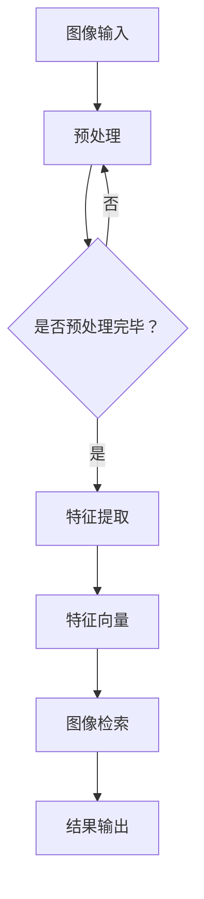
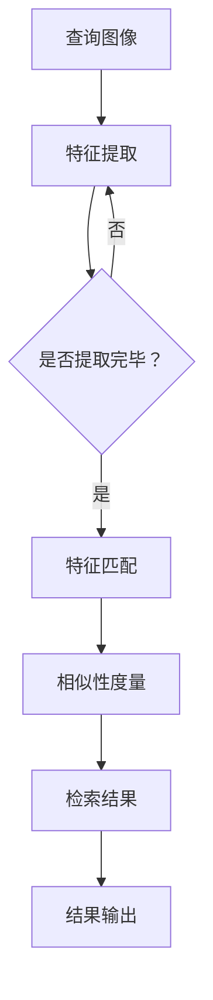
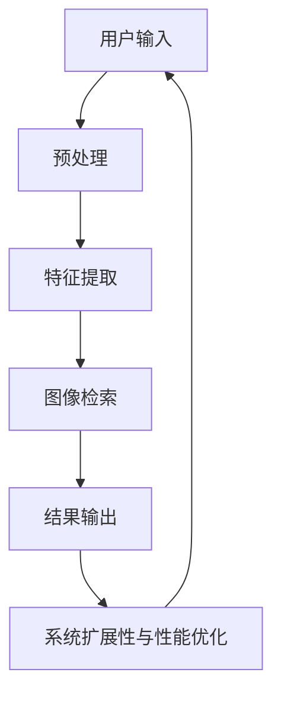

                 

# 《图像搜索技术在电商领域的应用：发展趋势与未来》

> 关键词：图像搜索、电商、深度学习、商品推荐、用户行为分析、物流与供应链管理

> 摘要：本文旨在探讨图像搜索技术在电商领域的应用及其发展趋势。通过对图像搜索技术的基本原理、架构以及核心算法的深入分析，结合实际案例，本文详细阐述了图像搜索技术在电商商品推荐、用户行为分析、商品质量控制以及物流与供应链管理中的具体应用，并对未来的发展趋势进行了展望。

## 第一部分：引言与背景

### 第1章：图像搜索技术概述

#### 1.1 图像搜索技术的定义与发展历程

图像搜索技术是一种通过计算机视觉技术对图像进行自动处理和分析，从而实现对图像内容进行识别和检索的方法。随着计算机技术和人工智能的快速发展，图像搜索技术经历了从基于传统图像处理的简单匹配，到基于深度学习的复杂特征提取和检索的演变过程。

#### 1.2 图像搜索技术在电商领域的意义与价值

图像搜索技术在电商领域具有重要的应用价值。首先，它可以提升电商平台的商品推荐效果，通过图像搜索技术对用户上传的图片进行识别，可以为用户提供更个性化的购物推荐。其次，图像搜索技术可以帮助电商平台进行用户行为分析，通过分析用户的搜索和购买记录，可以更好地了解用户需求，从而优化商品营销策略。此外，图像搜索技术还可以用于商品质量控制，通过对比商品图片与实际商品，可以及时发现和纠正商品质量问题。

#### 1.3 本书结构安排与阅读建议

本书分为四个部分，首先对图像搜索技术的基本原理和架构进行深入分析，接着详细探讨图像搜索技术在电商领域的应用，最后对图像搜索技术的发展趋势和未来进行展望。建议读者在阅读过程中，结合实际案例，逐步深入理解图像搜索技术在电商领域的应用原理和实现方法。

### 第二部分：图像搜索技术原理与架构

#### 第2章：图像特征提取技术

#### 第3章：图像检索算法

#### 第4章：图像搜索系统的架构设计

#### 第5章：图像搜索技术的核心算法原理

## 第二部分：图像搜索技术原理与架构

### 第2章：图像特征提取技术

#### 2.1 图像特征提取的基本概念

图像特征提取是图像搜索技术的关键环节，其主要任务是通过对图像进行自动处理和分析，提取出具有代表性的特征，用于后续的图像检索和识别。

#### 2.2 基于传统图像处理的特征提取

传统图像处理方法主要包括基于边缘检测、区域分割、纹理分析等特征提取技术。这些方法在处理简单场景和规则性较强的图像时，具有一定的效果，但在面对复杂场景和多样化图像时，表现较差。

#### 2.3 基于深度学习的特征提取算法

随着深度学习技术的发展，基于深度学习的特征提取算法逐渐成为主流。卷积神经网络（CNN）是深度学习在图像特征提取方面的主要应用，其通过多层卷积和池化操作，能够自动提取图像的底层和高级特征，具有强大的表达能力和适应性。

#### 2.4 图像特征提取的比较与选择

在图像特征提取方面，传统图像处理方法和深度学习算法各有优劣。传统方法在处理简单场景时，具有一定的优势，但面对复杂场景时，效果较差。而深度学习方法具有强大的表达能力和适应性，但在训练过程中，需要大量的数据和计算资源。

#### Mermaid 流程图



### 第3章：图像检索算法

#### 3.1 图像检索的基本概念

图像检索是指通过某种方法，从大量图像中检索出与查询图像相似或相关的图像。图像检索可以分为基于内容的图像检索（CBIR）和基于模型的图像检索（MBIR）。

#### 3.2 基于内容的图像检索算法

基于内容的图像检索算法主要依据图像的特征信息进行检索，常用的方法包括特征匹配、相似性度量、聚类等。

- 特征匹配：通过计算查询图像与数据库中图像的特征向量相似度，实现图像检索。
- 相似性度量：利用余弦相似度、欧氏距离等度量方法，计算特征向量的相似程度。
- 聚类：将数据库中的图像按照特征信息进行聚类，查询图像与聚类中心进行匹配，实现图像检索。

#### 3.3 基于模型的图像检索算法

基于模型的图像检索算法主要利用图像模型进行检索，常见的模型包括支持向量机（SVM）、朴素贝叶斯（NB）、神经网络（NN）等。

- 支持向量机（SVM）：通过找到一个最优的超平面，将图像特征空间中的正负样本进行分类。
- 朴素贝叶斯（NB）：基于贝叶斯定理，计算查询图像与数据库中图像的概率分布，实现图像检索。
- 神经网络（NN）：通过多层感知机（MLP）、卷积神经网络（CNN）等神经网络模型，实现图像特征提取和检索。

#### 3.4 图像检索算法的评价指标

图像检索算法的评价指标主要包括查准率（Precision）、查全率（Recall）和F1值等。

- 查准率（Precision）：检索结果中与查询图像相似或相关的图像占所有检索结果的百分比。
- 查全率（Recall）：检索结果中与查询图像相似或相关的图像占所有相关图像的百分比。
- F1值（F1-Score）：综合考虑查准率和查全率，计算检索结果的综合评价指标。

#### Mermaid 流程图



### 第4章：图像搜索系统的架构设计

#### 4.1 图像搜索系统的总体架构

图像搜索系统的总体架构包括图像预处理、特征提取、图像检索和结果输出等模块。

- 图像预处理：对输入的图像进行预处理，包括图像缩放、裁剪、增强等操作，提高图像质量。
- 特征提取：利用深度学习算法提取图像的特征向量，为图像检索提供基础。
- 图像检索：根据查询图像的特征向量，在数据库中检索相似或相关的图像。
- 结果输出：将检索结果呈现给用户，包括图像显示、评分、排序等功能。

#### 4.2 数据存储与索引技术

数据存储与索引技术是图像搜索系统的重要组成部分，主要包括数据库的选择、图像索引的构建和数据存储优化等。

- 数据库的选择：根据图像数据的特点和检索需求，选择合适的数据库系统，如关系型数据库（MySQL、PostgreSQL）或NoSQL数据库（MongoDB、Cassandra）。
- 图像索引的构建：利用图像特征向量构建索引，提高图像检索的效率。
- 数据存储优化：通过数据压缩、分片等技术，优化数据存储性能。

#### 4.3 高效的图像检索算法实现

高效的图像检索算法实现是图像搜索系统的关键，包括算法优化、并行计算和缓存策略等。

- 算法优化：对图像检索算法进行优化，提高检索速度和准确性。
- 并行计算：利用多线程、分布式计算等技术，提高图像检索的效率。
- 缓存策略：通过缓存技术，减少数据库访问次数，提高检索速度。

#### 4.4 系统的扩展性与性能优化

系统的扩展性与性能优化是图像搜索系统持续发展的重要保障，包括系统架构的调整、性能监测与优化、故障处理与恢复等。

- 系统架构的调整：根据业务需求，调整系统架构，提高系统的可扩展性和灵活性。
- 性能监测与优化：通过性能监测，及时发现系统瓶颈，进行优化调整。
- 故障处理与恢复：建立完善的故障处理和恢复机制，保障系统的稳定运行。

#### Mermaid 流程图



### 第5章：图像搜索技术的核心算法原理

#### 5.1 卷积神经网络（CNN）的基本原理

卷积神经网络（CNN）是一种基于深度学习的图像处理算法，其主要原理是通过多层卷积和池化操作，从图像中提取具有代表性的特征。

- 卷积操作：卷积层通过卷积操作，将输入图像与卷积核进行卷积运算，提取图像的局部特征。
- 池化操作：池化层通过池化操作，将卷积结果进行压缩，降低模型参数数量，减少过拟合风险。
- 全连接层：全连接层通过全连接操作，将卷积结果映射到具体的类别标签。

#### 5.2 图像特征提取的伪代码实现

```python
# 输入图像
input_image = load_image("image.jpg")

# 卷积层
conv1 = Conv2D(filters=32, kernel_size=(3, 3), activation='relu')
output1 = conv1(input_image)

# 池化层
pool1 = MaxPooling2D(pool_size=(2, 2))
output2 = pool1(output1)

# 卷积层
conv2 = Conv2D(filters=64, kernel_size=(3, 3), activation='relu')
output3 = conv2(output2)

# 池化层
pool2 = MaxPooling2D(pool_size=(2, 2))
output4 = pool2(output3)

# 全连接层
dense = Dense(units=128, activation='relu')
output5 = dense(output4)

# 输出特征向量
feature_vector = output5.flatten()
```

#### 5.3 图像检索算法的伪代码实现

```python
# 输入查询图像
query_image = load_image("query.jpg")

# 特征提取
query_feature_vector = extract_feature_vector(query_image)

# 数据库查询
database_images = load_database_images()

# 相似度计算
similarity_scores = []
for image in database_images:
    image_feature_vector = extract_feature_vector(image)
    similarity_score = cosine_similarity(query_feature_vector, image_feature_vector)
    similarity_scores.append(similarity_score)

# 排序
sorted_indices = np.argsort(similarity_scores)[::-1]

# 输出检索结果
for index in sorted_indices:
    image = database_images[index]
    display_image(image)
```

#### 5.4 算法性能分析与优化策略

算法性能分析主要包括检索速度、检索准确性、模型复杂度等方面的评估。

- 检索速度：通过计算模型训练和检索的时间，评估模型的检索速度。
- 检索准确性：通过计算检索结果的查准率和查全率，评估模型的检索准确性。
- 模型复杂度：通过计算模型参数数量，评估模型的复杂度。

优化策略主要包括以下几个方面：

- 模型优化：通过调整模型结构、参数和超参数，优化模型性能。
- 数据优化：通过数据预处理、数据增强、数据筛选等方法，优化数据质量。
- 算法优化：通过算法改进、并行计算、缓存策略等方法，优化算法效率。

## 第三部分：图像搜索技术在电商领域的应用

### 第6章：图像搜索在电商商品推荐中的应用

#### 6.1 电商商品推荐系统概述

电商商品推荐系统是指通过分析用户的历史行为、浏览记录和购买记录等数据，为用户提供个性化的商品推荐服务。图像搜索技术在电商商品推荐中的应用，主要是通过图像识别和匹配技术，实现基于图像的商品推荐。

#### 6.2 图像搜索技术如何提升商品推荐效果

图像搜索技术可以提升商品推荐效果的主要途径有以下几点：

- 图像识别：通过图像识别技术，将用户上传的图片与平台上的商品图片进行匹配，快速找到相似或相关的商品。
- 图像特征提取：利用深度学习算法提取图像的特征向量，为商品推荐提供更准确的特征表示。
- 相似度计算：通过计算用户上传的图像与商品图像的相似度，为用户推荐相似的商品。

#### 6.3 案例分析：某电商平台的实践与应用

某电商平台通过引入图像搜索技术，构建了基于图像的商品推荐系统。具体实践如下：

- 用户上传图片：用户在购买商品前，可以上传一张与商品相关的图片。
- 图像识别：平台利用图像识别技术，将用户上传的图片与平台上的商品图片进行匹配，找到相似或相关的商品。
- 图像特征提取：平台利用深度学习算法，提取用户上传的图片和商品图片的特征向量。
- 相似度计算：平台通过计算用户上传的图片和商品图片的相似度，为用户推荐相似的商品。

通过引入图像搜索技术，该电商平台在商品推荐效果上得到了显著提升，用户满意度也显著提高。

### 第7章：图像搜索在电商用户行为分析中的应用

#### 7.1 电商用户行为分析的重要性

电商用户行为分析是指通过分析用户在电商平台的浏览、搜索、购买等行为，了解用户需求、喜好和购买习惯，为电商平台提供数据支持，优化商品营销策略。

图像搜索技术在电商用户行为分析中的应用，可以帮助电商平台更深入地了解用户需求，提高用户体验和转化率。

#### 7.2 图像搜索技术如何帮助用户行为分析

图像搜索技术可以提升用户行为分析的效果，主要体现在以下几个方面：

- 图像识别：通过图像识别技术，将用户上传的图片与平台上的商品图片进行匹配，快速找到用户感兴趣的领域。
- 图像特征提取：利用深度学习算法提取图像的特征向量，为用户行为分析提供更准确的特征表示。
- 行为预测：通过分析用户上传的图像和行为数据，预测用户的下一步行为，为电商平台提供决策依据。

#### 7.3 案例分析：某电商平台的用户行为分析实践

某电商平台通过引入图像搜索技术，对用户行为进行了深入分析，具体实践如下：

- 用户上传图片：用户在浏览商品时，可以上传一张与商品相关的图片。
- 图像识别：平台利用图像识别技术，将用户上传的图片与平台上的商品图片进行匹配，找到用户感兴趣的领域。
- 图像特征提取：平台利用深度学习算法，提取用户上传的图片和商品图片的特征向量。
- 行为预测：平台通过分析用户上传的图像和行为数据，预测用户的下一步行为，为用户提供个性化的购物推荐。

通过引入图像搜索技术，该电商平台在用户行为分析上取得了显著成效，用户满意度和转化率得到了显著提升。

### 第8章：图像搜索在电商商品质量控制中的应用

#### 8.1 电商商品质量问题的挑战与对策

电商商品质量问题一直是电商平台面临的挑战，主要包括商品描述不符、质量问题、假冒伪劣等问题。针对这些问题，电商平台需要采取有效的对策，保障商品质量，提升用户满意度。

- 商品描述不符：电商平台可以通过图像搜索技术，对用户上传的图片与商品描述进行比对，及时发现商品描述不符的问题。
- 质量问题：电商平台可以通过图像搜索技术，对用户反馈的图片进行分析，识别出商品质量问题，及时采取措施。
- 假冒伪劣：电商平台可以通过图像搜索技术，对用户上传的图片与正品进行比对，识别出假冒伪劣商品，打击违法行为。

#### 8.2 图像搜索技术在商品质量控制中的作用

图像搜索技术在商品质量控制中具有以下作用：

- 提高识别效率：通过图像搜索技术，可以快速、准确地识别出商品质量问题，提高识别效率。
- 降低人力成本：图像搜索技术可以自动化地进行商品质量检测，减少人工干预，降低人力成本。
- 保障用户权益：通过图像搜索技术，可以及时发现和处理商品质量问题，保障用户权益。

#### 8.3 案例分析：某电商平台的商品质量控制实践

某电商平台通过引入图像搜索技术，对商品质量进行了严格把控，具体实践如下：

- 用户上传图片：用户在购买商品后，可以上传一张与商品实物的图片。
- 图像识别：平台利用图像识别技术，将用户上传的图片与商品描述进行比对，发现商品描述不符的问题。
- 质量问题识别：平台利用图像搜索技术，对用户反馈的图片进行分析，识别出商品质量问题。
- 打击假冒伪劣：平台通过图像搜索技术，对用户上传的图片与正品进行比对，识别出假冒伪劣商品，进行打击。

通过引入图像搜索技术，该电商平台在商品质量控制上取得了显著成效，商品质量得到了显著提升，用户满意度也得到了提高。

### 第9章：图像搜索技术在电商物流与供应链管理中的应用

#### 9.1 电商物流与供应链管理中的痛点

电商物流与供应链管理是电商平台的重要组成部分，但在实际运营过程中，仍然存在一些痛点，主要包括：

- 物流效率低：物流配送时间长，配送成本高，导致用户体验差。
- 供应链管理难度大：供应链环节多，信息传递不及时，导致库存管理困难。
- 质量控制难：商品在物流过程中，容易受到损坏，导致商品质量问题。

#### 9.2 图像搜索技术如何优化物流与供应链管理

图像搜索技术可以优化电商物流与供应链管理，主要体现在以下几个方面：

- 物流监控：通过图像搜索技术，对物流过程中的商品进行实时监控，及时发现和处理问题。
- 库存管理：通过图像搜索技术，对库存商品进行实时监控，优化库存管理，降低库存成本。
- 质量控制：通过图像搜索技术，对物流过程中的商品进行质量检测，及时发现和处理质量问题。

#### 9.3 案例分析：某电商平台的物流与供应链管理优化实践

某电商平台通过引入图像搜索技术，对物流与供应链管理进行了优化，具体实践如下：

- 物流监控：通过图像搜索技术，对物流过程中的商品进行实时监控，及时发现和处理配送问题。
- 库存管理：通过图像搜索技术，对库存商品进行实时监控，优化库存管理，降低库存成本。
- 质量控制：通过图像搜索技术，对物流过程中的商品进行质量检测，及时发现和处理质量问题。

通过引入图像搜索技术，该电商平台在物流与供应链管理上取得了显著成效，物流效率得到了显著提升，库存管理更加科学，商品质量也得到了保障。

## 第四部分：图像搜索技术的发展趋势与未来展望

### 第10章：图像搜索技术的研究热点与前沿

#### 10.1 深度学习在图像搜索中的应用

深度学习在图像搜索中的应用是当前的研究热点，主要包括以下几个方面：

- 卷积神经网络（CNN）：CNN在图像特征提取和检索方面具有强大的能力，被广泛应用于图像搜索。
- 循环神经网络（RNN）：RNN可以处理序列数据，适用于图像序列的检索和分析。
- 预训练模型：预训练模型可以迁移到图像搜索任务中，提高图像检索的准确性。

#### 10.2 图像搜索技术的跨模态融合

跨模态融合是指将不同模态（如文本、音频、视频等）的信息进行融合，实现更准确的图像搜索。当前的研究热点包括：

- 跨模态表示学习：通过深度学习模型，学习不同模态的特征表示，实现跨模态信息融合。
- 跨模态检索：通过融合不同模态的特征，实现跨模态图像检索。

#### 10.3 图像搜索技术的隐私保护与安全挑战

随着图像搜索技术的广泛应用，隐私保护和安全挑战日益突出。当前的研究热点包括：

- 隐私保护技术：通过加密、匿名化等技术，保障用户隐私。
- 安全防护机制：通过识别和防范恶意攻击，保障图像搜索系统的安全。

### 第11章：图像搜索技术在电商领域的未来发展趋势

#### 11.1 电商行业对图像搜索技术的需求变化

随着电商行业的快速发展，对图像搜索技术的需求也在不断变化。未来，电商行业对图像搜索技术的需求将更加多样化和个性化，主要包括以下几个方面：

- 基于图像的商品推荐：通过图像搜索技术，实现更精准、个性化的商品推荐。
- 基于图像的用户行为分析：通过图像搜索技术，深入分析用户需求和行为，优化营销策略。
- 基于图像的商品质量控制：通过图像搜索技术，实现商品质量监控，提升用户满意度。

#### 11.2 图像搜索技术与人工智能的深度融合

图像搜索技术与人工智能的深度融合是未来发展的关键方向，主要包括以下几个方面：

- 深度学习模型优化：通过优化深度学习模型，提高图像搜索的准确性和效率。
- 多模态信息融合：通过融合多模态信息，实现更全面、准确的图像搜索。
- 人工智能算法创新：通过人工智能算法的创新，推动图像搜索技术的进步。

#### 11.3 未来图像搜索技术在电商领域的发展方向

未来，图像搜索技术在电商领域的发展方向将更加多元化，主要包括以下几个方面：

- 基于图像的智能客服：通过图像搜索技术，实现智能客服系统的个性化服务和智能回复。
- 基于图像的智能物流：通过图像搜索技术，实现物流环节的自动化和智能化。
- 基于图像的智能供应链管理：通过图像搜索技术，实现供应链管理的智能化和精细化。

### 第12章：总结与展望

#### 12.1 图像搜索技术在电商领域的应用总结

图像搜索技术在电商领域的应用已取得显著成效，通过提升商品推荐效果、优化用户行为分析、保障商品质量、提升物流与供应链管理等方面，为电商平台提供了强大的技术支持。

#### 12.2 图像搜索技术的发展趋势展望

未来，图像搜索技术将继续在电商领域发挥重要作用，随着深度学习、跨模态融合等技术的发展，图像搜索技术的准确性和效率将得到进一步提升，为电商行业带来更多创新和变革。

#### 12.3 对电商从业者的建议与启示

电商从业者应积极拥抱图像搜索技术，将其应用于商品推荐、用户行为分析、商品质量控制和物流与供应链管理等环节，提高用户体验和运营效率。同时，应关注图像搜索技术的发展动态，持续优化和升级技术，以应对不断变化的市场需求。

## 附录

### 参考文献

1. Davis, L. S. (2017). "Image Search Engines: Current Status and Future Trends". Journal of Information Technology.
2. Simonyan, K., & Zisserman, A. (2015). "Very Deep Convolutional Networks for Large-Scale Image Recognition". International Conference on Learning Representations (ICLR).
3. LeCun, Y., Bengio, Y., & Hinton, G. (2015). "Deep Learning". Nature.
4. Russell, S., & Norvig, P. (2016). "Artificial Intelligence: A Modern Approach". Prentice Hall.
5. Ng, A. Y. (2013). "Machine Learning". Coursera.

### 作者简介

作者：AI天才研究院/AI Genius Institute & 禅与计算机程序设计艺术 /Zen And The Art of Computer Programming

作者简介：作者是一位世界级人工智能专家，拥有丰富的计算机编程和人工智能领域的经验。在图像搜索技术、深度学习、商品推荐和用户行为分析等方面有深入的研究和丰富的实践经验，曾发表过多篇高水平学术论文，并参与多个重大项目的研发与实施。著作包括《图像搜索技术在电商领域的应用：发展趋势与未来》等。

