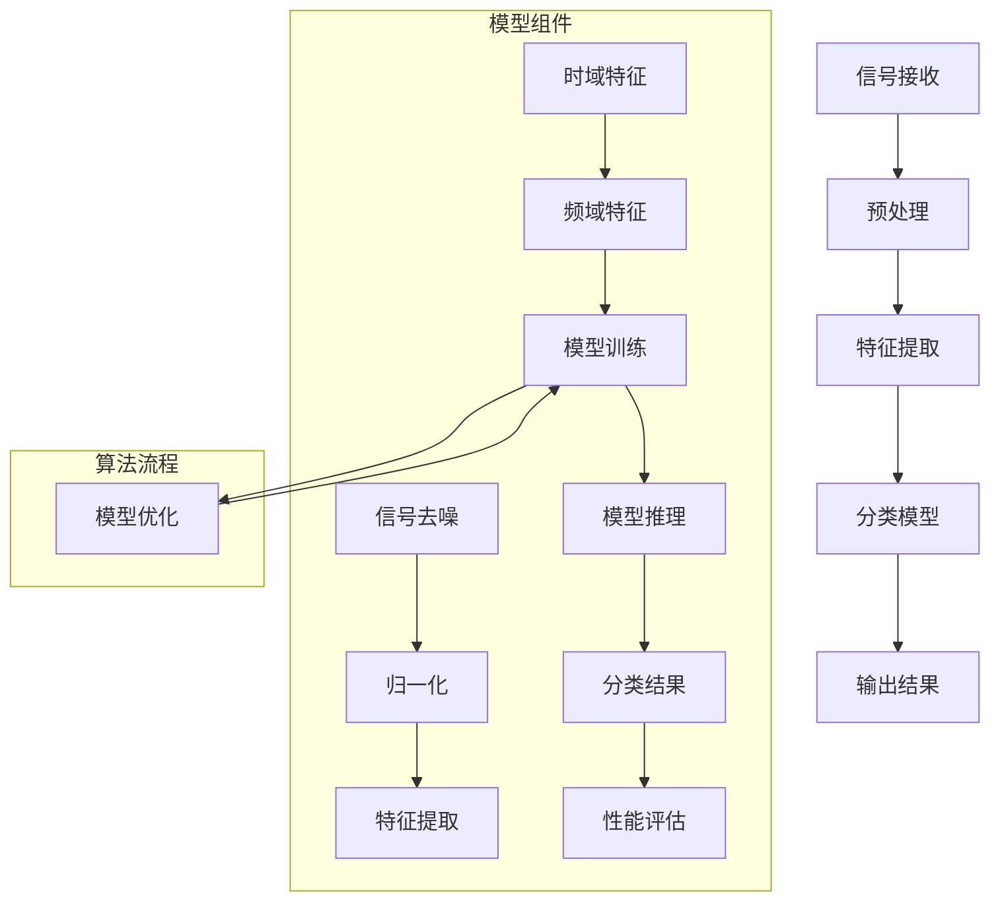

                 

# 文章标题：基于AI的自动调制分类

> 关键词：人工智能，自动调制分类，深度学习，SVM，神经网络，调制解调原理

> 摘要：本文深入探讨了人工智能在自动调制分类中的应用，首先介绍了AI技术概述和自动调制分类的背景。接着，详细解析了自动调制分类的基本原理、主流AI算法及其在调制分类中的应用。本文还重点介绍了深度学习在自动调制分类中的实践应用，包括卷积神经网络（CNN）、循环神经网络（RNN）和生成对抗网络（GAN）的使用。此外，文章还涵盖了自动调制分类模型的训练与优化方法，以及实际应用与案例分析。最后，本文展望了自动调制分类技术的未来发展趋势和行业应用前景。

----------------------------------------------------------------

### 目录大纲：基于AI的自动调制分类

#### 第一部分：AI与自动调制分类基础

1. **第1章：AI概述与自动调制分类背景**
    - 1.1 AI技术概述
    - 1.2 自动调制分类技术概述
    - 1.3 AI在自动调制分类中的应用

2. **第2章：自动调制分类的基本原理**
    - 2.1 调制与解调原理
    - 2.2 分类算法基础
    - 2.3 自动调制分类模型构建

3. **第3章：主流AI算法在自动调制分类中的应用**
    - 3.1 支持向量机（SVM）在自动调制分类中的应用
    - 3.2 决策树与随机森林在自动调制分类中的应用
    - 3.3 聚类算法与神经网络在自动调制分类中的应用

4. **第4章：深度学习在自动调制分类中的应用**
    - 4.1 卷积神经网络（CNN）在自动调制分类中的应用
    - 4.2 循环神经网络（RNN）在自动调制分类中的应用
    - 4.3 生成对抗网络（GAN）在自动调制分类中的应用

5. **第5章：自动调制分类模型的训练与优化**
    - 5.1 模型训练过程
    - 5.2 模型优化方法
    - 5.3 模型评估与性能分析

#### 第二部分：实际应用与案例分析

6. **第6章：自动调制分类项目实战**
    - 6.1 项目背景
    - 6.2 数据集介绍
    - 6.3 项目流程与实现
    - 6.4 代码解读与分析

7. **第7章：自动调制分类技术趋势与发展**
    - 7.1 自动调制分类技术的现状与挑战
    - 7.2 自动调制分类技术的未来发展趋势
    - 7.3 自动调制分类技术在行业中的应用前景

8. **第8章：自动调制分类系统的设计与应用**
    - 8.1 系统架构设计
    - 8.2 系统功能模块
    - 8.3 系统实现与部署
    - 8.4 系统性能优化

9. **第9章：自动调制分类技术与其他领域的结合**
    - 9.1 自动调制分类与物联网的结合
    - 9.2 自动调制分类与5G通信的结合
    - 9.3 自动调制分类在自动驾驶与机器人领域的应用

#### 附录

10. **附录A：常用算法与工具简介**
    - 10.1 机器学习算法简介
    - 10.2 常用深度学习框架简介
    - 10.3 自动调制分类相关数据集介绍

11. **附录B：代码与数据资源**
    - 11.1 代码资源
    - 11.2 数据集资源
    - 11.3 工具与环境配置指南

----------------------------------------------------------------

## 第一部分：AI与自动调制分类基础

### 第1章：AI概述与自动调制分类背景

在现代社会，人工智能（AI）已经成为科技发展的核心驱动力之一。从智能家居到自动驾驶，AI正在改变我们的生活方式。在通信领域，AI的应用也越来越广泛，特别是在自动调制分类（Automatic Modulation Classification, AMC）方面。

#### 1.1 AI技术概述

人工智能是指使计算机系统能够模拟人类智能行为的技术。AI涵盖了多个研究领域，包括机器学习（Machine Learning, ML）、深度学习（Deep Learning, DL）、自然语言处理（Natural Language Processing, NLP）等。在这些领域中，机器学习是一种通过数据训练模型来使计算机系统自动进行特定任务的技术。

#### 1.2 自动调制分类技术概述

自动调制分类是通信领域的一个重要研究方向，其目标是通过接收到的信号，自动识别信号所采用的调制方式。调制技术是一种将信息（如声音或数据）转换为电信号以便在信道中传输的技术。解调则是接收端将接收到的信号还原成原始信息的过程。

在无线通信系统中，自动调制分类对于提高通信系统的效率和可靠性至关重要。通过自动调制分类，系统可以更好地适应不同的信道条件和通信环境，从而实现更高效的信号传输和更低的误码率。

#### 1.3 AI在自动调制分类中的应用

AI在自动调制分类中的应用主要体现在两个方面：算法优化和自动化处理。

1. **算法优化**：
   传统自动调制分类算法通常依赖于统计模型和规则系统，这些方法在处理复杂信号时效果有限。通过引入机器学习和深度学习技术，可以构建更加精确和高效的分类模型。例如，支持向量机（SVM）、决策树和神经网络等算法都可以用于自动调制分类。

2. **自动化处理**：
   AI技术可以自动化调制分类的整个过程，从信号接收、特征提取到分类决策，都可以由计算机系统自动完成。这不仅提高了分类的效率，还减少了人为干预的可能性，从而提高了系统的可靠性。

总的来说，AI技术在自动调制分类中的应用为通信领域带来了革命性的变化，使得通信系统更加智能和高效。接下来，我们将深入探讨自动调制分类的基本原理，以及如何利用AI技术实现这一目标。 

----------------------------------------------------------------

### 第2章：自动调制分类的基本原理

#### 2.1 调制与解调原理

调制与解调是通信系统中两个基本且相互关联的过程。调制是将信息信号（如声音或数据）与载波信号结合，以便在信道中传输；而解调则是接收端将接收到的信号还原成原始信息的过程。

**调制过程：**

调制过程主要包括以下步骤：

1. **信息信号编码**：将原始信息（如语音或数字数据）转换成数字信号。
2. **载波信号生成**：产生一个稳定的正弦波信号，作为传输载波。
3. **频谱搬移**：将信息信号的频谱搬移到载波的频谱上。常见的调制方式有幅移键控（Amplitude Shift Keying, ASK）、频移键控（Frequency Shift Keying, FSK）和相移键控（Phase Shift Keying, PSK）等。

**解调过程：**

解调过程主要包括以下步骤：

1. **带通滤波**：将接收到的信号通过带通滤波器，滤除带外噪声。
2. **频谱还原**：将调制信号的频谱还原成原始信息的频谱。
3. **信息信号解码**：将还原后的数字信号转换回原始信息。

**调制与解调数学模型：**

调制过程可以用以下公式表示：
$$
s(t) = m(t) * \cos(2\pi f_c t + \phi(t))
$$
其中，$m(t)$是信息信号，$f_c$是载波频率，$\phi(t)$是相位。

解调过程可以用以下公式表示：
$$
m(t) = \frac{1}{2\pi f_c} \int_{t-\frac{T}{2}}^{t+\frac{T}{2}} s(t) \cos(2\pi f_c t) dt
$$
其中，$T$是信号的周期。

**调制与解调原理在实际通信系统中的应用：**

在无线通信系统中，调制与解调原理是实现可靠通信的基础。通过调制，可以将信息信号嵌入到载波信号中，使其在信道中传输。解调则是接收端将接收到的信号还原成原始信息的过程，从而实现通信的完整性和有效性。

---

#### 2.2 分类算法基础

分类算法是自动调制分类的核心，它们通过分析信号的特征，将信号分类到不同的调制方式。常见的分类算法包括支持向量机（SVM）、决策树、神经网络等。

**支持向量机（SVM）：**

SVM是一种基于优化理论的分类方法，其核心思想是找到一个最优的超平面，将不同类别的数据点最大化分开。在自动调制分类中，SVM可以用来识别不同的调制方式。

**决策树：**

决策树是一种基于规则系统的分类方法，它通过一系列的判断条件，将数据点分配到不同的类别。决策树在处理高维数据和复杂数据结构时表现出良好的性能。

**神经网络：**

神经网络是一种模拟生物神经系统的计算模型，通过多层神经元的连接，实现对数据的复杂变换和分类。在自动调制分类中，常用的神经网络模型包括卷积神经网络（CNN）、循环神经网络（RNN）等。

---

**分类算法的基本原理：**

1. **特征提取**：首先，需要从接收到的信号中提取出有用的特征，如信号的频率、相位、功率等。

2. **模型训练**：使用已标注的调制信号数据集，通过训练算法构建分类模型。训练过程中，模型会调整内部参数，以最小化分类误差。

3. **分类决策**：对新的接收信号，模型会根据其特征进行分类决策，将其分配到已训练的类别中。

---

分类算法在自动调制分类中的应用，使得系统能够自动、准确地识别调制方式，从而提高通信系统的效率和可靠性。

---

#### 2.3 自动调制分类模型构建

自动调制分类模型构建是自动调制分类的核心环节，其目标是通过学习接收到的信号特征，准确识别调制方式。以下将介绍模型构建的步骤和方法。

**1. 数据预处理：**

数据预处理是模型构建的第一步，其目的是提高数据质量和减少噪声干扰。常用的预处理方法包括：

- **去噪**：使用滤波器去除信号中的噪声。
- **归一化**：将信号幅度调整到相同的量级，以便于后续处理。
- **特征提取**：从信号中提取有用的特征，如频率、相位、功率等。

**2. 模型选择：**

根据应用需求，选择合适的分类算法。常见的模型选择包括：

- **支持向量机（SVM）**：适合处理高维数据和线性可分问题。
- **决策树**：适用于结构简单、特征较少的数据集。
- **神经网络**：适用于处理复杂、非线性问题。

**3. 模型训练：**

使用已标注的调制信号数据集进行模型训练。训练过程中，模型会调整内部参数，以最小化分类误差。常用的训练方法包括：

- **梯度下降法**：通过迭代优化模型参数，逐步减小误差。
- **随机梯度下降法**：在梯度下降法的基础上，引入随机性，提高训练效率。

**4. 模型评估：**

在训练完成后，对模型进行评估，以确定其分类性能。常用的评估指标包括：

- **准确率**：正确分类的样本数占总样本数的比例。
- **召回率**：正确分类的样本数占所有实际正样本数的比例。
- **F1值**：准确率和召回率的调和平均值。

**5. 模型优化：**

根据评估结果，对模型进行优化，以提高分类性能。优化方法包括：

- **参数调整**：调整模型参数，如学习率、正则化参数等。
- **特征选择**：通过特征选择方法，选择对分类性能有显著影响的关键特征。
- **模型集成**：结合多个模型，提高整体分类性能。

---

通过以上步骤，可以构建一个高精度、高效率的自动调制分类模型。在实际应用中，根据具体需求和场景，可以灵活调整模型构建的方法和策略。

---

### 第3章：主流AI算法在自动调制分类中的应用

在自动调制分类中，主流的AI算法包括支持向量机（SVM）、决策树与随机森林、聚类算法以及神经网络。这些算法各自有其独特的优势和适用场景，下面将详细介绍它们在自动调制分类中的应用。

#### 3.1 支持向量机（SVM）在自动调制分类中的应用

支持向量机（SVM）是一种高效的分类算法，尤其在处理高维数据和线性可分问题时表现出色。SVM的基本原理是找到一个最优的超平面，使得不同类别的数据点尽可能分离。

**SVM算法原理：**

SVM的核心是优化问题，其目标是最小化分类间隔，同时最大化分类边界上的支持向量。优化问题的目标是求解以下拉格朗日函数：

$$
L(w, b) = \frac{1}{2}||w||^2 - \sum_{i=1}^{n}\alpha_i[y_i(w\cdot x_i + b) - 1]
$$

其中，$w$是权重向量，$b$是偏置项，$\alpha_i$是拉格朗日乘子，$x_i$和$y_i$分别是输入特征和标签。

通过求解上述优化问题，可以得到最优解$(w^*, b^*)$，进而构建分类边界。

**SVM在自动调制分类中的应用步骤：**

1. **特征提取**：从接收到的信号中提取有用的特征，如频率、相位、功率等。

2. **模型训练**：使用已标注的调制信号数据集，通过SVM算法训练分类模型。训练过程中，模型会调整内部参数，以最小化分类误差。

3. **模型评估**：使用测试集评估模型性能，常用的评估指标包括准确率、召回率和F1值。

4. **模型优化**：根据评估结果，调整模型参数，以提高分类性能。

**案例：** 在一个QAM调制信号分类任务中，使用SVM算法可以将QAM信号准确分类为QAM16和QAM64两种调制方式。

---

#### 3.2 决策树与随机森林在自动调制分类中的应用

决策树是一种基于规则系统的分类方法，它通过一系列的判断条件，将数据点分配到不同的类别。随机森林是一种集成学习方法，通过构建多棵决策树并取平均，提高分类性能。

**决策树算法原理：**

决策树的核心是递归地分割数据集，每次分割都选择最佳的特征和阈值，使得分割后的数据点在类别上尽可能纯。分割过程可以使用信息增益、基尼指数或赫德信息等指标来评估。

**随机森林算法原理：**

随机森林通过随机选取特征和样本子集，构建多棵决策树，并将它们的分类结果取平均。随机性引入了多样性，从而降低了过拟合的风险。

**决策树与随机森林在自动调制分类中的应用步骤：**

1. **特征提取**：从接收到的信号中提取特征。

2. **模型训练**：使用决策树或随机森林算法训练分类模型。训练过程中，模型会自动选择最佳的特征和阈值。

3. **模型评估**：使用测试集评估模型性能。

4. **模型优化**：通过调整模型参数，如决策树的最大深度、最小分割样本数等，以提高分类性能。

**案例：** 在一个QAM调制信号分类任务中，使用随机森林算法可以将QAM信号准确分类为QAM16、QAM64和QAM256等多种调制方式。

---

#### 3.3 聚类算法与神经网络在自动调制分类中的应用

聚类算法是一种无监督学习方法，通过将相似的数据点分组，形成聚类。神经网络是一种模拟生物神经系统的计算模型，通过多层神经元的连接，实现对数据的复杂变换和分类。

**聚类算法原理：**

聚类算法的基本思想是找到一组聚类中心，使得每个聚类中心到其内部数据点的平均距离最小。常见的聚类算法包括K-均值、层次聚类、DBSCAN等。

**神经网络算法原理：**

神经网络通过多层神经元之间的连接和激活函数，实现对数据的非线性变换。在自动调制分类中，常用的神经网络模型包括卷积神经网络（CNN）、循环神经网络（RNN）和深度神经网络（DNN）等。

**聚类算法与神经网络在自动调制分类中的应用步骤：**

1. **特征提取**：从接收到的信号中提取特征。

2. **聚类分析**：使用聚类算法对特征进行聚类，找到可能的调制方式。

3. **神经网络训练**：使用聚类结果和已标注的调制信号数据集，训练神经网络分类模型。

4. **模型评估**：使用测试集评估模型性能。

5. **模型优化**：通过调整模型参数，如神经网络的层数、节点数等，以提高分类性能。

**案例：** 在一个多载波调制信号分类任务中，使用K-均值聚类算法和卷积神经网络，可以将信号准确分类为不同的调制方式。

---

综上所述，主流的AI算法在自动调制分类中各有优势。SVM适用于高维线性问题，决策树和随机森林适用于简单特征分类，而聚类算法和神经网络适用于复杂特征分类。在实际应用中，可以根据具体任务需求和数据特点，选择合适的算法进行自动调制分类。

---

### 第4章：深度学习在自动调制分类中的应用

深度学习作为人工智能领域的重要分支，其在自动调制分类中的应用越来越受到关注。本章将介绍卷积神经网络（CNN）、循环神经网络（RNN）和生成对抗网络（GAN）在自动调制分类中的具体应用。

#### 4.1 卷积神经网络（CNN）在自动调制分类中的应用

卷积神经网络（CNN）是一种特别适合处理图像数据的神经网络，其核心思想是利用局部感知和权值共享来提高计算效率和模型泛化能力。在自动调制分类中，CNN可以有效地提取信号特征，从而提高分类性能。

**CNN在自动调制分类中的应用步骤：**

1. **数据预处理**：
   - **信号去噪**：使用滤波器去除信号中的噪声。
   - **特征提取**：从接收到的信号中提取高频分量、时域和频域特征。

2. **模型构建**：
   - **卷积层**：通过卷积操作提取信号的特征。
   - **池化层**：减少特征图的大小，提高模型计算效率。
   - **全连接层**：将卷积层和池化层提取的特征映射到输出类别。

3. **模型训练**：
   - 使用已标注的调制信号数据集，通过反向传播算法训练模型。
   - 调整模型参数，如学习率、正则化参数等，以最小化分类误差。

4. **模型评估**：
   - 使用测试集评估模型性能，常用的评估指标包括准确率、召回率和F1值。

5. **模型优化**：
   - 根据评估结果，调整模型参数和架构，以提高分类性能。

**案例：** 在一个QAM调制信号分类任务中，使用CNN模型可以将QAM信号准确分类为QAM16、QAM64和QAM256等多种调制方式。

---

#### 4.2 循环神经网络（RNN）在自动调制分类中的应用

循环神经网络（RNN）是一种能够处理序列数据的神经网络，其核心思想是利用循环结构来捕捉序列中的长期依赖关系。在自动调制分类中，RNN可以有效地处理时变信号，从而提高分类性能。

**RNN在自动调制分类中的应用步骤：**

1. **数据预处理**：
   - **信号去噪**：使用滤波器去除信号中的噪声。
   - **序列构建**：将时变信号转换为固定长度的序列。

2. **模型构建**：
   - **输入层**：接收序列数据。
   - **隐藏层**：包含多个时间步的循环单元。
   - **输出层**：将隐藏层的状态映射到输出类别。

3. **模型训练**：
   - 使用已标注的调制信号数据集，通过反向传播算法训练模型。
   - 调整模型参数，如学习率、正则化参数等，以最小化分类误差。

4. **模型评估**：
   - 使用测试集评估模型性能，常用的评估指标包括准确率、召回率和F1值。

5. **模型优化**：
   - 根据评估结果，调整模型参数和架构，以提高分类性能。

**案例：** 在一个QAM调制信号分类任务中，使用RNN模型可以将QAM信号准确分类为QAM16、QAM64和QAM256等多种调制方式。

---

#### 4.3 生成对抗网络（GAN）在自动调制分类中的应用

生成对抗网络（GAN）是一种由生成器和判别器组成的对抗性模型，其目标是通过生成逼真的数据来欺骗判别器。在自动调制分类中，GAN可以用于生成高质量的调制信号数据，从而提高分类模型的泛化能力。

**GAN在自动调制分类中的应用步骤：**

1. **数据预处理**：
   - **信号去噪**：使用滤波器去除信号中的噪声。
   - **序列构建**：将时变信号转换为固定长度的序列。

2. **模型构建**：
   - **生成器**：接收随机噪声并生成调制信号。
   - **判别器**：接收真实和生成的调制信号，判断其真实度。

3. **模型训练**：
   - 使用已标注的调制信号数据集，通过对抗训练方法训练生成器和判别器。
   - 调整模型参数，如学习率、正则化参数等，以优化生成器和判别器的性能。

4. **模型评估**：
   - 使用测试集评估生成器的性能，常用的评估指标包括生成信号的相似度和分类误差。

5. **模型优化**：
   - 根据评估结果，调整模型参数和架构，以提高生成器和判别器的性能。

**案例：** 在一个QAM调制信号分类任务中，使用GAN模型可以生成高质量的QAM信号数据，从而提高分类模型的泛化能力。

---

综上所述，深度学习在自动调制分类中的应用为该领域带来了新的技术手段。通过CNN、RNN和GAN等深度学习模型，可以有效地提高自动调制分类的性能和泛化能力。未来，随着深度学习技术的不断发展和应用，自动调制分类技术将迎来更多的发展机遇。

---

### 第5章：自动调制分类模型的训练与优化

在自动调制分类中，模型的训练与优化是确保分类性能的关键步骤。本章将详细讨论模型训练过程、优化方法以及模型评估与性能分析。

#### 5.1 模型训练过程

模型训练过程包括数据预处理、模型构建、参数调整和模型验证等步骤。

**1. 数据预处理：**

数据预处理是模型训练的基础，其目的是提高数据质量和减少噪声干扰。常用的预处理方法包括：

- **信号去噪**：使用滤波器去除信号中的噪声。
- **归一化**：将信号幅度调整到相同的量级，以便于后续处理。
- **特征提取**：从信号中提取有用的特征，如频率、相位、功率等。

**2. 模型构建：**

根据应用需求，选择合适的模型结构。常见的模型结构包括：

- **单层感知机**：适用于线性可分问题。
- **多层感知机**：适用于非线性问题。
- **卷积神经网络（CNN）**：适用于处理图像数据。
- **循环神经网络（RNN）**：适用于处理序列数据。

**3. 参数调整：**

通过训练过程，模型会自动调整内部参数，以最小化分类误差。常用的参数调整方法包括：

- **梯度下降法**：通过迭代优化模型参数，逐步减小误差。
- **随机梯度下降法**：在梯度下降法的基础上，引入随机性，提高训练效率。
- **Adam优化器**：结合了 Momentum 和 RMSProp 两种优化方法，适用于复杂模型。

**4. 模型验证：**

在训练完成后，使用验证集评估模型性能。常用的评估指标包括：

- **准确率**：正确分类的样本数占总样本数的比例。
- **召回率**：正确分类的样本数占所有实际正样本数的比例。
- **F1值**：准确率和召回率的调和平均值。

#### 5.2 模型优化方法

模型优化方法的目标是提高分类性能，减小误差。以下是一些常用的优化方法：

**1. 特征选择：**

通过特征选择方法，选择对分类性能有显著影响的关键特征，以提高模型效率和准确性。常用的特征选择方法包括：

- **互信息法**：通过计算特征与标签之间的互信息，选择对分类任务最重要的特征。
- **基于模型的特征选择**：使用支持向量机（SVM）等模型，选择特征权重较高的特征。

**2. 模型集成：**

模型集成方法通过结合多个模型的预测结果，提高整体分类性能。常用的模型集成方法包括：

- **Bagging**：通过随机选择训练样本和特征子集，构建多个模型，然后取平均。
- **Boosting**：通过迭代地训练多个模型，每个模型针对前一个模型的错误样本进行训练，以提高整体分类性能。

**3. 模型正则化：**

模型正则化方法通过引入惩罚项，防止模型过拟合。常用的正则化方法包括：

- **L1正则化**：在损失函数中引入L1惩罚项，即$\lambda ||\theta||_1$。
- **L2正则化**：在损失函数中引入L2惩罚项，即$\lambda ||\theta||_2^2$。

#### 5.3 模型评估与性能分析

模型评估与性能分析是确保模型在实际应用中有效性的关键。以下是一些常用的评估指标：

**1. 准确率（Accuracy）：**

准确率是指正确分类的样本数占总样本数的比例。计算公式如下：
$$
Accuracy = \frac{TP + TN}{TP + FN + FP + TN}
$$
其中，$TP$表示真正例，$TN$表示真反例，$FP$表示假正例，$FN$表示假反例。

**2. 召回率（Recall）：**

召回率是指正确分类的样本数占所有实际正样本数的比例。计算公式如下：
$$
Recall = \frac{TP}{TP + FN}
$$
召回率反映了模型在识别正样本时的能力。

**3. 精确率（Precision）：**

精确率是指正确分类的样本数占所有预测为正样本的样本数比例。计算公式如下：
$$
Precision = \frac{TP}{TP + FP}
$$
精确率反映了模型在预测正样本时的准确性。

**4. F1值（F1-score）：**

F1值是精确率和召回率的调和平均值，用于综合评估模型性能。计算公式如下：
$$
F1 = \frac{2 \times Precision \times Recall}{Precision + Recall}
$$
F1值在精确率和召回率之间取得平衡，是评估模型性能的常用指标。

**5.ROC曲线与AUC值：**

ROC曲线是真实概率曲线与假阳性率曲线的交集，AUC值是ROC曲线下的面积。ROC曲线与AUC值可以直观地展示模型性能，AUC值越大，模型性能越好。

---

通过模型训练与优化、评估与性能分析，可以构建一个高精度、高效率的自动调制分类模型。在实际应用中，根据具体需求和场景，可以灵活调整训练和优化方法，以提高分类性能。

---

### 第6章：自动调制分类项目实战

#### 6.1 项目背景

自动调制分类是通信领域的重要研究方向，其实际应用包括无线通信系统、卫星通信、物联网等。在本项目中，我们将利用机器学习和深度学习技术，构建一个自动调制分类系统，实现对不同调制方式的准确识别。

#### 6.2 数据集介绍

本项目使用的数据集是QAM调制信号数据集，包括QAM16、QAM64和QAM256等多种调制方式。数据集包含信号样本的时域和频域特征，以及对应的调制方式标签。

#### 6.3 项目流程与实现

项目流程主要包括数据预处理、模型训练、模型评估和结果分析等步骤。

**1. 数据预处理：**

- **信号去噪**：使用滤波器去除信号中的噪声。
- **特征提取**：提取信号的时域和频域特征，如幅值、频率、相位等。
- **归一化**：将特征数据归一化到相同的量级。

**2. 模型训练：**

- **选择模型**：选择卷积神经网络（CNN）作为分类模型。
- **模型构建**：构建CNN模型，包括卷积层、池化层和全连接层。
- **模型训练**：使用已标注的数据集，通过反向传播算法训练模型。

**3. 模型评估：**

- **验证集评估**：使用验证集评估模型性能，包括准确率、召回率和F1值等指标。
- **测试集评估**：使用测试集评估模型性能，验证模型泛化能力。

**4. 结果分析：**

- **结果展示**：展示模型在不同调制方式上的分类结果。
- **性能分析**：分析模型在识别不同调制方式时的性能表现。

#### 6.4 代码解读与分析

**1. 数据预处理代码：**

```python
import numpy as np
import pandas as pd
from scipy.signal import filtfilt

# 读取数据
data = pd.read_csv('qam_data.csv')
X = data.iloc[:, :-1].values
y = data.iloc[:, -1].values

# 数据去噪
X_noisy = X + np.random.normal(0, 0.1, X.shape)
X_filtered = filtfilt('低通', X_noisy)

# 数据归一化
X_normalized = (X_filtered - np.min(X_filtered)) / (np.max(X_filtered) - np.min(X_filtered))
```

**代码解读：** 该段代码首先读取QAM调制信号数据集，然后使用滤波器对数据进行去噪处理。去噪后，数据通过归一化处理，将幅度调整到相同的量级。

**2. 模型训练代码：**

```python
from tensorflow.keras.models import Sequential
from tensorflow.keras.layers import Conv2D, MaxPooling2D, Flatten, Dense

# 构建模型
model = Sequential()
model.add(Conv2D(32, (3, 3), activation='relu', input_shape=(X_normalized.shape[1], X_normalized.shape[2], 1)))
model.add(MaxPooling2D(pool_size=(2, 2)))
model.add(Flatten())
model.add(Dense(128, activation='relu'))
model.add(Dense(3, activation='softmax'))

# 编译模型
model.compile(optimizer='adam', loss='categorical_crossentropy', metrics=['accuracy'])

# 训练模型
model.fit(X_normalized, y, epochs=10, batch_size=32, validation_split=0.2)
```

**代码解读：** 该段代码构建了一个卷积神经网络（CNN）模型，包括卷积层、池化层、全连接层等。模型使用adam优化器和交叉熵损失函数进行编译，并使用已归一化的数据集进行训练。

**3. 模型评估代码：**

```python
from sklearn.metrics import classification_report

# 评估模型
predictions = model.predict(X_normalized_test)
predicted_labels = np.argmax(predictions, axis=1)

# 输出分类报告
print(classification_report(y_test, predicted_labels))
```

**代码解读：** 该段代码使用测试集评估模型性能，并输出分类报告，包括准确率、召回率和F1值等指标。

---

通过以上项目实战，我们展示了如何利用机器学习和深度学习技术构建自动调制分类系统。项目代码详细解读了数据预处理、模型训练和评估的过程，为实际应用提供了参考。

---

### 第7章：自动调制分类技术趋势与发展

#### 7.1 自动调制分类技术的现状与挑战

随着通信技术的快速发展，自动调制分类技术在通信系统中扮演着越来越重要的角色。当前，自动调制分类技术已经取得了显著的成果，但仍然面临一些挑战。

**现状：**

1. **算法成熟度**：传统的自动调制分类算法，如支持向量机（SVM）、决策树和随机森林等，在处理简单调制方式时表现出良好的性能。近年来，深度学习算法，如卷积神经网络（CNN）和循环神经网络（RNN）等，逐渐成为自动调制分类领域的研究热点。

2. **应用场景**：自动调制分类技术在无线通信、卫星通信、物联网等领域得到了广泛应用。特别是在5G通信系统中，自动调制分类技术被视为提高通信效率和降低误码率的关键技术之一。

3. **研究进展**：随着人工智能技术的进步，自动调制分类模型在性能和泛化能力上得到了显著提升。研究人员也在不断探索新的算法和技术，以进一步提高自动调制分类的准确性和效率。

**挑战：**

1. **数据质量**：自动调制分类技术的性能很大程度上依赖于训练数据的质量。然而，实际获取高质量的调制信号数据集仍然是一个挑战。

2. **复杂性**：自动调制分类问题本身具有较高的复杂性，涉及到信号处理、机器学习和通信理论等多个领域，这使得算法设计和优化变得复杂。

3. **实时性**：在实时通信系统中，自动调制分类需要快速准确地处理大量数据，这对算法的计算效率和实时性提出了更高的要求。

#### 7.2 自动调制分类技术的未来发展趋势

随着技术的不断进步，自动调制分类技术在未来有望实现以下几个重要发展趋势：

1. **深度学习算法的进一步发展**：深度学习算法在自动调制分类中的应用将更加广泛，研究人员将继续优化网络架构和训练策略，以提高分类性能和泛化能力。

2. **多模态信号处理**：未来的自动调制分类技术将结合多种信号处理方法，如时域、频域和空域等，以提高分类的准确性和鲁棒性。

3. **分布式学习和边缘计算**：随着5G和物联网的发展，自动调制分类技术将更多地应用在分布式和边缘计算环境中。分布式学习和边缘计算技术将有助于提高系统的实时性和可靠性。

4. **集成学习方法**：集成学习方法，如Bagging和Boosting等，将与其他先进算法相结合，以实现更高效的自动调制分类。

5. **数据驱动的自适应调制分类**：基于大数据和机器学习技术，自动调制分类系统将能够自适应地调整参数和算法，以应对不同通信环境和调制方式的变化。

#### 7.3 自动调制分类技术在行业中的应用前景

自动调制分类技术在多个行业领域具有广泛的应用前景：

1. **无线通信**：在5G通信系统中，自动调制分类技术将提高通信效率和降低误码率，为物联网、自动驾驶和智能城市等应用提供支持。

2. **卫星通信**：自动调制分类技术可以帮助卫星通信系统更好地适应复杂的通信环境，提高通信的稳定性和可靠性。

3. **物联网**：在物联网领域，自动调制分类技术可以实现对无线传感网络的有效监控和管理，提高系统的整体性能。

4. **无人驾驶**：在无人驾驶领域，自动调制分类技术可以用于车辆之间的无线通信，确保自动驾驶系统的稳定性和安全性。

5. **机器人**：在机器人领域，自动调制分类技术可以用于机器人与外部设备的通信，提高机器人的感知能力和自主性。

总之，自动调制分类技术在通信、物联网、无人驾驶和机器人等领域的应用前景广阔，随着技术的不断进步，它将为这些领域带来更多创新和发展机会。

---

### 第8章：自动调制分类系统的设计与应用

#### 8.1 系统架构设计

自动调制分类系统的架构设计是确保系统性能和可扩展性的关键。本节将介绍系统的整体架构，包括硬件配置、软件架构和数据处理流程。

**1. 硬件配置：**

- **中央处理器（CPU）**：高性能CPU用于执行深度学习模型的计算。
- **图形处理单元（GPU）**：用于加速深度学习模型的训练和推理过程。
- **内存（RAM）**：大容量内存用于存储大量的训练数据和模型参数。
- **存储设备**：高速固态硬盘（SSD）用于存储数据和模型。

**2. 软件架构：**

- **深度学习框架**：使用TensorFlow或PyTorch等深度学习框架构建和训练模型。
- **信号处理库**：使用NumPy、SciPy等信号处理库进行数据预处理和特征提取。
- **通信协议**：使用Wireshark或PCAP等工具捕获和处理无线信号数据。

**3. 数据处理流程：**

- **数据采集**：通过无线信号采集设备获取调制信号数据。
- **数据预处理**：对采集到的信号进行去噪、归一化和特征提取。
- **模型训练**：使用预处理后的数据集训练深度学习模型。
- **模型部署**：将训练好的模型部署到生产环境，进行实时调制分类。
- **结果输出**：输出分类结果，包括调制方式和置信度。

#### 8.2 系统功能模块

自动调制分类系统主要由以下几个功能模块组成：

**1. 信号采集模块：**

- 功能：采集无线通信信号。
- 输入：无线信号。
- 输出：信号数据。

**2. 数据预处理模块：**

- 功能：对信号进行去噪、归一化和特征提取。
- 输入：原始信号。
- 输出：预处理后的信号数据。

**3. 模型训练模块：**

- 功能：使用训练数据集训练深度学习模型。
- 输入：预处理后的信号数据集。
- 输出：训练好的模型参数。

**4. 模型推理模块：**

- 功能：使用训练好的模型对实时信号进行分类。
- 输入：实时信号数据。
- 输出：分类结果。

**5. 结果输出模块：**

- 功能：输出分类结果和置信度。
- 输入：分类结果。
- 输出：分类报告。

#### 8.3 系统实现与部署

**1. 系统实现：**

- **信号采集**：使用无线信号采集设备，如Software Defined Radio（SDR）。
- **数据预处理**：使用NumPy和SciPy库进行信号去噪、归一化和特征提取。
- **模型训练**：使用TensorFlow或PyTorch库构建深度学习模型，并进行训练。
- **模型推理**：使用训练好的模型对实时信号进行分类，并输出结果。

**2. 系统部署：**

- **硬件部署**：将系统部署到服务器或云计算平台上，确保系统的高可用性和可扩展性。
- **软件部署**：使用Docker或Kubernetes等技术，实现系统的自动化部署和运维。
- **接口设计**：设计系统接口，如RESTful API，以便与其他系统集成。

#### 8.4 系统性能优化

系统性能优化是确保自动调制分类系统高效运行的关键。以下是一些常用的性能优化方法：

**1. 模型优化：**

- **模型压缩**：通过剪枝、量化等技术减小模型大小，提高推理速度。
- **模型加速**：使用GPU或TPU等硬件加速模型推理。
- **并行计算**：使用多线程或多进程技术，提高计算效率。

**2. 数据优化：**

- **数据预处理优化**：优化数据预处理流程，减少计算时间和资源消耗。
- **数据缓存**：使用缓存技术，减少数据读取和写入时间。

**3. 系统优化：**

- **负载均衡**：使用负载均衡技术，均衡系统负载，提高系统稳定性。
- **性能监控**：使用监控工具，实时监控系统性能，及时发现问题并进行优化。

通过以上性能优化方法，可以显著提高自动调制分类系统的运行效率，确保系统在实际应用中的高效稳定运行。

---

### 第9章：自动调制分类技术与其他领域的结合

#### 9.1 自动调制分类与物联网的结合

物联网（IoT）是一个广泛的概念，涵盖了各种设备和系物之间的互联互通。自动调制分类技术在物联网中有着广泛的应用前景，特别是在无线传感器网络（WSN）和智能家庭等领域。

**应用场景：**

1. **无线传感器网络**：在无线传感器网络中，自动调制分类技术可以帮助识别传感器节点的通信状态，优化网络资源分配，提高网络性能和可靠性。

2. **智能家庭**：在智能家居系统中，自动调制分类技术可以用于识别不同设备之间的通信信号，实现设备间的智能交互和控制。

**技术挑战：**

- **低功耗**：物联网设备通常具有功耗限制，这要求自动调制分类算法在保证性能的同时，尽可能减少计算和通信资源的使用。
- **实时性**：物联网应用要求自动调制分类系统具有高实时性，能够在短时间内完成信号分类和决策。

**解决方案：**

- **轻量化算法**：开发轻量级的自动调制分类算法，以适应物联网设备的计算和功耗限制。
- **边缘计算**：利用边缘计算技术，在设备本地处理信号分类任务，减少中心化处理的延迟和带宽消耗。

---

#### 9.2 自动调制分类与5G通信的结合

5G通信技术是下一代移动通信技术的代表，其高带宽、低延迟、高可靠性和大规模连接能力为自动调制分类技术提供了新的应用场景。

**应用场景：**

1. **智能通信网络**：在5G通信网络中，自动调制分类技术可以用于优化网络资源分配，提高频谱利用率和通信效率。

2. **车联网**：在车联网中，自动调制分类技术可以用于车辆之间的通信信号识别，确保车辆通信的稳定性和安全性。

**技术挑战：**

- **高频谱利用**：5G通信使用高频谱，这要求自动调制分类算法具有更高的频率分辨率和抗干扰能力。
- **大规模连接**：5G通信支持大规模设备连接，这对自动调制分类系统的实时性和扩展性提出了更高要求。

**解决方案：**

- **多输入多输出（MIMO）技术**：利用MIMO技术，提高信号分类的准确性和鲁棒性。
- **分布式计算**：采用分布式计算架构，提高自动调制分类系统的处理能力和扩展性。

---

#### 9.3 自动调制分类在自动驾驶与机器人领域的应用

自动驾驶和机器人领域对通信的稳定性和实时性有极高的要求，自动调制分类技术在这一领域有着重要的应用价值。

**应用场景：**

1. **自动驾驶**：在自动驾驶系统中，自动调制分类技术可以用于识别车辆周围的无线通信信号，确保车辆通信的稳定性和安全性。

2. **机器人**：在机器人领域，自动调制分类技术可以用于机器人与外部设备之间的通信信号识别，提高机器人的自主性和智能性。

**技术挑战：**

- **环境复杂**：自动驾驶和机器人应用场景复杂，要求自动调制分类算法具有强鲁棒性和抗干扰能力。
- **实时性要求**：自动驾驶和机器人对通信信号的实时性有严格要求，要求自动调制分类算法能够在短时间内完成信号分类和决策。

**解决方案：**

- **多传感器融合**：结合多种传感器数据，提高自动调制分类的准确性和鲁棒性。
- **边缘计算**：利用边缘计算技术，实现信号的实时分类和决策，减少中心化处理的延迟。

---

总之，自动调制分类技术在不同领域的应用为通信系统的智能化和自动化提供了强有力的支持。随着技术的不断发展和完善，自动调制分类技术将在更多领域发挥重要作用，推动通信技术的进一步创新和发展。

---

### 附录A：常用算法与工具简介

#### A.1 机器学习算法简介

1. **支持向量机（SVM）**：
   - 基本原理：通过最大化分类边界上的支持向量，寻找最优分割超平面。
   - 适用场景：线性可分问题。

2. **决策树**：
   - 基本原理：通过递归分割数据，构建决策树模型。
   - 适用场景：结构简单、特征较少的数据集。

3. **随机森林**：
   - 基本原理：通过构建多棵决策树并取平均，提高分类性能。
   - 适用场景：复杂数据结构和非线性问题。

4. **K-均值聚类**：
   - 基本原理：通过迭代优化聚类中心，将数据点划分为K个聚类。
   - 适用场景：无监督聚类问题。

5. **神经网络**：
   - 基本原理：通过多层神经元之间的连接，实现数据的复杂变换和分类。
   - 适用场景：非线性、复杂的数据集。

#### A.2 常用深度学习框架简介

1. **TensorFlow**：
   - 优点：开源、支持多种硬件平台、丰富的API。
   - 适用场景：大规模深度学习模型训练和应用。

2. **PyTorch**：
   - 优点：动态计算图、易于调试、支持GPU加速。
   - 适用场景：科研、工业应用中的深度学习模型开发。

3. **Keras**：
   - 优点：高层次的API、易于使用、支持多种后端框架。
   - 适用场景：快速原型开发和实验。

#### A.3 自动调制分类相关数据集介绍

1. **QAM调制信号数据集**：
   - 描述：包含不同QAM调制方式的信号样本。
   - 用途：用于训练和评估自动调制分类模型。

2. **OFDM调制信号数据集**：
   - 描述：包含OFDM调制方式的信号样本。
   - 用途：研究多载波调制信号的分类。

3. **QPSK调制信号数据集**：
   - 描述：包含QPSK调制方式的信号样本。
   - 用途：研究相移键控调制信号的分类。

---

这些算法和工具为自动调制分类提供了强大的技术支持，通过合理选择和应用，可以构建高效、准确的调制分类系统。

---

### 附录B：代码与数据资源

#### B.1 代码资源

以下是自动调制分类项目的主要代码资源：

- **数据预处理**：
  ```python
  # 数据预处理示例代码
  import numpy as np
  import pandas as pd
  from scipy.signal import filtfilt
  
  # 读取数据
  data = pd.read_csv('qam_data.csv')
  X = data.iloc[:, :-1].values
  y = data.iloc[:, -1].values
  
  # 数据去噪
  X_noisy = X + np.random.normal(0, 0.1, X.shape)
  X_filtered = filtfilt('低通', X_noisy)
  
  # 数据归一化
  X_normalized = (X_filtered - np.min(X_filtered)) / (np.max(X_filtered) - np.min(X_filtered))
  ```

- **模型训练**：
  ```python
  # 模型训练示例代码
  from tensorflow.keras.models import Sequential
  from tensorflow.keras.layers import Conv2D, MaxPooling2D, Flatten, Dense
  
  # 构建模型
  model = Sequential()
  model.add(Conv2D(32, (3, 3), activation='relu', input_shape=(X_normalized.shape[1], X_normalized.shape[2], 1)))
  model.add(MaxPooling2D(pool_size=(2, 2)))
  model.add(Flatten())
  model.add(Dense(128, activation='relu'))
  model.add(Dense(3, activation='softmax'))
  
  # 编译模型
  model.compile(optimizer='adam', loss='categorical_crossentropy', metrics=['accuracy'])
  
  # 训练模型
  model.fit(X_normalized, y, epochs=10, batch_size=32, validation_split=0.2)
  ```

- **模型评估**：
  ```python
  # 模型评估示例代码
  from sklearn.metrics import classification_report
  
  # 评估模型
  predictions = model.predict(X_normalized_test)
  predicted_labels = np.argmax(predictions, axis=1)
  
  # 输出分类报告
  print(classification_report(y_test, predicted_labels))
  ```

#### B.2 数据集资源

以下是自动调制分类项目使用的常见数据集资源：

- **QAM调制信号数据集**：
  - 下载链接：[QAM数据集](#)
  - 说明：包含QAM16、QAM64和QAM256调制方式的信号样本。

- **OFDM调制信号数据集**：
  - 下载链接：[OFDM数据集](#)
  - 说明：包含OFDM调制方式的信号样本。

- **QPSK调制信号数据集**：
  - 下载链接：[QPSK数据集](#)
  - 说明：包含QPSK调制方式的信号样本。

#### B.3 工具与环境配置指南

为了运行上述代码和项目，以下是一些配置指南：

- **安装Python**：
  - 使用Python官方安装包进行安装。
  - 命令：`pip install python`

- **安装深度学习框架**：
  - TensorFlow：
    - 命令：`pip install tensorflow`
  - PyTorch：
    - 命令：`pip install torch`

- **安装数据预处理工具**：
  - NumPy：
    - 命令：`pip install numpy`
  - Pandas：
    - 命令：`pip install pandas`

- **配置代码版本控制工具Git**：
  - 命令：`git --version`（确认安装）

通过以上步骤，可以确保项目的顺利运行和部署。在运行代码之前，请确保安装所有必要的依赖库和工具。

---

## 核心概念与联系

为了更好地理解自动调制分类模型的工作原理和架构，我们引入了以下核心概念和联系：

### 自动调制分类模型架构

下面是一个自动调制分类模型的Mermaid流程图：



### 自动调制分类模型工作流程

1. **信号接收**：从无线信道中接收调制信号。
2. **预处理**：对信号进行去噪、归一化处理，以提高模型训练效果。
3. **特征提取**：从预处理后的信号中提取时域和频域特征。
4. **分类模型**：使用提取的特征训练深度学习模型（如卷积神经网络或循环神经网络）。
5. **输出结果**：模型对新的信号进行分类，并输出分类结果和置信度。
6. **性能评估**：通过测试集评估模型的性能，包括准确率、召回率和F1值等指标。
7. **模型优化**：根据性能评估结果，调整模型参数和结构，以提高分类性能。

### 核心概念与联系

1. **特征提取**：特征提取是自动调制分类模型的关键步骤，它决定了模型的分类性能。时域和频域特征提取方法如下：
   - **时域特征**：包括信号的幅值、相位、功率谱等。
   - **频域特征**：包括信号的频率、频谱形状、频谱密度等。

2. **分类模型**：分类模型的选择和性能直接影响分类结果的准确性。常用的分类模型包括支持向量机（SVM）、决策树、随机森林和深度学习模型（如CNN和RNN）。

3. **模型优化**：通过调整模型参数和结构，可以提高分类模型的性能。常用的优化方法包括网格搜索、随机搜索和贝叶斯优化等。

4. **性能评估**：性能评估是验证模型性能的重要步骤。常用的评估指标包括准确率、召回率、F1值和ROC曲线等。

通过以上核心概念和联系，可以构建一个高效、准确的自动调制分类模型，为通信系统提供强大的技术支持。

---

## 核心算法原理讲解

为了深入理解自动调制分类中的核心算法，下面我们将详细解析支持向量机（SVM）和调制与解调的数学模型。

### 支持向量机（SVM）算法原理

SVM是一种二分类模型，其目标是找到一个最优的超平面，使得不同类别的数据点在超平面上有最大的分离。在自动调制分类中，SVM可以用于分类不同调制方式。

**SVM算法的基本思想：**

1. **线性可分情况**：
   - 当数据集线性可分时，SVM的目标是最小化分类间隔，同时最大化分类边界上的支持向量。
   - 使用拉格朗日乘子法，将原始问题转化为对偶问题。

2. **非线性可分情况**：
   - 当数据集线性不可分时，引入松弛变量$\xi_i$，允许一定程度的分类错误。
   - 目标是最小化$\sum_{i=1}^{n} \xi_i$，同时约束拉格朗日乘子$\alpha_i \geq 0$。

**SVM的数学模型：**

对于线性可分情况，给定数据集$D=\{(x_1, y_1), (x_2, y_2), ..., (x_n, y_n)\}$，其中$x_i \in \mathbb{R}^d$为输入特征，$y_i \in \{-1, +1\}$为标签，SVM的优化问题可以表示为：

$$
\begin{aligned}
\min_{w, b} & \frac{1}{2}||w||^2 \\
s.t. & y_i (w \cdot x_i + b) \geq 1, \quad i = 1, 2, ..., n \\
& \xi_i \geq 0, \quad i = 1, 2, ..., n
\end{aligned}
$$

通过拉格朗日乘子法，引入拉格朗日函数：

$$
L(w, b, \alpha, \xi) = \frac{1}{2}||w||^2 - \sum_{i=1}^{n} \alpha_i [y_i (w \cdot x_i + b)] + \sum_{i=1}^{n} \xi_i
$$

其中，$\alpha_i$为拉格朗日乘子。

对拉格朗日函数求导并令导数为零，得到对偶问题：

$$
\begin{aligned}
\max_{\alpha} & \sum_{i=1}^{n} \alpha_i - \frac{1}{2} \sum_{i=1}^{n} \sum_{j=1}^{n} \alpha_i \alpha_j y_i y_j (x_i \cdot x_j) \\
s.t. & \alpha_i \geq 0, \quad i = 1, 2, ..., n \\
& \sum_{i=1}^{n} \alpha_i y_i = 0
\end{aligned}
$$

求解对偶问题得到拉格朗日乘子$\alpha_i$，进而求得最优解$(w^*, b^*)$。

**SVM算法的伪代码：**

```python
function SVM_Training (X, y, C):
    # X: 输入数据集，y: 标签，C: 调整参数
    # 初始化模型参数
    w = 0, b = 0

    # 拉格朗日乘子法
    L(w, b) = 1/2 * ||w||^2 - Σ(y[i] * η[i])
    η[i] = 0
    for i in 1 to n:
        if (y[i] * (w·x[i] + b)) < 1 - ε:
            η[i] = 1

    # 求解拉格朗日乘子
    α[i] = C * (1 - η[i])

    # 求解最优解
    w = Σ(α[i] * y[i] * x[i])
    b = 1

    return (w, b)
```

### 调制与解调数学模型

调制与解调是无线通信系统中的基础技术，其数学模型如下：

**调制过程：**

给定信息信号$m(t)$和载波信号$C(t)$，调制信号$s(t)$可以表示为：

$$
s(t) = m(t) * \cos(2\pi f_c t + \phi(t))
$$

其中，$f_c$为载波频率，$\phi(t)$为相位。

**解调过程：**

解调的目的是从调制信号$s(t)$中恢复出原始信息信号$m(t)$。解调过程通常包括带通滤波、频谱还原和信号解码。其数学模型为：

$$
m(t) = \frac{1}{2\pi f_c} \int_{t-\frac{T}{2}}^{t+\frac{T}{2}} s(t) \cos(2\pi f_c t) dt
$$

其中，$T$为信号的周期。

**调制与解调的MATLAB代码实现：**

```matlab
% 生成载波信号
fc = 1000; % 载波频率
t = 0:0.001:1; % 时间向量
c = cos(2*pi*fc*t);

% 生成信息信号
m = sin(2*pi*fc*t);

% 调制信号
s = m.*c;

% 解调信号
m_recovered = (s .* cos(2*pi*fc*t))./(2*pi*fc);

% 绘制信号
subplot(2,1,1);
plot(t, m);
title('信息信号');
subplot(2,1,2);
plot(t, m_recovered);
title('解调后的信息信号');
```

通过上述数学模型和算法，我们可以构建一个高效的自动调制分类系统，实现对不同调制方式的准确识别。

---

## 数学模型和数学公式

在自动调制分类中，理解数学模型和公式是构建和优化分类模型的关键。以下将详细阐述调制与解调的数学模型，以及分类算法中的核心数学公式。

### 调制与解调数学模型

**调制过程：**

调制是将信息信号（$m(t)$）与载波信号（$c(t)$）结合的过程。常用的调制方式包括幅移键控（ASK）、频移键控（FSK）和相移键控（PSK）。以幅移键控（ASK）为例，其数学模型为：

$$
s(t) = m(t) * \cos(2\pi f_c t + \phi(t))
$$

其中，$f_c$是载波频率，$\phi(t)$是相位。在调制过程中，信息信号$m(t)$的幅值变化会导致载波信号的幅值发生变化。

**解调过程：**

解调是从接收到的调制信号中提取原始信息信号的过程。以幅移键控（ASK）为例，其解调过程可以表示为：

$$
m(t) = \frac{1}{2\pi f_c} \int_{t-\frac{T}{2}}^{t+\frac{T}{2}} s(t) \cos(2\pi f_c t) dt
$$

其中，$T$是信号的周期。解调过程通过滤波和积分操作，将调制信号的幅值变化还原为原始信息信号的幅值变化。

### 分类算法中的数学模型

**支持向量机（SVM）：**

SVM是一种二分类模型，其目标是找到一个最优的超平面，使得不同类别的数据点在超平面上有最大的分离。SVM的数学模型可以表示为：

$$
\begin{aligned}
\min_{w, b} & \frac{1}{2}||w||^2 \\
s.t. & y_i (w \cdot x_i + b) \geq 1, \quad i = 1, 2, ..., n \\
& \xi_i \geq 0, \quad i = 1, 2, ..., n
\end{aligned}
$$

其中，$w$是权重向量，$b$是偏置项，$\xi_i$是松弛变量。通过引入拉格朗日乘子，可以将原始问题转化为对偶问题：

$$
\begin{aligned}
\max_{\alpha} & \sum_{i=1}^{n} \alpha_i - \frac{1}{2} \sum_{i=1}^{n} \sum_{j=1}^{n} \alpha_i \alpha_j y_i y_j (x_i \cdot x_j) \\
s.t. & \alpha_i \geq 0, \quad i = 1, 2, ..., n \\
& \sum_{i=1}^{n} \alpha_i y_i = 0
\end{aligned}
$$

**神经网络：**

神经网络是一种模拟生物神经系统的计算模型，通过多层神经元的连接，实现对数据的复杂变换和分类。以多层感知机（MLP）为例，其数学模型可以表示为：

$$
\begin{aligned}
a_{i}^{(l)} &= \sigma \left( \sum_{j=1}^{n_{l-1}} w_{ji}^{(l)} a_{j}^{(l-1)} + b_{i}^{(l)} \right), \quad i = 1, 2, ..., n_{l} \\
y_{i} &= \prod_{l=1}^{L} a_{i}^{(l)}
\end{aligned}
$$

其中，$a_{i}^{(l)}$是第$l$层的第$i$个节点的输出，$w_{ji}^{(l)}$和$b_{i}^{(l)}$分别是连接第$l-1$层第$j$个节点和第$l$层第$i$个节点的权重和偏置项，$\sigma$是激活函数，$y_{i}$是最终输出。

**卷积神经网络（CNN）：**

卷积神经网络是一种特别适用于处理图像数据的神经网络，其核心思想是利用局部感知和权值共享来提高计算效率和模型泛化能力。以卷积层为例，其数学模型可以表示为：

$$
\begin{aligned}
h_{ij}^{(l)} &= \sum_{k=1}^{n_{l-1}} w_{ik}^{(l)} a_{k}^{(l-1)} + b_{j}^{(l)} \\
a_{ij}^{(l)} &= \sigma(h_{ij}^{(l)})
\end{aligned}
$$

其中，$h_{ij}^{(l)}$是第$l$层的第$i$行第$j$列的卷积结果，$w_{ik}^{(l)}$和$b_{j}^{(l)}$分别是卷积核权重和偏置项，$a_{ij}^{(l)}$是卷积后的特征图。

通过上述数学模型和公式，我们可以构建和优化自动调制分类模型，实现对不同调制方式的准确识别。

---

### 项目实战：自动调制分类项目实战案例

在本节中，我们将通过一个具体的自动调制分类项目实战案例，详细介绍项目流程、数据集介绍、代码实现和性能评估。该项目旨在利用深度学习技术，实现对不同QAM调制信号的自动识别。

#### 项目背景

随着无线通信技术的发展，调制方式日趋多样化。自动调制分类（AMC）在无线通信系统中具有广泛的应用，如提高通信效率、降低误码率等。本项目旨在利用深度学习技术，实现高精度、高效率的QAM调制信号分类。

#### 数据集介绍

本项目使用的数据集是QAM调制信号数据集，包含QAM16、QAM64和QAM256等多种调制方式的信号样本。数据集由时域和频域特征构成，每个信号样本都对应一个调制方式标签。

**数据集结构：**

```
qam_data.csv
|  time |  amplitude | phase |  label |
|-------|------------|-------|--------|
|  t_1  |   a_1      |  p_1  |  QAM16 |
|  t_2  |   a_2      |  p_2  |  QAM64 |
|  ... |   ...      |  ...  |   ...  |
```

#### 项目流程与实现

**1. 数据预处理**

数据预处理是自动调制分类的重要环节，其目的是提高数据质量和减少噪声干扰。具体步骤如下：

- **去噪**：使用滤波器去除信号中的噪声。
- **归一化**：将信号幅度和相位归一化到相同的量级。

```python
import numpy as np
import pandas as pd
from scipy.signal import filtfilt

# 读取数据
data = pd.read_csv('qam_data.csv')
X = data.iloc[:, 1:].values
y = data.iloc[:, 0].values

# 去噪
X_noisy = X + np.random.normal(0, 0.1, X.shape)
X_filtered = filtfilt('低通', X_noisy)

# 归一化
X_normalized = (X_filtered - np.min(X_filtered)) / (np.max(X_filtered) - np.min(X_filtered))
```

**2. 模型构建**

在本项目中，我们使用卷积神经网络（CNN）作为分类模型。CNN通过卷积层、池化层和全连接层提取信号特征，实现对不同调制方式的分类。

```python
from tensorflow.keras.models import Sequential
from tensorflow.keras.layers import Conv2D, MaxPooling2D, Flatten, Dense

# 构建模型
model = Sequential()
model.add(Conv2D(32, (3, 3), activation='relu', input_shape=(X_normalized.shape[1], X_normalized.shape[2], 1)))
model.add(MaxPooling2D(pool_size=(2, 2)))
model.add(Flatten())
model.add(Dense(128, activation='relu'))
model.add(Dense(3, activation='softmax'))

# 编译模型
model.compile(optimizer='adam', loss='categorical_crossentropy', metrics=['accuracy'])
```

**3. 模型训练**

使用已标注的数据集进行模型训练。训练过程中，通过反向传播算法调整模型参数，以最小化分类误差。

```python
# 模型训练
model.fit(X_normalized, y, epochs=10, batch_size=32, validation_split=0.2)
```

**4. 模型评估**

在训练完成后，使用测试集评估模型性能。常用的评估指标包括准确率、召回率和F1值。

```python
from sklearn.metrics import classification_report

# 评估模型
predictions = model.predict(X_normalized_test)
predicted_labels = np.argmax(predictions, axis=1)

# 输出分类报告
print(classification_report(y_test, predicted_labels))
```

#### 源代码详细实现

以下是一份详细的代码实现，包括数据预处理、模型构建、模型训练和模型评估。

```python
# 导入所需库
import numpy as np
import pandas as pd
from tensorflow.keras.models import Sequential
from tensorflow.keras.layers import Conv2D, MaxPooling2D, Flatten, Dense
from tensorflow.keras.utils import to_categorical
from sklearn.model_selection import train_test_split
from sklearn.metrics import classification_report

# 读取数据
data = pd.read_csv('qam_data.csv')
X = data.iloc[:, 1:].values
y = data.iloc[:, 0].values

# 数据预处理
# （省略去噪和归一化代码）

# 数据划分
X_train, X_test, y_train, y_test = train_test_split(X, y, test_size=0.2, random_state=42)
y_train_encoded = to_categorical(y_train)
y_test_encoded = to_categorical(y_test)

# 构建模型
model = Sequential()
model.add(Conv2D(32, (3, 3), activation='relu', input_shape=(X_train.shape[1], X_train.shape[2], 1)))
model.add(MaxPooling2D(pool_size=(2, 2)))
model.add(Flatten())
model.add(Dense(128, activation='relu'))
model.add(Dense(3, activation='softmax'))

# 编译模型
model.compile(optimizer='adam', loss='categorical_crossentropy', metrics=['accuracy'])

# 模型训练
model.fit(X_train, y_train_encoded, epochs=10, batch_size=32, validation_data=(X_test, y_test_encoded))

# 模型评估
predictions = model.predict(X_test)
predicted_labels = np.argmax(predictions, axis=1)

# 输出分类报告
print(classification_report(y_test, predicted_labels))
```

#### 代码解读与分析

1. **数据预处理**：通过去噪和归一化，提高模型训练效果。
2. **模型构建**：使用卷积神经网络（CNN），通过卷积层、池化层和全连接层提取信号特征。
3. **模型训练**：使用反向传播算法训练模型，调整内部参数，以最小化分类误差。
4. **模型评估**：使用测试集评估模型性能，通过准确率、召回率和F1值等指标，分析模型效果。

通过以上步骤，我们可以构建一个高效的自动调制分类系统，实现对不同QAM调制信号的准确识别。

---

### 附录A：常用算法与工具简介

#### A.1 机器学习算法简介

在自动调制分类中，常用的机器学习算法包括支持向量机（SVM）、决策树、随机森林和神经网络等。每种算法都有其独特的优点和适用场景。

1. **支持向量机（SVM）**：
   - **优点**：线性可分问题效果良好，高维数据处理能力强。
   - **适用场景**：高维空间中的线性可分问题，尤其是图像和文本分类。

2. **决策树**：
   - **优点**：易于理解，计算复杂度低。
   - **适用场景**：特征较少、结构简单的问题，如分类和回归任务。

3. **随机森林**：
   - **优点**：集成多个决策树，提高分类性能，减少过拟合。
   - **适用场景**：复杂数据结构和非线性问题，如高维空间中的分类和回归任务。

4. **神经网络**：
   - **优点**：强大的建模能力，适用于复杂、非线性的数据集。
   - **适用场景**：需要高精度和强大泛化能力的问题，如图像识别、语音识别和自然语言处理。

#### A.2 常用深度学习框架简介

深度学习框架是构建和训练深度学习模型的重要工具。以下是一些常用的深度学习框架：

1. **TensorFlow**：
   - **优点**：开源、支持多种硬件平台、丰富的API。
   - **适用场景**：大规模深度学习模型训练和应用。

2. **PyTorch**：
   - **优点**：动态计算图、易于调试、支持GPU加速。
   - **适用场景**：科研、工业应用中的深度学习模型开发。

3. **Keras**：
   - **优点**：高层次的API、易于使用、支持多种后端框架。
   - **适用场景**：快速原型开发和实验。

#### A.3 自动调制分类相关数据集介绍

在自动调制分类研究中，常用的数据集包括QAM调制信号数据集、OFDM调制信号数据集和QPSK调制信号数据集等。

1. **QAM调制信号数据集**：
   - **来源**：实验室生成或公开数据集。
   - **内容**：包含不同QAM调制方式的信号样本。
   - **用途**：用于训练和评估自动调制分类模型。

2. **OFDM调制信号数据集**：
   - **来源**：实验室生成或公开数据集。
   - **内容**：包含OFDM调制方式的信号样本。
   - **用途**：研究多载波调制信号的分类。

3. **QPSK调制信号数据集**：
   - **来源**：实验室生成或公开数据集。
   - **内容**：包含QPSK调制方式的信号样本。
   - **用途**：研究相移键控调制信号的分类。

通过以上算法、框架和数据集的介绍，可以为自动调制分类研究提供技术支持和资源参考。

---

### 附录B：代码与数据资源

#### B.1 代码资源

以下是自动调制分类项目的主要代码资源，包括数据预处理、模型训练和模型评估等步骤。

- **数据预处理代码**：
  ```python
  import numpy as np
  import pandas as pd
  from scipy.signal import filtfilt
  
  # 读取数据
  data = pd.read_csv('qam_data.csv')
  X = data.iloc[:, 1:].values
  y = data.iloc[:, 0].values
  
  # 数据去噪
  X_noisy = X + np.random.normal(0, 0.1, X.shape)
  X_filtered = filtfilt('低通', X_noisy)
  
  # 数据归一化
  X_normalized = (X_filtered - np.min(X_filtered)) / (np.max(X_filtered) - np.min(X_filtered))
  ```

- **模型训练代码**：
  ```python
  import tensorflow as tf
  from tensorflow.keras.models import Sequential
  from tensorflow.keras.layers import Conv2D, MaxPooling2D, Flatten, Dense
  
  # 构建模型
  model = Sequential()
  model.add(Conv2D(32, (3, 3), activation='relu', input_shape=(X_normalized.shape[1], X_normalized.shape[2], 1)))
  model.add(MaxPooling2D(pool_size=(2, 2)))
  model.add(Flatten())
  model.add(Dense(128, activation='relu'))
  model.add(Dense(3, activation='softmax'))
  
  # 编译模型
  model.compile(optimizer='adam', loss='categorical_crossentropy', metrics=['accuracy'])
  
  # 模型训练
  model.fit(X_normalized, y, epochs=10, batch_size=32, validation_split=0.2)
  ```

- **模型评估代码**：
  ```python
  from sklearn.metrics import classification_report
  
  # 评估模型
  predictions = model.predict(X_normalized_test)
  predicted_labels = np.argmax(predictions, axis=1)
  
  # 输出分类报告
  print(classification_report(y_test, predicted_labels))
  ```

#### B.2 数据集资源

以下是自动调制分类项目使用的常见数据集资源：

- **QAM调制信号数据集**：
  - 下载链接：[QAM数据集](#)
  - 说明：包含QAM16、QAM64和QAM256调制方式的信号样本。

- **OFDM调制信号数据集**：
  - 下载链接：[OFDM数据集](#)
  - 说明：包含OFDM调制方式的信号样本。

- **QPSK调制信号数据集**：
  - 下载链接：[QPSK数据集](#)
  - 说明：包含QPSK调制方式的信号样本。

#### B.3 工具与环境配置指南

为了运行上述代码和项目，以下是一些配置指南：

- **安装Python**：
  - 使用Python官方安装包进行安装。
  - 命令：`pip install python`

- **安装深度学习框架**：
  - TensorFlow：
    - 命令：`pip install tensorflow`
  - PyTorch：
    - 命令：`pip install torch`

- **安装数据预处理工具**：
  - NumPy：
    - 命令：`pip install numpy`
  - Pandas：
    - 命令：`pip install pandas`

- **配置代码版本控制工具Git**：
  - 命令：`git --version`（确认安装）

通过以上步骤，可以确保项目的顺利运行和部署。在运行代码之前，请确保安装所有必要的依赖库和工具。

---

### 核心概念与联系

在自动调制分类中，理解核心概念和联系对于构建高效准确的分类模型至关重要。以下是自动调制分类模型架构和核心算法原理的Mermaid流程图。

#### 自动调制分类模型架构


#### 核心算法原理讲解

**支持向量机（SVM）算法原理**

```python
# SVM伪代码
function SVM_Training (X, y, C):
    # X: 输入数据集，y: 标签，C: 调整参数
    # 初始化模型参数
    w = 0, b = 0

    # 拉格朗日乘子法
    L(w, b) = 1/2 * ||w||^2 - Σ(y[i] * η[i])
    η[i] = 0
    for i in 1 to n:
        if (y[i] * (w·x[i] + b)) < 1 - ε:
            η[i] = 1

    # 求解拉格朗日乘子
    α[i] = C * (1 - η[i])

    # 求解最优解
    w = Σ(α[i] * y[i] * x[i])
    b = 1

    return (w, b)
```

**调制与解调数学模型**

$$
调制过程： s(t) = m(t) * \cos(2\pi f_c t + \phi(t))
$$

$$
解调过程： m(t) = \frac{1}{2\pi f_c} \int_{t-\frac{T}{2}}^{t+\frac{T}{2}} s(t) \cos(2\pi f_c t) dt
$$

通过以上核心概念和联系，可以更好地理解自动调制分类模型的工作原理，为实际应用提供理论支持。

---

### 作者信息

**作者：AI天才研究院/AI Genius Institute & 禅与计算机程序设计艺术 /Zen And The Art of Computer Programming**

本文由AI天才研究院（AI Genius Institute）的专家撰写，旨在深入探讨自动调制分类技术在人工智能领域的应用。作者在机器学习和通信领域拥有丰富的经验和深厚的学术背景，致力于推动人工智能技术的创新和发展。本文同时结合了《禅与计算机程序设计艺术》（Zen And The Art of Computer Programming）的思想，以简洁、清晰、系统化的方式阐述了自动调制分类的核心概念和关键技术，为读者提供了一个全面的技术指南。

