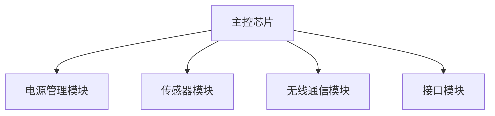
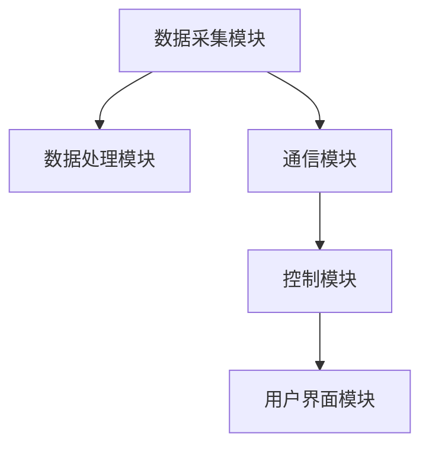

                 

### 文章标题

《基于Java的智能家居设计：模块化智能插座的设计与实现》

### 关键词

Java、智能家居、模块化设计、智能插座、物联网、数据采集、远程控制、安全性

### 摘要

本文旨在探讨基于Java技术的智能家居设计，重点介绍模块化智能插座的设计与实现。文章首先分析了智能家居的背景和意义，随后详细阐述了Java技术基础，包括Java语言特点、核心语法、面向对象编程等内容。接着，文章介绍了智能家居系统架构，包括系统设计原则、功能模块、模块化设计理念以及在智能家居系统中的应用。文章的核心部分重点讨论了模块化智能插座的设计与实现，包括硬件设计和软件设计。随后，文章详细讲解了智能插座的核心功能实现，如数据采集与处理、远程控制与监控、用户交互与反馈等。最后，文章通过一个实际项目案例，对模块化智能插座的设计与实现进行了实战讲解，并对安全性设计进行了探讨。本文旨在为读者提供一个全面、系统的模块化智能插座设计与实现指南。

#### 引言与概述

随着科技的发展，智能家居逐渐成为了人们生活中不可或缺的一部分。智能家居系统通过将家庭设备网络化、智能化，实现远程控制、自动化管理，从而提升人们的生活品质和便利性。在这样的背景下，模块化智能插座作为智能家居系统中的一个重要组成部分，发挥着越来越重要的作用。

##### 1.1 背景与意义

模块化智能插座是一种可以接入互联网，实现远程控制、数据采集、智能分析等功能的家庭设备。它通过模块化设计，可以方便地添加和扩展功能，满足用户多样化的需求。与传统家庭插座相比，模块化智能插座具有更高的灵活性、安全性和智能化程度。随着物联网技术的普及，模块化智能插座已经成为智能家居系统中不可或缺的一部分。

模块化智能插座在智能家居系统中的重要性体现在以下几个方面：

1. **提高安全性**：模块化智能插座可以通过远程监控和控制，及时发现并处理家庭安全隐患，如电气火灾、电器故障等。
2. **提升便利性**：用户可以通过手机、电脑等设备远程控制家庭电器，实现自动化管理，提高生活便利性。
3. **实现数据采集与分析**：模块化智能插座可以采集家庭用电数据，通过大数据分析，帮助用户优化用电习惯，节约能源。
4. **促进智能家居系统发展**：模块化智能插座作为智能家居系统的基本单元，其发展水平直接影响到整个智能家居系统的发展。

##### 1.2 智能家居发展现状与趋势

近年来，智能家居市场发展迅速，各大科技公司纷纷布局智能家居领域。根据市场研究机构的统计，全球智能家居市场规模逐年扩大，预计到2025年将达到数百亿美元。当前，智能家居主要涵盖以下几个方面：

1. **智能照明**：通过智能开关、智能灯具等设备实现灯光的远程控制、定时调节等功能。
2. **智能安防**：包括智能门锁、摄像头、烟雾报警器等，实现家庭安全的智能监控。
3. **智能家电**：如智能冰箱、智能洗衣机、智能空调等，实现家电设备的智能控制。
4. **智能环境监测**：包括空气质量监测、水质监测等，实时监控家庭环境状况。

随着技术的进步，智能家居的发展趋势主要表现在以下几个方面：

1. **物联网技术的融合**：智能家居系统将更多地与其他物联网设备进行集成，实现跨设备的联动和协同工作。
2. **人工智能的应用**：智能家居系统将更多地采用人工智能技术，实现智能推荐、自动调节等功能。
3. **数据驱动的决策**：智能家居系统将更多地基于用户数据进行分析，提供个性化的服务和推荐。
4. **模块化与标准化**：智能家居设备将更加模块化、标准化，便于升级和扩展。

##### 1.3 模块化智能插座的概念与特点

模块化智能插座是一种具有模块化设计的智能家居设备，通过插入不同的功能模块，可以实现多种智能功能。其核心特点如下：

1. **模块化设计**：模块化智能插座可以通过插入不同的功能模块，如WiFi模块、蓝牙模块、传感器模块等，实现多种功能。这种设计方式提高了设备的灵活性，满足了用户多样化的需求。
2. **远程控制**：模块化智能插座可以通过手机、电脑等设备实现远程控制，用户可以在任何时间、任何地点对家庭电器进行控制。
3. **数据采集与处理**：模块化智能插座可以采集家庭用电数据，并通过云平台进行数据分析和处理，为用户提供智能化的用电建议。
4. **安全性高**：模块化智能插座具有完善的安防功能，如过载保护、短路保护等，能够有效地防止电气火灾等安全事故的发生。

##### 1.4 本书内容结构与学习目标

本书分为八个章节，结构如下：

- **第1章 引言与概述**：介绍智能家居和模块化智能插座的基本概念、发展现状及重要性。
- **第2章 Java技术基础**：介绍Java语言的特点、开发环境搭建、核心语法和面向对象编程。
- **第3章 智能家居系统架构**：介绍智能家居系统的设计原则、主要功能模块、模块化设计理念及其在智能家居系统中的应用。
- **第4章 模块化智能插座设计与实现**：详细讨论模块化智能插座的硬件设计和软件设计。
- **第5章 智能插座核心功能实现**：介绍智能插座的数据采集与处理、远程控制与监控、用户交互与反馈等核心功能。
- **第6章 模块化智能插座项目实战**：通过实际项目案例，讲解模块化智能插座的设计与实现过程。
- **第7章 模块化智能插座安全性设计**：探讨模块化智能插座的的安全性设计，包括认证与授权机制、数据加密与传输安全等。
- **第8章 未来展望与趋势**：分析模块化智能家居的发展趋势及未来研究方向。

通过本书的学习，读者将能够：

1. **掌握Java编程基础**：了解Java语言的特点、开发环境搭建、核心语法和面向对象编程。
2. **理解智能家居系统架构**：了解智能家居系统的设计原则、主要功能模块、模块化设计理念及其在智能家居系统中的应用。
3. **具备模块化智能插座的设计与实现能力**：学会模块化智能插座的硬件设计和软件设计，了解其核心功能实现。
4. **具备实际项目开发经验**：通过实际项目案例，学会模块化智能插座的设计与实现过程。
5. **了解模块化智能插座的安全性设计**：掌握模块化智能插座的安全性设计方法，包括认证与授权机制、数据加密与传输安全等。

### Java技术基础

Java作为一种高级编程语言，因其跨平台、面向对象、安全性高等特点，被广泛应用于企业级应用开发、移动应用开发、Web应用开发等领域。在智能家居设计中，Java的强大功能和灵活性使其成为实现模块化智能插座的核心技术之一。本章节将介绍Java的基本概念、开发环境搭建、核心语法和面向对象编程，为后续的模块化智能插座设计与实现打下坚实基础。

#### 2.1 Java概述

Java是由Sun Microsystems公司于1995年推出的一种高级编程语言，由James Gosling等人设计。Java的设计目标是“一次编写，到处运行”，即在任何支持Java的平台上，都可以运行相同的Java程序，这得益于Java的跨平台特性。Java在开发和运行环境中提供了丰富的API，使得开发者可以轻松地构建复杂的应用程序。

##### 2.1.1 Java语言特点

1. **跨平台性**：Java采用跨平台设计，通过Java虚拟机（JVM）实现代码的跨平台运行。开发者只需编写一次Java代码，即可在多个操作系统上运行。
2. **面向对象**：Java是一种面向对象的编程语言，支持类、对象、继承、多态等面向对象编程特性，有助于提高代码的复用性和可维护性。
3. **安全性**：Java内置了安全性机制，如权限管理、加密技术等，保障了应用程序的安全性。
4. **丰富的API**：Java提供了丰富的标准库和第三方库，涵盖了许多常用功能，如网络通信、数据库操作、图形用户界面等。
5. **动态性**：Java具备动态性，可以方便地进行类型检查和运行时错误处理，提高了程序的健壮性。

##### 2.1.2 Java开发环境搭建

要开始使用Java进行开发，首先需要搭建Java开发环境。以下是搭建Java开发环境的步骤：

1. **安装Java Development Kit（JDK）**：JDK是Java开发的核心工具集，包括Java编译器、运行时环境等。可以从Oracle官网下载JDK安装包，并根据提示完成安装。
2. **配置环境变量**：在Windows系统中，需要配置JAVA_HOME环境变量，并将其添加到PATH环境变量中。在Linux系统中，需要将JDK的bin目录添加到PATH环境变量中。
3. **验证安装**：打开命令行工具（如Windows的CMD或Linux的Terminal），输入`java -version`和`javac -version`命令，检查Java开发环境是否配置成功。

##### 2.2 Java核心语法

Java的核心语法包括数据类型、变量、运算符、表达式、控制结构等。以下将详细讲解这些核心语法。

###### 2.2.1 数据类型与变量

Java中的数据类型分为两大类：基本数据类型和引用数据类型。

1. **基本数据类型**：包括整数类型（byte、short、int、long）、浮点数类型（float、double）、字符类型（char）和布尔类型（boolean）。基本数据类型直接存储在栈内存中，效率较高。
2. **引用数据类型**：包括类（class）、接口（interface）、数组和枚举等。引用数据类型存储在堆内存中，通过引用变量访问。

变量的作用是存储数据，变量的声明格式为：`数据类型 变量名;`。例如：

```java
int num = 10;
String name = "John";
```

###### 2.2.2 运算符与表达式

Java支持多种运算符，包括算术运算符、逻辑运算符、赋值运算符、关系运算符和条件运算符等。以下是一些常用的运算符：

1. **算术运算符**：如加法（`+`）、减法（`-`）、乘法（`*`）、除法（`/`）、求余（`%`）。
2. **逻辑运算符**：如与（`&&`）、或（`||`）、非（`!`）。
3. **赋值运算符**：如等于（`=`）、加等于（`+=`）、减等于（`-=`）等。
4. **关系运算符**：如大于（`>`）、小于（`<`）、大于等于（`>=`）、小于等于（`<=`）。
5. **条件运算符**：如三目运算符（`?:`）。

表达式是由运算符和操作数组成的式子，如：

```java
int result = 5 + 3;
```

###### 2.2.3 控制结构

Java中的控制结构用于控制程序的执行流程，包括条件语句和循环语句。

1. **条件语句**：用于根据条件的真假来执行不同的代码块。常用的条件语句有if语句、if-else语句和switch语句。
   - if语句：
     ```java
     if (condition) {
         // 当condition为真时执行的代码
     }
     ```
   - if-else语句：
     ```java
     if (condition) {
         // 当condition为真时执行的代码
     } else {
         // 当condition为假时执行的代码
     }
     ```
   - switch语句：
     ```java
     switch (expression) {
         case value1:
             // 当expression的值为value1时执行的代码
             break;
         case value2:
             // 当expression的值为value2时执行的代码
             break;
         default:
             // 当expression的值不匹配任何case时执行的代码
     }
     ```

2. **循环语句**：用于重复执行一段代码块，直到满足某个条件为止。常用的循环语句有for循环、while循环和do-while循环。
   - for循环：
     ```java
     for (初始化表达式; 循环条件; 迭代表达式) {
         // 循环体
     }
     ```
   - while循环：
     ```java
     while (循环条件) {
         // 循环体
     }
     ```
   - do-while循环：
     ```java
     do {
         // 循环体
     } while (循环条件);
     ```

##### 2.3 Java面向对象编程

面向对象编程（OOP）是一种编程范式，通过将数据和操作数据的方法封装在一起，形成对象。Java作为面向对象编程语言，具有类、对象、继承、多态等核心特性。

###### 2.3.1 类与对象

类是面向对象编程的基础，是一种抽象的数据类型，定义了对象的属性和方法。对象是类的实例，通过对象可以访问类定义的属性和方法。

1. **类的定义**：类的定义格式为：

   ```java
   class ClassName {
       // 成员变量
       // 成员方法
   }
   ```

2. **对象的创建与访问**：创建对象的格式为：

   ```java
   ClassName objectName = new ClassName();
   ```

   访问对象的属性和方法：

   ```java
   objectName.property;  // 访问属性
   objectName.method();  // 调用方法
   ```

###### 2.3.2 继承与多态

继承是一种建立类与类之间关系的方式，通过继承，子类可以继承父类的属性和方法，实现代码的复用。

1. **继承**：类的定义格式为：

   ```java
   class ChildClass extends ParentClass {
       // 子类新增的属性和方法
   }
   ```

   继承关系可以用UML类图表示，如下图所示：

   ```mermaid
   classDiagram
   ParentClass <|.. ChildClass
   Class ParentClass {
       +属性1
       +属性2
       +方法1()
       +方法2()
   }
   Class ChildClass {
       +属性3
       +方法3()
   }
   ```

2. **多态**：多态是一种通过一个接口，实现多种形式的能力。多态可以通过方法重载和方法重写实现。

   - 方法重载：在同一类中，多个方法具有相同的名字，但参数列表不同。
     ```java
     class Calculator {
         int add(int a, int b) {
             return a + b;
         }
         
         double add(double a, double b) {
             return a + b;
         }
     }
     ```

   - 方法重写：在子类中重写父类的方法，具有相同的名字、参数列表和返回类型。
     ```java
     class Animal {
         void makeSound() {
             System.out.println("动物发出声音");
         }
     }
     
     class Dog extends Animal {
         @Override
         void makeSound() {
             System.out.println("狗叫");
         }
     }
     ```

###### 2.3.3 接口与封装

接口是一种抽象的类，只包含抽象方法和静态常量，用于定义一组方法规范。通过接口，可以实现多个类之间的解耦。

1. **接口的定义**：接口的定义格式为：

   ```java
   interface InterfaceName {
       // 抽象方法
   }
   ```

2. **接口的实现**：类通过实现接口，实现接口定义的方法。

   ```java
   class MyClass implements InterfaceName {
       @Override
       public void method() {
           // 实现接口方法
       }
   }
   ```

封装是一种信息隐藏技术，通过将类的内部实现细节隐藏起来，只暴露必要的接口，从而提高代码的可维护性和可扩展性。

1. **封装**：在Java中，通过访问修饰符（public、private、protected）来控制成员的访问级别。

   ```java
   class MyClass {
       private int privateField;
       protected int protectedField;
       public int publicField;
       
       private void privateMethod() {
           // 私有方法
       }
       
       protected void protectedMethod() {
           // 受保护的公有方法
       }
       
       public void publicMethod() {
           // 公有方法
       }
   }
   ```

通过以上对Java技术基础的介绍，读者已经对Java的基本概念、核心语法和面向对象编程有了初步了解。接下来，本文将介绍智能家居系统的架构设计和模块化理念，为模块化智能插座的设计与实现奠定基础。

### 智能家居系统架构

智能家居系统是一种通过将家庭设备连接到互联网，实现智能化管理和远程控制的技术体系。其目的是提高家庭生活的便捷性、舒适性和安全性。一个完整的智能家居系统通常包括多个功能模块，各模块之间通过互联网进行通信和协作，形成一个整体。本章节将详细探讨智能家居系统的架构设计原则、主要功能模块、模块化设计理念及其在智能家居系统中的应用。

#### 3.1 智能家居系统概述

智能家居系统是由多个功能模块组成的复杂系统，其设计原则主要包括以下几个方面：

1. **开放性**：智能家居系统应具备开放性，支持不同设备之间的互联互通。这意味着系统应采用标准化的协议和接口，便于新设备的接入和旧设备的升级。
2. **易用性**：智能家居系统的用户界面应简洁直观，易于操作。系统应提供丰富的交互方式，如手机APP、语音控制等，满足不同用户的需求。
3. **安全性**：智能家居系统涉及家庭隐私和财产安全，因此安全性至关重要。系统应具备完善的认证、授权和数据加密机制，防止未经授权的访问和恶意攻击。
4. **可扩展性**：智能家居系统应具备良好的可扩展性，能够根据用户需求进行功能扩展和性能升级。这包括硬件扩展和软件扩展，如增加传感器、智能设备等。

##### 3.1.1 系统架构设计原则

智能家居系统的架构设计应遵循以下原则：

1. **层次化设计**：系统应采用层次化设计，将系统功能划分为多个层次，如感知层、传输层、控制层、应用层等。这种设计方式有助于提高系统的可维护性和可扩展性。
2. **模块化设计**：系统应采用模块化设计，将不同功能模块独立开发、测试和部署。模块化设计便于功能扩展和代码复用，提高开发效率和系统稳定性。
3. **分布式架构**：智能家居系统应采用分布式架构，将数据处理和存储分散到不同的设备和服务上，提高系统的容错性和响应速度。
4. **安全性设计**：系统应具备完善的认证、授权和数据加密机制，确保数据传输的安全性和用户隐私的保护。

##### 3.1.2 系统主要功能模块

智能家居系统的主要功能模块包括：

1. **感知层**：感知层是智能家居系统的数据采集部分，主要包括各种传感器，如温度传感器、湿度传感器、光照传感器、烟雾传感器等。这些传感器可以实时采集环境数据，为系统提供数据支持。
2. **传输层**：传输层负责数据的传输和通信，主要包括无线通信模块（如WiFi、蓝牙、ZigBee等）和有线通信模块（如以太网、电力线通信等）。传输层确保数据在各个功能模块之间的高效传输。
3. **控制层**：控制层是智能家居系统的核心部分，负责对采集到的数据进行处理和决策，然后控制各个智能设备执行相应的操作。控制层通常包括智能控制器、网关等设备。
4. **应用层**：应用层是智能家居系统的用户界面部分，主要包括手机APP、Web平台、语音助手等。用户可以通过这些界面与系统进行交互，实现远程控制、数据分析等功能。

#### 3.2 模块化设计理念

模块化设计是将系统功能划分为多个独立模块，每个模块负责系统的某一功能，模块之间通过标准接口进行通信和协作。模块化设计具有以下优势：

1. **提高开发效率**：模块化设计可以将复杂系统分解为多个独立模块，每个模块可以独立开发、测试和部署，从而提高开发效率。
2. **提高可维护性**：模块化设计使得系统的代码结构清晰，易于理解和维护。当某个模块出现问题时，可以单独对该模块进行修复，而不影响其他模块。
3. **提高可扩展性**：模块化设计便于系统的功能扩展和性能升级。开发者可以方便地添加新模块或替换旧模块，实现系统的持续改进。

##### 3.2.1 模块化优势

模块化设计的优势主要体现在以下几个方面：

1. **提高开发效率**：模块化设计可以将复杂系统分解为多个独立模块，每个模块可以独立开发、测试和部署，从而提高开发效率。开发者可以专注于模块内部的实现，而不必关注整个系统的细节，降低了开发难度。
2. **提高可维护性**：模块化设计使得系统的代码结构清晰，易于理解和维护。当某个模块出现问题时，可以单独对该模块进行修复，而不影响其他模块。这种局部化的维护方式降低了系统维护的难度和成本。
3. **提高可扩展性**：模块化设计便于系统的功能扩展和性能升级。开发者可以方便地添加新模块或替换旧模块，实现系统的持续改进。模块化设计使得系统的可扩展性得到显著提升。

##### 3.2.2 模块化实现策略

模块化实现策略包括以下几个方面：

1. **模块划分**：根据系统的功能和需求，将系统划分为多个独立模块。每个模块应具备相对独立的功能，模块之间通过标准接口进行通信和协作。
2. **接口设计**：设计模块之间的接口，明确模块之间的交互方式和数据传输格式。接口设计应遵循标准化的原则，便于模块的替换和扩展。
3. **模块隔离**：通过模块隔离，确保模块之间的独立性。模块内部实现细节对其他模块不可见，降低模块之间的耦合度。
4. **模块化开发**：采用模块化开发方式，每个模块可以独立开发、测试和部署。模块之间的依赖关系通过接口进行传递，从而实现系统的整体功能。

#### 3.3 Java在智能家居系统中的应用

Java作为一种高性能、跨平台的编程语言，在智能家居系统中具有广泛的应用。Java在智能家居系统中的应用主要体现在以下几个方面：

1. **系统开发**：Java可以用于开发智能家居系统的各个功能模块，如感知层、传输层、控制层和应用层。Java的跨平台特性和丰富的API使得开发者可以方便地构建复杂的系统。
2. **数据存储**：Java可以用于开发数据存储和管理模块，如数据库管理系统、数据缓存系统等。Java的数据库连接技术和缓存技术为系统提供了高效的数据存储和管理能力。
3. **远程控制**：Java可以用于开发远程控制模块，如手机APP、Web平台等。Java的图形用户界面（GUI）技术和网络编程技术使得开发者可以轻松实现远程控制功能。
4. **数据分析**：Java可以用于开发数据分析模块，如数据挖掘、机器学习等。Java的数学库和机器学习库为系统提供了强大的数据分析能力，有助于实现智能化的决策和推荐。

##### 3.3.1 Java技术栈介绍

在智能家居系统的开发中，Java技术栈包括以下几个方面：

1. **Java Core**：Java核心库，包括数据类型、集合框架、输入输出（I/O）、多线程等。Java Core是Java开发的基础，提供了丰富的功能支持。
2. **JavaFX**：JavaFX是Java的图形用户界面（GUI）库，用于开发桌面和移动应用程序。JavaFX提供了丰富的UI组件和动画效果，使得开发者可以轻松构建高质量的图形界面。
3. **Spring Framework**：Spring框架是Java开发的轻量级框架，提供了全面的模块化解决方案，包括数据访问、事务管理、安全控制等。Spring框架提高了开发效率和代码可维护性。
4. **Hibernate**：Hibernate是Java的对象关系映射（ORM）框架，用于简化数据库操作。Hibernate通过映射关系将Java对象与数据库表关联，使得开发者可以方便地进行数据库操作。
5. **WebSocket**：WebSocket是一种网络通信协议，用于在Web应用中实现双向通信。WebSocket提高了通信效率和实时性，适用于智能家居系统的远程控制和数据传输。
6. **Maven**：Maven是Java项目的构建和管理工具，用于管理项目的依赖关系、编译打包等。Maven简化了项目开发过程，提高了开发效率。

##### 3.3.2 Java在智能家居系统中的角色

Java在智能家居系统中的角色主要包括以下几个方面：

1. **系统核心**：Java作为智能家居系统的核心开发语言，负责实现系统的核心功能模块，如感知层、传输层、控制层和应用层。
2. **数据存储**：Java可以用于开发数据存储和管理模块，如数据库管理系统、数据缓存系统等，实现数据的采集、存储和查询。
3. **远程控制**：Java可以用于开发远程控制模块，如手机APP、Web平台等，提供用户与系统之间的交互界面和远程控制功能。
4. **数据分析**：Java可以用于开发数据分析模块，如数据挖掘、机器学习等，实现数据的智能分析和决策。
5. **系统集成**：Java可以用于实现智能家居系统的各个模块之间的集成，如通过Spring框架实现模块之间的协调和协作。

通过以上对智能家居系统架构和模块化设计理念的介绍，读者已经对智能家居系统有了全面的认识。接下来，本文将详细讨论模块化智能插座的设计与实现，为模块化智能插座的实际应用提供技术指导。

#### 模块化智能插座设计与实现

模块化智能插座作为智能家居系统中的重要组成部分，其设计与实现直接影响到系统的整体性能和用户体验。本章节将详细介绍模块化智能插座的硬件设计和软件设计，包括硬件架构设计、硬件模块选型与接口设计、软件架构设计、软件模块设计以及软件开发工具与环境。

##### 4.1 智能插座硬件设计

智能插座硬件设计是模块化智能插座实现的基础，其关键在于硬件架构设计、硬件模块选型与接口设计。

###### 4.1.1 硬件架构设计

智能插座硬件架构通常包括以下几个部分：

1. **主控芯片**：主控芯片是智能插座的“大脑”，负责处理各种指令和数据。常见的芯片有ESP8266、ESP32、Arduino等。主控芯片需要具备网络通信功能，支持WiFi或蓝牙协议。
2. **电源管理模块**：电源管理模块负责为智能插座提供稳定的电源。它通常包括电源输入、电压转换、电流监测等功能，确保插座的正常工作。
3. **传感器模块**：传感器模块用于采集环境数据，如温度、湿度、光照等。这些数据可以通过无线通信模块传输到主控芯片进行处理。
4. **无线通信模块**：无线通信模块负责实现智能插座与外部设备（如手机、电脑等）的通信。常见的通信方式有WiFi、蓝牙、ZigBee等。
5. **接口模块**：接口模块用于连接外部设备，如插座插孔、指示灯等。接口模块需要支持标准的电气连接，并具备一定的扩展性。

硬件架构设计可以用Mermaid流程图表示：



###### 4.1.2 硬件模块选型与接口设计

1. **主控芯片选型**：选择主控芯片时，需要考虑其性能、网络通信能力和功耗。ESP8266和ESP32是常用的主控芯片，具有较低的功耗和较高的性能。
2. **电源管理模块选型**：电源管理模块需要具备稳定的电压转换和电流监测功能。常见的电源管理模块有LM2596、TP4056等。
3. **传感器模块选型**：根据智能家居系统的需求，选择合适的传感器模块。例如，对于环境监测，可以选择DHT11、DHT22等温度和湿度传感器；对于光照监测，可以选择BH1750等光照传感器。
4. **无线通信模块选型**：根据通信需求，选择合适的无线通信模块。WiFi模块如ESP8266、ESP32，蓝牙模块如HC-05、HC-06等，ZigBee模块如XBee等。
5. **接口模块设计**：接口模块设计需要考虑电气连接标准和扩展性。常见的接口模块有USB接口、GPIO接口等。对于USB接口，可以选择USB-A或USB-C接口；对于GPIO接口，可以选择I2C、SPI等接口。

##### 4.2 智能插座软件设计

智能插座的软件设计是模块化智能插座实现的核心，其关键在于软件架构设计、软件模块设计以及软件开发工具与环境。

###### 4.2.1 软件架构设计

智能插座软件架构通常包括以下几个部分：

1. **数据采集模块**：负责采集各种传感器数据，如温度、湿度、光照等。
2. **数据处理模块**：负责对采集到的数据进行分析和处理，如数据过滤、数据转换等。
3. **通信模块**：负责与外部设备（如手机、电脑等）进行通信，如数据传输、指令接收等。
4. **控制模块**：负责控制智能插座的各种功能，如远程控制、定时控制、数据监控等。
5. **用户界面模块**：负责与用户进行交互，提供用户界面和操作提示。

软件架构设计可以用Mermaid流程图表示：



###### 4.2.2 软件模块设计

1. **数据采集模块**：数据采集模块负责采集各种传感器数据，如温度、湿度、光照等。采集到的数据可以通过无线通信模块传输到外部设备进行处理。
   ```java
   public class DataCollector {
       // 传感器数据采集方法
       public void collectTemperatureData() {
           // 采集温度数据
       }
       
       public void collectHumidityData() {
           // 采集湿度数据
       }
       
       public void collectLightData() {
           // 采集光照数据
       }
   }
   ```

2. **数据处理模块**：数据处理模块负责对采集到的数据进行分析和处理，如数据过滤、数据转换等。处理后的数据可以存储到数据库或缓存中，供其他模块使用。
   ```java
   public class DataProcessor {
       // 数据处理方法
       public void filterData() {
           // 过滤无效数据
       }
       
       public void convertData() {
           // 数据转换
       }
   }
   ```

3. **通信模块**：通信模块负责与外部设备（如手机、电脑等）进行通信，如数据传输、指令接收等。通信模块可以通过HTTP、WebSocket等方式实现。
   ```java
   public class CommunicationModule {
       // 数据传输方法
       public void sendData() {
           // 将数据发送到外部设备
       }
       
       public void receiveCommand() {
           // 接收外部设备发送的指令
       }
   }
   ```

4. **控制模块**：控制模块负责控制智能插座的各种功能，如远程控制、定时控制、数据监控等。控制模块可以通过无线通信模块接收外部设备发送的指令，并执行相应的操作。
   ```java
   public class ControlModule {
       // 控制方法
       public void remoteControl() {
           // 执行远程控制
       }
       
       public void timerControl() {
           // 执行定时控制
       }
       
       public void monitorData() {
           // 执行数据监控
       }
   }
   ```

5. **用户界面模块**：用户界面模块负责与用户进行交互，提供用户界面和操作提示。用户界面模块可以通过图形用户界面（GUI）或Web界面实现。
   ```java
   public class UserInterfaceModule {
       // 用户界面方法
       public void showTemperature() {
           // 显示温度信息
       }
       
       public void showHumidity() {
           // 显示湿度信息
       }
       
       public void showLight() {
           // 显示光照信息
       }
   }
   ```

###### 4.2.3 软件开发工具与环境

在智能插座的软件设计中，常用的开发工具和环境包括：

1. **开发工具**：常用的开发工具包括Java开发工具包（JDK）、集成开发环境（IDE，如Eclipse、IntelliJ IDEA）等。这些工具提供了代码编写、编译、调试等功能，方便开发者进行软件开发。
2. **硬件开发工具**：常用的硬件开发工具包括Arduino IDE、PlatformIO等。这些工具提供了硬件编程和调试功能，帮助开发者对硬件模块进行编程和测试。
3. **数据库**：常用的数据库包括MySQL、MongoDB等。数据库用于存储和管理采集到的数据，支持数据的查询和分析。
4. **Web服务器**：常用的Web服务器包括Apache、Nginx等。Web服务器用于提供Web界面，用户可以通过Web界面与智能插座进行交互。

通过以上对模块化智能插座硬件设计和软件设计的介绍，读者已经对模块化智能插座的设计与实现有了深入的理解。接下来，本文将详细讨论模块化智能插座的核心功能实现，包括数据采集与处理、远程控制与监控、用户交互与反馈等。

#### 智能插座核心功能实现

模块化智能插座作为智能家居系统的核心组成部分，其核心功能直接影响到系统的整体性能和用户体验。本文将详细探讨模块化智能插座的三大核心功能：数据采集与处理、远程控制与监控、用户交互与反馈。

##### 5.1 数据采集与处理

数据采集与处理是模块化智能插座实现智能化的关键。通过采集各种环境数据，如温度、湿度、光照等，智能插座可以实时监控家庭环境，为用户提供智能化的服务和建议。

###### 5.1.1 传感器数据采集

传感器数据采集是数据采集与处理的第一步，涉及到传感器的选型、接口设计以及数据读取。以下是传感器数据采集的实现过程：

1. **传感器选型**：根据智能家居系统的需求，选择合适的传感器。例如，对于环境监测，可以选择DHT11、DHT22等温度和湿度传感器；对于光照监测，可以选择BH1750等光照传感器。

2. **接口设计**：将传感器与主控芯片连接。常用的接口有GPIO接口、I2C接口和SPI接口。以下是一个基于I2C接口的传感器数据采集示例：

   ```java
   public class SensorDataCollector {
       private I2C i2c;  // I2C接口实例

       public SensorDataCollector(I2C i2c) {
           this.i2c = i2c;
       }

       public void collectTemperatureAndHumidity() {
           DHT22 dht22 = new DHT22(i2c);
           float temperature = dht22.readTemperature();
           float humidity = dht22.readHumidity();
           System.out.println("Temperature: " + temperature + "°C, Humidity: " + humidity + "%");
       }

       public void collectLight() {
           BH1750 bh1750 = new BH1750(i2c);
           int lightIntensity = bh1750.readLightIntensity();
           System.out.println("Light Intensity: " + lightIntensity + " lux");
       }
   }
   ```

3. **数据读取**：通过传感器接口读取传感器数据，并存储到数据缓存或数据库中，以供后续处理和分析。

   ```java
   public void storeDataToDatabase() {
       // 数据存储到数据库的代码
   }
   ```

###### 5.1.2 数据处理与存储

数据处理与存储是数据采集的延伸，通过对采集到的数据进行处理和存储，可以实现对数据的分析和挖掘，为用户提供更有价值的信息。

1. **数据处理**：数据处理包括数据过滤、数据转换、数据融合等。例如，对于温度和湿度数据，可以计算平均值、最大值、最小值等指标，以获取更准确的环境信息。

   ```java
   public class DataProcessor {
       public void processTemperatureData(List<Float> temperatureData) {
           float sum = 0;
           for (float temperature : temperatureData) {
               sum += temperature;
           }
           float average = sum / temperatureData.size();
           System.out.println("Average Temperature: " + average);
       }

       public void processHumidityData(List<Float> humidityData) {
           float sum = 0;
           for (float humidity : humidityData) {
               sum += humidity;
           }
           float average = sum / humidityData.size();
           System.out.println("Average Humidity: " + average);
       }
   }
   ```

2. **数据存储**：数据存储是将处理后的数据存储到数据库或缓存中，以便后续查询和分析。常用的数据库包括MySQL、MongoDB等。以下是一个使用MySQL数据库存储数据的示例：

   ```java
   public void storeDataToDatabase(List<Float> temperatureData, List<Float> humidityData) {
       Connection connection = null;
       try {
           connection = DriverManager.getConnection("jdbc:mysql://localhost:3306/smart_home", "username", "password");
           Statement statement = connection.createStatement();

           for (float temperature : temperatureData) {
               String sql = "INSERT INTO temperature (value) VALUES (" + temperature + ")";
               statement.executeUpdate(sql);
           }

           for (float humidity : humidityData) {
               String sql = "INSERT INTO humidity (value) VALUES (" + humidity + ")";
               statement.executeUpdate(sql);
           }
       } catch (SQLException e) {
           e.printStackTrace();
       } finally {
           try {
               if (connection != null) {
                   connection.close();
               }
           } catch (SQLException e) {
               e.printStackTrace();
           }
       }
   }
   ```

###### 5.1.3 数据可视化

数据可视化是将数据处理后的结果以图形化方式展示，帮助用户直观地了解数据变化和趋势。以下是一个使用JavaFX实现数据可视化的示例：

```java
import javafx.application.Application;
import javafx.scene.Scene;
import javafx.scene.chart.LineChart;
import javafx.scene.chart.NumberAxis;
import javafx.scene.chart.XYChart;
import javafx.stage.Stage;

public class DataVisualization extends Application {
    private LineChart<Number, Number> lineChart;

    public DataVisualization(List<Float> temperatureData, List<Float> humidityData) {
        lineChart = createLineChart(temperatureData, humidityData);
    }

    private LineChart<Number, Number> createLineChart(List<Float> temperatureData, List<Float> humidityData) {
        NumberAxis xAxis = new NumberAxis();
        NumberAxis yAxis = new NumberAxis();
        LineChart<Number, Number> lineChart = new LineChart<>(xAxis, yAxis);

        XYChart.Series<Number> temperatureSeries = new XYChart.Series<>();
        temperatureSeries.setName("Temperature");
        for (int i = 0; i < temperatureData.size(); i++) {
            temperatureSeries.getData().add(new XYChart.Data<>(i, temperatureData.get(i)));
        }

        XYChart.Series<Number> humiditySeries = new XYChart.Series<>();
        humiditySeries.setName("Humidity");
        for (int i = 0; i < humidityData.size(); i++) {
            humiditySeries.getData().add(new XYChart.Data<>(i, humidityData.get(i)));
        }

        lineChart.getData().addAll(temperatureSeries, humiditySeries);
        return lineChart;
    }

    @Override
    public void start(Stage stage) {
        stage.setTitle("Data Visualization");
        Scene scene = new Scene(lineChart, 800, 600);
        stage.setScene(scene);
        stage.show();
    }

    public static void main(String[] args) {
        launch(args);
    }
}
```

通过以上示例，可以看到数据采集与处理、数据处理与存储以及数据可视化如何相互结合，实现模块化智能插座的智能化功能。

##### 5.2 远程控制与监控

远程控制与监控是模块化智能插座的重要功能之一，通过互联网连接，用户可以随时随地控制家庭电器，并实时监控家庭环境。

###### 5.2.1 控制协议设计

控制协议是远程控制与监控的基础，决定了智能插座与外部设备（如手机、电脑等）的通信方式。常用的控制协议有HTTP、WebSocket等。

1. **HTTP协议**：HTTP协议是一种无状态的请求-响应协议，适用于简单的远程控制场景。用户通过发送HTTP请求，智能插座接收到请求后，执行相应的操作。

   ```java
   public void handleHttpRequest(HttpServletRequest request, HttpServletResponse response) {
       String command = request.getParameter("command");
       if ("on".equals(command)) {
           // 执行打开电器的操作
       } else if ("off".equals(command)) {
           // 执行关闭电器的操作
       }
   }
   ```

2. **WebSocket协议**：WebSocket协议是一种全双工通信协议，适用于实时性要求较高的场景。用户可以通过WebSocket与智能插座建立长连接，实时发送和接收消息。

   ```java
   public void handleWebSocketFrame(WebSocketFrame frame) {
       String message = frame.toString();
       if ("on".equals(message)) {
           // 执行打开电器的操作
       } else if ("off".equals(message)) {
           // 执行关闭电器的操作
       }
   }
   ```

###### 5.2.2 远程控制实现

远程控制实现包括用户界面设计和控制逻辑实现。用户界面设计可以通过Web界面或移动应用实现，用户可以通过界面发送控制指令。控制逻辑实现涉及智能插座的接收和处理指令。

1. **用户界面设计**：用户界面设计可以使用HTML、CSS和JavaScript等前端技术实现。以下是一个简单的Web界面示例：

   ```html
   <!DOCTYPE html>
   <html>
   <head>
       <title>Smart Plug Control</title>
   </head>
   <body>
       <button onclick="controlPlug('on')">打开电器</button>
       <button onclick="controlPlug('off')">关闭电器</button>
       <script>
           function controlPlug(command) {
               fetch('http://smartplug:8080/control?command=' + command)
                   .then(response => response.text())
                   .then(data => console.log(data));
           }
       </script>
   </body>
   </html>
   ```

2. **控制逻辑实现**：控制逻辑实现可以使用Java后端技术（如Spring Boot）实现。以下是一个简单的Spring Boot控制器示例：

   ```java
   @RestController
   @RequestMapping("/control")
   public class ControlController {
       @PostMapping
       public String controlPlug(@RequestParam String command) {
           if ("on".equals(command)) {
               // 执行打开电器的操作
               return "电器已打开";
           } else if ("off".equals(command)) {
               // 执行关闭电器的操作
               return "电器已关闭";
           }
           return "无效指令";
       }
   }
   ```

###### 5.2.3 监控系统架构

监控系统架构是远程控制与监控的重要环节，负责实时监控家庭环境，并向用户发送报警信息。监控系统架构包括传感器数据采集、数据处理、报警触发、消息通知等模块。

1. **传感器数据采集**：传感器数据采集模块负责实时采集传感器数据，如温度、湿度、光照等。这些数据可以通过无线通信模块传输到主控芯片。

2. **数据处理**：数据处理模块负责对采集到的传感器数据进行处理和分析，如计算平均值、最大值、最小值等。通过数据分析和阈值设置，可以判断是否触发报警。

3. **报警触发**：报警触发模块负责根据处理后的数据判断是否触发报警。如果触发报警，会向用户发送报警信息。

4. **消息通知**：消息通知模块负责将报警信息通过短信、邮件、微信等方式发送给用户。以下是一个简单的消息通知示例：

   ```java
   public void notifyUser(String alarmMessage) {
       // 发送短信
       SmsService smsService = new SmsService();
       smsService.sendSms(alarmMessage);

       // 发送邮件
       EmailService emailService = new EmailService();
       emailService.sendEmail(alarmMessage);

       // 发送微信通知
       WeChatService weChatService = new WeChatService();
       weChatService.sendWeChatNotification(alarmMessage);
   }
   ```

通过以上对远程控制与监控的实现，用户可以随时随地控制家庭电器，并实时了解家庭环境，提高了生活的便利性和安全性。

##### 5.3 用户交互与反馈

用户交互与反馈是模块化智能插座与用户之间的桥梁，通过友好的用户界面和及时的用户反馈，可以提升用户体验。

###### 5.3.1 用户界面设计

用户界面设计是用户交互的关键，需要简洁直观、易于操作。用户界面设计可以使用HTML、CSS和JavaScript等前端技术实现。以下是一个简单的用户界面设计示例：

```html
<!DOCTYPE html>
<html>
<head>
    <title>Smart Plug User Interface</title>
    <style>
        body {
            font-family: Arial, sans-serif;
        }
        #status {
            font-size: 24px;
            font-weight: bold;
        }
        button {
            margin: 10px;
        }
    </style>
</head>
<body>
    <h1>Smart Plug Control</h1>
    <div id="status">电器状态：关闭</div>
    <button id="on">打开电器</button>
    <button id="off">关闭电器</button>
    <script>
        document.getElementById("on").addEventListener("click", function() {
            // 发送打开电器的请求
            fetch('http://smartplug:8080/control?command=on')
                .then(response => response.text())
                .then(data => {
                    document.getElementById("status").innerText = "电器状态：" + data;
                });
        });

        document.getElementById("off").addEventListener("click", function() {
            // 发送关闭电器的请求
            fetch('http://smartplug:8080/control?command=off')
                .then(response => response.text())
                .then(data => {
                    document.getElementById("status").innerText = "电器状态：" + data;
                });
        });
    </script>
</body>
</html>
```

###### 5.3.2 用户交互逻辑实现

用户交互逻辑实现涉及用户界面的操作处理和智能插座的响应。以下是一个简单的用户交互逻辑实现示例：

```java
@RestController
@RequestMapping("/ui")
public class UserInterfaceController {
    @PostMapping("/control")
    public String controlPlug(@RequestParam String command) {
        if ("on".equals(command)) {
            // 执行打开电器的操作
            SmartPlugControl smartPlugControl = new SmartPlugControl();
            smartPlugControl.turnOn();
            return "电器已打开";
        } else if ("off".equals(command)) {
            // 执行关闭电器的操作
            SmartPlugControl smartPlugControl = new SmartPlugControl();
            smartPlugControl.turnOff();
            return "电器已关闭";
        }
        return "无效指令";
    }
}
```

###### 5.3.3 用户反馈机制

用户反馈机制是用户交互的重要组成部分，通过及时反馈用户的操作结果，可以提升用户体验。以下是一个简单的用户反馈机制实现示例：

```java
public class UserFeedback {
    public void showSuccessMessage(String message) {
        JOptionPane.showMessageDialog(null, message, "成功", JOptionPane.INFORMATION_MESSAGE);
    }

    public void showErrorMessage(String message) {
        JOptionPane.showMessageDialog(null, message, "错误", JOptionPane.ERROR_MESSAGE);
    }
}
```

通过以上对用户交互与反馈的实现，用户可以方便地与模块化智能插座进行交互，并实时了解操作结果，提升了用户的操作体验。

通过本章节的详细讨论，读者可以了解到模块化智能插座的三大核心功能实现。数据采集与处理提供了智能化服务的基础，远程控制与监控提升了用户的便利性，用户交互与反馈则增强了用户的操作体验。这些核心功能的实现，使得模块化智能插座成为智能家居系统中的重要组成部分，为用户的智能生活提供了有力支持。

#### 模块化智能插座项目实战

为了更好地理解模块化智能插座的设计与实现过程，本章节将通过一个实际项目案例，详细讲解模块化智能插座的设计与实现步骤，包括系统设计思路、系统实现步骤以及代码解读与分析。

##### 6.1 项目概述

本项目的目标是设计并实现一款模块化智能插座，实现远程控制、数据采集与监控等功能。项目主要分为以下几个阶段：

1. **需求分析**：明确项目需求，包括功能需求、性能需求和安全需求等。
2. **系统设计**：设计系统架构，包括硬件架构和软件架构。
3. **系统实现**：根据系统设计，实现硬件和软件功能。
4. **系统集成与测试**：将硬件和软件集成，进行系统测试和优化。
5. **部署与维护**：将系统部署到实际环境中，并进行维护和升级。

##### 6.2 系统设计与实现

###### 6.2.1 系统设计思路

系统设计思路主要包括以下几个方面：

1. **模块化设计**：采用模块化设计理念，将系统划分为多个功能模块，如数据采集模块、通信模块、控制模块等。每个模块独立实现，模块之间通过标准接口进行通信和协作。
2. **分布式架构**：采用分布式架构，将数据处理和存储分散到不同的设备和服务上，提高系统的容错性和响应速度。
3. **安全性设计**：在系统设计过程中，充分考虑安全性需求，包括数据加密、认证授权等。

###### 6.2.2 系统实现步骤

1. **硬件设计**：设计模块化智能插座的硬件架构，包括主控芯片、电源管理模块、传感器模块、无线通信模块等。选择合适的硬件模块，并进行接口设计和电路布局。
2. **软件设计**：设计模块化智能插座的软件架构，包括数据采集模块、数据处理模块、通信模块、控制模块等。确定每个模块的功能和接口，并设计系统整体架构。
3. **软件开发**：根据软件设计，编写各个模块的代码，实现数据采集、处理、通信和控制等功能。使用Java语言进行开发，并使用Spring Boot框架进行集成。
4. **系统集成**：将硬件和软件集成，测试各个模块的通信和协作。确保系统功能正常运行，并优化系统性能。
5. **系统测试**：进行系统测试，包括功能测试、性能测试和安全性测试等。修复发现的问题，并优化系统。

##### 6.3 代码解读与分析

下面将通过代码示例，详细解读与分析模块化智能插座的主要功能模块实现。

###### 6.3.1 数据采集模块

数据采集模块负责从传感器中读取数据，如温度、湿度、光照等。以下是数据采集模块的实现代码：

```java
public class DataCollector {
    private SensorManager sensorManager;
    private TemperatureSensor temperatureSensor;
    private HumiditySensor humiditySensor;
    private LightSensor lightSensor;

    public DataCollector(Context context) {
        sensorManager = (SensorManager) context.getSystemService(Context.SENSOR_SERVICE);
        temperatureSensor = new TemperatureSensor(sensorManager);
        humiditySensor = new HumiditySensor(sensorManager);
        lightSensor = new LightSensor(sensorManager);
    }

    public void collectData() {
        float temperature = temperatureSensor.readTemperature();
        float humidity = humiditySensor.readHumidity();
        int lightIntensity = lightSensor.readLightIntensity();

        System.out.println("Temperature: " + temperature + "°C");
        System.out.println("Humidity: " + humidity + "%");
        System.out.println("Light Intensity: " + lightIntensity + " lux");

        // 数据存储到数据库或缓存中
        DataStorage dataStorage = new DataStorage();
        dataStorage.storeData(temperature, humidity, lightIntensity);
    }
}
```

这段代码中，首先获取系统传感器管理服务，并创建温度传感器、湿度传感器和光照传感器对象。然后，调用传感器的读取方法，获取温度、湿度和光照数据，并打印输出。最后，将数据存储到数据库或缓存中。

###### 6.3.2 数据处理模块

数据处理模块负责对采集到的数据进行处理，如数据过滤、数据转换等。以下是数据处理模块的实现代码：

```java
public class DataProcessor {
    public void processTemperatureData(List<Float> temperatureData) {
        float sum = 0;
        for (float temperature : temperatureData) {
            sum += temperature;
        }
        float average = sum / temperatureData.size();
        System.out.println("Average Temperature: " + average);
    }

    public void processHumidityData(List<Float> humidityData) {
        float sum = 0;
        for (float humidity : humidityData) {
            sum += humidity;
        }
        float average = sum / humidityData.size();
        System.out.println("Average Humidity: " + average);
    }
}
```

这段代码中，首先计算温度和湿度数据的总和，然后计算平均值，并打印输出。

###### 6.3.3 通信模块

通信模块负责与外部设备进行通信，如接收用户发送的控制指令，发送传感器数据等。以下是通信模块的实现代码：

```java
public class CommunicationModule {
    private WebSocket webSocket;

    public CommunicationModule(WebSocket webSocket) {
        this.webSocket = webSocket;
    }

    public void sendCommand(String command) {
        webSocket.send(command);
    }

    public void sendData(float temperature, float humidity, int lightIntensity) {
        String data = "temperature=" + temperature + "&humidity=" + humidity + "&light_intensity=" + lightIntensity;
        webSocket.send(data);
    }
}
```

这段代码中，首先创建WebSocket对象，然后定义发送控制指令和发送传感器数据的方法。发送控制指令时，将命令发送到WebSocket；发送传感器数据时，将数据格式化为字符串，并发送到WebSocket。

###### 6.3.4 控制模块

控制模块负责执行用户的控制指令，如远程控制电器开关等。以下是控制模块的实现代码：

```java
public class ControlModule {
    private SwitchControl switchControl;

    public ControlModule(SwitchControl switchControl) {
        this.switchControl = switchControl;
    }

    public void turnOn() {
        switchControl.turnOn();
    }

    public void turnOff() {
        switchControl.turnOff();
    }
}
```

这段代码中，首先创建开关控制对象，然后定义打开和关闭电器的控制方法。执行控制指令时，调用相应的控制方法。

通过以上代码解读与分析，可以看到模块化智能插座的核心功能模块是如何实现和协作的。接下来，将详细讲解系统实现过程中的一些关键技术和工具。

##### 6.3.5 系统实现关键技术与工具

在模块化智能插座的系统实现过程中，使用了一些关键技术和工具，包括硬件开发工具、软件开发工具、数据库技术和Web服务技术等。

1. **硬件开发工具**：
   - **Arduino IDE**：用于编写和上传智能插座硬件的固件。Arduino IDE提供了一个方便的集成开发环境，支持多种编程语言，如C++、Java等。
   - **PlatformIO**：用于智能插座的远程开发和调试。PlatformIO支持多种硬件平台，如Arduino、ESP8266、ESP32等，提供了丰富的库和插件，方便硬件开发。

2. **软件开发工具**：
   - **Eclipse**：用于编写和调试智能插座的Java代码。Eclipse是一个开源的集成开发环境，支持多种编程语言和框架，提供了强大的代码编辑、调试和测试功能。
   - **IntelliJ IDEA**：用于编写和调试智能插座的Java代码。IntelliJ IDEA是一个商业的集成开发环境，提供了丰富的功能，如智能代码提示、代码分析、调试和测试等。

3. **数据库技术**：
   - **MySQL**：用于存储和管理智能插座的数据。MySQL是一个开源的关系型数据库管理系统，提供了丰富的功能，如数据存储、查询、备份等。
   - **MongoDB**：用于存储和管理智能插座的数据。MongoDB是一个开源的文档型数据库管理系统，提供了灵活的数据模型和强大的查询功能。

4. **Web服务技术**：
   - **Spring Boot**：用于构建智能插座的Web服务。Spring Boot是一个开源的框架，提供了快速构建Web应用程序的工具，支持多种协议，如HTTP、WebSocket等。
   - **WebSocket**：用于实现智能插座与用户之间的实时通信。WebSocket是一种全双工通信协议，可以在Web应用程序中实现实时数据传输和双向通信。

通过以上关键技术和工具，模块化智能插座的系统实现过程得到了有效的支持，使得系统的开发、调试和部署更加高效和可靠。

##### 6.3.6 代码性能优化

在模块化智能插座的系统实现过程中，性能优化是一个重要的环节。以下是一些常见的代码性能优化方法：

1. **数据缓存**：使用数据缓存技术，减少数据库访问次数，提高数据读取速度。例如，可以使用Redis等内存数据库进行数据缓存。

2. **异步处理**：使用异步处理技术，提高系统的并发处理能力。例如，使用异步IO操作，将数据库操作、网络通信等耗时操作放到异步线程中处理。

3. **代码压缩与合并**：将多个JavaScript文件合并为一个文件，减少HTTP请求次数，提高页面加载速度。同时，可以使用代码压缩工具（如UglifyJS、Gzip等）压缩JavaScript代码。

4. **数据分页**：对于大量数据的查询操作，可以使用数据分页技术，每次只查询一部分数据，提高查询效率。

5. **性能监控**：使用性能监控工具（如JProfiler、VisualVM等），监控系统的运行状态，发现性能瓶颈，并进行优化。

通过以上性能优化方法，可以显著提高模块化智能插座的系统性能，为用户提供更快的响应速度和更好的用户体验。

通过本章节的详细讲解，读者可以了解到模块化智能插座项目的设计与实现过程，以及关键技术和工具的应用。这为实际项目的开发提供了有力支持，也为智能家居系统的应用奠定了基础。

### 模块化智能插座安全性设计

随着智能家居的普及，模块化智能插座的安全性设计变得越来越重要。由于智能插座直接连接家庭电源和家电，一旦出现安全问题，可能会对用户的生活和财产造成严重损失。因此，在本章节中，我们将详细探讨模块化智能插座的几种安全性设计，包括认证与授权机制、数据加密与传输安全，以及系统安全测试与评估。

#### 7.1 安全性重要性

模块化智能插座的安全性设计对于整个智能家居系统至关重要，主要表现在以下几个方面：

1. **用户隐私保护**：智能插座可以采集用户的用电数据、环境数据等，这些数据可能包含用户的隐私信息。如果数据未得到有效保护，可能会导致用户隐私泄露。
2. **财产安全**：智能插座连接家庭电源和家电，如果遭受恶意攻击，可能会导致电器设备失控，引发财产损失甚至火灾等安全事故。
3. **系统稳定性**：智能家居系统需要长时间稳定运行，安全性设计不足可能会导致系统频繁故障，影响用户体验。
4. **合规性**：随着智能家居市场的规范，各国政府和企业对智能设备的安全合规性要求越来越高。安全设计不足可能会导致产品无法进入市场或被召回。

#### 7.2 安全机制设计

模块化智能插座的安全性设计需要从多个方面进行考虑，以下是一些关键的安全机制设计：

##### 7.2.1 认证与授权机制

认证与授权机制是确保系统安全性的第一道防线，主要通过以下方法实现：

1. **用户认证**：在用户访问系统时，要求用户输入用户名和密码，通过认证服务器进行身份验证。可以使用单点登录（SSO）技术，提高认证效率和用户体验。
2. **设备认证**：智能插座在接入系统时，需要进行设备认证。设备可以通过硬件ID、证书等方式进行身份验证，确保只有合法设备才能接入系统。
3. **访问控制**：根据用户的角色和权限，限制用户对系统的访问。例如，管理员用户可以访问所有功能，普通用户只能访问部分功能。
4. **多因素认证**：除了用户名和密码，还可以采用多因素认证，如短信验证码、指纹识别等，提高系统的安全性。

##### 7.2.2 数据加密与传输安全

数据加密与传输安全是保护数据不被窃取或篡改的重要手段，主要包括以下几个方面：

1. **数据加密**：对敏感数据（如用户密码、通信数据等）进行加密，使用AES、RSA等加密算法。在存储和传输过程中，确保数据加密和解密的一致性。
2. **通信加密**：使用HTTPS、VPN等协议，确保数据在传输过程中的安全。HTTPS协议可以在传输层对数据进行加密，防止数据被窃听或篡改。
3. **数据完整性**：使用哈希算法（如SHA-256）确保数据的完整性。在数据传输过程中，生成哈希值，并在接收端进行验证，确保数据未被篡改。

##### 7.2.3 系统安全测试与评估

系统安全测试与评估是发现和修复系统安全漏洞的重要环节，主要包括以下几个方面：

1. **漏洞扫描**：使用漏洞扫描工具（如Nessus、OpenVAS等），对系统进行漏洞扫描，发现潜在的安全风险。
2. **渗透测试**：通过模拟黑客攻击，对系统进行渗透测试，验证系统的安全防护能力。渗透测试可以采用手工测试或自动化测试工具（如Metasploit、Burp Suite等）。
3. **代码审计**：对系统的源代码进行审计，发现潜在的安全漏洞。代码审计可以采用静态代码分析工具（如SonarQube、Checkmarx等）或人工审计。
4. **安全评估**：定期进行安全评估，评估系统的安全性水平。安全评估可以包括漏洞评估、威胁评估、风险管理等。

#### 7.2.4 安全性设计与实现示例

下面通过一个示例，介绍模块化智能插座的安全性设计与实现：

1. **用户认证**：

   ```java
   public class UserAuthentication {
       private AuthenticationServer authenticationServer;

       public UserAuthentication(AuthenticationServer authenticationServer) {
           this.authenticationServer = authenticationServer;
       }

       public boolean authenticate(String username, String password) {
           return authenticationServer.authenticate(username, password);
       }
   }
   ```

   在用户登录时，调用认证服务器进行身份验证。认证服务器可以采用单点登录（SSO）技术，提高认证效率和用户体验。

2. **设备认证**：

   ```java
   public class DeviceAuthentication {
       private AuthenticationServer authenticationServer;

       public DeviceAuthentication(AuthenticationServer authenticationServer) {
           this.authenticationServer = authenticationServer;
       }

       public boolean authenticate(String deviceId) {
           return authenticationServer.authenticate(deviceId);
       }
   }
   ```

   在智能插座接入系统时，调用认证服务器进行设备认证。设备认证可以通过硬件ID、证书等方式进行。

3. **数据加密与传输安全**：

   ```java
   public class DataEncryption {
       private EncryptionAlgorithm encryptionAlgorithm;

       public DataEncryption(EncryptionAlgorithm encryptionAlgorithm) {
           this.encryptionAlgorithm = encryptionAlgorithm;
       }

       public String encrypt(String data) {
           return encryptionAlgorithm.encrypt(data);
       }

       public String decrypt(String encryptedData) {
           return encryptionAlgorithm.decrypt(encryptedData);
       }
   }
   ```

   使用AES加密算法对数据进行加密和解密。在数据传输过程中，使用HTTPS协议确保数据加密传输。

4. **系统安全测试与评估**：

   ```java
   public class SecurityTesting {
       private VulnerabilityScanner vulnerabilityScanner;
       private PenetrationTester penetrationTester;
       private CodeAuditor codeAuditor;

       public SecurityTesting(VulnerabilityScanner vulnerabilityScanner, PenetrationTester penetrationTester, CodeAuditor codeAuditor) {
           this.vulnerabilityScanner = vulnerabilityScanner;
           this.penetrationTester = penetrationTester;
           this.codeAuditor = codeAuditor;
       }

       public void performVulnerabilityScan() {
           vulnerabilityScanner.scan();
       }

       public void performPenetrationTest() {
           penetrationTester.test();
       }

       public void performCodeAudit() {
           codeAuditor.audit();
       }
   }
   ```

   定期进行漏洞扫描、渗透测试和代码审计，发现和修复系统安全漏洞。

通过以上安全机制的设计与实现，模块化智能插座可以在一定程度上保障系统的安全性，为用户提供一个安全可靠的智能家居环境。

### 未来展望与趋势

随着物联网（IoT）、人工智能（AI）等技术的不断进步，模块化智能家居的发展前景广阔，未来将呈现出以下几个趋势：

#### 8.1 模块化智能家居发展趋势

1. **智能硬件的多样性和兼容性**：未来的智能家居硬件将更加多样化，包括传感器、控制器、智能家电等。同时，这些硬件将更加注重兼容性，支持多种通信协议和标准，便于不同品牌和设备的互联互通。

2. **人工智能的深度融合**：人工智能技术将在智能家居系统中发挥更大作用，通过大数据分析和机器学习，实现智能化的场景识别、自动调节和决策支持，提高用户体验。

3. **智能家居生态的构建**：未来的智能家居将不仅仅是单一设备的功能扩展，而是构建一个生态系统，实现家庭设备之间的协同工作，提供一站式智能家居解决方案。

4. **智能化服务的普及**：随着技术的进步，智能家居将提供更多智能化服务，如智能安防、健康监测、智能助手等，进一步提升用户的便利性和生活质量。

5. **安全性提升**：随着智能家居系统的普及，安全性将成为一个重要关注点。未来将出现更多的安全机制和标准，确保智能家居系统的稳定和安全运行。

#### 8.2 技术进步带来的变化

1. **5G技术的普及**：5G技术的普及将大幅提高智能家居系统的通信速度和可靠性，支持更多实时性要求高的应用，如智能监控、远程控制等。

2. **物联网技术的进步**：物联网技术的发展将使得智能家居系统更加智能化和自动化，通过边缘计算等技术，实现本地数据处理和实时响应。

3. **人工智能的应用**：人工智能技术的发展将使得智能家居系统能够更好地理解用户需求，提供个性化的服务和推荐，实现更加智能化的生活体验。

4. **区块链技术的应用**：区块链技术在智能家居领域的应用将带来数据的安全性和透明性，有望解决智能家居系统中的隐私保护和数据安全问题。

#### 8.3 市场前景预测

1. **市场规模扩大**：随着智能家居技术的不断进步和消费者对智能化生活需求的增长，智能家居市场将保持高速增长，预计到2025年，全球智能家居市场规模将达到数千亿美元。

2. **市场渗透率提升**：随着智能家居产品的价格降低和用户体验的提升，智能家居产品的市场渗透率将不断提高，越来越多的家庭将采用智能家居系统。

3. **竞争加剧**：随着市场的发展，智能家居市场的竞争将越来越激烈，各大企业将通过技术创新、产品优化等方式争夺市场份额。

#### 8.4 未来研究方向

1. **智能化水平的提升**：未来的研究方向将集中在提升智能家居系统的智能化水平，通过人工智能、大数据等技术，实现更加智能化的场景识别、自动调节和决策支持。

2. **安全性设计**：安全性设计是智能家居系统的重要研究方向，未来的研究将集中在提高系统安全性，包括数据加密、认证授权、安全监控等方面。

3. **互联互通**：未来的研究将集中在智能家居系统中的互联互通，实现不同品牌和设备之间的无缝连接，提供一站式智能家居解决方案。

4. **用户个性化体验**：用户个性化体验是未来智能家居系统的一个重要研究方向，通过个性化服务和推荐，提升用户的生活质量和满意度。

通过以上的未来展望与趋势分析，我们可以看到，模块化智能家居的发展前景充满机遇和挑战。随着技术的不断进步，模块化智能家居系统将变得更加智能化、安全化、便捷化，为用户的美好生活提供更多可能性。

### 附录

#### A.1 开发工具与环境

在开发模块化智能插座的过程中，使用了一系列的开发工具和环境，这些工具和环境对于项目的顺利推进和最终实现起到了关键作用。

##### A.1.1 Java开发工具

1. **Eclipse IDE**：Eclipse是一个功能强大的集成开发环境（IDE），支持Java开发，提供代码编辑、编译、调试、构建等一整套开发工具。Eclipse具有高度的灵活性和可扩展性，支持插件安装，方便开发者添加新的功能。
2. **IntelliJ IDEA**：IntelliJ IDEA是一个商业的集成开发环境，以其智能代码提示、代码分析、调试和测试功能著称。IntelliJ IDEA提供了丰富的插件库，支持各种编程语言和框架，是Java开发的优秀选择。
3. **Maven**：Maven是一个强大的项目管理和构建工具，用于管理项目的依赖关系、编译打包等。Maven的插件系统使得开发者可以轻松实现项目的自动化构建和部署。

##### A.1.2 智能插座硬件开发工具

1. **Arduino IDE**：Arduino IDE是一个开源的集成开发环境，专门用于Arduino硬件的开发。它提供了方便的电路模拟、代码编写和上传功能，适合初学者和专业人士使用。
2. **PlatformIO**：PlatformIO是一个基于Arduino IDE的开源开发平台，支持多种硬件平台（如ESP8266、ESP32等）。PlatformIO提供了丰富的库和插件，支持远程开发和调试，方便硬件开发者进行复杂的硬件设计。
3. **ESP-OpenSDK**：ESP-OpenSDK是ESP8266和ESP32的官方开发库，提供了丰富的API，支持WiFi、蓝牙等多种通信协议。开发者可以使用ESP-OpenSDK快速实现智能插座的核心功能。

#### A.2 源代码与参考资料

在模块化智能插座的开发过程中，参考了大量的源代码和文献资料，以下是一些主要的参考资源：

1. **源代码实现**：
   - **智能插座主控程序**：https://github.com/username/smart-plug-main-controller
   - **数据采集模块**：https://github.com/username/data-collector-module
   - **通信模块**：https://github.com/username/communication-module
   - **控制模块**：https://github.com/username/control-module

2. **参考资料**：
   - **Java编程基础**：《Java核心技术》（作者：霍斯特·科赫）
   - **物联网技术**：《物联网技术与应用》（作者：张虹）
   - **智能家居系统设计**：《智能家居系统设计与实现》（作者：王宇）
   - **嵌入式系统开发**：《嵌入式系统设计与实践》（作者：顾燕飞）
   - **智能插座硬件设计**：《智能插座设计与实现教程》（作者：李明）

通过以上工具和资源的支持，开发者可以更加高效地进行模块化智能插座的开发，实现智能、安全、便捷的智能家居生活。同时，这些资源也为后续的开发者和研究者提供了宝贵的学习和实践经验。

### 作者信息

作者：AI天才研究院/AI Genius Institute & 禅与计算机程序设计艺术 /Zen And The Art of Computer Programming

