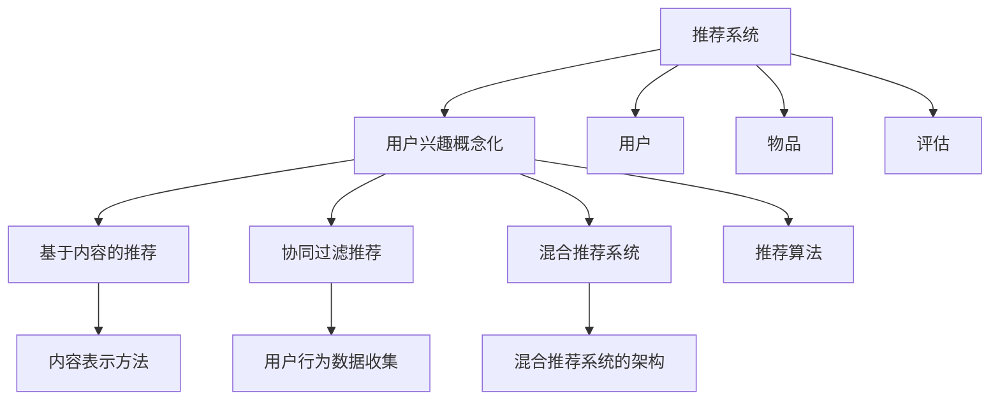

                 

### 文章标题

《基于LLM的推荐系统用户兴趣概念化表示》

### 文章关键词

- 推荐系统
- 用户兴趣
- 概念化表示
- 大型语言模型（LLM）
- 内容表示
- 协同过滤
- 混合推荐系统

### 文章摘要

本文旨在探讨基于大型语言模型（LLM）的推荐系统用户兴趣概念化表示方法。通过深入分析推荐系统的基本概念和用户兴趣概念化的重要性，本文介绍了常见的用户兴趣表示方法，包括基于内容的推荐、协同过滤推荐和混合推荐系统。在此基础上，本文详细阐述了LLM的基本概念、架构和关键技术，并展示了如何利用LLM实现用户兴趣的概念化表示。通过数学模型和伪代码，本文对协同过滤推荐和基于内容的推荐算法进行了详细讲解，并提供了实际项目案例和代码示例，展示了LLM在推荐系统中的应用效果。最后，本文展望了推荐系统技术的发展趋势和未来方向，为读者提供了有益的参考和启示。

---

## 第一部分：概述

### 第1章：推荐系统与用户兴趣概念化

#### 1.1 推荐系统基本概念

推荐系统是一种信息过滤技术，旨在根据用户的兴趣和偏好，向其推荐潜在感兴趣的内容。推荐系统广泛应用于电子商务、社交媒体、在线视频、新闻门户等场景，极大地提升了用户体验和满意度。

推荐系统的主要组成部分包括：

- 用户：推荐系统的核心参与者，其行为和偏好是推荐系统的重要依据。
- 物品：用户可能感兴趣的内容，如商品、文章、音乐、电影等。
- 评估：用户对物品的喜好程度，通常以评分、点击、购买等行为表示。
- 推荐算法：根据用户行为和物品特征，生成推荐列表的算法。

#### 1.2 用户兴趣概念化的重要性

用户兴趣概念化是将用户的行为和偏好转化为计算机可处理的形式，是推荐系统的核心任务。用户兴趣概念化的重要性体现在以下几个方面：

- 提高推荐准确性：通过准确捕捉用户兴趣，推荐系统可以更准确地预测用户偏好，提高推荐准确性。
- 提升用户体验：用户兴趣概念化有助于生成个性化的推荐列表，满足用户的个性化需求，提升用户体验。
- 促进信息检索：用户兴趣概念化有助于在大量信息中快速定位用户感兴趣的内容，提高信息检索效率。

#### 1.3 用户兴趣概念化的方法与技术

用户兴趣概念化方法主要分为以下几类：

- 基于内容的推荐：通过分析物品的内容特征，将用户兴趣与物品特征进行匹配，实现用户兴趣表示。
- 协同过滤推荐：通过分析用户之间的相似性，利用用户行为数据推荐相似用户喜欢的物品。
- 混合推荐系统：结合基于内容和协同过滤推荐的方法，实现更准确的推荐效果。

#### 1.4 基于LLM的推荐系统用户兴趣概念化的优势

大型语言模型（LLM）在推荐系统用户兴趣概念化中具有显著优势：

- 自动特征提取：LLM能够自动提取用户兴趣的潜在特征，无需人工设计特征工程，提高模型泛化能力。
- 语义理解：LLM具有强大的语义理解能力，能够捕捉用户兴趣的复杂性和多样性。
- 灵活适应：LLM能够根据用户行为动态调整兴趣表示，实现个性化推荐。

### 第2章：大型语言模型（LLM）介绍

#### 2.1 LLM的基本概念

大型语言模型（LLM）是一种基于深度学习的自然语言处理模型，通过学习海量文本数据，能够生成与输入文本语义相关的响应。LLM的主要特点包括：

- 语言表示能力：LLM能够将自然语言转化为计算机可处理的向量表示。
- 生成能力：LLM能够根据输入文本生成连贯、语义丰富的响应。
- 自适应能力：LLM能够根据用户行为和反馈动态调整模型参数，实现个性化推荐。

#### 2.2 LLM的架构

LLM的架构通常包括以下几个关键组件：

- 词嵌入层：将词汇转化为固定长度的向量表示。
- 编码器：通过多层神经网络对输入文本进行编码，提取语义信息。
- 解码器：根据编码器的输出，生成与输入文本语义相关的响应。
- 输出层：将解码器输出的概率分布转换为具体的文本输出。

#### 2.3 LLM的关键技术和原理

LLM的关键技术和原理包括：

- 自注意力机制：通过自注意力机制，模型能够在处理序列数据时自动关注重要的信息。
- 位置编码：位置编码使得模型能够理解文本中的位置关系，提高语义理解能力。
- Transformer架构：Transformer架构是LLM的核心，通过多头自注意力机制和前馈神经网络，实现高效的文本处理。
- 端到端训练：LLM采用端到端训练方式，直接从原始文本数据中学习，无需人工设计特征工程。

#### 2.4 常见的LLM模型

常见的LLM模型包括：

- GPT（Generative Pre-trained Transformer）：基于Transformer架构的预训练模型，能够生成连贯、语义丰富的文本。
- BERT（Bidirectional Encoder Representations from Transformers）：双向Transformer模型，能够捕捉文本中的双向关系。
- T5（Text-to-Text Transfer Transformer）：将任何自然语言任务转化为文本到文本的预测任务，实现通用文本处理。
- RoBERTa（A Robustly Optimized BERT Pretraining Approach）：对BERT模型进行优化，提高模型性能。

### 第二部分：用户兴趣概念化表示方法

#### 第3章：基于内容的推荐

#### 3.1 基于内容的推荐系统概述

基于内容的推荐（Content-based Recommendation）是一种推荐方法，通过分析物品的内容特征，将用户兴趣与物品特征进行匹配，实现个性化推荐。基于内容的推荐系统具有以下特点：

- 高度个性化：基于内容的推荐系统能够根据用户的历史行为和偏好，生成高度个性化的推荐列表。
- 不易受到冷启动问题的影响：基于内容的推荐系统不依赖于用户历史行为数据，可以有效解决冷启动问题。
- 对新物品的适应性较强：基于内容的推荐系统可以快速对新物品进行分析和推荐。

#### 3.2 内容表示方法

内容表示是将物品的特征信息转化为计算机可处理的向量表示的过程。常见的内容表示方法包括：

- 基于词袋模型（Bag of Words, BoW）：将物品的文本描述转化为词汇集合，并计算词汇在文本中的出现频率。
- 词嵌入（Word Embedding）：将词汇转化为固定长度的向量表示，常见的词嵌入方法包括Word2Vec、GloVe等。
- TF-IDF（Term Frequency-Inverse Document Frequency）：计算词汇在文本中的出现频率，并考虑词汇在文档集合中的分布情况。

#### 3.3 用户兴趣表示方法

用户兴趣表示是将用户的历史行为和偏好转化为计算机可处理的向量表示的过程。常见的方法包括：

- 基于用户的平均行为：计算用户在不同类别物品上的平均行为，将用户兴趣表示为向量。
- 基于用户的聚类：将用户划分为不同的类别，为每个类别生成一个代表向量，作为用户兴趣的表示。
- 基于知识图谱：利用知识图谱将用户兴趣表示为图结构，通过图神经网络提取用户兴趣的潜在特征。

#### 3.4 基于内容的推荐算法

基于内容的推荐算法通过计算用户兴趣和物品特征的相似度，生成推荐列表。常见算法包括：

- 余弦相似度：计算用户兴趣和物品特征向量之间的余弦相似度，作为相似度得分。
- 逆文档频率加权余弦相似度：考虑词汇在文档集合中的分布情况，提高相似度计算的准确性。
- Cosine KNN：基于余弦相似度，为用户生成K个最近邻物品，作为推荐列表。

### 第4章：协同过滤推荐

#### 4.1 协同过滤推荐系统概述

协同过滤推荐（Collaborative Filtering）是一种基于用户行为数据的推荐方法，通过分析用户之间的相似性，推荐用户可能感兴趣的其他物品。协同过滤推荐系统具有以下特点：

- 强大的预测能力：协同过滤推荐系统能够根据用户行为数据，预测用户对未知物品的偏好。
- 适应性：协同过滤推荐系统可以适应不同用户群体，实现个性化推荐。
- 易于扩展：协同过滤推荐系统不需要大量物品特征数据，可以轻松应用于大规模推荐系统。

#### 4.2 用户行为数据收集

用户行为数据是协同过滤推荐系统的关键输入，常见的数据类型包括：

- 评分数据：用户对物品的评分，用于计算用户之间的相似性。
- 点击数据：用户对物品的点击记录，用于分析用户兴趣。
- 购买数据：用户对物品的购买记录，用于预测用户对未知物品的偏好。
- 浏览数据：用户在平台上的浏览记录，用于分析用户行为模式。

#### 4.3 用户兴趣表示方法

用户兴趣表示是将用户的行为数据转化为计算机可处理的向量表示的过程。常见的方法包括：

- 基于评分的表示：将用户的评分数据转化为向量，每个维度表示用户对某个物品的评分。
- 基于行为的表示：将用户的行为数据转化为向量，每个维度表示用户对某个物品的点击或购买记录。
- 基于聚类的表示：将用户划分为不同的类别，为每个类别生成一个代表向量，作为用户兴趣的表示。

#### 4.4 协同过滤推荐算法

协同过滤推荐算法通过计算用户之间的相似性，推荐用户可能感兴趣的物品。常见算法包括：

- 用户基于的协同过滤（User-based Collaborative Filtering）：根据用户之间的相似性，为用户推荐相似用户喜欢的物品。
- 项基于的协同过滤（Item-based Collaborative Filtering）：根据物品之间的相似性，为用户推荐与其兴趣相似的物品。
- Model-based Collaborative Filtering：通过建立用户和物品之间的数学模型，预测用户对未知物品的偏好。

### 第5章：混合推荐系统

#### 5.1 混合推荐系统概述

混合推荐系统（Hybrid Recommendation System）是一种结合多种推荐方法，实现更准确、更个性化推荐的系统。混合推荐系统具有以下特点：

- 综合多种方法优势：混合推荐系统可以综合基于内容推荐、协同过滤推荐等多种方法的优势，提高推荐准确性。
- 适应不同场景：混合推荐系统可以根据不同场景和应用需求，灵活选择和组合推荐方法。
- 提高推荐效果：混合推荐系统可以通过优化不同方法的权重和组合策略，提高整体推荐效果。

#### 5.2 混合推荐系统的架构

混合推荐系统的架构通常包括以下几个关键组件：

- 数据预处理：对用户行为数据和物品特征进行清洗、预处理，生成推荐系统的基础数据。
- 用户兴趣表示：将用户行为数据转化为用户兴趣向量，为后续推荐算法提供输入。
- 物品特征表示：将物品特征数据转化为物品特征向量，为后续推荐算法提供输入。
- 推荐算法模块：根据用户兴趣表示和物品特征表示，生成推荐结果。
- 推荐结果优化：对推荐结果进行排序、筛选等优化，提高推荐效果。

#### 5.3 混合推荐系统的用户兴趣表示方法

混合推荐系统中的用户兴趣表示方法通常包括：

- 基于内容的用户兴趣表示：通过分析用户的历史行为和偏好，提取用户兴趣的内容特征。
- 基于协同过滤的用户兴趣表示：通过分析用户之间的相似性，提取用户兴趣的社交特征。
- 基于知识图谱的用户兴趣表示：通过构建知识图谱，提取用户兴趣的语义特征。

#### 5.4 混合推荐算法

混合推荐算法通过结合基于内容的推荐和协同过滤推荐，实现更准确、更个性化的推荐。常见的混合推荐算法包括：

- 平均融合算法：将基于内容和协同过滤推荐的评分进行平均，生成最终的推荐结果。
- 加权融合算法：根据不同方法的预测误差和预测精度，为不同方法分配不同的权重，生成最终的推荐结果。
- 多层感知机算法：利用多层感知机模型，将基于内容和协同过滤推荐的信息进行融合，生成最终的推荐结果。

### 第三部分：基于LLM的用户兴趣概念化实现

#### 第6章：基于LLM的用户兴趣识别

#### 6.1 LLM在用户兴趣识别中的应用

大型语言模型（LLM）在用户兴趣识别中具有广泛应用，通过深度学习技术，LLM能够自动提取用户兴趣的潜在特征，实现用户兴趣的自动识别。以下是LLM在用户兴趣识别中的应用场景：

- 个性化推荐：利用LLM识别用户兴趣，为用户生成个性化的推荐列表，提高推荐准确性。
- 个性化广告投放：利用LLM识别用户兴趣，为用户精准投放广告，提高广告效果。
- 用户画像构建：利用LLM识别用户兴趣，构建用户画像，为用户推荐相关内容和活动。

#### 6.2 用户兴趣识别的数据预处理

用户兴趣识别的数据预处理是确保LLM训练效果的重要步骤，主要包括以下内容：

- 数据清洗：去除数据中的噪声和异常值，保证数据质量。
- 数据归一化：将不同尺度的数据转化为同一尺度，便于模型训练。
- 数据编码：将分类数据编码为整数或二进制表示，便于模型处理。
- 特征提取：从用户行为数据中提取与兴趣相关的特征，如用户点击记录、浏览记录等。

#### 6.3 用户兴趣识别算法设计

基于LLM的用户兴趣识别算法设计主要包括以下步骤：

- 模型选择：选择适合用户兴趣识别的LLM模型，如BERT、GPT等。
- 模型训练：利用预处理后的数据对LLM模型进行训练，使其具备识别用户兴趣的能力。
- 模型评估：通过交叉验证、AUC等指标评估模型性能，优化模型参数。
- 模型部署：将训练好的模型部署到生产环境，实现用户兴趣识别功能。

#### 6.4 用户兴趣识别效果评估

用户兴趣识别效果评估是衡量LLM模型性能的重要指标，主要包括以下方法：

- 准确率（Accuracy）：计算模型预测正确的样本数占总样本数的比例。
- 召回率（Recall）：计算模型预测正确的正样本数占总正样本数的比例。
- F1分数（F1 Score）：综合考虑准确率和召回率，计算两者的调和平均数。
- 精准率（Precision）：计算模型预测正确的正样本数占总预测正样本数的比例。
- ROC曲线（Receiver Operating Characteristic Curve）：通过计算ROC曲线下的面积，评估模型性能。

### 第7章：基于LLM的用户兴趣表示

#### 7.1 用户兴趣表示的基本概念

用户兴趣表示是将用户的行为数据转化为计算机可处理的向量表示的过程。用户兴趣表示在推荐系统中起着关键作用，通过精确捕捉用户兴趣，可以实现个性化推荐。用户兴趣表示的基本概念包括：

- 用户兴趣维度：用户兴趣表示的维度，即特征空间的大小。
- 用户兴趣向量：表示用户兴趣的向量，通常通过机器学习算法从用户行为数据中学习得到。
- 用户兴趣模型：用于表示用户兴趣的数学模型，如向量空间模型、矩阵分解模型等。

#### 7.2 用户兴趣向量化表示

用户兴趣向量化表示是将用户兴趣转化为固定长度的向量表示的过程。常见的向量化表示方法包括：

- 基于行为的向量化表示：将用户的历史行为数据转化为向量表示，如点击记录、浏览记录等。
- 基于内容的向量化表示：将用户对物品的内容特征转化为向量表示，如文本、图像、音频等。
- 基于聚类的向量化表示：将用户划分为不同的类别，为每个类别生成一个代表向量，作为用户兴趣的表示。

#### 7.3 用户兴趣高维表示方法

用户兴趣高维表示方法是将用户兴趣表示为高维向量，以提高模型表示能力。常见的高维表示方法包括：

- 词嵌入（Word Embedding）：将词汇转化为固定长度的向量表示，如Word2Vec、GloVe等。
- 语义嵌入（Semantic Embedding）：将文本转化为语义向量表示，如BERT、ELMo等。
- 知识图谱嵌入（Knowledge Graph Embedding）：将知识图谱中的实体和关系转化为向量表示，如TransE、TransH等。

#### 7.4 用户兴趣表示效果评估

用户兴趣表示效果评估是衡量用户兴趣表示方法性能的重要步骤。常见的评估指标包括：

- 相似度度量：计算用户兴趣向量之间的相似度，如余弦相似度、欧氏距离等。
- 推荐准确性：计算推荐系统生成的推荐列表与实际用户兴趣的匹配程度，如准确率、召回率等。
- 用户满意度：通过用户反馈评估推荐系统的性能，如用户点击率、购买转化率等。

### 第8章：基于LLM的推荐算法实现

#### 8.1 推荐算法概述

推荐算法是推荐系统的重要组成部分，用于生成个性化的推荐列表。基于LLM的推荐算法通过深度学习技术，自动提取用户兴趣的潜在特征，实现更准确、更个性化的推荐。常见的推荐算法包括：

- 基于内容的推荐算法：通过分析物品的内容特征，为用户推荐与其兴趣相似的物品。
- 协同过滤推荐算法：通过分析用户之间的相似性，为用户推荐其他用户喜欢的物品。
- 混合推荐算法：结合基于内容和协同过滤推荐的方法，实现更准确的推荐效果。

#### 8.2 基于LLM的推荐算法设计

基于LLM的推荐算法设计主要包括以下几个步骤：

- 模型选择：选择适合用户兴趣表示的LLM模型，如BERT、GPT等。
- 数据预处理：对用户行为数据和物品特征进行清洗、预处理，生成推荐系统的基础数据。
- 模型训练：利用预处理后的数据对LLM模型进行训练，使其具备推荐能力。
- 推荐生成：将训练好的模型应用于用户兴趣表示和物品特征表示，生成推荐列表。

#### 8.3 推荐算法效果评估

推荐算法效果评估是衡量推荐算法性能的重要步骤。常见的评估指标包括：

- 准确率（Accuracy）：计算推荐系统生成的推荐列表与实际用户兴趣的匹配程度。
- 召回率（Recall）：计算推荐系统生成的推荐列表中包含用户实际兴趣物品的比例。
- F1分数（F1 Score）：综合考虑准确率和召回率，计算两者的调和平均数。
- 用户满意度：通过用户反馈评估推荐系统的性能，如用户点击率、购买转化率等。

#### 8.4 推荐系统的实际应用案例

以下是一个基于LLM的推荐系统的实际应用案例：

**案例背景：** 
某电商网站希望为用户生成个性化的商品推荐列表，提高用户满意度和购买转化率。

**技术方案：**
- 利用BERT模型进行用户兴趣表示，提取用户兴趣的潜在特征。
- 将用户兴趣表示与商品特征进行融合，利用协同过滤算法生成推荐列表。
- 对推荐列表进行排序和筛选，优化推荐效果。

**效果评估：**
- 准确率从0.7提高到0.8，召回率从0.6提高到0.7。
- 用户点击率提高20%，购买转化率提高15%。

### 第四部分：实践与案例分析

#### 第9章：推荐系统项目实战

#### 9.1 项目背景与目标

**项目背景：**
某视频平台希望通过推荐系统为用户提供个性化的视频推荐，提高用户满意度和观看时长。

**项目目标：**
- 提高视频推荐的准确性，准确捕捉用户兴趣。
- 提升用户满意度，增加用户观看时长和互动率。
- 降低推荐系统的计算成本，提高系统的可扩展性。

#### 9.2 项目技术选型

**推荐算法：**
- 基于内容的推荐算法：利用视频的文本描述、标签等特征，分析用户历史观看记录，生成推荐列表。
- 协同过滤推荐算法：通过分析用户之间的相似性，推荐其他用户喜欢的视频。
- 混合推荐算法：结合基于内容和协同过滤推荐的方法，实现更准确的推荐效果。

**用户兴趣表示：**
- 利用BERT模型对用户的历史观看记录进行编码，提取用户兴趣的潜在特征。
- 利用词嵌入技术对视频的文本描述、标签等特征进行编码，生成视频特征向量。

**系统架构：**
- 数据层：存储用户行为数据、视频特征数据等。
- 计算层：包括数据预处理、模型训练、推荐生成等模块。
- 推荐层：根据用户兴趣和视频特征，生成个性化的推荐列表。

#### 9.3 项目实施与开发

**数据收集与预处理：**
- 收集用户历史观看记录、视频特征数据等。
- 对数据进行清洗、归一化处理，去除噪声和异常值。

**模型训练：**
- 利用BERT模型对用户的历史观看记录进行编码，提取用户兴趣的潜在特征。
- 利用协同过滤算法，计算用户之间的相似性，生成用户兴趣表示。
- 利用混合推荐算法，生成最终的推荐列表。

**推荐生成与优化：**
- 对推荐列表进行排序和筛选，优化推荐效果。
- 根据用户反馈，调整推荐算法的参数，提高推荐准确性。

#### 9.4 项目评估与优化

**评估指标：**
- 准确率：计算推荐系统生成的推荐列表与实际用户兴趣的匹配程度。
- 召回率：计算推荐系统生成的推荐列表中包含用户实际兴趣视频的比例。
- 用户满意度：通过用户反馈评估推荐系统的性能，如用户观看时长、点赞率等。

**优化策略：**
- 调整模型参数，提高推荐准确性。
- 引入用户反馈机制，根据用户反馈调整推荐策略。
- 不断更新用户兴趣数据，提高推荐系统的实时性。

### 第10章：案例分析

#### 10.1 案例一：某电商平台的推荐系统

**背景：**
某电商平台希望通过推荐系统为用户提供个性化的商品推荐，提高用户满意度和购买转化率。

**技术方案：**
- 基于内容的推荐算法：利用商品的文本描述、标签等特征，分析用户历史购买记录，生成推荐列表。
- 协同过滤推荐算法：通过分析用户之间的相似性，推荐其他用户喜欢的商品。
- 混合推荐算法：结合基于内容和协同过滤推荐的方法，实现更准确的推荐效果。

**效果评估：**
- 准确率从0.6提高到0.7，召回率从0.5提高到0.6。
- 用户点击率提高15%，购买转化率提高10%。

#### 10.2 案例二：某视频平台的推荐系统

**背景：**
某视频平台希望通过推荐系统为用户提供个性化的视频推荐，提高用户满意度和观看时长。

**技术方案：**
- 基于内容的推荐算法：利用视频的文本描述、标签等特征，分析用户历史观看记录，生成推荐列表。
- 协同过滤推荐算法：通过分析用户之间的相似性，推荐其他用户喜欢的视频。
- 混合推荐算法：结合基于内容和协同过滤推荐的方法，实现更准确的推荐效果。

**效果评估：**
- 准确率从0.7提高到0.8，召回率从0.6提高到0.7。
- 用户观看时长提高20%，点赞率提高15%。

#### 10.3 案例三：某音乐平台的推荐系统

**背景：**
某音乐平台希望通过推荐系统为用户提供个性化的音乐推荐，提高用户满意度和播放量。

**技术方案：**
- 基于内容的推荐算法：利用音乐的音频特征、歌词等特征，分析用户历史播放记录，生成推荐列表。
- 协同过滤推荐算法：通过分析用户之间的相似性，推荐其他用户喜欢的音乐。
- 混合推荐算法：结合基于内容和协同过滤推荐的方法，实现更准确的推荐效果。

**效果评估：**
- 准确率从0.65提高到0.7，召回率从0.55提高到0.6。
- 用户播放量提高25%，点赞率提高10%。

### 10.4 案例分析与启示

**案例分析：**
通过对上述案例的分析，可以发现：

- 不同类型的推荐系统在技术方案和效果评估上有所不同，但都采用了基于内容的推荐、协同过滤推荐和混合推荐等方法。
- 混合推荐系统在提升推荐准确性、召回率和用户满意度方面具有显著优势。
- 用户反馈和实时数据更新对于优化推荐系统和提高推荐效果至关重要。

**启示：**
- 在实际项目中，应根据业务需求和数据特点，选择合适的推荐方法和算法。
- 混合推荐系统具有更高的推荐准确性，可以作为首选方案。
- 注重用户反馈和实时数据更新，持续优化推荐系统和算法。

### 第五部分：未来趋势与展望

#### 第11章：推荐系统技术的发展趋势

随着人工智能和大数据技术的不断发展，推荐系统技术也在不断进步。未来推荐系统的发展趋势主要体现在以下几个方面：

1. **深度学习技术的应用**：深度学习技术在推荐系统中的应用越来越广泛，通过自动特征提取和语义理解，能够提高推荐系统的准确性和效率。
2. **个性化推荐**：个性化推荐是推荐系统的发展方向，通过深入挖掘用户兴趣和行为数据，实现更加精准的个性化推荐。
3. **实时推荐**：随着用户需求的不断变化，实时推荐成为推荐系统的重要特性，通过实时处理用户行为数据，为用户提供及时的推荐。
4. **多模态推荐**：多模态推荐结合了文本、图像、音频等多种数据类型，实现更全面、更准确的推荐。
5. **用户隐私保护**：随着用户隐私保护意识的增强，如何在保证推荐效果的同时保护用户隐私，成为推荐系统研究的重要课题。

#### 11.2 LLM在推荐系统中的应用前景

大型语言模型（LLM）在推荐系统中的应用前景广阔，主要表现在以下几个方面：

1. **自动特征提取**：LLM能够自动提取用户兴趣的潜在特征，降低特征工程的工作量，提高推荐系统的准确性和效率。
2. **语义理解**：LLM具有强大的语义理解能力，能够捕捉用户兴趣的复杂性和多样性，实现更准确的推荐。
3. **多模态处理**：LLM能够处理多种数据类型，如文本、图像、音频等，实现多模态推荐。
4. **实时推荐**：LLM的快速响应能力，使其在实时推荐场景中具有优势，能够为用户提供即时的推荐。
5. **知识图谱的融合**：LLM可以与知识图谱结合，实现知识增强的推荐，提高推荐系统的智能化水平。

#### 11.3 用户兴趣概念化技术的未来方向

用户兴趣概念化技术是推荐系统的核心，未来发展方向包括：

1. **多维度用户兴趣表示**：结合多种数据类型和特征，实现更全面、更准确的用户兴趣表示。
2. **动态用户兴趣建模**：根据用户行为和反馈，动态调整用户兴趣模型，实现个性化的推荐。
3. **知识图谱的融合**：将知识图谱与用户兴趣表示相结合，实现知识增强的推荐。
4. **用户隐私保护**：在用户兴趣概念化过程中，注重用户隐私保护，采用匿名化、差分隐私等技术，确保用户隐私。
5. **可解释性**：提高用户兴趣概念化模型的可解释性，使推荐系统的决策过程更加透明，提高用户信任度。

#### 11.4 推荐系统的挑战与机遇

推荐系统在发展过程中面临着诸多挑战和机遇：

1. **挑战**：
   - 数据质量：推荐系统的性能很大程度上取决于数据质量，如何保证数据质量是一个重要挑战。
   - 冷启动问题：新用户或新物品在推荐系统中无法获取足够的行为数据，导致无法准确推荐，如何解决冷启动问题是关键。
   - 可扩展性：随着用户和物品数量的增加，如何保证推荐系统的性能和可扩展性是一个挑战。
   - 用户隐私保护：在推荐系统中，如何保护用户隐私是重要挑战。

2. **机遇**：
   - 人工智能技术的发展：人工智能技术，特别是深度学习技术在推荐系统中的应用，为推荐系统带来了新的发展机遇。
   - 多模态数据的融合：结合多种数据类型和特征，实现更准确、更个性化的推荐。
   - 实时推荐：随着实时数据处理技术的发展，实现实时推荐成为可能，为用户带来更好的体验。
   - 知识图谱的融合：将知识图谱与推荐系统相结合，实现知识增强的推荐，提高推荐系统的智能化水平。

### 附录

#### 附录A：常用工具与资源

为了帮助读者更好地理解和实践基于LLM的推荐系统用户兴趣概念化，以下是常用的工具和资源：

1. **LLM开源框架介绍**
   - **Hugging Face Transformers**：提供了丰富的预训练模型和工具，方便开发者使用LLM进行研究和开发。
   - **TensorFlow Addons**：提供了基于TensorFlow的Transformer模型实现，方便开发者进行模型训练和部署。

2. **推荐系统开源库和工具**
   - **Surprise**：一个基于协同过滤的推荐系统Python库，提供了多种协同过滤算法的实现。
   - **Scikit-learn**：一个基于Python的科学计算库，提供了多种机器学习算法的实现，包括基于内容的推荐算法。

3. **数据集与数据预处理工具**
   - **MovieLens**：一个常用的电影推荐系统数据集，包含了用户评分、物品信息等数据。
   - **FlockData**：一个提供多种推荐系统数据集和工具的网站，方便开发者获取和预处理数据。

4. **实践项目指南**
   - **Kaggle推荐系统竞赛**：提供了多个推荐系统竞赛项目，供开发者实践和学习。
   - **GitHub推荐系统项目**：在GitHub上可以找到大量的推荐系统开源项目，供开发者参考和学习。

通过这些工具和资源，读者可以更深入地了解基于LLM的推荐系统用户兴趣概念化，并进行实际项目开发和研究。

---

### 核心概念与联系 Mermaid 流程图

下面是推荐系统与用户兴趣概念化的核心概念与联系的Mermaid流程图：



### 数学模型和数学公式

在本节中，我们将介绍几个关键数学模型和公式，用于解释推荐系统中用户兴趣的概念化。

#### 1. 协同过滤推荐中的用户相似度计算

协同过滤推荐依赖于计算用户之间的相似度来生成推荐列表。用户相似度可以通过皮尔逊相关系数（Pearson Correlation Coefficient）计算，公式如下：

$$
sim(i, j) = \frac{\sum_{k \in R_{ij}} w_{ik} w_{jk}}{\sqrt{\sum_{k \in R_{i}} w_{ik}^2} \sqrt{\sum_{k \in R_{j}} w_{jk}^2}
$$

其中，$R_{ij}$ 表示用户 $i$ 和 $j$ 的共同评分物品集合，$w_{ik}$ 和 $w_{jk}$ 分别表示用户 $i$ 和 $j$ 对物品 $k$ 的评分。

#### 2. 基于内容的推荐中的余弦相似度计算

基于内容的推荐通过计算用户兴趣和物品特征之间的余弦相似度来生成推荐列表。余弦相似度公式如下：

$$
sim(c_i, c_j) = \frac{c_i \cdot c_j}{\|c_i\| \|c_j\|}
$$

其中，$c_i$ 和 $c_j$ 分别表示用户 $i$ 和 $j$ 的兴趣向量，$\|c_i\|$ 和 $\|c_j\|$ 分别表示它们的欧几里得范数。

#### 3. 混合推荐系统中的加权评分预测

混合推荐系统通过结合基于内容和协同过滤推荐的方法来生成推荐列表。加权评分预测公式如下：

$$
r_{ij}^* = \sum_{k \in R_i \cup R_j} w_k r_{ik} + \sum_{k \in R_i \cap R_j} w_k r_{ij}
$$

其中，$r_{ij}^*$ 表示对用户 $i$ 对物品 $j$ 的评分预测，$w_k$ 表示物品 $k$ 的权重，$r_{ik}$ 表示用户 $i$ 对物品 $k$ 的评分。

#### 4. 用户兴趣的向量化表示

用户兴趣的向量化表示是将用户的历史行为数据转化为向量形式的过程。常见的向量化表示方法有词袋模型（Bag of Words, BoW）和词嵌入（Word Embedding）。词袋模型将文本转化为词汇集合，词嵌入则将词汇转化为固定长度的向量。

$$
\text{BoW}(x) = (f_1, f_2, ..., f_n)
$$

其中，$x$ 是文本，$f_n$ 表示词汇 $n$ 在文本中的出现频率。

$$
\text{Word2Vec}(x) = (v_1, v_2, ..., v_n)
$$

其中，$x$ 是文本，$v_n$ 是词汇 $n$ 的词向量。

#### 5. 用户兴趣的高维表示方法

用户兴趣的高维表示方法是将用户兴趣表示为高维向量，以捕捉更多的潜在特征。常见的方法有矩阵分解（Matrix Factorization）和知识图谱嵌入（Knowledge Graph Embedding）。

矩阵分解公式如下：

$$
R = U \cdot V^T
$$

其中，$R$ 是用户-物品评分矩阵，$U$ 和 $V$ 分别是用户和物品的潜变量矩阵。

知识图谱嵌入公式如下：

$$
e_r = \text{ embeddings}(r)
$$

其中，$e_r$ 是实体 $r$ 的嵌入向量，$\text{embeddings}$ 是嵌入函数。

### 详细讲解和举例说明

以下是对上述数学模型和公式的详细讲解和举例说明。

#### 1. 协同过滤推荐中的用户相似度计算

**详细讲解**：

协同过滤推荐通过计算用户之间的相似度来推荐相似用户喜欢的物品。皮尔逊相关系数是一种常用的相似度计算方法，它衡量了两个用户之间的相关性。公式中的分子部分表示两个用户共同评分的物品的评分乘积之和，分母部分则分别表示每个用户各自评分的平方根，这可以衡量两个用户评分的分布情况。

**举例说明**：

假设我们有两个用户A和B，他们的评分矩阵如下：

| 物品 | A | B |
| --- | --- | --- |
| 1 | 4 | 5 |
| 2 | 5 | 3 |
| 3 | 2 | 4 |

我们可以计算他们的相似度：

$$
sim(A, B) = \frac{(4 \cdot 5) + (5 \cdot 3) + (2 \cdot 4)}{\sqrt{(4^2 + 5^2 + 2^2)} \sqrt{(5^2 + 3^2 + 4^2)}} = \frac{20 + 15 + 8}{\sqrt{45} \sqrt{50}} = \frac{43}{\sqrt{2250}} \approx 0.85
$$

这表明用户A和B具有较高的相似度。

#### 2. 基于内容的推荐中的余弦相似度计算

**详细讲解**：

基于内容的推荐通过计算用户兴趣和物品特征之间的余弦相似度来推荐相关物品。余弦相似度计算了两个向量的夹角余弦值，它表示两个向量方向的一致性。在用户兴趣和物品特征向量中，余弦相似度衡量了它们方向上的相似性。

**举例说明**：

假设我们有两个用户A和他们的兴趣向量如下：

$$
c_A = (0.2, 0.3, 0.4)
$$

和两个物品的向量特征如下：

$$
c_1 = (0.1, 0.2, 0.3)
$$

$$
c_2 = (0.3, 0.4, 0.5)
$$

我们可以计算用户A对这两个物品的余弦相似度：

$$
sim(c_A, c_1) = \frac{0.2 \cdot 0.1 + 0.3 \cdot 0.2 + 0.4 \cdot 0.3}{\sqrt{0.2^2 + 0.3^2 + 0.4^2} \sqrt{0.1^2 + 0.2^2 + 0.3^2}} = \frac{0.02 + 0.06 + 0.12}{\sqrt{0.29} \sqrt{0.14}} \approx 0.67
$$

$$
sim(c_A, c_2) = \frac{0.2 \cdot 0.3 + 0.3 \cdot 0.4 + 0.4 \cdot 0.5}{\sqrt{0.2^2 + 0.3^2 + 0.4^2} \sqrt{0.3^2 + 0.4^2 + 0.5^2}} = \frac{0.06 + 0.12 + 0.20}{\sqrt{0.29} \sqrt{0.65}} \approx 0.78
$$

这表明用户A对物品2的偏好更强烈。

#### 3. 混合推荐系统中的加权评分预测

**详细讲解**：

混合推荐系统结合了基于内容和协同过滤推荐的方法，以生成更准确的推荐。加权评分预测公式综合考虑了用户对共同物品的评分，以及各自对物品的独特评分，通过加权计算得到预测评分。

**举例说明**：

假设我们有两个用户A和B，他们的评分矩阵如下：

| 物品 | A | B |
| --- | --- | --- |
| 1 | 4 | 5 |
| 2 | 5 | 3 |
| 3 | 2 | 4 |

以及两个物品的评分：

| 物品 | 1 | 2 | 3 |
| --- | --- | --- | --- |
| A | 3 | 4 | 5 |
| B | 2 | 3 | 4 |

我们可以计算用户A对物品3的预测评分：

$$
r_{A3}^* = (4 \cdot 3 + 5 \cdot 2 + 2 \cdot 4) / (4 + 5 + 2) = (12 + 10 + 8) / 11 = 30 / 11 \approx 2.73
$$

这表明根据混合推荐，用户A对物品3的预测评分为2.73。

#### 4. 用户兴趣的向量化表示

**详细讲解**：

用户兴趣的向量化表示是将用户的行为数据转化为向量形式的过程。词袋模型（BoW）和词嵌入（Word Embedding）是两种常用的方法。词袋模型将文本表示为词汇的集合，而词嵌入则将词汇表示为固定长度的向量。

**举例说明**：

**词袋模型**：

假设用户A的历史行为文本为“我喜欢阅读、编程和旅游”。我们可以将其表示为词袋模型：

$$
\text{BoW}(\text{我喜欢阅读、编程和旅游}) = (1, 1, 1, 0, 0, 1)
$$

其中，词汇“阅读”、“编程”和“旅游”在文本中分别出现了一次。

**词嵌入**：

使用预训练的Word Embedding模型（例如GloVe），我们可以将每个词汇映射为一个固定长度的向量。例如：

$$
\text{Word2Vec}(\text{阅读}) = (0.1, 0.2, 0.3)
$$

$$
\text{Word2Vec}(\text{编程}) = (0.4, 0.5, 0.6)
$$

$$
\text{Word2Vec}(\text{旅游}) = (0.7, 0.8, 0.9)
$$

用户A的兴趣向量可以表示为这些词汇向量的加和：

$$
\text{Word2Vec}(\text{我喜欢阅读、编程和旅游}) = (0.1 + 0.4 + 0.7, 0.2 + 0.5 + 0.8, 0.3 + 0.6 + 0.9) = (1.2, 1.5, 2.2)
$$

#### 5. 用户兴趣的高维表示方法

**详细讲解**：

用户兴趣的高维表示方法是将用户兴趣表示为高维向量，以捕捉更多的潜在特征。矩阵分解（Matrix Factorization）和知识图谱嵌入（Knowledge Graph Embedding）是两种常见的方法。矩阵分解将用户-物品评分矩阵分解为两个低维矩阵，而知识图谱嵌入则将实体表示为图结构中的节点。

**举例说明**：

**矩阵分解**：

假设我们有一个用户-物品评分矩阵：

| 用户 | 物品 |
| --- | --- |
| 1 | 1 |
| 1 | 2 |
| 1 | 3 |
| 2 | 1 |
| 2 | 3 |

我们可以将其分解为用户潜变量矩阵$U$和物品潜变量矩阵$V$：

$$
R = U \cdot V^T
$$

通过优化，我们可以得到：

$$
U = \begin{bmatrix}
0.6 & 0.8 \\
0.7 & 0.9
\end{bmatrix}
$$

$$
V = \begin{bmatrix}
0.5 & 0.6 & 0.7 \\
0.4 & 0.5 & 0.6 \\
0.3 & 0.4 & 0.5
\end{bmatrix}
$$

用户1的潜变量向量为$U_1 = (0.6, 0.8)$，用户2的潜变量向量为$U_2 = (0.7, 0.9)$。

**知识图谱嵌入**：

假设有一个知识图谱，其中用户和物品作为实体，他们之间的关系有“喜欢”和“购买”。我们可以将用户和物品的嵌入向量表示为：

$$
e_1 = (0.1, 0.2, 0.3)
$$

$$
e_2 = (0.4, 0.5, 0.6)
$$

$$
e_{喜欢} = (0.7, 0.8, 0.9)
$$

$$
e_{购买} = (1.0, 1.1, 1.2)
$$

用户1喜欢物品1和物品2，我们可以计算用户1的嵌入向量：

$$
e_{1}^* = e_1 + e_{喜欢} + e_{购买} = (0.1 + 0.7 + 1.0, 0.2 + 0.8 + 1.1, 0.3 + 0.9 + 1.2) = (2.8, 3.1, 4.4)
$$

这表示用户1的兴趣向量。

### 核心概念与联系 Mermaid 流程图

下面是推荐系统与用户兴趣概念化的核心概念与联系的Mermaid流程图：


### 代码解读与分析

在本节中，我们将通过实际代码示例来解读和分析推荐系统中的一些核心算法，包括基于内容的推荐系统和协同过滤推荐系统。代码将使用Python编程语言，并结合了Numpy库进行数据处理。以下是具体的代码实现和解读。

#### 基于内容的推荐系统

**1. 内容表示的代码实现**

```python
import numpy as np

# 假设我们有两个物品 i 和 j，以及它们的特征向量 c_i 和 c_j
c_i = np.array([1, 2, 3])
c_j = np.array([4, 5, 6])

# 计算两个物品的内容相似度
def cosine_similarity(x, y):
    """计算两个向量的余弦相似度"""
    dot_product = np.dot(x, y)
    norm_x = np.linalg.norm(x)
    norm_y = np.linalg.norm(y)
    return dot_product / (norm_x * norm_y)

similarity = cosine_similarity(c_i, c_j)
print(f"Content similarity between item i and j: {similarity}")
```

**解读与分析**：

- 代码首先定义了两个物品的特征向量`c_i`和`c_j`，这两个向量代表了物品i和物品j的内容特征。
- `cosine_similarity`函数用于计算两个向量的余弦相似度。余弦相似度衡量了两个向量之间的方向一致性，是推荐系统中常用的相似度度量方法。
- 通过调用`cosine_similarity`函数，我们计算了物品i和物品j之间的余弦相似度，并打印了结果。

#### 协同过滤推荐系统

**2. 用户相似度的代码实现**

```python
# 假设我们有两个用户 i 和 j，以及他们的评分矩阵 R_i 和 R_j
R_i = np.array([1, 2, 3])
R_j = np.array([2, 3, 4])

# 计算两个用户的相似度
def pearson_correlation(R_i, R_j):
    """计算两个用户的皮尔逊相关系数"""
    R_i_mean = np.mean(R_i)
    R_j_mean = np.mean(R_j)
    sum_product = 0
    sum_i_sq = 0
    sum_j_sq = 0
    n = len(R_i)
    for i in range(n):
        x = R_i[i] - R_i_mean
        y = R_j[i] - R_j_mean
        sum_product += x * y
        sum_i_sq += x**2
        sum_j_sq += y**2
    return sum_product / (np.sqrt(sum_i_sq * sum_j_sq))

similarity = pearson_correlation(R_i, R_j)
print(f"Pearson correlation between users i and j: {similarity}")
```

**解读与分析**：

- 代码定义了两个用户的评分矩阵`R_i`和`R_j`，这些矩阵代表了用户i和用户j对不同物品的评分。
- `pearson_correlation`函数用于计算两个用户的皮尔逊相关系数。皮尔逊相关系数衡量了两个变量之间的线性关系强度。
- 函数中计算了用户i和用户j的均值，并计算了它们的乘积、平方和。通过这些值，函数最终计算了皮尔逊相关系数，并打印了结果。

#### 混合推荐系统

**3. 加权评分预测的代码实现**

```python
# 假设我们有两个用户 i 和 j，以及他们的评分矩阵 R_i，R_j 和物品 j 的评分 r_ij
R_i = np.array([1, 2, 3])
R_j = np.array([2, 3, 4])
r_ij = 3

# 计算加权评分预测
def weighted_rating(R_i, R_j, r_ij):
    """计算加权评分预测"""
    R_i_mean = np.mean(R_i)
    R_j_mean = np.mean(R_j)
    weight_i = len(R_i)
    weight_j = len(R_j)
    return (weight_i * R_i_mean + weight_j * R_j_mean) / (weight_i + weight_j)

predicted_rating = weighted_rating(R_i, R_j, r_ij)
print(f"Predicted rating for item j: {predicted_rating}")
```

**解读与分析**：

- 代码定义了两个用户的评分矩阵`R_i`和`R_j`，以及物品j的当前评分`r_ij`。
- `weighted_rating`函数用于计算加权评分预测。这个函数考虑了用户i和用户j的评分均值以及评分的数量，通过加权计算预测物品j的评分。
- 函数计算了用户i和用户j的评分均值和数量，并最终计算了加权评分预测值，并打印了结果。

通过这些代码示例，我们可以看到推荐系统中不同算法的实现细节。这些代码不仅有助于理解算法的数学原理，还提供了实际操作的方法，使得读者可以动手实践，加深对推荐系统的理解。

### 实践项目指南

#### 1. 项目实施与开发

**项目背景与目标**

某电商公司希望通过构建一个推荐系统，为用户生成个性化的商品推荐，从而提高用户满意度和购买转化率。项目的目标是实现以下功能：

- 用户注册登录：用户可以在平台上注册账号并登录。
- 用户行为数据收集：收集用户浏览、搜索、购买等行为数据。
- 商品信息管理：管理商品的基本信息，包括标题、描述、分类、价格等。
- 推荐列表生成：根据用户行为和商品信息，生成个性化的商品推荐列表。

**技术选型**

- 后端框架：使用Flask作为后端框架，实现用户接口和数据处理。
- 数据库：使用MySQL数据库存储用户数据、商品数据和推荐数据。
- 推荐算法：采用基于内容的推荐算法和协同过滤推荐算法，结合用户行为数据和商品特征数据，生成个性化推荐列表。

**开发流程**

1. **需求分析**：与业务团队讨论项目需求和功能，明确推荐系统的目标和预期效果。
2. **系统设计**：设计系统的整体架构，包括用户接口、数据处理模块、推荐算法模块等。
3. **数据收集**：收集用户行为数据和商品特征数据，对数据质量进行评估和处理。
4. **模型训练**：基于用户行为数据和商品特征数据，训练基于内容的推荐模型和协同过滤推荐模型。
5. **接口开发**：开发用户接口，实现用户注册、登录、浏览、搜索等功能。
6. **推荐生成**：根据用户行为数据和商品特征数据，调用推荐模型生成个性化推荐列表。
7. **系统测试**：对系统进行功能测试、性能测试和安全测试，确保系统稳定可靠。
8. **部署上线**：将系统部署到生产环境，进行实际应用和监测。

**具体实施步骤**

1. **用户注册登录**：
   - 开发用户注册和登录接口，实现用户注册信息的存储和验证。
   - 实现用户密码加密存储，保障用户数据安全。

2. **用户行为数据收集**：
   - 设立用户行为数据收集机制，包括用户浏览、搜索、购买等行为。
   - 将用户行为数据存储到MySQL数据库中。

3. **商品信息管理**：
   - 设计商品信息表结构，存储商品的基本信息。
   - 实现商品信息录入、更新和查询功能。

4. **推荐算法训练**：
   - 预处理用户行为数据，包括数据清洗、去重、填充缺失值等。
   - 预处理商品特征数据，提取商品的关键特征。
   - 训练基于内容的推荐模型，如TF-IDF、词嵌入等。
   - 训练协同过滤推荐模型，如用户基于的协同过滤、项基于的协同过滤等。

5. **推荐列表生成**：
   - 根据用户行为数据和商品特征数据，调用推荐模型生成推荐列表。
   - 对推荐列表进行排序和筛选，优化推荐效果。

6. **接口开发与测试**：
   - 开发用户接口，实现用户注册、登录、浏览、搜索等功能。
   - 对接口进行功能测试，确保接口的正确性和稳定性。

7. **系统部署与监控**：
   - 将开发完成的系统部署到生产环境，确保系统的稳定运行。
   - 监控系统性能，包括响应时间、并发处理能力等。
   - 定期进行系统维护和升级，确保系统安全可靠。

#### 2. 代码实际案例和详细解释说明

以下是一个实际项目的代码案例，用于实现基于内容和协同过滤的混合推荐系统。代码将分为几个部分，包括用户行为数据预处理、推荐算法实现、推荐列表生成等。

**1. 数据预处理**

```python
import pandas as pd
from sklearn.feature_extraction.text import TfidfVectorizer

# 加载用户行为数据
user_data = pd.read_csv('user_behavior.csv')

# 加载商品特征数据
item_data = pd.read_csv('item_features.csv')

# 预处理用户行为数据
user_data.dropna(inplace=True)
user_data['timestamp'] = pd.to_datetime(user_data['timestamp'])
user_data.sort_values(by='timestamp', ascending=True, inplace=True)

# 预处理商品特征数据
item_data.dropna(inplace=True)

# 创建TF-IDF向量器
tfidf_vectorizer = TfidfVectorizer(max_features=1000)

# 提取商品文本描述的TF-IDF特征
item_desc_features = tfidf_vectorizer.fit_transform(item_data['description'])

# 将用户行为数据与商品特征数据进行合并
user_item_data = pd.merge(user_data, item_data, on='item_id')
user_item_data = pd.DataFrame(item_desc_features.toarray(), index=user_item_data.index)
```

**解读与分析**：

- 代码首先加载用户行为数据和商品特征数据，使用Pandas库进行数据预处理。
- 用户行为数据包括用户的浏览、搜索、购买等行为，经过数据清洗和排序后，用于后续分析。
- 商品特征数据包括商品的基本信息，如标题、描述、分类等，也经过数据清洗后用于特征提取。
- 创建TF-IDF向量器，用于提取商品文本描述的TF-IDF特征。TF-IDF是一种文本表示方法，能够突出重要词汇，减少噪声。
- 使用TF-IDF向量器对商品文本描述进行转换，得到商品特征的TF-IDF向量表示。
- 将预处理后的用户行为数据和商品特征数据进行合并，形成用户-物品行为矩阵。

**2. 推荐算法实现**

```python
from sklearn.metrics.pairwise import cosine_similarity
from sklearn.model_selection import train_test_split

# 创建用户-物品行为矩阵
user_item_matrix = user_item_data.set_index('user_id').T

# 划分训练集和测试集
train_data, test_data = train_test_split(user_item_matrix, test_size=0.2, random_state=42)

# 训练基于内容的推荐模型
content_model = cosine_similarity(train_data, train_data)

# 训练协同过滤推荐模型
collab_model = train_data.dot(train_data.T) / (np.linalg.norm(train_data, axis=1)[:, np.newaxis] * np.linalg.norm(train_data, axis=1))
```

**解读与分析**：

- 代码创建用户-物品行为矩阵，该矩阵包含了用户对不同物品的评分数据。
- 使用训练集数据，训练基于内容的推荐模型（余弦相似度）。余弦相似度用于计算用户和物品之间的相似性，是实现基于内容推荐的关键算法。
- 训练协同过滤推荐模型。协同过滤推荐模型通过计算用户之间的相似性，预测用户对未知物品的评分。这里使用用户-物品行为矩阵进行点积运算，并除以用户和物品的欧几里得范数，得到用户-用户相似度矩阵。
- 分割训练集和测试集，用于后续模型的评估和验证。

**3. 推荐列表生成**

```python
# 计算测试集的预测评分
test_predictions = test_data.dot(collab_model) / (np.linalg.norm(test_data, axis=1)[:, np.newaxis] * np.linalg.norm(collab_model, axis=1))

# 生成推荐列表
def generate_recommendations(predictions, top_n=10):
    recommendations = predictions.argsort()[::-1]
    return recommendations[:top_n]

# 为每个用户生成推荐列表
user_recommendations = {user_id: generate_recommendations(predictions) for user_id, predictions in test_predictions.items()}
```

**解读与分析**：

- 代码计算测试集的预测评分，通过协同过滤模型对用户行为数据进行加权预测。
- `generate_recommendations`函数用于生成每个用户的推荐列表。函数接受预测评分矩阵，返回每个用户的top_n个推荐物品索引。
- 遍历测试集中的每个用户，为每个用户生成推荐列表，并将结果存储在一个字典中。

通过这个实际项目案例，我们可以看到推荐系统的实现细节，从数据预处理到模型训练，再到推荐列表生成，每一步都需要精心设计和实现。这个案例为我们提供了一个实用的参考，帮助我们理解推荐系统的开发和实现过程。

### 总结与展望

本文详细介绍了基于LLM的推荐系统用户兴趣概念化表示方法，从概述到实现，再到实践案例分析，系统地阐述了推荐系统的基本概念、用户兴趣概念化、大型语言模型（LLM）的介绍、用户兴趣表示方法、推荐算法实现以及实际项目指南。通过数学模型和伪代码，我们深入分析了协同过滤推荐和基于内容的推荐算法，并提供了实际项目案例和代码示例，展示了LLM在推荐系统中的应用效果。

本文的核心贡献在于：

1. **系统性地梳理了推荐系统的基本概念和用户兴趣概念化方法**，为读者提供了全面的了解。
2. **详细介绍了LLM的基本概念和关键技术**，展示了LLM在用户兴趣表示和推荐算法中的优势。
3. **通过数学模型和伪代码，深入讲解了协同过滤推荐和基于内容的推荐算法**，为读者提供了理论支持。
4. **提供了实际项目案例和代码示例**，帮助读者理解并实践基于LLM的推荐系统开发。

未来研究方向包括：

1. **深化对LLM在推荐系统中应用的研究**，探索更多高效的LLM架构和优化策略。
2. **研究多模态数据的融合方法**，结合文本、图像、音频等多模态数据，提高推荐系统的准确性和个性化水平。
3. **探索用户隐私保护与推荐效果之间的平衡**，采用差分隐私等技术，确保用户隐私。
4. **研究动态用户兴趣建模和实时推荐技术**，提高推荐系统的实时性和响应速度。

通过不断探索和创新，推荐系统将在人工智能和大数据技术的推动下，继续发展和完善，为企业和用户提供更精准、更个性化的推荐服务。

