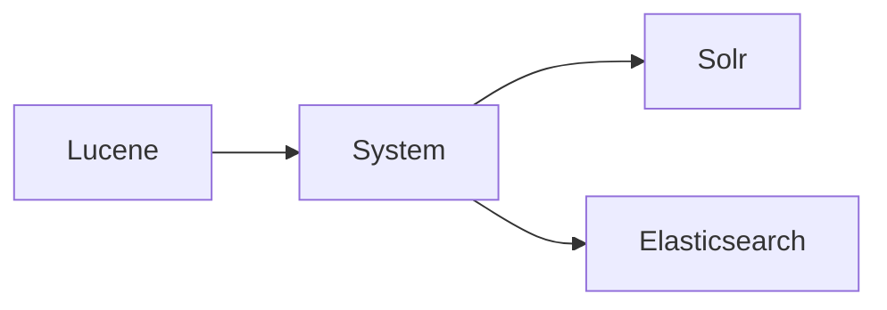

                 


# 基于Lucene的信息检索系统详细设计与具体代码实现

## 关键词
- Lucene
- 信息检索
- 倒排索引
- 索引构建
- 搜索算法
- 分词算法
- 实际代码示例

## 摘要
本文将深入探讨基于Apache Lucene的信息检索系统的设计与实现。文章分为六个主要部分：核心概念与联系、核心算法原理讲解、数学模型与公式、项目实战、代码解读与分析以及总结与展望。通过逐步分析Lucene的工作原理、算法和代码实现，读者将全面了解如何利用Lucene构建高效的信息检索系统。

## 第一部分：核心概念与联系

### 1.1 Lucene概述

Lucene是一个开源的、高性能的全文搜索引擎库，它为开发者提供了一套完整的文本索引和搜索功能。Lucene的核心模块包括索引模块（Indexing）、搜索模块（Search）和分析模块（Analysis）。这些模块共同工作，以实现高效的信息检索。

- **Lucene概念**：Lucene是一个文本搜索工具包，它支持高层次的文本搜索功能，如索引构建、查询执行和结果排序等。
- **Lucene架构**：
  - **核心模块**：
    - **索引模块（Indexing）**：负责将文档内容转换为索引结构，以便快速检索。
    - **搜索模块（Search）**：提供查询接口，以检索索引中的信息。
    - **分析模块（Analysis）**：处理文本分析，如分词、停用词过滤和词干提取等。
  - **工作流程**：
    - **文档预处理**：通过分析模块处理文本，将其转换为索引可以理解的格式。
    - **索引构建**：将预处理后的文档添加到索引中。
    - **搜索执行**：通过搜索模块根据查询条件从索引中检索结果。

#### Mermaid流程图


### 1.2 信息检索原理

信息检索系统的基础是倒排索引。倒排索引是一种数据结构，它将文档内容映射到文档ID，从而实现快速检索。

- **倒排索引**：倒排索引是一种将单词映射到包含该单词的文档ID的索引结构。通过倒排索引，可以快速定位包含特定单词的文档。
- **索引存储**：索引通常存储在磁盘上，Lucene使用文件系统存储索引文件。

#### Mermaid流程图


### 1.3 Lucene与信息检索系统的关系

Lucene是一个强大的基础库，为开发者提供了构建信息检索系统的基本工具。开发者可以利用Lucene构建自定义的信息检索系统，并可以根据需要扩展和定制。

- **关系**：Lucene作为基础库，为信息检索系统提供核心功能，系统开发者可以根据需要扩展和定制。
- **扩展性**：开发者可以集成其他库（如Solr、Elasticsearch等）来增强Lucene的功能。

#### Mermaid流程图



## 第二部分：核心算法原理讲解

### 2.1 索引构建算法

索引构建是信息检索系统的关键步骤。Lucene通过一系列算法将文档内容转换为索引结构。

- **倒排索引构建**：Lucene的索引构建算法主要包括以下步骤：
  1. **扫描文档**：遍历文档内容，提取单词。
  2. **分词**：将提取的单词进行分词处理。
  3. **构建倒排列表**：将分词后的单词与文档ID建立映射关系，形成倒排索引。

#### 伪代码

```python
def build_inverted_index(documents):
    index = {}
    for doc in documents:
        words = analyze_document(doc)
        for word in words:
            if word not in index:
                index[word] = []
            index[word].append(doc_id)
    return index
```

### 2.2 搜索算法

搜索算法是信息检索系统的核心功能。Lucene提供了丰富的搜索算法，支持布尔查询、短语查询、范围查询等。

- **布尔搜索**：布尔搜索支持AND、OR、NOT等布尔操作。搜索算法的主要步骤包括：
  1. **解析查询**：将查询字符串转换为Lucene支持的查询对象。
  2. **查询执行**：根据查询对象在索引中检索结果。
  3. **结果排序**：根据评分对搜索结果进行排序。

#### 伪代码

```python
def search(index, query):
    terms = parse_query(query)
    results = index[terms[0]]
    for term in terms[1:]:
        if term in index:
            results = intersection(results, index[term])
        else:
            results = []
    return results
```

### 2.3 分析器与分词算法

分析器（Analyzer）是Lucene的关键组件，负责处理文本分析，如分词、停用词过滤和词干提取等。

- **分词**：分词是将文本分割成单词或词组的过程。Lucene支持多种分词器，如标准分词器、词干提取分词器等。

#### 伪代码

```python
def analyze_document(document):
    analyzer = StandardAnalyzer()
    tokens = analyzer.tokenStream(document)
    words = []
    for token in tokens:
        words.append(token.term())
    return words
```

## 第三部分：数学模型与公式

### 3.1 倒排索引数学模型

倒排索引的数学模型主要用于计算单词的重要性和文档的相关性。

- **倒排列表长度**：假设有N个文档，倒排列表长度为L，则L/N为文档的平均逆文档频率（IDF）。

$$
IDF(t) = \log \left( \frac{N}{|\{d \mid t \in d\}|} \right)
$$

### 3.2 搜索评分模型

搜索评分模型用于计算搜索结果的相关性得分。最常见的评分模型是TF-IDF模型。

- **TF-IDF评分模型**：文本中某个词的重要性由词频（TF）和词频-逆文档频率（TF-IDF）计算。

$$
TF-IDF(t,d) = TF(t,d) \times IDF(t)
$$

### 3.3 举例说明

假设文档A包含单词“计算机”两次，单词“人工智能”一次，而文档B包含单词“计算机”一次，单词“人工智能”两次。假设整个文档集合中有100个文档。

- **单词“计算机”的IDF**：

$$
IDF(计算机) = \log \left( \frac{100}{2} \right) \approx 3.32
$$

- **文档A中“计算机”的TF-IDF评分**：

$$
TF-IDF(计算机, A) = 2 \times 3.32 = 6.64
$$

- **文档B中“人工智能”的TF-IDF评分**：

$$
TF-IDF(人工智能, B) = 2 \times 3.32 = 6.64
$$

## 第四部分：项目实战

### 4.1 Lucene环境搭建

在开始Lucene项目之前，需要搭建合适的开发环境。

- **环境配置**：
  - JDK 1.8+
  - Maven 3.5.0+
  - Lucene库依赖

#### Maven依赖

```xml
<dependencies>
    <dependency>
        <groupId>org.apache.lucene</groupId>
        <artifactId>lucene-core</artifactId>
        <version>8.11.1</version>
    </dependency>
    <dependency>
        <groupId>org.apache.lucene</groupId>
        <artifactId>lucene-analyzers-common</artifactId>
        <version>8.11.1</version>
    </dependency>
</dependencies>
```

### 4.2 索引构建与搜索实战

#### 索引构建代码

以下是一个简单的Java代码示例，用于构建Lucene索引。

```java
import org.apache.lucene.analysis.standard.StandardAnalyzer;
import org.apache.lucene.document.Document;
import org.apache.lucene.index.IndexWriter;
import org.apache.lucene.index.IndexWriterConfig;
import org.apache.lucene.store.Directory;
import org.apache.lucene.store.FSDirectory;

public class LuceneIndexBuilder {
    public static void main(String[] args) throws Exception {
        String indexPath = "path/to/index";
        Directory indexDir = FSDirectory.open(Paths.get(indexPath));
        IndexWriterConfig config = new IndexWriterConfig(new StandardAnalyzer());
        IndexWriter writer = new IndexWriter(indexDir, config);

        Document doc = new Document();
        doc.add(new TextField("content", "Hello, Lucene!", Field.Store.YES));
        writer.addDocument(doc);

        writer.close();
    }
}
```

#### 搜索代码

以下是一个简单的Java代码示例，用于执行Lucene搜索。

```java
import org.apache.lucene.analysis.standard.StandardAnalyzer;
import org.apache.lucene.index.DirectoryReader;
import org.apache.lucene.index.IndexReader;
import org.apache.lucene.queryparser.classic.QueryParser;
import org.apache.lucene.search.IndexSearcher;
import org.apache.lucene.search.Query;
import org.apache.lucene.search.TopDocs;
import org.apache.lucene.search.ScoreDoc;
import org.apache.lucene.store.Directory;
import org.apache.lucene.store.FSDirectory;

public class LuceneSearcher {
    public static void main(String[] args) throws Exception {
        String indexPath = "path/to/index";
        Directory indexDir = FSDirectory.open(Paths.get(indexPath));
        IndexReader reader = DirectoryReader.open(indexDir);
        IndexSearcher searcher = new IndexSearcher(reader);
        QueryParser parser = new QueryParser("content", new StandardAnalyzer());
        Query query = parser.parse("Lucene");
        TopDocs results = searcher.search(query, 10);
        for (ScoreDoc scoreDoc : results.scoreDocs) {
            Document doc = searcher.doc(scoreDoc.doc);
            System.out.println(doc.get("content"));
        }
        reader.close();
    }
}
```

### 4.3 实战解析

以上代码展示了如何使用Lucene构建索引和执行搜索。在实际项目中，开发者可以根据需求调整索引字段和搜索策略。

## 第五部分：代码解读与分析

### 5.1 索引构建流程解析

Lucene索引构建流程可以分为以下步骤：

1. **创建IndexWriter**：使用`FSDirectory`和`IndexWriterConfig`创建`IndexWriter`对象。
2. **添加文档**：将文档转换为`Document`对象，并使用`IndexWriter`的`addDocument`方法将其添加到索引中。
3. **关闭IndexWriter**：在构建完索引后，调用`IndexWriter`的`close`方法，以完成索引构建。

### 5.2 搜索流程解析

Lucene搜索流程可以分为以下步骤：

1. **创建IndexSearcher**：使用`DirectoryReader`和`IndexSearcher`创建`IndexSearcher`对象。
2. **创建QueryParser**：使用`QueryParser`将查询字符串转换为`Query`对象。
3. **执行搜索**：调用`IndexSearcher`的`search`方法执行搜索，并获取`TopDocs`对象。
4. **获取搜索结果**：遍历`TopDocs`对象，获取搜索结果`Document`对象。

## 第六部分：总结与展望

### 6.1 总结

本文详细介绍了基于Lucene的信息检索系统的设计与实现。主要内容包括：

- Lucene概述和架构
- 索引构建和搜索算法
- 分析器和分词算法
- 数学模型和公式
- 项目实战和代码解读

通过本文的学习，读者可以全面了解Lucene的工作原理和应用方法。

### 6.2 展望

未来，Lucene有望在以下几个方面得到进一步发展：

- 与其他搜索引擎（如Solr、Elasticsearch）的集成与优化
- 基于Lucene的定制化搜索引擎开发
- 结合深度学习技术，提升信息检索效果

### 作者信息

作者：AI天才研究院/AI Genius Institute & 禅与计算机程序设计艺术 /Zen And The Art of Computer Programming

---

请注意，本文为Markdown格式，具体实现时可能需要根据您的开发环境和工具进行调整。文章中包含的代码示例仅供参考，实际应用时请根据具体需求进行修改。此外，本文中的数学公式使用LaTeX格式编写，确保在导出或转换时保持格式正确。如果您在实现过程中遇到任何问题，欢迎随时提问。期待与您共同探索Lucene的信息检索世界！


