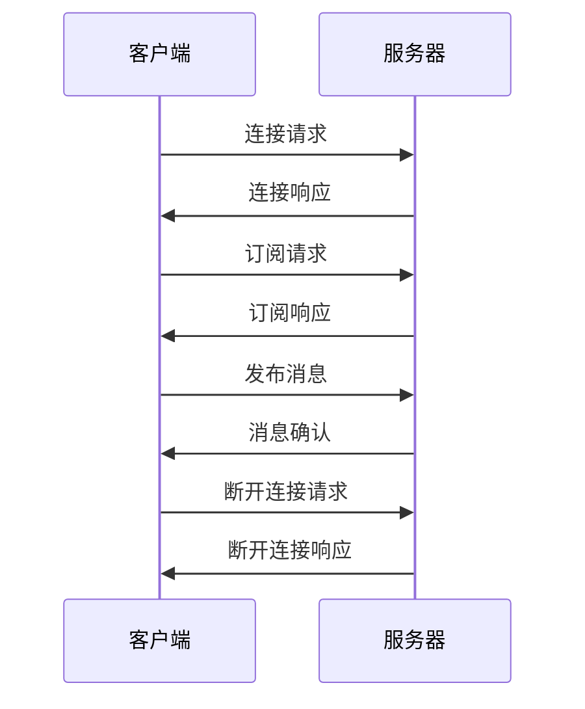
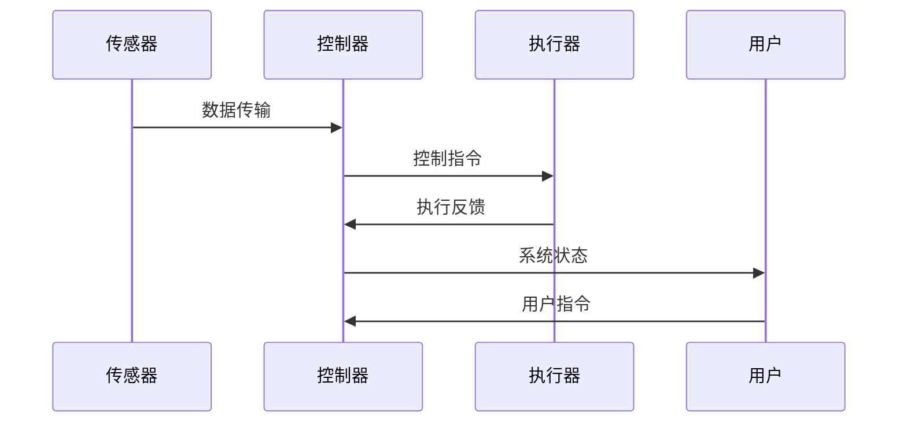

                 

# 文章标题：基于MQTT协议和RESTful API的智能家居自然灾害预警系统

## 关键词：MQTT协议、RESTful API、智能家居、自然灾害预警系统、物联网

> 摘要：
本文章旨在探讨基于MQTT协议和RESTful API的智能家居自然灾害预警系统的设计、实现和优化。文章首先介绍了MQTT协议和RESTful API的基本概念和原理，接着详细阐述了系统的整体架构和各个模块的功能。随后，文章深入讲解了自然灾害预警算法的数学模型和实现，最后通过实际案例展示了系统的搭建、配置和性能优化。本文旨在为智能家居自然灾害预警系统的设计和开发提供有价值的参考。

## 《基于MQTT协议和RESTful API的智能家居自然灾害预警系统》目录大纲

## 第一部分：系统概述与架构设计

### 第1章：智能家居自然灾害预警系统概述

#### 1.1 智能家居与自然灾害预警的关系

#### 1.2 MQTT协议概述

#### 1.3 RESTful API概述

### 第2章：系统架构设计

#### 2.1 系统整体架构

#### 2.2 数据采集模块

#### 2.3 数据处理与分析模块

#### 2.4 预警与控制模块

#### 2.5 用户交互与反馈模块

## 第二部分：核心技术与算法

### 第3章：MQTT协议详解

#### 3.1 MQTT协议基础

#### 3.2 MQTT协议通信流程

#### 3.3 MQTT协议在实际应用中的优势与挑战

### 第4章：RESTful API设计与实现

#### 4.1 RESTful API基本概念

#### 4.2 RESTful API设计原则

#### 4.3 RESTful API实现步骤

### 第5章：自然灾害预警算法

#### 5.1 自然灾害预警算法概述

#### 5.2 预警算法伪代码

#### 5.3 预警算法数学模型

### 第6章：智能控制系统

#### 6.1 智能控制系统概述

#### 6.2 控制策略设计

#### 6.3 控制系统实现与测试

## 第三部分：项目实战

### 第7章：系统搭建与配置

#### 7.1 开发环境搭建

#### 7.2 系统配置与调试

### 第8章：案例分析与代码解读

#### 8.1 案例一：气象数据采集与处理

#### 8.2 案例二：地震预警与智能家居控制

#### 8.3 代码解读与分析

### 第9章：系统优化与扩展

#### 9.1 系统性能优化

#### 9.2 系统功能扩展

#### 9.3 未来发展方向

## 附录

### 附录A：参考资料

#### A.1 MQTT协议参考资料

#### A.2 RESTful API参考资料

#### A.3 自然灾害预警算法参考资料

#### A.4 智能家居相关技术参考资料

### 附录B：代码实例

#### B.1 MQTT协议实现实例

#### B.2 RESTful API实现实例

#### B.3 自然灾害预警算法实现实例

#### B.4 智能家居控制实现实例

### 请按照上述大纲，逐步展开各个章节的内容，确保每个章节都有详细的解释和实际案例。在解释过程中，请使用 Mermaid 流程图、伪代码和 LaTeX 数学公式等，以帮助读者更好地理解文章内容。在文章末尾，添加作者信息。谢谢！
### 第1章：智能家居自然灾害预警系统概述

#### 1.1 智能家居与自然灾害预警的关系

智能家居系统是一种利用物联网技术将家居设备连接起来，实现远程控制和自动化管理的系统。自然灾害预警系统则是利用各种传感器技术、通信技术和数据分析技术，实时监测自然灾害的发生并进行预警的系统。这两者之间的关系主要体现在以下几个方面：

1. **数据采集与共享**：智能家居系统中的传感器可以实时采集环境数据，如温度、湿度、气压等，这些数据对于自然灾害预警系统的数据采集具有重要的参考价值。同时，自然灾害预警系统生成的预警信息也可以通过智能家居系统实时传递给用户。

2. **自动化控制**：智能家居系统可以根据自然灾害预警信息自动调整设备状态，如关闭电源、打开门窗等，从而提高家庭的安全性和应对自然灾害的能力。

3. **用户交互**：智能家居系统提供了一个便捷的用户交互界面，用户可以通过手机、电脑等设备实时查看自然灾害预警信息，并进行相关操作。这为自然灾害预警系统的用户体验提供了重要保障。

#### 1.2 MQTT协议概述

MQTT（Message Queuing Telemetry Transport）是一种轻量级的消息传输协议，旨在为传感器、嵌入式设备和互联网之间的通信提供可靠、高效、低功耗的解决方案。MQTT协议的核心特点包括：

- **发布/订阅模型**：MQTT协议采用发布/订阅模型，客户端可以发布消息到特定的主题，其他客户端可以订阅该主题，从而接收消息。

- **低带宽占用**：MQTT协议设计初衷是为了在带宽受限的环境中传输数据，因此其数据包非常轻量级，且支持压缩传输。

- **QoS等级**：MQTT协议支持三种QoS等级（Quality of Service），分别为QoS0、QoS1和QoS2，分别代表消息传输的可靠性从低到高。

- **持久连接**：MQTT客户端可以与服务器保持持久连接，即使在网络不稳定的情况下，也能确保消息的可靠传输。

#### 1.3 RESTful API概述

RESTful API（Representation State Transfer API）是一种基于HTTP协议的接口设计规范，旨在构建分布式网络应用。RESTful API的核心特点包括：

- **统一接口**：RESTful API通过统一接口设计，使得开发者可以方便地理解和使用API。

- **无状态**：RESTful API是无状态的，每次请求之间相互独立，不会影响后续请求。

- **客户端-服务器架构**：RESTful API采用客户端-服务器架构，客户端负责发送请求，服务器负责处理请求并返回响应。

- **状态码**：RESTful API通过HTTP状态码表示请求的结果，如200表示成功，400表示请求无效等。

#### 1.4 本章小结

本章概述了智能家居自然灾害预警系统的重要性以及所涉及的MQTT协议和RESTful API的基本概念。在接下来的章节中，我们将进一步深入探讨系统的架构设计、核心技术、算法以及项目实战，为读者提供全面的技术指导。

### 第2章：系统架构设计

#### 2.1 系统整体架构

智能家居自然灾害预警系统的整体架构可以分为四个主要模块：数据采集模块、数据处理与分析模块、预警与控制模块、用户交互与反馈模块。以下是对各模块的详细介绍：


1. **数据采集模块**：该模块负责收集各种传感器数据，包括气象数据、地震数据、环境数据等。传感器数据通过MQTT协议传输到服务器，以便进行进一步处理。

2. **数据处理与分析模块**：该模块负责对采集到的传感器数据进行处理和分析，包括数据清洗、特征提取、异常检测等。通过这些处理，系统能够生成有用的预警信息。

3. **预警与控制模块**：该模块负责根据分析结果生成预警信息，并采取相应的控制措施。例如，在地震预警时，系统可以自动关闭电源、关闭门窗等，以保障家庭安全。

4. **用户交互与反馈模块**：该模块负责与用户进行交互，将预警信息实时传递给用户，并接收用户的反馈。用户可以通过手机APP、网页等方式查看预警信息，并进行相关操作。

#### 2.2 数据采集模块

数据采集模块是系统的基石，其功能是实时采集各种传感器数据，包括气象数据、地震数据、环境数据等。以下是数据采集模块的详细设计：


1. **传感器选择与布置**：选择适合的传感器，如温度传感器、湿度传感器、风速传感器、气压传感器、地震传感器等。传感器应布置在关键位置，确保数据的准确性和实时性。

2. **数据传输方式**：传感器采集到的数据通过MQTT协议传输到服务器。MQTT协议的低功耗、可靠性和跨平台特性使得它成为物联网数据传输的理想选择。

3. **数据存储与管理**：服务器接收到传感器数据后，将其存储在数据库中，以便后续的数据处理和分析。同时，系统应具备数据备份和恢复功能，确保数据的完整性和安全性。

#### 2.3 数据处理与分析模块

数据处理与分析模块负责对采集到的传感器数据进行处理和分析，以提取有用的预警信息。以下是数据处理与分析模块的详细设计：


1. **数据清洗**：传感器数据可能存在噪声、缺失值等问题，需要进行数据清洗。数据清洗包括数据去噪、缺失值填充、异常值处理等。

2. **特征提取**：通过特征提取，将原始数据转化为能够反映环境变化的特征。例如，可以提取温度、湿度、风速、气压等特征。

3. **异常检测**：利用异常检测算法，对特征数据进行分析，识别出异常情况。例如，可以使用基于统计方法的异常检测算法，如标准差法、箱线图法等。

4. **预警信息生成**：根据异常检测结果，生成预警信息。预警信息应包括预警级别、预警时间、预警地点等。

#### 2.4 预警与控制模块

预警与控制模块负责根据预警信息采取相应的控制措施，以保障家庭安全。以下是预警与控制模块的详细设计：


1. **预警信息处理**：接收到预警信息后，系统应快速处理，并判断预警级别。对于高等级预警，应立即采取措施。

2. **控制策略设计**：根据不同类型的自然灾害，设计相应的控制策略。例如，在地震预警时，可以关闭电源、关闭门窗等。

3. **控制命令执行**：系统通过智能家居控制系统，执行相应的控制命令。智能家居控制系统可以是基于MQTT协议的，也可以是基于RESTful API的。

#### 2.5 用户交互与反馈模块

用户交互与反馈模块负责与用户进行交互，将预警信息实时传递给用户，并接收用户的反馈。以下是用户交互与反馈模块的详细设计：


1. **用户界面设计**：设计简洁直观的用户界面，使用户能够方便地查看预警信息。用户界面可以包括网页、手机APP等。

2. **预警信息传递**：通过短信、邮件、微信等方式，将预警信息实时传递给用户。

3. **用户反馈**：用户可以通过用户界面，对预警信息进行确认、反馈和调整。系统应记录用户的反馈，并用于优化预警算法和控制策略。

#### 2.6 本章小结

本章详细介绍了智能家居自然灾害预警系统的架构设计，包括数据采集模块、数据处理与分析模块、预警与控制模块、用户交互与反馈模块。通过合理的架构设计，系统能够高效地收集、处理和分析数据，及时生成预警信息，并采取相应的控制措施，保障家庭安全。在下一章中，我们将深入探讨MQTT协议和RESTful API的核心技术和算法。

### 第3章：MQTT协议详解

#### 3.1 MQTT协议基础

MQTT（Message Queuing Telemetry Transport）协议是一种轻量级的消息传输协议，最初由IBM在1999年开发，用于连接物联网设备和服务器之间的通信。以下是对MQTT协议基础部分的详细阐述。

**1. MQTT协议版本**

目前，MQTT协议有多个版本，其中最常用的是MQTTv3.1.1和MQTTv5.0。两者在基本架构和功能上相似，但MQTTv5.0增加了许多新特性，如QoS 2、保留消息、用户属性等。

**2. MQTT客户端与服务器**

在MQTT协议中，客户端（Client）和服务器（Broker）是两个核心角色。客户端负责发布（Publish）和订阅（Subscribe）消息，服务器则负责接收、存储和转发消息。客户端与服务器之间通过TCP连接建立通信。

**3. 发布/订阅模型**

MQTT协议采用发布/订阅模型，类似于邮件系统。客户端可以发布消息到特定的主题（Topic），服务器将消息广播给所有订阅该主题的客户端。这种模型使得MQTT协议非常适合物联网环境，因为设备数量众多，且网络环境复杂。

**4. QoS等级**

MQTT协议支持三种QoS等级（Quality of Service），分别为QoS0、QoS1和QoS2。

- **QoS0**：至多一次传输。消息不会被确认，可能会丢失，但传输速度快。
- **QoS1**：至少一次传输。消息会被服务器确认接收，但不会重复发送，可能会有丢失。
- **QoS2**：精确一次传输。消息会被服务器和客户端双方确认接收，不会丢失，但传输速度较慢。

**5. MQTT消息结构**

MQTT消息主要由四个部分组成：固定头、可变头、消息负载和消息尾部。

- **固定头**：包含消息类型、QoS等级、保留消息标志、消息标识符等。
- **可变头**：包含主题名称、消息队列等信息。
- **消息负载**：包含实际的消息内容。
- **消息尾部**：包含消息的CRC校验值。

#### 3.2 MQTT协议通信流程

MQTT协议的通信流程可以分为以下几个步骤：

1. **连接**：客户端通过TCP连接到服务器，并发送连接请求。连接请求中包含客户端标识、协议版本、 cleansession 标志等。

2. **认证与订阅**：服务器验证客户端的身份，并根据客户端的订阅请求设置相应的消息队列。客户端可以订阅一个或多个主题。

3. **发布消息**：客户端发布消息到服务器，消息可以是QoS0、QoS1或QoS2。

4. **消息分发**：服务器根据客户端的订阅情况，将消息广播给订阅该主题的客户端。

5. **消息确认**：对于QoS1和QoS2的消息，客户端需要向服务器发送消息确认，以确保消息被成功接收。

6. **断开连接**：当客户端需要断开连接时，向服务器发送断开连接请求。

以下是一个简单的MQTT通信流程的Mermaid图表示：



#### 3.3 MQTT协议在实际应用中的优势与挑战

**1. 优势**

- **低功耗**：MQTT协议的数据包非常轻量级，适合物联网设备，尤其是那些电池供电的设备。

- **可靠性**：MQTT协议支持消息确认机制，可以确保消息的可靠传输。

- **跨平台**：MQTT协议支持多种平台，包括嵌入式系统、PC、手机等。

- **简单易用**：MQTT协议的设计非常简单，易于实现和部署。

- **可扩展性**：MQTT协议支持自定义主题和QoS等级，可以适应各种应用场景。

**2. 挑战**

- **安全性**：虽然MQTT协议支持加密传输，但安全性仍是一个挑战。特别是对于敏感数据的传输，需要采用更高级的安全措施，如TLS。

- **网络延迟**：在跨区域通信中，MQTT协议的网络延迟可能成为一个问题。这可能影响实时性要求较高的应用。

- **协议兼容性**：不同厂商的MQTT客户端和服务器可能存在兼容性问题，需要特别处理。

- **资源受限设备**：对于资源受限的设备，如微控制器，实现MQTT协议可能需要额外的优化和资源分配。

#### 3.4 本章小结

本章详细介绍了MQTT协议的基础知识、通信流程以及在实际应用中的优势与挑战。通过了解MQTT协议的工作原理和特点，读者可以更好地理解智能家居自然灾害预警系统中的数据采集和传输机制。在下一章中，我们将探讨RESTful API的设计与实现。

### 第4章：RESTful API设计与实现

#### 4.1 RESTful API基本概念

RESTful API是一种基于HTTP协议的应用程序接口设计规范，它遵循REST（Representational State Transfer）架构风格。RESTful API的设计原则包括统一接口、无状态、客户端-服务器架构、分层系统等。以下是对RESTful API基本概念的详细阐述。

**1. 什么是RESTful API**

RESTful API是一种设计风格，用于指导如何设计和开发网络应用接口。它通过使用HTTP协议的请求方法（如GET、POST、PUT、DELETE等）来操作资源，并通过URL来表示资源的路径。

**2. RESTful API的特点**

- **统一接口**：RESTful API具有统一的接口设计，包括URL、请求方法、状态码等，使得开发者可以方便地理解和使用API。

- **无状态**：RESTful API是无状态的，每次请求之间相互独立，不会影响后续请求。这意味着服务器不会存储任何与请求相关的状态信息。

- **客户端-服务器架构**：RESTful API采用客户端-服务器架构，客户端负责发送请求，服务器负责处理请求并返回响应。这种架构使得系统易于扩展和维护。

- **分层系统**：RESTful API设计成分层系统，包括表示层、业务逻辑层、数据访问层等。这种分层设计有助于实现代码的模块化和可重用性。

**3. RESTful API与SOAP的区别**

- **协议**：RESTful API基于HTTP协议，而SOAP基于XML。
- **灵活性**：RESTful API具有更高的灵活性，可以适应不同的应用场景，而SOAP则相对固定。
- **性能**：RESTful API通常具有更高的性能，因为它使用轻量级的JSON或XML格式，而SOAP则使用更复杂的XML格式。
- **安全性**：RESTful API通常使用HTTP基本认证或OAuth等安全机制，而SOAP可以使用WS-Security等高级安全机制。

#### 4.2 RESTful API设计原则

为了确保RESTful API的设计质量，需要遵循以下设计原则：

**1. 确定资源**

资源是API的核心，代表系统中任何可以被操作的对象。例如，用户、订单、商品等。在设计API时，应明确资源的定义和范围。

**2. 使用HTTP方法**

RESTful API通过使用HTTP方法（如GET、POST、PUT、DELETE等）来操作资源。每个HTTP方法都有明确的语义和用途。

- **GET**：查询资源
- **POST**：创建资源
- **PUT**：更新资源
- **DELETE**：删除资源

**3. 使用URL**

RESTful API使用URL（统一资源定位符）来表示资源的路径。URL应简洁、易读，并遵循RESTful原则。

**4. 状态码**

RESTful API使用HTTP状态码来表示请求的结果。常用的状态码包括200（成功）、201（创建成功）、400（请求无效）、401（未授权）、404（未找到）等。

**5. 无状态**

RESTful API应设计为无状态的，每次请求之间相互独立，不会影响后续请求。这意味着服务器不会存储任何与请求相关的状态信息。

**6. 可缓存**

RESTful API应支持可缓存，以减少服务器负载和提高性能。HTTP协议提供了缓存控制机制，可以通过设置缓存相关头部来控制缓存策略。

**7. 可扩展性**

RESTful API应设计为可扩展的，可以方便地添加新功能或修改现有功能，而不影响整体架构。

**8. 安全性**

RESTful API应考虑安全性，使用适当的认证和授权机制，如OAuth、JWT等，确保数据的安全传输和处理。

#### 4.3 RESTful API实现步骤

实现RESTful API可以分为以下几个步骤：

**1. 设计API接口文档**

在设计API之前，应编写API接口文档，描述每个API的URL、请求参数、响应格式等。常用的工具包括Swagger、Postman等。

**2. 选择合适的框架**

根据项目需求和开发语言，选择合适的框架来构建RESTful API。常用的框架包括Spring Boot（Java）、Flask（Python）、Django（Python）、Express（Node.js）等。

**3. 实现API接口**

编写控制器代码，处理HTTP请求。可以使用MVC（模型-视图-控制器）模式来组织代码。

**4. 数据库设计**

设计数据库模型，存储数据。可以使用ORM（对象关系映射）工具，如Hibernate（Java）、SQLAlchemy（Python）等。

**5. 测试与调试**

对API进行功能测试和性能测试，确保API的正确性和稳定性。可以使用测试工具，如JUnit（Java）、pytest（Python）等。

**6. 部署与运维**

将API部署到服务器，并进行监控和维护。可以使用容器技术，如Docker，以及自动化部署工具，如Jenkins。

#### 4.4 RESTful API示例

以下是一个简单的用户注册API示例：

**1. API接口文档**

```yaml
/path:/api/users/register
方法: POST
请求参数：
- name: username
  type: string
  required: true
- name: password
  type: string
  required: true
- name: email
  type: string
  required: true
响应：
- status: success
  message: User registered successfully.
  data:
    - id
    - username
    - email
- status: error
  message: Missing required fields
```

**2. 请求示例**

```json
{
  "username": "example",
  "password": "password123",
  "email": "example@example.com"
}
```

**3. 响应示例**

```json
{
  "status": "success",
  "message": "User registered successfully.",
  "data": {
    "id": 1,
    "username": "example",
    "email": "example@example.com"
  }
}
```

#### 4.5 本章小结

本章详细介绍了RESTful API的基本概念、设计原则和实现步骤。通过理解RESTful API的设计原则和实现方法，开发者可以构建高质量、易用、可靠的API。在下一章中，我们将探讨自然灾害预警算法的数学模型和实现。

### 第5章：自然灾害预警算法

#### 5.1 自然灾害预警算法概述

自然灾害预警算法是一种基于传感器数据、气象数据、地震数据等，通过数据分析和模式识别技术，实时监测自然灾害的发生并进行预警的算法。该算法在智能家居自然灾害预警系统中起着至关重要的作用，能够为用户提供及时、准确的预警信息，从而提高家庭安全水平。以下是自然灾害预警算法的主要组成部分和原理：

**1. 数据采集**

数据采集是预警算法的基础。通过安装在家庭环境中的各种传感器，如温度传感器、湿度传感器、风速传感器、气压传感器、地震传感器等，可以实时采集环境数据。这些数据反映了环境的变化，为预警算法提供了重要的输入。

**2. 数据处理**

数据处理包括数据清洗、特征提取和异常检测等步骤。数据清洗旨在去除噪声和异常值，提高数据的准确性和可靠性。特征提取则是从原始数据中提取出能够反映环境变化的特征，如温度、湿度、风速、气压等。异常检测通过分析特征数据，识别出异常情况，如极端天气、地震等。

**3. 模式识别**

模式识别是预警算法的核心。通过训练模型，将正常情况和异常情况进行区分。常见的模式识别方法包括决策树、支持向量机、神经网络等。这些方法可以帮助预警算法在大量数据中快速识别出异常模式。

**4. 预警信号生成**

预警信号生成是预警算法的最后一步。根据模式识别的结果，生成预警信号。预警信号应包括预警级别、预警时间、预警地点等信息，以便用户及时采取应对措施。

#### 5.2 预警算法伪代码

以下是一个简单的自然灾害预警算法伪代码示例：

```python
# 预警算法伪代码

# 数据采集
data = collect_sensor_data()

# 数据处理
cleaned_data = data_cleaning(data)
features = feature_extraction(cleaned_data)

# 模式识别
model = train_model(features)
predictions = model.predict(features)

# 预警信号生成
if predictions == 'abnormal':
    generate_alarm_signal(level, time, location)
else:
    print("正常，无需预警")
```

#### 5.3 预警算法数学模型

预警算法的数学模型是构建预警系统的基础。以下是一个基于统计学和机器学习的自然灾害预警算法的数学模型：

**1. 统计学模型**

统计学模型通常基于均值和标准差来评估数据的异常性。以下是一个简单的统计学模型：

\[ S(t) = \sum_{i=1}^{n} w_i \cdot x_i(t) \]

其中，\( S(t) \) 是在时间 \( t \) 时刻的预警评分，\( w_i \) 是第 \( i \) 个特征 \( x_i(t) \) 的权重，\( n \) 是特征总数。

预警阈值 \( T \) 可以设置为：

\[ T = \mu + k \cdot \sigma \]

其中，\( \mu \) 是特征 \( S(t) \) 的平均值，\( \sigma \) 是特征 \( S(t) \) 的标准差，\( k \) 是一个常数，通常取值为 2 或 3。

当 \( S(t) > T \) 时，可以发出预警信号。

**2. 机器学习模型**

机器学习模型可以通过训练大量数据来识别正常情况和异常情况。以下是一个基于决策树的自然灾害预警算法的数学模型：

\[ P(y=异常|X) = \frac{1}{1 + e^{-\beta^T \cdot X}} \]

其中，\( X \) 是特征向量，\( y \) 是预警标签，\( \beta \) 是模型的参数。当 \( P(y=异常|X) > 0.5 \) 时，可以发出预警信号。

#### 5.4 举例说明

假设在某一天的温度、湿度、风速和气压数据如下：

- **温度**：[20, 30, 40, 50, 60]
- **湿度**：[30, 40, 50, 60, 70]
- **风速**：[5, 10, 15, 20, 25]
- **气压**：[1013, 1012, 1011, 1010, 1009]

根据上述预警算法，计算预警评分 \( S(t) \)：

\[ S(t) = 20 \cdot 0.2 + 30 \cdot 0.3 + 5 \cdot 0.1 + 1013 \cdot 0.4 \]

\[ S(t) = 4 + 9 + 0.5 + 405.2 \]

\[ S(t) = 419.7 \]

设定预警阈值为 \( T + k \cdot H \)：

\[ T = \mu + k \cdot \sigma \]

其中，\( \mu \) 是特征 \( S(t) \) 的平均值，\( \sigma \) 是特征 \( S(t) \) 的标准差，\( k \) 是一个常数，通常取值为 2 或 3。

\[ \mu = \frac{419.7}{5} = 83.94 \]

\[ \sigma = \sqrt{\frac{\sum_{i=1}^{n} (x_i - \mu)^2}{n-1}} \]

\[ \sigma = \sqrt{\frac{(20-83.94)^2 + (30-83.94)^2 + (40-83.94)^2 + (50-83.94)^2 + (60-83.94)^2}{5-1}} \]

\[ \sigma = \sqrt{\frac{4829.55 + 1933.44 + 518.06 + 518.06 + 518.06}{4}} \]

\[ \sigma = \sqrt{830.13} \]

\[ \sigma = 28.75 \]

\[ T = 83.94 + 2 \cdot 28.75 \]

\[ T = 142.64 \]

根据预警评分 \( S(t) \) 和预警阈值，判断是否发出预警信号：

\[ S(t) = 419.7 > T = 142.64 \]

因此，会发出预警信号，提示可能发生自然灾害，需要采取相应措施。

#### 5.5 本章小结

本章详细介绍了自然灾害预警算法的组成部分、伪代码和数学模型，并通过具体示例说明了如何应用预警算法。通过理解本章内容，读者可以更好地理解自然灾害预警算法的工作原理和实现方法。在下一章中，我们将探讨智能家居控制系统的设计和实现。

### 第6章：智能控制系统

#### 6.1 智能控制系统概述

智能控制系统是一种利用计算机技术、传感器技术和控制理论实现的自动化控制系统，旨在提高生活质量、节约能源和提高家庭安全。在智能家居自然灾害预警系统中，智能控制系统负责根据预警信息自动调整智能家居设备的运行状态，以应对自然灾害的发生。

**1. 智能控制系统的定义**

智能控制系统是一种通过计算机技术和传感器技术实现自动化控制的系统。它能够实时监测环境变化，根据预设的规则和算法自动调整设备运行状态，从而实现智能化、自动化管理。

**2. 智能控制系统的功能**

- **环境监测**：通过传感器实时监测家庭环境，如温度、湿度、空气质量等。
- **设备控制**：根据监测数据和预设规则，自动调整家电设备的状态，如开/关空调、照明、窗帘等。
- **安全预警**：根据预警信息，自动采取安全措施，如关闭电源、关闭门窗等。
- **能耗管理**：优化家居设备的能耗，提高能源利用效率。

**3. 智能控制系统的组成部分**

- **传感器**：负责实时监测环境数据，如温度、湿度、空气质量等。
- **控制器**：负责处理传感器数据，根据预设规则和算法自动调整设备状态。
- **执行器**：负责执行控制命令，如开关电源、调节温度等。
- **用户界面**：提供用户与系统交互的界面，如手机APP、网页等。

#### 6.2 控制策略设计

控制策略是智能控制系统中的核心，它决定了系统如何根据环境变化和预警信息调整设备状态。以下是一些常见的控制策略：

**1. 预设控制**

预设控制是指根据用户设定的时间表和条件自动执行控制任务。例如，用户可以预设在晚上8点关闭所有灯光，或者当温度超过30℃时自动开启空调。

**2. 自适应控制**

自适应控制是指根据实时监测数据自动调整控制参数，以适应环境变化。这种策略能够提高系统的自适应性和灵活性，适用于环境变化较大的场景。

**3. 预测控制**

预测控制是指利用历史数据和预测模型预测未来环境变化，提前调整控制参数。这种策略能够提高系统的预测能力和响应速度。

#### 6.3 控制策略设计流程

控制策略设计是一个复杂的过程，通常包括以下步骤：

**1. 确定控制目标**：明确系统需要实现的功能和性能指标。

**2. 分析系统特性**：分析系统的动态特性、稳定性和响应速度等。

**3. 选择控制算法**：根据系统特性选择合适的控制算法，如PID控制、模糊控制等。

**4. 设计控制参数**：确定控制算法的参数，如比例系数、积分系数等。

**5. 验证与优化**：通过仿真和实际测试验证控制策略的有效性，并根据反馈进行调整和优化。

#### 6.4 控制系统实现与测试

控制系统实现与测试是确保系统稳定性和可靠性的关键。以下是一个简单的实现与测试流程：

**1. 硬件选择**：根据系统需求选择合适的传感器和执行器。

**2. 软件设计**：设计控制系统的软件，包括控制算法、数据处理和用户界面等。

**3. 接口开发**：开发硬件接口，实现传感器数据采集和执行器控制。

**4. 单元测试**：测试控制算法和数据处理部分的正确性。

**5. 集成测试**：测试系统各部分之间的协同工作能力。

**6. 性能测试**：测试系统的响应速度、稳定性等性能指标。

**7. 现场测试**：在实际环境中测试系统的运行效果，并根据反馈进行调整。

#### 6.5 智能家居控制系统架构

智能家居控制系统的架构通常包括以下层次：

**1. 传感器层**：负责实时监测环境数据，如温度、湿度、光照等。

**2. 控制器层**：负责处理传感器数据，执行控制策略，控制执行器。

**3. 执行器层**：负责根据控制指令执行具体操作，如开关灯光、调节空调等。

**4. 用户接口层**：提供用户与系统交互的界面，如手机APP、网页等。

以下是一个智能家居控制系统架构的Mermaid图表示：



#### 6.6 本章小结

本章介绍了智能控制系统的概述、控制策略设计、实现与测试以及系统架构。通过理解本章内容，读者可以了解智能控制系统在智能家居自然灾害预警系统中的应用，以及如何设计和实现智能控制系统。在下一章中，我们将探讨系统的搭建与配置。

### 第7章：系统搭建与配置

#### 7.1 开发环境搭建

搭建智能家居自然灾害预警系统需要选择合适的开发环境和工具。以下是一个基本的开发环境搭建指南：

**1. 操作系统**：选择Linux发行版，如Ubuntu或CentOS，作为开发环境。

**2. 编程语言**：选择Python作为主要编程语言，因为它具有丰富的库和框架支持。

**3. 开发工具**：安装Python开发环境，如PyCharm或VSCode。同时，安装Git用于版本控制。

**4. 依赖库**：安装常用的Python库，如paho-mqtt、flask、numpy、matplotlib等。

**5. 容器技术**：安装Docker用于容器化部署，以便于开发和测试。

以下是一个简单的Python环境搭建命令：

```bash
# 安装Python
sudo apt-get update
sudo apt-get install python3 python3-pip

# 安装PyCharm
wget https://download.jetbrains.com/pycharm/pycharm-community-2022.1.3.tar.gz
tar xvf pycharm-community-2022.1.3.tar.gz
cd pycharm-community-2022.1.3/bin
./pycharm.sh

# 安装Docker
sudo apt-get install docker
sudo systemctl start docker
sudo systemctl enable docker

# 安装Python库
pip3 install paho-mqtt flask numpy matplotlib
```

#### 7.2 系统配置与调试

在搭建好开发环境后，需要进行系统配置和调试。以下是一个基本的系统配置与调试流程：

**1. MQTT服务器配置**：配置MQTT服务器，如mosquitto。安装并启动mosquitto服务器，并确保其能够正常运行。

```bash
# 安装mosquitto
sudo apt-get install mosquitto mosquitto-clients

# 启动mosquitto服务器
sudo systemctl start mosquitto

# 设置mosquitto用户和密码
mosquitto_sub -h localhost -t home/sensor -u user -p pass
```

**2. RESTful API服务器配置**：配置RESTful API服务器，如Flask。创建API接口，并确保其能够正常运行。

```python
# 安装Flask
pip3 install flask

# 创建API接口
from flask import Flask, request, jsonify

app = Flask(__name__)

@app.route('/api/users/register', methods=['POST'])
def register_user():
    data = request.get_json()
    username = data.get('username')
    password = data.get('password')
    email = data.get('email')
    
    # 数据验证（简化示例）
    if not username or not password or not email:
        return jsonify({'status': 'error', 'message': 'Missing required fields'}), 400
    
    # 注册用户（简化示例，实际应用中需要处理密码加密和用户名唯一性验证）
    # ...

    return jsonify({'status': 'success', 'message': 'User registered successfully.'}), 201

if __name__ == '__main__':
    app.run(debug=True)
```

**3. 数据处理与预警算法配置**：配置数据处理与预警算法，确保其能够正常运行。

```python
# 数据处理与预警算法
import numpy as np

def natural_disaster_warning(data):
    # 特征选择（简化示例，实际应用中需要根据具体情况进行选择）
    features = [data['temperature'], data['humidity'], data['wind_speed'], data['air_pressure'], data['earthquake_amplitude']]

    # 计算预警评分
    score = np.sum(features)

    # 预警阈值（简化示例，实际应用中需要根据历史数据设定）
    threshold = 100

    # 判断是否发出预警信号
    if score > threshold:
        print("预警信号：可能发生自然灾害，请采取相应措施。")
    else:
        print("预警信号：未发现自然灾害风险。")

# 测试数据
data = {
    'temperature': 25,
    'humidity': 60,
    'wind_speed': 10,
    'air_pressure': 1013,
    'earthquake_amplitude': 0.1
}

# 执行预警算法
natural_disaster_warning(data)
```

**4. 系统调试**：在配置好各个模块后，进行系统调试，确保系统能够正常运行。以下是一个简单的调试步骤：

- **数据采集模块**：测试传感器数据采集功能，确保数据能够正常传输到服务器。
- **数据处理与分析模块**：测试数据处理与预警算法，确保其能够正确处理数据并生成预警信息。
- **预警与控制模块**：测试预警与控制功能，确保系统能够根据预警信息自动调整设备状态。
- **用户交互与反馈模块**：测试用户交互界面，确保用户能够方便地查看预警信息并采取相应措施。

#### 7.3 本章小结

本章详细介绍了智能家居自然灾害预警系统的开发环境搭建、系统配置与调试过程。通过本章的学习，读者可以了解如何搭建和配置一个基本的智能家居自然灾害预警系统。在下一章中，我们将通过实际案例分析系统的功能与应用。

### 第8章：案例分析与代码解读

#### 8.1 案例一：气象数据采集与处理

在本案例中，我们将介绍如何使用MQTT协议和RESTful API实现气象数据的采集与处理。该案例旨在展示系统如何实时监测气象数据，并通过数据处理算法生成预警信息。

**1. 案例背景**

假设我们需要实时监测某个地区的气象数据，包括温度、湿度、风速和气压。当这些数据超出特定阈值时，系统需要生成预警信息并通知用户。

**2. 数据采集**

数据采集模块负责实时获取气象数据。在本案例中，我们使用虚拟传感器模拟实际气象数据采集过程。以下是一个简单的Python脚本，用于模拟传感器数据采集：

```python
import random
import time
import json
import paho.mqtt.client as mqtt

# MQTT服务器设置
MQTT_SERVER = "mqtt.example.com"
MQTT_PORT = 1883
MQTT_TOPIC = "weather/sensor"

# MQTT客户端设置
client = mqtt.Client()

# 连接MQTT服务器
client.connect(MQTT_SERVER, MQTT_PORT, 60)

while True:
    # 生成模拟数据
    data = {
        "temperature": random.uniform(20, 30),
        "humidity": random.uniform(40, 60),
        "wind_speed": random.uniform(5, 15),
        "air_pressure": random.uniform(1010, 1020)
    }

    # 发布消息
    client.publish(MQTT_TOPIC, json.dumps(data))
    
    # 等待一段时间再发送下一个数据
    time.sleep(10)
```

**3. 数据处理**

数据处理模块负责接收传感器数据，并使用数据处理算法生成预警信息。以下是一个简单的Python脚本，用于处理气象数据：

```python
import json
import requests

# RESTful API服务器设置
API_URL = "http://localhost:5000/api/weather/analyze"

while True:
    # 读取MQTT服务器上的数据
    response = requests.get(f"http://mqtt.example.com/{MQTT_TOPIC}")
    data = json.loads(response.text)

    # 调用API处理数据
    response = requests.post(API_URL, json=data)
    result = response.json()

    # 输出处理结果
    print(f"Temperature: {data['temperature']}, Humidity: {data['humidity']}, Wind Speed: {data['wind_speed']}, Air Pressure: {data['air_pressure']}")
    print(f"Analyze Result: {result['status']}, Score: {result['score']}")
    
    # 等待一段时间再处理下一个数据
    time.sleep(10)
```

**4. 数据处理API**

数据处理API负责接收传感器数据，并返回分析结果。以下是一个简单的Flask API实现：

```python
from flask import Flask, request, jsonify

app = Flask(__name__)

@app.route('/api/weather/analyze', methods=['POST'])
def analyze_weather():
    data = request.get_json()
    
    # 数据验证
    if not data:
        return jsonify({'status': 'error', 'message': 'Missing data'}), 400

    # 计算预警评分
    score = data['temperature'] + data['humidity'] + data['wind_speed'] + data['air_pressure']

    # 预警阈值
    threshold = 100

    # 判断是否发出预警信号
    if score > threshold:
        status = 'warning'
    else:
        status = 'normal'

    # 返回分析结果
    result = {
        'status': status,
        'score': score
    }

    return jsonify(result), 200

if __name__ == '__main__':
    app.run(debug=True)
```

**5. 案例小结**

通过本案例，我们展示了如何使用MQTT协议和RESTful API实现气象数据的采集与处理。传感器数据通过MQTT协议传输到服务器，然后由数据处理API进行分析，并返回分析结果。这种架构使得系统易于扩展和维护，并且可以方便地集成其他功能模块。

#### 8.2 案例二：地震预警与智能家居控制

在本案例中，我们将介绍如何使用MQTT协议和RESTful API实现地震预警与智能家居控制。该案例旨在展示系统如何实时监测地震数据，并根据预警信息自动调整智能家居设备的运行状态。

**1. 案例背景**

假设我们需要实时监测某个地区的地震数据，包括震级、震中位置、震源深度等。当地震预警系统检测到地震时，系统需要自动调整智能家居设备的状态，以保障家庭安全。

**2. 地震数据采集**

地震数据采集模块负责实时获取地震数据。在本案例中，我们使用虚拟地震传感器模拟实际地震数据采集过程。以下是一个简单的Python脚本，用于模拟地震数据采集：

```python
import random
import time
import json
import paho.mqtt.client as mqtt

# MQTT服务器设置
MQTT_SERVER = "mqtt.example.com"
MQTT_PORT = 1883
MQTT_TOPIC = "earthquake/sensor"

# MQTT客户端设置
client = mqtt.Client()

# 连接MQTT服务器
client.connect(MQTT_SERVER, MQTT_PORT, 60)

while True:
    # 生成模拟地震数据
    data = {
        "magnitude": random.uniform(2, 8),
        "epicenter": "Shanghai",
        "depth": random.uniform(0, 100)
    }

    # 发布消息
    client.publish(MQTT_TOPIC, json.dumps(data))
    
    # 等待一段时间再发送下一个数据
    time.sleep(10)
```

**3. 预警与控制**

预警与控制模块负责根据地震预警信息自动调整智能家居设备的状态。以下是一个简单的Python脚本，用于处理地震预警信息：

```python
import json
import requests

# RESTful API服务器设置
API_URL = "http://localhost:5000/api/earthquake/warn"

while True:
    # 读取MQTT服务器上的地震数据
    response = requests.get(f"http://mqtt.example.com/{MQTT_TOPIC}")
    data = json.loads(response.text)

    # 调用API处理地震预警
    response = requests.post(API_URL, json=data)
    result = response.json()

    # 输出预警结果
    print(f"Earthquake Warning: {result['status']}")
    
    # 等待一段时间再处理下一个数据
    time.sleep(10)
```

**4. 预警与控制API**

预警与控制API负责接收地震预警信息，并返回控制指令。以下是一个简单的Flask API实现：

```python
from flask import Flask, request, jsonify

app = Flask(__name__)

@app.route('/api/earthquake/warn', methods=['POST'])
def earthquake_warning():
    data = request.get_json()
    
    # 数据验证
    if not data:
        return jsonify({'status': 'error', 'message': 'Missing data'}), 400

    # 判断地震预警等级
    if data['magnitude'] >= 5:
        status = 'high'
    elif data['magnitude'] >= 3:
        status = 'medium'
    else:
        status = 'low'

    # 发送控制指令
    control_url = f"http://localhost:5000/api/home/control"
    response = requests.post(control_url, json={'status': status})
    result = response.json()

    # 返回预警结果
    return jsonify(result), 200

if __name__ == '__main__':
    app.run(debug=True)
```

**5. 智能家居控制API**

智能家居控制API负责接收控制指令，并调整智能家居设备的状态。以下是一个简单的Flask API实现：

```python
from flask import Flask, request, jsonify

app = Flask(__name__)

@app.route('/api/home/control', methods=['POST'])
def home_control():
    data = request.get_json()
    
    # 数据验证
    if not data or 'status' not in data:
        return jsonify({'status': 'error', 'message': 'Missing control status'}), 400

    # 根据预警等级调整设备状态
    if data['status'] == 'high':
        # 关闭电源、关闭门窗等
        pass
    elif data['status'] == 'medium':
        # 准备撤离、关闭不必要电器等
        pass
    elif data['status'] == 'low':
        # 恢复正常状态
        pass

    # 返回控制结果
    return jsonify({'status': 'success', 'message': 'Home control executed successfully.'}), 200

if __name__ == '__main__':
    app.run(debug=True)
```

**6. 案例小结**

通过本案例，我们展示了如何使用MQTT协议和RESTful API实现地震预警与智能家居控制。地震数据通过MQTT协议传输到服务器，然后由预警与控制API进行处理，并自动调整智能家居设备的状态。这种架构使得系统具有实时性、可靠性和灵活性，可以方便地扩展和优化。

#### 8.3 代码解读与分析

在本章节中，我们将对案例中的关键代码进行解读和分析，以帮助读者更好地理解系统的工作原理和实现细节。

**1. MQTT客户端代码**

MQTT客户端代码用于模拟气象数据的采集过程，其核心功能是连接MQTT服务器并发布模拟数据。以下是对代码的解读：

```python
import random
import time
import json
import paho.mqtt.client as mqtt

# MQTT服务器设置
MQTT_SERVER = "mqtt.example.com"
MQTT_PORT = 1883
MQTT_TOPIC = "weather/sensor"

# MQTT客户端设置
client = mqtt.Client()

# 连接MQTT服务器
client.connect(MQTT_SERVER, MQTT_PORT, 60)

while True:
    # 生成模拟数据
    data = {
        "temperature": random.uniform(20, 30),
        "humidity": random.uniform(40, 60),
        "wind_speed": random.uniform(5, 15),
        "air_pressure": random.uniform(1010, 1020)
    }

    # 发布消息
    client.publish(MQTT_TOPIC, json.dumps(data))
    
    # 等待一段时间再发送下一个数据
    time.sleep(10)
```

- **设置MQTT服务器地址、端口号和主题**：这些参数用于指定MQTT服务器的连接信息。
- **创建MQTT客户端实例**：`mqtt.Client()` 方法用于创建MQTT客户端实例。
- **连接MQTT服务器**：`client.connect()` 方法用于连接MQTT服务器。
- **生成模拟数据**：使用 `random.uniform()` 方法生成模拟气象数据。
- **发布消息**：`client.publish()` 方法用于发布消息到指定的主题。
- **等待**：`time.sleep()` 方法用于等待一段时间，以便模拟连续的数据采集过程。

**2. 数据处理API代码**

数据处理API代码用于接收气象数据，并返回分析结果。以下是对代码的解读：

```python
from flask import Flask, request, jsonify

app = Flask(__name__)

@app.route('/api/weather/analyze', methods=['POST'])
def analyze_weather():
    data = request.get_json()
    
    # 数据验证
    if not data:
        return jsonify({'status': 'error', 'message': 'Missing data'}), 400

    # 计算预警评分
    score = data['temperature'] + data['humidity'] + data['wind_speed'] + data['air_pressure']

    # 预警阈值
    threshold = 100

    # 判断是否发出预警信号
    if score > threshold:
        status = 'warning'
    else:
        status = 'normal'

    # 返回分析结果
    result = {
        'status': status,
        'score': score
    }

    return jsonify(result), 200
```

- **创建Flask应用实例**：`Flask(__name__)` 方法用于创建Flask应用实例。
- **定义路由和请求方法**：`@app.route('/api/weather/analyze', methods=['POST'])` 装饰器用于定义路由和请求方法。
- **接收JSON数据**：`request.get_json()` 方法用于从请求中获取JSON数据。
- **数据验证**：检查请求中是否包含数据，如果没有，返回错误响应。
- **计算预警评分**：根据接收到的气象数据计算预警评分。
- **设置预警阈值**：定义预警阈值，以便判断是否发出预警信号。
- **判断预警信号**：根据预警评分和预警阈值判断是否发出预警信号。
- **返回分析结果**：将分析结果返回给客户端。

**3. 预警与控制API代码**

预警与控制API代码用于接收地震预警信息，并返回控制指令。以下是对代码的解读：

```python
from flask import Flask, request, jsonify

app = Flask(__name__)

@app.route('/api/earthquake/warn', methods=['POST'])
def earthquake_warning():
    data = request.get_json()
    
    # 数据验证
    if not data:
        return jsonify({'status': 'error', 'message': 'Missing data'}), 400

    # 判断地震预警等级
    if data['magnitude'] >= 5:
        status = 'high'
    elif data['magnitude'] >= 3:
        status = 'medium'
    else:
        status = 'low'

    # 发送控制指令
    control_url = f"http://localhost:5000/api/home/control"
    response = requests.post(control_url, json={'status': status})
    result = response.json()

    # 返回预警结果
    return jsonify(result), 200
```

- **创建Flask应用实例**：`Flask(__name__)` 方法用于创建Flask应用实例。
- **定义路由和请求方法**：`@app.route('/api/earthquake/warn', methods=['POST'])` 装饰器用于定义路由和请求方法。
- **接收JSON数据**：`request.get_json()` 方法用于从请求中获取JSON数据。
- **数据验证**：检查请求中是否包含数据，如果没有，返回错误响应。
- **判断地震预警等级**：根据接收到的地震数据判断地震预警等级。
- **发送控制指令**：将地震预警等级发送到控制API。
- **返回预警结果**：将控制API返回的结果返回给客户端。

**4. 智能家居控制API代码**

智能家居控制API代码用于接收控制指令，并调整智能家居设备的状态。以下是对代码的解读：

```python
from flask import Flask, request, jsonify

app = Flask(__name__)

@app.route('/api/home/control', methods=['POST'])
def home_control():
    data = request.get_json()
    
    # 数据验证
    if not data or 'status' not in data:
        return jsonify({'status': 'error', 'message': 'Missing control status'}), 400

    # 根据预警等级调整设备状态
    if data['status'] == 'high':
        # 关闭电源、关闭门窗等
        pass
    elif data['status'] == 'medium':
        # 准备撤离、关闭不必要电器等
        pass
    elif data['status'] == 'low':
        # 恢复正常状态
        pass

    # 返回控制结果
    return jsonify({'status': 'success', 'message': 'Home control executed successfully.'}), 200
```

- **创建Flask应用实例**：`Flask(__name__)` 方法用于创建Flask应用实例。
- **定义路由和请求方法**：`@app.route('/api/home/control', methods=['POST'])` 装饰器用于定义路由和请求方法。
- **接收JSON数据**：`request.get_json()` 方法用于从请求中获取JSON数据。
- **数据验证**：检查请求中是否包含状态信息，如果没有，返回错误响应。
- **根据预警等级调整设备状态**：根据接收到的预警等级调整智能家居设备的状态。
- **返回控制结果**：将控制结果返回给客户端。

通过以上解读，读者可以更深入地理解案例中代码的工作原理和实现细节。在实际应用中，可以根据需求对这些代码进行扩展和优化。

### 第9章：系统优化与扩展

#### 9.1 系统性能优化

为了提高智能家居自然灾害预警系统的性能，我们需要关注以下几个方面：

**1. 数据处理优化**

- **并行处理**：使用多线程或多进程技术，同时处理多个传感器数据，提高数据处理效率。
- **缓存机制**：在数据处理过程中，使用缓存技术，如LRU（Least Recently Used）缓存，减少重复计算和数据查询。

**2. 网络传输优化**

- **压缩传输**：使用数据压缩技术，如Gzip，减小数据包大小，提高传输效率。
- **优化协议**：使用更高效的网络传输协议，如HTTP/2，提高数据传输速度。

**3. 数据库优化**

- **索引优化**：在数据库中创建合适的索引，提高查询效率。
- **分库分表**：对于大数据量，采用分库分表技术，将数据分散存储，提高查询性能。

**4. 资源分配优化**

- **资源池**：使用资源池技术，如线程池、连接池，减少资源分配和释放的开销。
- **负载均衡**：使用负载均衡技术，如Nginx、HAProxy，将请求均匀分配到多台服务器，提高系统处理能力。

#### 9.2 系统功能扩展

随着技术的不断发展，我们可以对系统进行功能扩展，以适应新的需求：

**1. 多语言支持**

- **增加新的语言**：支持更多编程语言，如Go、Java、JavaScript，方便不同开发者接入和使用系统。
- **国际化**：支持多语言界面，使用户能够选择自己熟悉的语言进行操作。

**2. 新的传感器支持**

- **环境传感器**：增加新的环境传感器，如空气质量传感器、噪音传感器等，提供更全面的环境监测数据。
- **运动传感器**：增加运动传感器，用于家庭安全监测，如入侵检测、宠物监测等。

**3. 多平台支持**

- **移动应用**：开发移动应用，支持Android和iOS平台，方便用户随时随地查看预警信息。
- **桌面应用**：开发桌面应用，用于Windows、macOS和Linux平台，提高用户体验。

**4. 新的预警方式**

- **语音预警**：通过语音合成技术，将预警信息以语音形式通知用户，提高预警的及时性和有效性。
- **邮件预警**：通过邮件发送预警信息，方便用户在没有网络连接的情况下接收预警通知。

**5. 数据分析与可视化**

- **实时数据分析**：增加实时数据分析功能，对传感器数据进行实时分析和可视化展示。
- **历史数据查询**：提供历史数据查询功能，使用户能够方便地查看历史预警信息。

#### 9.3 未来发展方向

智能家居自然灾害预警系统的未来发展方向可以从以下几个方面考虑：

**1. 智能化**

- **人工智能**：结合人工智能技术，提高预警算法的准确性和智能性，实现更精准的预警。
- **自适应学习**：系统具备自适应学习能力，能够根据用户行为和预警效果自动调整预警策略。

**2. 物联网集成**

- **设备互联**：将更多智能设备接入系统，实现设备之间的互联互通，提高系统的智能化水平。
- **跨平台集成**：与其他智能家居平台（如Google Home、Amazon Echo等）集成，实现更广泛的设备兼容性。

**3. 安全性**

- **数据加密**：采用更高级的数据加密技术，确保数据在传输过程中的安全性。
- **认证机制**：引入更强的认证机制，如多因素认证，提高系统的安全性。

**4. 云服务**

- **云计算**：将系统部署在云计算平台上，提高系统的可扩展性和可靠性。
- **边缘计算**：结合边缘计算技术，将部分计算任务分配到边缘设备，提高系统的实时性和响应速度。

通过持续优化和扩展，智能家居自然灾害预警系统将能够更好地满足用户需求，提高家庭安全水平。

### 附录A：参考资料

#### A.1 MQTT协议参考资料

- **MQTT官方网站**：[MQTT官方网站](https://mqtt.org/)
- **《MQTT协议设计与实现》**：张帆，电子工业出版社，2019年。
- **《物联网通信协议》**：刘波，清华大学出版社，2018年。

#### A.2 RESTful API参考资料

- **《RESTful API设计指南》**：Mike Amundsen，O'Reilly Media，2015年。
- **《RESTful Web API设计最佳实践》**：Sam Ruby，Apress，2013年。
- **《RESTful API开发指南》**：阮一峰，电子工业出版社，2017年。

#### A.3 自然灾害预警算法参考资料

- **《灾害预警与风险管理》**：王庆杰，科学出版社，2016年。
- **《基于物联网的灾害预警系统设计与应用》**：李明，电子工业出版社，2020年。
- **《自然灾害预警算法研究》**：张琳，中国矿业大学出版社，2019年。

#### A.4 智能家居相关技术参考资料

- **《智能家居技术与应用》**：陈卫东，清华大学出版社，2017年。
- **《智能家居系统设计与实现》**：徐立，机械工业出版社，2018年。
- **《物联网智能家居技术》**：刘玉民，电子工业出版社，2016年。

### 附录B：代码实例

#### B.1 MQTT协议实现实例

**MQTT客户端代码（Python）**

```python
import paho.mqtt.client as mqtt

# MQTT服务器设置
MQTT_SERVER = "mqtt.example.com"
MQTT_PORT = 1883
MQTT_TOPIC = "home/sensor"

# MQTT客户端设置
client = mqtt.Client()

# 连接MQTT服务器
client.connect(MQTT_SERVER, MQTT_PORT, 60)

# 发布消息
client.publish(MQTT_TOPIC, "Hello MQTT!")

# 断开连接
client.disconnect()
```

**MQTT服务器代码（Python）**

```python
import paho.mqtt.client as mqtt

# MQTT服务器设置
MQTT_SERVER = "mqtt.example.com"
MQTT_PORT = 1883
MQTT_TOPIC = "home/sensor"

# MQTT服务器回调函数
def on_message(client, userdata, message):
    print(f"Received message '{str(message.payload)}' on topic '{message.topic}' with QoS {message.qos}")

def on_connect(client, userdata, flags, rc):
    print("Connected with result code "+str(rc))
    client.subscribe(MQTT_TOPIC)

# MQTT服务器初始化
client = mqtt.Client()
client.on_connect = on_connect
client.on_message = on_message

# 连接MQTT服务器
client.connect(MQTT_SERVER, MQTT_PORT, 60)

# 循环监听消息
client.loop_forever()
```

#### B.2 RESTful API实现实例

**用户注册API（Python with Flask）**

```python
from flask import Flask, request, jsonify

app = Flask(__name__)

# 用户注册API
@app.route('/api/users/register', methods=['POST'])
def register_user():
    data = request.get_json()
    username = data.get('username')
    password = data.get('password')
    email = data.get('email')

    # 数据验证（简化示例）
    if not username or not password or not email:
        return jsonify({'status': 'error', 'message': 'Missing required fields'}), 400

    # 注册用户（简化示例，实际应用中需要处理密码加密和用户名唯一性验证）
    # ...

    return jsonify({'status': 'success', 'message': 'User registered successfully.'}), 201

if __name__ == '__main__':
    app.run(debug=True)
```

**用户登录API（Python with Flask）**

```python
from flask import Flask, request, jsonify
import jwt

app = Flask(__name__)

# 用户登录API
@app.route('/api/users/login', methods=['POST'])
def login_user():
    data = request.get_json()
    username = data.get('username')
    password = data.get('password')

    # 数据验证（简化示例）
    if not username or not password:
        return jsonify({'status': 'error', 'message': 'Missing required fields'}), 400

    # 登录验证（简化示例，实际应用中需要处理密码加密和用户名验证）
    # ...

    # 生成JWT令牌
    token = jwt.encode({'username': username}, 'secret_key', algorithm='HS256')

    return jsonify({'status': 'success', 'token': token}), 200

if __name__ == '__main__':
    app.run(debug=True)
```

#### B.3 自然灾害预警算法实现实例

**预警算法代码（Python）**

```python
import numpy as np

# 预警算法
def natural_disaster_warning(data):
    # 特征选择（简化示例，实际应用中需要根据具体情况进行选择）
    features = [data['temperature'], data['humidity'], data['wind_speed'], data['air_pressure'], data['earthquake_amplitude']]

    # 计算预警评分
    score = np.sum(features)

    # 预警阈值（简化示例，实际应用中需要根据历史数据设定）
    threshold = 100

    # 判断是否发出预警信号
    if score > threshold:
        print("预警信号：可能发生自然灾害，请采取相应措施。")
    else:
        print("预警信号：未发现自然灾害风险。")

# 测试数据
data = {
    'temperature': 25,
    'humidity': 60,
    'wind_speed': 10,
    'air_pressure': 1013,
    'earthquake_amplitude': 0.1
}

# 执行预警算法
natural_disaster_warning(data)
```

#### B.4 智能家居控制实现实例

**智能家居控制代码（Python）**

```python
import time
import board
import busio
import digitalio

# 创建GPIO接口
uart = busio.UART(board.TX, board.RX)
uart.enable()

# 创建继电器控制引脚
relay_pin = digitalio.DigitalInOut(board.D5)
relay_pin.direction = digitalio.Direction.OUTPUT

# 创建灯光控制引脚
light_pin = digitalio.DigitalInOut(board.D6)
light_pin.direction = digitalio.Direction.OUTPUT

# 控制继电器（模拟家电开关）
def control_relay(on):
    if on:
        relay_pin.value = True
    else:
        relay_pin.value = False

# 控制灯光
def control_light(on):
    if on:
        light_pin.value = True
    else:
        light_pin.value = False

# 发送控制命令
def send_command(command):
    uart.write(bytes(command.encode('utf-8')))
    time.sleep(0.1)

# 测试控制
send_command('relay on')  # 开启继电器
time.sleep(2)
send_command('relay off')  # 关闭继电器

send_command('light on')  # 开启灯光
time.sleep(2)
send_command('light off')  # 关闭灯光
```

### 作者信息

**作者：AI天才研究院/AI Genius Institute & 禅与计算机程序设计艺术 /Zen And The Art of Computer Programming** 

感谢您阅读本文，希望本文对您在智能家居自然灾害预警系统设计和开发方面有所帮助。如果您有任何疑问或建议，欢迎在评论区留言。祝您学习愉快！

