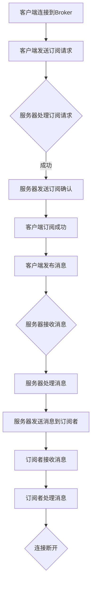
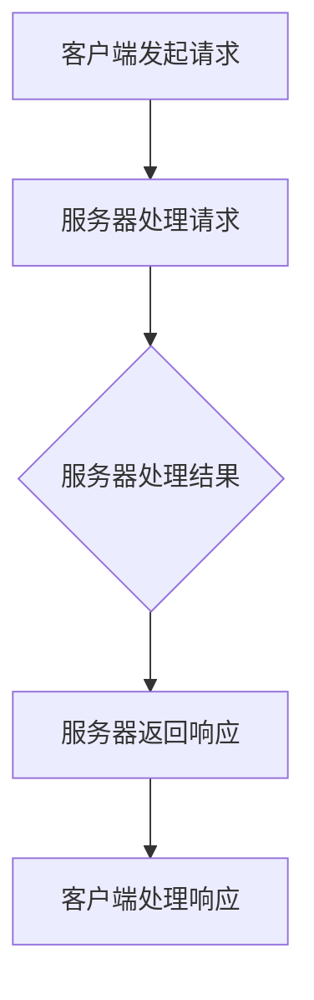
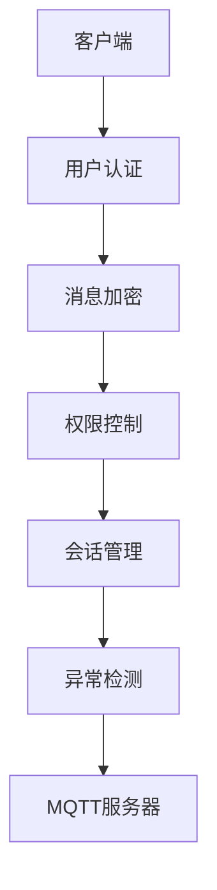
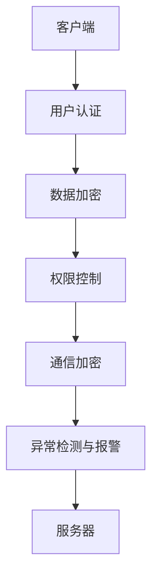

                 

# 文章标题：基于MQTT协议和RESTful API的智能家居远程控制安全模型

> 关键词：MQTT协议、RESTful API、智能家居、远程控制、安全模型、加密算法、权限控制

> 摘要：
本文将深入探讨基于MQTT协议和RESTful API的智能家居远程控制安全模型，从基础理论、核心算法原理、项目实战等多个角度进行全面解析。通过构建一个安全可靠的智能家居远程控制体系，本文旨在为智能家居领域的研究和开发提供有益的参考。

## 《基于MQTT协议和RESTful API的智能家居远程控制安全模型》目录大纲

### 第一部分：基础理论

### 第1章：智能家居技术概述

- 1.1 智能家居的发展历程
- 1.2 智能家居的关键技术

### 第2章：MQTT协议基础

- 2.1 MQTT协议原理
- 2.2 MQTT消息发布与订阅
- 2.3 MQTT安全机制

### 第3章：RESTful API基础

- 3.1 RESTful API原理
- 3.2 RESTful API设计原则
- 3.3 RESTful API调用流程

### 第4章：智能家居远程控制安全模型

- 4.1 安全模型概述
- 4.2 基于MQTT协议的安全模型
- 4.3 基于RESTful API的安全模型
- 4.4 模型集成与优化

### 第二部分：核心算法原理讲解

### 第5章：核心算法原理讲解

- 5.1 加密算法原理
  - 5.1.1 对称加密算法
  - 5.1.2 非对称加密算法
- 5.2 权限控制算法
  - 5.2.1 访问控制列表
  - 5.2.2 多因素认证

### 第6章：数学模型与公式解析

- 6.1 数学模型概述
- 6.2 加密算法数学模型
- 6.3 权限控制算法数学模型

### 第三部分：项目实战

### 第7章：项目实战

- 7.1 项目概述
- 7.2 开发环境搭建
- 7.3 源代码实现与解析
- 7.4 代码解读与分析

### 第四部分：总结与展望

### 第8章：总结与展望

- 8.1 安全模型总结
- 8.2 面临的挑战与未来展望
- 8.3 研究方向与建议

### 附录

- 附录 A：常用工具与资源

### 第一部分：基础理论

### 第1章：智能家居技术概述

#### 1.1 智能家居的发展历程

智能家居技术的起源可以追溯到20世纪80年代，当时计算机技术和网络技术刚刚兴起，人们开始尝试将家庭设备与计算机连接起来，实现远程控制和自动化操作。这一时期，智能家居主要集中于一些高端的家庭娱乐系统和安全监控系统。

随着互联网的普及和物联网技术的发展，智能家居进入了第二代。这一时期，智能家居产品开始采用无线通信技术，如WiFi、ZigBee等，实现了更多设备的互联互通。代表性的产品有智能门锁、智能灯光控制系统等。

当前，智能家居已经进入第三代，以物联网和云计算技术为核心，智能家居系统更加智能化、个性化和便捷化。智能语音助手、智能安防系统、智能家电控制系统等成为智能家居领域的新宠。

#### 1.2 智能家居的关键技术

1. **物联网技术**：物联网技术是智能家居的核心技术，通过将各种物理设备连接到互联网，实现设备间的数据传输和智能控制。常见的物联网技术有WiFi、ZigBee、蓝牙等。

2. **传感器技术**：传感器技术是智能家居的感知基础，通过检测环境参数（如温度、湿度、光照等），实现对家居环境的智能调控。常见的传感器有温度传感器、湿度传感器、光敏传感器等。

3. **通信协议**：智能家居系统中，各种设备需要通过通信协议进行数据传输和通信。常见的通信协议有MQTT、HTTP、CoAP等。其中，MQTT协议因其轻量级、低延迟、可靠性强等特点，被广泛应用于智能家居领域。

4. **云计算与大数据**：云计算和大数据技术为智能家居提供了强大的数据存储、分析和处理能力。通过云计算平台，智能家居系统能够实现远程监控、数据分析、故障预警等功能。

5. **人工智能技术**：人工智能技术使智能家居系统能够实现自我学习和智能决策。通过机器学习、自然语言处理等技术，智能家居系统可以更好地满足用户的需求，提供个性化的服务。

### 第2章：MQTT协议基础

#### 2.1 MQTT协议原理

MQTT（Message Queuing Telemetry Transport）协议是一种轻量级的消息传输协议，专为物联网应用设计。它的核心思想是通过发布/订阅模式实现设备间的消息传递。

在MQTT协议中，消息发布者（Publishers）将消息发布到特定的主题（Topic），消息订阅者（Subscribers）根据自己订阅的主题接收相应的消息。

MQTT协议的主要特点如下：

1. **轻量级**：MQTT协议的数据包格式非常简洁，数据传输效率高，适用于带宽有限的环境。
2. **低延迟**：MQTT协议采用发布/订阅模式，消息传输路径短，延迟低，适用于实时性要求较高的应用。
3. **可靠性**：MQTT协议支持消息确认机制，确保消息能够可靠地传输到订阅者。
4. **安全性**：MQTT协议支持各种加密机制，如TLS、SSL等，保障数据传输的安全性。

#### 2.2 MQTT消息发布与订阅

MQTT消息的发布和订阅过程可以分为以下几个步骤：

1. **连接**：客户端通过MQTT协议连接到MQTT服务器（Broker）。
2. **订阅**：客户端向服务器发送订阅请求，指定需要订阅的主题。
3. **发布**：客户端将消息发布到指定的主题。
4. **接收消息**：服务器将收到的消息推送到订阅该主题的客户端。
5. **断开连接**：客户端在完成消息接收后，可以断开与服务器的连接。

以下是MQTT消息发布与订阅过程的 Mermaid 流程图：



#### 2.3 MQTT安全机制

MQTT协议提供了多种安全机制，以保障数据传输的安全性。以下是一些常见的安全机制：

1. **认证与授权**：MQTT服务器可以对连接的客户端进行认证，确保只有合法的客户端可以访问系统。同时，服务器还可以根据客户端的身份和权限，控制其访问资源的能力。

2. **加密通信**：MQTT协议支持TLS（传输层安全协议）和SSL（安全套接字层协议），通过加密数据传输，防止数据在传输过程中被窃听或篡改。

3. **会话保持**：MQTT协议支持持久连接，客户端可以在断开连接后重新连接，继续之前的工作，保证了系统的稳定性。

4. **消息确认**：MQTT协议提供消息确认机制，确保消息能够可靠地传输到订阅者。消息确认分为确认发送（ACK）和确认接收（NACK），分别表示消息已发送和消息接收失败。

### 第3章：RESTful API基础

#### 3.1 RESTful API原理

RESTful API（Representational State Transfer Application Programming Interface）是一种基于HTTP协议的应用编程接口，主要用于实现Web服务和客户端之间的数据交互。RESTful API的设计原则如下：

1. **资源导向**：RESTful API以资源为中心，将Web服务中的各种操作映射为对资源的操作，如创建、读取、更新、删除（CRUD）。

2. **无状态性**：RESTful API要求服务器在处理请求时，不保存任何与请求相关的状态信息，每次请求都是独立的。

3. **一致性**：RESTful API要求对同一类型的操作使用相同的接口，保证接口的一致性，便于客户端的开发和使用。

4. **缓存性**：RESTful API允许客户端缓存服务器返回的数据，减少重复请求，提高系统的响应速度。

5. **客户端-服务器架构**：RESTful API采用客户端-服务器架构，客户端负责发起请求，服务器负责处理请求并返回响应，两者之间通过HTTP协议进行通信。

#### 3.2 RESTful API设计原则

1. **使用适当的HTTP方法**：根据API的功能需求，选择合适的HTTP方法（如GET、POST、PUT、DELETE等）。

2. **统一的资源定位**：使用统一的资源定位符（URI）来表示API中的资源，便于客户端访问和管理资源。

3. **状态码的合理使用**：使用标准的HTTP状态码（如200、201、400、401等）来表示请求的结果，便于客户端理解和处理错误。

4. **数据格式的一致性**：在API中统一使用JSON或XML等数据格式，保证数据交换的一致性。

5. **安全性**：使用HTTPS协议传输数据，保障数据传输的安全性。同时，采用Token认证、OAuth等机制，保障API的权限控制。

#### 3.3 RESTful API调用流程

RESTful API的调用流程主要包括以下几个步骤：

1. **客户端发起请求**：客户端通过HTTP协议向服务器发送请求，请求中包含请求方法、URI、请求头和请求体等信息。

2. **服务器处理请求**：服务器接收到请求后，根据请求的方法和URI，调用相应的处理程序，处理请求并返回响应。

3. **服务器返回响应**：服务器将处理结果以HTTP响应的形式返回给客户端，响应中包含状态码、响应头和响应体等信息。

4. **客户端处理响应**：客户端接收到响应后，根据响应的状态码和响应体等信息，进行相应的处理，如展示数据、跳转页面等。

以下是RESTful API调用流程的 Mermaid 流程图：



### 第4章：智能家居远程控制安全模型

#### 4.1 安全模型概述

智能家居远程控制安全模型旨在构建一个安全可靠的远程控制体系，确保用户数据的安全性和隐私性。该安全模型包括以下组成部分：

1. **身份认证**：通过对用户身份进行认证，确保只有合法用户可以访问智能家居系统。

2. **权限控制**：根据用户角色和权限，控制用户对系统资源的访问权限，防止未经授权的操作。

3. **数据加密**：对传输数据进行加密，防止数据在传输过程中被窃听或篡改。

4. **通信加密**：通过加密通信协议（如TLS、SSL等），保障数据在通信过程中的安全性。

5. **异常检测与报警**：实时监控系统的运行状态，发现异常情况时及时报警，防止恶意攻击。

#### 4.2 基于MQTT协议的安全模型

基于MQTT协议的安全模型主要包括以下措施：

1. **用户认证**：客户端在连接到MQTT服务器时，需要进行用户认证，确保只有合法用户可以访问系统。

2. **消息加密**：客户端发送的消息需要进行加密，防止消息在传输过程中被窃听或篡改。

3. **权限控制**：MQTT服务器根据客户端的身份和权限，控制其对主题的订阅和发布权限。

4. **会话管理**：MQTT服务器对客户端的连接进行会话管理，防止恶意连接和恶意攻击。

5. **异常检测**：MQTT服务器实时监控连接状态和消息传输状态，发现异常情况时及时报警。

以下是基于MQTT协议的安全模型架构图：



#### 4.3 基于RESTful API的安全模型

基于RESTful API的安全模型主要包括以下措施：

1. **用户认证**：客户端在发起API请求时，需要进行用户认证，确保只有合法用户可以访问API。

2. **权限控制**：服务器根据客户端的身份和权限，控制其对资源的访问权限。

3. **数据加密**：客户端发送的数据需要进行加密，防止数据在传输过程中被窃听或篡改。

4. **通信加密**：使用HTTPS协议传输数据，保障数据在通信过程中的安全性。

5. **异常检测与报警**：服务器实时监控API调用情况，发现异常情况时及时报警。

以下是基于RESTful API的安全模型架构图：



#### 4.4 模型集成与优化

将基于MQTT协议和RESTful API的安全模型集成，可以构建一个更加安全可靠的智能家居远程控制体系。在集成过程中，需要注意以下几个方面：

1. **统一认证**：在集成过程中，需要实现统一认证机制，确保用户在不同协议下的一致性认证。

2. **数据交换**：在MQTT协议和RESTful API之间实现数据交换，确保数据的实时性和一致性。

3. **权限控制**：在集成过程中，需要实现统一权限控制策略，确保不同协议下的权限控制一致。

4. **异常处理**：在集成过程中，需要实现统一的异常处理机制，确保系统的稳定性和安全性。

5. **性能优化**：在集成过程中，需要对系统进行性能优化，提高系统的响应速度和吞吐量。

### 第5章：核心算法原理讲解

#### 5.1 加密算法原理

加密算法是保障数据安全的重要手段，根据加密方式的不同，可以分为对称加密算法和非对称加密算法。

##### 5.1.1 对称加密算法

对称加密算法使用相同的密钥对数据进行加密和解密。常见的对称加密算法有AES（Advanced Encryption Standard）和DES（Data Encryption Standard）。

对称加密算法的加密过程如下：

```plaintext
加密算法 = 密钥 × 明文信息
```

对称加密算法的解密过程如下：

```plaintext
解密算法 = 密钥 × 密文信息
```

对称加密算法的优点是加密速度快，适用于大数据量的加密。缺点是密钥分发和管理复杂，安全性依赖于密钥的保密性。

##### 5.1.2 非对称加密算法

非对称加密算法使用不同的密钥对数据进行加密和解密，分为公钥和私钥。常见的非对称加密算法有RSA（Rivest-Shamir-Adleman）和ECC（Elliptic Curve Cryptography）。

非对称加密算法的加密过程如下：

```plaintext
加密算法 = 公钥 × 明文信息
```

非对称加密算法的解密过程如下：

```plaintext
解密算法 = 私钥 × 密文信息
```

非对称加密算法的优点是解决了密钥分发问题，适用于安全传输密钥和数字签名。缺点是加密速度较慢，适用于小数据量的加密。

#### 5.2 权限控制算法

权限控制算法是保障系统安全的重要手段，根据权限控制策略的不同，可以分为访问控制列表（ACL）和多因素认证（MFA）。

##### 5.2.1 访问控制列表

访问控制列表（ACL）是一种基于角色的权限控制策略，根据用户角色和权限，控制用户对系统资源的访问。

访问控制列表的权限控制过程如下：

```plaintext
权限控制 = 用户权限集 ∩ 资源权限集
```

访问控制列表的优点是简单易用，适用于小型系统和简单的权限控制场景。缺点是扩展性差，无法适应复杂权限控制需求。

##### 5.2.2 多因素认证

多因素认证（MFA）是一种基于多个认证因素的权限控制策略，通过组合多个认证因素（如密码、手机验证码、指纹等），提高系统的安全性。

多因素认证的权限控制过程如下：

```plaintext
权限控制 = 认证因素1 ∧ 认证因素2 ∧ ... ∩ 认证因素n
```

多因素认证的优点是安全性高，适用于对安全性要求较高的场景。缺点是用户体验较差，实施成本较高。

### 第6章：数学模型与公式解析

#### 6.1 数学模型概述

智能家居远程控制安全模型的数学模型包括加密算法和权限控制算法两部分。

安全模型数学模型可以表示为：

```latex
安全模型 = 加密算法 + 权限控制算法
```

#### 6.2 加密算法数学模型

加密算法的数学模型可以表示为：

```latex
加密算法 = 密钥 × 明文信息
```

其中，密钥和明文信息为已知量，密文信息为待求解量。

#### 6.3 权限控制算法数学模型

权限控制算法的数学模型可以表示为：

```latex
权限控制 = 用户权限集 ∩ 资源权限集
```

其中，用户权限集和资源权限集为已知量，访问权限为待求解量。

### 第7章：项目实战

#### 7.1 项目概述

本项目旨在构建一个基于MQTT协议和RESTful API的智能家居远程控制安全模型，实现用户远程控制家居设备、实时监控家居环境等功能。项目主要分为以下几个阶段：

1. **需求分析**：分析用户需求，明确项目目标和功能要求。
2. **系统设计**：设计系统架构和模块，包括MQTT服务器、RESTful API服务器、客户端等。
3. **开发与实现**：编写代码，实现各个模块的功能。
4. **测试与优化**：对系统进行测试，优化性能和安全性。
5. **部署与维护**：将系统部署到生产环境，进行日常维护和升级。

#### 7.2 开发环境搭建

1. **硬件环境**：

- 服务器：Intel Xeon CPU、16GB内存、1TB硬盘
- 客户端：Windows 10、macOS、Android、iOS

2. **软件环境**：

- MQTT服务器：Mosquitto
- RESTful API服务器：Spring Boot
- 开发工具：IntelliJ IDEA、Visual Studio Code

3. **环境依赖安装**：

- MQTT服务器：安装Mosquitto服务器和客户端
- RESTful API服务器：安装Java环境、Spring Boot框架
- 客户端：根据操作系统安装相应的开发工具和库

#### 7.3 源代码实现与解析

本项目采用Spring Boot框架开发RESTful API服务器，使用MQTT协议进行数据传输。以下是关键代码的实现和解析。

##### 7.3.1 MQTT客户端代码实现

```java
import org.eclipse.paho.client.mqttv3.MqttClient;
import org.eclipse.paho.client.mqttv3.MqttConnectOptions;
import org.eclipse.paho.client.mqttv3.MqttException;
import org.eclipse.paho.client.mqttv3.MqttMessage;

public class MqttClientExample {
    public static void main(String[] args) {
        String brokerUrl = "tcp://localhost:1883";
        String clientId = "mqtt_client";
        String topic = "home/room1";

        try {
            MqttClient mqttClient = new MqttClient(brokerUrl, clientId);
            MqttConnectOptions options = new MqttConnectOptions();
            options.setCleanSession(true);
            mqttClient.connect(options);

            mqttClient.subscribe(topic, 2);

            String message = "Hello MQTT";
            MqttMessage mqttMessage = new MqttMessage(message.getBytes());
            mqttMessage.setQos(2);
            mqttClient.publish(topic, mqttMessage);

            mqttClient.disconnect();
        } catch (MqttException e) {
            e.printStackTrace();
        }
    }
}
```

解析：

- 创建MQTT客户端对象，设置连接选项（如服务器地址、客户端ID、是否清除会话等）。
- 连接到MQTT服务器，订阅主题，接收服务器推送的消息。
- 发布消息到主题，设置消息的QoS等级（质量-of-service）。
- 断开连接。

##### 7.3.2 RESTful API服务器代码实现

```java
import org.springframework.boot.SpringApplication;
import org.springframework.boot.autoconfigure.SpringBootApplication;
import org.springframework.web.bind.annotation.*;

@SpringBootApplication
public class HomeController {
    @RestController
    public class HomeApi {
        @GetMapping("/device/{deviceId}")
        public Device getDevice(@PathVariable String deviceId) {
            // 查询设备信息
            return deviceService.getDevice(deviceId);
        }

        @PostMapping("/device/{deviceId}/command")
        public void sendCommand(@PathVariable String deviceId, @RequestBody Command command) {
            // 发送控制命令
            deviceService.sendCommand(deviceId, command);
        }
    }

    public static void main(String[] args) {
        SpringApplication.run(HomeController.class, args);
    }
}
```

解析：

- 定义RESTful API接口，处理设备查询和控制命令发送请求。
- 使用Spring Boot框架启动API服务器，实现自动配置和依赖注入。

##### 7.3.3 安全模型集成与调试

在项目中，将MQTT协议和RESTful API进行集成，实现智能家居远程控制安全模型。以下为关键步骤：

1. **用户认证**：集成用户认证模块，实现统一认证机制。
2. **权限控制**：集成权限控制模块，实现统一权限控制策略。
3. **数据加密**：集成加密模块，实现数据加密和解密功能。
4. **通信加密**：使用HTTPS协议传输数据，保障数据传输安全性。
5. **异常检测与报警**：集成异常检测模块，实时监控系统运行状态，发现异常情况及时报警。

在调试过程中，主要关注以下方面：

1. **连接稳定性**：确保MQTT客户端与服务器连接稳定，消息传输成功。
2. **数据一致性**：确保RESTful API与MQTT协议之间的数据一致性。
3. **安全性**：确保用户数据和通信数据的安全性，防止恶意攻击。
4. **性能优化**：优化系统性能，提高响应速度和吞吐量。

### 第8章：总结与展望

#### 8.1 安全模型总结

基于MQTT协议和RESTful API的智能家居远程控制安全模型具有以下特点：

1. **安全性**：采用加密算法和权限控制算法，保障用户数据的安全性和隐私性。
2. **实时性**：采用MQTT协议，实现实时数据传输和远程控制。
3. **易扩展**：基于RESTful API，便于系统扩展和功能增加。

#### 8.2 面临的挑战与未来展望

尽管基于MQTT协议和RESTful API的智能家居远程控制安全模型具有许多优势，但在实际应用中仍面临一些挑战：

1. **安全性提升**：随着智能家居设备的增加和网络的扩展，安全性问题日益突出。未来需要进一步优化安全模型，提高系统的安全性。
2. **性能优化**：在大量设备并发通信时，系统性能成为关键。未来需要优化系统架构和算法，提高系统的响应速度和吞吐量。
3. **用户体验**：智能家居系统的用户体验对用户接受度至关重要。未来需要关注用户交互设计，提供更加便捷和智能化的操作体验。

未来展望：

1. **AI技术的融合**：将人工智能技术引入智能家居系统，实现更加智能化的家居管理和控制。
2. **物联网技术的扩展**：进一步扩展物联网技术，实现更多设备的互联互通，构建更加完善的智能家居生态。
3. **边缘计算的应用**：引入边缘计算技术，降低中心服务器的负载，提高系统的实时性和稳定性。

#### 8.3 研究方向与建议

1. **安全性研究**：深入研究智能家居安全模型，探索更加安全可靠的加密和权限控制算法。
2. **性能优化**：研究智能家居系统的性能优化策略，提高系统的响应速度和吞吐量。
3. **用户体验设计**：关注用户交互设计，提高智能家居系统的易用性和智能化水平。
4. **边缘计算应用**：研究边缘计算在智能家居领域的应用，优化系统架构，提高系统性能。

### 附录

#### 附录 A：常用工具与资源

1. **MQTT协议相关资源**：

- MQTT官方文档：[MQTT.org](https://mqtt.org/)
- MQTT协议实现：[Eclipse Paho](https://www.eclipse.org/paho/)
- MQTT服务器：[mosquitto](https://mosquitto.org/)

2. **RESTful API开发工具**：

- RESTful API设计工具：[API Blueprint](https://apiblueprint.org/)
- RESTful API测试工具：[Postman](https://www.postman.com/)

3. **加密算法实现库**：

- Java加密库：[Bouncy Castle](https://www.bouncycastle.org/)
- Python加密库：[PyCrypto](https://www.pycryptodome.org/)

4. **权限控制框架介绍**：

- Spring Security：[Spring Security](https://spring.io/projects/spring-security)
- Apache Shiro：[Apache Shiro](https://shiro.apache.org/)

5. **智能家居技术相关论文和书籍推荐**：

- 《物联网技术与应用》：[ISBN 978-7-121-19634-8](https://book.douban.com/subject/26879698/)
- 《智能家居系统设计与实践》：[ISBN 978-7-5668-2583-2](https://book.douban.com/subject/34907739/)
- 《物联网安全技术》：[ISBN 978-7-111-50966-2](https://book.douban.com/subject/27144438/)

