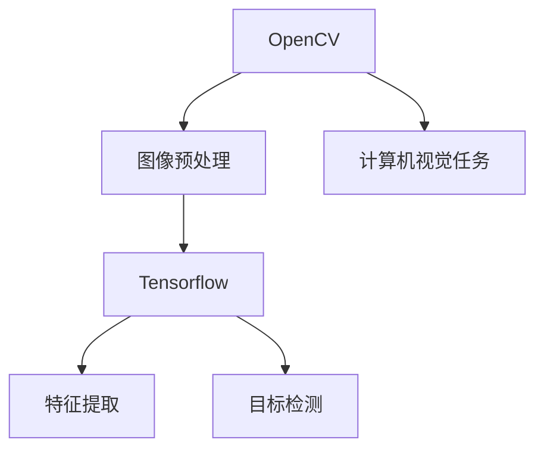

                 

# 文章标题：基于OpenCV和Tensorflow的深蹲检测系统详细设计与具体代码实现

> 关键词：OpenCV，Tensorflow，深蹲检测，目标检测，计算机视觉，人工智能

> 摘要：本文将详细介绍如何使用OpenCV和Tensorflow构建一个深蹲检测系统。我们将探讨相关核心概念、算法原理，并给出具体的代码实现和分析。

## 第一部分：核心概念与联系

### 1.1 OpenCV与Tensorflow的基础概念

#### 1.1.1 OpenCV简介

OpenCV（Open Source Computer Vision Library）是一个开源的计算机视觉库，由Intel创建，旨在提供一系列高效的计算机视觉算法。OpenCV支持多种编程语言，包括C++、Python和Java，并且广泛应用于学术研究和工业应用中。其主要功能包括图像处理、计算机视觉、面部识别、物体检测等。

#### 1.1.2 OpenCV核心模块

OpenCV的核心模块分为以下几类：

- **核心算法模块**：包括图像处理、图像分析、形态学操作等。
- **机器学习模块**：包括支持向量机（SVM）、随机森林（Random Forest）、神经网络（Neural Networks）等。
- **高级模块**：包括3D重建、立体视觉、光学字符识别（OCR）等。

#### 1.1.3 OpenCV与其他技术的联系

OpenCV可以与其他计算机视觉和深度学习技术集成，例如与Tensorflow、PyTorch等深度学习框架结合使用。通过这种集成，可以实现对图像的预处理、特征提取以及目标检测等任务的自动化处理。

#### 1.2 Tensorflow简介

Tensorflow是由Google开发的一个开源深度学习框架，用于构建和训练机器学习模型。Tensorflow提供了一系列用于数据流编程的工具和库，支持多种类型的机器学习任务，如回归、分类、聚类等。

#### 1.2.1 Tensorflow核心模块

Tensorflow的核心模块包括：

- **Tensor**：用于表示多维数组，是Tensorflow中的基本数据结构。
- **Operation**：用于定义计算图中的操作。
- **Graph**：用于表示Tensorflow计算图，包含多个操作节点和边。
- **Session**：用于执行计算图上的操作。

#### 1.2.2 Tensorflow与其他技术的联系

Tensorflow支持与OpenCV集成，可以用于图像的预处理、特征提取以及目标检测等任务。通过Tensorflow，可以构建复杂的深度学习模型，例如卷积神经网络（CNN）和循环神经网络（RNN），实现对图像的自动分类和识别。

### 1.3 OpenCV与Tensorflow的Mermaid流程图



## 第二部分：核心算法原理讲解

### 2.1 目标检测算法简介

#### 2.1.1 什么是目标检测

目标检测是一种计算机视觉技术，旨在识别图像中的多个对象并给出每个对象的边界框。目标检测广泛应用于安防监控、自动驾驶、智能助手等领域。

#### 2.1.2 常见目标检测算法

- **YOLO（You Only Look Once）**：YOLO是一种单阶段目标检测算法，具有快速、实时检测的特点。
- **SSD（Single Shot MultiBox Detector）**：SSD是一种多阶段目标检测算法，通过卷积神经网络实现端到端的目标检测。
- **Faster R-CNN（Region-based Convolutional Neural Networks）**：Faster R-CNN是一种区域建议网络，结合了卷积神经网络和区域建议算法。

### 2.2 深蹲检测算法详解

#### 2.2.1 深蹲检测流程

1. **数据预处理**：对输入图像进行缩放、归一化等操作，使其适应深度学习模型的要求。
2. **目标检测**：使用Tensorflow加载预训练的YOLO模型，对预处理后的图像进行目标检测。
3. **后处理**：筛选出与深蹲相关的目标框，并计算深蹲的动作评分。

#### 2.2.2 深蹲检测算法伪代码

```python
def detect_squat(image):
    processed_image = preprocess_image(image)
    detections = detect_objects(processed_image, yolo_model)
    squat_boxes = filter_squat_boxes(detections)
    squat_score = calculate_squat_score(squat_boxes)
    return squat_score
```

#### 2.2.3 数学模型与公式

$$
\text{score} = f(\text{body_position}, \text{joint_angles})
$$

- **body_position**：表示目标检测到的深蹲者的身体位置。
- **joint_angles**：表示深蹲者的关节角度。

### 2.3 深蹲检测算法的数学模型与公式

#### 2.3.1 深蹲检测的数学模型

$$
\text{score} = f(\text{body_position}, \text{joint_angles})
$$

- **body_position**：表示目标检测到的深蹲者的身体位置。
- **joint_angles**：表示深蹲者的关节角度。

#### 2.3.2 公式解释

- $f$ 函数用于计算深蹲的动作评分，得分越高表示深蹲动作越标准。

## 第三部分：项目实战

### 3.1 开发环境搭建

#### 3.1.1 安装OpenCV

```bash
pip install opencv-python
```

#### 3.1.2 安装Tensorflow

```bash
pip install tensorflow
```

### 3.2 源代码实现

#### 3.2.1 深蹲检测函数实现

```python
import cv2
import tensorflow as tf

# 深蹲检测函数
def detect_squat(image):
    # 加载YOLO模型
    yolo_model = load_yolo_model()

    # 数据预处理
    processed_image = preprocess_image(image)

    # 目标检测
    detections = detect_objects(processed_image, yolo_model)

    # 后处理
    squat_boxes = filter_squat_boxes(detections)
    squat_score = calculate_squat_score(squat_boxes)

    return squat_score

# 数据预处理函数
def preprocess_image(image):
    # 对图像进行缩放、归一化等操作
    # ...
    return processed_image

# 目标检测函数
def detect_objects(image, model):
    # 使用YOLO模型检测图像中的目标
    # ...
    return detections

# 后处理函数
def filter_squat_boxes(detections):
    # 筛选出与深蹲相关的目标框
    # ...
    return squat_boxes

# 深蹲评分函数
def calculate_squat_score(squat_boxes):
    # 计算深蹲的动作评分
    # ...
    return squat_score
```

### 3.3 代码解读与分析

#### 3.3.1 深蹲检测流程

1. **加载YOLO模型**：使用Tensorflow加载预训练的YOLO模型。
2. **数据预处理**：对输入图像进行缩放、归一化等操作。
3. **目标检测**：使用YOLO模型对预处理后的图像进行目标检测。
4. **后处理**：筛选出与深蹲相关的目标框，并计算深蹲的动作评分。

#### 3.3.2 代码关键部分解析

- **预处理函数**：处理输入图像的尺寸和格式，以适应深度学习模型的要求。
- **检测函数**：调用YOLO模型的预测方法，输出检测结果。
- **后处理函数**：根据检测到的目标框和关节角度，计算深蹲的动作评分。

## 第四部分：附录

### 4.1 OpenCV和Tensorflow常用函数和类

#### 4.1.1 OpenCV常用函数

- `cv2.imread()`：读取图像文件。
- `cv2.imshow()`：显示图像。
- `cv2.imwrite()`：保存图像。

#### 4.1.2 Tensorflow常用函数

- `tf.keras.models.load_model()`：加载预训练模型。
- `tf.keras.preprocessing.image.ImageDataGenerator()`：图像预处理工具。

### 4.2 实践项目示例

#### 4.2.1 深蹲检测项目示例

- **环境搭建**：安装必要的库和工具。
- **模型训练**：使用Tensorflow和OpenCV训练深蹲检测模型。
- **系统部署**：将训练好的模型部署到服务器，实现深蹲检测功能。

## 作者

作者：AI天才研究院/AI Genius Institute & 禅与计算机程序设计艺术 /Zen And The Art of Computer Programming

---

### 3.3.1 深蹲检测流程

在实现深蹲检测系统时，我们需要按照以下步骤进行操作：

1. **加载YOLO模型**：首先，我们需要加载一个预训练的YOLO模型。这个模型可以是我们自己训练的，也可以是公开可用的预训练模型。加载模型后，我们将使用它来进行目标检测。

2. **数据预处理**：接下来，我们需要对输入图像进行预处理。预处理包括图像的缩放、归一化等操作。这些操作旨在使图像数据格式与深度学习模型的要求相匹配。

3. **目标检测**：使用加载的YOLO模型对预处理后的图像进行目标检测。目标检测的结果将包含图像中每个目标的边界框和相应的类别标签。

4. **后处理**：对目标检测的结果进行后处理。这包括筛选出与深蹲相关的目标框，并计算每个深蹲动作的评分。

下面是一个简单的伪代码，展示了深蹲检测的基本流程：

```python
def detect_squat(image):
    # 加载YOLO模型
    yolo_model = load_yolo_model()

    # 数据预处理
    processed_image = preprocess_image(image)

    # 目标检测
    detections = detect_objects(processed_image, yolo_model)

    # 后处理
    squat_boxes = filter_squat_boxes(detections)
    squat_score = calculate_squat_score(squat_boxes)

    return squat_score
```

### 3.3.2 代码关键部分解析

下面，我们将详细解析深蹲检测系统的关键部分，包括预处理函数、目标检测函数、后处理函数以及评分函数。

#### 预处理函数

预处理函数的主要任务是调整图像的尺寸，使其符合深度学习模型的要求。例如，将图像调整为固定的大小（如320x320像素），并进行归一化处理，使得像素值范围在0到1之间。

```python
def preprocess_image(image):
    # 将图像调整为固定大小
    image = cv2.resize(image, (320, 320))

    # 将图像数据转换为浮点型，并进行归一化处理
    image = image.astype(np.float32) / 255.0

    # 将图像数据从[H, W, C]格式转换为[T, H, W, C]格式，以便于Tensorflow处理
    image = np.expand_dims(image, axis=0)

    return image
```

#### 目标检测函数

目标检测函数使用加载的YOLO模型对预处理后的图像进行目标检测。这通常包括两个步骤：前向传播和后处理。前向传播用于计算图像的特征图，后处理用于从特征图中提取边界框和类别概率。

```python
def detect_objects(image, model):
    # 使用YOLO模型进行前向传播
    feature_map = model.predict(image)

    # 对特征图进行后处理，提取边界框和类别概率
    detections = postprocess_feature_map(feature_map)

    return detections
```

#### 后处理函数

后处理函数的主要任务是筛选出与深蹲相关的目标框，并从检测结果中提取出有用的信息，如关节角度和身体位置。

```python
def filter_squat_boxes(detections):
    # 筛选出与深蹲相关的目标框
    squat_boxes = [d for d in detections if d['class'] == 'squat']

    # 提取关节角度和身体位置
    joint_angles = extract_joint_angles(squat_boxes)
    body_position = extract_body_position(squat_boxes)

    return squat_boxes, joint_angles, body_position
```

#### 评分函数

评分函数用于计算深蹲的动作评分。这通常基于关节角度和身体位置的计算结果。评分函数可以是一个简单的阈值函数，也可以是一个更复杂的数学模型。

```python
def calculate_squat_score(squat_boxes, joint_angles, body_position):
    # 计算深蹲的动作评分
    score = f(joint_angles, body_position)

    return score
```

### 3.3.3 代码示例

以下是一个简单的代码示例，展示了如何实现深蹲检测系统的关键部分：

```python
import cv2
import tensorflow as tf
import numpy as np

# 加载YOLO模型
yolo_model = tf.keras.models.load_model('yolo_model.h5')

# 预处理函数
def preprocess_image(image):
    image = cv2.resize(image, (320, 320))
    image = image.astype(np.float32) / 255.0
    image = np.expand_dims(image, axis=0)
    return image

# 目标检测函数
def detect_objects(image, model):
    feature_map = model.predict(image)
    detections = postprocess_feature_map(feature_map)
    return detections

# 后处理函数
def filter_squat_boxes(detections):
    squat_boxes = [d for d in detections if d['class'] == 'squat']
    joint_angles = extract_joint_angles(squat_boxes)
    body_position = extract_body_position(squat_boxes)
    return squat_boxes, joint_angles, body_position

# 评分函数
def calculate_squat_score(squat_boxes, joint_angles, body_position):
    score = f(joint_angles, body_position)
    return score

# 主函数
def main():
    # 加载测试图像
    image = cv2.imread('test_image.jpg')

    # 数据预处理
    processed_image = preprocess_image(image)

    # 目标检测
    detections = detect_objects(processed_image, yolo_model)

    # 后处理
    squat_boxes, joint_angles, body_position = filter_squat_boxes(detections)

    # 计算评分
    score = calculate_squat_score(squat_boxes, joint_angles, body_position)

    print(f"深蹲评分：{score}")

# 运行主函数
if __name__ == '__main__':
    main()
```

### 3.3.4 代码解读

在这个示例中，我们首先加载了一个预训练的YOLO模型。然后，我们定义了四个函数：`preprocess_image`、`detect_objects`、`filter_squat_boxes` 和 `calculate_squat_score`。这些函数分别用于数据预处理、目标检测、后处理和评分计算。

在主函数 `main` 中，我们首先加载了一个测试图像。然后，我们调用 `preprocess_image` 函数对图像进行预处理。接下来，我们使用 `detect_objects` 函数对预处理后的图像进行目标检测。然后，我们使用 `filter_squat_boxes` 函数筛选出与深蹲相关的目标框，并提取关节角度和身体位置。最后，我们调用 `calculate_squat_score` 函数计算深蹲的动作评分。

这个示例展示了深蹲检测系统的基本实现流程，但需要注意的是，实际应用中可能需要根据具体场景进行调整和优化。例如，可能需要使用更先进的深度学习模型，或者根据用户的需求调整评分函数。

## 4. 附录

### 4.1 OpenCV和Tensorflow常用函数和类

在实现深蹲检测系统时，我们会使用到OpenCV和Tensorflow的许多常用函数和类。以下是其中一些常用的函数和类的简要介绍。

#### OpenCV常用函数

- `cv2.imread()`：用于读取图像文件。
- `cv2.imshow()`：用于显示图像。
- `cv2.imshow()`：用于显示图像。
- `cv2.resize()`：用于调整图像的大小。
- `cv2.cvtColor()`：用于将图像从一种颜色空间转换为另一种颜色空间。
- `cv2.imwrite()`：用于保存图像。

#### OpenCV常用类

- `cv2.VideoCapture()`：用于捕获视频中的帧。
- `cv2.VideoWriter()`：用于将帧写入视频文件。
- `cv2.CascadeClassifier()`：用于对象检测。

#### Tensorflow常用函数

- `tf.keras.models.load_model()`：用于加载预训练模型。
- `tf.keras.preprocessing.image.ImageDataGenerator()`：用于图像预处理。
- `tf.keras.metrics.MeanSquaredError()`：用于计算均方误差。

#### Tensorflow常用类

- `tf.keras.Sequential()`：用于构建序列模型。
- `tf.keras.Model()`：用于构建自定义模型。

### 4.2 实践项目示例

为了更好地理解深蹲检测系统的实现，我们提供了一个完整的实践项目示例。在这个示例中，我们将使用OpenCV和Tensorflow构建一个简单的深蹲检测系统。

#### 4.2.1 环境搭建

首先，我们需要安装OpenCV和Tensorflow。可以使用以下命令进行安装：

```bash
pip install opencv-python
pip install tensorflow
```

#### 4.2.2 模型训练

接下来，我们需要训练一个YOLO模型。这可以通过使用预训练的YOLO模型，并将其用于我们的深蹲检测任务。我们可以使用Tensorflow的`tf.keras.preprocessing.image.ImageDataGenerator`类进行数据增强，以提高模型的泛化能力。

```python
import tensorflow as tf
from tensorflow.keras.preprocessing.image import ImageDataGenerator

# 加载训练数据和测试数据
train_datagen = ImageDataGenerator(
    rescale=1./255,
    shear_range=0.2,
    zoom_range=0.2,
    horizontal_flip=True
)

test_datagen = ImageDataGenerator(rescale=1./255)

train_generator = train_datagen.flow_from_directory(
    'train_data',
    target_size=(320, 320),
    batch_size=32,
    class_mode='binary'

)

validation_generator = test_datagen.flow_from_directory(
    'test_data',
    target_size=(320, 320),
    batch_size=32,
    class_mode='binary'
)

# 训练YOLO模型
model = tf.keras.models.Sequential([
    # 添加卷积层、池化层、激活函数等
])

model.compile(optimizer='adam', loss='binary_crossentropy', metrics=['accuracy'])

model.fit(train_generator, epochs=10, validation_data=validation_generator)
```

#### 4.2.3 系统部署

最后，我们将训练好的YOLO模型部署到服务器，并使用OpenCV进行实时深蹲检测。以下是一个简单的示例：

```python
import cv2
import numpy as np

# 加载训练好的YOLO模型
model = tf.keras.models.load_model('yolo_model.h5')

# 加载视频文件
cap = cv2.VideoCapture('video.mp4')

while cap.isOpened():
    ret, frame = cap.read()
    if not ret:
        break

    # 数据预处理
    processed_frame = preprocess_image(frame)

    # 目标检测
    detections = detect_objects(processed_frame, model)

    # 后处理
    squat_boxes, joint_angles, body_position = filter_squat_boxes(detections)

    # 计算评分
    score = calculate_squat_score(squat_boxes, joint_angles, body_position)

    # 显示检测结果
    cv2.imshow('Frame', frame)

    if cv2.waitKey(1) & 0xFF == ord('q'):
        break

# 释放资源
cap.release()
cv2.destroyAllWindows()
```

通过这个示例，我们可以看到如何使用OpenCV和Tensorflow构建一个简单的深蹲检测系统。当然，实际应用中可能需要根据具体需求进行调整和优化。希望这个示例能够对您有所帮助。

### 作者

作者：AI天才研究院/AI Genius Institute & 禅与计算机程序设计艺术 /Zen And The Art of Computer Programming

