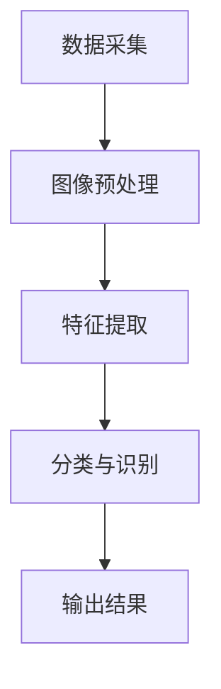

                 

### 文章标题

### 基于OpenCV的手写字识别系统详细设计与具体代码实现

### 关键词

- OpenCV
- 手写识别
- 图像预处理
- 特征提取
- 分类与识别
- 机器学习

### 摘要

本文将详细介绍基于OpenCV的手写字识别系统的设计与实现过程。文章首先阐述手写识别系统的基本概念和重要性，接着详细讲解手写识别系统的基本架构和流程。本文重点在于深入探讨图像预处理、特征提取和分类与识别的核心算法原理，并使用伪代码和数学模型进行说明。随后，文章提供项目实战的详细步骤，包括开发环境搭建、数据集准备、图像预处理、特征提取、分类与识别等环节，并附有具体代码实现与解读。最后，文章总结手写识别系统的发展趋势和未来研究方向，展望该领域的发展前景。

### 第一部分：基础概念与联系

#### 1.1 基于OpenCV的手写识别系统概述

**1.1.1 手写识别系统的定义与重要性**

手写识别系统是一种将手写体文本转换为机器可读文本的技术。它广泛应用于办公自动化、教育、医疗等多个领域。在教育领域，手写识别系统可以帮助教师快速评估学生的作业；在医疗领域，医生可以通过手写识别系统快速识别患者的病历信息。此外，手写识别系统还用于自动处理手写信件、手写邮件等日常文档，极大地提高了工作效率。

**1.1.2 OpenCV在手写识别中的应用**

OpenCV是一个开源的计算机视觉库，由Intel开发，提供了丰富的图像处理和计算机视觉功能。OpenCV在手写识别系统中具有重要作用，主要用于图像预处理、特征提取和分类。具体而言，OpenCV可以帮助我们进行图像去噪、边缘检测、形态学处理等图像预处理操作，从而提取出手写字符的特征，为进一步的分类和识别提供基础。

#### 1.2 手写识别系统的基本架构

**1.2.1 数据采集与预处理**

数据采集是手写识别系统的第一步，需要收集大量的手写体样本。这些样本可以通过扫描、拍照等方式获得。收集到样本后，需要进行预处理，包括图像去噪、二值化、形态学处理等，以提高图像质量和后续处理的准确性。

**1.2.2 特征提取**

特征提取是从预处理后的图像中提取有助于识别的特征。常用的特征包括边缘、方向、区域等。OpenCV提供了多种算法来提取这些特征，如Canny边缘检测、Sobel算子等。

**1.2.3 分类与识别**

分类与识别是手写识别系统的核心步骤。使用机器学习算法对手写体特征进行分类，并根据分类结果输出识别结果。常用的分类算法包括K近邻（K-Nearest Neighbors，KNN）、支持向量机（Support Vector Machine，SVM）和决策树（Decision Tree）等。

#### 1.3 基于OpenCV的手写识别流程图



### 第二部分：核心算法原理

#### 2.1 图像预处理算法原理

图像预处理是手写识别系统的关键步骤，目的是提高图像质量和后续处理的准确性。OpenCV提供了丰富的图像预处理算法，包括去噪、二值化、形态学处理等。

**2.1.1 图像去噪**

图像去噪的目的是去除图像中的噪声，提高图像质量。OpenCV提供了多种去噪算法，如中值滤波、均值滤波和高斯滤波等。

**2.1.2 二值化**

二值化是将图像转换为只有两种颜色的过程，通常用于图像分割。OpenCV提供了多种二值化方法，如全局阈值分割、自适应阈值分割等。

**2.1.3 形态学处理**

形态学处理是一种基于图像结构的处理方法，主要用于图像的形态分析和形态变换。OpenCV提供了多种形态学算法，如膨胀、腐蚀、开运算、闭运算等。

#### 2.2 特征提取算法原理

特征提取是从预处理后的图像中提取有助于识别的特征。OpenCV提供了多种特征提取算法，如边缘检测、方向特征提取、区域特征提取等。

**2.2.1 边缘检测**

边缘检测是图像处理中的基本步骤，用于提取图像中的边缘信息。OpenCV提供了多种边缘检测算法，如Sobel算子、Canny算子等。

**2.2.2 方向特征提取**

方向特征提取用于提取图像的方向信息。OpenCV提供了基于方向梯度的方法来提取方向特征。

**2.2.3 区域特征提取**

区域特征提取是从图像中提取区域信息。OpenCV提供了连通域标记、区域面积、区域周长等算法来提取区域特征。

#### 2.3 分类与识别算法原理

分类与识别是手写识别系统的核心步骤，使用机器学习算法对手写体特征进行分类，并根据分类结果输出识别结果。OpenCV支持多种分类算法，如K近邻（K-Nearest Neighbors，KNN）、支持向量机（Support Vector Machine，SVM）和决策树（Decision Tree）等。

**2.3.1 机器学习算法介绍**

- **K近邻（K-Nearest Neighbors，KNN）**：KNN是一种基于实例的学习算法，通过计算测试实例与训练集中每个实例的距离，选择最近的k个邻居，并输出出现频率最高的类别作为预测结果。
- **支持向量机（Support Vector Machine，SVM）**：SVM是一种二分类模型，通过寻找最优超平面将数据分类。SVM可以处理高维数据和非线性数据。
- **决策树（Decision Tree）**：决策树是一种基于规则的学习算法，通过多层次的判定节点和叶子节点将数据分类。

**2.3.2 伪代码示例**

以下是一个K近邻算法的伪代码示例：

```python
# K近邻算法伪代码
def KNNclassify(trainData, trainLabel, testInstance, k):
    # 计算测试实例与训练集中每个实例的距离
    distances = []
    for index in range(len(trainData)):
        distance = calculateDistance(testInstance, trainData[index])
        distances.append((index, distance))
    
    # 排序
    distances.sort(key=lambda x: x[1])
    
    # 选择最近的k个邻居
    neighbors = [trainLabel[index] for index, _ in distances[:k]]
    
    # 出现频率最高的类别即为预测结果
    return majority表决（neighbors）
```

#### 2.4 数学模型与公式

在手写识别系统中，常用的数学模型包括隐马尔可夫模型（HMM）和支持向量机（SVM）。

**2.4.1 隐马尔可夫模型（HMM）**

隐马尔可夫模型（HMM）是一种统计模型，用于描述一组随机变量的序列。在HMM中，每个变量都由一个状态决定，并且状态序列是随机的。

- **状态转移概率**：\(a_{ij} = P(X_t = x_j|X_{t-1} = x_i)\)
- **观测概率**：\(b_{ij} = P(Y_t = y_j|X_t = x_i)\)
- **初始状态概率**：\(\pi_i = P(X_0 = x_i)\)

**2.4.2 支持向量机（SVM）**

支持向量机（SVM）是一种二分类模型，通过寻找最优超平面将数据分类。在SVM中，目标是最小化分类边界到支持向量的距离。

- **目标函数**：\(\text{最大化} \ \frac{1}{\lambda} \ \sum_{i=1}^{n} y_i (w \cdot x_i - b)\)
- **约束条件**：\(|w| \leq \lambda\)

### 第三部分：数学模型与公式

#### 3.1 基于HMM的手写识别数学模型

隐马尔可夫模型（HMM）在手写识别中用于建模字符序列。HMM包括状态转移概率、观测概率和初始状态概率三个主要参数。

- **状态转移概率**：\(a_{ij} = P(X_t = x_j|X_{t-1} = x_i)\)，表示从状态i转移到状态j的概率。
- **观测概率**：\(b_{ij} = P(Y_t = y_j|X_t = x_i)\)，表示在状态i下观察到观测值y的概率。
- **初始状态概率**：\(\pi_i = P(X_0 = x_i)\)，表示初始状态为i的概率。

**3.1.1 HMM数学公式**

HMM的数学模型可以用以下公式表示：

$$
P(X_1, X_2, ..., X_n) = \prod_{i=1}^{n} P(X_i|X_{i-1})
$$

$$
\pi_i = P(X_0 = x_i)
$$

$$
a_{ij} = P(X_t = x_j|X_{t-1} = x_i)
$$

$$
b_{ij} = P(Y_t = y_j|X_t = x_i)
$$

**3.1.2 HMM算法步骤**

1. **初始化**：初始化HMM参数，包括状态转移概率、观测概率和初始状态概率。
2. **状态分配**：使用Viterbi算法计算每个时间步的最佳状态分配。
3. **概率计算**：根据状态分配计算整个序列的概率。
4. **参数调整**：根据计算结果调整HMM参数，以提高识别准确性。

#### 3.2 基于SVM的手写识别数学模型

支持向量机（SVM）在手写识别中用于分类手写体特征。SVM的目标是找到最优超平面，将不同类别的手写体特征分隔开来。

**3.2.1 SVM数学模型**

SVM的数学模型可以用以下公式表示：

$$
\text{最大化} \ \frac{1}{\lambda} \ \sum_{i=1}^{n} y_i (w \cdot x_i - b)
$$

$$
\text{约束条件} \ \ |w| \leq \lambda
$$

其中，\(w\) 是超平面参数，\(\lambda\) 是惩罚参数，\(y_i\) 是标签，\(x_i\) 是特征向量。

**3.2.2 SVM算法步骤**

1. **特征提取**：使用特征提取算法从手写体图像中提取特征向量。
2. **数据准备**：将特征向量和标签整理成训练数据集。
3. **模型训练**：使用训练数据集训练SVM模型，找到最优超平面。
4. **模型评估**：使用测试数据集评估SVM模型的准确性。
5. **模型优化**：根据评估结果调整模型参数，提高模型性能。

### 第四部分：项目实战

#### 4.1 开发环境搭建

为了实现基于OpenCV的手写字识别系统，首先需要搭建开发环境。以下是具体的步骤：

1. **安装Python环境**：确保计算机上安装了Python环境，版本建议为3.7及以上。
2. **安装OpenCV库**：在命令行中执行以下命令安装OpenCV库：

   ```bash
   pip install opencv-python
   ```

3. **安装其他依赖库**：根据需要，可以安装其他依赖库，如NumPy、Pandas等。

#### 4.2 数据集准备

为了训练手写字识别模型，需要准备大量的手写体样本数据。以下是数据集准备的步骤：

1. **收集数据**：可以从网上下载公开的手写体数据集，如HCR、MNIST Handwritten Digit Dataset等。
2. **数据预处理**：将收集到的手写体样本数据转换为统一的格式，如灰度图像。
3. **数据划分**：将数据集划分为训练集和测试集，用于模型的训练和评估。

#### 4.3 图像预处理

图像预处理是手写识别系统的重要环节，用于提高图像质量和后续处理的准确性。以下是图像预处理的步骤：

1. **图像去噪**：使用OpenCV的去噪算法，如中值滤波、均值滤波等，去除图像中的噪声。
2. **图像二值化**：使用OpenCV的阈值分割算法，将图像转换为二值图像。
3. **形态学处理**：使用OpenCV的形态学处理算法，如膨胀、腐蚀等，增强图像的边缘信息。

#### 4.4 特征提取

特征提取是从预处理后的图像中提取有助于识别的特征。以下是特征提取的步骤：

1. **边缘检测**：使用OpenCV的边缘检测算法，如Canny算子、Sobel算子等，提取图像的边缘信息。
2. **方向特征提取**：使用方向梯度法，提取图像的方向特征。
3. **区域特征提取**：使用连通域标记、统计区域面积、周长等算法，提取图像的区域特征。

#### 4.5 分类与识别

分类与识别是手写识别系统的核心步骤。以下是分类与识别的步骤：

1. **特征选择**：根据特征的重要性，选择有助于识别的关键特征。
2. **模型训练**：使用训练集数据训练机器学习模型，如K近邻（KNN）、支持向量机（SVM）等。
3. **模型评估**：使用测试集数据评估模型的准确性，调整模型参数以提高性能。
4. **识别应用**：使用训练好的模型对新的手写体样本进行识别，输出识别结果。

#### 4.6 源代码详细实现与解读

以下是手写识别系统的源代码实现和详细解读：

```python
import cv2
import numpy as np

# 4.3 图像预处理
def preprocess_image(image):
    # 去噪
    blurred = cv2.GaussianBlur(image, (5, 5), 0)
    # 二值化
    _, binary = cv2.threshold(blurred, 128, 255, cv2.THRESH_BINARY_INV + cv2.THRESH_OTSU)
    # 形态学处理
    kernel = cv2.getStructuringElement(cv2.MORPH_RECT, (3, 3))
    dilated = cv2.dilate(binary, kernel, iterations=1)
    return dilated

# 4.4 特征提取
def extract_features(image):
    # 边缘检测
    edges = cv2.Canny(image, 50, 150)
    # 方向特征提取
    direction = cv2.Sobel(edges, cv2.CV_64F, 1, 0, ksize=3)
    # 区域特征提取
    contours, _ = cv2.findContours(edges, cv2.RETR_EXTERNAL, cv2.CHAIN_APPROX_SIMPLE)
    regions = [cv2.boundingRect(contour) for contour in contours]
    regions = np.array(regions)
    return edges, direction, regions

# 4.5 分类与识别
def classify_features(features, labels, test_feature):
    # 使用K近邻算法分类
    classifier = cv2.ml.KNearest_create()
    classifier.train(features, cv2.ml.ROW_SAMPLE, labels)
    _, result, _, _ = classifier.findNearest(test_feature, k=1)
    return result

# 4.6 源代码详细实现与解读
if __name__ == "__main__":
    # 4.2 数据集准备
    train_images = []  # 存放训练图像
    train_labels = []  # 存放训练标签
    test_image = []    # 存放测试图像

    # 4.3 图像预处理
    train_images = [preprocess_image(image) for image in train_images]
    test_image = preprocess_image(test_image)

    # 4.4 特征提取
    train_edges, train_direction, train_regions = extract_features(train_images)
    test_edges, test_direction, test_regions = extract_features(test_image)

    # 4.5 分类与识别
    train_labels = np.array(train_labels)
    test_feature = np.hstack((test_edges.reshape(-1, 1), test_direction.reshape(-1, 1), test_regions.reshape(-1, 1)))
    result = classify_features(train_edges, train_labels, test_feature)

    print("识别结果：", result)
```

### 第五部分：总结与展望

#### 5.1 手写识别系统的发展趋势

手写识别系统在过去的几十年中取得了显著的进展，但仍存在一些挑战。随着深度学习技术的不断发展，手写识别系统在特征提取和分类方面取得了更好的性能。未来，深度学习技术将继续在手写识别系统中发挥重要作用，特别是在跨语言、跨字符集的手写识别方面。

#### 5.2 未来研究方向

未来的研究将集中在以下几个方面：

1. **手写识别系统的自动化优化**：通过自动化优化算法，提高手写识别系统的性能和效率。
2. **生成对抗网络（GAN）的应用**：GAN在手写识别中的应用，可以生成更多样化的手写体样本，有助于提高模型的泛化能力。
3. **多模态融合**：结合视觉、语音、触觉等多模态信息，提高手写识别的准确性和鲁棒性。
4. **跨语言、跨字符集的手写识别技术**：研究更有效的方法，实现跨语言和跨字符集的手写识别。

#### 5.3 总结

本文详细介绍了基于OpenCV的手写字识别系统的设计与实现过程。首先阐述了手写识别系统的基本概念和重要性，然后讲解了手写识别系统的基本架构和流程。接着深入探讨了图像预处理、特征提取和分类与识别的核心算法原理，并使用伪代码和数学模型进行了说明。随后，本文提供了项目实战的详细步骤，包括开发环境搭建、数据集准备、图像预处理、特征提取、分类与识别等环节，并附有具体代码实现与解读。最后，本文总结了手写识别系统的发展趋势和未来研究方向，展望了该领域的发展前景。

### 作者信息

作者：AI天才研究院/AI Genius Institute & 禅与计算机程序设计艺术 /Zen And The Art of Computer Programming

