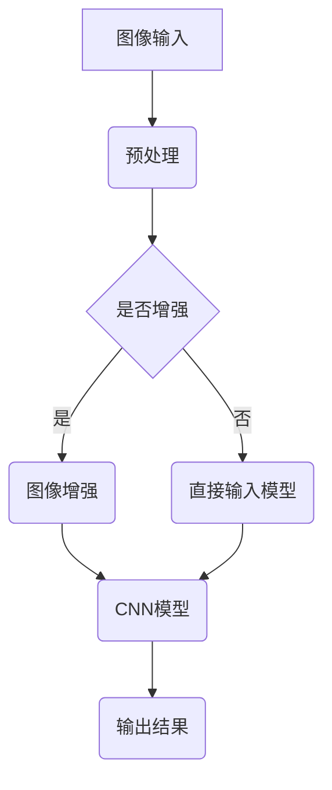

                 

### 文章标题：基于tensorflow图像识别系统的设计与开发

### 关键词：图像识别，TensorFlow，深度学习，卷积神经网络，系统设计与开发

### 摘要：
本文将深入探讨基于TensorFlow的图像识别系统的设计与开发过程。首先，我们将简要介绍图像识别的基础理论和相关技术。接着，我们将详细介绍TensorFlow的基础知识，包括安装、配置和基本操作。随后，文章将重点讨论图像识别系统的需求分析、系统开发、系统部署与优化，并通过实际项目案例展示开发过程，最后对图像识别技术的发展趋势和未来应用前景进行展望。

### 目录大纲

#### 第一部分：图像识别基础理论

**第1章：图像识别概述**
- 1.1 图像识别的基本概念
- 1.2 图像识别的历史与发展
- 1.3 图像识别的应用领域

**第2章：图像处理基础**
- 2.1 图像基础理论
- 2.2 图像增强与预处理
- 2.3 图像分割技术

**第3章：深度学习与卷积神经网络**
- 3.1 深度学习基础
- 3.2 卷积神经网络（CNN）原理
- 3.3 卷积神经网络架构详解

**第4章：TensorFlow基础**
- 4.1 TensorFlow概述
- 4.2 TensorFlow安装与配置
- 4.3 TensorFlow基本操作

#### 第二部分：图像识别系统设计与实现

**第5章：图像识别系统需求分析**
- 5.1 系统需求分析
- 5.2 数据预处理策略
- 5.3 模型选择与评估

**第6章：图像识别系统开发**
- 6.1 数据加载与预处理
- 6.2 模型训练与优化
- 6.3 模型评估与验证
- 6.4 实时图像识别与处理

**第7章：系统部署与优化**
- 7.1 部署策略选择
- 7.2 模型推理与优化
- 7.3 性能调优与监控

**第8章：案例分析与实战**
- 8.1 实际项目案例
- 8.2 案例实现过程
- 8.3 代码解读与分析

**第9章：未来展望与趋势**
- 9.1 图像识别技术发展趋势
- 9.2 深度学习与图像识别的融合
- 9.3 图像识别技术在工业与生活中的应用前景

#### 附录

**附录A：TensorFlow图像识别相关工具与资源**
- A.1 TensorFlow官方文档
- A.2 常用图像识别数据集
- A.3 图像识别算法性能评测指标

### Mermaid 流程图



### 卷积神经网络（CNN）原理伪代码

```python
# CNN模型训练伪代码

# 初始化参数
W, b = init_parameters()

# 循环迭代
for epoch in range(num_epochs):
    for batch in dataset:
        # 前向传播
        z = np.dot(W, x) + b
        a = sigmoid(z)
        
        # 计算损失
        loss = compute_loss(a, y)
        
        # 反向传播
        dz = dcost_da * da
        dx = dz * dW
        db = dz * db
        
        # 更新参数
        W = W - learning_rate * dx
        b = b - learning_rate * db

# 模型评估
accuracy = evaluate_model(model, test_data)
```

### 数学模型与公式

$$
y = \sigma(Wx + b)
$$

其中，$\sigma$ 表示激活函数，$W$ 表示权重，$x$ 表示输入特征，$b$ 表示偏置。

### 数学公式与详细讲解

#### 激活函数

$$
\sigma(x) = \frac{1}{1 + e^{-x}}
$$

激活函数是神经网络中的关键组成部分，它用于引入非线性特性。Sigmoid 函数是一个常用的激活函数，其导数为：

$$
\sigma'(x) = \sigma(x) \cdot (1 - \sigma(x))
$$

#### 损失函数

$$
\text{loss} = -\frac{1}{m} \sum_{i=1}^{m} y_i \log(a_i) + (1 - y_i) \log(1 - a_i)
$$

损失函数用于衡量模型预测值与真实值之间的差异。在二分类问题中，常用的损失函数是交叉熵损失（Cross-Entropy Loss）。

### 引言

图像识别作为计算机视觉领域的一个重要分支，近年来取得了飞速的发展。随着深度学习技术的崛起，卷积神经网络（Convolutional Neural Networks，CNN）在图像识别任务中表现出了卓越的性能。TensorFlow，作为当前最受欢迎的深度学习框架之一，提供了丰富的工具和资源，使得图像识别系统的设计与开发变得更加便捷和高效。

本文旨在通过系统的设计和开发过程，帮助读者深入理解基于TensorFlow的图像识别系统。文章首先介绍了图像识别的基础理论，包括基本概念、历史与发展、应用领域等。接着，我们探讨了图像处理的基础知识，如图像基础理论、图像增强与预处理、图像分割技术。随后，文章详细介绍了深度学习和卷积神经网络的基本原理与架构，为后续的系统开发奠定了基础。

在系统设计与实现部分，文章首先分析了图像识别系统的需求，包括系统需求分析、数据预处理策略、模型选择与评估。然后，我们详细介绍了图像识别系统的开发过程，包括数据加载与预处理、模型训练与优化、模型评估与验证、实时图像识别与处理。最后，文章讨论了系统部署与优化策略，包括部署策略选择、模型推理与优化、性能调优与监控。

为了更好地展示开发过程，文章通过实际项目案例进行了详细的代码解读与分析。最后，文章对图像识别技术的发展趋势和未来应用前景进行了展望，为读者提供了宝贵的参考。

通过本文的阅读，读者将能够全面了解基于TensorFlow的图像识别系统的设计与开发过程，掌握相关技术原理和实战技巧，为在实际项目中应用图像识别技术奠定坚实的基础。

### 第1章：图像识别概述

#### 1.1 图像识别的基本概念

图像识别（Image Recognition）是计算机视觉（Computer Vision）的一个重要分支，旨在通过计算机算法自动分析和解释图像内容。图像识别技术的基本任务是从图像中提取有用的信息，对图像进行分类、检测、识别等处理。

图像识别的基本概念包括：

- **图像分类**：将图像划分为预定义的类别。例如，将图片分类为“猫”或“狗”。
- **目标检测**：在图像中定位并识别特定的目标或对象。例如，在交通监控系统中检测车辆和行人。
- **图像分割**：将图像划分为多个区域或对象。例如，在医学图像分析中分割肿瘤区域。
- **特征提取**：从图像中提取有助于分类或识别的特征。这些特征可以是颜色、纹理、形状等。

#### 1.2 图像识别的历史与发展

图像识别技术的发展历程可以追溯到20世纪60年代。以下是几个重要的里程碑：

- **1960年代**：人工神经网络（Artificial Neural Networks，ANN）的诞生，特别是反向传播算法（Backpropagation Algorithm）的提出，为深度学习技术奠定了基础。
- **1990年代**：基于特征的传统机器学习算法，如支持向量机（Support Vector Machines，SVM）和神经网络，在图像识别任务中取得了一定的成功。
- **2000年代**：卷积神经网络（Convolutional Neural Networks，CNN）的出现，使图像识别技术得到了显著的提升。特别是在2012年，由Alex Krizhevsky等人提出的AlexNet在ImageNet大赛中取得了突破性的成绩，标志着深度学习在图像识别领域的崛起。
- **2010年代至今**：随着计算能力的提升和大规模数据集的可用性，深度学习技术在图像识别领域取得了飞速的发展。Goo

