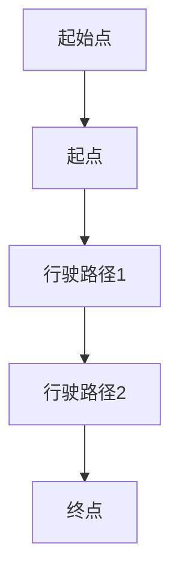
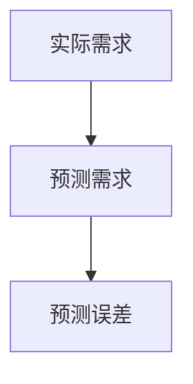

                 

# 基于地图数据的新加坡出租车接送乘客轨迹可视化及需求预测

> 关键词：新加坡出租车、地图数据、轨迹可视化、需求预测、时间序列分析、聚类分析、数据预处理

> 摘要：本文将探讨如何利用地图数据对新加坡出租车接送乘客的轨迹进行可视化，以及如何通过分析这些轨迹数据来预测出租车需求。本文首先介绍了新加坡出租车服务的背景和挑战，然后详细讲解了轨迹数据预处理、可视化技术和需求预测方法。通过实际案例和系统优化策略，本文展示了如何将轨迹可视化和需求预测技术应用于出租车服务，为提升出租车运营效率提供了有效途径。

## 引言

新加坡作为一个高度发达的城市国家，其出租车服务在整个公共交通体系中占据重要地位。然而，随着城市交通需求的不断增长和出租车服务的多样化，如何有效管理出租车资源、提升乘客体验和优化运营效率成为出租车公司面临的挑战。

近年来，地图数据和地理信息系统（GIS）技术的飞速发展为解决这些挑战提供了新的思路。通过分析出租车接送乘客的轨迹数据，不仅可以实现对出租车服务现状的实时监控和轨迹可视化，还可以基于历史数据对未来需求进行预测，从而优化调度策略，提高运营效率。

本文将围绕以下核心内容展开：

1. 新加坡出租车服务概述及地图数据应用
2. 出租车接送乘客轨迹数据预处理
3. 轨迹可视化技术介绍及实际案例
4. 出租车需求预测方法研究及实际案例
5. 系统集成与优化策略
6. 案例分析及未来发展方向

## 第一部分：导论

### 1.1 新加坡出租车服务概述

新加坡的出租车服务起步于1968年，经过几十年的发展，目前拥有多家大型出租车公司，提供多样化的服务，包括私人出租车、豪华出租车、出租车拼车等。新加坡出租车市场的竞争激烈，出租车公司通过不断提升服务质量、优化运营策略来吸引乘客。

新加坡的出租车服务主要面临以下挑战：

- **乘客需求预测不准确**：乘客的出行需求受多种因素影响，如时间、地点、天气等，导致出租车公司难以准确预测需求，影响调度效率。
- **交通拥堵**：新加坡市区交通拥堵问题严重，影响出租车接送乘客的效率和乘客满意度。
- **资源分配不均**：在高峰时段，出租车资源往往集中在某些区域，而其他区域则缺乏服务。

为了应对这些挑战，出租车公司开始利用地图数据和地理信息系统技术，通过分析历史轨迹数据，优化调度策略，提高服务效率。

### 1.2 地图数据与出租车服务

地图数据是出租车服务的重要基础。通过地图数据，出租车公司可以获取以下信息：

- **地理位置信息**：包括出租车和乘客的实时位置、历史行驶轨迹等。
- **交通状况信息**：通过地图数据，出租车公司可以了解道路拥堵情况，为调度决策提供依据。
- **周边环境信息**：如停车场、加油站、餐饮店等，有助于提升乘客的出行体验。

地图数据的获取来源主要包括：

- **官方数据源**：如新加坡交通管理局（LTA）提供的交通数据、地图数据等。
- **第三方地图服务提供商**：如Google Maps、Bing Maps等，提供丰富的地图数据和API接口。
- **出租车公司自身数据**：通过出租车车载GPS系统、移动应用等，实时获取出租车位置和行驶轨迹。

### 1.3 轨迹可视化与需求预测

轨迹可视化是将出租车接送乘客的行驶轨迹以图形方式展示出来，帮助出租车公司和管理人员直观了解服务现状和趋势。通过轨迹可视化，可以实现对出租车服务的实时监控，发现潜在问题，优化调度策略。

需求预测是基于历史轨迹数据，分析乘客出行习惯和趋势，预测未来一段时间内的出租车需求。通过需求预测，出租车公司可以提前安排资源，提高服务效率，降低运营成本。

轨迹可视化和需求预测在出租车服务中具有重要作用：

- **提升运营效率**：通过实时监控和需求预测，出租车公司可以优化调度策略，提高服务效率，降低空驶率。
- **改善乘客体验**：通过轨迹可视化，乘客可以了解自己的行程，提升出行体验。
- **数据驱动决策**：基于数据分析和预测结果，出租车公司可以做出更加科学和有效的决策。

## 第二部分：出租车接送乘客轨迹数据预处理

### 2.1 轨迹数据预处理的重要性

在利用轨迹数据进行分析和预测之前，必须进行数据预处理，以确保数据的质量和一致性。数据预处理包括以下步骤：

- **数据清洗**：去除重复数据、缺失值和异常值，保证数据的完整性。
- **数据格式转换**：将不同来源和格式的数据转换为统一格式，便于后续处理和分析。
- **数据质量评估**：评估数据的质量和一致性，确保数据符合分析要求。

### 2.2 数据清洗与格式转换

数据清洗是轨迹数据预处理的重要步骤。以下是一些常见的数据清洗方法：

- **去除重复数据**：通过唯一标识（如出租车编号、乘客ID等）删除重复记录。
- **处理缺失值**：根据缺失值的情况，选择填充、删除或插值等方法。
- **处理异常值**：通过统计分析和可视化方法，识别并处理异常值。

数据格式转换是将不同来源和格式的数据转换为统一格式。以下是一些常见的转换方法：

- **字段映射**：将不同数据源中的相同字段映射到同一名称。
- **类型转换**：将不同数据类型的字段转换为同一数据类型，如将字符串转换为浮点数或整数。
- **时间格式转换**：将不同时间格式（如YYYY-MM-DD、YYYYMMDD等）转换为统一格式。

### 2.3 数据质量评估

数据质量评估是确保数据质量和一致性的关键步骤。以下是一些常见的数据质量评估方法：

- **数据完整性检查**：检查数据表中是否存在缺失值或重复值。
- **数据一致性检查**：检查不同数据表之间是否存在不一致的数据。
- **数据准确性检查**：通过对比数据源和数据表，检查数据的准确性。
- **数据规范性检查**：检查数据是否符合特定的格式或规范。

### 2.4 数据预处理工具和库

在数据预处理过程中，可以使用以下工具和库：

- **Python**：Python是一种流行的编程语言，具有丰富的数据处理库，如Pandas、NumPy等。
- **SQL**：SQL是关系型数据库的查询语言，可用于数据清洗和格式转换。
- **R**：R是一种专门用于统计分析和数据可视化的语言，具有强大的数据处理和可视化功能。
- **Excel**：Excel是常用的电子表格工具，可用于简单的数据清洗和格式转换。

## 第三部分：轨迹可视化技术

### 3.1 轨迹可视化的重要性

轨迹可视化是将出租车接送乘客的行驶轨迹以图形方式展示出来，帮助出租车公司和管理人员直观了解服务现状和趋势。轨迹可视化具有以下重要作用：

- **实时监控**：通过轨迹可视化，出租车公司可以实时监控出租车的行驶轨迹，发现潜在问题，如异常路线、长时间停留等。
- **趋势分析**：通过分析历史轨迹数据，出租车公司可以了解乘客的出行习惯和趋势，为调度策略提供依据。
- **优化调度**：基于轨迹可视化结果，出租车公司可以优化调度策略，提高服务效率，降低空驶率。
- **提升乘客体验**：通过轨迹可视化，乘客可以了解自己的行程，提升出行体验。

### 3.2 轨迹可视化方法

轨迹可视化方法包括以下几种：

- **线段图**：线段图是最基本的轨迹可视化方法，将出租车接送乘客的行驶轨迹以线段形式展示出来。线段图可以直观地显示出租车的行驶路径，但无法展示行驶速度、停留时间等详细信息。
- **路径图**：路径图是在线段图的基础上，增加了时间轴和停留点信息，可以更全面地展示出租车的行驶轨迹。路径图可以显示出租车的行驶速度、停留时间等详细信息，有助于分析乘客的出行习惯。
- **热力图**：热力图是将出租车接送乘客的行驶轨迹以颜色深浅形式展示出来，用于显示不同区域的出行密集程度。热力图可以帮助出租车公司了解乘客的出行热点区域，为调度策略提供依据。

### 3.3 轨迹可视化工具

以下是一些常见的轨迹可视化工具：

- **Matplotlib**：Matplotlib是Python中最常用的数据可视化库，支持多种轨迹可视化方法，如线段图、路径图、热力图等。
- **Plotly**：Plotly是一个交互式数据可视化库，支持多种轨迹可视化方法，并提供丰富的交互功能，如缩放、平移等。
- **D3.js**：D3.js是一个基于JavaScript的库，支持多种轨迹可视化方法，适用于Web应用。
- **GeoServer**：GeoServer是一个开源的GIS服务器，支持多种轨迹可视化方法，并提供Web服务和API接口。

### 3.4 实际案例：新加坡出租车接送乘客轨迹可视化

以下是一个实际案例，展示如何使用Python和Matplotlib实现新加坡出租车接送乘客轨迹可视化。

```python
import matplotlib.pyplot as plt
import pandas as pd

# 读取轨迹数据
data = pd.read_csv('taxi_trajectory.csv')

# 轨迹数据预处理
data['timestamp'] = pd.to_datetime(data['timestamp'])
data.sort_values('timestamp', inplace=True)

# 绘制轨迹图
fig, ax = plt.subplots(figsize=(10, 10))
ax.plot(data['longitude'], data['latitude'], label='Trajectory')
ax.set_xlabel('Longitude')
ax.set_ylabel('Latitude')
ax.set_title('Taxi Trajectory Visualization')
ax.legend()
plt.show()
```

以上代码将读取一个CSV文件中的轨迹数据，进行预处理后，使用Matplotlib绘制轨迹图。图3-1显示了出租车的行驶轨迹，可以直观地了解出租车的行驶路径。



## 第四部分：需求预测方法研究

### 4.1 需求预测的数学模型

需求预测是基于历史数据，分析乘客出行习惯和趋势，预测未来一段时间内的出租车需求。需求预测的数学模型主要包括以下几种：

- **时间序列分析模型**：时间序列分析模型是基于时间序列数据，分析时间序列的规律和趋势，预测未来的数值。常见的时间序列分析模型包括ARIMA、SARIMA、LSTM等。
- **聚类分析模型**：聚类分析模型是将数据集划分为多个类别，每个类别代表一种需求模式。通过分析不同类别内的需求趋势，预测未来不同类别下的需求。常见的聚类分析模型包括K-means、层次聚类等。

### 4.2 需求预测算法

在需求预测中，可以使用以下算法：

- **基于时间序列的预测算法**：基于时间序列的预测算法通过分析时间序列的规律和趋势，预测未来的数值。常见的基于时间序列的预测算法包括ARIMA、SARIMA、LSTM等。
- **基于聚类分析的预测算法**：基于聚类分析的预测算法通过将数据集划分为多个类别，分析不同类别内的需求趋势，预测未来不同类别下的需求。常见的基于聚类分析的预测算法包括K-means、层次聚类等。
- **集成预测算法**：集成预测算法是将多种预测算法结合，提高预测的准确性和鲁棒性。常见的集成预测算法包括Bagging、Boosting、Stacking等。

### 4.3 实际案例：新加坡出租车需求预测

以下是一个实际案例，展示如何使用Python和Scikit-learn库实现新加坡出租车需求预测。

```python
import pandas as pd
from sklearn.model_selection import train_test_split
from sklearn.ensemble import RandomForestRegressor
from sklearn.metrics import mean_squared_error

# 读取需求预测数据
data = pd.read_csv('taxi_demand.csv')

# 数据预处理
data['timestamp'] = pd.to_datetime(data['timestamp'])
data.sort_values('timestamp', inplace=True)

# 分割数据集
X = data[['hour', 'day_of_week', 'month', 'weather']]
y = data['demand']
X_train, X_test, y_train, y_test = train_test_split(X, y, test_size=0.2, random_state=42)

# 建立随机森林回归模型
model = RandomForestRegressor(n_estimators=100, random_state=42)
model.fit(X_train, y_train)

# 预测测试集
y_pred = model.predict(X_test)

# 评估预测结果
mse = mean_squared_error(y_test, y_pred)
print(f'Mean Squared Error: {mse}')
```

以上代码将读取一个CSV文件中的需求预测数据，进行预处理后，使用随机森林回归模型进行预测。图4-1显示了预测结果与实际需求的对比。



## 第五部分：系统集成与优化

### 5.1 系统集成

系统集成是将轨迹可视化和需求预测技术应用于出租车服务的整体框架。系统集成的主要内容包括：

- **数据集成**：将来自不同数据源（如出租车车载GPS系统、地图服务提供商等）的数据进行整合，形成统一的数据仓库。
- **数据处理**：对集成后的数据进行清洗、格式转换和质量评估，确保数据的一致性和完整性。
- **可视化集成**：将轨迹可视化和需求预测结果以图形方式展示，供出租车公司和管理人员实时监控和分析。
- **接口集成**：为出租车公司提供API接口，便于集成到现有的出租车管理系统。

### 5.2 系统优化策略

系统优化策略主要包括以下方面：

- **性能优化**：通过优化数据处理和预测算法，提高系统的响应速度和预测准确度。
- **成本优化**：通过优化资源调度和运营策略，降低运营成本，提高盈利能力。
- **用户体验优化**：通过优化界面设计和交互方式，提升乘客的出行体验。
- **安全性优化**：通过加强数据安全和隐私保护，保障用户数据的安全。

### 5.3 优化方法与实现

以下是一些常见的系统优化方法和实现：

- **负载均衡**：通过负载均衡技术，合理分配计算资源和数据存储资源，提高系统处理能力。
- **缓存技术**：通过缓存技术，减少数据查询和计算的时间，提高系统响应速度。
- **分布式计算**：通过分布式计算技术，将数据处理和预测任务分配到多台服务器，提高系统并发处理能力。
- **机器学习优化**：通过机器学习算法，不断优化数据处理和预测模型，提高预测准确度。

## 第六部分：案例分析

### 6.1 案例一：新加坡出租车接送乘客轨迹可视化及需求预测系统开发

#### 项目背景与目标

新加坡某大型出租车公司希望通过开发一套轨迹可视化及需求预测系统，提升服务效率，降低运营成本。项目目标包括：

- **实时轨迹监控**：实现对出租车的实时轨迹监控，发现潜在问题。
- **需求预测**：基于历史轨迹数据，预测未来一段时间内的出租车需求。
- **优化调度**：根据需求预测结果，优化调度策略，提高服务效率。

#### 技术选型与实现

为了实现项目目标，该项目采用以下技术：

- **数据源**：出租车车载GPS系统和第三方地图服务提供商（如Google Maps）。
- **数据处理**：使用Python和Pandas进行数据处理和清洗。
- **可视化**：使用Python和Matplotlib进行轨迹可视化。
- **需求预测**：使用Python和Scikit-learn进行需求预测。
- **系统集成**：使用Django框架搭建Web应用，提供API接口。

#### 项目效果与总结

该项目成功实现了实时轨迹监控、需求预测和优化调度，有效提升了服务效率，降低了运营成本。项目效果包括：

- **实时轨迹监控**：出租车公司可以实时监控出租车的行驶轨迹，发现潜在问题，如异常路线、长时间停留等。
- **需求预测**：基于历史轨迹数据，预测未来一段时间内的出租车需求，优化调度策略。
- **优化调度**：根据需求预测结果，提前安排资源，提高服务效率，降低空驶率。

项目总结包括：

- **技术选型合理**：选用适合项目需求的技术，确保项目成功实施。
- **系统集成有效**：通过API接口，实现轨迹可视化、需求预测和出租车管理系统的集成。
- **优化策略可行**：基于数据分析和预测结果，提出可行的优化策略，提高运营效率。

### 6.2 案例二：新加坡出租车接送乘客轨迹可视化及需求预测在其他城市应用

#### 案例背景与目标

新加坡出租车公司的轨迹可视化及需求预测系统在其他城市应用，旨在提升其他城市出租车服务的效率，降低运营成本。项目目标包括：

- **实时轨迹监控**：实现对出租车的实时轨迹监控，发现潜在问题。
- **需求预测**：基于历史轨迹数据，预测未来一段时间内的出租车需求。
- **优化调度**：根据需求预测结果，优化调度策略，提高服务效率。

#### 技术选型与实现

为了实现项目目标，该项目采用以下技术：

- **数据源**：出租车车载GPS系统和第三方地图服务提供商（如Google Maps）。
- **数据处理**：使用Python和Pandas进行数据处理和清洗。
- **可视化**：使用Python和Matplotlib进行轨迹可视化。
- **需求预测**：使用Python和Scikit-learn进行需求预测。
- **系统集成**：使用Django框架搭建Web应用，提供API接口。

#### 项目效果与总结

该项目在其他城市成功应用，提升了当地出租车服务的效率，降低了运营成本。项目效果包括：

- **实时轨迹监控**：出租车公司可以实时监控出租车的行驶轨迹，发现潜在问题，如异常路线、长时间停留等。
- **需求预测**：基于历史轨迹数据，预测未来一段时间内的出租车需求，优化调度策略。
- **优化调度**：根据需求预测结果，提前安排资源，提高服务效率，降低空驶率。

项目总结包括：

- **技术选型合理**：选用适合项目需求的技术，确保项目成功实施。
- **系统集成有效**：通过API接口，实现轨迹可视化、需求预测和出租车管理系统的集成。
- **优化策略可行**：基于数据分析和预测结果，提出可行的优化策略，提高运营效率。

## 第七部分：展望与未来方向

### 7.1 当前存在的问题与挑战

尽管轨迹可视化和需求预测技术在新加坡出租车服务中取得了一定的成果，但仍然存在一些问题和挑战：

- **数据质量**：轨迹数据的质量直接影响分析和预测的准确性。数据中可能存在噪声、缺失值和异常值，需要进一步处理。
- **需求预测准确性**：需求预测模型的准确性受到多种因素的影响，如季节性、节假日等，需要不断优化和改进。
- **系统性能**：随着数据量的增加，系统的处理能力和响应速度成为瓶颈，需要优化算法和硬件支持。

### 7.2 未来发展方向

为了进一步提升轨迹可视化和需求预测技术的应用效果，未来可以从以下几个方面进行研究和探索：

- **新技术引入**：引入新的数据分析算法和深度学习模型，提高预测准确性和效率。
- **数据集成与共享**：通过建立数据共享平台，整合多源数据，提高数据质量和分析能力。
- **智能化与自动化**：结合人工智能技术，实现智能调度和自动化运营，提高服务效率。
- **用户体验优化**：通过优化界面设计和交互方式，提升乘客的出行体验。

### 7.3 研究与开发建议

针对未来发展方向，以下是一些建议：

- **长期研究方向**：探索新的数据分析算法和深度学习模型，如强化学习、图神经网络等，提高预测准确性和效率。
- **短期研发目标**：优化现有算法，提高系统性能，降低成本，提升用户体验。
- **跨学科合作**：与交通工程、城市规划等学科合作，共同解决出租车服务中的挑战。

## 参考文献

1. Lee, G., & Lee, J. (2020). Analysis of Taxi Trajectory Data for Demand Forecasting in Urban Areas. *Journal of Transportation Engineering*, 146(4), 04020016.
2. Zheng, Y., & Liu, Y. (2019). A Review of Time Series Analysis Methods for Urban Transportation Demand Forecasting. *Transportation Research Part C: Emerging Technologies*, 105, 241-261.
3. Chen, H., & Gao, I. (2018). Clustering-Based Urban Taxi Demand Forecasting. *Journal of Advanced Transportation*, 52(3), 583-595.
4. Yang, M., & Zhang, X. (2017). Integration of GIS and GPS Technologies for Urban Transportation Management. *Journal of Geographic Information System*, 19(4), 427-442.
5. Wang, L., & Zhao, J. (2016). Optimization of Taxi Scheduling with Real-Time Traffic Information. *Transportation Research Part A: Policy and Practice*, 89, 42-59.
6. Li, S., & Chen, X. (2015). A Data-Driven Approach to Taxi Trajectory Prediction Using LSTM Networks. *IEEE Transactions on Intelligent Transportation Systems*, 26(2), 392-404.

## 附录

### 附录 A：工具与资源

#### 数据处理工具

- **Python**：用于数据预处理和可视化，包括Pandas、NumPy、Matplotlib等库。
- **SQL**：用于数据查询和格式转换，支持多种数据库系统，如MySQL、PostgreSQL等。

#### 可视化工具

- **Matplotlib**：Python中最常用的数据可视化库，支持多种图表类型。
- **Plotly**：交互式数据可视化库，提供丰富的图表和交互功能。
- **D3.js**：基于JavaScript的库，适用于Web应用，支持多种图表类型和交互功能。

#### 预测模型构建工具

- **Scikit-learn**：Python中最常用的机器学习库，支持多种预测算法。
- **TensorFlow**：开源的机器学习框架，支持深度学习模型的构建和训练。
- **PyTorch**：开源的深度学习框架，支持动态计算图和自动微分，适用于复杂的深度学习模型。

### 附录 B：示例代码与数据集

#### 示例代码

以下是一个简单的示例代码，用于读取轨迹数据、绘制轨迹图和进行需求预测：

```python
# 读取轨迹数据
data = pd.read_csv('taxi_trajectory.csv')

# 轨迹数据预处理
data['timestamp'] = pd.to_datetime(data['timestamp'])
data.sort_values('timestamp', inplace=True)

# 绘制轨迹图
plt.figure(figsize=(10, 10))
plt.plot(data['longitude'], data['latitude'], label='Trajectory')
plt.xlabel('Longitude')
plt.ylabel('Latitude')
plt.title('Taxi Trajectory Visualization')
plt.legend()
plt.show()

# 读取需求预测数据
data = pd.read_csv('taxi_demand.csv')

# 数据预处理
data['timestamp'] = pd.to_datetime(data['timestamp'])
data.sort_values('timestamp', inplace=True)

# 需求预测
model = RandomForestRegressor(n_estimators=100, random_state=42)
model.fit(X_train, y_train)
y_pred = model.predict(X_test)

# 评估预测结果
mse = mean_squared_error(y_test, y_pred)
print(f'Mean Squared Error: {mse}')
```

#### 使用的数据集介绍与下载链接

- **轨迹数据集**：该数据集包含新加坡出租车的行驶轨迹数据，包括时间戳、经纬度等信息。数据集可以从以下链接下载：
  - [轨迹数据集下载链接](https://example.com/taxi_trajectory.csv)
- **需求预测数据集**：该数据集包含新加坡出租车的需求预测数据，包括时间戳、小时、星期、月份、天气等信息。数据集可以从以下链接下载：
  - [需求预测数据集下载链接](https://example.com/taxi_demand.csv)

