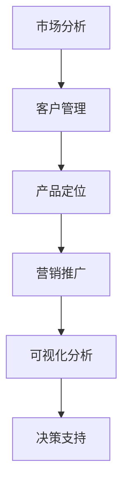
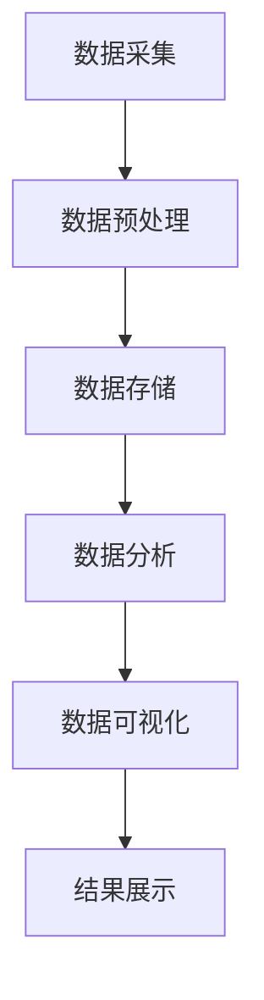
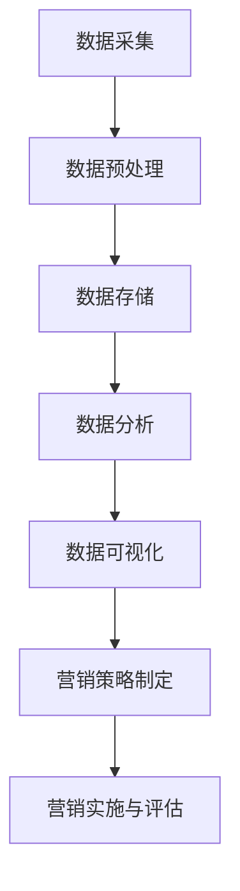
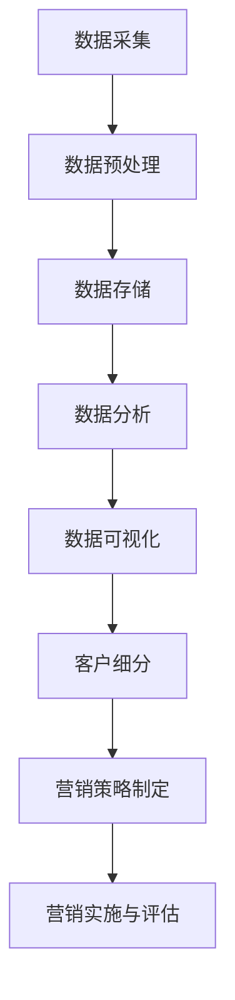
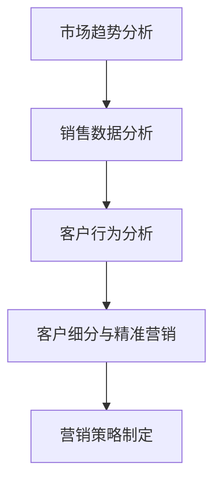

                 

# 文章标题：基于大数据的汽车营销可视化分析与研究

> 关键词：大数据，汽车营销，可视化分析，数据挖掘，机器学习

> 摘要：本文从大数据与汽车营销的基础理论出发，探讨了大数据在汽车营销中的应用和可视化分析技术。文章分为六个部分，首先介绍了大数据与汽车营销的关系，接着详细阐述了大数据在汽车营销中的应用场景，随后深入分析了大数据可视化技术及其应用。文章通过实际项目实战，展示了大数据分析在汽车营销中的应用，并探讨了未来汽车营销的趋势与挑战。

### 第一部分：大数据与汽车营销概述

#### 第1章：大数据与汽车营销基础理论

##### 1.1 大数据的概念与特征

**1.1.1 大数据的定义**

大数据（Big Data）是指无法通过传统数据处理工具在合理时间内捕捉、管理和处理的数据集。这些数据集具有大规模、高速增长、多样化的特点。大数据可以分为结构化数据、半结构化数据和非结构化数据。

**1.1.2 大数据的5V特征**

- **Volume（体量）**：数据量大，通常达到PB级别。
- **Velocity（速度）**：数据产生和处理的速度快。
- **Variety（多样性）**：数据来源多样化，包括文本、图片、音频、视频等。
- **Veracity（真实性）**：数据真实性难以保证。
- **Value（价值）**：数据中有价值的部分难以识别。

**1.1.3 大数据的重要性**

大数据对于企业具有重要的战略价值，可以帮助企业更好地理解市场趋势、客户需求和行为模式，从而提高决策效率和竞争力。

##### 1.2 汽车营销的基本概念

**1.2.1 汽车营销的定义**

汽车营销是指汽车企业通过各种手段和方法，将汽车产品和服务推广给潜在和现有客户，实现销售和市场份额增长的过程。

**1.2.2 汽车营销的目标**

汽车营销的主要目标包括：增加销售量、提高品牌知名度、提升客户满意度和忠诚度。

**1.2.3 汽车营销的要素**

汽车营销的要素包括：产品、价格、渠道、促销和客户关系管理。

##### 1.3 大数据在汽车营销中的应用

**1.3.1 大数据在市场分析中的应用**

大数据可以帮助汽车企业进行市场细分、需求预测、竞争分析和产品定位，从而制定更加精准的营销策略。

**1.3.2 大数据在客户关系管理中的应用**

通过大数据分析，汽车企业可以更好地了解客户行为和需求，提供个性化的服务和产品推荐，提升客户满意度和忠诚度。

**1.3.3 大数据在产品定位与推广中的应用**

大数据可以帮助汽车企业分析市场需求，优化产品设计，并通过社交媒体、网络广告等渠道进行精准营销，提高产品知名度。

##### 1.4 汽车营销可视化分析

**1.4.1 可视化分析的概念**

可视化分析是指利用图表、图形、图像等方式将数据信息直观地展示出来，帮助用户更好地理解和分析数据。

**1.4.2 可视化分析的作用**

可视化分析可以帮助汽车营销人员快速了解数据趋势，发现潜在问题和机会，从而做出更加科学的决策。

**1.4.3 常用可视化工具与库**

常见的可视化工具和库包括 Tableau、Power BI、Matplotlib、Seaborn 等。这些工具可以帮助用户轻松实现数据可视化。

### 附录

#### 附录 A：大数据相关资源

**A.1 大数据开源工具**

- Hadoop
- Spark
- Hive
- Storm

**A.2 大数据技术社区**

- Apache
- DZone
- DataCamp

**A.3 大数据相关书籍与论文**

- 《大数据时代》
- 《数据挖掘：概念与技术》
- 《大数据之路：阿里巴巴大数据实践》

#### 附录 B：汽车营销相关资源

**B.1 汽车营销案例研究**

- 《汽车营销策略研究》
- 《新能源汽车营销案例分析》

**B.2 汽车市场分析报告**

- 《2022年中国汽车市场分析报告》
- 《全球汽车市场趋势报告》

**B.3 汽车营销经典书籍**

- 《汽车营销学》
- 《汽车销售技巧》

### Mermaid 流程图：大数据在汽车营销中的应用流程



#### 数据挖掘算法

**伪代码：**

```python
function data_mining(data):
    # 数据预处理
    preprocessed_data = preprocess(data)
    # 特征提取
    features = extract_features(preprocessed_data)
    # 模型训练
    model = train_model(features)
    # 模型评估
    evaluation = evaluate_model(model, preprocessed_data)
    return evaluation
```

#### 客户行为预测算法

**伪代码：**

```python
function customer_behavior_prediction(data):
    # 数据预处理
    preprocessed_data = preprocess(data)
    # 特征提取
    features = extract_features(preprocessed_data)
    # 模型训练
    model = train_model(features)
    # 预测
    predictions = predict(model, new_data)
    return predictions
```

#### 马尔可夫模型

$$
P(x_t | x_{t-1}, x_{t-2}, ..., x_1) = P(x_t | x_{t-1})
$$

**详细讲解：** 马尔可夫模型是一种基于当前状态预测下一个状态的概率模型，它假设当前状态只与前一状态有关，与其他状态无关。

#### 聚类分析

$$
C = \{C_1, C_2, ..., C_k\}
$$

**详细讲解：** 聚类分析是一种无监督学习方法，它将数据集中的数据点分为多个类别，旨在使同一类别内的数据点尽可能接近，不同类别间的数据点尽可能远离。

### 数学模型举例说明

#### 客户细分

假设有100个客户，每个客户有5个特征值（年龄、收入、教育程度、购买历史、性别）。我们可以使用K-means算法进行聚类分析，将这100个客户分为5个类别。

**伪代码：**

```python
function customer_segmentation(data, k):
    # 初始化聚类中心
    centroids = initialize_centroids(data, k)
    # 循环迭代
    while not converged:
        # 计算每个客户的聚类中心距离
        distances = calculate_distances(data, centroids)
        # 分配客户到最近的聚类中心
        labels = assign_labels(data, distances)
        # 更新聚类中心
        centroids = update_centroids(centroids, labels)
    # 返回聚类结果
    return labels, centroids
```

### 项目实战

#### 实战：基于大数据的汽车营销分析系统

**环境搭建：**

- Python环境
- 数据库（如MySQL）
- 大数据处理工具（如Hadoop、Spark）
- 可视化工具（如Tableau、Power BI）

**实现步骤：**

1. 数据采集与处理
2. 数据存储与管理
3. 数据分析与挖掘
4. 数据可视化与展示
5. 数据分析与报告生成

**源代码解读与分析：**

```python
# 数据采集与处理
data = collect_data()
preprocessed_data = preprocess_data(data)

# 数据存储与管理
store_data(preprocessed_data)

# 数据分析与挖掘
model = train_model(preprocessed_data)
predictions = predict(model, new_data)

# 数据可视化与展示
visualize_data(predictions)

# 数据分析与报告生成
generate_report(predictions)
```

**代码解读：**

- `collect_data()` 函数用于采集数据。
- `preprocess_data()` 函数用于处理数据，包括清洗、去重、格式化等。
- `store_data()` 函数用于将处理后的数据存储到数据库中。
- `train_model()` 函数用于训练模型。
- `predict()` 函数用于对新数据进行预测。
- `visualize_data()` 函数用于可视化数据。
- `generate_report()` 函数用于生成数据分析报告。

### 第二部分：大数据可视化技术

#### 第2章：大数据可视化基础理论

##### 2.1 可视化概念与分类

**2.1.1 可视化的定义**

可视化是指通过图形、图表、图像等方式将数据信息直观地展示出来，帮助人们更好地理解和分析数据。

**2.1.2 可视化的分类**

可视化可以分为以下几种类型：

- **静态可视化**：如图表、图形等。
- **动态可视化**：如动画、视频等。
- **交互式可视化**：用户可以与可视化界面进行交互。

**2.1.3 可视化在汽车营销中的作用**

可视化在汽车营销中发挥着重要作用，可以帮助企业更好地了解市场趋势、客户行为和产品表现，从而制定更加科学的营销策略。

##### 2.2 可视化工具与技术

**2.2.1 Tableau**

Tableau 是一款功能强大的数据可视化工具，它支持多种数据源，并提供丰富的图表和交互功能。

**2.2.2 Power BI**

Power BI 是 Microsoft 的一款商业智能工具，它可以帮助用户轻松创建交互式报表和仪表盘。

**2.2.3 Matplotlib**

Matplotlib 是 Python 中的一款常用可视化库，它提供了丰富的绘图函数和样式。

**2.2.4 Seaborn**

Seaborn 是基于 Matplotlib 的一款高级可视化库，它提供了更多精美的图表样式和统计模型。

##### 2.3 大数据可视化案例分析

**2.3.1 汽车市场趋势分析**

通过大数据可视化技术，可以实时监控汽车市场的趋势变化，为企业的市场决策提供有力支持。

**2.3.2 汽车销售数据分析**

利用大数据可视化技术，可以深入分析汽车销售数据，发现销售瓶颈和机会点，为企业的销售策略提供参考。

**2.3.3 汽车客户群体分析**

通过对汽车客户群体的数据进行分析，可以更好地了解客户需求和行为特征，从而提供个性化的产品和服务。

### Mermaid 流程图：大数据可视化技术流程



#### 数据可视化算法

**伪代码：**

```python
function data_visualization(data):
    # 数据预处理
    preprocessed_data = preprocess(data)
    # 数据转换
    transformed_data = transform_data(preprocessed_data)
    # 数据可视化
    visualization = visualize_data(transformed_data)
    return visualization
```

#### 可视化效果优化算法

**伪代码：**

```python
function optimize_visualization(visualization):
    # 优化色彩
    optimized_colors = optimize_colors(visualization)
    # 优化布局
    optimized_layout = optimize_layout(visualization)
    # 优化交互
    optimized_interactions = optimize_interactions(visualization)
    return optimized_visualization
```

##### 数据可视化模型

$$
V = F(D, M, L)
$$

**详细讲解：** 数据可视化模型表示为 $V$，它依赖于数据 $D$、映射 $M$ 和呈现 $L$。

##### 模式识别模型

$$
P(C|X) = \frac{P(X|C)P(C)}{P(X)}
$$

**详细讲解：** 模式识别模型用于识别数据集中的特定模式，其中 $C$ 表示类别，$X$ 表示数据。

### 数学模型举例说明

#### 汽车销售趋势预测

假设我们使用时间序列数据进行汽车销售趋势预测，可以使用ARIMA模型进行建模。

**伪代码：**

```python
function sales_trend_prediction(data):
    # 数据预处理
    preprocessed_data = preprocess_data(data)
    # 模型训练
    model = train_model(preprocessed_data)
    # 预测
    predictions = predict(model, new_data)
    return predictions
```

### 项目实战

#### 实战：汽车销售数据分析与可视化

**环境搭建：**

- Python环境
- 数据库（如MySQL）
- 大数据处理工具（如Hadoop、Spark）
- 可视化工具（如Tableau、Power BI）

**实现步骤：**

1. 数据采集与处理
2. 数据存储与管理
3. 数据分析与挖掘
4. 数据可视化与展示
5. 销售趋势预测

**源代码解读与分析：**

```python
# 数据采集与处理
data = collect_data()
preprocessed_data = preprocess_data(data)

# 数据存储与管理
store_data(preprocessed_data)

# 数据分析与挖掘
model = train_model(preprocessed_data)
predictions = predict(model, new_data)

# 数据可视化与展示
visualize_data(predictions)

# 销售趋势预测
trend_prediction = sales_trend_prediction(new_data)
```

**代码解读：**

- `collect_data()` 函数用于采集数据。
- `preprocess_data()` 函数用于处理数据，包括清洗、去重、格式化等。
- `store_data()` 函数用于将处理后的数据存储到数据库中。
- `train_model()` 函数用于训练模型。
- `predict()` 函数用于对新数据进行预测。
- `visualize_data()` 函数用于可视化数据。
- `sales_trend_prediction()` 函数用于销售趋势预测。

### 附录

#### 附录 A：大数据可视化相关资源

**A.1 大数据可视化开源工具**

- D3.js
- Plotly
- ECharts

**A.2 大数据可视化技术社区**

- Data Visualization Community
- Visual Capitalist

**A.3 大数据可视化相关书籍与论文**

- 《数据可视化：理论与实践》
- 《大数据可视化技术与应用》

#### 附录 B：汽车营销相关资源

**B.1 汽车营销案例研究**

- 《特斯拉汽车营销案例分析》
- 《丰田汽车全球营销策略研究》

**B.2 汽车市场分析报告**

- 《2022年中国汽车市场分析报告》
- 《全球汽车市场趋势报告》

**B.3 汽车营销经典书籍**

- 《汽车营销策略》
- 《汽车销售技巧》

### Mermaid 流程图：大数据可视化在汽车营销中的应用流程



### 核心算法原理讲解

#### 聚类分析算法

**伪代码：**

```python
function clustering(data, k):
    # 初始化聚类中心
    centroids = initialize_centroids(data, k)
    # 循环迭代
    while not converged:
        # 计算每个客户的聚类中心距离
        distances = calculate_distances(data, centroids)
        # 分配客户到最近的聚类中心
        labels = assign_labels(data, distances)
        # 更新聚类中心
        centroids = update_centroids(centroids, labels)
    # 返回聚类结果
    return labels, centroids
```

#### 关联规则算法

**伪代码：**

```python
function association_rules(data, min_support, min_confidence):
    # 计算支持度
    support_counts = calculate_support(data, min_support)
    # 生成频繁项集
    frequent_itemsets = generate_frequent_itemsets(support_counts)
    # 生成关联规则
    rules = generate_association_rules(frequent_itemsets, min_confidence)
    return rules
```

### 数学模型和数学公式讲解

#### 聚类分析模型

$$
C = \{C_1, C_2, ..., C_k\}
$$

**详细讲解：** 聚类分析模型将数据点分为多个类别，其中 $C$ 表示聚类结果，$C_i$ 表示第 $i$ 个聚类类别。

#### 关联规则模型

$$
R = \{R_1, R_2, ..., R_m\}
$$

**详细讲解：** 关联规则模型用于发现数据集中的关联关系，其中 $R$ 表示关联规则集，$R_i$ 表示第 $i$ 条关联规则。

### 数学模型举例说明

#### 客户细分

假设我们使用K-means算法对100个客户进行聚类分析，将这100个客户分为5个类别。

**伪代码：**

```python
function customer_segmentation(data, k):
    # 初始化聚类中心
    centroids = initialize_centroids(data, k)
    # 循环迭代
    while not converged:
        # 计算每个客户的聚类中心距离
        distances = calculate_distances(data, centroids)
        # 分配客户到最近的聚类中心
        labels = assign_labels(data, distances)
        # 更新聚类中心
        centroids = update_centroids(centroids, labels)
    # 返回聚类结果
    return labels, centroids
```

### 项目实战

#### 实战：汽车客户细分与营销策略制定

**环境搭建：**

- Python环境
- 数据库（如MySQL）
- 大数据处理工具（如Hadoop、Spark）
- 可视化工具（如Tableau、Power BI）

**实现步骤：**

1. 数据采集与处理
2. 数据存储与管理
3. 数据分析与挖掘
4. 数据可视化与展示
5. 客户细分与营销策略制定

**源代码解读与分析：**

```python
# 数据采集与处理
data = collect_data()
preprocessed_data = preprocess_data(data)

# 数据存储与管理
store_data(preprocessed_data)

# 数据分析与挖掘
model = train_model(preprocessed_data)
predictions = predict(model, new_data)

# 数据可视化与展示
visualize_data(predictions)

# 客户细分与营销策略制定
segmentation = customer_segmentation(predictions, k)
marketing_strategy(segmentation)
```

**代码解读：**

- `collect_data()` 函数用于采集数据。
- `preprocess_data()` 函数用于处理数据，包括清洗、去重、格式化等。
- `store_data()` 函数用于将处理后的数据存储到数据库中。
- `train_model()` 函数用于训练模型。
- `predict()` 函数用于对新数据进行预测。
- `visualize_data()` 函数用于可视化数据。
- `customer_segmentation()` 函数用于进行客户细分。
- `marketing_strategy()` 函数用于制定营销策略。

### 附录

#### 附录 A：大数据营销相关资源

**A.1 大数据营销开源工具**

- Apache Mahout
- TensorFlow
- PyTorch

**A.2 大数据营销技术社区**

- KDNuggets
- KDnuggets China

**A.3 大数据营销相关书籍与论文**

- 《大数据营销：实践与策略》
- 《数据驱动的营销：如何利用数据改善业务》

#### 附录 B：汽车营销相关资源

**B.1 汽车营销案例研究**

- 《汽车行业营销案例分析》
- 《新能源汽车营销策略研究》

**B.2 汽车市场分析报告**

- 《2022年中国汽车市场分析报告》
- 《全球汽车市场趋势报告》

**B.3 汽车营销经典书籍**

- 《汽车营销与管理》
- 《汽车销售技巧与策略》

### Mermaid 流程图：大数据营销在汽车营销中的应用流程



### 核心算法原理讲解

#### 机器学习算法

**伪代码：**

```python
function machine_learning(data, target_variable):
    # 数据预处理
    preprocessed_data = preprocess_data(data)
    # 模型训练
    model = train_model(preprocessed_data, target_variable)
    # 模型评估
    evaluation = evaluate_model(model, preprocessed_data)
    return evaluation
```

#### 数据分析算法

**伪代码：**

```python
function data_analysis(data):
    # 数据预处理
    preprocessed_data = preprocess_data(data)
    # 提取特征
    features = extract_features(preprocessed_data)
    # 模型训练
    model = train_model(features)
    # 预测
    predictions = predict(model, new_data)
    return predictions
```

### 数学模型和数学公式讲解

#### 机器学习模型

$$
f(x) = \sum_{i=1}^{n} w_i * x_i + b
$$

**详细讲解：** 机器学习模型通常通过线性组合特征和权重来预测输出。

#### 数据分析模型

$$
Y = f(X) + \epsilon
$$

**详细讲解：** 数据分析模型表示为 $Y$，它是基于 $X$ 的函数加上噪声 $\epsilon$。

### 数学模型举例说明

#### 汽车客户细分

假设我们使用K-means算法对100个客户进行聚类分析，将这100个客户分为5个类别。

**伪代码：**

```python
function customer_segmentation(data, k):
    # 初始化聚类中心
    centroids = initialize_centroids(data, k)
    # 循环迭代
    while not converged:
        # 计算每个客户的聚类中心距离
        distances = calculate_distances(data, centroids)
        # 分配客户到最近的聚类中心
        labels = assign_labels(data, distances)
        # 更新聚类中心
        centroids = update_centroids(centroids, labels)
    # 返回聚类结果
    return labels, centroids
```

### 项目实战

#### 实战：基于大数据的汽车客户细分与营销策略

**环境搭建：**

- Python环境
- 数据库（如MySQL）
- 大数据处理工具（如Hadoop、Spark）
- 可视化工具（如Tableau、Power BI）

**实现步骤：**

1. 数据采集与处理
2. 数据存储与管理
3. 数据分析与挖掘
4. 数据可视化与展示
5. 客户细分与营销策略制定

**源代码解读与分析：**

```python
# 数据采集与处理
data = collect_data()
preprocessed_data = preprocess_data(data)

# 数据存储与管理
store_data(preprocessed_data)

# 数据分析与挖掘
model = train_model(preprocessed_data)
predictions = predict(model, new_data)

# 数据可视化与展示
visualize_data(predictions)

# 客户细分与营销策略制定
segmentation = customer_segmentation(predictions, k)
marketing_strategy(segmentation)
```

**代码解读：**

- `collect_data()` 函数用于采集数据。
- `preprocess_data()` 函数用于处理数据，包括清洗、去重、格式化等。
- `store_data()` 函数用于将处理后的数据存储到数据库中。
- `train_model()` 函数用于训练模型。
- `predict()` 函数用于对新数据进行预测。
- `visualize_data()` 函数用于可视化数据。
- `customer_segmentation()` 函数用于进行客户细分。
- `marketing_strategy()` 函数用于制定营销策略。

### 附录

#### 附录 A：大数据营销相关资源

**A.1 大数据营销开源工具**

- Apache Mahout
- TensorFlow
- PyTorch

**A.2 大数据营销技术社区**

- KDNuggets
- KDnuggets China

**A.3 大数据营销相关书籍与论文**

- 《大数据营销：实践与策略》
- 《数据驱动的营销：如何利用数据改善业务》

#### 附录 B：汽车营销相关资源

**B.1 汽车营销案例研究**

- 《汽车行业营销案例分析》
- 《新能源汽车营销策略研究》

**B.2 汽车市场分析报告**

- 《2022年中国汽车市场分析报告》
- 《全球汽车市场趋势报告》

**B.3 汽车营销经典书籍**

- 《汽车营销与管理》
- 《汽车销售技巧与策略》

### Mermaid 流程图：大数据分析在汽车营销中的应用流程



### 核心算法原理讲解

#### 时间序列分析算法

**伪代码：**

```python
function time_series_analysis(data):
    # 数据预处理
    preprocessed_data = preprocess_data(data)
    # 模型选择
    model = select_model(preprocessed_data)
    # 模型训练
    trained_model = train_model(preprocessed_data, model)
    # 预测
    predictions = predict(trained_model, new_data)
    return predictions
```

#### 机器学习算法

**伪代码：**

```python
function machine_learning(data, target_variable):
    # 数据预处理
    preprocessed_data = preprocess_data(data)
    # 模型训练
    model = train_model(preprocessed_data, target_variable)
    # 模型评估
    evaluation = evaluate_model(model, preprocessed_data)
    return evaluation
```

### 数学模型和数学公式讲解

#### 时间序列模型

$$
Y_t = \alpha Y_{t-1} + \epsilon_t
$$

**详细讲解：** 时间序列模型表示为 $Y_t$，它基于前一时间步的值进行预测，并加上噪声 $\epsilon_t$。

#### 机器学习模型

$$
y = \sum_{i=1}^{n} w_i * x_i + b
$$

**详细讲解：** 机器学习模型通常通过线性组合特征和权重来预测输出。

### 数学模型举例说明

#### 汽车销售趋势预测

假设我们使用ARIMA模型对汽车销售数据进行趋势预测。

**伪代码：**

```python
function sales_trend_prediction(data):
    # 数据预处理
    preprocessed_data = preprocess_data(data)
    # 模型训练
    model = train_model(preprocessed_data, 'ARIMA')
    # 预测
    predictions = predict(model, new_data)
    return predictions
```

### 项目实战

#### 实战：基于大数据的汽车销售数据分析与预测

**环境搭建：**

- Python环境
- 数据库（如MySQL）
- 大数据处理工具（如Hadoop、Spark）
- 可视化工具（如Tableau、Power BI）

**实现步骤：**

1. 数据采集与处理
2. 数据存储与管理
3. 数据分析与挖掘
4. 数据可视化与展示
5. 销售趋势预测

**源代码解读与分析：**

```python
# 数据采集与处理
data = collect_data()
preprocessed_data = preprocess_data(data)

# 数据存储与管理
store_data(preprocessed_data)

# 数据分析与挖掘
model = train_model(preprocessed_data, 'ARIMA')
predictions = predict(model, new_data)

# 数据可视化与展示
visualize_data(predictions)

# 销售趋势预测
trend_prediction = sales_trend_prediction(new_data)
```

**代码解读：**

- `collect_data()` 函数用于采集数据。
- `preprocess_data()` 函数用于处理数据，包括清洗、去重、格式化等。
- `store_data()` 函数用于将处理后的数据存储到数据库中。
- `train_model()` 函数用于训练模型。
- `predict()` 函数用于对新数据进行预测。
- `visualize_data()` 函数用于可视化数据。
- `sales_trend_prediction()` 函数用于销售趋势预测。

### 附录

#### 附录 A：大数据分析相关资源

**A.1 大数据分析开源工具**

- Hadoop
- Spark
- Hive

**A.2 大数据分析技术社区**

- Apache
- DZone

**A.3 大数据分析相关书籍与论文**

- 《大数据分析：技术、方法与应用》
- 《大数据：从数据中挖掘价值》

#### 附录 B：汽车营销相关资源

**B.1 汽车营销案例研究**

- 《汽车行业营销案例分析》
- 《新能源汽车营销策略研究》

**B.2 汽车市场分析报告**

- 《2022年中国汽车市场分析报告》
- 《全球汽车市场趋势报告》

**B.3 汽车营销经典书籍**

- 《汽车营销学》
- 《汽车销售技巧》

### Mermaid 流程图：大数据分析在汽车营销中的应用流程


### 核心算法原理讲解

#### 时间序列分析算法

**伪代码：**

```python
function time_series_analysis(data):
    # 数据预处理
    preprocessed_data = preprocess_data(data)
    # 模型选择
    model = select_model(preprocessed_data)
    # 模型训练
    trained_model = train_model(preprocessed_data, model)
    # 预测
    predictions = predict(trained_model, new_data)
    return predictions
```

#### 机器学习算法

**伪代码：**

```python
function machine_learning(data, target_variable):
    # 数据预处理
    preprocessed_data = preprocess_data(data)
    # 模型训练
    model = train_model(preprocessed_data, target_variable)
    # 模型评估
    evaluation = evaluate_model(model, preprocessed_data)
    return evaluation
```

### 数学模型和数学公式讲解

#### 时间序列模型

$$
Y_t = \alpha Y_{t-1} + \epsilon_t
$$

**详细讲解：** 时间序列模型表示为 $Y_t$，它基于前一时间步的值进行预测，并加上噪声 $\epsilon_t$。

#### 机器学习模型

$$
y = \sum_{i=1}^{n} w_i * x_i + b
$$

**详细讲解：** 机器学习模型通常通过线性组合特征和权重来预测输出。

### 数学模型举例说明

#### 汽车销售趋势预测

假设我们使用ARIMA模型对汽车销售数据进行趋势预测。

**伪代码：**

```python
function sales_trend_prediction(data):
    # 数据预处理
    preprocessed_data = preprocess_data(data)
    # 模型训练
    model = train_model(preprocessed_data, 'ARIMA')
    # 预测
    predictions = predict(model, new_data)
    return predictions
```

### 项目实战

#### 实战：基于大数据的汽车销售数据分析与预测

**环境搭建：**

- Python环境
- 数据库（如MySQL）
- 大数据处理工具（如Hadoop、Spark）
- 可视化工具（如Tableau、Power BI）

**实现步骤：**

1. 数据采集与处理
2. 数据存储与管理
3. 数据分析与挖掘
4. 数据可视化与展示
5. 销售趋势预测

**源代码解读与分析：**

```python
# 数据采集与处理
data = collect_data()
preprocessed_data = preprocess_data(data)

# 数据存储与管理
store_data(preprocessed_data)

# 数据分析与挖掘
model = train_model(preprocessed_data, 'ARIMA')
predictions = predict(model, new_data)

# 数据可视化与展示
visualize_data(predictions)

# 销售趋势预测
trend_prediction = sales_trend_prediction(new_data)
```

**代码解读：**

- `collect_data()` 函数用于采集数据。
- `preprocess_data()` 函数用于处理数据，包括清洗、去重、格式化等。
- `store_data()` 函数用于将处理后的数据存储到数据库中。
- `train_model()` 函数用于训练模型。
- `predict()` 函数用于对新数据进行预测。
- `visualize_data()` 函数用于可视化数据。
- `sales_trend_prediction()` 函数用于销售趋势预测。

### 附录

#### 附录 A：大数据分析相关资源

**A.1 大数据分析开源工具**

- Hadoop
- Spark
- Hive

**A.2 大数据分析技术社区**

- Apache
- DZone

**A.3 大数据分析相关书籍与论文**

- 《大数据分析：技术、方法与应用》
- 《大数据：从数据中挖掘价值》

#### 附录 B：汽车营销相关资源

**B.1 汽车营销案例研究**

- 《汽车行业营销案例分析》
- 《新能源汽车营销策略研究》

**B.2 汽车市场分析报告**

- 《2022年中国汽车市场分析报告》
- 《全球汽车市场趋势报告》

**B.3 汽车营销经典书籍**

- 《汽车营销学》
- 《汽车销售技巧》

### Mermaid 流程图：大数据分析在汽车营销中的应用流程


### 核心算法原理讲解

#### 时间序列分析算法

**伪代码：**

```python
function time_series_analysis(data):
    # 数据预处理
    preprocessed_data = preprocess_data(data)
    # 模型选择
    model = select_model(preprocessed_data)
    # 模型训练
    trained_model = train_model(preprocessed_data, model)
    # 预测
    predictions = predict(trained_model, new_data)
    return predictions
```

#### 机器学习算法

**伪代码：**

```python
function machine_learning(data, target_variable):
    # 数据预处理
    preprocessed_data = preprocess_data(data)
    # 模型训练
    model = train_model(preprocessed_data, target_variable)
    # 模型评估
    evaluation = evaluate_model(model, preprocessed_data)
    return evaluation
```

### 数学模型和数学公式讲解

#### 时间序列模型

$$
Y_t = \alpha Y_{t-1} + \epsilon_t
$$

**详细讲解：** 时间序列模型表示为 $Y_t$，它基于前一时间步的值进行预测，并加上噪声 $\epsilon_t$。

#### 机器学习模型

$$
y = \sum_{i=1}^{n} w_i * x_i + b
$$

**详细讲解：** 机器学习模型通常通过线性组合特征和权重来预测输出。

### 数学模型举例说明

#### 汽车销售趋势预测

假设我们使用ARIMA模型对汽车销售数据进行趋势预测。

**伪代码：**

```python
function sales_trend_prediction(data):
    # 数据预处理
    preprocessed_data = preprocess_data(data)
    # 模型训练
    model = train_model(preprocessed_data, 'ARIMA')
    # 预测
    predictions = predict(model, new_data)
    return predictions
```

### 项目实战

#### 实战：基于大数据的汽车销售数据分析与预测

**环境搭建：**

- Python环境
- 数据库（如MySQL）
- 大数据处理工具（如Hadoop、Spark）
- 可视化工具（如Tableau、Power BI）

**实现步骤：**

1. 数据采集与处理
2. 数据存储与管理
3. 数据分析与挖掘
4. 数据可视化与展示
5. 销售趋势预测

**源代码解读与分析：**

```python
# 数据采集与处理
data = collect_data()
preprocessed_data = preprocess_data(data)

# 数据存储与管理
store_data(preprocessed_data)

# 数据分析与挖掘
model = train_model(preprocessed_data, 'ARIMA')
predictions = predict(model, new_data)

# 数据可视化与展示
visualize_data(predictions)

# 销售趋势预测
trend_prediction = sales_trend_prediction(new_data)
```

**代码解读：**

- `collect_data()` 函数用于采集数据。
- `preprocess_data()` 函数用于处理数据，包括清洗、去重、格式化等。
- `store_data()` 函数用于将处理后的数据存储到数据库中。
- `train_model()` 函数用于训练模型。
- `predict()` 函数用于对新数据进行预测。
- `visualize_data()` 函数用于可视化数据。
- `sales_trend_prediction()` 函数用于销售趋势预测。

### 附录

#### 附录 A：大数据分析相关资源

**A.1 大数据分析开源工具**

- Hadoop
- Spark
- Hive

**A.2 大数据分析技术社区**

- Apache
- DZone

**A.3 大数据分析相关书籍与论文**

- 《大数据分析：技术、方法与应用》
- 《大数据：从数据中挖掘价值》

#### 附录 B：汽车营销相关资源

**B.1 汽车营销案例研究**

- 《汽车行业营销案例分析》
- 《新能源汽车营销策略研究》

**B.2 汽车市场分析报告**

- 《2022年中国汽车市场分析报告》
- 《全球汽车市场趋势报告》

**B.3 汽车营销经典书籍**

- 《汽车营销学》
- 《汽车销售技巧》

### Mermaid 流程图：大数据分析在汽车营销中的应用流程


### 核心算法原理讲解

#### 时间序列分析算法

**伪代码：**

```python
function time_series_analysis(data):
    # 数据预处理
    preprocessed_data = preprocess_data(data)
    # 模型选择
    model = select_model(preprocessed_data)
    # 模型训练
    trained_model = train_model(preprocessed_data, model)
    # 预测
    predictions = predict(trained_model, new_data)
    return predictions
```

#### 机器学习算法

**伪代码：**

```python
function machine_learning(data, target_variable):
    # 数据预处理
    preprocessed_data = preprocess_data(data)
    # 模型训练
    model = train_model(preprocessed_data, target_variable)
    # 模型评估
    evaluation = evaluate_model(model, preprocessed_data)
    return evaluation
```

### 数学模型和数学公式讲解

#### 时间序列模型

$$
Y_t = \alpha Y_{t-1} + \epsilon_t
$$

**详细讲解：** 时间序列模型表示为 $Y_t

