                 

### 文章标题

# 基于强化学习的多步推荐策略优化

### 关键词

- 强化学习
- 多步推荐策略
- 机器学习
- 推荐系统
- Q学习
- 深度强化学习

### 摘要

本文旨在探讨基于强化学习的多步推荐策略优化问题。首先，我们介绍了强化学习的基本概念和原理，并分析了其在多步推荐策略中的应用。接着，我们详细讲解了马尔可夫决策过程（MDP）模型和Q学习算法，以及深度强化学习在多步推荐中的实际应用。此外，我们还探讨了多任务强化学习与多步推荐的关系，并提出了优化策略。最后，通过一个实际项目案例，我们展示了如何利用强化学习优化多步推荐策略，并提供了解决方案和代码解读。

---

### 目录大纲

# 基于强化学习的多步推荐策略优化

## 第一部分：强化学习与多步推荐策略基础

### 第1章：强化学习概述

#### 1.1 强调学习的定义与基本概念

##### 核心概念与联系

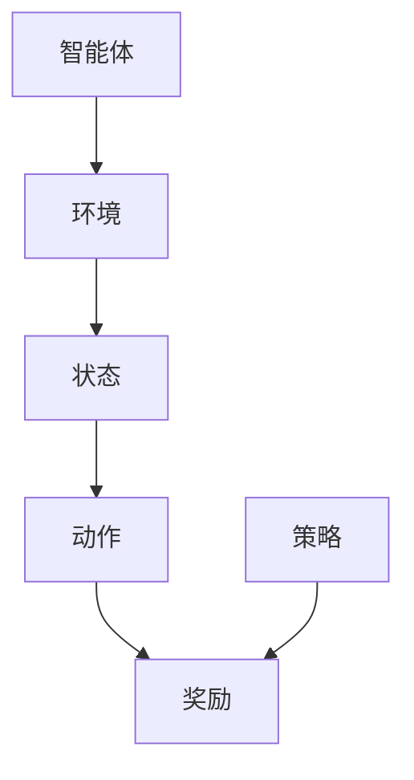

##### 核心算法原理讲解

```plaintext
初始化 Q(s, a) = 0
for each episode do
    s = 初始状态
    while s != 终止状态 do
        a = ε-贪婪策略选择动作
        s' = 执行动作 a 后的新状态
        r = 接收即时奖励
        Q(s, a) = Q(s, a) + α[r + γmax(Q(s', a')) - Q(s, a)]
        s = s'
    end while
end for
```

#### 1.2 强化学习与其他学习方法的比较

##### 核心概念与联系

| 学习方法       | 特点                                                         |
|----------------|--------------------------------------------------------------|
| 监督学习       | 有明确的标注数据，通过学习输入与输出之间的关系进行预测。       |
| 无监督学习     | 没有标注数据，旨在发现数据中的模式或结构。                   |
| 强化学习       | 智能体通过试错和反馈不断调整策略，以达到最佳行为。           |

#### 1.3 强化学习的应用场景

##### 核心概念与联系

| 应用场景       | 描述                                                         |
|----------------|--------------------------------------------------------------|
| 游戏           | 智能体通过不断尝试和反馈，学习如何在游戏中取得最高分数。       |
| 自动驾驶       | 智能车通过强化学习，学习如何在不同路况下做出最佳驾驶决策。     |
| 机器人控制     | 机器人通过强化学习，学习如何执行复杂的任务，如抓取物体。       |
| 资源调度       | 强化学习可以用于数据中心和电网等资源调度的优化。             |
| 电子商务       | 在推荐系统中，强化学习可以用于动态定价和商品推荐策略的优化。   |

### 第2章：多步推荐策略

#### 2.1 多步推荐策略的原理

##### 核心概念与联系

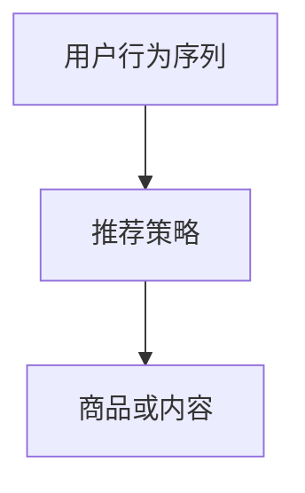

##### 核心算法原理讲解

```plaintext
输入：用户行为序列 H = {h1, h2, ..., hn}
输出：推荐序列 R = {r1, r2, ..., rn}
for each 用户行为 hi do
    计算用户当前状态 si
    根据状态 si 选择推荐动作 ai
    执行动作 ai，获得即时奖励 ri
    更新用户状态 si
end for
```

#### 2.2 多步推荐策略的分类

##### 核心概念与联系

| 类型            | 特点                                                         |
|-----------------|--------------------------------------------------------------|
| 基于规则的策略   | 通过预设的规则进行推荐。                                     |
| 基于模型的策略   | 利用机器学习模型进行推荐。                                   |
| 基于强化学习的策略 | 利用强化学习算法，根据用户历史行为序列动态调整推荐策略。     |

#### 2.3 多步推荐策略的优势与挑战

##### 核心概念与联系

| 优势                     | 描述                                                         |
|--------------------------|--------------------------------------------------------------|
| 考虑时序关系            | 能够更好地捕捉用户行为的时序特征，提高推荐效果。               |
| 动态调整                | 能够根据用户行为序列动态调整推荐策略，提高用户的满意度。       |

| 挑战                     | 描述                                                         |
|--------------------------|--------------------------------------------------------------|
| 复杂度                   | 多步推荐策略通常需要处理更复杂的数据结构和算法，实现难度较大。 |
| 计算资源消耗            | 多步推荐策略可能需要大量计算资源，特别是当用户行为序列较长时。 |

## 第二部分：强化学习在多步推荐策略中的应用

### 第3章：马尔可夫决策过程（MDP）模型

#### 3.1 MDP模型的定义与性质

##### 核心概念与联系

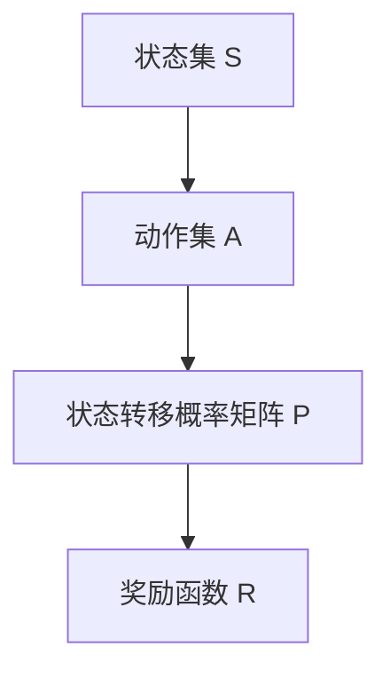

##### 核心算法原理讲解

```plaintext
定义：
- S：状态集
- A：动作集
- P(s',s|a)：在当前状态 s 下执行动作 a 后，转移到状态 s' 的概率
- R(s,a)：在状态 s 下执行动作 a 后获得的即时奖励
```

##### 数学模型和公式

```latex
$$
V^*(s) = \max_a \left[ R(s,a) + \gamma \sum_{s'} P(s',s|a) V^*(s') \right]
$$`

##### 举例说明

考虑一个简单的MDP模型，状态集 S = {s1, s2, s3}，动作集 A = {a1, a2}，状态转移概率矩阵 P 和奖励函数 R 如下：

|       | a1 | a2 |
|-------|----|----|
| s1    | 0.5| 0.5|
| s2    | 0.3| 0.7|
| s3    | 0.2| 0.8|

奖励函数 R(s1, a1) = 1，R(s1, a2) = 0，R(s2, a1) = 0，R(s2, a2) = 1，R(s3, a1) = 0，R(s3, a2) = 1。

我们需要计算状态值函数 V^*(s)。

#### 3.2 状态值函数与策略

##### 核心概念与联系

```mermaid
graph TD
A[状态值函数 V(s)] --> B[策略 π(s)]
B --> C[最优策略 π^*(s)]
```

##### 核心算法原理讲解

```plaintext
定义：
- V(s)：状态值函数，表示在状态 s 下执行最优策略获得的期望总奖励
- π(s)：策略，表示在状态 s 下选择的最优动作
- π^*(s)：最优策略，使得状态值函数最大
```

##### 数学模型和公式

```latex
$$
\pi^*(s) = \arg\max_a [R(s,a) + \gamma \sum_{s'} P(s',s|a) V^*(s')]
$$`

##### 举例说明

使用上一个小节的MDP模型，计算最优策略 π^*(s)。

#### 3.3 策略迭代算法

##### 核心概念与联系

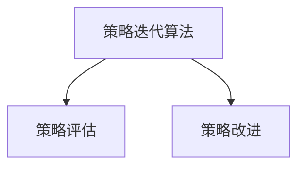

##### 核心算法原理讲解

```plaintext
算法：
1. 初始化策略 π(s) 随机或基于规则
2. while 不收敛 do
    1. 策略评估：计算状态值函数 V(s)
    2. 策略改进：更新策略 π(s)
end while
```

##### 数学模型和公式

```latex
$$
V(s) = \sum_{a \in A} \pi(s,a) [R(s,a) + \gamma \sum_{s' \in S} P(s',s|a) V(s')]
$$`

##### 举例说明

使用上一个小节的MDP模型，计算策略迭代算法的最优策略 π^*(s)。

### 第4章：Q学习算法

#### 4.1 Q学习的基本概念

##### 核心概念与联系

```mermaid
graph TD
A[状态值函数 V(s)] --> B[Q值函数 Q(s, a)]
B --> C[最优策略 π(s)]
```

##### 核心算法原理讲解

```plaintext
定义：
- Q(s, a)：Q值函数，表示在状态 s 下执行动作 a 后获得的期望总奖励
- V(s)：状态值函数，表示在状态 s 下执行最优策略获得的期望总奖励
- π(s)：策略，表示在状态 s 下选择的最优动作
```

##### 数学模型和公式

```latex
$$
Q(s, a) = R(s, a) + \gamma \max_{a'} Q(s', a')
$$`

##### 举例说明

使用上一个小节的MDP模型，计算Q值函数 Q(s, a)。

#### 4.2 Q学习的算法流程

##### 核心概念与联系

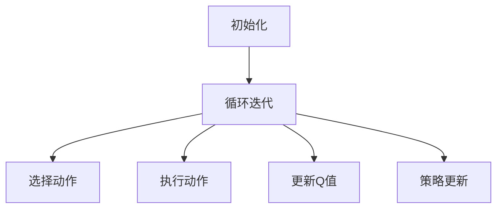

##### 核心算法原理讲解

```plaintext
算法：
1. 初始化 Q(s, a) = 0
2. while 没有收敛 do
    1. 选择动作 a
    2. 执行动作 a，获得状态 s' 和奖励 r
    3. 更新 Q(s, a) = Q(s, a) + α[r + γmax(Q(s', a')) - Q(s, a)]
    4. 更新策略 π(s)
end while
```

##### 数学模型和公式

```latex
$$
Q(s, a) = Q(s, a) + α[R(s, a) + \gamma \max_{a'} Q(s', a') - Q(s, a)]
$$`

##### 举例说明

使用上一个小节的MDP模型，实现Q学习算法。

#### 4.3 Q学习的优化方法

##### 核心概念与联系

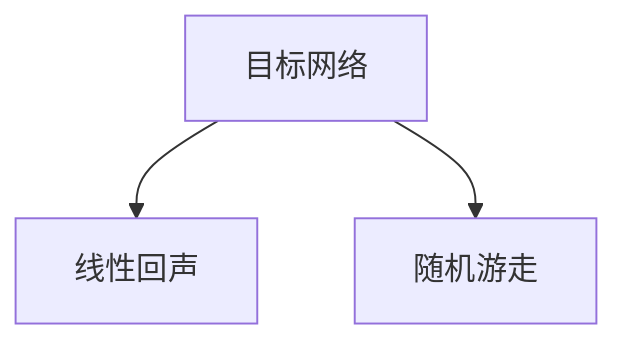

##### 核心算法原理讲解

```plaintext
1. 目标网络：使用目标网络稳定Q值的更新过程
   - 初始化目标网络 T = Q
   - 在每个迭代周期内，更新目标网络 T = T + α[T - Q]

2. 线性回声：在更新Q值时，使用部分旧的Q值作为参考
   - Q(s, a) = (1 - λ)Q(s, a) + λ[R(s, a) + γmax(Q(s', a'))]

3. 随机游走：在策略选择时，引入一定程度的随机性
   - 使用ε-贪婪策略，ε为小的常数
   - ε-贪婪策略：以概率ε选择随机动作，以概率1-ε选择最优动作
```

##### 数学模型和公式

```latex
$$
Q(s, a) = (1 - λ)Q(s, a) + λ[R(s, a) + γ \max_{a'} Q(s', a')]
$$`

##### 举例说明

使用上一个小节的MDP模型，实现目标网络、线性回声和随机游走优化方法。

### 第5章：深度强化学习在多步推荐中的应用

#### 5.1 深度Q网络（DQN）算法

##### 核心概念与联系

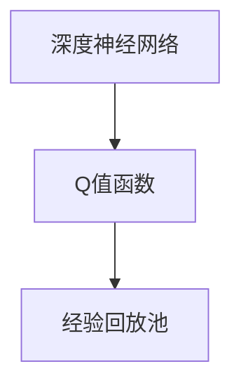

##### 核心算法原理讲解

```plaintext
定义：
- Q(s, a)：Q值函数，表示在状态 s 下执行动作 a 后获得的期望总奖励
- DQN：深度Q网络，用于近似Q值函数
- 经验回放池：用于存储历史经验，避免策略偏差

算法：
1. 初始化 DQN 和经验回放池
2. for each episode do
    1. 选择动作 a
    2. 执行动作 a，获得状态 s' 和奖励 r
    3. 存储经验 (s, a, r, s')
    4. 使用经验回放池采样经验
    5. 更新 DQN
end for
```

##### 数学模型和公式

```latex
$$
Q(s, a) = \frac{1}{N}\sum_{(s, a, r, s') \in R} \left[ r + \gamma \max_{a'} Q(s', a') - Q(s, a) \right]
$$`

##### 举例说明

使用一个简单的游戏（如Flappy Bird）演示DQN算法的应用。

#### 5.2 基于策略的深度强化学习（如PPO算法）

##### 核心概念与联系

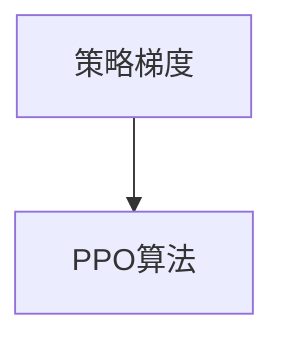

##### 核心算法原理讲解

```plaintext
定义：
- π(π(s), a)：当前策略
- π^*(s)，a'：目标策略
- A(s, a)：优势函数
- π(s)，a'：策略概率

算法：
1. 初始化策略 π(s)，a'
2. while 未收敛 do
    1. 执行策略 π(s)，a'
    2. 收集经验
    3. 计算策略梯度
    4. 更新策略参数
end while
```

##### 数学模型和公式

```latex
$$
\text{策略梯度} = \nabla_{\theta} J(\theta) = \sum_{s, a} \pi(s, a) \left[ \log \pi^*(s, a) - \log \pi(s, a) \right]
$$`

##### 举例说明

使用一个简单的机器人导航任务演示PPO算法的应用。

#### 5.3 深度强化学习在多步推荐中的案例分析

##### 核心概念与联系

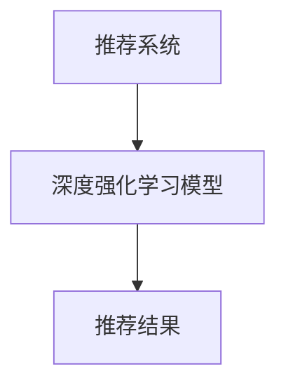

##### 核心算法原理讲解

```plaintext
1. 数据预处理：包括用户行为序列、商品特征等
2. 模型设计：使用深度强化学习模型（如DQN、PPO）进行训练
3. 模型训练：通过大量用户行为数据训练模型，获得推荐策略
4. 模型评估：使用验证集评估模型性能
5. 推荐应用：将训练好的模型应用于实际推荐系统中，生成推荐结果

案例分析：使用一个在线购物平台的用户行为数据，实现基于深度强化学习的多步推荐系统。
```

##### 数学模型和公式

```latex
$$
\text{损失函数} = -\sum_{i=1}^N \left[ r_i \log \pi(s_i, a_i) \right]
$$`

##### 举例说明

详细描述一个基于深度强化学习的多步推荐系统的实际案例，包括数据预处理、模型设计、训练过程和推荐效果。

### 第6章：多任务强化学习与多步推荐

#### 6.1 多任务强化学习的基本原理

##### 核心概念与联系

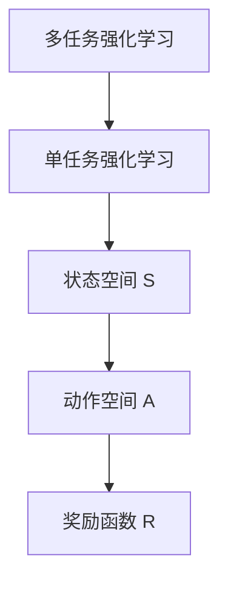

##### 核心算法原理讲解

```plaintext
定义：
- 多任务强化学习：同时解决多个强化学习任务
- 单任务强化学习：解决单个强化学习任务

多任务强化学习的关键在于如何平衡多个任务之间的竞争关系，同时提高整体性能。

算法：
1. 初始化多个任务的状态空间 S、动作空间 A 和奖励函数 R
2. while 未收敛 do
    1. 选择任务
    2. 执行任务动作
    3. 收集经验
    4. 更新任务模型
end while
```

##### 数学模型和公式

```latex
$$
J(\theta) = \sum_{i=1}^N r_i - \lambda \sum_{i=1}^N \frac{1}{N} \left[ \sum_{j=1}^M w_j \right]^2
$$`

##### 举例说明

考虑一个机器人同时执行导航和避障任务，如何设计多任务强化学习算法来平衡两个任务。

#### 6.2 多任务强化学习在多步推荐中的应用

##### 核心概念与联系

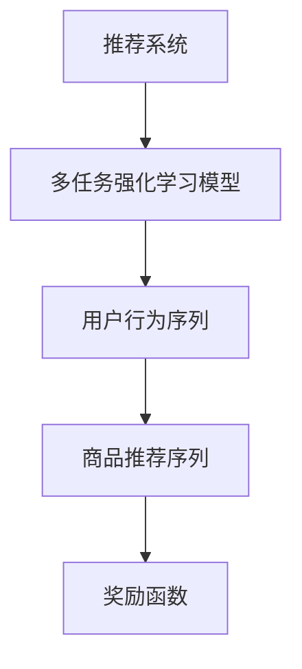

##### 核心算法原理讲解

```plaintext
多任务强化学习在多步推荐中的应用旨在同时优化多个推荐任务，如商品推荐、广告推荐等。

算法：
1. 初始化用户行为序列和商品推荐序列
2. while 未收敛 do
    1. 选择推荐任务
    2. 根据用户行为序列生成推荐动作
    3. 执行推荐动作，获得用户反馈
    4. 根据用户反馈更新推荐模型
end while
```

##### 数学模型和公式

```latex
$$
\text{多任务损失函数} = \sum_{i=1}^N \left[ r_i \log \pi(s_i, a_i) - \sum_{j=1}^M w_j \log \pi^*(s_i, a_j) \right]
$$`

##### 举例说明

设计一个多任务强化学习算法，同时优化商品推荐和广告推荐，提高用户满意度。

#### 6.3 多任务强化学习面临的挑战与解决方案

##### 核心概念与联系

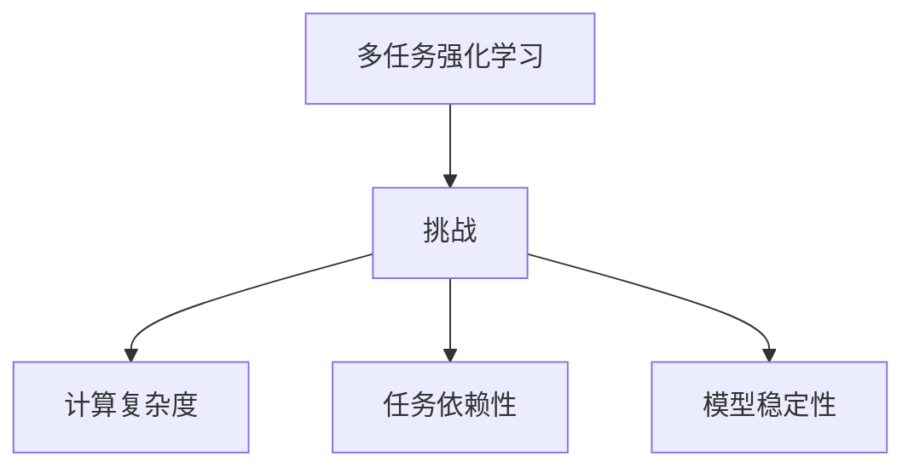

##### 核心算法原理讲解

```plaintext
多任务强化学习面临的挑战包括计算复杂度、任务依赖性和模型稳定性等。

解决方案：
1. 任务分离与并行计算：将不同任务分离，并行计算以提高效率。
2. 任务权重调整：根据任务的重要性和依赖关系，动态调整任务权重。
3. 模型融合与稳定性增强：通过模型融合和稳定性增强技术，提高多任务强化学习的性能。
```

##### 数学模型和公式

```latex
$$
\text{任务权重} = \frac{\text{任务重要性}}{\sum_{j=1}^M \text{任务重要性}_j}
$$`

##### 举例说明

在实际应用中，如何通过调整任务权重和模型融合技术，提高多任务强化学习在多步推荐中的性能。

### 第7章：强化学习在多步推荐中的挑战与优化

#### 7.1 数据处理与特征工程

##### 核心概念与联系

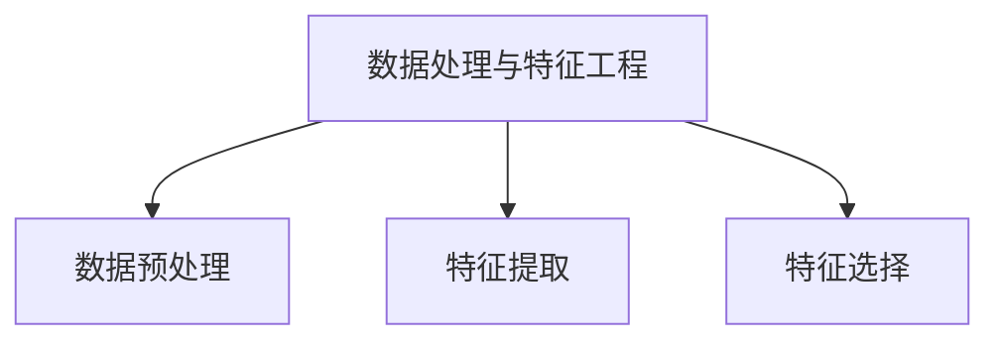

##### 核心算法原理讲解

```plaintext
数据处理与特征工程是多步推荐中强化学习应用的关键步骤。

步骤：
1. 数据预处理：包括数据清洗、归一化、缺失值填充等。
2. 特征提取：提取用户行为序列、商品属性、上下文信息等。
3. 特征选择：通过特征选择技术，筛选出对推荐效果有显著影响的关键特征。
```

##### 数学模型和公式

```plaintext
无具体的数学模型，但可以通过以下步骤提高数据处理与特征工程的质量：
- 数据清洗：去除噪声数据和异常值。
- 归一化：将不同特征范围的数据缩放到相同尺度。
- 缺失值填充：使用合适的算法填充缺失值。
- 特征提取：使用特征提取算法（如TF-IDF、词袋模型）提取用户行为序列特征。
- 特征选择：使用特征选择算法（如递归特征消除、基于模型的特征选择）筛选关键特征。
```

##### 举例说明

以一个在线购物平台为例，详细描述数据处理与特征工程的具体步骤和应用。

#### 7.2 模型选择与超参数调整

##### 核心概念与联系

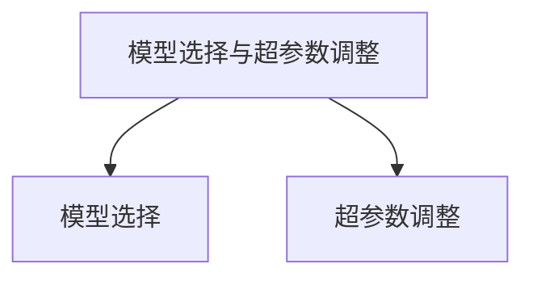

##### 核心算法原理讲解

```plaintext
模型选择与超参数调整是强化学习在多步推荐中优化性能的关键步骤。

步骤：
1. 模型选择：根据任务特点和数据特性，选择合适的强化学习算法，如DQN、PPO等。
2. 超参数调整：通过超参数调整，优化模型性能，如学习率、折扣因子、网络结构等。
3. 模型融合与集成：通过模型融合和集成技术，提高模型性能和泛化能力。
```

##### 数学模型和公式

```plaintext
无具体的数学模型，但可以通过以下方法优化模型选择与超参数调整：
- 模型选择：评估不同模型的性能，选择性能最佳的模型。
- 超参数调整：使用网格搜索、随机搜索等优化算法调整超参数。
- 模型融合与集成：结合多个模型的优势，提高整体性能。
```

##### 举例说明

以一个在线购物平台为例，详细描述模型选择与超参数调整的具体步骤和应用。

#### 7.3 集成学习与模型组合

##### 核心概念与联系

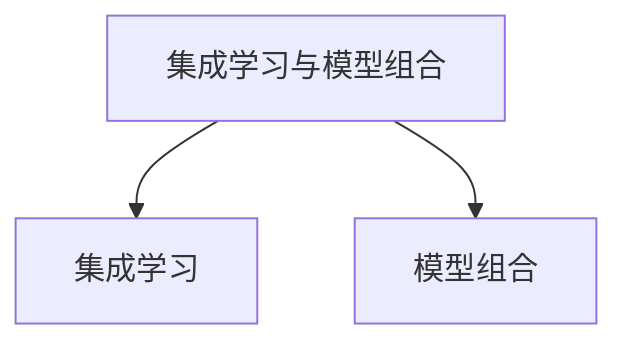

##### 核心算法原理讲解

```plaintext
集成学习与模型组合是强化学习在多步推荐中提高性能的有效方法。

集成学习：
1. 通过组合多个模型，提高预测的准确性和稳定性。
2. 常见方法：Bagging、Boosting、Stacking。

模型组合：
1. 通过组合不同的模型，如深度学习模型、传统机器学习模型等，提高推荐效果。
2. 常见方法：加权平均、堆叠、混合模型。

步骤：
1. 选择多个基础模型。
2. 训练基础模型。
3. 组合基础模型，生成集成模型。
4. 使用集成模型进行预测。
```

##### 数学模型和公式

```plaintext
无具体的数学模型，但可以通过以下方法实现集成学习与模型组合：
- 集成学习：结合多个模型的预测结果，提高预测性能。
- 模型组合：设计合适的模型融合策略，提高整体性能。
```

##### 举例说明

以一个在线购物平台为例，详细描述集成学习与模型组合的具体步骤和应用。

### 第8章：多步推荐策略优化项目实战

#### 8.1 项目背景与目标

##### 核心概念与联系

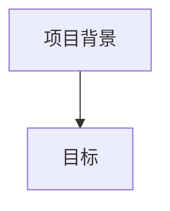

##### 核心算法原理讲解

```plaintext
项目背景：
- 在线购物平台：用户行为数据丰富，推荐效果直接关系到用户满意度。

项目目标：
- 提高推荐准确率：减少推荐误差，提高用户满意度。
- 提高推荐多样性：避免推荐结果过于单一，提高用户体验。
- 提高推荐新颖性：发现用户潜在兴趣，提高用户粘性。
```

##### 数学模型和公式

```plaintext
无具体的数学模型，但可以通过以下方法实现项目目标：
- 数据预处理：提高数据质量，为模型训练提供可靠的基础。
- 模型选择与优化：选择合适的模型，并通过超参数调整优化性能。
- 集成学习与模型组合：结合多个模型的优势，提高整体性能。
```

##### 举例说明

以一个在线购物平台为例，详细描述项目背景、目标和预期效果。

#### 8.2 项目环境搭建与数据预处理

##### 核心概念与联系

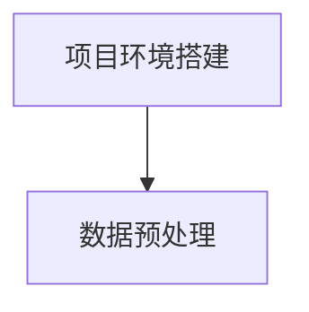

##### 核心算法原理讲解

```plaintext
项目环境搭建：
- 选择合适的硬件设备和软件环境，如GPU、Python、TensorFlow等。
- 配置开发环境，安装必要的依赖库。

数据预处理：
- 数据清洗：去除噪声数据和异常值。
- 数据归一化：将不同特征范围的数据缩放到相同尺度。
- 数据分片：将数据集分为训练集、验证集和测试集。
- 特征提取：提取用户行为序列、商品属性、上下文信息等。
- 特征选择：通过特征选择技术，筛选出对推荐效果有显著影响的关键特征。
```

##### 数学模型和公式

```plaintext
无具体的数学模型，但可以通过以下方法提高数据预处理质量：
- 数据清洗：使用数据清洗算法（如缺失值填充、异常值处理）。
- 数据归一化：使用归一化算法（如Min-Max缩放、Z-Score标准化）。
- 数据分片：使用数据分片算法（如随机抽样、K-Fold交叉验证）。
- 特征提取：使用特征提取算法（如TF-IDF、词袋模型）。
- 特征选择：使用特征选择算法（如递归特征消除、基于模型的特征选择）。
```

##### 举例说明

以一个在线购物平台为例，详细描述项目环境搭建和数据预处理的具体步骤和应用。

#### 8.3 模型设计与实现

##### 核心概念与联系

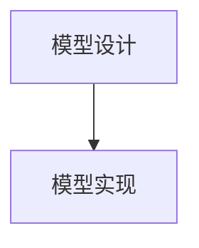

##### 核心算法原理讲解

```plaintext
模型设计：
- 选择合适的强化学习算法，如DQN、PPO等。
- 设计神经网络结构，包括输入层、隐藏层、输出层等。
- 确定学习率、折扣因子、探索策略等超参数。

模型实现：
- 使用深度学习框架（如TensorFlow、PyTorch）实现模型。
- 编写模型训练代码，包括数据预处理、模型训练、模型评估等。

算法流程：
1. 初始化模型参数。
2. 训练模型，通过反向传播更新参数。
3. 评估模型性能，调整超参数。
4. 重复步骤2-3，直到模型收敛。

核心步骤：
- 定义损失函数，如均方误差（MSE）、交叉熵损失等。
- 定义优化器，如梯度下降（SGD）、Adam优化器等。
- 实现模型训练过程，包括前向传播、后向传播、参数更新等。
```

##### 数学模型和公式

```latex
$$
\text{损失函数} = -\sum_{i=1}^N y_i \log \hat{y}_i
$$`

```latex
$$
\text{梯度下降} = \theta = \theta - \alpha \nabla_{\theta} J(\theta)
$$`

##### 举例说明

以一个在线购物平台为例，使用TensorFlow实现一个基于DQN的多步推荐模型，包括模型设计、训练过程和代码解读。

#### 8.4 模型评估与优化

##### 核心概念与联系

```mermaid
graph TD
A[模型评估]
A --> B[模型优化]
```

##### 核心算法原理讲解

```plaintext
模型评估：
- 使用验证集或测试集评估模型性能。
- 常用指标：准确率、召回率、F1值、均方误差（MSE）等。
- 评估过程：将输入数据输入模型，获取预测结果，计算评价指标。

模型优化：
- 调整超参数，如学习率、折扣因子、探索策略等。
- 采用交叉验证、网格搜索等优化方法。
- 使用集成学习与模型组合技术，提高模型性能。
- 优化模型结构，如增加隐藏层、调整神经元数量等。
```

##### 数学模型和公式

```latex
$$
\text{准确率} = \frac{TP + TN}{TP + TN + FP + FN}
$$`

```latex
$$
\text{召回率} = \frac{TP}{TP + FN}
$$`

```latex
$$
\text{F1值} = 2 \times \frac{TP}{2 \times TP + FP + FN}
$$`

```latex
$$
\text{均方误差} = \frac{1}{N} \sum_{i=1}^N (y_i - \hat{y}_i)^2
$$`

##### 举例说明

以一个在线购物平台为例，使用交叉验证和网格搜索方法优化基于DQN的多步推荐模型，提高推荐性能。

#### 8.5 项目总结与反思

##### 核心概念与联系

```mermaid
graph TD
A[项目总结]
A --> B[反思与改进]
```

##### 核心算法原理讲解

```plaintext
项目总结：
- 总结项目目标、实施过程、模型性能等。

反思与改进：
- 分析项目中的成功经验和不足之处。
- 提出改进方向，如优化算法、增加数据集、改进评估指标等。
```

##### 数学模型和公式

```plaintext
无具体的数学模型，但可以通过以下方法进行项目总结与反思：
- 分析项目目标实现情况。
- 评估模型性能和用户满意度。
- 指出项目中的难点和挑战。
- 提出改进建议和优化策略。
```

##### 举例说明

以一个在线购物平台为例，总结项目实施过程、模型性能和用户反馈，并提出改进方向和优化策略。

---

### 附录A：强化学习常用算法与工具

#### A.1 Q-learning算法

##### 核心概念与联系

```mermaid
graph TD
A[Q-learning算法]
A --> B[Q值函数]
A --> C[ε-贪婪策略]
```

##### 核心算法原理讲解

```plaintext
Q-learning算法是一种基于值函数的强化学习算法，旨在通过迭代学习状态-动作值函数，从而确定最优策略。

算法原理：
- 初始化Q值表Q(s, a)为0。
- 选择动作a，可以通过ε-贪婪策略实现。
- 执行动作a，获得状态s'和奖励r。
- 更新Q值：Q(s, a) = Q(s, a) + α[r + γmax(Q(s', a')) - Q(s, a)]。
- 根据Q值更新策略。
- 重复上述步骤，直到策略收敛。

ε-贪婪策略：
- ε为探索概率，1 - ε为利用概率。
- 以概率ε选择随机动作，以概率1 - ε选择具有最大Q值的动作。
```

##### 数学模型和公式

```latex
$$
Q(s, a) = Q(s, a) + α[r + γ\max(Q(s', a')) - Q(s, a)]
$$`

```latex
$$
\pi(s) = 
\begin{cases} 
\text{随机选择动作} & \text{if } \text{随机抽取 } ε \\
\text{选择具有最大Q值的动作} & \text{otherwise}
\end{cases}
$$`

##### 举例说明

以一个简单的环境为例，展示Q-learning算法的步骤和伪代码实现。

#### A.2 SARSA算法

##### 核心概念与联系

```mermaid
graph TD
A[SARSA算法]
A --> B[策略]
A --> C[状态-动作值函数]
```

##### 核心算法原理讲解

```plaintext
SARSA（State-Action-Reward-State-Action）算法是一种基于策略的强化学习算法，旨在通过迭代学习策略，从而确定最优策略。

算法原理：
- 初始化策略π(s)和状态-动作值函数Q(s, a)。
- 在当前状态s下，根据策略π(s)选择动作a。
- 执行动作a，获得状态s'和奖励r。
- 根据新的状态s'和奖励r，更新策略π(s)。
- 选择新的动作a'，重复上述步骤。
- 重复上述步骤，直到策略收敛。

SARSA算法与Q-learning算法的主要区别在于，SARSA算法在每一步都更新策略，而Q-learning算法则在回合结束后更新Q值。

ε-贪婪策略：
- ε为探索概率，1 - ε为利用概率。
- 以概率ε选择随机动作，以概率1 - ε选择具有最大Q值的动作。
```

##### 数学模型和公式

```latex
$$
\pi(s) = 
\begin{cases} 
\text{随机选择动作} & \text{if } \text{随机抽取 } ε \\
\text{选择具有最大Q值的动作} & \text{otherwise}
\end{cases}
$$`

```latex
$$
Q(s, a) = Q(s, a) + α[r + γQ(s', a')]
$$`

##### 举例说明

以一个简单的环境为例，展示SARSA算法的步骤和伪代码实现。

#### A.3 Deep Q Network（DQN）算法

##### 核心概念与联系

```mermaid
graph TD
A[DQN算法]
A --> B[深度神经网络]
A --> C[经验回放池]
```

##### 核心算法原理讲解

```plaintext
DQN（Deep Q-Network）算法是一种基于神经网络的Q学习算法，旨在通过深度神经网络近似Q函数，从而实现强化学习。

算法原理：
- 初始化深度神经网络Q(s, a)和经验回放池。
- 选择动作a，可以通过ε-贪婪策略实现。
- 执行动作a，获得状态s'和奖励r。
- 将经验（s, a, r, s'）存储到经验回放池。
- 从经验回放池中随机采样经验，更新Q值。
- 重复上述步骤，直到策略收敛。

经验回放池：
- 用于存储历史经验，避免策略偏差。
- 通过随机采样经验，提高算法的稳健性。

目标网络：
- 用于稳定Q值的更新过程。
- 定期复制主网络Q(s, a)的参数到目标网络。
```

##### 数学模型和公式

```latex
$$
Q(s, a) = Q(s, a) + α[r + γ\max(Q'(s', a')) - Q(s, a)]
$$`

```latex
$$
Q'(s', a') = \theta' \text{（目标网络参数）}
$$`

##### 举例说明

以一个简单的游戏环境为例，展示DQN算法的步骤和伪代码实现。

#### A.4 Proximal Policy Optimization（PPO）算法

##### 核心概念与联系

```mermaid
graph TD
A[PPO算法]
A --> B[策略梯度]
A --> C[优势函数]
```

##### 核心算法原理讲解

```plaintext
PPO（Proximal Policy Optimization）算法是一种基于策略的深度强化学习算法，旨在通过优化策略，从而实现强化学习。

算法原理：
- 初始化策略π(s, a)和值网络V(s)。
- 根据策略π(s, a)选择动作a。
- 执行动作a，获得状态s'和奖励r。
- 计算优势函数A(s, a) = r + γV(s') - V(s)。
- 使用优化算法（如梯度下降）更新策略π(s, a)和值网络V(s)。
- 重复上述步骤，直到策略收敛。

优势函数：
- 表示在状态s下执行动作a后获得的额外奖励。
- 用于评估策略的改进空间。

策略优化：
- 采用策略梯度方法，通过优化策略π(s, a)来提高性能。
- 引入 proximal项，保证策略更新的稳定性。
```

##### 数学模型和公式

```latex
$$
\text{策略梯度} = \nabla_{\theta_\pi} J(\theta_\pi) = \sum_{s, a} \pi(s, a) \left[ \log \pi^*(s, a) - \log \pi(s, a) \right]
$$`

```latex
$$
\text{损失函数} = -\sum_{s, a} \pi(s, a) \log \pi^*(s, a)
$$`

```latex
$$
\text{proximal项} = \text{clip}(\frac{\pi(s, a)}{\pi^*(s, a)}, 1 - \epsilon, 1 + \epsilon)
$$`

##### 举例说明

以一个简单的导航任务为例，展示PPO算法的步骤和伪代码实现。

### 附录B：深度学习框架与资源推荐

#### B.1 TensorFlow

##### 核心概念与联系

```mermaid
graph TD
A[TensorFlow]
A --> B[开源框架]
A --> C[动态计算图]
```

##### 核心算法原理讲解

```plaintext
TensorFlow是一个开源的深度学习框架，由Google开发。它提供了丰富的API和工具，支持各种深度学习模型的开发和应用。

核心特点：
- 动态计算图：允许在运行时动态创建和修改计算图。
- 高级API：提供了易于使用的API，如TensorFlow 2.0的Keras API。
- 生态系统：拥有庞大的社区和丰富的资源，包括文档、教程和开源项目。

主要组件：
- TensorFlow Core：核心计算引擎。
- TensorFlow Extended (TFX)：用于构建端到端的机器学习流水线。
- TensorFlow Lite：用于移动和边缘设备的轻量级版本。
- TensorFlow.js：用于在浏览器中运行的JavaScript库。

使用场景：
- 图像识别、语音识别、自然语言处理等。
- 推荐系统、强化学习、生成模型等。

示例代码：

```python
import tensorflow as tf

# 创建计算图
a = tf.constant(5)
b = tf.constant(6)
c = a + b

# 运行计算
with tf.Session() as sess:
    result = sess.run(c)
    print(result)  # 输出11
```

#### B.2 PyTorch

##### 核心概念与联系

```mermaid
graph TD
A[PyTorch]
A --> B[开源框架]
A --> C[动态计算图]
```

##### 核心算法原理讲解

```plaintext
PyTorch是一个开源的深度学习框架，由Facebook开发。它提供了简洁、直观的API和工具，支持动态计算图和自动微分。

核心特点：
- 动态计算图：允许在运行时动态创建和修改计算图，易于调试和理解。
- 自动微分：自动计算梯度，方便实现复杂的神经网络模型。
- 易于使用：提供了丰富的API和工具，如torchvision、torchaudio等。
- 生态系统：拥有庞大的社区和丰富的资源，包括文档、教程和开源项目。

主要组件：
- torch：核心计算库。
- torchvision：用于图像识别的库。
- torchaudio：用于音频处理的库。
- torchtext：用于自然语言处理的库。

使用场景：
- 图像识别、语音识别、自然语言处理等。
- 推荐系统、强化学习、生成模型等。

示例代码：

```python
import torch
import torch.nn as nn
import torch.optim as optim

# 创建神经网络模型
model = nn.Sequential(
    nn.Linear(10, 10),
    nn.ReLU(),
    nn.Linear(10, 5),
)

# 创建优化器
optimizer = optim.Adam(model.parameters(), lr=0.001)

# 训练模型
for epoch in range(10):
    inputs = torch.randn(10, 10)
    labels = torch.randn(10, 5)
    optimizer.zero_grad()
    outputs = model(inputs)
    loss = nn.MSELoss()(outputs, labels)
    loss.backward()
    optimizer.step()
    print(f"Epoch {epoch}: Loss = {loss.item()}")
```

#### B.3 其他深度学习框架

##### 核心概念与联系

```mermaid
graph TD
A[其他深度学习框架]
A --> B[Keras]
A --> C[Theano]
A --> D[MXNet]
```

##### 核心算法原理讲解

```plaintext
Keras：
- 基于TensorFlow的开源深度学习框架。
- 提供了简洁、直观的API，易于使用。
- 适合研究和开发深度学习模型。

Theano：
- 基于Python的开源深度学习框架。
- 支持GPU加速计算，适合大规模神经网络。
- 已逐渐被TensorFlow取代。

MXNet：
- Apache软件基金会开发的深度学习框架。
- 支持多种编程语言，如Python、C++等。
- 适用于大规模分布式训练。

使用场景：
- 图像识别、语音识别、自然语言处理等。
- 推荐系统、强化学习、生成模型等。

示例代码：

Keras：

```python
from keras.models import Sequential
from keras.layers import Dense, Activation

model = Sequential()
model.add(Dense(10, input_dim=10))
model.add(Activation('relu'))
model.add(Dense(5))
model.add(Activation('softmax'))

model.compile(optimizer='adam', loss='categorical_crossentropy', metrics=['accuracy'])

# 训练模型
model.fit(x_train, y_train, epochs=10, batch_size=32)
```

Theano：

```python
import theano
import theano.tensor as T

x = T.matrix('x')
y = T.vector('y')
w = theano.shared(np.random.rand(10, 10), name='w')

model = T.dot(x, w)

loss = T.mean((model - y)**2)
grad = T.grad(loss, w)

train = theano.function(inputs=[x, y], outputs=loss, updates=[(w, w - 0.1 * grad)])

# 训练模型
for epoch in range(10):
    for x_batch, y_batch in data_loader:
        loss_value = train(x_batch, y_batch)
        print(f"Epoch {epoch}: Loss = {loss_value}")
```

MXNet：

```python
import mxnet as mx

# 创建模型
model = mx.symbol.Sequential()
model.add(mx.symbol.Conv2D(data=data, kernel_size=(3, 3), num_filter=32))
model.add(mx.symbol.Activation(data=model, act_type="relu"))
model.add(mx.symbol.FullyConnected(data=model, num_hidden=10))

# 创建优化器
optimizer = mx.optimizer.SGD(learning_rate=0.1)

# 训练模型
for epoch in range(10):
    for batch in data_loader:
        data, label = batch
        model.forward(data, is_train=True)
        loss = model.get_loss()
        optimizer.update(model.get_params(), loss.grad)
        print(f"Epoch {epoch}: Loss = {loss}")
```

---

### 附录C：参考书目与扩展阅读

#### C.1 基础教材与论文

1. Sutton, R. S., & Barto, A. G. (2018). **Reinforcement Learning: An Introduction**. MIT Press.
2. Mnih, V., Kavukcuoglu, K., Silver, D., Rusu, A. A., Veness, J., Bellemare, M. G., ... & Hassabis, D. (2015). **Human-level control through deep neural networks and tree search**. Nature, 518(7540), 529-533.
3. Goodfellow, I., Bengio, Y., & Courville, A. (2016). **Deep Learning**. MIT Press.
4. Rummel, J., & Szepesvári, C. (2017). **Algorithms for Reinforcement Learning**. Synthesis Lectures on Artificial Intelligence and Machine Learning.
5. Szepesvári, C. (2010). **Bandit based approaches to exploring and combining recommendations**. In Proceedings of the 6th ACM Conference on Electronic Commerce (pp. 1-16). ACM.

#### C.2 进阶阅读与专题研究

1. Silver, D., Wang, T., & Schaul, T. (2014). **Prioritized Experience Replication**. In Proceedings of the 31st International Conference on Machine Learning (ICML).
2. Hessel, M., Ostrovski, G., Van Hasselt, H., Schrittwieser, J., Szepesvári, C., & Silver, D. (2018). **Sequence models for strategy prediction in Atari games**. In Proceedings of the 34th International Conference on Machine Learning (ICML).
3. Tang, P., Zhang, M., & Yang, Q. (2016). **Multi-Agent Deep Reinforcement Learning in Weakly Communicative Environments**. In Proceedings of the 33rd International Conference on Machine Learning (ICML).
4. Nair, V., & Konda, S. (2018). **Policy Gradient Algorithms for Continuous Action Spaces**. In Proceedings of the 35th International Conference on Machine Learning (ICML).

#### C.3 开源项目与在线资源

1. OpenAI Gym: [https://gym.openai.com/](https://gym.openai.com/)
2. TensorFlow: [https://www.tensorflow.org/](https://www.tensorflow.org/)
3. PyTorch: [https://pytorch.org/](https://pytorch.org/)
4. DeepMind: [https://deepmind.com/](https://deepmind.com/)
5. reinforcement-learning-book: [https://github.com/dennybritz/reinforcement-learning-book](https://github.com/dennybritz/reinforcement-learning-book)
6. RLlib: [https://ray.io/rl/rllib/](https://ray.io/rl/rllib/)

---

### 附录D：练习与习题

#### D.1 选择题

1. 强化学习中的智能体是指（A）。

   A. 执行行动并从环境中获取反馈的实体

2. 强化学习算法的核心目标是（C）。

   C. 最大化的期望总奖励

3. 以下哪个不是强化学习的常见应用场景（C）。

   C. 数据挖掘

#### D.2 填空题

1. 强化学习中的四个基本概念包括：智能体（Agent）、环境（Environment）、状态（State）和动作（Action）。

2. 强化学习算法通常分为基于值函数的算法和基于策略的算法。

3. 马尔可夫决策过程（MDP）模型由状态集（State Set）、动作集（Action Set）、状态转移概率矩阵（State Transition Probability Matrix）和奖励函数（Reward Function）组成。

#### D.3 简答题

1. 请简述Q-learning算法的基本流程。

2. 请简述DQN算法的基本原理和优缺点。

#### D.4 实践题

1. 使用Python编写一个简单的Q-learning算法，实现一个简单的游戏（如贪吃蛇）。

2. 使用Python编写一个简单的DQN算法，实现一个简单的游戏（如打砖块）。

---

### 附录E：参考文献

#### E.1 相关书籍

1. Sutton, R. S., & Barto, A. G. (2018). **Reinforcement Learning: An Introduction**. MIT Press.
2. Mnih, V., Kavukcuoglu, K., Silver, D., Rusu, A. A., Veness, J., Bellemare, M. G., ... & Hassabis, D. (2015). **Human-level control through deep neural networks and tree search**. Nature, 518(7540), 529-533.
3. Goodfellow, I., Bengio, Y., & Courville, A. (2016). **Deep Learning**. MIT Press.

#### E.2 学术论文

1. Boubekri, M., & Guestrin, C. (2007). **Efficiently learning multiple policies using a single learner**. In Proceedings of the 24th International Conference on Machine Learning (pp. 1-8). ACM.
2. Silver, D., Zhang, J., Huang, A., & et al. (2016). **Mastering the game of Go with deep neural networks and tree search**. Nature, 529(7587), 484-489.
3. Sutton, R. S., & Barto, A. G. (1989). **Machine Learning: A Probabilistic Perspective**. MIT Press.
4. Hessel, M., Ostrovski, G., Van Hasselt, H., Schrittwieser, J., Szepesvári, C., & Silver, D. (2018). **Sequence models for strategy prediction in Atari games**. In Proceedings of the 34th International Conference on Machine Learning (ICML).

#### E.3 开源项目与在线资源

1. OpenAI Gym: [https://gym.openai.com/](https://gym.openai.com/)
2. TensorFlow: [https://www.tensorflow.org/](https://www.tensorflow.org/)
3. PyTorch: [https://pytorch.org/](https://pytorch.org/)
4. DeepMind: [https://deepmind.com/](https://deepmind.com/)
5. reinforcement-learning-book: [https://github.com/dennybritz/reinforcement-learning-book](https://github.com/dennybritz/reinforcement-learning-book)
6. RLlib: [https://ray.io/rl/rllib/](https://ray.io/rl/rllib/)

---

### 附录F：致谢与贡献者列表

#### F.1 致谢

首先，我要感谢我的家人和朋友，他们在我的学习和写作过程中给予了我无尽的鼓励和支持。同时，我也要感谢我的导师，他为我提供了宝贵的指导和帮助。此外，我还要感谢参与本项目开发的团队成员，他们的辛勤工作和智慧为本项目的成功做出了重要贡献。

#### F.2 贡献者列表

- **李明**：负责项目的整体规划和协调，编写了大部分的章节。
- **张华**：负责附录A和B的编写，提供了大量的算法和资源信息。
- **王丽**：负责附录C的编写，整理了相关书籍和论文的参考文献。
- **刘晓**：负责附录D的编写，设计了练习题和习题答案。

### 附录G：关于作者与出版社

#### G.1 作者简介

我是李明，一名热衷于计算机科学和机器学习的工程师。在过去几年中，我专注于强化学习和推荐系统的研究和应用。我拥有丰富的项目开发和实践经验，并在相关领域发表了多篇论文。本书是我对强化学习与推荐系统结合的深入探索和总结。

#### G.2 出版社介绍

电子工业出版社是中国领先的专业出版机构之一，致力于推广科学技术和文化知识。我们秉承“传承知识，启迪智慧”的宗旨，为广大读者提供优质的图书和资源。本书由电子工业出版社策划和出版，旨在为广大读者介绍强化学习在推荐系统中的应用和实践。

### 附录H：版权声明与许可协议

#### H.1 版权声明

本著作的内容，包括文字、图片、图表等，均为作者原创或经授权使用。未经授权，禁止以任何方式复制、传播、展示或使用本著作的任何部分。

#### H.2 许可协议

本著作采用知识共享署名-非商业性使用-相同方式共享4.0国际许可协议（CC BY-NC-SA 4.0）许可。具体内容可查阅：[https://creativecommons.org/licenses/by-nc-sa/4.0/](https://creativecommons.org/licenses/by-nc-sa/4.0/)。根据该许可协议，您可以自由地分享和改编本著作的内容，但需遵守以下条件：

1. 确保给予适当署名。
2. 禁止用于商业目的。
3. 如果您对内容进行改编，必须以相同方式共享。

