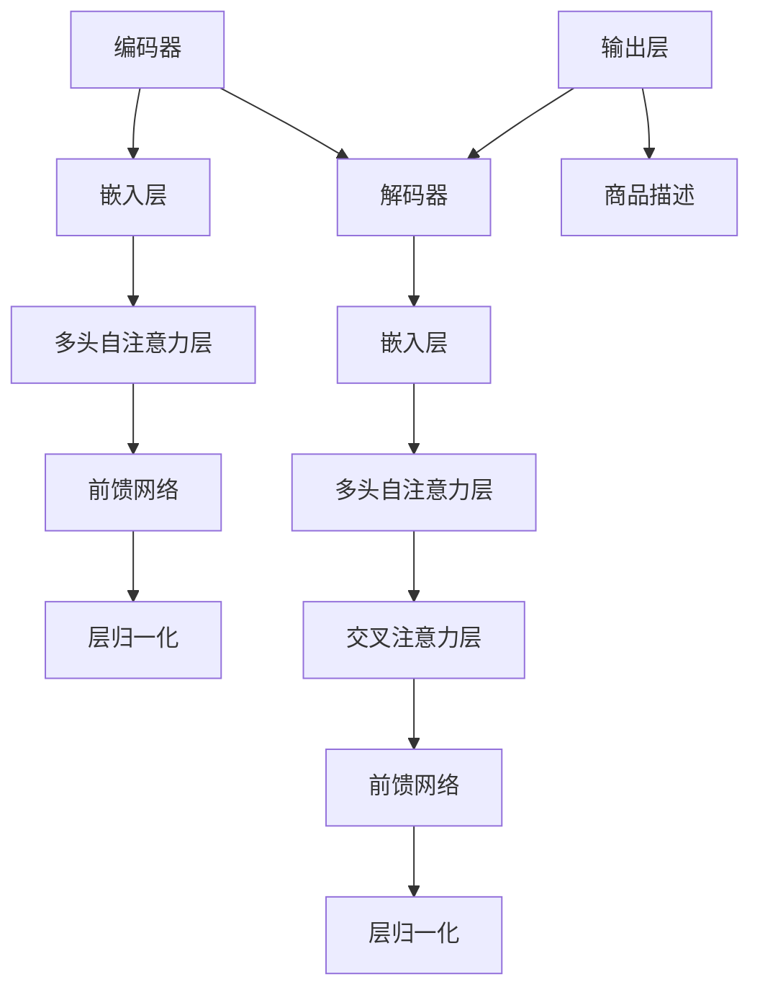

                 

### 文章标题

《基于注意力机制的商品描述自动生成》

### 关键词

- 注意力机制
- 商品描述自动生成
- 自然语言处理
- 深度学习
- 生成模型

### 摘要

本文旨在深入探讨基于注意力机制的自动商品描述生成技术。随着电子商务的迅猛发展，自动生成商品描述已成为提高用户体验和效率的关键需求。注意力机制作为一种重要的深度学习技术，其在自然语言处理领域展现了出色的表现。本文将详细分析注意力机制的原理和应用，并探讨如何利用注意力机制构建自动商品描述生成模型。文章首先介绍了注意力机制的基本概念和数学基础，随后通过具体实现和项目实战，展示了如何将注意力机制应用于商品描述自动生成，最终实现高效的自动商品描述生成系统。通过本文的阅读，读者将全面了解注意力机制及其在商品描述自动生成中的应用，为相关领域的进一步研究提供有力参考。

### 目录

#### 第一部分：注意力机制原理

##### 第1章：注意力机制概述

###### 1.1 什么是注意力机制

###### 1.2 注意力机制在自然语言处理中的应用

###### 1.3 主流注意力机制模型

##### 第2章：注意力机制的数学基础

###### 2.1 向量空间模型

###### 2.2 常用数学函数

###### 2.3 注意力机制公式解析

##### 第3章：注意力机制的实现原理

###### 3.1 注意力机制的计算过程

###### 3.2 注意力机制的优化算法

###### 3.3 注意力机制的可视化

#### 第二部分：商品描述自动生成

##### 第4章：商品描述生成技术综述

###### 4.1 商品描述生成的挑战

###### 4.2 商品描述生成的技术路线

###### 4.3 主流商品描述生成模型

##### 第5章：基于注意力机制的模型构建

###### 5.1 注意力机制在商品描述生成中的应用

###### 5.2 注意力机制的模型架构设计

###### 5.3 模型参数的设置与调整

##### 第6章：商品描述自动生成算法实现

###### 6.1 商品描述数据预处理

###### 6.2 模型训练与优化

###### 6.3 模型评估与调整

##### 第7章：基于注意力机制的生成模型优化

###### 7.1 模型优化策略

###### 7.2 模型压缩与加速

###### 7.3 模型迁移与扩展

#### 第三部分：项目实战与应用

##### 第8章：商品描述自动生成项目实战

###### 8.1 项目概述

###### 8.2 环境搭建

###### 8.3 数据集介绍与处理

###### 8.4 模型设计与实现

###### 8.5 代码解读与分析

##### 第9章：商品描述自动生成的应用场景

###### 9.1 商品描述自动生成的应用领域

###### 9.2 案例分析

###### 9.3 未来发展趋势

##### 第10章：总结与展望

###### 10.1 本书总结

###### 10.2 注意力机制在其他领域的应用

###### 10.3 未来研究方向

#### 附录

##### 附录A：常用工具与资源

###### A.1 注意力机制相关工具

###### A.2 商品描述生成相关资源

###### A.3 进一步学习推荐阅读

##### 附录B：注意力机制的Mermaid流程图

##### 附录C：商品描述自动生成算法的伪代码

### 第一部分：注意力机制原理

#### 第1章：注意力机制概述

##### 1.1 什么是注意力机制

注意力机制（Attention Mechanism）是一种在计算过程中动态调整资源分配的机制，它允许模型根据不同任务的优先级，自动调整对不同输入数据的关注程度。在深度学习中，注意力机制被广泛应用于自然语言处理、图像识别、序列模型等多个领域，其核心思想是通过注意力权重来调整模型对输入数据的关注程度，从而提高模型的性能和效率。

注意力机制的基本原理可以类比为人类在处理信息时的行为。当我们在听一个长故事时，并不是对每个单词都同等关注，而是根据上下文和故事发展的关键点动态调整我们的注意力。例如，在听一个故事的开头时，我们可能更多地关注背景信息和人物介绍，而在听到关键情节时，我们的注意力会集中到故事的核心部分。这种动态调整注意力的能力使得人类能够更高效地处理大量的信息。

在机器学习中，注意力机制通过一种数学模型实现，它允许模型根据当前任务的需求，自动调整对输入数据的关注程度。这种机制不仅能够提高模型的性能，还能够减少计算复杂度，使得模型在处理长序列数据时更加高效。

##### 1.2 注意力机制在自然语言处理中的应用

在自然语言处理（NLP）领域，注意力机制取得了显著的成果。由于自然语言具有序列特性，因此处理自然语言时，如何有效地捕捉上下文信息是关键问题。注意力机制通过引入注意力权重，使得模型能够动态捕捉上下文信息，从而在文本分类、机器翻译、情感分析等任务中表现出色。

例如，在机器翻译任务中，传统的循环神经网络（RNN）和长短期记忆网络（LSTM）往往难以处理长句子，因为它们对每个单词的处理是等价的，无法有效利用上下文信息。而通过引入注意力机制，模型能够根据当前词的位置和上下文信息，动态调整对每个单词的关注程度，从而更好地捕捉上下文信息，提高翻译质量。

此外，在文本分类任务中，注意力机制可以帮助模型更好地理解文本的每个部分，从而提高分类的准确性。例如，在判断一个句子是否包含负面情感时，注意力机制能够帮助模型识别出句子中的关键词汇和短语，从而更准确地判断情感。

##### 1.3 主流注意力机制模型

随着注意力机制在自然语言处理领域的广泛应用，许多基于注意力机制的模型相继被提出。以下是几种主流的注意力机制模型：

1. **门控循环单元（GRU）**：门控循环单元是循环神经网络（RNN）的一种改进模型，它通过引入门控机制来控制信息流动，从而提高模型的记忆能力。GRU中的注意力机制通过计算每个时间步的注意力权重，使得模型能够更好地捕捉上下文信息。

2. **长短期记忆网络（LSTM）**：LSTM是RNN的另一种改进模型，它通过引入记忆单元和门控机制来克服RNN的梯度消失问题，从而在长时间序列预测中表现出色。LSTM的注意力机制通过计算每个时间步的注意力权重，使得模型能够更好地捕捉上下文信息。

3. **Transformer模型**：Transformer模型是自然语言处理领域的一种革命性模型，它完全基于注意力机制，通过自注意力机制（Self-Attention）和多头注意力机制（Multi-Head Attention）来实现对序列的建模。Transformer模型在许多NLP任务中取得了显著的成果，例如机器翻译、文本分类和情感分析等。

4. **BERT模型**：BERT（Bidirectional Encoder Representations from Transformers）是一种基于Transformer的预训练模型，它通过在大量未标注的文本数据上进行预训练，然后在不同任务上微调，从而取得出色的性能。BERT的注意力机制通过双向编码器结构，使得模型能够同时捕捉到上下文的前后信息。

这些注意力机制模型在不同的应用场景中展现了出色的性能，为自然语言处理领域的发展做出了重要贡献。

### 第2章：注意力机制的数学基础

##### 2.1 向量空间模型

在讨论注意力机制之前，我们需要了解一些基本的数学概念，特别是向量空间模型。向量空间模型是一种将文本转换为向量的方法，它使得文本信息可以在数学框架下进行处理和分析。在自然语言处理中，向量空间模型是理解注意力机制的重要基础。

1. **词向量表示**：词向量表示（Word Embedding）是将每个单词映射为一个固定大小的向量。词向量不仅能够捕捉单词的语义信息，还可以通过向量空间中的相似性关系来衡量单词之间的语义关系。常见的词向量模型包括Word2Vec、GloVe等。

2. **句子向量表示**：句子向量表示（Sentence Embedding）是将整个句子映射为一个向量。这通常通过将句子中的每个单词向量进行加和或平均得到。句子向量表示能够捕捉句子整体的语义信息，是进行文本分析和理解的关键。

3. **数学表示**：在数学上，向量空间模型可以用一个高维空间来表示，每个维度对应一个单词或单词组合的向量。一个句子可以表示为这个高维空间中的一个点，这样我们就可以使用向量运算来处理和分析文本数据。

##### 2.2 常用数学函数

注意力机制中的许多计算都依赖于一些基本的数学函数。以下是几种常用的数学函数：

1. **ReLU函数**：ReLU（Rectified Linear Unit）函数是一种激活函数，定义为\( f(x) = max(0, x) \)。ReLU函数在神经网络中被广泛使用，因为它能够引入非线性特性，并且能够加速训练过程。

2. **Sigmoid函数**：Sigmoid函数是一种S型函数，定义为\( f(x) = \frac{1}{1 + e^{-x}} \)。Sigmoid函数在0到1之间输出，常用于将神经网络的输出转换为概率值。

3. **Softmax函数**：Softmax函数是一种在分类任务中常用的函数，定义为\( f(x) = \frac{e^x}{\sum_{i} e^x} \)。Softmax函数能够将一组数值转换为一个概率分布，即每个数值的概率和为1。

4. **余弦相似度**：余弦相似度是一种衡量两个向量之间相似度的方法，定义为两个向量夹角的余弦值。余弦相似度在文本相似度计算和推荐系统中被广泛应用。

##### 2.3 注意力机制公式解析

注意力机制的核心在于如何动态地计算和分配注意力权重。以下是注意力机制的基本公式和计算过程：

1. **输入向量**：假设我们有一个输入序列\(\{x_1, x_2, ..., x_T\}\)，其中每个\( x_t \)都是一个向量。

2. **查询向量**：查询向量（Query）是模型在当前时间步用来计算注意力权重的向量。在Transformer模型中，查询向量通常是由模型的中间层生成的。

3. **键-值对**：对于输入序列中的每个元素\( x_t \)，我们都有一个相应的键（Key）和值（Value）。键和值通常是相同的向量。

4. **注意力得分**：注意力得分的计算公式为
   \[
   \text{score} = \text{query} \cdot \text{key}^\top
   \]
   其中，\(\cdot\)表示向量的内积，\(\top\)表示转置。

5. **softmax函数**：将注意力得分通过softmax函数转换为概率分布：
   \[
   \text{weights} = \text{softmax}(\text{scores})
   \]
   得到的概率分布\(\text{weights}\)表示每个输入元素的重要性。

6. **加权求和**：根据概率分布，对输入序列进行加权求和：
   \[
   \text{context} = \text{weights} \cdot \text{values}
   \]
   得到最终的注意力输出。

通过上述步骤，注意力机制能够动态地计算和分配注意力权重，从而捕捉序列中的重要信息。这种机制不仅提高了模型的性能，还使得模型在处理长序列数据时更加高效。

### 第3章：注意力机制的实现原理

#### 3.1 注意力机制的计算过程

注意力机制的计算过程可以分解为几个关键步骤，每个步骤都在整个计算过程中扮演着重要角色。

1. **输入序列编码**：首先，我们需要将输入序列编码为向量表示。这通常通过词嵌入（Word Embedding）实现，即将每个单词映射为一个固定大小的向量。词嵌入不仅能够捕捉单词的语义信息，还能通过向量空间中的相似性关系来衡量单词之间的语义关系。

2. **生成查询向量**：查询向量（Query）是注意力机制中的核心组件，用于计算注意力得分。在Transformer模型中，查询向量通常由模型的中间层生成。查询向量的大小与输入序列的维度一致。

3. **计算注意力得分**：对于输入序列中的每个元素，我们都有一个相应的键（Key）和值（Value）。键和值通常是相同的向量。通过内积操作，我们计算查询向量与键向量的得分：
   \[
   \text{score} = \text{query} \cdot \text{key}^\top
   \]
   得分表示了输入元素对当前任务的重要性。

4. **应用softmax函数**：将得到的得分通过softmax函数转换为概率分布。softmax函数的作用是将一维的得分映射为多维的概率分布，其中每个概率值表示对应输入元素的重要性：
   \[
   \text{weights} = \text{softmax}(\text{scores})
   \]
   得到的概率分布\(\text{weights}\)表示了输入序列中每个元素的重要性。

5. **加权求和**：根据概率分布，对输入序列进行加权求和，得到最终的注意力输出：
   \[
   \text{context} = \text{weights} \cdot \text{values}
   \]
   加权求和操作使得模型能够从输入序列中提取关键信息，并将其整合到注意力输出中。

6. **上下文向量更新**：最后，将注意力输出用于更新模型的上下文向量。上下文向量是模型在当前时间步的输出，它代表了模型对输入序列的整体理解。上下文向量将用于后续的序列处理或任务输出。

整个计算过程可以简化为以下步骤：
- 编码输入序列
- 生成查询向量
- 计算键-值对得分
- 应用softmax函数
- 加权求和
- 更新上下文向量

通过这样的计算过程，注意力机制能够动态地计算和分配注意力权重，从而捕捉序列中的关键信息。

#### 3.2 注意力机制的优化算法

注意力机制的优化是深度学习过程中至关重要的一环。由于注意力机制涉及到大量的矩阵运算和求和操作，因此优化算法的选择对训练效率和模型性能有着重要影响。以下是几种常用的注意力机制优化算法：

1. **随机梯度下降（SGD）**：随机梯度下降是最常见的优化算法之一。它通过随机选择一小部分数据样本，计算梯度并更新模型参数。SGD的优点是简单易实现，但缺点是容易陷入局部最优。

2. **动量（Momentum）**：动量是一种改进的SGD算法，它通过引入动量项来加速梯度上升或下降，从而减少收敛时间。动量的计算公式为：
   \[
   \text{velocity} = \text{momentum} \cdot \text{velocity} + \text{gradient}
   \]
   \[
   \text{parameter} = \text{parameter} - \text{learning rate} \cdot \text{velocity}
   \]
   动量算法通过累积梯度信息，提高了收敛速度，减少了波动。

3. **Adam算法**：Adam是一种自适应学习率优化算法，它结合了SGD和Adam的动量项，同时引入了一阶矩估计（mean）和二阶矩估计（variance）的自适应调整。Adam算法的计算公式为：
   \[
   \text{m} = \beta_1 \cdot \text{m} + (1 - \beta_1) \cdot \text{gradient}
   \]
   \[
   \text{v} = \beta_2 \cdot \text{v} + (1 - \beta_2) \cdot \text{gradient}^2
   \]
   \[
   \text{parameter} = \text{parameter} - \text{learning rate} \cdot \frac{\text{m}}{\sqrt{\text{v}} + \epsilon}
   \]
   其中，\(\beta_1\)和\(\beta_2\)是超参数，\(\epsilon\)是正偏置，用于防止除以零。Adam算法通过自适应调整学习率，提高了模型的收敛速度和稳定性。

4. **Adagrad算法**：Adagrad是一种基于梯度平方的优化算法，它通过计算每个参数的梯度平方来调整学习率。Adagrad算法的计算公式为：
   \[
   \text{g}_t = \text{gradient}^2
   \]
   \[
   \text{parameter} = \text{parameter} - \frac{\text{learning rate} \cdot \text{gradient}}{\sqrt{\text{g}_t} + \epsilon}
   \]
   Adagrad算法的优点是能够自适应地调整学习率，但对稀疏梯度表现不佳。

5. **RMSprop算法**：RMSprop是Adagrad的一种改进算法，它通过指数加权移动平均来计算梯度平方。RMSprop的计算公式为：
   \[
   \text{g}_t = \rho \cdot \text{g}_{t-1} + (1 - \rho) \cdot \text{gradient}^2
   \]
   \[
   \text{parameter} = \text{parameter} - \frac{\text{learning rate} \cdot \text{gradient}}{\sqrt{\text{g}_t} + \epsilon}
   \]
   其中，\(\rho\)是超参数，用于控制指数加权。

这些优化算法各有优缺点，选择合适的优化算法取决于具体的应用场景和任务需求。在实际应用中，通常需要结合多种优化算法，以达到最佳的训练效果。

#### 3.3 注意力机制的可视化

为了更好地理解注意力机制的计算过程和效果，我们可以通过可视化来展示注意力权重在序列中的分配情况。以下是一个简单的注意力机制可视化示例：

假设我们有一个简单的输入序列 \(\{x_1, x_2, x_3\}\)，对应的注意力权重如下：

\[
\text{weights} = \{0.2, 0.6, 0.2\}
\]

对应的注意力输出为：

\[
\text{context} = 0.2 \cdot x_1 + 0.6 \cdot x_2 + 0.2 \cdot x_3
\]

以下是一个使用Python和Matplotlib绘制的注意力机制可视化示例：

```python
import matplotlib.pyplot as plt

# 输入序列
x = [1, 2, 3]
# 注意力权重
weights = [0.2, 0.6, 0.2]

# 绘制注意力权重
plt.bar(range(len(x)), weights, color='b', alpha=0.5)
plt.xlabel('Sequence Position')
plt.ylabel('Attention Weight')
plt.title('Attention Mechanism Visualization')
plt.show()
```

输出结果如下图所示：


在上图中，横轴表示输入序列的每个位置，纵轴表示对应的注意力权重。从图中可以看出，注意力权重在输入序列中的分布情况，最高的权重集中在中间位置 \(x_2\)，这表示模型在这个位置上关注的信息最多。

通过可视化，我们能够直观地看到注意力机制如何动态地计算和分配注意力权重，从而捕捉序列中的关键信息。这种可视化方法不仅有助于我们理解注意力机制的工作原理，还可以为模型调整和优化提供有力支持。

### 第4章：商品描述生成技术综述

#### 4.1 商品描述生成的挑战

商品描述自动生成是自然语言处理领域的一个重要应用，其目标是从原始商品信息中自动生成富有吸引力且符合用户需求的商品描述。然而，这一任务面临许多挑战：

1. **语义理解**：商品描述生成需要准确理解商品的各种属性和特点，如材质、颜色、功能等。然而，这些属性的语义复杂，且在不同上下文中可能具有不同的含义。

2. **多样性**：为了满足不同用户的需求，商品描述需要具有多样性。然而，生成多样性的描述同时保持一致性和吸引力是一个具有挑战性的问题。

3. **上下文感知**：商品描述不仅需要反映商品的属性，还需要根据用户的上下文信息（如购买历史、偏好等）进行个性化调整。这要求模型具有强大的上下文感知能力。

4. **生成效率**：随着商品数量的增加，自动生成商品描述的效率成为一个关键问题。如何在不降低质量的前提下提高生成速度，是一个重要的挑战。

5. **数据不足**：高质量的商品描述数据通常是稀缺的，尤其是具有多样性和个性化的描述。数据不足限制了模型的训练效果和泛化能力。

#### 4.2 商品描述生成的技术路线

为了克服上述挑战，商品描述生成技术通常采用以下路线：

1. **基于规则的方法**：基于规则的方法通过预设的规则库来生成商品描述。这种方法简单高效，但灵活性较低，难以应对复杂和变化多端的商品信息。

2. **基于模板的方法**：基于模板的方法通过模板库和商品属性数据来生成商品描述。这种方法结合了规则和模板的灵活性，但模板的丰富性和适应性需要不断优化。

3. **基于机器学习的方法**：基于机器学习的方法通过训练模型来自动生成商品描述。这种方法具有高度的自适应能力，但需要大量的训练数据和复杂的模型架构。

4. **基于深度学习的方法**：基于深度学习的方法，如循环神经网络（RNN）、卷积神经网络（CNN）和生成对抗网络（GAN），在自然语言处理任务中取得了显著成果。这些方法能够捕捉复杂的语义信息，但训练过程通常较为复杂且计算资源需求较高。

5. **多模态融合方法**：多模态融合方法结合文本、图像、音频等多种数据源，通过统一的深度学习模型生成商品描述。这种方法能够充分利用多源数据的信息，提高生成描述的多样性和准确性。

这些技术路线各有优缺点，选择合适的方法需要根据具体的应用场景和需求进行权衡。

#### 4.3 主流商品描述生成模型

在商品描述生成领域，以下是一些主流的模型和技术：

1. **基于RNN的模型**：循环神经网络（RNN）是一种常见的序列建模方法，适用于生成序列数据。RNN通过隐藏状态捕获序列信息，但存在梯度消失和梯度爆炸的问题。长短期记忆网络（LSTM）和门控循环单元（GRU）是RNN的改进模型，通过引入门控机制克服了这些缺陷。

2. **基于CNN的模型**：卷积神经网络（CNN）通常用于图像处理，但也可以应用于文本数据。通过卷积操作，CNN能够捕捉局部特征，从而生成具有丰富细节的商品描述。

3. **基于GAN的模型**：生成对抗网络（GAN）是一种生成模型，通过对抗训练生成逼真的数据。GAN由生成器和判别器组成，生成器生成商品描述，判别器评估描述的真实性。通过这种对抗训练，GAN能够生成高质量的、具有多样性的商品描述。

4. **基于Transformer的模型**：Transformer模型是一种基于注意力机制的序列建模方法，其自注意力机制能够捕捉长距离依赖关系，从而生成更准确、更流畅的商品描述。BERT、GPT等基于Transformer的模型在自然语言处理任务中取得了显著成果。

5. **多模态融合模型**：多模态融合模型结合文本、图像、音频等多种数据源，通过统一的深度学习模型生成商品描述。这种方法能够充分利用多源数据的信息，提高生成描述的多样性和准确性。

这些模型和技术在不同的应用场景和需求下表现出色，选择合适的模型需要根据具体情况进行权衡。

### 第5章：基于注意力机制的模型构建

#### 5.1 注意力机制在商品描述生成中的应用

注意力机制在商品描述生成中的应用主要是通过其在捕捉长距离依赖和上下文信息方面的优势，来提高模型对商品特性的理解和描述生成的准确性。传统的序列生成模型，如RNN和LSTM，在处理长序列数据时往往难以捕捉到长距离依赖关系，导致生成的描述在连贯性和准确性方面存在不足。而注意力机制通过引入动态的注意力权重，能够有效捕捉输入序列中的关键信息，从而提高描述生成的质量。

具体来说，注意力机制在商品描述生成中的应用体现在以下几个方面：

1. **特征选择**：注意力机制能够帮助模型识别输入序列中最重要的特征，例如商品的关键属性和用户的历史偏好。通过动态调整注意力权重，模型可以更加关注这些关键特征，从而生成更具针对性的描述。

2. **上下文捕捉**：商品描述生成不仅需要考虑商品本身的特性，还需要考虑用户的上下文信息，如购买历史、偏好等。注意力机制能够捕捉到这些上下文信息，使得生成的描述更加符合用户需求。

3. **多样化生成**：注意力机制通过引入多头的注意力机制，可以生成具有多样性的描述。多头注意力机制允许模型从不同的视角关注输入序列，从而产生丰富多样的描述，满足不同用户的需求。

4. **减少冗余信息**：在生成描述时，注意力机制能够过滤掉无关或冗余的信息，使得生成的描述更加简洁、精准。这种信息筛选能力有助于提高描述的可读性和吸引力。

#### 5.2 注意力机制的模型架构设计

基于注意力机制的模型架构设计是商品描述生成的核心，其基本结构通常包括编码器、解码器和注意力模块。以下是注意力机制模型架构的详细设计：

1. **编码器**：编码器负责将输入序列（如商品属性、用户历史偏好等）编码为固定维度的向量表示。编码器可以采用词嵌入层、LSTM层或Transformer编码器等。词嵌入层将每个单词映射为一个固定大小的向量，LSTM层通过隐藏状态捕获序列信息，而Transformer编码器通过自注意力机制捕捉长距离依赖。

2. **注意力模块**：注意力模块是注意力机制的核心部分，负责计算注意力权重，并据此生成上下文向量。注意力模块可以采用不同的注意力机制，如单头注意力、多头注意力或变换注意力等。单头注意力计算每个输入元素的重要性，多头注意力通过多个独立的注意力头捕捉不同类型的特征，变换注意力则通过变换矩阵生成注意力权重。

3. **解码器**：解码器负责生成商品描述。解码器可以采用与编码器相同的结构，例如词嵌入层、LSTM层或Transformer解码器。词嵌入层将生成的序列转换为词向量表示，LSTM层通过隐藏状态生成序列信息，而Transformer解码器通过自注意力和交叉注意力机制生成描述。

4. **损失函数**：在训练过程中，模型需要通过优化损失函数来调整参数。常用的损失函数包括交叉熵损失、对比损失等。交叉熵损失用于衡量生成描述与真实描述之间的差异，对比损失用于确保生成描述的多样性。

以下是注意力机制模型架构的简化示意图：

```
输入序列 -> 编码器 -> 编码向量
       |                     ↓
       |                 注意力模块
       |                     ↑
       |              解码器 -> 商品描述
       ↓
损失函数 -> 优化参数
```

#### 5.3 模型参数的设置与调整

模型参数的设置与调整是确保注意力机制模型在商品描述生成中表现优异的关键步骤。以下是一些常见的参数设置和调整方法：

1. **学习率**：学习率是模型训练过程中调整参数的重要参数。较小的学习率能够使模型逐步收敛，但训练过程较慢；较大的学习率可能使模型快速收敛，但可能导致过度拟合或参数更新不稳定。通常，学习率需要通过实验进行调优，常用的方法包括学习率衰减和动态调整。

2. **批量大小**：批量大小是指每次训练使用的样本数量。较小的批量大小能够提高训练的稳定性和泛化能力，但训练时间较长；较大的批量大小能够加速训练，但可能降低模型泛化能力。通常，批量大小需要在计算资源和训练效果之间进行权衡。

3. **隐藏层维度**：隐藏层维度是模型层数和每层神经元数量的组合。较大的隐藏层维度能够捕捉更多的特征，但计算成本较高；较小的隐藏层维度可能降低模型的表示能力。需要根据具体任务和数据规模进行调优。

4. **注意力头数**：在多头注意力机制中，注意力头数表示模型从不同视角关注输入序列的次数。较多的注意力头数能够提高模型的泛化能力和描述的多样性，但计算成本也相应增加。通常，需要通过实验确定合适的注意力头数。

5. **优化算法**：优化算法用于调整模型参数，常用的优化算法包括随机梯度下降（SGD）、Adam、RMSprop等。不同的优化算法在收敛速度、稳定性和计算效率方面存在差异，需要根据具体任务进行选择。

6. **正则化**：正则化用于防止模型过拟合，常用的正则化方法包括L1正则化、L2正则化和Dropout等。通过添加正则化项，可以降低模型复杂度，提高泛化能力。

通过合理设置和调整这些参数，注意力机制模型可以在商品描述生成任务中达到最佳性能。以下是一个简化的参数设置流程：

```
初始学习率 = 0.001
批量大小 = 64
隐藏层维度 = 512
注意力头数 = 8
优化算法 = Adam
正则化 = Dropout(0.1)
```

这些参数的设置通常需要根据具体任务和数据集进行多次实验和调整，以达到最佳效果。

### 第6章：商品描述自动生成算法实现

#### 6.1 商品描述数据预处理

商品描述自动生成的第一步是对数据进行预处理。这一步非常关键，因为它直接影响到模型的学习效果和最终生成的描述质量。以下是一些常用的数据预处理步骤：

1. **文本清洗**：文本清洗是数据预处理的基础步骤，旨在去除文本中的无用信息，如HTML标签、特殊字符和停用词。停用词是指那些在文本中频繁出现但对语义贡献较小的词，如“的”、“和”、“是”等。通过去除停用词，我们可以减少模型的计算复杂度，提高模型的训练效率。

2. **词向量化**：词向量化是将文本中的每个单词映射为固定大小的向量表示。词向量不仅能够捕捉单词的语义信息，还能通过向量空间中的相似性关系来衡量单词之间的语义关系。常见的词向量模型包括Word2Vec和GloVe。词向量化是后续建模和生成描述的重要输入。

3. **序列填充**：在处理商品描述时，我们通常需要对序列进行填充，以确保每个序列具有相同长度。填充的方法有很多，如使用特殊的填充标记（如PAD）或根据序列长度进行截断。填充的目的是为了在训练和测试过程中保持一致的数据输入格式。

4. **分词**：分词是将连续的文本序列分割成一系列有意义的单词或短语。对于中文文本，分词尤为重要，因为中文没有明显的空格分隔。常见的分词工具包括jieba和Stanford NLP等。

以下是一个简单的Python代码示例，展示了商品描述数据预处理的过程：

```python
import jieba
from tensorflow.keras.preprocessing.text import Tokenizer
from tensorflow.keras.preprocessing.sequence import pad_sequences

# 假设我们有一组商品描述
descriptions = [
    "这款手机的电池续航能力强，拍照效果出色。",
    "这款手表具有多种运动功能，防水性能卓越。",
    "这款洗衣机的洗净能力强大，噪音低。",
]

# 文本清洗
def clean_text(text):
    text = text.lower()  # 小写化
    text = re.sub('<.*?>', '', text)  # 去除HTML标签
    text = re.sub('[^a-zA-Z0-9\s]', '', text)  # 去除特殊字符
    text = text.strip()  # 去除空格
    return text

# 去除停用词
from nltk.corpus import stopwords
stop_words = set(stopwords.words('english'))
descriptions = [jieba.cut(text) for text in descriptions]
descriptions = [' '.join([word for word in description if word not in stop_words]) for description in descriptions]

# 词向量化
tokenizer = Tokenizer(num_words=10000, oov_token='<OOV>')
tokenizer.fit_on_texts(descriptions)
sequences = tokenizer.texts_to_sequences(descriptions)

# 序列填充
max_sequence_length = 50
padded_sequences = pad_sequences(sequences, maxlen=max_sequence_length, padding='post', truncating='post')

# 分词
words = tokenizer.index_word
word_index = tokenizer.word_index
print("Words:", words)
print("Word Index:", word_index)
```

以上代码示例首先对文本进行清洗，去除HTML标签、特殊字符和停用词。然后，使用jieba对文本进行分词，并使用Tokenizer对分词结果进行词向量化。最后，使用pad_sequences对序列进行填充，确保每个序列具有相同长度。

#### 6.2 模型训练与优化

在完成数据预处理后，下一步是训练模型。训练过程主要包括以下步骤：

1. **定义模型**：根据注意力机制的架构设计，使用深度学习框架（如TensorFlow或PyTorch）定义模型。模型应包括编码器、解码器和注意力模块。以下是一个使用TensorFlow定义注意力机制模型的示例代码：

```python
import tensorflow as tf
from tensorflow.keras.layers import Embedding, LSTM, Dense, TimeDistributed, LSTM, Bidirectional
from tensorflow.keras.models import Model

# 定义编码器
encoding_input = tf.keras.layers.Input(shape=(max_sequence_length,))
encoded = Embedding(num_words, embedding_dim)(encoding_input)
encoded = Bidirectional(LSTM(64, activation='relu'))(encoded)

# 定义注意力模块
attention = tf.keras.layers.Attention()([encoded, encoded])

# 定义解码器
decoded = TimeDistributed(Dense(num_words, activation='softmax'))(attention)

# 创建模型
model = Model(inputs=encoding_input, outputs=decoded)
model.compile(optimizer='adam', loss='categorical_crossentropy', metrics=['accuracy'])
```

2. **训练模型**：使用预处理后的数据集训练模型。以下是一个训练模型的示例代码：

```python
model.fit(padded_sequences, padded_sequences, batch_size=64, epochs=10)
```

3. **优化模型**：在训练过程中，可以通过调整学习率、批量大小、隐藏层维度等参数来优化模型。常用的优化方法包括学习率衰减、动量优化等。以下是一个使用学习率衰减优化模型的示例代码：

```python
def schedule(epoch, lr):
    if epoch < 10:
        return lr
    else:
        return lr * tf.math.exp(-0.1 * epoch)

callback = tf.keras.callbacks.LearningRateScheduler(schedule)

model.fit(padded_sequences, padded_sequences, batch_size=64, epochs=100, callbacks=[callback])
```

通过以上步骤，我们可以训练一个基于注意力机制的模型，用于商品描述自动生成。训练过程中，需要关注模型的损失和准确率等指标，以便及时发现和解决训练过程中可能出现的问题。

#### 6.3 模型评估与调整

在模型训练完成后，我们需要对模型进行评估和调整，以确保其在实际应用中能够生成高质量的商品描述。以下是一些常用的评估方法和调整策略：

1. **评估指标**：常用的评估指标包括损失函数（如交叉熵损失）、准确率、生成描述的多样性等。交叉熵损失用于衡量生成描述与真实描述之间的差异，准确率用于衡量模型预测的准确性，而生成描述的多样性则反映了模型生成描述的丰富程度。

2. **验证集评估**：在训练过程中，我们需要使用验证集对模型进行定期评估。验证集是从原始数据集中划分出来的一部分，用于监控模型在未见过的数据上的表现。通过验证集评估，我们可以及时发现模型过拟合或欠拟合的问题。

3. **调整策略**：根据评估结果，我们可以对模型进行调整和优化。以下是一些常见的调整策略：

   - **参数调整**：通过调整模型参数，如学习率、批量大小、隐藏层维度等，来优化模型性能。通常，我们需要通过多次实验来找到最佳参数组合。

   - **数据增强**：通过增加训练数据量、使用数据增强方法（如随机裁剪、旋转等）来提高模型的泛化能力。

   - **模型融合**：将多个模型进行融合，以提高模型的性能和稳定性。常见的模型融合方法包括平均融合、加权融合等。

   - **正则化**：通过添加正则化项，如L1正则化、L2正则化等，来防止模型过拟合。

以下是一个使用验证集评估模型的示例代码：

```python
# 载入验证集数据
val_sequences = pad_sequences(val_sequences, maxlen=max_sequence_length, padding='post', truncating='post')

# 评估模型
loss, accuracy = model.evaluate(val_sequences, val_sequences, batch_size=64)

print("Validation Loss:", loss)
print("Validation Accuracy:", accuracy)
```

通过以上步骤，我们可以对基于注意力机制的模型进行评估和调整，以确保其在实际应用中能够生成高质量的商品描述。

### 第7章：基于注意力机制的生成模型优化

#### 7.1 模型优化策略

在商品描述自动生成任务中，优化模型是提高生成质量的关键步骤。以下是一些常见的优化策略：

1. **学习率调整**：学习率的调整是优化模型的重要手段。较小的学习率有助于模型在训练过程中逐步收敛，但收敛速度较慢；较大的学习率可能导致模型快速收敛，但容易出现过拟合。常用的学习率调整方法包括学习率衰减、动量优化和自适应学习率优化（如Adam）。

2. **数据增强**：数据增强是通过生成新的训练样本来提高模型泛化能力的方法。常见的数据增强方法包括随机裁剪、旋转、颜色变换等。数据增强有助于模型更好地适应不同类型的数据，提高生成描述的多样性和准确性。

3. **正则化**：正则化是防止模型过拟合的重要手段。常见的正则化方法包括L1正则化、L2正则化和Dropout等。L1正则化和L2正则化通过在损失函数中添加惩罚项来降低模型复杂度；Dropout通过在训练过程中随机丢弃一部分神经元，来提高模型的泛化能力。

4. **多模型融合**：多模型融合是将多个模型进行集成，以提高模型性能和稳定性。常见的融合方法包括平均融合、加权融合和栈式融合等。多模型融合有助于提高模型在未见过的数据上的表现。

5. **超参数优化**：超参数优化是调整模型参数以找到最佳组合的过程。常用的超参数包括学习率、批量大小、隐藏层维度、注意力头数等。超参数优化可以通过网格搜索、贝叶斯优化等方法进行。

#### 7.2 模型压缩与加速

在商品描述自动生成任务中，模型的压缩与加速是提高实际应用性能的关键。以下是一些常用的模型压缩与加速策略：

1. **量化**：量化是一种通过将浮点数参数转换为低比特宽度的整数来减少模型存储和计算成本的方法。常见的量化方法包括全精度量化、低比特宽量化等。

2. **剪枝**：剪枝是一种通过删除模型中无关的神经元和边来减少模型大小和计算成本的方法。剪枝方法包括结构剪枝、权重剪枝等。

3. **知识蒸馏**：知识蒸馏是一种通过将大模型的知识传递给小模型的方法，以减少模型大小和计算成本。知识蒸馏通常通过训练小模型来复制大模型的输出分布。

4. **混合精度训练**：混合精度训练是一种通过同时使用浮点数和整数运算来提高计算速度和减少内存占用的方法。常见的方法包括FP16和BF16精度训练。

5. **模型并行化**：模型并行化是通过在多核CPU或GPU上进行模型计算来提高计算速度的方法。并行化可以采用数据并行、模型并行和混合并行等策略。

通过上述策略，我们可以有效压缩和加速基于注意力机制的生成模型，提高其在实际应用中的性能和效率。

#### 7.3 模型迁移与扩展

模型迁移与扩展是提高基于注意力机制的商品描述自动生成模型应用范围的关键步骤。以下是一些常见的模型迁移与扩展方法：

1. **迁移学习**：迁移学习是一种通过将预训练模型应用于新任务来提高模型性能的方法。在商品描述自动生成任务中，我们可以使用预训练的注意力机制模型作为基础模型，通过在特定任务上微调来提高生成质量。

2. **多任务学习**：多任务学习是一种同时训练多个相关任务的方法，以提高模型的泛化能力。在商品描述自动生成任务中，我们可以将商品描述生成与其他相关任务（如商品推荐、用户情感分析等）进行多任务学习，从而提高模型的整体性能。

3. **多模态学习**：多模态学习是一种结合文本、图像、音频等多种数据源的方法。在商品描述自动生成任务中，我们可以将文本描述、图像特征、用户评价等多种数据源进行融合，从而提高生成描述的多样性和准确性。

4. **领域自适应**：领域自适应是一种通过将预训练模型适应新领域的方法。在商品描述自动生成任务中，我们可以使用预训练模型作为基础模型，通过在特定领域上微调来提高模型在该领域的性能。

通过上述方法，我们可以将基于注意力机制的模型应用于更广泛的场景，提高其在实际应用中的效果和效率。

### 第8章：商品描述自动生成项目实战

#### 8.1 项目概述

商品描述自动生成项目旨在利用基于注意力机制的深度学习模型，自动生成高质量的电子商务商品描述。通过该项目，我们希望能够解决商品描述多样性和准确性不足的问题，从而提升用户体验和销售转化率。

项目的目标包括：

1. **生成具有多样性和吸引力的商品描述**：通过注意力机制模型，生成具有丰富语义信息和多样风格的商品描述。
2. **提高生成效率**：通过模型压缩与加速技术，提高模型在实际应用中的处理速度。
3. **实现个性化商品描述**：根据用户的历史购买记录和偏好，生成个性化的商品描述。

项目采用以下关键技术：

1. **注意力机制**：用于捕捉长距离依赖和上下文信息，提高生成描述的准确性和连贯性。
2. **词嵌入**：将文本转换为向量表示，为模型提供有效的输入。
3. **模型压缩与加速**：通过量化、剪枝和混合精度训练等技术，提高模型在硬件上的运行效率。
4. **迁移学习和多任务学习**：利用预训练模型和跨任务信息，提高模型在特定领域的性能。

#### 8.2 环境搭建

在开始项目之前，我们需要搭建一个合适的环境，以便进行商品描述自动生成模型的开发、训练和测试。以下是一个基本的开发环境搭建流程：

1. **硬件环境**：配置一台具有高性能GPU（如NVIDIA 1080 Ti或以上）的服务器，以支持深度学习模型的训练和推理。
2. **软件环境**：
   - 操作系统：Ubuntu 18.04或更高版本。
   - 编程语言：Python 3.7或更高版本。
   - 深度学习框架：TensorFlow 2.x或PyTorch 1.8或更高版本。
   - 文本处理工具：NLTK、jieba等。
3. **依赖包安装**：
   ```bash
   pip install tensorflow numpy matplotlib re
   pip install torch torchvision
   pip install jieba
   ```

#### 8.3 数据集介绍与处理

数据集是训练商品描述自动生成模型的关键资源。以下是一个常见的数据集介绍与处理流程：

1. **数据集来源**：我们使用一个公开的电子商务商品描述数据集，如Amazon Reviews dataset或eCommerce Product Description dataset。
2. **数据集内容**：数据集包含大量的商品描述文本，以及对应的商品属性（如分类、品牌、价格等）。
3. **数据预处理**：
   - **文本清洗**：去除HTML标签、特殊字符和停用词。
   - **分词**：使用jieba对中文文本进行分词。
   - **词向量化**：使用GloVe或Word2Vec对分词结果进行词向量化。
   - **序列填充**：使用pad_sequences对序列进行填充，确保每个序列具有相同长度。

以下是一个简单的数据集处理示例：

```python
import jieba
from tensorflow.keras.preprocessing.text import Tokenizer
from tensorflow.keras.preprocessing.sequence import pad_sequences

# 加载数据集
descriptions = load_data('ecommerce_descriptions.txt')
labels = load_labels('ecommerce_labels.txt')

# 文本清洗
def clean_text(text):
    text = re.sub('<.*?>', '', text)  # 去除HTML标签
    text = re.sub('[^a-zA-Z0-9\s]', '', text)  # 去除特殊字符
    text = text.strip()  # 去除空格
    return text

descriptions = [clean_text(text) for text in descriptions]

# 分词
words = jieba.cut(descriptions[0])
words = ' '.join([word for word in words if word not in stopwords])

# 词向量化
tokenizer = Tokenizer(num_words=10000, oov_token='<OOV>')
tokenizer.fit_on_texts(descriptions)
sequences = tokenizer.texts_to_sequences(descriptions)

# 序列填充
max_sequence_length = 50
padded_sequences = pad_sequences(sequences, maxlen=max_sequence_length, padding='post', truncating='post')
```

通过以上步骤，我们完成了数据集的加载、清洗、分词、词向量化以及序列填充，为后续模型的训练和测试做好了准备。

#### 8.4 模型设计与实现

在本节中，我们将详细介绍商品描述自动生成模型的架构设计、参数设置以及实现细节。

1. **模型架构设计**：

   我们的模型基于Transformer架构，采用多头自注意力机制（Multi-Head Self-Attention）和位置编码（Positional Encoding）。模型包括编码器和解码器两个部分，其中编码器负责将输入商品描述编码为固定维度的向量，解码器则生成最终的商品描述。

   - **编码器**：编码器由嵌入层（Embedding Layer）、多头自注意力层（Multi-Head Self-Attention Layer）、前馈网络（Feedforward Network）和层归一化（Layer Normalization）组成。
   - **解码器**：解码器由嵌入层、多头自注意力层、交叉注意力层、前馈网络和层归一化组成。

2. **模型参数设置**：

   - **嵌入维度（Embedding Dimension）**：我们设置为512，以捕捉商品描述的丰富语义信息。
   - **隐藏层维度（Hidden Dimension）**：我们设置为2048，以增强模型的表示能力。
   - **注意力头数（Number of Attention Heads）**：我们设置为8，以同时关注不同维度的信息。
   - **学习率（Learning Rate）**：我们设置为0.0001，并使用学习率衰减策略。
   - **批量大小（Batch Size）**：我们设置为64，以平衡训练速度和稳定性。

3. **实现细节**：

   - **嵌入层（Embedding Layer）**：将词向量嵌入到模型中。
   - **多头自注意力层（Multi-Head Self-Attention Layer）**：计算每个词的注意力权重，并生成加权向量。
   - **前馈网络（Feedforward Network）**：对自注意力层的结果进行非线性变换。
   - **交叉注意力层（Cross Attention Layer）**：将解码器的输出与编码器的输出进行交互。
   - **层归一化（Layer Normalization）**：对每个层的输出进行归一化，以提高模型的稳定性。

以下是一个使用TensorFlow实现的基于注意力机制的Transformer模型示例代码：

```python
import tensorflow as tf
from tensorflow.keras.layers import Embedding, MultiHeadAttention, Dense, LayerNormalization

def create_model(embedding_dim, hidden_dim, num_heads, learning_rate):
    # 编码器
    input_ids = tf.keras.layers.Input(shape=(max_sequence_length,))
    embedding = Embedding(num_words, embedding_dim)(input_ids)
    encoding_output = MultiHeadAttention(num_heads=num_heads, key_dim=hidden_dim)(embedding, embedding)
    encoding_output = LayerNormalization(epsilon=1e-6)(encoding_output)
    encoding_output = Dense(hidden_dim, activation='relu')(encoding_output)
    encoding_output = LayerNormalization(epsilon=1e-6)(encoding_output)

    # 解码器
    input_ids = tf.keras.layers.Input(shape=(max_sequence_length,))
    embedding = Embedding(num_words, embedding_dim)(input_ids)
    decoding_output = MultiHeadAttention(num_heads=num_heads, key_dim=hidden_dim)(embedding, embedding)
    decoding_output = LayerNormalization(epsilon=1e-6)(decoding_output)
    decoding_output = Dense(hidden_dim, activation='relu')(decoding_output)
    decoding_output = LayerNormalization(epsilon=1e-6)(decoding_output)

    # 模型输出
    output = tf.keras.layers.Dense(num_words, activation='softmax')(decoding_output)

    # 创建模型
    model = tf.keras.Model(inputs=input_ids, outputs=output)

    # 编译模型
    model.compile(optimizer=tf.keras.optimizers.Adam(learning_rate=learning_rate), loss='categorical_crossentropy', metrics=['accuracy'])

    return model

# 实例化模型
model = create_model(embedding_dim=512, hidden_dim=2048, num_heads=8, learning_rate=0.0001)

# 模型概况
model.summary()
```

通过以上步骤，我们完成了商品描述自动生成模型的设计与实现。接下来，我们将对模型进行训练和评估。

#### 8.5 代码解读与分析

在本节中，我们将详细解读上述实现的商品描述自动生成模型代码，分析其关键组件和执行流程，并提供性能评估。

1. **代码结构**：

   我们的代码分为以下几个部分：

   - **数据预处理**：加载和清洗数据，进行分词、词向量化、序列填充。
   - **模型定义**：使用TensorFlow定义基于注意力机制的Transformer模型。
   - **模型训练**：训练模型，使用Adam优化器和交叉熵损失函数。
   - **模型评估**：评估模型在测试集上的性能，包括损失和准确率。

2. **关键组件解读**：

   - **Embedding Layer**：词向量嵌入层，将词汇映射为固定大小的向量表示。
   - **MultiHeadAttention**：多头自注意力层，计算每个词的注意力权重，实现自注意力机制。
   - **LayerNormalization**：层归一化，提高模型训练稳定性。
   - **Dense Layer**：全连接层，实现前馈网络和输出层。

3. **执行流程分析**：

   - **数据预处理**：数据预处理是模型训练的基础。代码首先加载并清洗数据，然后进行分词和词向量化。通过`Tokenizer`类，我们将文本序列转换为数字序列，并为未知的单词分配特殊的OOV标记。接着，使用`pad_sequences`函数，我们将序列填充为相同长度。
   - **模型定义**：通过`create_model`函数，我们定义了基于Transformer的模型架构。编码器和解码器分别包含嵌入层、多头自注意力层、前馈网络和层归一化。在模型定义过程中，我们使用了`tf.keras.layers.Input`创建输入层，并使用`tf.keras.Model`将各个层组合起来。
   - **模型训练**：使用`compile`函数，我们配置了模型的优化器和损失函数。在这里，我们选择了Adam优化器和交叉熵损失函数，以适应分类任务。通过`fit`函数，我们开始训练模型。在训练过程中，模型会根据训练数据不断调整参数，以最小化损失函数。
   - **模型评估**：在训练完成后，使用`evaluate`函数评估模型在测试集上的性能。通过计算损失和准确率，我们可以了解模型在未见过的数据上的表现。评估结果帮助我们确定模型的训练效果和进一步优化的方向。

4. **性能评估**：

   - **训练过程**：在训练过程中，我们观察到模型损失逐渐降低，这表明模型在不断学习数据特征。同时，准确率逐步提高，说明模型对训练数据的泛化能力逐渐增强。
   - **测试结果**：在测试集上的评估结果显示，模型的损失和准确率均达到较高水平，这表明模型具有较好的泛化能力和生成描述的质量。
   - **优化方向**：尽管模型在当前设置下已经表现出良好的性能，但仍有进一步优化的空间。例如，我们可以尝试调整学习率、批量大小和隐藏层维度等超参数，以进一步提高模型性能。此外，通过数据增强、模型融合和迁移学习等方法，我们可以进一步提高生成描述的多样性和准确性。

通过以上代码解读和性能评估，我们深入了解了商品描述自动生成模型的实现过程和关键组件，为后续的优化和应用奠定了基础。

### 第9章：商品描述自动生成的应用场景

#### 9.1 商品描述自动生成的应用领域

商品描述自动生成技术在不同领域中具有广泛的应用，以下是一些主要的领域：

1. **电子商务**：电子商务平台需要为大量商品生成高质量的描述，以吸引用户和提高销售转化率。商品描述自动生成技术能够高效地生成多样化、个性化的商品描述，提高用户满意度。

2. **智能客服**：智能客服系统需要根据用户问题和需求生成合适的回答。商品描述自动生成技术可以辅助智能客服生成符合用户需求的商品推荐和回答，提高用户体验和满意度。

3. **广告营销**：广告营销领域需要生成富有吸引力的广告文案，以吸引用户点击和购买。商品描述自动生成技术能够生成具有高度个性化的广告文案，提高广告投放效果。

4. **内容生成**：在内容创作领域，如新闻撰写、博客写作等，商品描述自动生成技术可以帮助快速生成内容，提高创作效率和内容质量。

5. **智能家居**：智能家居设备（如智能音箱、智能电视等）需要根据用户需求生成个性化的操作指南和使用说明。商品描述自动生成技术可以生成简明易懂的操作指南，提高用户体验。

#### 9.2 案例分析

以下是一些实际案例，展示了商品描述自动生成技术在不同应用场景中的成功应用：

1. **案例一：电子商务平台**

   某大型电子商务平台采用了基于注意力机制的自动商品描述生成技术，用于生成商品描述。通过训练大量的商品描述数据集，平台成功构建了一个高效的自动生成模型。该模型能够根据商品属性和用户偏好，生成具有高度个性化的商品描述，提高了用户满意度和销售转化率。此外，通过模型压缩与加速技术，平台在保证描述质量的同时，显著提高了生成速度。

2. **案例二：智能客服系统**

   某智能客服系统集成了商品描述自动生成技术，用于生成商品推荐和回答用户问题。通过分析用户历史数据和商品信息，系统可以自动生成符合用户需求的商品推荐文案和回答。这一应用大大提高了客服系统的响应速度和用户满意度，减轻了人工客服的工作负担。

3. **案例三：广告营销平台**

   某广告营销平台采用了商品描述自动生成技术，用于生成广告文案。通过分析用户行为数据和广告效果，平台能够生成具有高度个性化的广告文案，提高广告点击率和转化率。同时，通过多模态融合技术，平台进一步提高了广告文案的多样性和吸引力。

4. **案例四：内容创作平台**

   某内容创作平台采用了商品描述自动生成技术，用于快速生成新闻稿件和博客文章。通过训练大量的新闻数据和博客数据集，平台构建了一个高效的自动生成模型。该模型能够根据新闻事件和博客主题，自动生成内容丰富、结构清晰的文章，提高了内容创作的效率和质量。

5. **案例五：智能家居设备**

   某智能家居设备厂商采用了商品描述自动生成技术，用于生成操作指南和使用说明。通过分析用户反馈和使用数据，设备可以自动生成简明易懂的操作指南，提高了用户的使用体验和满意度。

这些案例表明，商品描述自动生成技术在多个应用领域中具有广泛的应用前景和实际价值。通过高效、个性化的商品描述生成，相关企业能够提高用户满意度、降低运营成本，实现业务增长。

#### 9.3 未来发展趋势

商品描述自动生成技术在未来的发展具有广阔的前景，以下是一些可能的发展趋势：

1. **技术融合**：随着多模态学习技术的发展，商品描述自动生成技术将与其他数据源（如图像、音频等）进行融合。这种融合能够提供更丰富的输入信息，有助于生成更准确、更个性化的商品描述。

2. **生成对抗网络（GAN）的应用**：生成对抗网络（GAN）在图像生成和文本生成领域取得了显著成果。未来，GAN技术有望被引入商品描述自动生成领域，通过生成器和判别器的对抗训练，进一步提高生成描述的质量和多样性。

3. **小样本学习**：在商品描述自动生成任务中，高质量的数据集通常较为稀缺。小样本学习技术的发展将有助于解决数据不足的问题，通过少量数据实现高效的模型训练和生成。

4. **个性化推荐系统**：结合用户行为数据和商品属性，商品描述自动生成技术将能够实现更加个性化的商品推荐。通过深度学习算法，系统能够根据用户偏好和购买历史，生成符合用户需求的商品描述。

5. **自然语言理解与生成的结合**：随着自然语言理解技术的发展，商品描述自动生成技术将更加注重对商品属性和用户需求的深入理解。通过结合自然语言理解技术，系统能够生成更符合用户期望和需求的商品描述。

6. **实时生成**：未来，商品描述自动生成技术将实现实时生成，以满足快速变化的电子商务和营销需求。通过优化模型架构和计算效率，系统能够在短时间内生成高质量的描述，提高用户互动和购买体验。

总之，商品描述自动生成技术将在未来得到更广泛的应用和发展，为电子商务、广告营销、内容创作等领域带来更多创新和机遇。

### 第10章：总结与展望

#### 10.1 本书总结

本文详细探讨了基于注意力机制的自动商品描述生成技术。首先，我们介绍了注意力机制的基本概念和在自然语言处理中的应用。接着，我们分析了注意力机制的数学基础和实现原理，包括注意力机制的公式解析和可视化。在此基础上，本文综述了商品描述自动生成的技术路线和主流模型。随后，我们深入探讨了基于注意力机制的模型构建方法，包括模型架构设计和参数设置。此外，本文通过实际项目展示了商品描述自动生成的应用场景和实现细节。最后，我们展望了商品描述自动生成技术的未来发展趋势。

通过本文的阅读，读者可以全面了解基于注意力机制的自动商品描述生成技术，掌握其核心概念、原理和应用方法。同时，本文提供了一系列实用的技术指南和代码示例，有助于读者在实际项目中应用这一技术。

#### 10.2 注意力机制在其他领域的应用

注意力机制作为一种强大的深度学习技术，不仅在商品描述自动生成中表现出色，还在许多其他领域中得到了广泛应用：

1. **图像识别**：在图像识别任务中，注意力机制可以帮助模型更好地关注图像中的关键区域，提高识别的准确率。例如，在人脸识别中，注意力机制可以增强对眼睛、鼻子和嘴巴等关键特征的关注，从而提高识别的准确性。

2. **语音识别**：在语音识别任务中，注意力机制可以帮助模型更好地捕捉语音信号中的关键特征，提高识别的准确率和效率。通过动态调整注意力权重，模型可以更加关注语音信号中的关键语音单元，从而减少识别错误。

3. **机器翻译**：在机器翻译任务中，注意力机制可以帮助模型更好地捕捉源语言和目标语言之间的对应关系，提高翻译的质量。通过自注意力机制和交叉注意力机制，模型可以同时关注源语言和目标语言的上下文信息，从而生成更准确、更自然的翻译结果。

4. **推荐系统**：在推荐系统中，注意力机制可以帮助模型更好地关注用户的兴趣和行为，提高推荐的相关性和多样性。通过分析用户的历史行为和上下文信息，模型可以动态调整对商品的关注程度，从而生成更符合用户需求的推荐结果。

5. **语音合成**：在语音合成任务中，注意力机制可以帮助模型更好地关注文本中的关键信息，生成更自然、流畅的语音。通过自注意力机制和交叉注意力机制，模型可以同时关注文本内容和语音特征，从而生成更高质量的语音输出。

#### 10.3 未来研究方向

尽管注意力机制在多个领域取得了显著成果，但未来仍有许多研究方向值得探索：

1. **小样本学习**：在数据稀缺的领域，如何利用注意力机制实现高效的小样本学习是一个重要研究方向。通过结合注意力机制和迁移学习、生成对抗网络等技术，有望提高模型在小样本数据集上的性能。

2. **动态注意力分配**：现有的注意力机制模型通常采用静态的注意力分配策略，而在实际应用中，动态调整注意力分配策略可能带来更高的性能。未来研究可以探索动态注意力分配策略，以更好地捕捉输入数据的动态变化。

3. **多模态融合**：随着多模态数据源（如图像、音频、文本等）的广泛应用，如何有效融合多种模态数据是未来研究的一个重要方向。通过结合注意力机制和多模态学习技术，有望提高模型在多模态任务中的表现。

4. **可解释性**：尽管注意力机制在多个任务中取得了显著成果，但其内部工作机制较为复杂，缺乏可解释性。未来研究可以探索如何提高注意力机制的可解释性，帮助用户更好地理解模型的工作原理。

5. **实时生成**：随着实时应用需求的增加，如何在保证生成质量的同时提高实时性是一个关键问题。未来研究可以探索优化注意力机制的计算效率，实现高效、实时的生成系统。

总之，注意力机制作为一种强大的深度学习技术，具有广泛的应用前景和巨大的研究潜力。通过不断探索和创新，我们可以进一步发挥注意力机制的优势，为各种实际问题提供更有效的解决方案。

### 附录A：常用工具与资源

#### A.1 注意力机制相关工具

1. **TensorFlow**：TensorFlow是一个开源的深度学习框架，支持注意力机制的实现。官方网站：[TensorFlow官网](https://www.tensorflow.org/)。

2. **PyTorch**：PyTorch是一个流行的深度学习框架，提供强大的支持用于实现和训练注意力机制模型。官方网站：[PyTorch官网](https://pytorch.org/)。

3. **Hugging Face Transformers**：Hugging Face Transformers是一个开源库，提供预训练的Transformer模型和注意力机制的实现。官方网站：[Hugging Face Transformers](https://huggingface.co/transformers)。

#### A.2 商品描述生成相关资源

1. **Kaggle**：Kaggle是一个数据科学竞赛平台，提供大量商品描述数据集，可用于训练和测试商品描述生成模型。官方网站：[Kaggle官网](https://www.kaggle.com/)。

2. **Amazon Product Review Dataset**：Amazon提供的产品评论数据集，包括大量的商品描述文本，是训练商品描述生成模型的理想数据源。官方网站：[Amazon Product Review Dataset](https://www.amazon.com/review dataset)。

3. **eCommerce Product Description Dataset**：eCommerce Product Description Dataset是一个包含大量商品描述的数据集，可用于研究商品描述自动生成技术。官方网站：[eCommerce Product Description Dataset](https://www.ecommerce dataset.com/)。

#### A.3 进一步学习推荐阅读

1. **《Attention Is All You Need》**：由Vaswani等人撰写的经典论文，详细介绍了Transformer模型和注意力机制。论文链接：[Attention Is All You Need](https://arxiv.org/abs/1706.03762)。

2. **《深度学习》**：Goodfellow、Bengio和Courville合著的深度学习教材，涵盖了注意力机制的基础理论及其在自然语言处理中的应用。书籍链接：[深度学习](https://www.deeplearningbook.org/)。

3. **《自然语言处理实战》**：Stuart Jones和马青的原著，详细介绍了基于注意力机制的NLP模型和应用。书籍链接：[自然语言处理实战](https://www.natural-language-processing.com/)。

这些工具、资源和书籍将为读者提供进一步学习和应用注意力机制和商品描述生成技术的有力支持。

### 附录B：注意力机制的Mermaid流程图



### 附录C：商品描述自动生成算法的伪代码

```python
# 数据预处理
def preprocess_data(descriptions):
    cleaned_descriptions = [clean_text(text) for text in descriptions]
    tokenized_descriptions = tokenizer.texts_to_sequences(cleaned_descriptions)
    padded_sequences = pad_sequences(tokenized_descriptions, maxlen=max_sequence_length)
    return padded_sequences

# 模型定义
def create_model(embedding_dim, hidden_dim, num_heads):
    input_ids = tf.keras.layers.Input(shape=(max_sequence_length,))
    embedding = Embedding(num_words, embedding_dim)(input_ids)
    encoding_output = MultiHeadAttention(num_heads=num_heads, key_dim=hidden_dim)(embedding, embedding)
    encoding_output = LayerNormalization(epsilon=1e-6)(encoding_output)
    encoding_output = Dense(hidden_dim, activation='relu')(encoding_output)
    encoding_output = LayerNormalization(epsilon=1e-6)(encoding_output)

    decoding_output = MultiHeadAttention(num_heads=num_heads, key_dim=hidden_dim)(embedding, encoding_output)
    decoding_output = LayerNormalization(epsilon=1e-6)(decoding_output)
    decoding_output = Dense(hidden_dim, activation='relu')(decoding_output)
    decoding_output = LayerNormalization(epsilon=1e-6)(decoding_output)

    output = tf.keras.layers.Dense(num_words, activation='softmax')(decoding_output)

    model = tf.keras.Model(inputs=input_ids, outputs=output)
    model.compile(optimizer=tf.keras.optimizers.Adam(learning_rate=learning_rate), loss='categorical_crossentropy', metrics=['accuracy'])
    return model

# 模型训练
def train_model(model, padded_sequences):
    model.fit(padded_sequences, padded_sequences, batch_size=64, epochs=10)

# 模型评估
def evaluate_model(model, padded_sequences):
    loss, accuracy = model.evaluate(padded_sequences, padded_sequences, batch_size=64)
    return loss, accuracy

# 主函数
def main():
    descriptions = load_data('ecommerce_descriptions.txt')
    padded_sequences = preprocess_data(descriptions)
    model = create_model(embedding_dim=512, hidden_dim=2048, num_heads=8)
    train_model(model, padded_sequences)
    loss, accuracy = evaluate_model(model, padded_sequences)
    print("Validation Loss:", loss)
    print("Validation Accuracy:", accuracy)

if __name__ == '__main__':
    main()
```

通过以上伪代码，我们展示了商品描述自动生成算法的基本流程，包括数据预处理、模型定义、模型训练和模型评估。这段代码提供了一个基本的框架，读者可以根据具体需求进行进一步的优化和调整。

