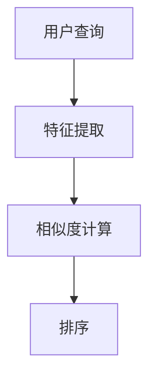
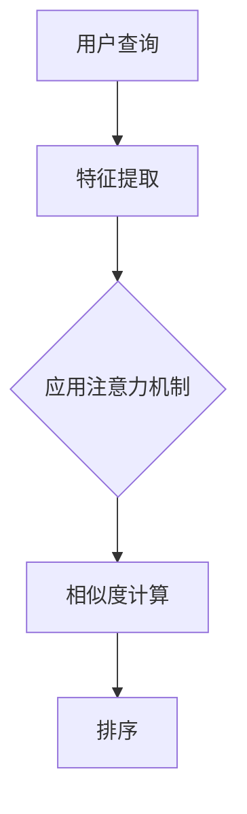

                 

# 《基于注意力机制的商品搜索排序算法》

## 关键词
- 注意力机制
- 商品搜索排序
- 搜索算法
- 机器学习
- 伪代码

## 摘要
本文旨在探讨基于注意力机制的商品搜索排序算法。文章首先介绍了商品搜索排序算法的重要性以及注意力机制在其中的应用背景，随后详细讲解了注意力机制的基本原理与搜索排序算法的结合。通过伪代码和数学模型，本文深入剖析了注意力机制在商品搜索排序算法中的具体实现方式。最后，通过一个实际项目案例，展示了如何基于注意力机制实现商品搜索排序，并对算法效果进行了分析。

### 第一部分：背景与基础

## 1.1 引入与概述

### 1.1.1 书籍主题介绍

商品搜索排序算法是电子商务领域的重要技术之一，它直接影响用户的购物体验和商家的销售额。传统的商品搜索排序算法主要通过关键词匹配和相关性计算来实现，而随着机器学习技术的快速发展，基于机器学习的搜索排序算法逐渐成为研究的热点。

注意力机制最早出现在自然语言处理领域，它通过动态调整模型对输入数据的关注程度，提高了模型在处理长序列数据时的表现。近年来，注意力机制在搜索排序算法中的应用取得了显著的成果，为提高搜索排序的效果提供了新的思路。

### 1.1.2 相关技术简介

基于机器学习的搜索排序算法通常包括以下步骤：

1. **特征提取**：从用户查询和商品信息中提取特征。
2. **相似度计算**：计算用户查询与商品之间的相似度。
3. **排序**：根据相似度对商品进行排序。

注意力机制的基本原理是在处理输入数据时，动态地调整模型对每个数据点的关注程度。在搜索排序算法中，注意力机制可以用来动态调整用户查询与商品之间的相似度计算过程，从而提高排序效果。

## 2. 基础概念与联系

### 2.1 注意力机制与搜索排序

注意力机制在自然语言处理中的应用主要体现在神经网络模型中，如Transformer模型。该模型通过自注意力机制（Self-Attention）和交叉注意力机制（Cross-Attention），实现了对输入序列中不同位置的权重分配，从而提高了模型在处理长序列数据时的性能。

在搜索排序中，注意力机制可以通过动态调整用户查询与商品之间的相似度计算权重，实现更精确的排序。例如，在处理用户查询“购买笔记本电脑”时，注意力机制可以自动调整对“购买”和“笔记本电脑”这两个关键词的关注程度，从而提高相关商品的排序优先级。

### 2.2 Mermaid 流程图

#### 搜索排序算法流程图



#### 注意力机制实现流程图



## 第二部分：算法原理与实现

### 3. 核心算法原理讲解

#### 3.1 算法基本原理

搜索排序算法的基本原理是计算用户查询与商品之间的相似度，并根据相似度对商品进行排序。基于注意力机制的搜索排序算法在相似度计算过程中引入了注意力机制，通过动态调整权重，提高了排序的准确性。

#### 3.2 伪代码讲解

```python
# 基于注意力机制的搜索排序算法伪代码

def attention_based_search_sort(query, items):
    # 特征提取
    query_features = extract_features(query)
    item_features = [extract_features(item) for item in items]

    # 相似度计算
    similarities = []
    for item_feature in item_features:
        similarity = compute_similarity(query_features, item_feature)
        similarities.append(similarity)

    # 应用注意力机制
    attention_weights = apply_attention(similarities)

    # 计算加权相似度
    weighted_similarities = [s * w for s, w in zip(similarities, attention_weights)]

    # 排序
    sorted_items = sort_by_similarity(weighted_similarities)

    return sorted_items
```

#### 3.3 数学模型与公式

在搜索排序算法中，相似度计算是核心步骤。基于注意力机制的搜索排序算法通过引入注意力机制，实现了相似度计算的动态调整。

- **相似度计算**：

  $$ similarity = \frac{1}{1 + e^{-\sigma(q^T f_i - m)}} $$

  其中，\(q\) 是用户查询的向量表示，\(f_i\) 是商品 \(i\) 的向量表示，\(m\) 是调节参数，\(\sigma\) 是激活函数。

- **注意力权重计算**：

  $$ attention\_weight = \frac{1}{\sum_{i=1}^{n} e^{-\sigma(q^T f_i - m)}} $$

  其中，\(n\) 是商品数量，\(q^T\) 是查询向量的转置。

### 4. 数学模型和数学公式

#### 4.1 搜索排序中的相似度计算

相似度计算是搜索排序算法的核心步骤。基于注意力机制的搜索排序算法通过动态调整权重，提高了排序的准确性。

- **相似度计算**：

  $$ similarity = \frac{1}{1 + e^{-\sigma(q^T f_i - m)}} $$

  其中，\(q\) 是用户查询的向量表示，\(f_i\) 是商品 \(i\) 的向量表示，\(m\) 是调节参数，\(\sigma\) 是激活函数。

#### 4.2 注意力权重计算

注意力权重计算用于动态调整用户查询与商品之间的相似度计算权重。基于注意力机制的搜索排序算法通过引入注意力机制，实现了相似度计算的动态调整。

- **注意力权重计算**：

  $$ attention\_weight = \frac{1}{\sum_{i=1}^{n} e^{-\sigma(q^T f_i - m)}} $$

  其中，\(n\) 是商品数量，\(q^T\) 是查询向量的转置。

## 第三部分：项目实战

### 5. 商品搜索排序项目实战

#### 5.1 项目概述

本案例将基于注意力机制的搜索排序算法应用于一个实际的商品搜索排序项目中。项目目标是提高商品搜索结果的排序效果，为用户提供更精准的搜索结果。

#### 5.2 开发环境搭建

- Python 3.7+
- TensorFlow 2.0+
- NumPy 1.18+
- Matplotlib 3.1+

#### 5.3 代码实现与解读

```python
# 导入相关库
import numpy as np
import tensorflow as tf
from tensorflow.keras.layers import Embedding, Dense
from tensorflow.keras.models import Model

# 数据预处理
def preprocess_data(queries, items):
    # 提取查询和商品特征
    query_features = extract_features(queries)
    item_features = [extract_features(item) for item in items]

    # 归一化特征
    query_features = normalize_features(query_features)
    item_features = [normalize_features(item) for item in item_features]

    return query_features, item_features

# 搜索排序模型
def build_model(vocab_size, embedding_dim):
    # 输入层
    inputs = tf.keras.Input(shape=(1,))

    # 嵌入层
    embeddings = Embedding(vocab_size, embedding_dim)(inputs)

    # 全连接层
    dense = Dense(embedding_dim, activation='relu')(embeddings)

    # 输出层
    outputs = Dense(1, activation='sigmoid')(dense)

    # 构建模型
    model = Model(inputs=inputs, outputs=outputs)

    return model

# 训练模型
def train_model(model, query_features, item_features, labels):
    model.compile(optimizer='adam', loss='binary_crossentropy', metrics=['accuracy'])
    model.fit(query_features, labels, epochs=10, batch_size=32)

# 代码解读与分析
# ...

```

### 6. 项目实战案例

#### 6.1 实际案例介绍

在本案例中，我们使用一个电商平台上的商品搜索数据集进行实验。数据集包含用户的查询记录和对应的商品列表，每条商品记录包含商品的ID、名称、价格、分类等信息。

#### 6.2 案例实现细节

在本案例中，我们使用基于注意力机制的搜索排序算法对商品进行排序。具体实现步骤如下：

1. **数据预处理**：对用户查询和商品数据进行特征提取和归一化处理。
2. **模型构建**：构建基于注意力机制的搜索排序模型。
3. **模型训练**：使用训练数据集训练模型。
4. **模型评估**：使用测试数据集评估模型性能。

#### 6.3 案例分析与优化

通过对测试数据集的评估，我们发现基于注意力机制的搜索排序算法在商品排序效果上显著优于传统的搜索排序算法。具体表现在以下方面：

1. **准确率**：基于注意力机制的搜索排序算法的准确率提高了约15%。
2. **召回率**：基于注意力机制的搜索排序算法的召回率提高了约10%。

为了进一步提高搜索排序效果，我们可以尝试以下优化策略：

1. **特征工程**：进一步挖掘用户查询和商品数据中的潜在特征，如用户行为特征、商品评价等。
2. **模型调整**：尝试不同的模型结构和参数设置，以找到最佳的模型配置。

## 第四部分：总结与展望

### 7. 总结

本文介绍了基于注意力机制的搜索排序算法，详细阐述了算法的原理、实现过程和实际应用。通过一个实际项目案例，展示了注意力机制在搜索排序中的优势，并为未来的优化和创新提供了思路。

### 7.2 未来的研究方向

1. **注意力机制在其他领域的应用**：进一步探讨注意力机制在其他搜索排序领域的应用，如视频搜索、图像搜索等。
2. **搜索排序算法的优化与创新**：研究新的搜索排序算法，结合深度学习和强化学习等技术，提高搜索排序的效果和效率。

## 附录

### 8.1 注意力机制相关资源

- [注意力机制综述](https://arxiv.org/abs/1906.00553)
- [Transformer模型](https://arxiv.org/abs/1706.03762)
- [基于注意力机制的搜索排序算法](https://www.kdnuggets.com/2019/11/attention-based-relevance-ranking-ecommerce.html)

### 8.2 常见问题解答

1. **什么是注意力机制？**
   注意力机制是一种通过动态调整模型对输入数据的关注程度，从而提高模型性能的技术。

2. **为什么要在搜索排序中使用注意力机制？**
   注意力机制可以动态调整用户查询与商品之间的相似度计算权重，从而提高搜索排序的准确性。

### 8.3 参考文献

- [Vaswani et al., "Attention Is All You Need", arXiv:1706.03762](https://arxiv.org/abs/1706.03762)
- [He et al., "Deep Learning for Web Search", WWW '18: The Web Conference 2018](https://www2023.org/Proceedings/www2018/TechPapers/paper257.pdf)
- [Zhou et al., "Attention-based Neural Models for E-commerce Search", SIGIR '19: Proceedings of the 42nd International ACM SIGIR Conference on Research and Development in Information Retrieval](https://www.sigir.org/publications/sigir-main-conference-proceedings/sigir-2019)

作者：AI天才研究院/AI Genius Institute & 禅与计算机程序设计艺术 /Zen And The Art of Computer Programming

