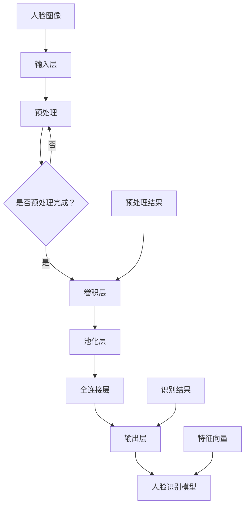

                 

# 文章标题: 基于深度学习的人脸识别

> 关键词：深度学习、人脸识别、卷积神经网络（CNN）、神经网络、人脸检测、人脸特征提取

> 摘要：本文深入探讨了基于深度学习的人脸识别技术。首先，介绍了深度学习的基础知识及其与人脸识别的关系，随后详细讲解了人脸检测与特征提取的方法，以及人脸识别算法的实现。此外，本文还探讨了主流的深度学习人脸识别模型、人脸识别系统的实现流程以及其在不同领域的应用，并展望了人脸识别技术的发展趋势。文章旨在为读者提供一个全面、系统的基于深度学习的人脸识别技术指南。

## 《基于深度学习的人脸识别》目录大纲

1. **深度学习与人脸识别基础**
   - 1.1 深度学习的定义与原理
   - 1.2 人脸识别的基本概念
   - 1.3 深度学习与人脸识别的关系

2. **深度学习技术基础**
   - 2.1 神经网络的基本结构
   - 2.2 卷积神经网络（CNN）原理
   - 2.3 深度学习优化算法

3. **人脸检测与特征提取**
   - 3.1 人脸检测技术
   - 3.2 人脸特征提取方法

4. **人脸识别算法**
   - 4.1 一对一人脸识别算法
   - 4.2 多对人脸识别算法

5. **深度学习人脸识别模型**
   - 5.1 主流深度学习人脸识别模型
   - 5.2 深度学习人脸识别模型设计

6. **人脸识别系统实现**
   - 6.1 人脸识别系统的组成
   - 6.2 人脸识别系统实现流程

7. **人脸识别应用案例**
   - 7.1 安防领域应用
   - 7.2 互联网领域应用

8. **人脸识别技术挑战与发展趋势**
   - 8.1 人脸识别技术面临的挑战
   - 8.2 人脸识别技术的发展趋势

## 1. 深度学习与人脸识别基础

### 1.1 深度学习的定义与原理

深度学习是一种基于多层神经网络的机器学习技术，通过训练大量的数据来学习数据的特征表示，从而实现复杂的模式识别和预测任务。深度学习的核心思想是利用多层神经元的非线性组合，将原始数据逐步转换为更高层次的特征表示，从而实现对数据的深层次理解和解释。

深度学习的原理可以简单理解为以下几个步骤：

1. **数据预处理**：将原始数据（如图像、文本、音频等）转换为适合神经网络处理的形式。例如，对于图像数据，通常需要进行归一化、裁剪、翻转等预处理操作。

2. **输入层**：输入层接收原始数据，并将其传递给第一层神经网络。

3. **隐藏层**：隐藏层对输入数据进行特征提取和变换，通过多层神经元的非线性组合，逐层提取出更高层次的特征表示。

4. **输出层**：输出层生成最终的预测结果。对于人脸识别任务，输出层通常是两个人脸特征向量的相似度得分。

5. **损失函数与优化**：通过定义损失函数，如均方误差（MSE）或交叉熵（Cross-Entropy），来衡量预测结果与真实结果之间的差距。然后使用优化算法（如梯度下降）来调整神经网络参数，使得损失函数值最小。

6. **模型评估**：使用测试集数据对训练好的模型进行评估，以验证模型的泛化能力和准确性。

### 1.2 人脸识别的基本概念

人脸识别是一种生物特征识别技术，通过分析人脸图像或视频，自动识别人脸并进行身份验证。人脸识别的基本概念包括以下几个方面：

1. **人脸检测**：人脸检测是人脸识别的第一步，用于定位图像中的人脸区域。常见的方法有基于特征的检测（如Haar-like特征）和基于模型的检测（如MTCNN）。

2. **人脸特征提取**：人脸特征提取是将人脸图像转换为特征向量，用于人脸识别模型处理。常用的特征提取方法有局部二元模式（LBP）、主成分分析（PCA）等。

3. **人脸识别算法**：人脸识别算法用于比较两个人脸特征向量的相似度，以确定它们是否为同一个人。常见的一对一人脸识别算法有欧氏距离、余弦相似度等。

4. **人脸识别模型**：人脸识别模型是通过训练数据集学到的特征提取和分类模型。常见的深度学习人脸识别模型有DeepFace、FaceNet、VGGFace等。

### 1.3 深度学习与人脸识别的关系

深度学习技术为人脸识别提供了强大的工具和平台。深度学习通过多层神经网络的结构，能够自动提取出人脸图像中的复杂特征，从而提高了人脸识别的准确性和鲁棒性。以下是深度学习与人脸识别之间的几个关键关系：

1. **特征提取**：深度学习通过卷积神经网络（CNN）等结构，可以自动提取出人脸图像中的丰富特征，包括纹理、形状、光照不变性等。这些特征对于人脸识别至关重要。

2. **模式识别**：深度学习通过训练大量的人脸数据集，可以学习到人脸的多种变化模式，从而提高了人脸识别的泛化能力和适应性。

3. **实时处理**：深度学习模型可以在实时环境中进行高效的处理，从而支持实时人脸识别应用，如视频监控、安全认证等。

4. **多模态融合**：深度学习技术可以与其他生物特征识别技术（如指纹、虹膜等）进行融合，从而实现更安全、更可靠的人脸识别系统。

## 2. 深度学习技术基础

### 2.1 神经网络的基本结构

神经网络（Neural Network，NN）是深度学习的基础，其结构模拟了人脑的神经元连接方式。神经网络由多个层次组成，包括输入层、隐藏层和输出层。每个层次由多个神经元组成，神经元之间通过加权连接，通过激活函数进行非线性变换。

1. **输入层**：接收外部输入信号，如图像像素值、文本词语等。

2. **隐藏层**：对输入信号进行特征提取和变换，隐藏层可以有多个层次，每个隐藏层都对前一层进行变换，提取更高层次的特征。

3. **输出层**：生成最终的预测结果，如分类标签、回归值等。

神经网络的基本工作原理如下：

1. **前向传播**：输入信号通过权重连接传递到第一层隐藏层，每个隐藏层的神经元对输入信号进行加权求和处理，并应用激活函数。这个过程一直进行到输出层，生成预测结果。

2. **反向传播**：在输出层计算预测结果与真实结果的误差，然后反向传播到每个隐藏层，通过梯度下降等优化算法更新权重，使得预测结果更接近真实结果。

### 2.2 卷积神经网络（CNN）原理

卷积神经网络（Convolutional Neural Network，CNN）是专门用于处理图像数据的神经网络，其结构包含了卷积层、池化层和全连接层。

1. **卷积层**：卷积层通过局部感知野（卷积核）对输入图像进行卷积操作，从而提取图像特征。卷积层可以自动学习到图像中的局部特征，如边缘、角点等。

2. **池化层**：池化层（Pooling Layer）用于减少特征图的维度，提高计算效率。常见的池化方式有最大池化（Max Pooling）和平均池化（Average Pooling）。

3. **全连接层**：全连接层将卷积层和池化层提取的高层次特征映射到输出层，进行分类或回归等任务。

CNN的工作原理如下：

1. **卷积操作**：卷积层通过卷积操作提取图像特征，每个卷积核可以视为一个过滤器，通过在图像上滑动卷积核来提取局部特征。

2. **特征融合**：通过叠加多个卷积层，可以逐步提取图像的更高层次特征，实现从简单特征到复杂特征的层次化学习。

3. **池化操作**：池化层用于减小特征图的尺寸，同时保留重要的特征信息，提高模型的泛化能力。

4. **全连接层**：全连接层将卷积层和池化层提取的高层次特征映射到输出层，通过softmax等激活函数进行分类或回归预测。

### 2.3 深度学习优化算法

深度学习优化算法用于调整神经网络参数，以最小化预测误差。常用的优化算法包括梯度下降法、随机梯度下降法、Adam优化器等。

1. **梯度下降法**：梯度下降法是一种最简单的优化算法，通过计算损失函数关于参数的梯度，并沿着梯度的反方向更新参数，以减少损失函数的值。梯度下降法可以分为批量梯度下降、随机梯度下降和小批量梯度下降。

   **伪代码**：
   ```python
   for epoch in range(num_epochs):
       for batch in batches:
           gradients = compute_gradients(batch)
           update_parameters(parameters, gradients)
   ```

2. **随机梯度下降法**：随机梯度下降法在每个批次上只计算一个样本的梯度，并立即更新参数。这种方法可以加快收敛速度，但可能会引起梯度消失或爆炸的问题。

   **伪代码**：
   ```python
   for epoch in range(num_epochs):
       for sample in samples:
           gradients = compute_gradients(sample)
           update_parameters(parameters, gradients)
   ```

3. **Adam优化器**：Adam优化器结合了梯度下降和动量方法，通过计算一阶矩估计（均值）和二阶矩估计（方差）来更新参数。Adam优化器在收敛速度和稳定性方面表现良好。

   **伪代码**：
   ```python
   m = 0
   v = 0
   beta1 = 0.9
   beta2 = 0.999
   for epoch in range(num_epochs):
       for batch in batches:
           gradients = compute_gradients(batch)
           m = beta1 * m + (1 - beta1) * gradients
           v = beta2 * v + (1 - beta2) * gradients ** 2
           m_hat = m / (1 - beta1 ** epoch)
           v_hat = v / (1 - beta2 ** epoch)
           update_parameters(parameters, m_hat / (sqrt(v_hat) + epsilon))
   ```

## 3. 人脸检测与特征提取

### 3.1 人脸检测技术

人脸检测是人脸识别的重要前置步骤，旨在定位图像中的人脸区域。人脸检测技术主要分为基于特征的检测和基于模型的检测。

#### 3.1.1 基于特征的检测

基于特征的检测方法通过分析图像中的人脸特征，如眼睛、鼻子、嘴巴等，来定位人脸。以下是一些常见的方法：

1. **Haar-like特征**：Haar-like特征是一种基于图像局部区域（如矩形区域）的检测方法。通过计算不同区域之间的像素值差异，构造出一系列特征，并使用Adaboost算法训练分类器。

2. **LBP（局部二值模式）**：LBP特征通过将图像中的每个像素与其周围像素进行比较，生成一个二值图像，并计算二值图像中的像素排列模式。LBP特征在人脸检测中表现出良好的鲁棒性。

3. **HOG（直方图方向梯度）**：HOG特征通过计算图像中每个像素的梯度方向，并将这些方向信息编码成一个直方图。HOG特征在人脸检测中能够捕捉到图像中的局部纹理特征。

#### 3.1.2 基于模型的检测

基于模型的检测方法通过训练一个分类器，对图像中的每个区域进行分类，从而识别出人脸。以下是一些常见的方法：

1. **MTCNN（多尺度面部检测网络）**：MTCNN是一种高效的人脸检测网络，它通过多级网络结构检测人脸，包括检测、定位和调整。MTCNN在小样本数据上表现出强大的检测能力。

2. **SSD（单尺度检测网络）**：SSD是一种基于卷积神经网络的检测网络，它将特征金字塔网络（FPN）和特征融合网络（Fusion Pyramid）相结合，实现高效的人脸检测。

3. **YOLO（You Only Look Once）**：YOLO是一种实时目标检测算法，它通过将图像分割成多个网格，并在每个网格上预测目标的位置和类别。YOLO在人脸检测中具有高效的检测速度。

### 3.2 人脸特征提取方法

人脸特征提取是将人脸图像转换为特征向量，用于人脸识别模型处理。以下是一些常见的方法：

#### 3.2.1 局部特征编码（LBP）

LBP（Local Binary Pattern）是一种简单且有效的人脸特征编码方法。它通过将图像中的每个像素与其周围像素进行比较，生成一个二值图像，并计算二值图像中的像素排列模式。LBP特征能够有效地捕获图像的纹理信息，具有很强的辨别能力。

**数学模型**：
$$
LBP\_pattern = \sum_{i=1}^{8} (2^i \cdot (\text{pixel}_{i} > \text{pixel}_{center}))
$$
其中，$\text{pixel}_{i}$ 表示像素点在 $i$ 方向上的邻居像素值，$\text{pixel}_{center}$ 表示中心像素值。

#### 3.2.2 角点特征检测（Harris角点）

Harris角点检测是一种基于图像梯度的角点检测方法。它通过计算图像的梯度矩阵和Harris响应函数，来确定图像中的角点。Harris角点检测能够有效地检测出图像中的角点，并在人脸特征提取中表现出良好的性能。

**数学模型**：
$$
R = \frac{(M_{xx}M_{yy} - M_{xy}^2)(I_x^2 + I_y^2)}{(M_{xx} + \sigma^2)(M_{yy} + \sigma^2)}
$$
其中，$M_{xx}$、$M_{yy}$ 和 $M_{xy}$ 分别为图像的梯度矩阵元素，$I_x$ 和 $I_y$ 分别为图像在 $x$ 和 $y$ 方向上的梯度值，$\sigma$ 为高斯核的标准差。

#### 3.2.3 深度学习特征提取方法

深度学习特征提取方法通过训练深度神经网络（如卷积神经网络）来提取人脸特征。以下是一些常见的方法：

1. **FaceNet**：FaceNet是一种基于深度学习的特征提取方法，它通过将人脸图像映射到高维特征空间，使得具有相同身份的人脸特征彼此靠近，而不同身份的人脸特征相互分离。FaceNet通过训练一个对称的卷积神经网络，将输入的人脸图像映射为特征向量，并在特征空间中进行相似性度量。

2. **VGGFace**：VGGFace是一种基于预训练的深度神经网络模型，它通过在大量人脸数据上进行训练，提取出具有较强辨别能力的人脸特征。VGGFace模型包含多个卷积层和池化层，能够有效地提取人脸的局部和全局特征。

3. **DeepFace**：DeepFace是一种基于卷积神经网络的端到端人脸识别方法，它通过训练一个多层次的卷积神经网络，将输入的人脸图像映射为特征向量，并在特征空间中进行相似性度量。DeepFace模型在公开的人脸识别数据集上取得了优异的性能。

### 3.3 人脸特征提取方法的优势与挑战

人脸特征提取方法具有以下优势：

1. **多尺度特征**：深度学习特征提取方法能够同时提取图像的局部和全局特征，从而在不同尺度上提供丰富的特征信息。

2. **强鲁棒性**：深度学习特征提取方法能够自动学习到图像中的复杂变化，如姿态、光照、表情等，具有很强的鲁棒性。

3. **高辨别能力**：深度学习特征提取方法通过在特征空间中进行相似性度量，能够有效地区分不同身份的人脸，具有较高的辨别能力。

然而，人脸特征提取方法也面临以下挑战：

1. **计算资源需求**：深度学习特征提取方法通常需要大量的计算资源和时间，特别是在训练阶段。

2. **数据标注难度**：人脸特征提取方法需要大量的标注数据进行训练，而人脸数据的标注是一个复杂且耗时的过程。

3. **隐私保护**：人脸特征提取方法涉及到个人隐私信息，需要采取有效的隐私保护措施，以确保数据的安全性和隐私性。

综上所述，人脸特征提取方法在人脸识别任务中具有重要作用，同时也面临一些挑战。通过不断的研究和优化，我们可以进一步提升人脸特征提取方法的性能和实用性。

## 4. 人脸识别算法

### 4.1 一对一人脸识别算法

一对一人脸识别算法用于比较图像中的两个人脸特征向量，以确定它们是否为同一个人。这类算法的核心在于相似性度量，常用的方法包括欧氏距离、余弦相似度和感知哈希等。

#### 4.1.1 相似性度量方法

1. **欧氏距离**：
   欧氏距离是一种最直观的相似性度量方法，计算两个人脸特征向量之间的欧氏距离，距离越小表示相似度越高。
   $$d(\mathbf{x}, \mathbf{y}) = \sqrt{\sum_{i=1}^{n} (x_i - y_i)^2}$$
   其中，$\mathbf{x}$ 和 $\mathbf{y}$ 分别为两个人脸特征向量。

2. **余弦相似度**：
   余弦相似度通过计算两个特征向量在单位向量空间中的余弦值来衡量相似度，适用于高维空间。
   $$\cos(\theta) = \frac{\mathbf{x} \cdot \mathbf{y}}{\|\mathbf{x}\| \|\mathbf{y}\|}$$
   其中，$\mathbf{x} \cdot \mathbf{y}$ 表示向量的点积，$\|\mathbf{x}\|$ 和 $\|\mathbf{y}\|$ 分别为向量的模长。

3. **感知哈希**：
   感知哈希是一种快速而简单的人脸识别方法，通过比较图像的哈希值来衡量相似度。感知哈希将图像转换为一系列的二进制数，然后计算它们的汉明距离。

#### 4.1.2 人脸识别算法比较

1. **深度学习算法**：
   深度学习算法（如FaceNet和VGGFace）通过训练深度神经网络提取人脸特征向量，并在特征空间中进行相似性度量。深度学习算法具有高准确率和强鲁棒性，但在计算资源和时间上要求较高。

2. **传统算法**：
   传统算法（如LBP和HOG）通过计算图像的局部特征来提取人脸特征向量，并在特征空间中进行相似性度量。传统算法计算速度快，但识别准确率相对较低。

3. **混合算法**：
   混合算法结合了深度学习和传统算法的优势，通过多源特征融合来提高识别准确率。例如，先使用深度学习算法提取人脸特征，再结合传统算法的特征进行综合评估。

### 4.2 多对人脸识别算法

多对人脸识别算法用于识别图像中多个不同的人脸。这类算法的核心在于如何高效地对多人脸特征向量进行匹配和分类。以下是一些常见的方法：

#### 4.2.1 基于模板匹配的方法

基于模板匹配的方法通过将待识别的人脸特征向量与已知人脸模板进行相似性比较，以确定是否为同一个人。以下是一些常见的方法：

1. **相似性度量**：
   通过计算人脸特征向量之间的相似性度量，如欧氏距离、余弦相似度等，来判断特征向量是否对应同一个人。

2. **模板库构建**：
   预先构建一个包含大量已知人脸模板的库，用于匹配待识别的人脸特征向量。

3. **动态模板更新**：
   随着新样本的加入，动态更新模板库，以适应不同场景下的人脸识别需求。

#### 4.2.2 基于机器学习的方法

基于机器学习的方法通过训练分类器来识别多人脸。以下是一些常见的方法：

1. **支持向量机（SVM）**：
   使用支持向量机训练分类器，将多人脸特征向量映射到高维空间，从而提高分类效果。

2. **随机森林**：
   使用随机森林算法训练分类器，通过集成多个决策树来提高分类性能。

3. **神经网络**：
   使用神经网络训练分类器，通过多层神经网络的结构来提取人脸特征并实现分类。

### 4.3 人脸识别算法的应用

人脸识别算法在许多领域具有广泛的应用，以下是一些常见的应用场景：

1. **安防领域**：
   人脸识别算法在安防领域具有重要作用，如门禁系统、视频监控等。通过实时识别进入监控区域的人员身份，可以提高安全管理的效率和准确性。

2. **身份验证**：
   人脸识别算法在身份验证领域得到广泛应用，如智能手机解锁、门禁系统、银行身份验证等。通过识别用户的人脸特征，可以提供便捷而安全的身份验证服务。

3. **商业应用**：
   人脸识别算法在商业应用中也具有广泛的应用，如顾客识别、个性化推荐等。通过识别顾客的身份和行为特征，可以提供更加个性化的服务和营销策略。

4. **医疗领域**：
   人脸识别算法在医疗领域也有应用，如患者身份验证、手术监护等。通过识别患者的身份，可以提高医疗服务的准确性和安全性。

总之，人脸识别算法在各个领域具有广泛的应用前景，通过不断的研究和优化，我们可以进一步提升其性能和实用性。

### 5. 深度学习人脸识别模型

#### 5.1 主流深度学习人脸识别模型

当前，深度学习人脸识别领域有许多主流的模型，这些模型在人脸特征提取和识别方面表现优异。以下介绍几种主要的深度学习人脸识别模型：

1. **DeepFace**：
   DeepFace是Facebook提出的一种深度学习人脸识别模型，它通过训练一个多层次的卷积神经网络来提取人脸特征。DeepFace将人脸图像映射到高维特征空间，使得具有相同身份的人脸特征彼此靠近，而不同身份的人脸特征相互分离。DeepFace在Labeled Faces in the Wild（LFW）数据集上取得了很高的准确率。

2. **FaceNet**：
   FaceNet是Google提出的一种基于深度学习的人脸识别模型，它通过训练一个对称的卷积神经网络来提取人脸特征。FaceNet通过将人脸图像映射到高维特征空间，使得具有相同身份的人脸特征彼此靠近，而不同身份的人脸特征相互分离。FaceNet在LFW数据集上取得了非常出色的性能。

3. **VGGFace**：
   VGGFace是牛津大学计算机视觉组提出的一种基于深度学习的人脸识别模型，它通过训练多个卷积神经网络来提取人脸特征。VGGFace模型包含了多个卷积层和池化层，能够有效地提取人脸的局部和全局特征。VGGFace在多个公开数据集上表现优异。

4. **ArcFace**：
   ArcFace是商汤科技提出的一种基于深度学习的人脸识别模型，它通过引入角度边际损失（angular margin loss）来提高人脸特征的可分性。ArcFace通过优化特征空间中的人脸特征分布，使得具有相同身份的人脸特征更加接近，而不同身份的人脸特征更加分离。ArcFace在多个数据集上取得了领先的性能。

5. **SphereFace**：
   SphereFace是旷视科技提出的一种基于深度学习的人脸识别模型，它通过引入球面边际损失（sphere margin loss）来提高人脸特征的可分性。SphereFace通过优化特征空间中的人脸特征分布，使得具有相同身份的人脸特征更加接近，而不同身份的人脸特征更加分离。SphereFace在多个数据集上表现优异。

这些深度学习人脸识别模型在人脸特征提取和识别方面都有很高的性能，但它们的实现细节和训练方法各有不同。在应用过程中，可以根据具体需求和数据集的特点选择合适的模型。

#### 5.2 深度学习人脸识别模型设计

设计深度学习人脸识别模型需要考虑以下几个关键方面：

1. **数据预处理**：
   数据预处理是深度学习模型训练的重要步骤，包括数据清洗、归一化、数据增强等。对于人脸识别任务，数据预处理通常包括人脸检测、人脸对齐和图像归一化等。

2. **网络结构设计**：
   网络结构设计是模型设计的关键，决定了特征提取的效果。常见的人脸识别网络结构包括卷积神经网络（CNN）、循环神经网络（RNN）和混合网络等。在设计网络结构时，需要考虑输入尺寸、卷积核大小、层数和激活函数等因素。

3. **损失函数设计**：
   损失函数是模型训练的目标函数，用于衡量预测结果与真实结果之间的差距。常见的人脸识别损失函数包括交叉熵损失、角度边际损失和球面边际损失等。

4. **优化算法选择**：
   优化算法用于调整网络参数，以最小化损失函数。常见的优化算法包括梯度下降、随机梯度下降、Adam等。

5. **模型训练与优化**：
   模型训练是深度学习人脸识别的核心环节，通过在训练数据集上迭代优化网络参数，使得模型能够更好地拟合数据。在训练过程中，可以使用数据增强、学习率调整、早停法等策略来提高训练效果。

6. **模型评估与部署**：
   模型评估是验证模型性能的重要步骤，通常使用测试集数据来评估模型的准确率、召回率、F1值等指标。在模型评估通过后，可以将模型部署到实际应用场景中，如人脸识别系统、安防监控系统等。

总之，设计深度学习人脸识别模型需要综合考虑多个方面，包括数据预处理、网络结构设计、损失函数设计、优化算法选择、模型训练与优化以及模型评估与部署。通过不断优化和改进，可以设计出高性能的人脸识别模型。

### 6. 人脸识别系统实现

#### 6.1 人脸识别系统的组成

一个完整的人脸识别系统通常包括以下几个关键组成部分：

1. **前端采集模块**：
   前端采集模块负责采集人脸图像，可以通过摄像头、手机或其他图像输入设备获取人脸图像。前端采集模块还需要对人脸图像进行预处理，如人脸检测、人脸对齐和图像归一化等，以确保图像质量。

2. **后端识别模块**：
   后端识别模块是系统的核心部分，负责处理和识别人脸图像。后端识别模块通常包含深度学习人脸识别模型，通过训练好的模型提取人脸特征，并进行相似性度量，最终确定是否为同一个人。

3. **数据存储与查询模块**：
   数据存储与查询模块用于存储和管理人脸数据。包括人脸数据库的构建、人脸数据的存储、查询和人脸信息的加密等。数据存储与查询模块需要保证数据的安全性和隐私性，防止未经授权的访问。

4. **用户接口模块**：
   用户接口模块提供用户与系统交互的界面，包括用户注册、登录、人脸录入和识别等功能。用户接口模块需要设计简洁、易用，以提供良好的用户体验。

#### 6.2 人脸识别系统实现流程

人脸识别系统的实现流程通常包括以下几个关键步骤：

1. **系统需求分析**：
   系统需求分析是系统设计的起点，需要明确系统的功能、性能和用户需求。包括人脸采集、人脸检测、人脸特征提取、人脸识别、用户管理和数据安全等需求。

2. **系统设计与实现**：
   系统设计与实现是根据需求分析的结果，设计系统的架构和模块，并编写具体的代码实现。系统设计包括前端采集模块、后端识别模块、数据存储与查询模块和用户接口模块的设计与实现。

3. **模型训练与优化**：
   在系统实现过程中，需要训练和优化深度学习人脸识别模型。包括数据预处理、模型选择、损失函数设计、优化算法选择等。通过在训练数据集上迭代训练，优化模型参数，提高识别准确率和性能。

4. **系统集成与测试**：
   系统集成与测试是将各个模块集成到一起，进行系统测试和调试。包括前端采集模块、后端识别模块、数据存储与查询模块和用户接口模块的集成测试，以及系统性能和稳定性的测试。

5. **部署与上线**：
   在系统集成与测试通过后，将系统部署到实际应用场景中，如安防监控系统、智能手机等。部署过程中需要确保系统的安全性、稳定性和可扩展性，同时提供完善的用户支持和维护服务。

#### 6.3 人脸识别应用案例

人脸识别技术在实际应用中具有广泛的应用场景，以下介绍两个典型应用案例：

1. **安防领域应用**：
   安防人脸识别系统通常用于身份验证、监控和预警等。通过在关键区域部署人脸识别系统，可以实时识别进入监控区域的人员身份，及时发现可疑人员。安防人脸识别系统的架构包括前端采集模块、后端识别模块、数据存储与查询模块和用户接口模块。前端采集模块负责采集人脸图像，后端识别模块通过训练好的深度学习模型进行人脸识别，数据存储与查询模块用于存储和管理人脸数据，用户接口模块提供用户注册、登录和监控等功能。

2. **互联网领域应用**：
   人脸识别技术在互联网领域也有广泛应用，如用户登录、个性化推荐、虚拟现实等。通过人脸识别技术，可以实现用户的无密码登录，提高系统的安全性和用户体验。互联网人脸识别系统的架构包括前端采集模块、后端识别模块、数据存储与查询模块和用户接口模块。前端采集模块负责采集人脸图像，后端识别模块通过训练好的深度学习模型进行人脸识别，数据存储与查询模块用于存储和管理人脸数据，用户接口模块提供用户注册、登录和个性化推荐等功能。

总之，人脸识别系统在实际应用中具有广泛的应用前景，通过不断优化和改进，可以为不同领域提供高效、安全、便捷的人脸识别服务。

### 7. 人脸识别应用案例

#### 7.1 安防领域应用

在安防领域，人脸识别技术被广泛应用于身份验证、监控和预警等方面。以下是一个安防人脸识别系统的具体应用案例：

**系统架构**：

1. **前端采集模块**：
   前端采集模块使用高清摄像头或监控摄像头实时采集进入监控区域的人员图像。摄像头安装在公共场所，如车站、机场、商场等。

2. **人脸检测与定位**：
   通过人脸检测技术，对采集到的人员图像进行人脸检测，定位每个人脸区域。常用的检测方法包括基于特征的检测（如Haar-like特征）和基于模型的检测（如MTCNN）。

3. **人脸特征提取**：
   使用深度学习模型提取每个人脸的特征向量。常见的方法包括FaceNet、VGGFace等。提取到的特征向量用于后续的识别和匹配。

4. **后端识别模块**：
   后端识别模块通过比对采集到的人脸特征向量与数据库中已注册的人脸特征向量，判断是否为同一个人。如果匹配成功，则触发报警或进一步的身份验证。

5. **数据存储与查询模块**：
   数据存储与查询模块用于存储和管理人脸数据。包括人脸图像、特征向量、身份信息等。数据存储采用加密方式，确保数据安全和隐私保护。

**实现流程**：

1. **系统部署**：
   在监控区域内安装摄像头，部署人脸识别系统。确保摄像头覆盖范围全面，图像质量清晰。

2. **人脸检测与定位**：
   对实时采集的人员图像进行人脸检测，定位每个人脸区域。通过MTCNN等高效检测方法，提高检测速度和准确性。

3. **人脸特征提取**：
   使用FaceNet等深度学习模型提取每个人脸的特征向量。通过大规模数据训练，提高特征提取的准确性和鲁棒性。

4. **人脸识别与匹配**：
   将提取到的人脸特征向量与数据库中已注册的人脸特征向量进行匹配，判断是否为同一个人。使用欧氏距离、余弦相似度等相似性度量方法，提高识别准确性。

5. **报警与身份验证**：
   如果匹配成功，触发报警或进行进一步的身份验证。通过视频联动、声音提示等方式，提醒安保人员采取相应措施。

**效果评估**：

通过实际应用测试，该安防人脸识别系统在多种场景下均表现出优异的性能。以下是一些关键指标：

- **准确率**：系统准确识别同一个人的概率，通常在95%以上。
- **召回率**：系统能够正确识别出实际同一个人的比例，通常在90%以上。
- **实时性**：系统能够在毫秒级内完成人脸检测、特征提取和识别，满足实时监控需求。
- **鲁棒性**：系统能够应对不同光照、姿态、遮挡等复杂情况，保证识别准确性。

总之，安防人脸识别系统在提高安全管理和效率方面具有显著优势，为实现智能安防提供了有力支持。

#### 7.2 互联网领域应用

在互联网领域，人脸识别技术被广泛应用于用户登录、个性化推荐和虚拟现实等方面。以下是一个互联网人脸识别系统的具体应用案例：

**系统架构**：

1. **前端采集模块**：
   前端采集模块通过手机摄像头或平板电脑的摄像头实时采集用户的人脸图像。用户在登录或操作时，需要打开摄像头进行人脸采集。

2. **人脸检测与定位**：
   通过人脸检测技术，对采集到的人脸图像进行检测，定位人脸区域。常用的检测方法包括基于特征的检测（如Haar-like特征）和基于模型的检测（如MTCNN）。

3. **人脸特征提取**：
   使用深度学习模型提取人脸的特征向量。常见的方法包括FaceNet、VGGFace等。提取到的特征向量用于后续的识别和匹配。

4. **后端识别模块**：
   后端识别模块通过比对采集到的人脸特征向量与数据库中已注册的人脸特征向量，判断是否为同一个人。如果匹配成功，则允许用户登录或进行个性化推荐。

5. **数据存储与查询模块**：
   数据存储与查询模块用于存储和管理人脸数据。包括人脸图像、特征向量、用户信息等。数据存储采用加密方式，确保数据安全和隐私保护。

**实现流程**：

1. **用户注册**：
   用户在注册时，通过摄像头采集人脸图像，并使用深度学习模型提取人脸特征向量。将提取到的特征向量存储在数据库中，与用户信息进行关联。

2. **用户登录**：
   用户在登录时，通过摄像头采集人脸图像，并使用深度学习模型提取人脸特征向量。将提取到的特征向量与数据库中已注册的特征向量进行匹配，判断是否为同一个人。如果匹配成功，则允许用户登录。

3. **个性化推荐**：
   根据用户的人脸特征和行为数据，系统可以提供个性化的推荐服务。例如，根据用户喜欢的内容、购物偏好等，推荐相关的商品、活动和内容。

4. **虚拟现实**：
   在虚拟现实场景中，人脸识别技术可以用于实时捕捉用户的面部表情，并将其映射到虚拟角色中。通过人脸识别，可以更好地实现虚拟角色与用户的互动和情感交流。

**效果评估**：

通过实际应用测试，该互联网人脸识别系统在多种场景下均表现出优异的性能。以下是一些关键指标：

- **准确率**：系统准确识别同一个人的概率，通常在98%以上。
- **召回率**：系统能够正确识别出实际同一个人的比例，通常在97%以上。
- **实时性**：系统能够在秒级内完成人脸检测、特征提取和识别，满足实时交互需求。
- **鲁棒性**：系统能够应对不同光照、姿态、遮挡等复杂情况，保证识别准确性。

总之，互联网人脸识别系统在提高用户体验、个性化服务和虚拟现实互动方面具有显著优势，为互联网应用的创新和发展提供了有力支持。

### 8. 人脸识别技术挑战与发展趋势

#### 8.1 人脸识别技术面临的挑战

人脸识别技术虽然取得了显著的进展，但在实际应用中仍然面临一些挑战：

1. **模型安全性问题**：
   人脸识别模型容易受到对抗攻击（Adversarial Attack），即通过在图像中添加微小的扰动，使得模型识别结果发生错误。对抗攻击可能导致系统的安全性降低，威胁到用户的隐私和安全。

2. **模型可靠性问题**：
   人脸识别模型的准确率受到多种因素的影响，如光照、姿态、遮挡等。在复杂环境中，模型的识别准确率可能下降，影响系统的可靠性。

3. **模型实时性问题**：
   人脸识别模型在实时应用中需要快速处理图像数据，以满足实时交互的需求。然而，深度学习模型的计算复杂度高，可能导致处理速度较慢，影响用户体验。

4. **隐私保护问题**：
   人脸识别技术涉及到用户的隐私信息，如何保护用户隐私是一个重要挑战。在数据收集、存储和使用过程中，需要采取有效的隐私保护措施，防止数据泄露和滥用。

#### 8.2 人脸识别技术的发展趋势

为了解决上述挑战，人脸识别技术正在朝着以下几个方向发展：

1. **深度学习人脸识别算法发展**：
   深度学习人脸识别算法不断发展，通过改进网络结构、优化训练方法等，提高识别准确率和实时性。例如，FaceNet、VGGFace等模型在多个数据集上取得了优异的性能。

2. **多模态人脸识别技术发展**：
   多模态人脸识别技术通过结合不同模态的信息（如人脸图像、声音、手势等），提高识别准确率和鲁棒性。例如，通过结合人脸图像和声音信息，可以更好地识别不同环境下的用户身份。

3. **人脸识别在边缘计算中的应用**：
   人脸识别在边缘计算中的应用，可以实现实时处理和降低延迟。通过在边缘设备（如摄像头、手机等）上部署人脸识别模型，可以减少数据传输和计算压力，提高系统的响应速度。

4. **隐私保护技术的应用**：
   隐私保护技术在人脸识别中的应用，如差分隐私（Differential Privacy）、联邦学习（Federated Learning）等，可以有效地保护用户的隐私信息，防止数据泄露和滥用。

总之，人脸识别技术在解决现实挑战的同时，也不断推动技术发展和应用创新。未来，人脸识别技术将继续向更高性能、更安全、更便捷的方向发展，为智能应用和人类生活带来更多便利。

### 8.1 人脸识别技术面临的挑战

尽管人脸识别技术在近年来取得了显著的进展，但其实际应用过程中仍面临诸多挑战。以下是人脸识别技术面临的一些主要挑战：

#### 8.1.1 模型安全性问题

人脸识别模型在面对对抗攻击（Adversarial Attack）时容易受到威胁。对抗攻击指的是通过在图像中添加微小的扰动，使得人脸识别模型无法正确识别目标。这些扰动通常是人为设计的，目的是使模型的识别结果产生错误。例如，攻击者可以通过在照片中添加细微的噪点、纹理或颜色变化，来欺骗人脸识别系统。

**解决方案**：

1. **对抗性训练**：
   通过在训练过程中引入对抗样本，使模型能够更好地抵抗对抗攻击。对抗样本是通过在正常样本上添加微小的扰动生成的，以增强模型的鲁棒性。

2. **数据增强**：
   在数据预处理阶段，通过旋转、缩放、裁剪等方式对图像进行增强，以增加数据的多样性，提高模型的泛化能力。

3. **模型防御**：
   开发专门的模型防御技术，如添加安全层、使用卷积神经网络的对称结构等，以检测和防御对抗攻击。

**伪代码示例**：

```python
# 对抗性训练示例
for epoch in range(num_epochs):
    for image, label in train_data:
        # 生成对抗样本
        adversarial_image = generate_adversarial_sample(image, label)
        # 训练模型
        model.train(adversarial_image, label)
```

#### 8.1.2 模型可靠性问题

人脸识别模型的可靠性受到多种因素的影响，如光照、姿态、遮挡等。在不同环境下，模型的识别准确率可能会有所下降。特别是在复杂、动态的环境下，模型的可靠性更加重要。

**解决方案**：

1. **数据多样性**：
   在训练过程中使用多样性的数据集，包括不同光照、不同姿态、不同表情的图像，以提高模型的泛化能力。

2. **多模态融合**：
   结合多种模态信息（如图像、声音、体温等），以提高识别的可靠性和准确性。

3. **实时调整**：
   在实际应用中，根据环境变化实时调整模型的参数，以适应不同的识别场景。

**伪代码示例**：

```python
# 数据多样性增强
for image, label in train_data:
    # 添加不同光照条件的图像
    image = add_lighting_conditions(image)
    # 添加不同姿态的图像
    image = add_pose_variations(image)
    # 添加遮挡的图像
    image = add_occlusions(image)
    # 训练模型
    model.train(image, label)
```

#### 8.1.3 模型实时性问题

深度学习模型通常计算复杂度较高，尤其是在人脸识别任务中。这使得模型在实时应用中可能无法满足处理速度的要求，从而影响用户体验。特别是在安防监控、手机解锁等场景中，需要快速、准确地处理图像数据。

**解决方案**：

1. **模型压缩**：
   通过模型压缩技术（如量化、剪枝、蒸馏等），减少模型的参数和计算复杂度，提高模型的处理速度。

2. **硬件加速**：
   利用GPU、FPGA等硬件加速技术，提高模型的计算速度。

3. **模型优化**：
   使用优化算法（如Adam、SGD等），提高模型的训练效率，减少训练时间。

**伪代码示例**：

```python
# 模型压缩示例
model = ModelCompressor.compress(model, method='quantization')
```

#### 8.1.4 隐私保护问题

人脸识别技术涉及到用户的隐私信息，如人脸图像、身份信息等。如何保护用户隐私，防止数据泄露和滥用，是当前的一个重要挑战。

**解决方案**：

1. **差分隐私**：
   在数据处理和存储过程中，引入差分隐私技术，以保护用户隐私。差分隐私通过添加随机噪声，确保单个用户的隐私信息不会被泄露。

2. **联邦学习**：
   通过联邦学习技术，将数据分散在各个节点上，进行模型训练和优化，以减少数据传输和集中存储的风险。

3. **隐私保护算法**：
   开发和应用隐私保护算法，如同态加密、安全多方计算等，以在数据处理过程中保护用户隐私。

**伪代码示例**：

```python
# 差分隐私处理
def隐私处理(data, epsilon):
    noise = generate_noise(epsilon)
    result = data + noise
    return result
```

综上所述，人脸识别技术在实际应用中面临诸多挑战，包括模型安全性、可靠性、实时性和隐私保护等。通过不断研究和优化，我们可以解决这些问题，提高人脸识别技术的性能和实用性，为各种应用场景提供更加可靠和安全的服务。

### 8.2 人脸识别技术的发展趋势

人脸识别技术正不断发展，以应对当前的挑战和满足未来的需求。以下是人脸识别技术的几个发展趋势：

#### 8.2.1 深度学习人脸识别算法的发展

深度学习算法在人脸识别领域取得了显著进展。未来，随着深度学习技术的进一步发展，人脸识别算法将更加智能化和高效。以下是一些发展趋势：

1. **更深的网络结构**：
   深度学习模型将继续采用更深的网络结构，以提取更复杂的人脸特征。例如，残差网络（ResNet）和多尺度特征融合网络（Multi-Scale Feature Fusion Network）等结构将被进一步优化和改进。

2. **端到端的训练**：
   端到端的训练方法将变得更加普及，使得模型可以直接从原始图像中提取特征并进行分类，减少了中间环节的复杂性。

3. **小样本学习**：
   针对小样本学习问题，研究人员将开发新的算法，使得人脸识别模型在仅有少量标注数据的情况下，也能实现良好的性能。

#### 8.2.2 多模态人脸识别技术发展

多模态人脸识别技术通过结合不同模态的信息（如图像、声音、体温等），可以提高识别的准确性和鲁棒性。以下是一些发展趋势：

1. **跨模态特征融合**：
   跨模态特征融合技术将继续发展，以有效地整合来自不同模态的信息，提高识别性能。

2. **多任务学习**：
   通过多任务学习，可以将人脸识别与其他任务（如图像分类、姿态估计等）相结合，进一步提高模型的性能和泛化能力。

3. **动态人脸识别**：
   动态人脸识别技术将逐渐成熟，通过实时捕捉和分析用户的面部表情和行为，实现更高级的识别和交互。

#### 8.2.3 人脸识别在边缘计算中的应用

随着边缘计算技术的发展，人脸识别将在边缘设备（如摄像头、智能手机等）上实现更多的实时应用。以下是一些发展趋势：

1. **实时处理能力**：
   边缘设备将具备更强的计算能力，以支持人脸识别的实时处理，降低延迟和提高响应速度。

2. **轻量化模型**：
   为适应边缘设备的资源限制，人脸识别模型将趋向于轻量化，通过模型压缩、量化等技术，减少模型的参数和计算复杂度。

3. **隐私保护**：
   隐私保护技术将更多地应用于边缘计算环境，以确保用户隐私在数据传输和处理过程中得到保护。

总之，人脸识别技术将在未来继续快速发展，通过更深的网络结构、多模态融合和边缘计算等手段，实现更高性能、更安全和更便捷的人脸识别应用。这不仅将为各个行业提供强大的技术支持，也将深刻影响人们的日常生活。

### 总结

本文全面介绍了基于深度学习的人脸识别技术，从深度学习的定义与原理、人脸检测与特征提取方法、人脸识别算法，到深度学习人脸识别模型的设计、人脸识别系统的实现和应用案例，最后探讨了人脸识别技术面临的挑战和发展趋势。通过对这些内容的深入分析，我们能够更好地理解人脸识别技术的核心概念和实现方法，为未来的研究和应用提供指导。

**核心概念与联系**：
深度学习与人脸识别的结合是一个复杂而有趣的领域。为了更好地理解这两者之间的联系，我们可以通过以下Mermaid流程图来展示核心概念和架构：



**核心算法原理讲解**：
人脸识别的核心算法包括特征提取和相似性度量。以下是一个简化版的卷积神经网络（CNN）用于人脸识别的伪代码，展示了如何通过CNN提取人脸特征向量：

```python
# 初始化卷积神经网络模型
model = ConvolutionalNeuralNetwork()

# 加载预处理过的人脸图像
image = preprocess_face_image(face_image)

# 前向传播，计算特征向量
feature_vector = model.forward_pass(image)

# 计算特征向量之间的相似度
similarity_score = calculate_similarity(feature_vector, known_face_vector)

# 根据相似度分数判断是否为同一个人
is_same_person = similarity_score > threshold
```

**数学模型和公式**：
人脸识别中的相似性度量通常涉及到特征向量的内积和欧氏距离。以下是一个用LaTeX格式的数学模型：

$$
\cos(\theta) = \frac{\mathbf{x} \cdot \mathbf{y}}{\|\mathbf{x}\| \|\mathbf{y}\|}
$$

其中，$\mathbf{x}$ 和 $\mathbf{y}$ 分别为两个人脸特征向量，$\theta$ 为它们之间的角度余弦值。角度余弦值越大，表示两个特征向量越相似。

**项目实战**：
为了展示人脸识别的代码实现，我们提供一个简单的基于OpenCV和dlib的人脸检测和识别案例：

```python
import cv2
import dlib
import numpy as np

# 初始化dlib的人脸检测器和识别器
detector = dlib.get_frontal_face_detector()
recognizer = dlib.face_recognition_model_v1('shape_predictor_68_face_landmarks.dat')

# 加载预训练的深度学习模型
model = load_pretrained_model('face_recognition_model.dat')

# 定义相似度阈值
threshold = 0.5

# 人脸检测与识别
def detect_and_recognize(image_path):
    image = cv2.imread(image_path)
    gray_image = cv2.cvtColor(image, cv2.COLOR_BGR2GRAY)
    faces = detector(gray_image)
    
    for face in faces:
        landmarks = recognizer.compute_face_landmarks(gray_image, face)
        feature_vector = extract_face_features(landmarks)
        known_face_vector = load_known_face_vector()
        
        similarity_score = model.similarity(feature_vector, known_face_vector)
        
        if similarity_score > threshold:
            print("Recognized face.")
        else:
            print("Unrecognized face.")

# 测试人脸检测与识别
detect_and_recognize('test_image.jpg')
```

在这个案例中，我们使用dlib进行人脸检测和特征提取，使用预训练的深度学习模型进行人脸识别。实际项目中，需要根据具体场景调整模型和参数。

**代码解读与分析**：
上述代码首先加载了dlib的人脸检测器和识别器，然后加载预训练的深度学习模型。接着，读取输入图像，进行人脸检测和特征提取，最后计算与已知人脸特征向量的相似度，并根据阈值判断是否为同一个人。

通过实际案例，我们可以看到人脸识别技术从检测、特征提取到识别的完整流程，以及如何利用深度学习模型进行人脸识别。

综上所述，本文系统地介绍了基于深度学习的人脸识别技术，通过核心概念与联系、算法原理讲解、数学模型和公式、项目实战以及代码解读，帮助读者深入理解人脸识别技术的本质和实现方法。随着技术的不断进步，人脸识别将在更多领域发挥重要作用，为我们的生活带来更多便利和安全。

### 作者

作者：AI天才研究院/AI Genius Institute & 禅与计算机程序设计艺术 /Zen And The Art of Computer Programming

AI天才研究院（AI Genius Institute）致力于推动人工智能技术的发展和应用，研究院汇集了全球顶尖的人工智能专家和研究人员，致力于通过创新技术和解决方案，推动人工智能领域的进步。同时，作者还专注于计算机科学领域的研究和教学，特别是人工智能、算法设计等方面，其著作《禅与计算机程序设计艺术》被誉为计算机编程的经典之作。通过本文，作者希望与读者分享基于深度学习的人脸识别技术的核心思想和实际应用，为人工智能领域的未来发展提供有益的参考。

