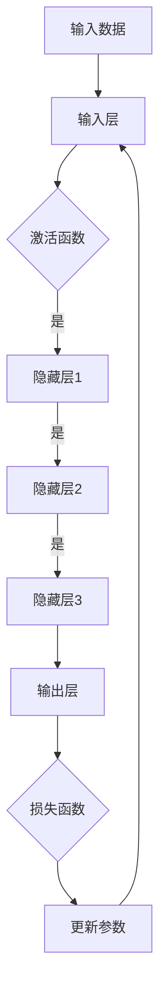
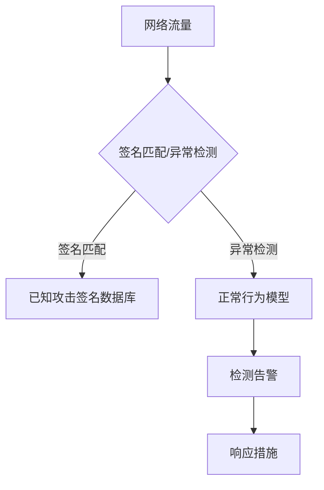
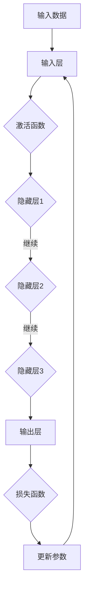

                 

---

# 《基于深度学习的入侵检测系统设计与实现》

> 关键词：深度学习，入侵检测，网络安全，系统设计，算法优化

> 摘要：本文详细介绍了基于深度学习的入侵检测系统设计与实现过程，从背景理论到实际开发，从数学模型到代码实现，系统性地阐述了入侵检测技术及其应用，旨在为网络安全领域的研究者提供有价值的参考。

---

### 目录大纲

# 《基于深度学习的入侵检测系统设计与实现》

## 第一部分：背景与基础理论

### 第1章：深度学习与入侵检测概述

#### 1.1 深度学习简介

#### 1.2 入侵检测系统简介

#### 1.3 深度学习在入侵检测中的应用

### 第2章：深度学习基础知识

#### 2.1 神经网络基础

#### 2.2 深度学习框架

#### 2.3 数据预处理与特征提取

## 第二部分：入侵检测系统的设计与实现

### 第3章：入侵检测系统架构设计

#### 3.1 系统设计原则

#### 3.2 系统架构图

#### 3.3 系统模块划分

### 第4章：数据集准备与处理

#### 4.1 数据集选择

#### 4.2 数据预处理

#### 4.3 特征提取与选择

### 第5章：深度学习模型设计

#### 5.1 模型选择与优化

#### 5.2 模型训练与调优

#### 5.3 模型评估与验证

### 第6章：入侵检测系统实现

#### 6.1 系统开发环境搭建

#### 6.2 系统核心代码实现

#### 6.3 系统部署与测试

### 第7章：项目实战与案例分析

#### 7.1 实际项目背景

#### 7.2 项目实施步骤

#### 7.3 项目成果与评价

### 第8章：性能优化与安全增强

#### 8.1 系统性能优化

#### 8.2 安全性分析与增强

#### 8.3 未来发展方向

## 附录

### 附录 A：常用深度学习框架介绍

#### A.1 TensorFlow

#### A.2 PyTorch

#### A.3 Keras

### 附录 B：参考文献

#### 参考文献1

#### 参考文献2

#### 参考文献3

### Mermaid 流程图

mermaid
graph TD
A[深度学习] --> B[神经网络基础]
B --> C[数据预处理与特征提取]
C --> D[模型设计]
D --> E[系统架构设计]
E --> F[系统实现]
F --> G[项目实战]
G --> H[性能优化与安全增强]
```markdown
### 第1章：深度学习与入侵检测概述

#### 1.1 深度学习简介

深度学习是一种人工智能的分支，它通过构建多层神经网络模型，对大量数据自动提取特征并进行复杂模式识别。深度学习起源于20世纪40年代，但直到最近几年，随着计算能力和数据量的显著提升，深度学习才真正得到了广泛应用。

**核心概念与联系**：

- **神经网络**：神经网络是深度学习的基础，由大量的节点（或称为神经元）组成，每个节点都通过权重连接到其他节点。
- **前向传播**：数据从输入层经过多层隐藏层，逐层传递到输出层的过程。
- **反向传播**：通过计算输出层误差，反向传播误差到前一层，更新各层的权重和偏置，以优化模型。

**Mermaid 流�程图**：



- **激活函数**：常见的激活函数有Sigmoid、ReLU、Tanh等，用于引入非线性。
- **损失函数**：用于衡量模型预测值与真实值之间的差距，如均方误差（MSE）、交叉熵（Cross-Entropy）等。

#### 1.2 入侵检测系统简介

入侵检测系统（IDS）是一种网络安全技术，用于实时监控网络流量和系统活动，识别潜在的安全威胁。入侵检测系统可以分为两大类：基于签名的入侵检测（SIDS）和基于异常的入侵检测（AIDS）。

**核心概念与联系**：

- **基于签名的入侵检测**：通过匹配已知攻击签名来检测入侵行为。
- **基于异常的入侵检测**：通过分析正常行为模型，检测与正常行为不符的异常行为。

**Mermaid 流程图**：



- **签名匹配**：通过比较网络流量中的数据包与已知的攻击签名数据库中的签名进行匹配。
- **异常检测**：通过统计方法（如统计学习、聚类分析等）建立正常行为模型，并检测与正常行为模型的偏差。

#### 1.3 深度学习在入侵检测中的应用

深度学习在入侵检测中的应用主要表现在以下几个方面：

- **特征提取**：深度学习能够自动提取高维数据中的有效特征，减少人工特征工程的工作量。
- **模式识别**：深度学习模型能够通过学习大量网络流量数据，识别复杂的入侵行为模式。
- **自适应能力**：深度学习模型能够自适应地调整参数，以应对不断变化的安全威胁。

**核心算法原理讲解**：

深度学习在入侵检测中的核心算法包括：

- **卷积神经网络（CNN）**：适用于处理图像数据，通过卷积操作提取图像特征。
  ```python
  class ConvLayer(nn.Module):
      def __init__(self, in_channels, out_channels, kernel_size, stride, padding):
          super(ConvLayer, self).__init__()
          self.conv = nn.Conv2d(in_channels, out_channels, kernel_size, stride, padding)
      def forward(self, x):
          return self.conv(x)
  ```

- **循环神经网络（RNN）**：适用于处理序列数据，如时间序列数据或日志数据，能够提取时间序列的特征。
  ```python
  class RNNLayer(nn.Module):
      def __init__(self, input_size, hidden_size):
          super(RNNLayer, self).__init__()
          self.lstm = nn.LSTM(input_size, hidden_size)
      def forward(self, x):
          x, (hidden, cell) = self.lstm(x)
          return x, hidden, cell
  ```

**数学模型和数学公式**：

- **前向传播**：
  $$ y = \sigma(Wx + b) $$
  其中，$y$ 为输出，$\sigma$ 为激活函数，$W$ 为权重，$b$ 为偏置。

- **反向传播**：
  $$ \delta = \frac{\partial L}{\partial z} $$
  $$ \frac{\partial L}{\partial W} = \delta x^T $$
  $$ \frac{\partial L}{\partial b} = \delta $$

  其中，$L$ 为损失函数，$z$ 为中间层的输出，$\delta$ 为误差。

**项目实战**：

以下是一个简单的基于深度学习的入侵检测系统的代码实现：

```python
import torch
import torch.nn as nn
import torch.optim as optim

# 模型定义
class SimpleCNN(nn.Module):
    def __init__(self):
        super(SimpleCNN, self).__init__()
        self.conv1 = nn.Conv2d(1, 32, 3, 1)
        self.fc1 = nn.Linear(32 * 28 * 28, 128)
        self.fc2 = nn.Linear(128, 10)
    
    def forward(self, x):
        x = self.conv1(x)
        x = nn.functional.relu(x)
        x = torch.flatten(x, 1)
        x = self.fc1(x)
        x = nn.functional.relu(x)
        x = self.fc2(x)
        return x

# 模型实例化
model = SimpleCNN()

# 损失函数和优化器
criterion = nn.CrossEntropyLoss()
optimizer = optim.Adam(model.parameters(), lr=0.001)

# 训练过程
num_epochs = 5
for epoch in range(num_epochs):
    for inputs, labels in train_loader:
        optimizer.zero_grad()
        outputs = model(inputs)
        loss = criterion(outputs, labels)
        loss.backward()
        optimizer.step()
    print(f'Epoch {epoch+1}/{num_epochs}, Loss: {loss.item()}')

# 测试过程
model.eval()
with torch.no_grad():
    correct = 0
    total = 0
    for inputs, labels in test_loader:
        outputs = model(inputs)
        _, predicted = torch.max(outputs.data, 1)
        total += labels.size(0)
        correct += (predicted == labels).sum().item()
    print(f'Accuracy: {100 * correct / total}%')
```

**代码解读与分析**：

1. **模型定义**：定义了一个简单的卷积神经网络，包含一个卷积层、一个ReLU激活函数和一个全连接层。
2. **损失函数和优化器**：使用交叉熵损失函数和Adam优化器。
3. **训练过程**：通过迭代更新模型参数，减小损失函数的值。
4. **测试过程**：在测试集上评估模型性能，计算准确率。

通过上述内容，我们可以了解到深度学习在入侵检测领域的应用及其核心算法原理，同时通过项目实战展示了如何实现一个简单的入侵检测系统。

---

### 第2章：深度学习基础知识

#### 2.1 神经网络基础

神经网络（Neural Networks，NN）是深度学习的基础，模拟了人脑的神经元结构和信息处理方式。一个基本的神经网络由输入层、一个或多个隐藏层以及输出层组成。

**核心概念与联系**：

- **神经元**：神经网络的基本单位，接收输入信号，通过权重进行加权求和，并加上偏置，然后通过激活函数产生输出。
- **激活函数**：用于引入非线性，常见的激活函数有Sigmoid、ReLU、Tanh等。
- **前向传播**：输入数据从输入层经过隐藏层，最后到达输出层的过程。
- **反向传播**：通过计算输出层的误差，反向传播误差到输入层，更新各层的权重和偏置。

**Mermaid 流程图**：



**数学模型和数学公式**：

- **前向传播**：
  $$ y = \sigma(Wx + b) $$
  其中，$y$ 为输出，$\sigma$ 为激活函数，$W$ 为权重，$b$ 为偏置。

- **反向传播**：
  $$ \delta = \frac{\partial L}{\partial z} $$
  $$ \frac{\partial L}{\partial W} = \delta x^T $$
  $$ \frac{\partial L}{\partial b} = \delta $$

  其中，$L$ 为损失函数，$z$ 为中间层的输出，$\delta$ 为误差。

**项目实战**：

以下是一个简单的神经网络模型实现：

```python
import torch
import torch.nn as nn
import torch.optim as optim

# 模型定义
class SimpleNN(nn.Module):
    def __init__(self, input_size, hidden_size, output_size):
        super(SimpleNN, self).__init__()
        self.fc1 = nn.Linear(input_size, hidden_size)
        self.fc2 = nn.Linear(hidden_size, output_size)
    
    def forward(self, x):
        x = self.fc1(x)
        x = nn.functional.relu(x)
        x = self.fc2(x)
        return x

# 模型实例化
model = SimpleNN(input_size=10, hidden_size=50, output_size=2)

# 损失函数和优化器
criterion = nn.CrossEntropyLoss()
optimizer = optim.Adam(model.parameters(), lr=0.001)

# 训练过程
num_epochs = 5
for epoch in range(num_epochs):
    for inputs, labels in train_loader:
        optimizer.zero_grad()
        outputs = model(inputs)
        loss = criterion(outputs, labels)
        loss.backward()
        optimizer.step()
    print(f'Epoch {epoch+1}/{num_epochs}, Loss: {loss.item()}')

# 测试过程
model.eval()
with torch.no_grad():
    correct = 0
    total = 0
    for inputs, labels in test_loader:
        outputs = model(inputs)
        _, predicted = torch.max(outputs.data, 1)
        total += labels.size(0)
        correct += (predicted == labels).sum().item()
    print(f'Accuracy: {100 * correct / total}%')
```

**代码解读与分析**：

1. **模型定义**：定义了一个简单的全连接神经网络，包含一个输入层、一个隐藏层和一个输出层。
2. **损失函数和优化器**：使用交叉熵损失函数和Adam优化器。
3. **训练过程**：通过迭代更新模型参数，减小损失函数的值。
4. **测试过程**：在测试集上评估模型性能，计算准确率。

通过上述内容，我们可以了解到神经网络的基础知识及其在深度学习中的应用。

---

#### 2.2 深度学习框架

深度学习框架是用于实现和训练深度学习模型的软件库，它们提供了高效的计算引擎和丰富的API，简化了深度学习模型的开发过程。以下是一些流行的深度学习框架：

- **TensorFlow**：由Google开发的开源深度学习框架，支持多种机器学习和深度学习模型。
- **PyTorch**：由Facebook开发的开源深度学习框架，以其动态计算图和易用性受到广泛欢迎。
- **Keras**：一个高层次的深度学习API，能够与TensorFlow和Theano等框架结合使用。

**核心概念与联系**：

- **动态计算图**：TensorFlow和PyTorch都使用动态计算图来构建模型，模型在运行时动态生成。
- **静态计算图**：Keras使用静态计算图，模型在构建时已经确定，运行时不再改变。

**项目实战**：

以下是在PyTorch中实现一个简单的线性回归模型的例子：

```python
import torch
import torch.nn as nn
import torch.optim as optim

# 数据集
x = torch.tensor([[1], [2], [3], [4]], requires_grad=True)
y = torch.tensor([[0], [1], [2], [3]], requires_grad=False)

# 模型定义
class LinearRegressionModel(nn.Module):
    def __init__(self):
        super(LinearRegressionModel, self).__init__()
        self.linear = nn.Linear(1, 1)  # 1输入1输出
  
    def forward(self, x):
        return self.linear(x)

model = LinearRegressionModel()

# 损失函数和优化器
criterion = nn.MSELoss()
optimizer = optim.SGD(model.parameters(), lr=0.01)

# 训练过程
num_epochs = 100
for epoch in range(num_epochs):
    model.zero_grad()
    outputs = model(x)
    loss = criterion(outputs, y)
    loss.backward()
    optimizer.step()
    if epoch % 10 == 0:
        print(f'Epoch {epoch+1}, Loss: {loss.item()}')

# 测试过程
model.eval()
with torch.no_grad():
    test_loss = criterion(model(x), y)
print(f'Test Loss: {test_loss.item()}')
```

**

