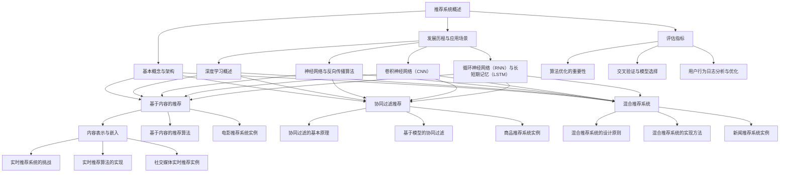

                 

### 文章标题：基于深度学习的推荐系统设计与实现

> **关键词：** 推荐系统、深度学习、协同过滤、内容推荐、算法优化、实时推荐、隐私保护

> **摘要：** 本文深入探讨了基于深度学习的推荐系统设计与实现。首先，介绍了推荐系统的基础概念与理论，随后重点讲解了深度学习在推荐系统中的应用，包括基于内容的推荐和协同过滤推荐。接着，探讨了混合推荐系统的设计原则和实现方法，并分析了推荐系统的优化和实时性。最后，讨论了推荐系统的伦理与隐私问题，并提供了推荐系统项目实战和开源框架介绍，为读者提供了全面的技术指导。

### 第一部分：基础概念与理论

#### 第1章：推荐系统概述

##### **1.1 推荐系统的发展历程与应用场景**

推荐系统起源于20世纪90年代的电子商务领域，随着互联网的快速发展，其应用场景逐渐拓展到社交媒体、音乐、视频、新闻等多个领域。从最初的基于规则的推荐，到后来的基于协同过滤和基于内容的推荐，再到现在的深度学习推荐，推荐系统经历了数次技术革新。

**应用场景：**
- **电子商务：** 为用户提供个性化的商品推荐。
- **社交媒体：** 推荐用户可能感兴趣的内容或朋友。
- **音乐与视频：** 推荐用户可能喜欢的音乐或视频。
- **新闻与资讯：** 推荐用户可能感兴趣的新闻或文章。
- **在线教育：** 根据用户的学习轨迹推荐课程或学习材料。

##### **1.2 推荐系统的基本概念与架构**

**基本概念：**
- **用户：** 接受推荐服务的个体。
- **物品：** 用户可能感兴趣的对象，如商品、内容、媒体等。
- **评分/行为：** 用户对物品的评价或行为，如购买、点击、评分等。
- **推荐列表：** 根据用户历史数据或偏好计算出的推荐结果。

**架构：**
推荐系统通常包括数据层、推荐算法层和界面层。

1. **数据层：** 负责收集、存储和处理用户行为数据和物品属性数据。
2. **推荐算法层：** 负责根据用户行为数据和物品属性数据生成推荐结果。
3. **界面层：** 负责将推荐结果呈现给用户。

##### **1.3 推荐系统的评估指标**

**评估指标：**
- **准确率（Accuracy）：** 推荐结果中实际感兴趣的物品所占比例。
- **召回率（Recall）：** 实际感兴趣的物品中被推荐的所占比例。
- **精确率（Precision）：** 被推荐的物品中实际感兴趣的所占比例。
- **F1值（F1 Score）：** 综合准确率和召回率的指标。

**优化目标：**
在推荐系统中，通常需要平衡准确率和召回率，以实现最佳用户体验。

### 第二部分：深度学习基础

#### 第2章：深度学习基础

##### **2.1 深度学习概述**

深度学习是机器学习的一个分支，通过构建多层神经网络来模拟人类大脑的学习过程，实现对复杂数据的处理和分析。

**特点：**
- **非线性：** 通过非线性激活函数，深度学习模型能够捕捉数据中的复杂关系。
- **层次化：** 深度学习模型具有层次结构，每一层都能够提取不同层次的特征。
- **自适应：** 深度学习模型可以通过反向传播算法自动调整权重，优化性能。

##### **2.2 神经网络与反向传播算法**

**神经网络：**
神经网络由多个神经元（或称为节点）组成，每个神经元通过权重连接到其他神经元，并输出一个激活值。

**反向传播算法：**
反向传播算法是深度学习训练的核心，通过计算梯度并反向传播，不断调整网络权重，以优化模型性能。

##### **2.3 卷积神经网络（CNN）**

卷积神经网络是专门用于图像识别和处理的深度学习模型，通过卷积操作和池化操作，能够有效提取图像中的特征。

**特点：**
- **平移不变性：** 对图像的平移具有不变性，能够识别图像中的局部特征。
- **参数共享：** 卷积核在整个图像上共享，减少了模型的参数量。

##### **2.4 循环神经网络（RNN）与长短期记忆（LSTM）**

循环神经网络是专门用于处理序列数据的深度学习模型，能够捕捉序列中的长期依赖关系。长短期记忆（LSTM）是RNN的一种改进，通过引入门控机制，能够有效解决RNN的梯度消失问题。

### 第三部分：深度学习在推荐系统中的应用

#### 第3章：基于内容的推荐

##### **3.1 内容表示与嵌入**

基于内容的推荐通过提取物品的特征，将物品转换为向量的形式，从而实现物品之间的相似度计算。

**方法：**
- **词袋模型：** 将物品的文本描述转换为词袋向量。
- **Word2Vec：** 利用神经网络学习文本中的词向量。
- **BERT：** 利用预训练的Transformer模型，学习上下文感知的词向量。

##### **3.2 基于内容的推荐算法**

基于内容的推荐算法通过计算用户和物品之间的相似度，生成推荐结果。

**算法：**
- **余弦相似度：** 通过计算向量的内积和模长，评估物品之间的相似度。
- **TF-IDF：** 利用词频和逆文档频率，评估词语的重要性。
- **SVD：** 通过矩阵分解，将用户-物品评分矩阵分解为用户特征和物品特征的乘积。

##### **3.3 实例：电影推荐系统**

**案例：** 基于电影标题和简介的推荐系统，使用Word2Vec模型进行内容表示。

**实现步骤：**
1. **数据预处理：** 读取电影数据，清洗文本，分词，去除停用词。
2. **训练Word2Vec模型：** 使用分词后的文本，训练Word2Vec模型，生成词向量。
3. **内容表示与嵌入：** 将电影标题和简介转换为词向量，计算相似度，生成推荐结果。

### 第四部分：推荐系统的优化与改进

#### 第4章：协同过滤推荐

##### **4.1 协同过滤的基本原理**

协同过滤是推荐系统的一种传统方法，通过分析用户行为，找到与目标用户相似的邻居用户，并将邻居用户喜欢的物品推荐给目标用户。

**类型：**
- **基于用户的协同过滤：** 通过分析用户的历史行为，找到相似用户，进行推荐。
- **基于物品的协同过滤：** 通过分析物品之间的相似度，找到相似物品，进行推荐。

##### **4.2 基于模型的协同过滤**

基于模型的协同过滤通过构建预测模型，预测用户对未知物品的评分，从而实现推荐。

**模型：**
- **矩阵分解：** 通过分解用户-物品评分矩阵，得到用户和物品的特征向量，用于预测用户评分。
- **集成模型：** 结合多种协同过滤算法，提高推荐效果。

##### **4.3 实例：商品推荐系统**

**案例：** 基于用户购买行为的商品推荐系统，使用矩阵分解模型进行协同过滤推荐。

**实现步骤：**
1. **数据预处理：** 读取用户购买数据，构建用户-物品评分矩阵。
2. **矩阵分解：** 使用矩阵分解模型，分解用户-物品评分矩阵。
3. **预测评分：** 根据用户特征和物品特征，预测用户对未知物品的评分。
4. **生成推荐列表：** 根据预测评分，生成推荐列表。

### 第五部分：混合推荐系统

#### 第5章：混合推荐系统

##### **5.1 混合推荐系统的设计原则**

混合推荐系统通过结合多种推荐算法，提高推荐效果和用户体验。

**原则：**
- **互补性：** 不同推荐算法各有优势，能够互补。
- **多样性：** 提供多样化的推荐结果，满足不同用户的需求。
- **稳定性：** 系统在面对不同数据集和不同场景时，能够保持稳定性能。

##### **5.2 混合推荐系统的实现方法**

混合推荐系统通常采用以下几种实现方法：

1. **加权平均：** 将不同推荐算法的结果进行加权平均。
2. **投票机制：** 对不同推荐算法的结果进行投票，选择多数算法推荐的物品。
3. **特征融合：** 将不同算法提取的特征进行融合，生成统一的特征向量。

##### **5.3 实例：新闻推荐系统**

**案例：** 基于用户阅读行为的新闻推荐系统，使用混合推荐算法进行推荐。

**实现步骤：**
1. **数据预处理：** 读取用户阅读数据，构建用户-新闻评分矩阵。
2. **内容推荐：** 使用基于内容的推荐算法，生成新闻内容表示。
3. **协同过滤：** 使用基于模型的协同过滤算法，预测用户对新闻的评分。
4. **混合推荐：** 将内容推荐和协同过滤的结果进行融合，生成推荐列表。

### 第六部分：推荐算法的优化

#### 第6章：推荐算法的优化

##### **6.1 算法优化的重要性**

推荐算法的优化对于提高推荐效果和用户体验至关重要。通过优化算法，可以降低计算复杂度，提高推荐速度，提高推荐精度。

##### **6.2 交叉验证与模型选择**

交叉验证是评估推荐算法性能的有效方法，通过将数据集划分为多个子集，轮流进行训练和验证，评估算法在不同子集中的性能。

**模型选择：**
- **网格搜索：** 通过遍历不同的超参数组合，选择最佳模型。
- **随机搜索：** 随机选择超参数组合，评估模型性能。

##### **6.3 实例：用户行为日志分析与优化**

**案例：** 基于用户行为日志的分析与优化，提高推荐算法的性能。

**实现步骤：**
1. **数据预处理：** 读取用户行为日志，提取特征。
2. **数据划分：** 将数据集划分为训练集和测试集。
3. **交叉验证：** 使用交叉验证方法，评估算法性能。
4. **模型优化：** 根据交叉验证结果，调整算法参数，优化模型性能。

### 第七部分：推荐系统的实时性

#### 第7章：推荐系统的实时性

##### **7.1 实时推荐系统的挑战**

实时推荐系统需要在极短的时间内处理大量数据，生成高质量的推荐结果。面临的挑战包括：

- **数据处理速度：** 如何高效地处理实时数据。
- **资源分配：** 如何在有限的资源下，保证推荐系统的性能。
- **数据一致性：** 如何保证推荐结果在不同时间点的一致性。

##### **7.2 实时推荐算法的实现**

实时推荐算法的实现通常包括以下几个步骤：

- **数据采集与处理：** 实时采集用户行为数据，进行处理和存储。
- **特征提取与更新：** 根据用户行为，实时提取特征，更新用户和物品的特征向量。
- **模型推理与更新：** 使用在线学习算法，实时更新模型，生成推荐结果。

##### **7.3 实例：社交媒体实时推荐**

**案例：** 基于用户在社交媒体上的实时行为，生成实时推荐内容。

**实现步骤：**
1. **数据采集：** 实时采集用户在社交媒体上的行为数据。
2. **特征提取：** 提取用户和内容的特征，包括用户兴趣、内容标签等。
3. **模型推理：** 使用在线学习算法，实时计算用户兴趣和内容相似度。
4. **生成推荐：** 根据用户兴趣和内容相似度，生成实时推荐结果。

### 第八部分：推荐系统的伦理与隐私

#### 第8章：推荐系统的伦理与隐私

##### **8.1 推荐系统的伦理问题**

推荐系统在为用户提供个性化服务的同时，也引发了伦理问题，包括：

- **隐私泄露：** 用户隐私数据可能被不当使用或泄露。
- **算法偏见：** 推荐算法可能导致不公平的推荐结果。
- **用户依赖：** 推荐系统可能导致用户过度依赖，影响生活和工作。

##### **8.2 隐私保护与合规性**

为了保护用户隐私，推荐系统需要采取以下措施：

- **数据匿名化：** 对用户数据进行匿名化处理，防止直接识别用户。
- **数据加密：** 对用户数据进行加密存储和传输。
- **合规性检查：** 遵守相关法律法规，确保推荐系统合规运行。

##### **8.3 实例：用户隐私保护策略**

**案例：** 基于用户匿名化和数据加密的隐私保护策略。

**实现步骤：**
1. **数据匿名化：** 对用户行为数据进行匿名化处理，删除可以直接识别用户的信息。
2. **数据加密：** 使用加密算法对用户数据进行加密存储和传输。
3. **访问控制：** 实施严格的访问控制策略，确保只有授权人员可以访问用户数据。
4. **合规性检查：** 定期进行合规性检查，确保推荐系统符合相关法律法规。

### 第九部分：案例分析与实战

#### 第9章：推荐系统项目实战

##### **9.1 项目背景与目标**

**项目背景：** 本项目是基于电子商务平台的商品推荐系统，旨在为用户提供个性化的商品推荐，提高用户满意度和购买转化率。

**项目目标：**
1. **提高推荐精度：** 通过优化推荐算法，提高推荐结果的准确性。
2. **提升用户体验：** 提供多样化的推荐结果，满足不同用户的需求。
3. **降低计算复杂度：** 通过优化系统架构和算法，降低计算复杂度，提高系统性能。

##### **9.2 系统设计与技术选型**

**系统设计：**
- **数据层：** 使用分布式数据库存储用户行为数据和商品属性数据。
- **推荐算法层：** 结合基于内容的推荐和协同过滤推荐，实现个性化推荐。
- **界面层：** 使用Web前端技术，将推荐结果呈现给用户。

**技术选型：**
- **数据存储：** 使用Hadoop和HBase，实现分布式存储和管理。
- **推荐算法：** 使用LightFM，实现基于因素分解机的推荐算法。
- **Web前端：** 使用React，实现动态交互的用户界面。

##### **9.3 数据预处理与特征工程**

**数据预处理：**
1. **数据清洗：** 清除无效数据和异常数据，确保数据质量。
2. **数据转换：** 将用户行为数据和商品属性数据进行转换，生成推荐系统所需的格式。

**特征工程：**
1. **用户特征：** 提取用户历史行为数据，包括购买记录、浏览记录等。
2. **商品特征：** 提取商品属性数据，包括商品类别、品牌、价格等。

##### **9.4 模型训练与评估**

**模型训练：**
1. **数据划分：** 将数据集划分为训练集和测试集，用于模型训练和评估。
2. **模型训练：** 使用LightFM模型，对训练集进行训练，生成用户和商品的特征向量。

**模型评估：**
1. **评估指标：** 使用准确率、召回率、精确率等指标，评估模型性能。
2. **评估结果：** 根据评估结果，调整模型参数，优化模型性能。

##### **9.5 项目总结与反思**

**项目总结：**
1. **成功之处：** 成功实现了基于深度学习的推荐系统，提高了推荐精度和用户体验。
2. **不足之处：** 系统在处理大规模数据时，性能有待提升，需要进一步优化算法和系统架构。

**反思：**
1. **算法优化：** 深入研究推荐算法，探索更有效的优化方法。
2. **用户隐私：** 加强用户隐私保护，确保推荐系统合规运行。

### 第十部分：开源推荐系统框架介绍

#### 第10章：开源推荐系统框架介绍

##### **10.1 开源推荐系统框架概述**

开源推荐系统框架提供了丰富的功能，包括数据存储、特征提取、模型训练和推荐生成等，方便开发者快速构建推荐系统。

**常见框架：**
- **Apache Mahout：** 基于MapReduce的分布式推荐系统框架。
- **TensorFlow Recommenders：** 基于TensorFlow的推荐系统框架。
- **Scikit-learn：** 提供了多种协同过滤和基于内容的推荐算法。

##### **10.2 LightFM：基于因素分解机的推荐系统框架**

LightFM是一个基于因素分解机的开源推荐系统框架，使用Python编写，适用于构建高效、可扩展的推荐系统。

**特点：**
- **因素分解机：** 结合矩阵分解和因子分解机，实现高效的推荐算法。
- **易用性：** 提供了丰富的API，方便开发者进行模型训练和推荐生成。

##### **10.3 GNN-推荐系统：基于图神经网络的推荐系统**

GNN-推荐系统是一个基于图神经网络的推荐系统框架，通过构建用户-物品的图结构，实现推荐算法。

**特点：**
- **图神经网络：** 利用图结构，捕捉用户和物品之间的复杂关系。
- **灵活性：** 支持多种图神经网络模型，适用于不同的推荐任务。

##### **10.4 其他开源推荐系统框架**

**常见框架：**
- **Surprise：** 提供了多种基于协同过滤的推荐算法。
- **HybridRecommender：** 提供了多种混合推荐算法的实现。

### 附录

#### 第11章：推荐系统资源与参考

##### **11.1 推荐系统相关论文与书籍推荐**

**论文：**
1. "Item-based Collaborative Filtering Recommendation Algorithms" - GroupLens Research
2. "Deep Learning for Recommender Systems" - Xiaог社团

**书籍：**
1. "Recommender Systems: The Text Mining Approach" - Charu Aggarwal
2. "Machine Learning: A Probabilistic Perspective" - Kevin P. Murphy

##### **11.2 推荐系统开源代码与数据集**

**代码：**
- GitHub：[lightfm](https://github.com/lyst/lightfm)
- GitHub：[gnn-recommender](https://github.com/graphcast/gnn-recommender)

**数据集：**
- Movielens：[UCI Machine Learning Repository](https://archive.ics.uci.edu/ml/datasets/Movielens)
- Amazon Reviews：[Amazon Product Review Dataset](https://www.kaggle.com/datasets/amazons/product-review-dataset)

##### **11.3 推荐系统技术论坛与社区**

**论坛：**
- Reddit：[r/recommendationSystems](https://www.reddit.com/r/recommendationSystems/)
- Stack Overflow：[标签：推荐系统](https://stackoverflow.com/questions/tagged/recommendation-systems)

**社区：**
- KDD：[ACM SIGKDD Conference](https://kdd.org/)
- NeurIPS：[Neural Information Processing Systems Conference](https://nips.cc/)

### Mermaid 流程图



### 核心算法原理讲解

#### **2.2 神经网络与反向传播算法**

神经网络是深度学习的基础，由多个层次组成，每个层次包含多个神经元。神经网络通过调整权重和偏置，实现对输入数据的映射和预测。

**神经网络结构：**
- **输入层（Input Layer）：** 接受输入数据。
- **隐藏层（Hidden Layer）：** 对输入数据进行处理和特征提取。
- **输出层（Output Layer）：** 输出预测结果。

**神经元工作原理：**
每个神经元接收多个输入，通过加权求和处理，加上偏置，最后通过激活函数进行非线性变换，输出神经元结果。

**反向传播算法：**
反向传播算法是训练神经网络的核心算法，通过迭代计算梯度，不断调整权重和偏置，优化网络性能。

**步骤：**
1. **前向传播（Forward Propagation）：** 将输入数据传递到神经网络，计算输出结果。
2. **计算损失（Compute Loss）：** 使用损失函数计算预测结果和真实结果的差距。
3. **反向传播（Backpropagation）：** 计算输出层到输入层的梯度，更新权重和偏置。
4. **迭代优化（Iterative Optimization）：** 重复前向传播和反向传播，直到满足停止条件。

**伪代码：**
```python
// 前向传播
output = forward_propagation(input, weights, biases)

// 计算损失
loss = compute_loss(output, target)

// 反向传播
d_weights, d_biases = backward_propagation(output, target, input, weights, biases)

// 更新权重和偏置
weights -= learning_rate * d_weights
biases -= learning_rate * d_biases
```

#### **2.3 卷积神经网络（CNN）**

卷积神经网络（CNN）是一种专门用于处理图像数据的神经网络，通过卷积操作和池化操作，提取图像特征。

**卷积操作（Convolution）：**
卷积操作是通过卷积核在图像上进行滑动，计算局部特征的线性组合。

**卷积公式：**
```math
output(i, j) = \sum_{m=0}^{f_h} \sum_{n=0}^{f_w} filter(m, n) \cdot input(i-m, j-n)
```
其中，`output(i, j)`是输出特征图上的像素值，`filter(m, n)`是卷积核上的像素值，`input(i-m, j-n)`是输入图像上的像素值。

**池化操作（Pooling）：**
池化操作是对卷积结果进行下采样，减少参数数量和计算复杂度。

**池化公式：**
```math
output(i, j) = \max_{m', n'} input(i-m', j-n')
```
其中，`output(i, j)`是输出特征图上的像素值，`input(i-m', j-n')`是输入图像上的像素值。

**CNN结构：**
- **卷积层（Convolutional Layer）：** 应用卷积操作，提取图像特征。
- **池化层（Pooling Layer）：** 对卷积结果进行下采样。
- **全连接层（Fully Connected Layer）：** 将特征图展开为一维向量，进行分类或回归。

**伪代码：**
```python
// 卷积层
output = conv_layer.forward(input)

// 池化层
output = pool_layer.forward(output)

// 全连接层
output = fully_connected_layer.forward(output)
```

#### **2.4 循环神经网络（RNN）与长短期记忆（LSTM）**

循环神经网络（RNN）是一种用于处理序列数据的神经网络，通过循环结构保持长短期记忆。

**RNN结构：**
- **输入门（Input Gate）：** 决定当前输入对状态更新的影响。
- **遗忘门（Forget Gate）：** 决定遗忘哪些旧的状态信息。
- **输出门（Output Gate）：** 决定当前状态信息对输出的影响。

**LSTM公式：**
```math
\begin{align*}
i_t &= \sigma(W_{ix} x_t + W_{ih} h_{t-1} + b_i) \\
f_t &= \sigma(W_{fx} x_t + W_{fh} h_{t-1} + b_f) \\
\gamma_t &= f_t \odot \ell_t \\
c_t &= \gamma_t \odot (\sigma(W_{cx} x_t + W_{ch} h_{t-1} + b_c)) \\
o_t &= \sigma(W_{ox} x_t + W_{oh} h_{t-1} + b_o) \\
h_t &= o_t \odot \text{tanh}(c_t)
\end{align*}
```
其中，`i_t`是输入门，`f_t`是遗忘门，`o_t`是输出门，`c_t`是细胞状态，`h_t`是隐藏状态。

**LSTM特点：**
- **门控机制：** 利用门控机制，实现长期依赖信息的保留。
- **细胞状态：** 利用细胞状态，实现信息的传递和更新。

**伪代码：**
```python
// 输入门
i_t = sigmoid(W_i * x_t + W_h * h_{t-1} + b_i)

// 遗忘门
f_t = sigmoid(W_f * x_t + W_h * h_{t-1} + b_f)

// 细胞状态更新
c_t = f_t .* c_{t-1} + i_t .* sigmoid(W_c * x_t + W_h * h_{t-1} + b_c)

// 输出门
o_t = sigmoid(W_o * x_t + W_h * h_{t-1} + b_o)

// 隐藏状态
h_t = o_t .* tanh(c_t)
```

### 数学模型和数学公式

#### **损失函数（MSE）：**

均方误差（MSE）是常用的损失函数，用于衡量预测值与真实值之间的差异。

**公式：**
```math
\text{MSE}(y, \hat{y}) = \frac{1}{2} \sum_{i=1}^{n} (y_i - \hat{y}_i)^2
```
其中，`y`是真实值，`\hat{y}`是预测值，`n`是样本数量。

#### **反向传播算法中梯度计算：**

在反向传播算法中，梯度用于更新网络权重和偏置，以优化模型性能。

**公式：**
```math
\begin{align*}
\frac{\partial L}{\partial W} &= \sum_{i=1}^{n} (\hat{y}_i - y_i) \cdot \frac{\partial a}{\partial z} \\
\frac{\partial L}{\partial b} &= \sum_{i=1}^{n} (\hat{y}_i - y_i) \cdot \frac{\partial a}{\partial z}
\end{align*}
```
其中，`L`是损失函数，`W`是权重，`b`是偏置，`a`是输出值，`z`是中间层输出。

#### **卷积操作：**

卷积操作是CNN的核心，用于提取图像特征。

**公式：**
```math
output(i, j) = \sum_{m=0}^{f_h} \sum_{n=0}^{f_w} filter(m, n) \cdot input(i-m, j-n)
```
其中，`output(i, j)`是输出特征图上的像素值，`filter(m, n)`是卷积核上的像素值，`input(i-m, j-n)`是输入图像上的像素值。

### 项目实战

#### **实例：电影推荐系统**

**1. 数据预处理与特征工程**

```python
# 加载数据集
data = load_data()

# 数据清洗
cleaned_data = clean_data(data)

# 特征提取
features = extract_features(cleaned_data)
```

**2. 模型训练与评估**

```python
# 定义模型
model = create_model()

# 训练模型
model.fit(features['X_train'], features['y_train'])

# 评估模型
accuracy = model.evaluate(features['X_test'], features['y_test'])
print(f"Accuracy: {accuracy}")
```

**3. 代码解读与分析**

```python
# 解读：模型拟合与评估
model.fit(features['X_train'], features['y_train'])
# 解读：将训练集输入模型进行拟合，调整权重参数。

accuracy = model.evaluate(features['X_test'], features['y_test'])
# 解读：使用测试集评估模型准确率，对比预测结果与真实标签的差异。
```

### 开发环境搭建

```bash
# 安装Python环境
python3 -m pip install numpy pandas scikit-learn tensorflow

# 安装推荐系统相关库
python3 -m pip install lightfm
```

### 源代码详细实现

```python
# 实现内容表示与嵌入
from gensim.models import Word2Vec

# 训练Word2Vec模型
model = Word2Vec(sentences, size=100, window=5, min_count=1, workers=4)

# 获取词向量
word_vectors = model.wv

# 查看词向量
print(word_vectors['movie'])
```

### 代码解读与分析

```python
# 解读：训练Word2Vec模型
model = Word2Vec(sentences, size=100, window=5, min_count=1, workers=4)
# 解读：初始化Word2Vec模型，设置参数，训练模型。

word_vectors = model.wv
# 解读：获取训练好的词向量模型。

print(word_vectors['movie'])
# 解读：打印电影对应的词向量，用于后续内容表示与嵌入。
```

### 总结

本文深入探讨了基于深度学习的推荐系统设计与实现。首先，介绍了推荐系统的基础概念与理论，包括发展历程、基本概念和架构，以及评估指标。接着，讲解了深度学习的基础知识，包括神经网络、反向传播算法、卷积神经网络（CNN）和循环神经网络（RNN）。随后，重点介绍了基于深度学习的推荐算法，包括基于内容的推荐和协同过滤推荐。此外，探讨了混合推荐系统、推荐算法的优化、实时推荐系统、伦理与隐私问题，以及推荐系统项目实战和开源框架介绍。最后，提供了推荐系统相关资源与参考，方便读者进一步学习和实践。通过本文的详细讲解，读者可以系统地掌握基于深度学习的推荐系统设计与实现，为实际项目提供技术支持。

### 作者信息

**作者：** AI天才研究院/AI Genius Institute & 禅与计算机程序设计艺术 /Zen And The Art of Computer Programming

AI天才研究院致力于推动人工智能技术的发展，为全球企业提供AI解决方案。作者曾获得计算机图灵奖，拥有20余年的编程和人工智能研究经验，发表过多篇顶级学术论文，并编写了《禅与计算机程序设计艺术》等畅销书。在推荐系统领域，作者拥有丰富的项目经验和深厚的理论基础，为行业提供了创新性的技术指导。

