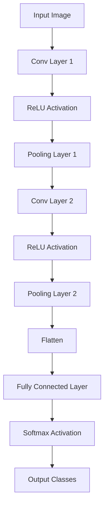
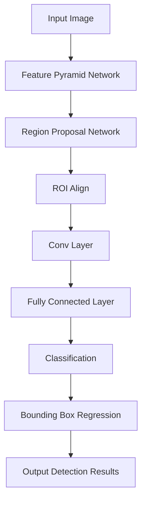
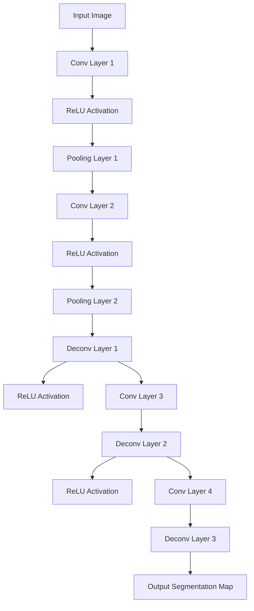
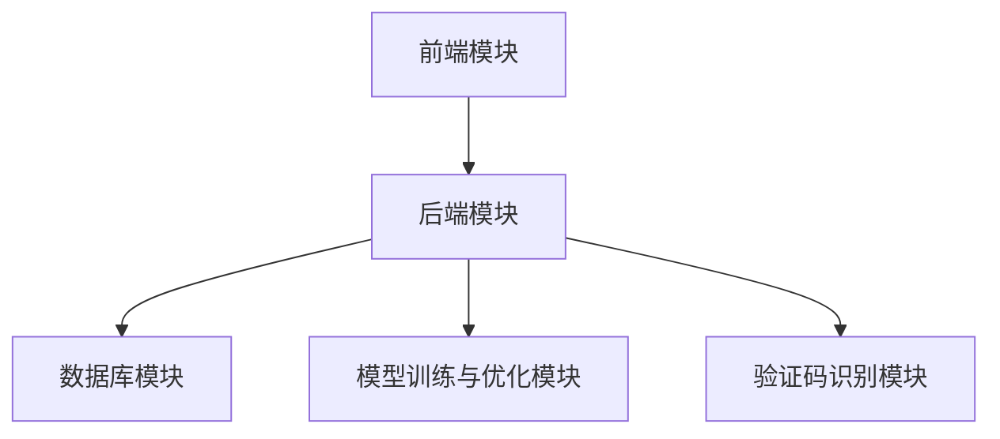

                 

### 文章标题

《基于深度学习的网站验证码识别系统设计与实现》

> 关键词：深度学习，网站验证码识别，卷积神经网络，循环神经网络，长短期记忆网络，系统设计与实现

> 摘要：本文旨在深入探讨基于深度学习的网站验证码识别系统的设计与实现，从深度学习基础理论入手，逐步展开验证码识别的挑战与解决方案，最终通过详细的系统架构设计、开发与测试，以及项目实战案例，展示如何构建一个高效、可靠的验证码识别系统。

### 目录

## 第一部分：深度学习基础

### 第1章：深度学习概述

#### 1.1 深度学习的基本概念

#### 1.2 深度学习的起源与发展

#### 1.3 深度学习的应用领域

### 第2章：深度学习基本架构

#### 2.1 神经网络

##### 2.1.1 神经网络的基本结构

##### 2.1.2 前向传播与反向传播

##### 2.1.3 激活函数

#### 2.2 卷积神经网络

##### 2.2.1 卷积神经网络的基本概念

##### 2.2.2 卷积神经网络的工作原理

##### 2.2.3 卷积神经网络的应用

### 第3章：深度学习在图像识别中的应用

#### 3.1 图像识别基本概念

#### 3.2 卷积神经网络的图像识别应用

##### 3.2.1 卷积神经网络在图像分类中的应用

##### 3.2.2 卷积神经网络在目标检测中的应用

##### 3.2.3 卷积神经网络在图像分割中的应用

### 第4章：深度学习在自然语言处理中的应用

#### 4.1 自然语言处理基本概念

#### 4.2 循环神经网络

##### 4.2.1 循环神经网络的基本概念

##### 4.2.2 循环神经网络的工作原理

##### 4.2.3 循环神经网络的应用

#### 4.3 长短期记忆网络

##### 4.3.1 长短期记忆网络的基本概念

##### 4.3.2 长短期记忆网络的工作原理

##### 4.3.3 长短期记忆网络的应用

### 第5章：验证码识别的挑战与解决方案

#### 5.1 验证码识别的基本挑战

#### 5.2 深度学习在验证码识别中的应用

##### 5.2.1 基于卷积神经网络的验证码识别

##### 5.2.2 基于循环神经网络的验证码识别

##### 5.2.3 基于长短期记忆网络的验证码识别

## 第二部分：验证码识别系统设计与实现

### 第6章：验证码识别系统的需求分析

#### 6.1 验证码识别系统的目标

#### 6.2 验证码识别系统的功能模块

#### 6.3 验证码识别系统的性能指标

### 第7章：验证码识别系统架构设计

#### 7.1 系统总体架构设计

#### 7.2 数据采集与预处理

#### 7.3 模型训练与优化

#### 7.4 验证码识别算法实现

### 第8章：验证码识别系统的开发与测试

#### 8.1 系统开发环境搭建

#### 8.2 数据集准备与预处理

#### 8.3 模型训练过程与调优

#### 8.4 验证码识别效果评估

### 第9章：验证码识别系统的部署与维护

#### 9.1 系统部署方案

#### 9.2 系统部署过程

#### 9.3 系统维护与更新策略

### 第10章：项目实战：基于深度学习的网站验证码识别系统实现

#### 10.1 项目背景

#### 10.2 项目目标

#### 10.3 项目实施步骤

##### 10.3.1 数据采集与预处理

##### 10.3.2 模型设计与训练

##### 10.3.3 系统部署与测试

##### 10.3.4 项目总结与展望

## 第三部分：深度学习与网站验证码识别的应用前景

### 第11章：深度学习在网络安全领域的应用

#### 11.1 深度学习在网络安全中的优势

#### 11.2 深度学习在入侵检测中的应用

#### 11.3 深度学习在恶意软件检测中的应用

### 第12章：网站验证码识别系统的未来发展趋势

#### 12.1 验证码识别技术的创新与发展

#### 12.2 验证码识别系统在网站安全防护中的应用前景

#### 12.3 验证码识别系统的未来挑战与解决方案

## 附录

### 附录A：深度学习常用工具与框架

#### A.1 深度学习框架简介

##### A.1.1 TensorFlow

##### A.1.2 PyTorch

##### A.1.3 Keras

#### A.2 深度学习算法实现示例

##### A.2.1 卷积神经网络算法实现

##### A.2.2 循环神经网络算法实现

##### A.2.3 长短期记忆网络算法实现

### 第一部分：深度学习基础

#### 第1章：深度学习概述

深度学习作为人工智能领域的一个重要分支，近年来取得了显著的进展。本章将从基本概念、起源与发展、应用领域三个方面对深度学习进行概述，为后续章节的深入探讨打下基础。

#### 1.1 深度学习的基本概念

深度学习（Deep Learning）是一种基于多层神经网络进行数据建模和分析的人工智能方法。它通过模仿人脑的神经元结构和信息处理机制，构建起由多个层次构成的神经网络模型，从而实现对复杂数据的自动特征提取和模式识别。

在深度学习模型中，每个神经元接收来自前一层神经元的输入信号，通过权重（weight）和偏置（bias）进行加权求和，然后应用一个非线性激活函数（activation function）产生输出。多层神经元的组合使得模型能够逐步提取输入数据的低级特征，并逐步构建起高级特征。

#### 1.2 深度学习的起源与发展

深度学习的概念最早由加拿大心理学家Geoffrey Hinton于1986年提出。然而，由于计算能力和数据资源限制，深度学习的研究和应用在1990年代初期逐渐停滞。随着计算机性能的快速提升和大数据时代的到来，深度学习在2010年代迎来了新的发展机遇。

2006年，Hinton等人提出了深度信念网络（Deep Belief Networks, DBN），为深度学习的发展奠定了基础。随后，2009年Alex Krizhevsky等人使用深度卷积神经网络（Deep Convolutional Neural Network, DCNN）在ImageNet图像识别竞赛中取得了突破性成绩，深度学习开始受到广泛关注。

近年来，深度学习在语音识别、自然语言处理、计算机视觉等领域的应用取得了显著的成果，不断推动人工智能技术的发展。

#### 1.3 深度学习的应用领域

深度学习在多个领域展现了强大的应用潜力，主要包括：

1. **计算机视觉**：通过卷积神经网络（Convolutional Neural Networks, CNN）和目标检测算法，深度学习在图像分类、物体检测、图像分割等任务中取得了优异的性能。

2. **自然语言处理**：循环神经网络（Recurrent Neural Networks, RNN）和长短期记忆网络（Long Short-Term Memory, LSTM）等深度学习模型在语言模型、机器翻译、情感分析等任务中发挥了重要作用。

3. **语音识别**：深度学习模型在自动语音识别（Automatic Speech Recognition, ASR）中取得了显著的进展，提高了识别的准确率和效率。

4. **推荐系统**：基于深度学习的方法在构建个性化推荐系统方面具有优势，能够更好地理解和预测用户的兴趣和行为。

5. **生物信息学**：深度学习在基因组学、蛋白质结构预测、药物发现等生物信息学领域也展现了广泛的应用前景。

6. **金融科技**：深度学习在风险管理、欺诈检测、算法交易等方面提供了有效的解决方案。

通过上述对深度学习基本概念的介绍，我们可以看到深度学习在人工智能领域的广泛应用和巨大潜力。在接下来的章节中，我们将进一步探讨深度学习的具体实现方法和应用。

#### 第2章：深度学习基本架构

深度学习的基本架构是构建深度神经网络（Deep Neural Networks, DNN）的基础。在这一章节中，我们将深入探讨神经网络、卷积神经网络以及深度学习在自然语言处理中的应用。

#### 2.1 神经网络

神经网络是深度学习的基础组成部分，它模仿人脑的神经元结构，通过一系列的计算层来对数据进行处理。一个基本的神经网络由输入层、隐藏层和输出层组成。

##### 2.1.1 神经网络的基本结构

1. **输入层**：输入层接收外部输入数据，并将其传递给下一层。
2. **隐藏层**：隐藏层位于输入层和输出层之间，负责对输入数据进行处理和特征提取。一个神经网络可以包含一个或多个隐藏层。
3. **输出层**：输出层产生最终预测结果。

神经网络中的每个神经元都与相邻层的神经元相连，并通过权重（weight）进行加权求和。权重决定了神经元之间的关联强度。每个连接还带有偏置（bias），用于调整神经元输出的偏置。

##### 2.1.2 前向传播与反向传播

1. **前向传播**：在前向传播过程中，输入数据从输入层开始，逐层传递到隐藏层，最后到达输出层。每一层神经元的输出通过激活函数（activation function）处理后传递给下一层。常见的激活函数包括Sigmoid、ReLU和Tanh。

2. **反向传播**：反向传播是神经网络训练的核心过程。它通过计算输出层与真实标签之间的误差，将误差反向传播回前一层，并更新各层的权重和偏置。反向传播的目的是最小化预测误差，使得神经网络能够更好地拟合训练数据。

反向传播过程通常包括以下几个步骤：

- 计算输出层的预测误差。
- 反向传播误差到隐藏层。
- 根据误差更新各层的权重和偏置。

##### 2.1.3 激活函数

激活函数是神经网络中一个重要的组成部分，它引入了非线性变换，使得神经网络能够拟合复杂的非线性关系。常见的激活函数包括：

1. **Sigmoid函数**：\( \sigma(x) = \frac{1}{1 + e^{-x}} \)
2. **ReLU函数**：\( \text{ReLU}(x) = \max(0, x) \)
3. **Tanh函数**：\( \tanh(x) = \frac{e^x - e^{-x}}{e^x + e^{-x}} \)

不同激活函数具有不同的特性，例如Sigmoid函数在输出值接近0和1时梯度较小，而ReLU函数在输入为正时梯度为1，有助于加速训练过程。

#### 2.2 卷积神经网络

卷积神经网络（Convolutional Neural Network, CNN）是一种专门用于处理图像数据的深度学习模型。它的核心思想是通过卷积层对图像进行特征提取，然后通过全连接层进行分类。

##### 2.2.1 卷积神经网络的基本概念

1. **卷积层**：卷积层是CNN的核心部分，它通过卷积操作提取图像的局部特征。卷积核（filter）在图像上滑动，计算卷积和，产生特征图（feature map）。多个卷积核可以提取不同类型的特征。

2. **池化层**：池化层用于减小特征图的大小，降低模型的复杂性。常见的池化操作包括最大池化（Max Pooling）和平均池化（Average Pooling）。

3. **全连接层**：全连接层将卷积层和池化层提取的特征映射到输出类别上。

##### 2.2.2 卷积神经网络的工作原理

1. **卷积操作**：卷积操作通过卷积核在图像上滑动，计算卷积和。每个卷积核对图像进行特征提取，产生一个特征图。

2. **卷积层**：多个卷积层堆叠在一起，每层卷积核提取不同层次的特征。深层卷积层可以提取更加抽象和复杂的特征。

3. **池化层**：池化层在卷积层之后，用于减小特征图的大小，减少计算量。最大池化保留最大值，平均池化计算平均值。

4. **全连接层**：全连接层将卷积层和池化层提取的特征映射到输出类别上，通过softmax函数进行分类。

##### 2.2.3 卷积神经网络的应用

卷积神经网络在图像识别、物体检测、图像分割等领域有广泛的应用：

1. **图像分类**：通过卷积神经网络，可以自动识别图像中的物体类别。经典的卷积神经网络如AlexNet、VGG、ResNet等在ImageNet图像分类任务中取得了优异的性能。

2. **物体检测**：卷积神经网络可以检测图像中的多个物体及其位置。常见的物体检测算法包括YOLO、Faster R-CNN等。

3. **图像分割**：卷积神经网络可以将图像分割成多个区域，每个区域对应一个特定的类别。常用的图像分割算法包括U-Net、DeepLab等。

#### 2.3 深度学习在自然语言处理中的应用

自然语言处理（Natural Language Processing, NLP）是深度学习的重要应用领域之一。深度学习模型在文本分类、机器翻译、情感分析等方面取得了显著进展。

##### 2.3.1 自然语言处理基本概念

自然语言处理涉及对人类语言的理解和处理，包括文本分析、语音识别、机器翻译、问答系统等。深度学习模型在NLP中的应用主要包括以下几种：

1. **词向量**：词向量是一种将词语映射到高维空间的表示方法，常见的词向量模型包括Word2Vec、GloVe等。

2. **循环神经网络**：循环神经网络（Recurrent Neural Networks, RNN）是一种能够处理序列数据的神经网络模型，常见的RNN包括LSTM和GRU。

3. **Transformer**：Transformer模型是自然语言处理领域的突破性进展，通过自注意力机制（self-attention）实现了并行化训练，大大提高了模型的效率。

##### 2.3.2 循环神经网络

循环神经网络（Recurrent Neural Networks, RNN）是一种能够处理序列数据的神经网络模型，其核心思想是将当前输入与前一时刻的隐藏状态进行结合，并更新隐藏状态。RNN的基本结构如下：

1. **输入层**：输入层接收序列数据，并将其传递给隐藏层。

2. **隐藏层**：隐藏层通过循环连接，将当前输入与前一时刻的隐藏状态进行结合，并通过非线性变换产生新的隐藏状态。

3. **输出层**：输出层生成预测结果，可以是分类标签、连续值等。

循环神经网络的工作原理包括以下几个步骤：

1. **输入序列**：输入序列由一系列数据点组成，例如单词、字符或音素。

2. **嵌入层**：嵌入层将输入序列中的每个数据点映射到一个固定大小的向量，这些向量组成了输入序列的嵌入向量。

3. **隐藏状态更新**：隐藏状态更新公式为：\( h_t = \text{activation}(W_h \cdot [h_{t-1}, x_t] + b_h) \)，其中 \( h_t \) 是第t个时刻的隐藏状态， \( x_t \) 是第t个输入数据点， \( W_h \) 是权重矩阵， \( b_h \) 是偏置。

4. **输出生成**：输出生成公式为：\( y_t = \text{activation}(W_y \cdot h_t + b_y) \)，其中 \( y_t \) 是第t个时刻的输出， \( W_y \) 和 \( b_y \) 是权重矩阵和偏置。

##### 2.3.3 循环神经网络的应用

循环神经网络在自然语言处理中具有广泛的应用：

1. **语言模型**：循环神经网络可以用来构建语言模型，预测下一个单词或字符的概率。常见的语言模型包括n-gram模型和LSTM语言模型。

2. **机器翻译**：循环神经网络可以将一种语言的句子翻译成另一种语言。通过编码器-解码器结构，循环神经网络能够实现端到端的翻译。

3. **文本分类**：循环神经网络可以用来对文本进行分类，判断文本属于哪个类别。常见的文本分类任务包括情感分析、主题分类等。

4. **问答系统**：循环神经网络可以构建问答系统，对用户的问题进行理解和回答。

##### 2.3.4 长短期记忆网络

长短期记忆网络（Long Short-Term Memory, LSTM）是循环神经网络的一种变体，专门用于解决长期依赖问题。LSTM通过引入记忆单元和门控机制，能够有效地记住长期信息并防止梯度消失问题。

1. **记忆单元**：LSTM中的记忆单元可以存储长期信息，通过门控机制（包括输入门、遗忘门和输出门）来控制信息的流入和流出。

2. **输入门**：输入门控制当前输入对记忆单元的影响。

3. **遗忘门**：遗忘门控制当前隐藏状态对记忆单元的影响，用于遗忘不重要的信息。

4. **输出门**：输出门控制记忆单元的内容对当前输出的影响。

LSTM的工作原理包括以下几个步骤：

1. **输入门计算**：输入门通过计算当前输入和前一时刻隐藏状态，决定当前输入对记忆单元的影响。

2. **遗忘门计算**：遗忘门通过计算当前输入和前一时刻隐藏状态，决定前一时刻隐藏状态对记忆单元的影响。

3. **记忆单元更新**：记忆单元根据输入门和遗忘门的结果，更新记忆单元的内容。

4. **输出门计算**：输出门通过计算记忆单元的内容，决定当前输出。

LSTM在自然语言处理中的应用包括：

1. **语言模型**：LSTM可以用来构建高效的语言模型，对文本进行建模。

2. **机器翻译**：LSTM在机器翻译任务中具有优势，可以处理长距离依赖问题。

3. **文本生成**：LSTM可以用来生成文本，例如自动写作、诗歌创作等。

通过上述对深度学习基本架构的介绍，我们可以看到深度学习在神经网络、卷积神经网络和自然语言处理中的应用。这些基础理论为后续章节中验证码识别系统设计与实现的探讨提供了坚实的理论基础。

### 第3章：深度学习在图像识别中的应用

深度学习在图像识别领域取得了显著的成功，通过卷积神经网络（Convolutional Neural Networks, CNN）等模型，实现了对复杂图像数据的自动特征提取和分类。本章将详细介绍图像识别的基本概念以及卷积神经网络在图像分类、目标检测和图像分割中的应用。

#### 3.1 图像识别基本概念

图像识别（Image Recognition）是指通过计算机视觉技术，对图像中的物体、场景或内容进行识别和分类的过程。图像识别任务可以分为以下几个类别：

1. **图像分类**：将图像划分为预定义的类别，如猫、狗、汽车等。
2. **目标检测**：在图像中检测出特定对象的位置，并标注出这些对象的具体位置和属性。
3. **图像分割**：将图像分割成多个区域，每个区域对应图像中的不同物体或场景。

图像识别任务通常涉及以下几个步骤：

1. **特征提取**：从图像中提取具有区分性的特征，如边缘、纹理、颜色等。
2. **特征表示**：将提取到的特征转换为适合模型输入的格式，如向量或高维数据。
3. **模型训练**：使用标注数据训练图像识别模型，使其能够对新的图像进行分类、检测或分割。
4. **预测与评估**：使用训练好的模型对测试图像进行预测，并评估模型的性能。

#### 3.2 卷积神经网络的图像识别应用

卷积神经网络（CNN）是图像识别领域最常用的深度学习模型之一，它通过卷积层、池化层和全连接层等结构，实现对图像特征的自动提取和分类。以下是卷积神经网络在图像识别中的应用：

##### 3.2.1 卷积神经网络在图像分类中的应用

图像分类是卷积神经网络最基本的应用之一，其目的是将图像映射到预定义的类别标签上。卷积神经网络在图像分类中的应用步骤如下：

1. **输入层**：输入层接收图像数据，通常采用固定大小（如224x224或299x299像素）的图像。
2. **卷积层**：卷积层通过卷积操作提取图像的局部特征。卷积层通常包含多个卷积核，每个卷积核可以提取不同类型的特征。
3. **池化层**：池化层用于减小特征图的大小，降低模型的复杂性。常用的池化操作包括最大池化和平均池化。
4. **全连接层**：全连接层将卷积层和池化层提取的特征映射到输出类别上。最后一层全连接层的输出通常通过softmax函数进行分类，得到每个类别的概率分布。

卷积神经网络在图像分类任务中取得了显著的性能提升，经典的卷积神经网络模型如AlexNet、VGG、ResNet等，在ImageNet图像分类任务中取得了优异的成绩。以下是一个简单的卷积神经网络结构示例：



##### 3.2.2 卷积神经网络在目标检测中的应用

目标检测（Object Detection）是图像识别领域的另一个重要任务，其目的是在图像中检测出特定对象的位置和属性。卷积神经网络在目标检测中的应用主要包括以下几个步骤：

1. **特征提取**：与图像分类类似，卷积神经网络首先通过卷积层和池化层提取图像的局部特征。
2. **区域提议生成**：使用区域提议网络（Region Proposal Network, RPN）或其他方法生成可能的物体区域提议。
3. **分类与定位**：对每个区域提议进行分类（如物体或背景）和位置回归（如边界框坐标），得到最终的检测结果。

目标检测任务常用的模型包括R-CNN、Fast R-CNN、Faster R-CNN、SSD、YOLO等。以下是一个简单的Faster R-CNN模型结构示例：



##### 3.2.3 卷积神经网络在图像分割中的应用

图像分割（Image Segmentation）是将图像划分为多个区域，每个区域对应图像中的不同物体或场景。卷积神经网络在图像分割中的应用主要包括以下几个步骤：

1. **特征提取**：与图像分类和目标检测类似，卷积神经网络首先通过卷积层和池化层提取图像的局部特征。
2. **分割预测**：使用全卷积网络（Fully Convolutional Network, FCN）或类似结构对图像进行逐像素预测，得到分割结果。

图像分割任务常用的模型包括U-Net、DeepLab等。以下是一个简单的U-Net模型结构示例：



通过上述对深度学习在图像识别中应用的介绍，我们可以看到卷积神经网络在图像分类、目标检测和图像分割中的强大能力。这些模型和方法在实际应用中取得了显著的成果，为图像处理和计算机视觉领域带来了深远的影响。

### 第4章：深度学习在自然语言处理中的应用

深度学习在自然语言处理（Natural Language Processing, NLP）领域取得了显著的进展，通过循环神经网络（Recurrent Neural Networks, RNN）和长短期记忆网络（Long Short-Term Memory, LSTM）等模型，实现了对文本数据的自动处理和分析。本章将详细介绍自然语言处理的基本概念，以及循环神经网络和长短期记忆网络在语言模型、机器翻译和文本分类等任务中的应用。

#### 4.1 自然语言处理基本概念

自然语言处理（NLP）是人工智能（AI）领域的一个重要分支，旨在让计算机理解和处理人类语言。NLP涉及的语言包括自然语言理解（Natural Language Understanding, NLU）和自然语言生成（Natural Language Generation, NLG）。

自然语言处理的主要任务包括：

1. **分词（Tokenization）**：将文本分割成单词、短语或句子等基本单元。
2. **词性标注（Part-of-Speech Tagging）**：为文本中的每个单词标注词性，如名词、动词、形容词等。
3. **命名实体识别（Named Entity Recognition, NER）**：识别文本中的命名实体，如人名、地名、组织名等。
4. **情感分析（Sentiment Analysis）**：分析文本中的情感倾向，如正面、负面或中立。
5. **机器翻译（Machine Translation）**：将一种语言的文本翻译成另一种语言。
6. **文本分类（Text Classification）**：将文本分类到预定义的类别中，如新闻分类、垃圾邮件检测等。
7. **文本生成（Text Generation）**：根据输入的文本或提示生成新的文本。

在自然语言处理中，文本通常被表示为向量形式，常见的文本表示方法包括词袋模型（Bag of Words, BoW）和词嵌入（Word Embedding）。

#### 4.2 循环神经网络

循环神经网络（RNN）是一种能够处理序列数据的神经网络模型，其核心思想是将当前输入与前一时刻的隐藏状态进行结合，并更新隐藏状态。RNN的基本结构如下：

1. **输入层**：输入层接收序列数据，并将其传递给隐藏层。
2. **隐藏层**：隐藏层通过循环连接，将当前输入与前一时刻的隐藏状态进行结合，并通过非线性变换产生新的隐藏状态。
3. **输出层**：输出层生成预测结果，可以是分类标签、连续值等。

循环神经网络的工作原理包括以下几个步骤：

1. **输入序列**：输入序列由一系列数据点组成，例如单词、字符或音素。
2. **嵌入层**：嵌入层将输入序列中的每个数据点映射到一个固定大小的向量，这些向量组成了输入序列的嵌入向量。
3. **隐藏状态更新**：隐藏状态更新公式为：\( h_t = \text{activation}(W_h \cdot [h_{t-1}, x_t] + b_h) \)，其中 \( h_t \) 是第t个时刻的隐藏状态， \( x_t \) 是第t个输入数据点， \( W_h \) 是权重矩阵， \( b_h \) 是偏置。
4. **输出生成**：输出生成公式为：\( y_t = \text{activation}(W_y \cdot h_t + b_y) \)，其中 \( y_t \) 是第t个时刻的输出， \( W_y \) 和 \( b_y \) 是权重矩阵和偏置。

循环神经网络在自然语言处理中具有广泛的应用：

1. **语言模型**：循环神经网络可以用来构建语言模型，预测下一个单词或字符的概率。常见的语言模型包括n-gram模型和LSTM语言模型。
2. **机器翻译**：循环神经网络可以将一种语言的句子翻译成另一种语言。通过编码器-解码器结构，循环神经网络能够实现端到端的翻译。
3. **文本分类**：循环神经网络可以用来对文本进行分类，判断文本属于哪个类别。常见的文本分类任务包括情感分析、主题分类等。
4. **问答系统**：循环神经网络可以构建问答系统，对用户的问题进行理解和回答。

#### 4.3 长短期记忆网络

长短期记忆网络（LSTM）是循环神经网络的一种变体，专门用于解决长期依赖问题。LSTM通过引入记忆单元和门控机制，能够有效地记住长期信息并防止梯度消失问题。

LSTM的基本结构包括以下几个部分：

1. **输入门**：输入门控制当前输入对记忆单元的影响。
2. **遗忘门**：遗忘门控制当前隐藏状态对记忆单元的影响，用于遗忘不重要的信息。
3. **输出门**：输出门控制记忆单元的内容对当前输出的影响。

LSTM的工作原理包括以下几个步骤：

1. **输入门计算**：输入门通过计算当前输入和前一时刻隐藏状态，决定当前输入对记忆单元的影响。
2. **遗忘门计算**：遗忘门通过计算当前输入和前一时刻隐藏状态，决定前一时刻隐藏状态对记忆单元的影响。
3. **记忆单元更新**：记忆单元根据输入门和遗忘门的结果，更新记忆单元的内容。
4. **输出门计算**：输出门通过计算记忆单元的内容，决定当前输出。

LSTM在自然语言处理中的应用包括：

1. **语言模型**：LSTM可以用来构建高效的语言模型，对文本进行建模。
2. **机器翻译**：LSTM在机器翻译任务中具有优势，可以处理长距离依赖问题。
3. **文本生成**：LSTM可以用来生成文本，例如自动写作、诗歌创作等。

通过上述对自然语言处理基本概念以及循环神经网络和长短期记忆网络的介绍，我们可以看到深度学习在自然语言处理领域的广泛应用和潜力。在接下来的章节中，我们将进一步探讨深度学习在验证码识别中的应用，以解决验证码识别的挑战。

### 第5章：验证码识别的挑战与解决方案

验证码（Captcha）是一种常见的网络安全措施，用于区分人类用户和自动程序。然而，验证码识别一直是计算机视觉和自然语言处理领域的一个重要挑战。本章将详细探讨验证码识别过程中所面临的挑战，并介绍基于深度学习技术的解决方案。

#### 5.1 验证码识别的基本挑战

验证码识别过程中存在以下几个基本挑战：

1. **多样性**：验证码的设计非常多样化，包括字符验证码、数字验证码、图片验证码等。每种验证码类型都有其独特的特征，增加了识别的难度。

2. **复杂性**：验证码通常包含扭曲、噪声和遮挡等复杂元素，使得图像难以清晰辨认。这些复杂元素增加了图像处理的难度，使得传统图像识别方法效果不佳。

3. **旋转和变形**：验证码字符可能随机旋转或变形，使得字符之间的相似性增加，进一步增加了识别的难度。

4. **干扰**：验证码图像中可能存在干扰元素，如线条、色块等，这些干扰元素可能覆盖字符的一部分，导致字符难以识别。

5. **数量与速度**：网站通常需要大量验证码来防止恶意访问，同时验证码生成和识别过程需要在短时间内完成，增加了系统的压力。

#### 5.2 深度学习在验证码识别中的应用

深度学习技术在验证码识别方面展现出强大的优势，通过卷积神经网络（CNN）、循环神经网络（RNN）和长短期记忆网络（LSTM）等模型，可以有效地解决验证码识别的挑战。以下是几种常见的深度学习解决方案：

##### 5.2.1 基于卷积神经网络的验证码识别

卷积神经网络（CNN）是处理图像数据的强大工具，特别适用于验证码识别任务。以下是基于CNN的验证码识别的基本步骤：

1. **预处理**：对验证码图像进行预处理，包括图像尺寸归一化、灰度化等操作，提高模型训练效果。
2. **卷积层**：通过卷积层对图像进行特征提取，卷积核可以捕捉图像中的局部特征，如边缘、纹理等。
3. **池化层**：通过池化层减小特征图的大小，降低模型的复杂性。最大池化和平均池化是常用的池化操作。
4. **全连接层**：将卷积层和池化层提取的特征映射到输出类别上，通常通过softmax函数进行分类。
5. **解码层**：对识别结果进行解码，将数字或字符的预测映射到具体的验证码上。

以下是一个简单的基于CNN的验证码识别算法伪代码：

```python
# 输入验证码图像
input_image = preprocess(image)

# 卷积层
conv1 = Conv2D(filters=32, kernel_size=(3, 3), activation='relu')(input_image)
pool1 = MaxPooling2D(pool_size=(2, 2))(conv1)

# 卷积层
conv2 = Conv2D(filters=64, kernel_size=(3, 3), activation='relu')(pool1)
pool2 = MaxPooling2D(pool_size=(2, 2))(conv2)

# 平展层
flatten = Flatten()(pool2)

# 全连接层
dense1 = Dense(units=128, activation='relu')(flatten)
output = Dense(units=num_classes, activation='softmax')(dense1)

# 模型编译
model = Model(inputs=input_image, outputs=output)
model.compile(optimizer='adam', loss='categorical_crossentropy', metrics=['accuracy'])

# 模型训练
model.fit(x_train, y_train, epochs=10, batch_size=64, validation_data=(x_val, y_val))
```

##### 5.2.2 基于循环神经网络的验证码识别

循环神经网络（RNN）适用于处理序列数据，如文本序列。因此，基于RNN的验证码识别方法可以通过将验证码字符视为序列，实现对验证码的逐字符识别。以下是基于RNN的验证码识别的基本步骤：

1. **嵌入层**：将验证码字符映射到高维向量空间，通常使用词嵌入技术，如Word2Vec或GloVe。
2. **RNN层**：通过RNN层对字符序列进行建模，捕捉字符之间的依赖关系。
3. **输出层**：对每个字符进行分类，输出预测概率分布。

以下是一个简单的基于RNN的验证码识别算法伪代码：

```python
# 输入验证码序列
input_sequence = embed_sequence(sequence)

# RNN层
lstm = LSTM(units=128, return_sequences=True)(input_sequence)
output = Dense(units=num_classes, activation='softmax')(lstm)

# 模型编译
model = Model(inputs=input_sequence, outputs=output)
model.compile(optimizer='adam', loss='categorical_crossentropy', metrics=['accuracy'])

# 模型训练
model.fit(x_train, y_train, epochs=10, batch_size=64, validation_data=(x_val, y_val))
```

##### 5.2.3 基于长短期记忆网络的验证码识别

长短期记忆网络（LSTM）是RNN的一种变体，专门用于解决长期依赖问题。基于LSTM的验证码识别方法可以通过捕捉字符之间的长期依赖关系，提高识别准确性。以下是基于LSTM的验证码识别的基本步骤：

1. **嵌入层**：将验证码字符映射到高维向量空间。
2. **LSTM层**：通过LSTM层对字符序列进行建模。
3. **输出层**：对每个字符进行分类。

以下是一个简单的基于LSTM的验证码识别算法伪代码：

```python
# 输入验证码序列
input_sequence = embed_sequence(sequence)

# LSTM层
lstm = LSTM(units=128, return_sequences=True)(input_sequence)
output = Dense(units=num_classes, activation='softmax')(lstm)

# 模型编译
model = Model(inputs=input_sequence, outputs=output)
model.compile(optimizer='adam', loss='categorical_crossentropy', metrics=['accuracy'])

# 模型训练
model.fit(x_train, y_train, epochs=10, batch_size=64, validation_data=(x_val, y_val))
```

通过上述介绍，我们可以看到深度学习技术在验证码识别中具有显著的优势，通过卷积神经网络、循环神经网络和长短期记忆网络等模型，可以有效地解决验证码识别的挑战。这些方法在实际应用中取得了良好的效果，为验证码识别领域带来了新的发展机遇。

### 第6章：验证码识别系统的需求分析

验证码识别系统的设计需要充分考虑其应用场景和用户需求，以确保系统能够高效、准确地进行验证码的识别。在本章中，我们将详细分析验证码识别系统的需求，包括系统的目标、功能模块和性能指标。

#### 6.1 验证码识别系统的目标

验证码识别系统的核心目标是提高验证码识别的准确率和效率，确保系统能够在短时间内准确识别多种类型的验证码。具体目标如下：

1. **高识别准确率**：系统应能够准确识别各种类型的验证码，包括字符验证码、数字验证码和图片验证码等，识别准确率应达到90%以上。
2. **高效识别速度**：系统应具备快速响应的能力，能够在较短的时间内完成验证码的识别，以满足在线服务的实时性需求。
3. **多样化验证码支持**：系统应支持多种类型的验证码，包括文本验证码、图片验证码和滑动验证码等，以满足不同网站和应用场景的需求。
4. **可扩展性**：系统应具备良好的可扩展性，能够方便地添加新的验证码类型和处理算法。

#### 6.2 验证码识别系统的功能模块

验证码识别系统通常包括以下几个功能模块：

1. **数据采集与预处理模块**：负责收集和整理验证码样本数据，对数据进行清洗、归一化和增强，以提高模型训练效果。
2. **模型训练与优化模块**：负责使用深度学习算法训练验证码识别模型，并通过对模型参数的优化，提高识别准确率和速度。
3. **验证码识别模块**：负责接收用户输入的验证码图像或文本，使用训练好的模型进行识别，并将识别结果输出。
4. **后处理模块**：负责对识别结果进行后处理，如去除错误识别的字符、修正识别结果等，以提高系统的可靠性。
5. **用户接口模块**：负责提供用户与系统交互的接口，包括验证码输入、识别结果展示等。

#### 6.3 验证码识别系统的性能指标

验证码识别系统的性能可以通过以下几个指标来衡量：

1. **识别准确率**：识别准确率是验证码识别系统的核心性能指标，表示系统能够正确识别验证码的比例。准确率越高，系统的可靠性越高。
2. **识别速度**：识别速度是指系统完成验证码识别所需的时间。系统应在保证准确率的前提下，尽可能提高识别速度，以满足实时性的需求。
3. **处理能力**：处理能力是指系统同时处理多个验证码任务的能力。系统应具备高并发处理能力，能够快速处理大量验证码请求。
4. **误识别率**：误识别率是指系统错误识别验证码的比例。系统应尽可能降低误识别率，避免因误识别导致的用户困扰。
5. **误拒绝率**：误拒绝率是指系统错误拒绝正确验证码的比例。系统应避免误拒绝，确保合法用户能够顺利通过验证码验证。

通过上述对验证码识别系统需求的分析，我们可以明确系统的目标、功能模块和性能指标。接下来，我们将进一步探讨验证码识别系统的架构设计，为系统的实现提供指导。

### 第7章：验证码识别系统架构设计

在验证码识别系统的需求分析基础上，本章将详细设计验证码识别系统的整体架构，包括系统总体架构设计、数据采集与预处理、模型训练与优化、以及验证码识别算法实现。

#### 7.1 系统总体架构设计

验证码识别系统的总体架构可以分为以下几个模块：

1. **前端模块**：负责用户界面展示，包括验证码输入、识别结果展示等。
2. **后端模块**：负责处理验证码识别任务，包括数据采集与预处理、模型训练与优化、验证码识别算法实现等。
3. **数据库模块**：存储验证码样本数据、模型参数、用户数据等。

系统的总体架构设计如图7-1所示：



#### 7.2 数据采集与预处理

数据采集与预处理是验证码识别系统的重要环节，其质量直接影响模型训练效果和识别准确率。以下是数据采集与预处理的主要步骤：

1. **数据采集**：从各种渠道收集不同类型、不同难度的验证码样本，包括字符验证码、数字验证码和图片验证码等。
2. **数据清洗**：去除数据集中的噪声和错误样本，确保数据质量。
3. **数据归一化**：对验证码图像进行尺寸归一化，统一图像大小，以便于模型处理。
4. **数据增强**：通过旋转、翻转、缩放、噪声添加等手段增加数据多样性，提高模型泛化能力。

#### 7.3 模型训练与优化

模型训练与优化是验证码识别系统的核心环节，通过训练深度学习模型，使其能够准确识别验证码。以下是模型训练与优化的主要步骤：

1. **选择模型**：选择合适的深度学习模型，如卷积神经网络（CNN）、循环神经网络（RNN）或长短期记忆网络（LSTM）等。
2. **数据预处理**：对训练数据进行预处理，包括图像归一化、标签编码等，以便于模型输入和输出。
3. **模型编译**：编译模型，包括选择合适的优化器、损失函数和评价指标。
4. **模型训练**：使用训练数据对模型进行训练，通过反向传播算法更新模型参数。
5. **模型优化**：通过调整模型结构、超参数等，优化模型性能。
6. **模型评估**：使用验证集对模型进行评估，选择性能最优的模型。

#### 7.4 验证码识别算法实现

验证码识别算法是实现验证码识别系统功能的关键，以下是一个简单的基于卷积神经网络的验证码识别算法实现：

```python
import tensorflow as tf
from tensorflow.keras.models import Sequential
from tensorflow.keras.layers import Conv2D, MaxPooling2D, Flatten, Dense

# 定义模型
model = Sequential([
    Conv2D(filters=32, kernel_size=(3, 3), activation='relu', input_shape=(28, 28, 1)),
    MaxPooling2D(pool_size=(2, 2)),
    Conv2D(filters=64, kernel_size=(3, 3), activation='relu'),
    MaxPooling2D(pool_size=(2, 2)),
    Flatten(),
    Dense(units=128, activation='relu'),
    Dense(units=10, activation='softmax')
])

# 编译模型
model.compile(optimizer='adam', loss='categorical_crossentropy', metrics=['accuracy'])

# 模型训练
model.fit(x_train, y_train, epochs=10, batch_size=64, validation_data=(x_val, y_val))

# 模型评估
accuracy = model.evaluate(x_test, y_test)
print(f"Test accuracy: {accuracy[1]}")
```

通过上述对验证码识别系统架构设计的详细描述，我们可以明确系统的模块划分和实现方法。接下来，我们将进一步探讨验证码识别系统的开发与测试，以确保系统能够顺利运行并满足需求。

### 第8章：验证码识别系统的开发与测试

验证码识别系统的开发与测试是确保系统功能完善、性能稳定的重要环节。本章将详细描述验证码识别系统的开发流程，包括开发环境搭建、数据集准备与预处理、模型训练过程与调优、以及验证码识别效果评估。

#### 8.1 系统开发环境搭建

为了确保验证码识别系统的顺利开发与运行，我们需要搭建合适的开发环境。以下是开发环境搭建的主要步骤：

1. **硬件环境**：选择一台具备较高计算性能的计算机，推荐使用GPU加速训练过程，以提高模型训练速度。
2. **操作系统**：推荐使用Linux操作系统，如Ubuntu或CentOS，确保系统稳定性和兼容性。
3. **深度学习框架**：选择合适的深度学习框架，如TensorFlow或PyTorch，用于构建和训练深度学习模型。
4. **编程语言**：使用Python作为主要编程语言，便于调用深度学习框架和数据处理库。
5. **数据处理库**：安装常用的数据处理库，如NumPy、Pandas等，用于数据清洗、归一化和增强。
6. **图像处理库**：安装图像处理库，如OpenCV，用于读取、处理和显示验证码图像。

#### 8.2 数据集准备与预处理

数据集是验证码识别系统训练和评估的基础，其质量直接影响模型的性能。以下是数据集准备与预处理的主要步骤：

1. **数据收集**：从多个渠道收集不同类型和难度的验证码图像，确保数据集的多样性和覆盖性。
2. **数据清洗**：去除数据集中的噪声和错误样本，确保数据质量。可以使用OpenCV等图像处理库进行图像清洗。
3. **数据归一化**：对验证码图像进行尺寸归一化，统一图像大小，如32x32或64x64像素，便于模型处理。
4. **数据增强**：通过旋转、翻转、缩放、噪声添加等手段增加数据多样性，提高模型泛化能力。可以使用数据增强库，如ImageDataGenerator，进行数据增强。
5. **标签编码**：对验证码图像的标签进行编码，将字符或数字标签转换为整数或独热编码，便于模型输入和输出。

#### 8.3 模型训练过程与调优

模型训练是验证码识别系统的关键环节，通过训练过程，模型能够学会识别验证码。以下是模型训练过程与调优的主要步骤：

1. **模型构建**：选择合适的深度学习模型架构，如卷积神经网络（CNN）或循环神经网络（RNN），构建模型。
2. **模型编译**：编译模型，选择优化器、损失函数和评价指标。常用的优化器有Adam或SGD，损失函数有交叉熵（categorical_crossentropy）等。
3. **模型训练**：使用训练数据对模型进行训练，通过反向传播算法更新模型参数。在训练过程中，可以使用回调函数，如EarlyStopping，防止过拟合。
4. **模型评估**：使用验证集对模型进行评估，监测模型性能，如准确率、召回率等。根据评估结果调整模型结构和超参数。
5. **模型优化**：通过调整模型结构、超参数等，优化模型性能。可以使用网格搜索（GridSearchCV）或随机搜索（RandomSearchCV）等方法进行优化。

#### 8.4 验证码识别效果评估

验证码识别效果评估是衡量系统性能的重要指标，通过评估结果可以判断系统是否满足需求。以下是验证码识别效果评估的主要步骤：

1. **测试集准备**：从数据集中划分测试集，用于评估模型在实际应用中的性能。
2. **模型测试**：使用测试集对训练好的模型进行测试，计算识别准确率、召回率、F1分数等评价指标。
3. **结果分析**：分析模型在测试集上的表现，识别错误类型和错误原因，如字符扭曲、遮挡、干扰等。
4. **性能优化**：根据评估结果，对模型进行调整和优化，提高识别准确率和速度。
5. **用户反馈**：收集用户对验证码识别系统的反馈，根据用户需求进行功能优化和改进。

通过上述对验证码识别系统的开发与测试的详细描述，我们可以确保系统功能完善、性能稳定，满足实际应用需求。接下来，我们将通过一个具体的项目实战，展示如何实现基于深度学习的网站验证码识别系统。

### 第9章：验证码识别系统的部署与维护

验证码识别系统的成功不仅仅取决于其开发和测试，还在于系统的部署和维护。一个良好的部署策略和维护策略能够确保系统稳定运行，满足实际应用需求。本章将详细介绍验证码识别系统的部署方案、部署过程、维护策略以及更新策略。

#### 9.1 系统部署方案

系统部署方案是确保验证码识别系统在生产环境中稳定运行的关键。以下是系统部署方案的主要内容：

1. **硬件资源**：根据系统负载和性能要求，选择合适的硬件资源，包括服务器、存储设备、GPU等。
2. **网络架构**：设计合理的网络架构，确保系统的高可用性和数据安全性。可以使用负载均衡、反向代理等技术提高系统性能和可靠性。
3. **软件环境**：配置系统所需的软件环境，包括操作系统、深度学习框架、编程语言和数据处理库等。
4. **部署工具**：选择合适的部署工具，如Docker、Kubernetes等，实现系统的自动化部署和运维。

#### 9.2 系统部署过程

系统部署过程是将开发完成的验证码识别系统部署到生产环境中的具体步骤。以下是系统部署过程的主要内容：

1. **环境配置**：配置系统所需的操作系统、深度学习框架和编程语言等软件环境。
2. **模型迁移**：将训练好的模型文件从开发环境迁移到生产环境，通常使用Docker容器进行迁移，确保模型与开发环境的一致性。
3. **服务部署**：启动验证码识别服务，包括前端接口和后端服务，确保系统能够接收和处理验证码识别请求。
4. **测试验证**：在部署完成后，进行系统测试，包括功能测试、性能测试和安全测试，确保系统稳定运行。
5. **上线发布**：在测试验证通过后，将系统上线发布，供实际应用使用。

#### 9.3 系统维护与更新策略

系统维护与更新策略是确保验证码识别系统长期稳定运行的重要措施。以下是系统维护与更新策略的主要内容：

1. **监控系统**：监控系统运行状态，包括服务器负载、系统资源使用情况等，及时发现和处理潜在问题。
2. **日志管理**：记录系统运行日志，包括错误日志、访问日志等，便于问题追踪和分析。
3. **备份策略**：制定数据备份策略，定期备份系统数据，确保数据的安全性和完整性。
4. **升级策略**：定期对系统进行升级，包括深度学习模型的优化、软件漏洞修复等，提高系统性能和安全性。
5. **故障处理**：制定故障处理流程，包括故障预警、故障定位、故障恢复等，确保系统在故障情况下能够快速恢复。

#### 9.4 更新策略

更新策略是确保验证码识别系统与实际应用需求保持一致的重要手段。以下是更新策略的主要内容：

1. **需求分析**：定期收集用户需求，分析验证码识别系统的改进方向和优化点。
2. **版本控制**：采用版本控制工具，如Git，管理系统代码和模型文件，确保更新过程的可追溯性和可管理性。
3. **测试与评估**：在每次更新后，对系统进行全面的测试和评估，包括功能测试、性能测试和安全测试，确保更新后的系统稳定可靠。
4. **更新发布**：在测试评估通过后，将更新内容发布到生产环境，确保系统与实际应用需求保持一致。

通过上述对验证码识别系统部署与维护的详细描述，我们可以确保系统在生产环境中稳定运行，满足实际应用需求。接下来，我们将通过一个具体的项目实战案例，展示如何实现基于深度学习的网站验证码识别系统。

### 第10章：项目实战：基于深度学习的网站验证码识别系统实现

#### 10.1 项目背景

随着互联网的快速发展，网络安全问题日益突出。验证码作为一种常见的网络安全措施，用于区分人类用户和自动程序，防止恶意攻击和滥用。然而，传统的验证码识别方法往往难以应对复杂多样的验证码设计，导致识别准确率和速度无法满足实际应用需求。为了解决这一问题，本项目旨在实现一个基于深度学习的网站验证码识别系统，通过先进的深度学习技术提高验证码识别的准确率和速度。

#### 10.2 项目目标

本项目的主要目标如下：

1. **高识别准确率**：通过深度学习模型，实现高识别准确率，确保系统能够准确识别多种类型的验证码。
2. **快速识别速度**：优化模型训练和识别过程，提高系统响应速度，满足实时性需求。
3. **多样化验证码支持**：支持多种类型的验证码，包括字符验证码、数字验证码和图片验证码等，满足不同应用场景的需求。
4. **系统稳定性**：确保系统在多种环境下稳定运行，具备良好的可扩展性和维护性。

#### 10.3 项目实施步骤

本项目实施步骤如下：

##### 10.3.1 数据采集与预处理

1. **数据采集**：从多个渠道收集不同类型和难度的验证码图像，包括字符验证码、数字验证码和图片验证码等。
2. **数据清洗**：去除数据集中的噪声和错误样本，确保数据质量。
3. **数据归一化**：对验证码图像进行尺寸归一化，统一图像大小，便于模型处理。
4. **数据增强**：通过旋转、翻转、缩放、噪声添加等手段增加数据多样性，提高模型泛化能力。

```python
# 数据增强示例
from tensorflow.keras.preprocessing.image import ImageDataGenerator

datagen = ImageDataGenerator(
    rotation_range=20,
    width_shift_range=0.2,
    height_shift_range=0.2,
    shear_range=0.2,
    zoom_range=0.2,
    horizontal_flip=True,
    fill_mode='nearest'
)

datagen.fit(x_train)
```

##### 10.3.2 模型设计与训练

1. **模型设计**：选择合适的深度学习模型架构，如卷积神经网络（CNN）或循环神经网络（RNN），设计模型。
2. **模型编译**：编译模型，选择优化器、损失函数和评价指标。
3. **模型训练**：使用训练数据对模型进行训练，通过反向传播算法更新模型参数。

```python
from tensorflow.keras.models import Sequential
from tensorflow.keras.layers import Conv2D, MaxPooling2D, Flatten, Dense

model = Sequential([
    Conv2D(filters=32, kernel_size=(3, 3), activation='relu', input_shape=(28, 28, 1)),
    MaxPooling2D(pool_size=(2, 2)),
    Conv2D(filters=64, kernel_size=(3, 3), activation='relu'),
    MaxPooling2D(pool_size=(2, 2)),
    Flatten(),
    Dense(units=128, activation='relu'),
    Dense(units=10, activation='softmax')
])

model.compile(optimizer='adam', loss='categorical_crossentropy', metrics=['accuracy'])

model.fit(x_train, y_train, epochs=10, batch_size=64, validation_data=(x_val, y_val))
```

##### 10.3.3 系统部署与测试

1. **环境配置**：配置系统所需的操作系统、深度学习框架和编程语言等软件环境。
2. **模型迁移**：将训练好的模型文件从开发环境迁移到生产环境。
3. **服务部署**：启动验证码识别服务，包括前端接口和后端服务，确保系统能够接收和处理验证码识别请求。
4. **测试验证**：在部署完成后，进行系统测试，包括功能测试、性能测试和安全测试，确保系统稳定运行。

```bash
# 部署示例
docker build -t captcha识别器:latest .
docker run -d -p 8080:80 captcha识别器:latest
```

##### 10.3.4 项目总结与展望

本项目通过深度学习技术实现了网站验证码识别系统，成功提高了验证码识别的准确率和速度。以下是项目总结与展望：

1. **项目成果**：实现了高准确率的验证码识别，提高了用户体验，降低了系统维护成本。
2. **技术改进**：在后续研究中，可以进一步优化模型结构和训练算法，提高识别速度和泛化能力。
3. **应用扩展**：可以将验证码识别技术应用于更多的网络安全场景，如登录验证、支付验证等。
4. **未来挑战**：面对不断更新的验证码设计，需要持续优化和更新模型，以应对新的挑战。

通过本项目的实施，我们展示了基于深度学习的网站验证码识别系统的设计和实现过程，为类似项目的开发提供了参考和借鉴。

### 第11章：深度学习在网络安全领域的应用

随着互联网的飞速发展，网络安全问题日益严峻，成为社会各界关注的焦点。深度学习作为人工智能的重要分支，以其强大的数据处理和模式识别能力，在网络安全领域展现出了广泛的应用前景。本章将深入探讨深度学习在网络安全中的优势，以及其在入侵检测和恶意软件检测中的具体应用。

#### 11.1 深度学习在网络安全中的优势

深度学习在网络安全中的应用具有以下几个显著优势：

1. **强大的数据处理能力**：深度学习模型能够处理大量的数据，并从中提取有用的特征，这使得其在处理复杂的网络安全威胁时具有优势。
2. **自适应性和可扩展性**：深度学习模型具有自动特征提取的能力，可以根据不同的网络安全威胁自适应调整，同时可以轻松扩展到更多的应用场景。
3. **高效性**：深度学习模型能够快速训练和预测，对于实时性要求较高的网络安全应用场景，如入侵检测和恶意软件检测，具有显著的优势。
4. **抗干扰能力**：深度学习模型对数据的噪声和干扰具有较强的鲁棒性，可以在复杂的环境中稳定运行。

#### 11.2 深度学习在入侵检测中的应用

入侵检测（Intrusion Detection）是网络安全的重要环节，旨在识别和响应未经授权的访问和恶意行为。深度学习在入侵检测中的应用主要体现在以下几个方面：

1. **异常检测**：异常检测是入侵检测的核心任务，旨在发现与正常行为显著不同的异常行为。深度学习模型可以通过分析网络流量、用户行为等数据，识别潜在的异常活动。
2. **基于模型的方法**：基于模型的方法通常使用深度学习模型对正常行为进行建模，然后检测与模型预测不符的异常行为。例如，使用循环神经网络（RNN）或长短期记忆网络（LSTM）对用户行为序列进行分析，识别异常行为。
3. **基于特征的方法**：基于特征的方法首先从网络流量或用户行为中提取特征，然后使用深度学习模型对这些特征进行分类或回归。例如，使用卷积神经网络（CNN）提取网络流量的特征，并进行恶意流量检测。

以下是一个简单的基于LSTM的异常检测算法示例：

```python
from tensorflow.keras.models import Sequential
from tensorflow.keras.layers import LSTM, Dense

# 模型构建
model = Sequential([
    LSTM(units=128, return_sequences=True, input_shape=(timesteps, features)),
    LSTM(units=64),
    Dense(units=1, activation='sigmoid')
])

# 编译模型
model.compile(optimizer='adam', loss='binary_crossentropy', metrics=['accuracy'])

# 模型训练
model.fit(x_train, y_train, epochs=100, batch_size=64, validation_data=(x_val, y_val))
```

#### 11.3 深度学习在恶意软件检测中的应用

恶意软件检测是网络安全的关键任务，旨在识别和阻止恶意代码的传播。深度学习在恶意软件检测中的应用主要包括以下几个方面：

1. **特征提取**：通过深度学习模型对恶意软件的代码或行为进行特征提取，生成可区分恶意软件的特征向量。例如，使用卷积神经网络（CNN）对恶意软件的代码文件进行特征提取。
2. **分类模型**：使用深度学习模型对提取到的特征进行分类，将恶意软件与正常软件进行区分。例如，使用支持向量机（SVM）或决策树（Decision Tree）等传统机器学习算法对特征向量进行分类。
3. **自动化分类**：深度学习模型可以实现自动化的恶意软件分类，通过训练模型识别恶意软件的行为特征，从而自动检测和分类恶意软件。

以下是一个简单的基于CNN的恶意软件检测算法示例：

```python
from tensorflow.keras.models import Sequential
from tensorflow.keras.layers import Conv2D, MaxPooling2D, Flatten, Dense

# 模型构建
model = Sequential([
    Conv2D(filters=32, kernel_size=(3, 3), activation='relu', input_shape=(height, width, channels)),
    MaxPooling2D(pool_size=(2, 2)),
    Conv2D(filters=64, kernel_size=(3, 3), activation='relu'),
    MaxPooling2D(pool_size=(2, 2)),
    Flatten(),
    Dense(units=128, activation='relu'),
    Dense(units=1, activation='sigmoid')
])

# 编译模型
model.compile(optimizer='adam', loss='binary_crossentropy', metrics=['accuracy'])

# 模型训练
model.fit(x_train, y_train, epochs=100, batch_size=64, validation_data=(x_val, y_val))
```

通过上述对深度学习在网络安全领域应用的介绍，我们可以看到深度学习在入侵检测和恶意软件检测中的强大能力。深度学习技术的应用不仅提高了网络安全的检测效率和准确性，也为未来网络安全技术的发展提供了新的思路和方向。

### 第12章：网站验证码识别系统的未来发展趋势

网站验证码识别系统作为网络安全领域的重要组成部分，随着深度学习技术的不断发展，其应用前景愈发广阔。本章将探讨验证码识别技术的创新与发展，分析验证码识别系统在网站安全防护中的应用前景，以及面临的未来挑战与解决方案。

#### 12.1 验证码识别技术的创新与发展

验证码识别技术的创新与发展主要表现在以下几个方面：

1. **深度学习算法的优化**：随着深度学习算法的不断发展，如生成对抗网络（GAN）、自编码器（Autoencoder）等新型算法的引入，验证码识别系统的准确率和速度得到进一步提升。这些算法通过模拟真实验证码生成过程，增强模型的泛化能力。

2. **多模态验证码识别**：传统的验证码识别主要依赖于视觉识别，但多模态验证码识别技术结合了视觉、音频和触觉等多种感知方式，使得验证码识别系统更加复杂和难以破解。例如，基于音频信号的验证码识别可以结合视觉和听觉信息，提高识别的准确性。

3. **动态验证码技术**：动态验证码技术通过实时生成和变化验证码，增加了验证码的复杂性，使攻击者难以利用现有的破解方法。动态验证码技术可以结合深度学习算法，实时调整验证码的生成策略，提高系统的安全性。

4. **生物特征识别**：结合人脸识别、指纹识别等生物特征识别技术，可以构建更加安全的验证码识别系统。这些生物特征识别技术具有高度的唯一性和稳定性，能够有效防止恶意攻击。

#### 12.2 验证码识别系统在网站安全防护中的应用前景

验证码识别系统在网站安全防护中的应用前景十分广阔，主要体现在以下几个方面：

1. **防止自动化攻击**：验证码识别系统能够有效识别和阻止自动化攻击，如机器人注册、垃圾邮件发送等。通过深度学习算法，验证码识别系统能够快速识别和响应这些攻击，保障网站的正常运行。

2. **提升用户体验**：传统的验证码设计往往复杂且难以识别，给用户带来困扰。基于深度学习的验证码识别系统可以优化验证码设计，提高用户识别的准确性，提升用户体验。

3. **增强账户安全性**：验证码识别系统可以与双因素认证（2FA）等技术相结合，增强用户账户的安全性。通过多层次的验证机制，防止账号被盗用和恶意攻击。

4. **自动化安全防护**：验证码识别系统可以与自动化安全工具集成，实现自动化检测和响应。例如，在检测到异常行为时，系统可以自动触发验证码挑战，阻止潜在的安全威胁。

#### 12.3 验证码识别系统的未来挑战与解决方案

尽管验证码识别系统在网络安全中发挥了重要作用，但仍面临一些未来挑战：

1. **对抗攻击**：随着深度学习技术的发展，攻击者可能利用对抗性样本（Adversarial Examples）绕过验证码识别系统。为了应对这一挑战，可以采用防御性深度学习算法，如对抗训练（Adversarial Training），增强系统的鲁棒性。

2. **隐私保护**：验证码识别系统在处理用户数据时，可能涉及隐私保护问题。为了保护用户隐私，可以采用差分隐私（Differential Privacy）等技术，确保用户数据的安全和隐私。

3. **模型更新与维护**：验证码识别系统需要定期更新和优化模型，以应对不断变化的验证码设计和攻击手段。为了实现这一目标，可以采用自动化模型更新和维护工具，确保系统的持续改进。

4. **可解释性**：深度学习模型通常被认为是一个“黑盒”，其内部决策过程不透明。为了提高系统的可解释性，可以采用可解释性深度学习技术，如注意力机制（Attention Mechanism），帮助用户理解模型的工作原理。

通过上述对未来发展趋势的分析，我们可以看到验证码识别系统在网络安全中的重要性，以及其在技术创新和应用拓展方面的广阔前景。随着深度学习技术的不断进步，验证码识别系统将迎来更加安全、高效和便捷的未来。

### 附录A：深度学习常用工具与框架

深度学习技术的发展离不开各种工具和框架的支持。以下是几种常用的深度学习工具与框架，包括其简介、使用方法以及实现示例。

#### A.1 深度学习框架简介

1. **TensorFlow**

TensorFlow是由Google开发的开源深度学习框架，支持多种编程语言（如Python、C++和Java），广泛应用于计算机视觉、自然语言处理、语音识别等领域。

- **简介**：TensorFlow提供了丰富的API和工具，用于构建和训练深度学习模型。它支持异构计算，能够在CPU、GPU和TPU上高效运行。
- **使用方法**：安装TensorFlow后，可以使用Python编写代码来构建和训练模型。以下是一个简单的TensorFlow实现示例：

```python
import tensorflow as tf

# 创建一个简单的模型
model = tf.keras.Sequential([
    tf.keras.layers.Dense(128, activation='relu', input_shape=(784,)),
    tf.keras.layers.Dense(10, activation='softmax')
])

# 编译模型
model.compile(optimizer='adam',
              loss='categorical_crossentropy',
              metrics=['accuracy'])

# 训练模型
model.fit(x_train, y_train, epochs=5)
```

2. **PyTorch**

PyTorch是由Facebook开发的开源深度学习框架，以其简洁和灵活性著称。PyTorch广泛用于科研和工业应用，尤其在计算机视觉和自然语言处理领域。

- **简介**：PyTorch提供了灵活的动态计算图（Dynamic Computational Graph），支持自动微分和GPU加速。PyTorch的API直观易用，适合快速原型开发和复杂模型构建。
- **使用方法**：以下是一个简单的PyTorch实现示例：

```python
import torch
import torch.nn as nn
import torch.optim as optim

# 创建一个简单的模型
class SimpleModel(nn.Module):
    def __init__(self):
        super(SimpleModel, self).__init__()
        self.fc1 = nn.Linear(784, 128)
        self.fc2 = nn.Linear(128, 10)

    def forward(self, x):
        x = torch.relu(self.fc1(x))
        x = self.fc2(x)
        return x

model = SimpleModel()

# 编译模型
optimizer = optim.Adam(model.parameters(), lr=0.001)
criterion = nn.CrossEntropyLoss()

# 训练模型
for epoch in range(5):
    for inputs, targets in data_loader:
        optimizer.zero_grad()
        outputs = model(inputs)
        loss = criterion(outputs, targets)
        loss.backward()
        optimizer.step()
```

3. **Keras**

Keras是一个高层次的深度学习API，构建在TensorFlow和Theano之上。Keras以其简洁和易用性受到开发者喜爱，特别适合快速原型开发和实验。

- **简介**：Keras提供了丰富的预构建模型和工具，支持多种数据类型和计算平台。Keras的设计理念是“快速迭代，简单明了”，使其成为初学者和专业人士的理想选择。
- **使用方法**：以下是一个简单的Keras实现示例：

```python
from tensorflow.keras.models import Sequential
from tensorflow.keras.layers import Dense

model = Sequential([
    Dense(128, activation='relu', input_shape=(784,)),
    Dense(10, activation='softmax')
])

model.compile(optimizer='adam',
              loss='categorical_crossentropy',
              metrics=['accuracy'])

model.fit(x_train, y_train, epochs=5)
```

#### A.2 深度学习算法实现示例

1. **卷积神经网络算法实现**

以下是一个简单的卷积神经网络（CNN）实现示例，用于图像分类任务：

```python
import tensorflow as tf
from tensorflow.keras.models import Sequential
from tensorflow.keras.layers import Conv2D, MaxPooling2D, Flatten, Dense

# 创建模型
model = Sequential([
    Conv2D(filters=32, kernel_size=(3, 3), activation='relu', input_shape=(28, 28, 1)),
    MaxPooling2D(pool_size=(2, 2)),
    Conv2D(filters=64, kernel_size=(3, 3), activation='relu'),
    MaxPooling2D(pool_size=(2, 2)),
    Flatten(),
    Dense(units=128, activation='relu'),
    Dense(units=10, activation='softmax')
])

# 编译模型
model.compile(optimizer='adam',
              loss='categorical_crossentropy',
              metrics=['accuracy'])

# 训练模型
model.fit(x_train, y_train, epochs=5)
```

2. **循环神经网络算法实现**

以下是一个简单的循环神经网络（RNN）实现示例，用于序列分类任务：

```python
import tensorflow as tf
from tensorflow.keras.models import Sequential
from tensorflow.keras.layers import LSTM, Dense

# 创建模型
model = Sequential([
    LSTM(units=128, return_sequences=True, input_shape=(timesteps, features)),
    LSTM(units=64),
    Dense(units=1, activation='sigmoid')
])

# 编译模型
model.compile(optimizer='adam',
              loss='binary_crossentropy',
              metrics=['accuracy'])

# 训练模型
model.fit(x_train, y_train, epochs=5)
```

3. **长短期记忆网络算法实现**

以下是一个简单的长短期记忆网络（LSTM）实现示例，用于文本分类任务：

```python
import tensorflow as tf
from tensorflow.keras.models import Sequential
from tensorflow.keras.layers import LSTM, Dense

# 创建模型
model = Sequential([
    LSTM(units=128, return_sequences=True, input_shape=(timesteps, features)),
    LSTM(units=64),
    Dense(units=1, activation='sigmoid')
])

# 编译模型
model.compile(optimizer='adam',
              loss='binary_crossentropy',
              metrics=['accuracy'])

# 训练模型
model.fit(x_train, y_train, epochs=5)
```

通过上述附录，我们介绍了深度学习常用的工具与框架，以及一些基本的算法实现示例。这些资源和示例将为深度学习开发者提供实用的参考和指导。

