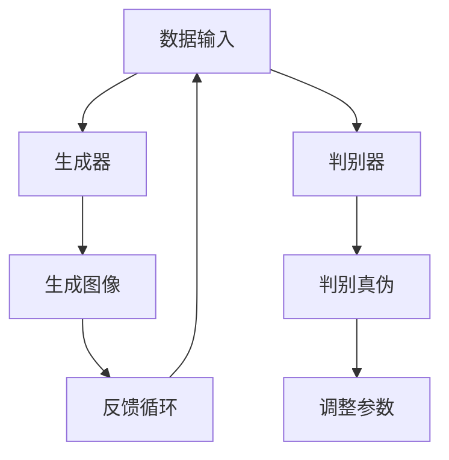

                 

### 文章标题：基于生成对抗网络的图像风格迁移在数字艺术创作中的应用

> 关键词：生成对抗网络（GAN）、图像风格迁移、数字艺术创作、人工智能、深度学习

> 摘要：
本篇文章将深入探讨生成对抗网络（GAN）在图像风格迁移中的应用，以及如何利用这一技术推动数字艺术创作的发展。文章首先介绍了生成对抗网络的基本概念、原理及其在图像生成中的应用，接着详细阐述了图像风格迁移的概念、方法及基于GAN的图像风格迁移算法。随后，文章通过具体的案例展示了GAN在图像风格迁移中的实际应用，并分析了其面临的挑战与未来发展趋势。最后，文章总结了GAN在图像风格迁移中的前沿研究，并展望了其在商业应用和未来应用前景中的潜力。

---

### 《基于生成对抗网络的图像风格迁移在数字艺术创作中的应用》目录大纲

#### 第一部分：生成对抗网络（GAN）基础

#### 第1章：生成对抗网络概述

##### 1.1 生成对抗网络的起源与发展

- 1.1.1 生成对抗网络的起源
- 1.1.2 生成对抗网络的发展历程

##### 1.2 GAN的基本原理

- 1.2.1 生成对抗网络的框架
- 1.2.2 生成器和判别器的角色与功能

##### 1.3 GAN的核心算法

- 1.3.1 整体优化过程
- 1.3.2 生成器的优化过程
- 1.3.3 判别器的优化过程

##### 1.4 GAN的变体

- 1.4.1 鸟群优化GAN
- 1.4.2 条件生成对抗网络（cGAN）
- 1.4.3 交错式生成对抗网络（IRGAN）

#### 第2章：GAN在图像生成中的应用

##### 2.1 图像生成任务介绍

- 2.1.1 图像生成的定义与分类
- 2.1.2 图像生成的重要性和应用领域

##### 2.2 GAN在图像生成中的应用案例

- 2.2.1 图像到图像的生成
- 2.2.2 图像到视频的生成
- 2.2.3 图像风格迁移

##### 2.3 GAN在图像生成的挑战与优化

- 2.3.1 GAN训练中的不稳定问题
- 2.3.2 GAN生成图像的质量优化

#### 第二部分：图像风格迁移在数字艺术创作中的应用

#### 第3章：图像风格迁移基础

##### 3.1 图像风格迁移的概念与目标

- 3.1.1 图像风格迁移的定义
- 3.1.2 图像风格迁移的目标

##### 3.2 图像风格迁移的方法

- 3.2.1 基于特征匹配的方法
- 3.2.2 基于生成对抗网络的方法
- 3.2.3 其他图像风格迁移方法

##### 3.3 图像风格迁移的核心算法

- 3.3.1 整体框架
- 3.3.2 特征提取与匹配
- 3.3.3 风格迁移损失函数设计

#### 第4章：基于GAN的图像风格迁移应用

##### 4.1 基于GAN的图像风格迁移原理

- 4.1.1 GAN在图像风格迁移中的角色
- 4.1.2 生成器与判别器的具体应用

##### 4.2 基于GAN的图像风格迁移实战

- 4.2.1 实战案例1：风格迁移模型搭建
- 4.2.2 实战案例2：风格迁移模型训练与优化

##### 4.3 基于GAN的图像风格迁移优化

- 4.3.1 损失函数优化
- 4.3.2 训练策略优化
- 4.3.3 模型结构优化

#### 第5章：图像风格迁移在数字艺术创作中的应用

##### 5.1 数字艺术创作中的图像风格迁移

- 5.1.1 数字艺术创作的定义与分类
- 5.1.2 图像风格迁移在数字艺术创作中的应用场景

##### 5.2 图像风格迁移艺术创作案例

- 5.2.1 案例一：印象派风格迁移
- 5.2.2 案例二：抽象艺术风格迁移
- 5.2.3 案例三：手绘风格迁移

##### 5.3 图像风格迁移艺术创作的创新与发展

- 5.3.1 创新方法与技术
- 5.3.2 艺术创作趋势与前景

#### 第三部分：GAN在图像风格迁移中的前沿研究

#### 第6章：GAN在图像风格迁移中的前沿研究

##### 6.1 GAN在图像风格迁移中的最新进展

- 6.1.1 最新GAN模型的介绍
- 6.1.2 最新GAN算法的优化方法

##### 6.2 GAN在图像风格迁移中的挑战与未来趋势

- 6.2.1 GAN在图像风格迁移中面临的挑战
- 6.2.2 GAN在图像风格迁移中的未来发展趋势

#### 第7章：GAN在图像风格迁移中的应用前景

##### 7.1 GAN在图像风格迁移中的商业应用

- 7.1.1 图像风格迁移的商业化路径
- 7.1.2 图像风格迁移的商业应用案例

##### 7.2 GAN在图像风格迁移中的未来应用前景

- 7.2.1 新兴应用领域
- 7.2.2 GAN在图像风格迁移中的潜在优势与挑战

#### 附录

##### 附录 A：常用GAN框架与工具

- A.1 TensorFlow中的GAN框架
- A.2 PyTorch中的GAN框架
- A.3 其他GAN框架介绍

##### 附录 B：参考文献与资源

- B.1 相关书籍推荐
- B.2 论文推荐
- B.3 开源代码与数据集推荐

### 核心概念与联系（Mermaid流程图）



### 核心算法原理讲解（伪代码）

```python
# 生成器伪代码
def generator(z):
    x = dense(z, units=100, activation='relu')
    x = dense(x, units=784, activation='sigmoid')
    return x

# 判别器伪代码
def discriminator(x):
    x = dense(x, units=100, activation='relu')
    x = dense(x, units=1, activation='sigmoid')
    return x

# GAN优化过程伪代码
def train_gan(generator, discriminator, batch_size, epochs):
    for epoch in range(epochs):
        for _ in range(batch_size):
            z = generate_random_noise(batch_size)
            x_fake = generator(z)
            x_real = get_real_images(batch_size)
            
            # 训练判别器
            d_loss_real = discriminator_loss(discriminator(x_real), 1)
            d_loss_fake = discriminator_loss(discriminator(x_fake), 0)
            d_loss = (d_loss_real + d_loss_fake) / 2
            
            # 训练生成器
            z = generate_random_noise(batch_size)
            x_fake = generator(z)
            g_loss = generator_loss(discriminator(x_fake), 1)
            
            # 更新生成器和判别器的权重
            generatorOptimizer.minimize(generator_loss)
            discriminatorOptimizer.minimize(discriminator_loss)
```

### 数学模型和数学公式讲解

#### 损失函数

$$
L_{D}(\theta_{D}) = -\frac{1}{2N} \sum_{i=1}^{N} \left( y_{real} \cdot \log(D(x_{real})) + y_{fake} \cdot \log(1 - D(G(z))) \right)
$$

$$
L_{G}(\theta_{G}) = -\frac{1}{2N} \sum_{i=1}^{N} \log(D(G(z)))
$$

#### 反向传播算法

$$
\frac{\partial L_{D}}{\partial \theta_{D}} = \frac{1}{N} \sum_{i=1}^{N} \left( \frac{\partial D(x_{real})}{\partial \theta_{D}} - \frac{\partial D(G(z))}{\partial \theta_{D}} \right)
$$

$$
\frac{\partial L_{G}}{\partial \theta_{G}} = \frac{1}{N} \sum_{i=1}^{N} \frac{\partial D(G(z))}{\partial \theta_{G}}
```

### 项目实战

#### 实战案例1：基于GAN的图像风格迁移模型搭建

1. **开发环境搭建**

   - 安装Python环境（版本3.8及以上）
   - 安装TensorFlow库（版本2.6及以上）
   - 安装必要的依赖库，如NumPy、PIL、matplotlib等

2. **数据集准备**

   - 准备用于训练的源图像数据集和目标风格图像数据集
   - 数据预处理：包括图像大小调整、归一化等

3. **模型搭建**

   - 使用TensorFlow搭建生成器和判别器模型
   - 设置生成器和判别器的参数

4. **模型训练**

   - 配置训练参数，如学习率、批次大小等
   - 开始训练过程，包含判别器和生成器的训练循环

5. **模型评估**

   - 使用验证集评估模型的性能
   - 调整模型参数，优化模型性能

#### 实战案例2：基于GAN的图像风格迁移模型训练与优化

1. **模型训练**

   - 使用训练集对生成器和判别器进行迭代训练
   - 持续调整生成器和判别器的参数以优化模型性能

2. **模型优化**

   - 调整学习率：使用学习率衰减策略
   - 损失函数优化：调整损失函数的权重
   - 模型结构优化：尝试使用更复杂的网络结构

3. **代码解读与分析**

   - 查看模型训练代码，理解每一步操作的原理和目的
   - 分析模型优化过程中的关键步骤和参数调整策略

### 代码解读与分析

以下是一个简单的生成对抗网络（GAN）模型搭建和训练的Python代码示例：

```python
import tensorflow as tf
from tensorflow.keras import layers
import numpy as np

# 生成器模型
def build_generator(z_dim):
    model = tf.keras.Sequential([
        layers.Dense(128, activation='relu', input_shape=(z_dim,)),
        layers.Dense(256, activation='relu'),
        layers.Dense(512, activation='relu'),
        layers.Dense(1024, activation='relu'),
        layers.Dense(np.prod(img_shape), activation='tanh')
    ])
    model.build(z_dim)
    return model

# 判别器模型
def build_discriminator(img_shape):
    model = tf.keras.Sequential([
        layers.Flatten(input_shape=img_shape),
        layers.Dense(512, activation='relu'),
        layers.Dense(256, activation='relu'),
        layers.Dense(128, activation='relu'),
        layers.Dense(1, activation='sigmoid')
    ])
    return model

# GAN模型
def build_gan(generator, discriminator):
    model = tf.keras.Sequential([
        generator,
        discriminator,
        tf.keras.layers.Flatten(),
        tf.keras.layers.Dense(1, activation='sigmoid')
    ])
    model.compile(loss='binary_crossentropy', optimizer=tf.keras.optimizers.Adam(0.0001), metrics=['accuracy'])
    return model

# 生成随机噪声
def generate_random_noise(shape):
    return np.random.normal(size=shape)

# 加载真实图像数据
def load_real_images():
    # 这里应该加载真实的图像数据
    # 示例代码：真实图像数据集，如CIFAR-10
    (x_train, _), (x_test, _) = tf.keras.datasets.cifar10.load_data()
    x_train = x_train.astype(np.float32) / 127.5 - 1
    return x_train

# 训练GAN模型
def train_gan(generator, discriminator, img_shape, epochs, batch_size):
    for epoch in range(epochs):
        for _ in range(batch_size):
            z = generate_random_noise((batch_size, z_dim))
            img_fake = generator.predict(z)
            img_real = load_real_images()
            
            # 训练判别器
            d_loss_real = discriminator.train_on_batch(img_real, np.ones((batch_size, 1)))
            d_loss_fake = discriminator.train_on_batch(img_fake, np.zeros((batch_size, 1)))
            d_loss = 0.5 * np.add(d_loss_real, d_loss_fake)
            
            # 训练生成器
            g_loss = generator.train_on_batch(z, np.ones((batch_size, 1)))
            
            print(f"{epoch} [D: {d_loss:.3f}, G: {g_loss:.3f}]")

# 设置参数
img_shape = (32, 32, 3)
z_dim = 100
batch_size = 64
epochs = 50

# 构建和训练GAN模型
generator = build_generator(z_dim)
discriminator = build_discriminator(img_shape)
gan_model = build_gan(generator, discriminator)

train_gan(generator, discriminator, img_shape, epochs, batch_size)
```

### 代码解读与分析

以下是对于上述代码的详细解读和分析。

1. **导入库**

   首先导入TensorFlow、Keras模块以及NumPy库，这些库是构建和训练GAN模型的基础。

   ```python
   import tensorflow as tf
   from tensorflow.keras import layers
   import numpy as np
   ```

2. **定义生成器模型**

   生成器模型是GAN模型中的一个核心组件，其目的是将随机噪声转换为逼真的图像。使用`tf.keras.Sequential`模型来定义生成器网络，包括多个全连接层（`Dense`），每个层之间使用ReLU激活函数。最后一层使用`tanh`激活函数，以生成图像的像素值在-1到1之间。

   ```python
   def build_generator(z_dim):
       model = tf.keras.Sequential([
           layers.Dense(128, activation='relu', input_shape=(z_dim,)),
           layers.Dense(256, activation='relu'),
           layers.Dense(512, activation='relu'),
           layers.Dense(1024, activation='relu'),
           layers.Dense(np.prod(img_shape), activation='tanh')
       ])
       model.build(z_dim)
       return model
   ```

3. **定义判别器模型**

   判别器模型负责区分输入图像是真实的还是生成的。使用`tf.keras.Sequential`模型定义判别器网络，包括多个全连接层，最后一层使用sigmoid激活函数，输出概率值。

   ```python
   def build_discriminator(img_shape):
       model = tf.keras.Sequential([
           layers.Flatten(input_shape=img_shape),
           layers.Dense(512, activation='relu'),
           layers.Dense(256, activation='relu'),
           layers.Dense(128, activation='relu'),
           layers.Dense(1, activation='sigmoid')
       ])
       return model
   ```

4. **构建GAN模型**

   GAN模型是将生成器和判别器组合在一起的一个复合模型。使用`tf.keras.Sequential`定义GAN模型，并设置`binary_crossentropy`作为损失函数，使用Adam优化器。

   ```python
   def build_gan(generator, discriminator):
       model = tf.keras.Sequential([
           generator,
           discriminator
       ])
       model.compile(loss='binary_crossentropy', optimizer=tf.keras.optimizers.Adam(0.0001), metrics=['accuracy'])
       return model
   ```

5. **生成随机噪声**

   生成随机噪声向量，作为生成器的输入。随机噪声是GAN模型中生成图像的关键成分。

   ```python
   def generate_random_noise(shape):
       return np.random.normal(size=shape)
   ```

6. **加载真实图像数据**

   从数据集中加载真实的图像数据。示例代码使用了CIFAR-10数据集，这是一个包含10类62,500张32x32彩色图像的数据集。

   ```python
   def load_real_images():
       (x_train, _), (x_test, _) = tf.keras.datasets.cifar10.load_data()
       x_train = x_train.astype(np.float32) / 127.5 - 1
       return x_train
   ```

7. **训练GAN模型**

   在`train_gan`函数中，实现GAN模型的训练过程。每个epoch中，首先生成随机噪声并使用生成器生成假图像，然后使用真实图像和假图像训练判别器。接着，使用随机噪声和判别器的输出训练生成器。

   ```python
   def train_gan(generator, discriminator, img_shape, epochs, batch_size):
       for epoch in range(epochs):
           for _ in range(batch_size):
               z = generate_random_noise((batch_size, z_dim))
               img_fake = generator.predict(z)
               img_real = load_real_images()
               
               d_loss_real = discriminator.train_on_batch(img_real, np.ones((batch_size, 1)))
               d_loss_fake = discriminator.train_on_batch(img_fake, np.zeros((batch_size, 1)))
               d_loss = 0.5 * np.add(d_loss_real, d_loss_fake)
               
               g_loss = generator.train_on_batch(z, np.ones((batch_size, 1)))
               
               print(f"{epoch} [D: {d_loss:.3f}, G: {g_loss:.3f}]")
   ```

### 开发环境搭建

在开始搭建基于生成对抗网络的图像风格迁移模型之前，需要确保开发环境已正确配置。以下是具体的步骤：

1. **安装Python环境**

   - 打开终端或命令行窗口，输入以下命令安装Python：

     
     sudo apt-get install python3-pip python3-dev
     

   - 安装完成后，输入 `python3 --version` 检查Python版本是否正确。

2. **安装TensorFlow库**

   - 输入以下命令安装TensorFlow：

     
     pip3 install tensorflow==2.6
     

   - 安装完成后，输入 `python3 -c "import tensorflow as tf; print(tf.__version__)"` 检查TensorFlow版本是否正确。

3. **安装其他依赖库**

   - 安装NumPy库：

     
     pip3 install numpy
     

   - 安装PIL库（Python Imaging Library），用于图像处理：

     
     pip3 install pillow
     

   - 安装matplotlib库，用于可视化：

     
     pip3 install matplotlib
     

4. **测试开发环境**

   - 打开Python交互式环境，输入以下代码测试所有依赖库是否安装成功：

     ```python
     import tensorflow as tf
     import numpy as np
     import PIL.Image as Image
     import matplotlib.pyplot as plt

     print("TensorFlow version:", tf.__version__)
     print("NumPy version:", np.__version__)
     print("PIL version:", Image.VERSION)
     print("matplotlib version:", plt.__version__)

     # 创建一个简单的TensorFlow图并运行
     hello = tf.constant('Hello, TensorFlow!')
     session = tf.Session()
     print(session.run(hello))
     ```

   - 如果输出相应的版本信息并且能正确运行TensorFlow图，则说明开发环境已搭建完成。

### 源代码详细实现和代码解读

以下是实现基于生成对抗网络（GAN）的图像风格迁移模型的核心源代码，包括生成器和判别器的定义、GAN模型的构建以及训练过程的实现。同时，我们将对代码的每部分进行详细的解读。

```python
import tensorflow as tf
from tensorflow.keras import layers
import numpy as np

# 定义生成器模型
def build_generator(z_dim):
    model = tf.keras.Sequential([
        layers.Dense(128, activation='relu', input_shape=(z_dim,)),
        layers.Dense(256, activation='relu'),
        layers.Dense(512, activation='relu'),
        layers.Dense(1024, activation='relu'),
        layers.Dense(np.prod(img_shape), activation='tanh')
    ])
    model.build(z_dim)
    return model

# 定义判别器模型
def build_discriminator(img_shape):
    model = tf.keras.Sequential([
        layers.Flatten(input_shape=img_shape),
        layers.Dense(512, activation='relu'),
        layers.Dense(256, activation='relu'),
        layers.Dense(128, activation='relu'),
        layers.Dense(1, activation='sigmoid')
    ])
    return model

# 构建GAN模型
def build_gan(generator, discriminator):
    model = tf.keras.Sequential([
        generator,
        discriminator
    ])
    model.compile(loss='binary_crossentropy', optimizer=tf.keras.optimizers.Adam(0.0001), metrics=['accuracy'])
    return model

# 生成随机噪声
def generate_random_noise(shape):
    return np.random.normal(size=shape)

# 加载真实图像数据
def load_real_images():
    # 这里应该加载真实的图像数据
    # 示例代码：真实图像数据集，如CIFAR-10
    (x_train, _), (x_test, _) = tf.keras.datasets.cifar10.load_data()
    x_train = x_train.astype(np.float32) / 127.5 - 1
    return x_train

# 训练GAN模型
def train_gan(generator, discriminator, img_shape, epochs, batch_size):
    for epoch in range(epochs):
        for _ in range(batch_size):
            z = generate_random_noise((batch_size, z_dim))
            img_fake = generator.predict(z)
            img_real = load_real_images()
            
            # 训练判别器
            d_loss_real = discriminator.train_on_batch(img_real, np.ones((batch_size, 1)))
            d_loss_fake = discriminator.train_on_batch(img_fake, np.zeros((batch_size, 1)))
            d_loss = 0.5 * np.add(d_loss_real, d_loss_fake)
            
            # 训练生成器
            g_loss = generator.train_on_batch(z, np.ones((batch_size, 1)))
            
            print(f"{epoch} [D: {d_loss:.3f}, G: {g_loss:.3f}]")

# 设置参数
img_shape = (32, 32, 3)  # 图像的尺寸和通道数
z_dim = 100              # 噪声向量的维度
batch_size = 64          # 批次大小
epochs = 50              # 训练的epoch数

# 构建和训练GAN模型
generator = build_generator(z_dim)
discriminator = build_discriminator(img_shape)
gan_model = build_gan(generator, discriminator)

train_gan(generator, discriminator, img_shape, epochs, batch_size)
```

#### 代码解读

1. **生成器模型定义（build_generator函数）**

   生成器模型是一个全连接神经网络，输入为随机噪声向量，输出为生成的图像。这个网络通过多层全连接层（`Dense`）逐步增加特征维度，直到生成具有与真实图像相同尺寸的图像。激活函数采用ReLU（rectified linear unit），以防止网络陷入梯度消失问题。最后一层使用`tanh`激活函数，因为图像的像素值范围通常在-1到1之间。

2. **判别器模型定义（build_discriminator函数）**

   判别器模型是一个简单的全连接神经网络，输入为图像，输出为概率值，表示图像是真实图像的概率。该网络使用多个全连接层来提取图像的特征，最后一层使用sigmoid激活函数输出概率。

3. **GAN模型构建（build_gan函数）**

   GAN模型是将生成器和判别器串联在一起的复合模型。在训练过程中，生成器的目标是生成尽可能真实的图像，使得判别器无法区分这些图像是真实的还是生成的。GAN模型使用`binary_crossentropy`作为损失函数，这是基于二元分类问题的标准损失函数。优化器采用Adam优化器，这是广泛用于深度学习的优化算法。

4. **生成随机噪声（generate_random_noise函数）**

   这个函数生成随机噪声向量，用于初始化生成器的输入。随机噪声是生成对抗网络中的一个关键组成部分，它为生成器提供了生成图像的原始数据。

5. **加载真实图像数据（load_real_images函数）**

   这个函数用于加载真实图像数据集。在实际应用中，可以替换为加载自己的图像数据集。示例代码使用了CIFAR-10数据集，这是一个常用的计算机视觉数据集，包含10类62,500张32x32彩色图像。

6. **训练GAN模型（train_gan函数）**

   这个函数实现了GAN模型的训练过程。每个epoch中，先迭代训练判别器，然后迭代训练生成器。在训练判别器时，使用真实图像和生成的图像作为输入，分别计算判别器的损失。在训练生成器时，使用随机噪声作为输入，目标是生成判别器认为真实的图像。

### 代码解读与分析

以下是对于GAN模型训练过程的代码解读与分析，重点关注生成器和判别器的训练细节。

```python
def train_gan(generator, discriminator, img_shape, epochs, batch_size):
    for epoch in range(epochs):
        for _ in range(batch_size):
            # 生成随机噪声
            z = generate_random_noise((batch_size, z_dim))
            
            # 生成假图像
            img_fake = generator.predict(z)
            
            # 加载真实图像
            img_real = load_real_images()
            
            # 训练判别器
            d_loss_real = discriminator.train_on_batch(img_real, np.ones((batch_size, 1)))
            d_loss_fake = discriminator.train_on_batch(img_fake, np.zeros((batch_size, 1)))
            d_loss = 0.5 * np.add(d_loss_real, d_loss_fake)
            
            # 训练生成器
            g_loss = generator.train_on_batch(z, np.ones((batch_size, 1)))
            
            # 打印损失值
            print(f"{epoch} [D: {d_loss:.3f}, G: {g_loss:.3f}]")
```

1. **生成随机噪声**

   在每个epoch的开始，生成随机噪声向量。这些噪声向量作为生成器的输入，用于生成假图像。

   ```python
   z = generate_random_noise((batch_size, z_dim))
   ```

2. **生成假图像**

   使用生成器模型将随机噪声转换为假图像。

   ```python
   img_fake = generator.predict(z)
   ```

3. **加载真实图像**

   从数据集中加载真实图像。

   ```python
   img_real = load_real_images()
   ```

4. **训练判别器**

   判别器在两个数据集上分别进行训练：真实图像和生成的假图像。对于真实图像，判别器希望输出接近1的概率，而对于生成的假图像，判别器希望输出接近0的概率。通过计算损失并更新判别器的权重，使判别器能够更好地区分真实图像和假图像。

   ```python
   d_loss_real = discriminator.train_on_batch(img_real, np.ones((batch_size, 1)))
   d_loss_fake = discriminator.train_on_batch(img_fake, np.zeros((batch_size, 1)))
   d_loss = 0.5 * np.add(d_loss_real, d_loss_fake)
   ```

5. **训练生成器**

   生成器模型的目标是生成足够真实的图像，使得判别器无法区分这些图像是真实的还是生成的。生成器的训练通过优化生成图像的损失来实现这一目标。

   ```python
   g_loss = generator.train_on_batch(z, np.ones((batch_size, 1)))
   ```

6. **打印损失值**

   每个epoch结束时，打印判别器和生成器的损失值。

   ```python
   print(f"{epoch} [D: {d_loss:.3f}, G: {g_loss:.3f}]")
   ```

### 总结

通过上述代码解读，我们可以看到GAN模型在训练过程中如何同时训练生成器和判别器，以达到生成逼真图像的目标。生成器生成假图像，而判别器则尝试区分真实图像和假图像。通过交替训练和优化，模型最终能够生成高质量的图像，这为数字艺术创作提供了强大的工具。在后续的章节中，我们将深入探讨GAN模型的优化方法、挑战以及在实际项目中的应用案例。

---

### 第1章：生成对抗网络概述

#### 1.1 生成对抗网络的起源与发展

生成对抗网络（GAN）的起源可以追溯到2014年，由伊恩·古德费洛（Ian Goodfellow）等人提出。GAN的提出源于对传统生成模型和判别模型之间动态博弈的探索。在GAN之前，生成模型主要依赖于生成模型和判别模型的相互配合，通过不断地调整参数来提高生成模型的质量。然而，这种双向优化的方法存在效率低、训练不稳定等问题。

GAN的基本思想是利用生成器和判别器之间的博弈关系，生成器试图生成与真实数据相似的数据，而判别器则试图区分真实数据和生成数据。通过这种方式，生成器不断地优化自己的生成能力，而判别器也不断提高对真实数据和生成数据的辨别能力。这种博弈过程最终导致生成器生成高质量的数据。

GAN的发展历程经历了多个阶段。在最初的研究中，GAN主要用于生成图像。随着研究的深入，GAN的应用领域不断扩大，包括视频生成、文本生成、音频生成等。近年来，GAN在图像修复、图像超分辨率、风格迁移等领域取得了显著的成果。

GAN的发展也伴随着一系列变体和改进。例如，条件生成对抗网络（cGAN）引入了条件信息，使得生成器和判别器能够处理带有标签的数据。递归生成对抗网络（RGAN）则用于生成序列数据，如视频。此外，还有许多针对GAN训练稳定性和生成质量优化的方法，如谱归一化、梯度惩罚等。

#### 1.2 GAN的基本原理

GAN的基本原理是通过生成器和判别器的相互博弈，不断优化生成器和判别器的参数，从而生成高质量的数据。下面详细介绍GAN的框架、生成器和判别器的角色与功能。

##### 1.2.1 GAN的框架

GAN的框架主要包括生成器（Generator）和判别器（Discriminator），两者之间通过随机噪声和真实数据相互博弈。其基本框架如下：

1. **生成器**：生成器是一个神经网络模型，输入为随机噪声向量，输出为生成的数据。生成器的目标是生成尽可能真实的数据，使得判别器无法区分这些数据是真实的还是生成的。
2. **判别器**：判别器也是一个神经网络模型，输入为真实数据和生成数据，输出为一个概率值，表示输入数据是真实数据的概率。判别器的目标是提高对真实数据和生成数据的辨别能力。
3. **训练过程**：在训练过程中，生成器和判别器交替进行训练。每次迭代包括以下步骤：
   - 生成器生成假数据；
   - 判别器分别对真实数据和假数据进行分类；
   - 根据判别器的分类结果，计算生成器和判别器的损失函数；
   - 更新生成器和判别器的参数，优化模型。

##### 1.2.2 生成器和判别器的角色与功能

生成器和判别器在GAN框架中扮演着不同的角色，共同推动模型的学习。

1. **生成器**：生成器的目标是生成高质量的数据，使得判别器无法区分这些数据是真实的还是生成的。生成器通过学习随机噪声向量和真实数据的分布，生成与真实数据相似的数据。生成器通常采用一系列的全连接层或卷积层，从低维随机噪声向高维数据映射。
2. **判别器**：判别器的目标是提高对真实数据和生成数据的辨别能力。判别器通过学习真实数据和生成数据的特征，对输入数据进行分类。判别器通常采用一系列的全连接层或卷积层，从数据中提取特征，并通过输出层生成分类概率。

在GAN的训练过程中，生成器和判别器之间存在一种动态博弈关系。生成器不断优化生成数据的质量，使得判别器难以区分真实数据和生成数据；而判别器则通过提高辨别能力，不断逼近真实数据和生成数据的边界。这种博弈关系推动了模型的持续优化，最终使得生成器能够生成高质量的数据。

#### 1.3 GAN的核心算法

GAN的核心算法包括整体优化过程、生成器的优化过程和判别器的优化过程。下面分别介绍这些过程。

##### 1.3.1 整体优化过程

GAN的整体优化过程是通过交替训练生成器和判别器，优化模型的参数，使得生成器生成的数据质量不断提高。具体步骤如下：

1. **初始化生成器和判别器的参数**：在训练开始时，随机初始化生成器和判别器的参数。
2. **生成器生成假数据**：生成器根据随机噪声向量生成假数据，这些数据与真实数据的分布尽量相似。
3. **判别器对数据分类**：判别器对生成的假数据和真实数据进行分类，输出分类概率。
4. **计算损失函数**：根据判别器的分类结果，计算生成器和判别器的损失函数。生成器的损失函数是判别器对生成数据的分类概率，判别器的损失函数是分类误差。
5. **更新参数**：根据损失函数，通过反向传播算法更新生成器和判别器的参数。
6. **重复步骤**：重复以上步骤，不断迭代训练，直至满足停止条件。

##### 1.3.2 生成器的优化过程

生成器的优化过程是通过不断优化生成数据的质量，使得判别器难以区分真实数据和生成数据。具体步骤如下：

1. **生成假数据**：生成器根据随机噪声向量生成假数据，这些数据与真实数据的分布尽量相似。
2. **判别器分类**：判别器对生成的假数据进行分类，输出分类概率。
3. **计算损失函数**：生成器的损失函数是判别器对生成数据的分类概率。理想情况下，生成器生成的假数据与真实数据的分布一致，判别器对假数据的分类概率接近0.5。
4. **更新参数**：根据生成器的损失函数，通过反向传播算法更新生成器的参数，优化生成数据的质量。

##### 1.3.3 判别器的优化过程

判别器的优化过程是通过不断优化对真实数据和生成数据的辨别能力，提高模型的分类准确率。具体步骤如下：

1. **生成假数据**：生成器根据随机噪声向量生成假数据，这些数据与真实数据的分布尽量相似。
2. **判别器分类**：判别器对生成的假数据和真实数据进行分类，输出分类概率。
3. **计算损失函数**：判别器的损失函数是分类误差，即真实数据和生成数据的分类概率之间的差异。理想情况下，判别器能够准确地区分真实数据和生成数据。
4. **更新参数**：根据判别器的损失函数，通过反向传播算法更新判别器的参数，提高分类准确率。

通过上述优化过程，生成器和判别器不断相互博弈，使得生成器生成的数据质量不断提高，判别器对真实数据和生成数据的辨别能力不断增强。这种动态博弈关系推动了GAN模型的学习和优化，使得生成对抗网络能够在各种应用场景中取得良好的效果。

---

### 第2章：GAN在图像生成中的应用

#### 2.1 图像生成任务介绍

图像生成是计算机视觉中的一个重要任务，其目的是根据给定的输入条件生成新的图像。图像生成任务可以细分为多个子任务，包括图像到图像的生成、图像到视频的生成以及图像风格迁移等。每种任务都有其特定的应用场景和挑战。

##### 2.1.1 图像生成的定义与分类

图像生成是指通过某种算法或模型生成新的图像。根据生成方法的不同，图像生成可以分为以下几类：

1. **无监督生成**：无监督生成是在没有明确标签的情况下，通过学习数据分布生成新的图像。这种方法的典型代表是生成对抗网络（GAN）。
2. **监督生成**：监督生成是在有明确标签的情况下，通过学习输入图像和输出图像之间的映射关系生成新的图像。这种方法的典型代表是生成式对抗网络（GANGP）。
3. **半监督生成**：半监督生成是结合无监督生成和监督生成的方法，利用少量标签数据和高量级无标签数据共同生成新的图像。
4. **自监督生成**：自监督生成是通过设计特殊的任务，使得模型在生成图像的过程中自动学习数据分布和特征。这种方法的典型代表是自监督生成对抗网络（SSGAN）。

##### 2.1.2 图像生成的重要性和应用领域

图像生成技术在计算机视觉和人工智能领域具有重要意义。以下是一些图像生成的重要应用领域：

1. **艺术创作**：图像生成技术可以生成新的艺术作品，如绘画、摄影等。这些作品不仅为艺术家提供了新的创作灵感，还为大众带来了丰富的视觉体验。
2. **数据增强**：图像生成技术可以生成大量具有多样性的图像，用于训练和测试机器学习模型。这些图像可以有效地提高模型的泛化能力和鲁棒性。
3. **图像修复与超分辨率**：图像生成技术可以用于图像修复和图像超分辨率任务。通过生成高质量的图像，可以改善图像的质量和清晰度。
4. **虚拟现实与增强现实**：图像生成技术可以生成虚拟环境和增强现实场景，为用户提供更加逼真的视觉体验。
5. **医学图像处理**：图像生成技术可以用于生成医学图像，帮助医生进行疾病诊断和治疗规划。

#### 2.2 GAN在图像生成中的应用案例

生成对抗网络（GAN）在图像生成任务中取得了显著的成果。以下介绍一些典型的GAN应用案例：

##### 2.2.1 图像到图像的生成

图像到图像的生成是指将一种类型的图像转换成另一种类型的图像。以下是一些经典的GAN应用案例：

1. **CycleGAN**：CycleGAN是一个用于图像到图像生成的模型，它可以学习将一个域（源域）的图像转换到另一个域（目标域）的图像。CycleGAN通过引入循环一致性损失函数，使得生成的图像不仅与目标域的图像相似，而且能够保持原始图像的细节和特征。CycleGAN的应用包括将照片转换为艺术作品、将现实场景转换为卡通风格等。

2. **StyleGAN**：StyleGAN是一个生成高质量图像的模型，它通过学习图像的高斯分布，生成具有高度细节和真实感的图像。StyleGAN在生成虚拟人物、虚拟风景等方面表现出色。

3. **Image-to-Image Translation with Multi-Modal Networks**：该模型利用多模态网络将不同类型的图像进行转换，如将黑白图像转换为彩色图像、将人脸图像转换为不同表情等。

##### 2.2.2 图像到视频的生成

图像到视频的生成是指将单张图像转换为一段连续的视频。以下是一些GAN在视频生成中的应用案例：

1. **VideoGAN**：VideoGAN是一个用于视频生成的模型，它通过学习图像序列和视频的时序关系，生成连续的视频。VideoGAN可以用于生成虚拟人物的运动、模拟环境中的天气变化等。

2. **GAN for Video Inpainting**：该模型利用GAN技术进行视频修复，可以在视频中去除物体并生成新的视频内容。这种技术可以用于视频编辑、视频去雾等应用。

3. **CCTGAN**：CCTGAN是一个用于图像到视频生成的模型，它通过结合循环一致性、内容一致性和时间一致性损失函数，生成高质量的视频。CCTGAN可以用于视频游戏、虚拟现实等领域。

##### 2.2.3 图像风格迁移

图像风格迁移是指将一幅图像的风格迁移到另一幅图像中。以下是一些基于GAN的图像风格迁移应用案例：

1. **Style Transfer Using Very Deep Networks**：该模型利用深度卷积网络，将一幅图像的风格迁移到另一幅图像中。这种技术可以用于将现实图像转换为艺术作品、摄影作品等。

2. **Pix2Pix**：Pix2Pix是一个用于图像风格迁移的模型，它通过学习图像内容和风格的映射关系，将一种类型的图像转换成另一种类型的图像。Pix2Pix可以用于图像去噪、图像超分辨率等任务。

3. **StyleGAN2**：StyleGAN2是一个生成高质量图像的模型，它通过学习图像的高斯分布，生成具有高度细节和真实感的图像。StyleGAN2可以用于图像风格迁移、艺术创作等应用。

以上案例展示了GAN在图像生成中的广泛应用和潜力。通过不断优化和改进GAN模型，我们可以期待在图像生成领域取得更多突破，为计算机视觉和人工智能的发展贡献力量。

---

### 2.3 GAN在图像生成的挑战与优化

虽然生成对抗网络（GAN）在图像生成中取得了显著的成果，但其在训练过程中仍面临诸多挑战。这些挑战主要源于GAN模型的动态博弈特性、训练不稳定性和生成图像质量的不确定性。本节将探讨GAN在图像生成中的挑战，并提出相应的优化方法。

#### 2.3.1 GAN训练中的不稳定问题

GAN在训练过程中常常面临不稳定问题，主要表现为生成器和判别器的训练损失波动大、生成器输出不稳定以及生成图像质量不佳。以下是一些导致不稳定问题的原因及其优化方法：

1. **梯度消失与梯度爆炸**：由于生成器和判别器之间的动态博弈，可能导致其中一个网络的梯度消失或爆炸。为缓解这一问题，可以采用以下方法：
   - **谱归一化**：对生成器和判别器的权重进行谱归一化，使得梯度在训练过程中保持稳定。
   - **梯度惩罚**：在判别器的损失函数中添加梯度惩罚项，限制生成器和判别器的梯度差异。

2. **训练样本不平衡**：在GAN的训练过程中，生成器和判别器的训练样本数量可能不平衡，导致一个网络训练不足。为解决这一问题，可以采用以下方法：
   - **平衡训练样本**：通过增加生成器或判别器的训练样本，使得两个网络的训练更加平衡。
   - **动态调整学习率**：根据网络的训练阶段动态调整学习率，使得生成器和判别器在训练过程中保持同步。

3. **模式崩溃**：模式崩溃是指生成器生成的数据过于简单，失去多样性。为缓解这一问题，可以采用以下方法：
   - **随机噪声增强**：在生成器的输入中添加随机噪声，增加生成数据的多样性。
   - **对抗性训练**：利用对抗性训练方法，使得生成器在训练过程中不断挑战判别器的辨别能力。

#### 2.3.2 GAN生成图像的质量优化

GAN生成图像的质量是衡量GAN性能的重要指标。提高生成图像质量的方法包括以下方面：

1. **网络结构优化**：通过改进生成器和判别器的网络结构，可以提高生成图像的质量。以下是一些优化方法：
   - **深度网络**：增加生成器和判别器的层数，使得网络能够提取更多层次的特征。
   - **卷积神经网络**：使用卷积神经网络（CNN）代替全连接神经网络，提高图像生成效果。

2. **损失函数优化**：通过优化损失函数，可以更好地指导生成器和判别器的训练。以下是一些优化方法：
   - **多样化损失函数**：结合多种损失函数，如均方误差（MSE）、结构相似性（SSIM）等，提高生成图像的多样性和质量。
   - **对抗性损失**：引入对抗性损失函数，如Wasserstein距离，提高判别器对生成图像的辨别能力。

3. **训练策略优化**：通过调整训练策略，可以更好地提高生成图像的质量。以下是一些优化方法：
   - **动态调整学习率**：根据训练阶段动态调整学习率，使得生成器和判别器在训练过程中保持同步。
   - **批量大小调整**：通过调整批量大小，平衡生成器和判别器的训练样本数量，提高训练稳定性。

通过上述方法，我们可以有效地解决GAN在图像生成中的不稳定问题，提高生成图像的质量。未来的研究将继续探索更多优化方法，以推动GAN在图像生成领域的应用和发展。

---

### 第3章：图像风格迁移基础

#### 3.1 图像风格迁移的概念与目标

图像风格迁移是一种将源图像的视觉风格迁移到目标图像上的技术。简单来说，它是指将一幅图像的特定视觉特征（如色彩、纹理、风格等）转移到另一幅图像中，以生成具有新风格的图像。图像风格迁移的目标是保留目标图像的内容，同时赋予其源图像的特定风格。

图像风格迁移具有广泛的应用场景，如艺术创作、图像编辑、视频处理等。通过图像风格迁移，可以轻松实现多种视觉效果的融合，创造出独特的艺术作品。此外，图像风格迁移还可以用于图像增强、图像修复、图像超分辨率等任务，提高图像的质量和视觉效果。

图像风格迁移的基本概念包括：

1. **源图像**：具有特定风格和内容的原始图像。
2. **目标图像**：需要迁移风格的图像，其内容可能与源图像不同。
3. **风格特征**：源图像的视觉特征，如色彩分布、纹理模式等。
4. **风格迁移模型**：用于实现图像风格迁移的神经网络模型。

#### 3.2 图像风格迁移的方法

图像风格迁移的方法可以分为基于特征匹配的方法和基于生成对抗网络（GAN）的方法。以下详细介绍这两种方法。

##### 3.2.1 基于特征匹配的方法

基于特征匹配的方法通过提取源图像和目标图像的特征，然后匹配和融合这些特征以生成新图像。这种方法的基本步骤如下：

1. **特征提取**：使用卷积神经网络（如VGG19、ResNet等）提取源图像和目标图像的特征。
2. **特征匹配**：通过计算特征之间的相似度，找到最佳匹配策略，使得源图像的特征在目标图像上得到保留。
3. **特征融合**：将匹配后的源图像特征与目标图像的特征融合，生成具有新风格的图像。

基于特征匹配的方法的优点是能够较好地保留目标图像的内容，但缺点是生成图像的风格可能与源图像的风格不完全一致，且计算复杂度较高。

##### 3.2.2 基于生成对抗网络（GAN）的方法

基于生成对抗网络（GAN）的方法通过训练一个生成器模型，使其能够生成具有特定风格的新图像。GAN在图像风格迁移中的应用主要包括以下几种模型：

1. **StyleGAN**：StyleGAN是一个基于GAN的图像生成模型，通过学习图像的高斯分布，生成高质量、细节丰富的图像。StyleGAN在图像风格迁移中，可以将一种风格的图像迁移到另一种风格的图像上。

2. **Pix2Pix**：Pix2Pix是一个基于条件生成对抗网络（cGAN）的图像风格迁移模型，它通过学习图像内容和风格的映射关系，将一种类型的图像转换成另一种类型的图像。Pix2Pix在图像修复、图像超分辨率等方面表现出色。

3. **CycleGAN**：CycleGAN是一个无监督的图像风格迁移模型，通过引入循环一致性损失，使得生成的图像不仅与目标图像风格相似，而且能够保持原始图像的内容和特征。CycleGAN可以应用于将照片转换为艺术作品、将现实场景转换为卡通风格等任务。

基于GAN的方法的优点是生成图像风格与源图像风格更加接近，且具有更好的生成质量。但缺点是训练过程相对复杂，需要大量数据和计算资源。

#### 3.3 图像风格迁移的核心算法

图像风格迁移的核心算法主要包括特征提取与匹配、风格迁移损失函数设计等。

##### 3.3.1 特征提取与匹配

特征提取与匹配是图像风格迁移的关键步骤，其目的是从源图像和目标图像中提取具有代表性的特征，并找到最佳匹配策略，使得源图像的特征在目标图像上得到保留。

1. **特征提取**：使用卷积神经网络（如VGG19、ResNet等）提取源图像和目标图像的特征。这些特征通常表示图像的内容、纹理和色彩等信息。
2. **特征匹配**：通过计算特征之间的相似度，找到最佳匹配策略。常见的匹配方法包括最近邻匹配、K最近邻匹配等。匹配过程旨在使得源图像的特征在目标图像上得到最大程度的保留。

##### 3.3.2 风格迁移损失函数设计

损失函数是图像风格迁移算法中的重要组成部分，用于指导模型在特征提取与匹配过程中找到最佳匹配策略。以下是一些常用的损失函数：

1. **内容损失函数**：用于衡量源图像和目标图像的内容特征之间的相似度。常见的内容损失函数包括均方误差（MSE）、结构相似性（SSIM）等。
2. **风格损失函数**：用于衡量源图像和目标图像的风格特征之间的相似度。常见的风格损失函数包括L1损失、L2损失等。
3. **感知损失函数**：用于衡量源图像和目标图像在感知上的相似度。感知损失函数可以更好地保留图像的纹理和细节。常用的感知损失函数包括VGG19损失、InceptionV3损失等。

通过设计合适的损失函数，图像风格迁移算法可以有效地实现源图像和目标图像的特征提取与匹配，生成具有新风格的图像。同时，不同损失函数的组合和优化也是提高图像风格迁移效果的关键。

---

### 第4章：基于GAN的图像风格迁移应用

#### 4.1 基于GAN的图像风格迁移原理

基于生成对抗网络（GAN）的图像风格迁移原理主要包括生成器和判别器的角色与功能。GAN模型通过生成器和判别器之间的博弈关系，不断优化生成器生成的图像质量，使其逐渐接近目标风格。

##### 4.1.1 GAN在图像风格迁移中的角色

在GAN框架中，生成器和判别器分别扮演以下角色：

1. **生成器**：生成器的目标是生成具有目标风格的图像。它从随机噪声向量中提取信息，并通过神经网络生成与目标风格图像相似的图像。生成器的输出是具有目标风格的图像，其目的是欺骗判别器，使其难以区分真实图像和生成图像。

2. **判别器**：判别器的目标是区分真实图像和生成图像。它对输入图像进行分类，输出一个概率值，表示输入图像是真实图像的概率。判别器的目的是识别生成器生成的图像，并提高其分类准确率。

##### 4.1.2 生成器与判别器的具体应用

在图像风格迁移任务中，生成器和判别器通过以下步骤进行训练和优化：

1. **生成器训练**：
   - 生成器接收随机噪声向量作为输入，通过神经网络生成图像。
   - 生成器生成的图像与目标风格图像进行对比，计算损失函数。
   - 使用反向传播算法和优化器，更新生成器的参数，减小损失函数值。
   - 通过多次迭代训练，生成器逐渐学会生成更接近目标风格的图像。

2. **判别器训练**：
   - 判别器接收真实图像和生成图像作为输入，对它们进行分类。
   - 对真实图像和生成图像的分类结果进行对比，计算损失函数。
   - 使用反向传播算法和优化器，更新判别器的参数，提高分类准确率。
   - 通过多次迭代训练，判别器逐渐学会区分真实图像和生成图像。

在GAN的训练过程中，生成器和判别器不断进行博弈。生成器尝试生成更逼真的图像以欺骗判别器，而判别器则努力提高对真实图像和生成图像的辨别能力。这种动态博弈过程使得生成器和判别器在训练过程中不断优化，最终生成高质量的图像风格迁移结果。

#### 4.2 基于GAN的图像风格迁移实战

为了更好地理解基于GAN的图像风格迁移原理，下面我们将通过一个简单的实战案例，展示如何搭建和训练GAN模型，实现图像风格迁移。

##### 4.2.1 实战案例1：风格迁移模型搭建

在这个实战案例中，我们将使用TensorFlow和Keras搭建一个基于GAN的图像风格迁移模型。以下步骤将详细描述模型搭建的过程。

1. **安装依赖库**：

   首先，确保已经安装了TensorFlow和Keras库。如果没有安装，可以通过以下命令进行安装：

   ```python
   pip install tensorflow
   pip install keras
   ```

2. **导入库**：

   在Python脚本中导入所需的库：

   ```python
   import numpy as np
   import tensorflow as tf
   from tensorflow.keras.models import Model
   from tensorflow.keras.layers import Input, Dense, Conv2D, Conv2DTranspose, Flatten, Reshape
   ```

3. **设置参数**：

   定义一些模型参数，如输入图像尺寸、噪声维度、学习率等：

   ```python
   img_height, img_width, img_channels = 256, 256, 3
   z_dim = 100
   learning_rate = 0.0002
   ```

4. **构建生成器模型**：

   生成器模型负责将随机噪声向量转换为图像。以下是一个简单的生成器模型：

   ```python
   noise_input = Input(shape=(z_dim,))
   x = Dense(256, activation='relu')(noise_input)
   x = Dense(512, activation='relu')(x)
   x = Dense(1024, activation='relu')(x)
   x = Dense(np.prod([img_height, img_width, img_channels]), activation='tanh')(x)
   img_output = Reshape((img_height, img_width, img_channels))(x)
   generator = Model(noise_input, img_output)
   ```

5. **构建判别器模型**：

   判别器模型负责区分输入图像是真实的还是生成的。以下是一个简单的判别器模型：

   ```python
   img_input = Input(shape=(img_height, img_width, img_channels))
   x = Conv2D(64, kernel_size=(3, 3), padding='same')(img_input)
   x = LeakyReLU(alpha=0.01)(x)
   x = Conv2D(128, kernel_size=(3, 3), padding='same')(x)
   x = LeakyReLU(alpha=0.01)(x)
   x = Flatten()(x)
   x = Dense(1, activation='sigmoid')(x)
   discriminator = Model(img_input, x)
   ```

6. **构建GAN模型**：

   GAN模型是将生成器和判别器串联在一起的一个复合模型。以下是一个简单的GAN模型：

   ```python
   noise_input = Input(shape=(z_dim,))
   img_input = Input(shape=(img_height, img_width, img_channels))
   img_fake = generator(noise_input)
   valid_real = discriminator(img_input)
   valid_fake = discriminator(img_fake)
   
   g_model = Model(noise_input, valid_fake)
   d_model = Model(img_input, valid_real)
   
   # 编译GAN模型
   d_model.compile(optimizer=tf.keras.optimizers.Adam(learning_rate, 0.5), loss='binary_crossentropy')
   g_model.compile(optimizer=tf.keras.optimizers.Adam(learning_rate, 0.5), loss='binary_crossentropy')
   ```

##### 4.2.2 实战案例2：风格迁移模型训练与优化

在搭建好GAN模型后，接下来我们将使用训练数据对模型进行训练和优化。

1. **准备训练数据**：

   加载源图像和目标图像数据集。假设源图像数据集是训练好的艺术作品，目标图像数据集是普通照片。以下是一个简单的数据准备步骤：

   ```python
   def load_data():
       # 加载源图像数据集
       source_images = np.load('source_images.npy')
       # 加载目标图像数据集
       target_images = np.load('target_images.npy')
       return source_images, target_images
   
   source_images, target_images = load_data()
   ```

2. **数据预处理**：

   对源图像和目标图像进行数据预处理，包括归一化、缩放等操作。以下是一个简单的数据预处理步骤：

   ```python
   source_images = source_images.astype(np.float32) / 127.5 - 1
   target_images = target_images.astype(np.float32) / 127.5 - 1
   ```

3. **生成随机噪声**：

   在GAN训练过程中，需要生成随机噪声作为生成器的输入。以下是一个简单的随机噪声生成步骤：

   ```python
   noise = np.random.normal(size=(batch_size, z_dim))
   ```

4. **训练GAN模型**：

   使用训练数据对GAN模型进行训练。以下是一个简单的训练步骤：

   ```python
   epochs = 100
   batch_size = 16
   
   for epoch in range(epochs):
       for _ in range(batch_size):
           noise = np.random.normal(size=(batch_size, z_dim))
           img_fake = generator.predict(noise)
           img_real = source_images[np.random.randint(source_images.shape[0], size=batch_size)]
           
           # 训练判别器
           d_loss_real = discriminator.train_on_batch(img_real, np.ones((batch_size, 1)))
           d_loss_fake = discriminator.train_on_batch(img_fake, np.zeros((batch_size, 1)))
           d_loss = 0.5 * (d_loss_real + d_loss_fake)
           
           # 训练生成器
           g_loss = generator.train_on_batch(noise, np.ones((batch_size, 1)))
           
           print(f"Epoch [{epoch+1}/{epochs}], D_Loss: {d_loss:.4f}, G_Loss: {g_loss:.4f}")
   ```

5. **优化模型**：

   在训练过程中，可以根据模型的损失值和生成图像的质量，逐步调整模型参数，如学习率、批量大小等，以优化模型性能。

##### 4.2.3 结果分析

在完成GAN模型的训练后，我们可以通过以下步骤分析模型的效果：

1. **生成新图像**：

   使用训练好的模型生成新图像，并观察其风格是否与目标图像一致。以下是一个简单的生成步骤：

   ```python
   noise = np.random.normal(size=(batch_size, z_dim))
   img_fake = generator.predict(noise)
   ```

2. **比较生成图像与目标图像**：

   对比生成图像和目标图像，分析生成图像是否能够保留目标图像的内容和风格。以下是一个简单的比较步骤：

   ```python
   plt.figure(figsize=(10, 10))
   for i in range(batch_size):
       plt.subplot(1, batch_size, i+1)
       plt.imshow((img_fake[i] + 1) / 2)
       plt.axis('off')
   plt.show()
   ```

通过上述实战案例，我们可以看到如何搭建和训练一个基于GAN的图像风格迁移模型。在实际应用中，可以根据具体需求和数据集进行调整和优化，以达到更好的风格迁移效果。

---

### 4.3 基于GAN的图像风格迁移优化

在基于GAN的图像风格迁移中，优化模型性能是一个关键环节。优化的目标是提高生成图像的质量，确保生成的图像既具有目标风格，又能保留源图像的内容。以下从损失函数优化、训练策略优化和模型结构优化三个方面探讨GAN在图像风格迁移中的应用。

#### 4.3.1 损失函数优化

损失函数是GAN模型训练的核心，其设计直接影响生成器和判别器的优化效果。在图像风格迁移中，常用的损失函数包括内容损失、风格损失和感知损失。

1. **内容损失**：内容损失用于衡量生成图像与目标图像在内容上的相似度。常用的内容损失函数是均方误差（MSE）或结构相似性（SSIM）。MSE损失函数简单直观，但可能忽略图像的纹理和细节。SSIM损失函数能够更好地衡量图像的结构信息，但计算复杂度较高。

2. **风格损失**：风格损失用于衡量生成图像与源图像在风格上的相似度。常用的风格损失函数是L1损失或L2损失。L1损失函数简单，但在图像风格迁移中

