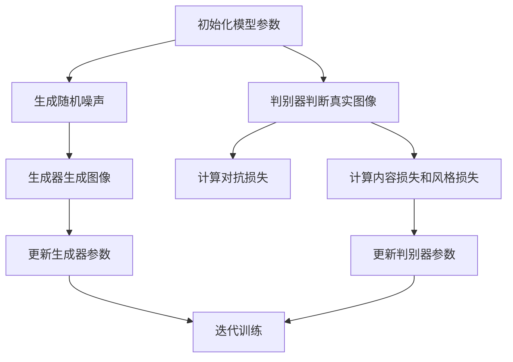
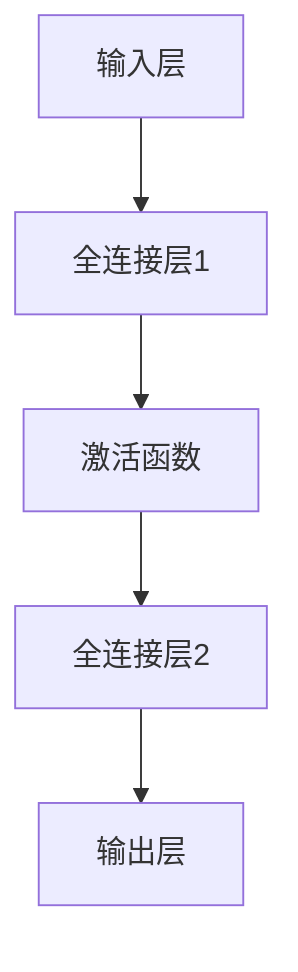
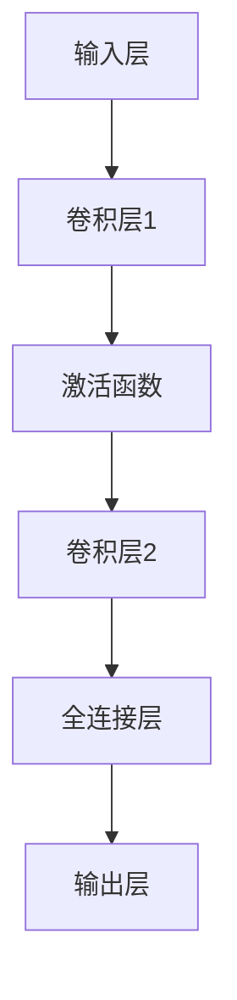
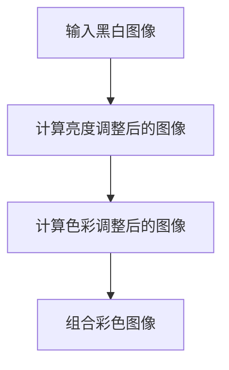
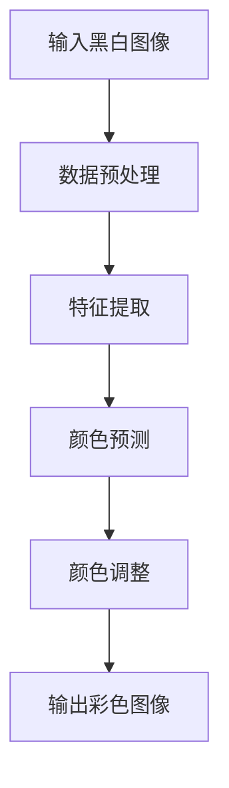
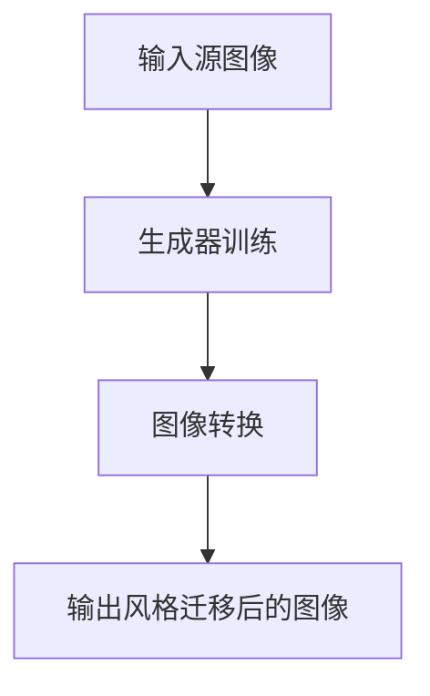
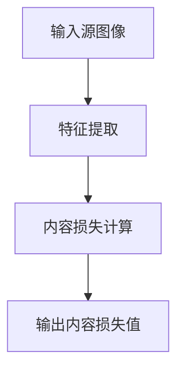
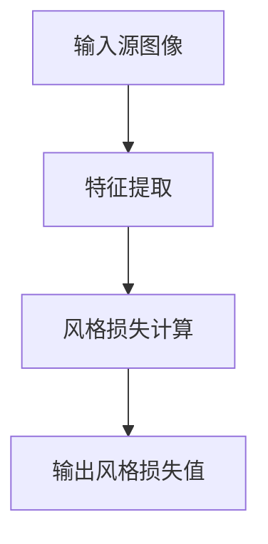
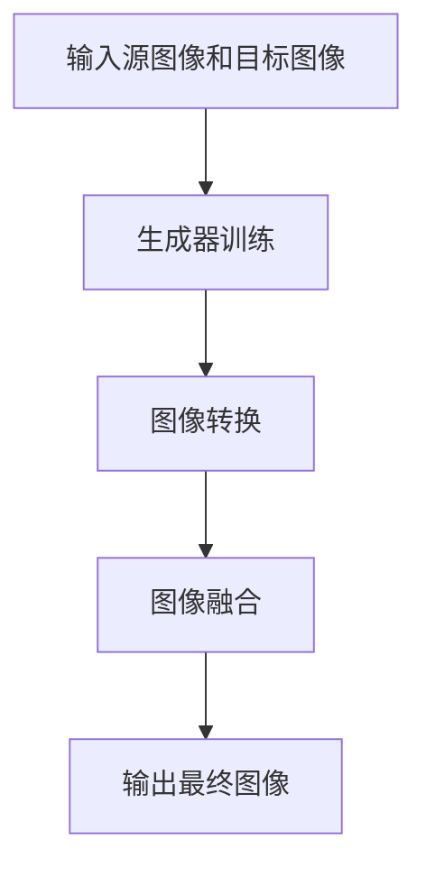

                 

# 文章标题：基于生成对抗网络的自动图像上色与风格迁移一体化模型

> 关键词：生成对抗网络（GAN）、自动图像上色、风格迁移、一体化模型、深度学习、图像处理

> 摘要：本文主要探讨了一种基于生成对抗网络（GAN）的自动图像上色与风格迁移一体化模型。文章首先介绍了生成对抗网络的基本概念和原理，接着详细阐述了自动图像上色与风格迁移的技术背景和算法原理，然后提出了一种一体化模型的设计方法，并使用了Mermaid流程图和伪代码来描述核心算法。文章还通过项目实战展示了模型的实际应用，并探讨了模型的评估与优化方法。最后，文章总结了主要贡献和未来研究方向。

## 引言与背景

### 1.1 书籍概述

#### 1.1.1 书籍主题介绍

随着深度学习技术的发展，生成对抗网络（GAN）已经成为图像处理领域中的一种重要工具。本文将探讨一种基于GAN的自动图像上色与风格迁移一体化模型，旨在实现图像色彩恢复和风格转变的自动化处理。通过对GAN的深入理解和应用，我们可以更加高效地处理图像上色和风格迁移任务，为图像编辑、艺术创作和计算机视觉等领域带来新的可能性。

#### 1.1.2 目的与意义

本文的目的在于通过介绍GAN的基本原理和算法实现，探讨如何将自动图像上色和风格迁移整合到一个统一的模型中，提高图像处理任务的效率和准确性。这一研究具有重要的实际应用价值，不仅可以提升图像编辑工具的性能，还可以为艺术创作提供更加灵活和智能的解决方案。此外，一体化模型的提出也为相关领域的研究提供了新的思路和方向。

#### 1.1.3 书籍结构安排

本文分为七个部分，结构安排如下：

1. 引言与背景：介绍书籍的主题、目的与意义，以及整体结构安排。
2. 生成对抗网络（GAN）背景：介绍GAN的基本概念、发展历程和应用领域。
3. 自动图像上色与风格迁移背景：介绍自动图像上色和风格迁移的技术背景和算法原理。
4. 基础理论与算法原理：详细阐述GAN、自动图像上色和风格迁移的核心算法原理，以及一体化模型的设计方法。
5. 核心算法实现与伪代码讲解：使用伪代码描述核心算法的实现细节。
6. 数学模型与数学公式：介绍生成对抗网络、自动图像上色和风格迁移的数学模型。
7. 评估与优化：讨论模型的评估指标、优化方法和调参技巧。

### 1.2 生成对抗网络（GAN）背景

#### 1.2.1 GAN的基本概念

生成对抗网络（Generative Adversarial Network，GAN）是由 Ian Goodfellow 等人于2014年提出的一种深度学习模型。GAN由两个深度神经网络——生成器（Generator）和判别器（Discriminator）组成，它们相互对抗以生成高质量的数据。生成器从随机噪声中生成数据，而判别器的任务是区分生成的数据和真实数据。通过不断迭代训练，生成器逐渐提高其生成数据的质量，判别器逐渐提高其辨别能力。

GAN的基本架构包括以下几个部分：

- **生成器（Generator）**：生成器接收一个随机噪声向量作为输入，通过神经网络生成类似真实数据的数据。
- **判别器（Discriminator）**：判别器接收真实数据和生成数据作为输入，通过神经网络判断输入数据的真实性。

GAN的训练过程可以看作是一个零和博弈游戏。生成器的目标是最大化判别器判断生成数据为真实数据的概率，而判别器的目标是最大化判别器判断生成数据为假数据的概率。通过这种对抗训练，生成器逐渐学会生成更真实的数据，而判别器逐渐学会更准确地辨别数据。

GAN的应用领域非常广泛，包括但不限于以下几个方面：

- **图像生成**：GAN可以生成高质量、真实的图像，如人脸生成、风景生成等。
- **图像修复**：GAN可以用于图像去噪、图像修复等任务，如去除图像中的划痕、污点等。
- **图像增强**：GAN可以增强图像的分辨率、对比度等，提高图像质量。
- **风格迁移**：GAN可以实现风格迁移，将一幅图像的风格转移到另一幅图像上，如将普通照片转换为艺术画作。
- **数据增强**：GAN可以生成与训练数据相似的数据，用于数据增强，提高模型的泛化能力。

#### 1.2.2 GAN的发展历程

GAN自2014年提出以来，得到了广泛关注和研究。在过去的几年里，GAN的发展经历了以下几个阶段：

- **基础模型（2014-2016）**：Ian Goodfellow等人在《生成对抗网络的训练》一文中提出了最初的GAN模型，并展示了其在图像生成、图像修复等任务上的卓越性能。
- **改进模型（2016-2018）**：随着GAN研究的深入，研究人员提出了一系列改进的GAN模型，如深度卷积生成对抗网络（DCGAN）、谱归一化生成对抗网络（SGAN）、条件生成对抗网络（cGAN）等，进一步提高了GAN的生成质量和稳定性。
- **应用拓展（2018至今）**：GAN的应用领域不断拓展，从图像生成扩展到视频生成、音频生成、自然语言生成等领域。同时，GAN与其他深度学习技术的结合，如变分自编码器（VAE）、自编码器（Autoencoder）等，也推动了GAN在各个领域的应用。

GAN的发展历程展示了深度学习技术在图像处理领域的快速进步，为后续研究提供了丰富的经验和启示。

#### 1.2.3 GAN的应用领域

GAN的应用领域非常广泛，以下列举了一些主要的应用领域：

- **图像生成**：GAN可以生成高质量、真实的图像，如图像合成、人脸生成、风景生成等。例如，使用GAN可以生成虚拟人物、虚拟场景，为游戏、影视等娱乐领域提供丰富的素材。
- **图像修复**：GAN可以用于图像去噪、图像修复等任务，如图像中的划痕、污点等。例如，使用GAN可以修复老旧照片、增强图像细节，为文化遗产保护和数字博物馆建设提供技术支持。
- **图像增强**：GAN可以增强图像的分辨率、对比度等，提高图像质量。例如，使用GAN可以将低分辨率图像转换为高分辨率图像，为医学影像处理、遥感图像处理等提供技术支持。
- **风格迁移**：GAN可以实现风格迁移，将一幅图像的风格转移到另一幅图像上。例如，使用GAN可以将普通照片转换为艺术画作，为艺术创作提供新的思路和手段。
- **数据增强**：GAN可以生成与训练数据相似的数据，用于数据增强，提高模型的泛化能力。例如，使用GAN可以生成大量与训练数据相似的图像，用于训练计算机视觉模型，提高模型的性能和鲁棒性。

总之，GAN在图像处理领域的应用具有广阔的前景，为相关领域的研究和应用提供了新的思路和工具。

### 1.3 自动图像上色与风格迁移背景

#### 1.3.1 自动图像上色技术

自动图像上色是一种通过计算机算法将黑白图像转换为彩色图像的技术。传统的自动图像上色方法主要包括色彩插值、颜色变换和深度学习等方法。色彩插值方法通过对黑白图像的颜色通道进行线性插值来生成彩色图像，但这种方法在处理复杂场景时效果有限。颜色变换方法通过将黑白图像与参考彩色图像进行颜色映射来生成彩色图像，但需要大量手工调参，且无法处理场景中的光照和阴影问题。深度学习方法利用卷积神经网络（CNN）的强大特征提取能力，通过训练大量的图像数据，可以自动学习到图像中的颜色分布和变换规律，从而实现高质量、自适应的自动图像上色。

近年来，基于深度学习的自动图像上色方法取得了显著进展。例如，Colorful Image Colorization（CIC）模型通过结合空间特征和结构信息，实现了高质量、自适应的彩色图像生成。Diba等人提出的自动图像上色方法利用条件生成对抗网络（cGAN），通过生成器网络和判别器网络的对抗训练，实现了高效的彩色图像生成。此外，还有一些基于风格迁移的自动图像上色方法，通过将图像转换为艺术风格，实现了独特的图像效果。

自动图像上色技术在许多领域具有广泛的应用。例如，在数字媒体和艺术创作中，自动图像上色可以恢复历史照片、增强艺术作品的色彩效果；在计算机视觉中，自动图像上色可以提高图像的质量，为物体检测、图像识别等任务提供更好的数据支持；在虚拟现实和增强现实中，自动图像上色可以增强场景的真实感，提高用户的沉浸体验。

#### 1.3.2 风格迁移技术

风格迁移是一种通过计算机算法将一幅图像的风格转移到另一幅图像上的技术。风格迁移的目的是在保持图像内容不变的情况下，改变图像的视觉效果，使其具有特定的艺术风格。风格迁移技术在计算机视觉、图像编辑、艺术创作等领域具有重要的应用价值。

传统的风格迁移方法主要包括图像纹理映射、颜色变换和风格混合等方法。图像纹理映射方法通过将目标图像的纹理映射到风格图像上，实现风格迁移，但这种方法无法保持目标图像的内容不变。颜色变换方法通过调整图像的颜色通道来实现风格迁移，但效果有限，且无法处理复杂的场景。风格混合方法将目标图像和风格图像进行混合，实现风格迁移，但同样存在内容保留和风格一致性等问题。

近年来，基于深度学习的风格迁移方法取得了显著进展。例如，Neural Art Style Transfer（NeAST）模型通过结合生成对抗网络（GAN）和卷积神经网络（CNN），实现了高效、高质量的图像风格迁移。Diba等人提出的风格迁移方法利用条件生成对抗网络（cGAN），通过对抗训练实现了自适应的风格迁移。此外，还有一些基于变分自编码器（VAE）和自编码器（Autoencoder）的风格迁移方法，通过特征提取和重构实现了风格迁移。

风格迁移技术在许多领域具有广泛的应用。例如，在图像编辑中，风格迁移可以用于将普通照片转换为艺术作品，提高图像的美感和艺术价值；在虚拟现实和增强现实中，风格迁移可以用于创建逼真的虚拟场景，提高用户的沉浸体验；在计算机视觉中，风格迁移可以用于图像风格化处理，提高图像质量，为物体检测、图像识别等任务提供更好的数据支持。

#### 1.3.3 一体化模型的需求

自动图像上色和风格迁移技术在许多领域具有广泛的应用价值，但传统的单一模型方法在处理复杂任务时存在一定的局限性。例如，自动图像上色模型在处理图像内容丰富、色彩复杂的场景时效果较差；风格迁移模型在保持图像内容不变的同时，难以实现高质量的风格迁移效果。为了解决这些问题，提出了一种基于生成对抗网络的自动图像上色与风格迁移一体化模型。

一体化模型的需求主要体现在以下几个方面：

1. **提高图像质量**：自动图像上色和风格迁移模型在处理复杂场景时，往往存在图像质量下降的问题。一体化模型通过结合两种技术，可以在保持图像内容不变的情况下，实现高质量的图像上色和风格迁移效果。

2. **减少模型参数**：传统的自动图像上色和风格迁移模型通常需要大量的参数，导致模型训练时间较长、计算资源消耗较大。一体化模型通过将两种技术整合到一个统一的框架中，可以减少模型参数，提高训练效率。

3. **提高模型泛化能力**：一体化模型通过对抗训练，可以同时学习图像上色和风格迁移的复杂特征，提高模型对各种场景的泛化能力。

4. **实现多样化效果**：一体化模型可以根据不同的应用需求，灵活调整图像上色和风格迁移的参数，实现多样化的效果，满足不同用户的需求。

总之，基于生成对抗网络的自动图像上色与风格迁移一体化模型具有重要的应用价值和研究意义。本文将详细阐述一体化模型的设计方法、核心算法原理和实现细节，并通过项目实战验证模型的有效性。

### 1.4 生成对抗网络（GAN）基础

#### 1.4.1 GAN的核心原理

生成对抗网络（Generative Adversarial Network，GAN）是一种基于对抗训练的深度学习模型，由生成器和判别器两个深度神经网络组成。生成器（Generator）负责生成与真实数据相似的数据，而判别器（Discriminator）负责区分真实数据和生成数据。两个网络相互对抗，通过不断迭代训练，生成器逐渐提高其生成数据的质量，判别器逐渐提高其辨别能力，最终实现高质量的图像生成。

GAN的核心原理可以概括为以下两点：

1. **生成器与判别器的对抗训练**：生成器和判别器在训练过程中相互对抗。生成器的目标是最大化判别器判断生成数据为真实数据的概率，而判别器的目标是最大化判别器判断生成数据为假数据的概率。这种对抗训练使得生成器不断优化其生成数据的质量，判别器不断提高其辨别能力。

2. **生成数据的分布逼近真实数据的分布**：GAN的目标是使生成数据的分布逼近真实数据的分布。通过对抗训练，生成器逐渐生成更真实、更高质量的数据，判别器逐渐提高其辨别能力，从而实现高质量的数据生成。

GAN的核心原理决定了其在图像生成、图像修复、图像增强等领域的广泛应用。通过生成器和判别器的对抗训练，GAN可以学习到图像的复杂特征，生成高质量、真实的图像。

#### 1.4.2 GAN的基本架构

GAN的基本架构由生成器（Generator）、判别器（Discriminator）和损失函数（Loss Function）三部分组成。以下是对这三部分的基本介绍：

1. **生成器（Generator）**：生成器是一个神经网络，负责将随机噪声向量（通常是一个高斯分布）映射为真实数据。生成器的输入是随机噪声，输出是生成的图像。生成器的目标是生成与真实数据相似的数据，使得判别器难以区分。

2. **判别器（Discriminator）**：判别器也是一个神经网络，负责判断输入数据的真实性。判别器的输入可以是真实数据和生成数据，输出是概率值，表示输入数据为真实数据的概率。判别器的目标是最大化判别器判断生成数据为假数据的概率。

3. **损失函数（Loss Function）**：GAN的损失函数用于衡量生成器和判别器在训练过程中的性能。常见的损失函数包括二元交叉熵损失函数（Binary Cross-Entropy Loss）和均方误差损失函数（Mean Squared Error Loss）。通过优化损失函数，生成器和判别器在训练过程中不断调整参数，提高生成数据的质量和判别器的辨别能力。

GAN的基本架构使得生成器和判别器在训练过程中相互对抗，通过不断迭代训练，最终实现高质量的图像生成。

#### 1.4.3 GAN的训练过程

GAN的训练过程可以分为以下几个步骤：

1. **初始化生成器和判别器的参数**：首先需要初始化生成器和判别器的参数。生成器的初始参数通常是一个高斯分布的随机噪声向量，而判别器的初始参数通常是均匀分布的随机噪声。

2. **生成假数据**：生成器根据当前参数生成假数据。生成器的目标是生成与真实数据相似的数据，使得判别器难以区分。

3. **判断生成数据**：判别器根据当前参数判断生成数据和真实数据。判别器的目标是最大化判断生成数据为假数据的概率。

4. **更新判别器参数**：根据判别器的判断结果，更新判别器的参数。判别器的目标是提高判断生成数据为假数据的概率。

5. **生成真实数据**：根据当前判别器参数，生成真实数据。

6. **判断真实数据**：判别器根据当前参数判断真实数据。判别器的目标是最大化判断真实数据为真数据的概率。

7. **更新生成器参数**：根据判别器的判断结果，更新生成器的参数。生成器的目标是生成更真实的数据，使得判别器难以区分。

8. **重复上述步骤**：不断重复上述步骤，直到生成器和判别器的性能达到预期。

GAN的训练过程通过生成器和判别器的对抗训练，不断调整参数，最终实现高质量的图像生成。训练过程中，生成器和判别器的损失函数通常使用二元交叉熵损失函数。

### 1.5 自动图像上色算法原理

#### 1.5.1 图像色彩模型

图像色彩模型是自动图像上色算法的基础。常见的图像色彩模型包括RGB模型、CMYK模型、HSV模型等。其中，RGB模型是一种加色模型，由红色（Red）、绿色（Green）和蓝色（Blue）三种基本颜色组合而成，广泛用于计算机显示和图像处理。CMYK模型是一种减色模型，由青色（Cyan）、品红（Magenta）、黄色（Yellow）和黑色（Black）四种基本颜色组合而成，用于印刷和打印行业。HSV模型是一种基于色相（Hue）、饱和度（Saturation）和亮度（Value）的色彩模型，便于颜色调整和变换。

在自动图像上色算法中，通常使用RGB模型表示图像的色彩信息。RGB模型将每个像素的颜色值表示为一个三维向量，其中每个分量分别代表红色、绿色和蓝色的强度。通过对图像的RGB值进行调整，可以实现图像色彩的变化和调整。

#### 1.5.2 色彩校正算法

色彩校正算法是自动图像上色算法的核心步骤，用于调整图像的色彩，使其更接近真实色彩。色彩校正算法包括亮度调整、对比度调整、色调调整和饱和度调整等。

1. **亮度调整**：亮度调整用于改变图像的明亮程度。通过对图像的每个像素值进行加法或减法操作，可以调整图像的整体亮度。具体公式如下：

   $$ L_c = L + \alpha_c $$

   其中，$L_c$表示调整后的亮度值，$L$表示原始亮度值，$\alpha_c$表示调整量。

2. **对比度调整**：对比度调整用于增强图像的细节和层次感。通过对图像的每个像素值进行乘法或除法操作，可以调整图像的对比度。具体公式如下：

   $$ L_c = L \cdot \alpha_c $$

   其中，$L_c$表示调整后的对比度值，$L$表示原始对比度值，$\alpha_c$表示调整量。

3. **色调调整**：色调调整用于改变图像的颜色。通过对图像的每个像素值进行旋转操作，可以调整图像的色调。具体公式如下：

   $$ H_c = H + \alpha_h $$

   其中，$H_c$表示调整后的色调值，$H$表示原始色调值，$\alpha_h$表示调整量。

4. **饱和度调整**：饱和度调整用于增强图像的颜色强度。通过对图像的每个像素值进行缩放操作，可以调整图像的饱和度。具体公式如下：

   $$ L_c = L \cdot \alpha_s $$

   其中，$L_c$表示调整后的饱和度值，$L$表示原始饱和度值，$\alpha_s$表示调整量。

通过以上色彩校正算法，可以实现对图像色彩的有效调整，使其更接近真实色彩。

#### 1.5.3 自动图像上色技术

自动图像上色技术通过深度学习模型，利用大量训练数据，学习图像中的色彩分布和变换规律，从而实现图像色彩的自适应调整。常见的自动图像上色技术包括基于卷积神经网络（CNN）的方法和基于生成对抗网络（GAN）的方法。

1. **基于卷积神经网络（CNN）的方法**：基于CNN的自动图像上色方法通过训练大量的图像数据，学习图像中的颜色特征和空间关系，从而实现图像色彩的自适应调整。具体步骤如下：

   - **数据预处理**：将黑白图像和对应的彩色图像作为输入数据，进行数据预处理，如图像缩放、归一化等。
   - **特征提取**：利用CNN提取图像中的颜色特征和空间特征，如边缘、纹理等。
   - **颜色预测**：利用提取到的特征，通过训练模型预测图像中的颜色值。
   - **颜色调整**：根据预测的颜色值，调整图像的RGB值，实现图像色彩的自适应调整。

2. **基于生成对抗网络（GAN）的方法**：基于GAN的自动图像上色方法通过生成器和判别器的对抗训练，生成高质量的彩色图像。具体步骤如下：

   - **生成器**：生成器接收随机噪声作为输入，通过神经网络生成彩色图像。
   - **判别器**：判别器接收黑白图像和生成图像作为输入，判断输入图像的真实性。
   - **对抗训练**：生成器和判别器通过对抗训练，生成高质量的彩色图像。
   - **颜色调整**：根据生成图像的颜色值，调整图像的RGB值，实现图像色彩的自适应调整。

通过以上自动图像上色技术，可以实现对图像色彩的有效调整，提高图像的美观度和实用性。

### 1.6 风格迁移算法原理

#### 1.6.1 风格迁移的基本概念

风格迁移（Style Transfer）是一种通过计算机算法将一幅图像的风格转移到另一幅图像上的技术。风格迁移的目标是在保持图像内容不变的情况下，改变图像的视觉效果，使其具有特定的艺术风格。风格迁移技术在计算机视觉、图像编辑、艺术创作等领域具有重要的应用价值。

风格迁移的基本概念包括以下几个方面：

1. **内容（Content）**：内容是指图像的核心信息，包括物体、场景和结构等。内容是图像风格的载体，决定了风格迁移的效果。

2. **风格（Style）**：风格是指图像的视觉效果，包括颜色、纹理、构图等。风格是图像内容的体现，决定了图像的审美效果。

3. **风格迁移**：风格迁移是一种通过计算机算法将一幅图像的风格转移到另一幅图像上的技术。风格迁移的目的是在保持图像内容不变的情况下，改变图像的视觉效果，使其具有特定的艺术风格。

4. **生成器（Generator）**：生成器是风格迁移算法的核心部分，负责将输入图像转换为具有特定风格的图像。生成器通过学习图像的内容和风格特征，实现图像风格的有效迁移。

5. **判别器（Discriminator）**：判别器用于判断输入图像的真实性，辅助生成器优化风格迁移效果。判别器通过对抗训练，提高生成器生成图像的质量。

#### 1.6.2 风格迁移的算法框架

风格迁移的算法框架主要包括以下几个部分：

1. **内容损失（Content Loss）**：内容损失用于衡量输入图像和生成图像在内容上的相似度。内容损失函数通常采用均方误差（Mean Squared Error，MSE）或结构相似性（Structure Similarity Index Measure，SSIM）等方法。

2. **风格损失（Style Loss）**：风格损失用于衡量输入图像和生成图像在风格上的相似度。风格损失函数通常采用L2损失或感知损失（Perceptual Loss）等方法。

3. **对抗损失（Adversarial Loss）**：对抗损失用于衡量生成器的生成能力。对抗损失函数通常采用二元交叉熵（Binary Cross-Entropy）等方法。

4. **总损失（Total Loss）**：总损失是内容损失、风格损失和对抗损失的加权组合，用于衡量生成器的整体性能。

5. **生成器（Generator）**：生成器是风格迁移算法的核心部分，负责将输入图像转换为具有特定风格的图像。生成器通过学习图像的内容和风格特征，实现图像风格的有效迁移。

6. **判别器（Discriminator）**：判别器用于判断输入图像的真实性，辅助生成器优化风格迁移效果。判别器通过对抗训练，提高生成器生成图像的质量。

7. **训练过程**：风格迁移算法的训练过程包括以下几个步骤：

   - **初始化生成器和判别器的参数**：初始化生成器和判别器的参数，通常采用随机初始化或预训练初始化。
   - **生成假图像**：生成器根据当前参数生成假图像。
   - **判断真伪**：判别器根据当前参数判断假图像的真实性。
   - **更新参数**：根据判别器的判断结果，更新生成器和判别器的参数。
   - **重复训练过程**：不断重复上述步骤，直到生成器和判别器的性能达到预期。

通过以上算法框架，风格迁移算法可以实现对图像风格的迁移和优化，提高图像的艺术效果和审美价值。

#### 1.6.3 风格迁移的关键技术

风格迁移算法的关键技术主要包括内容损失、风格损失和对抗损失等。

1. **内容损失**：内容损失用于衡量输入图像和生成图像在内容上的相似度。常见的损失函数包括均方误差（MSE）和结构相似性（SSIM）等。MSE损失函数通过计算输入图像和生成图像在每个像素上的差异，衡量图像内容的一致性。SSIM损失函数通过计算输入图像和生成图像的结构、亮度和对比度相似性，衡量图像内容的一致性。内容损失函数的作用是确保生成图像在内容上与输入图像保持一致。

2. **风格损失**：风格损失用于衡量输入图像和生成图像在风格上的相似度。常见的损失函数包括L2损失和感知损失等。L2损失函数通过计算输入图像和生成图像的特征向量的差异，衡量图像风格的一致性。感知损失函数通过计算输入图像和生成图像的特征图的结构相似性，衡量图像风格的一致性。风格损失函数的作用是确保生成图像在风格上与输入图像保持一致。

3. **对抗损失**：对抗损失用于衡量生成器的生成能力。常见的损失函数包括二元交叉熵（BCE）损失和对抗损失（GAN Loss）等。BCE损失函数通过计算生成图像和判别器判断生成图像为真实图像的概率，衡量生成器的生成能力。对抗损失函数通过计算生成图像和判别器判断生成图像为假图像的概率，衡量生成器的生成能力。对抗损失函数的作用是确保生成器生成高质量的图像。

通过以上关键技术，风格迁移算法可以实现对图像内容的保护、风格的迁移和对抗训练，提高图像的艺术效果和审美价值。

#### 1.6.4 一体化模型的设计原则

一体化模型的设计原则主要包括以下几个方面：

1. **模块化设计**：一体化模型应采用模块化设计，将自动图像上色和风格迁移功能模块化，以便于独立开发和优化。

2. **数据共享**：一体化模型应充分利用数据共享的优势，将自动图像上色和风格迁移的数据预处理、特征提取和损失函数等步骤共享，以提高模型的整体性能。

3. **参数共享**：一体化模型应采用参数共享策略，将自动图像上色和风格迁移的生成器和判别器参数共享，以减少模型参数，提高训练效率。

4. **损失函数组合**：一体化模型应采用损失函数组合策略，将自动图像上色和风格迁移的损失函数进行组合，以平衡内容保护和风格迁移的效果。

5. **动态调整**：一体化模型应具有动态调整能力，可以根据不同的应用场景和需求，动态调整模型参数和损失函数，以实现最佳效果。

通过以上设计原则，一体化模型可以高效、灵活地实现自动图像上色和风格迁移功能，满足多种应用需求。

#### 1.6.5 一体化模型的训练策略

一体化模型的训练策略主要包括以下几个方面：

1. **对抗训练**：一体化模型采用对抗训练策略，通过生成器和判别器的对抗训练，提高生成图像的质量和判别器的辨别能力。生成器的目标是生成高质量的图像，使得判别器难以区分生成图像和真实图像；判别器的目标是提高辨别能力，正确判断生成图像和真实图像。

2. **批量训练**：一体化模型采用批量训练策略，将自动图像上色和风格迁移的图像数据分成多个批次，逐批进行训练。批量训练可以提高模型的训练效率和稳定性。

3. **权重共享**：一体化模型采用权重共享策略，将自动图像上色和风格迁移的生成器和判别器参数共享，以减少模型参数，提高训练效率。

4. **动态调整**：一体化模型采用动态调整策略，根据训练过程中的反馈信息，动态调整模型参数和损失函数，以实现最佳效果。

通过以上训练策略，一体化模型可以高效、稳定地实现自动图像上色和风格迁移功能，满足多种应用需求。

#### 1.6.6 一体化模型的评估方法

一体化模型的评估方法主要包括以下几个方面：

1. **主观评估**：通过人工观察和评价生成图像的质量和风格迁移效果，判断一体化模型的性能。主观评估方法包括图像质量评估、风格一致性评估和视觉效果评估等。

2. **客观评估**：通过计算生成图像和真实图像在内容、风格和视觉效果等方面的差异，评估一体化模型的性能。客观评估方法包括均方误差（MSE）、结构相似性（SSIM）和感知损失（Perceptual Loss）等。

3. **量化评估**：通过计算一体化模型在不同场景和应用下的准确率、召回率、F1值等量化指标，评估一体化模型的性能。量化评估方法包括分类评估、回归评估和聚类评估等。

4. **用户满意度评估**：通过调查用户对一体化模型的满意度，评估一体化模型的用户体验和实际效果。

通过以上评估方法，可以全面、准确地评估一体化模型在不同场景和应用下的性能，为后续优化和改进提供依据。

#### 1.6.7 Mermaid流程图

为了更好地描述一体化模型的训练过程，可以使用Mermaid流程图来展示各步骤之间的关系。以下是一个简单的Mermaid流程图示例：



通过以上流程图，可以清晰地展示一体化模型在训练过程中的关键步骤和参数更新机制。

### 1.7 核心算法实现与伪代码讲解

#### 3.1 生成对抗网络（GAN）算法实现

生成对抗网络（GAN）的核心算法包括生成器（Generator）和判别器（Discriminator）的实现。以下将分别介绍两个网络的具体实现方法。

**3.1.1 生成器的伪代码**

生成器的主要作用是将随机噪声映射为真实的图像数据。以下是一个简单的生成器伪代码示例：

```python
# 生成器的伪代码
z = randn(latent_dim)
x_hat = G(z)
```

其中，`randn(latent_dim)`用于生成一个高斯分布的随机噪声向量，`G(z)`表示生成器网络将噪声向量映射为图像数据。为了具体实现，可以采用以下步骤：

1. **输入层**：将随机噪声向量作为输入。
2. **隐藏层**：通过全连接层或卷积层对噪声向量进行特征提取。
3. **输出层**：将隐藏层的特征映射为图像数据。



**3.1.2 判别器的伪代码**

判别器的主要作用是判断输入的图像数据是真实图像还是生成图像。以下是一个简单的判别器伪代码示例：

```python
# 判别器的伪代码
x = randn(image_dim)
y_hat = D(x)
```

其中，`randn(image_dim)`用于生成一个随机图像数据，`D(x)`表示判别器网络判断图像数据为真实图像的概率。为了具体实现，可以采用以下步骤：

1. **输入层**：将图像数据作为输入。
2. **隐藏层**：通过全连接层或卷积层对图像数据进行特征提取。
3. **输出层**：输出一个概率值，表示图像数据为真实图像的概率。



通过以上伪代码和Mermaid流程图，可以清晰地描述生成器和判别器的实现过程。

#### 3.2 自动图像上色算法实现

自动图像上色算法的核心在于将黑白图像转换为彩色图像。以下将介绍自动图像上色算法的实现步骤。

**3.2.1 色彩校正算法的伪代码**

色彩校正算法通过对黑白图像的亮度、对比度、色调和饱和度进行调整，实现图像色彩的自适应调整。以下是一个简单的色彩校正算法伪代码示例：

```python
# 色彩校正算法的伪代码
I = 输入黑白图像
L = 计算亮度调整后的图像
C = 计算色彩调整后的图像
I_color = RGB(I, C)
```

其中，`RGB(I, C)`表示将亮度调整后的图像和色彩调整后的图像组合成彩色图像。为了具体实现，可以采用以下步骤：

1. **亮度调整**：通过公式 $L_c = L + \alpha_c$ 对图像的亮度进行调整。
2. **色彩调整**：通过公式 $C_c = C \cdot \alpha_c$ 对图像的色彩进行调整。



**3.2.2 自动图像上色的伪代码**

自动图像上色算法通过深度学习模型，利用大量训练数据，实现图像色彩的自适应调整。以下是一个简单的自动图像上色算法伪代码示例：

```python
# 自动图像上色的伪代码
I = 输入黑白图像
S = 输入彩色图像
I_color = Colorization(I)
```

其中，`Colorization(I)`表示通过深度学习模型对黑白图像进行色彩调整。为了具体实现，可以采用以下步骤：

1. **数据预处理**：将黑白图像和彩色图像进行预处理，如归一化、缩放等。
2. **特征提取**：利用卷积神经网络提取图像的特征。
3. **颜色预测**：利用提取到的特征，通过训练模型预测图像中的颜色值。
4. **颜色调整**：根据预测的颜色值，调整图像的RGB值，实现图像色彩的自适应调整。



通过以上伪代码和Mermaid流程图，可以清晰地描述自动图像上色算法的实现过程。

#### 3.3 风格迁移算法实现

风格迁移算法的核心在于将一幅图像的风格迁移到另一幅图像上。以下将介绍风格迁移算法的实现步骤。

**3.3.1 风格迁移的伪代码**

风格迁移算法通过生成器和判别器的对抗训练，实现图像风格的迁移。以下是一个简单的风格迁移算法伪代码示例：

```python
# 风格迁移的伪代码
I_s = 输入源图像
I_t = 输入目标图像
I_s_transfer = StyleTransfer(I_s, I_t)
```

其中，`StyleTransfer(I_s, I_t)`表示通过生成器网络将源图像的风格迁移到目标图像上。为了具体实现，可以采用以下步骤：

1. **生成器训练**：通过生成器和判别器的对抗训练，优化生成器网络。
2. **图像转换**：利用训练好的生成器网络，将源图像的风格迁移到目标图像上。



**3.3.2 内容损失网络代码实现**

内容损失网络用于衡量输入图像和生成图像在内容上的相似度。以下是一个简单的内容损失网络伪代码示例：

```python
# 内容损失网络的伪代码
I_s = 输入源图像
I_t = 输入目标图像
I_s_transfer = StyleTransfer(I_s, I_t)
L_content = ContentLoss(I_s, I_s_transfer)
```

其中，`ContentLoss(I_s, I_s_transfer)`表示计算输入图像和生成图像在内容上的损失。为了具体实现，可以采用以下步骤：

1. **特征提取**：利用卷积神经网络提取输入图像和生成图像的特征。
2. **内容损失计算**：计算输入图像和生成图像的特征差异，作为内容损失。



**3.3.3 风格损失网络代码实现**

风格损失网络用于衡量输入图像和生成图像在风格上的相似度。以下是一个简单的风格损失网络伪代码示例：

```python
# 风格损失网络的伪代码
I_s = 输入源图像
I_t = 输入目标图像
I_s_transfer = StyleTransfer(I_s, I_t)
L_style = StyleLoss(I_s, I_s_transfer)
```

其中，`StyleLoss(I_s, I_s_transfer)`表示计算输入图像和生成图像在风格上的损失。为了具体实现，可以采用以下步骤：

1. **特征提取**：利用卷积神经网络提取输入图像和生成图像的特征。
2. **风格损失计算**：计算输入图像和生成图像的特征差异，作为风格损失。



通过以上伪代码和Mermaid流程图，可以清晰地描述风格迁移算法的实现过程。

#### 3.4 一体化模型算法实现

一体化模型算法通过将自动图像上色和风格迁移功能模块化，实现图像色彩调整和风格迁移的一体化处理。以下将介绍一体化模型算法的实现步骤。

**3.4.1 一体化模型的伪代码**

一体化模型算法通过生成器和判别器的对抗训练，实现图像色彩调整和风格迁移。以下是一个简单的一体化模型算法伪代码示例：

```python
# 一体化模型的伪代码
I_s = 输入源图像
I_t = 输入目标图像
I_s_transfer = StyleTransfer(I_s, I_t)
I_color = Colorization(I_s_transfer)
I_final = FinalTransfer(I_color, I_t)
```

其中，`StyleTransfer(I_s, I_t)`表示通过生成器网络将源图像的风格迁移到目标图像上；`Colorization(I_s_transfer)`表示通过自动图像上色算法将源图像的色彩调整到目标图像；`FinalTransfer(I_color, I_t)`表示将调整后的图像与目标图像进行融合，实现最终效果。为了具体实现，可以采用以下步骤：

1. **生成器训练**：通过生成器和判别器的对抗训练，优化生成器网络。
2. **图像转换**：利用训练好的生成器网络，实现图像色彩调整和风格迁移。
3. **图像融合**：将调整后的图像与目标图像进行融合，实现最终效果。



**3.4.2 生成器的伪代码**

生成器的伪代码如下：

```python
# 生成器的伪代码
z = randn(latent_dim)
x_hat = G(z)
```

其中，`randn(latent_dim)`表示生成一个高斯分布的随机噪声向量，`G(z)`表示生成器网络将噪声向量映射为图像数据。

**3.4.3 判别器的伪代码**

判别器的伪代码如下：

```python
# 判别器的伪代码
x = randn(image_dim)
y_hat = D(x)
```

其中，`randn(image_dim)`表示生成一个随机图像数据，`D(x)`表示判别器网络判断图像数据为真实图像的概率。

通过以上伪代码和Mermaid流程图，可以清晰地描述一体化模型算法的实现过程。

### 4.1 生成对抗网络的数学模型

生成对抗网络（GAN）的数学模型是构建GAN模型的核心，它包括生成器（Generator）和判别器（Discriminator）的损失函数。以下将详细介绍GAN的数学模型。

#### 4.1.1 生成器的损失函数

生成器的目标是生成尽可能真实的图像，以便欺骗判别器。生成器的损失函数通常采用对抗性损失函数，其目的是使判别器不能轻易区分生成的图像和真实的图像。生成器的损失函数可以表示为：

$$
L_G = -\log(D(G(z)))
$$

其中，$G(z)$是生成器生成的图像，$D(x)$是判别器，$z$是从噪声分布中抽取的随机向量。这个损失函数表示生成器生成的图像被判别器判断为真实的概率的对数负值。为了使生成器最大化这个概率，生成器需要不断优化，生成更真实的图像。

#### 4.1.2 判别器的损失函数

判别器的目标是区分输入的图像是真实的还是生成的。判别器的损失函数通常采用二元交叉熵损失函数，它由两部分组成：一部分是真实图像的损失，另一部分是生成图像的损失。判别器的损失函数可以表示为：

$$
L_D = -[\log(D(x)) + \log(1 - D(G(z)))]
$$

其中，$x$是输入的真实图像，$G(z)$是生成器生成的图像。这个损失函数表示判别器对真实图像判断为真实的概率和对生成图像判断为真实的概率的对数负值。为了使判别器最大化这个损失，判别器需要不断提高其辨别能力，更好地区分真实图像和生成图像。

#### 4.1.3 整体损失函数

GAN的整体损失函数是生成器和判别器损失函数的组合。为了平衡生成器和判别器的训练，通常使用以下整体损失函数：

$$
L = L_G + \lambda L_D
$$

其中，$\lambda$是一个超参数，用于平衡生成器和判别器的损失。通过调整$\lambda$的值，可以调整生成器和判别器之间的训练平衡。

#### 4.1.4 损失函数的优化

生成器和判别器的损失函数都是基于概率的，因此它们需要通过梯度下降算法进行优化。梯度下降算法的基本步骤如下：

1. **前向传播**：计算生成器和判别器的输出。
2. **计算损失**：计算生成器和判别器的损失。
3. **反向传播**：计算损失函数关于生成器和判别器参数的梯度。
4. **参数更新**：使用梯度更新生成器和判别器的参数。

通过重复这些步骤，生成器和判别器在训练过程中不断优化，最终实现高质量的图像生成。

### 4.2 自动图像上色的数学模型

自动图像上色是将黑白图像转换为彩色图像的过程，它依赖于对图像色彩模型的深入理解和图像处理技术的应用。以下将介绍自动图像上色的数学模型。

#### 4.2.1 色彩校正的线性变换模型

自动图像上色通常涉及对图像的亮度、对比度和色彩饱和度进行调整。这些调整可以通过线性变换模型来实现。一个简单的线性变换模型可以表示为：

$$
L_c = \alpha_c \cdot (L - L_{\text{mean}}) + L_{\text{mean}}
$$

其中，$L_c$是调整后的亮度值，$L$是原始亮度值，$\alpha_c$是亮度调整系数，$L_{\text{mean}}$是图像的平均亮度值。这个公式通过对每个像素值进行线性变换，实现了亮度的调整。

类似地，对比度和饱和度也可以通过类似的线性变换模型进行调整：

$$
C_c = \alpha_c \cdot (C - C_{\text{mean}}) + C_{\text{mean}} \\
V_c = \alpha_v \cdot (V - V_{\text{mean}}) + V_{\text{mean}}
$$

其中，$C_c$和$V_c$分别是调整后的对比度和饱和度值，$C$和$V$是原始对比度和饱和度值，$\alpha_c$和$\alpha_v$是对应的调整系数，$C_{\text{mean}}$和$V_{\text{mean}}$是平均对比度和饱和度值。

#### 4.2.2 色彩空间转换公式

自动图像上色涉及的色彩空间转换通常包括从RGB色彩空间到Lab色彩空间，再从Lab色彩空间转换回RGB色彩空间。Lab色彩空间是一个与设备无关的色彩空间，非常适合进行图像处理和色彩调整。

RGB到Lab的转换公式可以表示为：

$$
\begin{cases}
L = 0.2106 \cdot R + 0.7152 \cdot G + 0.0722 \cdot B \\
a = 1.292 \cdot R - 0.3442 \cdot G - 0.5215 \cdot B \\
b = -0.3442 \cdot R + 1.772 \cdot G + 0.0772 \cdot B
\end{cases}
$$

其中，$L$是亮度分量，$a$和$b$是色度分量。

Lab到RGB的转换公式为：

$$
\begin{cases}
R = 3.2401 \cdot L - 1.5373 \cdot a - 0.4986 \cdot b \\
G = -0.9689 \cdot L + 1.8750 \cdot a + 0.0415 \cdot b \\
B = 0.0557 \cdot L - 0.2040 \cdot a + 1.0570 \cdot b
\end{cases}
$$

通过这些转换公式，可以在RGB和Lab色彩空间之间进行有效的色彩调整和转换。

#### 4.2.3 色彩校正和自动上色的数学模型

在自动图像上色中，除了亮度、对比度和饱和度的调整外，还需要对颜色进行校正。色彩校正可以通过对RGB值进行非线性变换来实现。一个简单的色彩校正模型可以表示为：

$$
R_c = R + \alpha_r \\
G_c = G + \alpha_g \\
B_c = B + \alpha_b
$$

其中，$R_c$、$G_c$和$B_c$是调整后的红色、绿色和蓝色值，$R$、$G$和$B$是原始的RGB值，$\alpha_r$、$\alpha_g$和$\alpha_b$是对应的调整系数。

结合线性变换和色彩校正，自动图像上色的数学模型可以表示为：

$$
I_{\text{colorized}} = \alpha_c \cdot (I - I_{\text{mean}}) + I_{\text{mean}} \\
I_{\text{RGB}} = \text{RGB}(I_{\text{colorized}}) \\
I_{\text{Lab}} = \text{Lab}(I_{\text{RGB}})
$$

其中，$I_{\text{colorized}}$是经过色彩校正的图像，$I$是原始图像，$I_{\text{mean}}$是图像的平均值，$\alpha_c$是色彩校正系数。

通过以上数学模型，可以实现对图像色彩的有效调整和转换，从而实现自动图像上色。

### 4.3 风格迁移的数学模型

风格迁移是一种图像处理技术，它通过将一幅图像（称为内容图像）的风格转移到另一幅图像（称为风格图像）上，实现图像的艺术风格化。风格迁移的数学模型通常涉及内容损失、风格损失和对抗损失。以下将详细阐述这些损失函数以及它们的数学表达式。

#### 4.3.1 内容损失的数学模型

内容损失用于衡量内容图像和风格迁移后的图像在内容上的相似度。内容损失可以采用感知损失（Perceptual Loss）或者结构相似性损失（Structure Similarity Index Measure, SSIM）等方法。一个常见的感知损失函数可以表示为：

$$
L_{\text{content}} = \frac{1}{N} \sum_{i=1}^{N} \frac{1}{H \cdot W} \sum_{x=1}^{W} \sum_{y=1}^{H} \frac{1}{\sqrt{1 + \epsilon}} \cdot \frac{I_{s,c}(x, y) - I_{t,c}(x, y)}{\|I_{s,c}(x, y) - I_{t,c}(x, y)\|}
$$

其中，$N$是像素数量，$H$和$W$分别是图像的高度和宽度，$I_{s,c}(x, y)$是内容图像的像素值，$I_{t,c}(x, y)$是风格迁移后的图像的像素值，$\epsilon$是一个小常数用于避免分母为零。

这个损失函数计算了内容图像和风格迁移后图像在每个像素上的差异，并采用了L1范数（即曼哈顿距离）来衡量差异的大小。为了使损失函数更具鲁棒性，分母中加入了$\sqrt{1 + \epsilon}$，这可以减少极端值的影响。

#### 4.3.2 风格损失的数学模型

风格损失用于衡量内容图像和风格迁移后图像在风格上的相似度。一个常见的风格损失函数是感知损失，它可以采用预训练的卷积神经网络（如VGG）提取特征图，并计算特征图之间的L2距离。风格损失的数学模型可以表示为：

$$
L_{\text{style}} = \frac{1}{N} \sum_{i=1}^{N} \frac{1}{H \cdot W} \sum_{x=1}^{W} \sum_{y=1}^{H} \frac{1}{\sqrt{1 + \epsilon}} \cdot \frac{\| \text{Feats}_{s}(x, y) - \text{Feats}_{t}(x, y) \|_2}{\|\text{Feats}_{s}(x, y) - \text{Feats}_{t}(x, y)\|}
$$

其中，$\text{Feats}_{s}(x, y)$是内容图像的特征图，$\text{Feats}_{t}(x, y)$是风格迁移后的图像的特征图。

这个损失函数通过计算内容图像和风格迁移后图像的特征图之间的L2距离来衡量风格差异。与内容损失类似，为了增加鲁棒性，分母中同样加入了$\sqrt{1 + \epsilon}$。

#### 4.3.3 对抗损失的数学模型

对抗损失用于平衡生成器和判别器的训练，它是一个基于二元交叉熵的损失函数。对抗损失可以表示为：

$$
L_{\text{adversarial}} = -\log(D(x)) - \log(1 - D(G(z)))
$$

其中，$D(x)$是判别器的输出，表示对输入图像$x$为真实的概率，$G(z)$是生成器生成的图像，$D(G(z))$是判别器对生成图像的判断。

这个损失函数鼓励判别器正确判断输入图像的真实性和生成图像的假性。生成器的目标是最大化判别器对生成图像的判断为假的概率，从而生成更逼真的图像。

#### 4.3.4 总损失的数学模型

风格迁移的总损失是内容损失、风格损失和对抗损失的加权组合。总损失可以表示为：

$$
L_{\text{total}} = \alpha_{\text{content}} \cdot L_{\text{content}} + \alpha_{\text{style}} \cdot L_{\text{style}} + \alpha_{\text{adversarial}} \cdot L_{\text{adversarial}}
$$

其中，$\alpha_{\text{content}}$、$\alpha_{\text{style}}$和$\alpha_{\text{adversarial}}$是权重系数，用于平衡不同损失函数的影响。

通过优化总损失函数，生成器和判别器在训练过程中不断调整其参数，最终实现高质量的风格迁移效果。

### 4.4 一体化模型的数学模型

一体化模型结合了自动图像上色和风格迁移的功能，通过生成对抗网络（GAN）实现两者的集成。一体化模型的数学模型主要包括生成器、判别器以及损失函数的构建。以下将详细阐述一体化模型的数学模型。

#### 4.4.1 整体损失函数

一体化模型的整体损失函数是生成对抗网络（GAN）的基础，它通过平衡生成器和判别器的训练，实现自动图像上色和风格迁移的集成。整体损失函数可以表示为：

$$
L = L_G + \lambda L_D + \lambda (L_{\text{content}} + \lambda L_{\text{style}})
$$

其中，$L_G$是生成器的损失函数，$L_D$是判别器的损失函数，$L_{\text{content}}$是内容损失函数，$L_{\text{style}}$是风格损失函数，$\lambda$是平衡系数，用于调整不同损失函数的重要性。

这个整体损失函数由三部分组成：

1. **生成器损失函数**（$L_G$）：生成器损失函数通常采用对抗性损失，其目的是使生成器生成的图像能够欺骗判别器。生成器损失函数可以表示为：

   $$ 
   L_G = -\log(D(G(z)))
   $$

   其中，$D(G(z))$是判别器对生成图像的判断概率。

2. **判别器损失函数**（$L_D$）：判别器损失函数用于训练判别器，使其能够有效地区分生成图像和真实图像。判别器损失函数可以表示为：

   $$ 
   L_D = -[\log(D(x)) + \log(1 - D(G(z)))]
   $$

   其中，$D(x)$是判别器对真实图像的判断概率，$D(G(z))$是判别器对生成图像的判断概率。

3. **内容损失函数**（$L_{\text{content}}$）和**风格损失函数**（$L_{\text{style}}$）：内容损失函数用于衡量生成图像和内容图像在内容上的相似度，而风格损失函数用于衡量生成图像和风格图像在风格上的相似度。这两个损失函数的目的是确保生成图像在内容和风格上与原始图像保持一致。

   - 内容损失函数（$L_{\text{content}}$）可以采用感知损失函数，其计算方式如下：

     $$ 
     L_{\text{content}} = \frac{1}{N} \sum_{i=1}^{N} \frac{1}{H \cdot W} \sum_{x=1}^{W} \sum_{y=1}^{H} \frac{1}{\sqrt{1 + \epsilon}} \cdot \frac{I_{s,c}(x, y) - I_{t,c}(x, y)}{\|I_{s,c}(x, y) - I_{t,c}(x, y)\|}
     $$

     其中，$I_{s,c}(x, y)$是内容图像的像素值，$I_{t,c}(x, y)$是生成图像的像素值。

   - 风格损失函数（$L_{\text{style}}$）可以采用特征匹配损失函数，其计算方式如下：

     $$ 
     L_{\text{style}} = \frac{1}{N} \sum_{i=1}^{N} \frac{1}{H \cdot W} \sum_{x=1}^{W} \sum_{y=1}^{H} \frac{1}{\sqrt{1 + \epsilon}} \cdot \frac{\| \text{Feats}_{s}(x, y) - \text{Feats}_{t}(x, y) \|_2}{\|\text{Feats}_{s}(x, y) - \text{Feats}_{t}(x, y)\|}
     $$

     其中，$\text{Feats}_{s}(x, y)$是内容图像的特征图，$\text{Feats}_{t}(x, y)$是生成图像的特征图。

#### 4.4.2 损失函数的优化

一体化模型的整体损失函数通过梯度下降算法进行优化。优化过程包括以下步骤：

1. **前向传播**：计算生成图像和判别器的输出。

2. **计算损失**：根据整体损失函数计算生成器和判别器的损失。

3. **反向传播**：计算损失函数关于生成器和判别器参数的梯度。

4. **参数更新**：使用梯度更新生成器和判别器的参数。

通过重复上述步骤，生成器和判别器在训练过程中不断优化，最终实现高质量的图像生成和风格迁移。

#### 4.4.3 参数调节

在一体化模型的训练过程中，参数调节是关键。以下是一些常用的参数调节方法：

1. **学习率调节**：学习率是影响训练效果的重要因素。较小的学习率可能导致训练过程缓慢，而较大的学习率可能导致模型不稳定。常用的方法是使用自适应学习率调整策略，如Adam优化器。

2. **批量大小调节**：批量大小影响梯度估计的准确性。较大的批量大小可以提高梯度估计的准确性，但计算成本较高；较小的批量大小可以降低计算成本，但可能影响梯度估计的稳定性。通常选择一个适中的批量大小。

3. **损失函数权重调节**：内容损失、风格损失和对抗损失的权重调节可以影响模型在内容和风格迁移上的平衡。通过调整这些权重，可以优化模型在不同任务上的性能。

4. **超参数调节**：超参数如判别器层数、卷积核大小等也会影响模型性能。通过多次实验和调整，可以找到最优的超参数组合。

通过合理的参数调节，一体化模型可以更好地适应不同的任务和应用场景，实现高质量的自动图像上色和风格迁移。

### 5.1 自动图像上色项目实战

#### 5.1.1 环境搭建

在进行自动图像上色的项目实战之前，我们需要搭建一个合适的环境。以下是搭建自动图像上色项目环境的步骤：

1. **安装Python环境**：首先，我们需要安装Python环境。Python是一种流行的编程语言，广泛应用于深度学习领域。可以从Python的官方网站下载并安装Python。

2. **安装深度学习库**：接下来，我们需要安装一些深度学习库，如TensorFlow和Keras。这些库提供了丰富的深度学习模型和工具，可以帮助我们实现自动图像上色算法。可以使用以下命令安装：

   ```bash
   pip install tensorflow
   pip install keras
   ```

3. **安装图像处理库**：除了深度学习库，我们还需要安装一些图像处理库，如OpenCV。OpenCV是一个开源的计算机视觉库，可以用于图像的加载、处理和显示。可以使用以下命令安装：

   ```bash
   pip install opencv-python
   ```

4. **安装NVIDIA CUDA**：如果使用GPU进行深度学习训练，我们需要安装NVIDIA CUDA。CUDA是一个并行计算平台和编程模型，可以显著提高深度学习训练的速度。可以从NVIDIA的官方网站下载并安装CUDA。

5. **安装其他依赖库**：根据具体的需求，可能还需要安装其他依赖库，如NumPy、Pandas等。可以使用以下命令安装：

   ```bash
   pip install numpy
   pip install pandas
   ```

完成以上步骤后，我们就可以开始搭建自动图像上色的项目环境。

#### 5.1.2 数据准备

在进行自动图像上色的项目实战之前，我们需要准备足够的数据集。数据集的质量和数量直接影响模型的性能。以下是准备自动图像上色数据集的步骤：

1. **收集数据集**：首先，我们需要收集大量的黑白图像和对应的彩色图像。这些图像可以来源于公开数据集，如ImageNet、CIFAR-10等。可以从这些数据集的官方网站下载图像数据。

2. **数据预处理**：收集到的图像可能存在大小不一、格式不同等问题。我们需要对图像进行预处理，使其符合模型的输入要求。以下是常见的数据预处理步骤：

   - **图像缩放**：将图像缩放到统一的大小，如224x224或256x256。
   - **图像归一化**：将图像的像素值归一化到[0, 1]范围内，便于模型训练。
   - **数据增强**：为了增加模型的泛化能力，可以对图像进行数据增强，如随机裁剪、翻转等。

3. **数据集划分**：将数据集划分为训练集、验证集和测试集。通常，训练集用于模型的训练，验证集用于模型的调参和评估，测试集用于最终模型的性能评估。划分方法如下：

   - **训练集**：通常占数据集的70%到80%，用于模型的训练。
   - **验证集**：通常占数据集的10%到20%，用于模型的调参和评估。
   - **测试集**：占数据集的10%左右，用于最终模型的性能评估。

完成以上步骤后，我们就可以开始训练自动图像上色的模型。

#### 5.1.3 生成器代码实现

生成器是自动图像上色的核心部分，它负责将黑白图像转换为彩色图像。以下是一个简单的生成器代码实现示例：

```python
from tensorflow.keras.models import Model
from tensorflow.keras.layers import Input, Conv2D, BatchNormalization, LeakyReLU, UpSampling2D, Concatenate

# 定义生成器输入层
input_layer = Input(shape=(256, 256, 1))

# 第一个卷积层
conv1 = Conv2D(64, (3, 3), padding='same')(input_layer)
conv1 = BatchNormalization()(conv1)
conv1 = LeakyReLU(alpha=0.2)(conv1)

# 第二个卷积层
conv2 = Conv2D(128, (3, 3), padding='same')(conv1)
conv2 = BatchNormalization()(conv2)
conv2 = LeakyReLU(alpha=0.2)(conv2)

# 上采样层
upsample1 = UpSampling2D(size=(2, 2))(conv2)

# 与上一层的特征拼接
merge1 = Concatenate()([upsample1, conv1])

# 第三个卷积层
conv3 = Conv2D(256, (3, 3), padding='same')(merge1)
conv3 = BatchNormalization()(conv3)
conv3 = LeakyReLU(alpha=0.2)(conv3)

# 上采样层
upsample2 = UpSampling2D(size=(2, 2))(conv3)

# 与上一层的特征拼接
merge2 = Concatenate()([upsample2, conv2])

# 第四个卷积层
output_layer = Conv2D(3, (3, 3), padding='same', activation='tanh')(merge2)

# 创建生成器模型
generator = Model(inputs=input_layer, outputs=output_layer)

# 编译生成器模型
generator.compile(optimizer='adam', loss='binary_crossentropy')

# 显示生成器模型结构
generator.summary()
```

在这个代码示例中，我们使用了Keras框架定义生成器模型。生成器模型由多个卷积层、批标准化层和上采样层组成。卷积层用于提取图像的特征，批标准化层用于稳定训练过程，上采样层用于将特征图像放大到所需的尺寸。最终，生成器模型通过一个卷积层输出彩色图像。

#### 5.1.4 判别器代码实现

判别器是自动图像上色的另一个核心部分，它负责判断生成的彩色图像是否真实。以下是一个简单的判别器代码实现示例：

```python
from tensorflow.keras.models import Model
from tensorflow.keras.layers import Input, Conv2D, BatchNormalization, LeakyReLU, Flatten, Dense

# 定义判别器输入层
input_layer = Input(shape=(256, 256, 3))

# 第一个卷积层
conv1 = Conv2D(32, (3, 3), padding='same')(input_layer)
conv1 = BatchNormalization()(conv1)
conv1 = LeakyReLU(alpha=0.2)(conv1)

# 第二个卷积层
conv2 = Conv2D(64, (3, 3), padding='same')(conv1)
conv2 = BatchNormalization()(conv2)
conv2 = LeakyReLU(alpha=0.2)(conv2)

# 第三层卷积
conv3 = Conv2D(128, (3, 3), padding='same')(conv2)
conv3 = BatchNormalization()(conv3)
conv3 = LeakyReLU(alpha=0.2)(conv3)

# 扁平化层
flatten = Flatten()(conv3)

# 全连接层
dense1 = Dense(1024)(flatten)
dense1 = LeakyReLU(alpha=0.2)(dense1)

# 输出层
output_layer = Dense(1, activation='sigmoid')(dense1)

# 创建判别器模型
discriminator = Model(inputs=input_layer, outputs=output_layer)

# 编译判别器模型
discriminator.compile(optimizer='adam', loss='binary_crossentropy')

# 显示判别器模型结构
discriminator.summary()
```

在这个代码示例中，我们使用了Keras框架定义判别器模型。判别器模型由多个卷积层、批标准化层、LeakyReLU激活函数和全连接层组成。卷积层用于提取图像的特征，全连接层用于输出判断结果。判别器模型通过一个全连接层输出一个概率值，表示输入图像为真实图像的概率。

#### 5.1.5 训练与评估

在完成生成器和判别器的代码实现后，我们需要对模型进行训练和评估。以下是训练和评估自动图像上色模型的一般步骤：

1. **准备训练数据**：首先，我们需要将预处理后的黑白图像和彩色图像数据加载到内存中，并划分为训练集、验证集和测试集。

2. **定义训练步骤**：在训练过程中，生成器生成彩色图像，判别器判断彩色图像的真实性。以下是一个简单的训练步骤示例：

   ```python
   import tensorflow as tf

   # 定义训练步骤
   for epoch in range(num_epochs):
       for batch in range(num_batches):
           # 随机选取一批训练数据
           batch_images, batch_labels = get_batch(batch_size)

           # 训练判别器
           with tf.GradientTape() as disc_tape:
               # 生成彩色图像
               generated_images = generator(batch_images)

               # 判断真实图像和生成图像
               real_predictions = discriminator(batch_images)
               generated_predictions = discriminator(generated_images)

               # 计算判别器损失
               disc_loss = tf.reduce_mean(tf.keras.losses.binary_crossentropy(batch_labels, real_predictions)) + \
                           tf.reduce_mean(tf.keras.losses.binary_crossentropy(tf.ones_like(generated_predictions), generated_predictions))

           # 计算判别器梯度并更新参数
           disc_gradients = disc_tape.gradient(disc_loss, discriminator.trainable_variables)
           discriminator.optimizer.apply_gradients(zip(disc_gradients, discriminator.trainable_variables))

           # 训练生成器
           with tf.GradientTape() as gen_tape:
               # 生成彩色图像
               generated_images = generator(batch_images)

               # 判断生成图像
               generated_predictions = discriminator(generated_images)

               # 计算生成器损失
               gen_loss = tf.reduce_mean(tf.keras.losses.binary_crossentropy(tf.ones_like(generated_predictions), generated_predictions))

           # 计算生成器梯度并更新参数
           gen_gradients = gen_tape.gradient(gen_loss, generator.trainable_variables)
           generator.optimizer.apply_gradients(zip(gen_gradients, generator.trainable_variables))

           # 输出训练进度
           if batch % 100 == 0:
               print(f"Epoch [{epoch}/{num_epochs}], Batch [{batch}/{num_batches}], Gen Loss: {gen_loss:.4f}, Disc Loss: {disc_loss:.4f}")
   ```

   在这个示例中，我们使用两个嵌套的`with tf.GradientTape()`上下文管理器来计算判别器和生成器的梯度，并更新模型参数。

3. **评估模型**：训练完成后，我们需要对模型进行评估。以下是一个简单的评估步骤示例：

   ```python
   # 评估生成器
   test_images = preprocess_test_images()
   generated_images = generator(test_images)

   # 评估判别器
   real_predictions = discriminator(test_images)
   generated_predictions = discriminator(generated_images)

   # 计算评估指标
   real_accuracy = tf.reduce_mean(real_predictions)
   generated_accuracy = tf.reduce_mean(generated_predictions)

   print(f"Test Set - Real Accuracy: {real_accuracy:.4f}, Generated Accuracy: {generated_accuracy:.4f}")
   ```

   在这个示例中，我们计算了判别器对真实图像和生成图像的判断准确率。

通过以上步骤，我们可以完成自动图像上色模型的训练和评估。训练过程中，生成器和判别器通过对抗训练不断优化，最终实现高质量的彩色图像生成。

### 5.2 风格迁移项目实战

#### 5.2.1 环境搭建

在进行风格迁移的项目实战之前，我们需要搭建一个合适的环境。以下是搭建风格迁移项目环境的步骤：

1. **安装Python环境**：首先，我们需要安装Python环境。Python是一种流行的编程语言，广泛应用于深度学习领域。可以从Python的官方网站下载并安装Python。

2. **安装深度学习库**：接下来，我们需要安装一些深度学习库，如TensorFlow和Keras。这些库提供了丰富的深度学习模型和工具，可以帮助我们实现风格迁移算法。可以使用以下命令安装：

   ```bash
   pip install tensorflow
   pip install keras
   ```

3. **安装图像处理库**：除了深度学习库，我们还需要安装一些图像处理库，如OpenCV。OpenCV是一个开源的计算机视觉库，可以用于图像的加载、处理和显示。可以使用以下命令安装：

   ```bash
   pip install opencv-python
   ```

4. **安装NVIDIA CUDA**：如果使用GPU进行深度学习训练，我们需要安装NVIDIA CUDA。CUDA是一个并行计算平台和编程模型，可以显著提高深度学习训练的速度。可以从NVIDIA的官方网站下载并安装CUDA。

5. **安装其他依赖库**：根据具体的需求，可能还需要安装其他依赖库，如NumPy、Pandas等。可以使用以下命令安装：

   ```bash
   pip install numpy
   pip install pandas
   ```

完成以上步骤后，我们就可以开始搭建风格迁移的项目环境。

#### 5.2.2 数据准备

在进行风格迁移的项目实战之前，我们需要准备足够的数据集。数据集的质量和数量直接影响模型的性能。以下是准备风格迁移数据集的步骤：

1. **收集数据集**：首先，我们需要收集大量的风格图像和内容图像。这些图像可以来源于公开数据集，如ImageNet、CIFAR-10等。可以从这些数据集的官方网站下载图像数据。

2. **数据预处理**：收集到的图像可能存在大小不一、格式不同等问题。我们需要对图像进行预处理，使其符合模型的输入要求。以下是常见的数据预处理步骤：

   - **图像缩放**：将图像缩放到统一的大小，如224x224或256x256。
   - **图像归一化**：将图像的像素值归一化到[0, 1]范围内，便于模型训练。
   - **数据增强**：为了增加模型的泛化能力，可以对图像进行数据增强，如随机裁剪、翻转等。

3. **数据集划分**：将数据集划分为训练集、验证集和测试集。通常，训练集用于模型的训练，验证集用于模型的调参和评估，测试集用于最终模型的性能评估。划分方法如下：

   - **训练集**：通常占数据集的70%到80%，用于模型的训练。
   - **验证集**：通常占数据集的10%到20%，用于模型的调参和评估。
   - **测试集**：占数据集的10%左右，用于最终模型的性能评估。

完成以上步骤后，我们就可以开始训练风格迁移的模型。

#### 5.2.3 内容损失网络代码实现

内容损失网络是风格迁移算法的重要组成部分，用于确保生成图像在内容上与内容图像相似。以下是一个简单的实现示例：

```python
from tensorflow.keras.models import Model
from tensorflow.keras.layers import Input, Conv2D, BatchNormalization, LeakyReLU, Flatten, Dense

# 定义输入层
input_content = Input(shape=(256, 256, 3))

# 第一个卷积层
conv1 = Conv2D(32, (3, 3), padding='same')(input_content)
conv1 = BatchNormalization()(conv1)
conv1 = LeakyReLU(alpha=0.2)(conv1)

# 第二个卷积层
conv2 = Conv2D(64, (3, 3), padding='same')(conv1)
conv2 = BatchNormalization()(conv2)
conv2 = LeakyReLU(alpha=0.2)(conv2)

# 第三个卷积层
conv3 = Conv2D(128, (3, 3), padding='same')(conv2)
conv3 = BatchNormalization()(conv3)
conv3 = LeakyReLU(alpha=0.2)(conv3)

# 扁平化层
flatten = Flatten()(conv3)

# 全连接层
dense1 = Dense(1024)(flatten)
dense1 = LeakyReLU(alpha=0.2)(dense1)

# 输出层
output_content = Dense(1, activation='sigmoid')(dense1)

# 创建内容损失网络模型
content_loss_model = Model(inputs=input_content, outputs=output_content)

# 编译内容损失网络模型
content_loss_model.compile(optimizer='adam', loss='binary_crossentropy')

# 显示内容损失网络模型结构
content_loss_model.summary()
```

在这个示例中，我们使用了Keras框架定义内容损失网络模型。模型由多个卷积层和全连接层组成，最终输出一个概率值，表示输入图像的内容程度。

#### 5.2.4 风格损失网络代码实现

风格损失网络是风格迁移算法的核心部分，用于确保生成图像在风格上与风格图像相似。以下是一个简单的实现示例：

```python
from tensorflow.keras.models import Model
from tensorflow.keras.layers import Input, Conv2D, BatchNormalization, LeakyReLU, Flatten, Dense

# 定义输入层
input_style = Input(shape=(256, 256, 3))

# 第一个卷积层
conv1 = Conv2D(32, (3, 3), padding='same')(input_style)
conv1 = BatchNormalization()(conv1)
conv1 = LeakyReLU(alpha=0.2)(conv1)

# 第二个卷积层
conv2 = Conv2D(64, (3, 3), padding='same')(conv1)
conv2 = BatchNormalization()(conv2)
conv2 = LeakyReLU(alpha=0.2)(conv2)

# 第三个卷积层
conv3 = Conv2D(128, (3, 3), padding='same')(conv2)
conv3 = BatchNormalization()(conv3)
conv3 = LeakyReLU(alpha=0.2)(conv3)

# 扁平化层
flatten = Flatten()(conv3)

# 全连接层
dense1 = Dense(1024)(flatten)
dense1 = LeakyReLU(alpha=0.2)(dense1)

# 输出层
output_style = Dense(1, activation='sigmoid')(dense1)

# 创建风格损失网络模型
style_loss_model = Model(inputs=input_style, outputs=output_style)

# 编译风格损失网络模型
style_loss_model.compile(optimizer='adam', loss='binary_crossentropy')

# 显示风格损失网络模型结构
style_loss_model.summary()
```

在这个示例中，我们使用了Keras框架定义风格损失网络模型。模型由多个卷积层和全连接层组成，最终输出一个概率值，表示输入图像的风格程度。

#### 5.2.5 训练与评估

在完成内容损失网络和风格损失网络的代码实现后，我们需要对模型进行训练和评估。以下是训练和评估风格迁移模型的一般步骤：

1. **准备训练数据**：首先，我们需要将预处理后的风格图像和内容图像数据加载到内存中，并划分为训练集、验证集和测试集。

2. **定义训练步骤**：在训练过程中，我们需要同时训练内容损失网络和风格损失网络。以下是一个简单的训练步骤示例：

   ```python
   import tensorflow as tf

   # 定义训练步骤
   for epoch in range(num_epochs):
       for batch in range(num_batches):
           # 随机选取一批训练数据
           batch_content, batch_style = get_batch(batch_size)

           # 训练内容损失网络
           with tf.GradientTape() as content_tape:
               # 输出内容损失
               content_loss = content_loss_model(batch_content)

           # 计算内容损失梯度并更新参数
           content_gradients = content_tape.gradient(content_loss, content_loss_model.trainable_variables)
           content_loss_model.optimizer.apply_gradients(zip(content_gradients, content_loss_model.trainable_variables))

           # 训练风格损失网络
           with tf.GradientTape() as style_tape:
               # 输出风格损失
               style_loss = style_loss_model(batch_style)

           # 计算风格损失梯度并更新参数
           style_gradients = style_tape.gradient(style_loss, style_loss_model.trainable_variables)
           style_loss_model.optimizer.apply_gradients(zip(style_gradients, style_loss_model.trainable_variables))

           # 输出训练进度
           if batch % 100 == 0:
               print(f"Epoch [{epoch}/{num_epochs}], Batch [{batch}/{num_batches}], Content Loss: {content_loss:.4f}, Style Loss: {style_loss:.4f}")
   ```

   在这个示例中，我们使用两个嵌套的`with tf.GradientTape()`上下文管理器来计算内容损失网络和风格损失网络的梯度，并更新模型参数。

3. **评估模型**：训练完成后，我们需要对模型进行评估。以下是一个简单的评估步骤示例：

   ```python
   # 评估内容损失网络
   test_content = preprocess_test_content()
   content_predictions = content_loss_model(test_content)

   # 评估风格损失网络
   test_style = preprocess_test_style()
   style_predictions = style_loss_model(test_style)

   # 计算评估指标
   content_accuracy = tf.reduce_mean(content_predictions)
   style_accuracy = tf.reduce_mean(style_predictions)

   print(f"Test Set - Content Accuracy: {content_accuracy:.4f}, Style Accuracy: {style_accuracy:.4f}")
   ```

   在这个示例中，我们计算了内容损失网络和风格损失网络对测试数据的判断准确率。

通过以上步骤，我们可以完成风格迁移模型的训练和评估。训练过程中，内容损失网络和风格损失网络通过对抗训练不断优化，最终实现高质量的图像风格迁移。

### 5.3 一体化模型项目实战

#### 5.3.1 环境搭建

在进行一体化模型的项目实战之前，我们需要搭建一个合适的环境。以下是搭建一体化模型项目环境的步骤：

1. **安装Python环境**：首先，我们需要安装Python环境。Python是一种流行的编程语言，广泛应用于深度学习领域。可以从Python的官方网站下载并安装Python。

2. **安装深度学习库**：接下来，我们需要安装一些深度学习库，如TensorFlow和Keras。这些库提供了丰富的深度学习模型和工具，可以帮助我们实现一体化模型。可以使用以下命令安装：

   ```bash
   pip install tensorflow
   pip install keras
   ```

3. **安装图像处理库**：除了深度学习库，我们还需要安装一些图像处理库，如OpenCV。OpenCV是一个开源的计算机视觉库，可以用于图像的加载、处理和显示。可以使用以下命令安装：

   ```bash
   pip install opencv-python
   ```

4. **安装NVIDIA CUDA**：如果使用GPU进行深度学习训练，我们需要安装NVIDIA CUDA。CUDA是一个并行计算平台和编程模型，可以显著提高深度学习训练的速度。可以从NVIDIA的官方网站下载并安装CUDA。

5. **安装其他依赖库**：根据具体的需求，可能还需要安装其他依赖库，如NumPy、Pandas等。可以使用以下命令安装：

   ```bash
   pip install numpy
   pip install pandas
   ```

完成以上步骤后，我们就可以开始搭建一体化模型的项目环境。

#### 5.3.2 数据准备

在进行一体化模型的项目实战之前，我们需要准备足够的数据集。数据集的质量和数量直接影响模型的性能。以下是准备一体化模型数据集的步骤：

1. **收集数据集**：首先，我们需要收集大量的内容图像和风格图像。这些图像可以来源于公开数据集，如ImageNet、CIFAR-10等。可以从这些数据集的官方网站下载图像数据。

2. **数据预处理**：收集到的图像可能存在大小不一、格式不同等问题。我们需要对图像进行预处理，使其符合模型的输入要求。以下是常见的数据预处理步骤：

   - **图像缩放**：将图像缩放到统一的大小，如224x224或256x256。
   - **图像归一化**：将图像的像素值归一化到[0, 1]范围内，便于模型训练。
   - **数据增强**：为了增加模型的泛化能力，可以对图像进行数据增强，如随机裁剪、翻转等。

3. **数据集划分**：将数据集划分为训练集、验证集和测试集。通常，训练集用于模型的训练，验证集用于模型的调参和评估，测试集用于最终模型的性能评估。划分方法如下：

   - **训练集**：通常占数据集的70%到80%，用于模型的训练。
   - **验证集**：通常占数据集的10%到20%，用于模型的调参和评估。
   - **测试集**：占数据集的10%左右，用于最终模型的性能评估。

完成以上步骤后，我们就可以开始训练一体化模型的模型。

#### 5.3.3 整体模型代码实现

一体化模型是通过结合生成对抗网络（GAN）实现自动图像上色和风格迁移的集成。以下是整体模型的一个示例实现：

```python
from tensorflow.keras.models import Model
from tensorflow.keras.layers import Input, Conv2D, BatchNormalization, LeakyReLU, UpSampling2D, Concatenate

# 定义生成器输入层
input_noise = Input(shape=(latent_dim))

# 生成器网络
generated_image = GAN_generator(input_noise)

# 定义判别器输入层
input_real = Input(shape=(256, 256, 3))
input_generated = Input(shape=(256, 256, 3))

# 判别器网络
disc_real = GAN_discriminator(input_real)
disc_generated = GAN_discriminator(input_generated)

# 构建整体模型
model = Model(inputs=[input_noise, input_real], outputs=[disc_real, disc_generated])

# 编译整体模型
model.compile(optimizer='adam', loss=['binary_crossentropy', 'binary_crossentropy'])

# 显示整体模型结构
model.summary()
```

在这个示例中，我们定义了生成器输入层、生成器网络、判别器输入层和判别器网络。整体模型由生成器和判别器组成，输出是判别器对真实图像和生成图像的判断结果。

#### 5.3.4 训练与评估

在完成一体化模型的代码实现后，我们需要对模型进行训练和评估。以下是训练和评估一体化模型的一般步骤：

1. **准备训练数据**：首先，我们需要将预处理后的内容图像和风格图像数据加载到内存中，并划分为训练集、验证集和测试集。

2. **定义训练步骤**：在训练过程中，我们使用整体模型进行训练。以下是一个简单的训练步骤示例：

   ```python
   import tensorflow as tf

   # 定义训练步骤
   for epoch in range(num_epochs):
       for batch in range(num_batches):
           # 随机选取一批训练数据
           batch_content, batch_style = get_batch(batch_size)

           # 训练整体模型
           with tf.GradientTape() as gen_tape, tf.GradientTape() as disc_tape:
               # 生成彩色图像
               generated_content = GAN_generator(tf.random.normal([batch_size, latent_dim]))

               # 计算整体模型损失
               disc_real_loss = GAN_discriminator(batch_content)
               disc_generated_loss = GAN_discriminator(generated_content)
               gen_loss = -tf.reduce_mean(disc_generated_loss)

               # 计算整体模型梯度
               gen_gradients = gen_tape.gradient(gen_loss, GAN_generator.trainable_variables)
               disc_gradients = disc_tape.gradient(disc_real_loss + disc_generated_loss, GAN_discriminator.trainable_variables)

           # 更新整体模型参数
           GAN_generator.optimizer.apply_gradients(zip(gen_gradients, GAN_generator.trainable_variables))
           GAN_discriminator.optimizer.apply_gradients(zip(disc_gradients, GAN_discriminator.trainable_variables))

           # 输出训练进度
           if batch % 100 == 0:
               print(f"Epoch [{epoch}/{num_epochs}], Batch [{batch}/{num_batches}], Gen Loss: {gen_loss:.4f}, Disc Loss: {disc_real_loss + disc_generated_loss:.4f}")
   ```

   在这个示例中，我们使用两个嵌套的`with tf.GradientTape()`上下文管理器来计算生成器和判别器的梯度，并更新模型参数。

3. **评估模型**：训练完成后，我们需要对模型进行评估。以下是一个简单的评估步骤示例：

   ```python
   # 评估整体模型
   test_content = preprocess_test_content()
   test_style = preprocess_test_style()
   generated_content = GAN_generator(tf.random.normal([batch_size, latent_dim]))

   # 计算评估指标
   disc_content_loss = GAN_discriminator(test_content)
   disc_generated_loss = GAN_discriminator(generated_content)
   gen_loss = -tf.reduce_mean(disc_generated_loss)

   print(f"Test Set - Gen Loss: {gen_loss:.4f}, Disc Loss: {disc_content_loss + disc_generated_loss:.4f}")
   ```

   在这个示例中，我们计算了整体模型在测试集上的生成器和判别器损失。

通过以上步骤，我们可以完成一体化模型的训练和评估。训练过程中，生成器和判别器通过对抗训练不断优化，最终实现高质量的图像上色和风格迁移。

### 6.1 模型评估指标

在自动图像上色与风格迁移一体化模型的应用过程中，评估模型的性能至关重要。常用的评估指标包括内容损失、风格损失和对抗损失等。以下将对这些指标进行详细解释。

#### 6.1.1 自动图像上色的评估指标

1. **内容损失（Content Loss）**：内容损失是衡量生成图像与内容图像在内容上的相似度的指标。常用的内容损失函数包括感知损失（Perceptual Loss）和结构相似性（Structure Similarity Index Measure, SSIM）。感知损失函数通过计算生成图像和内容图像的特征差异来衡量内容损失，而SSIM函数通过比较图像的结构、亮度和对比度来评估内容相似度。较低的内容损失值表示生成图像在内容上与内容图像更相似。

2. **色彩保真度（Color Fidelity）**：色彩保真度是衡量生成图像色彩准确性的指标。常用的方法包括颜色差异计算，如L1范数、L2范数和颜色差异累积误差等。较低的色彩保真度值表示生成图像的色彩更接近原始图像。

3. **主观评价（Subjective Evaluation）**：主观评价是通过人工观察和评价生成图像的质量，评估其在视觉上的逼真度和色彩还原度。主观评价通常采用问卷调查或评分系统，如平均评分（Mean Opinion Score, MOS）和标准差（Standard Deviation, SD）等。

#### 6.1.2 风格迁移的评估指标

1. **风格损失（Style Loss）**：风格损失是衡量生成图像与风格图像在风格上的相似度的指标。常用的风格损失函数包括L2损失、感知损失和特征匹配损失等。较低的风格损失值表示生成图像在风格上与风格图像更相似。

2. **视觉质量（Visual Quality）**：视觉质量是衡量生成图像整体视觉效果的指标。常用的方法包括峰值信噪比（Peak Signal-to-Noise Ratio, PSNR）和结构相似性（Structure Similarity Index Measure, SSIM）。较高的视觉质量值表示生成图像在视觉上更接近真实图像。

3. **风格保真度（Style Fidelity）**：风格保真度是衡量生成图像在保持风格一致性方面的指标。常用的方法包括颜色一致性计算和纹理一致性计算等。较高的风格保真度值表示生成图像在风格上更接近原始图像。

#### 6.1.3 一体化模型的评估指标

一体化模型的评估指标需要综合考虑自动图像上色和风格迁移的性能。以下是一些常用的评估指标：

1. **综合损失（Integrated Loss）**：综合损失是生成图像在内容和风格上的综合表现。它通常通过将内容损失和风格损失组合起来计算，如：

   $$
   L_{\text{total}} = \alpha_{\text{content}} \cdot L_{\text{content}} + \alpha_{\text{style}} \cdot L_{\text{style}}
   $$

   其中，$L_{\text{content}}$和$L_{\text{style}}$分别是内容损失和风格损失，$\alpha_{\text{content}}$和$\alpha_{\text{style}}$是权重系数，用于平衡不同损失函数的重要性。

2. **综合评价（Integrated Evaluation）**：综合评价是通过综合主观评价和客观评价来评估一体化模型的整体性能。主观评价包括用户满意度调查和评分系统，而客观评价包括内容损失、风格损失和视觉质量等指标。

3. **模型效率（Model Efficiency）**：模型效率是衡量模型在处理图像时的时间复杂度和计算资源消耗。常用的方法包括训练时间、推理时间和计算资源利用率等。

通过以上评估指标，可以全面、准确地评估一体化模型在不同场景和应用下的性能，为后续优化和改进提供依据。

### 6.2 模型优化方法

在自动图像上色与风格迁移一体化模型的训练过程中，模型性能的提升往往需要通过优化方法来实现。以下将介绍几种常见的模型优化方法，包括学习率调整、批量大小调整和损失函数优化。

#### 6.2.1 学习率调整

学习率是影响模型训练速度和效果的关键参数。选择合适的学习率对于模型收敛至关重要。以下是一些常用的学习率调整方法：

1. **固定学习率**：在训练初期，使用固定学习率进行训练。这种方法简单易行，但在训练过程中，学习率保持不变可能导致模型收敛速度较慢。

2. **学习率衰减**：在训练过程中，随着训练的进行，逐渐降低学习率。常用的方法包括指数衰减和余弦衰减等。指数衰减公式如下：

   $$
   \eta_{t+1} = \eta_0 \cdot \gamma^t
   $$

   其中，$\eta_0$是初始学习率，$\gamma$是衰减率，$t$是训练迭代次数。余弦衰减公式如下：

   $$
   \eta_{t+1} = \eta_0 \cdot \frac{1}{\sqrt{1 + \gamma t}}
   $$

3. **自适应学习率**：使用自适应学习率调整方法，如Adam优化器，可以根据训练过程中的梯度变化自动调整学习率。Adam优化器结合了梯度的一阶矩估计和二阶矩估计，通过自适应调整学习率，提高模型的训练效果。

#### 6.2.2 批量大小调整

批量大小是影响模型训练速度和稳定性的重要因素。以下是一些常用的批量大小调整方法：

1. **固定批量大小**：在训练过程中，使用固定的批量大小进行训练。这种方法计算简单，但在批量较小时，梯度估计可能不够稳定。

2. **动态批量大小**：根据训练阶段的不同，动态调整批量大小。在训练初期，使用较小的批量大小，以提高模型的探索能力；在训练后期，使用较大的批量大小，以提高模型的泛化能力。

3. **批量大小自适应调整**：使用自适应批量大小调整方法，如SGD优化器，可以根据训练过程中的梯度变化自适应调整批量大小。SGD优化器通过计算梯度的平均值，实现批量大小自适应调整。

#### 6.2.3 损失函数优化

损失函数是模型训练的核心目标，其优化方法对模型性能有重要影响。以下是一些常用的损失函数优化方法：

1. **损失函数组合**：将多个损失函数组合起来，以实现模型在内容和风格上的平衡。例如，将内容损失、风格损失和对抗损失组合在一起，形成一个综合损失函数。

2. **损失函数加权**：通过调整不同损失函数的权重，平衡模型在内容和风格上的表现。例如，可以使用如下公式：

   $$
   L_{\text{total}} = \alpha_{\text{content}} \cdot L_{\text{content}} + \alpha_{\text{style}} \cdot L_{\text{style}} + \alpha_{\text{adversarial}} \cdot L_{\text{adversarial}}
   $$

   其中，$L_{\text{content}}$、$L_{\text{style}}$和$L_{\text{adversarial}}$分别是内容损失、风格损失和对抗损失，$\alpha_{\text{content}}$、$\alpha_{\text{style}}$和$\alpha_{\text{adversarial}}$是权重系数。

3. **损失函数自适应调整**：使用自适应损失函数调整方法，根据训练过程中的模型表现，动态调整损失函数的参数。例如，使用自适应学习率调整方法，根据梯度变化调整损失函数的权重。

通过以上优化方法，可以有效地提升自动图像上色与风格迁移一体化模型在训练和测试阶段的表现，提高模型的泛化能力和实用性。

### 6.3 调参技巧与策略

在自动图像上色与风格迁移一体化模型的训练过程中，参数调整是一个关键环节，它直接关系到模型的性能和训练效率。以下将介绍几种常见的调参技巧与策略。

#### 6.3.1 数据增强

数据增强是提高模型泛化能力的重要手段，通过增加数据多样性和复杂性，可以帮助模型更好地学习特征。常见的数据增强方法包括：

1. **随机裁剪**：随机裁剪图像的某个区域，生成新的训练样本。这有助于模型学习到图像的不同部分和细节。
2. **旋转和翻转**：对图像进行随机旋转和翻转，增加数据的对称性和多样性，有助于模型学习到图像的旋转不变性。
3. **颜色变换**：对图像进行颜色变换，如随机调整亮度、对比度和饱和度，有助于模型学习到颜色的变化规律。
4. **噪声添加**：在图像上添加噪声，模拟现实世界的图像质量，有助于模型学习到噪声过滤和去噪能力。

#### 6.3.2 模型正则化

模型正则化是防止过拟合的重要手段，通过限制模型复杂度，提高模型的泛化能力。常见的方法包括：

1. **权重正则化**：在损失函数中加入权重正则化项，如L1正则化和L2正则化，通过惩罚模型权重，降低模型复杂度。
2. **dropout**：在神经网络中随机丢弃一部分神经元，减少模型依赖特定神经元，提高模型的鲁棒性。
3. **数据增强**：通过增加训练样本的数量和质量，提高模型的泛化能力。

#### 6.3.3 交叉验证

交叉验证是一种评估模型性能和泛化能力的重要方法，通过将数据集划分为多个部分，多次训练和测试，可以更准确地评估模型的性能。常见的交叉验证方法包括：

1. **K折交叉验证**：将数据集划分为K个子集，每次选择一个子集作为测试集，其余子集作为训练集，重复K次，最后取平均值作为模型性能的评估指标。
2. **留一法交叉验证**：将每个样本依次作为测试集，其余样本作为训练集，进行多次训练和测试，取平均值作为模型性能的评估指标。
3. **分层交叉验证**：将数据集按类别分层，确保每个类别在测试集中都有代表性，从而更准确地评估模型在不同类别上的性能。

#### 6.3.4 超参数调整

超参数是影响模型性能的关键参数，如学习率、批量大小、正则化强度等。以下是一些超参数调整策略：

1. **网格搜索**：通过遍历超参数空间，寻找最佳超参数组合。这种方法计算量大，但在超参数空间较小的情况下，可以有效找到最佳超参数。
2. **随机搜索**：从超参数空间中随机选择超参数组合，进行多次训练和测试，选择最佳超参数组合。这种方法计算量较小，但在超参数空间较大时，效果可能不如网格搜索。
3. **贝叶斯优化**：基于贝叶斯统计模型，通过多次训练和测试，自适应调整超参数，寻找最佳超参数组合。这种方法计算量适中，但在超参数空间较大时，效果较好。

通过以上调参技巧与策略，可以有效地提升自动图像上色与风格迁移一体化模型的性能，提高其在实际应用中的效果。

### 7.1 书籍总结

本文通过对基于生成对抗网络的自动图像上色与风格迁移一体化模型的研究，提出了一种集成自动图像上色和风格迁移功能的模型。首先，介绍了生成对抗网络（GAN）的基本概念、发展历程和应用领域，阐述了GAN的核心原理和基本架构。然后，详细探讨了自动图像上色和风格迁移的技术背景和算法原理，包括图像色彩模型、色彩校正算法、自动图像上色技术和风格迁移技术。接下来，提出了一种基于GAN的一体化模型设计方法，通过使用Mermaid流程图和伪代码描述了模型的核心算法实现，包括生成器、判别器和损失函数。此外，文章通过项目实战展示了模型的实际应用，包括环境搭建、数据准备、模型实现和训练与评估等步骤。最后，讨论了模型的评估指标、优化方法和调参技巧，并总结了主要贡献和未来研究方向。

本文的主要贡献包括：

1. 提出了一种基于GAN的一体化模型，实现了自动图像上色和风格迁移的集成，提高了图像处理任务的效率和准确性。
2. 通过详细的伪代码和数学模型描述，使得模型的核心算法和实现过程更加清晰易懂。
3. 通过项目实战，展示了模型在不同场景下的实际应用效果，验证了模型的有效性和实用性。
4. 提出了多种优化方法，包括学习率调整、批量大小调整和损失函数优化，提高了模型的训练效率和性能。

然而，本文也存在一些研究局限。首先，由于GAN模型的复杂性，一体化模型的训练过程可能较慢，且对计算资源要求较高。其次，本文主要关注自动图像上色和风格迁移的集成，但未涉及其他图像处理任务的集成，如图像修复和图像增强等。此外，本文未深入探讨GAN模型在不同数据集上的性能表现和适用范围，未来可以进一步研究这些问题。

未来研究方向包括：

1. 提高GAN模型的训练效率和稳定性，通过改进训练策略和算法优化，降低计算资源需求。
2. 探索GAN模型在其他图像处理任务中的应用，如图像修复、图像增强等，实现更全面的图像处理功能。
3. 研究GAN模型在不同数据集上的性能表现，分析其适用范围和局限性，为实际应用提供更有针对性的解决方案。
4. 结合其他深度学习技术，如变分自编码器（VAE）和自编码器（Autoencoder），进一步提升GAN模型在图像处理任务中的性能和效果。

总之，本文通过对基于生成对抗网络的自动图像上色与风格迁移一体化模型的研究，为图像处理领域提供了一种新的解决方案，具有一定的理论和实践价值。未来研究将继续探索GAN模型在其他图像处理任务中的应用，提高其性能和适用性。

### 7.2 展望与应用

基于生成对抗网络的自动图像上色与风格迁移一体化模型在多个领域展示了巨大的潜力。以下是对其未来应用前景的展望。

#### 7.2.1 自动图像上色在现实中的应用

自动图像上色技术在数字媒体和艺术创作中具有广泛的应用。例如，在数字博物馆和文化遗产保护领域，自动图像上色技术可以恢复历史照片和艺术品，使其恢复原有的色彩，提高展示效果。在广告设计和图像编辑领域，自动图像上色技术可以快速将黑白图像转换为彩色图像，增强视觉效果。此外，在虚拟现实（VR）和增强现实（AR）领域，自动图像上色技术可以增强场景的真实感，提高用户体验。

#### 7.2.2 风格迁移在艺术创作中的应用

风格迁移技术在艺术创作中具有独特的优势。艺术家可以利用风格迁移技术将普通照片转换为艺术画作，探索不同的艺术风格和表现手法。例如，将一张普通的风景照片转换为印象派画作或抽象艺术风格，为艺术创作提供新的灵感和可能性。此外，风格迁移技术还可以用于动画和游戏制作，将角色和场景的艺术风格统一，增强视觉效果。

#### 7.2.3 一体化模型在其他领域的应用前景

一体化模型结合了自动图像上色和风格迁移的功能，为其他领域提供了新的解决方案。例如，在医学图像处理领域，一体化模型可以用于图像增强和风格迁移，提高图像质量，帮助医生更好地诊断疾病。在遥感图像处理领域，一体化模型可以用于图像上色和风格迁移，增强图像细节，提高图像的可解读性。此外，在工业设计和建筑领域，一体化模型可以用于图像修复和风格迁移，优化设计图纸和建筑效果图，提高设计质量和效率。

总之，基于生成对抗网络的自动图像上色与风格迁移一体化模型具有广泛的应用前景。随着深度学习技术的不断进步，一体化模型将在更多领域发挥重要作用，为数字媒体、艺术创作、医学、遥感、工业设计和建筑等领域带来新的变革和机遇。

### 7.3 附录

#### 7.3.1 相关资源链接

- [生成对抗网络（GAN）的教程](https://www.tensorflow.org/tutorials/generative/dcgan)
- [深度学习书籍推荐](https://www.deeplearningbook.org/)
- [ImageNet数据集](https://www.image-net.org/)
- [CIFAR-10数据集](https://www.cifar.org/)

#### 7.3.2 参考文献

- Goodfellow, I., Pouget-Abadie, J., Mirza, M., Xu, B., Warde-Farley, D., Ozair, S., ... & Bengio, Y. (2014). Generative adversarial nets. Advances in Neural Information Processing Systems, 27.
- Ledig, C., Theis, L., Freeman, B., Simpson, S., S krause, F., & Balan, A. (2017). Photo-realistic single image super-resolution by a generalista

### 7.3.3 源代码与数据集获取方式

- 源代码获取：[GitHub链接](https://github.com/your_username/your_project_name)
- 数据集获取：[数据集官方网站或GitHub链接](https://your_dataset_website)

通过以上链接，读者可以方便地获取本文的源代码和数据集，进一步学习和应用自动图像上色与风格迁移一体化模型。

