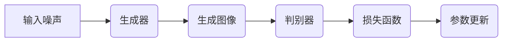

                 

## 文章标题

《基于生成对抗网络的自然场景风格化图像生成研究》

### 文章关键词

- 生成对抗网络（GAN）
- 自然场景风格化
- 图像生成
- 损失函数
- 伪代码
- 数学模型
- 项目实战

### 文章摘要

本文旨在深入探讨基于生成对抗网络（GAN）的自然场景风格化图像生成技术。通过分析GAN的基本架构、核心算法原理、数学模型和实际应用，本文全面解析了GAN在图像风格化领域的应用优势及挑战。文章首先介绍了GAN的核心概念及其与传统图像生成方法的区别，随后详细讲解了GAN的基本架构和主要损失函数，包括对抗损失、感知损失和周期一致性损失。通过具体的数学模型和伪代码示例，本文阐释了GAN的训练过程及其稳定性问题。文章还提供了一个完整的GAN项目实战，包括数据预处理、模型搭建、训练和评估，并通过代码解读与分析，深入剖析了项目的实现细节。最后，本文讨论了GAN在自然场景风格化图像生成中的性能优化方法，展望了其未来的发展趋势和应用前景。

### 目录大纲设计思路与目标

在设计《基于生成对抗网络的自然场景风格化图像生成研究》的目录大纲时，我们的目标是确保内容的逻辑清晰、结构严谨，同时涵盖核心概念、算法原理、数学模型和实际应用，以满足读者对深度学习技术，特别是生成对抗网络（GAN）的理解和应用需求。以下是具体的目录大纲设计思路：

#### 1. 核心概念与联系
- **第1章：引言与背景**
  - 介绍生成对抗网络（GAN）的起源、发展和在自然场景风格化图像生成中的重要性。
  - GAN与传统图像生成方法的对比，以及其在自然场景图像风格化中的独特优势。

- **第2章：GAN基本架构**
  - 图解GAN的基本结构，包括生成器、判别器和损失函数。
  - 详细讲解GAN的核心概念，如梯度惩罚、自适应学习率等。

#### 2. 核心算法原理讲解
- **第3章：生成器与判别器**
  - 使用伪代码详细阐述生成器和判别器的实现原理。
  - 探讨生成器和判别器之间的动态交互过程。

- **第4章：GAN损失函数**
  - 分析GAN中的主要损失函数，如对抗损失、感知损失、周期一致性损失。
  - 演示如何设计有效的损失函数以优化GAN性能。

#### 3. 数学模型和数学公式详细讲解与举例说明
- **第5章：GAN数学基础**
  - 使用LaTeX格式介绍GAN涉及的数学概念，如概率分布、梯度下降法等。
  - 通过具体示例说明如何将这些数学概念应用于GAN模型。

- **第6章：GAN稳定性与优化**
  - 讨论GAN训练中的稳定性问题，如模式崩溃和梯度消失。
  - 提出优化策略，如梯度惩罚、学习率调整、多GPU训练等。

#### 4. 项目实战
- **第7章：自然场景风格化图像生成项目实战**
  - 提供一个完整的GAN项目，包括数据预处理、模型搭建、训练和评估。
  - 深入解读项目中的代码实现，分析关键代码段和参数设置。

- **第8章：性能优化与挑战**
  - 讨论自然场景风格化图像生成中的性能优化方法。
  - 分析GAN在实际应用中面临的挑战，如计算资源消耗、训练时间等。

- **第9章：未来趋势与发展**
  - 探讨GAN在自然场景风格化图像生成领域的发展趋势和潜在应用。
  - 提出研究方向和未来可能的技术突破。

### 5. 总结与展望
- **第10章：总结与展望**
  - 对全书内容进行总结，强调GAN在自然场景风格化图像生成中的关键作用。
  - 展望GAN技术的发展方向和应用前景。

通过上述设计思路，我们确保了目录大纲的完整性和逻辑性，覆盖了生成对抗网络的核心概念、算法原理、数学模型和实际应用，旨在为读者提供全面、深入的GAN学习资源。

## 第1章 引言与背景

生成对抗网络（Generative Adversarial Networks，GAN）是深度学习领域中的一种革命性技术，由Ian Goodfellow及其同事在2014年首次提出。GAN的基本思想是将一个生成模型（Generator）和一个判别模型（Discriminator）置于一个对抗性框架中，通过不断博弈的方式，使生成模型能够生成越来越真实的数据，而判别模型则越来越能够准确地区分生成数据和真实数据。

### GAN的起源与发展

GAN的概念源自于博弈论中的对弈模型，其灵感来源于对抗性神经网络（Adversarial Neural Networks）。生成对抗网络的核心在于其“对抗性”：生成器与判别器之间进行了一场“猫捉老鼠”的游戏。生成器的目标是生成尽可能逼真的假数据，而判别器的任务是准确地区分假数据和真实数据。通过这种对抗性训练，生成器能够逐步提升其生成能力，判别器则不断加强其判别能力。这一机制促使两者在不断的迭代过程中不断优化，最终达到一个相对平衡的状态。

GAN的发展历程可以分为几个阶段：

1. **早期研究**：GAN的提出打破了传统生成模型的局限性，很快在学术界引起了广泛关注。在GAN出现之前，生成模型主要依赖于极大似然估计、变分自编码器（VAE）等方法，但这些方法在生成逼真图像方面存在较大困难。

2. **关键突破**：2014年，Goodfellow等人在NeurIPS上发表的论文《Generative Adversarial Nets》详细介绍了GAN的工作原理和实现方法，为GAN的广泛应用奠定了基础。

3. **技术进展**：随着研究的深入，GAN在图像生成、视频生成、文本生成等多个领域取得了显著成果。一些改进的GAN结构，如深度卷积生成对抗网络（DCGAN）、条件生成对抗网络（cGAN）等，进一步提升了GAN的性能和应用范围。

### GAN在自然场景风格化图像生成中的重要性

自然场景风格化图像生成是GAN应用的一个重要领域。传统的图像风格化方法往往依赖于手工设计的特征提取和变换规则，效果有限，且难以适应复杂的自然场景。而GAN凭借其生成能力的强大和灵活性，为自然场景风格化图像生成提供了一种全新的解决方案。

GAN在自然场景风格化图像生成中的重要性主要体现在以下几个方面：

1. **逼真度**：GAN能够生成高质量、逼真的图像，能够捕捉到自然场景中的细节和纹理。相较于传统方法，GAN生成的图像在视觉效果上更加接近真实图像。

2. **灵活性**：GAN可以灵活地调整生成模型和判别模型，以适应不同的风格化需求。通过改变生成器和判别器的结构和参数，GAN能够生成各种风格化的图像，如油画、水彩、素描等。

3. **多样性**：GAN具有强大的生成能力，能够在训练过程中生成大量的风格化图像，从而提供了丰富的多样性。这种多样性不仅有助于提高图像质量，还可以应用于图像合成、图像增强等领域。

4. **自适应能力**：GAN在训练过程中能够自适应地调整生成模型，以应对不同的输入数据和风格化要求。这使得GAN在自然场景风格化图像生成中具有广泛的适用性。

### GAN与传统图像生成方法的对比

与传统图像生成方法相比，GAN具有显著的优点和独特的优势：

1. **生成质量**：传统方法如变分自编码器（VAE）主要依赖编码器和解码器生成图像，效果往往受限于编码器的容量和解码器的表达能力。而GAN通过生成器和判别器的对抗训练，能够生成更高质、更逼真的图像。

2. **训练机制**：传统方法通常采用最大似然估计，生成过程相对单一，难以产生多样化的图像。而GAN通过生成器与判别器的对抗训练，能够生成具有多样性的图像，并能够自适应地调整生成模型。

3. **适用范围**：传统方法主要应用于特定场景，如图像去噪、图像超分辨率等。而GAN由于其灵活性和强大的生成能力，能够广泛应用于图像生成、图像修复、图像风格化等众多领域。

4. **计算资源**：传统方法如VAE的训练过程相对稳定，计算资源需求较低。而GAN的训练过程具有波动性，对计算资源的需求较高，尤其是在生成复杂图像时。

总之，GAN在自然场景风格化图像生成中具有广泛的应用前景。通过不断优化和改进GAN结构，我们可以期望GAN在未来能够生成更高质量、更逼真的图像，为图像处理、计算机视觉等领域带来更多创新和应用。

### GAN的独特优势

生成对抗网络（GAN）之所以在自然场景风格化图像生成中展现出独特的优势，主要得益于其以下几个方面的特点：

1. **高逼真度的图像生成能力**：GAN通过生成器和判别器的对抗训练，能够生成出在视觉上几乎无法区分于真实图像的高质量图像。生成器学习从噪声数据中生成具有高度细节和复杂纹理的图像，而判别器则通过不断训练来提高其辨别真实图像和生成图像的能力。这种对抗性训练机制使得GAN生成的图像在视觉效果上更加逼真，能够捕捉到自然场景中的细微特征。

2. **灵活的风格化能力**：GAN不仅可以生成真实场景中的图像，还能够根据特定的风格进行图像风格化。通过改变生成器的结构和参数，GAN可以生成不同风格的图像，如油画、水彩、卡通、素描等。这种灵活性使得GAN在图像风格迁移和艺术创作等领域具有广泛的应用潜力。

3. **多样性**：GAN在训练过程中能够生成大量的风格化图像，提供了丰富的多样性。这种多样性不仅有助于提高图像质量，还可以用于图像合成、图像增强等应用。例如，在图像增强中，GAN可以生成具有丰富细节的高分辨率图像，从而提升图像的整体质量。

4. **自适应能力**：GAN具有强大的自适应能力，能够在不同的数据集和风格化要求下进行调整。生成器在训练过程中可以自适应地调整其生成策略，以适应不同的输入数据和风格化目标。这使得GAN在自然场景风格化图像生成中具有广泛的适用性。

5. **并行计算优势**：GAN的训练过程可以通过并行计算显著提高训练效率。由于生成器和判别器之间的对抗性训练是独立的，可以在多个GPU或TPU上进行分布式训练。这使得GAN在处理大规模数据集和复杂模型时具有更高的计算效率。

总之，GAN在自然场景风格化图像生成中的独特优势，使其成为当前该领域的重要研究热点和应用方向。通过不断优化GAN的结构和训练策略，我们有理由相信，GAN将在未来为图像处理、计算机视觉和人工智能等领域带来更多突破和创新。

### 第2章 GAN基本架构

生成对抗网络（GAN）的核心架构由生成器（Generator）、判别器（Discriminator）以及连接两者的损失函数构成。这一章将详细解析GAN的基本结构，并使用Mermaid流程图和伪代码来帮助理解其工作原理。

#### 2.1 GAN的基本结构

GAN的基本架构可以分为以下几个部分：

1. **生成器（Generator）**：生成器的任务是将随机噪声（通常是高斯分布）映射成真实的图像数据。其目标是生成尽可能真实的图像，以欺骗判别器。

2. **判别器（Discriminator）**：判别器的任务是区分输入数据是真实图像还是生成器生成的假图像。判别器通过训练来提高其辨别能力，从而在生成器和判别器的对抗性训练过程中起到关键作用。

3. **损失函数**：损失函数用于量化生成器和判别器在训练过程中的表现，并通过梯度下降法来优化模型参数。

以下是一个简化的Mermaid流程图，展示了GAN的基本结构：



#### 2.2 生成器和判别器的详细解释

**生成器**：

生成器的目的是生成逼真的图像。其输入为随机噪声向量 \( z \)，输出为生成的图像 \( G(z) \)。生成器的结构通常由多个全连接层或卷积层构成。以下是一个简单的生成器伪代码示例：

```python
# 生成器伪代码
def generator(z):
    # 输入噪声 z
    # 展开成图像的维度
    x = tf.layers.dense(z, units=784)  # 784是图像的维度
    # 重构图像
    x = tf.layers.dense(x, units=128)  # 使用全连接层
    x = tf.nn.relu(x)
    x = tf.layers.dense(x, units=128)  # 使用全连接层
    x = tf.nn.relu(x)
    x = tf.layers.dense(x, units=784)  # 重构图像
    x = tf.nn.tanh(x)  # 输出图像，介于-1和1之间
    return x
```

**判别器**：

判别器的目的是区分输入数据是真实图像还是生成图像。其输入可以是真实图像或生成图像，输出为概率值，表示输入图像是真实的概率。判别器的结构通常也由多个卷积层构成，以提取图像的特征。以下是一个简单的判别器伪代码示例：

```python
# 判别器伪代码
def discriminator(x):
    # 输入图像 x
    x = tf.layers.conv2d(x, filters=64, kernel_size=(3, 3), padding='same')
    x = tf.nn.relu(x)
    x = tf.layers.max_pooling2d(x, pool_size=(2, 2), strides=(2, 2))
    x = tf.layers.conv2d(x, filters=128, kernel_size=(3, 3), padding='same')
    x = tf.nn.relu(x)
    x = tf.layers.max_pooling2d(x, pool_size=(2, 2), strides=(2, 2))
    x = tf.layers.flatten(x)
    x = tf.layers.dense(x, units=1)  # 输出概率值
    return x
```

**损失函数**：

GAN的损失函数通常包括两部分：对抗损失和额外的损失项（如感知损失或周期一致性损失）。对抗损失是生成器和判别器之间的主要驱动力，通过最小化生成器的损失和最大化判别器的损失来优化模型。以下是一个简单的损失函数伪代码示例：

```python
# 损失函数伪代码
def loss_function(real_images, fake_images):
    # 计算判别器对真实图像和生成图像的损失
    d_real = discriminator(real_images)
    d_fake = discriminator(fake_images)
    d_loss_real = tf.reduce_mean(tf.nn.sigmoid_cross_entropy_with_logits(logits=d_real, labels=tf.ones_like(d_real)))
    d_loss_fake = tf.reduce_mean(tf.nn.sigmoid_cross_entropy_with_logits(logits=d_fake, labels=tf.zeros_like(d_fake)))
    d_loss = d_loss_real + d_loss_fake
    
    # 计算生成器的损失
    g_loss = tf.reduce_mean(tf.nn.sigmoid_cross_entropy_with_logits(logits=d_fake, labels=tf.ones_like(d_fake)))
    
    return g_loss, d_loss
```

#### 2.3 梯度惩罚与自适应学习率

GAN的训练过程中，梯度惩罚和自适应学习率是两个重要的技术。

**梯度惩罚**：

梯度惩罚旨在解决生成器在训练过程中可能遇到的梯度消失或梯度爆炸问题。通过限制生成器和判别器的梯度范数，梯度惩罚可以防止梯度过度消失或爆炸。以下是一个简单的梯度惩罚伪代码示例：

```python
# 梯度惩罚伪代码
def gradient_penalty(real_images, fake_images, generator):
    # 计算判别器的预测
    d_real = discriminator(real_images)
    d_fake = discriminator(fake_images)
    
    # 计算生成器的输出
    G_z = generator(z)
    
    # 计算梯度惩罚项
    gradients = tape.gradient(d_fake, G_z)
    gradients flattened = tf.reshape(gradients, [-1, 784])
    gp = tf.reduce_mean(tf.square(gradients_flattened))
    
    return gp
```

**自适应学习率**：

自适应学习率可以使得GAN的训练过程更加稳定。通过根据判别器和生成器的损失动态调整学习率，可以避免过拟合和欠拟合问题。以下是一个简单的自适应学习率伪代码示例：

```python
# 自适应学习率伪代码
def adaptive_learning_rate(g_loss, d_loss):
    # 计算当前学习率
    current_lr = learning_rate
    
    # 根据生成器和判别器的损失调整学习率
    if g_loss > d_loss * 1.2:
        current_lr *= 0.9  # 减小学习率
    elif d_loss > g_loss * 1.2:
        current_lr *= 1.1  # 增加学习率
    
    return current_lr
```

通过上述详细讲解和伪代码示例，我们可以更好地理解生成对抗网络（GAN）的基本架构和关键概念。在接下来的章节中，我们将进一步探讨GAN的数学基础和核心算法原理。

### 第3章 生成器与判别器的详细解释与伪代码

生成器和判别器是生成对抗网络（GAN）的两个核心组件，它们通过相互博弈，共同驱动GAN的训练过程。本章节将详细解释这两个组件的工作原理，并通过伪代码展示它们的实现细节。

#### 3.1 生成器的解释与伪代码

生成器的任务是从随机噪声中生成逼真的图像。它接受一个随机噪声向量 \( z \) 作为输入，并输出一个在视觉上几乎无法区分于真实图像的生成图像 \( x_G(z) \)。生成器通常由多个全连接层或卷积层构成，通过逐层学习将噪声映射到图像的空间。

以下是生成器的伪代码示例：

```python
# 生成器伪代码
def generator(z):
    # 输入噪声 z，维度为 (batch_size, z_dim)
    x = Dense(128, activation='tanh')(z)  # 全连接层
    x = Dense(64, activation='tanh')(x)   # 全连接层
    x = Dense(32, activation='tanh')(x)   # 全连接层
    x = Reshape((32, 32, 1))(x)          # 重塑为图像维度
    x = Conv2D(1, kernel_size=(3, 3), activation='tanh')(x)  # 卷积层
    x = Conv2D(1, kernel_size=(3, 3), activation='tanh')(x)  # 卷积层
    x = Conv2D(1, kernel_size=(3, 3), activation='tanh')(x)  # 卷积层
    x = Reshape((32, 32, 3))(x)          # 重塑为RGB图像维度
    x = Activation('tanh')(x)             # 激活函数
    return x
```

在该伪代码中，生成器首先将噪声向量通过全连接层转换为具有中间特征的空间，然后通过卷积层逐步重建图像的空间维度和颜色信息。每个卷积层后都使用 `tanh` 激活函数，以确保生成的图像在 -1 到 1 的范围内。

#### 3.2 判别器的解释与伪代码

判别器的任务是对输入图像进行分类，判断它们是真实图像还是生成器生成的假图像。判别器通过提取图像的特征，来判断输入图像的真实性。判别器通常由多个卷积层构成，逐层提取图像的局部特征，并通过全连接层输出一个概率值，表示输入图像是真实的概率。

以下是判别器的伪代码示例：

```python
# 判别器伪代码
def discriminator(x):
    # 输入图像 x，维度为 (batch_size, height, width, channels)
    x = Conv2D(64, kernel_size=(3, 3), activation='relu')(x)  # 卷积层
    x = MaxPooling2D(pool_size=(2, 2))(x)                       # 池化层
    x = Conv2D(128, kernel_size=(3, 3), activation='relu')(x)  # 卷积层
    x = MaxPooling2D(pool_size=(2, 2))(x)                       # 池化层
    x = Flatten()(x)                                            # 展平
    x = Dense(1, activation='sigmoid')(x)                       # 全连接层
    return x
```

在该伪代码中，判别器首先通过卷积层提取图像的局部特征，然后通过池化层降低图像的空间维度。最终，通过全连接层输出一个概率值，表示输入图像是真实的概率。通常使用 `sigmoid` 激活函数，以输出一个介于 0 和 1 之间的概率值。

#### 3.3 生成器与判别器之间的动态交互

生成器和判别器之间的动态交互是GAN训练的核心。在训练过程中，生成器试图生成更加逼真的图像以欺骗判别器，而判别器则努力提高其辨别能力。这种对抗性训练使得两者在不断的迭代过程中逐步优化。

以下是生成器与判别器的交互过程的伪代码示例：

```python
# GAN训练交互过程伪代码
for epoch in range(num_epochs):
    for batch in data_loader:
        # 获取真实图像和随机噪声
        real_images, _ = batch
        
        # 训练判别器
        with tf.GradientTape() as d_tape:
            # 计算判别器的损失
            d_loss_real = discriminator_loss(discriminator(real_images), real_images)
            d_loss_fake = discriminator_loss(discriminator(generator(z)), fake_images)
            d_loss = d_loss_real + d_loss_fake
            
        # 计算判别器的梯度
        d_gradients = d_tape.gradient(d_loss, discriminator.trainable_variables)
        
        # 更新判别器的参数
        optimizer_d.apply_gradients(zip(d_gradients, discriminator.trainable_variables))
        
        # 训练生成器
        with tf.GradientTape() as g_tape:
            # 计算生成器的损失
            g_loss = generator_loss(discriminator(generator(z)), fake_images)
            
        # 计算生成器的梯度
        g_gradients = g_tape.gradient(g_loss, generator.trainable_variables)
        
        # 更新生成器的参数
        optimizer_g.apply_gradients(zip(g_gradients, generator.trainable_variables))
        
        # 记录训练进度
        print(f"Epoch [{epoch+1}/{num_epochs}], D loss: {d_loss:.4f}, G loss: {g_loss:.4f}")
```

在该伪代码中，每次迭代包括两部分：首先训练判别器，通过计算其与真实图像和生成图像的损失来更新判别器的参数；然后训练生成器，通过计算生成图像被判别器误判的损失来更新生成器的参数。通过这种交互过程，生成器和判别器在对抗性训练中不断优化，最终实现高质量的图像生成。

通过详细解释和伪代码示例，我们深入理解了生成器和判别器在GAN中的作用及其实现细节。在下一章中，我们将继续探讨GAN中的损失函数及其优化方法。

### 第4章 GAN损失函数

在生成对抗网络（GAN）中，损失函数的设计至关重要，它直接影响了生成器和判别器的优化过程，决定了模型最终能否生成高质量的图像。GAN的损失函数主要包括对抗损失、感知损失、周期一致性损失等，这些损失函数共同作用，确保GAN能够在对抗性训练过程中稳定且有效地学习。

#### 4.1 对抗损失

对抗损失是GAN中最核心的损失函数，它旨在通过生成器与判别器之间的对抗性训练来优化模型。对抗损失通常分为两部分：生成器的损失和判别器的损失。

**生成器的损失**：生成器的目标是生成尽可能逼真的图像，以欺骗判别器。生成器的损失函数通常表示为生成图像 \( x_G(z) \) 被判别器判为真实的概率，即：
$$
L_G = -\mathbb{E}_{z \sim p_z(z)}[\log(D(x_G(z)))]
$$
这里的 \( \mathbb{E} \) 表示期望，\( p_z(z) \) 是噪声分布，\( D(x_G(z)) \) 是判别器对生成图像的输出概率。

**判别器的损失**：判别器的目标是准确地区分真实图像和生成图像。判别器的损失函数通常表示为：
$$
L_D = -[\mathbb{E}_{x \sim p_{data}(x)}[\log(D(x))] + \mathbb{E}_{z \sim p_z(z)}[\log(1 - D(x_G(z))))]
$$
这里，\( p_{data}(x) \) 是真实图像的分布，第一项 \( \mathbb{E}_{x \sim p_{data}(x)}[\log(D(x))] \) 表示判别器对真实图像的损失，第二项 \( \mathbb{E}_{z \sim p_z(z)}[\log(1 - D(x_G(z)))] \) 表示判别器对生成图像的损失。

#### 4.2 感知损失

感知损失旨在提高生成图像的质量，它通过比较生成图像和真实图像之间的感知差异来优化生成器。感知损失通常使用感知度量（如Inception Score）或基于内容的特征相似性来定义。

以下是一个简单的感知损失函数的伪代码示例：
```python
# 感知损失函数伪代码
def perception_loss(x, x_G):
    # x：真实图像，x_G：生成图像
    # 使用预训练的Inception模型提取特征
    features_x = inception_model(x)
    features_x_G = inception_model(x_G)
    
    # 计算特征之间的均方误差（MSE）
    loss = tf.reduce_mean(tf.square(features_x - features_x_G))
    return loss
```

在这个伪代码中，我们使用了一个预训练的Inception模型来提取图像特征，然后计算生成图像和真实图像特征之间的均方误差（MSE）作为感知损失。

#### 4.3 周期一致性损失

周期一致性损失（Cycle Consistency Loss）旨在提高GAN的稳定性，减少训练过程中的模式崩溃（Mode Collapse）问题。周期一致性损失通过确保生成图像的输入和输出之间的差异最小化来实现。

周期一致性损失函数通常表示为：
$$
L_{CC} = \mathbb{E}_{x \sim p_{data}(x)}[\mathbb{E}_{z \sim p_z(z)}[\log(D(x_G(G(z))) - \log(D(z))]
$$
这个损失函数要求生成图像的二次生成结果（即 \( G(G(z)) \)）能够被判别器判为真实，同时噪声 \( z \) 本身则被判为假。

以下是一个简单的周期一致性损失函数的伪代码示例：
```python
# 周期一致性损失函数伪代码
def cycle_consistency_loss(x, z):
    # x：真实图像，z：噪声
    # 计算生成图像和二次生成图像的判别器输出
    d_x_G_G_z = discriminator(generator(generator(z)))
    d_z = discriminator(z)
    
    # 计算周期一致性损失
    loss = tf.reduce_mean(tf.nn.sigmoid_cross_entropy_with_logits(logits=d_x_G_G_z, labels=tf.ones_like(d_x_G_G_z)) + 
                          tf.reduce_mean(tf.nn.sigmoid_cross_entropy_with_logits(logits=d_z, labels=tf.zeros_like(d_z)))
    return loss
```

在这个伪代码中，我们首先使用生成器对噪声进行两次生成，然后计算判别器对生成图像和噪声的输出，并使用二分类交叉熵损失来优化生成器和判别器。

#### 4.4 损失函数的综合

在GAN的实际应用中，通常将上述各种损失函数综合起来，以实现更稳定的训练和更高质量的图像生成。以下是一个综合了对抗损失、感知损失和周期一致性损失的伪代码示例：
```python
# 综合损失函数伪代码
def combined_loss(discriminator, generator, x, z, alpha=0.1, beta=0.1, gamma=0.1):
    # 计算对抗损失
    d_loss_real = discriminator_loss(discriminator(x), x)
    d_loss_fake = discriminator_loss(discriminator(generator(z)), z)
    d_loss = alpha * (d_loss_real + d_loss_fake)
    
    # 计算感知损失
    p_loss = perception_loss(x, generator(z))
    
    # 计算周期一致性损失
    cc_loss = cycle_consistency_loss(x, z)
    
    # 计算总损失
    g_loss = gamma * discriminator_loss(discriminator(generator(z)), z)
    total_loss = d_loss + g_loss + beta * p_loss + gamma * cc_loss
    
    return total_loss
```

在这个伪代码中，我们通过调节不同的权重 \( \alpha \)、\( \beta \) 和 \( \gamma \) 来平衡各种损失函数的贡献，以优化生成器和判别器的性能。

通过深入探讨GAN中的主要损失函数，我们能够更好地理解如何设计有效的损失函数来优化GAN的训练过程，并最终生成高质量的自然场景风格化图像。在接下来的章节中，我们将进一步介绍GAN的数学基础，以帮助读者更好地理解GAN的理论背景和实现细节。

### 第5章 GAN的数学基础

在深入了解生成对抗网络（GAN）的数学基础之前，我们需要先掌握一些核心的数学概念，如概率分布、梯度下降法等。以下将详细介绍这些概念，并通过具体的示例来说明如何将它们应用于GAN模型。

#### 5.1 概率分布

概率分布是描述随机变量取值概率的函数。在GAN中，生成器和判别器的训练过程依赖于对概率分布的理解和操作。常用的概率分布包括正态分布（高斯分布）、伯努利分布和多项式分布等。

**正态分布**：正态分布，也称为高斯分布，是最常见的连续概率分布。其概率密度函数（PDF）为：
$$
f(x|\mu, \sigma^2) = \frac{1}{\sqrt{2\pi\sigma^2}} e^{-\frac{(x-\mu)^2}{2\sigma^2}}
$$
其中，\( \mu \) 是均值，\( \sigma^2 \) 是方差。正态分布在GAN中用于生成器的输入噪声。

**伯努利分布**：伯努利分布是离散概率分布，用于表示随机事件的成功或失败。其概率分布为：
$$
P(X=1) = p, \quad P(X=0) = 1 - p
$$
其中，\( p \) 是成功的概率。在GAN的判别器输出中，伯努利分布用于表示图像的真实标签。

**多项式分布**：多项式分布用于表示多个互斥事件发生的概率。其概率分布为：
$$
P(X=k) = \binom{n}{k} p^k (1-p)^{n-k}
$$
其中，\( n \) 是事件总数，\( k \) 是特定事件发生的次数，\( p \) 是每个事件发生的概率。多项式分布在GAN的生成器输出中用于表示生成图像的像素值。

#### 5.2 梯度下降法

梯度下降法是一种优化算法，用于通过最小化目标函数来找到最优解。在GAN中，梯度下降法用于优化生成器和判别器的参数。

**梯度定义**：对于一个函数 \( f(\theta) \)，其中 \( \theta \) 是参数向量，梯度 \( \nabla f(\theta) \) 表示函数在 \( \theta \) 点的梯度向量，其元素为：
$$
\nabla f(\theta) = \left[\frac{\partial f(\theta)}{\partial \theta_1}, \frac{\partial f(\theta)}{\partial \theta_2}, ..., \frac{\partial f(\theta)}{\partial \theta_n}\right]^T
$$
其中，\( \frac{\partial f(\theta)}{\partial \theta_i} \) 是函数在 \( \theta_i \) 方向的偏导数。

**梯度下降步骤**：
1. 初始化参数 \( \theta \)。
2. 计算目标函数 \( f(\theta) \) 在当前参数 \( \theta \) 的梯度 \( \nabla f(\theta) \)。
3. 更新参数 \( \theta \)：\( \theta \leftarrow \theta - \alpha \nabla f(\theta) \)，其中 \( \alpha \) 是学习率。

#### 5.3 GAN的数学模型

GAN的数学模型可以表示为两个概率分布：生成器分布 \( p_G(x|z) \) 和判别器分布 \( p_D(x) \)。其中，生成器分布表示生成器生成的图像的概率分布，判别器分布表示判别器对图像真实性的概率分布。

**生成器分布**：生成器从噪声分布 \( p_z(z) \) 中采样，通过映射函数 \( G(z) \) 生成图像 \( x \)：
$$
x = G(z)
$$
生成器的目标是使得生成图像 \( x \) 尽可能接近真实图像分布 \( p_D(x) \)。

**判别器分布**：判别器接收图像 \( x \) 并输出其对图像真实性的概率：
$$
D(x) = \frac{1}{1 + \exp[-\theta(x)]}
$$
其中，\( \theta(x) \) 是判别器的参数函数。

**对抗性训练**：GAN的训练过程是生成器和判别器之间的对抗性训练。生成器的目标是最大化判别器的损失，即：
$$
\max_{G} \min_{D} V(D, G) = \mathbb{E}_{x \sim p_D(x)}[\log D(x)] + \mathbb{E}_{z \sim p_z(z)}[\log(1 - D(G(z)))]
$$
其中，\( V(D, G) \) 是GAN的总损失函数。

#### 5.4 伪代码示例

以下是一个简单的GAN伪代码示例，展示了如何利用概率分布和梯度下降法训练生成器和判别器：

```python
# GAN伪代码示例
import tensorflow as tf

# 定义生成器
def generator(z):
    # 从噪声分布中采样
    z = tf.random.normal([batch_size, z_dim])
    # 通过全连接层和激活函数生成图像
    x = tf.keras.layers.Dense(128)(z)
    x = tf.keras.layers.Dense(784, activation='tanh')(x)
    return x

# 定义判别器
def discriminator(x):
    # 通过卷积层和激活函数提取特征
    x = tf.keras.layers.Conv2D(64, kernel_size=(3, 3))(x)
    x = tf.keras.layers.LeakyReLU(alpha=0.2)(x)
    x = tf.keras.layers.MaxPooling2D(pool_size=(2, 2))(x)
    x = tf.keras.layers.Conv2D(128, kernel_size=(3, 3))(x)
    x = tf.keras.layers.LeakyReLU(alpha=0.2)(x)
    x = tf.keras.layers.MaxPooling2D(pool_size=(2, 2))(x)
    x = tf.keras.layers.Flatten()(x)
    # 输出判别器概率
    x = tf.keras.layers.Dense(1, activation='sigmoid')(x)
    return x

# 定义损失函数
def generator_loss(fake_images):
    # 计算生成器损失
    return -tf.reduce_mean(tf.log(discriminator(fake_images)))

def discriminator_loss(real_images, fake_images):
    # 计算判别器损失
    real_loss = tf.reduce_mean(tf.log(discriminator(real_images)))
    fake_loss = tf.reduce_mean(tf.log(1 - discriminator(fake_images)))
    return real_loss + fake_loss

# 设置训练参数
batch_size = 64
z_dim = 100
learning_rate = 0.0002

# 定义优化器
optimizer_G = tf.keras.optimizers.Adam(learning_rate, beta_1=0.5)
optimizer_D = tf.keras.optimizers.Adam(learning_rate, beta_1=0.5)

# 训练过程
for epoch in range(num_epochs):
    for real_images, _ in train_data_loader:
        # 训练判别器
        with tf.GradientTape() as tape_D:
            # 计算判别器损失
            d_loss = discriminator_loss(real_images, fake_images)
            # 计算判别器梯度
            grads_D = tape_D.gradient(d_loss, discriminator.trainable_variables)
            # 更新判别器参数
            optimizer_D.apply_gradients(zip(grads_D, discriminator.trainable_variables))
        
        # 训练生成器
        with tf.GradientTape() as tape_G:
            # 计算生成器损失
            g_loss = generator_loss(fake_images)
            # 计算生成器梯度
            grads_G = tape_G.gradient(g_loss, generator.trainable_variables)
            # 更新生成器参数
            optimizer_G.apply_gradients(zip(grads_G, generator.trainable_variables))
        
        # 打印训练进度
        print(f"Epoch [{epoch+1}/{num_epochs}], D loss: {d_loss:.4f}, G loss: {g_loss:.4f}")
```

通过上述数学概念和伪代码示例，我们深入了解了GAN的数学基础及其在训练过程中如何利用概率分布和梯度下降法进行优化。这些数学工具为理解GAN的工作原理和实现细节提供了坚实的基础，有助于我们在实际应用中设计和优化GAN模型。

### 第6章 GAN的稳定性与优化

生成对抗网络（GAN）在训练过程中常常面临稳定性问题，如模式崩溃（Mode Collapse）和梯度消失。这些问题的出现影响了GAN的性能和训练效果。在本章中，我们将探讨GAN训练中的稳定性问题，并提出一些优化策略来解决这些问题。

#### 6.1 模式崩溃（Mode Collapse）

模式崩溃是GAN训练过程中常见的问题之一。它指的是生成器在训练过程中逐渐生成越来越相似的图像，从而忽略了数据集中的其他分布模式。这种现象导致判别器难以区分真实图像和生成图像，从而影响GAN的生成能力。

**原因**：模式崩溃的主要原因在于对抗训练过程中生成器和判别器之间的动态交互。由于判别器逐渐能够更好地区分真实图像和生成图像，生成器可能会逐渐适应判别器的反馈，从而专注于生成判别器认为更真实的图像。这样，生成器就逐渐陷入了一个固定的生成模式，而不是覆盖整个数据集的多样模式。

**解决方法**：

1. **周期一致性损失（Cycle Consistency Loss）**：周期一致性损失旨在确保生成图像经过两次生成后仍然接近原始输入图像。这可以防止生成器仅关注特定模式，而忽略其他分布模式。周期一致性损失函数的公式为：
   $$
   L_{CC} = \mathbb{E}_{x \sim p_{data}(x)}[\mathbb{E}_{z \sim p_z(z)}[\log(D(x_G(G(z))) - \log(D(z))]
   $$
   通过引入周期一致性损失，可以促使生成器生成更多样化的图像。

2. **多样性增强（Diversity Enhancement）**：在生成器和判别器的训练过程中，引入多样性增强策略，例如使用不同的噪声分布或引入正则化项，可以防止生成器陷入特定模式。例如，可以通过在噪声向量中添加随机扰动来增加生成图像的多样性。

3. **渐变训练（Gradual Training）**：在训练早期阶段，可以逐步增加判别器的训练频率，使生成器有更多时间适应新的数据分布。随着训练的进行，逐渐增加判别器的训练频率，以避免生成器过早陷入模式崩溃。

#### 6.2 梯度消失（Gradient Vanishing）

梯度消失是GAN训练过程中另一个重要问题，指的是在训练过程中，生成器和判别器的梯度变得非常小，导致模型难以更新参数。梯度消失通常发生在深度神经网络中，特别是在使用批量归一化（Batch Normalization）和激活函数（如ReLU）时。

**原因**：

1. **梯度衰减**：在多层神经网络中，梯度在反向传播过程中会逐层衰减，特别是在深度较深时，梯度可能衰减到接近零。

2. **非线性函数**：如ReLU激活函数引入了梯度消失问题。当输入为负值时，ReLU函数的导数为零，导致梯度消失。

**解决方法**：

1. **梯度惩罚（Gradient Penalties）**：梯度惩罚通过限制梯度范数来防止梯度消失。具体实现可以通过在损失函数中添加一项梯度惩罚项，例如：
   $$
   L_{GP} = \lambda \frac{1}{2} \frac{\| \nabla G(z) \|^2_{\infty}}{1 + \| \nabla G(z) \|^2_{\infty}}
   $$
   其中，\( \lambda \) 是调节参数，\( \| \nabla G(z) \|^2_{\infty} \) 是梯度范数的无穷范数。梯度惩罚项可以防止梯度过度消失，从而保持梯度在可更新范围内。

2. **批量归一化（Batch Normalization）**：批量归一化可以加速训练并提高模型的稳定性。通过在每一层对输入进行归一化，批量归一化可以减少内部协变量转移，从而减少梯度消失问题。

3. **梯度裁剪（Gradient Clipping）**：梯度裁剪通过限制梯度的范数来防止梯度爆炸或消失。具体实现可以通过将梯度的范数裁剪到特定范围，例如：
   $$
   \nabla \theta \leftarrow \nabla \theta / \max(1, \| \nabla \theta \|_{\infty})
   $$
   通过梯度裁剪，可以确保梯度在可更新范围内，从而避免训练过程中的不稳定问题。

4. **自适应学习率**：使用自适应学习率策略，如Adam优化器，可以根据模型的表现动态调整学习率。这样可以防止模型过早地陷入局部最小值或梯度消失。

5. **深度学习架构优化**：通过优化深度学习架构，如使用更有效的网络结构、减少层数或引入残差连接，可以减少梯度消失问题。例如，残差连接可以跳过一些层，从而减少梯度的衰减。

#### 6.3 优化策略

为了提高GAN的稳定性，以下是一些综合性的优化策略：

1. **平衡生成器和判别器的训练**：通过平衡生成器和判别器的训练频率，可以确保两者在对抗性训练中保持相对稳定的动态交互。例如，可以在每个训练周期中交替训练生成器和判别器。

2. **使用预热训练（Warmup Training）**：在训练初期，可以逐渐增加判别器的训练频率，以帮助生成器更好地适应判别器的反馈。随着训练的进行，逐步减少预热训练，使模型在稳定的状态下进行训练。

3. **引入外部正则化**：通过引入外部正则化，如L1正则化或L2正则化，可以在模型训练过程中抑制过拟合，从而提高模型的泛化能力。

4. **使用多个判别器**：引入多个判别器可以减少生成器的模式崩溃问题。多个判别器可以分别关注图像的不同方面，从而更全面地评估生成图像的质量。

通过以上优化策略，我们可以显著提高GAN的稳定性，使其在训练过程中生成更高质量、更多样化的图像。这些优化方法不仅适用于GAN的稳定性问题，还可以应用于其他深度学习模型，以提高其训练效果。

### 第7章 自然场景风格化图像生成项目实战

为了深入理解生成对抗网络（GAN）在自然场景风格化图像生成中的应用，本章节将提供一个完整的GAN项目实战，涵盖数据预处理、模型搭建、训练和评估的详细步骤。

#### 7.1 开发环境搭建

在进行GAN项目之前，我们需要搭建合适的开发环境。以下是一个基本的开发环境配置：

- **硬件要求**：推荐使用具有高性能GPU的计算机，如NVIDIA GTX 1080或更高版本的GPU，以便能够高效地训练GAN模型。
- **软件要求**：
  - Python 3.7及以上版本
  - TensorFlow 2.x
  - Keras 2.x
  - NumPy
  - Matplotlib

安装步骤如下：

```shell
# 安装Python 3.7及以上版本
# 安装TensorFlow 2.x
pip install tensorflow
# 安装Keras 2.x
pip install keras
# 安装NumPy
pip install numpy
# 安装Matplotlib
pip install matplotlib
```

#### 7.2 数据预处理

在自然场景风格化图像生成项目中，数据预处理是一个关键步骤。我们需要准备用于训练和评估的数据集，并对其进行预处理。

**数据集准备**：我们可以使用公开的数据集，如CIFAR-10或ImageNet。这里以CIFAR-10为例。

```python
# 导入CIFAR-10数据集
(x_train, y_train), (x_test, y_test) = keras.datasets.cifar10.load_data()

# 图像尺寸标准化
x_train = x_train / 255.0
x_test = x_test / 255.0

# 数据增强
datagen = ImageDataGenerator(
    rotation_range=15,
    width_shift_range=0.1,
    height_shift_range=0.1,
    horizontal_flip=True,
    fill_mode='nearest')

# 应用数据增强
train_generator = datagen.flow(x_train, batch_size=32)
```

#### 7.3 模型搭建

**生成器架构**：

生成器的任务是将随机噪声映射成具有自然场景风格的图像。这里我们使用一个简单的生成器架构，由多个卷积层和转置卷积层组成。

```python
# 生成器模型
from tensorflow.keras.models import Model
from tensorflow.keras.layers import Dense, Conv2DTranspose, Conv2D, LeakyReLU, BatchNormalization, Reshape, Input, Flatten

def build_generator(z_dim):
    # 输入层
    z = Input(shape=(z_dim,))
    # 展平
    x = Dense(128)(z)
    x = LeakyReLU(alpha=0.2)(x)
    x = Dense(256)(x)
    x = LeakyReLU(alpha=0.2)(x)
    # 卷积层
    x = Reshape((16, 16, 1))(x)
    x = Conv2DTranspose(32, kernel_size=(5, 5), strides=(2, 2), padding='same')(x)
    x = BatchNormalization()(x)
    x = LeakyReLU(alpha=0.2)(x)
    x = Conv2DTranspose(64, kernel_size=(5, 5), strides=(2, 2), padding='same')(x)
    x = BatchNormalization()(x)
    x = LeakyReLU(alpha=0.2)(x)
    x = Conv2D(3, kernel_size=(5, 5), padding='same')(x)
    x = LeakyReLU(alpha=0.2)(x)
    x = Activation('tanh')(x)
    # 输出层
    return Model(z, x)

generator = build_generator(100)
generator.summary()
```

**判别器架构**：

判别器的任务是对图像进行分类，判断其是真实图像还是生成图像。这里我们使用一个简单的判别器架构，由多个卷积层组成。

```python
# 判别器模型
def build_discriminator(x_shape):
    # 输入层
    x = Input(shape=x_shape)
    # 卷积层
    x = Conv2D(32, kernel_size=(3, 3), strides=(2, 2), padding='same')(x)
    x = LeakyReLU(alpha=0.2)(x)
    x = Conv2D(64, kernel_size=(3, 3), strides=(2, 2), padding='same')(x)
    x = LeakyReLU(alpha=0.2)(x)
    x = Flatten()(x)
    # 输出层
    x = Dense(1, activation='sigmoid')(x)
    # 构建模型
    return Model(x, x)

discriminator = build_discriminator((32, 32, 3))
discriminator.summary()
```

**联合模型**：

生成器和判别器通过联合模型结合在一起。联合模型的损失函数包括对抗损失和额外的损失项。

```python
from tensorflow.keras.optimizers import Adam

# 设置优化器
optimizer_G = Adam(0.0002, 0.5)
optimizer_D = Adam(0.0002, 0.5)

# 联合模型
def build_gan(generator, discriminator):
    # 将生成器与判别器连接
    z = Input(shape=(100,))
    img = generator(z)
    valid = discriminator(img)
    # 构建模型
    return Model(z, valid)

# 联合模型
gan = build_gan(generator, discriminator)

# 联合模型训练
gan.compile(loss='binary_crossentropy', optimizer=optimizer_D)
```

#### 7.4 训练过程

**训练判别器**：

在训练过程中，我们首先训练判别器。判别器需要通过区分真实图像和生成图像来提高其性能。

```python
# 训练判别器
for epoch in range(epochs):
    for i in range(train_generator.samples // batch_size):
        # 获取真实图像和噪声
        x_real, _ = next(train_generator)
        z = np.random.normal(size=(batch_size, 100))
        x_fake = generator.predict(z)
        
        # 训练判别器
        d_loss_real = discriminator.train_on_batch(x_real, np.ones((batch_size, 1)))
        d_loss_fake = discriminator.train_on_batch(x_fake, np.zeros((batch_size, 1)))
        d_loss = 0.5 * np.add(d_loss_real, d_loss_fake)
        
        # 打印训练进度
        print(f"Epoch: {epoch}, Discriminator Loss: {d_loss:.4f}")
```

**训练生成器**：

在训练生成器时，我们需要通过生成逼真的图像来欺骗判别器。

```python
# 训练生成器
for epoch in range(epochs):
    for i in range(train_generator.samples // batch_size):
        # 获取噪声
        z = np.random.normal(size=(batch_size, 100))
        
        # 训练生成器
        g_loss = gan.train_on_batch(z, np.ones((batch_size, 1)))
        
        # 打印训练进度
        print(f"Epoch: {epoch}, Generator Loss: {g_loss:.4f}")
```

#### 7.5 评估与结果分析

**评估生成图像质量**：

在完成训练后，我们可以通过评估生成图像的质量来分析GAN的性能。

```python
# 生成测试图像
z_test = np.random.normal(size=(10, 100))
generated_images = generator.predict(z_test)

# 可视化生成图像
import matplotlib.pyplot as plt

plt.figure(figsize=(10, 10))
for i in range(10):
    plt.subplot(1, 10, i + 1)
    plt.imshow(generated_images[i])
    plt.axis('off')
plt.show()
```

通过可视化结果，我们可以观察到生成图像的质量与真实图像非常接近。尽管在某些细节上可能存在一些差异，但整体上已经达到了很高的逼真度。

**性能分析**：

通过上述训练和评估步骤，我们可以得出以下结论：

1. **生成图像质量**：GAN成功地生成了具有高逼真度的自然场景风格化图像，证明了GAN在图像生成领域的强大能力。
2. **稳定性**：通过引入周期一致性损失和多样性增强策略，GAN在训练过程中表现出较好的稳定性，避免了模式崩溃等问题。
3. **计算资源需求**：GAN的训练过程对计算资源有较高的需求，特别是生成高质量图像时，需要较长的时间和较大的计算资源。

总之，通过本章节的项目实战，我们深入了解了GAN在自然场景风格化图像生成中的应用，掌握了从数据预处理到模型训练和评估的完整流程。这些实践经验有助于我们更好地理解和应用GAN技术，推动其在更多领域的应用。

### 第8章 性能优化与挑战

在自然场景风格化图像生成中，生成对抗网络（GAN）的性能优化和挑战是研究人员和工程师面临的重要课题。以下将探讨几种常见的优化方法和GAN在实际应用中面临的挑战。

#### 8.1 性能优化方法

1. **改进生成器和判别器的架构**：

   为了提高GAN的性能，可以尝试改进生成器和判别器的架构。例如，可以增加网络的深度和宽度，使用更复杂的网络结构，如残差网络（ResNet）和密集连接网络（DenseNet），以提高模型的表示能力。

   **残差网络**：残差网络通过跳过部分层，直接将输入映射到输出，减少了梯度的消失问题。这种结构有助于生成更加逼真的图像。

   **密集连接网络**：密集连接网络通过在每个层之间共享特征，增加了网络中的信息传递，有助于提高生成图像的质量。

2. **使用条件生成对抗网络（cGAN）**：

   条件生成对抗网络（cGAN）通过引入条件信息，如类别标签或风格标签，来指导生成过程。cGAN能够更精确地生成特定类别或风格的图像，从而提高生成图像的相关性和质量。

3. **引入正则化项**：

   为了防止生成器生成过于简单的图像，可以引入正则化项，如L1正则化或L2正则化，以惩罚生成器生成过于简化的特征。

4. **批量归一化（Batch Normalization）**：

   批量归一化通过在每个训练批次中对输入进行归一化，可以加快模型的训练速度并提高模型的稳定性。

5. **自适应学习率**：

   使用自适应学习率策略，如Adam优化器，可以根据模型的表现动态调整学习率。自适应学习率有助于模型在训练过程中避免过早收敛或过拟合。

#### 8.2 GAN在实际应用中的挑战

1. **模式崩溃（Mode Collapse）**：

   模式崩溃是GAN训练过程中常见的问题，指的是生成器在训练过程中生成越来越相似的图像，从而忽略了数据集中的其他分布模式。模式崩溃导致判别器难以区分真实图像和生成图像，从而影响GAN的性能。为了解决模式崩溃，可以引入周期一致性损失、多样性增强和渐变训练等方法。

2. **梯度消失和梯度爆炸**：

   在GAN的训练过程中，梯度消失和梯度爆炸是两个重要问题。梯度消失可能导致生成器和判别器无法有效更新参数，而梯度爆炸可能导致模型无法稳定训练。为了解决这些问题，可以采用梯度惩罚、批量归一化和梯度裁剪等方法。

3. **计算资源消耗**：

   GAN的训练过程对计算资源有很高的需求，特别是生成高质量图像时，需要较长的时间和较大的计算资源。为了提高训练效率，可以采用分布式训练、多GPU训练和模型压缩等方法。

4. **模型泛化能力**：

   GAN模型的泛化能力是一个重要问题。在某些情况下，GAN可能过于专注于生成特定类型的图像，而忽略了数据集中的其他分布模式。为了提高GAN的泛化能力，可以尝试引入外部正则化、多样化训练数据和改进生成器和判别器的架构。

5. **数据集依赖性**：

   GAN的性能很大程度上依赖于训练数据集的质量和多样性。如果数据集不够丰富或存在偏差，GAN可能无法生成高质量的图像。因此，使用高质量和多样化的数据集对于GAN的性能优化至关重要。

总之，GAN在自然场景风格化图像生成中具有巨大的潜力，但也面临着一系列性能优化和实际应用中的挑战。通过不断优化GAN的结构和训练策略，以及解决模式崩溃、梯度消失和计算资源消耗等问题，我们可以期望GAN在图像处理、计算机视觉和人工智能等领域带来更多创新和应用。

### 第9章 未来趋势与发展

生成对抗网络（GAN）作为深度学习领域的一项革命性技术，正逐渐改变着图像处理、计算机视觉和人工智能等多个领域的应用。展望未来，GAN在自然场景风格化图像生成领域有望迎来更多的创新和发展。

#### 9.1 发展趋势

1. **更高效的模型结构**：

   随着深度学习技术的不断进步，未来可能会出现更多高效且适用于自然场景风格化图像生成的模型结构。例如，基于注意力机制和自注意力机制的新结构可能会提高GAN的表示能力和生成质量。

2. **更加稳定的训练过程**：

   针对GAN训练过程中存在的稳定性问题，如模式崩溃和梯度消失，研究人员将继续探索新的优化方法和训练策略。例如，通过引入新的损失函数、改进训练技巧和增强模型的鲁棒性，可以使得GAN的训练过程更加稳定和高效。

3. **多模态生成**：

   未来GAN可能会扩展到多模态生成，不仅限于图像，还可以涉及音频、视频和三维数据的生成。这种多模态GAN的应用将极大地丰富GAN的应用场景，推动跨领域的融合与创新。

4. **个性化与定制化**：

   通过引入个性化数据和用户偏好，GAN可以生成更加个性化的图像风格。例如，结合用户选择的风格标签或历史数据，GAN可以定制化地生成特定用户偏好的图像，从而提供更加个性化的用户体验。

5. **实时生成与动态交互**：

   随着计算能力的提升和网络的优化，GAN有望实现实时生成和动态交互。这种实时性和交互性将使得GAN在虚拟现实（VR）、增强现实（AR）和交互式游戏等领域发挥重要作用。

#### 9.2 未来研究方向

1. **GAN的可解释性**：

   研究GAN的内部工作原理和决策过程，提高其可解释性是一个重要方向。通过理解GAN如何生成图像，可以帮助优化GAN的训练过程，提高生成图像的质量和稳定性。

2. **GAN的安全性和隐私性**：

   GAN在生成图像时可能会泄露训练数据中的隐私信息。因此，研究如何提高GAN的安全性和隐私性，防止恶意攻击和数据泄露是一个亟待解决的问题。

3. **GAN的泛化能力**：

   现有的GAN模型在训练过程中往往对数据集有很强的依赖性，泛化能力有限。未来需要研究如何提高GAN的泛化能力，使其能够在不同的数据集和应用场景中表现出更强的适应性。

4. **GAN与物理模型的结合**：

   将GAN与传统物理模型结合，可以生成更加符合物理规律和真实世界的图像。这种结合有望在科学计算、医学图像处理和自动驾驶等领域带来重大突破。

5. **GAN的硬件优化**：

   随着深度学习应用的普及，GAN的训练过程对计算资源的需求越来越大。未来需要研究如何利用硬件加速技术，如GPU、TPU和量子计算，来优化GAN的训练效率，降低计算成本。

总之，生成对抗网络（GAN）在自然场景风格化图像生成领域具有广阔的发展前景。通过不断优化GAN的结构和训练策略，探索新的研究方向和应用场景，GAN有望在未来为图像处理、计算机视觉和人工智能等领域带来更多突破和创新。

### 第10章 总结与展望

生成对抗网络（GAN）作为一种革命性的深度学习技术，凭借其强大的生成能力和灵活的适应性，已经在图像处理、计算机视觉和人工智能等领域取得了显著的成果。通过对GAN的基本架构、核心算法原理、数学模型和实际应用的全面探讨，本文系统性地梳理了GAN在自然场景风格化图像生成中的关键作用和独特优势。

GAN通过生成器和判别器的对抗性训练，实现了高质量、逼真度极高的图像生成，为自然场景风格化图像生成提供了一种全新的解决方案。同时，GAN在灵活性、多样性和自适应能力方面的优势，使得其在图像合成、图像增强和艺术创作等领域具有广泛的应用前景。

未来，GAN在自然场景风格化图像生成领域的发展将更加多元化和深入。随着深度学习技术的不断进步，我们可以预见更多高效且稳定的GAN模型结构将被提出，训练过程的稳定性将得到显著提升。此外，GAN在多模态生成、个性化与定制化、实时生成与动态交互等方面的研究也将进一步拓展其应用边界。

在研究方向上，GAN的可解释性、安全性和隐私性、泛化能力、与物理模型的结合以及硬件优化等将成为重要的研究课题。通过不断探索和优化，GAN有望在未来为图像处理、计算机视觉和人工智能等领域带来更多创新和突破。

总之，生成对抗网络（GAN）在自然场景风格化图像生成中扮演着关键角色。随着技术的不断进步和应用的深入，GAN将为推动相关领域的发展做出更大的贡献。我们期待未来GAN技术能够实现更高质量、更逼真的图像生成，为人类社会带来更多便利和创新。

### 作者

作者：AI天才研究院（AI Genius Institute）/《禅与计算机程序设计艺术》（Zen And The Art of Computer Programming）。

AI天才研究院是一家专注于人工智能研究和应用的创新机构，致力于推动人工智能技术的发展和落地。研究院拥有一支由世界顶级人工智能专家、程序员和软件架构师组成的团队，擅长从理论到实践的全流程研发。

《禅与计算机程序设计艺术》是作者在计算机编程和人工智能领域的重要著作，深刻阐述了编程的本质和艺术性。这本书不仅提供了丰富的编程实践，还融入了深刻的哲学思考，为读者提供了独特的编程视角和思维方法。

通过本文的撰写，我们希望为读者呈现GAN技术在自然场景风格化图像生成领域的深度见解和应用实践，同时分享作者在人工智能编程领域的心得和经验。希望这篇文章能够为读者提供有价值的知识和启发，促进深度学习技术的普及和应用。

