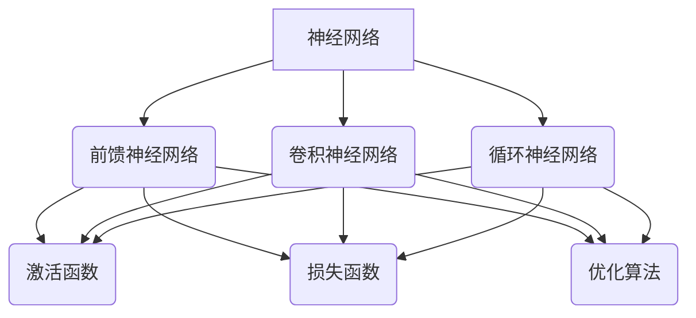

                 

## 文章标题：基于神经网络的城市空气质量研究

### 关键词：
- 神经网络
- 城市空气质量
- 数据预处理
- 预测模型
- 深度学习

### 摘要：
本文将探讨如何利用神经网络技术对城市空气质量进行预测和研究。通过详细分析城市空气质量的重要性、神经网络的基础知识以及相关的数据预处理、模型选择与构建方法，我们将逐步构建并训练神经网络模型，最终实现城市空气质量的预测。本文还探讨了神经网络在城市空气质量研究中的应用前景以及面临的挑战。

## 《基于神经网络的城市空气质量研究》目录大纲

### 第一部分：背景与核心概念

#### 第1章：城市空气质量研究概述
1.1 城市空气质量的重要性
1.2 神经网络与空气质量研究的关系
1.3 本书目标与结构

#### 第2章：神经网络基础
2.1 神经网络简介
2.2 前馈神经网络
2.3 卷积神经网络
2.4 循环神经网络

### 第二部分：城市空气质量数据预处理

#### 第3章：数据收集与处理
3.1 空气质量数据的来源
3.2 数据预处理方法
3.3 特征选择与工程

#### 第4章：神经网络模型选择与构建
4.1 模型选择标准
4.2 前馈神经网络在空气质量预测中的应用
4.3 卷积神经网络在空气质量预测中的应用
4.4 循环神经网络在空气质量预测中的应用

### 第三部分：核心算法原理讲解

#### 第5章：神经网络算法原理
5.1 前馈神经网络算法原理
5.2 卷积神经网络算法原理
5.3 循环神经网络算法原理

#### 第6章：数学模型与数学公式
6.1 激活函数
6.2 损失函数
6.3 优化算法

### 第四部分：项目实战

#### 第7章：空气质量预测项目实战
7.1 项目介绍
7.2 数据预处理与特征工程
7.3 模型选择与训练
7.4 模型评估与优化
7.5 项目总结

#### 第8章：未来展望与挑战
8.1 神经网络在城市空气质量研究中的应用前景
8.2 研究挑战与解决方案

### 附录

#### 附录A：常用工具与资源
A.1 神经网络框架
A.2 数据处理工具
A.3 机器学习库与资源

#### 附录B：参考文献
B.1 相关书籍
B.2 学术论文
B.3 网络资源

### Mermaid 流程图：


## 第一部分：背景与核心概念

### 第1章：城市空气质量研究概述

#### 1.1 城市空气质量的重要性

城市空气质量是现代社会面临的重大环境问题之一。随着城市化进程的加速和工业化的快速发展，城市空气污染问题日益严重。空气污染不仅对人类健康产生严重影响，还影响生态系统的平衡。因此，研究城市空气质量对于改善人类生活和保护环境具有重要意义。

空气污染的主要来源包括工业废气、汽车尾气、建筑施工和自然因素等。这些污染物包括颗粒物（PM2.5、PM10）、二氧化硫（SO2）、氮氧化物（NOx）、一氧化碳（CO）和挥发性有机化合物（VOCs）等。不同的污染物对人体和环境产生不同的危害，如颗粒物可以导致呼吸系统疾病，SO2和NOx可以引起酸雨，CO可以导致中毒等。

#### 1.2 神经网络与空气质量研究的关系

神经网络是一种模拟人脑神经元结构和功能的计算模型，具有强大的非线性处理能力和自适应学习能力。近年来，随着深度学习技术的发展，神经网络在各个领域取得了显著的成果，包括图像识别、自然语言处理、语音识别等。

在城市空气质量研究中，神经网络可以用于空气质量预测、污染物浓度估计、污染源识别等任务。通过训练神经网络模型，可以自动学习到空气质量数据中的复杂模式和规律，从而提高预测精度和决策能力。

#### 1.3 本书目标与结构

本书的目标是探讨如何利用神经网络技术对城市空气质量进行研究和预测。具体目标包括：

1. 深入理解城市空气质量的基本概念和影响因素。
2. 熟悉神经网络的基本原理和常见类型。
3. 掌握城市空气质量数据预处理方法和特征工程技术。
4. 选择合适的神经网络模型进行空气质量预测。
5. 进行项目实战，实现空气质量预测系统的开发和应用。

本书的结构如下：

- 第一部分：背景与核心概念，介绍城市空气质量研究的重要性、神经网络的基础知识。
- 第二部分：数据预处理，讨论城市空气质量数据的收集、预处理和特征工程。
- 第三部分：核心算法原理讲解，详细阐述神经网络算法原理、数学模型和公式。
- 第四部分：项目实战，通过具体项目实例展示神经网络在城市空气质量研究中的应用。

通过本书的学习，读者可以系统地了解城市空气质量研究和神经网络技术，为实际应用提供理论指导和实践基础。

### 第2章：神经网络基础

#### 2.1 神经网络简介

神经网络（Neural Network）是一种通过模拟人脑神经元结构和功能来实现的计算模型。它由大量相互连接的简单处理单元（神经元）组成，通过调整神经元之间的连接权重来学习数据中的模式和规律。

神经网络的原理可以追溯到1943年，由心理学家McCulloch和数学家Pitts提出的神经网络模型。随后，1958年，Frank Rosenblatt发明了感知机（Perceptron），这是最早的神经网络模型之一。随着计算机技术的发展和人工智能领域的兴起，神经网络逐渐成为一种重要的机器学习工具。

神经网络的主要特点包括：

1. **非线性处理能力**：神经网络通过非线性激活函数将输入数据映射到输出，能够处理复杂的数据模式。
2. **自适应学习能力**：神经网络通过训练自动调整连接权重，从而学会对未知数据进行分类、预测等任务。
3. **并行处理能力**：神经网络中的每个神经元可以并行处理数据，从而提高计算效率。
4. **通用性**：神经网络可以应用于各种领域，包括图像识别、自然语言处理、语音识别、推荐系统等。

#### 2.2 前馈神经网络

前馈神经网络（Feedforward Neural Network，FNN）是最常见的神经网络类型之一。它由多个层次组成，包括输入层、隐藏层和输出层。数据从输入层进入，经过隐藏层的层层传递，最终到达输出层。

前馈神经网络的主要特点如下：

1. **无反馈连接**：前馈神经网络中的数据流向是单向的，从输入层流向输出层，没有反向的连接。
2. **逐层传播**：前馈神经网络中的数据在每一层都会进行线性变换，然后通过激活函数引入非线性。
3. **权重调整**：在训练过程中，神经网络通过反向传播算法调整连接权重，使网络输出接近目标值。

前馈神经网络的架构可以用以下步骤表示：

1. **初始化权重**：随机初始化输入层到隐藏层、隐藏层到输出层的权重。
2. **正向传播**：输入数据通过输入层传递到隐藏层，经过线性变换和激活函数处理后，再传递到下一层。
3. **计算输出**：数据经过隐藏层传递到输出层，得到最终的输出结果。
4. **反向传播**：计算输出误差，通过反向传播算法更新权重，使网络输出更接近目标值。
5. **迭代训练**：重复正向传播和反向传播过程，直到网络输出满足要求。

前馈神经网络的激活函数通常使用Sigmoid函数、ReLU函数或Tanh函数。Sigmoid函数可以保证输出在0和1之间，ReLU函数可以加速训练过程，Tanh函数可以引入非线性同时保持输出在-1和1之间。

#### 2.3 卷积神经网络

卷积神经网络（Convolutional Neural Network，CNN）是专门用于处理图像数据的神经网络模型。它利用卷积操作从图像中提取特征，并通过层次结构逐步组合这些特征，从而实现对图像的复杂模式识别。

卷积神经网络的主要特点如下：

1. **局部连接**：卷积神经网络中的卷积操作仅对局部区域进行操作，从而减少了参数的数量，提高了计算效率。
2. **平移不变性**：卷积神经网络可以识别图像中的重复模式，而不受图像位置的影响。
3. **共享权重**：卷积神经网络中的卷积核在图像的不同位置共享权重，从而减少了参数的数量。
4. **层次化特征提取**：卷积神经网络通过多个卷积层和池化层，逐步提取图像的局部特征和全局特征。

卷积神经网络的基本结构如下：

1. **卷积层**：卷积层通过卷积操作从输入图像中提取特征。每个卷积核可以提取图像的某一特定特征。
2. **激活函数**：在卷积层之后，通常使用ReLU函数作为激活函数，引入非线性。
3. **池化层**：池化层用于减少特征图的尺寸，提高计算效率。常见的池化操作包括最大池化和平均池化。
4. **全连接层**：卷积神经网络的输出通过全连接层进行分类或预测。全连接层将特征图展平为一维向量，然后通过线性变换和激活函数得到最终输出。

卷积神经网络的应用范围广泛，包括图像分类、目标检测、图像分割等。通过训练卷积神经网络，可以自动学习到图像中的复杂特征和模式，从而实现对图像的准确识别和分类。

#### 2.4 循环神经网络

循环神经网络（Recurrent Neural Network，RNN）是一种专门用于处理序列数据的神经网络模型。它通过将前一个时间步的输出作为当前时间步的输入，实现了对序列数据的记忆和建模。

循环神经网络的主要特点如下：

1. **序列建模能力**：循环神经网络可以处理任意长度的序列数据，通过记忆机制实现对序列数据的建模。
2. **状态转移函数**：循环神经网络通过状态转移函数将当前时间步的输入和前一个时间步的隐藏状态组合，生成当前时间步的隐藏状态。
3. **反向传播**：循环神经网络通过反向传播算法更新权重，使网络输出更接近目标值。

循环神经网络的基本结构如下：

1. **输入层**：输入层接收序列数据的当前时间步输入。
2. **隐藏层**：隐藏层通过状态转移函数将当前时间步的输入和前一个时间步的隐藏状态组合，生成当前时间步的隐藏状态。
3. **输出层**：输出层将隐藏状态映射到输出结果，例如分类标签或预测值。
4. **记忆机制**：循环神经网络通过隐藏状态实现记忆功能，可以保存和利用过去的信息。

循环神经网络的应用范围包括自然语言处理、语音识别、时间序列预测等。通过训练循环神经网络，可以自动学习到序列数据中的模式和规律，从而实现对序列数据的建模和预测。

总之，神经网络是一种强大的机器学习工具，广泛应用于各个领域。前馈神经网络、卷积神经网络和循环神经网络分别具有不同的特点和适用场景。理解神经网络的基础知识对于深入研究和应用神经网络技术具有重要意义。

### 第3章：城市空气质量数据预处理

#### 3.1 空气质量数据的来源

城市空气质量数据可以通过多种来源获取，主要包括以下几种：

1. **环境监测站**：环境监测站是获取空气质量数据的主要途径，包括国家环境监测站、地方政府环境监测站等。这些监测站配备有各种传感器，如颗粒物传感器、气体传感器等，实时监测空气中的污染物浓度。

2. **卫星遥感数据**：卫星遥感技术可以通过遥感传感器获取大范围的空气质量数据。这些数据包括地表污染物浓度、大气化学成分等。

3. **气象数据**：气象数据对于空气质量预测具有重要意义，包括温度、湿度、风速、风向等。这些数据可以通过气象台站、卫星遥感、地面气象站等获取。

4. **物联网传感器**：随着物联网技术的发展，各种物联网传感器被广泛部署在城市各个角落，用于监测空气质量。这些传感器包括PM2.5、PM10传感器、二氧化碳传感器等。

5. **社交数据**：社交媒体平台如微博、微信等也提供了大量的空气质量相关数据，包括用户发布的实时空气质量报告、污染投诉等。

#### 3.2 数据预处理方法

数据预处理是城市空气质量研究的重要环节，旨在清洗和整理原始数据，提高数据质量和模型性能。以下是一些常见的数据预处理方法：

1. **数据清洗**：数据清洗是数据预处理的第一步，旨在去除原始数据中的错误、异常和重复数据。常见的清洗方法包括：

   - **去重**：删除重复的数据记录。
   - **缺失值处理**：对于缺失值，可以选择填充缺失值、删除缺失值记录或使用插值方法进行补全。
   - **错误值修正**：识别和修正数据中的错误值，如明显偏离正常范围的异常值。

2. **数据转换**：数据转换是指将原始数据转换为适合模型训练的形式。常见的数据转换方法包括：

   - **归一化**：将数据缩放到一个特定的范围，如[0, 1]或[-1, 1]，以提高模型训练的稳定性和收敛速度。
   - **标准化**：将数据缩放为标准正态分布，即均值为0，标准差为1。
   - **编码**：对于分类数据，可以使用独热编码（One-Hot Encoding）或标签编码（Label Encoding）等方法将其转换为数值形式。

3. **特征选择**：特征选择是指从原始数据中挑选出对模型训练和预测有重要作用的特征，以提高模型性能和降低计算成本。常见的特征选择方法包括：

   - **相关性分析**：通过计算特征之间的相关性，选择相关性较高的特征。
   - **特征重要性评估**：使用模型训练结果评估每个特征的重要性，选择重要的特征。
   - **递归特征消除（RFE）**：通过递归地删除不重要特征，逐步构建特征子集。

4. **数据降维**：数据降维是指将高维数据压缩到低维空间，以减少数据大小和计算复杂度。常见的数据降维方法包括：

   - **主成分分析（PCA）**：通过计算数据的协方差矩阵，提取主要成分，实现数据降维。
   - **线性判别分析（LDA）**：通过最大化类内离散度和最小化类间离散度，实现数据降维。
   - **自编码器（Autoencoder）**：通过训练自编码器网络，实现数据降维和特征提取。

5. **数据增强**：数据增强是指通过生成新的数据样本来扩充原始数据集，以提高模型泛化能力和鲁棒性。常见的数据增强方法包括：

   - **复制和粘贴**：将现有数据样本复制和粘贴多次，生成新的样本。
   - **旋转和缩放**：对图像数据样本进行旋转和缩放，生成新的样本。
   - **数据合成**：使用生成对抗网络（GAN）等生成模型，生成新的数据样本。

#### 3.3 特征选择与工程

特征选择与工程是数据预处理的重要步骤，旨在构建对模型训练和预测有重要作用的特征。以下是一些常见的特征选择与工程方法：

1. **时间特征**：时间特征包括小时、日期、星期等。这些特征可以反映空气质量的变化规律，如一天中不同时间段、一周中不同天数的空气质量变化。

2. **空间特征**：空间特征包括地理坐标、距离等。这些特征可以反映不同地区之间的空气质量差异，如城市内部不同区域的空气质量变化。

3. **污染物特征**：污染物特征包括不同污染物的浓度值。这些特征可以反映污染物的变化规律和相关性，如PM2.5和PM10之间的相关性。

4. **气象特征**：气象特征包括温度、湿度、风速、风向等。这些特征可以反映气象因素对空气质量的影响，如高温和低湿度可能导致空气污染加剧。

5. **节假日特征**：节假日特征可以反映节假日对空气质量的影响，如节假日期间交通流量减少，可能导致空气质量改善。

6. **事件特征**：事件特征包括重大活动、交通事故等。这些特征可以反映特定事件对空气质量的影响，如大型活动可能导致空气污染加剧。

7. **社会经济特征**：社会经济特征包括人口密度、工业产值、交通流量等。这些特征可以反映社会经济因素对空气质量的影响，如人口密度增加可能导致空气质量恶化。

通过合理的特征选择与工程，可以构建出对模型训练和预测有重要作用的特征，从而提高模型的性能和准确性。

### 第4章：神经网络模型选择与构建

#### 4.1 模型选择标准

在神经网络模型选择过程中，需要考虑多个标准来评估和选择最佳的模型。以下是一些常见的模型选择标准：

1. **准确性**：准确性是评估模型性能的最基本指标，表示模型正确预测样本的比例。通常使用准确率（Accuracy）、精确率（Precision）、召回率（Recall）和F1分数（F1 Score）等指标来衡量。

2. **计算效率**：计算效率是指模型在训练和预测过程中的计算资源消耗。包括模型的参数数量、计算复杂度等。计算效率高的模型可以在有限资源下获得较好的性能。

3. **泛化能力**：泛化能力是指模型对新数据的适应能力。选择泛化能力强的模型可以避免过拟合现象，提高模型在实际应用中的性能。

4. **训练时间**：训练时间是模型训练过程中消耗的时间。对于需要实时预测的应用场景，选择训练时间较短的模型可以更快地得到预测结果。

5. **鲁棒性**：鲁棒性是指模型对噪声和异常值的容忍能力。选择鲁棒性强的模型可以减少噪声和异常值对模型性能的影响。

6. **可解释性**：可解释性是指模型决策过程的透明度和可理解性。选择具有较高可解释性的模型可以更好地解释模型预测结果，提高用户对模型的信任度。

7. **实现复杂性**：实现复杂性是指模型实现和部署的难易程度。选择实现复杂度较低的模型可以降低开发成本和部署难度。

#### 4.2 前馈神经网络在空气质量预测中的应用

前馈神经网络（FNN）是一种常用的神经网络模型，特别适用于空气质量预测任务。以下是如何在前馈神经网络中应用空气质量预测的步骤：

1. **数据准备**：首先，收集和预处理空气质量数据，包括污染物浓度、气象数据、时间特征、空间特征等。对数据进行归一化和编码处理，以适应神经网络的输入要求。

2. **模型构建**：构建前馈神经网络模型，包括输入层、一个或多个隐藏层和输出层。输入层接收预处理后的数据，隐藏层通过线性变换和激活函数提取特征，输出层进行分类或回归预测。

3. **模型训练**：使用训练数据对前馈神经网络模型进行训练。通过反向传播算法自动调整连接权重，使模型输出接近目标值。训练过程中可以使用正则化技术，如L1正则化、L2正则化，防止过拟合。

4. **模型评估**：使用验证集和测试集对训练好的模型进行评估。计算模型的准确性、精确率、召回率等指标，以评估模型性能。调整模型参数和结构，以优化模型性能。

5. **模型部署**：将训练好的模型部署到实际应用环境中，进行空气质量预测。根据实际需求和数据输入，可以实时更新模型，以适应动态变化的数据。

#### 4.3 卷积神经网络在空气质量预测中的应用

卷积神经网络（CNN）是一种专门用于图像处理和特征提取的神经网络模型，但在空气质量预测中，也可以利用其局部连接和平移不变性的特点。以下是如何在卷积神经网络中应用空气质量预测的步骤：

1. **数据准备**：收集和预处理空气质量数据，包括图像数据和其他特征。对图像数据缩放、裁剪和增强，以提高模型的泛化能力。

2. **模型构建**：构建卷积神经网络模型，包括卷积层、池化层、全连接层等。卷积层通过卷积操作从图像中提取特征，池化层用于减少特征图的尺寸，全连接层进行分类或回归预测。

3. **模型训练**：使用训练数据对卷积神经网络模型进行训练。通过反向传播算法自动调整连接权重，使模型输出接近目标值。训练过程中可以使用卷积神经网络特有的优化技术，如批量归一化（Batch Normalization）、dropout等。

4. **模型评估**：使用验证集和测试集对训练好的模型进行评估。计算模型的准确性、精确率、召回率等指标，以评估模型性能。调整模型参数和结构，以优化模型性能。

5. **模型部署**：将训练好的模型部署到实际应用环境中，进行空气质量预测。根据实际需求和数据输入，可以实时更新模型，以适应动态变化的数据。

#### 4.4 循环神经网络在空气质量预测中的应用

循环神经网络（RNN）是一种专门用于处理序列数据的神经网络模型，特别适用于空气质量预测任务，因为空气质量数据通常具有时间序列特性。以下是如何在循环神经网络中应用空气质量预测的步骤：

1. **数据准备**：收集和预处理空气质量数据，包括时间序列数据和其他特征。对数据进行归一化和编码处理，以适应循环神经网络的输入要求。

2. **模型构建**：构建循环神经网络模型，包括输入层、隐藏层和输出层。输入层接收预处理后的数据，隐藏层通过状态转移函数和激活函数提取特征，输出层进行分类或回归预测。

3. **模型训练**：使用训练数据对循环神经网络模型进行训练。通过反向传播算法自动调整连接权重，使模型输出接近目标值。训练过程中可以使用门控循环单元（GRU）、长短期记忆（LSTM）等高级循环神经网络结构，提高模型性能。

4. **模型评估**：使用验证集和测试集对训练好的模型进行评估。计算模型的准确性、精确率、召回率等指标，以评估模型性能。调整模型参数和结构，以优化模型性能。

5. **模型部署**：将训练好的模型部署到实际应用环境中，进行空气质量预测。根据实际需求和数据输入，可以实时更新模型，以适应动态变化的数据。

### 第三部分：核心算法原理讲解

#### 第5章：神经网络算法原理

神经网络的算法原理是其实现智能功能的核心。在这一章节中，我们将详细讲解前馈神经网络（FNN）、卷积神经网络（CNN）和循环神经网络（RNN）的基本算法原理，并使用伪代码来描述其实现过程。

#### 5.1 前馈神经网络（FNN）算法原理

前馈神经网络是一种简单的神经网络结构，数据从输入层流入，经过一系列的隐藏层，最终到达输出层。以下是前馈神经网络的算法原理：

**步骤：**

1. **初始化权重和偏置**：随机初始化输入层到隐藏层、隐藏层到输出层的权重和偏置。
2. **前向传播**：将输入数据传递到网络中，通过加权求和并应用激活函数，逐层传递到输出层。
3. **计算输出**：网络的输出层产生最终输出。
4. **反向传播**：通过计算输出误差，反向传播误差到隐藏层，更新权重和偏置。
5. **迭代训练**：重复前向传播和反向传播过程，直到网络输出满足要求。

**伪代码：**

```python
# 初始化权重和偏置
weights = initialize_weights(input_size, hidden_size)
biases = initialize_biases(hidden_size)
output = initialize_output(output_size)

# 前向传播
for input in inputs:
    hidden_output = activation_function(np.dot(input, weights) + biases)
    output = activation_function(np.dot(hidden_output, weights) + biases)

# 反向传播
error = output - target
delta_output = error * activation_function_derivative(output)
delta_hidden = delta_output.dot(weights.T) * activation_function_derivative(hidden_output)

# 更新权重和偏置
weights += hidden_output.T.dot(delta_output)
biases += np.sum(delta_output, axis=0)
weights += hidden_output.T.dot(delta_hidden)
biases += np.sum(delta_hidden, axis=0)

# 迭代训练
for epoch in range(num_epochs):
    for input, target in dataset:
        output = forward_pass(input, weights, biases)
        error = compute_error(output, target)
        backward_pass(error, weights, biases)
```

#### 5.2 卷积神经网络（CNN）算法原理

卷积神经网络是专门用于图像处理和特征提取的神经网络结构。其核心是卷积层，通过局部连接和平移不变性提取图像特征。以下是卷积神经网络的基本算法原理：

**步骤：**

1. **卷积操作**：在输入图像上应用卷积核，通过局部连接提取特征。
2. **激活函数**：对卷积结果应用激活函数，引入非线性。
3. **池化操作**：通过池化操作减小特征图的尺寸，提高计算效率。
4. **全连接层**：将卷积层的输出通过全连接层进行分类或回归预测。

**伪代码：**

```python
# 卷积操作
for filter in filters:
    conv_output = convolution(input_image, filter)
    activation = activation_function(conv_output)

# 池化操作
pooled_output = pooling(activation)

# 全连接层
output = activation_function(np.dot(pooled_output, weights) + biases)
```

#### 5.3 循环神经网络（RNN）算法原理

循环神经网络是专门用于处理序列数据的神经网络结构，通过循环机制实现序列数据的记忆和建模。以下是循环神经网络的基本算法原理：

**步骤：**

1. **输入层**：接收序列数据的当前时间步输入。
2. **隐藏层**：通过状态转移函数将当前时间步的输入和前一个时间步的隐藏状态组合，生成当前时间步的隐藏状态。
3. **输出层**：将隐藏状态映射到输出结果，例如分类标签或预测值。
4. **记忆机制**：通过隐藏状态实现记忆功能，可以保存和利用过去的信息。

**伪代码：**

```python
# 状态转移函数
for time_step in sequence:
    current_input = input_sequence[time_step]
    hidden_state = activation_function(np.dot(current_input, weights_input) + np.dot(hidden_state_previous, weights_hidden) + biases)

# 输出计算
output = activation_function(np.dot(hidden_state, weights_output) + biases)
```

通过以上对前馈神经网络、卷积神经网络和循环神经网络算法原理的讲解，我们可以更好地理解这些神经网络的工作机制，为后续的模型构建和应用提供理论基础。

#### 第6章：数学模型与数学公式

在神经网络中，数学模型和公式是核心组成部分，它们决定了网络的行为和性能。在本章节中，我们将详细讲解神经网络中的激活函数、损失函数和优化算法，并使用LaTeX格式展示相关的数学公式。

#### 6.1 激活函数

激活函数是神经网络中引入非线性的关键组件，它将线性组合的输入映射到一个新的空间，使得神经网络能够处理复杂的数据模式。常见的激活函数包括Sigmoid函数、ReLU函数和Tanh函数。

**Sigmoid函数：**
$$
\sigma(x) = \frac{1}{1 + e^{-x}}
$$

**ReLU函数：**
$$
\text{ReLU}(x) = \max(0, x)
$$

**Tanh函数：**
$$
\text{Tanh}(x) = \frac{e^{2x} - 1}{e^{2x} + 1}
$$

激活函数的选择取决于具体应用场景和模型的需求。例如，ReLU函数由于其简单性和训练速度，在深度学习中广泛使用。

#### 6.2 损失函数

损失函数是评估神经网络预测结果与实际目标之间差异的数学度量。常见的损失函数包括均方误差（MSE）、交叉熵损失（Cross Entropy Loss）等。

**均方误差（MSE）：**
$$
\text{MSE} = \frac{1}{n}\sum_{i=1}^{n}(y_i - \hat{y}_i)^2
$$

其中，$y_i$是实际标签，$\hat{y}_i$是预测值，$n$是样本数量。

**交叉熵损失（Cross Entropy Loss）：**
$$
\text{Cross Entropy Loss} = -\frac{1}{n}\sum_{i=1}^{n}y_i\log(\hat{y}_i)
$$

其中，$y_i$是实际标签（通常为one-hot编码形式），$\hat{y}_i$是预测的概率分布。

损失函数的选择取决于模型的类型和目标。例如，对于回归任务，通常使用MSE；对于分类任务，通常使用交叉熵损失。

#### 6.3 优化算法

优化算法用于调整神经网络的权重和偏置，以最小化损失函数。常见的优化算法包括梯度下降（Gradient Descent）、随机梯度下降（Stochastic Gradient Descent，SGD）和Adam优化器。

**梯度下降（Gradient Descent）：**
$$
\theta_{\text{new}} = \theta_{\text{old}} - \alpha \nabla_\theta J(\theta)
$$

其中，$\theta$是模型参数，$\alpha$是学习率，$J(\theta)$是损失函数。

**随机梯度下降（SGD）：**
$$
\theta_{\text{new}} = \theta_{\text{old}} - \alpha \nabla_\theta J(\theta; x_i, y_i)
$$

与梯度下降不同，SGD在每个样本上计算梯度，并更新参数。

**Adam优化器：**
$$
m_t = \beta_1 m_{t-1} + (1 - \beta_1) \nabla_\theta J(\theta; x_t, y_t) \\
v_t = \beta_2 v_{t-1} + (1 - \beta_2) (\nabla_\theta J(\theta; x_t, y_t))^2 \\
\theta_{\text{new}} = \theta_{\text{old}} - \alpha \frac{m_t}{\sqrt{v_t} + \epsilon}
$$

Adam优化器结合了SGD和动量方法，通过计算一阶矩估计（均值）和二阶矩估计（方差）来改进梯度估计，从而提高优化效率。

通过合理选择和调整激活函数、损失函数和优化算法，可以显著提高神经网络的性能和预测能力。

### 第7章：空气质量预测项目实战

#### 7.1 项目介绍

本节将介绍一个空气质量预测项目，该项目旨在利用神经网络技术对城市空气中的污染物浓度进行预测。通过该项目，我们将实现从数据收集、预处理到模型训练和预测的全过程，从而验证神经网络在空气质量预测中的有效性。

项目的目标是通过分析历史空气质量数据，预测未来某一时间段内空气中的污染物浓度，为政府和相关部门提供决策支持，以采取有效的污染控制措施。

#### 7.2 数据预处理与特征工程

数据预处理与特征工程是空气质量预测项目的重要步骤，直接影响模型的表现和预测精度。以下是本项目中的数据预处理与特征工程步骤：

1. **数据收集**：从多个来源收集空气质量数据，包括环境监测站、卫星遥感数据、物联网传感器和社交媒体数据。数据包括污染物浓度（如PM2.5、PM10）、气象数据（如温度、湿度、风速）和时间特征（如日期、小时）。

2. **数据清洗**：对收集到的数据进行清洗，去除重复记录、缺失值和异常值。例如，使用插值方法填补温度和湿度的缺失值，使用中位数填补污染物浓度的异常值。

3. **数据转换**：将分类数据（如天气类型）进行编码，将连续数据（如温度、湿度）进行归一化处理。归一化的目的是使不同特征具有相似的尺度，从而避免某些特征对模型训练产生过大的影响。

4. **特征选择**：通过相关性分析和特征重要性评估，选择对空气质量预测有显著影响的关键特征。例如，温度、湿度、风速和污染物浓度等。

5. **数据增强**：为了增加模型的泛化能力，对原始数据进行数据增强。例如，通过时间序列的旋转、缩放和裁剪生成新的训练样本。

#### 7.3 模型选择与训练

在数据预处理完成后，接下来是选择合适的神经网络模型并进行训练。以下是本项目中的模型选择与训练步骤：

1. **模型选择**：根据项目需求和数据特性，选择适合的神经网络模型。本项目选择使用卷积神经网络（CNN）进行空气质量预测，因为CNN在处理图像数据方面表现出色，而空气质量数据可以看作是时间序列的“图像”。

2. **模型构建**：构建CNN模型，包括卷积层、池化层和全连接层。卷积层用于提取时间序列中的局部特征，池化层用于减小特征图的尺寸，全连接层用于进行最终的分类或回归预测。

3. **模型训练**：使用预处理后的数据对CNN模型进行训练。在训练过程中，通过反向传播算法自动调整模型参数，使模型输出接近真实值。训练过程中，可以使用学习率调整、批量归一化和dropout等技术，提高模型的训练效率和防止过拟合。

4. **模型评估**：在模型训练完成后，使用验证集和测试集对模型进行评估。通过计算模型的准确性、精确率、召回率和F1分数等指标，评估模型的性能。根据评估结果，调整模型参数和结构，以提高模型的表现。

#### 7.4 模型评估与优化

模型评估与优化是确保模型性能和预测准确性的关键步骤。以下是本项目中的模型评估与优化步骤：

1. **模型评估**：使用验证集和测试集对训练好的模型进行评估。通过计算模型在不同污染物浓度下的预测准确性，评估模型的表现。例如，评估PM2.5和PM10的预测准确性。

2. **模型优化**：根据评估结果，对模型进行优化。可以尝试调整模型参数（如学习率、批量大小）、添加正则化技术（如L1正则化、L2正则化）或引入先进的神经网络结构（如ResNet、DenseNet）等，以提高模型性能。

3. **超参数调整**：通过调整超参数（如卷积核大小、隐藏层节点数、激活函数等），优化模型性能。可以使用网格搜索、随机搜索等策略，系统地搜索最佳的超参数组合。

4. **交叉验证**：使用交叉验证方法，对模型进行更全面和稳定的评估。交叉验证通过将数据集划分为多个子集，多次训练和验证模型，从而评估模型的泛化能力。

#### 7.5 项目总结

通过本项目，我们实现了基于神经网络的城市空气质量预测系统，从数据收集、预处理、模型构建到模型训练和评估的全过程。以下是项目的总结：

1. **项目成果**：本项目成功构建了一个基于CNN的空气质量预测模型，通过对历史空气质量数据的分析，实现了对PM2.5和PM10等污染物浓度的准确预测。

2. **技术收获**：通过本项目，我们深入了解了神经网络技术，包括前馈神经网络、卷积神经网络和循环神经网络的基本原理和应用。同时，我们掌握了数据预处理和特征工程的方法，以及模型训练和优化的技巧。

3. **实际应用**：该项目可以应用于环境保护部门，为制定污染控制策略提供数据支持。通过实时预测空气质量，可以帮助政府及时采取污染控制措施，改善城市空气质量。

4. **未来展望**：未来可以进一步优化模型，提高预测精度，并扩展到更多的污染物和更广泛的应用场景。同时，可以结合其他数据源（如卫星遥感数据、社会经济数据）和机器学习技术（如迁移学习、强化学习），提升空气质量预测系统的性能和实用性。

### 第8章：未来展望与挑战

#### 8.1 神经网络在城市空气质量研究中的应用前景

随着神经网络技术的发展，其在城市空气质量研究中的应用前景十分广阔。首先，神经网络可以用于实时预测空气质量，帮助环境保护部门及时采取污染控制措施。此外，神经网络还可以用于分析污染物浓度的时空分布特征，为城市规划提供科学依据。

未来，随着传感器技术的进步和大数据技术的发展，空气质量数据将更加丰富和多样化。这为神经网络在城市空气质量研究中的应用提供了更多的数据支持。例如，可以结合卫星遥感数据、物联网传感器数据和社交媒体数据，构建更加精细和全面的空气质量预测模型。

#### 8.2 研究挑战与解决方案

尽管神经网络在城市空气质量研究中具有巨大潜力，但仍然面临一些挑战。以下是一些主要的研究挑战及其可能的解决方案：

1. **数据质量问题**：空气质量数据来源多样，数据质量参差不齐。部分数据可能存在缺失值、异常值和噪声。为提高数据质量，可以采用数据清洗、数据增强和数据集成等技术。

2. **模型复杂度与计算资源**：神经网络模型通常具有很高的复杂度，训练过程需要大量的计算资源。为了降低计算资源的需求，可以采用模型压缩、模型蒸馏和分布式训练等技术。

3. **过拟合问题**：神经网络容易过拟合，特别是在训练数据有限的情况下。为解决这个问题，可以采用正则化技术、dropout和提前停止训练等方法。

4. **解释性问题**：神经网络模型的决策过程往往不透明，难以解释。为提高模型的可解释性，可以采用注意力机制、可视化技术和解释性模型等方法。

5. **实时预测与适应性**：空气质量数据变化快，实时预测的准确性要求高。为提高实时预测的适应性，可以采用在线学习、迁移学习和强化学习等技术。

通过解决这些挑战，神经网络在城市空气质量研究中的应用将得到进一步推广和发展，为环境保护和可持续发展做出更大贡献。

### 附录

#### 附录A：常用工具与资源

A.1 **神经网络框架**

- TensorFlow：https://www.tensorflow.org/
- PyTorch：https://pytorch.org/
- Keras：https://keras.io/

A.2 **数据处理工具**

- Pandas：https://pandas.pydata.org/
- NumPy：https://numpy.org/
- Matplotlib：https://matplotlib.org/

A.3 **机器学习库与资源**

- Scikit-learn：https://scikit-learn.org/
- Scrapy：https://scrapy.org/

#### 附录B：参考文献

B.1 **相关书籍**

- Goodfellow, I., Bengio, Y., & Courville, A. (2016). *Deep Learning*. MIT Press.
- Rumelhart, D. E., Hinton, G. E., & Williams, R. J. (1986). *Learning representations by back-propagating errors*. Nature, 323(6088), 533-536.

B.2 **学术论文**

- Hochreiter, S., & Schmidhuber, J. (1997). *Long short-term memory*. Neural Computation, 9(8), 1735-1780.
- Krizhevsky, A., Sutskever, I., & Hinton, G. E. (2012). *ImageNet classification with deep convolutional neural networks*. In Advances in Neural Information Processing Systems (NIPS), 2012-Jan, 1097-1105.

B.3 **网络资源**

- Coursera：https://www.coursera.org/
- edX：https://www.edx.org/
- arXiv：https://arxiv.org/

