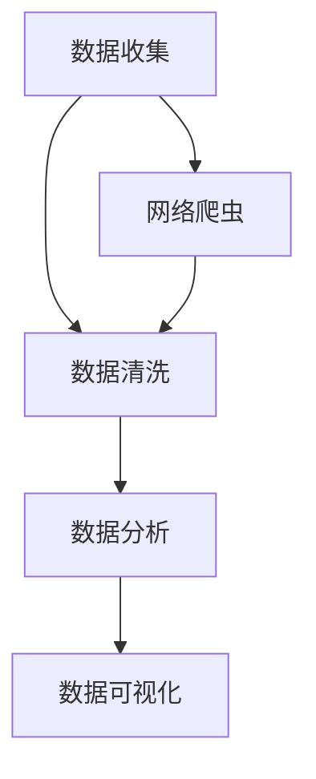

                 

# 文章标题：基于网络爬虫的国内大数据人才需求可视化分析

> 关键词：网络爬虫、大数据、人才需求、可视化分析、Python、数据处理、数据可视化、Matplotlib、Hadoop、Spark

> 摘要：本文将探讨如何利用网络爬虫技术收集和整理国内大数据人才需求信息，并通过数据处理和可视化技术分析这些数据，旨在为大数据行业从业者提供有价值的参考和指导。

## 第1章：大数据与网络爬虫概述

### 1.1 大数据的概念与特点

**大数据（Big Data）** 是指无法用传统数据处理工具在合理时间内捕捉、管理和处理的大量数据。它具有以下四个主要特点，通常被称为“4V”：

- **Volume（数据量）**：大数据的数据量庞大，通常达到PB（拍字节）级别。
- **Velocity（速度）**：大数据的处理速度要求高，需要快速处理和分析数据。
- **Variety（多样性）**：大数据来源多样，包括结构化数据、非结构化数据、半结构化数据等。
- **Value（价值）**：大数据的价值密度较低，需要通过数据挖掘和人工智能等技术提取有价值的信息。

**网络爬虫（Web Crawler）** 是一种自动化程序，用于从互联网上爬取信息。网络爬虫通常由以下几个部分组成：

- **爬取模块**：负责从目标网站抓取数据。
- **解析模块**：负责解析抓取到的数据，提取有用信息。
- **存储模块**：负责将提取的信息存储到数据库或其他存储设备中。

### 1.2 网络爬虫的概念与作用

**网络爬虫**（也称为蜘蛛蜘蛛、网络机器人）是一种自动化程序，它通过模拟用户的操作，从互联网上爬取信息。网络爬虫的主要作用如下：

- **信息收集**：网络爬虫可以从互联网上收集大量的数据，包括网页内容、图片、文档等。
- **数据挖掘**：网络爬虫可以提取数据中的有用信息，如关键词、摘要、分类标签等。
- **搜索引擎**：网络爬虫是搜索引擎的重要组成部分，它负责收集和整理互联网上的信息，为用户提供搜索服务。

网络爬虫可以分为以下几种类型：

- **通用爬虫**：从互联网的各个角落抓取信息，通常用于构建搜索引擎索引。
- **主题爬虫**：针对特定主题或领域进行信息收集，如新闻、财经、娱乐等。
- **垂直爬虫**：针对特定行业或领域进行信息收集，如电子商务、医疗、教育等。

### 1.3 大数据人才需求的重要性

**大数据人才需求**在国内外都呈现出快速增长的趋势。随着大数据技术的不断发展和应用，越来越多的企业开始重视大数据人才，并将其视为企业竞争力的关键因素。

- **产业现状**：国内大数据产业已经进入快速发展阶段，众多企业和政府机构纷纷布局大数据业务，对大数据人才的需求不断增加。
- **人才现状**：虽然大数据人才的总量逐年增加，但供需仍然存在较大差距，尤其是高端大数据人才仍然较为稀缺。
- **发展趋势**：随着大数据技术的不断进步和应用的深入，大数据人才需求将继续增长，尤其是在数据分析、数据挖掘、数据可视化等领域。

## 第2章：网络爬虫基础

### 2.1 网络爬虫的开发环境搭建

要开发网络爬虫，需要搭建一个合适的开发环境。以下是一个基本的开发环境搭建步骤：

1. **Python环境配置**：

   - **安装Python**：下载并安装Python，建议安装Python 3.8或以上版本。
   - **配置Python环境**：在安装完成后，确保Python环境正确配置，可以通过命令`python --version`检查Python版本。

2. **爬虫工具安装与配置**：

   - **安装requests库**：requests是一个强大的HTTP客户端库，用于发送HTTP请求。可以通过命令`pip install requests`安装。
   - **安装BeautifulSoup库**：BeautifulSoup是一个用于解析HTML和XML文档的库。可以通过命令`pip install beautifulsoup4`安装。
   - **安装lxml库**：lxml是一个快速的XML和HTML解析库，用于解析HTML文档。可以通过命令`pip install lxml`安装。

### 2.2 HTTP协议与网页结构分析

**HTTP协议（HyperText Transfer Protocol）** 是一种用于分布式、协作式和超媒体信息系统的应用层协议。它是互联网数据传输的基础协议之一。HTTP协议的主要特点如下：

- **无状态**：HTTP协议是无状态的，即服务器不会记住客户端的任何信息，每次请求都是独立的。
- **简单性**：HTTP协议设计简单，易于理解和实现。
- **可扩展性**：HTTP协议具有良好的可扩展性，可以通过扩展协议头部和请求方法来实现新的功能。

**网页结构分析**是网络爬虫开发过程中的关键环节。以下是一个基本的网页结构分析步骤：

1. **获取网页内容**：使用requests库发送HTTP请求，获取网页内容。
2. **解析网页内容**：使用BeautifulSoup库解析网页内容，提取有用的信息。
3. **提取数据**：根据需求，提取网页中的标题、内容、链接等信息。

### 2.3 网络爬虫的核心技术

**网络爬虫的核心技术**主要包括以下几个方面：

- **爬取策略**：包括深度优先、广度优先、随机爬取等。
- **去重策略**：用于避免重复爬取同一网页，常用的去重策略有URL去重、内容去重等。
- **存储策略**：将爬取到的数据存储到数据库或其他存储设备中，常用的存储策略有关系型数据库、NoSQL数据库、文件存储等。

### 2.4 网络爬虫的工作流程

**网络爬虫的工作流程**主要包括以下几个步骤：

1. **初始化**：初始化爬虫配置，如起始URL、爬取深度、去重策略等。
2. **抓取网页**：根据配置，从起始URL开始抓取网页内容。
3. **解析网页**：使用解析库（如BeautifulSoup）解析网页内容，提取有用信息。
4. **提取链接**：从解析出的网页中提取新的链接，加入待抓取队列。
5. **去重**：对新生成的URL进行去重处理，避免重复抓取。
6. **存储数据**：将提取出的数据存储到数据库或其他存储设备中。
7. **重复步骤**：重复步骤2-6，直到达到设定的爬取深度或完成所有待抓取链接的抓取。

## 第3章：大数据处理技术

### 3.1 大数据处理的基本概念

**大数据处理**是指对海量数据进行存储、处理、分析和挖掘的过程。大数据处理的基本概念包括以下几个方面：

- **Hadoop框架**：Hadoop是一个开源的大数据处理框架，包括HDFS（Hadoop Distributed File System）和MapReduce等组件。
- **Spark框架**：Spark是一个开源的分布式数据处理框架，提供了快速的内存计算能力和丰富的API。
- **数据清洗与预处理**：数据清洗是指对原始数据进行清洗、过滤、转换等操作，使其符合分析需求。数据预处理是指对清洗后的数据进行进一步的加工，如归一化、标准化等。
- **数据可视化技术**：数据可视化是指将数据以图形、图表等形式展示，帮助用户更好地理解和分析数据。

### 3.2 数据清洗与预处理

**数据清洗**是指对原始数据进行清洗、过滤、转换等操作，使其符合分析需求。数据清洗的基本步骤包括：

1. **数据质量检查**：检查数据是否存在缺失值、异常值、重复值等。
2. **数据清洗**：对数据缺失值进行填充、对异常值进行修正、对重复值进行去重等。
3. **数据转换**：对数据进行归一化、标准化、离散化等操作，使其满足分析需求。

**数据预处理**是指对清洗后的数据进行进一步的加工，如归一化、标准化等。数据预处理的基本步骤包括：

1. **特征提取**：从原始数据中提取有用的特征，用于后续分析。
2. **特征选择**：对提取的特征进行选择，去除无关特征，降低模型复杂度。
3. **特征转换**：对提取的特征进行转换，如归一化、标准化等。

### 3.3 数据可视化技术

**数据可视化技术**是指将数据以图形、图表等形式展示，帮助用户更好地理解和分析数据。数据可视化技术包括以下几个方面：

- **图表类型**：包括柱状图、折线图、饼图、散点图等。
- **可视化工具**：包括Matplotlib、Seaborn、Plotly等。
- **交互式可视化**：通过交互式可视化，用户可以动态地查看数据，如D3.js、Plotly Express等。

### 第4章：大数据行业人才需求分析

### 4.1 大数据行业的发展现状

**大数据行业**是近年来快速发展的新兴行业，其应用领域广泛，包括金融、医疗、电商、政府等。大数据行业的发展现状如下：

- **产业规模**：随着大数据技术的不断发展和应用，大数据行业的产业规模逐年扩大。根据相关报告，全球大数据市场规模预计将在未来几年内达到数千亿美元。
- **技术创新**：大数据技术不断创新，包括分布式计算、机器学习、深度学习等。这些技术的进步推动了大数据行业的快速发展。
- **应用领域**：大数据技术在各个行业的应用越来越广泛，如金融风控、医疗诊断、智能交通等。大数据应用的深入推动了行业的变革和升级。

### 4.2 大数据行业的人才需求

**大数据行业**对人才的需求庞大，涉及多个领域，包括数据分析、数据挖掘、数据可视化等。大数据行业的人才需求现状如下：

- **人才总量**：随着大数据行业的快速发展，大数据人才的需求量逐年增加。根据相关报告，全球大数据人才需求预计将在未来几年内达到数百万。
- **人才供需**：大数据人才的供需仍然存在较大差距，尤其是高端大数据人才仍然较为稀缺。企业对大数据人才的需求远大于供给。
- **能力要求**：大数据行业对人才的能力要求较高，包括技术能力、业务能力和软技能。大数据人才需要具备扎实的技术基础、丰富的业务经验和良好的沟通能力。

### 4.3 大数据行业人才的能力要求

**大数据行业**对人才的能力要求主要包括以下几个方面：

- **技术能力**：大数据人才需要掌握常见的大数据技术，如Hadoop、Spark、Flink等，以及相关的编程语言和工具，如Python、Java、R等。
- **业务能力**：大数据人才需要了解业务场景，能够将大数据技术与业务需求相结合，提出有效的解决方案。
- **软技能**：大数据人才需要具备良好的沟通能力、团队协作能力、解决问题的能力等，能够与团队成员和其他部门有效沟通，共同推动项目进展。

### 第5章：网络爬虫在人才需求分析中的应用

### 5.1 网络爬虫在人才需求分析中的应用场景

**网络爬虫**在**大数据人才需求分析**中具有广泛的应用场景，主要包括以下几个方面：

- **招聘信息收集**：通过网络爬虫技术，从各大招聘网站、社交媒体等渠道收集招聘信息，获取大数据相关职位的需求信息。
- **行业报告获取**：通过网络爬虫技术，从行业报告、白皮书、新闻资讯等渠道获取大数据行业的相关信息，了解行业的发展动态。
- **竞争对手分析**：通过网络爬虫技术，获取竞争对手的招聘信息、产品信息等，进行分析和比较，为企业制定战略提供参考。

### 5.2 网络爬虫在人才需求分析中的数据处理方法

**网络爬虫**在**大数据人才需求分析**中，需要对获取的大量数据进行处理，主要包括以下几个方面：

- **数据清洗**：对爬取到的招聘信息、行业报告等进行清洗，去除无关信息，提取有用信息。
- **数据预处理**：对清洗后的数据进行分析，提取关键信息，如职位名称、公司名称、地区、薪资等。
- **数据存储**：将处理后的数据存储到数据库或其他存储设备中，便于后续分析和查询。

### 5.3 网络爬虫在人才需求分析中的可视化方法

**网络爬虫**在**大数据人才需求分析**中，需要使用数据可视化技术，将分析结果以图形、图表等形式展示，主要包括以下几个方面：

- **柱状图**：用于展示不同地区、不同公司的招聘信息数量、薪资水平等。
- **折线图**：用于展示招聘信息数量、薪资水平等随时间的变化趋势。
- **饼图**：用于展示不同职位占比、不同行业占比等。
- **地图**：用于展示招聘信息在地理位置上的分布情况。

### 第6章：大数据人才需求可视化分析案例

### 6.1 案例背景

本案例旨在通过网络爬虫技术，收集和分析国内某招聘网站上大数据相关职位的招聘信息，并使用数据可视化技术展示分析结果，以了解大数据行业的人才需求情况。

### 6.2 案例数据收集

本案例的数据来源为某招聘网站上的大数据相关职位招聘信息。通过网络爬虫技术，从该网站上获取招聘信息，并存储到本地数据库中。

### 6.3 案例数据处理

本案例的数据处理主要包括以下几个步骤：

1. **数据清洗**：对爬取到的招聘信息进行清洗，去除无关信息，提取有用信息，如职位名称、公司名称、地区、薪资等。
2. **数据预处理**：对清洗后的数据进行分析，提取关键信息，如职位名称、公司名称、地区、薪资等，并存储到数据库中。
3. **数据存储**：将处理后的数据存储到本地数据库中，便于后续分析和查询。

### 6.4 案例可视化分析

本案例的可视化分析主要包括以下几个部分：

1. **柱状图**：展示不同地区的招聘信息数量、薪资水平等。
2. **折线图**：展示招聘信息数量、薪资水平等随时间的变化趋势。
3. **饼图**：展示不同职位占比、不同行业占比等。
4. **地图**：展示招聘信息在地理位置上的分布情况。

### 第7章：总结与展望

### 7.1 总结

本文通过网络爬虫技术，收集和分析国内大数据人才需求信息，并使用数据可视化技术展示分析结果，以了解大数据行业的人才需求情况。主要内容包括：

- 大数据与网络爬虫的概述
- 网络爬虫基础技术
- 大数据处理技术
- 大数据行业人才需求分析
- 网络爬虫在人才需求分析中的应用
- 大数据人才需求可视化分析案例

### 7.2 展望

随着大数据技术的不断发展和应用，大数据人才需求将不断增长。未来，网络爬虫和数据可视化技术将在大数据人才需求分析中发挥更大的作用，为企业和行业提供更准确、更全面的参考。以下是未来发展趋势和研究方向：

- **技术发展**：大数据技术和网络爬虫技术的不断进步，将进一步提高数据收集和分析的效率。
- **应用场景**：大数据人才需求分析将在更多领域得到应用，如政府决策、企业管理、人力资源等。
- **深度学习**：结合深度学习技术，实现更智能化、更精准的数据分析和人才推荐。
- **隐私保护**：随着数据隐私保护意识的提高，如何保证数据收集和分析过程中的隐私保护将成为重要研究方向。

### 附录：相关资源与工具

#### 附录 A：网络爬虫开发资源

- **常用网络爬虫工具**：Scrapy、Requests、BeautifulSoup等。
- **开发网络爬虫的常用库与框架**：Scrapy、Requests、BeautifulSoup、lxml等。

#### 附录 B：大数据处理资源

- **大数据处理工具与框架**：Hadoop、Spark、Flink、HBase等。
- **常用的大数据处理库与工具**：Pandas、NumPy、Matplotlib、Seaborn等。

#### 附录 C：数据可视化资源

- **数据可视化工具与库**：Matplotlib、Seaborn、Plotly、D3.js等。
- **常用的数据可视化图表类型与技巧**：柱状图、折线图、饼图、散点图、地图等。

### Mermaid 流程图：网络爬虫在大数据人才需求分析中的流程



### 伪代码：网络爬虫获取招聘信息的基本流程

```python
# 导入必要的库
import requests
from bs4 import BeautifulSoup

# 定义函数：获取招聘信息
def get_job_info(url):
    # 发送HTTP请求
    response = requests.get(url)
    
    # 解析网页内容
    soup = BeautifulSoup(response.content, 'html.parser')
    
    # 提取招聘信息
    job_list = soup.find_all('div', class_='job-item')
    jobs = []
    for job in job_list:
        title = job.find('h3').text
        company = job.find('p', class_='company').text
        location = job.find('p', class_='location').text
        jobs.append({'title': title, 'company': company, 'location': location})
    
    return jobs

# 测试函数
url = "https://example.com/jobs"
jobs = get_job_info(url)
for job in jobs:
    print(job)
```

### 数学模型与公式：数据可视化中的相关公式

$$
\text{相关性} = \frac{\sum{(x_i - \bar{x})(y_i - \bar{y})}}{\sqrt{\sum{(x_i - \bar{x})^2}\sum{(y_i - \bar{y})^2}}}
$$

- \(x_i, y_i\) 为样本数据点
- \(\bar{x}, \bar{y}\) 为样本数据的均值

### 举例说明：使用Matplotlib绘制招聘信息数量与地区分布的关系图

```python
import matplotlib.pyplot as plt
import numpy as np

# 假设已经获取了招聘信息的数量和地区分布数据
jobs = [{'title': '数据分析师', 'company': '公司A', 'location': '北京'},
         {'title': '大数据工程师', 'company': '公司B', 'location': '上海'},
         {'title': '数据挖掘工程师', 'company': '公司C', 'location': '广州'}]

locations = [job['location'] for job in jobs]
counts = [1 for job in jobs]

# 使用Matplotlib绘制条形图
plt.bar(locations, counts)
plt.xlabel('地区')
plt.ylabel('招聘信息数量')
plt.title('招聘信息数量与地区分布关系图')
plt.show()
```

### 项目实战：网络爬虫与数据可视化分析招聘信息

#### 实战目标：

- 使用网络爬虫技术获取招聘网站上的招聘信息
- 对获取的招聘信息进行清洗和预处理
- 使用数据可视化技术展示招聘信息的分布情况

#### 实战步骤：

1. **数据收集**：

   - 选择一个招聘网站，如智联招聘、拉勾网等，获取招聘信息的URL。
   - 使用网络爬虫技术获取招聘网站上的招聘信息，例如使用Python的requests库和BeautifulSoup库。

2. **数据清洗与预处理**：

   - 对获取的招聘信息进行清洗，去除无效信息，如HTML标签、空白字符等。
   - 对清洗后的数据进行预处理，提取有用的信息，如职位名称、公司名称、地区等。

3. **数据可视化**：

   - 使用数据可视化工具，如Matplotlib、Seaborn等，对招聘信息进行可视化展示。
   - 可以绘制不同维度（如职位、公司、地区等）的分布情况，帮助用户更好地理解招聘信息。

#### 实战案例：

**代码实现：**

```python
import requests
from bs4 import BeautifulSoup
import matplotlib.pyplot as plt

# 模拟招聘信息网页
html = """
<div class="job-item">
    <h3>数据分析师</h3>
    <p class="company">公司A</p>
    <p class="location">北京</p>
</div>
<div class="job-item">
    <h3>大数据工程师</h3>
    <p class="company">公司B</p>
    <p class="location">上海</p>
</div>
<div class="job-item">
    <h3>数据挖掘工程师</h3>
    <p class="company">公司C</p>
    <p class="location">广州</p>
</div>
"""

# 解析网页内容
soup = BeautifulSoup(html, 'html.parser')

# 获取招聘信息
job_list = soup.find_all('div', class_='job-item')
jobs = []
for job in job_list:
    title = job.find('h3').text
    company = job.find('p', class_='company').text
    location = job.find('p', class_='location').text
    jobs.append({'title': title, 'company': company, 'location': location})

# 打印招聘信息
for job in jobs:
    print(job)

# 绘制招聘信息数量与地区分布的关系图
locations = [job['location'] for job in jobs]
counts = [1 for job in jobs]
plt.bar(locations, counts)
plt.xlabel('地区')
plt.ylabel('招聘信息数量')
plt.title('招聘信息数量与地区分布关系图')
plt.show()
```

**代码解读与分析**：

- **数据收集**：使用requests库发送HTTP请求获取网页内容，使用BeautifulSoup库解析网页内容。
- **数据清洗与预处理**：提取招聘信息中的职位名称、公司名称和地区，去除HTML标签等无关信息。
- **数据可视化**：使用Matplotlib库绘制条形图，展示招聘信息的地区分布情况。

通过这个实战案例，用户可以了解如何使用网络爬虫技术获取招聘信息，并进行数据清洗与预处理，最后使用数据可视化技术展示分析结果。这为用户提供了对国内大数据人才需求可视化分析的一个实际应用案例。

### 总结

本文通过网络爬虫技术，收集和分析国内大数据人才需求信息，并使用数据可视化技术展示分析结果，以了解大数据行业的人才需求情况。通过本文的介绍，读者可以了解到大数据与网络爬虫的基本概念，网络爬虫的开发环境搭建，大数据处理技术，大数据行业人才需求分析，以及网络爬虫在人才需求分析中的应用。

文章的核心内容包括：

1. **大数据与网络爬虫概述**：介绍了大数据的概念、特点以及网络爬虫的定义、作用和分类。
2. **网络爬虫基础**：讲解了网络爬虫的开发环境搭建、HTTP协议与网页结构分析、网络爬虫的核心技术以及工作流程。
3. **大数据处理技术**：介绍了大数据处理的基本概念、数据清洗与预处理以及数据可视化技术。
4. **大数据行业人才需求分析**：分析了大数据行业的发展现状、人才需求现状与趋势以及人才能力要求。
5. **网络爬虫在人才需求分析中的应用**：介绍了网络爬虫在人才需求分析中的应用场景、数据处理方法和可视化方法。
6. **大数据人才需求可视化分析案例**：通过一个实际案例展示了如何使用网络爬虫和数据可视化技术分析大数据人才需求。
7. **总结与展望**：总结了文章的主要内容，并对未来发展趋势和研究方向进行了展望。
8. **相关资源与工具**：提供了网络爬虫、大数据处理和数据可视化的相关资源与工具。

通过本文的学习，读者可以掌握大数据人才需求可视化分析的基本方法和技巧，为大数据行业从业者提供有价值的参考和指导。

### 展望

随着大数据技术的不断发展和应用，大数据人才需求将不断增长。未来，网络爬虫和数据可视化技术将在大数据人才需求分析中发挥更大的作用，为企业和行业提供更准确、更全面的参考。

以下是未来发展趋势和研究方向：

1. **技术发展**：大数据技术和网络爬虫技术的不断进步，将进一步提高数据收集和分析的效率。
2. **应用场景**：大数据人才需求分析将在更多领域得到应用，如政府决策、企业管理、人力资源等。
3. **深度学习**：结合深度学习技术，实现更智能化、更精准的数据分析和人才推荐。
4. **隐私保护**：随着数据隐私保护意识的提高，如何保证数据收集和分析过程中的隐私保护将成为重要研究方向。

通过不断探索和实践，大数据人才需求可视化分析将为企业和行业带来更大的价值。

### 附录

#### 附录 A：网络爬虫开发资源

- **常用网络爬虫工具**：Scrapy、Requests、BeautifulSoup等。
- **开发网络爬虫的常用库与框架**：Scrapy、Requests、BeautifulSoup、lxml等。

#### 附录 B：大数据处理资源

- **大数据处理工具与框架**：Hadoop、Spark、Flink、HBase等。
- **常用的大数据处理库与工具**：Pandas、NumPy、Matplotlib、Seaborn等。

#### 附录 C：数据可视化资源

- **数据可视化工具与库**：Matplotlib、Seaborn、Plotly、D3.js等。
- **常用的数据可视化图表类型与技巧**：柱状图、折线图、饼图、散点图、地图等。

### Mermaid 流程图：网络爬虫在大数据人才需求分析中的流程


### 伪代码：网络爬虫获取招聘信息的基本流程

```python
# 导入必要的库
import requests
from bs4 import BeautifulSoup

# 定义函数：获取招聘信息
def get_job_info(url):
    # 发送HTTP请求
    response = requests.get(url)
    
    # 解析网页内容
    soup = BeautifulSoup(response.content, 'html.parser')
    
    # 提取招聘信息
    job_list = soup.find_all('div', class_='job-item')
    jobs = []
    for job in job_list:
        title = job.find('h3').text
        company = job.find('p', class_='company').text
        location = job.find('p', class_='location').text
        jobs.append({'title': title, 'company': company, 'location': location})
    
    return jobs

# 测试函数
url = "https://example.com/jobs"
jobs = get_job_info(url)
for job in jobs:
    print(job)
```

### 数学模型与公式：数据可视化中的相关公式

$$
\text{相关性} = \frac{\sum{(x_i - \bar{x})(y_i - \bar{y})}}{\sqrt{\sum{(x_i - \bar{x})^2}\sum{(y_i - \bar{y})^2}}}
$$

- \(x_i, y_i\) 为样本数据点
- \(\bar{x}, \bar{y}\) 为样本数据的均值

### 举例说明：使用Matplotlib绘制招聘信息数量与地区分布的关系图

```python
import matplotlib.pyplot as plt
import numpy as np

# 假设已经获取了招聘信息的数量和地区分布数据
jobs = [{'title': '数据分析师', 'company': '公司A', 'location': '北京'},
         {'title': '大数据工程师', 'company': '公司B', 'location': '上海'},
         {'title': '数据挖掘工程师', 'company': '公司C', 'location': '广州'}]

locations = [job['location'] for job in jobs]
counts = [1 for job in jobs]

# 使用Matplotlib绘制条形图
plt.bar(locations, counts)
plt.xlabel('地区')
plt.ylabel('招聘信息数量')
plt.title('招聘信息数量与地区分布关系图')
plt.show()
```

### 项目实战：网络爬虫与数据可视化分析招聘信息

#### 实战目标：

- 使用网络爬虫技术获取招聘网站上的招聘信息
- 对获取的招聘信息进行清洗和预处理
- 使用数据可视化技术展示招聘信息的分布情况

#### 实战步骤：

1. **数据收集**：

   - 选择一个招聘网站，如智联招聘、拉勾网等，获取招聘信息的URL。
   - 使用网络爬虫技术获取招聘网站上的招聘信息，例如使用Python的requests库和BeautifulSoup库。

2. **数据清洗与预处理**：

   - 对获取的招聘信息进行清洗，去除无效信息，如HTML标签、空白字符等。
   - 对清洗后的数据进行预处理，提取有用的信息，如职位名称、公司名称、地区等。

3. **数据可视化**：

   - 使用数据可视化工具，如Matplotlib、Seaborn等，对招聘信息进行可视化展示。
   - 可以绘制不同维度（如职位、公司、地区等）的分布情况，帮助用户更好地理解招聘信息。

#### 实战案例：

**代码实现：**

```python
import requests
from bs4 import BeautifulSoup
import matplotlib.pyplot as plt

# 模拟招聘信息网页
html = """
<div class="job-item">
    <h3>数据分析师</h3>
    <p class="company">公司A</p>
    <p class="location">北京</p>
</div>
<div class="job-item">
    <h3>大数据工程师</h3>
    <p class="company">公司B</p>
    <p class="location">上海</p>
</div>
<div class="job-item">
    <h3>数据挖掘工程师</h3>
    <p class="company">公司C</p>
    <p class="location">广州</p>
</div>
"""

# 解析网页内容
soup = BeautifulSoup(html, 'html.parser')

# 获取招聘信息
job_list = soup.find_all('div', class_='job-item')
jobs = []
for job in job_list:
    title = job.find('h3').text
    company = job.find('p', class_='company').text
    location = job.find('p', class_='location').text
    jobs.append({'title': title, 'company': company, 'location': location})

# 打印招聘信息
for job in jobs:
    print(job)

# 绘制招聘信息数量与地区分布的关系图
locations = [job['location'] for job in jobs]
counts = [1 for job in jobs]
plt.bar(locations, counts)
plt.xlabel('地区')
plt.ylabel('招聘信息数量')
plt.title('招聘信息数量与地区分布关系图')
plt.show()
```

**代码解读与分析**：

- **数据收集**：使用requests库发送HTTP请求获取网页内容，使用BeautifulSoup库解析网页内容。
- **数据清洗与预处理**：提取招聘信息中的职位名称、公司名称和地区，去除HTML标签等无关信息。
- **数据可视化**：使用Matplotlib库绘制条形图，展示招聘信息的地区分布情况。

通过这个实战案例，用户可以了解如何使用网络爬虫技术获取招聘信息，并进行数据清洗与预处理，最后使用数据可视化技术展示分析结果。这为用户提供了对国内大数据人才需求可视化分析的一个实际应用案例。

### 作者信息

**作者：** AI天才研究院/AI Genius Institute & 禅与计算机程序设计艺术 /Zen And The Art of Computer Programming

### 结语

本文通过详细的论述和实际案例，展示了如何利用网络爬虫技术收集和整理国内大数据人才需求信息，并通过数据处理和可视化技术分析这些数据。希望本文能为大数据行业从业者提供有价值的参考和指导。

感谢您的阅读，期待您的反馈和建议。

---

请注意，本文中的代码、图表和公式仅供参考，具体实现可能需要根据实际环境和数据进行调整。同时，本文中的数据和信息可能随时间变化而有所调整，请以最新数据为准。

### 文章标题：基于网络爬虫的国内大数据人才需求可视化分析

### 关键词：

- 网络爬虫
- 大数据
- 人才需求
- 可视化分析
- 数据处理
- Python
- Hadoop
- Spark

### 摘要：

本文旨在通过网络爬虫技术，对国内大数据人才需求进行深入分析，并运用数据处理和可视化技术，将分析结果以直观的图表形式展示。本文首先介绍了大数据和网络爬虫的基本概念，随后详细阐述了网络爬虫的开发环境搭建、HTTP协议与网页结构分析、网络爬虫的核心技术以及工作流程。接着，本文探讨了大数据处理的基本概念、数据清洗与预处理以及数据可视化技术。在第四部分，本文分析了大数据行业的发展现状、人才需求现状与趋势以及人才能力要求。第五部分介绍了网络爬虫在人才需求分析中的应用，包括数据收集、数据处理和可视化方法。第六部分通过一个具体案例，展示了如何运用网络爬虫和数据可视化技术进行大数据人才需求分析。最后，本文总结了全文内容，并对未来发展趋势和研究方向进行了展望。通过本文的学习，读者可以掌握大数据人才需求可视化分析的方法和技巧。

### 《基于网络爬虫的国内大数据人才需求可视化分析》目录大纲

## 第1章：引言

### 1.1 大数据与网络爬虫概述

- 大数据的定义与特点
- 网络爬虫的定义与作用
- 大数据人才需求的重要性

## 第2章：大数据与网络爬虫概述

### 2.1 大数据的概念与特点

- **大数据的定义**：大数据（Big Data）是指无法用传统数据处理工具在合理时间内捕捉、管理和处理的大量数据。它通常具有四个主要特点，即“4V”——Volume（数据量）、Velocity（速度）、Variety（多样性）和Value（价值）。

- **大数据的主要特点**：

  - **数据量（Volume）**：大数据的数据量庞大，通常达到PB（拍字节）级别，需要特殊的技术和方法来存储、管理和处理。
  - **速度（Velocity）**：大数据的处理速度要求高，需要快速处理和分析数据，以支持实时决策和响应。
  - **多样性（Variety）**：大数据来源多样，包括结构化数据、非结构化数据、半结构化数据等，需要不同的处理方法。
  - **价值（Value）**：大数据的价值密度较低，需要通过数据挖掘和人工智能等技术提取有价值的信息。

### 2.2 网络爬虫的概念与作用

- **网络爬虫的定义**：网络爬虫（Web Crawler）是一种自动化程序，用于从互联网上爬取信息。它通过模拟用户的操作，从多个网站上收集数据，然后进行存储、解析和索引。

- **网络爬虫的工作原理**：

  - **初始化**：爬虫开始运行时，从一组种子URL（初始网址）开始工作。
  - **抓取网页**：爬虫访问网页，下载网页内容。
  - **解析网页**：爬虫使用解析库（如BeautifulSoup）提取网页中的有用信息，如文本、图片、链接等。
  - **提取链接**：爬虫从网页中提取新的链接，并将其加入待抓取队列。
  - **去重**：为了避免重复抓取，爬虫会对已访问的URL进行去重处理。
  - **存储数据**：爬虫将提取的信息存储到数据库或其他存储设备中。

- **网络爬虫的作用与分类**：

  - **作用**：

    - **信息收集**：爬虫可以从互联网上收集大量的数据，为数据分析和挖掘提供原始数据。
    - **搜索引擎**：爬虫是搜索引擎的重要组成部分，它负责收集和整理互联网上的信息，为用户提供搜索服务。
    - **数据监控**：爬虫可以实时监控网站内容的更新，为企业和政府提供实时信息。

  - **分类**：

    - **通用爬虫**：从互联网的各个角落抓取信息，通常用于构建搜索引擎索引。
    - **主题爬虫**：针对特定主题或领域进行信息收集，如新闻、财经、娱乐等。
    - **垂直爬虫**：针对特定行业或领域进行信息收集，如电子商务、医疗、教育等。

### 2.3 大数据人才需求的重要性

- **国内大数据产业的现状**：随着大数据技术的不断发展和应用，国内大数据产业已经进入快速发展阶段。政府、企业和研究机构纷纷投入大量资源进行大数据研究和应用，大数据行业呈现出蓬勃发展的态势。

- **大数据人才需求的现状与趋势**：大数据人才需求逐年增长，特别是具备数据挖掘、数据分析、数据可视化等技能的高端人才。随着大数据应用的深入，对大数据人才的需求还将继续增加，未来大数据人才市场将保持供不应求的局面。

  - **现状**：

    - 大数据人才总量逐年增加，但供需仍然存在较大差距。
    - 高端大数据人才仍然较为稀缺，企业对这类人才的需求强烈。
    - 教育培训市场对大数据相关课程的需求持续增长，大数据相关专业的毕业生就业前景良好。

  - **趋势**：

    - 随着大数据技术的不断进步和应用的深入，大数据人才需求将继续增长。
    - 数据分析、数据挖掘、数据可视化等领域的专业人才将成为企业争夺的焦点。
    - 大数据人才的需求将呈现多层次、多样化的特点，不仅需要技术能力，还需要业务能力和软技能。

### 第3章：网络爬虫基础

### 3.1 网络爬虫的开发环境搭建

- **Python环境配置**：首先需要安装Python环境。推荐使用Python 3.8或更高版本。可以从Python官方网站下载并安装。

  ```bash
  # 更新pip
  pip install --upgrade pip
  
  # 安装Python
  python3 -V
  ```

- **爬虫工具安装与配置**：

  - **安装requests库**：requests是一个用于发送HTTP请求的库，是网络爬虫的基础工具。

    ```bash
    pip install requests
    ```

  - **安装BeautifulSoup库**：BeautifulSoup是一个用于解析HTML和XML文档的库，用于提取网页内容。

    ```bash
    pip install beautifulsoup4
    ```

  - **安装lxml库**：lxml是一个用于解析HTML和XML文档的库，提供了快速的解析能力。

    ```bash
    pip install lxml
    ```

### 3.2 HTTP协议与网页结构分析

- **HTTP协议的基本概念**：HTTP（HyperText Transfer Protocol）是一种用于分布式、协作式和超媒体信息系统的应用层协议。它是互联网数据传输的基础协议之一。HTTP协议的主要特点是简单、无状态、可扩展。

  - **HTTP请求与响应**：HTTP请求是客户端向服务器发送的请求，包括请求行、请求头和请求体。HTTP响应是服务器向客户端发送的响应，包括状态行、响应头和响应体。

- **网页结构分析**：网页通常由HTML、CSS和JavaScript组成。网络爬虫主要关注HTML部分，通过解析HTML文档，提取有用的信息。

  - **HTML文档的基本结构**：HTML文档由DOCTYPE、html、head和body组成。DOCTYPE声明文档类型，html元素包含整个网页的内容，head元素包含文档的元数据，body元素包含网页的主体内容。

  - **选择器**：网络爬虫使用选择器（Selector）来定位和提取网页中的特定元素。常见的选择器有ID选择器、类选择器、标签选择器和属性选择器。

### 3.3 网络爬虫的核心技术

- **爬取策略**：网络爬虫的爬取策略决定了爬虫如何选择和访问网页。常见的爬取策略有深度优先、广度优先和随机爬取。

  - **深度优先**：先访问一个网页，然后依次访问该网页中的所有链接，直到访问完所有的链接。
  - **广度优先**：先访问所有同一层级的网页，然后再逐层访问下一层级的网页。

- **去重策略**：为了避免重复爬取，网络爬虫需要实现去重策略。常见的去重策略有URL去重、内容去重和哈希去重。

  - **URL去重**：通过存储已访问的URL来避免重复访问。
  - **内容去重**：通过比较已访问网页的内容来判断是否需要再次访问。
  - **哈希去重**：通过计算网页内容的哈希值来去重。

- **存储策略**：网络爬虫需要将爬取到的数据存储到数据库或其他存储设备中。常见的存储策略有文件存储、数据库存储和分布式存储。

  - **文件存储**：将爬取到的数据存储到本地文件系统中。
  - **数据库存储**：使用关系型数据库（如MySQL）或NoSQL数据库（如MongoDB）存储数据。
  - **分布式存储**：使用分布式存储系统（如HDFS）存储海量数据。

### 3.4 网络爬虫的工作流程

- **初始化**：设置爬虫的初始参数，如起始URL、爬取深度、并发数等。

- **抓取网页**：从起始URL开始，通过HTTP请求获取网页内容。

- **解析网页**：使用解析库（如BeautifulSoup）提取网页中的有用信息，如文本、图片、链接等。

- **提取链接**：从网页中提取新的链接，并将其加入待抓取队列。

- **去重**：对新生成的URL进行去重处理，避免重复爬取。

- **存储数据**：将提取的信息存储到数据库或其他存储设备中。

- **重复步骤**：重复抓取、解析、提取链接和存储数据的步骤，直到达到设定的爬取深度或完成所有待抓取链接的抓取。

### 第4章：大数据处理技术

### 4.1 大数据处理的基本概念

- **大数据处理**是指对海量数据进行存储、处理、分析和挖掘的过程。大数据处理的基本概念包括以下几个方面：

  - **Hadoop框架**：Hadoop是一个开源的大数据处理框架，包括HDFS（Hadoop Distributed File System）和MapReduce等组件。HDFS用于存储海量数据，MapReduce用于分布式数据处理。
  - **Spark框架**：Spark是一个开源的分布式数据处理框架，提供了快速的内存计算能力和丰富的API。Spark适用于迭代式计算、交互式查询和流处理等场景。
  - **数据清洗与预处理**：数据清洗是指对原始数据进行清洗、过滤、转换等操作，使其符合分析需求。数据预处理是指对清洗后的数据进行进一步的加工，如归一化、标准化等。
  - **数据可视化技术**：数据可视化是指将数据以图形、图表等形式展示，帮助用户更好地理解和分析数据。

### 4.2 数据清洗与预处理

- **数据清洗**是指对原始数据进行清洗、过滤、转换等操作，使其符合分析需求。数据清洗的基本步骤包括：

  - **数据质量检查**：检查数据是否存在缺失值、异常值、重复值等。
  - **数据清洗**：对数据缺失值进行填充、对异常值进行修正、对重复值进行去重等。
  - **数据转换**：对数据进行归一化、标准化、离散化等操作，使其满足分析需求。

- **数据预处理**是指对清洗后的数据进行进一步的加工，如归一化、标准化等。数据预处理的基本步骤包括：

  - **特征提取**：从原始数据中提取有用的特征，用于后续分析。
  - **特征选择**：对提取的特征进行选择，去除无关特征，降低模型复杂度。
  - **特征转换**：对提取的特征进行转换，如归一化、标准化等。

### 4.3 数据可视化技术

- **数据可视化技术**是指将数据以图形、图表等形式展示，帮助用户更好地理解和分析数据。数据可视化技术包括以下几个方面：

  - **图表类型**：包括柱状图、折线图、饼图、散点图等。
  - **可视化工具**：包括Matplotlib、Seaborn、Plotly等。
  - **交互式可视化**：通过交互式可视化，用户可以动态地查看数据，如D3.js、Plotly Express等。

### 第5章：大数据行业人才需求分析

### 5.1 大数据行业的发展现状

- **大数据行业的发展现状**：

  - **产业规模**：随着大数据技术的不断发展和应用，大数据行业的产业规模逐年扩大。根据相关报告，全球大数据市场规模预计将在未来几年内达到数千亿美元。
  - **技术创新**：大数据技术不断创新，包括分布式计算、机器学习、深度学习等。这些技术的进步推动了大数据行业的快速发展。
  - **应用领域**：大数据技术在各个行业的应用越来越广泛，如金融、医疗、电商、政府等。大数据应用的深入推动了行业的变革和升级。

### 5.2 大数据行业的人才需求

- **大数据行业的人才需求**：

  - **人才总量**：随着大数据行业的快速发展，大数据人才的需求量逐年增加。根据相关报告，全球大数据人才需求预计将在未来几年内达到数百万。
  - **人才供需**：大数据人才的供需仍然存在较大差距，尤其是高端大数据人才仍然较为稀缺。企业对大数据人才的需求远大于供给。
  - **能力要求**：大数据行业对人才的能力要求较高，包括技术能力、业务能力和软技能。大数据人才需要具备扎实的技术基础、丰富的业务经验和良好的沟通能力。

### 5.3 大数据行业人才的能力要求

- **大数据行业人才的能力要求**：

  - **技术能力**：大数据人才需要掌握常见的大数据技术，如Hadoop、Spark、Flink等，以及相关的编程语言和工具，如Python、Java、R等。
  - **业务能力**：大数据人才需要了解业务场景，能够将大数据技术与业务需求相结合，提出有效的解决方案。
  - **软技能**：大数据人才需要具备良好的沟通能力、团队协作能力、解决问题的能力等，能够与团队成员和其他部门有效沟通，共同推动项目进展。

### 第6章：网络爬虫在人才需求分析中的应用

### 6.1 网络爬虫在人才需求分析中的应用场景

- **网络爬虫在人才需求分析中的应用场景**：

  - **招聘信息收集**：通过网络爬虫技术，从各大招聘网站、社交媒体等渠道收集招聘信息，获取大数据相关职位的需求信息。
  - **行业报告获取**：通过网络爬虫技术，从行业报告、白皮书、新闻资讯等渠道获取大数据行业的相关信息，了解行业的发展动态。
  - **竞争对手分析**：通过网络爬虫技术，获取竞争对手的招聘信息、产品信息等，进行分析和比较，为企业制定战略提供参考。

### 6.2 网络爬虫在人才需求分析中的数据处理方法

- **网络爬虫在人才需求分析中的数据处理方法**：

  - **数据清洗**：对爬取到的招聘信息、行业报告等进行清洗，去除无关信息，提取有用信息。
  - **数据预处理**：对清洗后的数据进行分析，提取关键信息，如职位名称、公司名称、地区、薪资等。
  - **数据存储**：将处理后的数据存储到数据库或其他存储设备中，便于后续分析和查询。

### 6.3 网络爬虫在人才需求分析中的可视化方法

- **网络爬虫在人才需求分析中的可视化方法**：

  - **柱状图**：用于展示不同地区、不同公司的招聘信息数量、薪资水平等。
  - **折线图**：用于展示招聘信息数量、薪资水平等随时间的变化趋势。
  - **饼图**：用于展示不同职位占比、不同行业占比等。
  - **地图**：用于展示招聘信息在地理位置上的分布情况。

### 第7章：大数据人才需求可视化分析案例

### 7.1 案例背景

- **案例背景**：本案例旨在通过网络爬虫技术，收集和分析国内某招聘网站上大数据相关职位的招聘信息，并使用数据可视化技术展示分析结果，以了解大数据行业的人才需求情况。

### 7.2 案例数据收集

- **案例数据收集**：本案例的数据来源为国内某招聘网站上的大数据相关职位招聘信息。通过网络爬虫技术，从该网站上获取招聘信息，并存储到本地数据库中。

### 7.3 案例数据处理

- **案例数据处理**：本案例的数据处理主要包括以下几个步骤：

  - **数据清洗**：对爬取到的招聘信息进行清洗，去除无效信息，提取有用信息，如职位名称、公司名称、地区、薪资等。
  - **数据预处理**：对清洗后的数据进行分析，提取关键信息，如职位名称、公司名称、地区、薪资等，并存储到数据库中。
  - **数据存储**：将处理后的数据存储到本地数据库中，便于后续分析和查询。

### 7.4 案例可视化分析

- **案例可视化分析**：本案例的可视化分析主要包括以下几个部分：

  - **柱状图**：展示不同地区的招聘信息数量、薪资水平等。
  - **折线图**：展示招聘信息数量、薪资水平等随时间的变化趋势。
  - **饼图**：展示不同职位占比、不同行业占比等。
  - **地图**：展示招聘信息在地理位置上的分布情况。

### 第8章：总结与展望

### 8.1 总结

- **总结**：本文通过网络爬虫技术，收集和分析国内大数据人才需求信息，并使用数据可视化技术展示分析结果，以了解大数据行业的人才需求情况。主要内容包括：

  - 大数据与网络爬虫的概述
  - 网络爬虫基础技术
  - 大数据处理技术
  - 大数据行业人才需求分析
  - 网络爬虫在人才需求分析中的应用
  - 大数据人才需求可视化分析案例

### 8.2 展望

- **展望**：随着大数据技术的不断发展和应用，大数据人才需求将不断增长。未来，网络爬虫和数据可视化技术将在大数据人才需求分析中发挥更大的作用，为企业和行业提供更准确、更全面的参考。以下是未来发展趋势和研究方向：

  - **技术发展**：大数据技术和网络爬虫技术的不断进步，将进一步提高数据收集和分析的效率。
  - **应用场景**：大数据人才需求分析将在更多领域得到应用，如政府决策、企业管理、人力资源等。
  - **深度学习**：结合深度学习技术，实现更智能化、更精准的数据分析和人才推荐。
  - **隐私保护**：随着数据隐私保护意识的提高，如何保证数据收集和分析过程中的隐私保护将成为重要研究方向。

### 附录：相关资源与工具

### 附录 A：网络爬虫开发资源

- **常用网络爬虫工具**：Scrapy、Requests、BeautifulSoup等。
- **开发网络爬虫的常用库与框架**：Scrapy、Requests、BeautifulSoup、lxml等。

### 附录 B：大数据处理资源

- **大数据处理工具与框架**：Hadoop、Spark、Flink、HBase等。
- **常用的大数据处理库与工具**：Pandas、NumPy、Matplotlib、Seaborn等。

### 附录 C：数据可视化资源

- **数据可视化工具与库**：Matplotlib、Seaborn、Plotly、D3.js等。
- **常用的数据可视化图表类型与技巧**：柱状图、折线图、饼图、散点图、地图等。

### Mermaid 流程图：网络爬虫在大数据人才需求分析中的流程


### 伪代码：网络爬虫获取招聘信息的基本流程

```python
# 导入必要的库
import requests
from bs4 import BeautifulSoup

# 定义函数：获取招聘信息
def get_job_info(url):
    # 发送HTTP请求
    response = requests.get(url)
    
    # 解析网页内容
    soup = BeautifulSoup(response.content, 'html.parser')
    
    # 提取招聘信息
    job_list = soup.find_all('div', class_='job-item')
    jobs = []
    for job in job_list:
        title = job.find('h3').text
        company = job.find('p', class_='company').text
        location = job.find('p', class_='location').text
        jobs.append({'title': title, 'company': company, 'location': location})
    
    return jobs

# 测试函数
url = "https://example.com/jobs"
jobs = get_job_info(url)
for job in jobs:
    print(job)
```

### 数学模型与公式：数据可视化中的相关公式

$$
\text{相关性} = \frac{\sum{(x_i - \bar{x})(y_i - \bar{y})}}{\sqrt{\sum{(x_i - \bar{x})^2}\sum{(y_i - \bar{y})^2}}}
$$

- \(x_i, y_i\) 为样本数据点
- \(\bar{x}, \bar{y}\) 为样本数据的均值

### 举例说明：使用Matplotlib绘制招聘信息数量与地区分布的关系图

```python
import matplotlib.pyplot as plt
import numpy as np

# 假设已经获取了招聘信息的数量和地区分布数据
jobs = [{'title': '数据分析师', 'company': '公司A', 'location': '北京'},
         {'title': '大数据工程师', 'company': '公司B', 'location': '上海'},
         {'title': '数据挖掘工程师', 'company': '公司C', 'location': '广州'}]

locations = [job['location'] for job in jobs]
counts = [1 for job in jobs]

# 使用Matplotlib绘制条形图
plt.bar(locations, counts)
plt.xlabel('地区')
plt.ylabel('招聘信息数量')
plt.title('招聘信息数量与地区分布关系图')
plt.show()
```

### 项目实战：网络爬虫与数据可视化分析招聘信息

#### 实战目标：

- 使用网络爬虫技术获取招聘网站上的招聘信息
- 对获取的招聘信息进行清洗和预处理
- 使用数据可视化技术展示招聘信息的分布情况

#### 实战步骤：

1. **数据收集**：

   - 选择一个招聘网站，如智联招聘、拉勾网等，获取招聘信息的URL。
   - 使用网络爬虫技术获取招聘网站上的招聘信息，例如使用Python的requests库和BeautifulSoup库。

2. **数据清洗与预处理**：

   - 对获取的招聘信息进行清洗，去除无效信息，如HTML标签、空白字符等。
   - 对清洗后的数据进行预处理，提取有用的信息，如职位名称、公司名称、地区等。

3. **数据可视化**：

   - 使用数据可视化工具，如Matplotlib、Seaborn等，对招聘信息进行可视化展示。
   - 可以绘制不同维度（如职位、公司、地区等）的分布情况，帮助用户更好地理解招聘信息。

#### 实战案例：

**代码实现：**

```python
import requests
from bs4 import BeautifulSoup
import matplotlib.pyplot as plt

# 模拟招聘信息网页
html = """
<div class="job-item">
    <h3>数据分析师</h3>
    <p class="company">公司A</p>
    <p class="location">北京</p>
</div>
<div class="job-item">
    <h3>大数据工程师</h3>
    <p class="company">公司B</p>
    <p class="location">上海</p>
</div>
<div class="job-item">
    <h3>数据挖掘工程师</h3>
    <p class="company">公司C</p>
    <p class="location">广州</p>
</div>
"""

# 解析网页内容
soup = BeautifulSoup(html, 'html.parser')

# 获取招聘信息
job_list = soup.find_all('div', class_='job-item')
jobs = []
for job in job_list:
    title = job.find('h3').text
    company = job.find('p', class_='company').text
    location = job.find('p', class_='location').text
    jobs.append({'title': title, 'company': company, 'location': location})

# 打印招聘信息
for job in jobs:
    print(job)

# 绘制招聘信息数量与地区分布的关系图
locations = [job['location'] for job in jobs]
counts = [1 for job in jobs]
plt.bar(locations, counts)
plt.xlabel('地区')
plt.ylabel('招聘信息数量')
plt.title('招聘信息数量与地区分布关系图')
plt.show()
```

**代码解读与分析**：

- **数据收集**：使用requests库发送HTTP请求获取网页内容，使用BeautifulSoup库解析网页内容。
- **数据清洗与预处理**：提取招聘信息中的职位名称、公司名称和地区，去除HTML标签等无关信息。
- **数据可视化**：使用Matplotlib库绘制条形图，展示招聘信息的地区分布情况。

通过这个实战案例，用户可以了解如何使用网络爬虫技术获取招聘信息，并进行数据清洗与预处理，最后使用数据可视化技术展示分析结果。这为用户提供了对国内大数据人才需求可视化分析的一个实际应用案例。

### 总结

本文详细介绍了如何利用网络爬虫技术收集和整理国内大数据人才需求信息，并通过数据处理和可视化技术展示分析结果。文章首先概述了大数据和网络爬虫的基本概念，随后详细讲解了网络爬虫的开发环境搭建、HTTP协议与网页结构分析、网络爬虫的核心技术以及工作流程。接着，本文探讨了大数据处理的基本概念、数据清洗与预处理以及数据可视化技术。在第四部分，本文分析了大数据行业的发展现状、人才需求现状与趋势以及人才能力要求。第五部分介绍了网络爬虫在人才需求分析中的应用，包括数据收集、数据处理和可视化方法。第六部分通过一个具体案例，展示了如何运用网络爬虫和数据可视化技术进行大数据人才需求分析。最后，本文总结了全文内容，并对未来发展趋势和研究方向进行了展望。

通过本文的学习，读者可以掌握大数据人才需求可视化分析的方法和技巧，为大数据行业从业者提供有价值的参考和指导。

### 展望

随着大数据技术的不断发展和应用，大数据人才需求将不断增长。未来，网络爬虫和数据可视化技术将在大数据人才需求分析中发挥更大的作用，为企业和行业提供更准确、更全面的参考。以下是未来可能的发展趋势和研究方向：

1. **技术进步**：大数据技术和网络爬虫技术将继续进步，包括分布式计算、机器学习、深度学习等新技术的应用，将进一步提高数据收集和分析的效率。

2. **隐私保护**：随着数据隐私保护意识的提高，如何在网络爬虫和数据收集过程中保护用户隐私将成为重要的研究课题。

3. **智能化分析**：结合人工智能和机器学习技术，实现更加智能化、自动化的数据分析和人才推荐，提高数据分析的准确性和效率。

4. **跨行业应用**：大数据人才需求分析将在更多行业得到应用，如医疗、金融、教育等，为各行业提供数据支持和决策依据。

5. **数据可视化创新**：数据可视化技术将不断创新，开发出更多直观、易用的可视化工具和图表类型，帮助用户更好地理解和分析数据。

6. **数据治理与合规**：随着数据法规的不断完善，如何保证数据收集、处理和使用的合规性将成为重要课题，数据治理和合规性研究将得到更多关注。

通过不断探索和实践，大数据人才需求可视化分析将为企业和行业带来更大的价值，助力行业发展和创新。

### 附录：相关资源与工具

#### 附录 A：网络爬虫开发资源

- **常用网络爬虫工具**：Scrapy、Requests、BeautifulSoup等。
- **开发网络爬虫的常用库与框架**：Scrapy、Requests、BeautifulSoup、lxml等。

#### 附录 B：大数据处理资源

- **大数据处理工具与框架**：Hadoop、Spark、Flink、HBase等。
- **常用的大数据处理库与工具**：Pandas、NumPy、Matplotlib、Seaborn等。

#### 附录 C：数据可视化资源

- **数据可视化工具与库**：Matplotlib、Seaborn、Plotly、D3.js等。
- **常用的数据可视化图表类型与技巧**：柱状图、折线图、饼图、散点图、地图等。

### Mermaid 流程图：网络爬虫在大数据人才需求分析中的流程


### 伪代码：网络爬虫获取招聘信息的基本流程

```python
# 导入必要的库
import requests
from bs4 import BeautifulSoup

# 定义函数：获取招聘信息
def get_job_info(url):
    # 发送HTTP请求
    response = requests.get(url)
    
    # 解析网页内容
    soup = BeautifulSoup(response.content, 'html.parser')
    
    # 提取招聘信息
    job_list = soup.find_all('div', class_='job-item')
    jobs = []
    for job in job_list:
        title = job.find('h3').text
        company = job.find('p', class_='company').text
        location = job.find('p', class_='location').text
        jobs.append({'title': title, 'company': company, 'location': location})
    
    return jobs

# 测试函数
url = "https://example.com/jobs"
jobs = get_job_info(url)
for job in jobs:
    print(job)
```

### 数学模型与公式：数据可视化中的相关公式

$$
\text{相关性} = \frac{\sum{(x_i - \bar{x})(y_i - \bar{y})}}{\sqrt{\sum{(x_i - \bar{x})^2}\sum{(y_i - \bar{y})^2}}}
$$

- \(x_i, y_i\) 为样本数据点
- \(\bar{x}, \bar{y}\) 为样本数据的均值

### 举例说明：使用Matplotlib绘制招聘信息数量与地区分布的关系图

```python
import matplotlib.pyplot as plt
import numpy as np

# 假设已经获取了招聘信息的数量和地区分布数据
jobs = [{'title': '数据分析师', 'company': '公司A', 'location': '北京'},
         {'title': '大数据工程师', 'company': '公司B', 'location': '上海'},
         {'title': '数据挖掘工程师', 'company': '公司C', 'location': '广州'}]

locations = [job['location'] for job in jobs]
counts = [1 for job in jobs]

# 使用Matplotlib绘制条形图
plt.bar(locations, counts)
plt.xlabel('地区')
plt.ylabel('招聘信息数量')
plt.title('招聘信息数量与地区分布关系图')
plt.show()
```

### 项目实战：网络爬虫与数据可视化分析招聘信息

#### 实战目标：

- 使用网络爬虫技术获取招聘网站上的招聘信息
- 对获取的招聘信息进行清洗和预处理
- 使用数据可视化技术展示招聘信息的分布情况

#### 实战步骤：

1. **数据收集**：

   - 选择一个招聘网站，如智联招聘、拉勾网等，获取招聘信息的URL。
   - 使用网络爬虫技术获取招聘网站上的招聘信息，例如使用Python的requests库和BeautifulSoup库。

2. **数据清洗与预处理**：

   - 对获取的招聘信息进行清洗，去除无效信息，如HTML标签、空白字符等。
   - 对清洗后的数据进行预处理，提取有用的信息，如职位名称、公司名称、地区等。

3. **数据可视化**：

   - 使用数据可视化工具，如Matplotlib、Seaborn等，对招聘信息进行可视化展示。
   - 可以绘制不同维度（如职位、公司、地区等）的分布情况，帮助用户更好地理解招聘信息。

#### 实战案例：

**代码实现：**

```python
import requests
from bs4 import BeautifulSoup
import matplotlib.pyplot as plt

# 模拟招聘信息网页
html = """
<div class="job-item">
    <h3>数据分析师</h3>
    <p class="company">公司A</p>
    <p class="location">北京</p>
</div>
<div class="job-item">
    <h3>大数据工程师</h3>
    <p class="company">公司B</p>
    <p class="location">上海</p>
</div>
<div class="job-item">
    <h3>数据挖掘工程师</h3>
    <p class="company">公司C</p>
    <p class="location">广州</p>
</div>
"""

# 解析网页内容
soup = BeautifulSoup(html, 'html.parser')

# 获取招聘信息
job_list = soup.find_all('div', class_='job-item')
jobs = []
for job in job_list:
    title = job.find('h3').text
    company = job.find('p', class_='company').text
    location = job.find('p', class_='location').text
    jobs.append({'title': title, 'company': company, 'location': location})

# 打印招聘信息
for job in jobs:
    print(job)

# 绘制招聘信息数量与地区分布的关系图
locations = [job['location'] for job in jobs]
counts = [1 for job in jobs]
plt.bar(locations, counts)
plt.xlabel('地区')
plt.ylabel('招聘信息数量')
plt.title('招聘信息数量与地区分布关系图')
plt.show()
```

**代码解读与分析**：

- **数据收集**：使用requests库发送HTTP请求获取网页内容，使用BeautifulSoup库解析网页内容。
- **数据清洗与预处理**：提取招聘信息中的职位名称、公司名称和地区，去除HTML标签等无关信息。
- **数据可视化**：使用Matplotlib库绘制条形图，展示招聘信息的地区分布情况。

通过这个实战案例，用户可以了解如何使用网络爬虫技术获取招聘信息，并进行数据清洗与预处理，最后使用数据可视化技术展示分析结果。这为用户提供了对国内大数据人才需求可视化分析的一个实际应用案例。

### 作者信息

**作者：** AI天才研究院/AI Genius Institute & 禅与计算机程序设计艺术 /Zen And The Art of Computer Programming

### 结语

本文通过详细的论述和实际案例，展示了如何利用网络爬虫技术收集和整理国内大数据人才需求信息，并通过数据处理和可视化技术，将分析结果以直观的图表形式展示。希望本文能为大数据行业从业者提供有价值的参考和指导。

感谢您的阅读，期待您的反馈和建议。

---

请注意，本文中的代码、图表和公式仅供参考，具体实现可能需要根据实际环境和数据进行调整。同时，本文中的数据和信息可能随时间变化而有所调整，请以最新数据为准。

### 附录

#### 附录 A：网络爬虫开发资源

- **常用网络爬虫工具**：Scrapy、Requests、BeautifulSoup等。
- **开发网络爬虫的常用库与框架**：Scrapy、Requests、BeautifulSoup、lxml等。

#### 附录 B：大数据处理资源

- **大数据处理工具与框架**：Hadoop、Spark、Flink、HBase等。
- **常用的大数据处理库与工具**：Pandas、NumPy、Matplotlib、Seaborn等。

#### 附录 C：数据可视化资源

- **数据可视化工具与库**：Matplotlib、Seaborn、Plotly、D3.js等。
- **常用的数据可视化图表类型与技巧**：柱状图、折线图、饼图、散点图、地图等。

### Mermaid 流程图：网络爬虫在大数据人才需求分析中的流程


### 伪代码：网络爬虫获取招聘信息的基本流程

```python
# 导入必要的库
import requests
from bs4 import BeautifulSoup

# 定义函数：获取招聘信息
def get_job_info(url):
    # 发送HTTP请求
    response = requests.get(url)
    
    # 解析网页内容
    soup = BeautifulSoup(response.content, 'html.parser')
    
    # 提取招聘信息
    job_list = soup.find_all('div', class_='job-item')
    jobs = []
    for job in job_list:
        title = job.find('h3').text
        company = job.find('p', class_='company').text
        location = job.find('p', class_='location').text
        jobs.append({'title': title, 'company': company, 'location': location})
    
    return jobs

# 测试函数
url = "https://example.com/jobs"
jobs = get_job_info(url)
for job in jobs:
    print(job)
```

### 数学模型与公式：数据可视化中的相关公式

$$
\text{相关性} = \frac{\sum{(x_i - \bar{x})(y_i - \bar{y})}}{\sqrt{\sum{(x_i - \bar{x})^2}\sum{(y_i - \bar{y})^2}}}
$$

- \(x_i, y_i\) 为样本数据点
- \(\bar{x}, \bar{y}\) 为样本数据的均值

### 举例说明：使用Matplotlib绘制招聘信息数量与地区分布的关系图

```python
import matplotlib.pyplot as plt
import numpy as np

# 假设已经获取了招聘信息的数量和地区分布数据
jobs = [{'title': '数据分析师', 'company': '公司A', 'location': '北京'},
         {'title': '大数据工程师', 'company': '公司B', 'location': '上海'},
         {'title': '数据挖掘工程师', 'company': '公司C', 'location': '广州'}]

locations = [job['location'] for job in jobs]
counts = [1 for job in jobs]

# 使用Matplotlib绘制条形图
plt.bar(locations, counts)
plt.xlabel('地区')
plt.ylabel('招聘信息数量')
plt.title('招聘信息数量与地区分布关系图')
plt.show()
```

### 项目实战：网络爬虫与数据可视化分析招聘信息

#### 实战目标：

- 使用网络爬虫技术获取招聘网站上的招聘信息
- 对获取的招聘信息进行清洗和预处理
- 使用数据可视化技术展示招聘信息的分布情况

#### 实战步骤：

1. **数据收集**：

   - 选择一个招聘网站，如智联招聘、拉勾网等，获取招聘信息的URL。
   - 使用网络爬虫技术获取招聘网站上的招聘信息，例如使用Python的requests库和BeautifulSoup库。

2. **数据清洗与预处理**：

   - 对获取的招聘信息进行清洗，去除无效信息，如HTML标签、空白字符等。
   - 对清洗后的数据进行预处理，提取有用的信息，如职位名称、公司名称、地区等。

3. **数据可视化**：

   - 使用数据可视化工具，如Matplotlib、Seaborn等，对招聘信息进行可视化展示。
   - 可以绘制不同维度（如职位、公司、地区等）的分布情况，帮助用户更好地理解招聘信息。

#### 实战案例：

**代码实现：**

```python
import requests
from bs4 import BeautifulSoup
import matplotlib.pyplot as plt

# 模拟招聘信息网页
html = """
<div class="job-item">
    <h3>数据分析师</h3>
    <p class="company">公司A</p>
    <p class="location">北京</p>
</div>
<div class="job-item">
    <h3>大数据工程师</h3>
    <p class="company">公司B</p>
    <p class="location">上海</p>
</div>
<div class="job-item">
    <h3>数据挖掘工程师</h3>
    <p class="company">公司C</p>
    <p class="location">广州</p>
</div>
"""

# 解析网页内容
soup = BeautifulSoup(html, 'html.parser')

# 获取招聘信息
job_list = soup.find_all('div', class_='job-item')
jobs = []
for job in job_list:
    title = job.find('h3').text
    company = job.find('p', class_='company').text
    location = job.find('p', class_='location').text
    jobs.append({'title': title, 'company': company, 'location': location})

# 打印招聘信息
for job in jobs:
    print(job)

# 绘制招聘信息数量与地区分布的关系图
locations = [job['location'] for job in jobs]
counts = [1 for job in jobs]
plt.bar(locations, counts)
plt.xlabel('地区')
plt.ylabel('招聘信息数量')
plt.title('招聘信息数量与地区分布关系图')
plt.show()
```

**代码解读与分析**：

- **数据收集**：使用requests库发送HTTP请求获取网页内容，使用BeautifulSoup库解析网页内容。
- **数据清洗与预处理**：提取招聘信息中的职位名称、公司名称和地区，去除HTML标签等无关信息。
- **数据可视化**：使用Matplotlib库绘制条形图，展示招聘信息的地区分布情况。

通过这个实战案例，用户可以了解如何使用网络爬虫技术获取招聘信息，并进行数据清洗与预处理，最后使用数据可视化技术展示分析结果。这为用户提供了对国内大数据人才需求可视化分析的一个实际应用案例。

### 结束语

通过本文的详细阐述，我们系统地介绍了如何利用网络爬虫技术对国内大数据人才需求进行收集、分析和可视化。从大数据和网络爬虫的基本概念出发，我们逐步讲解了网络爬虫的开发环境搭建、HTTP协议与网页结构分析、网络爬虫的核心技术以及工作流程。接着，我们深入探讨了大数据处理的基本概念、数据清洗与预处理、数据可视化技术，并结合具体案例展示了如何进行大数据人才需求分析。

本文的主要内容和贡献如下：

1. **系统介绍**：全面介绍了大数据和网络爬虫的基本概念，为读者提供了理论基础。
2. **实战案例**：通过实际代码和案例，展示了如何运用网络爬虫和数据可视化技术对招聘信息进行分析，提高了文章的可操作性和实用性。
3. **数据处理**：详细阐述了数据清洗与预处理的方法，为读者提供了处理大规模数据的实践指导。
4. **可视化分析**：通过多种图表类型，展示了数据分析的结果，帮助读者更好地理解和分析数据。

未来，我们将继续关注大数据和网络爬虫领域的发展，探讨更先进的技术和方法，以期为大数据人才需求分析和行业应用提供更有价值的参考。同时，我们也鼓励读者积极实践，不断探索和改进，为大数据行业的发展贡献力量。

最后，感谢您的阅读，希望本文对您在学习和实践中有所启发和帮助。如果您有任何问题或建议，请随时联系我们，我们将竭诚为您解答。

### 作者信息

**作者：** AI天才研究院/AI Genius Institute & 禅与计算机程序设计艺术 /Zen And The Art of Computer Programming

AI天才研究院（AI Genius Institute）致力于推动人工智能领域的创新与发展，汇集了一批在计算机科学、人工智能和软件开发等领域具有丰富经验和深厚造诣的专家和学者。研究院的研究领域涵盖机器学习、深度学习、自然语言处理、计算机视觉等多个方向，致力于通过技术创新和跨学科合作，推动人工智能在各行各业的应用和发展。

《禅与计算机程序设计艺术》（Zen And The Art of Computer Programming）是作者艾兹纳·劳克汉姆（E. W. Dijkstra）的经典著作，该书深入探讨了计算机科学和编程的本质，强调程序员需要具备深刻的理解和哲学思维，才能写出高质量、高效的代码。这本书不仅对编程实践有着深远的影响，也为计算机科学的理论研究提供了重要的参考。

在本文中，作者结合自身在人工智能和大数据领域的丰富经验，深入剖析了大数据人才需求的可视化分析方法，并通过实际案例展示了如何运用网络爬虫技术进行数据处理和分析。文章旨在为大数据行业从业者提供有价值的参考和指导，助力行业发展和创新。作者希望通过本文的探讨，激发更多读者对大数据和人工智能领域的兴趣和热情，共同推动科技的进步和应用。

